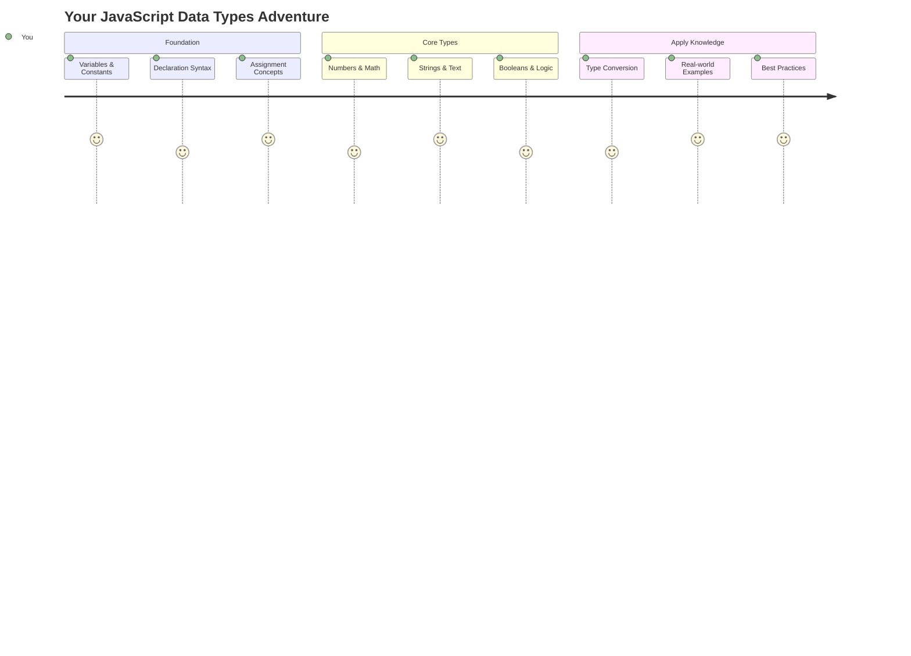
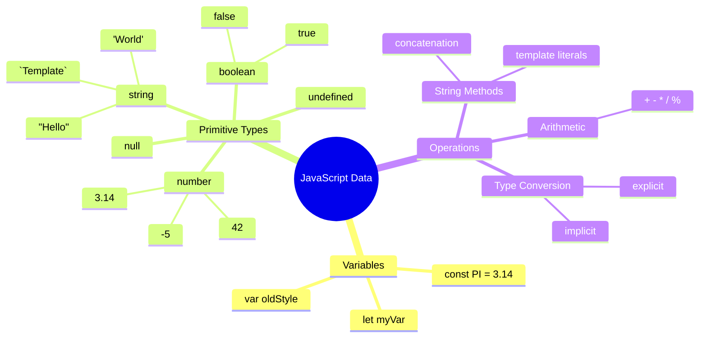
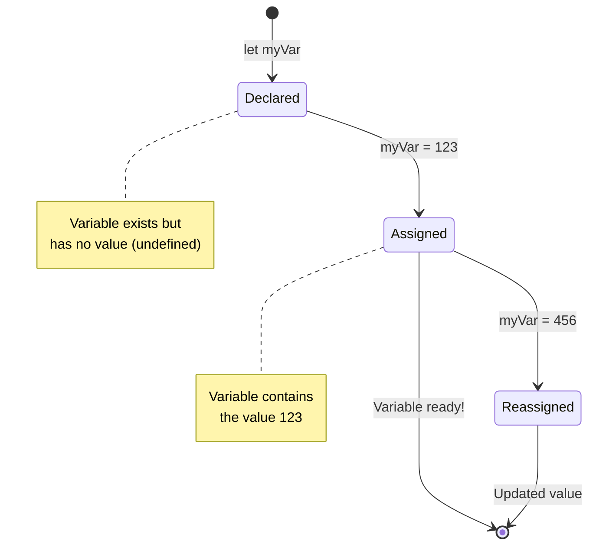
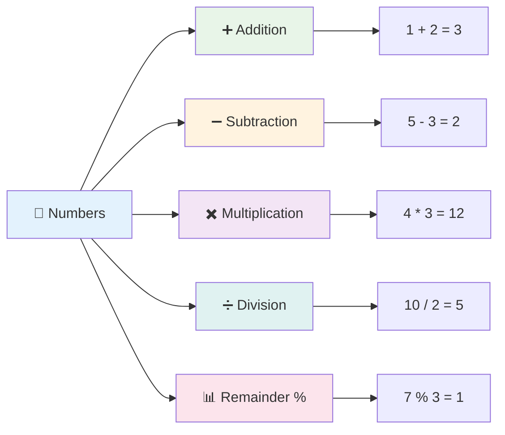
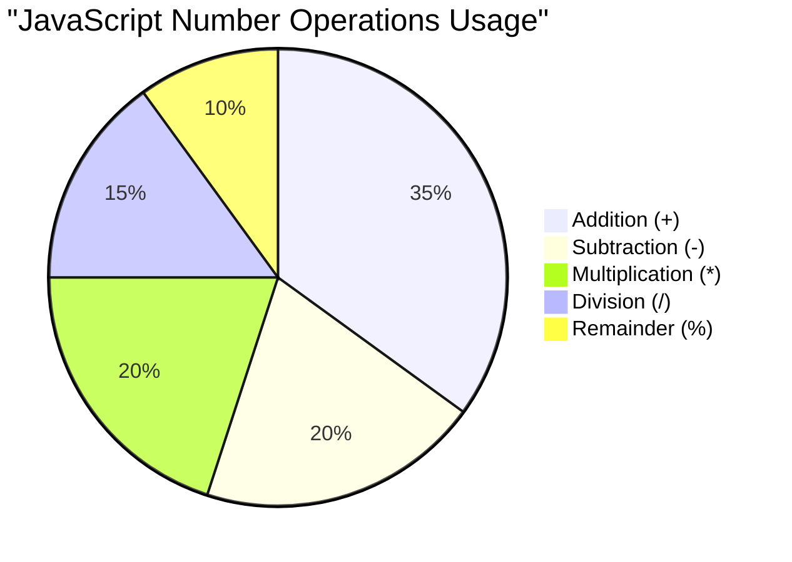
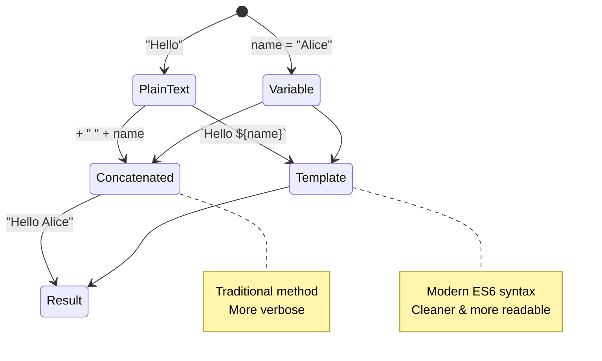
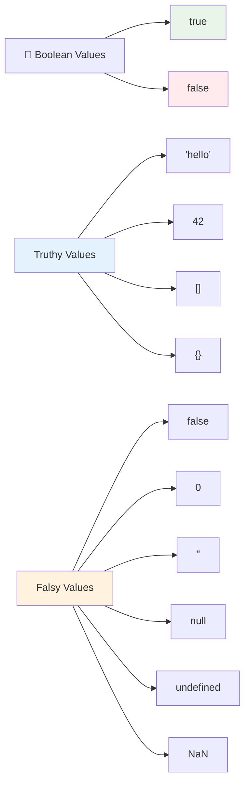
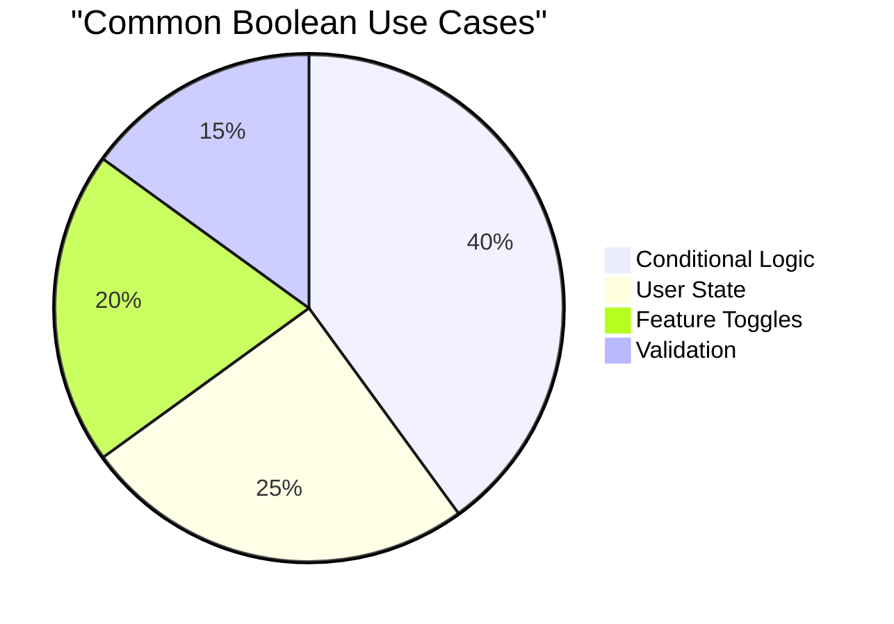
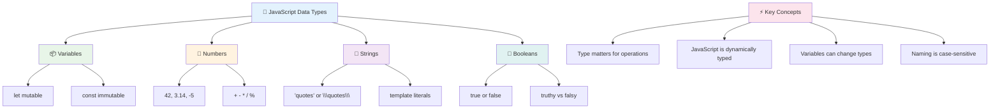
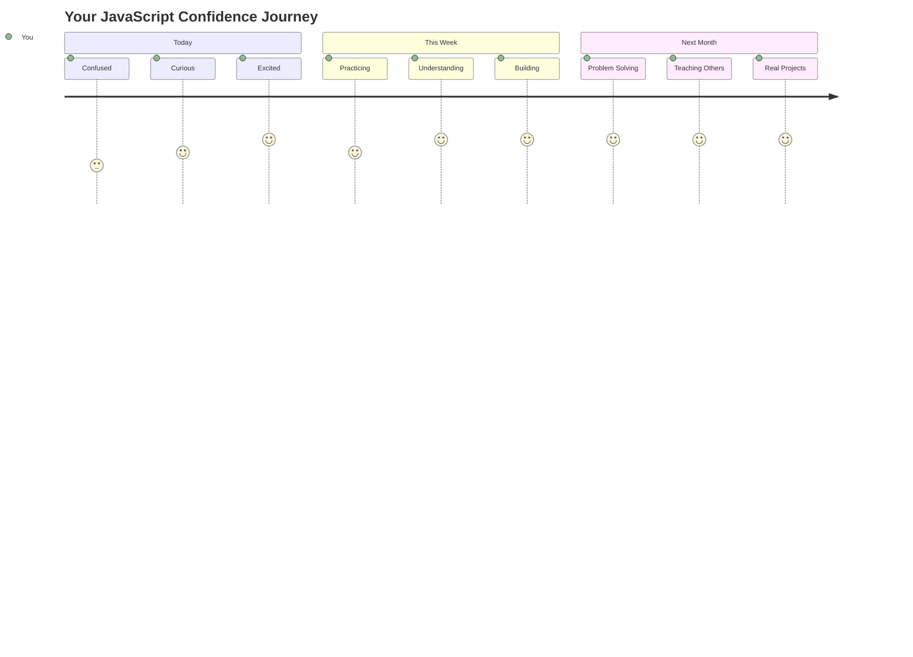

# জাভাস্ক্রিপ্টের বুনিয়াদি: ডেটা টাইপ


> স্কেচনোট করেছেন [Tomomi Imura](https://twitter.com/girlie_mac)



ডেটা টাইপ জাভাস্ক্রিপ্টের একটি মৌলিক ধারণা যা আপনি প্রতিটি প্রোগ্রামে পাবেন। ডেটা টাইপকে প্রাচীন আলেকজান্দ্রিয়ার গ্রন্থাগারিকদের ফাইলিং সিস্টেমের মতো ভাবুন – তারা কবিতা, গণিত এবং ঐতিহাসিক নথির জন্য নির্দিষ্ট জায়গা রাখতেন। জাভাস্ক্রিপ্টও তথ্যকে একইভাবে বিভিন্ন শ্রেণিতে সংগঠিত করে।

এই পাঠে আমরা জাভাস্ক্রিপ্টের মূল ডেটা টাইপগুলো নিয়ে আলোচনা করব। আপনি শিখবেন কীভাবে সংখ্যা, টেক্সট, সত্য/মিথ্যা মান পরিচালনা করতে হয় এবং কেন সঠিক টাইপ নির্বাচন করা আপনার প্রোগ্রামের জন্য গুরুত্বপূর্ণ। প্রথমে এই ধারণাগুলো একটু কঠিন মনে হতে পারে, কিন্তু অনুশীলনের মাধ্যমে এগুলো সহজ হয়ে যাবে।

ডেটা টাইপ বুঝতে পারলে জাভাস্ক্রিপ্টের অন্যান্য বিষয় অনেক পরিষ্কার হয়ে যাবে। যেমন স্থপতিরা ক্যাথেড্রাল নির্মাণের আগে বিভিন্ন নির্মাণ সামগ্রী সম্পর্কে জানতে হয়, তেমনি এই বুনিয়াদি বিষয়গুলো আপনার ভবিষ্যৎ নির্মাণের ভিত্তি তৈরি করবে।

## প্রি-লেকচার কুইজ
[প্রি-লেকচার কুইজ](https://ff-quizzes.netlify.app/web/)

এই পাঠে জাভাস্ক্রিপ্টের বুনিয়াদি বিষয়গুলো আলোচনা করা হয়েছে, যা ওয়েবের ইন্টারঅ্যাক্টিভিটি প্রদান করে।

> আপনি এই পাঠটি [Microsoft Learn](https://docs.microsoft.com/learn/modules/web-development-101-variables/?WT.mc_id=academic-77807-sagibbon) এ নিতে পারেন!

[](https://youtube.com/watch?v=JNIXfGiDWM8 "জাভাস্ক্রিপ্টে ভ্যারিয়েবল")

[](https://youtube.com/watch?v=AWfA95eLdq8 "জাভাস্ক্রিপ্টে ডেটা টাইপ")

> 🎥 উপরের ছবিগুলোতে ক্লিক করুন ভ্যারিয়েবল এবং ডেটা টাইপ নিয়ে ভিডিও দেখার জন্য

চলুন ভ্যারিয়েবল এবং তাদের মধ্যে থাকা ডেটা টাইপ দিয়ে শুরু করি!



## ভ্যারিয়েবল

ভ্যারিয়েবল প্রোগ্রামিংয়ের একটি মৌলিক উপাদান। মধ্যযুগের আলকেমিস্টরা যেমন লেবেলযুক্ত জারে বিভিন্ন পদার্থ সংরক্ষণ করতেন, ভ্যারিয়েবল আপনাকে তথ্য সংরক্ষণ করতে এবং একটি বর্ণনামূলক নাম দিতে সাহায্য করে যাতে আপনি পরে এটি ব্যবহার করতে পারেন। কারো বয়স মনে রাখতে হবে? `age` নামে একটি ভ্যারিয়েবল তৈরি করুন। ব্যবহারকারীর নাম ট্র্যাক করতে চান? `userName` নামে একটি ভ্যারিয়েবল ব্যবহার করুন।

আমরা জাভাস্ক্রিপ্টে ভ্যারিয়েবল তৈরি করার আধুনিক পদ্ধতির উপর ফোকাস করব। এখানে আপনি যে কৌশলগুলো শিখবেন তা ভাষার বিবর্তন এবং প্রোগ্রামিং কমিউনিটির সেরা অভ্যাসের প্রতিনিধিত্ব করে।

ভ্যারিয়েবল তৈরি এবং **ডিক্লেয়ার** করার সিনট্যাক্স হলো **[keyword] [name]**। এটি দুটি অংশ নিয়ে গঠিত:

- **কীওয়ার্ড**। পরিবর্তনশীল ভ্যারিয়েবলের জন্য `let` ব্যবহার করুন, অথবা স্থায়ী মানের জন্য `const` ব্যবহার করুন।
- **ভ্যারিয়েবলের নাম**, এটি একটি বর্ণনামূলক নাম যা আপনি নিজে নির্বাচন করেন।

✅ ES6-এ `let` কীওয়ার্ডটি পরিচিত হয় এবং এটি আপনার ভ্যারিয়েবলকে একটি _ব্লক স্কোপ_ দেয়। `let` বা `const` ব্যবহার করার পরামর্শ দেওয়া হয়, পুরনো `var` কীওয়ার্ডের পরিবর্তে। আমরা ভবিষ্যৎ অংশে ব্লক স্কোপ নিয়ে আরও বিস্তারিত আলোচনা করব।

### কাজ - ভ্যারিয়েবল নিয়ে কাজ করা

1. **একটি ভ্যারিয়েবল ডিক্লেয়ার করুন**। চলুন আমাদের প্রথম ভ্যারিয়েবল তৈরি করি:

    ```javascript
    let myVariable;
    ```

   **এটি কী অর্জন করে:**
   - এটি জাভাস্ক্রিপ্টকে `myVariable` নামে একটি স্টোরেজ লোকেশন তৈরি করতে বলে
   - জাভাস্ক্রিপ্ট এই ভ্যারিয়েবলের জন্য মেমোরিতে জায়গা বরাদ্দ করে
   - ভ্যারিয়েবলের বর্তমানে কোনো মান নেই (undefined)

2. **এতে একটি মান দিন**। এখন আমাদের ভ্যারিয়েবলে কিছু রাখি:

    ```javascript
    myVariable = 123;
    ```

   **অ্যাসাইনমেন্ট কীভাবে কাজ করে:**
   - `=` অপারেটর আমাদের ভ্যারিয়েবলে 123 মান অ্যাসাইন করে
   - ভ্যারিয়েবল এখন এই মানটি ধারণ করে, undefined নয়
   - আপনি আপনার কোডে `myVariable` ব্যবহার করে এই মানটি রেফার করতে পারেন

   > নোট: এই পাঠে `=` ব্যবহার করা মানে আমরা একটি "অ্যাসাইনমেন্ট অপারেটর" ব্যবহার করছি, যা একটি ভ্যারিয়েবলে মান সেট করতে ব্যবহৃত হয়। এটি সমতা নির্দেশ করে না।

3. **স্মার্ট উপায়ে করুন**। আসলে, চলুন এই দুটি ধাপ একসাথে করি:

    ```javascript
    let myVariable = 123;
    ```

    **এই পদ্ধতি আরও কার্যকর:**
    - আপনি এক বিবৃতিতে ভ্যারিয়েবল ডিক্লেয়ার এবং মান অ্যাসাইন করছেন
    - এটি ডেভেলপারদের মধ্যে স্ট্যান্ডার্ড প্র্যাকটিস
    - এটি কোডের দৈর্ঘ্য কমায় এবং স্পষ্টতা বজায় রাখে

4. **মত পরিবর্তন করুন**। যদি আমরা অন্য একটি সংখ্যা সংরক্ষণ করতে চাই?

   ```javascript
   myVariable = 321;
   ```

   **রিঅ্যাসাইনমেন্ট বুঝুন:**
   - ভ্যারিয়েবল এখন 321 ধারণ করে, 123 নয়
   - পূর্বের মানটি প্রতিস্থাপিত হয় – ভ্যারিয়েবল একবারে শুধুমাত্র একটি মান সংরক্ষণ করে
   - এটি `let` দিয়ে ডিক্লেয়ার করা ভ্যারিয়েবলের একটি মূল বৈশিষ্ট্য

   ✅ চেষ্টা করুন! আপনি আপনার ব্রাউজারেই জাভাস্ক্রিপ্ট লিখতে পারেন। একটি ব্রাউজার উইন্ডো খুলুন এবং ডেভেলপার টুলে যান। কনসোলে একটি প্রম্পট পাবেন; সেখানে `let myVariable = 123` টাইপ করুন, এন্টার চাপুন, তারপর `myVariable` টাইপ করুন। কী ঘটে? নোট করুন, আপনি এই ধারণাগুলো পরবর্তী পাঠে আরও শিখবেন।

### 🧠 **ভ্যারিয়েবল মাস্টারি চেক: আরামদায়ক হওয়া**

**চলুন দেখি আপনি ভ্যারিয়েবল নিয়ে কতটা আত্মবিশ্বাসী:**
- আপনি কি ডিক্লেয়ার এবং অ্যাসাইনমেন্টের পার্থক্য ব্যাখ্যা করতে পারেন?
- যদি আপনি একটি ভ্যারিয়েবল ডিক্লেয়ার করার আগে ব্যবহার করতে চান, তাহলে কী হবে?
- আপনি কখন `let` এর পরিবর্তে `const` ব্যবহার করবেন?



> **দ্রুত টিপস**: ভ্যারিয়েবলকে লেবেলযুক্ত স্টোরেজ বক্স হিসেবে ভাবুন। আপনি বক্স তৈরি করেন (`let`), এতে কিছু রাখেন (`=`), এবং পরে প্রয়োজন হলে এর বিষয়বস্তু পরিবর্তন করতে পারেন!

## কনস্ট্যান্ট

কখনও কখনও আপনাকে এমন তথ্য সংরক্ষণ করতে হয় যা প্রোগ্রাম চলাকালীন কখনও পরিবর্তন করা উচিত নয়। কনস্ট্যান্টকে প্রাচীন গ্রিসের ইউক্লিডের প্রতিষ্ঠিত গাণিতিক নীতিগুলোর মতো ভাবুন – একবার প্রমাণিত এবং নথিভুক্ত হলে, সেগুলো ভবিষ্যতের জন্য স্থায়ী থাকে।

কনস্ট্যান্ট ভ্যারিয়েবলের মতো কাজ করে, তবে একটি গুরুত্বপূর্ণ সীমাবদ্ধতা রয়েছে: একবার আপনি এর মান অ্যাসাইন করলে, এটি আর পরিবর্তন করা যাবে না। এই অপরিবর্তনশীলতা আপনার প্রোগ্রামের গুরুত্বপূর্ণ মানগুলোকে দুর্ঘটনাজনিত পরিবর্তন থেকে রক্ষা করে।

কনস্ট্যান্ট ডিক্লেয়ার এবং ইনিশিয়ালাইজ করার ধারণা ভ্যারিয়েবলের মতোই, তবে `const` কীওয়ার্ডের ব্যতিক্রম রয়েছে। সাধারণত কনস্ট্যান্টগুলো সব বড় অক্ষরে ডিক্লেয়ার করা হয়।

```javascript
const MY_VARIABLE = 123;
```

**এই কোডটি যা করে:**
- **একটি কনস্ট্যান্ট তৈরি করে** `MY_VARIABLE` নামে যার মান 123
- **বড় অক্ষরের নামকরণ পদ্ধতি ব্যবহার করে** কনস্ট্যান্টের জন্য
- **ভবিষ্যতে এই মান পরিবর্তন প্রতিরোধ করে**

কনস্ট্যান্টের দুটি প্রধান নিয়ম রয়েছে:

- **আপনাকে সঙ্গে সঙ্গে একটি মান দিতে হবে** – খালি কনস্ট্যান্ট অনুমোদিত নয়!
- **আপনি কখনও এই মান পরিবর্তন করতে পারবেন না** – যদি চেষ্টা করেন, জাভাস্ক্রিপ্ট একটি ত্রুটি দেখাবে। চলুন দেখি এর অর্থ কী:

   **সাধারণ মান** - নিচেরটি অনুমোদিত নয়:
   
      ```javascript
      const PI = 3;
      PI = 4; // অনুমোদিত নয়
      ```

   **যা মনে রাখতে হবে:**
   - **পুনরায় অ্যাসাইন করার চেষ্টা** করলে ত্রুটি হবে
   - **গুরুত্বপূর্ণ মানগুলোকে রক্ষা করে** দুর্ঘটনাজনিত পরিবর্তন থেকে
   - **প্রোগ্রামের মধ্যে মানের সামঞ্জস্য নিশ্চিত করে**
 
   **অবজেক্ট রেফারেন্স সুরক্ষিত** - নিচেরটি অনুমোদিত নয়:
   
      ```javascript
      const obj = { a: 3 };
      obj = { b: 5 } // অনুমোদিত নয়
      ```

   **এই ধারণাগুলো বুঝুন:**
   - **পুরো অবজেক্ট প্রতিস্থাপন প্রতিরোধ করে**
   - **মূল অবজেক্টের রেফারেন্স রক্ষা করে**
   - **মেমোরিতে অবজেক্টের পরিচয় বজায় রাখে**

    **অবজেক্টের মান সুরক্ষিত নয়** - নিচেরটি অনুমোদিত:
    
      ```javascript
      const obj = { a: 3 };
      obj.a = 5;  // অনুমোদিত
      ```

      **এখানে যা ঘটে:**
      - **অবজেক্টের প্রপার্টি মান পরিবর্তন করে**
      - **একই অবজেক্ট রেফারেন্স বজায় রাখে**
      - **দেখায় যে অবজেক্টের বিষয়বস্তু পরিবর্তন হতে পারে, যদিও রেফারেন্স স্থায়ী থাকে**

   > নোট, একটি `const` মানে রেফারেন্সটি পুনরায় অ্যাসাইনমেন্ট থেকে সুরক্ষিত। তবে মানটি _অপরিবর্তনশীল_ নয় এবং এটি পরিবর্তন হতে পারে, বিশেষত যদি এটি একটি জটিল কাঠামো যেমন অবজেক্ট হয়।

## ডেটা টাইপ

জাভাস্ক্রিপ্ট তথ্যকে বিভিন্ন শ্রেণিতে সংগঠিত করে, যাকে ডেটা টাইপ বলা হয়। এই ধারণাটি প্রাচীন পণ্ডিতদের জ্ঞান শ্রেণিবদ্ধ করার পদ্ধতির মতো – অ্যারিস্টটল বিভিন্ন ধরনের যুক্তি আলাদা করেছিলেন, কারণ তিনি জানতেন যে কবিতা, গণিত এবং প্রাকৃতিক দর্শনের জন্য একই যুক্তি প্রয়োগ করা যায় না।

ডেটা টাইপ গুরুত্বপূর্ণ কারণ বিভিন্ন অপারেশন বিভিন্ন ধরনের তথ্যের সাথে কাজ করে। যেমন আপনি কারো নামের উপর গাণিতিক হিসাব করতে পারবেন না বা একটি গাণিতিক সমীকরণকে বর্ণানুক্রমিকভাবে সাজাতে পারবেন না, তেমনি জাভাস্ক্রিপ্ট প্রতিটি অপারেশনের জন্য সঠিক ডেটা টাইপ প্রয়োজন। এটি ত্রুটি প্রতিরোধ করে এবং আপনার কোডকে আরও নির্ভরযোগ্য করে তোলে।

ভ্যারিয়েবল বিভিন্ন ধরনের মান সংরক্ষণ করতে পারে, যেমন সংখ্যা এবং টেক্সট। এই বিভিন্ন ধরনের মানকে **ডেটা টাইপ** বলা হয়। ডেটা টাইপ সফটওয়্যার ডেভেলপমেন্টের একটি গুরুত্বপূর্ণ অংশ কারণ এটি ডেভেলপারদের সিদ্ধান্ত নিতে সাহায্য করে যে কোড কীভাবে লেখা উচিত এবং সফটওয়্যার কীভাবে চলবে। তাছাড়া, কিছু ডেটা টাইপের অনন্য বৈশিষ্ট্য রয়েছে যা একটি মানে অতিরিক্ত তথ্য রূপান্তর বা বের করতে সাহায্য করে।

✅ ডেটা টাইপগুলোকে জাভাস্ক্রিপ্ট ডেটা প্রিমিটিভও বলা হয়, কারণ এগুলো ভাষার দ্বারা প্রদত্ত নিম্ন-স্তরের ডেটা টাইপ। জাভাস্ক্রিপ্টে ৭টি প্রিমিটিভ ডেটা টাইপ রয়েছে: string, number, bigint, boolean, undefined, null এবং symbol। এক মিনিট সময় নিয়ে ভাবুন, এই প্রিমিটিভগুলো কী প্রতিনিধিত্ব করে। একটি `zebra` কী? `0` কী? `true` কী?

### সংখ্যা

সংখ্যা জাভাস্ক্রিপ্টের সবচেয়ে সরল ডেটা টাইপ। আপনি পুরো সংখ্যা যেমন 42, দশমিক সংখ্যা যেমন 3.14, বা ঋণাত্মক সংখ্যা যেমন -5 নিয়ে কাজ করুন, জাভাস্ক্রিপ্ট এগুলোকে একইভাবে পরিচালনা করে।

আমাদের আগের ভ্যারিয়েবলটি মনে আছে? আমরা যে 123 সংরক্ষণ করেছিলাম, সেটি আসলে একটি সংখ্যা ডেটা টাইপ ছিল:

```javascript
let myVariable = 123;
```

**মূল বৈশিষ্ট্য:**
- জাভাস্ক্রিপ্ট স্বয়ংক্রিয়ভাবে সংখ্যাকে চিনতে পারে
- আপনি এই ভ্যারিয়েবল দিয়ে গাণিতিক অপারেশন করতে পারেন
- কোনো স্পষ্ট টাইপ ডিক্লেয়ার করার প্রয়োজন নেই

ভ্যারিয়েবল সব ধরনের সংখ্যা সংরক্ষণ করতে পারে, যেমন দশমিক বা ঋণাত্মক সংখ্যা। সংখ্যা গাণিতিক অপারেটরের সাথে ব্যবহার করা যায়, যা [পরবর্তী অংশে](../../../../2-js-basics/1-data-types) আলোচনা করা হয়েছে।



### গাণিতিক অপারেটর

গাণিতিক অপারেটর আপনাকে জাভাস্ক্রিপ্টে গাণিতিক হিসাব করতে সাহায্য করে। এই অপারেটরগুলো সেই একই নীতিগুলো অনুসরণ করে যা শতাব্দী ধরে গণিতবিদরা ব্যবহার করেছেন – একই প্রতীক যা আল-খাওয়ারিজমির মতো পণ্ডিতদের কাজেও দেখা যায়, যিনি বীজগণিতের নোটেশন তৈরি করেছিলেন।

অপারেটরগুলো ঐতিহ্যবাহী গণিতের মতো কাজ করে: যোগের জন্য প্লাস, বিয়োগের জন্য মাইনাস, ইত্যাদি।

গাণিতিক ফাংশন করার সময় ব্যবহৃত কিছু অপারেটরের তালিকা এখানে দেওয়া হলো:

| প্রতীক | বিবরণ                                                                 | উদাহরণ                          |
| ------ | --------------------------------------------------------------------- | -------------------------------- |
| `+`    | **যোগ**: দুটি সংখ্যার যোগফল গণনা করে                                 | `1 + 2 //প্রত্যাশিত উত্তর 3`    |
| `-`    | **বিয়োগ**: দুটি সংখ্যার পার্থক্য গণনা করে                            | `1 - 2 //প্রত্যাশিত উত্তর -1`   |
| `*`    | **গুণ**: দুটি সংখ্যার গুণফল গণনা করে                                 | `1 * 2 //প্রত্যাশিত উত্তর 2`    |
| `/`    | **ভাগ**: দুটি সংখ্যার ভাগফল গণনা করে                                 | `1 / 2 //প্রত্যাশিত উত্তর 0.5`  |
| `%`    | **অবশিষ্টাংশ**: দুটি সংখ্যার ভাগফল থেকে অবশিষ্টাংশ গণনা করে         | `1 % 2 //প্রত্যাশিত উত্তর 1`    |

✅ চেষ্টা করুন! আপনার ব্রাউজারের কনসোলে একটি গাণিতিক অপারেশন চেষ্টা করুন। ফলাফল দেখে কি আপনি অবাক হয়েছেন?

### 🧮 **গাণিতিক দক্ষতা চেক: আত্মবিশ্বাসের সাথে গণনা**

**আপনার গাণিতিক ধারণা পরীক্ষা করুন:**
- `/` (ভাগ) এবং `%` (অবশিষ্টাংশ) এর মধ্যে পার্থক্য কী?
- আপনি কি অনুমান করতে পারেন `10 % 3` এর মান কী হবে? (ইঙ্গিত: এটি 3.33 নয়...)
- প্রোগ্রামিংয়ে অবশিষ্টাংশ অপারেটর কেন উপকারী হতে পারে?



> **বাস্তব জীবনের অন্তর্দৃষ্টি**: অবশিষ্টাংশ অপারেটর (%) খুবই উপকারী সংখ্যা জোড়/বিজোড় চেক করতে, প্যাটার্ন তৈরি করতে, বা অ্যারে ঘুরিয়ে দেখতে!

### স্ট্রিং

জাভাস্ক্রিপ্টে টেক্সট ডেটা স্ট্রিং হিসেবে উপস্থাপিত হয়। "স্ট্রিং" শব্দটি চরিত্রগুলোকে একসাথে সংযুক্ত করার ধারণা থেকে এসেছে, যেমন মধ্যযুগের মঠের লেখকরা তাদের পাণ্ডুলিপিতে শব্দ এবং বাক্য তৈরি করতে অক্ষরগুলোকে সংযুক্ত করতেন।

স্ট্রিং ওয়েব ডেভেলপমেন্টের একটি মৌলিক বিষয়। একটি ওয়েবসাইটে প্রদর্শিত প্রতিটি টেক্সট – ব্যবহারকারীর নাম, বোতামের লেবেল, ত্রুটির বার্তা, কন্টেন্ট – স্ট্রিং ডেটা হিসেবে পরিচালিত হয়। স্ট্রিং বুঝতে পারা কার্যকরী ব্যবহারকারী ইন্টারফেস তৈরি করার জন্য অপরিহার্য।

স্ট্রিং হলো অক্ষরের সেট যা একক বা দ্বৈত উদ্ধৃতির মধ্যে থাকে।

```javascript
'This is a string'
"This is also a string"
let myString = 'This is a string value stored in a variable';
```

**এই ধারণাগুলো বুঝুন:**
- **একক উদ্ধৃতি `'` বা দ্বৈত উদ্ধৃতি `"` ব্যবহার করে** স্ট্রিং সংজ্ঞায়িত করে
- **টেক্সট ডেটা সংরক্ষণ করে** যা অক্ষর, সংখ্যা এবং প্রতীক অন্ত
দুই বা তার বেশি স্ট্রিং **একত্রিত** করতে বা একসাথে যোগ করতে, `+` অপারেটর ব্যবহার করুন।

```javascript
let myString1 = "Hello";
let myString2 = "World";

myString1 + myString2 + "!"; //HelloWorld!
myString1 + " " + myString2 + "!"; //Hello World!
myString1 + ", " + myString2 + "!"; //Hello, World!
```

**ধাপে ধাপে যা ঘটছে:**
- **একত্রিত করে** একাধিক স্ট্রিং `+` অপারেটর ব্যবহার করে
- **যোগ করে** স্ট্রিংগুলোকে সরাসরি একসাথে, প্রথম উদাহরণে কোনো স্পেস ছাড়াই
- **স্পেস যোগ করে** `" "` স্ট্রিংগুলোর মধ্যে পাঠযোগ্যতার জন্য
- **যথাযথ ফরম্যাটিং তৈরি করতে** কমার মতো বিরামচিহ্ন যোগ করে

✅ কেন `1 + 1 = 2` জাভাস্ক্রিপ্টে, কিন্তু `'1' + '1' = 11?` চিন্তা করুন। `'1' + 1` এর ক্ষেত্রে কী হয়?

**টেমপ্লেট লিটারাল** স্ট্রিং ফরম্যাট করার আরেকটি উপায়, যেখানে কোটসের পরিবর্তে ব্যাকটিক ব্যবহার করা হয়। সাধারণ টেক্সট ছাড়া অন্য কিছু প্লেসহোল্ডার `${ }` এর মধ্যে রাখতে হয়। এর মধ্যে স্ট্রিং হতে পারে এমন কোনো ভ্যারিয়েবলও অন্তর্ভুক্ত।

```javascript
let myString1 = "Hello";
let myString2 = "World";

`${myString1} ${myString2}!` //Hello World!
`${myString1}, ${myString2}!` //Hello, World!
```

**প্রতিটি অংশ বুঝি:**
- **ব্যাকটিক ব্যবহার করে** `` ` `` সাধারণ কোটসের পরিবর্তে টেমপ্লেট লিটারাল তৈরি করতে
- **ভ্যারিয়েবল সরাসরি এম্বেড করে** `${}` প্লেসহোল্ডার সিনট্যাক্স ব্যবহার করে
- **স্পেস এবং ফরম্যাটিং ঠিক রাখে** যেমন লেখা হয়েছে
- **একটি পরিষ্কার উপায় প্রদান করে** ভ্যারিয়েবলসহ জটিল স্ট্রিং তৈরি করতে

আপনার ফরম্যাটিং লক্ষ্য অর্জন করতে আপনি যেকোনো পদ্ধতি ব্যবহার করতে পারেন, তবে টেমপ্লেট লিটারাল স্পেস এবং লাইন ব্রেককে সম্মান করে।

✅ কখন আপনি টেমপ্লেট লিটারাল ব্যবহার করবেন এবং কখন সাধারণ স্ট্রিং ব্যবহার করবেন?

### 🔤 **স্ট্রিং দক্ষতা পরীক্ষা: টেক্সট ম্যানিপুলেশন আত্মবিশ্বাস**

**আপনার স্ট্রিং দক্ষতা মূল্যায়ন করুন:**
- কেন `'1' + '1'` `'11'` হয় `2` এর পরিবর্তে, ব্যাখ্যা করতে পারেন?
- কোন স্ট্রিং পদ্ধতি আপনার কাছে বেশি পাঠযোগ্য মনে হয়: কনক্যাটেনেশন না টেমপ্লেট লিটারাল?
- যদি স্ট্রিংয়ের চারপাশে কোটস দিতে ভুলে যান, তাহলে কী হবে?



> **প্রো টিপ**: জটিল স্ট্রিং তৈরি করার জন্য সাধারণত টেমপ্লেট লিটারাল ব্যবহার করা হয় কারণ এগুলো বেশি পাঠযোগ্য এবং বহু-লাইন স্ট্রিং সুন্দরভাবে পরিচালনা করে!

### বুলিয়ান

বুলিয়ান হলো সবচেয়ে সহজ ডেটা ফর্ম: এটি শুধুমাত্র দুটি মান ধারণ করতে পারে – `true` বা `false`। এই বাইনারি লজিক সিস্টেম ১৯ শতকের গণিতবিদ জর্জ বুলের কাজ থেকে উদ্ভূত, যিনি বুলিয়ান অ্যালজেব্রা তৈরি করেছিলেন।

তাদের সরলতার পরেও, বুলিয়ান প্রোগ্রাম লজিকের জন্য অত্যন্ত গুরুত্বপূর্ণ। এগুলো আপনার কোডকে শর্তের ভিত্তিতে সিদ্ধান্ত নিতে সক্ষম করে – ব্যবহারকারী লগ ইন করেছেন কিনা, কোনো বোতাম ক্লিক করা হয়েছে কিনা, বা নির্দিষ্ট মানদণ্ড পূরণ হয়েছে কিনা।

বুলিয়ান শুধুমাত্র দুটি মান ধারণ করতে পারে: `true` বা `false`। বুলিয়ান শর্ত পূরণ হলে কোন লাইন কোড চলবে তা নির্ধারণ করতে সাহায্য করে। অনেক ক্ষেত্রে, [অপারেটর](../../../../2-js-basics/1-data-types) বুলিয়ানের মান সেট করতে সাহায্য করে এবং আপনি প্রায়ই ভ্যারিয়েবল ইনিশিয়ালাইজ বা তাদের মান অপারেটর দিয়ে আপডেট করতে দেখবেন।

```javascript
let myTrueBool = true;
let myFalseBool = false;
```

**উপরের উদাহরণে আমরা:**
- **একটি ভ্যারিয়েবল তৈরি করেছি** যা বুলিয়ান মান `true` সংরক্ষণ করে
- **প্রদর্শন করেছি** কীভাবে বুলিয়ান মান `false` সংরক্ষণ করা যায়
- **সঠিক কীওয়ার্ড ব্যবহার করেছি** `true` এবং `false` (কোনো কোটস প্রয়োজন নেই)
- **এই ভ্যারিয়েবলগুলো প্রস্তুত করেছি** শর্তমূলক বিবৃতিতে ব্যবহারের জন্য

✅ একটি ভ্যারিয়েবলকে 'truthy' বিবেচনা করা যেতে পারে যদি এটি বুলিয়ান `true` হিসেবে মূল্যায়িত হয়। মজার বিষয় হলো, জাভাস্ক্রিপ্টে [সব মান truthy, যদি তা falsy হিসেবে সংজ্ঞায়িত না হয়](https://developer.mozilla.org/docs/Glossary/Truthy)।



### 🎯 **বুলিয়ান লজিক পরীক্ষা: সিদ্ধান্ত গ্রহণ দক্ষতা**

**আপনার বুলিয়ান বোঝাপড়া পরীক্ষা করুন:**
- কেন আপনি মনে করেন জাভাস্ক্রিপ্টে `true` এবং `false` ছাড়াও "truthy" এবং "falsy" মান আছে?
- আপনি কি অনুমান করতে পারেন কোনটি falsy: `0`, `"0"`, `[]`, `"false"`?
- কীভাবে বুলিয়ান প্রোগ্রামের প্রবাহ নিয়ন্ত্রণে সহায়ক হতে পারে?



> **মনে রাখুন**: জাভাস্ক্রিপ্টে শুধুমাত্র ৬টি মান falsy: `false`, `0`, `""`, `null`, `undefined`, এবং `NaN`। বাকিগুলো সব truthy!

---

## 📊 **আপনার ডেটা টাইপ টুলকিট সারসংক্ষেপ**



## GitHub Copilot Agent Challenge 🚀

Agent মোড ব্যবহার করে নিম্নলিখিত চ্যালেঞ্জ সম্পন্ন করুন:

**বর্ণনা:** একটি ব্যক্তিগত তথ্য ব্যবস্থাপক তৈরি করুন যা এই পাঠে শেখা সমস্ত জাভাস্ক্রিপ্ট ডেটা টাইপ প্রদর্শন করে এবং বাস্তব জীবনের ডেটা পরিস্থিতি পরিচালনা করে।

**প্রম্পট:** একটি জাভাস্ক্রিপ্ট প্রোগ্রাম তৈরি করুন যা একটি ব্যবহারকারীর প্রোফাইল অবজেক্ট তৈরি করে, যেখানে থাকবে: ব্যক্তির নাম (স্ট্রিং), বয়স (নাম্বার), ছাত্র অবস্থার স্ট্যাটাস (বুলিয়ান), প্রিয় রঙের একটি অ্যারে, এবং একটি ঠিকানা অবজেক্ট যার মধ্যে থাকবে স্ট্রিট, সিটি, এবং জিপ কোড প্রপার্টি। প্রোফাইল তথ্য প্রদর্শন এবং পৃথক ক্ষেত্র আপডেট করার জন্য ফাংশন অন্তর্ভুক্ত করুন। স্ট্রিং কনক্যাটেনেশন, টেমপ্লেট লিটারাল, বয়সের সাথে গাণিতিক অপারেশন এবং ছাত্র অবস্থার জন্য বুলিয়ান লজিক প্রদর্শন করুন।

Agent মোড সম্পর্কে আরও জানুন [এখানে](https://code.visualstudio.com/blogs/2025/02/24/introducing-copilot-agent-mode)।

## 🚀 চ্যালেঞ্জ

জাভাস্ক্রিপ্টে কিছু আচরণ আছে যা ডেভেলপারদের বিভ্রান্ত করতে পারে। এখানে একটি ক্লাসিক উদাহরণ: আপনার ব্রাউজার কনসোলে এটি টাইপ করুন: `let age = 1; let Age = 2; age == Age` এবং ফলাফল পর্যবেক্ষণ করুন। এটি `false` ফেরত দেয় – আপনি কেন তা নির্ধারণ করতে পারেন?

এটি অনেক জাভাস্ক্রিপ্ট আচরণের মধ্যে একটি যা বোঝা গুরুত্বপূর্ণ। এই অদ্ভুত বিষয়গুলো সম্পর্কে পরিচিতি আপনাকে আরও নির্ভরযোগ্য কোড লিখতে এবং সমস্যাগুলো আরও কার্যকরভাবে ডিবাগ করতে সাহায্য করবে।

## পোস্ট-লেকচার কুইজ
[পোস্ট-লেকচার কুইজ](https://ff-quizzes.netlify.app)

## পর্যালোচনা ও স্ব-অধ্যয়ন

[জাভাস্ক্রিপ্ট এক্সারসাইজের এই তালিকা](https://css-tricks.com/snippets/javascript/) দেখুন এবং একটি চেষ্টা করুন। আপনি কী শিখলেন?

## অ্যাসাইনমেন্ট

[ডেটা টাইপ প্র্যাকটিস](assignment.md)

## 🚀 আপনার জাভাস্ক্রিপ্ট ডেটা টাইপ দক্ষতা টাইমলাইন

### ⚡ **আপনি পরবর্তী ৫ মিনিটে যা করতে পারেন**
- [ ] আপনার ব্রাউজার কনসোলে ৩টি ভিন্ন ডেটা টাইপের ভ্যারিয়েবল তৈরি করুন
- [ ] চ্যালেঞ্জটি চেষ্টা করুন: `let age = 1; let Age = 2; age == Age` এবং কেন এটি false তা বের করুন
- [ ] আপনার নাম এবং প্রিয় নম্বর দিয়ে স্ট্রিং কনক্যাটেনেশন প্র্যাকটিস করুন
- [ ] পরীক্ষা করুন যখন আপনি একটি স্ট্রিংয়ে একটি নম্বর যোগ করেন তখন কী ঘটে

### 🎯 **আপনি এই ঘণ্টায় যা অর্জন করতে পারেন**
- [ ] পোস্ট-লেসন কুইজ সম্পন্ন করুন এবং কোনো বিভ্রান্তিকর ধারণা পর্যালোচনা করুন
- [ ] একটি মিনি ক্যালকুলেটর তৈরি করুন যা দুটি সংখ্যার যোগ, বিয়োগ, গুণ এবং ভাগ করে
- [ ] টেমপ্লেট লিটারাল ব্যবহার করে একটি সাধারণ নাম ফরম্যাটার তৈরি করুন
- [ ] `==` এবং `===` তুলনা অপারেটরের পার্থক্য অন্বেষণ করুন
- [ ] বিভিন্ন ডেটা টাইপের মধ্যে রূপান্তর প্র্যাকটিস করুন

### 📅 **আপনার সপ্তাহব্যাপী জাভাস্ক্রিপ্ট ভিত্তি**
- [ ] আত্মবিশ্বাস এবং সৃজনশীলতার সাথে অ্যাসাইনমেন্ট সম্পন্ন করুন
- [ ] শেখা সমস্ত ডেটা টাইপ ব্যবহার করে একটি ব্যক্তিগত প্রোফাইল অবজেক্ট তৈরি করুন
- [ ] [CSS-Tricks থেকে জাভাস্ক্রিপ্ট এক্সারসাইজ](https://css-tricks.com/snippets/javascript/) দিয়ে প্র্যাকটিস করুন
- [ ] বুলিয়ান লজিক ব্যবহার করে একটি সাধারণ ফর্ম ভ্যালিডেটর তৈরি করুন
- [ ] অ্যারে এবং অবজেক্ট ডেটা টাইপ নিয়ে পরীক্ষা করুন (পরবর্তী পাঠের প্রিভিউ)
- [ ] একটি জাভাস্ক্রিপ্ট কমিউনিটিতে যোগ দিন এবং ডেটা টাইপ সম্পর্কে প্রশ্ন করুন

### 🌟 **আপনার মাসব্যাপী রূপান্তর**
- [ ] বড় প্রোগ্রামিং প্রজেক্টে ডেটা টাইপ জ্ঞান সংযুক্ত করুন
- [ ] বাস্তব অ্যাপ্লিকেশনে প্রতিটি ডেটা টাইপ কখন এবং কেন ব্যবহার করবেন তা বুঝুন
- [ ] অন্য শিক্ষার্থীদের জাভাস্ক্রিপ্টের মৌলিক বিষয়গুলো বুঝতে সাহায্য করুন
- [ ] বিভিন্ন ধরনের ব্যবহারকারীর ডেটা পরিচালনা করে একটি ছোট অ্যাপ্লিকেশন তৈরি করুন
- [ ] টাইপ কোয়েরশন এবং স্ট্রিক্ট ইকুয়ালিটির মতো উন্নত ডেটা টাইপ ধারণা অন্বেষণ করুন
- [ ] ডকুমেন্টেশন উন্নতির মাধ্যমে ওপেন সোর্স জাভাস্ক্রিপ্ট প্রজেক্টে অবদান রাখুন

### 🧠 **ফাইনাল ডেটা টাইপ দক্ষতা চেক-ইন**

**আপনার জাভাস্ক্রিপ্ট ভিত্তি উদযাপন করুন:**
- কোন ডেটা টাইপের আচরণ আপনাকে সবচেয়ে বেশি অবাক করেছে?
- আপনি কতটা আত্মবিশ্বাসী যে আপনি ভ্যারিয়েবল বনাম কনস্ট্যান্ট সম্পর্কে একজন বন্ধুকে ব্যাখ্যা করতে পারবেন?
- জাভাস্ক্রিপ্টের টাইপ সিস্টেম সম্পর্কে আপনি সবচেয়ে আকর্ষণীয় কী আবিষ্কার করেছেন?
- এই মৌলিক বিষয়গুলো দিয়ে আপনি কোন বাস্তব জীবনের অ্যাপ্লিকেশন তৈরি করতে পারেন কল্পনা করুন?



> 💡 **আপনি ভিত্তি তৈরি করেছেন!** ডেটা টাইপ বোঝা গল্প লেখার আগে বর্ণমালা শেখার মতো। আপনি যে কোনো জাভাস্ক্রিপ্ট প্রোগ্রাম লিখবেন তা এই মৌলিক ধারণাগুলো ব্যবহার করবে। এখন আপনার কাছে ইন্টারঅ্যাকটিভ ওয়েবসাইট, ডায়নামিক অ্যাপ্লিকেশন তৈরি এবং কোড দিয়ে বাস্তব জীবনের সমস্যার সমাধান করার জন্য প্রয়োজনীয় উপাদান রয়েছে। জাভাস্ক্রিপ্টের চমৎকার জগতে আপনাকে স্বাগতম! 🎉

---

**অস্বীকৃতি**:  
এই নথিটি AI অনুবাদ পরিষেবা [Co-op Translator](https://github.com/Azure/co-op-translator) ব্যবহার করে অনুবাদ করা হয়েছে। আমরা যথাসাধ্য সঠিকতার জন্য চেষ্টা করি, তবে অনুগ্রহ করে মনে রাখবেন যে স্বয়ংক্রিয় অনুবাদে ত্রুটি বা অসঙ্গতি থাকতে পারে। মূল ভাষায় থাকা নথিটিকে প্রামাণিক উৎস হিসেবে বিবেচনা করা উচিত। গুরুত্বপূর্ণ তথ্যের জন্য, পেশাদার মানব অনুবাদ সুপারিশ করা হয়। এই অনুবাদ ব্যবহারের ফলে কোনো ভুল বোঝাবুঝি বা ভুল ব্যাখ্যা হলে আমরা দায়বদ্ধ থাকব না।