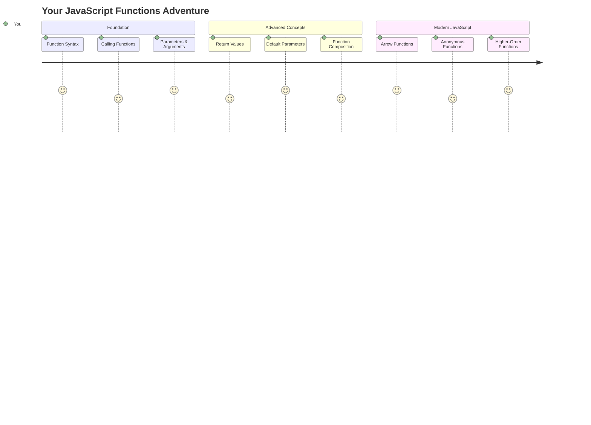
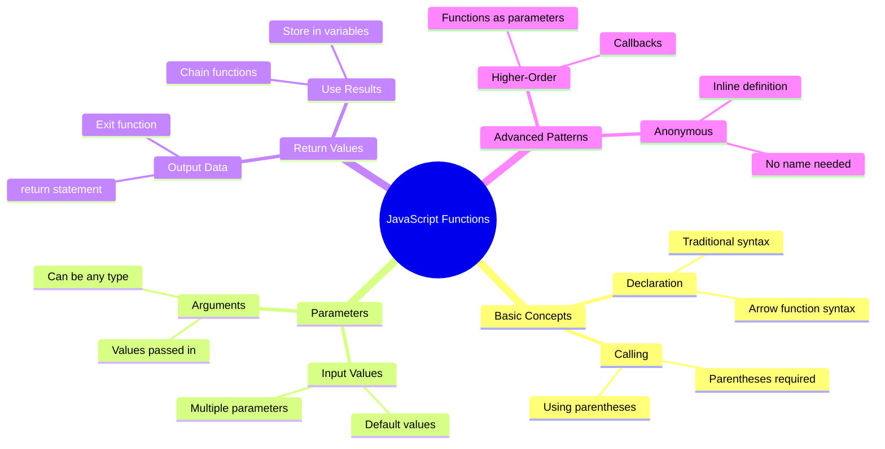
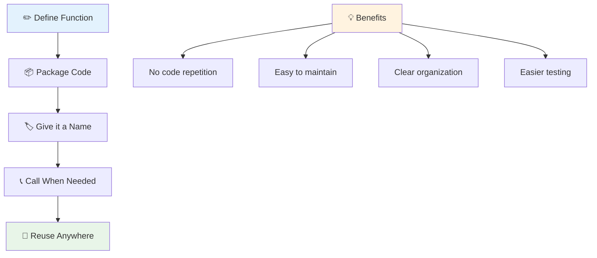
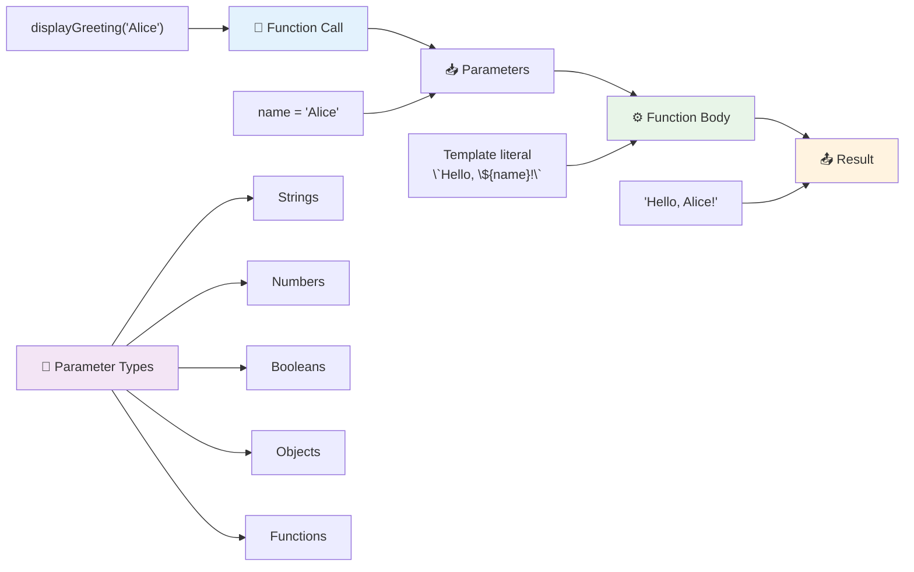
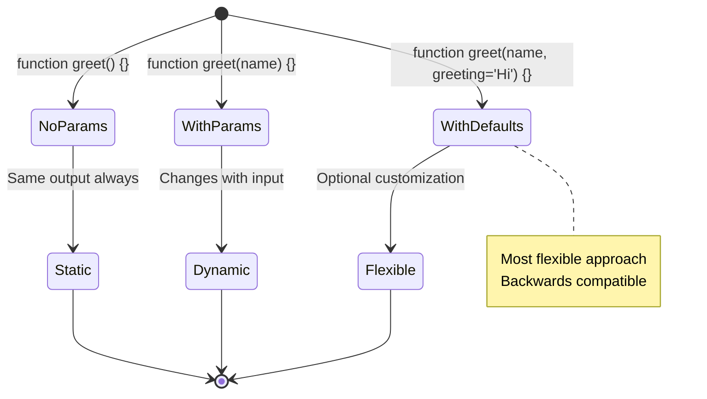
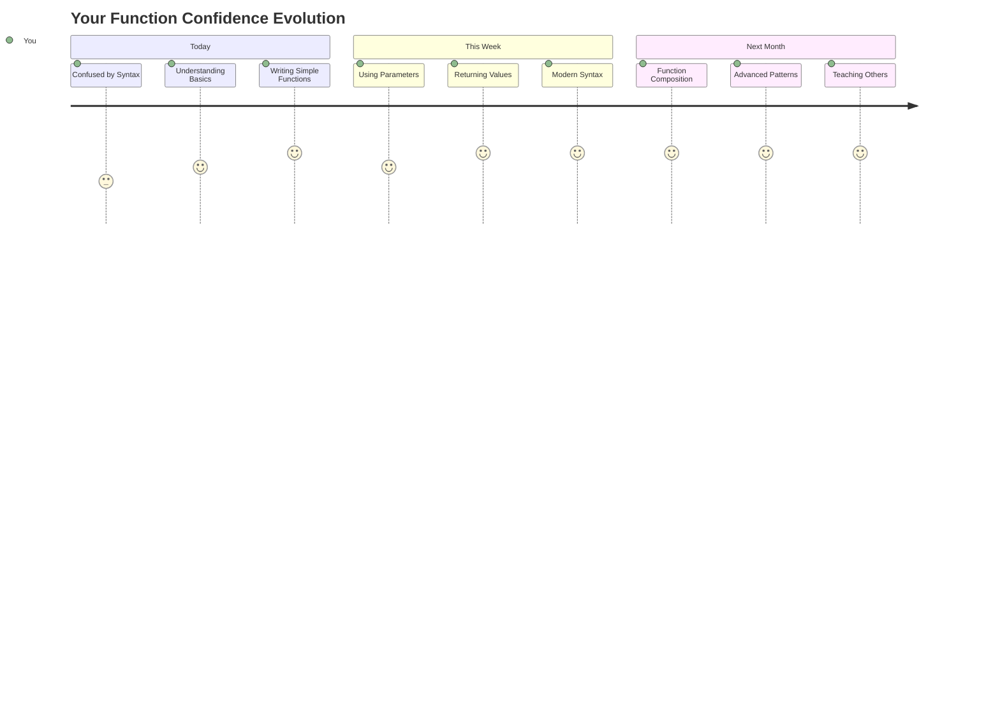

<!--
CO_OP_TRANSLATOR_METADATA:
{
  "original_hash": "71f7d7dafa1c7194d79ddac87f669ff9",
  "translation_date": "2025-11-03T22:22:17+00:00",
  "source_file": "2-js-basics/2-functions-methods/README.md",
  "language_code": "bn"
}
-->
# জাভাস্ক্রিপ্টের বেসিক: মেথড এবং ফাংশন


> স্কেচনোট করেছেন [Tomomi Imura](https://twitter.com/girlie_mac)



## লেকচারের আগে কুইজ
[লেকচারের আগে কুইজ](https://ff-quizzes.netlify.app)

একই কোড বারবার লিখা প্রোগ্রামিংয়ের সবচেয়ে সাধারণ সমস্যাগুলোর একটি। ফাংশন এই সমস্যার সমাধান করে, কারণ এটি কোডকে পুনরায় ব্যবহারযোগ্য ব্লকে প্যাকেজ করতে সাহায্য করে। ফাংশনকে ভাবুন হেনরি ফোর্ডের অ্যাসেম্বলি লাইনের মতো স্ট্যান্ডার্ডাইজড অংশ হিসেবে – একবার আপনি একটি নির্ভরযোগ্য কম্পোনেন্ট তৈরি করলে, সেটি যেখানে প্রয়োজন সেখানে ব্যবহার করতে পারবেন, নতুন করে তৈরি করার দরকার হবে না।

ফাংশন আপনাকে কোডের অংশগুলো একত্রিত করতে সাহায্য করে, যাতে আপনি সেগুলো আপনার প্রোগ্রামের বিভিন্ন জায়গায় পুনরায় ব্যবহার করতে পারেন। একই লজিক বারবার কপি-পেস্ট করার পরিবর্তে, আপনি একবার একটি ফাংশন তৈরি করতে পারেন এবং যখনই প্রয়োজন হয় তখন সেটি কল করতে পারেন। এই পদ্ধতি আপনার কোডকে সংগঠিত রাখে এবং আপডেট করা অনেক সহজ করে তোলে।

এই পাঠে, আপনি শিখবেন কীভাবে নিজের ফাংশন তৈরি করবেন, তথ্য পাস করবেন এবং কার্যকর ফলাফল পাবেন। আপনি ফাংশন এবং মেথডের মধ্যে পার্থক্য বুঝতে পারবেন, আধুনিক সিনট্যাক্স পদ্ধতি শিখবেন এবং দেখবেন কীভাবে ফাংশন অন্য ফাংশনের সাথে কাজ করতে পারে। আমরা এই ধারণাগুলো ধাপে ধাপে তৈরি করব।

[](https://youtube.com/watch?v=XgKsD6Zwvlc "মেথড এবং ফাংশন")

> 🎥 উপরের ছবিতে ক্লিক করুন মেথড এবং ফাংশন সম্পর্কে একটি ভিডিও দেখার জন্য।

> আপনি এই পাঠটি [Microsoft Learn](https://docs.microsoft.com/learn/modules/web-development-101-functions/?WT.mc_id=academic-77807-sagibbon) এ নিতে পারেন!



## ফাংশন

একটি ফাংশন হলো একটি স্বতন্ত্র কোড ব্লক যা একটি নির্দিষ্ট কাজ সম্পন্ন করে। এটি এমন একটি লজিককে অন্তর্ভুক্ত করে যা আপনি যখনই প্রয়োজন মনে করবেন তখনই কার্যকর করতে পারবেন।

আপনার প্রোগ্রামের বিভিন্ন জায়গায় একই কোড বারবার লিখার পরিবর্তে, আপনি এটি একটি ফাংশনে প্যাকেজ করতে পারেন এবং যখনই প্রয়োজন হয় তখন সেই ফাংশনটি কল করতে পারেন। এই পদ্ধতি আপনার কোডকে পরিষ্কার রাখে এবং আপডেট করা অনেক সহজ করে তোলে। কল্পনা করুন, যদি আপনাকে আপনার কোডবেসের ২০টি ভিন্ন স্থানে ছড়িয়ে থাকা লজিক পরিবর্তন করতে হয়, তাহলে কতটা কঠিন হবে।

আপনার ফাংশনগুলোর নামকরণ বর্ণনামূলক হওয়া অত্যন্ত গুরুত্বপূর্ণ। একটি ভালো নামকরণ করা ফাংশন তার উদ্দেশ্য স্পষ্টভাবে প্রকাশ করে – যেমন আপনি যখন `cancelTimer()` দেখেন, তখন আপনি সহজেই বুঝতে পারেন এটি কী করে, ঠিক যেমন একটি স্পষ্টভাবে লেবেলযুক্ত বোতাম আপনাকে বলে দেয় এটি ক্লিক করলে কী হবে।

## ফাংশন তৈরি এবং কল করা

চলুন দেখি কীভাবে একটি ফাংশন তৈরি করা যায়। সিনট্যাক্স একটি নির্দিষ্ট প্যাটার্ন অনুসরণ করে:

```javascript
function nameOfFunction() { // function definition
 // function definition/body
}
```

এটি ভেঙে দেখি:
- `function` কীওয়ার্ডটি জাভাস্ক্রিপ্টকে বলে "এই যে, আমি একটি ফাংশন তৈরি করছি!"
- `nameOfFunction` হলো যেখানে আপনি আপনার ফাংশনকে একটি বর্ণনামূলক নাম দেন
- বন্ধনী `()` হলো যেখানে আপনি প্যারামিটার যোগ করতে পারেন (আমরা শীঘ্রই এটি নিয়ে আলোচনা করব)
- কার্লি ব্রেস `{}` হলো যেখানে ফাংশন কল করার সময় কার্যকর হওয়া কোড থাকে

চলুন একটি সাধারণ অভিবাদন ফাংশন তৈরি করি এবং এটি কীভাবে কাজ করে তা দেখি:

```javascript
function displayGreeting() {
  console.log('Hello, world!');
}
```

এই ফাংশনটি কনসোলে "Hello, world!" প্রিন্ট করে। একবার আপনি এটি সংজ্ঞায়িত করলে, আপনি এটি যতবার প্রয়োজন ততবার ব্যবহার করতে পারবেন।

আপনার ফাংশন কার্যকর করতে (অথবা "কল" করতে), এর নাম লিখুন এবং তারপরে বন্ধনী যোগ করুন। জাভাস্ক্রিপ্ট আপনাকে ফাংশনটি কল করার আগে বা পরে সংজ্ঞায়িত করতে দেয় – জাভাস্ক্রিপ্ট ইঞ্জিন কার্যকর করার ক্রম পরিচালনা করবে।

```javascript
// calling our function
displayGreeting();
```

যখন আপনি এই লাইনটি চালান, এটি আপনার `displayGreeting` ফাংশনের ভিতরের সমস্ত কোড কার্যকর করে, কনসোলে "Hello, world!" প্রদর্শন করে। আপনি এই ফাংশনটি বারবার কল করতে পারবেন।

### 🧠 **ফাংশনের মৌলিক বিষয় চেক: আপনার প্রথম ফাংশন তৈরি করা**

**চলুন দেখি আপনি মৌলিক ফাংশন সম্পর্কে কেমন অনুভব করছেন:**
- আপনি ব্যাখ্যা করতে পারবেন কেন ফাংশন সংজ্ঞায়নে কার্লি ব্রেস `{}` ব্যবহার করা হয়?
- যদি আপনি `displayGreeting` বন্ধনী ছাড়া লিখেন তাহলে কী হবে?
- কেন আপনি একই ফাংশন বারবার কল করতে চাইতে পারেন?



> **Note:** আপনি এই পাঠে **মেথড** ব্যবহার করেছেন। `console.log()` হলো একটি মেথড – মূলত একটি ফাংশন যা `console` অবজেক্টের অন্তর্ভুক্ত। মূল পার্থক্য হলো মেথড অবজেক্টের সাথে সংযুক্ত থাকে, যেখানে ফাংশন স্বাধীনভাবে থাকে। অনেক ডেভেলপার কথোপকথনে এই শব্দগুলো বিনিময়যোগ্যভাবে ব্যবহার করেন।

### ফাংশন লেখার সেরা পদ্ধতি

ফাংশন লেখার জন্য কিছু টিপস:
- আপনার ফাংশনের নাম স্পষ্ট এবং বর্ণনামূলক রাখুন – ভবিষ্যতে আপনি নিজেই এর জন্য কৃতজ্ঞ থাকবেন!
- **camelCasing** ব্যবহার করুন বহু-শব্দের নামের জন্য (যেমন `calculateTotal` এর পরিবর্তে `calculate_total`)
- প্রতিটি ফাংশনকে একটি কাজ ভালোভাবে সম্পন্ন করার জন্য ফোকাস করুন

## ফাংশনে তথ্য পাস করা

আমাদের `displayGreeting` ফাংশন সীমিত – এটি সবার জন্য শুধুমাত্র "Hello, world!" প্রদর্শন করতে পারে। প্যারামিটার আমাদের ফাংশনগুলোকে আরও নমনীয় এবং কার্যকর করে তোলে।

**প্যারামিটার** হলো প্লেসহোল্ডার যেখানে আপনি প্রতিবার ফাংশন ব্যবহার করার সময় বিভিন্ন মান প্রবেশ করাতে পারেন। এইভাবে, একই ফাংশন প্রতিবার ভিন্ন তথ্যের সাথে কাজ করতে পারে।

আপনি যখন আপনার ফাংশন সংজ্ঞায়িত করেন তখন প্যারামিটারগুলো বন্ধনীর ভিতরে তালিকাভুক্ত করেন, একাধিক প্যারামিটার কমা দিয়ে আলাদা করেন:

```javascript
function name(param, param2, param3) {

}
```

প্রতিটি প্যারামিটার একটি প্লেসহোল্ডারের মতো কাজ করে – যখন কেউ আপনার ফাংশন কল করে, তারা প্রকৃত মান সরবরাহ করবে যা এই জায়গাগুলোতে প্রবেশ করবে।

চলুন আমাদের অভিবাদন ফাংশন আপডেট করি যাতে এটি কারও নাম গ্রহণ করতে পারে:

```javascript
function displayGreeting(name) {
  const message = `Hello, ${name}!`;
  console.log(message);
}
```

দেখুন আমরা কীভাবে ব্যাকটিকস (`` ` ``) এবং `${}` ব্যবহার করছি নামটি সরাসরি আমাদের বার্তায় প্রবেশ করাতে – এটিকে টেমপ্লেট লিটারাল বলা হয়, এবং এটি ভেরিয়েবল মিশ্রিত করে স্ট্রিং তৈরি করার একটি খুবই সুবিধাজনক উপায়।

এখন যখন আমরা আমাদের ফাংশন কল করি, আমরা যেকোনো নাম পাস করতে পারি:

```javascript
displayGreeting('Christopher');
// displays "Hello, Christopher!" when run
```

জাভাস্ক্রিপ্ট স্ট্রিং `'Christopher'` নেয়, এটি `name` প্যারামিটারে অ্যাসাইন করে এবং ব্যক্তিগত বার্তা "Hello, Christopher!" তৈরি করে।



## ডিফল্ট মান

যদি আমরা কিছু প্যারামিটারকে ঐচ্ছিক করতে চাই, তাহলে ডিফল্ট মান খুবই কার্যকর!

ধরুন আমরা চাই যে মানুষ অভিবাদন শব্দটি কাস্টমাইজ করতে পারুক, কিন্তু যদি তারা কোনো নির্দিষ্ট শব্দ উল্লেখ না করে, তাহলে আমরা "Hello" ব্যবহার করব। আপনি ডিফল্ট মান সেট করতে পারেন সমান চিহ্ন ব্যবহার করে, ঠিক যেমন একটি ভেরিয়েবল সেট করা হয়:

```javascript
function displayGreeting(name, salutation='Hello') {
  console.log(`${salutation}, ${name}`);
}
```

এখানে, `name` এখনও প্রয়োজনীয়, কিন্তু `salutation` এর একটি ব্যাকআপ মান `'Hello'` আছে যদি কেউ ভিন্ন অভিবাদন সরবরাহ না করে।

এখন আমরা এই ফাংশনটি দুটি ভিন্ন উপায়ে কল করতে পারি:

```javascript
displayGreeting('Christopher');
// displays "Hello, Christopher"

displayGreeting('Christopher', 'Hi');
// displays "Hi, Christopher"
```

প্রথম কলের ক্ষেত্রে, জাভাস্ক্রিপ্ট ডিফল্ট "Hello" ব্যবহার করে কারণ আমরা কোনো অভিবাদন উল্লেখ করিনি। দ্বিতীয় কলের ক্ষেত্রে, এটি আমাদের কাস্টম "Hi" ব্যবহার করে। এই নমনীয়তা ফাংশনগুলোকে বিভিন্ন পরিস্থিতিতে মানিয়ে নিতে সাহায্য করে।

### 🎛️ **প্যারামিটার মাস্টারি চেক: ফাংশনগুলোকে নমনীয় করা**

**আপনার প্যারামিটার বোঝার পরীক্ষা করুন:**
- প্যারামিটার এবং আর্গুমেন্টের মধ্যে পার্থক্য কী?
- বাস্তব জীবনের প্রোগ্রামিংয়ে ডিফল্ট মান কেন কার্যকর?
- যদি আপনি প্যারামিটারের চেয়ে বেশি আর্গুমেন্ট পাস করেন তাহলে কী হবে তা অনুমান করতে পারেন?



> **Pro tip**: ডিফল্ট প্যারামিটার আপনার ফাংশনগুলোকে আরও ব্যবহারকারী-বান্ধব করে তো
- [ ] একটি প্রচলিত ফাংশনকে অ্যারো ফাংশন সিনট্যাক্সে রূপান্তর করার চেষ্টা করুন  
- [ ] চ্যালেঞ্জটি অনুশীলন করুন: ফাংশন এবং মেথডের মধ্যে পার্থক্য ব্যাখ্যা করুন  

### 🎯 **এই ঘণ্টায় আপনি যা অর্জন করতে পারেন**  
- [ ] পোস্ট-লেসন কুইজ সম্পন্ন করুন এবং যেকোনো বিভ্রান্তিকর ধারণা পর্যালোচনা করুন  
- [ ] GitHub Copilot চ্যালেঞ্জ থেকে গণিত ইউটিলিটি লাইব্রেরি তৈরি করুন  
- [ ] এমন একটি ফাংশন তৈরি করুন যা অন্য একটি ফাংশনকে প্যারামিটার হিসেবে ব্যবহার করে  
- [ ] ডিফল্ট প্যারামিটার সহ ফাংশন লেখার অনুশীলন করুন  
- [ ] ফাংশনের রিটার্ন মানে টেমপ্লেট লিটারাল ব্যবহার করে পরীক্ষা করুন  

### 📅 **আপনার সপ্তাহব্যাপী ফাংশন দক্ষতা**  
- [ ] সৃজনশীলতার সাথে "Fun with Functions" অ্যাসাইনমেন্ট সম্পন্ন করুন  
- [ ] আপনার লেখা কিছু পুনরাবৃত্তিমূলক কোডকে পুনরায় ব্যবহারযোগ্য ফাংশনে রিফ্যাক্টর করুন  
- [ ] শুধুমাত্র ফাংশন ব্যবহার করে একটি ছোট ক্যালকুলেটর তৈরি করুন (কোনো গ্লোবাল ভেরিয়েবল নয়)  
- [ ] `map()` এবং `filter()` এর মতো অ্যারে মেথডের সাথে অ্যারো ফাংশন অনুশীলন করুন  
- [ ] সাধারণ কাজের জন্য ইউটিলিটি ফাংশনের একটি সংগ্রহ তৈরি করুন  
- [ ] উচ্চ-স্তরের ফাংশন এবং ফাংশনাল প্রোগ্রামিং ধারণাগুলি অধ্যয়ন করুন  

### 🌟 **আপনার মাসব্যাপী রূপান্তর**  
- [ ] ক্লোজার এবং স্কোপের মতো উন্নত ফাংশন ধারণাগুলি আয়ত্ত করুন  
- [ ] ফাংশন কম্পোজিশন ব্যাপকভাবে ব্যবহার করে একটি প্রকল্প তৈরি করুন  
- [ ] ওপেন সোর্সে অবদান রাখুন ফাংশন ডকুমেন্টেশন উন্নত করে  
- [ ] অন্য কাউকে ফাংশন এবং বিভিন্ন সিনট্যাক্স স্টাইল সম্পর্কে শেখান  
- [ ] জাভাস্ক্রিপ্টে ফাংশনাল প্রোগ্রামিং প্যারাডাইমগুলি অন্বেষণ করুন  
- [ ] ভবিষ্যতের প্রকল্পগুলির জন্য পুনরায় ব্যবহারযোগ্য ফাংশনের একটি ব্যক্তিগত লাইব্রেরি তৈরি করুন  

### 🏆 **ফাইনাল ফাংশন চ্যাম্পিয়ন চেক-ইন**  

**আপনার ফাংশন দক্ষতা উদযাপন করুন:**  
- এখন পর্যন্ত আপনি সবচেয়ে উপযোগী কোন ফাংশনটি তৈরি করেছেন?  
- ফাংশন সম্পর্কে শেখার ফলে কোড সংগঠনের বিষয়ে আপনার চিন্তাভাবনা কীভাবে পরিবর্তিত হয়েছে?  
- আপনি কোন ফাংশন সিনট্যাক্স পছন্দ করেন এবং কেন?  
- কোন বাস্তব সমস্যাটি আপনি একটি ফাংশন লিখে সমাধান করবেন?  


  
> 🎉 **আপনি প্রোগ্রামিংয়ের সবচেয়ে শক্তিশালী ধারণাগুলির একটি আয়ত্ত করেছেন!** ফাংশন বড় প্রোগ্রামের ভিত্তি। আপনি ভবিষ্যতে যে কোনো অ্যাপ্লিকেশন তৈরি করবেন, তা ফাংশন ব্যবহার করে কোড সংগঠিত, পুনরায় ব্যবহারযোগ্য এবং কাঠামোগত করবে। আপনি এখন যুক্তিকে পুনরায় ব্যবহারযোগ্য উপাদানে প্যাকেজ করার উপায় বুঝতে পেরেছেন, যা আপনাকে আরও দক্ষ এবং কার্যকর প্রোগ্রামার করে তুলেছে। মডুলার প্রোগ্রামিংয়ের জগতে আপনাকে স্বাগতম! 🚀

---

**অস্বীকৃতি**:  
এই নথিটি AI অনুবাদ পরিষেবা [Co-op Translator](https://github.com/Azure/co-op-translator) ব্যবহার করে অনুবাদ করা হয়েছে। আমরা যথাসাধ্য সঠিকতা নিশ্চিত করার চেষ্টা করি, তবে অনুগ্রহ করে মনে রাখবেন যে স্বয়ংক্রিয় অনুবাদে ত্রুটি বা অসঙ্গতি থাকতে পারে। মূল ভাষায় থাকা নথিটিকে প্রামাণিক উৎস হিসেবে বিবেচনা করা উচিত। গুরুত্বপূর্ণ তথ্যের জন্য, পেশাদার মানব অনুবাদ সুপারিশ করা হয়। এই অনুবাদ ব্যবহারের ফলে কোনো ভুল বোঝাবুঝি বা ভুল ব্যাখ্যার জন্য আমরা দায়ী থাকব না।