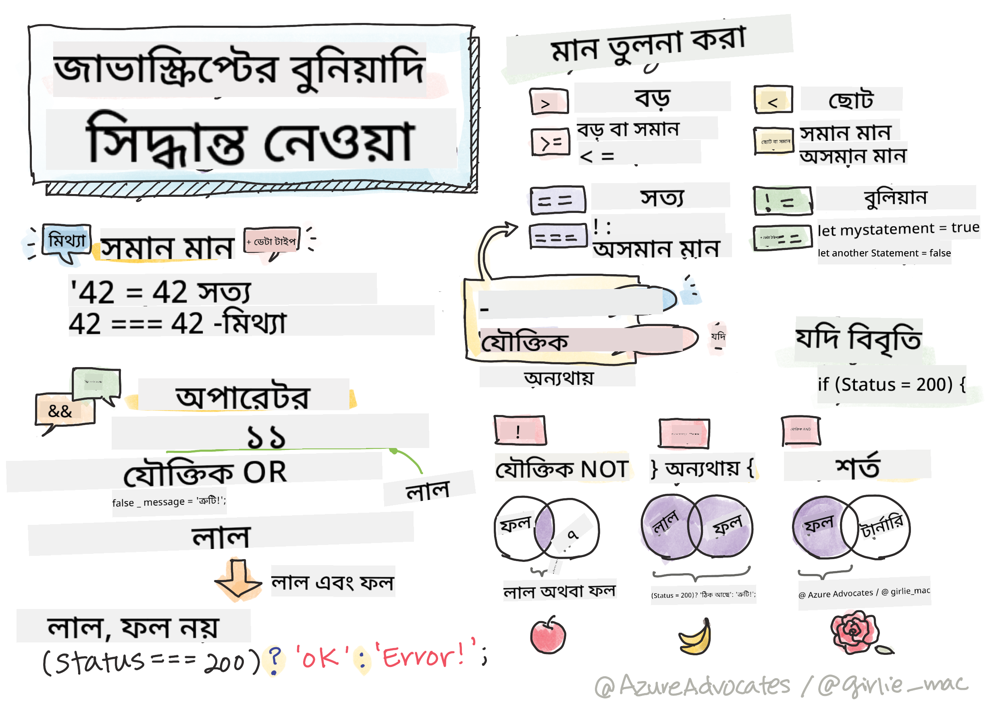

<!--
CO_OP_TRANSLATOR_METADATA:
{
  "original_hash": "888609c48329c280ca2477d2df40f2e5",
  "translation_date": "2025-08-25T21:34:35+00:00",
  "source_file": "2-js-basics/3-making-decisions/README.md",
  "language_code": "bn"
}
-->
# জাভাস্ক্রিপ্ট বেসিকস: সিদ্ধান্ত নেওয়া



> স্কেচনোট: [Tomomi Imura](https://twitter.com/girlie_mac)

## প্রি-লেকচার কুইজ

[প্রি-লেকচার কুইজ](https://ff-quizzes.netlify.app/web/quiz/11)

সিদ্ধান্ত নেওয়া এবং আপনার কোড কোন ক্রমে চলবে তা নিয়ন্ত্রণ করা আপনার কোডকে পুনরায় ব্যবহারযোগ্য এবং শক্তিশালী করে তোলে। এই অংশে জাভাস্ক্রিপ্টে ডেটা প্রবাহ নিয়ন্ত্রণের সিনট্যাক্স এবং এটি বুলিয়ান ডেটা টাইপের সাথে ব্যবহারের গুরুত্ব আলোচনা করা হয়েছে।

[](https://youtube.com/watch?v=SxTp8j-fMMY "সিদ্ধান্ত নেওয়া")

> 🎥 উপরের ছবিতে ক্লিক করুন সিদ্ধান্ত নেওয়া সম্পর্কে একটি ভিডিও দেখার জন্য।

> আপনি এই পাঠটি [Microsoft Learn](https://docs.microsoft.com/learn/modules/web-development-101-if-else/?WT.mc_id=academic-77807-sagibbon) এ নিতে পারেন!

## বুলিয়ান সম্পর্কে সংক্ষিপ্ত পুনরালোচনা

বুলিয়ান শুধুমাত্র দুটি মান ধারণ করতে পারে: `true` বা `false`। বুলিয়ান নির্ধারণ করে কোন শর্ত পূরণ হলে কোন কোডের লাইন চলবে।

আপনার বুলিয়ানকে true বা false সেট করুন এভাবে:

`let myTrueBool = true`  
`let myFalseBool = false`

✅ বুলিয়ান নামকরণ করা হয়েছে ইংরেজ গণিতবিদ, দার্শনিক এবং যুক্তিবিদ জর্জ বুল (১৮১৫–১৮৬৪) এর নামে।

## তুলনা অপারেটর এবং বুলিয়ান

অপারেটর ব্যবহার করে শর্ত মূল্যায়ন করা হয়, যা একটি বুলিয়ান মান তৈরি করে। নিচে কিছু সাধারণ অপারেটরের তালিকা দেওয়া হলো।

| প্রতীক | বিবরণ                                                                                                                                                   | উদাহরণ             |
| ------ | ------------------------------------------------------------------------------------------------------------------------------------------------------- | ------------------ |
| `<`    | **কম**: দুটি মান তুলনা করে এবং যদি বাম পাশের মান ডান পাশের মানের চেয়ে কম হয়, তাহলে `true` বুলিয়ান ডেটা টাইপ প্রদান করে                              | `5 < 6 // true`    |
| `<=`   | **কম বা সমান**: দুটি মান তুলনা করে এবং যদি বাম পাশের মান ডান পাশের মানের চেয়ে কম বা সমান হয়, তাহলে `true` প্রদান করে                                 | `5 <= 6 // true`   |
| `>`    | **বেশি**: দুটি মান তুলনা করে এবং যদি বাম পাশের মান ডান পাশের মানের চেয়ে বেশি হয়, তাহলে `true` প্রদান করে                                            | `5 > 6 // false`   |
| `>=`   | **বেশি বা সমান**: দুটি মান তুলনা করে এবং যদি বাম পাশের মান ডান পাশের মানের চেয়ে বেশি বা সমান হয়, তাহলে `true` প্রদান করে                            | `5 >= 6 // false`  |
| `===`  | **কঠোর সমতা**: দুটি মান তুলনা করে এবং যদি বাম এবং ডান পাশের মান সমান এবং একই ডেটা টাইপ হয়, তাহলে `true` প্রদান করে                                  | `5 === 6 // false` |
| `!==`  | **অসমতা**: দুটি মান তুলনা করে এবং কঠোর সমতা অপারেটর যা প্রদান করবে তার বিপরীত বুলিয়ান মান প্রদান করে                                                  | `5 !== 6 // true`  |

✅ আপনার জ্ঞান পরীক্ষা করুন ব্রাউজারের কনসোলে কিছু তুলনা লিখে। কোনো ফলাফল কি আপনাকে অবাক করেছে?

## If স্টেটমেন্ট

If স্টেটমেন্ট তার ব্লকের মধ্যে কোড চালাবে যদি শর্তটি true হয়।

```javascript
if (condition) {
  //Condition is true. Code in this block will run.
}
```

লজিক্যাল অপারেটর প্রায়ই শর্ত তৈরি করতে ব্যবহৃত হয়।

```javascript
let currentMoney;
let laptopPrice;

if (currentMoney >= laptopPrice) {
  //Condition is true. Code in this block will run.
  console.log("Getting a new laptop!");
}
```

## If..Else স্টেটমেন্ট

`else` স্টেটমেন্ট তার ব্লকের মধ্যে কোড চালাবে যখন শর্তটি false হবে। এটি `if` স্টেটমেন্টের সাথে ঐচ্ছিক।

```javascript
let currentMoney;
let laptopPrice;

if (currentMoney >= laptopPrice) {
  //Condition is true. Code in this block will run.
  console.log("Getting a new laptop!");
} else {
  //Condition is false. Code in this block will run.
  console.log("Can't afford a new laptop, yet!");
}
```

✅ এই কোড এবং পরবর্তী কোড ব্রাউজারের কনসোলে চালিয়ে আপনার বোঝার পরীক্ষা করুন। `currentMoney` এবং `laptopPrice` ভেরিয়েবলের মান পরিবর্তন করে `console.log()` এর আউটপুট পরিবর্তন করুন।

## Switch স্টেটমেন্ট

`switch` স্টেটমেন্ট বিভিন্ন শর্তের উপর ভিত্তি করে বিভিন্ন কাজ সম্পাদন করতে ব্যবহৃত হয়। `switch` স্টেটমেন্ট ব্যবহার করে অনেক কোড ব্লকের মধ্যে একটি নির্বাচন করুন যা কার্যকর হবে।

```javascript
switch (expression) {
  case x:
    // code block
    break;
  case y:
    // code block
    break;
  default:
  // code block
}
```

```javascript
// program using switch statement
let a = 2;

switch (a) {
  case 1:
    a = "one";
    break;
  case 2:
    a = "two";
    break;
  default:
    a = "not found";
    break;
}
console.log(`The value is ${a}`);
```

✅ এই কোড এবং পরবর্তী কোড ব্রাউজারের কনসোলে চালিয়ে আপনার বোঝার পরীক্ষা করুন। ভেরিয়েবল `a` এর মান পরিবর্তন করে `console.log()` এর আউটপুট পরিবর্তন করুন।

## লজিক্যাল অপারেটর এবং বুলিয়ান

সিদ্ধান্ত গ্রহণের জন্য একাধিক তুলনা প্রয়োজন হতে পারে এবং সেগুলো লজিক্যাল অপারেটর দিয়ে যুক্ত করে একটি বুলিয়ান মান তৈরি করা যায়।

| প্রতীক | বিবরণ                                                                                     | উদাহরণ                                                                 |
| ------ | ----------------------------------------------------------------------------------------- | --------------------------------------------------------------------- |
| `&&`   | **লজিক্যাল AND**: দুটি বুলিয়ান এক্সপ্রেশন তুলনা করে। শুধুমাত্র উভয় পক্ষ true হলে true প্রদান করে | `(5 > 6) && (5 < 6 ) //একটি পক্ষ false, অন্যটি true। ফলাফল false`     |
| `\|\|` | **লজিক্যাল OR**: দুটি বুলিয়ান এক্সপ্রেশন তুলনা করে। অন্তত একটি পক্ষ true হলে true প্রদান করে     | `(5 > 6) \|\| (5 < 6) //একটি পক্ষ false, অন্যটি true। ফলাফল true`     |
| `!`    | **লজিক্যাল NOT**: একটি বুলিয়ান এক্সপ্রেশনের বিপরীত মান প্রদান করে                             | `!(5 > 6) // ৫ ৬ এর চেয়ে বেশি নয়, কিন্তু "!" true প্রদান করবে`         |

## লজিক্যাল অপারেটর দিয়ে শর্ত এবং সিদ্ধান্ত

লজিক্যাল অপারেটর ব্যবহার করে if..else স্টেটমেন্টে শর্ত তৈরি করা যায়।

```javascript
let currentMoney;
let laptopPrice;
let laptopDiscountPrice = laptopPrice - laptopPrice * 0.2; //Laptop price at 20 percent off

if (currentMoney >= laptopPrice || currentMoney >= laptopDiscountPrice) {
  //Condition is true. Code in this block will run.
  console.log("Getting a new laptop!");
} else {
  //Condition is true. Code in this block will run.
  console.log("Can't afford a new laptop, yet!");
}
```

### নেগেশন অপারেটর

আপনি ইতিমধ্যে দেখেছেন কিভাবে `if...else` স্টেটমেন্ট ব্যবহার করে শর্তযুক্ত লজিক তৈরি করা যায়। `if` এর মধ্যে যা কিছু থাকবে তা true/false এ মূল্যায়িত হতে হবে। `!` অপারেটর ব্যবহার করে আপনি এক্সপ্রেশনকে _নেগেট_ করতে পারেন। এটি দেখতে এমন হবে:

```javascript
if (!condition) {
  // runs if condition is false
} else {
  // runs if condition is true
}
```

### টার্নারি এক্সপ্রেশন

`if...else` সিদ্ধান্ত লজিক প্রকাশ করার একমাত্র উপায় নয়। আপনি টার্নারি অপারেটর নামক একটি জিনিসও ব্যবহার করতে পারেন। এর সিনট্যাক্স দেখতে এমন:

```javascript
let variable = condition ? <return this if true> : <return this if false>
```

নিচে একটি বাস্তব উদাহরণ দেওয়া হলো:

```javascript
let firstNumber = 20;
let secondNumber = 10;
let biggestNumber = firstNumber > secondNumber ? firstNumber : secondNumber;
```

✅ এই কোডটি কয়েকবার পড়ুন। আপনি কি বুঝতে পারছেন কিভাবে এই অপারেটরগুলো কাজ করছে?

উপরের কোডটি বলে যে:

- যদি `firstNumber` `secondNumber` এর চেয়ে বড় হয়
- তাহলে `firstNumber` কে `biggestNumber` এ অ্যাসাইন করুন
- অন্যথায় `secondNumber` কে অ্যাসাইন করুন।

টার্নারি এক্সপ্রেশনটি নিচের কোডটি লেখার একটি সংক্ষিপ্ত উপায়:

```javascript
let biggestNumber;
if (firstNumber > secondNumber) {
  biggestNumber = firstNumber;
} else {
  biggestNumber = secondNumber;
}
```

---

## 🚀 চ্যালেঞ্জ

প্রথমে লজিক্যাল অপারেটর ব্যবহার করে একটি প্রোগ্রাম তৈরি করুন এবং তারপর এটি টার্নারি এক্সপ্রেশন ব্যবহার করে পুনরায় লিখুন। আপনার পছন্দের সিনট্যাক্স কোনটি?

---

## পোস্ট-লেকচার কুইজ

[পোস্ট-লেকচার কুইজ](https://ff-quizzes.netlify.app/web/quiz/12)

## পর্যালোচনা এবং স্ব-অধ্যয়ন

ব্যবহারকারীর জন্য উপলব্ধ বিভিন্ন অপারেটর সম্পর্কে আরও পড়ুন [MDN](https://developer.mozilla.org/docs/Web/JavaScript/Reference/Operators) এ।

Josh Comeau এর চমৎকার [অপারেটর লুকআপ](https://joshwcomeau.com/operator-lookup/) দেখুন!

## অ্যাসাইনমেন্ট

[অপারেটর](assignment.md)

**অস্বীকৃতি**:  
এই নথিটি AI অনুবাদ পরিষেবা [Co-op Translator](https://github.com/Azure/co-op-translator) ব্যবহার করে অনুবাদ করা হয়েছে। আমরা যথাসম্ভব সঠিক অনুবাদ প্রদানের চেষ্টা করি, তবে অনুগ্রহ করে মনে রাখবেন যে স্বয়ংক্রিয় অনুবাদে ত্রুটি বা অসঙ্গতি থাকতে পারে। মূল ভাষায় থাকা নথিটিকে প্রামাণিক উৎস হিসেবে বিবেচনা করা উচিত। গুরুত্বপূর্ণ তথ্যের জন্য, পেশাদার মানব অনুবাদ সুপারিশ করা হয়। এই অনুবাদ ব্যবহারের ফলে কোনো ভুল বোঝাবুঝি বা ভুল ব্যাখ্যা হলে আমরা তার জন্য দায়ী থাকব না।