<!--
CO_OP_TRANSLATOR_METADATA:
{
  "original_hash": "c688385d15dd3645e924ea0ffee8967f",
  "translation_date": "2025-11-03T22:24:00+00:00",
  "source_file": "2-js-basics/3-making-decisions/README.md",
  "language_code": "bn"
}
-->
# জাভাস্ক্রিপ্টের মৌলিক বিষয়: সিদ্ধান্ত গ্রহণ

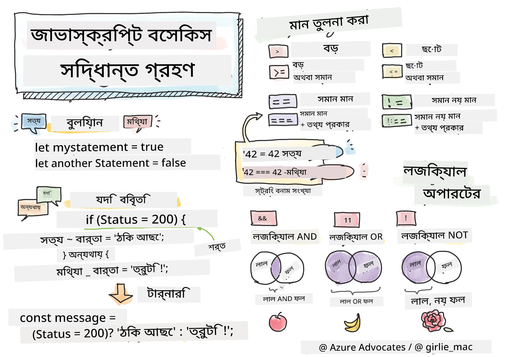

> স্কেচনোট করেছেন [Tomomi Imura](https://twitter.com/girlie_mac)

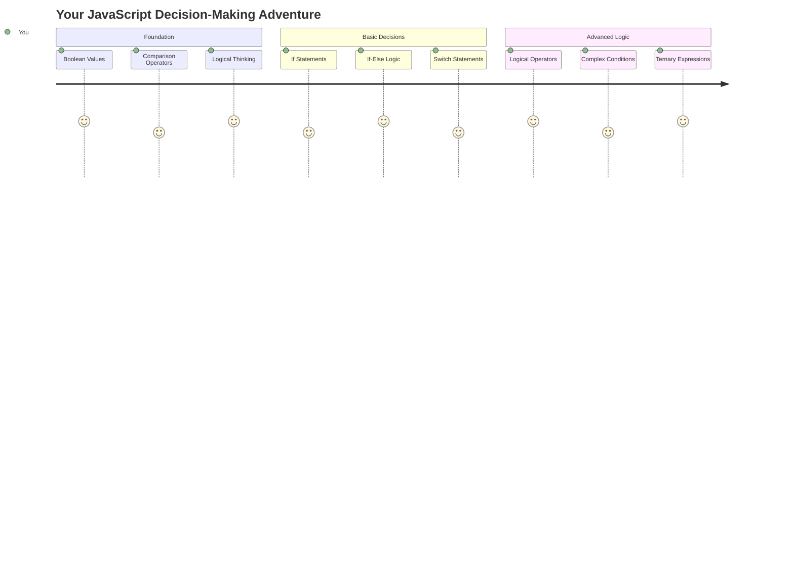

আপনি কি কখনও ভেবেছেন কীভাবে অ্যাপ্লিকেশনগুলো বুদ্ধিমত্তার সাথে সিদ্ধান্ত নেয়? যেমন একটি নেভিগেশন সিস্টেম কীভাবে দ্রুততম পথ নির্বাচন করে, অথবা একটি থার্মোস্ট্যাট কীভাবে তাপ চালু করার সিদ্ধান্ত নেয়? এটি প্রোগ্রামিংয়ে সিদ্ধান্ত গ্রহণের মৌলিক ধারণা।

যেমন চার্লস ব্যাবেজের অ্যানালিটিক্যাল ইঞ্জিন বিভিন্ন শর্তের উপর ভিত্তি করে বিভিন্ন অপারেশনের ক্রম অনুসরণ করার জন্য ডিজাইন করা হয়েছিল, আধুনিক জাভাস্ক্রিপ্ট প্রোগ্রামগুলোকেও বিভিন্ন পরিস্থিতির উপর ভিত্তি করে পছন্দ করতে হয়। এই শাখা এবং সিদ্ধান্ত নেওয়ার ক্ষমতা স্থির কোডকে প্রতিক্রিয়াশীল, বুদ্ধিমান অ্যাপ্লিকেশনে রূপান্তরিত করে।

এই পাঠে, আপনি আপনার প্রোগ্রামে শর্তযুক্ত যুক্তি বাস্তবায়ন করতে শিখবেন। আমরা শর্তযুক্ত বিবৃতি, তুলনা অপারেটর এবং যৌক্তিক অভিব্যক্তি অন্বেষণ করব যা আপনার কোডকে পরিস্থিতি মূল্যায়ন করতে এবং উপযুক্তভাবে প্রতিক্রিয়া জানাতে সক্ষম করে।

## প্রাক-লেকচার কুইজ

[প্রাক-লেকচার কুইজ](https://ff-quizzes.netlify.app/web/quiz/11)

সিদ্ধান্ত নেওয়ার এবং প্রোগ্রাম প্রবাহ নিয়ন্ত্রণ করার ক্ষমতা প্রোগ্রামিংয়ের একটি মৌলিক দিক। এই অংশটি আপনার জাভাস্ক্রিপ্ট প্রোগ্রামের কার্যকরী পথ নিয়ন্ত্রণ করার জন্য বুলিয়ান মান এবং শর্তযুক্ত যুক্তি ব্যবহার করার পদ্ধতি কভার করে।

[](https://youtube.com/watch?v=SxTp8j-fMMY "সিদ্ধান্ত গ্রহণ")

> 🎥 উপরের ছবিতে ক্লিক করুন সিদ্ধান্ত গ্রহণ সম্পর্কে একটি ভিডিও দেখার জন্য।

> আপনি এই পাঠটি [Microsoft Learn](https://docs.microsoft.com/learn/modules/web-development-101-if-else/?WT.mc_id=academic-77807-sagibbon) এ নিতে পারেন!

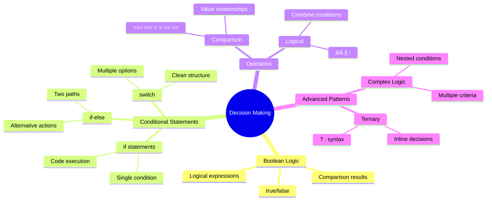

## বুলিয়ান সম্পর্কে সংক্ষিপ্ত পুনরালোচনা

সিদ্ধান্ত গ্রহণ অন্বেষণ করার আগে, আসুন আমাদের পূর্ববর্তী পাঠ থেকে বুলিয়ান মানগুলোর দিকে ফিরে তাকাই। গণিতবিদ জর্জ বুলের নামে নামকরণ করা, এই মানগুলো বাইনারি অবস্থান উপস্থাপন করে – হয় `true` অথবা `false`। এখানে কোনো অস্পষ্টতা নেই, কোনো মধ্যবর্তী অবস্থান নেই।

এই বাইনারি মানগুলো সমস্ত গণনামূলক যুক্তির ভিত্তি গঠন করে। আপনার প্রোগ্রাম যে কোনো সিদ্ধান্ত নেয় তা শেষ পর্যন্ত একটি বুলিয়ান মূল্যায়নে নেমে আসে।

বুলিয়ান ভেরিয়েবল তৈরি করা সহজ:

```javascript
let myTrueBool = true;
let myFalseBool = false;
```

এটি দুটি ভেরিয়েবল তৈরি করে যেগুলোতে স্পষ্ট বুলিয়ান মান রয়েছে।

✅ বুলিয়ান মানগুলো ইংরেজ গণিতবিদ, দার্শনিক এবং যুক্তিবিদ জর্জ বুল (১৮১৫–১৮৬৪) এর নামে নামকরণ করা হয়েছে।

## তুলনা অপারেটর এবং বুলিয়ান

বাস্তবে, আপনি খুব কমই ম্যানুয়ালি বুলিয়ান মান সেট করবেন। পরিবর্তে, আপনি শর্ত মূল্যায়ন করে সেগুলো তৈরি করবেন: "এই সংখ্যাটি কি ঐ সংখ্যার চেয়ে বড়?" অথবা "এই মানগুলো কি সমান?"

তুলনা অপারেটরগুলো এই মূল্যায়নগুলো সক্ষম করে। এগুলো মানগুলো তুলনা করে এবং অপারেন্ডগুলোর সম্পর্কের উপর ভিত্তি করে বুলিয়ান ফলাফল প্রদান করে।

| প্রতীক | বিবরণ                                                                                                                                                   | উদাহরণ            |
| ------ | ------------------------------------------------------------------------------------------------------------------------------------------------------------- | ------------------ |
| `<`    | **কম**: দুটি মান তুলনা করে এবং যদি বাম পাশের মানটি ডান পাশের চেয়ে কম হয় তবে `true` বুলিয়ান ডেটা টাইপ প্রদান করে                              | `5 < 6 // true`    |
| `<=`   | **কম বা সমান**: দুটি মান তুলনা করে এবং যদি বাম পাশের মানটি ডান পাশের চেয়ে কম বা সমান হয় তবে `true` বুলিয়ান ডেটা টাইপ প্রদান করে      | `5 <= 6 // true`   |
| `>`    | **বেশি**: দুটি মান তুলনা করে এবং যদি বাম পাশের মানটি ডান পাশের চেয়ে বেশি হয় তবে `true` বুলিয়ান ডেটা টাইপ প্রদান করে                         | `5 > 6 // false`   |
| `>=`   | **বেশি বা সমান**: দুটি মান তুলনা করে এবং যদি বাম পাশের মানটি ডান পাশের চেয়ে বেশি বা সমান হয় তবে `true` বুলিয়ান ডেটা টাইপ প্রদান করে | `5 >= 6 // false`  |
| `===`  | **কঠোর সমতা**: দুটি মান তুলনা করে এবং যদি ডান এবং বাম পাশের মানগুলো সমান এবং একই ডেটা টাইপ হয় তবে `true` বুলিয়ান ডেটা টাইপ প্রদান করে।       | `5 === 6 // false` |
| `!==`  | **অসমতা**: দুটি মান তুলনা করে এবং কঠোর সমতা অপারেটর যা ফেরত দেবে তার বিপরীত বুলিয়ান মান প্রদান করে                                    | `5 !== 6 // true`  |

✅ আপনার জ্ঞান পরীক্ষা করুন ব্রাউজারের কনসোলে কিছু তুলনা লিখে। কোনো ফেরত দেওয়া ডেটা কি আপনাকে অবাক করেছে?

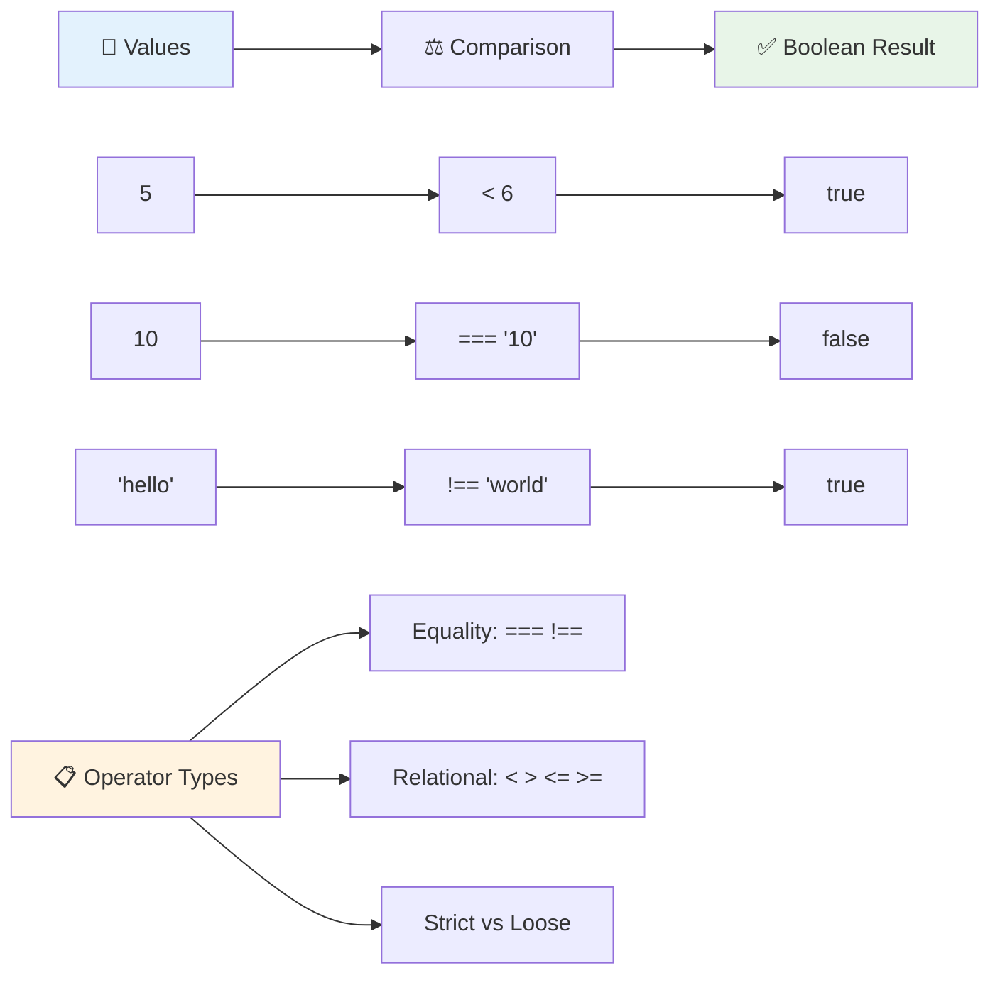

### 🧠 **তুলনা দক্ষতা পরীক্ষা: বুলিয়ান যুক্তি বোঝা**

**আপনার তুলনা বোঝার পরীক্ষা করুন:**
- কেন আপনি মনে করেন `===` (কঠোর সমতা) সাধারণত `==` (শিথিল সমতা) এর চেয়ে বেশি পছন্দ করা হয়?
- আপনি কি অনুমান করতে পারেন `5 === '5'` কী ফেরত দেয়? আর `5 == '5'` কী?
- `!==` এবং `!=` এর মধ্যে পার্থক্য কী?

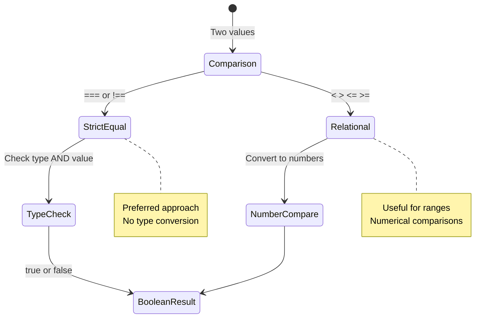

> **প্রো টিপ**: সমতা যাচাইয়ের জন্য সর্বদা `===` এবং `!==` ব্যবহার করুন যদি না আপনি বিশেষভাবে টাইপ রূপান্তর প্রয়োজন। এটি অপ্রত্যাশিত আচরণ প্রতিরোধ করে!

## If Statement

`if` স্টেটমেন্টটি আপনার কোডে একটি প্রশ্ন জিজ্ঞাসা করার মতো। "যদি এই শর্তটি সত্য হয়, তবে এই কাজটি করুন।" এটি সম্ভবত জাভাস্ক্রিপ্টে সিদ্ধান্ত নেওয়ার জন্য আপনি সবচেয়ে গুরুত্বপূর্ণ টুল ব্যবহার করবেন।

এটি কীভাবে কাজ করে:

```javascript
if (condition) {
  // Condition is true. Code in this block will run.
}
```

শর্তটি বন্ধনীর ভিতরে যায়, এবং যদি এটি `true` হয়, তাহলে জাভাস্ক্রিপ্ট কোডটি কার্লি ব্রেসের ভিতরে চালায়। যদি এটি `false` হয়, তাহলে জাভাস্ক্রিপ্ট পুরো ব্লকটি এড়িয়ে যায়।

আপনি প্রায়ই এই শর্তগুলো তৈরি করতে তুলনা অপারেটর ব্যবহার করবেন। চলুন একটি বাস্তব উদাহরণ দেখি:

```javascript
let currentMoney = 1000;
let laptopPrice = 800;

if (currentMoney >= laptopPrice) {
  // Condition is true. Code in this block will run.
  console.log("Getting a new laptop!");
}
```

যেহেতু `1000 >= 800` `true` হিসেবে মূল্যায়ন করে, ব্লকের ভিতরের কোডটি কার্যকর হয়, কনসোলে "Getting a new laptop!" প্রদর্শন করে।

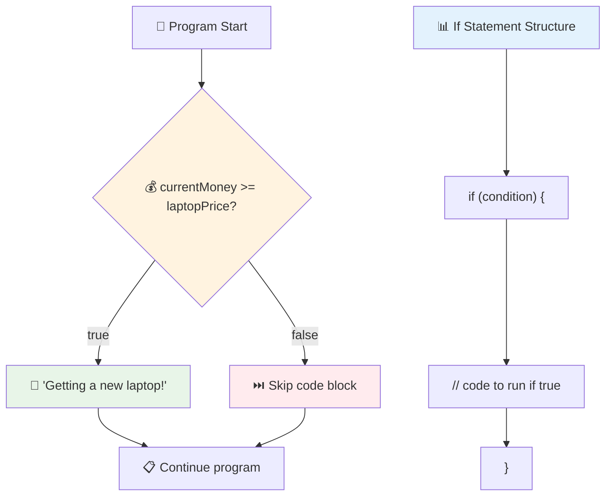

## If..Else Statement

কিন্তু যদি আপনি চান আপনার প্রোগ্রাম শর্তটি মিথ্যা হলে কিছু ভিন্ন কাজ করুক? তখন `else` আসে – এটি একটি ব্যাকআপ পরিকল্পনা থাকার মতো।

`else` স্টেটমেন্ট আপনাকে একটি উপায় দেয় বলার জন্য "যদি এই শর্তটি সত্য না হয়, তবে এই অন্য কাজটি করুন।"

```javascript
let currentMoney = 500;
let laptopPrice = 800;

if (currentMoney >= laptopPrice) {
  // Condition is true. Code in this block will run.
  console.log("Getting a new laptop!");
} else {
  // Condition is false. Code in this block will run.
  console.log("Can't afford a new laptop, yet!");
}
```

এখন যেহেতু `500 >= 800` `false`, জাভাস্ক্রিপ্ট প্রথম ব্লকটি এড়িয়ে যায় এবং পরিবর্তে `else` ব্লকটি চালায়। আপনি কনসোলে "Can't afford a new laptop, yet!" দেখতে পাবেন।

✅ এই কোড এবং পরবর্তী কোডটি ব্রাউজারের কনসোলে চালিয়ে আপনার বোঝার পরীক্ষা করুন। বর্তমানMoney এবং laptopPrice ভেরিয়েবলের মান পরিবর্তন করুন `console.log()` এর ফেরত দেওয়া মান পরিবর্তন করতে।

### 🎯 **If-Else লজিক পরীক্ষা: শাখা পথ**

**আপনার শর্তযুক্ত লজিক বোঝার মূল্যায়ন করুন:**
- কী ঘটে যদি `currentMoney` ঠিক `laptopPrice` এর সমান হয়?
- আপনি কি একটি বাস্তব জীবনের পরিস্থিতি ভাবতে পারেন যেখানে if-else লজিকটি কার্যকর হবে?
- আপনি কীভাবে এটি একাধিক মূল্য পরিসর পরিচালনা করতে প্রসারিত করবেন?

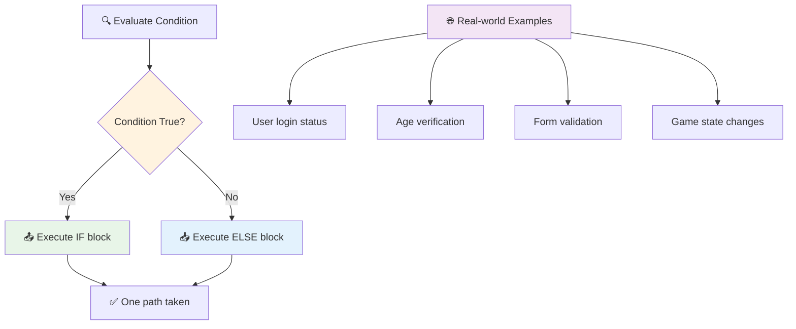

> **মূল অন্তর্দৃষ্টি**: If-else নিশ্চিত করে যে ঠিক একটি পথ নেওয়া হয়েছে। এটি নিশ্চিত করে যে আপনার প্রোগ্রাম যেকোনো শর্তের জন্য সর্বদা একটি প্রতিক্রিয়া জানায়!

## Switch Statement

কখনও কখনও আপনাকে এক মানকে একাধিক বিকল্পের সাথে তুলনা করতে হয়। যদিও আপনি একাধিক `if..else` স্টেটমেন্ট চেইন করতে পারেন, এই পদ্ধতিটি অগোছালো হয়ে যায়। `switch` স্টেটমেন্ট একাধিক নির্দিষ্ট মান পরিচালনার জন্য একটি পরিষ্কার কাঠামো প্রদান করে।

এই ধারণাটি প্রাথমিক টেলিফোন এক্সচেঞ্জে ব্যবহৃত যান্ত্রিক সুইচিং সিস্টেমের মতো – একটি ইনপুট মান নির্ধারণ করে কোন নির্দিষ্ট পথটি কার্যকর হবে।

```javascript
switch (expression) {
  case x:
    // code block
    break;
  case y:
    // code block
    break;
  default:
    // code block
}
```

এটি কীভাবে গঠিত:
- জাভাস্ক্রিপ্ট একবার অভিব্যক্তিটি মূল্যায়ন করে
- এটি প্রতিটি `case` এর মধ্য দিয়ে যায় একটি মিল খুঁজে পেতে
- যখন এটি একটি মিল খুঁজে পায়, এটি সেই কোড ব্লকটি চালায়
- `break` জাভাস্ক্রিপ্টকে থামতে এবং সুইচ থেকে বেরিয়ে যেতে বলে
- যদি কোনো কেস মিলে না যায়, এটি `default` ব্লকটি চালায় (যদি আপনার থাকে)

```javascript
// Program using switch statement for day of week
let dayNumber = 2;
let dayName;

switch (dayNumber) {
  case 1:
    dayName = "Monday";
    break;
  case 2:
    dayName = "Tuesday";
    break;
  case 3:
    dayName = "Wednesday";
    break;
  default:
    dayName = "Unknown day";
    break;
}
console.log(`Today is ${dayName}`);
```

এই উদাহরণে, জাভাস্ক্রিপ্ট দেখে যে `dayNumber` হল `2`, মিলে যাওয়া `case 2` খুঁজে পায়, `dayName` কে "Tuesday" সেট করে এবং তারপর সুইচ থেকে বেরিয়ে যায়। ফলাফল? "Today is Tuesday" কনসোলে লগ হয়।

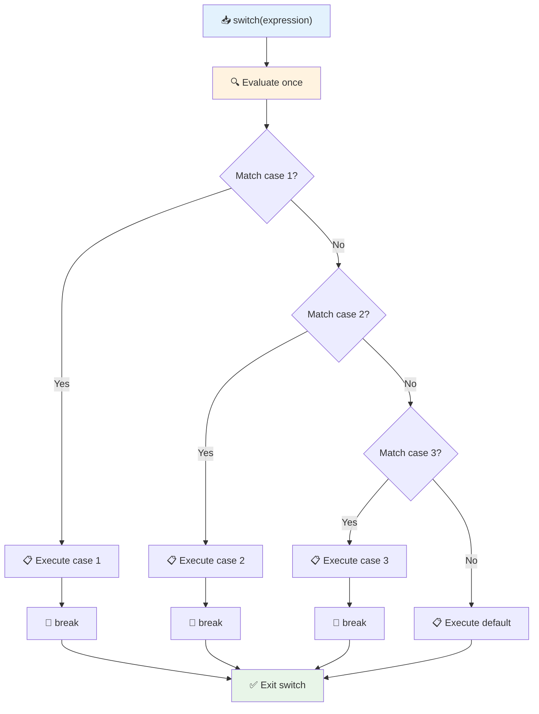

✅ এই কোড এবং পরবর্তী কোডটি ব্রাউজারের কনসোলে চালিয়ে আপনার বোঝার পরীক্ষা করুন। ভেরিয়েবল a এর মান পরিবর্তন করুন `console.log()` এর ফেরত দেওয়া মান পরিবর্তন করতে।

### 🔄 **Switch Statement দক্ষতা: একাধিক বিকল্প**

**আপনার switch বোঝার পরীক্ষা করুন:**
- কী ঘটে যদি আপনি একটি `break` স্টেটমেন্ট ভুলে যান?
- কখন আপনি একাধিক `if-else` স্টেটমেন্টের পরিবর্তে `switch` ব্যবহার করবেন?
- কেন `default` কেসটি কার্যকর, যদিও আপনি মনে করেন আপনি সমস্ত সম্ভাবনা কভার করেছেন?

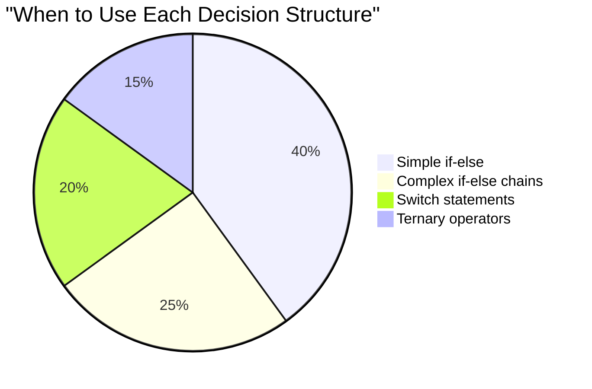

> **সেরা অনুশীলন**: এক ভেরিয়েবলকে একাধিক নির্দিষ্ট মানের সাথে তুলনা করার সময় `switch` ব্যবহার করুন। রেঞ্জ চেক বা জটিল শর্তের জন্য `if-else` ব্যবহার করুন!

## যৌক্তিক অপারেটর এবং বুলিয়ান

জটিল সিদ্ধান্ত প্রায়ই একাধিক শর্ত একসাথে মূল্যায়ন করার প্রয়োজন হয়। যেমন বুলিয়ান অ্যালজেব্রা গণিতবিদদের যৌক্তিক অভিব্যক্তি একত্রিত করতে দেয়, প্রোগ্রামিং যৌক্তিক অপারেটর প্রদান করে একাধিক বুলিয়ান শর্ত সংযোগ করতে।

এই অপারেটরগুলো সহজ true/false মূল্যায়নগুলো একত্রিত করে জটিল শর্তযুক্ত লজিক সক্ষম করে।

| প্রতীক | বিবরণ                                                                                     | উদাহরণ                                                                 |
| ------ | ----------------------------------------------------------------------------------------------- | ----------------------------------------------------------------------- |
| `&&`   | **যৌক্তিক AND**: দুটি বুলিয়ান অভিব্যক্তি তুলনা করে। উভয় পক্ষই সত্য হলে **মাত্র** true প্রদান করে | `(5 > 3) && (5 < 10) // উভয় পক্ষই সত্য। true প্রদান করে` |
| `\|\|` | **যৌক্তিক OR**: দুটি বুলিয়ান অভিব্যক্তি তুলনা করে। অন্তত একটি পক্ষ সত্য হলে true প্রদান করে     | `(5 > 10) \|\| (5 < 10) // এক পক্ষ মিথ্যা, অন্যটি সত্য। true প্রদান করে` |
| `!`    | **যৌক্তিক NOT**: একটি বুলিয়ান অভিব্যক্তির বিপরীত মান প্রদান করে                             | `!(5 > 10) // 5 10 এর চেয়ে বেশি নয়, তাই "!" এটিকে সত্য করে তোলে`         |

এই অপারেটরগুলো আপনাকে শর্তগুলো কার্যকরভাবে একত্রিত করতে দেয়:
- AND (`&&`) মানে উভয় শর্তই সত্য হতে হবে
- OR (`||`) মানে অন্তত একটি শর্ত সত্য হতে হবে  
- NOT (`!`) সত্যকে মিথ্যা এবং মিথ্যাকে সত্যে পরিবর্তন করে

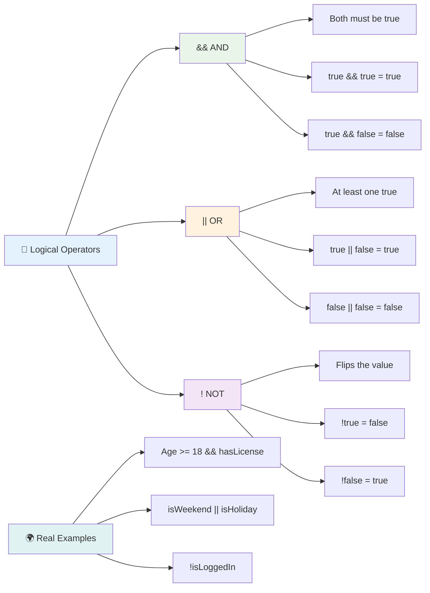

## যৌক্তিক অপারেটর দিয়ে শর্ত এবং সিদ্ধান্ত

চলুন এই যৌক্তিক অপারেটরগুলো একটি আরও বাস্তব উদাহরণে দেখি:

```javascript
let currentMoney = 600;
let laptopPrice = 800;
let laptopDiscountPrice = laptopPrice - (laptopPrice * 0.2); // Laptop price at 20 percent off

if (currentMoney >= laptopPrice || currentMoney >= laptopDiscountPrice) {
  // Condition is true. Code in this block will run.
  console.log("Getting a new laptop!");
} else {
  // Condition is false. Code in this block will run.
  console.log("Can't afford a new laptop, yet!");
}
```

এই উদাহরণে: আমরা ২০% ডিসকাউন্ট মূল্য (৬৪০) গণনা করি, তারপর মূল্যায়ন করি আমাদের উপলব্ধ তহবিল সম্পূর্ণ মূল্য অথবা ডিসকাউন্ট মূল্যের মধ্যে কোনো একটিকে কভার করে কিনা। যেহেতু ৬০০ ডিসকাউন্ট মূল্যের থ্রেশহোল্ড ৬৪০ পূরণ করে, শর্তটি true হিসেবে মূল্যায়ন করে।

### 🧮 **যৌক্তিক অপারেটর পরীক্ষা: শর্তগুলো একত্রিত করা**

**আপনার যৌক্তিক অপারেটর বোঝার পরীক্ষা করুন:**
- অভিব্যক্তি `A && B` এ, যদি A মিথ্যা হয়, তাহলে কি B মূল্যায়ন করা হয়?
- আপনি কি এমন একটি পরিস্থিতি ভাবতে পারেন যেখানে আপনি তিনটি অপারেটর (&&, ||, !) একসাথে ব্যবহার করবেন?
- `!user.isActive` এবং `user.isActive !== true` এর মধ্যে পার্থক্য কী?

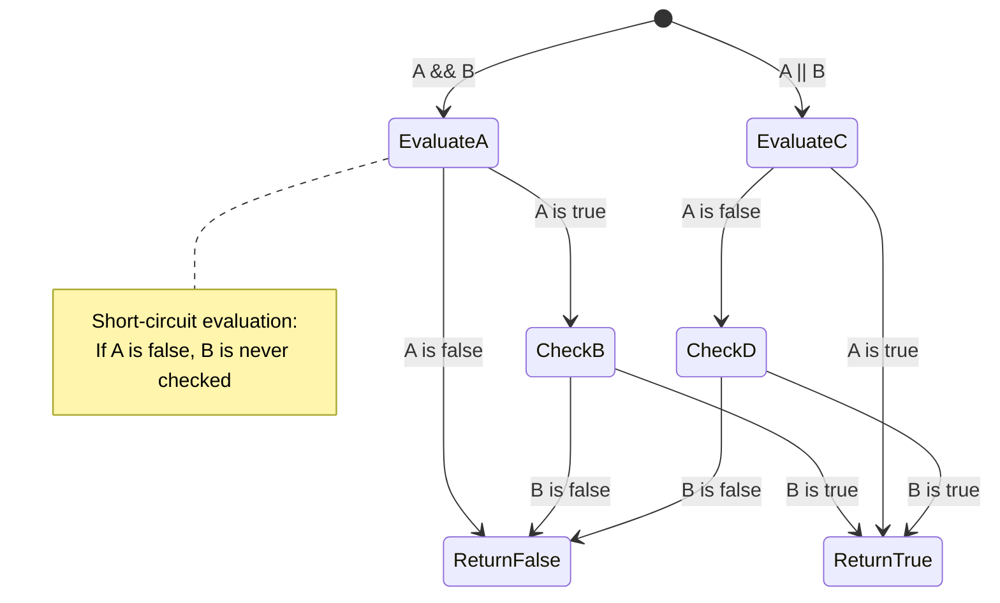

> **পারফরম্যান্স টিপ**: জাভাস্ক্রিপ্ট "শর্ট-সার্কিট মূল্যায়ন" ব্যবহার করে - `A && B` এ, যদি A মিথ্যা হয়, তাহলে B মূল্যায়ন করা হয় না। এটি আপনার সুবিধার জন্য ব্যবহার করুন!

### নেগেশন অপারেটর

কখনও কখনও কিছু সত্য নয় এমন সময় ভাবা সহজ হয়। যেমন "ব্যবহারকারী লগ ইন করেছেন?" জিজ্ঞাসা করার পরিবর্তে, আপনি "ব্যবহারকারী লগ ইন করেননি?" জিজ্ঞাসা করতে পারেন। বিস্ময় চিহ্ন (`!`) অপারেটর আপনার জন্য লজিকটি উল্টে দেয়।

```javascript
if (!condition) {
  // runs if condition is false
} else {
  // runs if condition is true
}
```

`!` অপারেটরটি "এর বিপরীত..." বলার মতো – যদি কিছু `true` হয়, `!` এটিকে `false` করে এবং এর বিপরীতে।

### টার্নারি অভিব্যক্তি

সরল শর্তযুক্ত অ্যাসাইনমেন্টের জন্য, জাভাস্ক্রিপ্ট **টার্নারি অপারেটর** প্রদান করে। এই সংক্ষিপ্ত সিনট্যাক্স আপনাকে একটি শর্তযুক্ত অভিব্যক্তি এক লাইনে লিখতে দেয়, যখন আপনি একটি শর্তের উপর ভিত্তি করে দুটি মানের মধ্যে একটি অ্যাসাইন করতে চান তখন এটি কার্যকর।

```javascript
let variable = condition ? returnThisIfTrue : returnThisIfFalse;
```

এটি একটি প্রশ্নের মতো পড়ে: "এই শর্তটি সত্য? যদি হ্যাঁ, এই মানটি ব্যবহার করুন। যদি না হয়, ঐ মানটি ব্যবহার করুন।"

নিচে একটি আরও স্পষ্ট উদাহরণ:

```javascript
let firstNumber = 20;
let secondNumber = 10;
let biggestNumber = firstNumber > secondNumber ? firstNumber : secondNumber;
```

✅ এই কোডটি কয়েকবার পড়ুন। আপনি কি বুঝতে পারছেন এই অপারেটরগুলো কীভাবে কাজ করছে?

এই লাইনটি যা বলছে তা হলো: "`firstNumber` কি `secondNumber` এর চেয়ে বড়? যদি হ্যাঁ, `firstNumber` কে `biggestNumber` এ রাখুন। যদি না হয়, `secondNumber` কে `biggestNumber` এ রাখুন।"

টার্নারি অপারেটরটি এই ঐতিহ্যবাহী `if..else` স্টেটমেন্টটি লেখার একটি সংক্ষিপ্ত উপায় মাত্র:

```javascript
let biggestNumber;
if (firstNumber > secondNumber) {
  biggestNumber = firstNumber;
} else {
  biggestNumber = secondNumber;
}
```

উভয় পদ্ধতিই অভিন্ন ফলাফল তৈরি করে। টার্নারি অপারেটর সংক্ষিপ্ততা প্রদান করে, যখন ঐতিহ্যবাহী if-else কাঠামো জটিল শর্তের জন্য আরও পাঠযোগ্য হতে পারে।

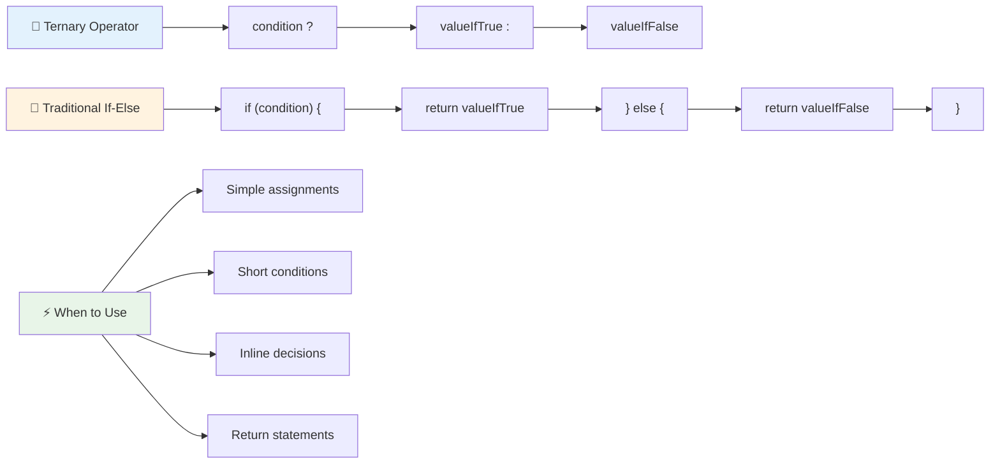

---


## 🚀 চ্যালেঞ্জ

প্রথমে যৌক্তিক অপারেটর দিয়ে একটি প্রোগ্রাম তৈরি করুন, এবং তারপর এটি একটি টার্নারি অভিব্যক্তি ব্যবহার করে পুনরায় লিখুন। কোন সিনট্যাক্সটি আপনার পছন্দ?

---

## GitHub Copilot Agent চ্যালেঞ্জ 🚀

Agent মোড ব্যবহার করে নিম্নলিখিত চ্যালেঞ্জটি সম্পূর্ণ করুন:

**বর্ণনা:** এই পাঠ থেকে একাধিক সিদ্ধান্ত গ্রহণের ধারণা প্রদর্শন করে একটি বিস্তৃত গ্রেড ক্যালকুলেটর তৈরি করুন, যার মধ্যে if-else স্টেটমেন্ট, switch স্টেটমেন্ট, যৌক্তিক অপারেটর এবং টার্নারি অভিব্যক্তি অন্তর্ভুক্ত থাকবে।

**প্রম্পট:** একটি জাভাস্ক্রিপ্ট প্রোগ্রাম লিখুন যা একটি শিক্ষার্থীর
2. লজিক্যাল অপারেটর ব্যবহার করে পরীক্ষা করুন ছাত্রটি পাশ করেছে (grade >= 60) এবং সম্মান পেয়েছে (grade >= 90) কিনা।  
3. একটি সুইচ স্টেটমেন্ট ব্যবহার করে প্রতিটি লেটার গ্রেডের জন্য নির্দিষ্ট প্রতিক্রিয়া প্রদান করুন।  
4. একটি টার্নারি অপারেটর ব্যবহার করে নির্ধারণ করুন ছাত্রটি পরবর্তী কোর্সের জন্য যোগ্য (grade >= 70) কিনা।  
5. ইনপুট যাচাই অন্তর্ভুক্ত করুন যাতে স্কোর 0 থেকে 100 এর মধ্যে থাকে।  

আপনার প্রোগ্রামটি বিভিন্ন স্কোর দিয়ে পরীক্ষা করুন, যেমন 59, 60, 89, 90 এবং অকার্যকর ইনপুট।  

[agent mode](https://code.visualstudio.com/blogs/2025/02/24/introducing-copilot-agent-mode) সম্পর্কে আরও জানুন।  

## পোস্ট-লেকচার কুইজ  

[পোস্ট-লেকচার কুইজ](https://ff-quizzes.netlify.app/web/quiz/12)  

## পর্যালোচনা এবং স্ব-অধ্যয়ন  

ব্যবহারকারীর জন্য উপলব্ধ বিভিন্ন অপারেটর সম্পর্কে আরও পড়ুন [MDN-এ](https://developer.mozilla.org/docs/Web/JavaScript/Reference/Operators)।  

জোশ কমাউয়ের অসাধারণ [অপারেটর লুকআপ](https://joshwcomeau.com/operator-lookup/) দেখুন!  

## অ্যাসাইনমেন্ট  

[অপারেটর](assignment.md)  

---

## 🧠 **আপনার সিদ্ধান্ত গ্রহণের টুলকিট সারাংশ**  

```mermaid
graph TD
    A["🎯 JavaScript Decisions"] --> B["🔍 Boolean Logic"]
    A --> C["📊 Conditional Statements"]
    A --> D["🔗 Logical Operators"]
    A --> E["⚡ Advanced Patterns"]
    
    B --> B1["true/false values"]
    B --> B2["Comparison operators"]
    B --> B3["Truthiness concepts"]
    
    C --> C1["if statements"]
    C --> C2["if-else chains"]
    C --> C3["switch statements"]
    
    D --> D1["&& (AND)"]
    D --> D2["|| (OR)"]
    D --> D3["! (NOT)"]
    
    E --> E1["Ternary operator"]
    E --> E2["Short-circuit evaluation"]
    E --> E3["Complex conditions"]
    
    F["💡 Key Principles"] --> F1["Clear readable conditions"]
    F --> F2["Consistent comparison style"]
    F --> F3["Proper operator precedence"]
    F --> F4["Efficient evaluation order"]
    
    style A fill:#e3f2fd
    style B fill:#e8f5e8
    style C fill:#fff3e0
    style D fill:#f3e5f5
    style E fill:#e0f2f1
    style F fill:#fce4ec
```
  
---

## 🚀 আপনার জাভাস্ক্রিপ্ট সিদ্ধান্ত গ্রহণের দক্ষতার টাইমলাইন  

### ⚡ **আপনি পরবর্তী ৫ মিনিটে যা করতে পারেন**  
- [ ] আপনার ব্রাউজার কনসোলে তুলনামূলক অপারেটর অনুশীলন করুন।  
- [ ] একটি সাধারণ if-else স্টেটমেন্ট লিখুন যা আপনার বয়স পরীক্ষা করে।  
- [ ] চ্যালেঞ্জটি চেষ্টা করুন: একটি if-else টার্নারি অপারেটর ব্যবহার করে পুনর্লিখন করুন।  
- [ ] বিভিন্ন "truthy" এবং "falsy" মান দিয়ে পরীক্ষা করুন।  

### 🎯 **আপনি এই ঘণ্টায় যা অর্জন করতে পারেন**  
- [ ] পোস্ট-লেসন কুইজ সম্পন্ন করুন এবং কোনো বিভ্রান্তিকর ধারণা পর্যালোচনা করুন।  
- [ ] GitHub Copilot চ্যালেঞ্জ থেকে একটি সম্পূর্ণ গ্রেড ক্যালকুলেটর তৈরি করুন।  
- [ ] একটি বাস্তব জীবনের পরিস্থিতির জন্য একটি সাধারণ সিদ্ধান্ত গাছ তৈরি করুন (যেমন কী পরবেন তা নির্বাচন করা)।  
- [ ] লজিক্যাল অপারেটর দিয়ে একাধিক শর্ত একত্রিত করার অনুশীলন করুন।  
- [ ] বিভিন্ন ব্যবহারের জন্য সুইচ স্টেটমেন্ট নিয়ে পরীক্ষা করুন।  

### 📅 **আপনার সপ্তাহব্যাপী লজিক দক্ষতা অর্জন**  
- [ ] সৃজনশীল উদাহরণ সহ অপারেটর অ্যাসাইনমেন্ট সম্পন্ন করুন।  
- [ ] বিভিন্ন শর্তমূলক কাঠামো ব্যবহার করে একটি মিনি কুইজ অ্যাপ্লিকেশন তৈরি করুন।  
- [ ] একাধিক ইনপুট শর্ত পরীক্ষা করার জন্য একটি ফর্ম ভ্যালিডেটর তৈরি করুন।  
- [ ] জোশ কমাউয়ের [অপারেটর লুকআপ](https://joshwcomeau.com/operator-lookup/) অনুশীলন করুন।  
- [ ] বিদ্যমান কোড পুনর্গঠন করুন যাতে আরও উপযুক্ত শর্তমূলক কাঠামো ব্যবহার করা যায়।  
- [ ] শর্ট-সার্কিট মূল্যায়ন এবং কর্মক্ষমতার প্রভাব অধ্যয়ন করুন।  

### 🌟 **আপনার মাসব্যাপী রূপান্তর**  
- [ ] জটিল নেস্টেড শর্তগুলো দক্ষতার সাথে পরিচালনা করুন এবং কোডের পাঠযোগ্যতা বজায় রাখুন।  
- [ ] উন্নত সিদ্ধান্ত গ্রহণের লজিক সহ একটি অ্যাপ্লিকেশন তৈরি করুন।  
- [ ] বিদ্যমান প্রকল্পে শর্তমূলক লজিক উন্নত করে ওপেন সোর্সে অবদান রাখুন।  
- [ ] বিভিন্ন শর্তমূলক কাঠামো এবং কখন কোনটি ব্যবহার করবেন তা নিয়ে অন্য কাউকে শেখান।  
- [ ] শর্তমূলক লজিকের জন্য ফাংশনাল প্রোগ্রামিং পদ্ধতি অন্বেষণ করুন।  
- [ ] শর্তমূলক সেরা অনুশীলনের জন্য একটি ব্যক্তিগত রেফারেন্স গাইড তৈরি করুন।  

### 🏆 **চূড়ান্ত সিদ্ধান্ত গ্রহণের চ্যাম্পিয়ন চেক-ইন**  

**আপনার লজিক্যাল চিন্তার দক্ষতা উদযাপন করুন:**  
- আপনি সফলভাবে বাস্তবায়িত সবচেয়ে জটিল সিদ্ধান্ত লজিক কী?  
- কোন শর্তমূলক কাঠামো আপনার কাছে সবচেয়ে স্বাভাবিক মনে হয় এবং কেন?  
- লজিক্যাল অপারেটর সম্পর্কে শেখা কীভাবে আপনার সমস্যা সমাধানের পদ্ধতি পরিবর্তন করেছে?  
- কোন বাস্তব জীবনের অ্যাপ্লিকেশন উন্নত সিদ্ধান্ত গ্রহণের লজিক থেকে উপকৃত হবে?  

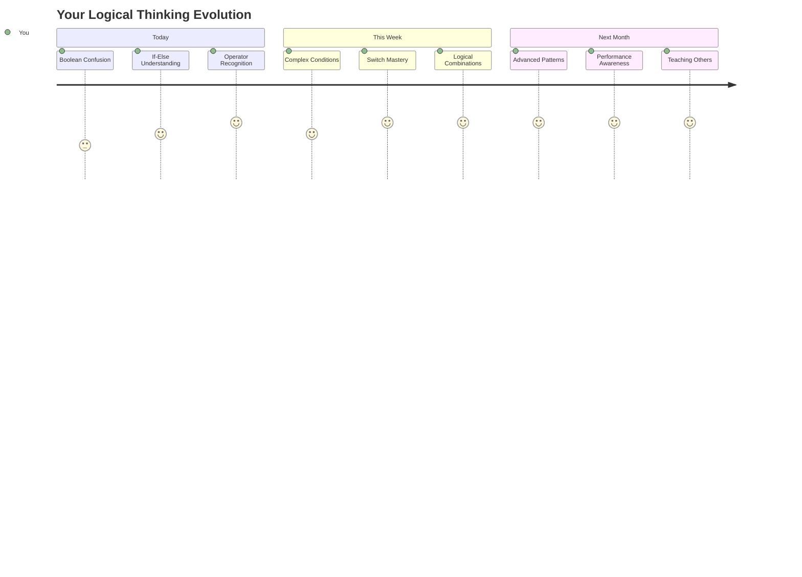
  
> 🧠 **আপনি ডিজিটাল সিদ্ধান্ত গ্রহণের শিল্পে দক্ষ হয়েছেন!** প্রতিটি ইন্টারঅ্যাকটিভ অ্যাপ্লিকেশন ব্যবহারকারীর ক্রিয়া এবং পরিবর্তনশীল অবস্থার প্রতি বুদ্ধিমত্তার সাথে সাড়া দিতে শর্তমূলক লজিকের উপর নির্ভর করে। আপনি এখন বুঝতে পেরেছেন কীভাবে আপনার প্রোগ্রামগুলো চিন্তা করতে, মূল্যায়ন করতে এবং উপযুক্ত প্রতিক্রিয়া বেছে নিতে পারে। এই লজিক্যাল ভিত্তি আপনার তৈরি প্রতিটি ডাইনামিক অ্যাপ্লিকেশনকে শক্তি দেবে! 🎉  

---

**অস্বীকৃতি**:  
এই নথিটি AI অনুবাদ পরিষেবা [Co-op Translator](https://github.com/Azure/co-op-translator) ব্যবহার করে অনুবাদ করা হয়েছে। আমরা যথাসাধ্য সঠিকতা নিশ্চিত করার চেষ্টা করি, তবে অনুগ্রহ করে মনে রাখবেন যে স্বয়ংক্রিয় অনুবাদে ত্রুটি বা অসঙ্গতি থাকতে পারে। মূল ভাষায় থাকা নথিটিকে প্রামাণিক উৎস হিসেবে বিবেচনা করা উচিত। গুরুত্বপূর্ণ তথ্যের জন্য, পেশাদার মানব অনুবাদ সুপারিশ করা হয়। এই অনুবাদ ব্যবহারের ফলে কোনো ভুল বোঝাবুঝি বা ভুল ব্যাখ্যা হলে আমরা দায়বদ্ধ থাকব না।