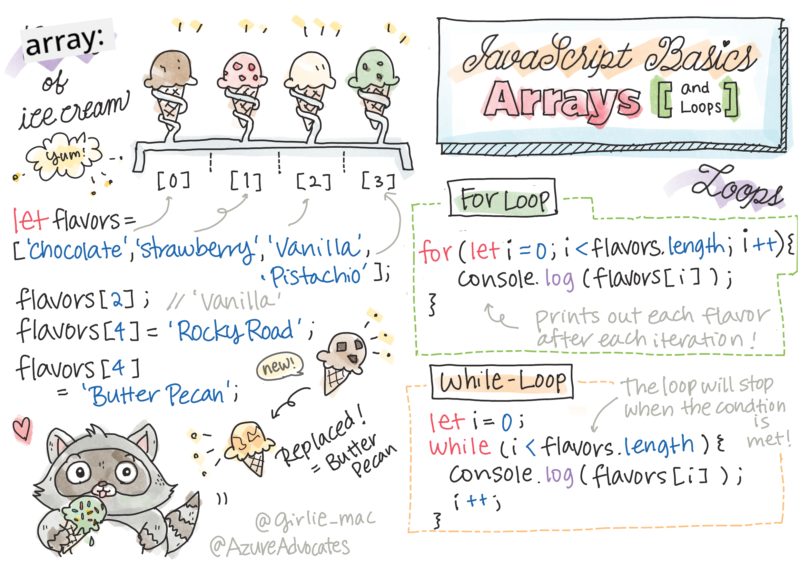

<!--
CO_OP_TRANSLATOR_METADATA:
{
  "original_hash": "3f7f87871312cf6cc12662da7d973182",
  "translation_date": "2025-08-25T21:47:21+00:00",
  "source_file": "2-js-basics/4-arrays-loops/README.md",
  "language_code": "bn"
}
-->
# জাভাস্ক্রিপ্টের বুনিয়াদি: অ্যারে এবং লুপ


> স্কেচনোট: [Tomomi Imura](https://twitter.com/girlie_mac)

## প্রাক-লেকচার কুইজ
[প্রাক-লেকচার কুইজ](https://ashy-river-0debb7803.1.azurestaticapps.net/quiz/13)

এই পাঠে জাভাস্ক্রিপ্টের বুনিয়াদি আলোচনা করা হয়েছে, যা ওয়েবের ইন্টারঅ্যাক্টিভিটি প্রদান করে। এই পাঠে আপনি অ্যারে এবং লুপ সম্পর্কে শিখবেন, যা ডেটা পরিচালনার জন্য ব্যবহৃত হয়।

[](https://youtube.com/watch?v=1U4qTyq02Xw "অ্যারে")

[](https://www.youtube.com/watch?v=Eeh7pxtTZ3k "লুপ")

> 🎥 উপরের ছবিগুলিতে ক্লিক করুন অ্যারে এবং লুপ সম্পর্কিত ভিডিও দেখার জন্য।

> আপনি এই পাঠটি [Microsoft Learn](https://docs.microsoft.com/learn/modules/web-development-101-arrays/?WT.mc_id=academic-77807-sagibbon) এ নিতে পারেন!

## অ্যারে

ডেটা নিয়ে কাজ করা যেকোনো প্রোগ্রামিং ভাষার একটি সাধারণ কাজ, এবং যখন ডেটা একটি কাঠামোগত ফরম্যাটে সংগঠিত হয়, যেমন অ্যারে, তখন এটি অনেক সহজ হয়ে যায়। অ্যারে ব্যবহার করে, ডেটা একটি তালিকার মতো কাঠামোতে সংরক্ষণ করা হয়। অ্যারের একটি বড় সুবিধা হলো, আপনি এক অ্যারেতে বিভিন্ন ধরনের ডেটা সংরক্ষণ করতে পারেন।

✅ অ্যারে আমাদের চারপাশে সর্বত্র রয়েছে! আপনি কি অ্যারের একটি বাস্তব উদাহরণ ভাবতে পারেন, যেমন একটি সোলার প্যানেল অ্যারে?

অ্যারের সিনট্যাক্স হলো একটি জোড়া স্কয়ার ব্র্যাকেট।

```javascript
let myArray = [];
```

এটি একটি খালি অ্যারে, তবে অ্যারে ডেটা দিয়ে পূর্ণ অবস্থায়ও ঘোষণা করা যেতে পারে। একটি অ্যারেতে একাধিক মান কমা দিয়ে পৃথক করা হয়।

```javascript
let iceCreamFlavors = ["Chocolate", "Strawberry", "Vanilla", "Pistachio", "Rocky Road"];
```

অ্যারের মানগুলো একটি অনন্য মান পায়, যাকে **ইন্ডেক্স** বলা হয়, যা অ্যারের শুরু থেকে তার দূরত্বের উপর ভিত্তি করে একটি পূর্ণসংখ্যা হিসেবে বরাদ্দ করা হয়। উপরের উদাহরণে, "Chocolate" স্ট্রিংটির ইন্ডেক্স হলো 0, এবং "Rocky Road"-এর ইন্ডেক্স হলো 4। ইন্ডেক্স ব্যবহার করে স্কয়ার ব্র্যাকেটের মাধ্যমে অ্যারের মানগুলো পুনরুদ্ধার, পরিবর্তন বা যোগ করা যায়।

✅ আপনাকে কি অবাক করে যে অ্যারে শূন্য ইন্ডেক্স থেকে শুরু হয়? কিছু প্রোগ্রামিং ভাষায় ইন্ডেক্স 1 থেকে শুরু হয়। এর একটি আকর্ষণীয় ইতিহাস রয়েছে, যা আপনি [উইকিপিডিয়ায় পড়তে পারেন](https://en.wikipedia.org/wiki/Zero-based_numbering)।

```javascript
let iceCreamFlavors = ["Chocolate", "Strawberry", "Vanilla", "Pistachio", "Rocky Road"];
iceCreamFlavors[2]; //"Vanilla"
```

আপনি ইন্ডেক্স ব্যবহার করে একটি মান পরিবর্তন করতে পারেন, যেমন:

```javascript
iceCreamFlavors[4] = "Butter Pecan"; //Changed "Rocky Road" to "Butter Pecan"
```

এবং আপনি একটি নির্দিষ্ট ইন্ডেক্সে একটি নতুন মান যোগ করতে পারেন, যেমন:

```javascript
iceCreamFlavors[5] = "Cookie Dough"; //Added "Cookie Dough"
```

✅ অ্যারেতে মান যোগ করার একটি আরও সাধারণ উপায় হলো অ্যারে অপারেটর ব্যবহার করা, যেমন array.push()

অ্যারেতে কতগুলো আইটেম রয়েছে তা জানতে, `length` প্রপার্টি ব্যবহার করুন।

```javascript
let iceCreamFlavors = ["Chocolate", "Strawberry", "Vanilla", "Pistachio", "Rocky Road"];
iceCreamFlavors.length; //5
```

✅ নিজে চেষ্টা করুন! আপনার ব্রাউজারের কনসোলে একটি অ্যারে তৈরি করুন এবং সেটি পরিচালনা করুন।

## লুপ

লুপ আমাদের পুনরাবৃত্তিমূলক বা **ইটারেটিভ** কাজ সম্পাদন করতে দেয় এবং এটি অনেক সময় এবং কোড সাশ্রয় করতে পারে। প্রতিটি ইটারেশন ভেরিয়েবল, মান এবং শর্তে পরিবর্তিত হতে পারে। জাভাস্ক্রিপ্টে বিভিন্ন ধরনের লুপ রয়েছে, এবং তাদের মধ্যে ছোট পার্থক্য রয়েছে, তবে মূলত তারা একই কাজ করে: ডেটার উপর লুপ করা।

### ফর লুপ

`for` লুপে ইটারেট করার জন্য ৩টি অংশ প্রয়োজন:
- `counter` একটি ভেরিয়েবল যা সাধারণত একটি সংখ্যা দিয়ে শুরু হয় এবং ইটারেশনের সংখ্যা গণনা করে
- `condition` একটি এক্সপ্রেশন যা তুলনা অপারেটর ব্যবহার করে লুপকে `false` হলে থামায়
- `iteration-expression` প্রতিটি ইটারেশনের শেষে চালানো হয়, সাধারণত কাউন্টার মান পরিবর্তন করতে ব্যবহৃত হয়
  
```javascript
// Counting up to 10
for (let i = 0; i < 10; i++) {
  console.log(i);
}
```

✅ এই কোডটি ব্রাউজারের কনসোলে চালান। যখন আপনি কাউন্টার, শর্ত বা ইটারেশন এক্সপ্রেশনে ছোট পরিবর্তন করেন তখন কী ঘটে? আপনি কি এটি উল্টোভাবে চালাতে পারেন, একটি কাউন্টডাউন তৈরি করতে?

### হোয়াইল লুপ

`for` লুপের সিনট্যাক্সের বিপরীতে, `while` লুপে শুধুমাত্র একটি শর্ত প্রয়োজন যা শর্ত `false` হলে লুপ থামাবে। লুপের শর্তগুলো সাধারণত অন্যান্য মানের উপর নির্ভর করে, যেমন কাউন্টার, এবং লুপ চলাকালীন এগুলো পরিচালনা করতে হয়। কাউন্টারের প্রাথমিক মানগুলো লুপের বাইরে তৈরি করতে হয়, এবং শর্ত পূরণের জন্য যেকোনো এক্সপ্রেশন, যার মধ্যে কাউন্টার পরিবর্তনও অন্তর্ভুক্ত, লুপের ভিতরে বজায় রাখতে হয়।

```javascript
//Counting up to 10
let i = 0;
while (i < 10) {
 console.log(i);
 i++;
}
```

✅ আপনি কেন একটি ফর লুপের পরিবর্তে একটি হোয়াইল লুপ বেছে নেবেন? StackOverflow-এ ১৭ হাজার দর্শকের একই প্রশ্ন ছিল, এবং কিছু মতামত [আপনার জন্য আকর্ষণীয় হতে পারে](https://stackoverflow.com/questions/39969145/while-loops-vs-for-loops-in-javascript)।

## লুপ এবং অ্যারে

অ্যারে প্রায়ই লুপের সাথে ব্যবহার করা হয় কারণ বেশিরভাগ শর্ত অ্যারের দৈর্ঘ্য ব্যবহার করে লুপ থামানোর প্রয়োজন হয়, এবং ইন্ডেক্সটি কাউন্টার মানও হতে পারে।

```javascript
let iceCreamFlavors = ["Chocolate", "Strawberry", "Vanilla", "Pistachio", "Rocky Road"];

for (let i = 0; i < iceCreamFlavors.length; i++) {
  console.log(iceCreamFlavors[i]);
} //Ends when all flavors are printed
```

✅ আপনার ব্রাউজারের কনসোলে একটি অ্যারে তৈরি করে সেটির উপর লুপ করার চেষ্টা করুন।

---

## 🚀 চ্যালেঞ্জ

ফর এবং হোয়াইল লুপ ছাড়াও অ্যারের উপর লুপ করার অন্যান্য উপায় রয়েছে। যেমন [forEach](https://developer.mozilla.org/docs/Web/JavaScript/Reference/Global_Objects/Array/forEach), [for-of](https://developer.mozilla.org/docs/Web/JavaScript/Reference/Statements/for...of), এবং [map](https://developer.mozilla.org/docs/Web/JavaScript/Reference/Global_Objects/Array/map)। আপনার অ্যারে লুপটি এই কৌশলগুলোর একটি ব্যবহার করে পুনরায় লিখুন।

## পোস্ট-লেকচার কুইজ
[পোস্ট-লেকচার কুইজ](https://ashy-river-0debb7803.1.azurestaticapps.net/quiz/14)

## পর্যালোচনা এবং স্ব-অধ্যয়ন

জাভাস্ক্রিপ্টে অ্যারেগুলোর সাথে অনেক মেথড সংযুক্ত থাকে, যা ডেটা পরিচালনার জন্য অত্যন্ত কার্যকর। [এই মেথডগুলো সম্পর্কে পড়ুন](https://developer.mozilla.org/docs/Web/JavaScript/Reference/Global_Objects/Array) এবং আপনার তৈরি করা একটি অ্যারেতে এগুলো (যেমন push, pop, slice এবং splice) ব্যবহার করে দেখুন।

## অ্যাসাইনমেন্ট

[অ্যারের উপর লুপ করুন](assignment.md)

**অস্বীকৃতি**:  
এই নথিটি AI অনুবাদ পরিষেবা [Co-op Translator](https://github.com/Azure/co-op-translator) ব্যবহার করে অনুবাদ করা হয়েছে। আমরা যথাসাধ্য সঠিক অনুবাদ প্রদানের চেষ্টা করি, তবে দয়া করে মনে রাখবেন যে স্বয়ংক্রিয় অনুবাদে ত্রুটি বা অসঙ্গতি থাকতে পারে। নথিটির মূল ভাষায় থাকা সংস্করণটিকেই প্রামাণিক উৎস হিসেবে বিবেচনা করা উচিত। গুরুত্বপূর্ণ তথ্যের জন্য, পেশাদার মানব অনুবাদ সুপারিশ করা হয়। এই অনুবাদ ব্যবহারের ফলে সৃষ্ট কোনো ভুল বোঝাবুঝি বা ভুল ব্যাখ্যার জন্য আমরা দায়ী নই।