# জাভাস্ক্রিপ্টের বেসিক: অ্যারে এবং লুপ

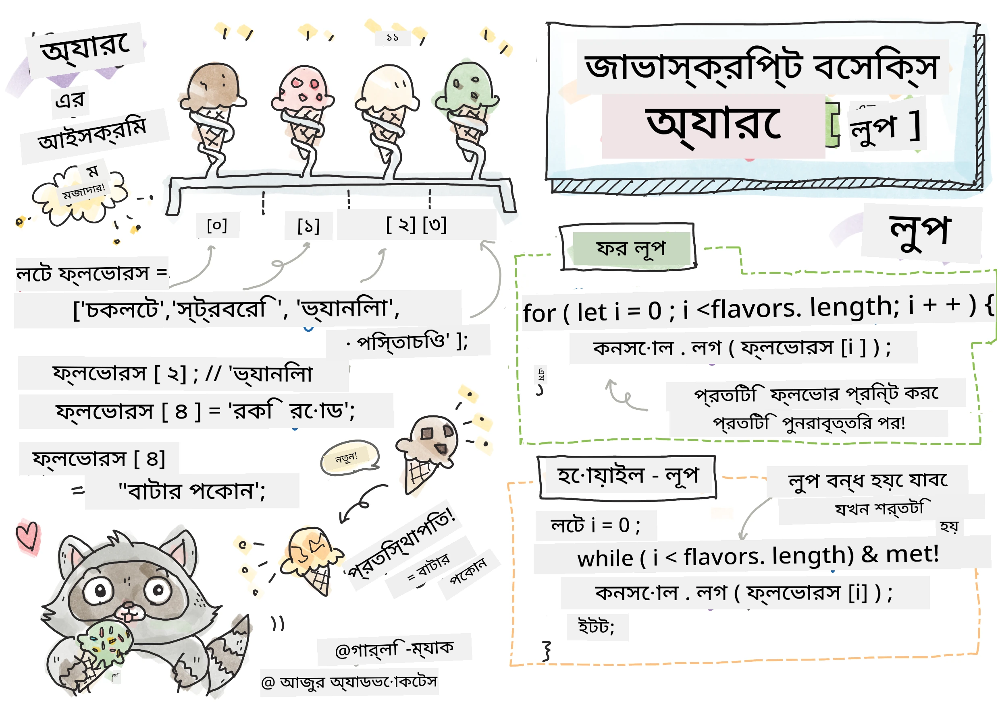
> স্কেচনোট করেছেন [Tomomi Imura](https://twitter.com/girlie_mac)

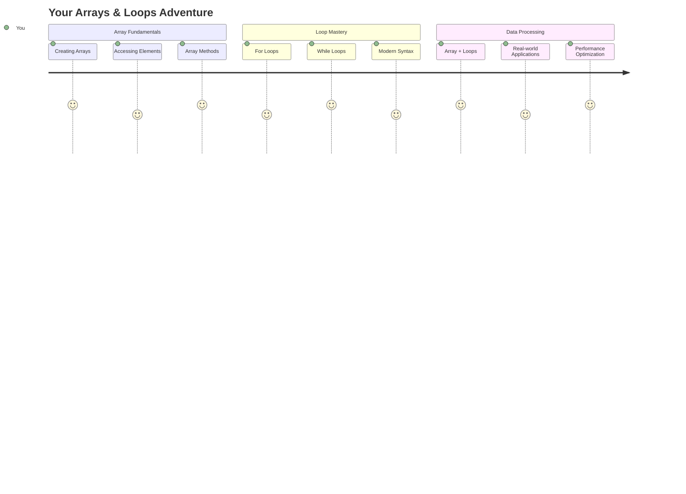

## লেকচারের আগে কুইজ
[লেকচারের আগে কুইজ](https://ff-quizzes.netlify.app/web/quiz/13)

কখনো ভেবেছেন কীভাবে ওয়েবসাইটগুলো শপিং কার্টের আইটেমগুলো ট্র্যাক করে বা আপনার বন্ধু তালিকা দেখায়? এখানেই অ্যারে এবং লুপের প্রয়োজন হয়। অ্যারে হলো ডিজিটাল কন্টেইনার যা একাধিক তথ্য ধারণ করে, আর লুপ আপনাকে সেই তথ্যগুলো দক্ষতার সাথে কাজ করতে সাহায্য করে, বারবার কোড লেখার প্রয়োজন ছাড়াই।

এই দুটি ধারণা একসাথে আপনার প্রোগ্রামে তথ্য পরিচালনার ভিত্তি তৈরি করে। আপনি শিখবেন কীভাবে প্রতিটি ধাপ ম্যানুয়ালি লিখার পরিবর্তে স্মার্ট, দক্ষ কোড তৈরি করবেন যা শত শত বা হাজার হাজার আইটেম দ্রুত প্রক্রিয়া করতে পারে।

এই পাঠ শেষে, আপনি বুঝতে পারবেন কীভাবে জটিল তথ্য প্রক্রিয়া কয়েকটি কোড লাইনের মাধ্যমে সম্পন্ন করা যায়। চলুন এই গুরুত্বপূর্ণ প্রোগ্রামিং ধারণাগুলো অন্বেষণ করি।

[](https://youtube.com/watch?v=1U4qTyq02Xw "অ্যারে")

[](https://www.youtube.com/watch?v=Eeh7pxtTZ3k "লুপ")

> 🎥 উপরের ছবিগুলোতে ক্লিক করুন অ্যারে এবং লুপ সম্পর্কে ভিডিও দেখার জন্য।

> আপনি এই পাঠটি [Microsoft Learn](https://docs.microsoft.com/learn/modules/web-development-101-arrays/?WT.mc_id=academic-77807-sagibbon) এ নিতে পারেন!

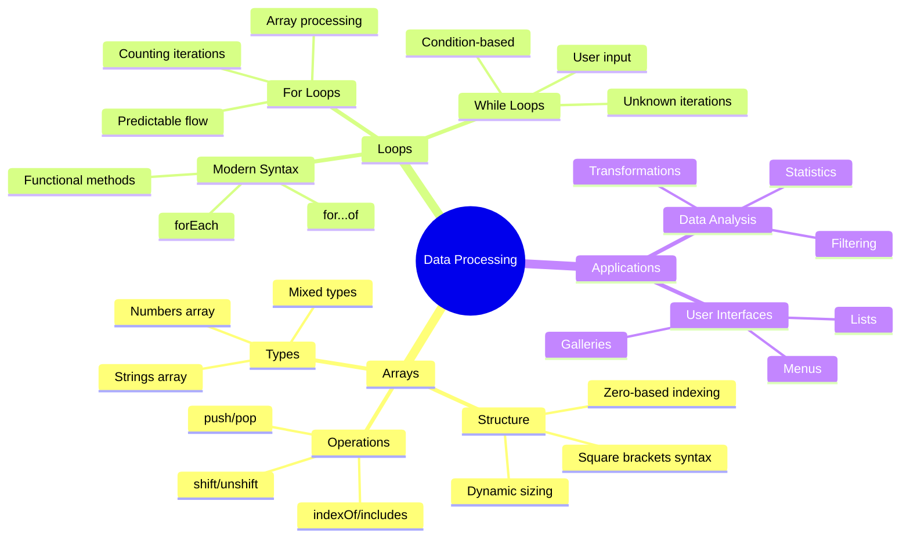

## অ্যারে

অ্যারে হলো একটি ডিজিটাল ফাইলিং ক্যাবিনেটের মতো - যেখানে এক ড্রয়ারে এক ডকুমেন্ট সংরক্ষণ করার পরিবর্তে, আপনি একাধিক সম্পর্কিত আইটেম একটি কাঠামোবদ্ধ কন্টেইনারে সংরক্ষণ করতে পারেন। প্রোগ্রামিংয়ের ভাষায়, অ্যারে আপনাকে একাধিক তথ্য একসাথে সংরক্ষণ করতে সাহায্য করে।

আপনি যদি একটি ফটো গ্যালারি তৈরি করেন, টু-ডু লিস্ট পরিচালনা করেন, বা গেমে উচ্চ স্কোর ট্র্যাক করেন, তাহলে অ্যারে তথ্য সংগঠনের ভিত্তি প্রদান করে। চলুন দেখি এটি কীভাবে কাজ করে।

✅ অ্যারে আমাদের চারপাশে সব জায়গায় রয়েছে! আপনি কি অ্যারের কোনো বাস্তব উদাহরণ ভাবতে পারেন, যেমন একটি সোলার প্যানেল অ্যারে?

### অ্যারে তৈরি করা

অ্যারে তৈরি করা খুবই সহজ - শুধু স্কয়ার ব্র্যাকেট ব্যবহার করুন!

```javascript
// Empty array - like an empty shopping cart waiting for items
const myArray = [];
```

**এখানে কী ঘটছে?**
আপনি স্কয়ার ব্র্যাকেট `[]` ব্যবহার করে একটি খালি কন্টেইনার তৈরি করেছেন। এটি একটি খালি লাইব্রেরি শেলফের মতো - এটি প্রস্তুত আপনার পছন্দমতো বইগুলো সংগঠিত করে রাখার জন্য।

আপনি চাইলে শুরু থেকেই আপনার অ্যারে কিছু মান দিয়ে পূরণ করতে পারেন:

```javascript
// Your ice cream shop's flavor menu
const iceCreamFlavors = ["Chocolate", "Strawberry", "Vanilla", "Pistachio", "Rocky Road"];

// A user's profile info (mixing different types of data)
const userData = ["John", 25, true, "developer"];

// Test scores for your favorite class
const scores = [95, 87, 92, 78, 85];
```

**মজার বিষয়গুলো লক্ষ্য করুন:**
- আপনি একই অ্যারেতে টেক্সট, সংখ্যা, এমনকি সত্য/মিথ্যা মান সংরক্ষণ করতে পারেন
- প্রতিটি আইটেমকে কমা দিয়ে আলাদা করুন - সহজ!
- সম্পর্কিত তথ্য একসাথে রাখার জন্য অ্যারে আদর্শ

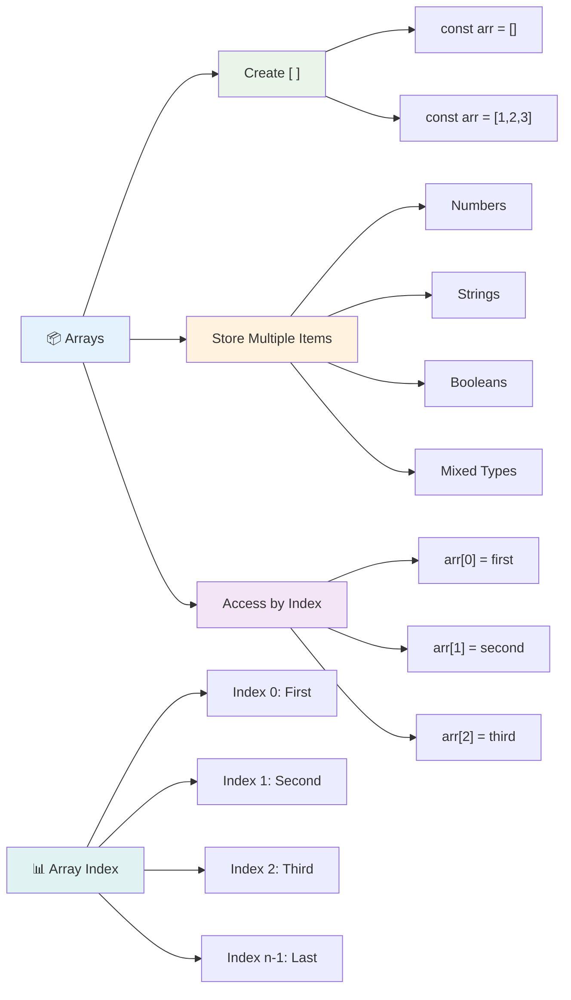

### অ্যারে ইনডেক্সিং

এখানে একটি বিষয় প্রথমে অদ্ভুত মনে হতে পারে: অ্যারে তাদের আইটেমগুলোকে ০ থেকে নম্বর দেয়, ১ থেকে নয়। এই জিরো-বেসড ইনডেক্সিং কম্পিউটার মেমোরি কাজ করার পদ্ধতির সাথে সম্পর্কিত - এটি প্রোগ্রামিংয়ের একটি প্রচলিত নিয়ম যা C এর মতো প্রাচীন ভাষা থেকে এসেছে। অ্যারের প্রতিটি স্থানে একটি নিজস্ব ঠিকানা নম্বর থাকে, যাকে **ইনডেক্স** বলা হয়।

| ইনডেক্স | মান | বর্ণনা |
|-------|-------|-------------|
| 0 | "Chocolate" | প্রথম উপাদান |
| 1 | "Strawberry" | দ্বিতীয় উপাদান |
| 2 | "Vanilla" | তৃতীয় উপাদান |
| 3 | "Pistachio" | চতুর্থ উপাদান |
| 4 | "Rocky Road" | পঞ্চম উপাদান |

✅ আপনাকে কি অবাক করে যে অ্যারে ০ ইনডেক্স থেকে শুরু হয়? কিছু প্রোগ্রামিং ভাষায় ইনডেক্স ১ থেকে শুরু হয়। এর একটি আকর্ষণীয় ইতিহাস রয়েছে, যা আপনি [উইকিপিডিয়ায়](https://en.wikipedia.org/wiki/Zero-based_numbering) পড়তে পারেন।

**অ্যারের উপাদান অ্যাক্সেস করা:**

```javascript
const iceCreamFlavors = ["Chocolate", "Strawberry", "Vanilla", "Pistachio", "Rocky Road"];

// Access individual elements using bracket notation
console.log(iceCreamFlavors[0]); // "Chocolate" - first element
console.log(iceCreamFlavors[2]); // "Vanilla" - third element
console.log(iceCreamFlavors[4]); // "Rocky Road" - last element
```

**এখানে কী ঘটছে তা ভেঙে দেখা:**
- **ব্যবহার করে** স্কয়ার ব্র্যাকেট নোটেশন ইনডেক্স নম্বর দিয়ে উপাদান অ্যাক্সেস করতে
- **ফিরিয়ে দেয়** নির্দিষ্ট অবস্থানে সংরক্ষিত মান
- **শুরু করে** ০ থেকে গণনা, প্রথম উপাদান ইনডেক্স ০

**অ্যারের উপাদান পরিবর্তন করা:**

```javascript
// Change an existing value
iceCreamFlavors[4] = "Butter Pecan";
console.log(iceCreamFlavors[4]); // "Butter Pecan"

// Add a new element at the end
iceCreamFlavors[5] = "Cookie Dough";
console.log(iceCreamFlavors[5]); // "Cookie Dough"
```

**উপরের উদাহরণে আমরা:**
- **পরিবর্তন করেছি** ইনডেক্স ৪ এর উপাদান "Rocky Road" থেকে "Butter Pecan"
- **যোগ করেছি** নতুন উপাদান "Cookie Dough" ইনডেক্স ৫ এ
- **স্বয়ংক্রিয়ভাবে** অ্যারের দৈর্ঘ্য বৃদ্ধি করেছি বর্তমান সীমার বাইরে যোগ করার সময়

### অ্যারের দৈর্ঘ্য এবং সাধারণ মেথড

অ্যারে এমন কিছু বিল্ট-ইন প্রপার্টি এবং মেথড নিয়ে আসে যা তথ্য নিয়ে কাজ করা সহজ করে তোলে।

**অ্যারের দৈর্ঘ্য খুঁজে বের করা:**

```javascript
const iceCreamFlavors = ["Chocolate", "Strawberry", "Vanilla", "Pistachio", "Rocky Road"];
console.log(iceCreamFlavors.length); // 5

// Length updates automatically as array changes
iceCreamFlavors.push("Mint Chip");
console.log(iceCreamFlavors.length); // 6
```

**মনে রাখার গুরুত্বপূর্ণ বিষয়:**
- **ফিরিয়ে দেয়** অ্যারের মোট উপাদানের সংখ্যা
- **স্বয়ংক্রিয়ভাবে আপডেট হয়** যখন উপাদান যোগ বা সরানো হয়
- **প্রদান করে** একটি ডায়নামিক গণনা যা লুপ এবং যাচাইয়ের জন্য উপযোগী

**অ্যারের গুরুত্বপূর্ণ মেথড:**

```javascript
const fruits = ["apple", "banana", "orange"];

// Add elements
fruits.push("grape");           // Adds to end: ["apple", "banana", "orange", "grape"]
fruits.unshift("strawberry");   // Adds to beginning: ["strawberry", "apple", "banana", "orange", "grape"]

// Remove elements
const lastFruit = fruits.pop();        // Removes and returns "grape"
const firstFruit = fruits.shift();     // Removes and returns "strawberry"

// Find elements
const index = fruits.indexOf("banana"); // Returns 1 (position of "banana")
const hasApple = fruits.includes("apple"); // Returns true
```

**এই মেথডগুলো বুঝুন:**
- **যোগ করে** `push()` (শেষে) এবং `unshift()` (শুরুতে)
- **সরায়** `pop()` (শেষে) এবং `shift()` (শুরুতে)
- **সনাক্ত করে** `indexOf()` দিয়ে এবং `includes()` দিয়ে উপস্থিতি যাচাই করে
- **ফিরিয়ে দেয়** উপযোগী মান যেমন সরানো উপাদান বা অবস্থান ইনডেক্স

✅ নিজে চেষ্টা করুন! আপনার ব্রাউজারের কনসোলে একটি অ্যারে তৈরি করুন এবং সেটি নিয়ে কাজ করুন।

### 🧠 **অ্যারের মৌলিক বিষয় যাচাই: আপনার তথ্য সংগঠিত করা**

**আপনার অ্যারে বোঝার পরীক্ষা করুন:**
- কেন আপনি মনে করেন অ্যারে ০ থেকে গণনা শুরু করে ১ থেকে নয়?
- যদি আপনি এমন একটি ইনডেক্স অ্যাক্সেস করার চেষ্টা করেন যা নেই (যেমন `arr[100]` একটি ৫-উপাদানের অ্যারে), তাহলে কী হবে?
- তিনটি বাস্তব জীবনের পরিস্থিতি ভাবুন যেখানে অ্যারে উপযোগী হতে পারে।

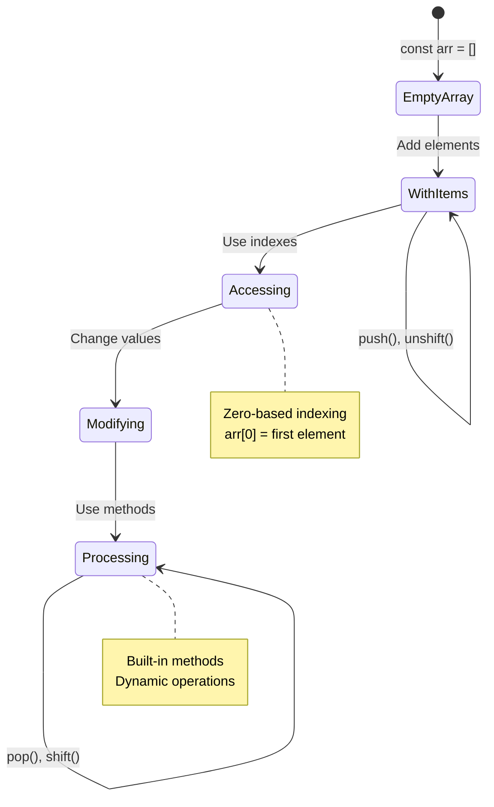

> **বাস্তব জীবনের অন্তর্দৃষ্টি**: প্রোগ্রামিংয়ে অ্যারে সর্বত্র রয়েছে! সোশ্যাল মিডিয়া ফিড, শপিং কার্ট, ফটো গ্যালারি, প্লেলিস্টের গান - এগুলো সবই অ্যারের মাধ্যমে কাজ করে!

## লুপ

চার্লস ডিকেন্সের উপন্যাসে বিখ্যাত শাস্তি যেখানে ছাত্রদের বারবার স্লেটে লাইন লিখতে হতো, সেটি ভাবুন। কল্পনা করুন যদি আপনি কাউকে বলতে পারেন "এই বাক্যটি ১০০ বার লিখুন" এবং এটি স্বয়ংক্রিয়ভাবে সম্পন্ন হয়। লুপ ঠিক এটাই করে আপনার কোডের জন্য।

লুপ হলো এমন একটি tireless সহকারী যা কাজগুলো বারবার ভুল ছাড়াই সম্পন্ন করতে পারে। আপনি যদি শপিং কার্টের প্রতিটি আইটেম পরীক্ষা করতে চান বা অ্যালবামের সব ফটো প্রদর্শন করতে চান, তাহলে লুপ দক্ষতার সাথে পুনরাবৃত্তি পরিচালনা করে।

জাভাস্ক্রিপ্টে বিভিন্ন ধরনের লুপ রয়েছে। চলুন প্রতিটি লুপ পরীক্ষা করি এবং কখন সেগুলো ব্যবহার করতে হয় তা বুঝি।

```mermaid
flowchart TD
    A["🔄 Loop Types"] --> B["For Loop"]
    A --> C["While Loop"]
    A --> D["For...of Loop"]
    A --> E["forEach Method"]
    
    B --> B1["Known iterations"]
    B --> B2["Counter-based"]
    B --> B3["for(init; condition; increment)"]
    
    C --> C1["Unknown iterations"]
    C --> C2["Condition-based"]
    C --> C3["while(condition)"]
    
    D --> D1["Modern ES6+"]
    D --> D2["Array iteration"]
    D --> D3["for(item of array)"]
    
    E --> E1["Functional style"]
    E --> E2["Array method"]
    E --> E3["array.forEach(callback)"]
    
    F["⏰ When to Use"] --> F1["For: Counting, indexes"]
    F --> F2["While: User input, searching"]
    F --> F3["For...of: Simple iteration"]
    F --> F4["forEach: Functional programming"]
    
    style A fill:#e3f2fd
    style B fill:#e8f5e8
    style C fill:#fff3e0
    style D fill:#f3e5f5
    style E fill:#e0f2f1
    style F fill:#fce4ec
```

### ফর লুপ

`for` লুপ হলো একটি টাইমার সেট করার মতো - আপনি জানেন ঠিক কতবার কিছু ঘটতে হবে। এটি খুবই সংগঠিত এবং পূর্বানুমানযোগ্য, যা এটিকে অ্যারে নিয়ে কাজ করার সময় বা কিছু গণনা করার জন্য আদর্শ করে তোলে।

**ফর লুপের কাঠামো:**

| উপাদান | উদ্দেশ্য | উদাহরণ |
|-----------|---------|----------|
| **ইনিশিয়ালাইজেশন** | শুরু বিন্দু সেট করে | `let i = 0` |
| **শর্ত** | কখন চালিয়ে যেতে হবে | `i < 10` |
| **ইনক্রিমেন্ট** | কীভাবে আপডেট হবে | `i++` |

```javascript
// Counting from 0 to 9
for (let i = 0; i < 10; i++) {
  console.log(`Count: ${i}`);
}

// More practical example: processing scores
const testScores = [85, 92, 78, 96, 88];
for (let i = 0; i < testScores.length; i++) {
  console.log(`Student ${i + 1}: ${testScores[i]}%`);
}
```

**ধাপে ধাপে কী ঘটছে:**
- **ইনিশিয়ালাইজ করে** কাউন্টার ভেরিয়েবল `i` কে ০ দিয়ে শুরুতে
- **পরীক্ষা করে** শর্ত `i < 10` প্রতিটি পুনরাবৃত্তির আগে
- **কোড ব্লক সম্পাদন করে** যখন শর্ত সত্য হয়
- **ইনক্রিমেন্ট করে** `i` কে প্রতিটি পুনরাবৃত্তির পরে `i++` দিয়ে
- **থামে** যখন শর্ত মিথ্যা হয় (যখন `i` ১০ এ পৌঁছায়)

✅ এই কোডটি ব্রাউজারের কনসোলে চালান। যখন আপনি কাউন্টার, শর্ত বা পুনরাবৃত্তি প্রকাশে ছোট পরিবর্তন করেন তখন কী ঘটে? আপনি কি এটি উল্টোভাবে চালাতে পারেন, একটি কাউন্টডাউন তৈরি করতে?

### 🗓️ **ফর লুপ মাস্টারি যাচাই: নিয়ন্ত্রিত পুনরাবৃত্তি**

**আপনার ফর লুপ বোঝার মূল্যায়ন করুন:**
- ফর লুপের তিনটি অংশ কী এবং প্রতিটি কী করে?
- কীভাবে আপনি একটি অ্যারে উল্টোভাবে লুপ করবেন?
- যদি আপনি ইনক্রিমেন্ট অংশটি (`i++`) ভুলে যান তাহলে কী হবে?

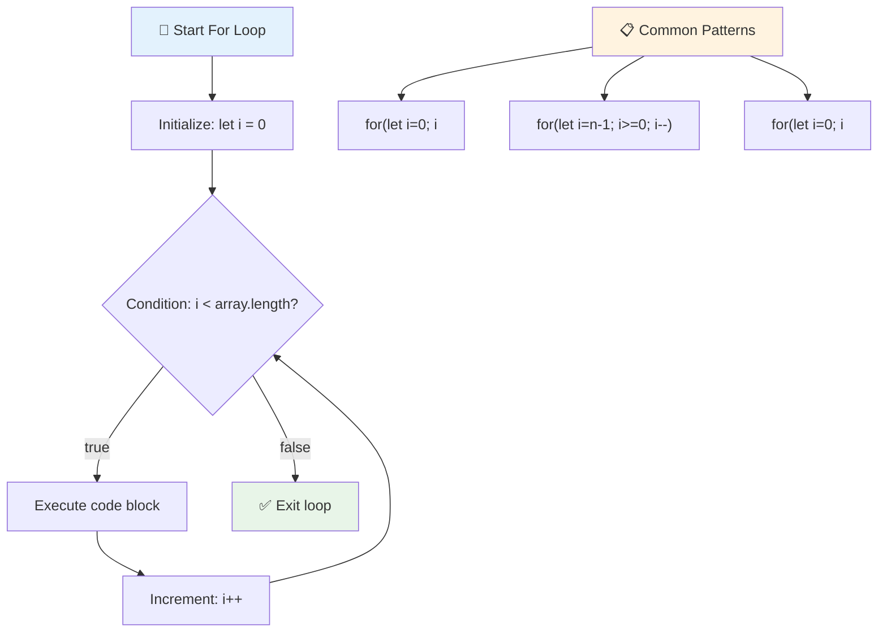

> **লুপের জ্ঞান**: ফর লুপ আদর্শ যখন আপনি জানেন ঠিক কতবার কিছু পুনরাবৃত্তি করতে হবে। এটি অ্যারে প্রক্রিয়াকরণের জন্য সবচেয়ে সাধারণ পছন্দ!

### হোয়াইল লুপ

`while` লুপ হলো "এটি চালিয়ে যান যতক্ষণ না..." বলার মতো - আপনি ঠিক কতবার এটি চলবে তা জানেন না, কিন্তু আপনি জানেন কখন থামতে হবে। এটি এমন পরিস্থিতির জন্য আদর্শ যেখানে আপনি ব্যবহারকারীর ইনপুট চাইছেন যতক্ষণ না তারা সঠিক তথ্য দেয়, বা ডেটা অনুসন্ধান করছেন যতক্ষণ না আপনি যা খুঁজছেন তা খুঁজে পান।

**হোয়াইল লুপের বৈশিষ্ট্য:**
- **চালিয়ে যায়** যতক্ষণ শর্ত সত্য থাকে
- **প্রয়োজন হয়** ম্যানুয়াল ব্যবস্থাপনার কোনো কাউন্টার ভেরিয়েবলের
- **পরীক্ষা করে** শর্ত প্রতিটি পুনরাবৃত্তির আগে
- **ঝুঁকি থাকে** অনন্ত লুপের যদি শর্ত কখনো মিথ্যা না হয়

```javascript
// Basic counting example
let i = 0;
while (i < 10) {
  console.log(`While count: ${i}`);
  i++; // Don't forget to increment!
}

// More practical example: processing user input
let userInput = "";
let attempts = 0;
const maxAttempts = 3;

while (userInput !== "quit" && attempts < maxAttempts) {
  userInput = prompt(`Enter 'quit' to exit (attempt ${attempts + 1}):`);
  attempts++;
}

if (attempts >= maxAttempts) {
  console.log("Maximum attempts reached!");
}
```

**এই উদাহরণগুলো বুঝুন:**
- **ম্যানেজ করে** কাউন্টার ভেরিয়েবল `i` লুপ বডির ভিতরে ম্যানুয়ালি
- **ইনক্রিমেন্ট করে** কাউন্টার অনন্ত লুপ প্রতিরোধ করতে
- **প্রদর্শন করে** ব্যবহারকারীর ইনপুট এবং প্রচেষ্টা সীমিত করার ব্যবহারিক উদাহরণ
- **অন্তর্ভুক্ত করে** নিরাপত্তা ব্যবস্থা অনন্ত কার্যকরতা প্রতিরোধ করতে

### ♾️ **হোয়াইল লুপের জ্ঞান যাচাই: শর্ত-ভিত্তিক পুনরাবৃত্তি**

**আপনার হোয়াইল লুপ বোঝার পরীক্ষা করুন:**
- হোয়াইল লুপ ব্যবহার করার প্রধান ঝুঁকি কী?
- কখন আপনি ফর লুপের পরিবর্তে হোয়াইল লুপ বেছে নেবেন?
- কীভাবে আপনি অনন্ত লুপ প্রতিরোধ করবেন?

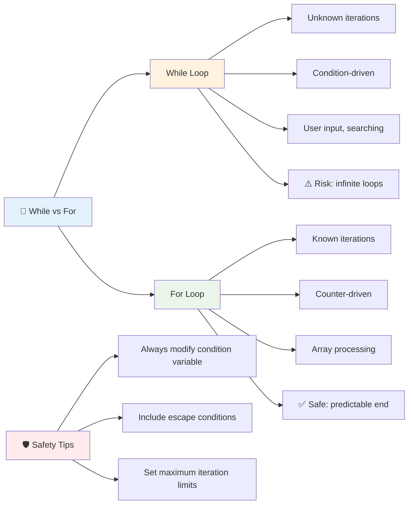

> **নিরাপত্তা প্রথম**: হোয়াইল লুপ শক্তিশালী কিন্তু শর্ত ব্যবস্থাপনায় সতর্কতা প্রয়োজন। সবসময় নিশ্চিত করুন আপনার লুপ শর্ত শেষ পর্যন্ত মিথ্যা হবে!

### আধুনিক লুপের বিকল্প

জাভাস্ক্রিপ্ট আধুনিক লুপ সিনট্যাক্স প্রদান করে যা আপনার কোডকে আরও পাঠযোগ্য এবং কম ত্রুটিপূর্ণ করে তুলতে পারে।

**For...of লুপ (ES6+):**

```javascript
const colors = ["red", "green", "blue", "yellow"];

// Modern approach - cleaner and safer
for (const color of colors) {
  console.log(`Color: ${color}`);
}

// Compare with traditional for loop
for (let i = 0; i < colors.length; i++) {
  console.log(`Color: ${colors[i]}`);
}
```

**For...of এর প্রধান সুবিধা:**
- **ইনডেক্স ব্যবস্থাপনা এবং সম্ভাব্য ত্রুটি দূর করে**
- **অ্যারের উপাদানগুলোর সরাসরি অ্যাক্সেস প্রদান করে**
- **কোডের পাঠযোগ্যতা উন্নত করে এবং সিনট্যাক্স জটিলতা কমায়**

**forEach মেথড:**

```javascript
const prices = [9.99, 15.50, 22.75, 8.25];

// Using forEach for functional programming style
prices.forEach((price, index) => {
  console.log(`Item ${index + 1}: $${price.toFixed(2)}`);
});

// forEach with arrow functions for simple operations
prices.forEach(price => console.log(`Price: $${price}`));
```

**forEach সম্পর্কে যা জানা প্রয়োজন:**
- **প্রতিটি অ্যারে উপাদানের জন্য একটি ফাংশন সম্পাদন করে**
- **উপাদানের মান এবং ইনডেক্স উভয়ই প্যারামিটার হিসেবে প্রদান করে**
- **প্রথম দিকে থামানো যায় না (প্রথাগত লুপের মতো নয়)**
- **undefined ফেরত দেয় (নতুন অ্যারে তৈরি করে না)**

✅ কেন আপনি ফর লুপ বনাম হোয়াইল লুপ বেছে নেবেন? StackOverflow-এ ১৭ হাজার দর্শক একই প্রশ্ন করেছিলেন, এবং কিছু মতামত [আপনার জন্য আকর্ষণীয় হতে পারে](https://stackoverflow.com/questions/39969145/while-loops-vs-for-loops-in-javascript)।

### 🎨 **আধুনিক লুপ সিনট্যাক্স যাচাই: ES6+ গ্রহণ করা**

**আপনার আধুনিক জাভাস্ক্রিপ্ট বোঝার মূল্যায়ন করুন:**
- `for...of` এর সুবিধাগুলো প্রথাগত ফর লুপের তুলনায় কী?
- কখন আপনি এখনও প্রথাগত ফর লুপ পছন্দ করবেন?
- `forEach` এবং `map` এর মধ্যে পার্থক্য কী?

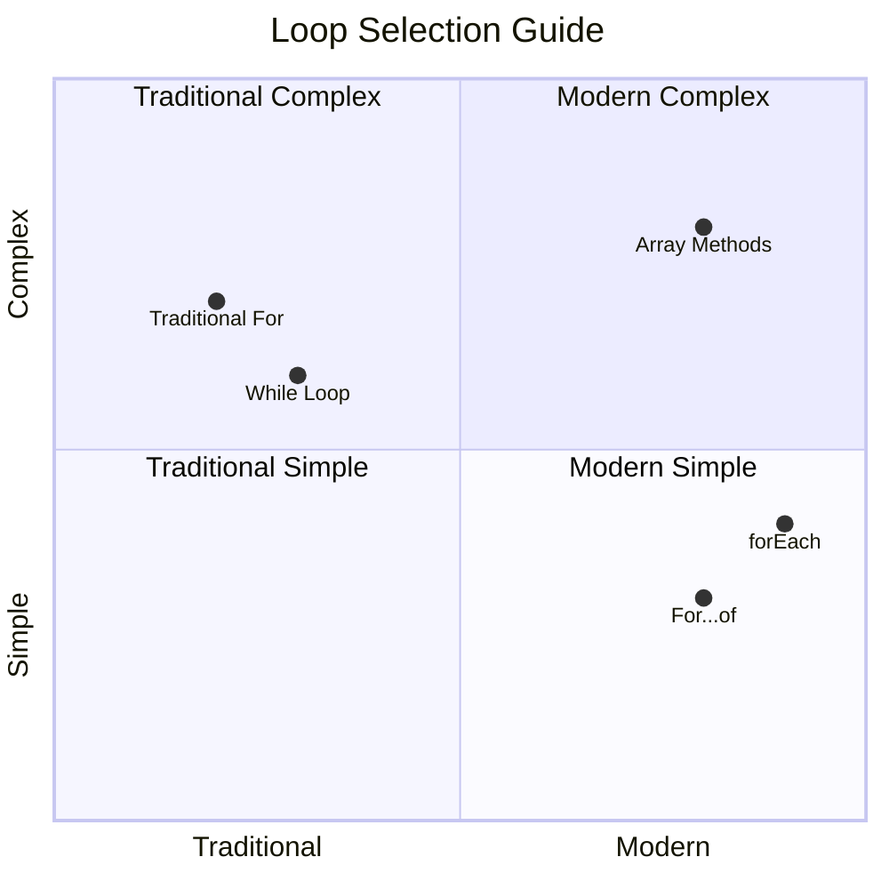

> **আধুনিক প্রবণতা**: ES6+ সিনট্যাক্স যেমন `for...of` এবং `forEach` অ্যারে পুনরাবৃত্তির জন্য পছন্দের পদ্ধতি হয়ে উঠছে কারণ এটি পরিষ্কার এবং কম ত্রুটিপূর্ণ!

## লুপ এবং অ্যারে

অ্যারে এবং লুপ একত্রিত করে শক্তিশালী তথ্য প্রক্রিয়াকরণ ক্ষমতা তৈরি করে। এই জুটি অনেক প্রোগ্রামিং কাজের জন্য মৌলিক, যেমন তালিকা প্রদর্শন করা বা পরিসংখ্যান গণনা করা।

**প্রথাগত অ্যারে প্রক্রিয়াকরণ:**

```javascript
const iceCreamFlavors = ["Chocolate", "Strawberry", "Vanilla", "Pistachio", "Rocky Road"];

// Classic for loop approach
for (let i = 0; i < iceCreamFlavors.length; i++) {
  console.log(`Flavor ${i + 1}: ${iceCreamFlavors[i]}`);
}

// Modern for...of approach
for (const flavor of iceCreamFlavors) {
  console.log(`Available flavor: ${flavor}`);
}
```

**প্রতিটি পদ্ধতি বুঝুন:**
- **ব্যবহার করে** অ্যারের দৈর্ঘ্য প্রপার্টি লুপের সীমা নির্ধারণ করতে
- **অ্যাক্সেস করে** ইনডেক্স দ্বারা উপাদান প্রথাগত ফর লুপে
- **সরাসরি উপাদান অ্যাক্সেস প্রদান করে** for...of লুপে
- **প্রতিটি অ্যারে উপাদান একবার করে প্রক্রিয়া করে**

**ব্যবহারিক তথ্য প্রক্রিয়াকরণ উদাহরণ:**

```javascript
const studentGrades = [85, 92, 78, 96, 88, 73, 89];
let total = 0;
let highestGrade = studentGrades[0];
let lowestGrade = studentGrades[0];

// Process all grades with a single loop
for (let i = 0; i < studentGrades.length; i++) {
  const grade = studentGrades[i];
  total += grade;
  
  if (grade > highestGrade) {
    highestGrade = grade;
  }
  
  if (grade < lowestGrade) {
    lowestGrade = grade;
  }
}

const average = total / studentGrades.length;
console.log(`Average: ${average.toFixed(1)}`);
console.log(`Highest: ${highestGrade}`);
console.log(`Lowest: ${lowestGrade}`);
```

**এই কোড কীভাবে কাজ করে:**
- **ট্র্যাকিং ভেরিয়েবল ইনিশিয়ালাইজ করে** যোগফল এবং চরম মানের জন্য
- **প্রতিটি গ্রেড প্রক্রিয়া করে** একটি একক দক্ষ লুপে
- **মোট যোগফল জমা করে** গড় গণনার জন্য
- **সর্বোচ্চ এবং সর্বনিম্ন মান ট্র্যাক করে** পুনরাবৃত্তির সময়
- **চূড়ান্ত পরিসংখ্যান গণনা করে** লুপ সম্পন্ন হওয়ার পরে

✅ আপনার নিজের তৈরি করা অ্যারে নিয়ে ব্রাউজারের কনসোলে লুপিং পরীক্ষা করুন।

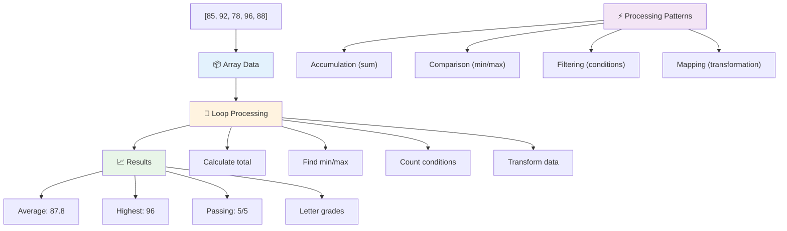

---

## GitHub Copilot Agent Challenge 🚀

Agent মোড ব্যবহার করে নিম্নলিখিত চ্যালেঞ্জ সম্পন্ন করুন:

**বর্ণনা:** একটি ব্যাপক তথ্য প্রক্রিয়াকরণ ফাংশন তৈরি করুন যা অ্যারে এবং লুপ একত্রিত করে একটি ডেটাসেট বিশ্লেষণ করে এবং অর্থপূর্ণ অন্তর্দৃষ্টি তৈরি করে।

**প্রম্পট:** `analyzeGrades` নামে একটি ফাংশন তৈরি করুন যা ছাত্রদের গ্রেড অবজেক্টের একটি অ্যারে নেয় (প্রত্যেকটিতে name এবং score প্রপার্টি থাকে) এবং একটি অবজেক্ট ফেরত দেয় যার মধ্যে পরিসংখ্যান থাকে যেমন সর্বোচ্চ স্কোর, সর্বনিম্ন স্কোর, গড় স্কোর, পাস করা ছাত্রদের সংখ্যা (স্কোর >= ৭০), এবং গড়ের উপরে স্কোর করা ছাত্রদের নামের একটি অ্যারে। আপনার সমাধানে অন্তত দুটি ভিন্ন লুপ টাইপ ব্যবহার করুন।

Agent মোড সম্পর্কে আরও জানুন [এখানে](https://code.visualstudio.com/blogs/2025/02/24/introducing-copilot-agent-mode)।

## 🚀 চ্যালেঞ্জ
জাভাস্ক্রিপ্টে বেশ কিছু আধুনিক অ্যারে মেথড রয়েছে যা নির্দিষ্ট কাজের জন্য প্রচলিত লুপগুলোর বিকল্প হতে পারে। [forEach](https://developer.mozilla.org/docs/Web/JavaScript/Reference/Global_Objects/Array/forEach), [for-of](https://developer.mozilla.org/docs/Web/JavaScript/Reference/Statements/for...of), [map](https://developer.mozilla.org/docs/Web/JavaScript/Reference/Global_Objects/Array/map), [filter](https://developer.mozilla.org/docs/Web/JavaScript/Reference/Global_Objects/Array/filter), এবং [reduce](https://developer.mozilla.org/docs/Web/JavaScript/Reference/Global_Objects/Array/reduce) সম্পর্কে জানুন।

**আপনার চ্যালেঞ্জ:** অন্তত তিনটি ভিন্ন অ্যারে মেথড ব্যবহার করে ছাত্রদের গ্রেডের উদাহরণটি পুনর্গঠন করুন। লক্ষ্য করুন, আধুনিক জাভাস্ক্রিপ্ট সিনট্যাক্স ব্যবহার করে কোড কতটা পরিষ্কার এবং সহজবোধ্য হয়ে ওঠে।

## পোস্ট-লেকচার কুইজ
[পোস্ট-লেকচার কুইজ](https://ff-quizzes.netlify.app/web/quiz/14)

## রিভিউ এবং স্ব-অধ্যয়ন

জাভাস্ক্রিপ্টে অ্যারেগুলোর সাথে অনেক মেথড সংযুক্ত থাকে, যা ডেটা ম্যানিপুলেশনের জন্য অত্যন্ত কার্যকর। [এই মেথডগুলো সম্পর্কে পড়ুন](https://developer.mozilla.org/docs/Web/JavaScript/Reference/Global_Objects/Array) এবং আপনার তৈরি করা একটি অ্যারেতে কিছু মেথড (যেমন push, pop, slice এবং splice) ব্যবহার করে দেখুন।

## অ্যাসাইনমেন্ট

[অ্যারে লুপ করুন](assignment.md)

---

## 📊 **আপনার অ্যারে এবং লুপ টুলকিট সারাংশ**

```mermaid
graph TD
    A["🎯 Arrays & Loops Mastery"] --> B["📦 Array Fundamentals"]
    A --> C["🔄 Loop Types"]
    A --> D["🔗 Data Processing"]
    A --> E["🎨 Modern Techniques"]
    
    B --> B1["Creation: [ ]"]
    B --> B2["Indexing: arr[0]"]
    B --> B3["Methods: push, pop"]
    B --> B4["Properties: length"]
    
    C --> C1["For: Known iterations"]
    C --> C2["While: Condition-based"]
    C --> C3["For...of: Direct access"]
    C --> C4["forEach: Functional"]
    
    D --> D1["Statistics calculation"]
    D --> D2["Data transformation"]
    D --> D3["Filtering & searching"]
    D --> D4["Real-time processing"]
    
    E --> E1["Arrow functions"]
    E --> E2["Method chaining"]
    E --> E3["Destructuring"]
    E --> E4["Template literals"]
    
    F["💡 Key Benefits"] --> F1["Efficient data handling"]
    F --> F2["Reduced code repetition"]
    F --> F3["Scalable solutions"]
    F --> F4["Cleaner syntax"]
    
    style A fill:#e3f2fd
    style B fill:#e8f5e8
    style C fill:#fff3e0
    style D fill:#f3e5f5
    style E fill:#e0f2f1
    style F fill:#fce4ec
```

---

## 🚀 আপনার অ্যারে এবং লুপ দক্ষতার টাইমলাইন

### ⚡ **পরবর্তী ৫ মিনিটে আপনি যা করতে পারেন**
- [ ] আপনার প্রিয় সিনেমার একটি অ্যারে তৈরি করুন এবং নির্দিষ্ট উপাদানগুলো অ্যাক্সেস করুন
- [ ] ১ থেকে ১০ পর্যন্ত গণনা করার জন্য একটি for লুপ লিখুন
- [ ] লেসনের আধুনিক অ্যারে মেথড চ্যালেঞ্জটি চেষ্টা করুন
- [ ] আপনার ব্রাউজারের কনসোলে অ্যারে ইনডেক্সিং অনুশীলন করুন

### 🎯 **এই ঘণ্টায় আপনি যা অর্জন করতে পারেন**
- [ ] পোস্ট-লেসন কুইজ সম্পন্ন করুন এবং যেকোনো চ্যালেঞ্জিং ধারণা পর্যালোচনা করুন
- [ ] GitHub Copilot চ্যালেঞ্জ থেকে সম্পূর্ণ গ্রেড বিশ্লেষক তৈরি করুন
- [ ] একটি সাধারণ শপিং কার্ট তৈরি করুন যা আইটেম যোগ এবং সরিয়ে দেয়
- [ ] বিভিন্ন লুপ টাইপের মধ্যে রূপান্তর অনুশীলন করুন
- [ ] push, pop, slice এবং splice এর মতো অ্যারে মেথড নিয়ে পরীক্ষা করুন

### 📅 **আপনার সপ্তাহব্যাপী ডেটা প্রসেসিং যাত্রা**
- [ ] "অ্যারে লুপ করুন" অ্যাসাইনমেন্টটি সৃজনশীল উন্নয়নের সাথে সম্পন্ন করুন
- [ ] অ্যারে এবং লুপ ব্যবহার করে একটি টু-ডু লিস্ট অ্যাপ্লিকেশন তৈরি করুন
- [ ] সংখ্যাসংক্রান্ত ডেটার জন্য একটি সাধারণ পরিসংখ্যান ক্যালকুলেটর তৈরি করুন
- [ ] [MDN অ্যারে মেথড](https://developer.mozilla.org/docs/Web/JavaScript/Reference/Global_Objects/Array) নিয়ে অনুশীলন করুন
- [ ] একটি ফটো গ্যালারি বা মিউজিক প্লেলিস্ট ইন্টারফেস তৈরি করুন
- [ ] `map`, `filter`, এবং `reduce` দিয়ে ফাংশনাল প্রোগ্রামিং অন্বেষণ করুন

### 🌟 **আপনার মাসব্যাপী রূপান্তর**
- [ ] উন্নত অ্যারে অপারেশন এবং পারফরম্যান্স অপ্টিমাইজেশন আয়ত্ত করুন
- [ ] একটি সম্পূর্ণ ডেটা ভিজ্যুয়ালাইজেশন ড্যাশবোর্ড তৈরি করুন
- [ ] ডেটা প্রসেসিং সম্পর্কিত ওপেন সোর্স প্রকল্পে অবদান রাখুন
- [ ] বাস্তব উদাহরণ দিয়ে কাউকে অ্যারে এবং লুপ সম্পর্কে শেখান
- [ ] পুনর্ব্যবহারযোগ্য ডেটা প্রসেসিং ফাংশনের একটি ব্যক্তিগত লাইব্রেরি তৈরি করুন
- [ ] অ্যারেগুলোর উপর ভিত্তি করে অ্যালগরিদম এবং ডেটা স্ট্রাকচার অন্বেষণ করুন

### 🏆 **চূড়ান্ত ডেটা প্রসেসিং চ্যাম্পিয়ন চেক-ইন**

**আপনার অ্যারে এবং লুপ দক্ষতা উদযাপন করুন:**
- বাস্তব জীবনের অ্যাপ্লিকেশনের জন্য আপনি কোন অ্যারে অপারেশনটি সবচেয়ে কার্যকর মনে করেছেন?
- কোন লুপ টাইপটি আপনার কাছে সবচেয়ে স্বাভাবিক মনে হয় এবং কেন?
- অ্যারে এবং লুপ সম্পর্কে বোঝার ফলে ডেটা সংগঠনের প্রতি আপনার দৃষ্টিভঙ্গি কীভাবে পরিবর্তিত হয়েছে?
- আপনি পরবর্তী কোন জটিল ডেটা প্রসেসিং কাজটি মোকাবিলা করতে চান?

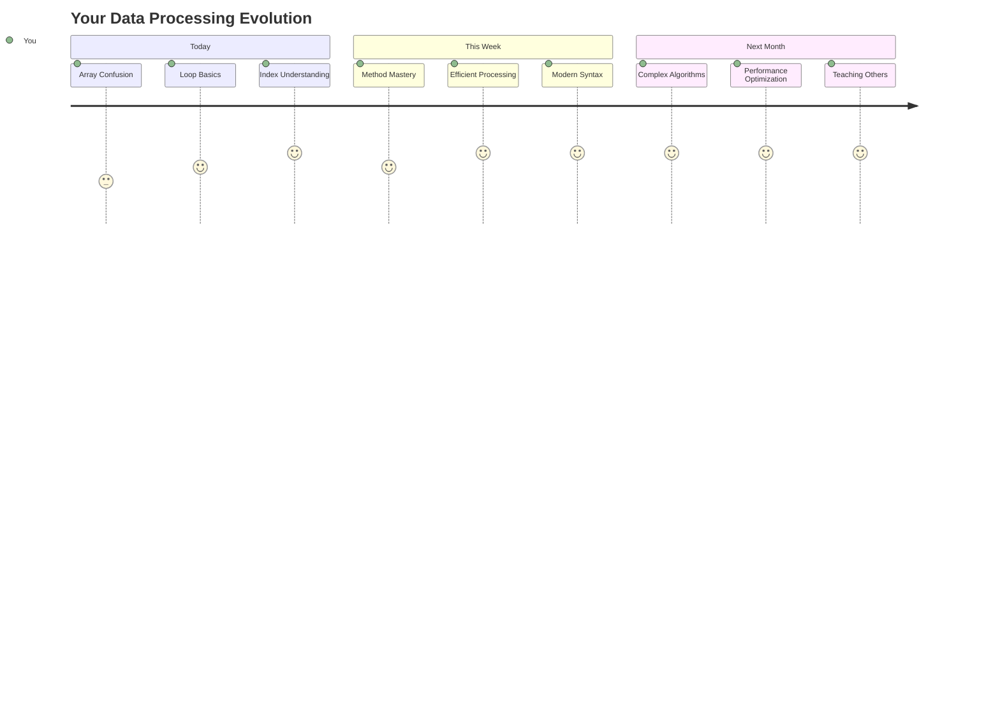

> 📦 **আপনি ডেটা সংগঠন এবং প্রসেসিংয়ের শক্তি আনলক করেছেন!** অ্যারে এবং লুপ প্রায় প্রতিটি অ্যাপ্লিকেশনের ভিত্তি যা আপনি কখনও তৈরি করবেন। সাধারণ তালিকা থেকে জটিল ডেটা বিশ্লেষণ পর্যন্ত, এখন আপনার কাছে তথ্য দক্ষ এবং মার্জিতভাবে পরিচালনা করার সরঞ্জাম রয়েছে। প্রতিটি ডায়নামিক ওয়েবসাইট, মোবাইল অ্যাপ এবং ডেটা-চালিত অ্যাপ্লিকেশন এই মৌলিক ধারণাগুলোর উপর নির্ভর করে। স্কেলযোগ্য ডেটা প্রসেসিংয়ের জগতে আপনাকে স্বাগতম! 🎉

---

**অস্বীকৃতি**:  
এই নথিটি AI অনুবাদ পরিষেবা [Co-op Translator](https://github.com/Azure/co-op-translator) ব্যবহার করে অনুবাদ করা হয়েছে। আমরা যথাসাধ্য সঠিকতার জন্য চেষ্টা করি, তবে অনুগ্রহ করে মনে রাখবেন যে স্বয়ংক্রিয় অনুবাদে ত্রুটি বা অসঙ্গতি থাকতে পারে। এর মূল ভাষায় থাকা নথিটিকে প্রামাণিক উৎস হিসেবে বিবেচনা করা উচিত। গুরুত্বপূর্ণ তথ্যের জন্য, পেশাদার মানব অনুবাদ সুপারিশ করা হয়। এই অনুবাদ ব্যবহারের ফলে কোনো ভুল বোঝাবুঝি বা ভুল ব্যাখ্যা হলে আমরা দায়বদ্ধ থাকব না।