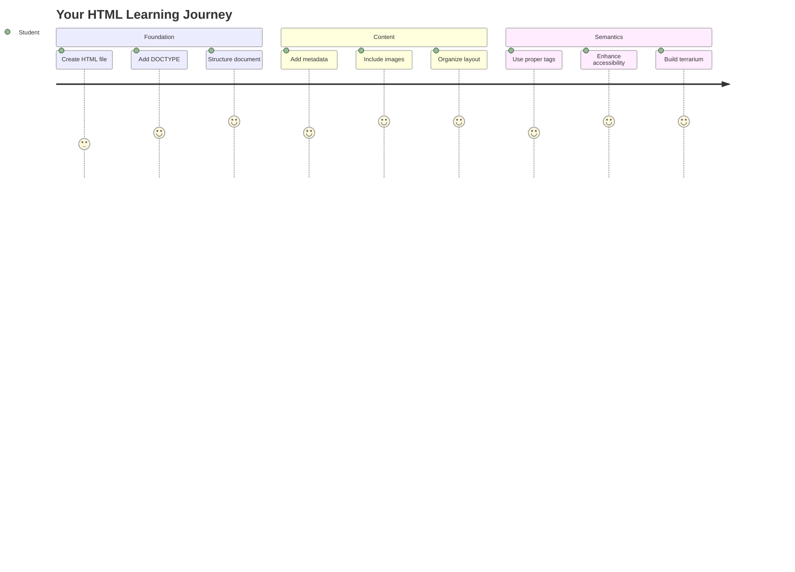
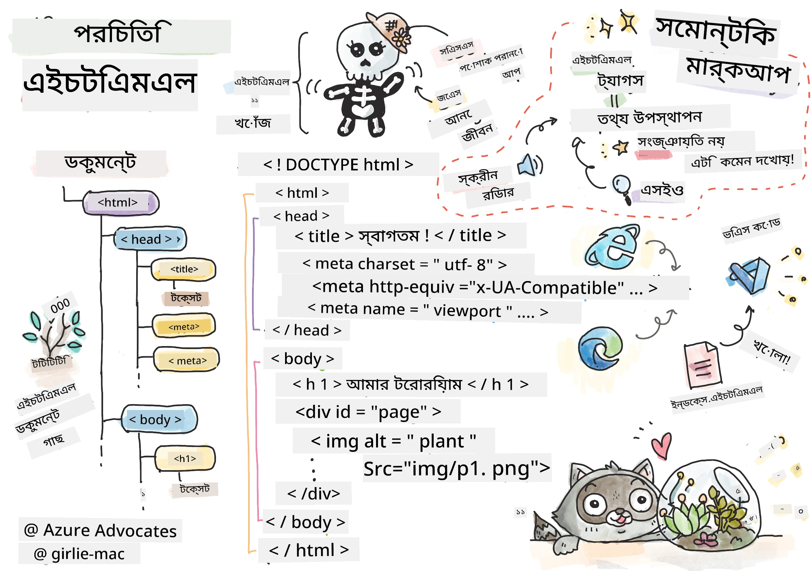
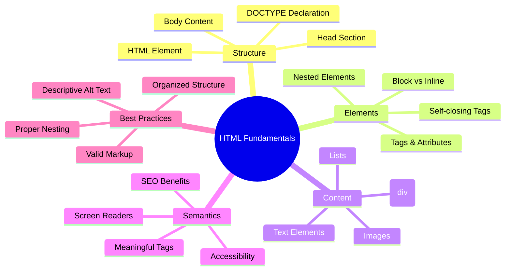
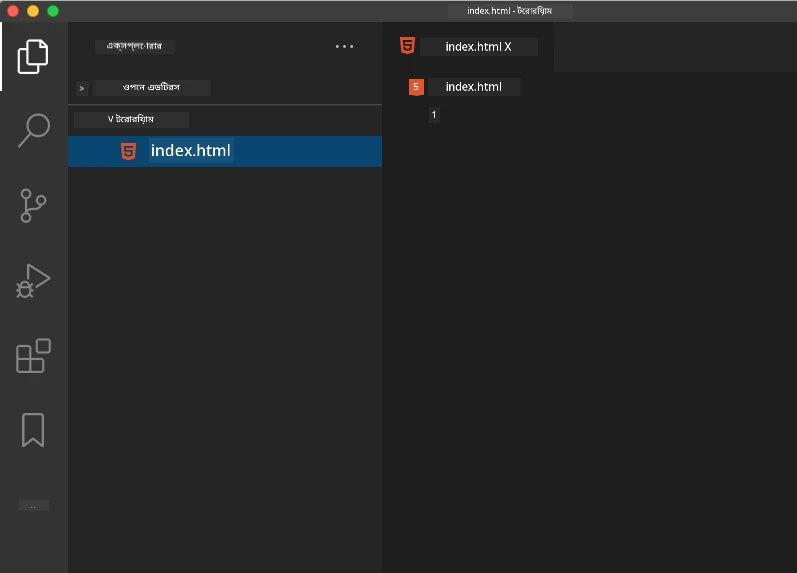
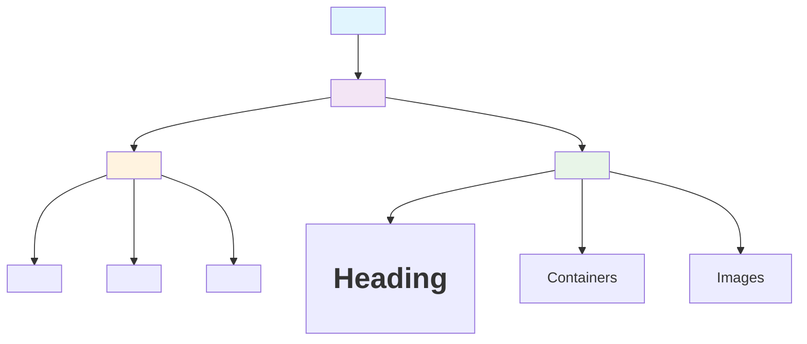
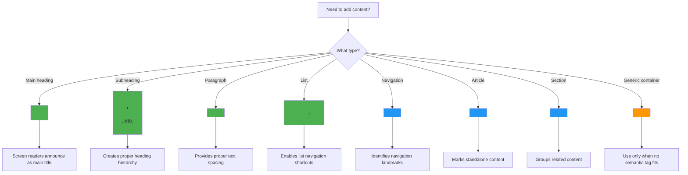
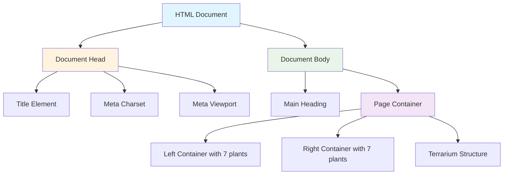
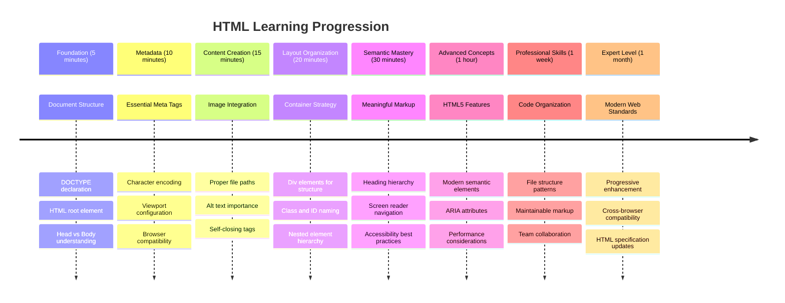

# টেরারিয়াম প্রকল্প পর্ব ১: HTML পরিচিতি




> স্কেচনোট [Tomomi Imura](https://twitter.com/girlie_mac) দ্বারা

HTML, বা HyperText Markup Language, প্রতিটি ওয়েবসাইটের ভিত্তি যা আপনি কখনও পরিদর্শন করেছেন। HTML কে ওয়েব পৃষ্ঠার কাঠামো হিসেবে ভাবুন – এটি নির্ধারণ করে কোথায় বিষয়বস্তু যাবে, কীভাবে এটি সংগঠিত হবে এবং প্রতিটি অংশ কী প্রতিনিধিত্ব করে। CSS পরে আপনার HTML-কে রঙ এবং লেআউট দিয়ে সাজাবে, এবং JavaScript এটিকে ইন্টারঅ্যাক্টিভিটি দিয়ে প্রাণবন্ত করবে, HTML সেই মৌলিক কাঠামো প্রদান করে যা সবকিছু সম্ভব করে তোলে।

এই পাঠে, আপনি একটি ভার্চুয়াল টেরারিয়াম ইন্টারফেসের HTML কাঠামো তৈরি করবেন। এই হাতে-কলমে প্রকল্পটি আপনাকে মৌলিক HTML ধারণা শেখাবে এবং একই সাথে কিছু চাক্ষুষভাবে আকর্ষণীয় তৈরি করবে। আপনি শিখবেন কীভাবে বিষয়বস্তুকে সেমান্টিক উপাদান ব্যবহার করে সংগঠিত করতে হয়, ছবি নিয়ে কাজ করতে হয় এবং একটি ইন্টারঅ্যাক্টিভ ওয়েব অ্যাপ্লিকেশনের ভিত্তি তৈরি করতে হয়।

পাঠ শেষে, আপনার একটি কার্যকর HTML পৃষ্ঠা থাকবে যা গাছের ছবি সংগঠিত কলামে প্রদর্শন করবে, যা পরবর্তী পাঠে স্টাইলিংয়ের জন্য প্রস্তুত। যদি এটি প্রথমে সাধারণ দেখায়, চিন্তা করবেন না – CSS যোগ করার আগে HTML ঠিক এমনটাই হওয়া উচিত।



## প্রাক-লেকচার কুইজ

[প্রাক-লেকচার কুইজ](https://ff-quizzes.netlify.app/web/quiz/15)

> 📺 **দেখুন এবং শিখুন**: এই সহায়ক ভিডিও ওভারভিউটি দেখুন
> 
> [](https://www.youtube.com/watch?v=1TvxJKBzhyQ)

## আপনার প্রকল্প সেট আপ করা

HTML কোডে ডুব দেওয়ার আগে, আপনার টেরারিয়াম প্রকল্পের জন্য একটি সঠিক কর্মক্ষেত্র সেট আপ করা যাক। শুরু থেকেই একটি সংগঠিত ফাইল কাঠামো তৈরি করা একটি গুরুত্বপূর্ণ অভ্যাস যা আপনার ওয়েব ডেভেলপমেন্ট যাত্রায় আপনাকে সাহায্য করবে।

### কাজ: আপনার প্রকল্পের কাঠামো তৈরি করুন

আপনি আপনার টেরারিয়াম প্রকল্পের জন্য একটি নিবেদিত ফোল্ডার তৈরি করবেন এবং আপনার প্রথম HTML ফাইল যোগ করবেন। এখানে দুটি পদ্ধতি রয়েছে যা আপনি ব্যবহার করতে পারেন:

**অপশন ১: ভিজ্যুয়াল স্টুডিও কোড ব্যবহার করে**
1. ভিজ্যুয়াল স্টুডিও কোড খুলুন
2. "File" → "Open Folder" ক্লিক করুন অথবা `Ctrl+K, Ctrl+O` (Windows/Linux) বা `Cmd+K, Cmd+O` (Mac) ব্যবহার করুন
3. `terrarium` নামে একটি নতুন ফোল্ডার তৈরি করুন এবং এটি নির্বাচন করুন
4. Explorer প্যানেলে, "New File" আইকনে ক্লিক করুন
5. আপনার ফাইলের নাম দিন `index.html`



**অপশন ২: টার্মিনাল কমান্ড ব্যবহার করে**
```bash
mkdir terrarium
cd terrarium
touch index.html
code index.html
```

**এই কমান্ডগুলো কী করে:**
- **নতুন ডিরেক্টরি তৈরি করে** `terrarium` নামে আপনার প্রকল্পের জন্য
- **ডিরেক্টরিতে প্রবেশ করে** `terrarium` 
- **একটি খালি `index.html` ফাইল তৈরি করে**
- **ফাইলটি খুলে** ভিজ্যুয়াল স্টুডিও কোডে সম্পাদনার জন্য

> 💡 **প্রো টিপ**: ওয়েব ডেভেলপমেন্টে `index.html` ফাইলের নামটি বিশেষ। যখন কেউ একটি ওয়েবসাইট পরিদর্শন করে, ব্রাউজার স্বয়ংক্রিয়ভাবে `index.html` কে ডিফল্ট পৃষ্ঠা হিসেবে প্রদর্শন করার জন্য খুঁজে বের করে। এর মানে হল যে `https://mysite.com/projects/` এর মতো একটি URL স্বয়ংক্রিয়ভাবে `projects` ফোল্ডার থেকে `index.html` ফাইলটি পরিবেশন করবে, URL-এ ফাইলের নাম উল্লেখ করার প্রয়োজন ছাড়াই।

## HTML ডকুমেন্টের কাঠামো বোঝা

প্রতিটি HTML ডকুমেন্ট একটি নির্দিষ্ট কাঠামো অনুসরণ করে যা ব্রাউজারগুলি সঠিকভাবে বুঝতে এবং প্রদর্শন করতে প্রয়োজন। এই কাঠামোটি একটি আনুষ্ঠানিক চিঠির মতো – এতে একটি নির্দিষ্ট ক্রমে প্রয়োজনীয় উপাদান রয়েছে যা প্রাপক (এই ক্ষেত্রে, ব্রাউজার) বিষয়বস্তু সঠিকভাবে প্রক্রিয়া করতে সাহায্য করে।



চলুন শুরু করি সেই মৌলিক ভিত্তি যোগ করে যা প্রতিটি HTML ডকুমেন্টে প্রয়োজন।

### DOCTYPE ঘোষণা এবং মূল উপাদান

যেকোনো HTML ফাইলের প্রথম দুটি লাইন ব্রাউজারের কাছে ডকুমেন্টের "পরিচিতি" হিসেবে কাজ করে:

```html
<!DOCTYPE html>
<html></html>
```

**এই কোডটি কী করে:**
- **ডকুমেন্ট টাইপ ঘোষণা করে** HTML5 হিসেবে `<!DOCTYPE html>` ব্যবহার করে
- **মূল `<html>` উপাদান তৈরি করে** যা সমস্ত পৃষ্ঠার বিষয়বস্তু ধারণ করবে
- **আধুনিক ওয়েব স্ট্যান্ডার্ড প্রতিষ্ঠা করে** সঠিক ব্রাউজার রেন্ডারিংয়ের জন্য
- **বিভিন্ন ব্রাউজার এবং ডিভাইস জুড়ে** সামঞ্জস্যপূর্ণ প্রদর্শন নিশ্চিত করে

> 💡 **VS Code টিপ**: ভিজ্যুয়াল স্টুডিও কোডে যেকোনো HTML ট্যাগের উপর মাউস রাখুন এবং MDN Web Docs থেকে সহায়ক তথ্য দেখুন, যার মধ্যে ব্যবহার উদাহরণ এবং ব্রাউজার সামঞ্জস্যতার বিবরণ রয়েছে।

> 📚 **আরও জানুন**: DOCTYPE ঘোষণা ব্রাউজারগুলিকে "quirks mode" এ প্রবেশ করা থেকে বিরত রাখে, যা খুব পুরানো ওয়েবসাইটগুলিকে সমর্থন করার জন্য ব্যবহৃত হত। আধুনিক ওয়েব ডেভেলপমেন্ট সহজ `<!DOCTYPE html>` ঘোষণা ব্যবহার করে [স্ট্যান্ডার্ড-কমপ্লায়েন্ট রেন্ডারিং](https://developer.mozilla.org/docs/Web/HTML/Quirks_Mode_and_Standards_Mode) নিশ্চিত করে।

### 🔄 **শিক্ষামূলক চেক-ইন**
**থামুন এবং চিন্তা করুন**: চালিয়ে যাওয়ার আগে নিশ্চিত করুন:
- ✅ কেন প্রতিটি HTML ডকুমেন্টে DOCTYPE ঘোষণা প্রয়োজন
- ✅ `<html>` মূল উপাদান কী ধারণ করে
- ✅ কীভাবে এই কাঠামো ব্রাউজারগুলিকে পৃষ্ঠাগুলি সঠিকভাবে রেন্ডার করতে সাহায্য করে

**দ্রুত স্ব-পরীক্ষা**: আপনি কি আপনার নিজের ভাষায় "স্ট্যান্ডার্ড-কমপ্লায়েন্ট রেন্ডারিং" এর অর্থ ব্যাখ্যা করতে পারেন?

## প্রয়োজনীয় ডকুমেন্ট মেটাডেটা যোগ করা

HTML ডকুমেন্টের `<head>` অংশে গুরুত্বপূর্ণ তথ্য থাকে যা ব্রাউজার এবং সার্চ ইঞ্জিনের প্রয়োজন, কিন্তু দর্শকরা সরাসরি পৃষ্ঠায় দেখতে পান না। এটি "পর্দার পিছনের" তথ্যের মতো যা আপনার ওয়েবপৃষ্ঠাকে সঠিকভাবে কাজ করতে এবং বিভিন্ন ডিভাইস এবং প্ল্যাটফর্ম জুড়ে সঠিকভাবে প্রদর্শিত হতে সাহায্য করে।

এই মেটাডেটা ব্রাউজারগুলিকে আপনার পৃষ্ঠা কীভাবে প্রদর্শন করতে হবে, কোন ক্যারেক্টার এনকোডিং ব্যবহার করতে হবে এবং বিভিন্ন স্ক্রিন সাইজ কীভাবে পরিচালনা করতে হবে তা বলে – যা পেশাদার, অ্যাক্সেসযোগ্য ওয়েব পৃষ্ঠা তৈরি করার জন্য অপরিহার্য।

### কাজ: ডকুমেন্ট হেড যোগ করুন

আপনার `<html>` ট্যাগের শুরু এবং শেষের মধ্যে এই `<head>` অংশটি যোগ করুন:

```html
<head>
	<title>Welcome to my Virtual Terrarium</title>
	<meta charset="utf-8" />
	<meta http-equiv="X-UA-Compatible" content="IE=edge" />
	<meta name="viewport" content="width=device-width, initial-scale=1" />
</head>
```

**প্রতিটি উপাদান কী অর্জন করে তা বিশ্লেষণ:**
- **পৃষ্ঠার শিরোনাম সেট করে** যা ব্রাউজার ট্যাব এবং সার্চ রেজাল্টে প্রদর্শিত হয়
- **UTF-8 ক্যারেক্টার এনকোডিং নির্দিষ্ট করে** সারা বিশ্বে সঠিক টেক্সট প্রদর্শনের জন্য
- **ইন্টারনেট এক্সপ্লোরারের আধুনিক সংস্করণের সাথে সামঞ্জস্য নিশ্চিত করে**
- **রেসপন্সিভ ডিজাইন কনফিগার করে** ডিভাইসের প্রস্থের সাথে ভিউপোর্ট সেট করে
- **প্রাথমিক জুম লেভেল নিয়ন্ত্রণ করে** বিষয়বস্তু প্রাকৃতিক আকারে প্রদর্শনের জন্য

> 🤔 **এটি নিয়ে ভাবুন**: যদি আপনি এইরকম একটি ভিউপোর্ট মেটা ট্যাগ সেট করেন: `<meta name="viewport" content="width=600">`, তাহলে কী হবে? এটি পৃষ্ঠাটিকে সর্বদা ৬০০ পিক্সেল চওড়া করতে বাধ্য করবে, যা রেসপন্সিভ ডিজাইনকে নষ্ট করবে! [সঠিক ভিউপোর্ট কনফিগারেশন](https://developer.mozilla.org/docs/Web/HTML/Viewport_meta_tag) সম্পর্কে আরও জানুন।

## ডকুমেন্ট বডি তৈরি করা

HTML ডকুমেন্টের `<body>` উপাদানটি আপনার ওয়েবপৃষ্ঠার সমস্ত দৃশ্যমান বিষয়বস্তু ধারণ করে – ব্যবহারকারীরা যা দেখবে এবং যার সাথে ইন্টারঅ্যাক্ট করবে। যেখানে `<head>` অংশটি ব্রাউজারকে নির্দেশনা প্রদান করেছে, সেখানে `<body>` অংশটি প্রকৃত বিষয়বস্তু ধারণ করে: টেক্সট, ছবি, বোতাম এবং অন্যান্য উপাদান যা আপনার ব্যবহারকারীর ইন্টারফেস তৈরি করে।

চলুন বডি কাঠামো যোগ করি এবং বুঝি কীভাবে HTML ট্যাগগুলি একসাথে কাজ করে অর্থপূর্ণ বিষয়বস্তু তৈরি করতে।

### HTML ট্যাগ কাঠামো বোঝা

HTML উপাদান সংজ্ঞায়িত করতে জোড়া ট্যাগ ব্যবহার করে। বেশিরভাগ ট্যাগের একটি ওপেনিং ট্যাগ থাকে যেমন `<p>` এবং একটি ক্লোজিং ট্যাগ থাকে যেমন `</p>`, যার মধ্যে বিষয়বস্তু থাকে: `<p>Hello, world!</p>`। এটি একটি প্যারাগ্রাফ উপাদান তৈরি করে যা "Hello, world!" টেক্সট ধারণ করে।

### কাজ: বডি উপাদান যোগ করুন

আপনার HTML ফাইলটি আপডেট করুন এবং `<body>` উপাদানটি যোগ করুন:

```html
<!DOCTYPE html>
<html>
	<head>
		<title>Welcome to my Virtual Terrarium</title>
		<meta charset="utf-8" />
		<meta http-equiv="X-UA-Compatible" content="IE=edge" />
		<meta name="viewport" content="width=device-width, initial-scale=1" />
	</head>
	<body></body>
</html>
```

**এই সম্পূর্ণ কাঠামোটি কী প্রদান করে:**
- **মৌলিক HTML5 ডকুমেন্ট ফ্রেমওয়ার্ক প্রতিষ্ঠা করে**
- **সঠিক ব্রাউজার রেন্ডারিংয়ের জন্য প্রয়োজনীয় মেটাডেটা অন্তর্ভুক্ত করে**
- **দৃশ্যমান বিষয়বস্তু জন্য একটি খালি বডি তৈরি করে**
- **আধুনিক ওয়েব ডেভেলপমেন্টের সেরা অনুশীলন অনুসরণ করে**

এখন আপনি আপনার টেরারিয়ামের দৃশ্যমান উপাদানগুলি যোগ করতে প্রস্তুত। আমরা `<div>` উপাদানগুলি ব্যবহার করব বিষয়বস্তু সংগঠিত করতে এবং `` উপাদানগুলি গাছের ছবি প্রদর্শন করতে।

### ছবি এবং লেআউট কন্টেইনার নিয়ে কাজ করা

HTML-এ ছবি বিশেষ কারণ তারা "স্ব-বন্ধ" ট্যাগ ব্যবহার করে। `<p></p>` এর মতো উপাদানগুলির বিপরীতে যা বিষয়বস্তু ঘিরে থাকে, `` ট্যাগটি তার সমস্ত তথ্য ট্যাগের মধ্যে ধারণ করে, যেমন `src` চিত্র ফাইলের পথ এবং `alt` অ্যাক্সেসিবিলিটির জন্য।

ছবি আপনার HTML-এ যোগ করার আগে, আপনার প্রকল্প ফাইলগুলি সঠিকভাবে সংগঠিত করতে হবে একটি ইমেজ ফোল্ডার তৈরি করে এবং গাছের গ্রাফিক্স যোগ করে।

**প্রথমে, আপনার ছবি সেট আপ করুন:**
1. আপনার টেরারিয়াম প্রকল্প ফোল্ডারের ভিতরে `images` নামে একটি ফোল্ডার তৈরি করুন
2. [সমাধান ফোল্ডার](../../../../3-terrarium/solution/images) থেকে গাছের ছবিগুলি ডাউনলোড করুন (মোট ১৪টি গাছের ছবি)
3. সমস্ত গাছের ছবি আপনার নতুন `images` ফোল্ডারে কপি করুন

### কাজ: গাছের প্রদর্শন লেআউট তৈরি করুন

এখন আপনার `<body></body>` ট্যাগের মধ্যে গাছের ছবি দুটি কলামে সংগঠিত করে যোগ করুন:

```html
<div id="page">
	<div id="left-container" class="container">
		<div class="plant-holder">
			
		</div>
		<div class="plant-holder">
			
		</div>
		<div class="plant-holder">
			
		</div>
		<div class="plant-holder">
			
		</div>
		<div class="plant-holder">
			
		</div>
		<div class="plant-holder">
			
		</div>
		<div class="plant-holder">
			
		</div>
	</div>
	<div id="right-container" class="container">
		<div class="plant-holder">
			
		</div>
		<div class="plant-holder">
			
		</div>
		<div class="plant-holder">
			
		</div>
		<div class="plant-holder">
			
		</div>
		<div class="plant-holder">
			
		</div>
		<div class="plant-holder">
			
		</div>
		<div class="plant-holder">
			
		</div>
	</div>
</div>
```

**ধাপে ধাপে, এই কোডে কী ঘটছে:**
- **প্রধান পৃষ্ঠার কন্টেইনার তৈরি করে** `id="page"` দিয়ে যা সমস্ত বিষয়বস্তু ধারণ করবে
- **দুটি কলাম কন্টেইনার তৈরি করে**: `left-container` এবং `right-container`
- **৭টি গাছের ছবি বাম কলামে এবং ৭টি ডান কলামে সংগঠিত করে**
- **প্রতিটি গাছের ছবিকে একটি `plant-holder` div-এ মোড়ানো হয়** ব্যক্তিগত অবস্থানের জন্য
- **সঙ্গতিপূর্ণ ক্লাস নাম প্রয়োগ করে** যা পরবর্তী পাঠে CSS স্টাইলিংয়ের জন্য
- **প্রতিটি গাছের ছবিকে একটি অনন্য ID বরাদ্দ করে** পরবর্তী সময়ে JavaScript ইন্টারঅ্যাকশন জন্য
- **সঠিক ফাইল পথ অন্তর্ভুক্ত করে** যা ইমেজ ফোল্ডারের দিকে নির্দেশ করে

> 🤔 **এটি বিবেচনা করুন**: লক্ষ্য করুন যে সমস্ত ছবির একই alt টেক্সট রয়েছে "plant"। এটি অ্যাক্সেসিবিলিটির জন্য আদর্শ নয়। স্ক্রিন রিডার ব্যবহারকারীরা "plant" শব্দটি ১৪ বার শুনবে, কিন্তু কোন নির্দিষ্ট গাছের ছবি দেখানো হচ্ছে তা জানতে পারবে না। আপনি কি প্রতিটি ছবির জন্য আরও ভালো, বর্ণনামূলক alt টেক্সট ভাবতে পারেন?

> 📝 **HTML উপাদান প্রকার**: `<div>` উপাদানগুলি "ব্লক-লেভেল" এবং সম্পূর্ণ প্রস্থ নেয়, যেখানে `<span>` উপাদানগুলি "ইনলাইন" এবং শুধুমাত্র প্রয়োজনীয় প্রস্থ নেয়। আপনি যদি সমস্ত `<div>` ট্যাগকে `<span>` ট্যাগে পরিবর্তন করেন তবে কী ঘটবে বলে মনে করেন?

### 🔄 **শিক্ষামূলক চেক-ইন**
**কাঠামো বোঝা**: আপনার HTML কাঠামো পর্যালোচনা করতে একটি মুহূর্ত নিন:
- ✅ আপনি কি আপনার লেআউটের প্রধান কন্টেইনারগুলি চিহ্নিত করতে পারেন?
- ✅ আপনি কি বুঝতে পারেন কেন প্রতিটি ছবির একটি অনন্য ID রয়েছে?
- ✅ আপনি কীভাবে `plant-holder` div-এর উদ্দেশ্য বর্ণনা করবেন?

**দৃশ্য পরিদর্শন**: আপনার HTML ফাইলটি একটি ব্রাউজারে খুলুন। আপনি দেখতে পাবেন:
- গাছের ছবির একটি সাধারণ তালিকা
- ছবি দুটি কলামে সংগঠিত
- সাধারণ, স্টাইলবিহীন লেআউট

**মনে রাখবেন**: CSS স্টাইলিং যোগ করার আগে HTML ঠিক এমনটাই দেখতে হওয়া উচিত!

এই মার্কআপ যোগ করার সাথে সাথে, গাছগুলি স্ক্রিনে প্রদর্শিত হবে, যদিও তারা এখনও সুন্দর দেখাবে না – এটি পরবর্তী পাঠে CSS-এর কাজ! আপাতত, আপনার কাছে একটি শক্ত HTML ভিত্তি রয়েছে যা আপনার বিষয়বস্তু সঠিকভাবে সংগঠিত করে এবং অ্যাক্সেসিবিলিটির সেরা অনুশীলন অনুসরণ করে।

## অ্যাক্সেসিবিলিটির জন্য সেমান্টিক HTML ব্যবহার

সেমান্টিক HTML মানে HTML উপাদানগুলি তাদের অর্থ এবং উদ্দেশ্যের উপর ভিত্তি করে নির্বাচন করা, শুধুমাত্র তাদের চেহারার উপর নয়। যখন আপনি সেমান্টিক মার্কআপ ব্যবহার করেন, তখন আপনি আপনার বিষয়বস্তু কাঠামো এবং অর্থ ব্রাউজার, সার্চ ইঞ্জিন এবং স্ক্রিন রিডারের মতো সহায়ক প্রযুক্তিগুলিকে জানাচ্ছেন।



এই পদ্ধতি আপনার ওয়েবসাইটগুলিকে প্রতিবন্ধী ব্যবহারকারীদের জন্য আরও অ্যাক্সেসযোগ্য করে তোলে এবং সার্চ ইঞ্জিনগুলিকে আপনার বিষয়বস্তু আরও ভালভাবে বুঝতে সাহায্য করে। এটি আধুনিক ওয়েব ডেভেলপমেন্টের একটি মৌলিক নীতি যা সবার জন্য আরও ভালো অভিজ্ঞতা তৈরি করে।

### একটি সেমান্টিক পৃষ্ঠার শিরোনাম যোগ করা

চলুন আপনার টেরারিয়াম পৃষ্ঠায় একটি সঠিক শিরোনাম যোগ করি। আপনার ওপেনিং `<body>` ট্যাগের ঠিক পরে এই লাইনটি যোগ করুন:

```html
<h1>My Terrarium</h1>
```

**কেন সেমান্টিক মার্কআপ গুরুত্বপূর্ণ:**
- **স্ক্রিন রিডারকে সাহায্য করে** পৃষ্ঠার কাঠামো নেভিগেট এবং বুঝতে
- **সার্চ ইঞ্জিন অপ্টিমাইজেশন (SEO) উন্নত করে** বিষয়বস্তু হায়ারার্কি স্পষ্ট করে
- **অ্যাক্সেসিবিলিটি উন্নত করে** দৃষ্টিহীন বা জ্ঞানীয় পার্থক্যযুক্ত ব্যবহারকারীদের জন্য
- **সব ডিভাইস এবং প্ল্যাটফর্ম জুড়ে** আরও ভালো ব্যবহারকারীর অভিজ্ঞতা তৈরি করে
- **ওয়েব স্ট্যান্ডার্ড এবং পেশাদার ডেভেলপমেন্টের সেরা অনুশীলন অনুসরণ করে**

**সেমান্টিক বনাম নন-সেমান্টিক পছন্দের উদাহরণ:**

| উদ্দেশ্য | ✅ সেমান্টিক পছন্দ | ❌ নন-সেমান্টিক পছন্দ |
|---------|-------------------|------------------------|
| প্রধান শিরোনাম
- **প্রতিটি ভিজ্যুয়াল উপাদানের জন্য আলাদা উপাদান নির্ধারণ করে** (উপর, দেয়াল, মাটি, নিচ)
- **গ্লাস প্রতিফলন প্রভাবের জন্য নেস্টেড উপাদান অন্তর্ভুক্ত করে** (চকচকে উপাদান)
- **বর্ণনামূলক ক্লাস নাম ব্যবহার করে যা প্রতিটি উপাদানের উদ্দেশ্য স্পষ্টভাবে নির্দেশ করে**
- **গ্লাস টেরারিয়ামের চেহারা তৈরি করার জন্য CSS স্টাইলিংয়ের কাঠামো প্রস্তুত করে**

> 🤔 **কিছু লক্ষ্য করলেন?**: যদিও আপনি এই মার্কআপ যোগ করেছেন, আপনি পৃষ্ঠায় নতুন কিছু দেখতে পাচ্ছেন না! এটি পুরোপুরি দেখায় কীভাবে HTML কাঠামো প্রদান করে এবং CSS চেহারা প্রদান করে। এই `<div>` উপাদানগুলি বিদ্যমান কিন্তু এখনও কোনো ভিজ্যুয়াল স্টাইলিং নেই – এটি পরবর্তী পাঠে আসছে!



### 🔄 **শিক্ষামূলক চেক-ইন**
**HTML কাঠামো দক্ষতা**: এগিয়ে যাওয়ার আগে নিশ্চিত করুন যে আপনি পারেন:
- ✅ HTML কাঠামো এবং ভিজ্যুয়াল চেহারার পার্থক্য ব্যাখ্যা করতে
- ✅ সেমান্টিক এবং নন-সেমান্টিক HTML উপাদান চিহ্নিত করতে
- ✅ সঠিক মার্কআপ কীভাবে অ্যাক্সেসিবিলিটিতে সহায়তা করে তা বর্ণনা করতে
- ✅ সম্পূর্ণ ডকুমেন্ট ট্রি কাঠামো চিনতে

**আপনার বোঝার পরীক্ষা করুন**: আপনার HTML ফাইলটি একটি ব্রাউজারে খুলুন যেখানে JavaScript নিষ্ক্রিয় এবং CSS সরানো হয়েছে। এটি আপনাকে দেখাবে আপনি যে বিশুদ্ধ সেমান্টিক কাঠামো তৈরি করেছেন!

---

## GitHub Copilot Agent Challenge

Agent মোড ব্যবহার করে নিম্নলিখিত চ্যালেঞ্জ সম্পন্ন করুন:

**বর্ণনা:** টেরারিয়াম প্রকল্পে যোগ করার জন্য একটি উদ্ভিদ পরিচর্যা গাইড সেকশনের জন্য একটি সেমান্টিক HTML কাঠামো তৈরি করুন।

**প্রম্পট:** একটি সেমান্টিক HTML সেকশন তৈরি করুন যেখানে একটি প্রধান শিরোনাম "Plant Care Guide", তিনটি উপ-শিরোনাম "Watering", "Light Requirements", এবং "Soil Care" থাকবে, প্রতিটিতে উদ্ভিদ পরিচর্যার তথ্য সহ একটি প্যারাগ্রাফ থাকবে। উপযুক্ত সেমান্টিক HTML ট্যাগ যেমন `<section>`, `<h2>`, `<h3>`, এবং `<p>` ব্যবহার করে বিষয়বস্তু সঠিকভাবে গঠন করুন।

Agent মোড সম্পর্কে আরও জানুন [এখানে](https://code.visualstudio.com/blogs/2025/02/24/introducing-copilot-agent-mode)।

## HTML ইতিহাস চ্যালেঞ্জ

**ওয়েব বিকাশ সম্পর্কে শেখা**

HTML উল্লেখযোগ্যভাবে বিকশিত হয়েছে যেহেতু টিম বার্নার্স-লি ১৯৯০ সালে CERN-এ প্রথম ওয়েব ব্রাউজার তৈরি করেছিলেন। কিছু পুরানো ট্যাগ যেমন `<marquee>` এখন ডিপ্রিকেটেড কারণ তারা আধুনিক অ্যাক্সেসিবিলিটি স্ট্যান্ডার্ড এবং রেসপন্সিভ ডিজাইনের নীতির সাথে ভালোভাবে কাজ করে না।

**এই পরীক্ষা করুন:**
1. আপনার `<h1>` শিরোনামটি সাময়িকভাবে একটি `<marquee>` ট্যাগে মোড়ান: `<marquee><h1>My Terrarium</h1></marquee>`
2. আপনার পৃষ্ঠাটি একটি ব্রাউজারে খুলুন এবং স্ক্রলিং প্রভাবটি পর্যবেক্ষণ করুন
3. বিবেচনা করুন কেন এই ট্যাগটি ডিপ্রিকেটেড হয়েছে (ইঙ্গিত: ব্যবহারকারীর অভিজ্ঞতা এবং অ্যাক্সেসিবিলিটি সম্পর্কে চিন্তা করুন)
4. `<marquee>` ট্যাগটি সরান এবং সেমান্টিক মার্কআপে ফিরে যান

**প্রতিফলন প্রশ্ন:**
- একটি স্ক্রলিং শিরোনাম কীভাবে ভিজ্যুয়াল প্রতিবন্ধকতা বা মোশন সেনসিটিভিটি থাকা ব্যবহারকারীদের প্রভাবিত করতে পারে?
- কোন আধুনিক CSS কৌশলগুলি আরও অ্যাক্সেসযোগ্যভাবে অনুরূপ ভিজ্যুয়াল প্রভাব অর্জন করতে পারে?
- কেন বর্তমান ওয়েব স্ট্যান্ডার্ড ব্যবহার করা গুরুত্বপূর্ণ ডিপ্রিকেটেড উপাদানের পরিবর্তে?

[অবসোলেট এবং ডিপ্রিকেটেড HTML উপাদান](https://developer.mozilla.org/docs/Web/HTML/Element#Obsolete_and_deprecated_elements) সম্পর্কে আরও জানুন কীভাবে ওয়েব স্ট্যান্ডার্ড ব্যবহারকারীর অভিজ্ঞতা উন্নত করতে বিকশিত হয় তা বুঝতে।

## পোস্ট-লেকচার কুইজ

[পোস্ট-লেকচার কুইজ](https://ff-quizzes.netlify.app/web/quiz/16)

## পর্যালোচনা এবং স্ব-অধ্যয়ন

**HTML জ্ঞান গভীর করুন**

HTML ৩০ বছরেরও বেশি সময় ধরে ওয়েবের ভিত্তি হয়ে আছে, একটি সাধারণ ডকুমেন্ট মার্কআপ ভাষা থেকে একটি ইন্টারেক্টিভ অ্যাপ্লিকেশন তৈরির জন্য একটি উন্নত প্ল্যাটফর্মে বিকশিত হয়েছে। এই বিবর্তন বোঝা আপনাকে আধুনিক ওয়েব স্ট্যান্ডার্ডগুলির প্রশংসা করতে এবং উন্নত উন্নয়ন সিদ্ধান্ত নিতে সহায়তা করে।

**প্রস্তাবিত শেখার পথ:**

1. **HTML ইতিহাস এবং বিবর্তন**
   - HTML 1.0 থেকে HTML5 পর্যন্ত টাইমলাইন গবেষণা করুন
   - কেন কিছু ট্যাগ ডিপ্রিকেটেড হয়েছে তা অন্বেষণ করুন (অ্যাক্সেসিবিলিটি, মোবাইল-ফ্রেন্ডলিনেস, রক্ষণাবেক্ষণযোগ্যতা)
   - উদীয়মান HTML বৈশিষ্ট্য এবং প্রস্তাবগুলি তদন্ত করুন

2. **সেমান্টিক HTML গভীরভাবে জানুন**
   - [HTML5 সেমান্টিক উপাদানগুলির সম্পূর্ণ তালিকা](https://developer.mozilla.org/docs/Web/HTML/Element) অধ্যয়ন করুন
   - কখন `<article>`, `<section>`, `<aside>`, এবং `<main>` ব্যবহার করবেন তা চিহ্নিত করার অনুশীলন করুন
   - উন্নত অ্যাক্সেসিবিলিটির জন্য ARIA অ্যাট্রিবিউট সম্পর্কে জানুন

3. **আধুনিক ওয়েব ডেভেলপমেন্ট**
   - [রেসপন্সিভ ওয়েবসাইট তৈরি](https://docs.microsoft.com/learn/modules/build-simple-website/?WT.mc_id=academic-77807-sagibbon) Microsoft Learn-এ অন্বেষণ করুন
   - HTML কীভাবে CSS এবং JavaScript এর সাথে সংহত হয় তা বুঝুন
   - ওয়েব পারফরম্যান্স এবং SEO সেরা অনুশীলন সম্পর্কে জানুন

**প্রতিফলন প্রশ্ন:**
- আপনি কোন ডিপ্রিকেটেড HTML ট্যাগ আবিষ্কার করেছেন এবং কেন সেগুলি সরানো হয়েছে?
- ভবিষ্যতের সংস্করণের জন্য কোন নতুন HTML বৈশিষ্ট্য প্রস্তাবিত হচ্ছে?
- সেমান্টিক HTML কীভাবে ওয়েব অ্যাক্সেসিবিলিটি এবং SEO-তে অবদান রাখে?

### ⚡ **আপনি পরবর্তী ৫ মিনিটে কী করতে পারেন**
- [ ] DevTools (F12) খুলুন এবং আপনার প্রিয় ওয়েবসাইটের HTML কাঠামো পরীক্ষা করুন
- [ ] মৌলিক ট্যাগ সহ একটি সাধারণ HTML ফাইল তৈরি করুন: `<h1>`, `<p>`, এবং ``
- [ ] W3C HTML Validator অনলাইনে আপনার HTML যাচাই করুন
- [ ] `<!-- comment -->` ব্যবহার করে আপনার HTML-এ একটি মন্তব্য যোগ করার চেষ্টা করুন

### 🎯 **আপনি এই ঘণ্টায় কী অর্জন করতে পারেন**
- [ ] পোস্ট-লেসন কুইজ সম্পন্ন করুন এবং সেমান্টিক HTML ধারণাগুলি পর্যালোচনা করুন
- [ ] সঠিক HTML কাঠামো ব্যবহার করে নিজের সম্পর্কে একটি সাধারণ ওয়েবপেজ তৈরি করুন
- [ ] বিভিন্ন শিরোনাম স্তর এবং টেক্সট ফরম্যাটিং ট্যাগ নিয়ে পরীক্ষা করুন
- [ ] মাল্টিমিডিয়া ইন্টিগ্রেশন অনুশীলনের জন্য ছবি এবং লিঙ্ক যোগ করুন
- [ ] আপনি এখনও চেষ্টা করেননি এমন HTML5 বৈশিষ্ট্যগুলি গবেষণা করুন

### 📅 **আপনার সপ্তাহব্যাপী HTML যাত্রা**
- [ ] সেমান্টিক মার্কআপ সহ টেরারিয়াম প্রকল্পের অ্যাসাইনমেন্ট সম্পন্ন করুন
- [ ] ARIA লেবেল এবং রোল ব্যবহার করে একটি অ্যাক্সেসযোগ্য ওয়েবপেজ তৈরি করুন
- [ ] বিভিন্ন ইনপুট টাইপ সহ ফর্ম তৈরি করার অনুশীলন করুন
- [ ] localStorage বা geolocation এর মতো HTML5 API অন্বেষণ করুন
- [ ] রেসপন্সিভ HTML প্যাটার্ন এবং মোবাইল-ফার্স্ট ডিজাইন অধ্যয়ন করুন
- [ ] সেরা অনুশীলনের জন্য অন্যান্য ডেভেলপারদের HTML কোড পর্যালোচনা করুন

### 🌟 **আপনার মাসব্যাপী ওয়েব ভিত্তি**
- [ ] আপনার HTML দক্ষতা প্রদর্শন করে একটি পোর্টফোলিও ওয়েবসাইট তৈরি করুন
- [ ] Handlebars-এর মতো একটি ফ্রেমওয়ার্ক দিয়ে HTML টেমপ্লেটিং শিখুন
- [ ] HTML ডকুমেন্টেশন উন্নত করে ওপেন সোর্স প্রকল্পে অবদান রাখুন
- [ ] কাস্টম উপাদানের মতো উন্নত HTML ধারণাগুলি আয়ত্ত করুন
- [ ] CSS ফ্রেমওয়ার্ক এবং JavaScript লাইব্রেরির সাথে HTML সংহত করুন
- [ ] HTML মৌলিক বিষয় শেখার জন্য অন্যদের পরামর্শ দিন

## 🎯 আপনার HTML দক্ষতার সময়রেখা



### 🛠️ আপনার HTML টুলকিট সারাংশ

এই পাঠ সম্পন্ন করার পরে, আপনার কাছে এখন রয়েছে:
- **ডকুমেন্ট কাঠামো**: সঠিক DOCTYPE সহ সম্পূর্ণ HTML5 ভিত্তি
- **সেমান্টিক মার্কআপ**: অর্থপূর্ণ ট্যাগ যা অ্যাক্সেসিবিলিটি এবং SEO উন্নত করে
- **ছবি সংহতকরণ**: সঠিক ফাইল সংগঠন এবং alt টেক্সট অনুশীলন
- **লেআউট কন্টেইনার**: বর্ণনামূলক ক্লাস নাম সহ divs এর কৌশলগত ব্যবহার
- **অ্যাক্সেসিবিলিটি সচেতনতা**: স্ক্রিন রিডার নেভিগেশনের বোঝাপড়া
- **আধুনিক স্ট্যান্ডার্ড**: বর্তমান HTML5 অনুশীলন এবং ডিপ্রিকেটেড ট্যাগ জ্ঞান
- **প্রকল্প ভিত্তি**: CSS স্টাইলিং এবং JavaScript ইন্টারঅ্যাক্টিভিটির জন্য শক্ত ভিত্তি

**পরবর্তী পদক্ষেপ**: আপনার HTML কাঠামো CSS স্টাইলিংয়ের জন্য প্রস্তুত! আপনি যে সেমান্টিক ভিত্তি তৈরি করেছেন তা পরবর্তী পাঠটি বুঝতে আরও সহজ করে তুলবে।

## অ্যাসাইনমেন্ট

[আপনার HTML অনুশীলন করুন: একটি ব্লগ মকআপ তৈরি করুন](assignment.md)

---

**অস্বীকৃতি**:  
এই নথিটি AI অনুবাদ পরিষেবা [Co-op Translator](https://github.com/Azure/co-op-translator) ব্যবহার করে অনুবাদ করা হয়েছে। আমরা যথাসাধ্য সঠিকতার জন্য চেষ্টা করি, তবে অনুগ্রহ করে মনে রাখবেন যে স্বয়ংক্রিয় অনুবাদে ত্রুটি বা অসঙ্গতি থাকতে পারে। মূল ভাষায় থাকা নথিটিকে প্রামাণিক উৎস হিসেবে বিবেচনা করা উচিত। গুরুত্বপূর্ণ তথ্যের জন্য, পেশাদার মানব অনুবাদ সুপারিশ করা হয়। এই অনুবাদ ব্যবহারের ফলে কোনো ভুল বোঝাবুঝি বা ভুল ব্যাখ্যার জন্য আমরা দায়ী থাকব না।