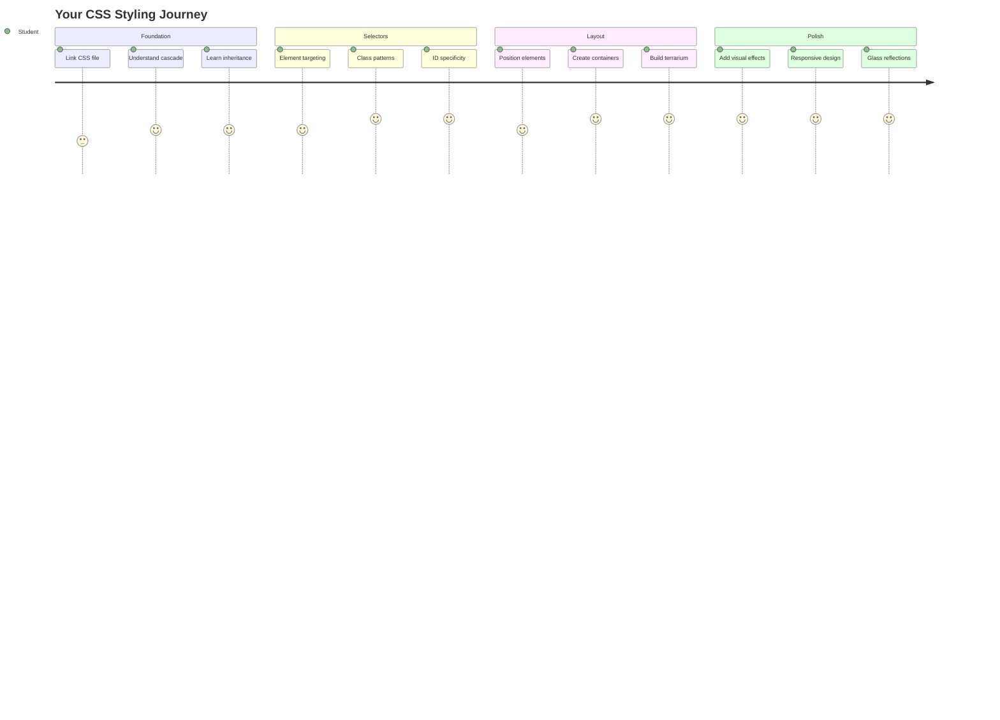
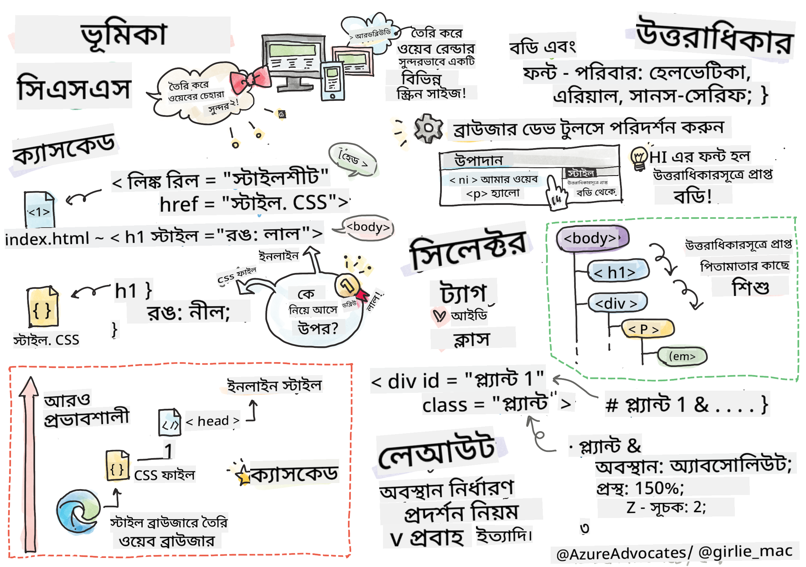
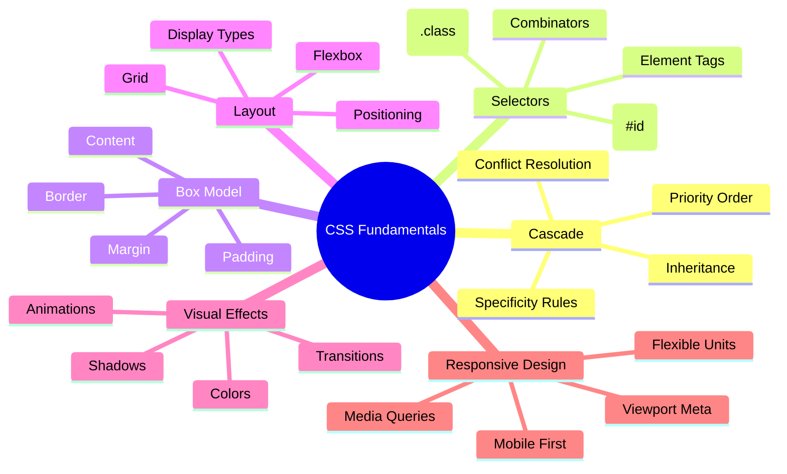
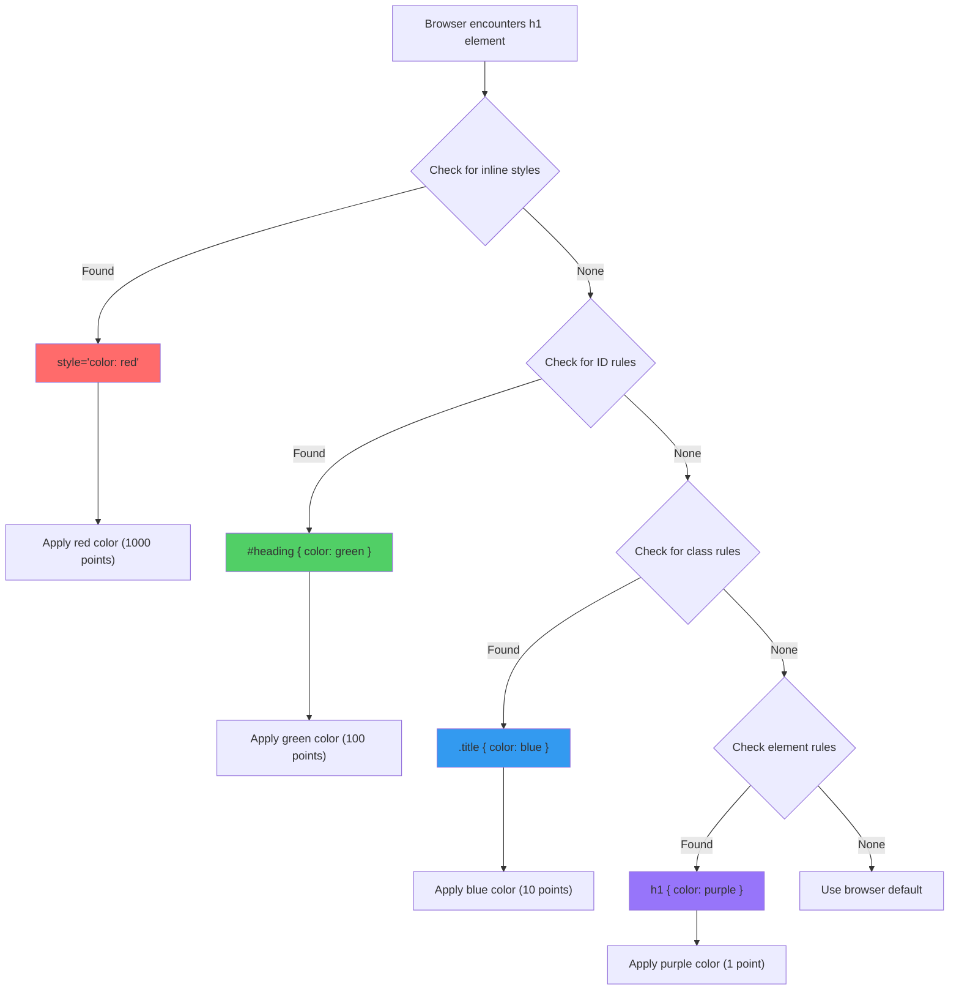
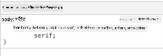
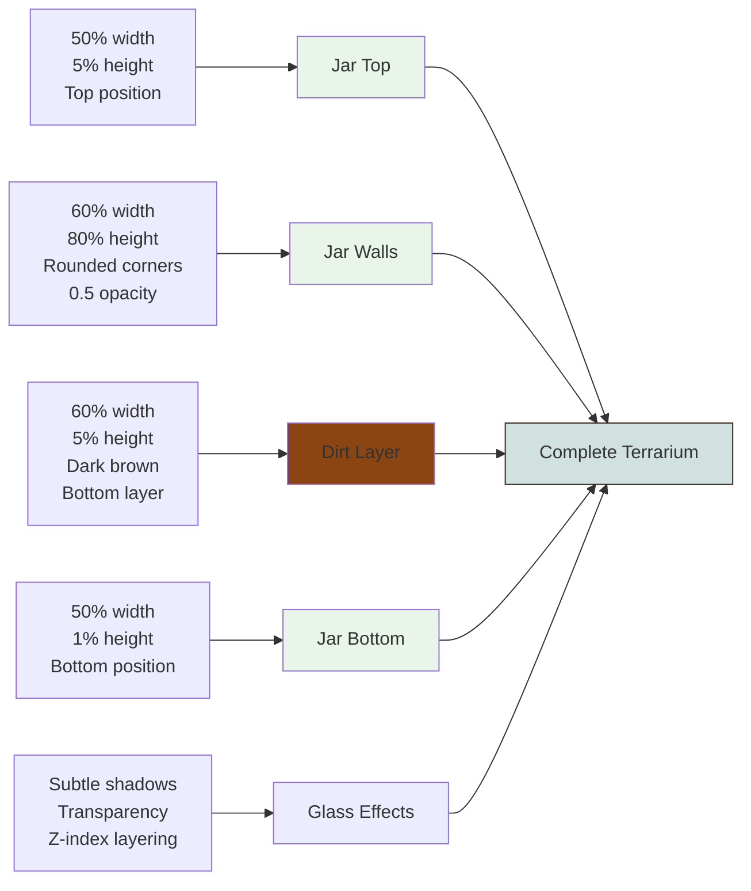
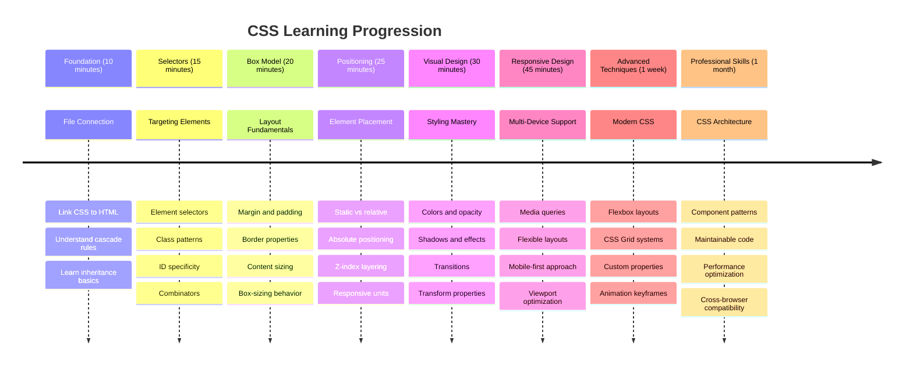

<!--
CO_OP_TRANSLATOR_METADATA:
{
  "original_hash": "e39f3a4e3bcccf94639e3af1248f8a4d",
  "translation_date": "2025-11-03T22:44:41+00:00",
  "source_file": "3-terrarium/2-intro-to-css/README.md",
  "language_code": "bn"
}
-->
# Terrarium Project Part 2: CSS পরিচিতি




> স্কেচনোট: [Tomomi Imura](https://twitter.com/girlie_mac)

আপনার HTML টেরারিয়ামটি কতটা সাধারণ দেখাচ্ছিল তা মনে আছে? CSS এর মাধ্যমে আমরা সেই সাধারণ কাঠামোকে চমৎকার কিছুতে রূপান্তর করি।

যদি HTML একটি বাড়ির ফ্রেম তৈরির মতো হয়, তবে CSS হলো সেই সবকিছু যা এটিকে বাড়ির মতো অনুভূতি দেয় - রঙ, আসবাবপত্রের বিন্যাস, আলো এবং কক্ষগুলোর সংযোগ। ভাবুন কীভাবে ভার্সাই প্রাসাদটি একটি সাধারণ শিকার লজ থেকে শুরু করে বিশ্বের অন্যতম চমৎকার ভবনে রূপান্তরিত হয়েছিল।

আজ আমরা আপনার টেরারিয়ামকে কার্যকরী থেকে পরিপাটি করে তুলব। আপনি শিখবেন কীভাবে উপাদানগুলোকে সঠিকভাবে অবস্থান করতে হয়, লেআউটগুলোকে বিভিন্ন স্ক্রিন সাইজে প্রতিক্রিয়াশীল করতে হয় এবং এমন ভিজ্যুয়াল আকর্ষণ তৈরি করতে হয় যা ওয়েবসাইটকে আকর্ষণীয় করে তোলে।

এই পাঠের শেষে, আপনি দেখতে পাবেন কীভাবে কৌশলগত CSS স্টাইলিং আপনার প্রকল্পকে নাটকীয়ভাবে উন্নত করতে পারে। চলুন আপনার টেরারিয়ামে কিছু স্টাইল যোগ করি।



## প্রি-লেকচার কুইজ

[প্রি-লেকচার কুইজ](https://ff-quizzes.netlify.app/web/quiz/17)

## CSS এর সাথে শুরু করা

CSS কে প্রায়ই "জিনিসগুলো সুন্দর করা" হিসেবে ভাবা হয়, কিন্তু এটি আরও বিস্তৃত উদ্দেশ্য পূরণ করে। CSS হলো একটি সিনেমার পরিচালক হওয়ার মতো - আপনি শুধু কীভাবে সবকিছু দেখাবে তা নিয়ন্ত্রণ করেন না, বরং কীভাবে এটি নড়াচড়া করবে, ইন্টারঅ্যাকশনে সাড়া দেবে এবং বিভিন্ন পরিস্থিতিতে মানিয়ে নেবে।

আধুনিক CSS অত্যন্ত সক্ষম। আপনি এমন কোড লিখতে পারেন যা স্বয়ংক্রিয়ভাবে ফোন, ট্যাবলেট এবং ডেস্কটপ কম্পিউটারের জন্য লেআউট সামঞ্জস্য করে। আপনি মসৃণ অ্যানিমেশন তৈরি করতে পারেন যা প্রয়োজনীয় স্থানে ব্যবহারকারীর মনোযোগ আকর্ষণ করে। যখন সবকিছু একসাথে কাজ করে, তখন ফলাফল বেশ চিত্তাকর্ষক হতে পারে।

> 💡 **প্রো টিপ**: CSS ক্রমাগত নতুন বৈশিষ্ট্য এবং সক্ষমতার সাথে বিকশিত হচ্ছে। প্রোডাকশন প্রকল্পে ব্যবহার করার আগে নতুন CSS বৈশিষ্ট্যের জন্য ব্রাউজার সাপোর্ট যাচাই করতে [CanIUse.com](https://caniuse.com) চেক করুন।

**এই পাঠে আমরা যা অর্জন করব:**
- **সম্পূর্ণ** ভিজ্যুয়াল ডিজাইন তৈরি করা আপনার টেরারিয়ামের জন্য আধুনিক CSS কৌশল ব্যবহার করে
- **মৌলিক ধারণাগুলো** অন্বেষণ করা যেমন ক্যাসকেড, ইনহেরিটেন্স এবং CSS সিলেক্টর
- **প্রয়োগ করা** প্রতিক্রিয়াশীল অবস্থান এবং লেআউট কৌশল
- **নির্মাণ করা** টেরারিয়াম কন্টেইনার CSS শেপ এবং স্টাইলিং ব্যবহার করে

### পূর্বশর্ত

আপনার টেরারিয়ামের HTML কাঠামোটি আগের পাঠ থেকে সম্পন্ন করা উচিত এবং এটি স্টাইল করার জন্য প্রস্তুত থাকা উচিত।

> 📺 **ভিডিও রিসোর্স**: এই সহায়ক ভিডিও ওয়াকথ্রু দেখুন
>
> [](https://www.youtube.com/watch?v=6yIdOIV9p1I)

### আপনার CSS ফাইল সেট আপ করা

স্টাইলিং শুরু করার আগে, আমাদের HTML এর সাথে CSS সংযুক্ত করতে হবে। এই সংযোগটি ব্রাউজারকে বলে কোথায় আমাদের টেরারিয়ামের জন্য স্টাইলিং নির্দেশনা খুঁজে পেতে হবে।

আপনার টেরারিয়াম ফোল্ডারে একটি নতুন ফাইল তৈরি করুন `style.css` নামে, তারপর এটি আপনার HTML ডকুমেন্টের `<head>` সেকশনে লিঙ্ক করুন:

```html
<link rel="stylesheet" href="./style.css" />
```

**এই কোডটি যা করে:**
- **সংযোগ তৈরি করে** আপনার HTML এবং CSS ফাইলের মধ্যে
- **ব্রাউজারকে বলে** `style.css` থেকে স্টাইল লোড এবং প্রয়োগ করতে
- **ব্যবহার করে** `rel="stylesheet"` অ্যাট্রিবিউট যা নির্দেশ করে এটি একটি CSS ফাইল
- **ফাইল পাথ উল্লেখ করে** `href="./style.css"` এর মাধ্যমে

## CSS ক্যাসকেড বোঝা

কখনো ভেবেছেন কেন CSS কে "Cascading" Style Sheets বলা হয়? স্টাইলগুলো একটি জলপ্রপাতের মতো নিচে নেমে আসে এবং কখনও কখনও তারা একে অপরের সাথে সংঘর্ষ করে।

ভাবুন কিভাবে সামরিক কমান্ড কাঠামো কাজ করে - একটি সাধারণ আদেশ হতে পারে "সব সৈন্য সবুজ পোশাক পরবে," কিন্তু আপনার ইউনিটের জন্য একটি নির্দিষ্ট আদেশ হতে পারে "অনুষ্ঠানের জন্য নীল পোশাক পরবে।" আরও নির্দিষ্ট নির্দেশনা অগ্রাধিকার পায়। CSS একই যুক্তি অনুসরণ করে এবং এই শ্রেণিবিন্যাস বোঝা ডিবাগিংকে অনেক সহজ করে তোলে।

### ক্যাসকেড প্রাধান্য নিয়ে পরীক্ষা-নিরীক্ষা

চলুন একটি স্টাইল সংঘর্ষ তৈরি করে ক্যাসকেডের কার্যকারিতা দেখি। প্রথমে, আপনার `<h1>` ট্যাগে একটি ইনলাইন স্টাইল যোগ করুন:

```html
<h1 style="color: red">My Terrarium</h1>
```

**এই কোডটি যা করে:**
- **লাগায়** একটি লাল রঙ সরাসরি `<h1>` উপাদানে ইনলাইন স্টাইলিং ব্যবহার করে
- **ব্যবহার করে** `style` অ্যাট্রিবিউট HTML এ সরাসরি CSS এম্বেড করতে
- **তৈরি করে** এই নির্দিষ্ট উপাদানের জন্য সর্বোচ্চ প্রাধান্য স্টাইল নিয়ম

এরপর, আপনার `style.css` ফাইলে এই নিয়মটি যোগ করুন:

```css
h1 {
  color: blue;
}
```

**উপরের কোডে আমরা:**
- **সংজ্ঞায়িত করেছি** একটি CSS নিয়ম যা সব `<h1>` উপাদানকে লক্ষ্য করে
- **সেট করেছি** টেক্সটের রঙ নীল একটি এক্সটার্নাল স্টাইলশিট ব্যবহার করে
- **তৈরি করেছি** একটি নিম্ন প্রাধান্য নিয়ম ইনলাইন স্টাইলের তুলনায়

✅ **জ্ঞান যাচাই**: আপনার ওয়েব অ্যাপে কোন রঙ প্রদর্শিত হয়? কেন সেই রঙটি জয়ী হয়? এমন পরিস্থিতি কি আপনি ভাবতে পারেন যেখানে আপনি স্টাইলগুলোকে ওভাররাইড করতে চাইবেন?



> 💡 **CSS প্রাধান্য ক্রম (উচ্চ থেকে নিম্ন):**
> 1. **ইনলাইন স্টাইল** (style attribute)
> 2. **IDs** (#myId)
> 3. **Classes** (.myClass) এবং attributes
> 4. **Element selectors** (h1, div, p)
> 5. **ব্রাউজারের ডিফল্ট**

## CSS ইনহেরিটেন্সের কার্যকারিতা

CSS ইনহেরিটেন্স জেনেটিক্সের মতো কাজ করে - উপাদানগুলো তাদের প্যারেন্ট উপাদান থেকে নির্দিষ্ট বৈশিষ্ট্যগুলো উত্তরাধিকার সূত্রে পায়। যদি আপনি বডি উপাদানে ফন্ট ফ্যামিলি সেট করেন, তাহলে ভিতরের সমস্ত টেক্সট স্বয়ংক্রিয়ভাবে একই ফন্ট ব্যবহার করবে। এটি অনেকটা যেমন হ্যাবসবার্গ পরিবারের স্বতন্ত্র চোয়াল প্রজন্ম ধরে দেখা গেছে।

তবে, সবকিছু উত্তরাধিকার সূত্রে পাওয়া যায় না। ফন্ট এবং রঙের মতো টেক্সট স্টাইলগুলো উত্তরাধিকার সূত্রে পাওয়া যায়, কিন্তু মার্জিন এবং বর্ডারের মতো লেআউট বৈশিষ্ট্যগুলো পাওয়া যায় না। যেমন সন্তানরা শারীরিক বৈশিষ্ট্য উত্তরাধিকার সূত্রে পেতে পারে কিন্তু তাদের পিতামাতার ফ্যাশন পছন্দ নয়।

### ফন্ট ইনহেরিটেন্স পর্যবেক্ষণ করা

চলুন `<body>` উপাদানে একটি ফন্ট ফ্যামিলি সেট করে ইনহেরিটেন্সের কার্যকারিতা দেখি:

```css
body {
  font-family: 'Segoe UI', Tahoma, Geneva, Verdana, sans-serif;
}
```

**এখানে যা ঘটে তা বিশ্লেষণ করা:**
- **সেট করে** পুরো পৃষ্ঠার জন্য ফন্ট ফ্যামিলি `<body>` উপাদানকে লক্ষ্য করে
- **ব্যবহার করে** একটি ফন্ট স্ট্যাক যা ভালো ব্রাউজার সামঞ্জস্যের জন্য ফলোব্যাক অপশন দেয়
- **প্রয়োগ করে** আধুনিক সিস্টেম ফন্ট যা বিভিন্ন অপারেটিং সিস্টেমে চমৎকার দেখায়
- **নিশ্চিত করে** সমস্ত চাইল্ড উপাদান এই ফন্ট উত্তরাধিকার সূত্রে পায় যদি বিশেষভাবে ওভাররাইড না করা হয়

আপনার ব্রাউজারের ডেভেলপার টুলস (F12) খুলুন, Elements ট্যাবে যান এবং আপনার `<h1>` উপাদানটি পরীক্ষা করুন। আপনি দেখতে পাবেন এটি বডি থেকে ফন্ট ফ্যামিলি উত্তরাধিকার সূত্রে পেয়েছে:



✅ **পরীক্ষার সময়**: `<body>`-তে `color`, `line-height`, বা `text-align` এর মতো অন্যান্য উত্তরাধিকারযোগ্য বৈশিষ্ট্য সেট করার চেষ্টা করুন। আপনার হেডিং এবং অন্যান্য উপাদানগুলোর কী হয়?

> 📝 **উত্তরাধিকারযোগ্য বৈশিষ্ট্যগুলো অন্তর্ভুক্ত করে**: `color`, `font-family`, `font-size`, `line-height`, `text-align`, `visibility`
>
> **অ-উত্তরাধিকারযোগ্য বৈশিষ্ট্যগুলো অন্তর্ভুক্ত করে**: `margin`, `padding`, `border`, `width`, `height`, `position`

### 🔄 **শিক্ষাগত চেক-ইন**
**CSS ভিত্তি বোঝা**: সিলেক্টরগুলোতে যাওয়ার আগে নিশ্চিত করুন আপনি:
- ✅ ক্যাসকেড এবং ইনহেরিটেন্সের পার্থক্য ব্যাখ্যা করতে পারেন
- ✅ কোন স্টাইল প্রাধান্য পাবে তা পূর্বাভাস দিতে পারেন
- ✅ কোন বৈশিষ্ট্যগুলো প্যারেন্ট উপাদান থেকে উত্তরাধিকার সূত্রে পাওয়া যায় তা চিহ্নিত করতে পারেন
- ✅ সঠিকভাবে CSS ফাইলগুলো HTML এর সাথে সংযুক্ত করতে পারেন

**দ্রুত পরীক্ষা**: যদি আপনার এই স্টাইলগুলো থাকে, `<div class="special">` এর ভিতরে একটি `<h1>` এর রঙ কী হবে?
```css
div { color: blue; }
.special { color: green; }
h1 { color: red; }
```
*উত্তর: লাল (এলিমেন্ট সিলেক্টর সরাসরি h1 লক্ষ্য করে)*

## CSS সিলেক্টর আয়ত্ত করা

CSS সিলেক্টর হলো নির্দিষ্ট উপাদানগুলোকে স্টাইল করার উপায়। এটি সঠিক নির্দেশনা দেওয়ার মতো কাজ করে - "বাড়ি" বলার পরিবর্তে আপনি বলতে পারেন "নীল বাড়ি যার লাল দরজা ম্যাপল স্ট্রিটে।"

CSS বিভিন্নভাবে নির্দিষ্ট হতে পারে এবং সঠিক সিলেক্টর নির্বাচন করা হলো কাজের জন্য সঠিক টুল নির্বাচন করার মতো। কখনও কখনও আপনাকে পুরো পাড়ার প্রতিটি দরজা স্টাইল করতে হয়, আবার কখনও শুধুমাত্র একটি নির্দিষ্ট দরজা।

### এলিমেন্ট সিলেক্টর (ট্যাগ)

এলিমেন্ট সিলেক্টর HTML উপাদানগুলোকে তাদের ট্যাগ নাম দ্বারা লক্ষ্য করে। এগুলো পুরো পৃষ্ঠায় প্রয়োগযোগ্য বেস স্টাইল সেট করার জন্য উপযুক্ত:

```css
body {
  font-family: 'Segoe UI', Tahoma, Geneva, Verdana, sans-serif;
  margin: 0;
  padding: 0;
}

h1 {
  color: #3a241d;
  text-align: center;
  font-size: 2.5rem;
  margin-bottom: 1rem;
}
```

**এই স্টাইলগুলো বোঝা:**
- **সেট করে** পুরো পৃষ্ঠায় সামঞ্জ
- `.plant-holder` যদি `relative` এর পরিবর্তে `absolute` ব্যবহার করে, তাহলে লেআউট পরিবর্তন হবে। `absolute` পজিশনিং ব্যবহার করলে `.plant-holder` তার প্যারেন্ট কন্টেইনারের পরিবর্তে পুরো ডকুমেন্টের উপর ভিত্তি করে অবস্থান নির্ধারণ করবে। ফলে এটি নির্ধারিত স্থান থেকে সরে যেতে পারে এবং অন্যান্য উপাদানের সাথে সংঘর্ষ ঘটাতে পারে।

- `.plant` কে `relative` পজিশনিংয়ে পরিবর্তন করলে, এটি তার বর্তমান অবস্থানকে রেফারেন্স হিসেবে ধরে এবং সেই অবস্থান থেকে নির্দিষ্ট পরিমাণে সরানো সম্ভব হয়। এটি ড্র্যাগ-এন্ড-ড্রপ কার্যক্রমের জন্য একটি নির্ভরযোগ্য কন্টেক্সট তৈরি করে।

### 🔄 **শিক্ষামূলক চেক-ইন**
**CSS পজিশনিং দক্ষতা**: আপনার বোঝাপড়া যাচাই করুন:
- ✅ কেন ড্র্যাগ-এন্ড-ড্রপের জন্য গাছগুলোর `absolute` পজিশনিং প্রয়োজন?
- ✅ আপনি কি বুঝতে পেরেছেন কীভাবে `relative` কন্টেইনার পজিশনিং কন্টেক্সট তৈরি করে?
- ✅ কেন সাইড কন্টেইনারগুলো `absolute` পজিশনিং ব্যবহার করে?
- ✅ যদি পজিশন ডিক্লারেশন সম্পূর্ণভাবে সরিয়ে দেওয়া হয়, তাহলে কী ঘটবে?

**বাস্তব জীবনের সংযোগ**: CSS পজিশনিং বাস্তব জীবনের লেআউটের সাথে কীভাবে মিল রাখে তা ভাবুন:
- **Static**: শেলফে বই (প্রাকৃতিক ক্রম)
- **Relative**: বইটি সামান্য সরানো কিন্তু তার স্থান ধরে রাখা
- **Absolute**: নির্দিষ্ট পৃষ্ঠায় বুকমার্ক রাখা
- **Fixed**: একটি স্টিকি নোট যা পৃষ্ঠাগুলো উল্টানোর সময় দৃশ্যমান থাকে

## CSS দিয়ে টেরারিয়াম তৈরি করা

এখন আমরা শুধুমাত্র CSS ব্যবহার করে একটি কাচের জার তৈরি করব - কোনো ছবি বা গ্রাফিক সফটওয়্যার ছাড়াই।

পজিশনিং এবং ট্রান্সপারেন্সি ব্যবহার করে বাস্তবসম্মত কাচ, ছায়া এবং গভীরতার প্রভাব তৈরি করা CSS এর ভিজ্যুয়াল সক্ষমতাকে প্রদর্শন করে। এই কৌশলটি বাউহাউস আন্দোলনের স্থপতিরা কীভাবে সাধারণ জ্যামিতিক আকার ব্যবহার করে জটিল, সুন্দর কাঠামো তৈরি করতেন তা প্রতিফলিত করে। একবার আপনি এই নীতিগুলো বুঝতে পারলে, অনেক ওয়েব ডিজাইনের পিছনে থাকা CSS কৌশলগুলো চিনতে পারবেন।



### কাচের জার উপাদান তৈরি করা

চলুন টেরারিয়াম জারটি টুকরো টুকরো করে তৈরি করি। প্রতিটি অংশ `absolute` পজিশনিং এবং শতাংশ-ভিত্তিক সাইজিং ব্যবহার করে রেসপন্সিভ ডিজাইন নিশ্চিত করে:

```css
.jar-walls {
  height: 80%;
  width: 60%;
  background: #d1e1df;
  border-radius: 1rem;
  position: absolute;
  bottom: 0.5%;
  left: 20%;
  opacity: 0.5;
  z-index: 1;
  box-shadow: inset 0 0 2rem rgba(0, 0, 0, 0.1);
}

.jar-top {
  width: 50%;
  height: 5%;
  background: #d1e1df;
  position: absolute;
  bottom: 80.5%;
  left: 25%;
  opacity: 0.7;
  z-index: 1;
  border-radius: 0.5rem 0.5rem 0 0;
}

.jar-bottom {
  width: 50%;
  height: 1%;
  background: #d1e1df;
  position: absolute;
  bottom: 0;
  left: 25%;
  opacity: 0.7;
  border-radius: 0 0 0.5rem 0.5rem;
}

.dirt {
  width: 60%;
  height: 5%;
  background: #3a241d;
  position: absolute;
  border-radius: 0 0 1rem 1rem;
  bottom: 1%;
  left: 20%;
  opacity: 0.7;
  z-index: -1;
}
```

**টেরারিয়াম নির্মাণ বোঝা:**
- **ব্যবহার করে** শতাংশ-ভিত্তিক ডাইমেনশন রেসপন্সিভ স্কেলিংয়ের জন্য
- **পজিশন করে** উপাদানগুলোকে সঠিকভাবে স্ট্যাক এবং অ্যালাইন করতে
- **প্রয়োগ করে** বিভিন্ন অপাসিটি মান কাচের স্বচ্ছতার প্রভাব তৈরি করতে
- **ইমপ্লিমেন্ট করে** `z-index` লেয়ারিং যাতে গাছগুলো জারের ভিতরে দেখা যায়
- **যোগ করে** সূক্ষ্ম বক্স-শ্যাডো এবং পরিশীলিত বর্ডার-রেডিয়াস আরও বাস্তবসম্মত চেহারার জন্য

### শতাংশের মাধ্যমে রেসপন্সিভ ডিজাইন

দেখুন কীভাবে সমস্ত ডাইমেনশন পিক্সেল মানের পরিবর্তে শতাংশ ব্যবহার করে:

**কেন এটি গুরুত্বপূর্ণ:**
- **নিশ্চিত করে** যে টেরারিয়াম যেকোনো স্ক্রিন সাইজে প্রোপোরশনালি স্কেল করে
- **রক্ষা করে** জারের উপাদানগুলোর মধ্যে ভিজ্যুয়াল সম্পর্ক
- **প্রদান করে** মোবাইল ফোন থেকে বড় ডেস্কটপ মনিটর পর্যন্ত একটি সঙ্গতিপূর্ণ অভিজ্ঞতা
- **ডিজাইনকে** ভিজ্যুয়াল লেআউট ভেঙে না দিয়ে মানিয়ে নিতে সাহায্য করে

### CSS ইউনিটের ব্যবহার

আমরা বর্ডার-রেডিয়াসের জন্য `rem` ইউনিট ব্যবহার করছি, যা রুট ফন্ট সাইজের সাথে স্কেল করে। এটি আরও অ্যাক্সেসযোগ্য ডিজাইন তৈরি করে যা ব্যবহারকারীর ফন্ট পছন্দকে সম্মান করে। [CSS relative units](https://www.w3.org/TR/css-values-3/#font-relative-lengths) সম্পর্কে আরও জানুন অফিসিয়াল স্পেসিফিকেশনে।

✅ **ভিজ্যুয়াল পরীক্ষা**: এই মানগুলো পরিবর্তন করে প্রভাব পর্যবেক্ষণ করুন:
- জারের অপাসিটি 0.5 থেকে 0.8 করুন – এটি কাচের চেহারায় কী প্রভাব ফেলে?
- মাটির রঙ `#3a241d` থেকে `#8B4513` করুন – এর ভিজ্যুয়াল প্রভাব কী?
- মাটির `z-index` 2 করুন – লেয়ারিংয়ে কী পরিবর্তন আসে?

### 🔄 **শিক্ষামূলক চেক-ইন**
**CSS ভিজ্যুয়াল ডিজাইন বোঝা**: আপনার ভিজ্যুয়াল CSS এর ধারণা নিশ্চিত করুন:
- ✅ কীভাবে শতাংশ-ভিত্তিক ডাইমেনশন রেসপন্সিভ ডিজাইন তৈরি করে?
- ✅ কেন অপাসিটি কাচের স্বচ্ছতার প্রভাব তৈরি করে?
- ✅ লেয়ারিং উপাদানগুলোতে `z-index` কী ভূমিকা পালন করে?
- ✅ কীভাবে বর্ডার-রেডিয়াস মান জারের আকৃতি তৈরি করে?

**ডিজাইন নীতি**: লক্ষ্য করুন কীভাবে আমরা সাধারণ আকার থেকে জটিল ভিজ্যুয়াল তৈরি করছি:
1. **আয়তক্ষেত্র** → **গোলাকার আয়তক্ষেত্র** → **জারের উপাদান**
2. **সমতল রঙ** → **অপাসিটি** → **কাচের প্রভাব**
3. **স্বতন্ত্র উপাদান** → **লেয়ারড কম্পোজিশন** → **থ্রিডি চেহারা**

---

## GitHub Copilot Agent Challenge 🚀

Agent মোড ব্যবহার করে নিম্নলিখিত চ্যালেঞ্জটি সম্পন্ন করুন:

**বর্ণনা:** একটি CSS অ্যানিমেশন তৈরি করুন যা টেরারিয়ামের গাছগুলোকে হালকা বাতাসে দুলতে দেখায়। এটি আপনাকে CSS অ্যানিমেশন, ট্রান্সফর্ম এবং কীফ্রেম অনুশীলন করতে সাহায্য করবে এবং আপনার টেরারিয়ামের ভিজ্যুয়াল আকর্ষণ বৃদ্ধি করবে।

**প্রম্পট:** CSS কীফ্রেম অ্যানিমেশন যোগ করুন যাতে টেরারিয়ামের গাছগুলো হালকা বাতাসে একপাশ থেকে অন্যপাশে দুলতে থাকে। একটি দুলানোর অ্যানিমেশন তৈরি করুন যা প্রতিটি গাছকে সামান্য (২-৩ ডিগ্রি) বামে এবং ডানে ঘোরায়, যার সময়কাল হবে ৩-৪ সেকেন্ড। নিশ্চিত করুন যে অ্যানিমেশনটি অনন্তকাল ধরে লুপ করবে এবং প্রাকৃতিক গতির জন্য একটি ইজিং ফাংশন থাকবে।

[agent mode](https://code.visualstudio.com/blogs/2025/02/24/introducing-copilot-agent-mode) সম্পর্কে আরও জানুন এখানে।

## 🚀 চ্যালেঞ্জ: কাচের প্রতিফলন যোগ করা

আপনার টেরারিয়ামে বাস্তবসম্মত কাচের প্রতিফলন যোগ করতে প্রস্তুত? এই কৌশলটি ডিজাইনে গভীরতা এবং বাস্তবতা যোগ করবে।

আপনি সূক্ষ্ম হাইলাইট তৈরি করবেন যা কাচের পৃষ্ঠে আলো প্রতিফলিত করার অনুকরণ করে। এই পদ্ধতি রেনেসাঁ চিত্রশিল্পী যেমন Jan van Eyck কিভাবে আলো এবং প্রতিফলন ব্যবহার করে আঁকা কাচকে থ্রিডি দেখাতেন তার মতো। আপনি যা অর্জন করতে চান তা হলো:


**আপনার চ্যালেঞ্জ:**
- **তৈরি করুন** সূক্ষ্ম সাদা বা হালকা রঙের ডিম্বাকৃতি আকৃতি কাচের প্রতিফলনের জন্য
- **কৌশলে অবস্থান করুন** জারের বাম পাশে
- **প্রয়োগ করুন** যথাযথ অপাসিটি এবং ব্লার প্রভাব বাস্তবসম্মত আলো প্রতিফলনের জন্য
- **ব্যবহার করুন** `border-radius` অর্গানিক, বুদবুদের মতো আকৃতি তৈরি করতে
- **পরীক্ষা করুন** গ্রেডিয়েন্ট বা বক্স-শ্যাডো আরও বাস্তবতার জন্য

## পোস্ট-লেকচার কুইজ

[পোস্ট-লেকচার কুইজ](https://ff-quizzes.netlify.app/web/quiz/18)

## আপনার CSS জ্ঞান প্রসারিত করুন

CSS প্রথমে জটিল মনে হতে পারে, কিন্তু এই মূল ধারণাগুলো বোঝা আরও উন্নত কৌশলের জন্য একটি শক্ত ভিত্তি প্রদান করে।

**আপনার পরবর্তী CSS শেখার ক্ষেত্রগুলো:**
- **Flexbox** - উপাদানগুলোর অ্যালাইনমেন্ট এবং ডিস্ট্রিবিউশন সহজ করে
- **CSS Grid** - জটিল লেআউট তৈরির জন্য শক্তিশালী টুল প্রদান করে
- **CSS Variables** - পুনরাবৃত্তি কমায় এবং রক্ষণাবেক্ষণ উন্নত করে
- **Responsive design** - বিভিন্ন স্ক্রিন সাইজে সাইটগুলো ভালোভাবে কাজ নিশ্চিত করে

### ইন্টারেক্টিভ লার্নিং রিসোর্স

এই ধারণাগুলো অনুশীলন করুন এই আকর্ষণীয়, হাতে-কলমে গেমগুলোর মাধ্যমে:
- 🐸 [Flexbox Froggy](https://flexboxfroggy.com/) - মজার চ্যালেঞ্জের মাধ্যমে Flexbox শিখুন
- 🌱 [Grid Garden](https://codepip.com/games/grid-garden/) - ভার্চুয়াল গাজর চাষ করে CSS Grid শিখুন
- 🎯 [CSS Battle](https://cssbattle.dev/) - কোডিং চ্যালেঞ্জের মাধ্যমে আপনার CSS দক্ষতা পরীক্ষা করুন

### অতিরিক্ত শেখা

CSS এর মৌলিক বিষয়গুলো নিয়ে বিস্তারিত জানতে এই Microsoft Learn মডিউল সম্পূর্ণ করুন: [Style your HTML app with CSS](https://docs.microsoft.com/learn/modules/build-simple-website/4-css-basics/?WT.mc_id=academic-77807-sagibbon)

### ⚡ **পরবর্তী ৫ মিনিটে আপনি যা করতে পারেন**
- [ ] DevTools খুলুন এবং Elements প্যানেল ব্যবহার করে যেকোনো ওয়েবসাইটের CSS স্টাইল পরীক্ষা করুন
- [ ] একটি সাধারণ CSS ফাইল তৈরি করুন এবং এটি একটি HTML পেজে লিঙ্ক করুন
- [ ] বিভিন্ন পদ্ধতি ব্যবহার করে রঙ পরিবর্তন করার চেষ্টা করুন: hex, RGB, এবং নামকৃত রঙ
- [ ] একটি div-এ প্যাডিং এবং মার্জিন যোগ করে বক্স মডেল অনুশীলন করুন

### 🎯 **এই ঘণ্টায় আপনি যা অর্জন করতে পারেন**
- [ ] পোস্ট-লেসন কুইজ সম্পূর্ণ করুন এবং CSS এর মৌলিক বিষয়গুলো পুনরায় দেখুন
- [ ] আপনার HTML পেজে ফন্ট, রঙ এবং স্পেসিং দিয়ে স্টাইল যোগ করুন
- [ ] Flexbox বা Grid ব্যবহার করে একটি সাধারণ লেআউট তৈরি করুন
- [ ] CSS ট্রানজিশন ব্যবহার করে মসৃণ প্রভাব তৈরি করুন
- [ ] মিডিয়া কোয়েরি দিয়ে রেসপন্সিভ ডিজাইন অনুশীলন করুন

### 📅 **আপনার সপ্তাহব্যাপী CSS অ্যাডভেঞ্চার**
- [ ] সৃজনশীলতার সাথে টেরারিয়াম স্টাইলিং অ্যাসাইনমেন্ট সম্পূর্ণ করুন
- [ ] CSS Grid মাস্টার করুন একটি ফটো গ্যালারি লেআউট তৈরি করে
- [ ] CSS অ্যানিমেশন শিখুন আপনার ডিজাইনগুলো জীবন্ত করতে
- [ ] Sass বা Less এর মতো CSS প্রিপ্রসেসর অন্বেষণ করুন
- [ ] ডিজাইন নীতিগুলো অধ্যয়ন করুন এবং সেগুলো আপনার CSS-এ প্রয়োগ করুন
- [ ] অনলাইনে পাওয়া আকর্ষণীয় ডিজাইনগুলো বিশ্লেষণ করুন এবং পুনরায় তৈরি করুন

### 🌟 **আপনার মাসব্যাপী ডিজাইন দক্ষতা**
- [ ] একটি সম্পূর্ণ রেসপন্সিভ ওয়েবসাইট ডিজাইন সিস্টেম তৈরি করুন
- [ ] CSS-in-JS বা Tailwind এর মতো ইউটিলিটি-ফার্স্ট ফ্রেমওয়ার্ক শিখুন
- [ ] CSS উন্নতির মাধ্যমে ওপেন সোর্স প্রোজেক্টে অবদান রাখুন
- [ ] CSS এর উন্নত ধারণাগুলো মাস্টার করুন যেমন CSS কাস্টম প্রপার্টি এবং কন্টেইনমেন্ট
- [ ] মডুলার CSS দিয়ে পুনরায় ব্যবহারযোগ্য কম্পোনেন্ট লাইব্রেরি তৈরি করুন
- [ ] CSS শেখার জন্য অন্যদের মেন্টর করুন এবং ডিজাইন জ্ঞান শেয়ার করুন

## 🎯 আপনার CSS দক্ষতার টাইমলাইন



### 🛠️ আপনার CSS টুলকিট সারাংশ

এই পাঠ সম্পূর্ণ করার পর, এখন আপনার কাছে রয়েছে:
- **ক্যাসকেড বোঝা**: কীভাবে স্টাইলগুলো উত্তরাধিকারসূত্রে প্রাপ্ত হয় এবং একে অপরকে ওভাররাইড করে
- **সিলেক্টর দক্ষতা**: উপাদান, ক্লাস এবং ID দিয়ে সুনির্দিষ্ট টার্গেটিং
- **পজিশনিং দক্ষতা**: কৌশলগত উপাদান স্থাপন এবং লেয়ারিং
- **ভিজ্যুয়াল ডিজাইন**: কাচের প্রভাব, ছায়া এবং স্বচ্ছতা তৈরি করা
- **রেসপন্সিভ কৌশল**: শতাংশ-ভিত্তিক লেআউট যা যেকোনো স্ক্রিনে মানিয়ে নেয়
- **কোড সংগঠন**: পরিষ্কার, রক্ষণাবেক্ষণযোগ্য CSS কাঠামো
- **আধুনিক পদ্ধতি**: আপেক্ষিক ইউনিট এবং অ্যাক্সেসযোগ্য ডিজাইন প্যাটার্ন ব্যবহার করা

**পরবর্তী পদক্ষেপ**: আপনার টেরারিয়ামে এখন কাঠামো (HTML) এবং স্টাইল (CSS) রয়েছে। চূড়ান্ত পাঠে আমরা JavaScript দিয়ে ইন্টারঅ্যাক্টিভিটি যোগ করব!

## অ্যাসাইনমেন্ট

[CSS Refactoring](assignment.md)

---

**অস্বীকৃতি**:  
এই নথিটি AI অনুবাদ পরিষেবা [Co-op Translator](https://github.com/Azure/co-op-translator) ব্যবহার করে অনুবাদ করা হয়েছে। আমরা যথাসাধ্য সঠিকতা নিশ্চিত করার চেষ্টা করি, তবে অনুগ্রহ করে মনে রাখবেন যে স্বয়ংক্রিয় অনুবাদে ত্রুটি বা অসঙ্গতি থাকতে পারে। মূল ভাষায় থাকা নথিটিকে প্রামাণিক উৎস হিসেবে বিবেচনা করা উচিত। গুরুত্বপূর্ণ তথ্যের জন্য, পেশাদার মানব অনুবাদ সুপারিশ করা হয়। এই অনুবাদ ব্যবহারের ফলে কোনো ভুল বোঝাবুঝি বা ভুল ব্যাখ্যার জন্য আমরা দায়ী থাকব না।