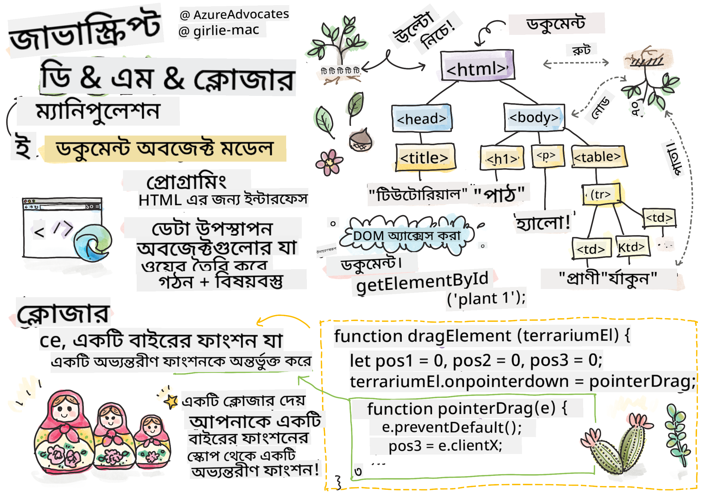
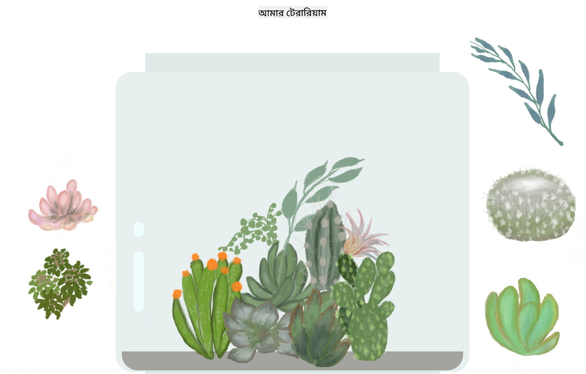

<!--
CO_OP_TRANSLATOR_METADATA:
{
  "original_hash": "61c14b27044861e5e69db35dd52c4403",
  "translation_date": "2025-08-28T23:04:10+00:00",
  "source_file": "3-terrarium/3-intro-to-DOM-and-closures/README.md",
  "language_code": "bn"
}
-->
# টেরারিয়াম প্রকল্প পার্ট ৩: DOM ম্যানিপুলেশন এবং ক্লোজার


> স্কেচনোট: [Tomomi Imura](https://twitter.com/girlie_mac)

## প্রি-লেকচার কুইজ

[প্রি-লেকচার কুইজ](https://ff-quizzes.netlify.app/web/quiz/19)

### ভূমিকা

DOM বা "ডকুমেন্ট অবজেক্ট মডেল" ম্যানিপুলেট করা ওয়েব ডেভেলপমেন্টের একটি গুরুত্বপূর্ণ দিক। [MDN](https://developer.mozilla.org/docs/Web/API/Document_Object_Model/Introduction) অনুসারে, "ডকুমেন্ট অবজেক্ট মডেল (DOM) হলো ওয়েবের একটি ডকুমেন্টের কাঠামো এবং বিষয়বস্তুর প্রতিনিধিত্বকারী ডেটা।" DOM ম্যানিপুলেশন নিয়ে চ্যালেঞ্জগুলোই প্রায়শই জাভাস্ক্রিপ্ট ফ্রেমওয়ার্ক ব্যবহার করার কারণ হয়ে দাঁড়ায়, তবে আমরা এখানে ভ্যানিলা জাভাস্ক্রিপ্ট দিয়ে কাজ করব!

এছাড়াও, এই পাঠে [জাভাস্ক্রিপ্ট ক্লোজার](https://developer.mozilla.org/docs/Web/JavaScript/Closures) ধারণাটি পরিচয় করানো হবে। ক্লোজার হলো একটি ফাংশন যা অন্য একটি ফাংশনের মধ্যে আবদ্ধ থাকে, যাতে অভ্যন্তরীণ ফাংশন বাইরের ফাংশনের স্কোপে অ্যাক্সেস পায়।

> জাভাস্ক্রিপ্ট ক্লোজার একটি বিশাল এবং জটিল বিষয়। এই পাঠে আমরা এর মৌলিক ধারণা নিয়ে আলোচনা করব। টেরারিয়ামের কোডে আপনি একটি ক্লোজার দেখতে পাবেন: একটি অভ্যন্তরীণ ফাংশন এবং একটি বাইরের ফাংশন এমনভাবে তৈরি করা হয়েছে যাতে অভ্যন্তরীণ ফাংশন বাইরের ফাংশনের স্কোপে অ্যাক্সেস পায়। এই বিষয়ে আরও বিস্তারিত জানতে [বিস্তৃত ডকুমেন্টেশন](https://developer.mozilla.org/docs/Web/JavaScript/Closures) দেখুন।

আমরা DOM ম্যানিপুলেট করতে একটি ক্লোজার ব্যবহার করব।

DOM-কে একটি গাছের মতো ভাবুন, যা একটি ওয়েব পেজ ডকুমেন্টকে ম্যানিপুলেট করার বিভিন্ন উপায় উপস্থাপন করে। বিভিন্ন API (অ্যাপ্লিকেশন প্রোগ্রাম ইন্টারফেস) তৈরি করা হয়েছে যাতে প্রোগ্রামাররা তাদের পছন্দের প্রোগ্রামিং ভাষা ব্যবহার করে DOM-এ অ্যাক্সেস করতে পারে এবং এটি সম্পাদনা, পরিবর্তন, পুনর্বিন্যাস এবং পরিচালনা করতে পারে।


> DOM এবং HTML মার্কআপের একটি উপস্থাপনা যা এটি রেফারেন্স করে। [Olfa Nasraoui](https://www.researchgate.net/publication/221417012_Profile-Based_Focused_Crawler_for_Social_Media-Sharing_Websites) থেকে।

এই পাঠে, আমরা আমাদের ইন্টারেক্টিভ টেরারিয়াম প্রকল্প সম্পন্ন করব, যেখানে ব্যবহারকারী পেজে থাকা গাছপালা ম্যানিপুলেট করতে পারবে।

### পূর্বশর্ত

আপনার টেরারিয়ামের HTML এবং CSS তৈরি করা উচিত। এই পাঠের শেষে আপনি গাছপালাগুলো টেরারিয়ামে ঢোকানো এবং বের করার জন্য ড্র্যাগ করতে সক্ষম হবেন।

### কাজ

আপনার টেরারিয়াম ফোল্ডারে একটি নতুন ফাইল তৈরি করুন `script.js` নামে। এই ফাইলটি `<head>` সেকশনে ইমপোর্ট করুন:

```html
	<script src="./script.js" defer></script>
```

> নোট: HTML ফাইল সম্পূর্ণ লোড হওয়ার পর জাভাস্ক্রিপ্ট চালানোর জন্য `defer` ব্যবহার করুন। আপনি `async` অ্যাট্রিবিউটও ব্যবহার করতে পারেন, যা HTML ফাইল পার্স করার সময় স্ক্রিপ্ট চালানোর অনুমতি দেয়। তবে আমাদের ক্ষেত্রে, ড্র্যাগ স্ক্রিপ্ট চালানোর আগে HTML এলিমেন্টগুলো সম্পূর্ণ উপলব্ধ থাকা গুরুত্বপূর্ণ।
---

## DOM এলিমেন্টগুলো

প্রথমে আপনাকে DOM-এ ম্যানিপুলেট করতে চান এমন এলিমেন্টগুলোর রেফারেন্স তৈরি করতে হবে। আমাদের ক্ষেত্রে, এগুলো হলো সাইডবারে অপেক্ষমাণ ১৪টি গাছপালা।

### কাজ

```html
dragElement(document.getElementById('plant1'));
dragElement(document.getElementById('plant2'));
dragElement(document.getElementById('plant3'));
dragElement(document.getElementById('plant4'));
dragElement(document.getElementById('plant5'));
dragElement(document.getElementById('plant6'));
dragElement(document.getElementById('plant7'));
dragElement(document.getElementById('plant8'));
dragElement(document.getElementById('plant9'));
dragElement(document.getElementById('plant10'));
dragElement(document.getElementById('plant11'));
dragElement(document.getElementById('plant12'));
dragElement(document.getElementById('plant13'));
dragElement(document.getElementById('plant14'));
```

এখানে কী হচ্ছে? আপনি ডকুমেন্ট রেফারেন্স করছেন এবং এর DOM-এ একটি নির্দিষ্ট Id সহ এলিমেন্ট খুঁজছেন। মনে করুন, HTML-এর প্রথম পাঠে আপনি প্রতিটি গাছপালার ইমেজে আলাদা Id দিয়েছিলেন (`id="plant1"`)। এখন আপনি সেই প্রচেষ্টার ব্যবহার করবেন। প্রতিটি এলিমেন্ট শনাক্ত করার পর, আপনি সেই আইটেমকে একটি ফাংশনে (`dragElement`) পাঠাচ্ছেন, যা আপনি কিছুক্ষণের মধ্যে তৈরি করবেন। এইভাবে HTML-এর এলিমেন্টটি এখন ড্র্যাগ-সক্ষম হয়ে উঠবে।

✅ কেন আমরা এলিমেন্টগুলোকে Id দিয়ে রেফারেন্স করি? CSS ক্লাস দিয়ে কেন নয়? CSS-এর পূর্ববর্তী পাঠটি দেখুন এই প্রশ্নের উত্তর খুঁজতে।

---

## ক্লোজার

এখন আপনি `dragElement` ক্লোজার তৈরি করতে প্রস্তুত, যা একটি বাইরের ফাংশন যা একটি বা একাধিক অভ্যন্তরীণ ফাংশনকে আবদ্ধ করে। 

ক্লোজার তখনই কার্যকর হয় যখন এক বা একাধিক ফাংশনকে বাইরের ফাংশনের স্কোপে অ্যাক্সেস করতে হয়। একটি উদাহরণ দেখুন:

```javascript
function displayCandy(){
	let candy = ['jellybeans'];
	function addCandy(candyType) {
		candy.push(candyType)
	}
	addCandy('gumdrops');
}
displayCandy();
console.log(candy)
```

এই উদাহরণে, `displayCandy` ফাংশন একটি ফাংশনকে ঘিরে রাখে, যা একটি অ্যারে-তে নতুন ক্যান্ডি টাইপ যোগ করে। যদি আপনি এই কোড চালান, তাহলে `candy` অ্যারে অপ্রকাশিত থাকবে, কারণ এটি একটি লোকাল ভ্যারিয়েবল (ক্লোজারের লোকাল স্কোপে সীমাবদ্ধ)। 

✅ কীভাবে আপনি `candy` অ্যারে-কে অ্যাক্সেসযোগ্য করবেন? এটি ক্লোজারের বাইরে সরিয়ে দেখুন। এইভাবে, অ্যারে গ্লোবাল হয়ে যাবে, এবং ক্লোজারের লোকাল স্কোপে সীমাবদ্ধ থাকবে না।

### কাজ

`script.js`-এ এলিমেন্ট ডিক্লারেশনের নিচে একটি ফাংশন তৈরি করুন:

```javascript
function dragElement(terrariumElement) {
	//set 4 positions for positioning on the screen
	let pos1 = 0,
		pos2 = 0,
		pos3 = 0,
		pos4 = 0;
	terrariumElement.onpointerdown = pointerDrag;
}
```

`dragElement` তার `terrariumElement` অবজেক্টটি স্ক্রিপ্টের শীর্ষে থাকা ডিক্লারেশন থেকে পায়। এরপর, আপনি কিছু লোকাল পজিশন `0` সেট করেন ফাংশনে পাস করা অবজেক্টের জন্য। এগুলো হলো লোকাল ভ্যারিয়েবল, যা প্রতিটি এলিমেন্টের জন্য ম্যানিপুলেট করা হবে যখন আপনি ক্লোজারের মধ্যে ড্র্যাগ এবং ড্রপ ফাংশনালিটি যোগ করবেন। টেরারিয়ামটি এই ড্র্যাগ করা এলিমেন্টগুলো দ্বারা পূর্ণ হবে, তাই অ্যাপ্লিকেশনটি তাদের অবস্থান ট্র্যাক করতে হবে।

এছাড়াও, `terrariumElement`-কে এই ফাংশনে পাস করা হয় এবং এটি একটি `pointerdown` ইভেন্টে অ্যাসাইন করা হয়, যা [ওয়েব API](https://developer.mozilla.org/docs/Web/API)-এর অংশ। `onpointerdown` তখনই ফায়ার হয় যখন একটি বাটন চাপা হয়, বা আমাদের ক্ষেত্রে, একটি ড্র্যাগযোগ্য এলিমেন্ট স্পর্শ করা হয়। এই ইভেন্ট হ্যান্ডলার [ওয়েব এবং মোবাইল ব্রাউজার](https://caniuse.com/?search=onpointerdown)-এ কাজ করে, কিছু ব্যতিক্রম ছাড়া।

✅ [ইভেন্ট হ্যান্ডলার `onclick`](https://developer.mozilla.org/docs/Web/API/GlobalEventHandlers/onclick) অনেক বেশি ক্রস-ব্রাউজার সাপোর্ট পায়; এখানে কেন এটি ব্যবহার করবেন না? ভাবুন আপনি ঠিক কী ধরনের স্ক্রিন ইন্টারঅ্যাকশন তৈরি করতে চান।

---

## Pointerdrag ফাংশন

`terrariumElement` এখন ড্র্যাগ করার জন্য প্রস্তুত; যখন `onpointerdown` ইভেন্ট ফায়ার হয়, তখন `pointerDrag` ফাংশনটি চালু হয়। এই লাইনটির ঠিক নিচে ফাংশনটি যোগ করুন: `terrariumElement.onpointerdown = pointerDrag;`:

### কাজ 

```javascript
function pointerDrag(e) {
	e.preventDefault();
	console.log(e);
	pos3 = e.clientX;
	pos4 = e.clientY;
}
```

এখানে কয়েকটি বিষয় ঘটে। প্রথমে, আপনি `e.preventDefault();` ব্যবহার করে pointerdown-এ সাধারণত ঘটে এমন ডিফল্ট ইভেন্টগুলো বন্ধ করেন। এইভাবে আপনি ইন্টারফেসের আচরণের উপর আরও নিয়ন্ত্রণ পান।

> স্ক্রিপ্ট ফাইলটি সম্পূর্ণ তৈরি করার পর এই লাইনটি সরিয়ে দেখুন কী ঘটে?

দ্বিতীয়ত, `index.html` একটি ব্রাউজার উইন্ডোতে খুলুন এবং ইন্টারফেসটি ইন্সপেক্ট করুন। যখন আপনি একটি গাছপালা ক্লিক করেন, তখন আপনি দেখতে পাবেন কীভাবে 'e' ইভেন্টটি ক্যাপচার করা হয়। ইভেন্টটি বিশ্লেষণ করুন এবং দেখুন pointerdown ইভেন্টে কত তথ্য সংগ্রহ করা হয়!  

এরপর, লক্ষ্য করুন কীভাবে লোকাল ভ্যারিয়েবল `pos3` এবং `pos4`-কে `e.clientX`-এ সেট করা হয়। ইন্সপেকশন প্যানেলে আপনি `e` মানগুলো খুঁজে পেতে পারেন। এই মানগুলো গাছপালার x এবং y কোঅর্ডিনেটগুলো ক্যাপচার করে যখন আপনি এটি ক্লিক বা স্পর্শ করেন। গাছপালার আচরণ সূক্ষ্মভাবে নিয়ন্ত্রণ করতে হলে আপনাকে তাদের কোঅর্ডিনেটগুলো ট্র্যাক করতে হবে।

✅ এটি কি আরও পরিষ্কার হচ্ছে কেন পুরো অ্যাপটি একটি বড় ক্লোজার দিয়ে তৈরি করা হয়েছে? যদি না হয়, তাহলে কীভাবে আপনি ১৪টি ড্র্যাগযোগ্য গাছপালার স্কোপ বজায় রাখবেন?

প্রাথমিক ফাংশনটি সম্পূর্ণ করতে আরও দুটি pointer ইভেন্ট ম্যানিপুলেশন যোগ করুন `pos4 = e.clientY`-এর নিচে:

```html
document.onpointermove = elementDrag;
document.onpointerup = stopElementDrag;
```
এখন আপনি নির্দেশ করছেন যে গাছপালাটি pointer-এর সাথে ড্র্যাগ করা হবে এবং pointer ছেড়ে দিলে ড্র্যাগিং বন্ধ হবে। `onpointermove` এবং `onpointerup` একই API-এর অংশ যা `onpointerdown`। ইন্টারফেস এখন এরর ছুঁড়বে কারণ আপনি এখনও `elementDrag` এবং `stopElementDrag` ফাংশনগুলো সংজ্ঞায়িত করেননি, তাই এগুলো তৈরি করুন।

## elementDrag এবং stopElementDrag ফাংশনগুলো

আপনার ক্লোজার সম্পূর্ণ করতে দুটি অভ্যন্তরীণ ফাংশন যোগ করবেন, যা গাছপালা ড্র্যাগ করার সময় এবং ড্র্যাগ বন্ধ করার সময় কী হবে তা পরিচালনা করবে। আপনি চান যে ব্যবহারকারী যেকোনো সময় যেকোনো গাছপালা ড্র্যাগ করতে এবং স্ক্রিনে যেকোনো জায়গায় রাখতে পারবে। এই ইন্টারফেসটি বেশ অ-নির্দেশনামূলক (যেমন কোনো ড্রপ জোন নেই) যাতে আপনি আপনার টেরারিয়ামটি নিজের মতো করে ডিজাইন করতে পারেন।

### কাজ

`pointerDrag`-এর বন্ধনী শেষে `elementDrag` ফাংশনটি যোগ করুন:

```javascript
function elementDrag(e) {
	pos1 = pos3 - e.clientX;
	pos2 = pos4 - e.clientY;
	pos3 = e.clientX;
	pos4 = e.clientY;
	console.log(pos1, pos2, pos3, pos4);
	terrariumElement.style.top = terrariumElement.offsetTop - pos2 + 'px';
	terrariumElement.style.left = terrariumElement.offsetLeft - pos1 + 'px';
}
```
এই ফাংশনে, আপনি প্রাথমিক পজিশন ১-৪-এ অনেক পরিবর্তন করেন, যা বাইরের ফাংশনে লোকাল ভ্যারিয়েবল হিসেবে সেট করা হয়েছিল। এখানে কী হচ্ছে?

ড্র্যাগ করার সময়, আপনি `pos1`-কে পুনরায় অ্যাসাইন করেন, যা `pos3` (যা আগে `e.clientX` হিসেবে সেট করা হয়েছিল) থেকে বর্তমান `e.clientX` মান বিয়োগ করে। একই অপারেশন `pos2`-এর জন্য করা হয়। এরপর, আপনি `pos3` এবং `pos4`-কে এলিমেন্টের নতুন X এবং Y কোঅর্ডিনেট হিসেবে রিসেট করেন। আপনি ড্র্যাগ করার সময় কনসোলে এই পরিবর্তনগুলো দেখতে পারেন। এরপর, আপনি গাছপালার CSS স্টাইল ম্যানিপুলেট করেন, যাতে তার নতুন অবস্থান `pos1` এবং `pos2`-এর নতুন অবস্থানের উপর ভিত্তি করে সেট করা হয়। 

> `offsetTop` এবং `offsetLeft` হলো CSS প্রপার্টি, যা একটি এলিমেন্টের অবস্থান তার প্যারেন্টের উপর ভিত্তি করে সেট করে; এর প্যারেন্ট যেকোনো এলিমেন্ট হতে পারে যা `static` হিসেবে পজিশন করা হয়নি।

এই অবস্থান পুনঃগণনা টেরারিয়াম এবং এর গাছপালার আচরণ সূক্ষ্মভাবে নিয়ন্ত্রণ করতে সাহায্য করে।

### কাজ 

ইন্টারফেস সম্পূর্ণ করতে `stopElementDrag` ফাংশনটি `elementDrag`-এর বন্ধনী শেষে যোগ করুন:

```javascript
function stopElementDrag() {
	document.onpointerup = null;
	document.onpointermove = null;
}
```

এই ছোট ফাংশনটি `onpointerup` এবং `onpointermove` ইভেন্টগুলো রিসেট করে, যাতে আপনি আবার গাছপালার প্রগ্রেস শুরু করতে পারেন বা নতুন গাছপালা ড্র্যাগ করতে পারেন।

✅ যদি আপনি এই ইভেন্টগুলো null-এ সেট না করেন, তাহলে কী ঘটে?

এখন আপনি আপনার প্রকল্প সম্পন্ন করেছেন!

🥇অভিনন্দন! আপনি আপনার সুন্দর টেরারিয়াম তৈরি করেছেন। 

---

## 🚀চ্যালেঞ্জ

আপনার ক্লোজারে নতুন ইভেন্ট হ্যান্ডলার যোগ করুন, যাতে গাছপালাগুলোর উপর আরও কিছু করা যায়; উদাহরণস্বরূপ, একটি গাছপালাকে ডাবল-ক্লিক করলে এটি সামনে চলে আসবে। সৃজনশীল হন!

## পোস্ট-লেকচার কুইজ

[পোস্ট-লেকচার কুইজ](https://ff-quizzes.netlify.app/web/quiz/20)

## পর্যালোচনা এবং স্ব-অধ্যয়ন

স্ক্রিনে এলিমেন্ট ড্র্যাগ করা তুচ্ছ মনে হতে পারে, তবে এটি করার অনেক উপায় রয়েছে এবং আপনি যে প্রভাব চান তার উপর নির্ভর করে অনেক সমস্যাও রয়েছে। আসলে, একটি সম্পূর্ণ [ড্র্যাগ এবং ড্রপ API](https://developer.mozilla.org/docs/Web/API/HTML_Drag_and_Drop_API) রয়েছে যা আপনি চেষ্টা করতে পারেন। আমরা এই মডিউলে এটি ব্যবহার করিনি কারণ আমরা একটু ভিন্ন প্রভাব চেয়েছিলাম, তবে এই API আপনার নিজস্ব প্রকল্পে চেষ্টা করুন এবং দেখুন আপনি কী অর্জন করতে পারেন।

পয়েন্টার ইভেন্ট সম্পর্কে আরও তথ্য খুঁজুন [W3C ডকস](https://www.w3.org/TR/pointerevents1/) এবং [MDN ওয়েব ডকস](https://developer.mozilla.org/docs/Web/API/Pointer_events)-এ।

সবসময় ব্রাউজার সক্ষমতা পরীক্ষা করুন [CanIUse.com](https://caniuse.com/) ব্যবহার করে।

## অ্যাসাইনমেন্ট

[DOM নিয়ে আরও কাজ করুন](assignment.md)

---

**অস্বীকৃতি**:  
এই নথিটি AI অনুবাদ পরিষেবা [Co-op Translator](https://github.com/Azure/co-op-translator) ব্যবহার করে অনুবাদ করা হয়েছে। আমরা যথাসম্ভব সঠিকতার জন্য চেষ্টা করি, তবে অনুগ্রহ করে মনে রাখবেন যে স্বয়ংক্রিয় অনুবাদে ত্রুটি বা অসঙ্গতি থাকতে পারে। মূল ভাষায় থাকা নথিটিকে প্রামাণিক উৎস হিসেবে বিবেচনা করা উচিত। গুরুত্বপূর্ণ তথ্যের জন্য, পেশাদার মানব অনুবাদ সুপারিশ করা হয়। এই অনুবাদ ব্যবহারের ফলে কোনো ভুল বোঝাবুঝি বা ভুল ব্যাখ্যা হলে আমরা দায়বদ্ধ থাকব না।