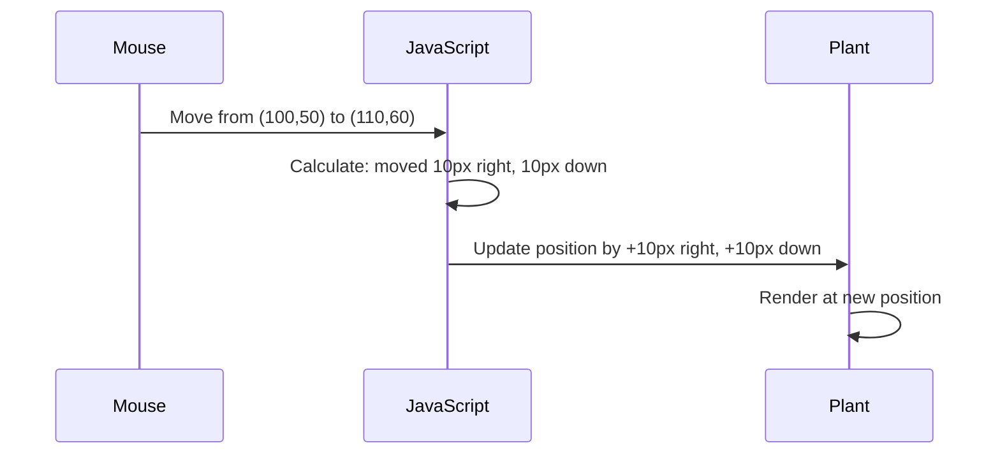

<!--
CO_OP_TRANSLATOR_METADATA:
{
  "original_hash": "bc93f6285423033ebf5b8abeb5282888",
  "translation_date": "2025-10-22T21:45:15+00:00",
  "source_file": "3-terrarium/3-intro-to-DOM-and-closures/README.md",
  "language_code": "bn"
}
-->
# Terrarium Project Part 3: DOM Manipulation and JavaScript Closures


> স্কেচনোট: [Tomomi Imura](https://twitter.com/girlie_mac)

ওয়েব ডেভেলপমেন্টের সবচেয়ে আকর্ষণীয় দিকগুলোর মধ্যে আপনাকে স্বাগতম - জিনিসগুলোকে ইন্টারঅ্যাকটিভ করা! ডকুমেন্ট অবজেক্ট মডেল (DOM) হলো আপনার HTML এবং JavaScript-এর মধ্যে একটি সেতু, এবং আজ আমরা এটি ব্যবহার করে আপনার টেরারিয়ামকে জীবন্ত করে তুলব। যখন টিম বার্নার্স-লি প্রথম ওয়েব ব্রাউজার তৈরি করেছিলেন, তিনি এমন একটি ওয়েব কল্পনা করেছিলেন যেখানে ডকুমেন্টগুলো গতিশীল এবং ইন্টারঅ্যাকটিভ হতে পারে - DOM সেই স্বপ্নকে বাস্তবায়িত করে।

আমরা JavaScript ক্লোজারও অন্বেষণ করব, যা প্রথমে ভীতিকর মনে হতে পারে। ক্লোজারকে "মেমোরি পকেট" তৈরি করার মতো ভাবুন যেখানে আপনার ফাংশনগুলো গুরুত্বপূর্ণ তথ্য মনে রাখতে পারে। এটি ঠিক যেন আপনার টেরারিয়ামের প্রতিটি গাছের নিজস্ব ডেটা রেকর্ড থাকে তার অবস্থান ট্র্যাক করার জন্য। এই পাঠের শেষে, আপনি বুঝতে পারবেন যে এগুলো কতটা স্বাভাবিক এবং কার্যকর।

আমরা যা তৈরি করছি তা হলো একটি টেরারিয়াম যেখানে ব্যবহারকারীরা গাছগুলোকে যেকোনো জায়গায় টেনে নিয়ে যেতে পারে। আপনি DOM ম্যানিপুলেশন কৌশল শিখবেন যা ড্র্যাগ-এন্ড-ড্রপ ফাইল আপলোড থেকে ইন্টারঅ্যাকটিভ গেম পর্যন্ত সবকিছু চালিত করে। আসুন আপনার টেরারিয়ামকে জীবন্ত করে তুলি।

## প্রি-লেকচার কুইজ

[প্রি-লেকচার কুইজ](https://ff-quizzes.netlify.app/web/quiz/19)

## DOM বোঝা: ইন্টারঅ্যাকটিভ ওয়েব পেজের জন্য আপনার গেটওয়ে

ডকুমেন্ট অবজেক্ট মডেল (DOM) হলো যেভাবে JavaScript আপনার HTML উপাদানগুলোর সাথে যোগাযোগ করে। যখন আপনার ব্রাউজার একটি HTML পেজ লোড করে, এটি মেমোরিতে সেই পেজের একটি কাঠামোগত উপস্থাপনা তৈরি করে - সেটাই হলো DOM। এটি একটি পারিবারিক গাছের মতো যেখানে প্রতিটি HTML উপাদান একটি পরিবারের সদস্য যা JavaScript অ্যাক্সেস করতে পারে, পরিবর্তন করতে পারে বা পুনর্বিন্যাস করতে পারে।

DOM ম্যানিপুলেশন স্থির পেজগুলোকে ইন্টারঅ্যাকটিভ ওয়েবসাইটে রূপান্তরিত করে। যখনই আপনি একটি বোতামকে হোভার করার সময় রঙ পরিবর্তন করতে দেখেন, পেজ রিফ্রেশ ছাড়াই কন্টেন্ট আপডেট হতে দেখেন, বা এমন উপাদান দেখেন যা আপনি টেনে নিয়ে যেতে পারেন, তখনই DOM ম্যানিপুলেশন কাজ করছে।


> DOM এবং HTML মার্কআপের একটি উপস্থাপনা যা এটি উল্লেখ করে। [Olfa Nasraoui](https://www.researchgate.net/publication/221417012_Profile-Based_Focused_Crawler_for_Social_Media-Sharing_Websites) থেকে

**DOM-কে শক্তিশালী করে তোলে যা:**
- **প্রদান করে** আপনার পেজের যেকোনো উপাদানে অ্যাক্সেস করার একটি কাঠামোগত উপায়
- **সক্ষম করে** পেজ রিফ্রেশ ছাড়াই গতিশীল কন্টেন্ট আপডেট
- **অনুমতি দেয়** ক্লিক এবং ড্র্যাগের মতো ব্যবহারকারীর ইন্টারঅ্যাকশনগুলোর রিয়েল-টাইম প্রতিক্রিয়া
- **তৈরি করে** আধুনিক ইন্টারঅ্যাকটিভ ওয়েব অ্যাপ্লিকেশনের ভিত্তি

## JavaScript ক্লোজার: সংগঠিত, শক্তিশালী কোড তৈরি করা

একটি [JavaScript ক্লোজার](https://developer.mozilla.org/docs/Web/JavaScript/Closures) হলো একটি ফাংশনকে তার নিজস্ব ব্যক্তিগত কর্মক্ষেত্র দেওয়ার মতো যেখানে স্থায়ী মেমোরি থাকে। ভাবুন কীভাবে গ্যালাপাগোস দ্বীপপুঞ্জের ডারউইনের ফিঞ্চরা তাদের নির্দিষ্ট পরিবেশের উপর ভিত্তি করে বিশেষায়িত ঠোঁট তৈরি করেছে - ক্লোজার একইভাবে কাজ করে, বিশেষায়িত ফাংশন তৈরি করে যা তাদের নির্দিষ্ট প্রসঙ্গ "মনে রাখে" এমনকি তাদের প্যারেন্ট ফাংশন শেষ হয়ে যাওয়ার পরেও।

আমাদের টেরারিয়ামে, ক্লোজারগুলো প্রতিটি গাছকে তার অবস্থান স্বাধীনভাবে মনে রাখতে সাহায্য করে। এই প্যাটার্নটি পেশাদার JavaScript ডেভেলপমেন্টে সর্বত্র দেখা যায়, যা এটি বোঝার জন্য একটি মূল্যবান ধারণা তৈরি করে।

> 💡 **ক্লোজার বোঝা**: JavaScript-এ ক্লোজার একটি গুরুত্বপূর্ণ বিষয়, এবং অনেক ডেভেলপার এটি ব্যবহার করেন বছরের পর বছর ধরে তাত্ত্বিক দিকগুলো পুরোপুরি বুঝতে পারার আগে। আজ আমরা ব্যবহারিক প্রয়োগের উপর মনোযোগ দিচ্ছি - আপনি দেখবেন ক্লোজারগুলো কীভাবে স্বাভাবিকভাবে উদ্ভূত হয় যখন আমরা আমাদের ইন্টারঅ্যাকটিভ বৈশিষ্ট্যগুলো তৈরি করি। বাস্তব সমস্যাগুলো কীভাবে সমাধান করে তা দেখার সাথে সাথে বোঝাপড়া তৈরি হবে।


> DOM এবং HTML মার্কআপের একটি উপস্থাপনা যা এটি উল্লেখ করে। [Olfa Nasraoui](https://www.researchgate.net/publication/221417012_Profile-Based_Focused_Crawler_for_Social_Media-Sharing_Websites) থেকে

এই পাঠে, আমরা আমাদের ইন্টারঅ্যাকটিভ টেরারিয়াম প্রকল্পটি সম্পূর্ণ করব, যা ব্যবহারকারীকে পেজে গাছগুলো ম্যানিপুলেট করার জন্য JavaScript তৈরি করতে দেবে।

## শুরু করার আগে: সফলতার জন্য প্রস্তুতি

আপনার আগের টেরারিয়াম পাঠগুলো থেকে HTML এবং CSS ফাইলগুলো প্রয়োজন হবে - আমরা সেই স্থির ডিজাইনটিকে ইন্টারঅ্যাকটিভ করতে যাচ্ছি। আপনি যদি প্রথমবার যোগ দেন, তাহলে সেই পাঠগুলো সম্পন্ন করা গুরুত্বপূর্ণ প্রেক্ষাপট প্রদান করবে।

আমরা যা তৈরি করব:
- **মসৃণ ড্র্যাগ-এন্ড-ড্রপ** টেরারিয়ামের সব গাছের জন্য
- **কোঅর্ডিনেট ট্র্যাকিং** যাতে গাছগুলো তাদের অবস্থান মনে রাখতে পারে
- **সম্পূর্ণ ইন্টারঅ্যাকটিভ ইন্টারফেস** ভ্যানিলা JavaScript ব্যবহার করে
- **পরিষ্কার, সংগঠিত কোড** ক্লোজার প্যাটার্ন ব্যবহার করে

## আপনার JavaScript ফাইল সেট আপ করা

আসুন সেই JavaScript ফাইলটি তৈরি করি যা আপনার টেরারিয়ামকে ইন্টারঅ্যাকটিভ করবে।

**ধাপ ১: আপনার স্ক্রিপ্ট ফাইল তৈরি করুন**

আপনার টেরারিয়াম ফোল্ডারে, `script.js` নামে একটি নতুন ফাইল তৈরি করুন।

**ধাপ ২: JavaScript-কে আপনার HTML-এর সাথে সংযুক্ত করুন**

আপনার `index.html` ফাইলের `<head>` সেকশনে এই স্ক্রিপ্ট ট্যাগটি যোগ করুন:

```html
<script src="./script.js" defer></script>
```

**কেন `defer` অ্যাট্রিবিউট গুরুত্বপূর্ণ:**
- **নিশ্চিত করে** আপনার JavaScript সব HTML লোড হওয়া পর্যন্ত অপেক্ষা করে
- **প্রতিরোধ করে** এমন ত্রুটি যেখানে JavaScript এমন উপাদান খুঁজে যা এখনও প্রস্তুত নয়
- **নিশ্চিত করে** আপনার গাছের সব উপাদান ইন্টারঅ্যাকশনের জন্য উপলব্ধ
- **উন্নত করে** পেজের নিচে স্ক্রিপ্ট রাখার চেয়ে ভালো পারফরম্যান্স

> ⚠️ **গুরুত্বপূর্ণ নোট**: `defer` অ্যাট্রিবিউট সাধারণ টাইমিং সমস্যাগুলো প্রতিরোধ করে। এটি ছাড়া, JavaScript HTML উপাদানগুলো লোড হওয়ার আগে অ্যাক্সেস করার চেষ্টা করতে পারে, যা ত্রুটি সৃষ্টি করতে পারে।

---

## JavaScript-কে আপনার HTML উপাদানগুলোর সাথে সংযুক্ত করা

আমরা উপাদানগুলোকে ড্র্যাগযোগ্য করার আগে, JavaScript-এর জন্য DOM-এ সেগুলো খুঁজে বের করা প্রয়োজন। এটি একটি লাইব্রেরি ক্যাটালগিং সিস্টেমের মতো ভাবুন - একবার আপনি ক্যাটালগ নম্বর পেয়ে গেলে, আপনি ঠিক সেই বইটি খুঁজে পেতে পারেন যা আপনার প্রয়োজন এবং তার সমস্ত বিষয়বস্তু অ্যাক্সেস করতে পারেন।

আমরা `document.getElementById()` পদ্ধতি ব্যবহার করব এই সংযোগগুলো তৈরি করতে। এটি একটি সুনির্দিষ্ট ফাইলিং সিস্টেমের মতো - আপনি একটি ID প্রদান করেন, এবং এটি ঠিক সেই উপাদানটি খুঁজে বের করে যা আপনার HTML-এ প্রয়োজন।

### সব গাছের জন্য ড্র্যাগ ফাংশনালিটি সক্রিয় করা

এই কোডটি আপনার `script.js` ফাইলে যোগ করুন:

```javascript
// Enable drag functionality for all 14 plants
dragElement(document.getElementById('plant1'));
dragElement(document.getElementById('plant2'));
dragElement(document.getElementById('plant3'));
dragElement(document.getElementById('plant4'));
dragElement(document.getElementById('plant5'));
dragElement(document.getElementById('plant6'));
dragElement(document.getElementById('plant7'));
dragElement(document.getElementById('plant8'));
dragElement(document.getElementById('plant9'));
dragElement(document.getElementById('plant10'));
dragElement(document.getElementById('plant11'));
dragElement(document.getElementById('plant12'));
dragElement(document.getElementById('plant13'));
dragElement(document.getElementById('plant14'));
```

**এই কোডটি যা অর্জন করে:**
- **প্রতিটি গাছের উপাদানকে** তার অনন্য ID ব্যবহার করে DOM-এ খুঁজে বের করে
- **প্রত্যেক HTML উপাদানের** একটি JavaScript রেফারেন্স পুনরুদ্ধার করে
- **প্রতিটি উপাদানকে** একটি `dragElement` ফাংশনে পাঠায় (যা আমরা পরবর্তীতে তৈরি করব)
- **প্রস্তুত করে** প্রতিটি গাছকে ড্র্যাগ-এন্ড-ড্রপ ইন্টারঅ্যাকশনের জন্য
- **সংযুক্ত করে** আপনার HTML কাঠামোকে JavaScript ফাংশনালিটির সাথে

> 🎯 **কেন ID ব্যবহার করবেন ক্লাসের পরিবর্তে?** ID নির্দিষ্ট উপাদানগুলোর জন্য অনন্য শনাক্তকারী প্রদান করে, যেখানে CSS ক্লাসগুলো উপাদানগুলোর গ্রুপ স্টাইল করার জন্য ডিজাইন করা হয়েছে। যখন JavaScript-কে পৃথক উপাদানগুলো ম্যানিপুলেট করতে হয়, তখন ID আমাদের প্রয়োজনীয় নির্ভুলতা এবং পারফরম্যান্স প্রদান করে।

> 💡 **প্রো টিপ**: লক্ষ্য করুন আমরা কীভাবে প্রতিটি গাছের জন্য আলাদাভাবে `dragElement()` কল করছি। এই পদ্ধতিটি নিশ্চিত করে যে প্রতিটি গাছ তার নিজস্ব স্বাধীন ড্র্যাগিং আচরণ পায়, যা মসৃণ ব্যবহারকারীর ইন্টারঅ্যাকশনের জন্য অপরিহার্য।

---

## ড্র্যাগ এলিমেন্ট ক্লোজার তৈরি করা

এখন আমরা আমাদের ড্র্যাগিং ফাংশনালিটির মূল অংশ তৈরি করব: একটি ক্লোজার যা প্রতিটি গাছের ড্র্যাগিং আচরণ পরিচালনা করে। এই ক্লোজারটি একাধিক অভ্যন্তরীণ ফাংশন ধারণ করবে যা মাউস মুভমেন্ট ট্র্যাক করতে এবং উপাদানের অবস্থান আপডেট করতে একসাথে কাজ করবে।

ক্লোজারগুলো এই কাজের জন্য উপযুক্ত কারণ তারা আমাদের "প্রাইভেট" ভেরিয়েবল তৈরি করতে দেয় যা ফাংশন কলগুলোর মধ্যে স্থায়ী হয়, প্রতিটি গাছকে তার নিজস্ব স্বাধীন কোঅর্ডিনেট ট্র্যাকিং সিস্টেম দেয়।

### একটি সাধারণ উদাহরণ দিয়ে ক্লোজার বোঝা

ক্লোজারগুলো কীভাবে কাজ করে তা বোঝাতে একটি সাধারণ উদাহরণ দেখাই:

```javascript
function createCounter() {
    let count = 0; // This is like a private variable
    
    function increment() {
        count++; // The inner function remembers the outer variable
        return count;
    }
    
    return increment; // We're giving back the inner function
}

const myCounter = createCounter();
console.log(myCounter()); // 1
console.log(myCounter()); // 2
```

**এই ক্লোজার প্যাটার্নে যা ঘটছে:**
- **একটি প্রাইভেট `count` ভেরিয়েবল তৈরি করে** যা শুধুমাত্র এই ক্লোজারের মধ্যে বিদ্যমান
- **অভ্যন্তরী
- **`pos3` এবং `pos4`**: পরবর্তী গণনার জন্য বর্তমান মাউস অবস্থান সংরক্ষণ করে  
- **`offsetTop` এবং `offsetLeft`**: পৃষ্ঠায় উপাদানের বর্তমান অবস্থান নির্ধারণ করে  
- **বিয়োগের লজিক**: উপাদানটি মাউস যতটা সরেছে ঠিক ততটাই সরিয়ে দেয়  

**এখানে মুভমেন্ট গণনার বিশ্লেষণ:**  
1. **পরিমাপ করে** পুরনো এবং নতুন মাউস অবস্থানের পার্থক্য  
2. **গণনা করে** মাউসের গতির উপর ভিত্তি করে উপাদানটি কতটা সরাতে হবে  
3. **আপডেট করে** উপাদানের CSS অবস্থান প্রপার্টিগুলি রিয়েল-টাইমে  
4. **সংরক্ষণ করে** নতুন অবস্থান পরবর্তী মুভমেন্ট গণনার জন্য ভিত্তি হিসেবে  

### গণিতের ভিজ্যুয়াল উপস্থাপনা  


  
### stopElementDrag ফাংশন: ক্লিনআপ  

`elementDrag` এর বন্ধনীর পরে ক্লিনআপ ফাংশন যোগ করুন:  

```javascript
function stopElementDrag() {
    // Remove the document-level event listeners
    document.onpointerup = null;
    document.onpointermove = null;
}
```
  
**ক্লিনআপ কেন গুরুত্বপূর্ণ:**  
- **প্রতিরোধ করে** মেমরি লিক যা অবশিষ্ট ইভেন্ট লিসেনার থেকে হতে পারে  
- **বন্ধ করে** ড্র্যাগিং আচরণ যখন ব্যবহারকারী প্ল্যান্ট ছেড়ে দেয়  
- **অনুমতি দেয়** অন্যান্য উপাদানকে স্বাধীনভাবে ড্র্যাগ করার  
- **সিস্টেম রিসেট করে** পরবর্তী ড্র্যাগ অপারেশনের জন্য  

**ক্লিনআপ ছাড়া কী ঘটে:**  
- ইভেন্ট লিসেনার ড্র্যাগিং বন্ধ হওয়ার পরেও চলতে থাকে  
- পারফরম্যান্স কমে যায় কারণ অব্যবহৃত লিসেনার জমা হয়  
- অন্যান্য উপাদানের সাথে ইন্টারঅ্যাক্ট করার সময় অপ্রত্যাশিত আচরণ  
- ব্রাউজারের রিসোর্স অপ্রয়োজনীয় ইভেন্ট হ্যান্ডলিংয়ে নষ্ট হয়  

### CSS অবস্থান প্রপার্টি বোঝা  

আমাদের ড্র্যাগিং সিস্টেম দুটি গুরুত্বপূর্ণ CSS প্রপার্টি নিয়ন্ত্রণ করে:  

| প্রপার্টি | এটি কী নিয়ন্ত্রণ করে | আমরা কীভাবে এটি ব্যবহার করি |  
|----------|------------------|---------------|  
| `top` | উপরের প্রান্ত থেকে দূরত্ব | ড্র্যাগ করার সময় উল্লম্ব অবস্থান |  
| `left` | বাম প্রান্ত থেকে দূরত্ব | ড্র্যাগ করার সময় অনুভূমিক অবস্থান |  

**offset প্রপার্টি সম্পর্কে গুরুত্বপূর্ণ তথ্য:**  
- **`offsetTop`**: পজিশনড প্যারেন্ট এলিমেন্ট থেকে বর্তমান দূরত্ব  
- **`offsetLeft`**: পজিশনড প্যারেন্ট এলিমেন্ট থেকে বর্তমান দূরত্ব  
- **পজিশনিং কনটেক্সট**: এই মানগুলি নিকটতম পজিশনড পূর্বপুরুষের তুলনায় আপেক্ষিক  
- **রিয়েল-টাইম আপডেট**: CSS প্রপার্টি পরিবর্তন করলে তা সঙ্গে সঙ্গে পরিবর্তিত হয়  

> 🎯 **ডিজাইন দর্শন**: এই ড্র্যাগ সিস্টেমটি ইচ্ছাকৃতভাবে নমনীয় – এখানে কোনো "ড্রপ জোন" বা সীমাবদ্ধতা নেই। ব্যবহারকারীরা প্ল্যান্টগুলো যেকোনো জায়গায় রাখতে পারে, তাদের টেরারিয়াম ডিজাইনে সম্পূর্ণ সৃজনশীল নিয়ন্ত্রণ দেয়।  

## সবকিছু একত্রিত করা: আপনার সম্পূর্ণ ড্র্যাগ সিস্টেম  

অভিনন্দন! আপনি ভ্যানিলা জাভাস্ক্রিপ্ট ব্যবহার করে একটি উন্নত ড্র্যাগ-এন্ড-ড্রপ সিস্টেম তৈরি করেছেন। আপনার সম্পূর্ণ `dragElement` ফাংশন এখন একটি শক্তিশালী ক্লোজার ধারণ করে যা পরিচালনা করে:  

**আপনার ক্লোজার কী অর্জন করে:**  
- **প্রাইভেট পজিশন ভেরিয়েবল** প্রতিটি প্ল্যান্টের জন্য স্বাধীনভাবে সংরক্ষণ করে  
- **সম্পূর্ণ ড্র্যাগ লাইফসাইকেল** শুরু থেকে শেষ পর্যন্ত পরিচালনা করে  
- **মসৃণ, প্রতিক্রিয়াশীল মুভমেন্ট** পুরো স্ক্রিন জুড়ে প্রদান করে  
- **রিসোর্স সঠিকভাবে ক্লিনআপ করে** মেমরি লিক প্রতিরোধ করতে  
- **ইউজারদের জন্য একটি স্বজ্ঞাত, সৃজনশীল ইন্টারফেস তৈরি করে** টেরারিয়াম ডিজাইনের জন্য  

### আপনার ইন্টারঅ্যাকটিভ টেরারিয়াম পরীক্ষা করুন  

এখন আপনার ইন্টারঅ্যাকটিভ টেরারিয়াম পরীক্ষা করুন! আপনার `index.html` ফাইলটি একটি ওয়েব ব্রাউজারে খুলুন এবং ফাংশনালিটি পরীক্ষা করুন:  

1. **ক্লিক এবং ধরে রাখুন** যেকোনো প্ল্যান্ট ড্র্যাগ শুরু করতে  
2. **মাউস বা আঙুল সরান** এবং দেখুন প্ল্যান্টটি মসৃণভাবে অনুসরণ করছে  
3. **ছাড়ুন** প্ল্যান্টটিকে তার নতুন অবস্থানে ফেলে দিতে  
4. **পরীক্ষা করুন** বিভিন্ন বিন্যাসের মাধ্যমে ইন্টারফেসটি অন্বেষণ করতে  

🥇 **অর্জন**: আপনি একটি সম্পূর্ণ ইন্টারঅ্যাকটিভ ওয়েব অ্যাপ্লিকেশন তৈরি করেছেন যা পেশাদার ডেভেলপাররা প্রতিদিন ব্যবহার করে এমন মূল ধারণাগুলি ব্যবহার করে। এই ড্র্যাগ-এন্ড-ড্রপ ফাংশনালিটি ফাইল আপলোড, কানবান বোর্ড এবং অন্যান্য অনেক ইন্টারঅ্যাকটিভ ইন্টারফেসের পিছনে একই নীতিগুলি ব্যবহার করে।  

  

---  

## GitHub Copilot Agent Challenge 🚀  

Agent মোড ব্যবহার করে নিম্নলিখিত চ্যালেঞ্জটি সম্পন্ন করুন:  

**বর্ণনা:** টেরারিয়াম প্রকল্পে একটি রিসেট ফাংশনালিটি যোগ করুন যা সমস্ত প্ল্যান্টকে তাদের মূল অবস্থানে মসৃণ অ্যানিমেশনের মাধ্যমে ফিরিয়ে দেয়।  

**প্রম্পট:** একটি রিসেট বাটন তৈরি করুন যা ক্লিক করলে সমস্ত প্ল্যান্টকে তাদের মূল সাইডবার অবস্থানে ফিরিয়ে নিয়ে যায় CSS ট্রানজিশন ব্যবহার করে। ফাংশনটি পৃষ্ঠাটি লোড হওয়ার সময় মূল অবস্থানগুলি সংরক্ষণ করবে এবং রিসেট বাটন চাপলে প্ল্যান্টগুলোকে ১ সেকেন্ডের মধ্যে মসৃণভাবে সেই অবস্থানে ফিরিয়ে নিয়ে যাবে।  

Agent মোড সম্পর্কে আরও জানুন [এখানে](https://code.visualstudio.com/blogs/2025/02/24/introducing-copilot-agent-mode)।  

## 🚀 অতিরিক্ত চ্যালেঞ্জ: আপনার দক্ষতা বৃদ্ধি করুন  

আপনার টেরারিয়ামকে আরও উন্নত করতে প্রস্তুত? এই উন্নয়নগুলি বাস্তবায়ন করার চেষ্টা করুন:  

**সৃজনশীল সম্প্রসারণ:**  
- **ডাবল-ক্লিক** একটি প্ল্যান্টকে সামনে নিয়ে আসতে (z-index ম্যানিপুলেশন)  
- **ভিজ্যুয়াল ফিডব্যাক যোগ করুন** যেমন প্ল্যান্টের উপর হোভার করলে একটি সূক্ষ্ম গ্লো  
- **সীমা নির্ধারণ করুন** যাতে প্ল্যান্টগুলো টেরারিয়ামের বাইরে ড্র্যাগ না হয়  
- **একটি সেভ ফাংশন তৈরি করুন** যা প্ল্যান্টের অবস্থানগুলো localStorage ব্যবহার করে মনে রাখে  
- **সাউন্ড ইফেক্ট যোগ করুন** প্ল্যান্ট তুলে নেওয়া এবং রাখার সময়  

> 💡 **শিক্ষার সুযোগ**: এই চ্যালেঞ্জগুলো আপনাকে DOM ম্যানিপুলেশন, ইভেন্ট হ্যান্ডলিং এবং ইউজার এক্সপেরিয়েন্স ডিজাইনের নতুন দিক শেখাবে।  

## পোস্ট-লেকচার কুইজ  

[পোস্ট-লেকচার কুইজ](https://ff-quizzes.netlify.app/web/quiz/20)  

## রিভিউ এবং স্ব-অধ্যয়ন: আপনার জ্ঞান গভীর করা  

আপনি DOM ম্যানিপুলেশন এবং ক্লোজারগুলির মৌলিক বিষয়গুলি আয়ত্ত করেছেন, তবে আরও অন্বেষণ করার জন্য সর্বদা কিছু থাকে! এখানে আপনার জ্ঞান এবং দক্ষতা প্রসারিত করার জন্য কিছু পথ রয়েছে।  

### বিকল্প ড্র্যাগ এবং ড্রপ পদ্ধতি  

আমরা সর্বাধিক নমনীয়তার জন্য পয়েন্টার ইভেন্ট ব্যবহার করেছি, তবে ওয়েব ডেভেলপমেন্টে একাধিক পদ্ধতি রয়েছে:  

| পদ্ধতি | সেরা জন্য | শেখার মূল্য |  
|----------|----------|----------------|  
| [HTML Drag and Drop API](https://developer.mozilla.org/docs/Web/API/HTML_Drag_and_Drop_API) | ফাইল আপলোড, আনুষ্ঠানিক ড্র্যাগ জোন | নেটিভ ব্রাউজার সক্ষমতা বোঝা |  
| [Touch Events](https://developer.mozilla.org/docs/Web/API/Touch_events) | মোবাইল-নির্দিষ্ট ইন্টারঅ্যাকশন | মোবাইল-প্রথম ডেভেলপমেন্ট প্যাটার্ন |  
| CSS `transform` প্রপার্টি | মসৃণ অ্যানিমেশন | পারফরম্যান্স অপ্টিমাইজেশন কৌশল |  

### উন্নত DOM ম্যানিপুলেশন বিষয়  

**আপনার শেখার যাত্রার পরবর্তী ধাপ:**  
- **ইভেন্ট ডেলিগেশন**: একাধিক উপাদানের জন্য ইভেন্ট দক্ষতার সাথে পরিচালনা করা  
- **ইন্টারসেকশন অবজারভার**: উপাদানগুলো ভিউপোর্টে প্রবেশ/প্রস্থান করলে সনাক্ত করা  
- **মিউটেশন অবজারভার**: DOM স্ট্রাকচারে পরিবর্তন দেখার জন্য  
- **ওয়েব কম্পোনেন্টস**: পুনরায় ব্যবহারযোগ্য, এনক্যাপসুলেটেড UI উপাদান তৈরি করা  
- **ভার্চুয়াল DOM ধারণা**: ফ্রেমওয়ার্কগুলি কীভাবে DOM আপডেট অপ্টিমাইজ করে তা বোঝা  

### অব্যাহত শেখার জন্য প্রয়োজনীয় সম্পদ  

**প্রযুক্তিগত ডকুমেন্টেশন:**  
- [MDN Pointer Events Guide](https://developer.mozilla.org/docs/Web/API/Pointer_events) - পয়েন্টার ইভেন্টের ব্যাপক রেফারেন্স  
- [W3C Pointer Events Specification](https://www.w3.org/TR/pointerevents1/) - অফিসিয়াল স্ট্যান্ডার্ড ডকুমেন্টেশন  
- [JavaScript Closures Deep Dive](https://developer.mozilla.org/docs/Web/JavaScript/Closures) - উন্নত ক্লোজার প্যাটার্ন  

**ব্রাউজার সামঞ্জস্যতা:**  
- [CanIUse.com](https://caniuse.com/) - বিভিন্ন ব্রাউজারে ফিচার সাপোর্ট পরীক্ষা করুন  
- [MDN Browser Compatibility Data](https://github.com/mdn/browser-compat-data) - বিস্তারিত সামঞ্জস্য তথ্য  

**প্র্যাকটিসের সুযোগ:**  
- **তৈরি করুন** একটি পাজল গেম একই ড্র্যাগ মেকানিক্স ব্যবহার করে  
- **তৈরি করুন** একটি কানবান বোর্ড ড্র্যাগ-এন্ড-ড্রপ টাস্ক ম্যানেজমেন্ট সহ  
- **ডিজাইন করুন** একটি ইমেজ গ্যালারি ড্র্যাগযোগ্য ফটো বিন্যাস সহ  
- **পরীক্ষা করুন** মোবাইল ইন্টারফেসের জন্য টাচ জেসচার  

> 🎯 **শিক্ষার কৌশল**: এই ধারণাগুলি দৃঢ় করার সেরা উপায় হল অনুশীলন। ড্র্যাগযোগ্য ইন্টারফেসের বৈচিত্র্য তৈরি করার চেষ্টা করুন – প্রতিটি প্রকল্প আপনাকে ইউজার ইন্টারঅ্যাকশন এবং DOM ম্যানিপুলেশন সম্পর্কে নতুন কিছু শেখাবে।  

## অ্যাসাইনমেন্ট  

[DOM নিয়ে আরও কাজ করুন](assignment.md)  

---

**অস্বীকৃতি**:  
এই নথিটি AI অনুবাদ পরিষেবা [Co-op Translator](https://github.com/Azure/co-op-translator) ব্যবহার করে অনুবাদ করা হয়েছে। আমরা যথাসাধ্য সঠিকতা নিশ্চিত করার চেষ্টা করি, তবে অনুগ্রহ করে মনে রাখবেন যে স্বয়ংক্রিয় অনুবাদে ত্রুটি বা অসঙ্গতি থাকতে পারে। নথিটির মূল ভাষায় থাকা আসল সংস্করণকে প্রামাণিক উৎস হিসেবে বিবেচনা করা উচিত। গুরুত্বপূর্ণ তথ্যের জন্য, পেশাদার মানব অনুবাদ সুপারিশ করা হয়। এই অনুবাদ ব্যবহারের ফলে কোনো ভুল বোঝাবুঝি বা ভুল ব্যাখ্যা হলে আমরা দায়বদ্ধ থাকব না।