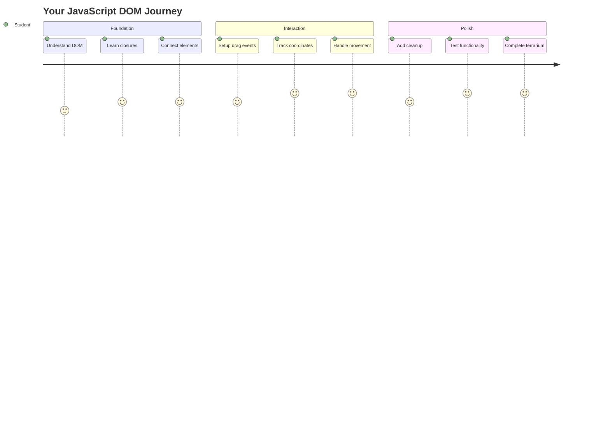
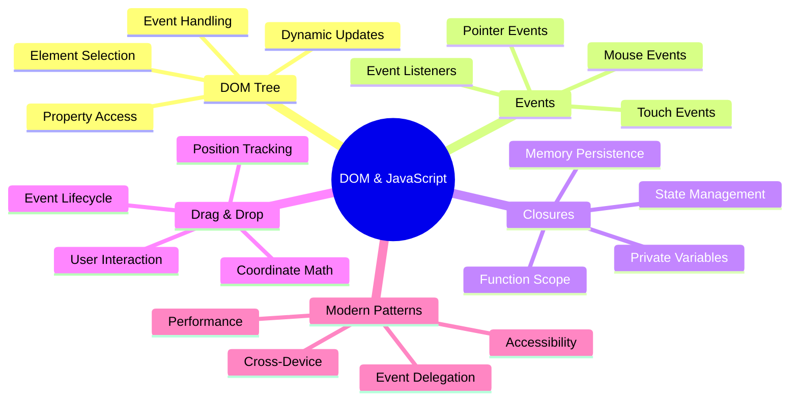
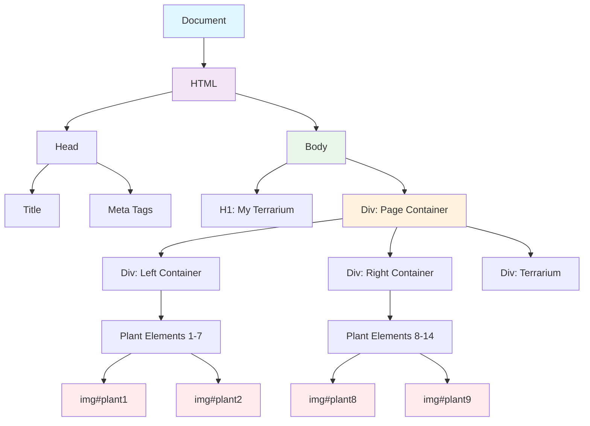
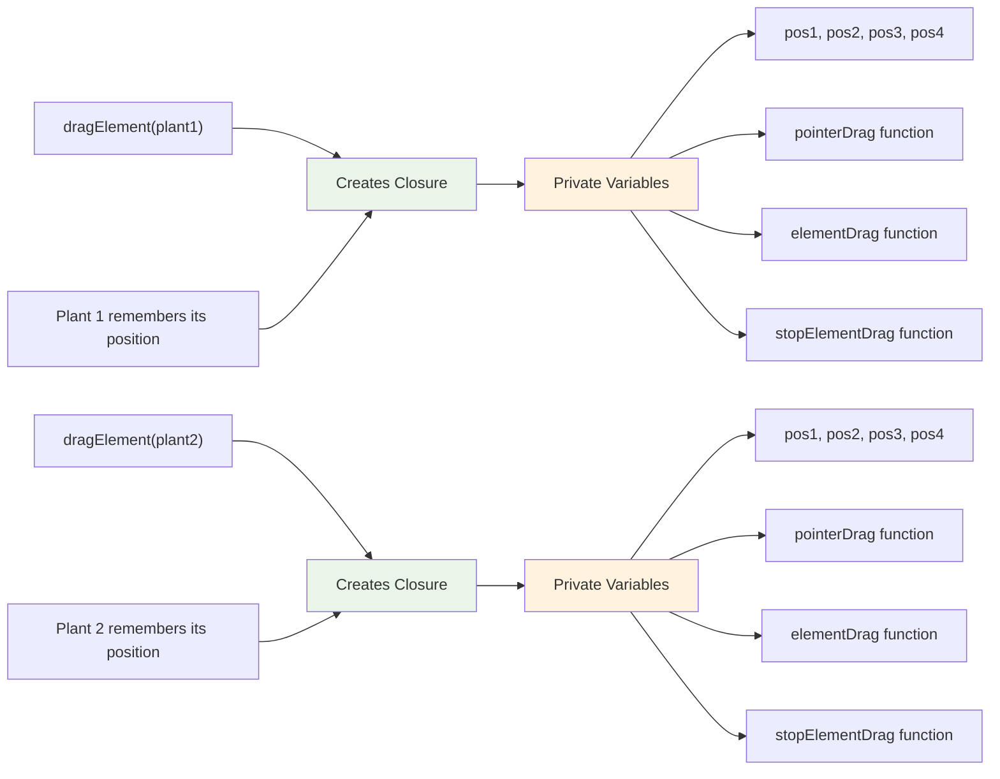
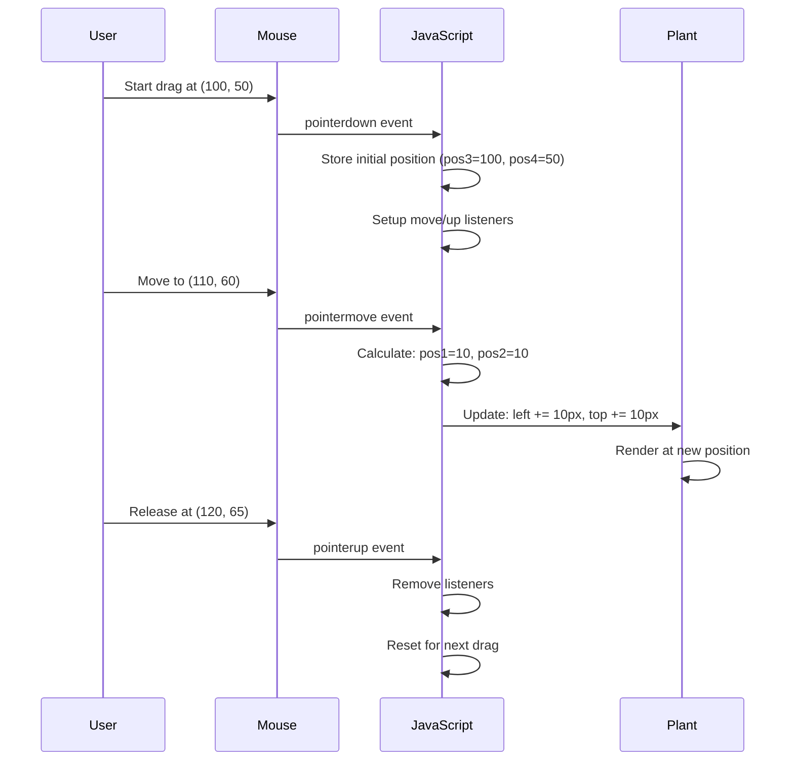
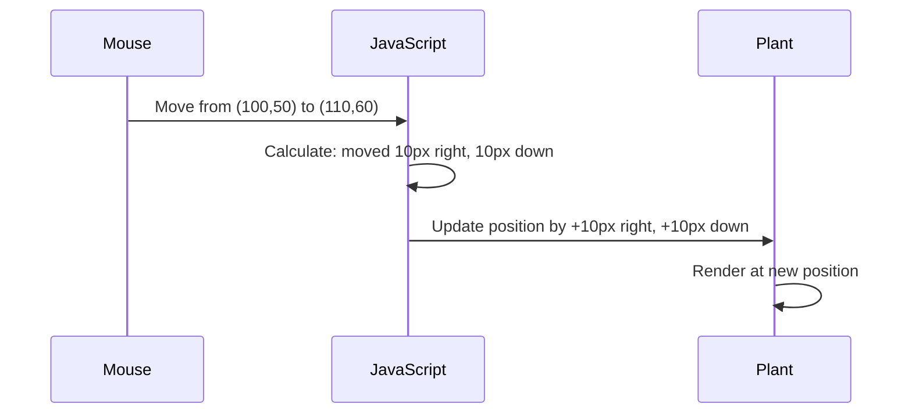

<!--
CO_OP_TRANSLATOR_METADATA:
{
  "original_hash": "973e48ad87d67bf5bb819746c9f8e302",
  "translation_date": "2025-11-03T22:43:04+00:00",
  "source_file": "3-terrarium/3-intro-to-DOM-and-closures/README.md",
  "language_code": "bn"
}
-->
# টেরারিয়াম প্রকল্প অংশ ৩: DOM ম্যানিপুলেশন এবং জাভাস্ক্রিপ্ট ক্লোজার




> স্কেচনোট [Tomomi Imura](https://twitter.com/girlie_mac) দ্বারা

ওয়েব ডেভেলপমেন্টের সবচেয়ে আকর্ষণীয় দিকগুলোর মধ্যে একটিতে আপনাকে স্বাগতম - জিনিসগুলোকে ইন্টারঅ্যাকটিভ করা! ডকুমেন্ট অবজেক্ট মডেল (DOM) আপনার HTML এবং জাভাস্ক্রিপ্টের মধ্যে একটি সেতুর মতো, এবং আজ আমরা এটি ব্যবহার করে আপনার টেরারিয়ামকে জীবন্ত করে তুলব। যখন টিম বার্নার্স-লি প্রথম ওয়েব ব্রাউজার তৈরি করেছিলেন, তিনি এমন একটি ওয়েবের কল্পনা করেছিলেন যেখানে ডকুমেন্টগুলো গতিশীল এবং ইন্টারঅ্যাকটিভ হতে পারে - DOM সেই স্বপ্নকে বাস্তবায়িত করে।

আমরা জাভাস্ক্রিপ্ট ক্লোজারও অন্বেষণ করব, যা প্রথমে ভীতিকর মনে হতে পারে। ক্লোজারকে "মেমোরি পকেট" তৈরি করার মতো ভাবুন যেখানে আপনার ফাংশনগুলো গুরুত্বপূর্ণ তথ্য মনে রাখতে পারে। এটি ঠিক যেন আপনার টেরারিয়ামের প্রতিটি গাছের নিজস্ব ডেটা রেকর্ড থাকে তার অবস্থান ট্র্যাক করার জন্য। এই পাঠের শেষে, আপনি বুঝতে পারবেন যে এগুলো কতটা স্বাভাবিক এবং কার্যকর।

আমরা যা তৈরি করছি তা এখানে: একটি টেরারিয়াম যেখানে ব্যবহারকারীরা গাছগুলোকে যেকোনো জায়গায় টেনে নিয়ে যেতে পারে। আপনি DOM ম্যানিপুলেশন কৌশল শিখবেন যা ড্র্যাগ-এন্ড-ড্রপ ফাইল আপলোড থেকে ইন্টারঅ্যাকটিভ গেম পর্যন্ত সবকিছু চালিত করে। চলুন আপনার টেরারিয়ামকে জীবন্ত করে তুলি।



## প্রি-লেকচার কুইজ

[প্রি-লেকচার কুইজ](https://ff-quizzes.netlify.app/web/quiz/19)

## DOM বোঝা: ইন্টারঅ্যাকটিভ ওয়েব পেজের জন্য আপনার গেটওয়ে

ডকুমেন্ট অবজেক্ট মডেল (DOM) হল কীভাবে জাভাস্ক্রিপ্ট আপনার HTML উপাদানগুলোর সাথে যোগাযোগ করে। যখন আপনার ব্রাউজার একটি HTML পেজ লোড করে, এটি মেমোরিতে সেই পেজের একটি কাঠামোগত উপস্থাপনা তৈরি করে - সেটাই হল DOM। এটি একটি পারিবারিক গাছের মতো ভাবুন যেখানে প্রতিটি HTML উপাদান একটি পরিবারের সদস্য যা জাভাস্ক্রিপ্ট অ্যাক্সেস করতে পারে, পরিবর্তন করতে পারে বা পুনর্বিন্যাস করতে পারে।

DOM ম্যানিপুলেশন স্থির পেজগুলোকে ইন্টারঅ্যাকটিভ ওয়েবসাইটে রূপান্তরিত করে। যখনই আপনি একটি বোতামকে হোভার করার সময় রঙ পরিবর্তন করতে দেখেন, পেজ রিফ্রেশ ছাড়াই কন্টেন্ট আপডেট হয়, বা এমন উপাদানগুলো যা আপনি টেনে নিয়ে যেতে পারেন, তখনই DOM ম্যানিপুলেশন কাজ করে।




> DOM এবং HTML মার্কআপের একটি উপস্থাপনা যা এটি রেফারেন্স করে। [Olfa Nasraoui](https://www.researchgate.net/publication/221417012_Profile-Based_Focused_Crawler_for_Social_Media-Sharing_Websites) থেকে

**DOM-কে শক্তিশালী করে তোলে যা:**
- **প্রদান করে** আপনার পেজের যেকোনো উপাদানে অ্যাক্সেস করার একটি কাঠামোগত উপায়
- **সক্ষম করে** পেজ রিফ্রেশ ছাড়াই গতিশীল কন্টেন্ট আপডেট
- **অনুমতি দেয়** ক্লিক এবং ড্র্যাগের মতো ব্যবহারকারীর ইন্টারঅ্যাকশনগুলোর রিয়েল-টাইম প্রতিক্রিয়া
- **তৈরি করে** আধুনিক ইন্টারঅ্যাকটিভ ওয়েব অ্যাপ্লিকেশনের ভিত্তি

## জাভাস্ক্রিপ্ট ক্লোজার: সংগঠিত, শক্তিশালী কোড তৈরি করা

একটি [জাভাস্ক্রিপ্ট ক্লোজার](https://developer.mozilla.org/docs/Web/JavaScript/Closures) হল একটি ফাংশনকে তার নিজস্ব ব্যক্তিগত কর্মক্ষেত্র দেওয়ার মতো যেখানে স্থায়ী মেমোরি থাকে। ভাবুন কীভাবে গ্যালাপাগোস দ্বীপপুঞ্জের ডারউইনের ফিঞ্চরা তাদের নির্দিষ্ট পরিবেশের উপর ভিত্তি করে বিশেষায়িত ঠোঁট তৈরি করেছে - ক্লোজার একইভাবে কাজ করে, বিশেষায়িত ফাংশন তৈরি করে যা তাদের নির্দিষ্ট প্রসঙ্গ "মনে রাখে" এমনকি তাদের প্যারেন্ট ফাংশন শেষ হওয়ার পরেও।

আমাদের টেরারিয়ামে, ক্লোজারগুলো প্রতিটি গাছকে তার নিজস্ব অবস্থান স্বাধীনভাবে মনে রাখতে সাহায্য করে। এই প্যাটার্নটি পেশাদার জাভাস্ক্রিপ্ট ডেভেলপমেন্টে সর্বত্র দেখা যায়, যা এটি বোঝার জন্য একটি মূল্যবান ধারণা তৈরি করে।



> 💡 **ক্লোজার বোঝা**: ক্লোজার জাভাস্ক্রিপ্টে একটি গুরুত্বপূর্ণ বিষয়, এবং অনেক ডেভেলপার এটি ব্যবহার করেন বছরের পর বছর ধরে তাত্ত্বিক দিকগুলো সম্পূর্ণরূপে বোঝার আগে। আজ, আমরা ব্যবহারিক প্রয়োগের উপর ফোকাস করছি - আপনি দেখবেন ক্লোজার কীভাবে আমাদের ইন্টারঅ্যাকটিভ বৈশিষ্ট্য তৈরি করার সময় স্বাভাবিকভাবে উদ্ভূত হয়। বাস্তব সমস্যাগুলো কীভাবে সমাধান করে তা দেখার সাথে সাথে আপনার বোঝাপড়া বিকশিত হবে।


> DOM এবং HTML মার্কআপের একটি উপস্থাপনা যা এটি রেফারেন্স করে। [Olfa Nasraoui](https://www.researchgate.net/publication/221417012_Profile-Based_Focused_Crawler_for_Social_Media-Sharing_Websites) থেকে

এই পাঠে, আমরা আমাদের ইন্টারঅ্যাকটিভ টেরারিয়াম প্রকল্প সম্পন্ন করব, এমন একটি জাভাস্ক্রিপ্ট তৈরি করে যা ব্যবহারকারীকে পেজে গাছগুলো ম্যানিপুলেট করতে দেবে।

## শুরু করার আগে: সফলতার জন্য প্রস্তুতি

আপনার আগের টেরারিয়াম পাঠ থেকে HTML এবং CSS ফাইলগুলো প্রয়োজন হবে - আমরা সেই স্থির ডিজাইনটিকে ইন্টারঅ্যাকটিভ করতে যাচ্ছি। আপনি যদি প্রথমবার যোগদান করেন, তাহলে সেই পাঠগুলো সম্পন্ন করা গুরুত্বপূর্ণ প্রেক্ষাপট প্রদান করবে।

আমরা যা তৈরি করব:
- **মসৃণ ড্র্যাগ-এন্ড-ড্রপ** টেরারিয়ামের সব গাছের জন্য
- **কোঅর্ডিনেট ট্র্যাকিং** যাতে গাছগুলো তাদের অবস্থান মনে রাখতে পারে
- **সম্পূর্ণ ইন্টারঅ্যাকটিভ ইন্টারফেস** ভ্যানিলা জাভাস্ক্রিপ্ট ব্যবহার করে
- **পরিষ্কার, সংগঠিত কোড** ক্লোজার প্যাটার্ন ব্যবহার করে

## আপনার জাভাস্ক্রিপ্ট ফাইল সেট আপ করা

চলুন আপনার টেরারিয়ামকে ইন্টারঅ্যাকটিভ করার জন্য জাভাস্ক্রিপ্ট ফাইল তৈরি করি।

**ধাপ ১: আপনার স্ক্রিপ্ট ফাইল তৈরি করুন**

আপনার টেরারিয়াম ফোল্ডারে, `script.js` নামে একটি নতুন ফাইল তৈরি করুন।

**ধাপ ২: জাভাস্ক্রিপ্টকে আপনার HTML-এর সাথে সংযুক্ত করুন**

আপনার `index.html` ফাইলের `<head>` সেকশনে এই স্ক্রিপ্ট ট্যাগটি যোগ করুন:

```html
<script src="./script.js" defer></script>
```

**কেন `defer` অ্যাট্রিবিউট গুরুত্বপূর্ণ:**
- **নিশ্চিত করে** আপনার জাভাস্ক্রিপ্ট সব HTML লোড হওয়া পর্যন্ত অপেক্ষা করে
- **প্রতিরোধ করে** এমন ত্রুটি যেখানে জাভাস্ক্রিপ্ট এমন উপাদান খুঁজে পেতে চেষ্টা করে যা এখনও প্রস্তুত নয়
- **গ্যারান্টি দেয়** আপনার গাছের সব উপাদান ইন্টারঅ্যাকশনের জন্য উপলব্ধ
- **উন্নত করে** পেজের নিচে স্ক্রিপ্ট রাখার চেয়ে ভালো পারফরম্যান্স

> ⚠️ **গুরুত্বপূর্ণ নোট**: `defer` অ্যাট্রিবিউট সাধারণ টাইমিং সমস্যাগুলো প্রতিরোধ করে। এটি ছাড়া, জাভাস্ক্রিপ্ট HTML উপাদানগুলো লোড হওয়ার আগে অ্যাক্সেস করার চেষ্টা করতে পারে, যা ত্রুটি সৃষ্টি করতে পারে।

---

## জাভাস্ক্রিপ্টকে আপনার HTML উপাদানগুলোর সাথে সংযুক্ত করা

আমরা উপাদানগুলোকে ড্র্যাগযোগ্য করার আগে, জাভাস্ক্রিপ্টকে DOM-এ সেগুলো খুঁজে বের করতে হবে। এটি একটি লাইব্রেরি ক্যাটালগিং সিস্টেমের মতো ভাবুন - একবার আপনি ক্যাটালগ নম্বর পেয়ে গেলে, আপনি ঠিক সেই বইটি খুঁজে পেতে পারেন যা আপনার প্রয়োজন এবং তার সমস্ত বিষয়বস্তু অ্যাক্সেস করতে পারেন।

আমরা `document.getElementById()` পদ্ধতি ব্যবহার করব এই সংযোগগুলো তৈরি করতে। এটি একটি সুনির্দিষ্ট ফাইলিং সিস্টেমের মতো - আপনি একটি ID প্রদান করেন, এবং এটি ঠিক সেই উপাদানটি খুঁজে বের করে যা আপনার HTML-এ প্রয়োজন।

### সব গাছের জন্য ড্র্যাগ ফাংশনালিটি সক্রিয় করা

এই কোডটি আপনার `script.js` ফাইলে যোগ করুন:

```javascript
// Enable drag functionality for all 14 plants
dragElement(document.getElementById('plant1'));
dragElement(document.getElementById('plant2'));
dragElement(document.getElementById('plant3'));
dragElement(document.getElementById('plant4'));
dragElement(document.getElementById('plant5'));
dragElement(document.getElementById('plant6'));
dragElement(document.getElementById('plant7'));
dragElement(document.getElementById('plant8'));
dragElement(document.getElementById('plant9'));
dragElement(document.getElementById('plant10'));
dragElement(document.getElementById('plant11'));
dragElement(document.getElementById('plant12'));
dragElement(document.getElementById('plant13'));
dragElement(document.getElementById('plant14'));
```

**এই কোডটি যা সম্পন্ন করে:**
- **প্রতিটি গাছের উপাদানকে DOM-এ খুঁজে বের করে** তার অনন্য ID ব্যবহার করে
- **প্রতিটি HTML উপাদানের একটি জাভাস্ক্রিপ্ট রেফারেন্স পুনরুদ্ধার করে**
- **প্রতিটি উপাদানকে একটি `dragElement` ফাংশনে পাঠায়** (যা আমরা পরবর্তীতে তৈরি করব)
- **প্রতিটি গাছকে ড্র্যাগ-এন্ড-ড্রপ ইন্টারঅ্যাকশনের জন্য প্রস্তুত করে**
- **আপনার HTML কাঠামোকে জাভাস্ক্রিপ্ট ফাংশনালিটির সাথে সংযুক্ত করে**

> 🎯 **কেন ID ব্যবহার করব ক্লাসের পরিবর্তে?** ID নির্দিষ্ট উপাদানগুলোর জন্য অনন্য শনাক্তকারী প্রদান করে, যেখানে CSS ক্লাসগুলো উপাদানগুলোর গ্রুপ স্টাইল করার জন্য ডিজাইন করা হয়েছে। যখন জাভাস্ক্রিপ্টকে পৃথক উপাদানগুলো ম্যানিপুলেট করতে হয়, তখন ID আমাদের প্রয়োজনীয় নির্ভুলতা এবং পারফরম্যান্স প্রদান করে।

> 💡 **প্রো টিপ**: লক্ষ্য করুন আমরা কীভাবে প্রতিটি গাছের জন্য আলাদাভাবে `dragElement()` কল করছি। এই পদ্ধতি নিশ্চিত করে যে প্রতিটি গাছ তার নিজস্ব স্বাধীন ড্র্যাগিং আচরণ পায়, যা মসৃণ ব্যবহারকারীর ইন্টারঅ্যাকশনের জন্য অপরিহার্য।

### 🔄 **শিক্ষামূলক চেক-ইন**
**DOM সংযোগ বোঝা**: ড্র্যাগ ফাংশনালিটিতে যাওয়ার আগে নিশ্চিত করুন আপনি:
- ✅ কীভাবে `document.getElementById()` HTML উপাদানগুলো খুঁজে বের করে তা ব্যাখ্যা করতে পারেন
- ✅ কেন আমরা প্রতিটি গাছের জন্য অনন্য ID ব্যবহার করি তা বুঝতে পারেন
- ✅ স্ক্রিপ্ট ট্যাগে `defer` অ্যাট্রিবিউটের উদ্দেশ্য বর্ণনা করতে পারেন
- ✅ কীভাবে জাভাস্ক্রিপ্ট এবং HTML DOM-এর মাধ্যমে সংযুক্ত হয় তা চিনতে পারেন

**দ্রুত স্ব-পরীক্ষা**: যদি দুটি উপাদানের একই ID থাকে তবে কী হবে? কেন `getElementById()` শুধুমাত্র একটি উপাদান ফেরত দেয়?
*উত্তর: IDগুলো অনন্য হওয়া উচিত; যদি ডুপ্লিকেট হয়, তাহলে শুধুমাত্র প্রথম উপাদানটি ফেরত দেয়*

---

## ড্র্যাগ এলিমেন্ট ক্লোজার তৈরি করা

এখন আমরা আমাদের ড্র্যাগিং ফাংশনালিটির মূল অংশ তৈরি করব: একটি ক্লোজার যা প্রতিটি গাছের জন্য ড্র্যাগিং আচরণ পরিচালনা করে। এই ক্লোজারটি একাধিক অভ্যন্তরীণ ফাংশন ধারণ করবে যা মাউসের গতিবিধি ট্র্যাক করতে এবং উপাদানের অবস্থান আপডেট করতে একসাথে কাজ করবে।

ক্লোজারগুলো এই কাজের জন্য উপযুক্ত কারণ তারা আমাদের "প্রাইভেট" ভেরিয়েবল তৈরি করতে দেয় যা ফাংশন কলগুলোর মধ্যে স্থায়ী থাকে, প্রতিটি গাছকে তার নিজস্ব স্বাধীন কোঅর্ডিনেট ট্র্যাকিং সিস্টেম দেয়।

### একটি সাধারণ উদাহরণ দিয়ে ক্লোজার বোঝা

ক্লোজার কীভাবে কাজ করে তা বোঝাতে একটি সাধারণ উদাহরণ দিয়ে শুরু করি:

```javascript
function createCounter() {
    let count = 0; // This is like a private variable
    
    function increment() {
        count++; // The inner function remembers the outer variable
        return count;
    }
    
    return increment; // We're giving back the inner function
}

const myCounter = createCounter();
console.log(myCounter()); // 1
console.log(myCounter()); // 2
```

**এই ক্লোজার প্যাটার্নে যা ঘটছে:**
- **একটি প্রাইভেট `count` ভেরিয়েবল তৈরি করে** যা শুধুমাত্র এই ক্লোজারের মধ্যে বিদ্যমান
- **অভ্যন্তরীণ ফাংশনটি** সেই বাইরের ভেরিয়েবলটি অ্যাক্সেস এবং পরিবর্তন করতে পারে (ক্লোজার মেকানিজম)
- **যখন আমরা ফেরত দিই** অভ্যন্তরী
**এই কোঅর্ডিনেটগুলি বোঝা:**
- **প্রদান করে** পিক্সেল-নিখুঁত অবস্থান তথ্য
- **রিয়েল-টাইমে আপডেট হয়** যখন ব্যবহারকারী তাদের পয়েন্টার সরায়
- **পরিবর্তনহীন থাকে** বিভিন্ন স্ক্রিন সাইজ এবং জুম লেভেলে
- **সক্ষম করে** মসৃণ, প্রতিক্রিয়াশীল ড্র্যাগ ইন্টারঅ্যাকশন

### ডকুমেন্ট-লেভেল ইভেন্ট লিসনার সেটআপ করা

লক্ষ্য করুন আমরা কীভাবে মুভ এবং স্টপ ইভেন্টগুলি পুরো `document`-এ সংযুক্ত করি, শুধুমাত্র প্ল্যান্ট এলিমেন্টে নয়:

```javascript
document.onpointermove = elementDrag;
document.onpointerup = stopElementDrag;
```

**কেন ডকুমেন্টে সংযুক্ত করা:**
- **ট্র্যাকিং চালিয়ে যায়** এমনকি যখন মাউস প্ল্যান্ট এলিমেন্ট ছেড়ে যায়
- **ড্র্যাগ বাধা দেয় না** যদি ব্যবহারকারী দ্রুত সরায়
- **মসৃণ ড্র্যাগিং প্রদান করে** পুরো স্ক্রিন জুড়ে
- **এজ কেসগুলি পরিচালনা করে** যেখানে কার্সর ব্রাউজার উইন্ডোর বাইরে চলে যায়

> ⚡ **পারফরম্যান্স নোট**: ড্র্যাগিং বন্ধ হলে আমরা এই ডকুমেন্ট-লেভেল লিসনারগুলি পরিষ্কার করব যাতে মেমোরি লিক এবং পারফরম্যান্স সমস্যাগুলি এড়ানো যায়।

## ড্র্যাগ সিস্টেম সম্পূর্ণ করা: মুভমেন্ট এবং ক্লিনআপ

এখন আমরা দুটি বাকি ফাংশন যোগ করব যা আসল ড্র্যাগিং মুভমেন্ট এবং ড্র্যাগিং বন্ধ হলে ক্লিনআপ পরিচালনা করে। এই ফাংশনগুলি একসাথে কাজ করে আপনার টেরারিয়ামের জুড়ে মসৃণ, প্রতিক্রিয়াশীল প্ল্যান্ট মুভমেন্ট তৈরি করতে।

### elementDrag ফাংশন: মুভমেন্ট ট্র্যাকিং

`pointerDrag`-এর বন্ধ কার্লি ব্র্যাকেটের ঠিক পরে `elementDrag` ফাংশন যোগ করুন:

```javascript
function elementDrag(e) {
    // Calculate the distance moved since the last event
    pos1 = pos3 - e.clientX;  // Horizontal distance moved
    pos2 = pos4 - e.clientY;  // Vertical distance moved
    
    // Update the current position tracking
    pos3 = e.clientX;  // New current X position
    pos4 = e.clientY;  // New current Y position
    
    // Apply the movement to the element's position
    terrariumElement.style.top = (terrariumElement.offsetTop - pos2) + 'px';
    terrariumElement.style.left = (terrariumElement.offsetLeft - pos1) + 'px';
}
```

**কোঅর্ডিনেট গণিত বোঝা:**
- **`pos1` এবং `pos2`**: মাউস শেষ আপডেট থেকে কতটা সরেছে তা গণনা করে
- **`pos3` এবং `pos4`**: পরবর্তী গণনার জন্য বর্তমান মাউস অবস্থান সংরক্ষণ করে
- **`offsetTop` এবং `offsetLeft`**: পৃষ্ঠায় এলিমেন্টের বর্তমান অবস্থান পায়
- **বিয়োগ লজিক**: এলিমেন্টকে একই পরিমাণে সরায় যতটা মাউস সরেছে



**মুভমেন্ট গণনার বিশ্লেষণ:**
1. **পুরানো এবং নতুন মাউস অবস্থানের মধ্যে পার্থক্য পরিমাপ করে**
2. **মাউস মুভমেন্টের উপর ভিত্তি করে এলিমেন্ট কতটা সরাতে হবে তা গণনা করে**
3. **রিয়েল-টাইমে এলিমেন্টের CSS অবস্থান প্রোপার্টি আপডেট করে**
4. **পরবর্তী মুভমেন্ট গণনার জন্য নতুন অবস্থানকে বেসলাইন হিসেবে সংরক্ষণ করে**

### গণিতের ভিজ্যুয়াল উপস্থাপনা



### stopElementDrag ফাংশন: ক্লিনআপ

`elementDrag`-এর বন্ধ কার্লি ব্র্যাকেটের পরে ক্লিনআপ ফাংশন যোগ করুন:

```javascript
function stopElementDrag() {
    // Remove the document-level event listeners
    document.onpointerup = null;
    document.onpointermove = null;
}
```

**কেন ক্লিনআপ গুরুত্বপূর্ণ:**
- **মেমোরি লিক প্রতিরোধ করে** অবশিষ্ট ইভেন্ট লিসনার থেকে
- **ড্র্যাগিং আচরণ বন্ধ করে** যখন ব্যবহারকারী প্ল্যান্ট ছেড়ে দেয়
- **অন্যান্য এলিমেন্টকে স্বাধীনভাবে ড্র্যাগ করার অনুমতি দেয়**
- **পরবর্তী ড্র্যাগ অপারেশনের জন্য সিস্টেম রিসেট করে**

**ক্লিনআপ ছাড়া কী ঘটে:**
- ইভেন্ট লিসনার ড্র্যাগিং বন্ধ হওয়ার পরেও চলতে থাকে
- অব্যবহৃত লিসনার জমা হওয়ার কারণে পারফরম্যান্স কমে যায়
- অন্যান্য এলিমেন্টের সাথে ইন্টারঅ্যাকশন করার সময় অপ্রত্যাশিত আচরণ ঘটে
- অপ্রয়োজনীয় ইভেন্ট হ্যান্ডলিংয়ে ব্রাউজার রিসোর্স নষ্ট হয়

### CSS পজিশন প্রোপার্টি বোঝা

আমাদের ড্র্যাগিং সিস্টেম দুটি গুরুত্বপূর্ণ CSS প্রোপার্টি পরিচালনা করে:

| প্রোপার্টি | এটি কী নিয়ন্ত্রণ করে | আমরা কীভাবে এটি ব্যবহার করি |
|------------|------------------------|-----------------------------|
| `top` | উপরের প্রান্ত থেকে দূরত্ব | ড্র্যাগের সময় উল্লম্ব অবস্থান |
| `left` | বাম প্রান্ত থেকে দূরত্ব | ড্র্যাগের সময় অনুভূমিক অবস্থান |

**অফসেট প্রোপার্টি সম্পর্কে মূল ধারণা:**
- **`offsetTop`**: পজিশনড প্যারেন্ট এলিমেন্ট থেকে বর্তমান দূরত্ব
- **`offsetLeft`**: পজিশনড প্যারেন্ট এলিমেন্ট থেকে বর্তমান দূরত্ব
- **পজিশনিং প্রসঙ্গ**: এই মানগুলি নিকটতম পজিশনড পূর্বপুরুষের তুলনায় আপেক্ষিক
- **রিয়েল-টাইম আপডেট**: CSS প্রোপার্টি পরিবর্তন করলে তাৎক্ষণিকভাবে পরিবর্তন হয়

> 🎯 **ডিজাইন দর্শন**: এই ড্র্যাগ সিস্টেমটি ইচ্ছাকৃতভাবে নমনীয় – এখানে কোনো "ড্রপ জোন" বা সীমাবদ্ধতা নেই। ব্যবহারকারীরা প্ল্যান্টগুলি যেকোনো জায়গায় রাখতে পারে, তাদের টেরারিয়াম ডিজাইনে সম্পূর্ণ সৃজনশীল নিয়ন্ত্রণ দেয়।

## সবকিছু একত্রিত করা: আপনার সম্পূর্ণ ড্র্যাগ সিস্টেম

অভিনন্দন! আপনি ভ্যানিলা জাভাস্ক্রিপ্ট ব্যবহার করে একটি উন্নত ড্র্যাগ-এন্ড-ড্রপ সিস্টেম তৈরি করেছেন। আপনার সম্পূর্ণ `dragElement` ফাংশন এখন একটি শক্তিশালী ক্লোজার ধারণ করে যা পরিচালনা করে:

**আপনার ক্লোজার কী অর্জন করে:**
- **প্রতিটি প্ল্যান্টের জন্য স্বাধীন অবস্থান ভেরিয়েবল বজায় রাখে**
- **শুরু থেকে শেষ পর্যন্ত সম্পূর্ণ ড্র্যাগ লাইফসাইকেল পরিচালনা করে**
- **পুরো স্ক্রিন জুড়ে মসৃণ, প্রতিক্রিয়াশীল মুভমেন্ট প্রদান করে**
- **রিসোর্স সঠিকভাবে পরিষ্কার করে মেমোরি লিক প্রতিরোধ করে**
- **টেরারিয়াম ডিজাইনের জন্য একটি স্বজ্ঞাত, সৃজনশীল ইন্টারফেস তৈরি করে**

### আপনার ইন্টারঅ্যাকটিভ টেরারিয়াম পরীক্ষা করা

এখন আপনার ইন্টারঅ্যাকটিভ টেরারিয়াম পরীক্ষা করুন! আপনার `index.html` ফাইলটি একটি ওয়েব ব্রাউজারে খুলুন এবং ফাংশনালিটি পরীক্ষা করুন:

1. **ক্লিক করুন এবং ধরে রাখুন** যেকোনো প্ল্যান্ট ড্র্যাগ শুরু করতে
2. **আপনার মাউস বা আঙুল সরান** এবং দেখুন প্ল্যান্টটি মসৃণভাবে অনুসরণ করছে
3. **ছেড়ে দিন** প্ল্যান্টটিকে তার নতুন অবস্থানে ফেলে দিতে
4. **বিভিন্ন বিন্যাস নিয়ে পরীক্ষা করুন** ইন্টারফেসটি অন্বেষণ করতে

🥇 **অর্জন**: আপনি একটি সম্পূর্ণ ইন্টারঅ্যাকটিভ ওয়েব অ্যাপ্লিকেশন তৈরি করেছেন যা পেশাদার ডেভেলপাররা প্রতিদিন ব্যবহার করে এমন মূল ধারণাগুলি ব্যবহার করে। এই ড্র্যাগ-এন্ড-ড্রপ ফাংশনালিটি ফাইল আপলোড, কানবান বোর্ড এবং অন্যান্য অনেক ইন্টারঅ্যাকটিভ ইন্টারফেসের পিছনে একই নীতিগুলি ব্যবহার করে।

### 🔄 **শিক্ষাগত চেক-ইন**
**সম্পূর্ণ সিস্টেম বোঝা**: আপনার সম্পূর্ণ ড্র্যাগ সিস্টেমের দক্ষতা যাচাই করুন:
- ✅ ক্লোজার কীভাবে প্রতিটি প্ল্যান্টের জন্য স্বাধীন স্টেট বজায় রাখে?
- ✅ মসৃণ মুভমেন্টের জন্য কোঅর্ডিনেট গণিত কেন প্রয়োজন?
- ✅ যদি আমরা ইভেন্ট লিসনার পরিষ্কার করতে ভুলে যাই তবে কী হবে?
- ✅ কীভাবে এই প্যাটার্ন আরও জটিল ইন্টারঅ্যাকশনে স্কেল করে?

**কোডের গুণমানের প্রতিফলন**: আপনার সম্পূর্ণ সমাধান পর্যালোচনা করুন:
- **মডুলার ডিজাইন**: প্রতিটি প্ল্যান্ট তার নিজস্ব ক্লোজার ইনস্ট্যান্স পায়
- **ইভেন্ট দক্ষতা**: লিসনারের সঠিক সেটআপ এবং ক্লিনআপ
- **ক্রস-ডিভাইস সাপোর্ট**: ডেস্কটপ এবং মোবাইলে কাজ করে
- **পারফরম্যান্স সচেতন**: কোনো মেমোরি লিক বা অপ্রয়োজনীয় গণনা নেই


---

## GitHub Copilot Agent Challenge 🚀

Agent মোড ব্যবহার করে নিম্নলিখিত চ্যালেঞ্জ সম্পূর্ণ করুন:

**বর্ণনা:** টেরারিয়াম প্রকল্পে একটি রিসেট ফাংশনালিটি যোগ করুন যা সমস্ত প্ল্যান্টকে তাদের মূল অবস্থানে মসৃণ অ্যানিমেশনের মাধ্যমে ফিরিয়ে দেয়।

**প্রম্পট:** একটি রিসেট বোতাম তৈরি করুন যা ক্লিক করলে সমস্ত প্ল্যান্টকে তাদের মূল সাইডবার অবস্থানে CSS ট্রানজিশন ব্যবহার করে ১ সেকেন্ডের মধ্যে মসৃণভাবে ফিরিয়ে দেয়। ফাংশনটি পৃষ্ঠাটি লোড হওয়ার সময় মূল অবস্থানগুলি সংরক্ষণ করবে এবং রিসেট বোতাম চাপলে প্ল্যান্টগুলিকে সেই অবস্থানে ফিরিয়ে দেবে।

Agent মোড সম্পর্কে আরও জানুন [এখানে](https://code.visualstudio.com/blogs/2025/02/24/introducing-copilot-agent-mode)।

## 🚀 অতিরিক্ত চ্যালেঞ্জ: আপনার দক্ষতা বাড়ান

আপনার টেরারিয়ামকে পরবর্তী স্তরে নিয়ে যেতে প্রস্তুত? এই উন্নতিগুলি বাস্তবায়ন করার চেষ্টা করুন:

**সৃজনশীল সম্প্রসারণ:**
- **ডাবল-ক্লিক করুন** একটি প্ল্যান্টে যাতে এটি সামনে আসে (z-index ম্যানিপুলেশন)
- **ভিজ্যুয়াল ফিডব্যাক যোগ করুন** যেমন প্ল্যান্টগুলির উপর হোভার করার সময় একটি সূক্ষ্ম গ্লো
- **সীমা প্রয়োগ করুন** যাতে প্ল্যান্টগুলি টেরারিয়ামের বাইরে ড্র্যাগ করা না যায়
- **একটি সেভ ফাংশন তৈরি করুন** যা প্ল্যান্টের অবস্থানগুলি localStorage ব্যবহার করে মনে রাখে
- **সাউন্ড ইফেক্ট যোগ করুন** প্ল্যান্ট পিকআপ এবং প্লেস করার জন্য

> 💡 **শিক্ষার সুযোগ**: এই চ্যালেঞ্জগুলি আপনাকে DOM ম্যানিপুলেশন, ইভেন্ট হ্যান্ডলিং এবং ব্যবহারকারীর অভিজ্ঞতা ডিজাইনের নতুন দিক শেখাবে।

## পোস্ট-লেকচার কুইজ

[পোস্ট-লেকচার কুইজ](https://ff-quizzes.netlify.app/web/quiz/20)

## পর্যালোচনা এবং স্ব-অধ্যয়ন: আপনার বোঝা গভীর করা

আপনি DOM ম্যানিপুলেশন এবং ক্লোজারের মৌলিক বিষয়গুলি আয়ত্ত করেছেন, তবে আরও অন্বেষণ করার জন্য সর্বদা কিছু থাকে! আপনার জ্ঞান এবং দক্ষতা বাড়ানোর জন্য এখানে কিছু পথ রয়েছে।

### বিকল্প ড্র্যাগ এবং ড্রপ পদ্ধতি

আমরা সর্বাধিক নমনীয়তার জন্য পয়েন্টার ইভেন্ট ব্যবহার করেছি, তবে ওয়েব ডেভেলপমেন্টে একাধিক পদ্ধতি রয়েছে:

| পদ্ধতি | সেরা জন্য | শেখার মূল্য |
|--------|-----------|-------------|
| [HTML Drag and Drop API](https://developer.mozilla.org/docs/Web/API/HTML_Drag_and_Drop_API) | ফাইল আপলোড, আনুষ্ঠানিক ড্র্যাগ জোন | নেটিভ ব্রাউজার সক্ষমতা বোঝা |
| [Touch Events](https://developer.mozilla.org/docs/Web/API/Touch_events) | মোবাইল-নির্দিষ্ট ইন্টারঅ্যাকশন | মোবাইল-প্রথম ডেভেলপমেন্ট প্যাটার্ন |
| CSS `transform` প্রোপার্টি | মসৃণ অ্যানিমেশন | পারফরম্যান্স অপ্টিমাইজেশন কৌশল |

### উন্নত DOM ম্যানিপুলেশন বিষয়

**আপনার শেখার যাত্রার পরবর্তী ধাপ:**
- **ইভেন্ট ডেলিগেশন**: একাধিক এলিমেন্টের জন্য দক্ষতার সাথে ইভেন্ট পরিচালনা করা
- **ইন্টারসেকশন অবজারভার**: এলিমেন্টগুলি ভিউপোর্টে প্রবেশ/প্রস্থান করলে সনাক্ত করা
- **মিউটেশন অবজারভার**: DOM স্ট্রাকচারে পরিবর্তন দেখার জন্য
- **ওয়েব কম্পোনেন্ট**: পুনরায় ব্যবহারযোগ্য, এনক্যাপসুলেটেড UI এলিমেন্ট তৈরি করা
- **ভার্চুয়াল DOM ধারণা**: ফ্রেমওয়ার্ক কীভাবে DOM আপডেট অপ্টিমাইজ করে তা বোঝা

### অব্যাহত শেখার জন্য প্রয়োজনীয় রিসোর্স

**প্রযুক্তিগত ডকুমেন্টেশন:**
- [MDN Pointer Events Guide](https://developer.mozilla.org/docs/Web/API/Pointer_events) - পয়েন্টার ইভেন্টের ব্যাপক রেফারেন্স
- [W3C Pointer Events Specification](https://www.w3.org/TR/pointerevents1/) - অফিসিয়াল স্ট্যান্ডার্ড ডকুমেন্টেশন
- [JavaScript Closures Deep Dive](https://developer.mozilla.org/docs/Web/JavaScript/Closures) - উন্নত ক্লোজার প্যাটার্ন

**ব্রাউজার সামঞ্জস্যতা:**
- [CanIUse.com](https://caniuse.com/) - বিভিন্ন ব্রাউজারে ফিচার সাপোর্ট চেক করুন
- [MDN Browser Compatibility Data](https://github.com/mdn/browser-compat-data) - বিস্তারিত সামঞ্জস্য তথ্য

**প্র্যাকটিসের সুযোগ:**
- **তৈরি করুন** একটি পাজল গেম একই ড্র্যাগ মেকানিক ব্যবহার করে
- **একটি কানবান বোর্ড তৈরি করুন** ড্র্যাগ-এন্ড-ড্রপ টাস্ক ম্যানেজমেন্ট সহ
- **ডিজাইন করুন** একটি ইমেজ গ্যালারি ড্র্যাগেবল ফটো অ্যারেঞ্জমেন্ট সহ
- **পরীক্ষা করুন** মোবাইল ইন্টারফেসের জন্য টাচ জেসচার

> 🎯 **শেখার কৌশল**: এই ধারণাগুলি দৃঢ় করার সেরা উপায় হল অনুশীলন। ড্র্যাগেবল ইন্টারফেসের বিভিন্ন প্রকল্প তৈরি করার চেষ্টা করুন – প্রতিটি প্রকল্প আপনাকে ব্যবহারকারীর ইন্টারঅ্যাকশন এবং DOM ম্যানিপুলেশন সম্পর্কে নতুন কিছু শেখাবে।

### ⚡ **পরবর্তী ৫ মিনিটে আপনি কী করতে পারেন**
- [ ] ব্রাউজার DevTools খুলুন এবং কনসোলে `document.querySelector('body')` টাইপ করুন
- [ ] `innerHTML` বা `textContent` ব্যবহার করে একটি ওয়েবপেজের টেক্সট পরিবর্তন করার চেষ্টা করুন
- [ ] একটি ওয়েবপেজে যেকোনো বোতাম বা লিঙ্কে একটি ক্লিক ইভেন্ট লিসনার যোগ করুন
- [ ] Elements প্যানেল ব্যবহার করে DOM ট্রি স্ট্রাকচার পরিদর্শন করুন

### 🎯 **এই ঘণ্টায় আপনি কী অর্জন করতে পারেন**
- [ ] পোস্ট-লেসন কুইজ সম্পূর্ণ করুন এবং DOM ম্যানিপুলেশন ধারণাগুলি পর্যালোচনা করুন
- [ ] একটি ইন্টারঅ্যাকটিভ ওয়েবপেজ তৈরি করুন যা ব্যবহারকারীর ক্লিকের প্রতিক্রিয়া জানায়
- [ ] বিভিন্ন ইভেন্ট টাইপ (ক্লিক, মাউসওভার, কীপ্রেস) দিয়ে ইভেন্ট হ্যান্ডলিং অনুশীলন করুন
- [ ] DOM ম্যানিপুলেশন ব্যবহার করে একটি সাধারণ টু-ডু লিস্ট বা কাউন্টার তৈরি করুন
- [ ] HTML এলিমেন্ট এবং জাভাস্ক্রিপ্ট অবজেক্টের মধ্যে সম্পর্ক অন্বেষণ করুন

### 📅 **আপনার সপ্তাহব্যাপী জাভাস্ক্রিপ্ট যাত্রা**
- [ ] ড্র্যাগ-এন্ড-ড্রপ ফাংশনালিটি সহ ইন্টারঅ্যাকটিভ টেরারিয়াম প্রকল্প সম্পূর্ণ করুন
- [ ] দক্ষ ইভেন্ট হ্যান্ডলিংয়ের জন্য ইভেন্ট ডেলিগেশন আয়ত্ত করুন
- [ ] ইভেন্ট লুপ এবং অ্যাসিঙ্ক্রোনাস জাভাস্ক্রিপ্ট সম্পর্কে জানুন
- [ ] ক্লোজার অনুশীলন করুন ব্যক্তিগত স্টেট সহ মডিউল তৈরি করে
- [ ] Intersection Observer-এর মতো আধুনিক DOM API অন্বেষণ করুন
- [ ] ফ্রেমওয়ার্ক ব্যবহার না করে ইন্টারঅ্যাকটিভ কম্পোনেন্ট তৈরি করুন

### 🌟 **আপনার মাসব্যাপী জাভাস্ক্রিপ্ট দক্ষতা অর্জন**
- [ ] ভ্যানিলা জাভাস্ক্রিপ্ট ব্যবহার করে একটি জটিল সিঙ্গেল-পেজ অ্যাপ্লিকেশন তৈরি করুন
- [ ] একটি আধুনিক ফ্রেমওয়ার্ক (React, Vue, বা Angular) শিখুন এবং এটি ভ্যানিলা DOM-এর সাথে তুলনা করুন
- [ ] ওপেন সোর্স জাভাস্ক্রিপ্ট প্রকল্পে অবদান রাখুন
- [ ] ওয়েব কম্পোনেন্ট এবং কাস্টম এলিমেন্টের মতো উন্নত ধারণাগুলি আয়ত্ত করুন
- [ ] অপ্টিমাল DOM প্যাটার্ন সহ পারফরম্যান্ট ওয়েব অ্যাপ্লিকেশন তৈরি করুন
- [ ] DOM ম্যানিপুলেশন এবং

---

**অস্বীকৃতি**:  
এই নথিটি AI অনুবাদ পরিষেবা [Co-op Translator](https://github.com/Azure/co-op-translator) ব্যবহার করে অনুবাদ করা হয়েছে। আমরা যথাসাধ্য সঠিকতার জন্য চেষ্টা করি, তবে অনুগ্রহ করে মনে রাখবেন যে স্বয়ংক্রিয় অনুবাদে ত্রুটি বা অসঙ্গতি থাকতে পারে। নথিটির মূল ভাষায় থাকা আসল সংস্করণকে প্রামাণিক উৎস হিসেবে বিবেচনা করা উচিত। গুরুত্বপূর্ণ তথ্যের জন্য, পেশাদার মানব অনুবাদ সুপারিশ করা হয়। এই অনুবাদ ব্যবহারের ফলে কোনো ভুল বোঝাবুঝি বা ভুল ব্যাখ্যা হলে আমরা দায়বদ্ধ থাকব না।