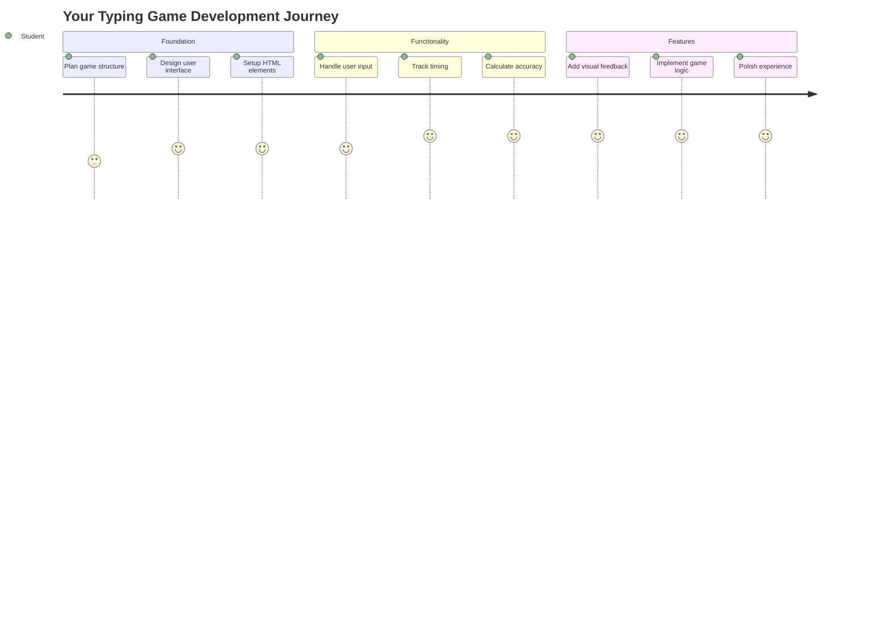
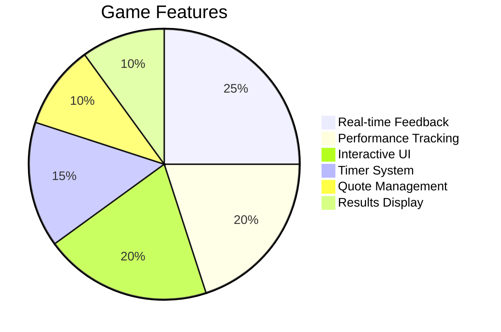
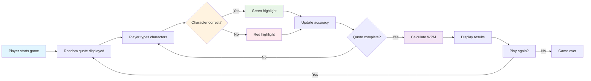
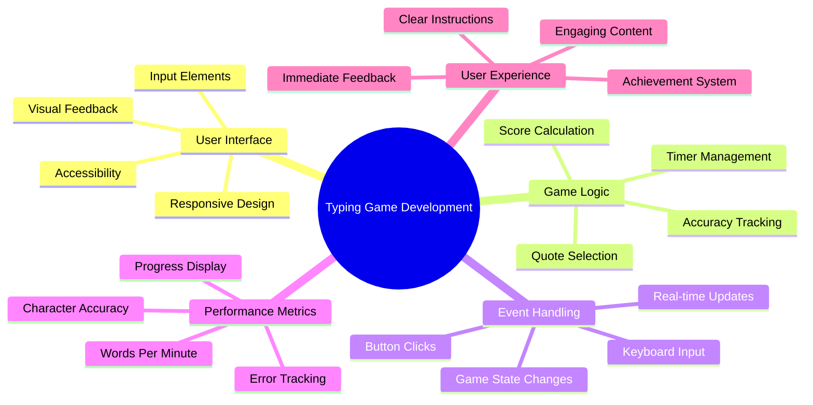
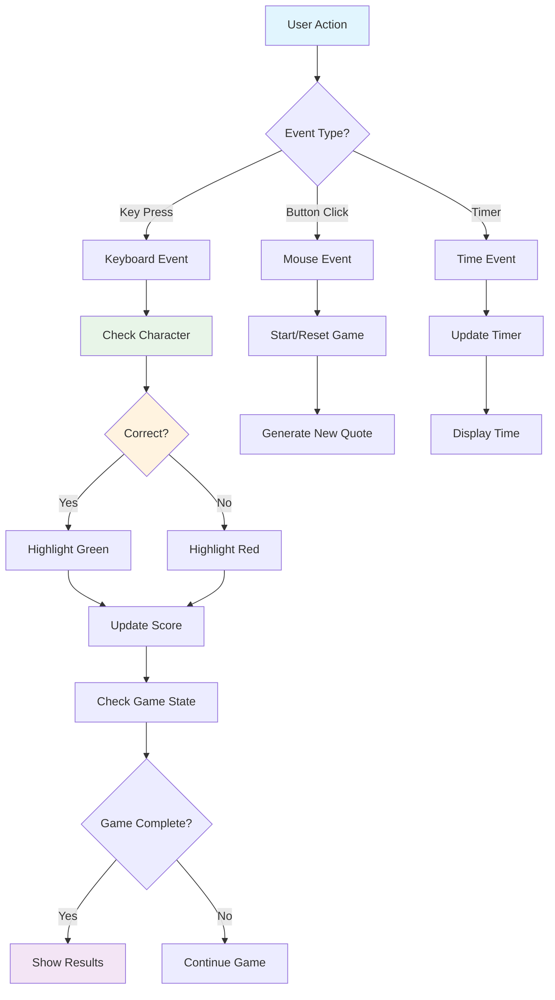
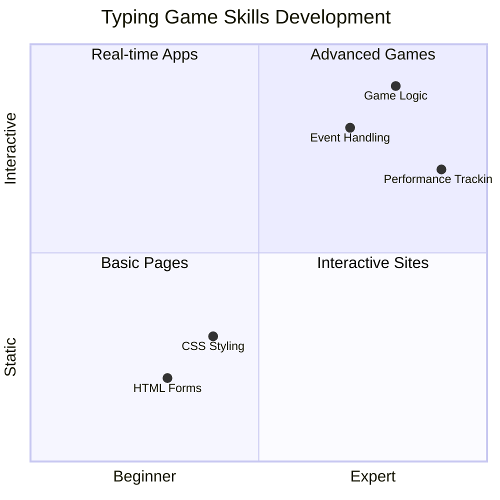
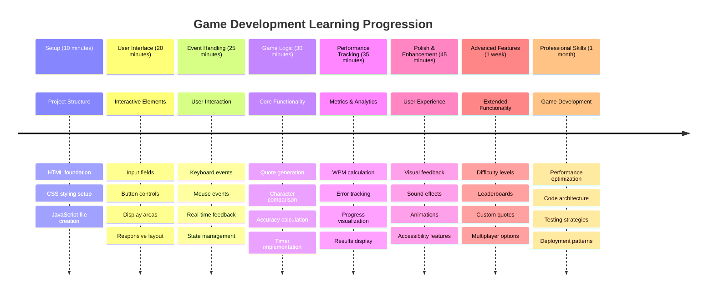

<!--
CO_OP_TRANSLATOR_METADATA:
{
  "original_hash": "efa2ab875b8bb5a7883816506da6b6d2",
  "translation_date": "2025-11-03T22:55:48+00:00",
  "source_file": "4-typing-game/README.md",
  "language_code": "bn"
}
-->
# ইভেন্ট-চালিত প্রোগ্রামিং - টাইপিং গেম তৈরি করুন

## ভূমিকা

এটি এমন কিছু যা প্রতিটি ডেভেলপার জানে কিন্তু খুব কমই আলোচনা করে: দ্রুত টাইপ করা একটি সুপারপাওয়ার! 🚀 ভাবুন তো - যত দ্রুত আপনি আপনার চিন্তাগুলো আপনার কোড এডিটরে আনতে পারবেন, ততই আপনার সৃজনশীলতা প্রবাহিত হবে। এটি যেন আপনার চিন্তা এবং স্ক্রিনের মধ্যে একটি সরাসরি সংযোগ।

এই দক্ষতাকে উন্নত করার সেরা উপায়গুলোর মধ্যে একটি জানতে চান? আপনি ঠিক ধরেছেন - আমরা একটি গেম তৈরি করতে যাচ্ছি!

> চলুন একসাথে একটি অসাধারণ টাইপিং গেম তৈরি করি!

আপনার শেখা সমস্ত JavaScript, HTML এবং CSS দক্ষতাগুলো কাজে লাগানোর জন্য প্রস্তুত? আমরা একটি টাইপিং গেম তৈরি করতে যাচ্ছি যা আপনাকে কিংবদন্তি গোয়েন্দা [শার্লক হোমস](https://en.wikipedia.org/wiki/Sherlock_Holmes)-এর র্যান্ডম কোট দিয়ে চ্যালেঞ্জ করবে। গেমটি ট্র্যাক করবে আপনি কত দ্রুত এবং সঠিকভাবে টাইপ করতে পারেন - এবং বিশ্বাস করুন, এটি আপনার ধারণার চেয়েও বেশি আকর্ষণীয়!

## যা জানা দরকার

শুরু করার আগে, নিশ্চিত করুন যে আপনি এই বিষয়গুলোতে স্বাচ্ছন্দ্যবোধ করছেন (যদি একটু রিফ্রেশ দরকার হয়, চিন্তা করবেন না - আমরা সবাই সেখানে ছিলাম!):

- টেক্সট ইনপুট এবং বাটন কন্ট্রোল তৈরি করা
- CSS এবং ক্লাস ব্যবহার করে স্টাইল সেট করা  
- JavaScript এর মৌলিক বিষয়
  - অ্যারে তৈরি করা
  - র্যান্ডম নাম্বার তৈরি করা
  - বর্তমান সময় পাওয়া

যদি এগুলো একটু ঝাপসা মনে হয়, চিন্তা করবেন না! কখনও কখনও প্রকল্পে ঝাঁপিয়ে পড়া এবং কাজ করার সময় জিনিসগুলো শিখে নেওয়া সবচেয়ে ভালো উপায়।

### 🔄 **শিক্ষামূলক চেক-ইন**
**ভিত্তি মূল্যায়ন**: ডেভেলপমেন্ট শুরু করার আগে নিশ্চিত করুন:
- ✅ HTML ফর্ম এবং ইনপুট এলিমেন্ট কীভাবে কাজ করে তা বোঝা
- ✅ CSS ক্লাস এবং ডাইনামিক স্টাইলিং
- ✅ JavaScript ইভেন্ট লিসেনার এবং হ্যান্ডলার
- ✅ অ্যারে ম্যানিপুলেশন এবং র্যান্ডম সিলেকশন
- ✅ সময় পরিমাপ এবং গণনা

**দ্রুত স্ব-পরীক্ষা**: আপনি কি ব্যাখ্যা করতে পারেন কীভাবে এই ধারণাগুলো একটি ইন্টারেক্টিভ গেমে একসাথে কাজ করে?
- **ইভেন্ট** ব্যবহারকারীরা এলিমেন্টের সাথে ইন্টারঅ্যাক্ট করলে ট্রিগার হয়
- **হ্যান্ডলার** সেই ইভেন্টগুলো প্রক্রিয়া করে এবং গেমের অবস্থা আপডেট করে
- **CSS** ব্যবহারকারীর ক্রিয়ার জন্য ভিজ্যুয়াল ফিডব্যাক প্রদান করে
- **টাইমিং** পারফরম্যান্স পরিমাপ এবং গেমের অগ্রগতি সক্ষম করে

## চলুন এটি তৈরি করি!

[ইভেন্ট-চালিত প্রোগ্রামিং ব্যবহার করে টাইপিং গেম তৈরি করা](./typing-game/README.md)

### ⚡ **পরবর্তী ৫ মিনিটে আপনি যা করতে পারেন**
- [ ] আপনার ব্রাউজার কনসোলে খুলুন এবং `addEventListener` দিয়ে কীবোর্ড ইভেন্ট শোনা চেষ্টা করুন
- [ ] একটি সাধারণ HTML পেজ তৈরি করুন যেখানে একটি ইনপুট ফিল্ড থাকবে এবং টাইপিং ডিটেকশন পরীক্ষা করুন
- [ ] টাইপ করা টেক্সট এবং টার্গেট টেক্সট তুলনা করে স্ট্রিং ম্যানিপুলেশন অনুশীলন করুন
- [ ] টাইমিং ফাংশন বুঝতে `setTimeout` নিয়ে পরীক্ষা করুন

### 🎯 **এই ঘণ্টায় আপনি যা অর্জন করতে পারেন**
- [ ] পোস্ট-লেসন কুইজ সম্পন্ন করুন এবং ইভেন্ট-চালিত প্রোগ্রামিং বুঝুন
- [ ] শব্দ যাচাইকরণ সহ টাইপিং গেমের একটি বেসিক সংস্করণ তৈরি করুন
- [ ] সঠিক এবং ভুল টাইপিংয়ের জন্য ভিজ্যুয়াল ফিডব্যাক যোগ করুন
- [ ] গতি এবং নির্ভুলতার উপর ভিত্তি করে একটি সহজ স্কোরিং সিস্টেম বাস্তবায়ন করুন
- [ ] CSS দিয়ে আপনার গেম স্টাইল করুন যাতে এটি ভিজ্যুয়ালি আকর্ষণীয় হয়

### 📅 **আপনার সপ্তাহব্যাপী গেম ডেভেলপমেন্ট**
- [ ] সমস্ত বৈশিষ্ট্য এবং পরিপূর্ণতা সহ সম্পূর্ণ টাইপিং গেম সম্পন্ন করুন
- [ ] বিভিন্ন শব্দ জটিলতার সাথে কঠিন স্তর যোগ করুন
- [ ] ব্যবহারকারীর পরিসংখ্যান ট্র্যাকিং বাস্তবায়ন করুন (WPM, সময়ের সাথে নির্ভুলতা)
- [ ] আরও ভালো ব্যবহারকারীর অভিজ্ঞতার জন্য সাউন্ড ইফেক্ট এবং অ্যানিমেশন তৈরি করুন
- [ ] আপনার গেমটি মোবাইল-রেসপন্সিভ করুন যাতে টাচ ডিভাইসে কাজ করে
- [ ] আপনার গেমটি অনলাইনে শেয়ার করুন এবং ব্যবহারকারীদের কাছ থেকে ফিডব্যাক সংগ্রহ করুন

### 🌟 **আপনার মাসব্যাপী ইন্টারেক্টিভ ডেভেলপমেন্ট**
- [ ] বিভিন্ন ইন্টারঅ্যাকশন প্যাটার্ন অন্বেষণ করে একাধিক গেম তৈরি করুন
- [ ] গেম লুপ, স্টেট ম্যানেজমেন্ট এবং পারফরম্যান্স অপ্টিমাইজেশন সম্পর্কে শিখুন
- [ ] ওপেন সোর্স গেম ডেভেলপমেন্ট প্রকল্পে অবদান রাখুন
- [ ] উন্নত টাইমিং ধারণা এবং স্মুথ অ্যানিমেশন আয়ত্ত করুন
- [ ] বিভিন্ন ইন্টারেক্টিভ অ্যাপ্লিকেশন প্রদর্শন করে একটি পোর্টফোলিও তৈরি করুন
- [ ] গেম ডেভেলপমেন্ট এবং ব্যবহারকারীর ইন্টারঅ্যাকশন সম্পর্কে আগ্রহী অন্যদের পরামর্শ দিন

## 🎯 আপনার টাইপিং গেম দক্ষতার টাইমলাইন

### 🛠️ আপনার গেম ডেভেলপমেন্ট টুলকিট সারাংশ

এই প্রকল্পটি সম্পন্ন করার পরে, আপনি আয়ত্ত করবেন:
- **ইভেন্ট-চালিত প্রোগ্রামিং**: ব্যবহারকারীর ইনপুটে প্রতিক্রিয়াশীল ইন্টারফেস
- **রিয়েল-টাইম ফিডব্যাক**: তাৎক্ষণিক ভিজ্যুয়াল এবং পারফরম্যান্স আপডেট
- **পারফরম্যান্স পরিমাপ**: সঠিক টাইমিং এবং স্কোরিং সিস্টেম
- **গেম স্টেট ম্যানেজমেন্ট**: অ্যাপ্লিকেশন প্রবাহ এবং ব্যবহারকারীর অভিজ্ঞতা নিয়ন্ত্রণ
- **ইন্টারেক্টিভ ডিজাইন**: আকর্ষণীয়, আসক্তিমূলক ব্যবহারকারীর অভিজ্ঞতা তৈরি করা
- **আধুনিক ওয়েব API**: সমৃদ্ধ ইন্টারঅ্যাকশনের জন্য ব্রাউজারের ক্ষমতা ব্যবহার
- **অ্যাক্সেসিবিলিটি প্যাটার্ন**: সকল ব্যবহারকারীর জন্য অন্তর্ভুক্তিমূলক ডিজাইন

**বাস্তব-বিশ্বের প্রয়োগ**: এই দক্ষতাগুলো সরাসরি প্রয়োগ করা যায়:
- **ওয়েব অ্যাপ্লিকেশন**: যেকোনো ইন্টারেক্টিভ ইন্টারফেস বা ড্যাশবোর্ড
- **শিক্ষামূলক সফটওয়্যার**: লার্নিং প্ল্যাটফর্ম এবং দক্ষতা মূল্যায়ন টুল
- **প্রোডাক্টিভিটি টুল**: টেক্সট এডিটর, IDE এবং সহযোগিতা সফটওয়্যার
- **গেমিং ইন্ডাস্ট্রি**: ব্রাউজার গেম এবং ইন্টারেক্টিভ বিনোদন
- **মোবাইল ডেভেলপমেন্ট**: টাচ-ভিত্তিক ইন্টারফেস এবং জেসচার হ্যান্ডলিং

**পরবর্তী স্তর**: আপনি উন্নত গেম ফ্রেমওয়ার্ক, রিয়েল-টাইম মাল্টিপ্লেয়ার সিস্টেম বা জটিল ইন্টারেক্টিভ অ্যাপ্লিকেশন অন্বেষণ করতে প্রস্তুত!

## ক্রেডিট

♥️ দিয়ে লিখেছেন [ক্রিস্টোফার হ্যারিসন](http://www.twitter.com/geektrainer)

---

**অস্বীকৃতি**:  
এই নথিটি AI অনুবাদ পরিষেবা [Co-op Translator](https://github.com/Azure/co-op-translator) ব্যবহার করে অনুবাদ করা হয়েছে। আমরা যথাসাধ্য সঠিকতার জন্য চেষ্টা করি, তবে অনুগ্রহ করে মনে রাখবেন যে স্বয়ংক্রিয় অনুবাদে ত্রুটি বা অসঙ্গতি থাকতে পারে। এর মূল ভাষায় থাকা নথিটিকে প্রামাণিক উৎস হিসেবে বিবেচনা করা উচিত। গুরুত্বপূর্ণ তথ্যের জন্য, পেশাদার মানব অনুবাদ সুপারিশ করা হয়। এই অনুবাদ ব্যবহারের ফলে কোনো ভুল বোঝাবুঝি বা ভুল ব্যাখ্যা হলে আমরা দায়বদ্ধ থাকব না।