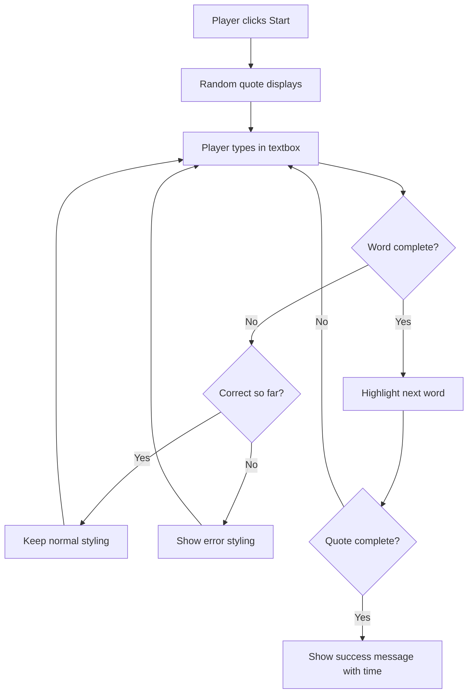
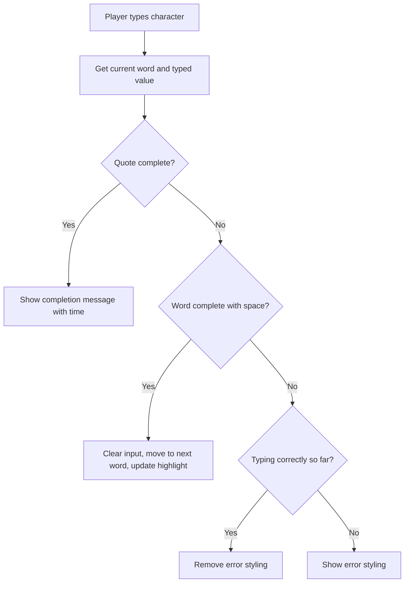

<!--
CO_OP_TRANSLATOR_METADATA:
{
  "original_hash": "e6b75e5b8caae906473a8a09d77b7121",
  "translation_date": "2025-10-22T21:57:57+00:00",
  "source_file": "4-typing-game/typing-game/README.md",
  "language_code": "bn"
}
-->
# ইভেন্ট ব্যবহার করে একটি গেম তৈরি করা

আপনি কি কখনো ভেবেছেন কীভাবে ওয়েবসাইটগুলো জানে যে আপনি কখন একটি বোতাম ক্লিক করেছেন বা একটি টেক্সট বক্সে টাইপ করেছেন? এটি ইভেন্ট-ড্রিভেন প্রোগ্রামিংয়ের জাদু! এই গুরুত্বপূর্ণ দক্ষতা শেখার জন্য একটি টাইপিং স্পিড গেম তৈরি করার চেয়ে ভালো আর কী হতে পারে, যা আপনার প্রতিটি কীস্ট্রোকে প্রতিক্রিয়া জানায়।

আপনি সরাসরি দেখতে পারবেন কীভাবে ওয়েব ব্রাউজার আপনার জাভাস্ক্রিপ্ট কোডের সাথে "কথা বলে"। আপনি যখন ক্লিক করেন, টাইপ করেন বা মাউস সরান, ব্রাউজার ছোট ছোট বার্তা (আমরা এগুলোকে ইভেন্ট বলি) আপনার কোডে পাঠায়, এবং আপনি সিদ্ধান্ত নেন কীভাবে প্রতিক্রিয়া জানাবেন!

আমরা যখন এখানে কাজ শেষ করব, তখন আপনি একটি বাস্তব টাইপিং গেম তৈরি করবেন যা আপনার গতি এবং নির্ভুলতা ট্র্যাক করবে। আরও গুরুত্বপূর্ণ, আপনি সেই মৌলিক ধারণাগুলি বুঝতে পারবেন যা আপনি কখনো ব্যবহার করেছেন এমন প্রতিটি ইন্টারেক্টিভ ওয়েবসাইটকে চালিত করে। চলুন শুরু করি!

## প্রি-লেকচার কুইজ

[প্রি-লেকচার কুইজ](https://ff-quizzes.netlify.app/web/quiz/21)

## ইভেন্ট-ড্রিভেন প্রোগ্রামিং

আপনার প্রিয় অ্যাপ বা ওয়েবসাইট সম্পর্কে ভাবুন - কী এটিকে জীবন্ত এবং প্রতিক্রিয়াশীল মনে করে? এটি সবই নির্ভর করে আপনি কী করেন তার প্রতিক্রিয়ার উপর! প্রতিটি ট্যাপ, ক্লিক, সোয়াইপ বা কীস্ট্রোক তৈরি করে একটি "ইভেন্ট," এবং এখানেই ওয়েব ডেভেলপমেন্টের আসল জাদু ঘটে।

ওয়েবের জন্য প্রোগ্রামিংকে এত আকর্ষণীয় করে তোলে কী: আমরা কখনই জানি না কেউ কখন সেই বোতামটি ক্লিক করবে বা একটি টেক্সট বক্সে টাইপ করা শুরু করবে। তারা হয়তো সঙ্গে সঙ্গে ক্লিক করবে, পাঁচ মিনিট অপেক্ষা করবে, বা হয়তো কখনোই ক্লিক করবে না! এই অনিশ্চয়তা মানে আমাদের কোড লেখার বিষয়ে ভিন্নভাবে চিন্তা করতে হবে।

একটি রেসিপির মতো উপরে থেকে নিচে চলা কোড লেখার পরিবর্তে, আমরা এমন কোড লিখি যা ধৈর্য ধরে অপেক্ষা করে কিছু ঘটার জন্য। এটি অনেকটা ১৮০০ সালের টেলিগ্রাফ অপারেটরদের মতো যারা তাদের মেশিনের পাশে বসে থাকত, তারের মাধ্যমে একটি বার্তা আসার মুহূর্তে প্রতিক্রিয়া জানাতে প্রস্তুত।

তাহলে ঠিক কী একটি "ইভেন্ট"? সহজভাবে বলতে গেলে, এটি এমন কিছু যা ঘটে! আপনি যখন একটি বোতাম ক্লিক করেন - এটি একটি ইভেন্ট। আপনি যখন একটি অক্ষর টাইপ করেন - এটি একটি ইভেন্ট। আপনি যখন আপনার মাউস সরান - এটি আরেকটি ইভেন্ট।

ইভেন্ট-ড্রিভেন প্রোগ্রামিং আমাদের কোডকে শোনার এবং প্রতিক্রিয়া জানানোর জন্য সেট আপ করতে দেয়। আমরা বিশেষ ফাংশন তৈরি করি যেগুলোকে **ইভেন্ট লিসনার** বলা হয়, যা নির্দিষ্ট কিছু ঘটার জন্য ধৈর্য ধরে অপেক্ষা করে, তারপর তা ঘটলে সক্রিয় হয়।

ইভেন্ট লিসনারকে আপনার কোডের জন্য একটি ডোরবেলের মতো ভাবুন। আপনি ডোরবেল সেট আপ করেন (`addEventListener()`), এটি কী শব্দ শুনবে তা জানান (যেমন 'ক্লিক' বা 'কীপ্রেস'), এবং তারপর কেউ এটি বাজালে কী ঘটবে তা নির্ধারণ করেন (আপনার কাস্টম ফাংশন)।

**ইভেন্ট লিসনার কীভাবে কাজ করে:**
- **শোনে** নির্দিষ্ট ব্যবহারকারীর ক্রিয়াগুলি যেমন ক্লিক, কীস্ট্রোক বা মাউস মুভমেন্ট
- **নির্বাহ করে** আপনার কাস্টম কোড যখন নির্দিষ্ট ইভেন্ট ঘটে
- **প্রতিক্রিয়া জানায়** ব্যবহারকারীর ইন্টারঅ্যাকশনের সাথে সাথে, একটি সিমলেস অভিজ্ঞতা তৈরি করে
- **একাধিক ইভেন্ট পরিচালনা করে** একই উপাদানে বিভিন্ন লিসনার ব্যবহার করে

> **NOTE:** এটি উল্লেখ করা গুরুত্বপূর্ণ যে ইভেন্ট লিসনার তৈরি করার অনেক উপায় রয়েছে। আপনি অ্যানোনিমাস ফাংশন ব্যবহার করতে পারেন, অথবা নামযুক্ত ফাংশন তৈরি করতে পারেন। আপনি বিভিন্ন শর্টকাট ব্যবহার করতে পারেন, যেমন `click` প্রপার্টি সেট করা, অথবা `addEventListener()` ব্যবহার করা। আমাদের এক্সারসাইজে আমরা `addEventListener()` এবং অ্যানোনিমাস ফাংশনের উপর ফোকাস করব, কারণ এটি সম্ভবত ওয়েব ডেভেলপাররা সবচেয়ে বেশি ব্যবহার করে। এটি সবচেয়ে বেশি ফ্লেক্সিবল, কারণ `addEventListener()` সব ইভেন্টের জন্য কাজ করে, এবং ইভেন্টের নাম একটি প্যারামিটার হিসেবে প্রদান করা যেতে পারে।

### সাধারণ ইভেন্ট

যদিও ওয়েব ব্রাউজার অনেক ধরনের ইভেন্ট অফার করে যা আপনি শুনতে পারেন, বেশিরভাগ ইন্টারেক্টিভ অ্যাপ্লিকেশন শুধুমাত্র কয়েকটি গুরুত্বপূর্ণ ইভেন্টের উপর নির্ভর করে। এই মূল ইভেন্টগুলি বোঝা আপনাকে জটিল ব্যবহারকারী ইন্টারঅ্যাকশন তৈরি করার ভিত্তি দেবে।

আপনার অ্যাপ্লিকেশন তৈরি করার সময় [অনেক ইভেন্ট](https://developer.mozilla.org/docs/Web/Events) রয়েছে যা আপনি শুনতে পারেন। মূলত ব্যবহারকারী একটি পৃষ্ঠায় যা কিছু করে তা একটি ইভেন্ট তৈরি করে, যা আপনাকে অনেক ক্ষমতা দেয় যাতে তারা আপনার পছন্দমতো অভিজ্ঞতা পায়। সৌভাগ্যক্রমে, সাধারণত আপনাকে শুধুমাত্র কয়েকটি ইভেন্টের প্রয়োজন হয়। এখানে কয়েকটি সাধারণ ইভেন্ট রয়েছে (যার মধ্যে দুটি আমরা আমাদের গেম তৈরি করার সময় ব্যবহার করব):

| ইভেন্ট | বিবরণ | সাধারণ ব্যবহার |
|--------|-------|----------------|
| `click` | ব্যবহারকারী কিছু ক্লিক করেছে | বোতাম, লিঙ্ক, ইন্টারঅ্যাকটিভ উপাদান |
| `contextmenu` | ব্যবহারকারী ডান মাউস বোতাম ক্লিক করেছে | কাস্টম রাইট-ক্লিক মেনু |
| `select` | ব্যবহারকারী কিছু টেক্সট হাইলাইট করেছে | টেক্সট এডিটিং, কপি অপারেশন |
| `input` | ব্যবহারকারী কিছু টেক্সট ইনপুট করেছে | ফর্ম ভ্যালিডেশন, রিয়েল-টাইম সার্চ |

**এই ইভেন্ট টাইপগুলি বোঝা:**
- **ট্রিগার করে** যখন ব্যবহারকারী আপনার পৃষ্ঠার নির্দিষ্ট উপাদানগুলির সাথে ইন্টারঅ্যাক্ট করে
- **বিস্তারিত তথ্য প্রদান করে** ব্যবহারকারীর ক্রিয়ার সম্পর্কে ইভেন্ট অবজেক্টের মাধ্যমে
- **সক্ষম করে** আপনাকে প্রতিক্রিয়াশীল, ইন্টারঅ্যাকটিভ ওয়েব অ্যাপ্লিকেশন তৈরি করতে
- **সামঞ্জস্যপূর্ণভাবে কাজ করে** বিভিন্ন ব্রাউজার এবং ডিভাইসে

## গেম তৈরি করা

এখন যেহেতু আপনি ইভেন্টগুলি কীভাবে কাজ করে তা বুঝতে পেরেছেন, আসুন সেই জ্ঞানটি কাজে লাগিয়ে কিছু দরকারী তৈরি করি। আমরা একটি টাইপিং স্পিড গেম তৈরি করব যা ইভেন্ট হ্যান্ডলিং প্রদর্শন করবে এবং আপনাকে একটি গুরুত্বপূর্ণ ডেভেলপার দক্ষতা বিকাশে সাহায্য করবে।

আমরা একটি গেম তৈরি করতে যাচ্ছি যাতে জাভাস্ক্রিপ্টে ইভেন্টগুলি কীভাবে কাজ করে তা অন্বেষণ করা যায়। আমাদের গেমটি একটি প্লেয়ারের টাইপিং দক্ষতা পরীক্ষা করবে, যা সমস্ত ডেভেলপারদের জন্য একটি অত্যন্ত গুরুত্বপূর্ণ দক্ষতা। মজার তথ্য: আমরা আজ যে QWERTY কীবোর্ড লেআউট ব্যবহার করি তা আসলে ১৮৭০-এর দশকে টাইপরাইটারের জন্য ডিজাইন করা হয়েছিল - এবং ভালো টাইপিং দক্ষতা আজও প্রোগ্রামারদের জন্য ঠিক ততটাই মূল্যবান! গেমের সাধারণ প্রবাহটি এরকম হবে:



**আমাদের গেমটি কীভাবে কাজ করবে:**
- **শুরু হবে** যখন প্লেয়ার স্টার্ট বোতামটি ক্লিক করবে এবং একটি র‍্যান্ডম কোট প্রদর্শন করবে
- **ট্র্যাক করবে** প্লেয়ারের টাইপিং অগ্রগতি শব্দ ধরে ধরে রিয়েল-টাইমে
- **হাইলাইট করবে** বর্তমান শব্দটি যাতে প্লেয়ারের ফোকাস বজায় থাকে
- **তাৎক্ষণিক ভিজ্যুয়াল ফিডব্যাক প্রদান করবে** টাইপিং ত্রুটির জন্য
- **গণনা করবে** এবং মোট সময় প্রদর্শন করবে যখন কোটটি সম্পন্ন হবে

চলুন আমাদের গেম তৈরি করি এবং ইভেন্ট সম্পর্কে শিখি!

### ফাইল স্ট্রাকচার

কোডিং শুরু করার আগে, চলুন সংগঠিত হই! শুরু থেকেই একটি পরিষ্কার ফাইল স্ট্রাকচার থাকা ভবিষ্যতে মাথাব্যথা থেকে মুক্তি দেবে এবং আপনার প্রকল্পকে আরও পেশাদার করে তুলবে। 😊

আমরা এটি সহজ রাখব, শুধুমাত্র তিনটি ফাইল দিয়ে: `index.html` আমাদের পৃষ্ঠার স্ট্রাকচারের জন্য, `script.js` আমাদের গেমের সমস্ত লজিকের জন্য, এবং `style.css` সবকিছু সুন্দর দেখানোর জন্য। এটি সেই ক্লাসিক ত্রয়ী যা ওয়েবের বেশিরভাগ অংশ চালিত করে!

**একটি নতুন ফোল্ডার তৈরি করুন আপনার কাজের জন্য। কনসোল বা টার্মিনাল উইন্ডো খুলুন এবং নিম্নলিখিত কমান্ডটি দিন:**

```bash
# Linux or macOS
mkdir typing-game && cd typing-game

# Windows
md typing-game && cd typing-game
```

**এই কমান্ডগুলি কী করে:**
- **একটি নতুন ডিরেক্টরি তৈরি করে** যার নাম `typing-game` যেখানে আপনার প্রকল্প ফাইল থাকবে
- **নতুন তৈরি করা ডিরেক্টরিতে প্রবেশ করে** স্বয়ংক্রিয়ভাবে
- **একটি পরিষ্কার কর্মক্ষেত্র সেট আপ করে** আপনার গেম ডেভেলপমেন্টের জন্য

**ভিজ্যুয়াল স্টুডিও কোড খুলুন:**

```bash
code .
```

**এই কমান্ডটি:**
- **ভিজ্যুয়াল স্টুডিও কোড চালু করে** বর্তমান ডিরেক্টরিতে
- **আপনার প্রকল্প ফোল্ডারটি খুলে** এডিটরে
- **আপনাকে সমস্ত ডেভেলপমেন্ট টুলে অ্যাক্সেস দেয়** যা আপনার প্রয়োজন

**ভিজ্যুয়াল স্টুডিও কোডে ফোল্ডারে তিনটি ফাইল যোগ করুন নিম্নলিখিত নাম দিয়ে:**
- `index.html` - আপনার গেমের স্ট্রাকচার এবং কন্টেন্ট ধারণ করে
- `script.js` - সমস্ত গেম লজিক এবং ইভেন্ট লিসনার পরিচালনা করে
- `style.css` - ভিজ্যুয়াল উপস্থিতি এবং স্টাইলিং সংজ্ঞায়িত করে

## ব্যবহারকারী ইন্টারফেস তৈরি করা

এখন চলুন সেই মঞ্চ তৈরি করি যেখানে আমাদের গেমের সমস্ত অ্যাকশন ঘটবে! এটি অনেকটা একটি স্পেসশিপের কন্ট্রোল প্যানেল ডিজাইন করার মতো - আমাদের নিশ্চিত করতে হবে যে আমাদের প্লেয়ারদের প্রয়োজনীয় সবকিছু ঠিক যেখানে তারা আশা করে।

চলুন দেখি আমাদের গেমে আসলে কী প্রয়োজন। আপনি যদি একটি টাইপিং গেম খেলতেন, তাহলে আপনি স্ক্রিনে কী দেখতে চাইতেন? এখানে যা প্রয়োজন:

| UI উপাদান | উদ্দেশ্য | HTML উপাদান |
|-----------|----------|-------------|
| কোট প্রদর্শন | টাইপ করার টেক্সট দেখায় | `<p>` যার `id="quote"` |
| মেসেজ এরিয়া | স্ট্যাটাস এবং সফলতার বার্তা প্রদর্শন করে | `<p>` যার `id="message"` |
| টেক্সট ইনপুট | যেখানে প্লেয়াররা কোট টাইপ করে | `<input>` যার `id="typed-value"` |
| স্টার্ট বোতাম | গেম শুরু করে | `<button>` যার `id="start"` |

**UI স্ট্রাকচার বোঝা:**
- **কন্টেন্টকে লজিক্যালি সংগঠিত করে** উপরে থেকে নিচে
- **ইলিমেন্টগুলিকে ইউনিক আইডি অ্যাসাইন করে** জাভাস্ক্রিপ্ট টার্গেটিংয়ের জন্য
- **পরিষ্কার ভিজ্যুয়াল হায়ারার্কি প্রদান করে** আরও ভালো ব্যবহারকারীর অভিজ্ঞতার জন্য
- **অ্যাক্সেসিবিলিটির জন্য সেমান্টিক HTML উপাদান অন্তর্ভুক্ত করে**

প্রত্যেকটির জন্য আইডি প্রয়োজন যাতে আমরা আমাদের জাভাস্ক্রিপ্টে এগুলোর সাথে কাজ করতে পারি। আমরা আমাদের তৈরি করা CSS এবং জাভাস্ক্রিপ্ট ফাইলগুলির রেফারেন্সও যোগ করব।

একটি নতুন ফাইল তৈরি করুন যার নাম `index.html`। নিম্নলিখিত HTML যোগ করুন:

```html
<!-- inside index.html -->
<html>
<head>
  <title>Typing game</title>
  <link rel="stylesheet" href="style.css">
</head>
<body>
  <h1>Typing game!</h1>
  <p>Practice your typing skills with a quote from Sherlock Holmes. Click **start** to begin!</p>
  <p id="quote"></p> <!-- This will display our quote -->
  <p id="message"></p> <!-- This will display any status messages -->
  <div>
    <input type="text" aria-label="current word" id="typed-value" /> <!-- The textbox for typing -->
    <button type="button" id="start">Start</button> <!-- To start the game -->
  </div>
  <script src="script.js"></script>
</body>
</html>
```

**এই HTML স্ট্রাকচার কী অর্জন করে তা বিশ্লেষণ:**
- **CSS স্টাইলশিট লিঙ্ক করে** `<head>`-এ স্টাইলিংয়ের জন্য
- **ব্যবহারকারীদের জন্য একটি পরিষ্কার শিরোনাম এবং নির্দেশনা তৈরি করে**
- **ডাইনামিক কন্টেন্টের জন্য নির্দিষ্ট আইডি সহ প্লেসহোল্ডার প্যারাগ্রাফ তৈরি করে**
- **অ্যাক্সেসিবিলিটি অ্যাট্রিবিউট সহ একটি ইনপুট ফিল্ড অন্তর্ভুক্ত করে**
- **গেম ট্রিগার করার জন্য একটি স্টার্ট বোতাম প্রদান করে**
- **জাভাস্ক্রিপ্ট ফাইল লোড করে** শেষে অপটিমাল পারফরম্যান্সের জন্য

### অ্যাপ্লিকেশন চালু করা

ডেভেলপমেন্টের সময় আপনার অ্যাপ্লিকেশনটি ঘন ঘন পরীক্ষা করা আপনাকে ত্রুটি দ্রুত ধরতে এবং রিয়েল-টাইমে আপনার অগ্রগতি দেখতে সাহায্য করে। লাইভ সার্ভার একটি অমূল্য টুল যা আপনি ফাইল সেভ করার সাথে সাথে আপনার ব্রাউজারকে স্বয়ংক্রিয়ভাবে রিফ্রেশ করে, ডেভেলপমেন্টকে অনেক বেশি কার্যকর করে তোলে।

এটি সর্বদা সেরা পদ্ধতি যাতে আপনি দেখতে পারেন জিনিসগুলি কেমন দেখাচ্ছে। চলুন আমাদের অ্যাপ্লিকেশন চালু করি। ভিজ্যুয়াল স্টুডিও কোডের জন্য একটি চমৎকার এক্সটেনশন রয়েছে [লাইভ সার্ভার](https://marketplace.visualstudio.com/items?itemName=ritwickdey.LiveServer&WT.mc_id=academic-77807-sagibbon) যা আপনার অ্যাপ্লিকেশনটি লোকালিতে হোস্ট করবে এবং আপনি ফাইল সেভ করার সাথে সাথে ব্রাউজার রিফ্রেশ করবে।

**[লাইভ সার্ভার](https://marketplace.visualstudio.com/items?itemName=ritwickdey.LiveServer&WT.mc_id=academic-77807-sagibbon) ইনস্টল করুন লিঙ্কটি অনুসরণ করে এবং ইনস্টল ক্লিক করুন:**

**ইনস্টলেশনের সময় যা ঘটে:**
- **আপনার ব্রাউজারকে ভিজ্যুয়াল স্টুডিও কোড খুলতে প্রম্পট করে**
- **এক্সটেনশন ইনস্টলেশন প্রক্রিয়ার মাধ্যমে আপনাকে গাইড করে**
- **ভিজ্যুয়াল স্টুডিও কোড পুনরায় চালু করার প্রয়োজন হতে পারে** সেটআপ সম্পূর্ণ করতে

**ইনস্টল করার পরে, ভিজ্যুয়াল স্টুডিও কোডে Ctrl-Shift-P (বা Cmd-Shift-P) ক্লিক করুন কমান্ড প্যালেট খুলতে:**

**কমান্ড প্যালেট বোঝা:**
- **ভিজ্যুয়াল স্টুডিও কোডের সমস্ত কমান্ডে দ্রুত অ্যাক্সেস প্রদান করে**
- **আপনার টাইপ করার সাথে সাথে কমান্ডগুলি অনুসন্ধান করে**
- **দ্রুত ডেভেলপমেন্টের জন্য কীবোর্ড শর্টকাট অফার করে**

**"Live Server: Open with Live Server" টাইপ করুন:**

**লাইভ সার্ভার কী করে:**
- **আপনার প্রকল্পের জন্য একটি লোকাল ডেভেলপমেন্ট সার্ভার শুরু করে**
- **আপনি ফাইল সেভ করলে স্বয়ংক্রিয়ভাবে ব্রাউজার রিফ্রেশ করে**
- **আপনার ফাইলগুলি একটি লোকাল URL থেকে পরিবেশন করে (সাধারণত `localhost:5500`)**

**একটি ব্রাউজার খুলুন এবং `https://localhost:5500`-এ যান:**

আপনি এখন আপনার তৈরি করা পৃষ্ঠাটি দেখতে পাবেন! চলুন কিছু কার্যকারিতা যোগ করি।

## CSS যোগ করা

এখন চলুন জিনিসগুলো সুন্দর করে তুলি! ভিজ্যুয়াল ফিডব্যাক ব্যবহারকারী ইন্টারফেসের জন্য কম্পিউটিংয়ের প্রথম দিন থেকেই গুরুত্বপূর্ণ। ১৯৮০-এর দশকে গবেষকরা আবিষ্কার করেছিলেন যে তাৎক্ষণিক ভিজ্যুয়াল ফিডব্যাক ব্যবহারকারীর পারফরম্যান্সকে নাটকীয়ভাবে উন্নত করে এবং ত্রুটি কমায়। ঠিক সেটাই আমরা তৈরি করতে যাচ্ছি।

আমাদের গেমটি স্পষ্টভাবে জানাতে হবে কী ঘটছে। প্লেয়ারদের সঙ্গে সঙ্গে জানা উচিত কোন শব্দটি তারা টাইপ করতে যাচ্ছে, এবং যদি তারা ভুল করে, তারা সঙ্গে সঙ্গে তা দেখতে পারবে। চলুন কিছু সহজ কিন্তু কার্যকর স্টাইলিং তৈরি করি:

একটি নতুন ফাইল তৈরি করুন যার নাম `style.css` এবং নিম্নলিখিত সিনট্যাক্স যোগ করুন।

```css
/* inside style.css */
.highlight {
  background-color: yellow;
}

.error {
  background-color: lightcoral;
  border: red;
}
```

**এই CSS ক্লাসগুলি বোঝা:**
- **বর্তমান শব্দটি হাইলাইট করে** একটি হলুদ ব্যাকগ্রাউন্ড দিয়ে পরিষ্কার ভিজ্যুয়াল গাইডেন্সের জন্য
- **টাইপিং ত্রুটিগুলি সংকেত দেয়** একটি লাইট কোরাল ব্যাকগ্রাউন্ড কালার দিয়ে
- **তাৎক্ষণিক ফিডব্যাক প্রদান করে** ব্যবহারকারীর টাইপিং প্রবাহ ব্যাহত না
| উদ্ধৃতির তালিকা | গেমের জন্য সমস্ত সম্ভাব্য উদ্ধৃতি সংরক্ষণ করুন | `['উদ্ধৃতি ১', 'উদ্ধৃতি ২', ...]` |
| শব্দের তালিকা | বর্তমান উদ্ধৃতিকে পৃথক শব্দে বিভক্ত করুন | `['যখন', 'তুমি', 'আছো', ...]` |
| শব্দ সূচক | খেলোয়াড় কোন শব্দ টাইপ করছে তা ট্র্যাক করুন | `0, 1, 2, 3...` |
| শুরুর সময় | স্কোরিংয়ের জন্য সময় গণনা করুন | `Date.now()` |

**আমাদের UI উপাদানগুলোর রেফারেন্সও প্রয়োজন হবে:**
| উপাদান | ID | উদ্দেশ্য |
|---------|----|---------|
| টেক্সট ইনপুট | `typed-value` | যেখানে খেলোয়াড়রা টাইপ করবে |
| উদ্ধৃতি প্রদর্শন | `quote` | টাইপ করার জন্য উদ্ধৃতি দেখায় |
| বার্তা এলাকা | `message` | স্ট্যাটাস আপডেট দেখায় |

```javascript
// inside script.js
// all of our quotes
const quotes = [
    'When you have eliminated the impossible, whatever remains, however improbable, must be the truth.',
    'There is nothing more deceptive than an obvious fact.',
    'I ought to know by this time that when a fact appears to be opposed to a long train of deductions it invariably proves to be capable of bearing some other interpretation.',
    'I never make exceptions. An exception disproves the rule.',
    'What one man can invent another can discover.',
    'Nothing clears up a case so much as stating it to another person.',
    'Education never ends, Watson. It is a series of lessons, with the greatest for the last.',
];
// store the list of words and the index of the word the player is currently typing
let words = [];
let wordIndex = 0;
// the starting time
let startTime = Date.now();
// page elements
const quoteElement = document.getElementById('quote');
const messageElement = document.getElementById('message');
const typedValueElement = document.getElementById('typed-value');
```

**এই সেটআপ কোডটি কী অর্জন করে তা বিশ্লেষণ করা যাক:**
- **সংরক্ষণ করে** Sherlock Holmes উদ্ধৃতির একটি অ্যারে `const` ব্যবহার করে, কারণ উদ্ধৃতিগুলো পরিবর্তন হবে না
- **ট্র্যাকিং ভেরিয়েবলগুলো** `let` দিয়ে আরম্ভ করে, কারণ এই মানগুলো গেমপ্লের সময় আপডেট হবে
- **DOM উপাদানগুলোর রেফারেন্স** `document.getElementById()` ব্যবহার করে সংগ্রহ করে, যাতে সহজে অ্যাক্সেস করা যায়
- **গেমের কার্যকারিতার ভিত্তি স্থাপন করে** স্পষ্ট এবং বর্ণনামূলক ভেরিয়েবল নাম দিয়ে
- **তথ্য এবং উপাদানগুলোকে** সহজ কোড রক্ষণাবেক্ষণের জন্য যৌক্তিকভাবে সংগঠিত করে

✅ আপনার গেমে আরও উদ্ধৃতি যোগ করুন

> 💡 **প্রো টিপ**: আমরা যখনই কোডে উপাদানগুলো পুনরায় ব্যবহার করতে চাই, তখন `document.getElementById()` ব্যবহার করে সেগুলো পুনরুদ্ধার করতে পারি। যেহেতু আমরা নিয়মিত এই উপাদানগুলো উল্লেখ করব, তাই স্ট্রিং লিটারাল টাইপো এড়াতে আমরা কনস্ট্যান্ট ব্যবহার করব। [Vue.js](https://vuejs.org/) বা [React](https://reactjs.org/) এর মতো ফ্রেমওয়ার্কগুলো আপনার কোডকে কেন্দ্রীয়ভাবে পরিচালনা করতে সাহায্য করতে পারে।
>
**এই পদ্ধতি কেন এত ভালো কাজ করে:**
- **স্পেলিং ভুল প্রতিরোধ করে** যখন উপাদানগুলো বারবার উল্লেখ করা হয়
- **কোডের পাঠযোগ্যতা উন্নত করে** বর্ণনামূলক কনস্ট্যান্ট নাম দিয়ে
- **উন্নত IDE সাপোর্ট সক্ষম করে** অটোকমপ্লিট এবং ত্রুটি চেকিংয়ের মাধ্যমে
- **পুনর্গঠন সহজ করে** যদি ভবিষ্যতে উপাদানের ID পরিবর্তন হয়

`const`, `let` এবং `var` ব্যবহার নিয়ে একটি ভিডিও দেখুন

[](https://youtube.com/watch?v=JNIXfGiDWM8 "ভেরিয়েবলের প্রকার")

> 🎥 উপরের ছবিতে ক্লিক করুন ভেরিয়েবল নিয়ে একটি ভিডিও দেখার জন্য।

### শুরু করার লজিক যোগ করুন

এখানেই সবকিছু একসাথে ক্লিক করবে! 🚀 আপনি আপনার প্রথম সত্যিকারের ইভেন্ট লিসেনার লিখতে যাচ্ছেন, এবং এটি দেখতে বেশ সন্তোষজনক যে আপনার কোড একটি বাটন ক্লিকের প্রতিক্রিয়া জানাচ্ছে।

ভাবুন তো: কোথাও একজন খেলোয়াড় "Start" বাটনে ক্লিক করতে যাচ্ছে, এবং আপনার কোডকে তাদের জন্য প্রস্তুত থাকতে হবে। আমরা জানি না তারা কখন ক্লিক করবে - তাৎক্ষণিক হতে পারে, অথবা কফি খাওয়ার পরে হতে পারে - কিন্তু যখন তারা করবে, তখন আপনার গেম জীবন্ত হয়ে উঠবে।

যখন ব্যবহারকারী `start` ক্লিক করবে, তখন আমাদের একটি উদ্ধৃতি নির্বাচন করতে হবে, ব্যবহারকারীর ইন্টারফেস সেটআপ করতে হবে, এবং বর্তমান শব্দ এবং সময় ট্র্যাকিং সেটআপ করতে হবে। নিচে প্রয়োজনীয় জাভাস্ক্রিপ্ট দেওয়া হলো; আমরা স্ক্রিপ্ট ব্লকের পরে এটি আলোচনা করব।

```javascript
// at the end of script.js
document.getElementById('start').addEventListener('click', () => {
  // get a quote
  const quoteIndex = Math.floor(Math.random() * quotes.length);
  const quote = quotes[quoteIndex];
  // Put the quote into an array of words
  words = quote.split(' ');
  // reset the word index for tracking
  wordIndex = 0;

  // UI updates
  // Create an array of span elements so we can set a class
  const spanWords = words.map(function(word) { return `<span>${word} </span>`});
  // Convert into string and set as innerHTML on quote display
  quoteElement.innerHTML = spanWords.join('');
  // Highlight the first word
  quoteElement.childNodes[0].className = 'highlight';
  // Clear any prior messages
  messageElement.innerText = '';

  // Setup the textbox
  // Clear the textbox
  typedValueElement.value = '';
  // set focus
  typedValueElement.focus();
  // set the event handler

  // Start the timer
  startTime = new Date().getTime();
});
```

**কোডটি যৌক্তিক বিভাগে বিশ্লেষণ করা যাক:**

**📊 শব্দ ট্র্যাকিং সেটআপ:**
- **নির্বাচন করে** একটি র‍্যান্ডম উদ্ধৃতি `Math.floor()` এবং `Math.random()` ব্যবহার করে বৈচিত্র্যের জন্য
- **রূপান্তর করে** উদ্ধৃতিকে পৃথক শব্দের একটি অ্যারেতে `split(' ')` ব্যবহার করে
- **রিসেট করে** `wordIndex` কে 0 এ, কারণ খেলোয়াড় প্রথম শব্দ থেকে শুরু করবে
- **প্রস্তুত করে** গেমের অবস্থা একটি নতুন রাউন্ডের জন্য

**🎨 UI সেটআপ এবং প্রদর্শন:**
- **তৈরি করে** `<span>` উপাদানের একটি অ্যারে, প্রতিটি শব্দকে পৃথক স্টাইলিংয়ের জন্য মোড়ানো
- **যোগ করে** span উপাদানগুলোকে একটি একক স্ট্রিংয়ে কার্যকরী DOM আপডেটের জন্য
- **হাইলাইট করে** প্রথম শব্দটি `highlight` CSS ক্লাস যোগ করে
- **আগের গেমের বার্তাগুলো মুছে ফেলে** একটি পরিষ্কার পাতা প্রদান করতে

**⌨️ টেক্সটবক্স প্রস্তুতি:**
- **বিদ্যমান টেক্সট মুছে ফেলে** ইনপুট ফিল্ড থেকে
- **ফোকাস সেট করে** টেক্সটবক্সে যাতে খেলোয়াড়রা সাথে সাথে টাইপ শুরু করতে পারে
- **ইনপুট এলাকা প্রস্তুত করে** নতুন গেম সেশনের জন্য

**⏱️ টাইমার আরম্ভ:**
- **বর্তমান টাইমস্ট্যাম্প সংগ্রহ করে** `new Date().getTime()` ব্যবহার করে
- **সঠিক টাইপিং গতি এবং সম্পূর্ণ সময় গণনা সক্ষম করে**
- **গেম সেশনের জন্য পারফরম্যান্স ট্র্যাকিং শুরু করে**

### টাইপিং লজিক যোগ করুন

এখানেই আমরা আমাদের গেমের মূল অংশটি মোকাবিলা করব! যদি এটি প্রথমে একটু বেশি মনে হয়, চিন্তা করবেন না - আমরা প্রতিটি অংশের মধ্য দিয়ে হাঁটব, এবং শেষে আপনি দেখবেন এটি কতটা যৌক্তিক।

আমরা এখানে যা তৈরি করছি তা বেশ উন্নত: কেউ একটি অক্ষর টাইপ করার সাথে সাথে, আমাদের কোডটি যাচাই করবে তারা কী টাইপ করেছে, তাদের প্রতিক্রিয়া দেবে, এবং পরবর্তী কী ঘটবে তা নির্ধারণ করবে। এটি অনেকটা ১৯৭০ এর দশকের প্রাথমিক ওয়ার্ড প্রসেসর যেমন WordStar এর মতো, যা টাইপিস্টদের রিয়েল-টাইম প্রতিক্রিয়া প্রদান করত।

```javascript
// at the end of script.js
typedValueElement.addEventListener('input', () => {
  // Get the current word
  const currentWord = words[wordIndex];
  // get the current value
  const typedValue = typedValueElement.value;

  if (typedValue === currentWord && wordIndex === words.length - 1) {
    // end of sentence
    // Display success
    const elapsedTime = new Date().getTime() - startTime;
    const message = `CONGRATULATIONS! You finished in ${elapsedTime / 1000} seconds.`;
    messageElement.innerText = message;
  } else if (typedValue.endsWith(' ') && typedValue.trim() === currentWord) {
    // end of word
    // clear the typedValueElement for the new word
    typedValueElement.value = '';
    // move to the next word
    wordIndex++;
    // reset the class name for all elements in quote
    for (const wordElement of quoteElement.childNodes) {
      wordElement.className = '';
    }
    // highlight the new word
    quoteElement.childNodes[wordIndex].className = 'highlight';
  } else if (currentWord.startsWith(typedValue)) {
    // currently correct
    // highlight the next word
    typedValueElement.className = '';
  } else {
    // error state
    typedValueElement.className = 'error';
  }
});
```

**টাইপিং লজিক প্রবাহ বুঝুন:**

এই ফাংশনটি একটি ওয়াটারফল পদ্ধতি ব্যবহার করে, সবচেয়ে নির্দিষ্ট থেকে সবচেয়ে সাধারণ শর্তগুলো যাচাই করে। প্রতিটি পরিস্থিতি বিশ্লেষণ করা যাক:



**🏁 উদ্ধৃতি সম্পূর্ণ (পরিস্থিতি ১):**
- **যাচাই করে** টাইপ করা মান বর্তমান শব্দের সাথে মিলে কিনা এবং আমরা শেষ শব্দে আছি কিনা
- **গণনা করে** শুরুর সময় থেকে বর্তমান সময় বাদ দিয়ে অতিবাহিত সময়
- **মিলিসেকেন্ডকে সেকেন্ডে রূপান্তর করে** ১,০০০ দিয়ে ভাগ করে
- **অভিনন্দন বার্তা প্রদর্শন করে** সম্পূর্ণ সময় সহ

**✅ শব্দ সম্পূর্ণ (পরিস্থিতি ২):**
- **শব্দ সম্পূর্ণতা সনাক্ত করে** যখন ইনপুটটি একটি স্পেস দিয়ে শেষ হয়
- **যাচাই করে** যে ট্রিম করা ইনপুটটি বর্তমান শব্দের সাথে সঠিকভাবে মিলে
- **ইনপুট ফিল্ড মুছে ফেলে** পরবর্তী শব্দের জন্য
- **পরবর্তী শব্দে অগ্রসর হয়** `wordIndex` বৃদ্ধি করে
- **ভিজ্যুয়াল হাইলাইটিং আপডেট করে** সমস্ত ক্লাস সরিয়ে এবং নতুন শব্দটি হাইলাইট করে

**📝 টাইপিং চলমান (পরিস্থিতি ৩):**
- **যাচাই করে** যে বর্তমান শব্দটি এখন পর্যন্ত টাইপ করা অংশ দিয়ে শুরু হয়
- **কোনো ত্রুটি স্টাইলিং সরিয়ে ফেলে** দেখানোর জন্য যে ইনপুটটি সঠিক
- **টাইপিং চালিয়ে যাওয়ার অনুমতি দেয়** কোনো বাধা ছাড়াই

**❌ ত্রুটি অবস্থা (পরিস্থিতি ৪):**
- **ট্রিগার করে** যখন টাইপ করা টেক্সট প্রত্যাশিত শব্দের শুরু অংশের সাথে মেলে না
- **ত্রুটি CSS ক্লাস প্রয়োগ করে** তাৎক্ষণিক ভিজ্যুয়াল প্রতিক্রিয়া প্রদানের জন্য
- **খেলোয়াড়দের দ্রুত ত্রুটি সনাক্ত এবং সংশোধন করতে সাহায্য করে**

## আপনার অ্যাপ্লিকেশন পরীক্ষা করুন

দেখুন আপনি কী অর্জন করেছেন! 🎉 আপনি ইভেন্ট-চালিত প্রোগ্রামিং ব্যবহার করে স্ক্র্যাচ থেকে একটি বাস্তব, কার্যকরী টাইপিং গেম তৈরি করেছেন। এটি একটি ছোট অর্জন নয়!

এখন আসে পরীক্ষার ধাপ! এটি প্রত্যাশিতভাবে কাজ করবে? আমরা কি কিছু মিস করেছি? বিষয়টি হলো: যদি কিছু প্রথমে পুরোপুরি কাজ না করে, তবে এটি সম্পূর্ণ স্বাভাবিক। অভিজ্ঞ ডেভেলপাররাও নিয়মিত তাদের কোডে বাগ খুঁজে পান। এটি উন্নয়ন প্রক্রিয়ার অংশ!

`start` ক্লিক করুন, এবং টাইপ করা শুরু করুন! এটি আগের অ্যানিমেশনের মতো দেখতে হবে।


**আপনার অ্যাপ্লিকেশনে কী পরীক্ষা করবেন:**
- **যাচাই করে** যে Start ক্লিক করলে একটি র‍্যান্ডম উদ্ধৃতি প্রদর্শিত হয়
- **নিশ্চিত করে** যে টাইপিং সঠিকভাবে বর্তমান শব্দটি হাইলাইট করে
- **পরীক্ষা করে** যে ভুল টাইপিংয়ের জন্য ত্রুটি স্টাইলিং প্রদর্শিত হয়
- **নিশ্চিত করে** যে শব্দ সম্পূর্ণ হলে হাইলাইট সঠিকভাবে অগ্রসর হয়
- **পরীক্ষা করে** যে উদ্ধৃতি সম্পূর্ণ হলে সময় সহ সম্পূর্ণ বার্তা প্রদর্শিত হয়

**সাধারণ ডিবাগিং টিপস:**
- **ব্রাউজার কনসোল পরীক্ষা করুন** (F12) জাভাস্ক্রিপ্ট ত্রুটির জন্য
- **যাচাই করুন** যে সমস্ত ফাইলের নাম সঠিকভাবে মিলে (কেস-সেনসিটিভ)
- **নিশ্চিত করুন** Live Server সঠিকভাবে চলছে এবং রিফ্রেশ হচ্ছে
- **বিভিন্ন উদ্ধৃতি পরীক্ষা করুন** র‍্যান্ডম নির্বাচন সঠিকভাবে কাজ করছে কিনা তা নিশ্চিত করতে

---

## GitHub Copilot Agent চ্যালেঞ্জ 🎮

Agent মোড ব্যবহার করে নিম্নলিখিত চ্যালেঞ্জ সম্পন্ন করুন:

**বর্ণনা:** টাইপিং গেমটি প্রসারিত করুন একটি ডিফিকাল্টি সিস্টেম বাস্তবায়ন করে যা খেলোয়াড়ের পারফরম্যান্সের উপর ভিত্তি করে গেমটি সামঞ্জস্য করে। এই চ্যালেঞ্জটি আপনাকে উন্নত ইভেন্ট হ্যান্ডলিং, ডেটা বিশ্লেষণ এবং ডাইনামিক UI আপডেট অনুশীলনে সাহায্য করবে।

**প্রম্পট:** টাইপিং গেমের জন্য একটি ডিফিকাল্টি অ্যাডজাস্টমেন্ট সিস্টেম তৈরি করুন যা:
1. খেলোয়াড়ের টাইপিং গতি (প্রতি মিনিটে শব্দ) এবং সঠিকতার শতাংশ ট্র্যাক করে
2. স্বয়ংক্রিয়ভাবে তিনটি ডিফিকাল্টি লেভেলে সামঞ্জস্য করে: সহজ (সহজ উদ্ধৃতি), মাঝারি (বর্তমান উদ্ধৃতি), কঠিন (জটিল উদ্ধৃতি, যেগুলোতে বিরামচিহ্ন রয়েছে)
3. বর্তমান ডিফিকাল্টি লেভেল এবং খেলোয়াড়ের পরিসংখ্যান UI-তে প্রদর্শন করে
4. একটি স্ট্রিক কাউন্টার বাস্তবায়ন করে যা ৩টি ধারাবাহিক ভালো পারফরম্যান্সের পরে ডিফিকাল্টি বৃদ্ধি করে
5. ভিজ্যুয়াল প্রতিক্রিয়া (রঙ, অ্যানিমেশন) যোগ করে ডিফিকাল্টি পরিবর্তন নির্দেশ করতে

এই বৈশিষ্ট্যটি বাস্তবায়নের জন্য প্রয়োজনীয় HTML উপাদান, CSS স্টাইল এবং জাভাস্ক্রিপ্ট ফাংশন যোগ করুন। সঠিক ত্রুটি হ্যান্ডলিং অন্তর্ভুক্ত করুন এবং নিশ্চিত করুন যে গেমটি যথাযথ ARIA লেবেল সহ অ্যাক্সেসযোগ্য থাকে।

[agent mode](https://code.visualstudio.com/blogs/2025/02/24/introducing-copilot-agent-mode) সম্পর্কে আরও জানুন এখানে।

## 🚀 চ্যালেঞ্জ

আপনার টাইপিং গেমকে পরবর্তী স্তরে নিয়ে যেতে প্রস্তুত? ইভেন্ট হ্যান্ডলিং এবং DOM ম্যানিপুলেশন নিয়ে আপনার জ্ঞান গভীর করতে এই উন্নত বৈশিষ্ট্যগুলো বাস্তবায়নের চেষ্টা করুন:

**আরও কার্যকারিতা যোগ করুন:**

| বৈশিষ্ট্য | বর্ণনা | আপনি যে দক্ষতা অনুশীলন করবেন |
|---------|-------------|------------------------|
| **ইনপুট নিয়ন্ত্রণ** | সম্পূর্ণ হলে `input` ইভেন্ট লিসেনার নিষ্ক্রিয় করুন, এবং বাটন ক্লিক করলে পুনরায় সক্রিয় করুন | ইভেন্ট ব্যবস্থাপনা এবং স্টেট নিয়ন্ত্রণ |
| **UI স্টেট ম্যানেজমেন্ট** | খেলোয়াড় উদ্ধৃতি সম্পূর্ণ করলে টেক্সটবক্স নিষ্ক্রিয় করুন | DOM প্রপার্টি ম্যানিপুলেশন |
| **মডাল ডায়ালগ** | সফলতার বার্তা সহ একটি মডাল ডায়ালগ বক্স প্রদর্শন করুন | উন্নত UI প্যাটার্ন এবং অ্যাক্সেসিবিলিটি |
| **হাই স্কোর সিস্টেম** | `localStorage` ব্যবহার করে হাই স্কোর সংরক্ষণ করুন | ব্রাউজার স্টোরেজ API এবং ডেটা স্থায়িত্ব |

**বাস্তবায়নের টিপস:**
- **গবেষণা করুন** `localStorage.setItem()` এবং `localStorage.getItem()` স্থায়ী স্টোরেজের জন্য
- **অনুশীলন করুন** ডায়নামিকভাবে ইভেন্ট লিসেনার যোগ এবং সরানো
- **অন্বেষণ করুন** HTML ডায়ালগ উপাদান বা CSS মডাল প্যাটার্ন
- **বিবেচনা করুন** অ্যাক্সেসিবিলিটি যখন ফর্ম কন্ট্রোল নিষ্ক্রিয় এবং সক্রিয় করা হয়

## পোস্ট-লেকচার কুইজ

[পোস্ট-লেকচার কুইজ](https://ff-quizzes.netlify.app/web/quiz/22)

## পর্যালোচনা এবং স্ব-অধ্যয়ন

[উপলব্ধ সমস্ত ইভেন্ট](https://developer.mozilla.org/docs/Web/Events) সম্পর্কে পড়ুন যা ডেভেলপারদের জন্য ওয়েব ব্রাউজারের মাধ্যমে উপলব্ধ, এবং প্রতিটি ক্ষেত্রে আপনি কোন পরিস্থিতিতে সেগুলো ব্যবহার করবেন তা বিবেচনা করুন।

## অ্যাসাইনমেন্ট

[একটি নতুন কীবোর্ড গেম তৈরি করুন](assignment.md)

---

**অস্বীকৃতি**:  
এই নথিটি AI অনুবাদ পরিষেবা [Co-op Translator](https://github.com/Azure/co-op-translator) ব্যবহার করে অনুবাদ করা হয়েছে। আমরা যথাসাধ্য সঠিকতার জন্য চেষ্টা করি, তবে অনুগ্রহ করে মনে রাখবেন যে স্বয়ংক্রিয় অনুবাদে ত্রুটি বা অসঙ্গতি থাকতে পারে। নথিটির মূল ভাষায় থাকা আসল সংস্করণটিকে প্রামাণিক উৎস হিসেবে বিবেচনা করা উচিত। গুরুত্বপূর্ণ তথ্যের জন্য, পেশাদার মানব অনুবাদ সুপারিশ করা হয়। এই অনুবাদ ব্যবহারের ফলে কোনো ভুল বোঝাবুঝি বা ভুল ব্যাখ্যার জন্য আমরা দায়ী থাকব না।