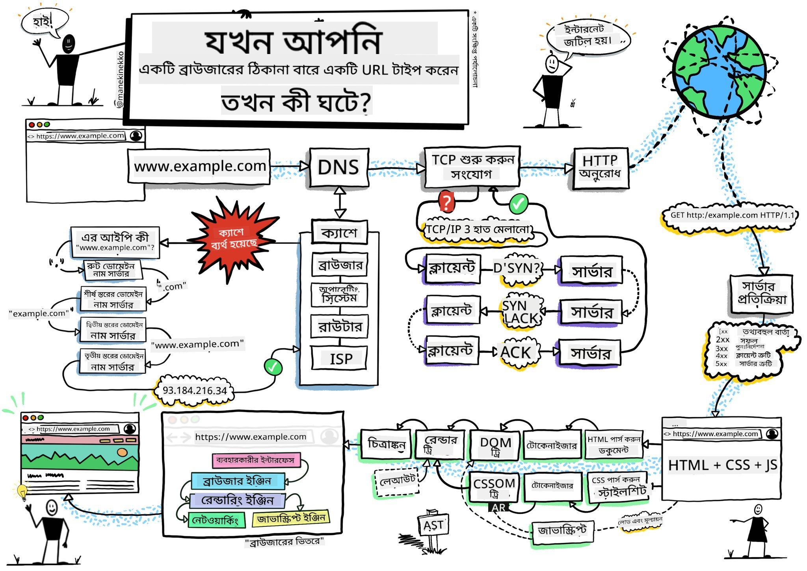
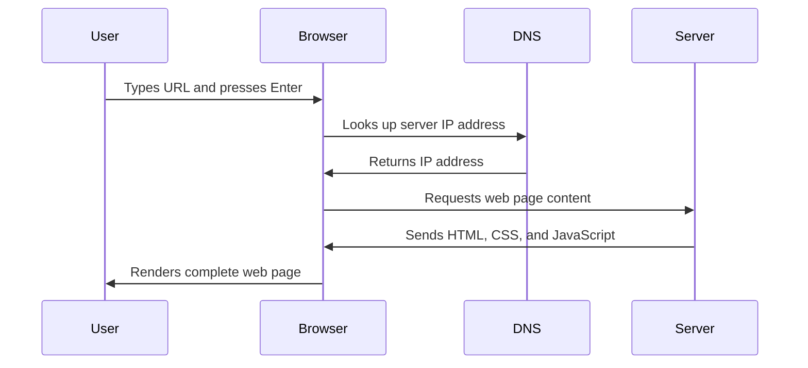
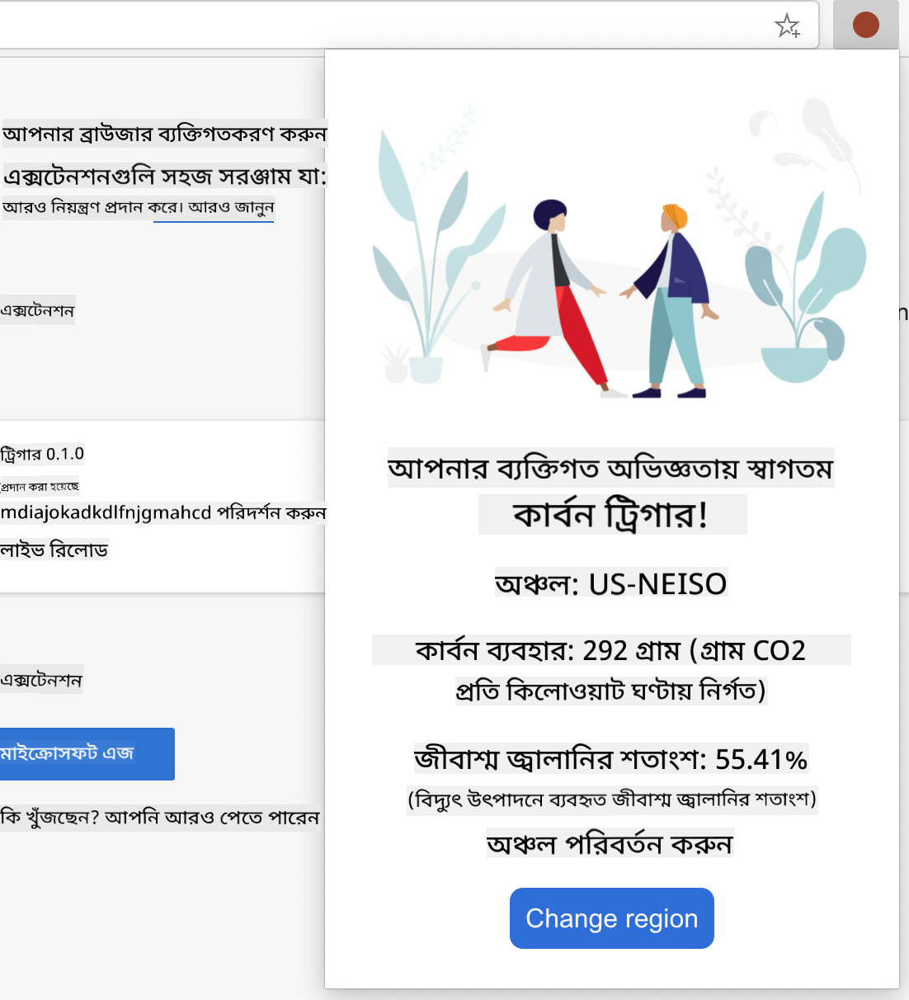

<!--
CO_OP_TRANSLATOR_METADATA:
{
  "original_hash": "33a875c522f237a2026e4653240dfc07",
  "translation_date": "2025-10-22T22:07:11+00:00",
  "source_file": "5-browser-extension/1-about-browsers/README.md",
  "language_code": "bn"
}
-->
# ব্রাউজার এক্সটেনশন প্রকল্প পর্ব ১: ব্রাউজার সম্পর্কে সবকিছু


> স্কেচনোট [Wassim Chegham](https://dev.to/wassimchegham/ever-wondered-what-happens-when-you-type-in-a-url-in-an-address-bar-in-a-browser-3dob) দ্বারা

## প্রাক-লেকচার কুইজ

[প্রাক-লেকচার কুইজ](https://ff-quizzes.netlify.app/web/quiz/23)

### ভূমিকা

ব্রাউজার এক্সটেনশন হলো ছোট ছোট অ্যাপ্লিকেশন যা আপনার ওয়েব ব্রাউজিং অভিজ্ঞতাকে আরও উন্নত করে। টিম বার্নার্স-লির ইন্টারঅ্যাকটিভ ওয়েবের মূল ধারণার মতো, এক্সটেনশন ব্রাউজারের ক্ষমতাকে সাধারণ ডকুমেন্ট দেখার সীমার বাইরে প্রসারিত করে। পাসওয়ার্ড ম্যানেজার থেকে শুরু করে ডিজাইনারদের জন্য নিখুঁত শেড খুঁজে পেতে সাহায্যকারী কালার পিকার পর্যন্ত, এক্সটেনশন দৈনন্দিন ব্রাউজিং চ্যালেঞ্জ সমাধান করে।

আপনার প্রথম এক্সটেনশন তৈরি করার আগে, চলুন বুঝে নিই ব্রাউজার কীভাবে কাজ করে। যেমন আলেকজান্ডার গ্রাহাম বেল টেলিফোন আবিষ্কারের আগে শব্দ সংক্রমণ সম্পর্কে বুঝতে চেয়েছিলেন, তেমনি ব্রাউজারের মৌলিক বিষয়গুলি জানা আপনাকে এমন এক্সটেনশন তৈরি করতে সাহায্য করবে যা বিদ্যমান ব্রাউজার সিস্টেমের সাথে নির্বিঘ্নে সংযুক্ত হয়।

এই পাঠ শেষে, আপনি ব্রাউজারের স্থাপত্য সম্পর্কে বুঝতে পারবেন এবং আপনার প্রথম এক্সটেনশন তৈরি শুরু করবেন।

## ওয়েব ব্রাউজার সম্পর্কে বোঝা

ওয়েব ব্রাউজার মূলত একটি উন্নত ডকুমেন্ট ইন্টারপ্রেটার। যখন আপনি ব্রাউজারের অ্যাড্রেস বারে "google.com" টাইপ করেন, তখন ব্রাউজার একটি জটিল প্রক্রিয়া সম্পন্ন করে - বিশ্বব্যাপী সার্ভার থেকে কন্টেন্ট অনুরোধ করে, তারপর সেই কোডকে ইন্টারঅ্যাকটিভ ওয়েব পেজে রূপান্তরিত করে।

এই প্রক্রিয়াটি টিম বার্নার্স-লি ১৯৯০ সালে প্রথম ওয়েব ব্রাউজার, WorldWideWeb, ডিজাইন করার সময় কল্পনা করেছিলেন, যাতে হাইপারলিঙ্কড ডকুমেন্টগুলি সবার জন্য সহজলভ্য হয়।

✅ **একটু ইতিহাস**: প্রথম ব্রাউজারের নাম ছিল 'WorldWideWeb' এবং এটি ১৯৯০ সালে স্যার টিমোথি বার্নার্স-লি তৈরি করেছিলেন।


> কিছু প্রথম দিকের ব্রাউজার, [Karen McGrane](https://www.slideshare.net/KMcGrane/week-4-ixd-history-personal-computing) এর মাধ্যমে

### ব্রাউজার কীভাবে ওয়েব কন্টেন্ট প্রক্রিয়া করে

একটি URL টাইপ করা থেকে শুরু করে একটি ওয়েবপেজ দেখার মধ্যে কয়েক সেকেন্ডের মধ্যে কয়েকটি সমন্বিত ধাপ ঘটে:



**এই প্রক্রিয়াটি যা সম্পন্ন করে:**
- **অনুবাদ করে** DNS লুকআপের মাধ্যমে মানুষের পঠনযোগ্য URL-কে সার্ভারের IP ঠিকানায়
- **নিরাপদ সংযোগ স্থাপন করে** ওয়েব সার্ভারের সাথে HTTP বা HTTPS প্রোটোকল ব্যবহার করে
- **অনুরোধ করে** নির্দিষ্ট ওয়েব পেজ কন্টেন্ট সার্ভার থেকে
- **গ্রহণ করে** HTML মার্কআপ, CSS স্টাইলিং এবং JavaScript কোড সার্ভার থেকে
- **রেন্ডার করে** সমস্ত কন্টেন্ট ইন্টারঅ্যাকটিভ ওয়েব পেজে যা আপনি দেখেন

### ব্রাউজারের মূল বৈশিষ্ট্য

আধুনিক ব্রাউজারগুলি অনেক বৈশিষ্ট্য সরবরাহ করে যা এক্সটেনশন ডেভেলপাররা ব্যবহার করতে পারেন:

| বৈশিষ্ট্য | উদ্দেশ্য | এক্সটেনশন সুযোগ |
|----------|----------|----------------|
| **রেন্ডারিং ইঞ্জিন** | HTML, CSS এবং JavaScript প্রদর্শন করে | কন্টেন্ট পরিবর্তন, স্টাইলিং ইনজেকশন |
| **JavaScript ইঞ্জিন** | JavaScript কোড কার্যকর করে | কাস্টম স্ক্রিপ্ট, API ইন্টারঅ্যাকশন |
| **লোকাল স্টোরেজ** | স্থানীয়ভাবে ডেটা সংরক্ষণ করে | ব্যবহারকারীর পছন্দ, ক্যাশড ডেটা |
| **নেটওয়ার্ক স্ট্যাক** | ওয়েব অনুরোধ পরিচালনা করে | অনুরোধ পর্যবেক্ষণ, ডেটা বিশ্লেষণ |
| **সিকিউরিটি মডেল** | ব্যবহারকারীদের ক্ষতিকারক কন্টেন্ট থেকে রক্ষা করে | কন্টেন্ট ফিল্টারিং, সিকিউরিটি উন্নতি |

**এই বৈশিষ্ট্যগুলি বোঝা আপনাকে সাহায্য করে:**
- **চিহ্নিত করতে** আপনার এক্সটেনশন কোথায় সবচেয়ে বেশি মূল্য যোগ করতে পারে
- **সঠিক ব্রাউজার API নির্বাচন করতে** আপনার এক্সটেনশনের কার্যকারিতার জন্য
- **ডিজাইন করতে** এক্সটেনশন যা ব্রাউজার সিস্টেমের সাথে দক্ষতার সাথে কাজ করে
- **নিশ্চিত করতে** আপনার এক্সটেনশন ব্রাউজারের সিকিউরিটি সেরা অনুশীলন অনুসরণ করে

### ক্রস-ব্রাউজার ডেভেলপমেন্ট বিবেচনা

বিভিন্ন ব্রাউজার স্ট্যান্ডার্ডগুলি সামান্য পার্থক্য সহ বাস্তবায়ন করে, যেমন বিভিন্ন প্রোগ্রামিং ভাষা একই অ্যালগরিদমকে ভিন্নভাবে পরিচালনা করতে পারে। Chrome, Firefox এবং Safari প্রতিটি তাদের নিজস্ব বৈশিষ্ট্য রয়েছে যা এক্সটেনশন ডেভেলপমেন্টের সময় ডেভেলপারদের বিবেচনা করতে হবে।

> 💡 **প্রো টিপ**: [caniuse.com](https://www.caniuse.com) ব্যবহার করুন বিভিন্ন ব্রাউজারে কোন ওয়েব প্রযুক্তি সমর্থিত তা পরীক্ষা করতে। এটি আপনার এক্সটেনশনের বৈশিষ্ট্য পরিকল্পনা করার সময় অমূল্য!

**এক্সটেনশন ডেভেলপমেন্টের জন্য মূল বিবেচনা:**
- **পরীক্ষা করুন** আপনার এক্সটেনশন Chrome, Firefox এবং Edge ব্রাউজারে
- **অ্যাডাপ্ট করুন** বিভিন্ন ব্রাউজার এক্সটেনশন API এবং ম্যানিফেস্ট ফরম্যাটে
- **পরিচালনা করুন** বিভিন্ন পারফরম্যান্স বৈশিষ্ট্য এবং সীমাবদ্ধতা
- **ফলাফল প্রদান করুন** ব্রাউজার-নির্দিষ্ট বৈশিষ্ট্যের জন্য যা উপলব্ধ নাও হতে পারে

✅ **অ্যানালিটিক্স ইনসাইট**: আপনার ব্যবহারকারীরা কোন ব্রাউজার পছন্দ করেন তা নির্ধারণ করতে আপনার ওয়েব ডেভেলপমেন্ট প্রকল্পগুলিতে অ্যানালিটিক্স প্যাকেজ ইনস্টল করুন। এই ডেটা আপনাকে প্রথমে কোন ব্রাউজার সমর্থন করতে হবে তা অগ্রাধিকার দিতে সাহায্য করে।

## ব্রাউজার এক্সটেনশন সম্পর্কে বোঝা

ব্রাউজার এক্সটেনশন সাধারণ ওয়েব ব্রাউজিং চ্যালেঞ্জ সমাধান করে ব্রাউজার ইন্টারফেসে সরাসরি কার্যকারিতা যোগ করে। আলাদা অ্যাপ্লিকেশন বা জটিল ওয়ার্কফ্লো প্রয়োজন ছাড়াই, এক্সটেনশনগুলি সরাসরি টুল এবং বৈশিষ্ট্যগুলিতে অ্যাক্সেস প্রদান করে।

এই ধারণাটি প্রাথমিক কম্পিউটার অগ্রগামীদের মতো ডগলাস এঙ্গেলবার্টের কল্পনার সাথে মিলে যায়, যারা প্রযুক্তির মাধ্যমে মানুষের ক্ষমতাকে বাড়ানোর কথা ভেবেছিলেন - এক্সটেনশন আপনার ব্রাউজারের মৌলিক কার্যকারিতা বাড়ায়।

**জনপ্রিয় এক্সটেনশন বিভাগ এবং তাদের সুবিধা:**
- **প্রোডাক্টিভিটি টুলস**: টাস্ক ম্যানেজার, নোট নেওয়ার অ্যাপ এবং টাইম ট্র্যাকার যা আপনাকে সংগঠিত থাকতে সাহায্য করে
- **সিকিউরিটি উন্নতি**: পাসওয়ার্ড ম্যানেজার, বিজ্ঞাপন ব্লকার এবং প্রাইভেসি টুল যা আপনার ডেটা রক্ষা করে
- **ডেভেলপার টুলস**: কোড ফরম্যাটার, কালার পিকার এবং ডিবাগিং ইউটিলিটি যা ডেভেলপমেন্টকে সহজ করে
- **কন্টেন্ট উন্নতি**: রিডিং মোড, ভিডিও ডাউনলোডার এবং স্ক্রিনশট টুল যা আপনার ওয়েব অভিজ্ঞতাকে উন্নত করে

✅ **প্রতিফলন প্রশ্ন**: আপনার প্রিয় ব্রাউজার এক্সটেনশনগুলি কী কী? তারা কোন নির্দিষ্ট কাজ সম্পন্ন করে এবং কীভাবে তারা আপনার ব্রাউজিং অভিজ্ঞতাকে উন্নত করে?

## এক্সটেনশন ইনস্টল এবং পরিচালনা করা

এক্সটেনশন ইনস্টলেশন প্রক্রিয়া বোঝা আপনাকে সাহায্য করবে ব্যবহারকারীরা যখন আপনার এক্সটেনশন ইনস্টল করবেন তখন তাদের অভিজ্ঞতা কেমন হবে তা পূর্বানুমান করতে। ইনস্টলেশন প্রক্রিয়া আধুনিক ব্রাউজারগুলিতে মানসম্মত, যদিও ইন্টারফেস ডিজাইনে কিছু পার্থক্য থাকতে পারে।


> **গুরুত্বপূর্ণ**: আপনার নিজস্ব এক্সটেনশন পরীক্ষা করার সময় ডেভেলপার মোড চালু করুন এবং অন্যান্য স্টোর থেকে এক্সটেনশন অনুমতি দিন।

### ডেভেলপমেন্ট এক্সটেনশন ইনস্টলেশন প্রক্রিয়া

আপনার নিজস্ব এক্সটেনশন ডেভেলপ এবং পরীক্ষা করার সময় এই ওয়ার্কফ্লো অনুসরণ করুন:

```bash
# Step 1: Build your extension
npm run build
```

**এই কমান্ডটি যা সম্পন্ন করে:**
- **কম্পাইল করে** আপনার সোর্স কোডকে ব্রাউজার-রেডি ফাইলে
- **বান্ডল করে** JavaScript মডিউলগুলোকে অপ্টিমাইজড প্যাকেজে
- **জেনারেট করে** চূড়ান্ত এক্সটেনশন ফাইলগুলো `/dist` ফোল্ডারে
- **প্রস্তুত করে** আপনার এক্সটেনশন ইনস্টল এবং পরীক্ষার জন্য

**ধাপ ২: ব্রাউজার এক্সটেনশনে যান**
1. **খুলুন** আপনার ব্রাউজারের এক্সটেনশন ম্যানেজমেন্ট পেজ
2. **ক্লিক করুন** "Settings and more" বোতামে (উপরের ডানদিকে থাকা `...` আইকন)
3. **নির্বাচন করুন** "Extensions" ড্রপডাউন মেনু থেকে

**ধাপ ৩: আপনার এক্সটেনশন লোড করুন**
- **নতুন ইনস্টলেশনের জন্য**: `load unpacked` নির্বাচন করুন এবং আপনার `/dist` ফোল্ডারটি নির্বাচন করুন
- **আপডেটের জন্য**: আপনার ইতিমধ্যে ইনস্টল করা এক্সটেনশনের পাশে `reload` ক্লিক করুন
- **পরীক্ষার জন্য**: "Developer mode" চালু করুন অতিরিক্ত ডিবাগিং বৈশিষ্ট্য অ্যাক্সেস করতে

### প্রোডাকশন এক্সটেনশন ইনস্টলেশন

> ✅ **নোট**: এই ডেভেলপমেন্ট নির্দেশনা শুধুমাত্র আপনার নিজস্ব তৈরি এক্সটেনশনের জন্য। প্রকাশিত এক্সটেনশন ইনস্টল করতে, [Microsoft Edge Add-ons store](https://microsoftedge.microsoft.com/addons/Microsoft-Edge-Extensions-Home) এর মতো অফিসিয়াল ব্রাউজার এক্সটেনশন স্টোরে যান।

**পার্থক্য বোঝা:**
- **ডেভেলপমেন্ট ইনস্টলেশন** আপনাকে ডেভেলপমেন্ট চলাকালীন অপ্রকাশিত এক্সটেনশন পরীক্ষা করতে দেয়
- **স্টোর ইনস্টলেশন** যাচাই করা, প্রকাশিত এক্সটেনশন সরবরাহ করে স্বয়ংক্রিয় আপডেট সহ
- **সাইডলোডিং** অফিসিয়াল স্টোরের বাইরে থেকে এক্সটেনশন ইনস্টল করার অনুমতি দেয় (ডেভেলপার মোড প্রয়োজন)

## আপনার কার্বন ফুটপ্রিন্ট এক্সটেনশন তৈরি করা

আমরা একটি ব্রাউজার এক্সটেনশন তৈরি করবো যা আপনার অঞ্চলের শক্তি ব্যবহারের কার্বন ফুটপ্রিন্ট প্রদর্শন করবে। এই প্রকল্পটি প্রয়োজনীয় এক্সটেনশন ডেভেলপমেন্ট ধারণাগুলি প্রদর্শন করবে এবং পরিবেশ সচেতনতার জন্য একটি ব্যবহারিক টুল তৈরি করবে।

এই পদ্ধতি জন ডিউইয়ের শিক্ষামূলক তত্ত্ব অনুসারে "শেখার মাধ্যমে করা" নীতির অনুসরণ করে - প্রযুক্তিগত দক্ষতার সাথে অর্থপূর্ণ বাস্তব-বিশ্বের অ্যাপ্লিকেশনগুলিকে একত্রিত করে।

### প্রকল্পের প্রয়োজনীয়তা

ডেভেলপমেন্ট শুরু করার আগে, চলুন প্রয়োজনীয় রিসোর্স এবং নির্ভরশীলতা সংগ্রহ করি:

**প্রয়োজনীয় API অ্যাক্সেস:**
- **[CO2 Signal API key](https://www.co2signal.com/)**: আপনার ইমেইল ঠিকানা প্রবেশ করান এবং আপনার বিনামূল্যের API কী পান
- **[Region code](http://api.electricitymap.org/v3/zones)**: আপনার অঞ্চল কোড খুঁজুন [Electricity Map](https://www.electricitymap.org/map) ব্যবহার করে (উদাহরণস্বরূপ, বোস্টন 'US-NEISO' ব্যবহার করে)

**ডেভেলপমেন্ট টুলস:**
- **[Node.js এবং NPM](https://www.npmjs.com)**: প্রকল্পের নির্ভরশীলতা ইনস্টল করার জন্য প্যাকেজ ম্যানেজমেন্ট টুল
- **[স্টার্টার কোড](../../../../5-browser-extension/start)**: ডেভেলপমেন্ট শুরু করার জন্য `start` ফোল্ডারটি ডাউনলোড করুন

✅ **আরও জানুন**: এই [বিস্তারিত লার্ন মডিউল](https://docs.microsoft.com/learn/modules/create-nodejs-project-dependencies/?WT.mc_id=academic-77807-sagibbon) এর মাধ্যমে আপনার প্যাকেজ ম্যানেজমেন্ট দক্ষতা উন্নত করুন

### প্রকল্পের কাঠামো বোঝা

প্রকল্পের কাঠামো বোঝা ডেভেলপমেন্ট কাজকে দক্ষতার সাথে সংগঠিত করতে সাহায্য করে। যেমন আলেকজান্দ্রিয়ার গ্রন্থাগার সহজে জ্ঞান পুনরুদ্ধারের জন্য সংগঠিত ছিল, তেমনি একটি সু-সংগঠিত কোডবেস ডেভেলপমেন্টকে আরও দক্ষ করে তোলে:

```
project-root/
├── dist/                    # Built extension files
│   ├── manifest.json        # Extension configuration
│   ├── index.html           # User interface markup
│   ├── background.js        # Background script functionality
│   └── main.js              # Compiled JavaScript bundle
└── src/                     # Source development files
    └── index.js             # Your main JavaScript code
```

**প্রতিটি ফাইল যা সম্পন্ন করে:**
- **`manifest.json`**: **সংজ্ঞায়িত করে** এক্সটেনশন মেটাডেটা, অনুমতি এবং এন্ট্রি পয়েন্ট
- **`index.html`**: **তৈরি করে** ব্যবহারকারী ইন্টারফেস যা ব্যবহারকারীরা আপনার এক্সটেনশন ক্লিক করলে প্রদর্শিত হয়
- **`background.js`**: **পরিচালনা করে** ব্যাকগ্রাউন্ড টাস্ক এবং ব্রাউজার ইভেন্ট লিসেনার
- **`main.js`**: **রাখে** চূড়ান্ত বান্ডল করা JavaScript যা বিল্ড প্রক্রিয়ার পরে তৈরি হয়
- **`src/index.js`**: **অন্তর্ভুক্ত করে** আপনার প্রধান ডেভেলপমেন্ট কোড যা `main.js` এ কম্পাইল হয়

> 💡 **সংগঠনের টিপস**: আপনার API কী এবং অঞ্চল কোড একটি নিরাপদ নোটে সংরক্ষণ করুন ডেভেলপমেন্টের সময় সহজ রেফারেন্সের জন্য। এই মানগুলি আপনার এক্সটেনশনের কার্যকারিতা পরীক্ষা করতে প্রয়োজন হবে।

✅ **সিকিউরিটি নোট**: কখনোই আপনার API কী বা সংবেদনশীল তথ্য কোড রিপোজিটরিতে জমা দেবেন না। আমরা পরবর্তী ধাপে দেখাব কীভাবে এগুলি নিরাপদে পরিচালনা করবেন।

## এক্সটেনশন ইন্টারফেস তৈরি করা

এখন আমরা ব্যবহারকারী ইন্টারফেস উপাদানগুলি তৈরি করবো। এক্সটেনশনটি দুটি স্ক্রিন পদ্ধতি ব্যবহার করে: প্রাথমিক সেটআপের জন্য একটি কনফিগারেশন স্ক্রিন এবং ডেটা প্রদর্শনের জন্য একটি ফলাফল স্ক্রিন।

এটি কম্পিউটিংয়ের প্রাথমিক দিন থেকে ব্যবহৃত প্রগ্রেসিভ ডিসক্লোজার নীতির অনুসরণ করে - ব্যবহারকারীদের তথ্য এবং অপশনগুলি একটি যৌক্তিক ক্রমে প্রকাশ করে যাতে তারা বিভ্রান্ত না হয়।

### এক্সটেনশন ভিউস ওভারভিউ

**সেটআপ ভিউ** - প্রথমবারের ব্যবহারকারী কনফিগারেশন:


**ফলাফল ভিউ** - কার্বন ফুটপ্রিন্ট ডেটা প্রদর্শন:


### কনফিগারেশন ফর্ম তৈরি করা

সেটআপ ফর্মটি প্রাথমিক ব্যবহারের সময় ব্যবহারকারীর কনফিগারেশন ডেটা সংগ্রহ করে। একবার কনফিগার করা হলে, এই তথ্যটি ব্রাউজার স্টোরেজে ভবিষ্যতের সেশনের জন্য সংরক্ষিত থাকে।

`/dist/index.html` ফাইলটিতে এই ফ
**বর্ণনা:** ব্রাউজার এক্সটেনশন উন্নত করুন ফর্ম যাচাই এবং ব্যবহারকারীর প্রতিক্রিয়া বৈশিষ্ট্য যোগ করে, যাতে API কী এবং অঞ্চল কোড প্রবেশ করার সময় ব্যবহারকারীর অভিজ্ঞতা উন্নত হয়।

**প্রম্পট:** জাভাস্ক্রিপ্ট যাচাই ফাংশন তৈরি করুন যা পরীক্ষা করবে API কী ক্ষেত্রটি কমপক্ষে ২০টি অক্ষর ধারণ করে কিনা এবং অঞ্চল কোড সঠিক ফরম্যাট অনুসরণ করে কিনা (যেমন 'US-NEISO')। বৈধ ইনপুটের জন্য ইনপুট বর্ডারের রঙ সবুজ এবং অবৈধ ইনপুটের জন্য লাল করে ভিজ্যুয়াল প্রতিক্রিয়া যোগ করুন। এছাড়াও নিরাপত্তার জন্য API কী দেখানো/লুকানোর একটি টগল বৈশিষ্ট্য যোগ করুন।

[এজেন্ট মোড](https://code.visualstudio.com/blogs/2025/02/24/introducing-copilot-agent-mode) সম্পর্কে আরও জানুন এখানে।

## 🚀 চ্যালেঞ্জ

ব্রাউজার এক্সটেনশন স্টোরটি দেখুন এবং একটি এক্সটেনশন আপনার ব্রাউজারে ইনস্টল করুন। এর ফাইলগুলো আকর্ষণীয় উপায়ে পরীক্ষা করুন। আপনি কী আবিষ্কার করেন?

## পোস্ট-লেকচার কুইজ

[পোস্ট-লেকচার কুইজ](https://ff-quizzes.netlify.app/web/quiz/24)

## পর্যালোচনা ও স্ব-অধ্যয়ন

এই পাঠে আপনি ওয়েব ব্রাউজারের ইতিহাস সম্পর্কে কিছু শিখেছেন; এই সুযোগটি নিন ওয়ার্ল্ড ওয়াইড ওয়েবের আবিষ্কারকরা এর ব্যবহার কিভাবে কল্পনা করেছিলেন তা জানার জন্য এর ইতিহাস সম্পর্কে আরও পড়ুন। কিছু উপকারী সাইট অন্তর্ভুক্ত:

[ওয়েব ব্রাউজারের ইতিহাস](https://www.mozilla.org/firefox/browsers/browser-history/)

[ওয়েবের ইতিহাস](https://webfoundation.org/about/vision/history-of-the-web/)

[টিম বার্নার্স-লির সাথে একটি সাক্ষাৎকার](https://www.theguardian.com/technology/2019/mar/12/tim-berners-lee-on-30-years-of-the-web-if-we-dream-a-little-we-can-get-the-web-we-want)

## অ্যাসাইনমেন্ট 

[আপনার এক্সটেনশন পুনরায় ডিজাইন করুন](assignment.md)

---

**অস্বীকৃতি**:  
এই নথিটি AI অনুবাদ পরিষেবা [Co-op Translator](https://github.com/Azure/co-op-translator) ব্যবহার করে অনুবাদ করা হয়েছে। আমরা যথাসাধ্য সঠিকতার জন্য চেষ্টা করি, তবে অনুগ্রহ করে মনে রাখবেন যে স্বয়ংক্রিয় অনুবাদে ত্রুটি বা অসঙ্গতি থাকতে পারে। নথিটির মূল ভাষায় থাকা আসল সংস্করণকে প্রামাণিক উৎস হিসেবে বিবেচনা করা উচিত। গুরুত্বপূর্ণ তথ্যের জন্য, পেশাদার মানব অনুবাদ সুপারিশ করা হয়। এই অনুবাদ ব্যবহারের ফলে সৃষ্ট কোনো ভুল বোঝাবুঝি বা ভুল ব্যাখ্যার জন্য আমরা দায়বদ্ধ নই।