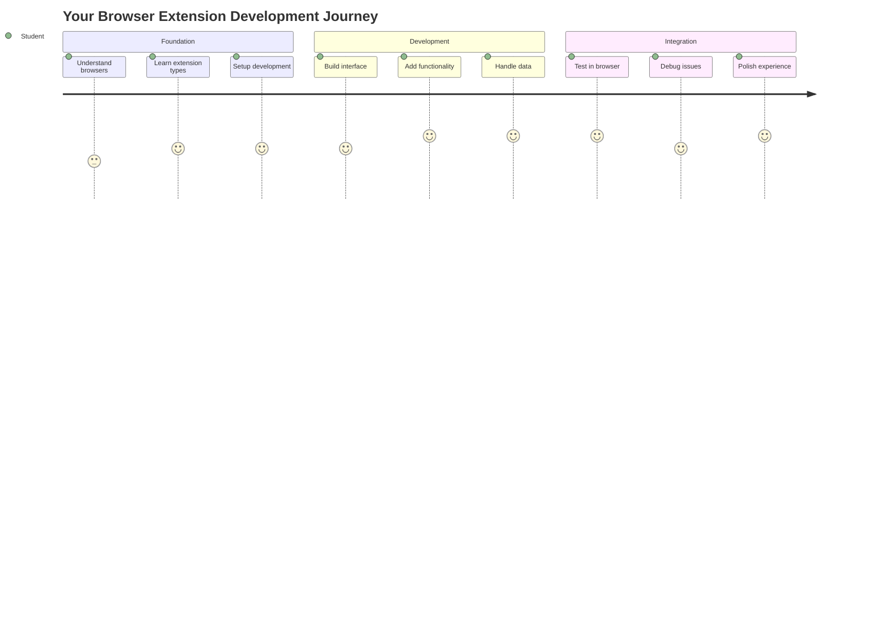
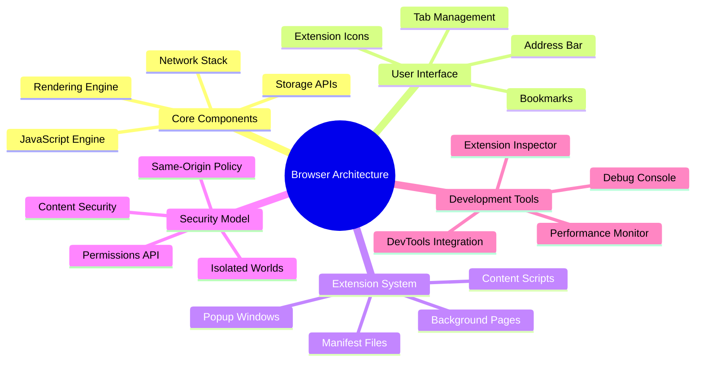
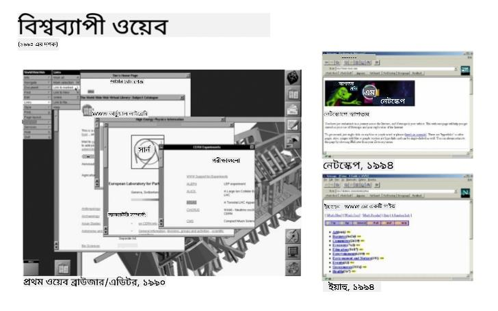
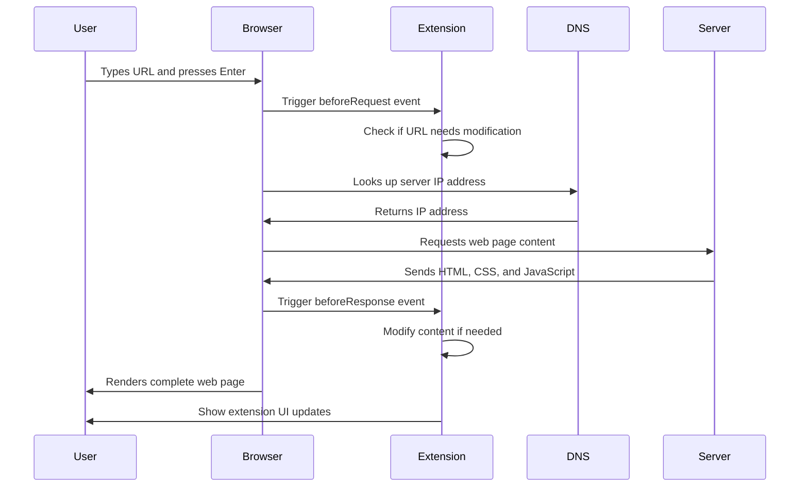
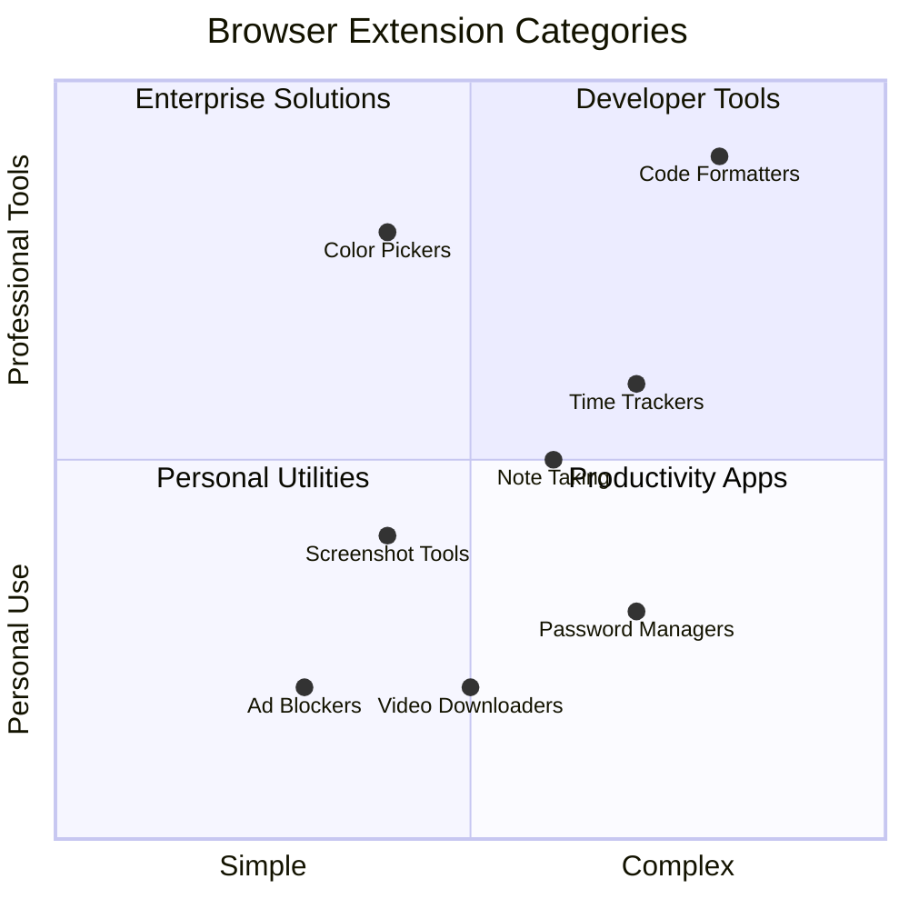
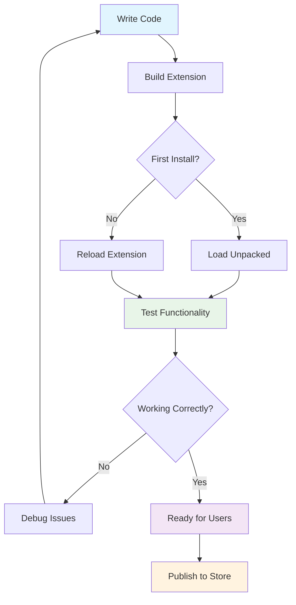
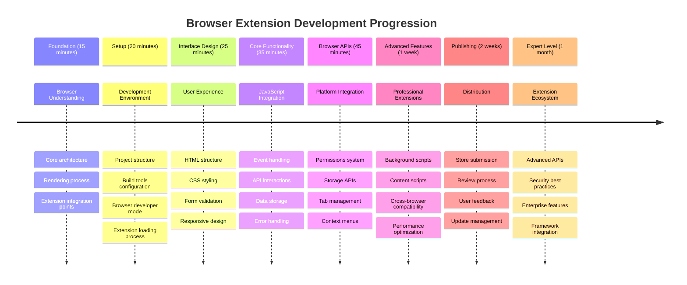

<!--
CO_OP_TRANSLATOR_METADATA:
{
  "original_hash": "00aa85715e1efd4930c17a23e3012e69",
  "translation_date": "2025-11-03T23:09:43+00:00",
  "source_file": "5-browser-extension/1-about-browsers/README.md",
  "language_code": "bn"
}
-->
# ব্রাউজার এক্সটেনশন প্রকল্প পার্ট ১: ব্রাউজার সম্পর্কে সবকিছু




> স্কেচনোট করেছেন [ওয়াসিম চেগাম](https://dev.to/wassimchegham/ever-wondered-what-happens-when-you-type-in-a-url-in-an-address-bar-in-a-browser-3dob)

## প্রি-লেকচার কুইজ

[প্রি-লেকচার কুইজ](https://ff-quizzes.netlify.app/web/quiz/23)

### ভূমিকা

ব্রাউজার এক্সটেনশন হলো ছোট অ্যাপ্লিকেশন যা আপনার ওয়েব ব্রাউজিং অভিজ্ঞতাকে উন্নত করে। টিম বার্নার্স-লির ইন্টারঅ্যাকটিভ ওয়েবের মূল ধারণার মতো, এক্সটেনশন ব্রাউজারের ক্ষমতাকে সাধারণ ডকুমেন্ট দেখার সীমার বাইরে প্রসারিত করে। পাসওয়ার্ড ম্যানেজার থেকে শুরু করে ডিজাইনারদের জন্য নিখুঁত রঙ বাছাই করার টুল পর্যন্ত, এক্সটেনশন দৈনন্দিন ব্রাউজিং সমস্যাগুলোর সমাধান করে।

আপনার প্রথম এক্সটেনশন তৈরি করার আগে, আসুন আমরা ব্রাউজার কীভাবে কাজ করে তা বুঝি। যেমন আলেকজান্ডার গ্রাহাম বেল টেলিফোন আবিষ্কারের আগে শব্দ সংক্রমণ সম্পর্কে বুঝতে চেয়েছিলেন, তেমনি ব্রাউজারের মৌলিক বিষয়গুলো জানা থাকলে আপনি এমন এক্সটেনশন তৈরি করতে পারবেন যা বিদ্যমান ব্রাউজার সিস্টেমের সাথে সহজে একীভূত হয়।

এই পাঠের শেষে, আপনি ব্রাউজারের স্থাপত্য সম্পর্কে বুঝতে পারবেন এবং আপনার প্রথম এক্সটেনশন তৈরি শুরু করবেন।



## ওয়েব ব্রাউজার সম্পর্কে বোঝা

একটি ওয়েব ব্রাউজার মূলত একটি উন্নত ডকুমেন্ট ইন্টারপ্রেটার। যখন আপনি ব্রাউজারের অ্যাড্রেস বারে "google.com" টাইপ করেন, তখন ব্রাউজার একটি জটিল প্রক্রিয়া সম্পন্ন করে - বিশ্বব্যাপী সার্ভার থেকে কন্টেন্ট অনুরোধ করে, তারপর সেই কোডকে ইন্টারঅ্যাকটিভ ওয়েব পেজে রূপান্তরিত করে।

এই প্রক্রিয়াটি ১৯৯০ সালে টিম বার্নার্স-লির দ্বারা ডিজাইন করা প্রথম ওয়েব ব্রাউজার, ওয়ার্ল্ডওয়াইডওয়েব, কীভাবে হাইপারলিঙ্কড ডকুমেন্ট সবার জন্য সহজলভ্য করেছিল তার সাথে সাদৃশ্যপূর্ণ।

✅ **একটু ইতিহাস**: প্রথম ব্রাউজারের নাম ছিল 'ওয়ার্ল্ডওয়াইডওয়েব' এবং এটি ১৯৯০ সালে স্যার টিমোথি বার্নার্স-লির দ্বারা তৈরি করা হয়েছিল।


> কিছু প্রথম দিকের ব্রাউজার, [ক্যারেন ম্যাকগ্রেন](https://www.slideshare.net/KMcGrane/week-4-ixd-history-personal-computing) এর মাধ্যমে

### ব্রাউজার কীভাবে ওয়েব কন্টেন্ট প্রক্রিয়াকরণ করে

একটি URL টাইপ করা থেকে শুরু করে একটি ওয়েবপেজ দেখার মধ্যে কয়েক সেকেন্ডের মধ্যে ঘটে যাওয়া কয়েকটি সমন্বিত ধাপ রয়েছে:



**এই প্রক্রিয়াটি যা সম্পন্ন করে:**
- **মানব-পাঠযোগ্য URL** কে DNS লুকআপের মাধ্যমে সার্ভার IP ঠিকানায় অনুবাদ করে
- **HTTP বা HTTPS প্রোটোকল ব্যবহার করে** ওয়েব সার্ভারের সাথে একটি নিরাপদ সংযোগ স্থাপন করে
- **নির্দিষ্ট ওয়েব পেজ কন্টেন্ট** সার্ভার থেকে অনুরোধ করে
- **HTML মার্কআপ, CSS স্টাইলিং এবং JavaScript কোড** সার্ভার থেকে গ্রহণ করে
- **সমস্ত কন্টেন্টকে রেন্ডার করে** ইন্টারঅ্যাকটিভ ওয়েব পেজে রূপান্তরিত করে

### ব্রাউজারের মূল বৈশিষ্ট্য

আধুনিক ব্রাউজারগুলো এক্সটেনশন ডেভেলপারদের জন্য অনেক বৈশিষ্ট্য প্রদান করে:

| বৈশিষ্ট্য | উদ্দেশ্য | এক্সটেনশন সুযোগ |
|---------|---------|------------------------|
| **রেন্ডারিং ইঞ্জিন** | HTML, CSS এবং JavaScript প্রদর্শন করে | কন্টেন্ট পরিবর্তন, স্টাইলিং ইনজেকশন |
| **JavaScript ইঞ্জিন** | JavaScript কোড কার্যকর করে | কাস্টম স্ক্রিপ্ট, API ইন্টারঅ্যাকশন |
| **লোকাল স্টোরেজ** | স্থানীয়ভাবে ডেটা সংরক্ষণ করে | ব্যবহারকারীর পছন্দ, ক্যাশড ডেটা |
| **নেটওয়ার্ক স্ট্যাক** | ওয়েব অনুরোধ পরিচালনা করে | অনুরোধ পর্যবেক্ষণ, ডেটা বিশ্লেষণ |
| **নিরাপত্তা মডেল** | ব্যবহারকারীদের ক্ষতিকারক কন্টেন্ট থেকে রক্ষা করে | কন্টেন্ট ফিল্টারিং, নিরাপত্তা উন্নতি |

**এই বৈশিষ্ট্যগুলো বোঝা আপনাকে সাহায্য করবে:**
- **সনাক্ত করা** আপনার এক্সটেনশন সবচেয়ে বেশি মূল্য যোগ করতে পারে কোথায়
- **সঠিক ব্রাউজার API নির্বাচন করা** আপনার এক্সটেনশনের কার্যকারিতার জন্য
- **ডিজাইন করা** এক্সটেনশন যা ব্রাউজার সিস্টেমের সাথে দক্ষতার সাথে কাজ করে
- **নিশ্চিত করা** আপনার এক্সটেনশন ব্রাউজারের নিরাপত্তা সেরা অনুশীলন অনুসরণ করে

### ক্রস-ব্রাউজার ডেভেলপমেন্ট বিবেচনা

বিভিন্ন ব্রাউজার স্ট্যান্ডার্ডগুলো সামান্য পার্থক্য সহ বাস্তবায়ন করে, যেমন বিভিন্ন প্রোগ্রামিং ভাষা একই অ্যালগরিদমকে ভিন্নভাবে পরিচালনা করতে পারে। Chrome, Firefox এবং Safari প্রত্যেকেরই অনন্য বৈশিষ্ট্য রয়েছে যা এক্সটেনশন ডেভেলপমেন্টের সময় ডেভেলপারদের বিবেচনা করতে হবে।

> 💡 **প্রো টিপ**: [caniuse.com](https://www.caniuse.com) ব্যবহার করুন বিভিন্ন ব্রাউজারে কোন ওয়েব প্রযুক্তি সমর্থিত তা পরীক্ষা করতে। এটি আপনার এক্সটেনশনের বৈশিষ্ট্য পরিকল্পনার সময় অমূল্য।

**এক্সটেনশন ডেভেলপমেন্টের জন্য মূল বিবেচনা:**
- **পরীক্ষা করুন** আপনার এক্সটেনশন Chrome, Firefox এবং Edge ব্রাউজারে
- **অ্যাডাপ্ট করুন** বিভিন্ন ব্রাউজার এক্সটেনশন API এবং ম্যানিফেস্ট ফরম্যাটে
- **পরিচালনা করুন** পারফরম্যান্সের বৈচিত্র্য এবং সীমাবদ্ধতা
- **ফলাফল প্রদান করুন** ব্রাউজার-নির্দিষ্ট বৈশিষ্ট্যের জন্য যা উপলব্ধ নাও হতে পারে

✅ **অ্যানালিটিক্স ইনসাইট**: আপনার ব্যবহারকারীরা কোন ব্রাউজার পছন্দ করেন তা নির্ধারণ করতে আপনার ওয়েব ডেভেলপমেন্ট প্রকল্পে অ্যানালিটিক্স প্যাকেজ ইনস্টল করুন। এই ডেটা আপনাকে প্রথমে কোন ব্রাউজার সমর্থন করতে হবে তা অগ্রাধিকার দিতে সাহায্য করে।

## ব্রাউজার এক্সটেনশন বোঝা

ব্রাউজার এক্সটেনশন সাধারণ ওয়েব ব্রাউজিং সমস্যাগুলোর সমাধান করে ব্রাউজার ইন্টারফেসে সরাসরি কার্যকারিতা যোগ করে। আলাদা অ্যাপ্লিকেশন বা জটিল ওয়ার্কফ্লো প্রয়োজন ছাড়াই, এক্সটেনশন সরাসরি টুল এবং বৈশিষ্ট্যগুলোর অ্যাক্সেস প্রদান করে।

এই ধারণাটি প্রাথমিক কম্পিউটার অগ্রগামীদের মতো ডগলাস এঙ্গেলবার্টের কল্পনার সাথে মিলে যায়, যারা প্রযুক্তির মাধ্যমে মানব ক্ষমতা বাড়ানোর কথা ভেবেছিলেন - এক্সটেনশন আপনার ব্রাউজারের মৌলিক কার্যকারিতা বাড়ায়।



**জনপ্রিয় এক্সটেনশন ক্যাটাগরি এবং তাদের সুবিধা:**
- **প্রোডাক্টিভিটি টুল**: টাস্ক ম্যানেজার, নোট নেওয়ার অ্যাপ এবং টাইম ট্র্যাকার যা আপনাকে সংগঠিত থাকতে সাহায্য করে
- **নিরাপত্তা উন্নতি**: পাসওয়ার্ড ম্যানেজার, বিজ্ঞাপন ব্লকার এবং গোপনীয়তা টুল যা আপনার ডেটা রক্ষা করে
- **ডেভেলপার টুল**: কোড ফরম্যাটার, কালার পিকার এবং ডিবাগিং ইউটিলিটি যা ডেভেলপমেন্টকে সহজ করে
- **কন্টেন্ট উন্নতি**: রিডিং মোড, ভিডিও ডাউনলোডার এবং স্ক্রিনশট টুল যা আপনার ওয়েব অভিজ্ঞতাকে উন্নত করে

✅ **প্রতিফলন প্রশ্ন**: আপনার প্রিয় ব্রাউজার এক্সটেনশনগুলো কী কী? তারা কোন নির্দিষ্ট কাজ সম্পন্ন করে এবং কীভাবে তারা আপনার ব্রাউজিং অভিজ্ঞতাকে উন্নত করে?

### 🔄 **শিক্ষাগত চেক-ইন**
**ব্রাউজার স্থাপত্য বোঝা**: এক্সটেনশন ডেভেলপমেন্টে যাওয়ার আগে নিশ্চিত করুন আপনি:
- ✅ ব্যাখ্যা করতে পারেন কীভাবে ব্রাউজার ওয়েব অনুরোধ প্রক্রিয়াকরণ করে এবং কন্টেন্ট রেন্ডার করে
- ✅ ব্রাউজার স্থাপত্যের প্রধান উপাদানগুলো সনাক্ত করতে পারেন
- ✅ বুঝতে পারেন কীভাবে এক্সটেনশন ব্রাউজারের কার্যকারিতার সাথে একীভূত হয়
- ✅ সেই নিরাপত্তা মডেলটি চিনতে পারেন যা ব্যবহারকারীদের রক্ষা করে

**দ্রুত স্ব-পরীক্ষা**: আপনি কি একটি URL টাইপ করা থেকে একটি ওয়েবপেজ দেখার পথটি ট্রেস করতে পারেন?
1. **DNS লুকআপ** URL কে IP ঠিকানায় রূপান্তর করে
2. **HTTP অনুরোধ** সার্ভার থেকে কন্টেন্ট নিয়ে আসে
3. **পার্সিং** HTML, CSS এবং JavaScript প্রক্রিয়াকরণ করে
4. **রেন্ডারিং** চূড়ান্ত ওয়েবপেজ প্রদর্শন করে
5. **এক্সটেনশন** বিভিন্ন ধাপে কন্টেন্ট পরিবর্তন করতে পারে

## এক্সটেনশন ইনস্টল এবং পরিচালনা করা

এক্সটেনশন ইনস্টলেশন প্রক্রিয়া বোঝা আপনাকে ব্যবহারকারীদের অভিজ্ঞতা সম্পর্কে পূর্বাভাস দিতে সাহায্য করবে যখন তারা আপনার এক্সটেনশন ইনস্টল করবে। ইনস্টলেশন প্রক্রিয়া আধুনিক ব্রাউজারগুলোতে মানসম্মত, যদিও ইন্টারফেস ডিজাইনে কিছু পার্থক্য রয়েছে।


> **গুরুত্বপূর্ণ**: আপনার নিজের এক্সটেনশন পরীক্ষা করার সময় ডেভেলপার মোড চালু করুন এবং অন্যান্য স্টোর থেকে এক্সটেনশন অনুমোদন করুন।

### ডেভেলপমেন্ট এক্সটেনশন ইনস্টলেশন প্রক্রিয়া

আপনার নিজের এক্সটেনশন ডেভেলপ এবং পরীক্ষা করার সময় এই ওয়ার্কফ্লো অনুসরণ করুন:



```bash
# Step 1: Build your extension
npm run build
```

**এই কমান্ড যা সম্পন্ন করে:**
- **আপনার সোর্স কোডকে** ব্রাউজার-রেডি ফাইলে কম্পাইল করে
- **JavaScript মডিউলগুলোকে** অপ্টিমাইজড প্যাকেজে বান্ডেল করে
- **চূড়ান্ত এক্সটেনশন ফাইলগুলো তৈরি করে** `/dist` ফোল্ডারে
- **আপনার এক্সটেনশনকে প্রস্তুত করে** ইনস্টলেশন এবং পরীক্ষার জন্য

**ধাপ ২: ব্রাউজার এক্সটেনশন পেজে যান**
1. **আপনার ব্রাউজারের এক্সটেনশন ম্যানেজমেন্ট পেজ খুলুন**
2. **"সেটিংস এবং আরও" বোতামে ক্লিক করুন** (উপরের ডানদিকে `...` আইকন)
3. **ড্রপডাউন মেনু থেকে "এক্সটেনশন" নির্বাচন করুন**

**ধাপ ৩: আপনার এক্সটেনশন লোড করুন**
- **নতুন ইনস্টলেশনের জন্য**: `load unpacked` নির্বাচন করুন এবং আপনার `/dist` ফোল্ডারটি নির্বাচন করুন
- **আপডেটের জন্য**: আপনার ইতিমধ্যে ইনস্টল করা এক্সটেনশনের পাশে `reload` ক্লিক করুন
- **পরীক্ষার জন্য**: "ডেভেলপার মোড" চালু করুন অতিরিক্ত ডিবাগিং বৈশিষ্ট্য অ্যাক্সেস করতে

### প্রোডাকশন এক্সটেনশন ইনস্টলেশন

> ✅ **নোট**: এই ডেভেলপমেন্ট নির্দেশনা বিশেষভাবে আপনার তৈরি করা এক্সটেনশনের জন্য। প্রকাশিত এক্সটেনশন ইনস্টল করতে, [Microsoft Edge Add-ons store](https://microsoftedge.microsoft.com/addons/Microsoft-Edge-Extensions-Home) এর মতো অফিসিয়াল ব্রাউজার এক্সটেনশন স্টোরগুলোতে যান।

**পার্থক্য বোঝা:**
- **ডেভেলপমেন্ট ইনস্টলেশন** আপনাকে ডেভেলপমেন্টের সময় অপ্রকাশিত এক্সটেনশন পরীক্ষা করতে দেয়
- **স্টোর ইনস্টলেশন** যাচাই করা, প্রকাশিত এক্সটেনশন প্রদান করে যা স্বয়ংক্রিয়ভাবে আপডেট হয়
- **সাইডলোডিং** অফিসিয়াল স্টোরের বাইরে থেকে এক্সটেনশন ইনস্টল করার অনুমতি দেয় (ডেভেলপার মোড প্রয়োজন)

## আপনার কার্বন ফুটপ্রিন্ট এক্সটেনশন তৈরি করা

আমরা একটি ব্রাউজার এক্সটেনশন তৈরি করবো যা আপনার অঞ্চলের শক্তি ব্যবহারের কার্বন ফুটপ্রিন্ট প্রদর্শন করবে। এই প্রকল্পটি প্রয়োজনীয় এক্সটেনশন ডেভেলপমেন্ট ধারণাগুলো প্রদর্শন করে এবং পরিবেশ সচেতনতার জন্য একটি ব্যবহারিক টুল তৈরি করে।

এই পদ্ধতি "শেখার মাধ্যমে করা" নীতির অনুসরণ করে যা জন ডিউইয়ের শিক্ষাগত তত্ত্ব থেকে কার্যকর প্রমাণিত হয়েছে - প্রযুক্তিগত দক্ষতার সাথে অর্থবহ বাস্তব-বিশ্বের অ্যাপ্লিকেশনগুলোকে একত্রিত করে।

### প্রকল্পের প্রয়োজনীয়তা

ডেভেলপমেন্ট শুরু করার আগে, আসুন প্রয়োজনীয় রিসোর্স এবং ডিপেনডেন্সি সংগ্রহ করি:

**প্রয়োজনীয় API অ্যাক্সেস:**
- **[CO2 Signal API key](https://www.co2signal.com/)**: আপনার ইমেইল ঠিকানা দিয়ে আপনার বিনামূল্যের API key পান
- **[Region code](http://api.electricitymap.org/v3/zones)**: আপনার অঞ্চল কোড [Electricity Map](https://www.electricitymap.org/map) ব্যবহার করে খুঁজুন (যেমন, বোস্টনের জন্য 'US-NEISO')

**ডেভেলপমেন্ট টুল:**
- **[Node.js এবং NPM](https://www.npmjs.com)**: প্যাকেজ ম্যানেজমেন্ট টুল যা প্রকল্পের ডিপেনডেন্সি ইনস্টল করতে ব্যবহৃত হয়
- **[স্টার্টার কোড](../../../../5-browser-extension/start)**: ডেভেলপমেন্ট শুরু করতে `start` ফোল্ডারটি ডাউনলোড করুন

✅ **আরও জানুন**: আপনার প্যাকেজ ম্যানেজমেন্ট দক্ষতা বাড়ান এই [বিস্তারিত লার্ন মডিউল](https://docs.microsoft.com/learn/modules/create-nodejs-project-dependencies/?WT.mc_id=academic-77807-sagibbon) এর মাধ্যমে

### প্রকল্পের কাঠামো বোঝা

প্রকল্পের কাঠামো বোঝা ডেভেলপমেন্ট কাজকে দক্ষতার সাথে সংগঠিত করতে সাহায্য করে। যেমন আলেকজান্দ্রিয়ার গ্রন্থাগার সহজে জ্ঞান পুনরুদ্ধারের জন্য সংগঠিত ছিল, তেমনি একটি সু-সংগঠিত কোডবেস ডেভেলপমেন্টকে আরও কার্যকর করে তোলে:

```
project-root/
├── dist/                    # Built extension files
│   ├── manifest.json        # Extension configuration
│   ├── index.html           # User interface markup
│   ├── background.js        # Background script functionality
│   └── main.js              # Compiled JavaScript bundle
├── src/                     # Source development files
│   └── index.js             # Your main JavaScript code
├── package.json             # Project dependencies and scripts
└── webpack.config.js        # Build configuration
```

**প্রত্যেক ফাইল যা সম্পন্ন করে:**
- **`manifest.json`**: **সংজ্ঞায়িত করে** এক্সটেনশনের মেটাডেটা, অনুমতি এবং এন্ট্রি পয়েন্ট
- **`index.html`**: **তৈরি করে** ব্যবহারকারীর ইন্টারফেস যা ব্যবহারকারীরা আপনার এক্সটেনশনে ক্লিক করলে প্রদর্শিত হয়
- **`background.js`**: **পরিচালনা করে** ব্যাকগ্রাউন্ড টাস্ক এবং ব্রাউজার ইভেন্ট লিসেনার
- **`main.js`**: **ধারণ করে** চূড়ান্ত বান্ডেল JavaScript যা বিল্ড প্রক্রিয়ার পরে তৈরি হয়
- **`src/index.js`**: **রাখে** আপনার প্রধান ডেভেলপমেন্ট কোড যা `main.js` এ কম্পাইল হয়

> 💡 **সংগঠনের টিপ**: আপনার API key এবং অঞ্চল কোড একটি নিরাপদ নোটে সংরক্ষণ করুন ডেভেলপমেন্টের সময় সহজ রেফারেন্সের জন্য। এই মানগুলো আপনার এক্সটেনশনের কার্যকারিতা পরীক্ষা করার জন্য প্রয়োজন হবে।

✅ **নিরাপত্তা নোট**: কখনোই API key বা সংবেদনশীল তথ্য আপনার কোড রিপোজিটরিতে কমিট করবেন না। আমরা পরবর্তী ধাপে দেখাব কীভাবে এগুলো নিরাপদে পরিচালনা করবেন।

## এক্সটেনশন ইন্টারফেস তৈরি করা

এখন আমরা ব্যবহারকারীর ইন্টারফেস কম্পোনেন্টগুলো তৈরি করবো। এক্সটেনশনটি দুটি স্ক্রিন ব্যবহার করে
1. **চালান** বিল্ড কমান্ডটি আপনার কোড কম্পাইল করতে
2. **লোড করুন** এক্সটেনশনটি আপনার ব্রাউজারে ডেভেলপার মোড ব্যবহার করে
3. **যাচাই করুন** যে ফর্মটি সঠিকভাবে প্রদর্শিত হচ্ছে এবং পেশাদার দেখাচ্ছে
4. **পরীক্ষা করুন** যে সমস্ত ফর্ম উপাদান সঠিকভাবে সারিবদ্ধ এবং কার্যকরী

**আপনি যা অর্জন করেছেন:**
- **নির্মাণ করেছেন** আপনার এক্সটেনশনের জন্য মৌলিক HTML কাঠামো
- **তৈরি করেছেন** কনফিগারেশন এবং ফলাফল ইন্টারফেস যথাযথ সেমান্টিক মার্কআপ সহ
- **সেট আপ করেছেন** আধুনিক ডেভেলপমেন্ট ওয়ার্কফ্লো শিল্প-মানের টুল ব্যবহার করে
- **প্রস্তুত করেছেন** ইন্টারেক্টিভ জাভাস্ক্রিপ্ট ফাংশনালিটি যোগ করার ভিত্তি

### 🔄 **শিক্ষামূলক চেক-ইন**
**এক্সটেনশন ডেভেলপমেন্ট অগ্রগতি**: চালিয়ে যাওয়ার আগে আপনার বোঝাপড়া যাচাই করুন:
- ✅ আপনি কি প্রকল্প কাঠামোর প্রতিটি ফাইলের উদ্দেশ্য ব্যাখ্যা করতে পারেন?
- ✅ আপনি কি বুঝতে পেরেছেন কীভাবে বিল্ড প্রক্রিয়া আপনার সোর্স কোড রূপান্তর করে?
- ✅ কেন আমরা কনফিগারেশন এবং ফলাফলকে আলাদা UI সেকশনে ভাগ করি?
- ✅ ফর্ম কাঠামো কীভাবে ব্যবহারযোগ্যতা এবং অ্যাক্সেসিবিলিটি সমর্থন করে?

**ডেভেলপমেন্ট ওয়ার্কফ্লো বোঝাপড়া**: এখন আপনি সক্ষম:
1. **পরিবর্তন করুন** আপনার এক্সটেনশন ইন্টারফেসের HTML এবং CSS
2. **চালান** বিল্ড কমান্ডটি আপনার পরিবর্তনগুলি কম্পাইল করতে
3. **পুনরায় লোড করুন** এক্সটেনশনটি আপনার ব্রাউজারে আপডেট পরীক্ষা করতে
4. **ডিবাগ করুন** ব্রাউজার ডেভেলপার টুল ব্যবহার করে সমস্যাগুলি

আপনি ব্রাউজার এক্সটেনশন ডেভেলপমেন্টের প্রথম ধাপ সম্পন্ন করেছেন। যেমন Wright Brothers প্রথমে এরোডাইনামিক্স বুঝতে চেয়েছিলেন উড়ানের আগে, এই মৌলিক ধারণাগুলি বোঝা আপনাকে পরবর্তী পাঠে আরও জটিল ইন্টারেক্টিভ বৈশিষ্ট্য তৈরি করার জন্য প্রস্তুত করে।

## GitHub Copilot Agent Challenge 🚀

Agent মোড ব্যবহার করে নিম্নলিখিত চ্যালেঞ্জটি সম্পন্ন করুন:

**বর্ণনা:** ব্রাউজার এক্সটেনশনটি উন্নত করুন ফর্ম ভ্যালিডেশন এবং ব্যবহারকারীর প্রতিক্রিয়া বৈশিষ্ট্য যোগ করে, যাতে API কী এবং অঞ্চল কোড প্রবেশ করার সময় ব্যবহারকারীর অভিজ্ঞতা উন্নত হয়।

**প্রম্পট:** জাভাস্ক্রিপ্ট ভ্যালিডেশন ফাংশন তৈরি করুন যা পরীক্ষা করে API কী ফিল্ডে কমপক্ষে ২০টি অক্ষর আছে কিনা এবং অঞ্চল কোড সঠিক ফরম্যাট অনুসরণ করে কিনা (যেমন 'US-NEISO')। বৈধ ইনপুটের জন্য ইনপুট বর্ডার রঙ সবুজ এবং অবৈধ ইনপুটের জন্য লাল পরিবর্তন করে ভিজ্যুয়াল প্রতিক্রিয়া যোগ করুন। এছাড়াও নিরাপত্তার জন্য API কী দেখানো/লুকানোর একটি টগল বৈশিষ্ট্য যোগ করুন।

Agent মোড সম্পর্কে আরও জানুন [এখানে](https://code.visualstudio.com/blogs/2025/02/24/introducing-copilot-agent-mode)।

## 🚀 চ্যালেঞ্জ

একটি ব্রাউজার এক্সটেনশন স্টোর দেখুন এবং একটি এক্সটেনশন আপনার ব্রাউজারে ইনস্টল করুন। এর ফাইলগুলি আকর্ষণীয় উপায়ে পরীক্ষা করুন। আপনি কী আবিষ্কার করেন?

## পোস্ট-লেকচার কুইজ

[পোস্ট-লেকচার কুইজ](https://ff-quizzes.netlify.app/web/quiz/24)

## পর্যালোচনা এবং স্ব-অধ্যয়ন

এই পাঠে আপনি ওয়েব ব্রাউজারের ইতিহাস সম্পর্কে কিছু শিখেছেন; এই সুযোগটি নিন এবং ওয়ার্ল্ড ওয়াইড ওয়েবের আবিষ্কারকরা কীভাবে এর ব্যবহার কল্পনা করেছিলেন তা সম্পর্কে আরও জানুন। কিছু দরকারী সাইট অন্তর্ভুক্ত:

[ওয়েব ব্রাউজারের ইতিহাস](https://www.mozilla.org/firefox/browsers/browser-history/)

[ওয়েবের ইতিহাস](https://webfoundation.org/about/vision/history-of-the-web/)

[টিম বার্নার্স-লির সাথে একটি সাক্ষাৎকার](https://www.theguardian.com/technology/2019/mar/12/tim-berners-lee-on-30-years-of-the-web-if-we-dream-a-little-we-can-get-the-web-we-want)

### ⚡ **পরবর্তী ৫ মিনিটে আপনি যা করতে পারেন**
- [ ] Chrome/Edge এক্সটেনশন পেজ খুলুন (chrome://extensions) এবং আপনার ইনস্টল করা এক্সটেনশনগুলি অন্বেষণ করুন
- [ ] আপনার ব্রাউজারের DevTools Network ট্যাব দেখুন যখন একটি ওয়েবপেজ লোড হচ্ছে
- [ ] পেজ সোর্স দেখার চেষ্টা করুন (Ctrl+U) HTML কাঠামো দেখতে
- [ ] যেকোনো ওয়েবপেজ উপাদান পরিদর্শন করুন এবং DevTools-এ এর CSS পরিবর্তন করুন

### 🎯 **এই ঘণ্টায় আপনি যা অর্জন করতে পারেন**
- [ ] পোস্ট-লেসন কুইজ সম্পন্ন করুন এবং ব্রাউজারের মৌলিক বিষয়গুলি বুঝুন
- [ ] একটি মৌলিক manifest.json ফাইল তৈরি করুন একটি ব্রাউজার এক্সটেনশনের জন্য
- [ ] একটি সাধারণ "Hello World" এক্সটেনশন তৈরি করুন যা একটি পপআপ দেখায়
- [ ] ডেভেলপার মোডে আপনার এক্সটেনশন লোড করার পরীক্ষা করুন
- [ ] আপনার লক্ষ্য ব্রাউজারের জন্য ব্রাউজার এক্সটেনশন ডকুমেন্টেশন অন্বেষণ করুন

### 📅 **আপনার সপ্তাহব্যাপী এক্সটেনশন যাত্রা**
- [ ] একটি কার্যকরী ব্রাউজার এক্সটেনশন সম্পন্ন করুন যা বাস্তব উপযোগিতা প্রদান করে
- [ ] কন্টেন্ট স্ক্রিপ্ট, ব্যাকগ্রাউন্ড স্ক্রিপ্ট এবং পপআপ ইন্টারঅ্যাকশন সম্পর্কে শিখুন
- [ ] স্টোরেজ, ট্যাব এবং মেসেজিং-এর মতো ব্রাউজার API-তে দক্ষতা অর্জন করুন
- [ ] আপনার এক্সটেনশনের জন্য ব্যবহারকারী-বান্ধব ইন্টারফেস ডিজাইন করুন
- [ ] বিভিন্ন ওয়েবসাইট এবং পরিস্থিতিতে আপনার এক্সটেনশন পরীক্ষা করুন
- [ ] আপনার এক্সটেনশন ব্রাউজারের এক্সটেনশন স্টোরে প্রকাশ করুন

### 🌟 **আপনার মাসব্যাপী ব্রাউজার ডেভেলপমেন্ট**
- [ ] বিভিন্ন ব্যবহারকারীর সমস্যার সমাধান করে একাধিক এক্সটেনশন তৈরি করুন
- [ ] উন্নত ব্রাউজার API এবং নিরাপত্তা সেরা অনুশীলন শিখুন
- [ ] ওপেন সোর্স ব্রাউজার এক্সটেনশন প্রকল্পে অবদান রাখুন
- [ ] ক্রস-ব্রাউজার সামঞ্জস্য এবং প্রগ্রেসিভ এনহান্সমেন্টে দক্ষতা অর্জন করুন
- [ ] অন্যদের জন্য এক্সটেনশন ডেভেলপমেন্ট টুল এবং টেমপ্লেট তৈরি করুন
- [ ] একজন ব্রাউজার এক্সটেনশন বিশেষজ্ঞ হয়ে উঠুন যিনি অন্যান্য ডেভেলপারদের সাহায্য করেন

## 🎯 আপনার ব্রাউজার এক্সটেনশন দক্ষতার সময়রেখা



### 🛠️ আপনার এক্সটেনশন ডেভেলপমেন্ট টুলকিট সারাংশ

এই পাঠ সম্পন্ন করার পরে, এখন আপনার কাছে রয়েছে:
- **ব্রাউজার আর্কিটেকচার জ্ঞান**: রেন্ডারিং ইঞ্জিন, নিরাপত্তা মডেল এবং এক্সটেনশন ইন্টিগ্রেশন বোঝা
- **ডেভেলপমেন্ট পরিবেশ**: Webpack, NPM এবং ডিবাগিং ক্ষমতা সহ আধুনিক টুলচেইন
- **UI/UX ভিত্তি**: সেমান্টিক HTML কাঠামো প্রগ্রেসিভ ডিসক্লোজার প্যাটার্ন সহ
- **নিরাপত্তা সচেতনতা**: ব্রাউজার অনুমতি এবং নিরাপদ ডেভেলপমেন্ট অনুশীলন বোঝা
- **ক্রস-ব্রাউজার ধারণা**: সামঞ্জস্য বিবেচনা এবং পরীক্ষার পদ্ধতি সম্পর্কে জ্ঞান
- **API ইন্টিগ্রেশন**: বাহ্যিক ডেটা সোর্সের সাথে কাজ করার ভিত্তি
- **পেশাদার ওয়ার্কফ্লো**: শিল্প-মানের ডেভেলপমেন্ট এবং পরীক্ষার পদ্ধতি

**বাস্তব-জগতের প্রয়োগ**: এই দক্ষতাগুলি সরাসরি প্রয়োগ করা যায়:
- **ওয়েব ডেভেলপমেন্ট**: সিঙ্গেল-পেজ অ্যাপ্লিকেশন এবং প্রগ্রেসিভ ওয়েব অ্যাপ
- **ডেস্কটপ অ্যাপ্লিকেশন**: Electron এবং ওয়েব-ভিত্তিক ডেস্কটপ সফটওয়্যার
- **মোবাইল ডেভেলপমেন্ট**: হাইব্রিড অ্যাপ এবং ওয়েব-ভিত্তিক মোবাইল সমাধান
- **এন্টারপ্রাইজ টুল**: অভ্যন্তরীণ উৎপাদনশীলতা অ্যাপ্লিকেশন এবং ওয়ার্কফ্লো অটোমেশন
- **ওপেন সোর্স**: ব্রাউজার এক্সটেনশন প্রকল্প এবং ওয়েব স্ট্যান্ডার্ডে অবদান রাখা

**পরবর্তী স্তর**: আপনি এখন ইন্টারেক্টিভ কার্যকারিতা যোগ করতে, ব্রাউজার API নিয়ে কাজ করতে এবং এমন এক্সটেনশন তৈরি করতে প্রস্তুত যা বাস্তব ব্যবহারকারীর সমস্যার সমাধান করে!

## অ্যাসাইনমেন্ট

[আপনার এক্সটেনশন পুনরায় স্টাইল করুন](assignment.md)

---

**অস্বীকৃতি**:  
এই নথিটি AI অনুবাদ পরিষেবা [Co-op Translator](https://github.com/Azure/co-op-translator) ব্যবহার করে অনুবাদ করা হয়েছে। আমরা যথাসাধ্য সঠিকতার জন্য চেষ্টা করি, তবে অনুগ্রহ করে মনে রাখবেন যে স্বয়ংক্রিয় অনুবাদে ত্রুটি বা অসঙ্গতি থাকতে পারে। মূল ভাষায় থাকা নথিটিকে প্রামাণিক উৎস হিসেবে বিবেচনা করা উচিত। গুরুত্বপূর্ণ তথ্যের জন্য, পেশাদার মানব অনুবাদ সুপারিশ করা হয়। এই অনুবাদ ব্যবহারের ফলে কোনো ভুল বোঝাবুঝি বা ভুল ব্যাখ্যার জন্য আমরা দায়ী থাকব না।