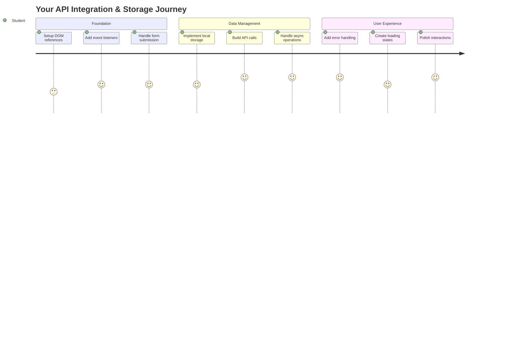
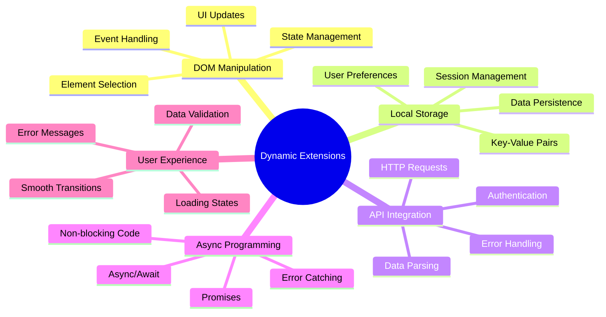
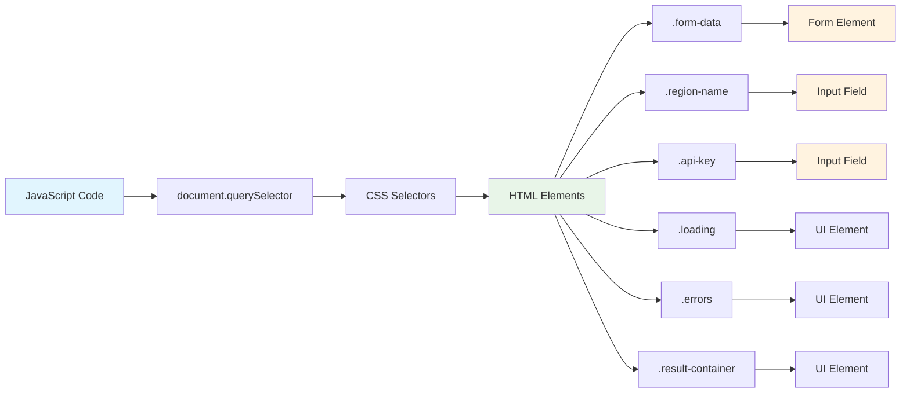
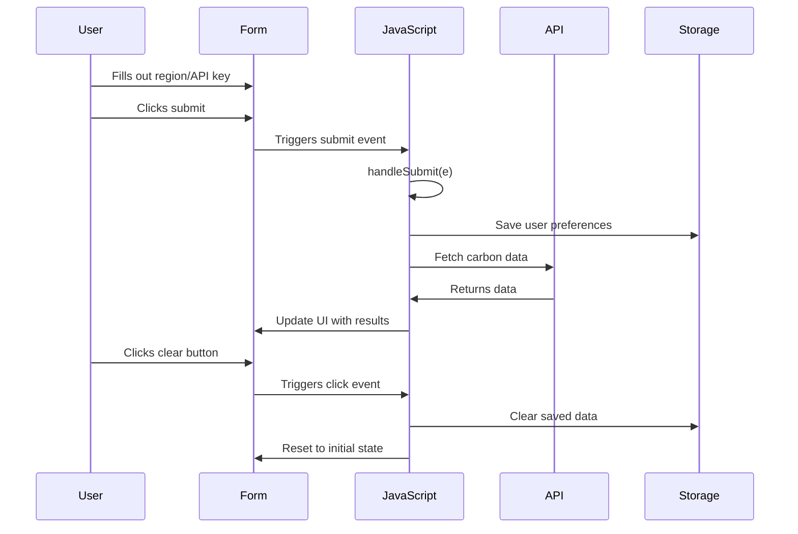
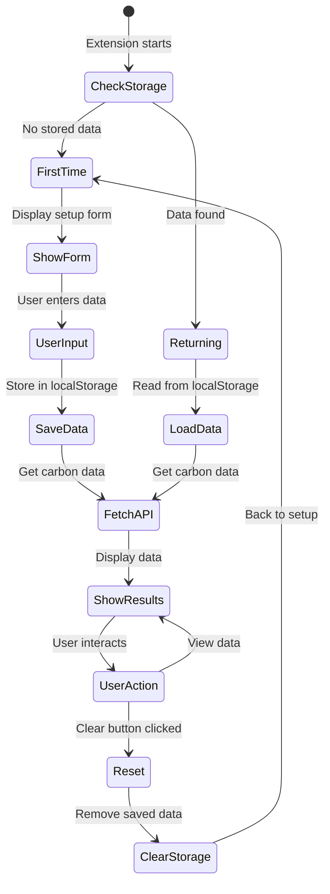
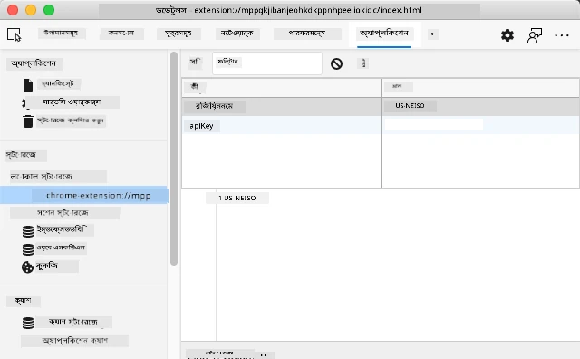
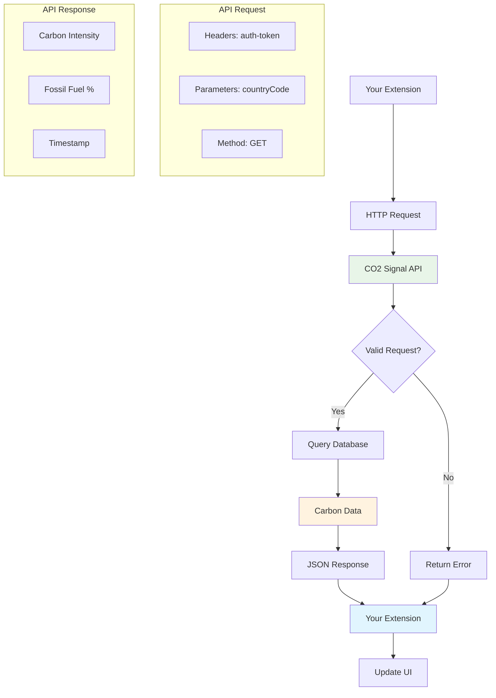
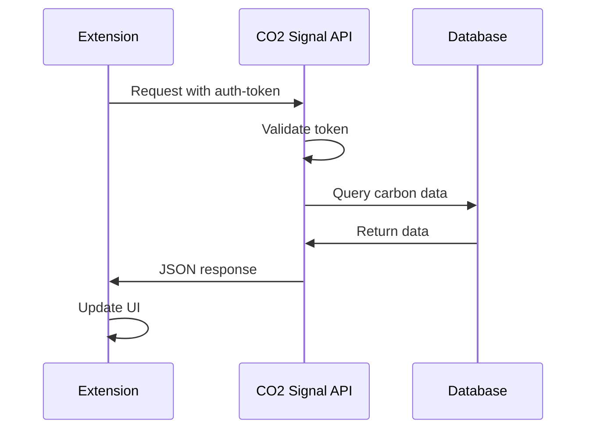
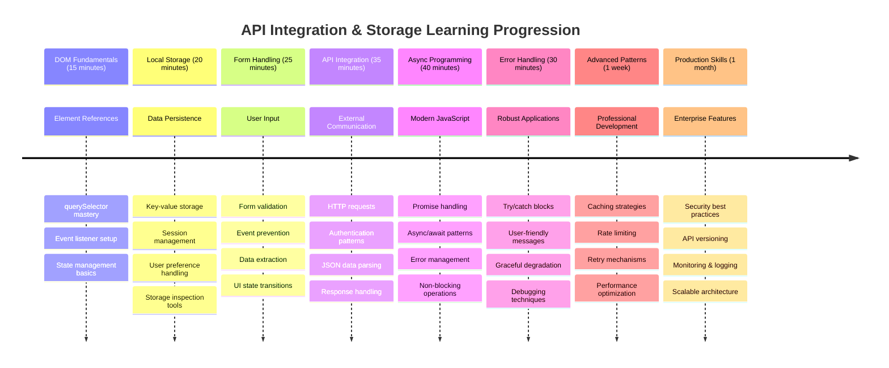

# ব্রাউজার এক্সটেনশন প্রকল্প পার্ট ২: API কল করা, লোকাল স্টোরেজ ব্যবহার করা



## প্রাক-লেকচার কুইজ

[প্রাক-লেকচার কুইজ](https://ff-quizzes.netlify.app/web/quiz/25)

## পরিচিতি

আপনার তৈরি করা ব্রাউজার এক্সটেনশনটি মনে আছে? এখন পর্যন্ত আপনার কাছে একটি সুন্দর ফর্ম আছে, কিন্তু এটি মূলত স্থির। আজ আমরা এটিকে জীবন্ত করে তুলব, বাস্তব ডেটার সাথে সংযোগ স্থাপন করে এবং এটিকে স্মৃতি প্রদান করে।

আপোলো মিশন কন্ট্রোল কম্পিউটারগুলির কথা ভাবুন - তারা শুধু স্থির তথ্য প্রদর্শন করেনি। তারা ক্রমাগত মহাকাশযানের সাথে যোগাযোগ করত, টেলিমেট্রি ডেটা আপডেট করত এবং গুরুত্বপূর্ণ মিশন প্যারামিটারগুলি মনে রাখত। আজ আমরা এই ধরনের গতিশীল আচরণ তৈরি করছি। আপনার এক্সটেনশনটি ইন্টারনেটে পৌঁছাবে, বাস্তব পরিবেশগত ডেটা সংগ্রহ করবে এবং আপনার সেটিংস পরবর্তীবারের জন্য মনে রাখবে।

API ইন্টিগ্রেশন জটিল মনে হতে পারে, তবে এটি মূলত আপনার কোডকে অন্যান্য পরিষেবাগুলির সাথে কীভাবে যোগাযোগ করতে হয় তা শেখানোর বিষয়। আপনি আবহাওয়ার ডেটা, সোশ্যাল মিডিয়া ফিড বা কার্বন ফুটপ্রিন্ট তথ্য সংগ্রহ করুন না কেন, এটি সবই এই ডিজিটাল সংযোগগুলি স্থাপনের বিষয়ে। আমরা কীভাবে ব্রাউজারগুলি তথ্য সংরক্ষণ করতে পারে তা অন্বেষণ করব - ঠিক যেমন লাইব্রেরিগুলি বইগুলি কোথায় রয়েছে তা মনে রাখতে কার্ড ক্যাটালগ ব্যবহার করেছে।

এই পাঠের শেষে, আপনার কাছে একটি ব্রাউজার এক্সটেনশন থাকবে যা বাস্তব ডেটা সংগ্রহ করে, ব্যবহারকারীর পছন্দগুলি সংরক্ষণ করে এবং একটি মসৃণ অভিজ্ঞতা প্রদান করে। চলুন শুরু করা যাক!



✅ আপনার কোড কোথায় স্থাপন করতে হবে তা জানতে উপযুক্ত ফাইলগুলিতে নম্বরযুক্ত অংশগুলি অনুসরণ করুন

## এক্সটেনশনে ম্যানিপুলেট করার উপাদানগুলি সেট আপ করুন

আপনার জাভাস্ক্রিপ্ট ইন্টারফেসটি ম্যানিপুলেট করার আগে, এটি নির্দিষ্ট HTML উপাদানগুলির রেফারেন্স প্রয়োজন। এটি এমন যেন একটি টেলিস্কোপকে নির্দিষ্ট তারাগুলির দিকে নির্দেশ করতে হবে - গ্যালিলিও জুপিটারের চাঁদগুলি অধ্যয়ন করার আগে, তাকে প্রথমে জুপিটারকে খুঁজে বের করতে এবং ফোকাস করতে হয়েছিল।

আপনার `index.js` ফাইলে, আমরা `const` ভেরিয়েবল তৈরি করব যা প্রতিটি গুরুত্বপূর্ণ ফর্ম উপাদানের রেফারেন্স ধারণ করে। এটি ঠিক যেমন বিজ্ঞানীরা তাদের সরঞ্জাম লেবেল করেন - প্রতিবার পুরো ল্যাবরেটরি অনুসন্ধান করার পরিবর্তে, তারা সরাসরি তাদের প্রয়োজনীয় জিনিসটি অ্যাক্সেস করতে পারে।



```javascript
// form fields
const form = document.querySelector('.form-data');
const region = document.querySelector('.region-name');
const apiKey = document.querySelector('.api-key');

// results
const errors = document.querySelector('.errors');
const loading = document.querySelector('.loading');
const results = document.querySelector('.result-container');
const usage = document.querySelector('.carbon-usage');
const fossilfuel = document.querySelector('.fossil-fuel');
const myregion = document.querySelector('.my-region');
const clearBtn = document.querySelector('.clear-btn');
```

**এই কোডটি যা করে:**
- **ফর্ম উপাদানগুলি** CSS ক্লাস সিলেক্টর সহ `document.querySelector()` ব্যবহার করে ক্যাপচার করে
- **ইনপুট ক্ষেত্রগুলির রেফারেন্স তৈরি করে** অঞ্চল নাম এবং API কী এর জন্য
- **কার্বন ব্যবহার ডেটার জন্য** ফলাফল প্রদর্শন উপাদানগুলির সাথে সংযোগ স্থাপন করে
- **UI উপাদানগুলিতে অ্যাক্সেস সেট আপ করে** যেমন লোডিং ইন্ডিকেটর এবং ত্রুটি বার্তা
- **প্রতিটি উপাদানের রেফারেন্স সংরক্ষণ করে** `const` ভেরিয়েবলে, যাতে আপনার কোডে সহজে পুনরায় ব্যবহার করা যায়

## ইভেন্ট লিসেনার যোগ করুন

এখন আমরা আপনার এক্সটেনশনটি ব্যবহারকারীর ক্রিয়াগুলির প্রতিক্রিয়া জানাতে তৈরি করব। ইভেন্ট লিসেনারগুলি হল আপনার কোডের উপায় যা ব্যবহারকারীর ইন্টারঅ্যাকশনগুলি পর্যবেক্ষণ করে। এটি ঠিক প্রাথমিক টেলিফোন এক্সচেঞ্জের অপারেটরদের মতো - তারা ইনকামিং কলের জন্য শুনত এবং কেউ সংযোগ করতে চাইলে সঠিক সার্কিটগুলি সংযুক্ত করত।



```javascript
form.addEventListener('submit', (e) => handleSubmit(e));
clearBtn.addEventListener('click', (e) => reset(e));
init();
```

**এই ধারণাগুলি বোঝা:**
- **ফর্মে একটি সাবমিট লিসেনার সংযুক্ত করে** যা ব্যবহারকারীরা Enter চাপলে বা সাবমিট ক্লিক করলে ট্রিগার হয়
- **ক্লিয়ার বোতামে একটি ক্লিক লিসেনার সংযুক্ত করে** ফর্মটি রিসেট করার জন্য
- **ইভেন্ট অবজেক্ট `(e)` পাস করে** হ্যান্ডলার ফাংশনগুলিতে অতিরিক্ত নিয়ন্ত্রণের জন্য
- **`init()` ফাংশনটি অবিলম্বে কল করে** আপনার এক্সটেনশনের প্রাথমিক অবস্থা সেট আপ করতে

✅ এখানে ব্যবহৃত সংক্ষিপ্ত অ্যারো ফাংশন সিনট্যাক্স লক্ষ্য করুন। এই আধুনিক জাভাস্ক্রিপ্ট পদ্ধতি ঐতিহ্যবাহী ফাংশন এক্সপ্রেশনের তুলনায় পরিষ্কার, তবে উভয়ই সমানভাবে কার্যকর!

### 🔄 **শিক্ষামূলক চেক-ইন**
**ইভেন্ট হ্যান্ডলিং বোঝা**: ইনিশিয়ালাইজেশনে যাওয়ার আগে নিশ্চিত করুন যে আপনি পারেন:
- ✅ কীভাবে `addEventListener` ব্যবহারকারীর ক্রিয়াগুলিকে জাভাস্ক্রিপ্ট ফাংশনের সাথে সংযুক্ত করে তা ব্যাখ্যা করতে
- ✅ কেন আমরা ইভেন্ট অবজেক্ট `(e)` হ্যান্ডলার ফাংশনগুলিতে পাস করি তা বুঝতে
- ✅ `submit` এবং `click` ইভেন্টগুলির মধ্যে পার্থক্য চিনতে
- ✅ `init()` ফাংশনটি কখন চালানো হয় এবং কেন তা বর্ণনা করতে

**দ্রুত স্ব-পরীক্ষা**: যদি আপনি ফর্ম জমা দেওয়ার সময় `e.preventDefault()` ভুলে যান তবে কী হবে?
*উত্তর: পৃষ্ঠা রিফ্রেশ হবে, সমস্ত জাভাস্ক্রিপ্ট অবস্থা হারাবে এবং ব্যবহারকারীর অভিজ্ঞতা ব্যাহত হবে*

## ইনিশিয়ালাইজেশন এবং রিসেট ফাংশন তৈরি করুন

আপনার এক্সটেনশনের জন্য ইনিশিয়ালাইজেশন লজিক তৈরি করা যাক। `init()` ফাংশনটি একটি জাহাজের নেভিগেশন সিস্টেমের মতো যা তার যন্ত্রগুলি পরীক্ষা করে - এটি বর্তমান অবস্থা নির্ধারণ করে এবং সেই অনুযায়ী ইন্টারফেসটি সামঞ্জস্য করে। এটি পরীক্ষা করে যে কেউ আগে আপনার এক্সটেনশনটি ব্যবহার করেছে কিনা এবং তাদের পূর্ববর্তী সেটিংস লোড করে।

`reset()` ফাংশন ব্যবহারকারীদের একটি নতুন শুরু প্রদান করে - ঠিক যেমন বিজ্ঞানীরা তাদের যন্ত্রগুলি পরীক্ষার মধ্যে রিসেট করেন যাতে পরিষ্কার ডেটা নিশ্চিত করা যায়।

```javascript
function init() {
	// Check if user has previously saved API credentials
	const storedApiKey = localStorage.getItem('apiKey');
	const storedRegion = localStorage.getItem('regionName');

	// Set extension icon to generic green (placeholder for future lesson)
	// TODO: Implement icon update in next lesson

	if (storedApiKey === null || storedRegion === null) {
		// First-time user: show the setup form
		form.style.display = 'block';
		results.style.display = 'none';
		loading.style.display = 'none';
		clearBtn.style.display = 'none';
		errors.textContent = '';
	} else {
		// Returning user: load their saved data automatically
		displayCarbonUsage(storedApiKey, storedRegion);
		results.style.display = 'none';
		form.style.display = 'none';
		clearBtn.style.display = 'block';
	}
}

function reset(e) {
	e.preventDefault();
	// Clear stored region to allow user to choose a new location
	localStorage.removeItem('regionName');
	// Restart the initialization process
	init();
}
```

**এখানে যা ঘটে তা ভেঙে দেখা:**
- **সংরক্ষিত API কী এবং অঞ্চলটি পুনরুদ্ধার করে** ব্রাউজারের লোকাল স্টোরেজ থেকে
- **পরীক্ষা করে** এটি প্রথমবারের ব্যবহারকারী (কোনও সংরক্ষিত ক্রেডেনশিয়াল নেই) নাকি ফিরে আসা ব্যবহারকারী
- **নতুন ব্যবহারকারীদের জন্য সেটআপ ফর্ম দেখায়** এবং অন্যান্য ইন্টারফেস উপাদান লুকিয়ে রাখে
- **সংরক্ষিত ডেটা স্বয়ংক্রিয়ভাবে লোড করে** ফিরে আসা ব্যবহারকারীদের জন্য এবং রিসেট বিকল্পটি প্রদর্শন করে
- **উপলব্ধ ডেটার উপর ভিত্তি করে** ব্যবহারকারীর ইন্টারফেসের অবস্থা পরিচালনা করে

**লোকাল স্টোরেজ সম্পর্কে মূল ধারণা:**
- **ডেটা সংরক্ষণ করে** ব্রাউজার সেশনের মধ্যে (সেশন স্টোরেজের বিপরীতে)
- **ডেটা সংরক্ষণ করে** কী-ভ্যালু জোড়া হিসাবে `getItem()` এবং `setItem()` ব্যবহার করে
- **`null` ফেরত দেয়** যখন কোনও নির্দিষ্ট কী-এর জন্য কোনও ডেটা বিদ্যমান থাকে না
- **ব্যবহারকারীর পছন্দ এবং সেটিংস মনে রাখার একটি সহজ উপায় প্রদান করে**

> 💡 **ব্রাউজার স্টোরেজ বোঝা**: [LocalStorage](https://developer.mozilla.org/docs/Web/API/Window/localStorage) আপনার এক্সটেনশনকে স্থায়ী মেমরি প্রদান করার মতো। প্রাচীন আলেকজান্দ্রিয়ার লাইব্রেরি স্ক্রোল সংরক্ষণ করত - তথ্য তখনও উপলব্ধ থাকত যখন পণ্ডিতরা চলে যেত এবং ফিরে আসত।
>
> **মূল বৈশিষ্ট্য:**
> - **ডেটা সংরক্ষণ করে** এমনকি আপনি ব্রাউজার বন্ধ করার পরেও
> - **কম্পিউটার রিস্টার্ট এবং ব্রাউজার ক্র্যাশের পরেও টিকে থাকে**
> - **ব্যবহারকারীর পছন্দের জন্য পর্যাপ্ত স্টোরেজ স্পেস প্রদান করে**
> - **নেটওয়ার্ক বিলম্ব ছাড়াই তাৎক্ষণিক অ্যাক্সেস প্রদান করে**

> **গুরুত্বপূর্ণ নোট**: আপনার ব্রাউজার এক্সটেনশনের নিজস্ব বিচ্ছিন্ন লোকাল স্টোরেজ রয়েছে যা নিয়মিত ওয়েব পেজ থেকে আলাদা। এটি নিরাপত্তা প্রদান করে এবং অন্যান্য ওয়েবসাইটের সাথে দ্বন্দ্ব প্রতিরোধ করে।

আপনার সংরক্ষিত ডেটা দেখতে ব্রাউজার ডেভেলপার টুলস (F12) খুলুন, **Application** ট্যাবে যান এবং **Local Storage** বিভাগটি প্রসারিত করুন।





> ⚠️ **নিরাপত্তা বিবেচনা**: প্রোডাকশন অ্যাপ্লিকেশনগুলিতে, LocalStorage-এ API কী সংরক্ষণ করা নিরাপত্তার ঝুঁকি তৈরি করে কারণ জাভাস্ক্রিপ্ট এই ডেটা অ্যাক্সেস করতে পারে। শেখার উদ্দেশ্যে, এই পদ্ধতি ঠিক আছে, তবে প্রকৃত অ্যাপ্লিকেশনগুলিতে সংবেদনশীল ক্রেডেনশিয়ালের জন্য নিরাপদ সার্ভার-সাইড স্টোরেজ ব্যবহার করা উচিত।

## ফর্ম জমা দেওয়া পরিচালনা করুন

এখন আমরা কী হবে তা পরিচালনা করব যখন কেউ আপনার ফর্ম জমা দেয়। ডিফল্টভাবে, ফর্ম জমা দেওয়া হলে ব্রাউজারগুলি পৃষ্ঠাটি রিফ্রেশ করে, তবে আমরা এই আচরণটি আটকাব যাতে একটি মসৃণ অভিজ্ঞতা তৈরি হয়।

এই পদ্ধতি মিশন কন্ট্রোল কীভাবে মহাকাশযানের যোগাযোগ পরিচালনা করে তার মতো - প্রতিটি ট্রান্সমিশনের জন্য পুরো সিস্টেমটি রিসেট করার পরিবর্তে, তারা নতুন তথ্য প্রক্রিয়াকরণের সময় ক্রমাগত অপারেশন বজায় রাখে।

একটি ফাংশন তৈরি করুন যা ফর্ম জমা দেওয়ার ইভেন্টটি ক্যাপচার করে এবং ব্যবহারকারীর ইনপুটটি বের করে:

```javascript
function handleSubmit(e) {
	e.preventDefault();
	setUpUser(apiKey.value, region.value);
}
```

**উপরের কোডে আমরা:**
- **ডিফল্ট ফর্ম জমা দেওয়ার আচরণ আটকাই** যা পৃষ্ঠাটি রিফ্রেশ করত
- **ব্যবহারকারীর ইনপুট মানগুলি বের করি** API কী এবং অঞ্চল ক্ষেত্র থেকে
- **ফর্ম ডেটা `setUpUser()` ফাংশনে পাস করি** প্রক্রিয়াকরণের জন্য
- **পৃষ্ঠার রিফ্রেশ এড়িয়ে** সিঙ্গেল-পেজ অ্যাপ্লিকেশন আচরণ বজায় রাখি

✅ মনে রাখবেন যে আপনার HTML ফর্ম ক্ষেত্রগুলিতে `required` অ্যাট্রিবিউট অন্তর্ভুক্ত রয়েছে, তাই ব্রাউজার স্বয়ংক্রিয়ভাবে নিশ্চিত করে যে ব্যবহারকারীরা এই ফাংশন চালানোর আগে API কী এবং অঞ্চল উভয়ই প্রদান করে।

## ব্যবহারকারীর পছন্দ সেট আপ করুন

`setUpUser` ফাংশনটি ব্যবহারকারীর ক্রেডেনশিয়াল সংরক্ষণ এবং প্রথম API কল শুরু করার জন্য দায়ী। এটি সেটআপ থেকে ফলাফল প্রদর্শনের জন্য একটি মসৃণ রূপান্তর তৈরি করে।

```javascript
function setUpUser(apiKey, regionName) {
	// Save user credentials for future sessions
	localStorage.setItem('apiKey', apiKey);
	localStorage.setItem('regionName', regionName);
	
	// Update UI to show loading state
	loading.style.display = 'block';
	errors.textContent = '';
	clearBtn.style.display = 'block';
	
	// Fetch carbon usage data with user's credentials
	displayCarbonUsage(apiKey, regionName);
}
```

**ধাপে ধাপে যা ঘটছে:**
- **API কী এবং অঞ্চল নাম লোকাল স্টোরেজে সংরক্ষণ করে** ভবিষ্যতের ব্যবহারের জন্য
- **লোডিং ইন্ডিকেটর দেখায়** ব্যবহারকারীদের জানাতে যে ডেটা সংগ্রহ করা হচ্ছে
- **পূর্ববর্তী ত্রুটি বার্তা মুছে ফেলে** প্রদর্শন থেকে
- **ক্লিয়ার বোতামটি প্রকাশ করে** ব্যবহারকারীদের তাদের সেটিংস পরে রিসেট করার জন্য
- **API কল শুরু করে** বাস্তব কার্বন ব্যবহার ডেটা সংগ্রহ করতে

এই ফাংশনটি ডেটা সংরক্ষণ এবং ব্যবহারকারীর ইন্টারফেস আপডেট উভয়ই একসাথে সমন্বিতভাবে পরিচালনা করে একটি মসৃণ ব্যবহারকারীর অভিজ্ঞতা তৈরি করে।

## কার্বন ব্যবহার ডেটা প্রদর্শন করুন

এখন আমরা আপনার এক্সটেনশনটি API-এর মাধ্যমে বাইরের ডেটা সোর্সের সাথে সংযুক্ত করব। এটি আপনার এক্সটেনশনকে একটি স্ট্যান্ডঅ্যালোন টুল থেকে এমন কিছুতে রূপান্তরিত করে যা ইন্টারনেট থেকে রিয়েল-টাইম তথ্য অ্যাক্সেস করতে পারে।

**API বোঝা**

[API](https://www.webopedia.com/TERM/A/API.html) হল কীভাবে বিভিন্ন অ্যাপ্লিকেশন একে অপরের সাথে যোগাযোগ করে। এটি ১৯ শতকে দূরবর্তী শহরগুলিকে সংযুক্ত করা টেলিগ্রাফ সিস্টেমের মতো - অপারেটররা দূরবর্তী স্টেশনে অনুরোধ পাঠাত এবং অনুরোধকৃত তথ্য সহ প্রতিক্রিয়া পেত। আপনি যখন সোশ্যাল মিডিয়া চেক করেন, ভয়েস অ্যাসিস্ট্যান্টকে প্রশ্ন করেন বা ডেলিভারি অ্যাপ ব্যবহার করেন, API-গুলি এই ডেটা বিনিময়গুলি সহজতর করে।



**REST API সম্পর্কে মূল ধারণা:**
- **REST** এর অর্থ 'Representational State Transfer'
- **স্ট্যান্ডার্ড HTTP পদ্ধতি ব্যবহার করে** (GET, POST, PUT, DELETE) ডেটার সাথে ইন্টারঅ্যাক্ট করতে
- **ডেটা ফেরত দেয়** পূর্বানুমানযোগ্য ফরম্যাটে, সাধারণত JSON
- **নির্দিষ্ট URL-ভিত্তিক এন্ডপয়েন্ট প্রদান করে** বিভিন্ন ধরনের অনুরোধের জন্য

✅ [CO2 Signal API](https://www.co2signal.com/) আমরা ব্যবহার করব, এটি বৈদ্যুতিক গ্রিড থেকে বিশ্বব্যাপী রিয়েল-টাইম কার্বন তীব্রতা ডেটা প্রদান করে। এটি ব্যবহারকারীদের তাদের বিদ্যুৎ ব্যবহারের পরিবেশগত প্রভাব বুঝতে সাহায্য করে!

> 💡 **অ্যাসিঙ্ক্রোনাস জাভাস্ক্রিপ্ট বোঝা**: [`async` কীওয়ার্ড](https://developer.mozilla.org/docs/Web/JavaScript/Reference/Statements/async_function) আপনার কোডকে একাধিক অপারেশন একসাথে পরিচালনা করতে সক্ষম করে। যখন আপনি সার্ভার থেকে ডেটা অনুরোধ করেন, আপনি চান না যে আপনার পুরো এক্সটেনশনটি স্থির হয়ে যাক - এটি ঠিক যেন এয়ার ট্রাফিক কন্ট্রোল একটি প্লেনের প্রতিক্রিয়ার জন্য অপেক্ষা করার সময় সমস্ত অপারেশন বন্ধ করে দেয়।
>
> **মূল সুবিধা:**
> - **এক্সটেনশনের প্রতিক্রিয়াশীলতা বজায় রাখে** ডেটা লোড হওয়ার সময়
> - **অন্যান্য কোড চালিয়ে যেতে দেয়** নেটওয়ার্ক অনুরোধের সময়
> - **কোডের পাঠযোগ্যতা উন্নত করে** ঐতিহ্যবাহী কলব্যাক প্যাটার্নের তুলনায়
> - **নেটওয়ার্ক সমস্যার জন্য** গ্রেসফুল ত্রুটি পরিচালনা সক্ষম করে

এখানে `async` সম্পর্কে একটি দ্রুত ভিডিও:

[](https://youtube.com/watch?v=YwmlRkrxvkk "Async এবং Await প্রমিজ পরিচালনার জন্য")

> 🎥 উপরের ছবিতে ক্লিক করুন `async/await` সম্পর্কে একটি ভিডিওর জন্য।

### 🔄 **শিক্ষামূলক চেক-ইন**
**অ্যাসিঙ্ক প্রোগ্রামিং বোঝা**: API ফাংশনে যাওয়ার আগে নিশ্চিত করুন যে আপনি বুঝতে পারেন:
- ✅ কেন আমরা `async/await` ব্যবহার করি পুরো এক্সটেনশনটি স্থির না করার জন্য
- ✅ কীভাবে `try/catch` ব্লকগুলি নেটওয়ার্ক ত্রুটি গ্রেসফুলভাবে পরিচালনা করে
- ✅ সিঙ্ক্রোনাস এবং অ্যাসিঙ্ক্রোনাস অপারেশনের মধ্যে পার্থক্য
- ✅ কেন API কল ব্যর্থ হতে পারে এবং কীভাবে সেই ব্যর্থতাগুলি পরিচালনা করা যায়

**বাস্তব জীবনের সংযোগ**: এই দৈনন্দিন অ্যাসিঙ্ক উদাহরণগুলি বিবেচনা করুন:
- **খাবার অর্ডার করা**: আপনি রান্নাঘরের পাশে অপেক্ষা করেন না - আপনি একটি রসিদ পান এবং অন্যান্য কার্যক্রম চালিয়ে যান
- **ইমেইল পাঠানো**: আপনার ইমেইল অ্যাপ পাঠানোর সময় স্থির হয় না - আপনি আরও ইমেইল লিখতে পারেন
- **ওয়েব পেজ লোড করা**: আপনি ইতিমধ্যে টেক্সট পড়তে পারেন যখন ছবি ধীরে ধীরে লোড হয়

**API প্রমাণীকরণ প্রবাহ**:


কার্বন ব্যবহার ডেটা সংগ্রহ এবং প্রদর্শনের জন্য ফাংশন তৈরি করুন:

```javascript
// Modern fetch API approach (no external dependencies needed)
async function displayCarbonUsage(apiKey, region) {
	try {
		// Fetch carbon intensity data from CO2 Signal API
		const response = await fetch('https://api.co2signal.com/v1/latest', {
			method: 'GET',
			headers: {
				'auth-token': apiKey,
				'Content-Type': 'application/json'
			},
			// Add query parameters for the specific region
			...new URLSearchParams({ countryCode: region }) && {
				url: `https://api.co2signal.com/v1/latest?countryCode=${region}`
			}
		});

		// Check if the API request was successful
		if (!response.ok) {
			throw new Error(`API request failed: ${response.status}`);
		}

		const data = await response.json();
		const carbonData = data.data;

		// Calculate rounded carbon intensity value
		const carbonIntensity = Math.round(carbonData.carbonIntensity);

		// Update the user interface with fetched data
		loading.style.display = 'none';
		form.style.display = 'none';
		myregion.textContent = region.toUpperCase();
		usage.textContent = `${carbonIntensity} grams (grams CO₂ emitted per kilowatt hour)`;
		fossilfuel.textContent = `${carbonData.fossilFuelPercentage.toFixed(2)}% (percentage of fossil fuels used to generate electricity)`;
		results.style.display = 'block';

		// TODO: calculateColor(carbonIntensity) - implement in next lesson

	} catch (error) {
		console.error('Error fetching carbon data:', error);
		
		// Show user-friendly error message
		loading.style.display = 'none';
		results.style.display = 'none';
		errors.textContent = 'Sorry, we couldn\'t fetch data for that region. Please check your API key and region code.';
	}
}
```

**এখানে যা ঘটে তা ভেঙে দেখা:**
- **আধুনিক `fetch()` API ব্যবহার করে** বাইরের লাইব্রেরি যেমন Axios ছাড়াই পরিষ
**বর্ণনা:** ব্রাউজার এক্সটেনশন উন্নত করুন ত্রুটি পরিচালনা উন্নতি এবং ব্যবহারকারীর অভিজ্ঞতা বৈশিষ্ট্য যোগ করে। এই চ্যালেঞ্জটি আপনাকে API, লোকাল স্টোরেজ এবং DOM ম্যানিপুলেশন নিয়ে আধুনিক জাভাস্ক্রিপ্ট প্যাটার্ন ব্যবহার করার অনুশীলন করতে সাহায্য করবে।

**প্রম্পট:** displayCarbonUsage ফাংশনের একটি উন্নত সংস্করণ তৈরি করুন যা অন্তর্ভুক্ত করবে: ১) API কল ব্যর্থ হলে পুনরায় চেষ্টা করার একটি মেকানিজম যা এক্সপোনেনশিয়াল ব্যাকঅফ ব্যবহার করবে, ২) API কল করার আগে অঞ্চল কোডের ইনপুট যাচাই, ৩) একটি লোডিং অ্যানিমেশন এবং প্রগ্রেস ইন্ডিকেটর, ৪) API রেসপন্সগুলোকে localStorage-এ ৩০ মিনিটের মেয়াদ সহ ক্যাশিং করা, এবং ৫) পূর্ববর্তী API কল থেকে ঐতিহাসিক ডেটা প্রদর্শনের একটি ফিচার। এছাড়াও, TypeScript-স্টাইল JSDoc মন্তব্য যোগ করুন যা সমস্ত ফাংশন প্যারামিটার এবং রিটার্ন টাইপ ডকুমেন্ট করবে।

[agent mode](https://code.visualstudio.com/blogs/2025/02/24/introducing-copilot-agent-mode) সম্পর্কে আরও জানুন এখানে।

## 🚀 চ্যালেঞ্জ

API সম্পর্কে আপনার জ্ঞান প্রসারিত করুন এবং ওয়েব ডেভেলপমেন্টের জন্য ব্রাউজার-ভিত্তিক API-এর সম্পদ অন্বেষণ করুন। এই ব্রাউজার API-গুলোর একটি নির্বাচন করুন এবং একটি ছোট ডেমো তৈরি করুন:

- [Geolocation API](https://developer.mozilla.org/docs/Web/API/Geolocation_API) - ব্যবহারকারীর বর্তমান অবস্থান পান
- [Notification API](https://developer.mozilla.org/docs/Web/API/Notifications_API) - ডেস্কটপ নোটিফিকেশন পাঠান
- [HTML Drag and Drop API](https://developer.mozilla.org/docs/Web/API/HTML_Drag_and_Drop_API) - ইন্টারঅ্যাকটিভ ড্র্যাগ ইন্টারফেস তৈরি করুন
- [Web Storage API](https://developer.mozilla.org/docs/Web/API/Web_Storage_API) - উন্নত লোকাল স্টোরেজ কৌশল
- [Fetch API](https://developer.mozilla.org/docs/Web/API/Fetch_API) - XMLHttpRequest-এর আধুনিক বিকল্প

**গবেষণার প্রশ্নগুলো বিবেচনা করুন:**
- এই API কোন বাস্তব সমস্যাগুলো সমাধান করে?
- API কীভাবে ত্রুটি এবং প্রান্তিক ক্ষেত্রে পরিচালনা করে?
- এই API ব্যবহার করার সময় কী কী নিরাপত্তা বিবেচনা রয়েছে?
- বিভিন্ন ব্রাউজারে এই API কতটা সমর্থিত?

গবেষণার পরে, একটি API কীভাবে ডেভেলপার-বন্ধুত্বপূর্ণ এবং নির্ভরযোগ্য হয় তা চিহ্নিত করুন।

## পোস্ট-লেকচার কুইজ

[পোস্ট-লেকচার কুইজ](https://ff-quizzes.netlify.app/web/quiz/26)

## রিভিউ এবং স্ব-অধ্যয়ন

এই পাঠে আপনি LocalStorage এবং API সম্পর্কে শিখেছেন, যা একজন পেশাদার ওয়েব ডেভেলপারের জন্য খুবই কার্যকর। আপনি কি ভাবতে পারেন কীভাবে এই দুটি জিনিস একসাথে কাজ করে? একটি ওয়েবসাইট কীভাবে স্থাপত্য করা যায় যা API দ্বারা ব্যবহৃত আইটেম সংরক্ষণ করবে তা নিয়ে চিন্তা করুন।

### ⚡ **পরবর্তী ৫ মিনিটে আপনি যা করতে পারেন**
- [ ] DevTools-এর Application ট্যাব খুলুন এবং যেকোনো ওয়েবসাইটে localStorage অন্বেষণ করুন
- [ ] একটি সাধারণ HTML ফর্ম তৈরি করুন এবং ব্রাউজারে ফর্ম যাচাই পরীক্ষা করুন
- [ ] ব্রাউজার কনসোলে localStorage ব্যবহার করে ডেটা সংরক্ষণ এবং পুনরুদ্ধার করার চেষ্টা করুন
- [ ] নেটওয়ার্ক ট্যাব ব্যবহার করে ফর্ম ডেটা জমা দেওয়ার প্রক্রিয়া পরীক্ষা করুন

### 🎯 **পরবর্তী এক ঘণ্টায় আপনি যা অর্জন করতে পারেন**
- [ ] পোস্ট-লেসন কুইজ সম্পন্ন করুন এবং ফর্ম হ্যান্ডলিং ধারণাগুলো বুঝুন
- [ ] একটি ব্রাউজার এক্সটেনশন ফর্ম তৈরি করুন যা ব্যবহারকারীর পছন্দ সংরক্ষণ করে
- [ ] ক্লায়েন্ট-সাইড ফর্ম যাচাই সহ সহায়ক ত্রুটি বার্তা বাস্তবায়ন করুন
- [ ] এক্সটেনশন ডেটা সংরক্ষণের জন্য chrome.storage API ব্যবহার অনুশীলন করুন
- [ ] একটি ব্যবহারকারী ইন্টারফেস তৈরি করুন যা সংরক্ষিত ব্যবহারকারীর সেটিংসের প্রতিক্রিয়া জানায়

### 📅 **আপনার সপ্তাহব্যাপী এক্সটেনশন নির্মাণ**
- [ ] ফর্ম কার্যকারিতাসহ একটি পূর্ণাঙ্গ ব্রাউজার এক্সটেনশন সম্পন্ন করুন
- [ ] বিভিন্ন স্টোরেজ অপশন আয়ত্ত করুন: local, sync, এবং session storage
- [ ] উন্নত ফর্ম বৈশিষ্ট্য যেমন অটোকমপ্লিট এবং যাচাই বাস্তবায়ন করুন
- [ ] ব্যবহারকারীর ডেটার জন্য ইমপোর্ট/এক্সপোর্ট কার্যকারিতা যোগ করুন
- [ ] বিভিন্ন ব্রাউজারে আপনার এক্সটেনশনটি সম্পূর্ণভাবে পরীক্ষা করুন
- [ ] আপনার এক্সটেনশনের ব্যবহারকারীর অভিজ্ঞতা এবং ত্রুটি পরিচালনা উন্নত করুন

### 🌟 **আপনার মাসব্যাপী ওয়েব API দক্ষতা**
- [ ] বিভিন্ন ব্রাউজার স্টোরেজ API ব্যবহার করে জটিল অ্যাপ্লিকেশন তৈরি করুন
- [ ] অফলাইন-প্রথম ডেভেলপমেন্ট প্যাটার্ন সম্পর্কে জানুন
- [ ] ডেটা সংরক্ষণ জড়িত ওপেন সোর্স প্রকল্পে অবদান রাখুন
- [ ] গোপনীয়তা-কেন্দ্রিক ডেভেলপমেন্ট এবং GDPR সম্মতি আয়ত্ত করুন
- [ ] ফর্ম হ্যান্ডলিং এবং ডেটা ম্যানেজমেন্টের জন্য পুনরায় ব্যবহারযোগ্য লাইব্রেরি তৈরি করুন
- [ ] ওয়েব API এবং এক্সটেনশন ডেভেলপমেন্ট সম্পর্কে জ্ঞান শেয়ার করুন

## 🎯 আপনার এক্সটেনশন ডেভেলপমেন্ট দক্ষতার টাইমলাইন



### 🛠️ আপনার ফুল-স্ট্যাক ডেভেলপমেন্ট টুলকিট সারসংক্ষেপ

এই পাঠ সম্পন্ন করার পরে, আপনার কাছে এখন রয়েছে:
- **DOM দক্ষতা**: সুনির্দিষ্ট এলিমেন্ট টার্গেটিং এবং ম্যানিপুলেশন
- **স্টোরেজ দক্ষতা**: localStorage দিয়ে স্থায়ী ডেটা ম্যানেজমেন্ট
- **API ইন্টিগ্রেশন**: রিয়েল-টাইম ডেটা ফেচিং এবং অথেনটিকেশন
- **অ্যাসিঙ্ক প্রোগ্রামিং**: আধুনিক জাভাস্ক্রিপ্ট দিয়ে নন-ব্লকিং অপারেশন
- **ত্রুটি পরিচালনা**: ত্রুটি সুন্দরভাবে পরিচালনা করে এমন শক্তিশালী অ্যাপ্লিকেশন
- **ব্যবহারকারীর অভিজ্ঞতা**: লোডিং স্টেট, যাচাই, এবং মসৃণ ইন্টারঅ্যাকশন
- **আধুনিক প্যাটার্ন**: fetch API, async/await, এবং ES6+ বৈশিষ্ট্য

**পেশাদার দক্ষতা অর্জন:** আপনি নিম্নলিখিত ক্ষেত্রে প্যাটার্ন বাস্তবায়ন করেছেন:
- **ওয়েব অ্যাপ্লিকেশন**: একক-পৃষ্ঠার অ্যাপ্লিকেশন যা বাহ্যিক ডেটা উৎস ব্যবহার করে
- **মোবাইল ডেভেলপমেন্ট**: API-চালিত অ্যাপ্লিকেশন যা অফলাইন সক্ষমতা সহ
- **ডেস্কটপ সফটওয়্যার**: Electron অ্যাপ্লিকেশন যা স্থায়ী স্টোরেজ ব্যবহার করে
- **এন্টারপ্রাইজ সিস্টেম**: অথেনটিকেশন, ক্যাশিং, এবং ত্রুটি পরিচালনা
- **আধুনিক ফ্রেমওয়ার্ক**: React/Vue/Angular ডেটা ম্যানেজমেন্ট প্যাটার্ন

**পরবর্তী স্তর:** আপনি এখন উন্নত বিষয়গুলো অন্বেষণ করতে প্রস্তুত যেমন ক্যাশিং কৌশল, রিয়েল-টাইম WebSocket সংযোগ, বা জটিল স্টেট ম্যানেজমেন্ট!

## অ্যাসাইনমেন্ট

[একটি API গ্রহণ করুন](assignment.md)

---

**অস্বীকৃতি**:  
এই নথিটি AI অনুবাদ পরিষেবা [Co-op Translator](https://github.com/Azure/co-op-translator) ব্যবহার করে অনুবাদ করা হয়েছে। আমরা যথাসাধ্য সঠিকতার জন্য চেষ্টা করি, তবে অনুগ্রহ করে মনে রাখবেন যে স্বয়ংক্রিয় অনুবাদে ত্রুটি বা অসঙ্গতি থাকতে পারে। মূল ভাষায় থাকা নথিটিকে প্রামাণিক উৎস হিসেবে বিবেচনা করা উচিত। গুরুত্বপূর্ণ তথ্যের জন্য, পেশাদার মানব অনুবাদ সুপারিশ করা হয়। এই অনুবাদ ব্যবহারের ফলে কোনো ভুল বোঝাবুঝি বা ভুল ব্যাখ্যা হলে আমরা দায়বদ্ধ থাকব না।