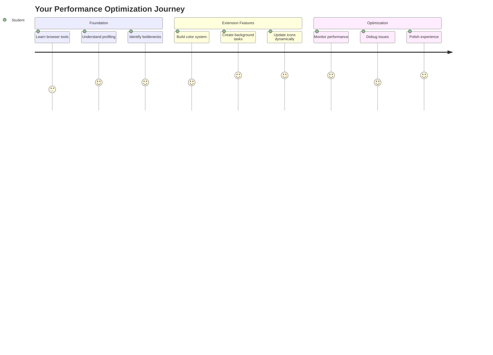
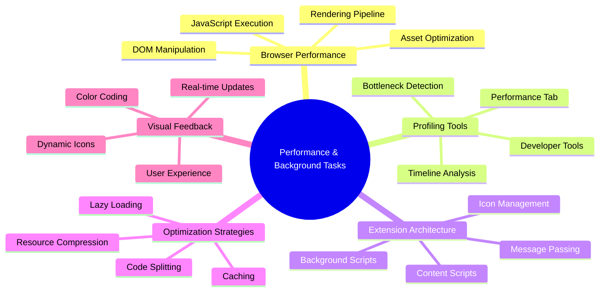
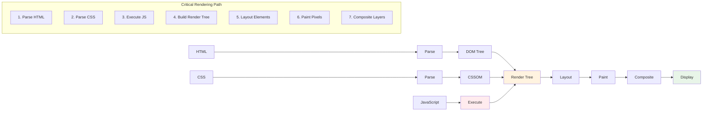
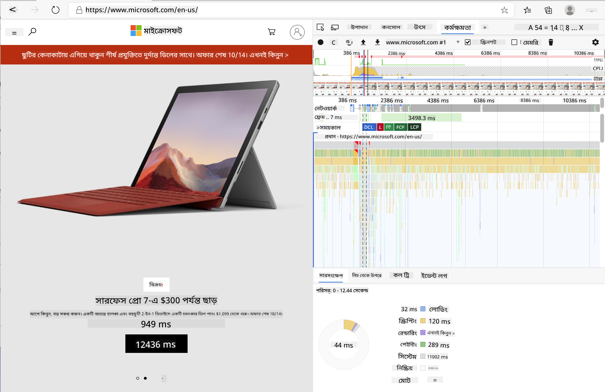
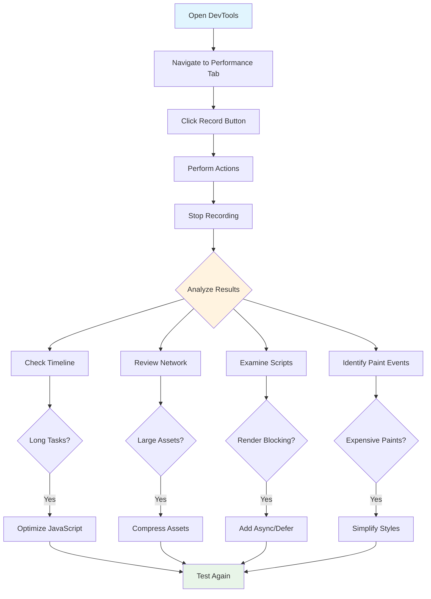
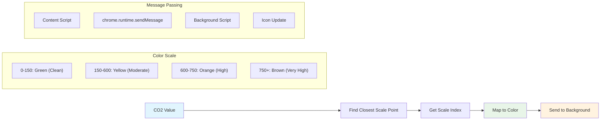
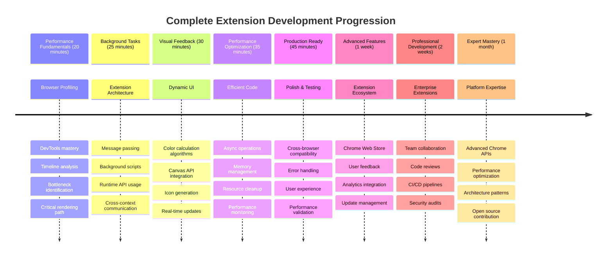

<!--
CO_OP_TRANSLATOR_METADATA:
{
  "original_hash": "b275fed2c6fc90d2b9b6661a3225faa2",
  "translation_date": "2025-11-03T23:06:50+00:00",
  "source_file": "5-browser-extension/3-background-tasks-and-performance/README.md",
  "language_code": "bn"
}
-->
# ব্রাউজার এক্সটেনশন প্রকল্প অংশ ৩: ব্যাকগ্রাউন্ড টাস্ক এবং পারফরম্যান্স সম্পর্কে জানুন



কখনও ভেবেছেন কেন কিছু ব্রাউজার এক্সটেনশন দ্রুত এবং প্রতিক্রিয়াশীল মনে হয়, আর অন্যগুলো ধীরগতির? এর রহস্য লুকিয়ে আছে পর্দার আড়ালে। যখন ব্যবহারকারীরা আপনার এক্সটেনশনের ইন্টারফেসে ক্লিক করেন, তখন ব্যাকগ্রাউন্ডে ডেটা সংগ্রহ, আইকন আপডেট এবং সিস্টেম রিসোর্স ব্যবস্থাপনার একটি সম্পূর্ণ জগৎ কাজ করে।

এটি আমাদের ব্রাউজার এক্সটেনশন সিরিজের চূড়ান্ত পাঠ, এবং আমরা আপনার কার্বন ফুটপ্রিন্ট ট্র্যাকারটি মসৃণভাবে কাজ করার জন্য তৈরি করব। আপনি ডায়নামিক আইকন আপডেট যোগ করবেন এবং পারফরম্যান্স সমস্যাগুলি কীভাবে চিহ্নিত করবেন তা শিখবেন যাতে সেগুলি সমস্যা হয়ে ওঠার আগেই সমাধান করা যায়। এটি একটি রেস কার টিউন করার মতো - ছোট ছোট অপ্টিমাইজেশনগুলি সবকিছু কীভাবে চলে তার উপর বিশাল প্রভাব ফেলতে পারে।

আমরা যখন শেষ করব, তখন আপনার কাছে একটি পরিপাটি এক্সটেনশন থাকবে এবং পারফরম্যান্সের নীতিগুলি বুঝতে পারবেন যা ভালো ওয়েব অ্যাপ এবং চমৎকার ওয়েব অ্যাপের মধ্যে পার্থক্য তৈরি করে। চলুন ব্রাউজার অপ্টিমাইজেশনের জগতে ডুব দেই।

## প্রি-লেকচার কুইজ

[প্রি-লেকচার কুইজ](https://ff-quizzes.netlify.app/web/quiz/27)

### ভূমিকা

আমাদের আগের পাঠে, আপনি একটি ফর্ম তৈরি করেছেন, এটিকে একটি API এর সাথে সংযুক্ত করেছেন এবং অ্যাসিঙ্ক্রোনাস ডেটা সংগ্রহের সমস্যাগুলি মোকাবিলা করেছেন। আপনার এক্সটেনশনটি সুন্দরভাবে আকার নিচ্ছে।

এখন আমাদের চূড়ান্ত স্পর্শ যোগ করতে হবে - যেমন কার্বন ডেটার উপর ভিত্তি করে সেই এক্সটেনশন আইকনটি রঙ পরিবর্তন করা। এটি আমাকে মনে করিয়ে দেয় কীভাবে NASA অ্যাপোলো মহাকাশযানের প্রতিটি সিস্টেম অপ্টিমাইজ করতে হয়েছিল। তারা কোনো সাইকেল বা মেমোরি নষ্ট করার সামর্থ্য রাখত না কারণ পারফরম্যান্সের উপর জীবন নির্ভর করত। যদিও আমাদের ব্রাউজার এক্সটেনশন এতটা গুরুত্বপূর্ণ নয়, একই নীতিগুলি প্রযোজ্য - দক্ষ কোড ভালো ব্যবহারকারীর অভিজ্ঞতা তৈরি করে।



## ওয়েব পারফরম্যান্সের মৌলিক বিষয়

যখন আপনার কোড দক্ষতার সাথে চলে, তখন মানুষ আসলেই পার্থক্য অনুভব করতে পারে। আপনি জানেন সেই মুহূর্তটি যখন একটি পৃষ্ঠা তাত্ক্ষণিকভাবে লোড হয় বা একটি অ্যানিমেশন মসৃণভাবে চলে? এটি ভালো পারফরম্যান্সের কাজ।

পারফরম্যান্স শুধুমাত্র গতি সম্পর্কে নয় - এটি এমন ওয়েব অভিজ্ঞতা তৈরি করার বিষয়ে যা ক্লান্তিকর এবং হতাশাজনক নয় বরং স্বাভাবিক মনে হয়। কম্পিউটিংয়ের প্রাথমিক দিনগুলিতে, গ্রেস হপার বিখ্যাতভাবে তার ডেস্কে একটি ন্যানোসেকেন্ড (এক ফুট লম্বা তারের একটি টুকরো) রেখেছিলেন দেখানোর জন্য যে এক বিলিয়ন ভাগের এক সেকেন্ডে আলো কতটা দূরত্ব অতিক্রম করে। এটি ছিল তার ব্যাখ্যা করার উপায় যে কম্পিউটিংয়ে প্রতিটি মাইক্রোসেকেন্ড কেন গুরুত্বপূর্ণ। চলুন আমরা সেই ডিটেকটিভ টুলগুলি অন্বেষণ করি যা আপনাকে বুঝতে সাহায্য করে কী জিনিসগুলি ধীর করে দিচ্ছে।

> "ওয়েবসাইট পারফরম্যান্স দুটি বিষয়ে: পৃষ্ঠা কত দ্রুত লোড হয় এবং এর কোড কত দ্রুত চলে।" -- [জ্যাক গ্রোসবার্ট](https://www.smashingmagazine.com/2012/06/javascript-profiling-chrome-developer-tools/)

আপনার ওয়েবসাইটকে সব ধরনের ডিভাইসে, সব ধরনের ব্যবহারকারীর জন্য, সব ধরনের পরিস্থিতিতে অত্যন্ত দ্রুত করার বিষয়টি বিস্তৃত। এখানে কিছু পয়েন্ট রয়েছে যা আপনাকে একটি সাধারণ ওয়েব প্রকল্প বা ব্রাউজার এক্সটেনশন তৈরি করার সময় মনে রাখতে হবে।

আপনার সাইট অপ্টিমাইজ করার প্রথম ধাপ হল বুঝতে পারা যে আসলে ভিতরে কী ঘটছে। সৌভাগ্যক্রমে, আপনার ব্রাউজারে শক্তিশালী ডিটেকটিভ টুলগুলি তৈরি করা আছে।



Edge-এ ডেভেলপার টুলস খুলতে, উপরের ডান কোণে তিনটি ডট ক্লিক করুন, তারপর More Tools > Developer Tools-এ যান। অথবা কীবোর্ড শর্টকাট ব্যবহার করুন: Windows-এ `Ctrl` + `Shift` + `I` বা Mac-এ `Option` + `Command` + `I`। একবার সেখানে গেলে, Performance ট্যাবে ক্লিক করুন - এখানেই আপনি আপনার তদন্ত করবেন।

**এখানে আপনার পারফরম্যান্স ডিটেকটিভ টুলকিট:**
- **খুলুন** ডেভেলপার টুলস (ডেভেলপার হিসেবে আপনি এগুলি ক্রমাগত ব্যবহার করবেন!)
- **Performance ট্যাবে যান** - এটি আপনার ওয়েব অ্যাপের ফিটনেস ট্র্যাকার
- **রেকর্ড বোতামটি চাপুন** এবং আপনার পৃষ্ঠার কার্যকলাপ দেখুন
- **ফলাফলগুলি অধ্যয়ন করুন** কী জিনিসগুলি ধীর করে দিচ্ছে তা চিহ্নিত করতে

চলুন এটি চেষ্টা করি। একটি ওয়েবসাইট খুলুন (Microsoft.com ভালো কাজ করবে) এবং 'রেকর্ড' বোতামটি ক্লিক করুন। এখন পৃষ্ঠাটি রিফ্রেশ করুন এবং প্রোফাইলারটি যা ঘটছে তা ক্যাপচার করতে দিন। যখন আপনি রেকর্ডিং বন্ধ করবেন, তখন আপনি একটি বিস্তারিত বিশ্লেষণ দেখতে পাবেন যে ব্রাউজার কীভাবে সাইটটি 'স্ক্রিপ্ট', 'রেন্ডার' এবং 'পেইন্ট' করে। এটি আমাকে মনে করিয়ে দেয় কীভাবে মিশন কন্ট্রোল একটি রকেট উৎক্ষেপণের সময় প্রতিটি সিস্টেম পর্যবেক্ষণ করে - আপনি ঠিক কী ঘটছে এবং কখন ঘটছে তার রিয়েল-টাইম ডেটা পান।



✅ [Microsoft ডকুমেন্টেশন](https://docs.microsoft.com/microsoft-edge/devtools-guide/performance/?WT.mc_id=academic-77807-sagibbon) আরও বিস্তারিত তথ্য প্রদান করে যদি আপনি গভীরভাবে জানতে চান

> প্রো টিপ: প্রথমবারের দর্শকদের জন্য আপনার সাইট কীভাবে পারফর্ম করে তা দেখতে পরীক্ষার আগে আপনার ব্রাউজারের ক্যাশ পরিষ্কার করুন - এটি সাধারণত পুনরায় দর্শনের চেয়ে বেশ আলাদা!

প্রোফাইল টাইমলাইনের উপাদানগুলি নির্বাচন করুন যাতে আপনার পৃষ্ঠাটি লোড হওয়ার সময় কী কী ঘটনা ঘটে তা জুম ইন করে দেখতে পারেন।

আপনার পৃষ্ঠার পারফরম্যান্সের একটি স্ন্যাপশট পেতে প্রোফাইল টাইমলাইনের একটি অংশ নির্বাচন করুন এবং সারাংশ প্যানটি দেখুন:


ইভেন্ট লগ প্যানটি পরীক্ষা করুন দেখতে কোনো ইভেন্ট ১৫ মিলিসেকেন্ডের বেশি সময় নিয়েছে কিনা:


✅ আপনার প্রোফাইলারটি চিনুন! এই সাইটে ডেভেলপার টুলস খুলুন এবং দেখুন কোনো বাধা আছে কিনা। কোন সম্পদটি সবচেয়ে ধীর লোড হচ্ছে? সবচেয়ে দ্রুত?



## প্রোফাইলিংয়ের সময় কী খুঁজতে হবে

প্রোফাইলার চালানো কেবল শুরু - আসল দক্ষতা হল এই রঙিন চার্টগুলি আসলে কী বলছে তা জানা। চিন্তা করবেন না, আপনি এগুলি পড়ার অভ্যাস করে ফেলবেন। অভিজ্ঞ ডেভেলপাররা সমস্যাগুলি বড় আকার ধারণ করার আগেই সতর্ক সংকেতগুলি চিহ্নিত করতে শিখেছেন।

চলুন সাধারণ সন্দেহভাজনদের কথা বলি - পারফরম্যান্স সমস্যাগুলি যা ওয়েব প্রকল্পে প্রবেশ করার প্রবণতা রাখে। যেমন মেরি কুরি তার ল্যাবে রেডিয়েশন লেভেল মনিটর করতে হয়েছিল, তেমনি আমাদের কিছু প্যাটার্নের দিকে নজর রাখতে হবে যা সমস্যার ইঙ্গিত দেয়। এগুলি আগে থেকে চিহ্নিত করা আপনাকে (এবং আপনার ব্যবহারকারীদের) অনেক হতাশা থেকে বাঁচাবে।

**অ্যাসেট সাইজ**: ওয়েবসাইটগুলি বছরের পর বছর ধরে "ভারী" হয়ে উঠছে, এবং এর বেশিরভাগ অতিরিক্ত ওজন চিত্র থেকে আসে। এটি এমন যেন আমরা আমাদের ডিজিটাল স্যুটকেসে আরও বেশি করে জিনিস ভরছি।

✅ [ইন্টারনেট আর্কাইভ](https://httparchive.org/reports/page-weight) পরীক্ষা করুন দেখতে পৃষ্ঠার সাইজগুলি সময়ের সাথে কীভাবে বৃদ্ধি পেয়েছে - এটি বেশ প্রকাশক।

**অ্যাসেট অপ্টিমাইজ করার উপায়:**
- **কমপ্রেস করুন** চিত্রগুলি! WebP-এর মতো আধুনিক ফরম্যাট ফাইল সাইজ উল্লেখযোগ্যভাবে কমাতে পারে
- **প্রতিটি ডিভাইসের জন্য** সঠিক চিত্র সাইজ পরিবেশন করুন - ফোনে বড় ডেস্কটপ চিত্র পাঠানোর দরকার নেই
- **মিনিফাই করুন** আপনার CSS এবং JavaScript - প্রতিটি বাইট গুরুত্বপূর্ণ
- **লেজি লোডিং ব্যবহার করুন** যাতে ব্যবহারকারীরা স্ক্রোল করার সময়ই চিত্রগুলি ডাউনলোড হয়

**DOM ট্রাভার্সাল**: ব্রাউজারকে তার ডকুমেন্ট অবজেক্ট মডেল তৈরি করতে হয় আপনার লেখা কোডের ভিত্তিতে, তাই ভালো পৃষ্ঠার পারফরম্যান্সের স্বার্থে আপনার ট্যাগগুলি কম রাখা উচিত, শুধুমাত্র পৃষ্ঠার প্রয়োজনীয় অংশ ব্যবহার এবং স্টাইল করা উচিত। যেমন, একটি পৃষ্ঠার সাথে সম্পর্কিত অতিরিক্ত CSS অপ্টিমাইজ করা যেতে পারে; যে স্টাইলগুলি শুধুমাত্র একটি পৃষ্ঠায় ব্যবহার করার প্রয়োজন, সেগুলি প্রধান স্টাইল শিটে অন্তর্ভুক্ত করার প্রয়োজন নেই।

**DOM অপ্টিমাইজেশনের মূল কৌশল:**
- **HTML উপাদান এবং নেস্টিং লেভেলের সংখ্যা কমিয়ে দিন**
- **অপ্রয়োজনীয় CSS নিয়ম সরান এবং স্টাইলশিটগুলি দক্ষতার সাথে একত্রিত করুন**
- **প্রতিটি পৃষ্ঠার জন্য প্রয়োজনীয় স্টাইলগুলি লোড করুন**
- **HTML গঠন করুন যাতে ব্রাউজার সহজে পার্স করতে পারে**

**জাভাস্ক্রিপ্ট**: প্রতিটি জাভাস্ক্রিপ্ট ডেভেলপারকে 'রেন্ডার-ব্লকিং' স্ক্রিপ্টগুলির দিকে নজর রাখা উচিত যা DOM ট্রাভার্স এবং ব্রাউজারে পেইন্ট করার আগে লোড করতে হবে। আপনার ইনলাইন স্ক্রিপ্টগুলির সাথে `defer` ব্যবহার করার কথা বিবেচনা করুন (যেমনটি Terrarium মডিউলে করা হয়েছে)।

**আধুনিক জাভাস্ক্রিপ্ট অপ্টিমাইজেশনের কৌশল:**
- **`defer` অ্যাট্রিবিউট ব্যবহার করুন** স্ক্রিপ্টগুলি DOM পার্সিংয়ের পরে লোড করতে
- **কোড স্প্লিটিং প্রয়োগ করুন** শুধুমাত্র প্রয়োজনীয় জাভাস্ক্রিপ্ট লোড করতে
- **লেজি লোডিং প্রয়োগ করুন** অ-গুরুত্বপূর্ণ কার্যকারিতার জন্য
- **যতটা সম্ভব** ভারী লাইব্রেরি এবং ফ্রেমওয়ার্কের ব্যবহার কমান

✅ কিছু সাইট [সাইট স্পিড টেস্ট ওয়েবসাইটে](https://www.webpagetest.org/) চেষ্টা করুন সাধারণ চেকগুলি সম্পর্কে আরও জানতে যা সাইট পারফরম্যান্স নির্ধারণ করতে করা হয়।

### 🔄 **শিক্ষামূলক চেক-ইন**
**পারফরম্যান্স বোঝা**: এক্সটেনশন বৈশিষ্ট্যগুলি তৈরি করার আগে নিশ্চিত করুন যে আপনি:
- ✅ HTML থেকে পিক্সেল পর্যন্ত ক্রিটিক্যাল রেন্ডারিং পাথ ব্যাখ্যা করতে পারেন
- ✅ ওয়েব অ্যাপ্লিকেশনে সাধারণ পারফরম্যান্স বাধাগুলি চিহ্নিত করতে পারেন
- ✅ ব্রাউজার ডেভেলপার টুলস ব্যবহার করে পৃষ্ঠার পারফরম্যান্স প্রোফাইল করতে পারেন
- ✅ বুঝতে পারেন কীভাবে অ্যাসেট সাইজ এবং DOM জটিলতা গতি প্রভাবিত করে

**দ্রুত স্ব-পরীক্ষা**: রেন্ডার-ব্লকিং জাভাস্ক্রিপ্ট থাকলে কী ঘটে?
*উত্তর: ব্রাউজারকে HTML পার্সিং এবং পৃষ্ঠাটি রেন্ডার করার আগে স্ক্রিপ্টটি ডাউনলোড এবং এক্সিকিউট করতে হবে*

**বাস্তব-জীবনের পারফরম্যান্স প্রভাব**:
- **১০০ মিলিসেকেন্ড বিলম্ব**: ব্যবহারকারীরা ধীরগতির অনুভব করে
- **১ সেকেন্ড বিলম্ব**: ব্যবহারকারীরা মনোযোগ হারাতে শুরু করে
- **৩+ সেকেন্ড বিলম্ব**: ৪০% ব্যবহারকারী পৃষ্ঠা ত্যাগ করে
- **মোবাইল নেটওয়ার্ক**: পারফরম্যান্স আরও বেশি গুরুত্বপূর্ণ

এখন যেহেতু আপনি ধারণা পেয়েছেন ব্রাউজারটি আপনার পাঠানো অ্যাসেটগুলি কীভাবে রেন্ডার করে, চলুন আপনার এক্সটেনশনটি সম্পূর্ণ করতে প্রয়োজনীয় শেষ কয়েকটি জিনিস দেখি:

### রঙ গণনা করার জন্য একটি ফাংশন তৈরি করুন

এখন আমরা একটি ফাংশন তৈরি করব যা সংখ্যাগত ডেটাকে অর্থবহ রঙে রূপান্তরিত করে। এটি একটি ট্রাফিক লাইট সিস্টেমের মতো - পরিষ্কার শক্তির জন্য সবুজ, উচ্চ কার্বন ঘনত্বের জন্য লাল।

এই ফাংশনটি আমাদের API থেকে CO2 ডেটা নেবে এবং পরিবেশগত প্রভাবের প্রতিনিধিত্ব করার জন্য কোন রঙটি সেরা তা নির্ধারণ করবে। এটি অনেকটা বিজ্ঞানীরা কীভাবে তাপ মানচিত্রে রঙ-কোডিং ব্যবহার করে জটিল ডেটা প্যাটার্নগুলি চিত্রিত করেন তার মতো। চলুন এটি `/src/index.js`-এ যোগ করি, আমরা আগে সেট আপ করা `const` ভেরিয়েবলগুলির ঠিক পরে:



```javascript
function calculateColor(value) {
	// Define CO2 intensity scale (grams per kWh)
	const co2Scale = [0, 150, 600, 750, 800];
	// Corresponding colors from green (clean) to dark brown (high carbon)
	const colors = ['#2AA364', '#F5EB4D', '#9E4229', '#381D02', '#381D02'];

	// Find the closest scale value to our input
	const closestNum = co2Scale.sort((a, b) => {
		return Math.abs(a - value) - Math.abs(b - value);
	})[0];
	
	console.log(`${value} is closest to ${closestNum}`);
	
	// Find the index for color mapping
	const num = (element) => element > closestNum;
	const scaleIndex = co2Scale.findIndex(num);

	const closestColor = colors[scaleIndex];
	console.log(scaleIndex, closestColor);

	// Send color update message to background script
	chrome.runtime.sendMessage({ action: 'updateIcon', value: { color: closestColor } });
}
```

**এই চতুর ছোট ফাংশনটি বিশ্লেষণ করা যাক:**
- **দুটি অ্যারে সেট আপ করে** - একটি CO2 লেভেলের জন্য, অন্যটি রঙের জন্য (সবুজ = পরিষ্কার, বাদামী = ময়লা!)
- **আমাদের প্রকৃত CO2 মানের সবচ
- ✅ ক্রোম রন্টাইম API এক্সটেনশন আর্কিটেকচারে কী ভূমিকা পালন করে?
- ✅ রঙ গণনার অ্যালগরিদম কীভাবে ডেটাকে ভিজ্যুয়াল ফিডব্যাকে ম্যাপ করে?

**পারফরম্যান্স বিবেচনা**: আপনার এক্সটেনশন এখন প্রদর্শন করে:
- **দক্ষ মেসেজিং**: স্ক্রিপ্ট কনটেক্সটগুলোর মধ্যে পরিষ্কার যোগাযোগ
- **অপ্টিমাইজড রেন্ডারিং**: OffscreenCanvas UI ব্লকিং প্রতিরোধ করে
- **রিয়েল-টাইম আপডেট**: লাইভ ডেটার উপর ভিত্তি করে ডাইনামিক আইকন পরিবর্তন
- **মেমরি ম্যানেজমেন্ট**: সঠিক ক্লিনআপ এবং রিসোর্স হ্যান্ডলিং

**আপনার এক্সটেনশন পরীক্ষা করার সময়:**
- **বিল্ড** করুন সবকিছু `npm run build` দিয়ে
- **রিলোড** করুন আপনার এক্সটেনশন ব্রাউজারে (এই ধাপটি ভুলবেন না)
- **ওপেন** করুন আপনার এক্সটেনশন এবং দেখুন আইকনটি কীভাবে রঙ পরিবর্তন করে
- **চেক** করুন এটি কীভাবে সারা বিশ্বের বাস্তব কার্বন ডেটার প্রতি সাড়া দেয়

এখন আপনি এক নজরে বুঝতে পারবেন যে এটি কাপড় ধোয়ার সঠিক সময় কিনা বা পরিষ্কার শক্তির জন্য অপেক্ষা করা উচিত। আপনি কিছু সত্যিই উপকারী তৈরি করেছেন এবং ব্রাউজারের পারফরম্যান্স সম্পর্কে শিখেছেন।

## GitHub Copilot Agent Challenge 🚀

Agent মোড ব্যবহার করে নিম্নলিখিত চ্যালেঞ্জ সম্পন্ন করুন:

**বর্ণনা:** ব্রাউজার এক্সটেনশনের পারফরম্যান্স মনিটরিং ক্ষমতা উন্নত করুন একটি ফিচার যোগ করে যা এক্সটেনশনের বিভিন্ন কম্পোনেন্টের লোড টাইম ট্র্যাক এবং প্রদর্শন করে।

**প্রম্পট:** ব্রাউজার এক্সটেনশনের জন্য একটি পারফরম্যান্স মনিটরিং সিস্টেম তৈরি করুন যা API থেকে CO2 ডেটা ফেচ করতে, রঙ গণনা করতে এবং আইকন আপডেট করতে সময় পরিমাপ এবং লগ করে। `performanceTracker` নামক একটি ফাংশন যোগ করুন যা Performance API ব্যবহার করে এই অপারেশনগুলো পরিমাপ করে এবং ব্রাউজার কনসোলে টাইমস্ট্যাম্প এবং ডিউরেশন মেট্রিকসহ ফলাফল প্রদর্শন করে।

Agent মোড সম্পর্কে আরও জানুন [এখানে](https://code.visualstudio.com/blogs/2025/02/24/introducing-copilot-agent-mode)।

## 🚀 চ্যালেঞ্জ

এখানে একটি আকর্ষণীয় গোয়েন্দা মিশন: কয়েকটি ওপেন সোর্স ওয়েবসাইট বেছে নিন যা বছরের পর বছর ধরে রয়েছে (যেমন Wikipedia, GitHub, বা Stack Overflow) এবং তাদের কমিট ইতিহাসে গভীরভাবে দেখুন। আপনি কি দেখতে পারেন তারা কোথায় পারফরম্যান্স উন্নতি করেছে? কোন সমস্যাগুলো বারবার দেখা দিয়েছে?

**আপনার তদন্তের পদ্ধতি:**
- **সার্চ করুন** কমিট মেসেজে "optimize," "performance," বা "faster" শব্দগুলো
- **দেখুন** প্যাটার্ন - তারা কি বারবার একই ধরনের সমস্যাগুলো ঠিক করছে?
- **সনাক্ত করুন** সাধারণ কারণগুলো যা ওয়েবসাইটকে ধীর করে দেয়
- **শেয়ার করুন** আপনার আবিষ্কার - অন্যান্য ডেভেলপাররা বাস্তব উদাহরণ থেকে শিখতে পারে

## পোস্ট-লেকচার কুইজ

[পোস্ট-লেকচার কুইজ](https://ff-quizzes.netlify.app/web/quiz/28)

## রিভিউ এবং স্ব-অধ্যয়ন

একটি [পারফরম্যান্স নিউজলেটার](https://perf.email/) সাবস্ক্রাইব করার কথা বিবেচনা করুন।

ব্রাউজারগুলো কীভাবে ওয়েব পারফরম্যান্স পরিমাপ করে তা তদন্ত করুন তাদের ওয়েব টুলগুলোর পারফরম্যান্স ট্যাব দেখে। আপনি কি কোনো বড় পার্থক্য খুঁজে পান?

### ⚡ **পরবর্তী ৫ মিনিটে আপনি যা করতে পারেন**
- [ ] ব্রাউজার টাস্ক ম্যানেজার খুলুন (Chrome-এ Shift+Esc) এক্সটেনশন রিসোর্স ব্যবহারের জন্য
- [ ] DevTools পারফরম্যান্স ট্যাব ব্যবহার করে ওয়েবপেজ পারফরম্যান্স রেকর্ড এবং বিশ্লেষণ করুন
- [ ] ব্রাউজারের এক্সটেনশন পেজ চেক করুন কোন এক্সটেনশনগুলো স্টার্টআপ টাইমে প্রভাব ফেলে
- [ ] অস্থায়ীভাবে এক্সটেনশনগুলো নিষ্ক্রিয় করে পারফরম্যান্স পার্থক্য দেখুন

### 🎯 **পরবর্তী এক ঘণ্টায় আপনি যা অর্জন করতে পারেন**
- [ ] পোস্ট-লেসন কুইজ সম্পন্ন করুন এবং পারফরম্যান্স ধারণাগুলো বুঝুন
- [ ] আপনার ব্রাউজার এক্সটেনশনের জন্য একটি ব্যাকগ্রাউন্ড স্ক্রিপ্ট বাস্তবায়ন করুন
- [ ] browser.alarms ব্যবহার শিখুন দক্ষ ব্যাকগ্রাউন্ড টাস্কের জন্য
- [ ] কন্টেন্ট স্ক্রিপ্ট এবং ব্যাকগ্রাউন্ড স্ক্রিপ্টের মধ্যে মেসেজ পাসিং অনুশীলন করুন
- [ ] আপনার এক্সটেনশনের রিসোর্স ব্যবহারের পরিমাপ এবং অপ্টিমাইজ করুন

### 📅 **আপনার সপ্তাহব্যাপী পারফরম্যান্স যাত্রা**
- [ ] ব্যাকগ্রাউন্ড ফাংশনালিটিসহ একটি উচ্চ-পারফরম্যান্স ব্রাউজার এক্সটেনশন সম্পন্ন করুন
- [ ] সার্ভিস ওয়ার্কার এবং আধুনিক এক্সটেনশন আর্কিটেকচার আয়ত্ত করুন
- [ ] দক্ষ ডেটা সিঙ্ক্রোনাইজেশন এবং ক্যাশিং কৌশল বাস্তবায়ন করুন
- [ ] এক্সটেনশন পারফরম্যান্সের জন্য উন্নত ডিবাগিং কৌশল শিখুন
- [ ] কার্যকারিতা এবং রিসোর্স দক্ষতার জন্য আপনার এক্সটেনশন অপ্টিমাইজ করুন
- [ ] এক্সটেনশন পারফরম্যান্স দৃশ্যপটের জন্য ব্যাপক পরীক্ষা তৈরি করুন

### 🌟 **আপনার মাসব্যাপী অপ্টিমাইজেশন দক্ষতা**
- [ ] অপ্টিমাল পারফরম্যান্স সহ এন্টারপ্রাইজ-গ্রেড ব্রাউজার এক্সটেনশন তৈরি করুন
- [ ] Web Workers, Service Workers এবং আধুনিক ওয়েব পারফরম্যান্স সম্পর্কে শিখুন
- [ ] পারফরম্যান্স অপ্টিমাইজেশনের উপর ফোকাস করা ওপেন সোর্স প্রজেক্টে অবদান রাখুন
- [ ] ব্রাউজার ইন্টার্নাল এবং উন্নত ডিবাগিং কৌশল আয়ত্ত করুন
- [ ] পারফরম্যান্স মনিটরিং টুল এবং সেরা অনুশীলনের গাইড তৈরি করুন
- [ ] ওয়েব অ্যাপ্লিকেশন অপ্টিমাইজ করতে সহায়তা করার জন্য পারফরম্যান্স বিশেষজ্ঞ হয়ে উঠুন

## 🎯 আপনার ব্রাউজার এক্সটেনশন দক্ষতার টাইমলাইন



### 🛠️ আপনার সম্পূর্ণ এক্সটেনশন ডেভেলপমেন্ট টুলকিট

এই ট্রিলজি সম্পন্ন করার পরে, আপনি এখন আয়ত্ত করেছেন:
- **ব্রাউজার আর্কিটেকচার**: ব্রাউজার সিস্টেমের সাথে এক্সটেনশন কীভাবে ইন্টিগ্রেট করে তার গভীর বোঝাপড়া
- **পারফরম্যান্স প্রোফাইলিং**: ডেভেলপার টুল ব্যবহার করে বটলনেক সনাক্ত এবং ঠিক করার দক্ষতা
- **অ্যাসিঙ্ক প্রোগ্রামিং**: রেসপন্সিভ, নন-ব্লকিং অপারেশনের জন্য আধুনিক জাভাস্ক্রিপ্ট প্যাটার্ন
- **API ইন্টিগ্রেশন**: অথরাইজেশন এবং এরর হ্যান্ডলিং সহ এক্সটার্নাল ডেটা ফেচিং
- **ভিজ্যুয়াল ডিজাইন**: ডাইনামিক UI আপডেট এবং Canvas-ভিত্তিক গ্রাফিক্স জেনারেশন
- **মেসেজ পাসিং**: এক্সটেনশন আর্কিটেকচারে ইন্টার-স্ক্রিপ্ট যোগাযোগ
- **ইউজার এক্সপেরিয়েন্স**: লোডিং স্টেট, এরর হ্যান্ডলিং এবং ইন্টুইটিভ ইন্টারঅ্যাকশন
- **প্রোডাকশন দক্ষতা**: বাস্তব-জগতের ডিপ্লয়মেন্টের জন্য টেস্টিং, ডিবাগিং এবং অপ্টিমাইজেশন

**বাস্তব-জগতের প্রয়োগ**: আপনার এক্সটেনশন ডেভেলপমেন্ট দক্ষতা সরাসরি প্রয়োগ করা যায়:
- **প্রগ্রেসিভ ওয়েব অ্যাপস**: অনুরূপ আর্কিটেকচার এবং পারফরম্যান্স প্যাটার্ন
- **Electron ডেস্কটপ অ্যাপস**: ওয়েব প্রযুক্তি ব্যবহার করে ক্রস-প্ল্যাটফর্ম অ্যাপ্লিকেশন
- **মোবাইল হাইব্রিড অ্যাপস**: Cordova/PhoneGap ডেভেলপমেন্ট ওয়েব API ব্যবহার করে
- **এন্টারপ্রাইজ ওয়েব অ্যাপ্লিকেশন**: জটিল ড্যাশবোর্ড এবং প্রোডাক্টিভিটি টুল
- **Chrome DevTools এক্সটেনশন**: উন্নত ডেভেলপার টুলিং এবং ডিবাগিং
- **ওয়েব API ইন্টিগ্রেশন**: যেকোনো অ্যাপ্লিকেশন যা এক্সটার্নাল সার্ভিসের সাথে যোগাযোগ করে

**পেশাদার প্রভাব**: এখন আপনি:
- **তৈরি করতে পারেন** প্রোডাকশন-রেডি ব্রাউজার এক্সটেনশন ধারণা থেকে ডিপ্লয়মেন্ট পর্যন্ত
- **অপ্টিমাইজ করতে পারেন** ওয়েব অ্যাপ্লিকেশন পারফরম্যান্স ইন্ডাস্ট্রি-স্ট্যান্ডার্ড প্রোফাইলিং টুল ব্যবহার করে
- **আর্কিটেক্ট করতে পারেন** স্কেলেবল সিস্টেম যথাযথ কনসার্নের বিচ্ছেদ সহ
- **ডিবাগ করতে পারেন** জটিল অ্যাসিঙ্ক অপারেশন এবং ক্রস-কন্টেক্সট যোগাযোগ
- **অবদান রাখতে পারেন** ওপেন সোর্স এক্সটেনশন প্রজেক্ট এবং ব্রাউজার স্ট্যান্ডার্ডে

**পরবর্তী স্তরের সুযোগ**:
- **Chrome Web Store ডেভেলপার**: লক্ষ লক্ষ ব্যবহারকারীর জন্য এক্সটেনশন প্রকাশ করুন
- **ওয়েব পারফরম্যান্স ইঞ্জিনিয়ার**: অপ্টিমাইজেশন এবং ইউজার এক্সপেরিয়েন্সে বিশেষজ্ঞ হন
- **ব্রাউজার প্ল্যাটফর্ম ডেভেলপার**: ব্রাউজার ইঞ্জিন ডেভেলপমেন্টে অবদান রাখুন
- **এক্সটেনশন ফ্রেমওয়ার্ক নির্মাতা**: অন্যান্য ডেভেলপারদের সাহায্য করার জন্য টুল তৈরি করুন
- **ডেভেলপার রিলেশনস**: শেখানো এবং কন্টেন্ট ক্রিয়েশনের মাধ্যমে জ্ঞান শেয়ার করুন

🌟 **অর্জন আনলক**: আপনি একটি সম্পূর্ণ, কার্যকরী ব্রাউজার এক্সটেনশন তৈরি করেছেন যা পেশাদার ডেভেলপমেন্ট অনুশীলন এবং আধুনিক ওয়েব স্ট্যান্ডার্ড প্রদর্শন করে!

## অ্যাসাইনমেন্ট

[একটি সাইটের পারফরম্যান্স বিশ্লেষণ করুন](assignment.md)

---

**অস্বীকৃতি**:  
এই নথিটি AI অনুবাদ পরিষেবা [Co-op Translator](https://github.com/Azure/co-op-translator) ব্যবহার করে অনুবাদ করা হয়েছে। আমরা যথাসাধ্য সঠিকতার জন্য চেষ্টা করি, তবে অনুগ্রহ করে মনে রাখবেন যে স্বয়ংক্রিয় অনুবাদে ত্রুটি বা অসঙ্গতি থাকতে পারে। মূল ভাষায় থাকা নথিটিকে প্রামাণিক উৎস হিসেবে বিবেচনা করা উচিত। গুরুত্বপূর্ণ তথ্যের জন্য, পেশাদার মানব অনুবাদ সুপারিশ করা হয়। এই অনুবাদ ব্যবহারের ফলে কোনো ভুল বোঝাবুঝি বা ভুল ব্যাখ্যা হলে আমরা দায়বদ্ধ থাকব না।