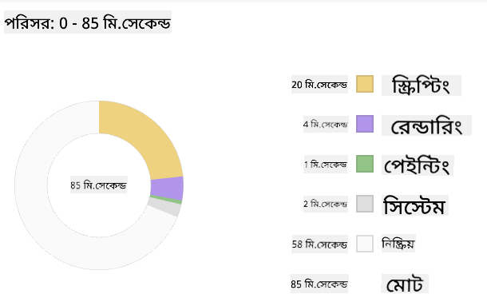
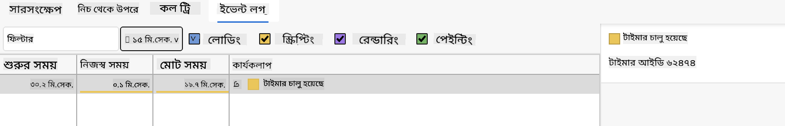

<!--
CO_OP_TRANSLATOR_METADATA:
{
  "original_hash": "49b58721a71cfda824e2f3e1f46908c6",
  "translation_date": "2025-08-28T22:56:13+00:00",
  "source_file": "5-browser-extension/3-background-tasks-and-performance/README.md",
  "language_code": "bn"
}
-->
# ব্রাউজার এক্সটেনশন প্রকল্প পার্ট ৩: ব্যাকগ্রাউন্ড টাস্ক এবং পারফরম্যান্স সম্পর্কে জানুন

## প্রাক-লেকচার কুইজ

[প্রাক-লেকচার কুইজ](https://ff-quizzes.netlify.app/web/quiz/27)

### ভূমিকা

এই মডিউলের শেষ দুটি পাঠে, আপনি শিখেছেন কীভাবে একটি ফর্ম তৈরি করতে হয় এবং একটি API থেকে আনা ডেটা প্রদর্শনের জন্য একটি এলাকা তৈরি করতে হয়। এটি ওয়েবে একটি স্ট্যান্ডার্ড উপস্থিতি তৈরি করার একটি খুব সাধারণ পদ্ধতি। আপনি এমনকি শিখেছেন কীভাবে অ্যাসিঙ্ক্রোনাসভাবে ডেটা ফেচ করতে হয়। আপনার ব্রাউজার এক্সটেনশন প্রায় সম্পূর্ণ। 

এখন কিছু ব্যাকগ্রাউন্ড টাস্ক পরিচালনা করা বাকি, যার মধ্যে রয়েছে এক্সটেনশনের আইকনের রঙ রিফ্রেশ করা। এটি একটি চমৎকার সময় ব্রাউজার কীভাবে এই ধরনের কাজ পরিচালনা করে তা নিয়ে আলোচনা করার। আসুন এই ব্রাউজার টাস্কগুলো নিয়ে চিন্তা করি আপনার ওয়েব অ্যাসেট তৈরি করার সময় এর পারফরম্যান্সের প্রেক্ষাপটে।

## ওয়েব পারফরম্যান্সের মৌলিক বিষয়

> "ওয়েবসাইট পারফরম্যান্স দুটি বিষয়ে: পেজটি কত দ্রুত লোড হয় এবং এর কোড কত দ্রুত চলে।" -- [জ্যাক গ্রোসবার্ট](https://www.smashingmagazine.com/2012/06/javascript-profiling-chrome-developer-tools/)

আপনার ওয়েবসাইটগুলোকে সব ধরনের ডিভাইস, ব্যবহারকারী এবং পরিস্থিতিতে অত্যন্ত দ্রুতগতির করার বিষয়টি বিস্তৃত। এখানে কিছু পয়েন্ট দেওয়া হলো যা আপনাকে একটি স্ট্যান্ডার্ড ওয়েব প্রকল্প বা ব্রাউজার এক্সটেনশন তৈরি করার সময় মনে রাখতে হবে।

আপনার সাইটটি দক্ষতার সাথে চলছে তা নিশ্চিত করার প্রথম ধাপ হলো এর পারফরম্যান্স সম্পর্কে ডেটা সংগ্রহ করা। এটি করার প্রথম জায়গা হলো আপনার ওয়েব ব্রাউজারের ডেভেলপার টুলস। Edge-এ, আপনি "Settings and more" বোতাম (ব্রাউজারের উপরের ডানদিকে তিনটি ডট আইকন) নির্বাচন করতে পারেন, তারপর More Tools > Developer Tools-এ যান এবং Performance ট্যাবটি খুলুন। আপনি Windows-এ `Ctrl` + `Shift` + `I` বা Mac-এ `Option` + `Command` + `I` কিবোর্ড শর্টকাট ব্যবহার করেও ডেভেলপার টুলস খুলতে পারেন।

Performance ট্যাবে একটি প্রোফাইলিং টুল রয়েছে। একটি ওয়েবসাইট খুলুন (উদাহরণস্বরূপ, [https://www.microsoft.com](https://www.microsoft.com/?WT.mc_id=academic-77807-sagibbon)) এবং 'Record' বোতামে ক্লিক করুন, তারপর সাইটটি রিফ্রেশ করুন। যেকোনো সময় রেকর্ডিং বন্ধ করুন, এবং আপনি দেখতে পাবেন সাইটটি 'স্ক্রিপ্ট', 'রেন্ডার', এবং 'পেইন্ট' করার জন্য যে রুটিনগুলো তৈরি হয়েছে:


✅ Edge-এর Performance প্যানেল সম্পর্কে আরও জানতে [Microsoft ডকুমেন্টেশন](https://docs.microsoft.com/microsoft-edge/devtools-guide/performance/?WT.mc_id=academic-77807-sagibbon) দেখুন।

> টিপ: আপনার ওয়েবসাইটের স্টার্টআপ টাইমের সঠিক রিডিং পেতে, আপনার ব্রাউজারের ক্যাশ পরিষ্কার করুন।

প্রোফাইল টাইমলাইনের উপাদানগুলো নির্বাচন করুন এবং দেখুন আপনার পেজ লোড হওয়ার সময় কী কী ইভেন্ট ঘটে।

প্রোফাইল টাইমলাইনের একটি অংশ নির্বাচন করে এবং সারাংশ প্যানটি দেখে আপনার পেজের পারফরম্যান্সের একটি স্ন্যাপশট নিন:



ইভেন্ট লগ প্যানটি চেক করুন এবং দেখুন কোনো ইভেন্ট ১৫ মিলিসেকেন্ডের বেশি সময় নিয়েছে কিনা:



✅ আপনার প্রোফাইলারটি চিনে নিন! এই সাইটে ডেভেলপার টুলস খুলুন এবং দেখুন কোনো বোতলনেক আছে কিনা। সবচেয়ে ধীরগতির লোডিং অ্যাসেট কোনটি? সবচেয়ে দ্রুতগতির কোনটি?

## প্রোফাইলিং চেক

সাধারণভাবে, কিছু "সমস্যাজনক এলাকা" রয়েছে যা প্রতিটি ওয়েব ডেভেলপারকে একটি সাইট তৈরি করার সময় লক্ষ্য রাখা উচিত, যাতে প্রোডাকশনে ডিপ্লয় করার সময় কোনো অপ্রত্যাশিত সমস্যা না হয়।

**অ্যাসেট সাইজ**: গত কয়েক বছরে ওয়েব 'ভারী' হয়ে উঠেছে এবং এর ফলে ধীরগতির হয়েছে। এর একটি অংশ চিত্র ব্যবহারের সাথে সম্পর্কিত।

✅ পেজ ওজন এবং আরও অনেক কিছুর ঐতিহাসিক দৃষ্টিভঙ্গির জন্য [ইন্টারনেট আর্কাইভ](https://httparchive.org/reports/page-weight) দেখুন।

একটি ভালো অভ্যাস হলো নিশ্চিত করা যে আপনার চিত্রগুলো অপ্টিমাইজ করা হয়েছে এবং আপনার ব্যবহারকারীদের জন্য সঠিক সাইজ এবং রেজোলিউশনে সরবরাহ করা হয়েছে।

**DOM ট্রাভার্সাল**: ব্রাউজারকে আপনার লেখা কোডের উপর ভিত্তি করে তার ডকুমেন্ট অবজেক্ট মডেল তৈরি করতে হয়, তাই ভালো পেজ পারফরম্যান্সের স্বার্থে আপনার ট্যাগগুলোকে ন্যূনতম রাখা উচিত, শুধুমাত্র পেজে যা প্রয়োজন তা ব্যবহার এবং স্টাইল করা উচিত। এই পয়েন্টে, পেজের সাথে সম্পর্কিত অতিরিক্ত CSS অপ্টিমাইজ করা যেতে পারে; উদাহরণস্বরূপ, শুধুমাত্র একটি পেজে ব্যবহৃত স্টাইলগুলো প্রধান স্টাইল শীটে অন্তর্ভুক্ত করার প্রয়োজন নেই।

**জাভাস্ক্রিপ্ট**: প্রতিটি জাভাস্ক্রিপ্ট ডেভেলপারকে 'রেন্ডার-ব্লকিং' স্ক্রিপ্টগুলোর দিকে নজর রাখা উচিত, যেগুলো DOM ট্রাভার্স এবং ব্রাউজারে পেইন্ট করার আগে লোড করতে হয়। আপনার ইনলাইন স্ক্রিপ্টগুলোর সাথে `defer` ব্যবহার করার কথা বিবেচনা করুন (যেমনটি Terrarium মডিউলে করা হয়েছে)।

✅ সাইট পারফরম্যান্স নির্ধারণের জন্য সাধারণ চেক সম্পর্কে আরও জানতে [সাইট স্পিড টেস্ট ওয়েবসাইট](https://www.webpagetest.org/) এ কিছু সাইট চেষ্টা করুন।

এখন যেহেতু আপনি জানেন ব্রাউজার আপনার পাঠানো অ্যাসেটগুলো কীভাবে রেন্ডার করে, আসুন আপনার এক্সটেনশন সম্পূর্ণ করতে শেষ কয়েকটি জিনিস দেখি:

### রঙ গণনা করার জন্য একটি ফাংশন তৈরি করুন

`/src/index.js`-এ কাজ করে, DOM-এ অ্যাক্সেস পাওয়ার জন্য সেট করা `const` ভেরিয়েবলগুলোর সিরিজের পরে `calculateColor()` নামে একটি ফাংশন যোগ করুন:

```JavaScript
function calculateColor(value) {
	let co2Scale = [0, 150, 600, 750, 800];
	let colors = ['#2AA364', '#F5EB4D', '#9E4229', '#381D02', '#381D02'];

	let closestNum = co2Scale.sort((a, b) => {
		return Math.abs(a - value) - Math.abs(b - value);
	})[0];
	console.log(value + ' is closest to ' + closestNum);
	let num = (element) => element > closestNum;
	let scaleIndex = co2Scale.findIndex(num);

	let closestColor = colors[scaleIndex];
	console.log(scaleIndex, closestColor);

	chrome.runtime.sendMessage({ action: 'updateIcon', value: { color: closestColor } });
}
```

এখানে কী হচ্ছে? আপনি একটি মান (কার্বন ইন্টেনসিটি) API কল থেকে পাস করছেন যা আপনি আগের পাঠে সম্পন্ন করেছেন, এবং তারপর আপনি এটি রঙের অ্যারের সূচকের সাথে কতটা কাছাকাছি তা গণনা করছেন। তারপর আপনি সেই সবচেয়ে কাছের রঙের মানটি chrome runtime-এ পাঠাচ্ছেন।

chrome.runtime-এ [একটি API](https://developer.chrome.com/extensions/runtime) রয়েছে যা সব ধরনের ব্যাকগ্রাউন্ড টাস্ক পরিচালনা করে, এবং আপনার এক্সটেনশন এটি ব্যবহার করছে:

> "chrome.runtime API ব্যবহার করে ব্যাকগ্রাউন্ড পেজ পুনরুদ্ধার করুন, ম্যানিফেস্ট সম্পর্কে বিস্তারিত তথ্য ফেরত দিন, এবং অ্যাপ বা এক্সটেনশনের লাইফসাইকেলের ইভেন্টগুলোর জন্য শোনার এবং সাড়া দেওয়ার জন্য ব্যবহার করুন। আপনি এই API ব্যবহার করে URL-এর আপেক্ষিক পথকে সম্পূর্ণ-যোগ্য URL-এ রূপান্তর করতে পারেন।"

✅ যদি আপনি Edge-এর জন্য এই ব্রাউজার এক্সটেনশনটি তৈরি করছেন, তবে এটি জেনে অবাক হতে পারেন যে আপনি একটি chrome API ব্যবহার করছেন। নতুন Edge ব্রাউজার সংস্করণগুলো Chromium ব্রাউজার ইঞ্জিনে চলে, তাই আপনি এই টুলগুলো ব্যবহার করতে পারেন।

> নোট, যদি আপনি একটি ব্রাউজার এক্সটেনশন প্রোফাইল করতে চান, এক্সটেনশনের ভিতর থেকে ডেভেলপার টুলস চালু করুন, কারণ এটি নিজস্ব একটি আলাদা ব্রাউজার ইনস্ট্যান্স।

### একটি ডিফল্ট আইকন রঙ সেট করুন

এখন, `init()` ফাংশনে, chrome-এর `updateIcon` অ্যাকশন কল করে আইকনটিকে শুরুতে একটি সাধারণ সবুজ রঙে সেট করুন:

```JavaScript
chrome.runtime.sendMessage({
	action: 'updateIcon',
		value: {
			color: 'green',
		},
});
```

### ফাংশনটি কল করুন, কলটি সম্পাদন করুন

পরবর্তী ধাপে, আপনি যে ফাংশনটি তৈরি করেছেন সেটি C02Signal API থেকে ফেরত আসা প্রমিসে যোগ করুন:

```JavaScript
//let CO2...
calculateColor(CO2);
```

এবং শেষ পর্যন্ত, `/dist/background.js`-এ এই ব্যাকগ্রাউন্ড অ্যাকশন কলগুলোর জন্য একটি লিসেনার যোগ করুন:

```JavaScript
chrome.runtime.onMessage.addListener(function (msg, sender, sendResponse) {
	if (msg.action === 'updateIcon') {
		chrome.browserAction.setIcon({ imageData: drawIcon(msg.value) });
	}
});
//borrowed from energy lollipop extension, nice feature!
function drawIcon(value) {
	let canvas = document.createElement('canvas');
	let context = canvas.getContext('2d');

	context.beginPath();
	context.fillStyle = value.color;
	context.arc(100, 100, 50, 0, 2 * Math.PI);
	context.fill();

	return context.getImageData(50, 50, 100, 100);
}
```

এই কোডে, আপনি ব্যাকএন্ড টাস্ক ম্যানেজারে আসা যেকোনো মেসেজের জন্য একটি লিসেনার যোগ করছেন। যদি এটি 'updateIcon' নামে ডাকা হয়, তবে পরবর্তী কোডটি Canvas API ব্যবহার করে সঠিক রঙের একটি আইকন আঁকতে চালানো হয়।

✅ আপনি Canvas API সম্পর্কে আরও শিখবেন [Space Game পাঠে](../../6-space-game/2-drawing-to-canvas/README.md)।

এখন, আপনার এক্সটেনশনটি পুনরায় তৈরি করুন (`npm run build`), রিফ্রেশ করুন এবং আপনার এক্সটেনশন চালু করুন এবং রঙ পরিবর্তন দেখুন। এটি কি কোনো কাজ করার বা থালা-বাসন ধোয়ার ভালো সময়? এখন আপনি জানেন!

অভিনন্দন, আপনি একটি কার্যকরী ব্রাউজার এক্সটেনশন তৈরি করেছেন এবং শিখেছেন কীভাবে ব্রাউজার কাজ করে এবং কীভাবে এর পারফরম্যান্স প্রোফাইল করতে হয়।

---

## 🚀 চ্যালেঞ্জ

কিছু ওপেন সোর্স ওয়েবসাইট তদন্ত করুন যা অনেক দিন আগে তৈরি হয়েছিল এবং তাদের GitHub ইতিহাসের ভিত্তিতে দেখুন তারা পারফরম্যান্সের জন্য কীভাবে অপ্টিমাইজ করা হয়েছিল, যদি আদৌ করা হয়। সবচেয়ে সাধারণ সমস্যার পয়েন্ট কোনটি?

## পোস্ট-লেকচার কুইজ

[পোস্ট-লেকচার কুইজ](https://ff-quizzes.netlify.app/web/quiz/28)

## পর্যালোচনা ও স্ব-অধ্যয়ন

একটি [পারফরম্যান্স নিউজলেটার](https://perf.email/) সাবস্ক্রাইব করার কথা বিবেচনা করুন।

ব্রাউজারগুলো কীভাবে ওয়েব পারফরম্যান্স পরিমাপ করে তা জানার জন্য তাদের ওয়েব টুলগুলোর পারফরম্যান্স ট্যাবগুলো দেখুন। আপনি কি কোনো বড় পার্থক্য খুঁজে পান?

## অ্যাসাইনমেন্ট

[একটি সাইটের পারফরম্যান্স বিশ্লেষণ করুন](assignment.md)

---

**অস্বীকৃতি**:  
এই নথিটি AI অনুবাদ পরিষেবা [Co-op Translator](https://github.com/Azure/co-op-translator) ব্যবহার করে অনুবাদ করা হয়েছে। আমরা যথাসম্ভব সঠিকতার জন্য চেষ্টা করি, তবে অনুগ্রহ করে মনে রাখবেন যে স্বয়ংক্রিয় অনুবাদে ত্রুটি বা অসঙ্গতি থাকতে পারে। মূল ভাষায় থাকা নথিটিকে প্রামাণিক উৎস হিসেবে বিবেচনা করা উচিত। গুরুত্বপূর্ণ তথ্যের জন্য, পেশাদার মানব অনুবাদ সুপারিশ করা হয়। এই অনুবাদ ব্যবহারের ফলে কোনো ভুল বোঝাবুঝি বা ভুল ব্যাখ্যা হলে আমরা দায়বদ্ধ থাকব না।