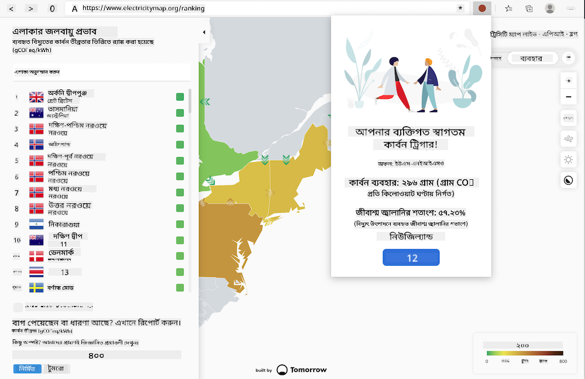
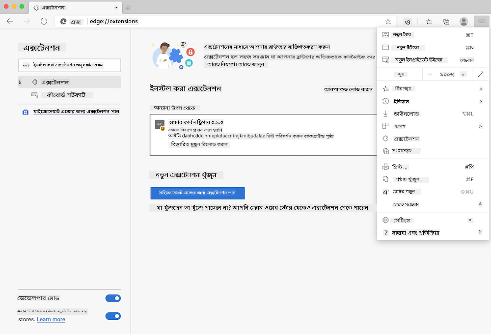

<!--
CO_OP_TRANSLATOR_METADATA:
{
  "original_hash": "3f5e6821e0febccfc5d05e7c944d9e3d",
  "translation_date": "2025-08-26T00:01:13+00:00",
  "source_file": "5-browser-extension/solution/translation/README.ja.md",
  "language_code": "bn"
}
-->
# কার্বন ট্রিগার ব্রাউজার এক্সটেনশন: সম্পূর্ণ কোড

tmrow এর CO2 সিগন্যাল API ব্যবহার করে বিদ্যুৎ ব্যবহারের পরিমাণ ট্র্যাক করার জন্য একটি ব্রাউজার এক্সটেনশন তৈরি করুন, যা আপনার অঞ্চলের বিদ্যুৎ ব্যবহারের পরিমাণ ব্রাউজারে একটি রিমাইন্ডার হিসেবে দেখাবে। এই এক্সটেনশনটি ব্যবহার করে আপনি এই তথ্যের ভিত্তিতে আপনার কার্যকলাপ নির্ধারণ করতে পারবেন।



## শুরু করা যাক

[npm](https://npmjs.com) ইনস্টল করা থাকতে হবে। এই কোডের একটি কপি আপনার কম্পিউটারের একটি ফোল্ডারে ডাউনলোড করুন।

প্রয়োজনীয় প্যাকেজগুলো ইনস্টল করুন।

```
npm install
```

webpack ব্যবহার করে এক্সটেনশনটি বিল্ড করুন।

```
npm run build
```

Edge-এ ইনস্টল করতে, ব্রাউজারের ডানদিকে উপরের কোণে থাকা "তিনটি ডট" মেনু থেকে "Extensions" প্যানেলটি খুঁজে নিন। সেখান থেকে "Load Unpacked" নির্বাচন করুন এবং নতুন এক্সটেনশনটি লোড করুন। প্রম্পটে "dist" ফোল্ডারটি খুলুন, এবং এক্সটেনশনটি লোড হয়ে যাবে। এটি ব্যবহার করতে, CO2 সিগন্যাল API-এর API কী ([ইমেইলের মাধ্যমে এখানে একটি পান](https://www.co2signal.com/) - এই পৃষ্ঠার বক্সে আপনার ইমেইল লিখুন) এবং [Electricity Map](https://www.electricitymap.org/map)-এর সাথে সম্পর্কিত [আপনার অঞ্চলের কোড](http://api.electricitymap.org/v3/zones) প্রয়োজন হবে (উদাহরণস্বরূপ, বোস্টনের জন্য 'US-NEISO' ব্যবহার করা হয়)।



API কী এবং অঞ্চলটি এক্সটেনশনের ইন্টারফেসে প্রবেশ করানোর পর, ব্রাউজারের এক্সটেনশন বারে প্রদর্শিত রঙিন ডটটি পরিবর্তিত হবে এবং আপনার অঞ্চলের শক্তি ব্যবহারের পরিমাণ প্রতিফলিত করবে। এটি আপনাকে নির্দেশ করবে কোন ধরনের শক্তি-নির্ভর কার্যকলাপ করা উপযুক্ত। এই "ডট" সিস্টেমের ধারণাটি আমাকে ক্যালিফোর্নিয়ার নির্গমনের জন্য [Energy Lollipop extension](https://energylollipop.com/) থেকে অনুপ্রাণিত করেছে।

**অস্বীকৃতি**:  
এই নথিটি AI অনুবাদ পরিষেবা [Co-op Translator](https://github.com/Azure/co-op-translator) ব্যবহার করে অনুবাদ করা হয়েছে। আমরা যথাসম্ভব সঠিকতার জন্য চেষ্টা করি, তবে অনুগ্রহ করে মনে রাখবেন যে স্বয়ংক্রিয় অনুবাদে ত্রুটি বা অসঙ্গতি থাকতে পারে। এর মূল ভাষায় থাকা নথিটিকে প্রামাণিক উৎস হিসেবে বিবেচনা করা উচিত। গুরুত্বপূর্ণ তথ্যের জন্য, পেশাদার মানব অনুবাদ সুপারিশ করা হয়। এই অনুবাদ ব্যবহারের ফলে কোনো ভুল বোঝাবুঝি বা ভুল ব্যাখ্যা হলে আমরা তার জন্য দায়ী থাকব না।