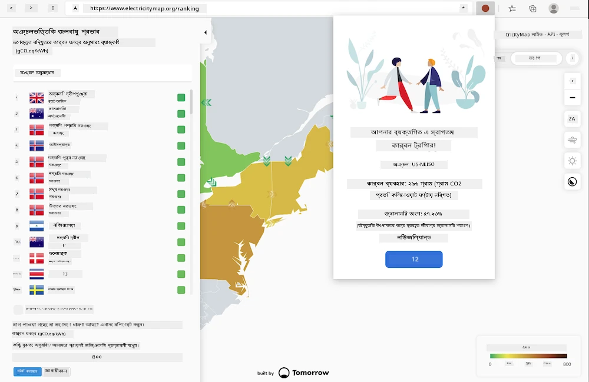
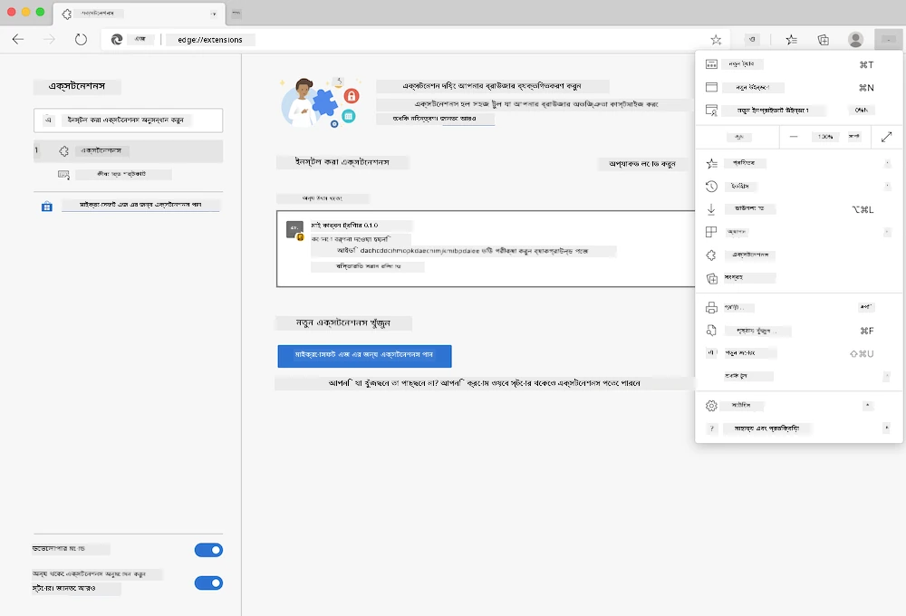

# কার্বন ট্রিগার ব্রাউজার এক্সটেনশন: স্টার্টার কোড

tmrow-এর CO2 Signal API ব্যবহার করে বিদ্যুৎ ব্যবহারের উপর নজর রাখুন এবং একটি ব্রাউজার এক্সটেনশন তৈরি করুন, যা আপনার ব্রাউজারে একটি অনুস্মারক হিসেবে কাজ করবে আপনার অঞ্চলের বিদ্যুৎ ব্যবহারের ভার কতটা তা জানার জন্য। এই এক্সটেনশনটি ব্যবহার করে আপনি আপনার কার্যকলাপ সম্পর্কে তথ্যের ভিত্তিতে সিদ্ধান্ত নিতে পারবেন।



## শুরু করার জন্য

আপনার [npm](https://npmjs.com) ইনস্টল করা থাকতে হবে। এই কোডের একটি কপি আপনার কম্পিউটারের একটি ফোল্ডারে ডাউনলোড করুন।

প্রয়োজনীয় সব প্যাকেজ ইনস্টল করুন:

```
npm install
```

Webpack থেকে এক্সটেনশন তৈরি করুন:

```
npm run build
```

Edge-এ ইনস্টল করতে, ব্রাউজারের উপরের ডান কোণের 'তিন ডট' মেনু ব্যবহার করে Extensions প্যানেলটি খুঁজুন। সেখান থেকে 'Load Unpacked' নির্বাচন করুন একটি নতুন এক্সটেনশন লোড করার জন্য। প্রম্পটে 'dist' ফোল্ডারটি খুলুন এবং এক্সটেনশনটি লোড হবে। এটি ব্যবহার করতে, আপনাকে CO2 Signal-এর API-এর জন্য একটি API কী ([ইমেইলের মাধ্যমে এখানে পান](https://www.co2signal.com/) - এই পৃষ্ঠায় আপনার ইমেইলটি বক্সে লিখুন) এবং [Electricity Map](https://www.electricitymap.org/map)-এর সাথে সম্পর্কিত আপনার অঞ্চলের [কোড](http://api.electricitymap.org/v3/zones) প্রয়োজন হবে (উদাহরণস্বরূপ, বোস্টনে আমি 'US-NEISO' ব্যবহার করি)।



একবার API কী এবং অঞ্চল এক্সটেনশনের ইন্টারফেসে ইনপুট দিলে, ব্রাউজার এক্সটেনশন বারে রঙিন বিন্দুটি আপনার অঞ্চলের শক্তি ব্যবহারের প্রতিফলন দেখাবে এবং আপনাকে নির্দেশনা দেবে কোন শক্তি-নির্ভর কার্যকলাপ আপনার জন্য উপযুক্ত। এই 'ডট' সিস্টেমের ধারণাটি আমাকে [Energy Lollipop এক্সটেনশন](https://energylollipop.com/) থেকে দেওয়া হয়েছিল, যা ক্যালিফোর্নিয়ার নির্গমনের জন্য তৈরি।

**অস্বীকৃতি**:  
এই নথিটি AI অনুবাদ পরিষেবা [Co-op Translator](https://github.com/Azure/co-op-translator) ব্যবহার করে অনুবাদ করা হয়েছে। আমরা যথাসম্ভব সঠিকতার জন্য চেষ্টা করি, তবে অনুগ্রহ করে মনে রাখবেন যে স্বয়ংক্রিয় অনুবাদে ত্রুটি বা অসঙ্গতি থাকতে পারে। মূল ভাষায় থাকা নথিটিকে প্রামাণিক উৎস হিসেবে বিবেচনা করা উচিত। গুরুত্বপূর্ণ তথ্যের জন্য, পেশাদার মানব অনুবাদ সুপারিশ করা হয়। এই অনুবাদ ব্যবহারের ফলে কোনো ভুল বোঝাবুঝি বা ভুল ব্যাখ্যা হলে আমরা তার জন্য দায়ী থাকব না।