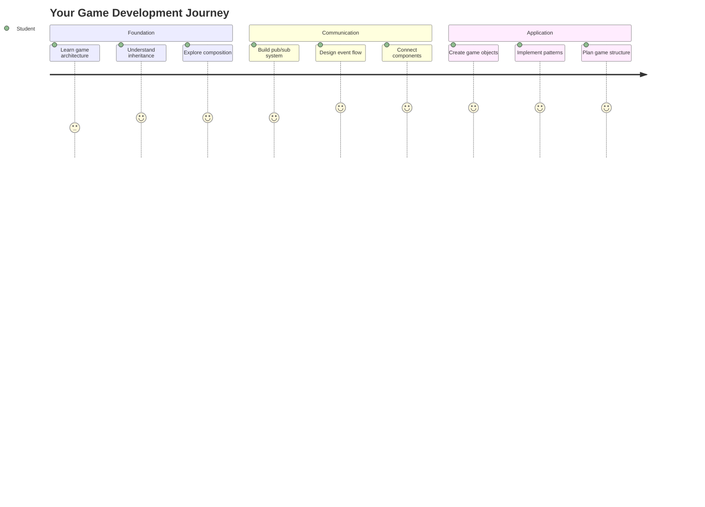
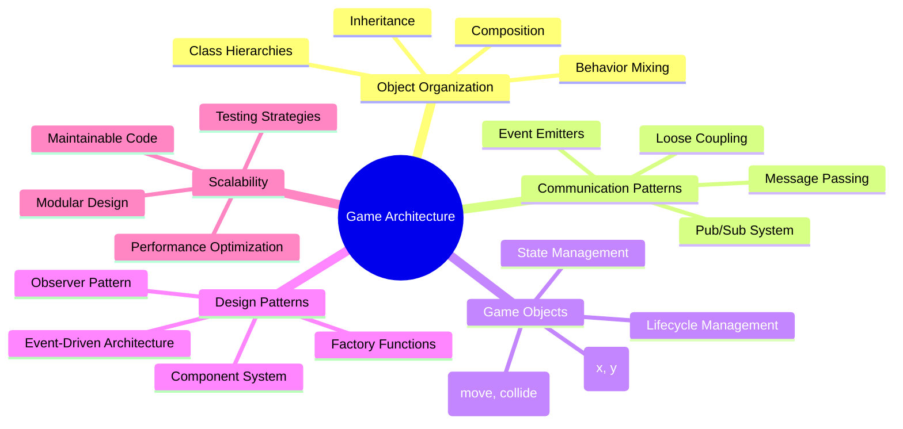
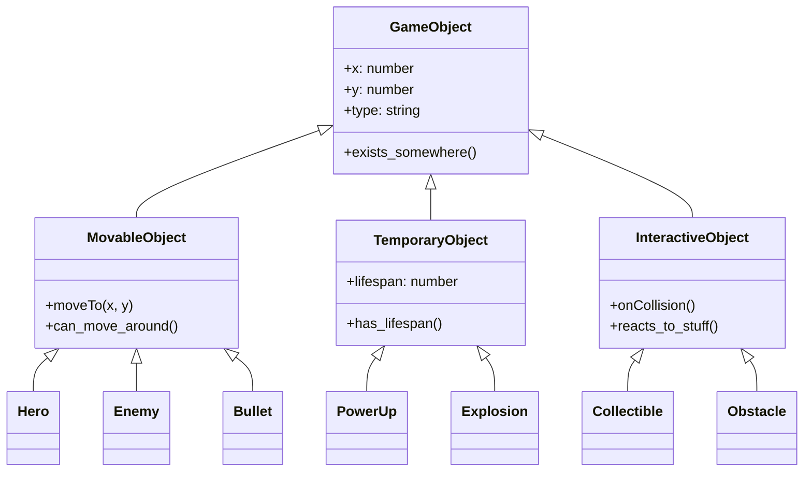
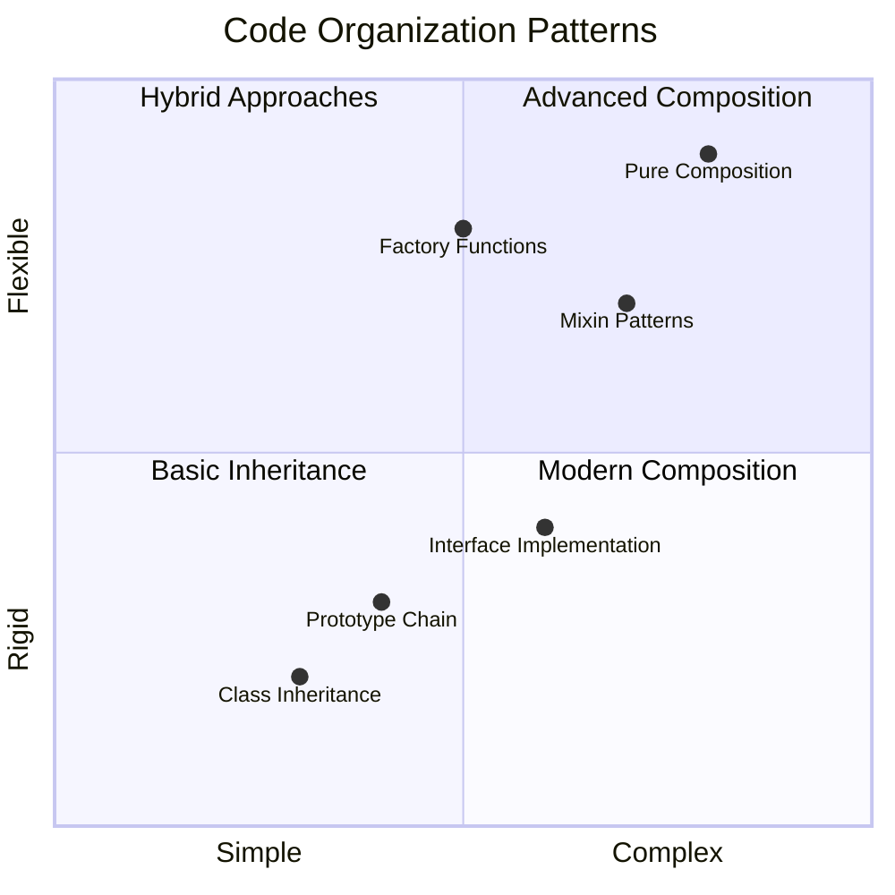
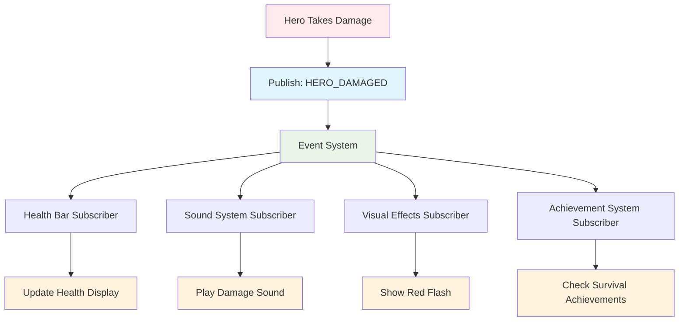
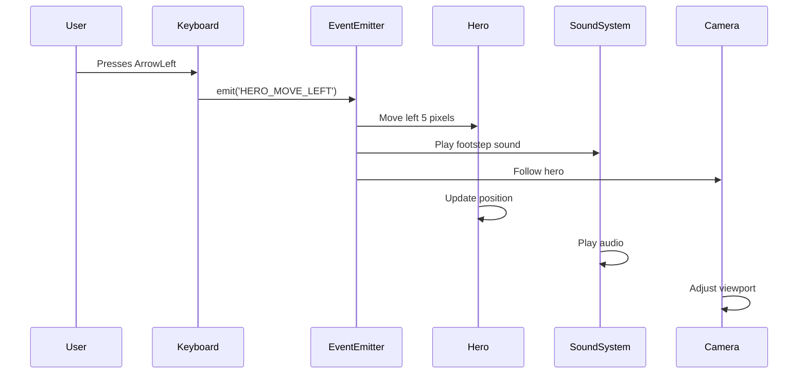
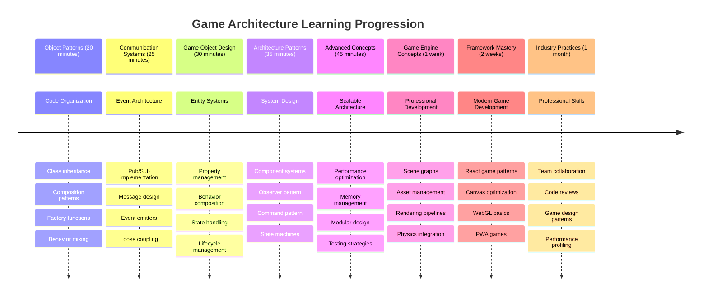

<!--
CO_OP_TRANSLATOR_METADATA:
{
  "original_hash": "a6332a7bb4d0be3bfd24199c83993777",
  "translation_date": "2025-11-03T23:04:35+00:00",
  "source_file": "6-space-game/1-introduction/README.md",
  "language_code": "bn"
}
-->
# মহাকাশ গেম তৈরি করুন পর্ব ১: পরিচিতি




যেমন নাসার মিশন কন্ট্রোল মহাকাশ উৎক্ষেপণের সময় একাধিক সিস্টেম সমন্বয় করে, আমরা একটি মহাকাশ গেম তৈরি করতে যাচ্ছি যা দেখাবে কীভাবে একটি প্রোগ্রামের বিভিন্ন অংশ একসাথে নির্বিঘ্নে কাজ করতে পারে। এমন কিছু তৈরি করার সময় যা আপনি আসলে খেলতে পারবেন, আপনি গুরুত্বপূর্ণ প্রোগ্রামিং ধারণাগুলি শিখবেন যা যেকোনো সফটওয়্যার প্রকল্পে প্রযোজ্য।

আমরা কোড সংগঠিত করার দুটি মৌলিক পদ্ধতি অন্বেষণ করব: ইনহেরিটেন্স এবং কম্পোজিশন। এগুলি শুধুমাত্র একাডেমিক ধারণা নয় – এগুলি সেই প্যাটার্ন যা ভিডিও গেম থেকে ব্যাংকিং সিস্টেম পর্যন্ত সবকিছু চালিত করে। আমরা একটি যোগাযোগ ব্যবস্থা বাস্তবায়ন করব যাকে pub/sub বলা হয় যা মহাকাশযানে ব্যবহৃত যোগাযোগ নেটওয়ার্কের মতো কাজ করে, বিভিন্ন উপাদানকে নির্ভরতা তৈরি না করেই তথ্য ভাগ করতে দেয়।

এই সিরিজের শেষে, আপনি এমন অ্যাপ্লিকেশন তৈরি করতে শিখবেন যা স্কেল এবং বিকশিত হতে পারে – আপনি গেম, ওয়েব অ্যাপ্লিকেশন বা অন্য কোনো সফটওয়্যার সিস্টেম তৈরি করুন না কেন।



## প্রি-লেকচার কুইজ

[প্রি-লেকচার কুইজ](https://ff-quizzes.netlify.app/web/quiz/29)

## গেম ডেভেলপমেন্টে ইনহেরিটেন্স এবং কম্পোজিশন

যখন প্রকল্পগুলি জটিলতায় বৃদ্ধি পায়, কোড সংগঠন সমালোচনামূলক হয়ে ওঠে। একটি সাধারণ স্ক্রিপ্ট হিসাবে যা শুরু হয় তা সঠিক কাঠামো ছাড়া বজায় রাখা কঠিন হয়ে উঠতে পারে – যেমন অ্যাপোলো মিশনগুলিকে হাজার হাজার উপাদানের মধ্যে সাবধানে সমন্বয় করতে হয়েছিল।

আমরা কোড সংগঠিত করার দুটি মৌলিক পদ্ধতি অন্বেষণ করব: ইনহেরিটেন্স এবং কম্পোজিশন। প্রতিটির স্বতন্ত্র সুবিধা রয়েছে এবং উভয়ই বোঝা আপনাকে বিভিন্ন পরিস্থিতিতে সঠিক পদ্ধতি বেছে নিতে সাহায্য করে। আমরা আমাদের মহাকাশ গেমের মাধ্যমে এই ধারণাগুলি প্রদর্শন করব, যেখানে নায়ক, শত্রু, পাওয়ার-আপ এবং অন্যান্য বস্তুগুলি দক্ষতার সাথে যোগাযোগ করতে হবে।

✅ প্রোগ্রামিংয়ের ইতিহাসে সবচেয়ে বিখ্যাত বইগুলির মধ্যে একটি হল [ডিজাইন প্যাটার্নস](https://en.wikipedia.org/wiki/Design_Patterns)।

যেকোনো গেমে, আপনার কাছে থাকে `গেম অবজেক্ট` – ইন্টারঅ্যাকটিভ উপাদানগুলি যা আপনার গেমের জগৎকে পূর্ণ করে। নায়ক, শত্রু, পাওয়ার-আপ এবং ভিজ্যুয়াল ইফেক্ট সবই গেম অবজেক্ট। প্রতিটি নির্দিষ্ট স্ক্রিন কোঅর্ডিনেটে বিদ্যমান থাকে `x` এবং `y` মান ব্যবহার করে, যা পয়েন্ট প্লট করার মতো।

তাদের ভিজ্যুয়াল পার্থক্য থাকা সত্ত্বেও, এই বস্তুগুলি প্রায়শই মৌলিক আচরণ ভাগ করে:

- **তারা কোথাও থাকে** – প্রতিটি বস্তুর x এবং y কোঅর্ডিনেট থাকে যাতে গেমটি জানে কোথায় এটি আঁকতে হবে
- **অনেকেই চারপাশে চলতে পারে** – নায়করা দৌড়ায়, শত্রুরা তাড়া করে, বুলেট স্ক্রিন জুড়ে উড়ে যায়
- **তাদের একটি জীবনকাল থাকে** – কিছু চিরকাল থাকে, অন্যরা (যেমন বিস্ফোরণ) সংক্ষিপ্তভাবে উপস্থিত হয় এবং অদৃশ্য হয়ে যায়
- **তারা প্রতিক্রিয়া জানায়** – যখন জিনিসগুলি সংঘর্ষ হয়, পাওয়ার-আপ সংগ্রহ করা হয়, স্বাস্থ্য বার আপডেট হয়

✅ একটি গেমের কথা ভাবুন যেমন Pac-Man। আপনি কি এই গেমে উপরের চারটি অবজেক্ট টাইপ চিহ্নিত করতে পারেন?



### কোডের মাধ্যমে আচরণ প্রকাশ করা

এখন আপনি বুঝতে পেরেছেন যে গেম অবজেক্টগুলি সাধারণ আচরণ ভাগ করে, আসুন আমরা জাভাস্ক্রিপ্টে এই আচরণগুলি কীভাবে বাস্তবায়ন করা যায় তা অন্বেষণ করি। আপনি ক্লাস বা পৃথক অবজেক্টের সাথে সংযুক্ত পদ্ধতির মাধ্যমে অবজেক্টের আচরণ প্রকাশ করতে পারেন এবং বেছে নেওয়ার জন্য বেশ কয়েকটি পদ্ধতি রয়েছে।

**ক্লাস-ভিত্তিক পদ্ধতি**

ক্লাস এবং ইনহেরিটেন্স গেম অবজেক্ট সংগঠিত করার জন্য একটি কাঠামোগত পদ্ধতি প্রদান করে। কার্ল লিনিয়াস দ্বারা বিকশিত ট্যাক্সোনমিক শ্রেণীবিন্যাস ব্যবস্থার মতো, আপনি সাধারণ বৈশিষ্ট্য ধারণকারী একটি বেস ক্লাস দিয়ে শুরু করেন, তারপর বিশেষায়িত ক্লাস তৈরি করেন যা এই মৌলিক বিষয়গুলি উত্তরাধিকারসূত্রে গ্রহণ করে এবং নির্দিষ্ট ক্ষমতা যোগ করে।

✅ ইনহেরিটেন্স একটি গুরুত্বপূর্ণ ধারণা বুঝতে। [MDN-এর ইনহেরিটেন্স সম্পর্কিত নিবন্ধ](https://developer.mozilla.org/docs/Web/JavaScript/Inheritance_and_the_prototype_chain) থেকে আরও জানুন।

এখানে ক্লাস এবং ইনহেরিটেন্স ব্যবহার করে গেম অবজেক্টগুলি কীভাবে বাস্তবায়ন করা যায় তা দেখানো হয়েছে:

```javascript
// Step 1: Create the base GameObject class
class GameObject {
  constructor(x, y, type) {
    this.x = x;
    this.y = y;
    this.type = type;
  }
}
```

**এটি ধাপে ধাপে ভেঙে দেখি:**
- আমরা একটি মৌলিক টেমপ্লেট তৈরি করছি যা প্রতিটি গেম অবজেক্ট ব্যবহার করতে পারে
- কনস্ট্রাক্টর সংরক্ষণ করে বস্তুর অবস্থান (`x`, `y`) এবং এটি কী ধরনের জিনিস
- এটি সেই ভিত্তি হয়ে ওঠে যার উপর আপনার সমস্ত গেম অবজেক্ট তৈরি হবে

```javascript
// Step 2: Add movement capability through inheritance
class Movable extends GameObject {
  constructor(x, y, type) {
    super(x, y, type); // Call parent constructor
  }

  // Add the ability to move to a new position
  moveTo(x, y) {
    this.x = x;
    this.y = y;
  }
}
```

**উপরে আমরা:**
- **GameObject ক্লাসকে প্রসারিত করেছি** যাতে মুভমেন্ট কার্যকারিতা যোগ করা যায়
- **প্যারেন্ট কনস্ট্রাক্টরকে ডেকেছি** `super()` ব্যবহার করে উত্তরাধিকারসূত্রে প্রাপ্ত বৈশিষ্ট্যগুলি আরম্ভ করতে
- **একটি `moveTo()` পদ্ধতি যোগ করেছি** যা বস্তুর অবস্থান আপডেট করে

```javascript
// Step 3: Create specific game object types
class Hero extends Movable {
  constructor(x, y) {
    super(x, y, 'Hero'); // Set type automatically
  }
}

class Tree extends GameObject {
  constructor(x, y) {
    super(x, y, 'Tree'); // Trees don't need movement
  }
}

// Step 4: Use your game objects
const hero = new Hero(0, 0);
hero.moveTo(5, 5); // Hero can move!

const tree = new Tree(10, 15);
// tree.moveTo() would cause an error - trees can't move
```

**এই ধারণাগুলি বোঝা:**
- **বিশেষায়িত অবজেক্ট টাইপ তৈরি করে** যা উপযুক্ত আচরণ উত্তরাধিকারসূত্রে গ্রহণ করে
- **প্রদর্শন করে** কীভাবে ইনহেরিটেন্স নির্বাচনী বৈশিষ্ট্য অন্তর্ভুক্তি অনুমোদন করে
- **দেখায়** যে নায়করা চলতে পারে যখন গাছ স্থির থাকে
- **চিত্রিত করে** কীভাবে ক্লাস হায়ারার্কি অনুপযুক্ত ক্রিয়াগুলি প্রতিরোধ করে

✅ কয়েক মিনিট সময় নিন একটি Pac-Man নায়ক (উদাহরণস্বরূপ, Inky, Pinky বা Blinky) পুনরায় কল্পনা করতে এবং এটি কীভাবে জাভাস্ক্রিপ্টে লেখা হবে।

**কম্পোজিশন পদ্ধতি**

কম্পোজিশন একটি মডুলার ডিজাইন দর্শন অনুসরণ করে, যেমন ইঞ্জিনিয়াররা মহাকাশযান ডিজাইন করে বিনিময়যোগ্য উপাদান দিয়ে। একটি প্যারেন্ট ক্লাস থেকে উত্তরাধিকারসূত্রে গ্রহণ করার পরিবর্তে, আপনি নির্দিষ্ট আচরণগুলি একত্রিত করেন যাতে বস্তুর প্রয়োজনীয় কার্যকারিতা থাকে। এই পদ্ধতি কঠোর হায়ারার্কিকাল সীমাবদ্ধতা ছাড়াই নমনীয়তা প্রদান করে।

```javascript
// Step 1: Create base behavior objects
const gameObject = {
  x: 0,
  y: 0,
  type: ''
};

const movable = {
  moveTo(x, y) {
    this.x = x;
    this.y = y;
  }
};
```

**এই কোডটি যা করে:**
- **একটি বেস `gameObject` সংজ্ঞায়িত করে** অবস্থান এবং টাইপ বৈশিষ্ট্য সহ
- **একটি পৃথক `movable` আচরণ অবজেক্ট তৈরি করে** মুভমেন্ট কার্যকারিতা সহ
- **উদ্বেগগুলি পৃথক করে** অবস্থান ডেটা এবং মুভমেন্ট লজিক স্বাধীন রাখে

```javascript
// Step 2: Compose objects by combining behaviors
const movableObject = { ...gameObject, ...movable };

// Step 3: Create factory functions for different object types
function createHero(x, y) {
  return {
    ...movableObject,
    x,
    y,
    type: 'Hero'
  };
}

function createStatic(x, y, type) {
  return {
    ...gameObject,
    x,
    y,
    type
  };
}
```

**উপরে আমরা:**
- **বেস অবজেক্ট বৈশিষ্ট্যগুলিকে মুভমেন্ট আচরণের সাথে একত্রিত করেছি** স্প্রেড সিনট্যাক্স ব্যবহার করে
- **ফ্যাক্টরি ফাংশন তৈরি করেছি** যা কাস্টমাইজড অবজেক্ট ফেরত দেয়
- **অনুমোদন করেছি** কঠোর ক্লাস হায়ারার্কি ছাড়াই নমনীয় অবজেক্ট তৈরি
- **বস্তুকে অনুমতি দিয়েছি** তাদের প্রয়োজনীয় আচরণগুলি পেতে

```javascript
// Step 4: Create and use your composed objects
const hero = createHero(10, 10);
hero.moveTo(5, 5); // Works perfectly!

const tree = createStatic(0, 0, 'Tree');
// tree.moveTo() is undefined - no movement behavior was composed
```

**মনে রাখার মূল পয়েন্ট:**
- **বস্তুকে কম্পোজ করে** আচরণ মিশ্রিত করে, উত্তরাধিকারসূত্রে গ্রহণ না করে
- **কঠোর ইনহেরিটেন্স হায়ারার্কির চেয়ে বেশি নমনীয়তা প্রদান করে**
- **বস্তুকে অনুমতি দেয়** তাদের প্রয়োজনীয় বৈশিষ্ট্যগুলি পেতে
- **পরিষ্কার অবজেক্ট সংমিশ্রণের জন্য** আধুনিক জাভাস্ক্রিপ্ট স্প্রেড সিনট্যাক্স ব্যবহার করে
```

**Which Pattern Should You Choose?**

**Which Pattern Should You Choose?**



> 💡 **প্রো টিপ**: উভয় প্যাটার্নই আধুনিক জাভাস্ক্রিপ্ট ডেভেলপমেন্টে তাদের স্থান পেয়েছে। ক্লাসগুলি স্পষ্টভাবে সংজ্ঞায়িত হায়ারার্কির জন্য ভাল কাজ করে, যখন কম্পোজিশন সর্বাধিক নমনীয়তার প্রয়োজন হলে কার্যকর।

**কখন কোন পদ্ধতি ব্যবহার করবেন:**
- **ইনহেরিটেন্স বেছে নিন** যখন আপনার স্পষ্ট "is-a" সম্পর্ক থাকে (একটি Hero *is-a* Movable object)
- **কম্পোজিশন নির্বাচন করুন** যখন আপনার "has-a" সম্পর্ক থাকে (একটি Hero *has* movement abilities)
- **আপনার দলের পছন্দ এবং প্রকল্পের প্রয়োজনীয়তা বিবেচনা করুন**
- **মনে রাখুন** যে আপনি একই অ্যাপ্লিকেশনে উভয় পদ্ধতি মিশ্রিত করতে পারেন

### 🔄 **শিক্ষাগত চেক-ইন**
**অবজেক্ট সংগঠনের বোঝাপড়া**: যোগাযোগ প্যাটার্নে যাওয়ার আগে নিশ্চিত করুন যে আপনি:
- ✅ ইনহেরিটেন্স এবং কম্পোজিশনের মধ্যে পার্থক্য ব্যাখ্যা করতে পারেন
- ✅ ক্লাস বনাম ফ্যাক্টরি ফাংশন কখন ব্যবহার করবেন তা চিহ্নিত করতে পারেন
- ✅ ইনহেরিটেন্সে `super()` কীওয়ার্ড কীভাবে কাজ করে তা বুঝতে পারেন
- ✅ গেম ডেভেলপমেন্টের জন্য প্রতিটি পদ্ধতির সুবিধাগুলি চিনতে পারেন

**দ্রুত স্ব-পরীক্ষা**: আপনি কীভাবে একটি Flying Enemy তৈরি করবেন যা চলতে এবং উড়তে পারে?
- **ইনহেরিটেন্স পদ্ধতি**: `class FlyingEnemy extends Movable`
- **কম্পোজিশন পদ্ধতি**: `{ ...movable, ...flyable, ...gameObject }`

**বাস্তব-জীবনের সংযোগ**: এই প্যাটার্নগুলি সর্বত্র উপস্থিত:
- **React Components**: Props (কম্পোজিশন) বনাম ক্লাস ইনহেরিটেন্স
- **Game Engines**: Entity-component systems কম্পোজিশন ব্যবহার করে
- **Mobile Apps**: UI frameworks প্রায়ই ইনহেরিটেন্স হায়ারার্কি ব্যবহার করে

## যোগাযোগ প্যাটার্ন: Pub/Sub সিস্টেম

যখন অ্যাপ্লিকেশনগুলি জটিল হয়ে ওঠে, তখন উপাদানগুলির মধ্যে যোগাযোগ পরিচালনা করা চ্যালেঞ্জিং হয়ে ওঠে। পাবলিশ-সাবস্ক্রাইব প্যাটার্ন (pub/sub) এই সমস্যার সমাধান করে রেডিও সম্প্রচারের মতো নীতিগুলি ব্যবহার করে – একটি ট্রান্সমিটার একাধিক রিসিভার পৌঁছাতে পারে না জেনে কে শুনছে।

যখন একটি নায়ক ক্ষতি গ্রহণ করে তখন কী ঘটে তা বিবেচনা করুন: স্বাস্থ্য বার আপডেট হয়, সাউন্ড ইফেক্ট বাজে, ভিজ্যুয়াল ফিডব্যাক প্রদর্শিত হয়। নায়ক অবজেক্টকে সরাসরি এই সিস্টেমগুলির সাথে যুক্ত করার পরিবর্তে, pub/sub নায়ককে একটি "ক্ষতি গ্রহণ করা হয়েছে" বার্তা সম্প্রচার করতে দেয়। যে কোনো সিস্টেম যা প্রতিক্রিয়া জানাতে চায় তা এই বার্তা টাইপ সাবস্ক্রাইব করতে পারে এবং সেই অনুযায়ী প্রতিক্রিয়া জানাতে পারে।

✅ **Pub/Sub** এর অর্থ 'publish-subscribe'



### Pub/Sub আর্কিটেকচার বোঝা

Pub/Sub প্যাটার্ন আপনার অ্যাপ্লিকেশনের বিভিন্ন অংশকে আলগাভাবে সংযুক্ত রাখে, যার অর্থ তারা একে অপরের উপর সরাসরি নির্ভর না করেও একসাথে কাজ করতে পারে। এই বিচ্ছেদ আপনার কোডকে আরও রক্ষণাবেক্ষণযোগ্য, পরীক্ষাযোগ্য এবং পরিবর্তনের জন্য নমনীয় করে তোলে।

**Pub/Sub-এর মূল খেলোয়াড়:**
- **বার্তা** – সাধারণ টেক্সট লেবেল যেমন `'PLAYER_SCORED'` যা কী ঘটেছে তা বর্ণনা করে (প্লাস অতিরিক্ত তথ্য)
- **প্রকাশক** – অবজেক্টগুলি যা চিৎকার করে "কিছু ঘটেছে!" যে কেউ শুনছে তাদের কাছে
- **সাবস্ক্রাইবার** – অবজেক্টগুলি যা বলে "আমি সেই ইভেন্টের যত্ন করি" এবং এটি ঘটলে প্রতিক্রিয়া জানায়
- **ইভেন্ট সিস্টেম** – মধ্যস্থতাকারী যা নিশ্চিত করে বার্তা সঠিক শ্রোতাদের কাছে পৌঁছায়

### একটি ইভেন্ট সিস্টেম তৈরি করা

আসুন আমরা একটি সহজ কিন্তু শক্তিশালী ইভেন্ট সিস্টেম তৈরি করি যা এই ধারণাগুলি প্রদর্শন করে:

```javascript
// Step 1: Create the EventEmitter class
class EventEmitter {
  constructor() {
    this.listeners = {}; // Store all event listeners
  }
  
  // Register a listener for a specific message type
  on(message, listener) {
    if (!this.listeners[message]) {
      this.listeners[message] = [];
    }
    this.listeners[message].push(listener);
  }
  
  // Send a message to all registered listeners
  emit(message, payload = null) {
    if (this.listeners[message]) {
      this.listeners[message].forEach(listener => {
        listener(message, payload);
      });
    }
  }
}
```

**এখানে যা ঘটে তা ভেঙে দেখি:**
- **একটি কেন্দ্রীয় ইভেন্ট ম্যানেজমেন্ট সিস্টেম তৈরি করে** একটি সাধারণ ক্লাস ব্যবহার করে
- **শ্রোতাদের একটি অবজেক্টে সংরক্ষণ করে** বার্তা টাইপ দ্বারা সংগঠিত
- **নতুন শ্রোতাদের নিবন্ধন করে** `on()` পদ্ধতি ব্যবহার করে
- **বার্তা সম্প্রচার করে** সমস্ত আগ্রহী শ্রোতাদের কাছে `emit()` ব্যবহার করে
- **ঐচ্ছিক ডেটা পে-লোড সমর্থন করে** প্রাসঙ্গিক তথ্য পাস করার জন্য

### সবকিছু একত্রিত করা: একটি ব্যবহারিক উদাহরণ

ঠিক আছে, আসুন এটি কার্যকরভাবে দেখি! আমরা একটি সহজ মুভমেন্ট সিস্টেম তৈরি করব যা দেখায় pub/sub কতটা পরিষ্কার এবং নমনীয় হতে পারে:

```javascript
// Step 1: Define your message types
const Messages = {
  HERO_MOVE_LEFT: 'HERO_MOVE_LEFT',
  HERO_MOVE_RIGHT: 'HERO_MOVE_RIGHT',
  ENEMY_SPOTTED: 'ENEMY_SPOTTED'
};

// Step 2: Create your event system and game objects
const eventEmitter = new EventEmitter();
const hero = createHero(0, 0);
```

**এই কোডটি যা করে:**
- **একটি constants অবজেক্ট সংজ্ঞায়িত করে** বার্তা নামের টাইপো প্রতিরোধ করতে
- **একটি ইভেন্ট এমিটার ইনস্ট্যান্স তৈরি করে** সমস্ত যোগাযোগ পরিচালনা করতে
- **একটি নায়ক অবজেক্ট আরম্ভ করে** প্রারম্ভিক অবস্থানে

```javascript
// Step 3: Set up event listeners (subscribers)
eventEmitter.on(Messages.HERO_MOVE_LEFT, () => {
  hero.moveTo(hero.x - 5, hero.y);
  console.log(`Hero moved to position: ${hero.x}, ${hero.y}`);
});

eventEmitter.on(Messages.HERO_MOVE_RIGHT, () => {
  hero.moveTo(hero.x + 5, hero.y);
  console.log(`Hero moved to position: ${hero.x}, ${hero.y}`);
});
```

**উপরে আমরা:**
- **ইভেন্ট শ্রোতাদের নিবন্ধন করেছি** যারা মুভমেন্ট বার্তাগুলিতে প্রতিক্রিয়া জানায়
- **নায়কের অবস্থান আপডেট করেছি** মুভমেন্ট দিকের উপর ভিত্তি করে
- **কনসোল লগিং যোগ করেছি** নায়কের অবস্থান পরিবর্তনগুলি ট্র্যাক করতে
- **ইনপুট পরিচালনা থেকে মুভমেন্ট লজিক পৃথক করেছি**

```javascript
// Step 4: Connect keyboard input to events (publishers)
window.addEventListener('keydown', (event) => {
  switch(event.key) {
    case 'ArrowLeft':
      eventEmitter.emit(Messages.HERO_MOVE_LEFT);
      break;
    case 'ArrowRight':
      eventEmitter.emit(Messages.HERO_MOVE_RIGHT);
      break;
  }
});
```

**এই ধারণাগুলি বোঝা:**
- **কীবোর্ড ইনপুটকে গেম ইভেন্টের সাথে সংযুক্ত করে** কঠোর সংযোগ ছাড়াই
- **ইনপুট সিস্টেমকে অনুমতি দেয়** গেম অবজেক্টের সাথে পরোক্ষভাবে যোগাযোগ করতে
- **একাধিক সিস্টেমকে অনুমতি দেয়** একই কীবোর্ড ইভেন্টে প্রতিক্রিয়া জানাতে
- **কীবোর্ড বা মুভমেন্ট কোড পরিবর্তন না করেই** নতুন ইনপুট পদ্ধতি যোগ করা সহজ করে তোলে



> 💡 **প্রো টিপ**: এই প্যাটার্নের সৌন্দর্য হল নমনীয়তা! আপনি সহজেই সাউন্ড ইফেক্ট, স্ক্রিন শেক বা পার্টিকল ইফেক্ট যোগ করতে পারেন শুধুমাত্র আরও ইভেন্ট শ্রোতা যোগ করে – বিদ্যমান কীবোর্ড বা মুভমেন্ট কোড পরিবর্তন করার প্রয়োজন নেই।
> 
**আপনি এই পদ্ধতিকে কেন পছন্দ করবেন:**
- নতুন বৈশিষ্ট্য যোগ করা অত্যন্ত সহজ হয়ে যায় – শুধু আপনি যে ইভেন্টগুলির যত্ন করেন সেগুলি শুনুন
- একাধিক জিনিস একই ইভেন্টে প্রতিক্রিয়া জানাতে পারে একে অপরকে বাধা না দিয়ে
- পরীক্ষাগুলি অনেক সহজ হয়ে যায় কারণ প্রতিটি অংশ স্বাধীনভাবে কাজ করে
- যখন কিছু ভেঙে যায়, আপনি ঠিক কোথায় দেখতে হবে তা জানেন

### কেন Pub/Sub কার্যকরভাবে স্কেল করে

Pub/Sub প্যাটার্ন অ্যাপ্লিকেশনগুলি জটিলতায় বৃদ্ধি পাওয়ার সাথে সাথে সরলতা বজায় রাখে। ডজন ডজন শত্রু, গতিশীল UI আপডেট বা সাউন্ড সিস্টেম পরিচালনা করা হোক না কেন, প্যাটার্নটি স্থাপত্যগত পরিবর্তন ছাড়াই বৃদ্ধি স্কেল পরিচালনা করে। নতুন বৈশিষ্ট্যগুলি বিদ্যমান ইভেন্ট সিস্টেমে একীভূত হয় প্রতিষ্ঠিত কার্যকারিতাকে প্রভাবিত না করে।

>
গেম আর্কিটেকচার উন্নত করতে কীভাবে পাব-সাব প্যাটার্ন সাহায্য করতে পারে তা বিবেচনা করুন। নির্ধারণ করুন কোন কম্পোনেন্ট ইভেন্ট তৈরি করবে এবং সিস্টেম কীভাবে প্রতিক্রিয়া জানাবে। একটি গেম ধারণা ডিজাইন করুন এবং এর কম্পোনেন্টগুলির মধ্যে যোগাযোগের প্যাটার্ন ম্যাপ করুন।

## পোস্ট-লেকচার কুইজ

[পোস্ট-লেকচার কুইজ](https://ff-quizzes.netlify.app/web/quiz/30)

## পর্যালোচনা ও স্ব-অধ্যয়ন

পাব/সাব সম্পর্কে আরও জানুন [এটি সম্পর্কে পড়ুন](https://docs.microsoft.com/azure/architecture/patterns/publisher-subscriber/?WT.mc_id=academic-77807-sagibbon)।

### ⚡ **পরবর্তী ৫ মিনিটে আপনি যা করতে পারেন**
- [ ] যেকোনো HTML5 গেম অনলাইনে খুলুন এবং DevTools ব্যবহার করে এর কোড পরিদর্শন করুন
- [ ] একটি সাধারণ HTML5 Canvas এলিমেন্ট তৈরি করুন এবং একটি মৌলিক আকৃতি আঁকুন
- [ ] `setInterval` ব্যবহার করে একটি সাধারণ অ্যানিমেশন লুপ তৈরি করার চেষ্টা করুন
- [ ] Canvas API ডকুমেন্টেশন অন্বেষণ করুন এবং একটি ড্রয়িং মেথড চেষ্টা করুন

### 🎯 **এই ঘণ্টায় আপনি যা অর্জন করতে পারেন**
- [ ] পোস্ট-লেসন কুইজ সম্পন্ন করুন এবং গেম ডেভেলপমেন্ট ধারণাগুলি বুঝুন
- [ ] HTML, CSS, এবং JavaScript ফাইল দিয়ে আপনার গেম প্রজেক্টের কাঠামো সেট আপ করুন
- [ ] একটি মৌলিক গেম লুপ তৈরি করুন যা ক্রমাগত আপডেট এবং রেন্ডার করে
- [ ] ক্যানভাসে আপনার প্রথম গেম স্প্রাইট আঁকুন
- [ ] ইমেজ এবং সাউন্ডের জন্য মৌলিক অ্যাসেট লোডিং বাস্তবায়ন করুন

### 📅 **আপনার সপ্তাহব্যাপী গেম তৈরি**
- [ ] সমস্ত পরিকল্পিত বৈশিষ্ট্য সহ সম্পূর্ণ স্পেস গেম তৈরি করুন
- [ ] উন্নত গ্রাফিক্স, সাউন্ড ইফেক্ট এবং মসৃণ অ্যানিমেশন যোগ করুন
- [ ] গেম স্টেট বাস্তবায়ন করুন (স্টার্ট স্ক্রিন, গেমপ্লে, গেম ওভার)
- [ ] একটি স্কোরিং সিস্টেম এবং প্লেয়ার প্রগ্রেস ট্র্যাকিং তৈরি করুন
- [ ] আপনার গেমটি ডিভাইস জুড়ে রেসপন্সিভ এবং অ্যাক্সেসযোগ্য করুন
- [ ] আপনার গেমটি অনলাইনে শেয়ার করুন এবং প্লেয়ারদের কাছ থেকে ফিডব্যাক সংগ্রহ করুন

### 🌟 **আপনার মাসব্যাপী গেম ডেভেলপমেন্ট**
- [ ] বিভিন্ন জেনার এবং মেকানিক্স অন্বেষণ করে একাধিক গেম তৈরি করুন
- [ ] Phaser বা Three.js এর মতো একটি গেম ডেভেলপমেন্ট ফ্রেমওয়ার্ক শিখুন
- [ ] ওপেন সোর্স গেম ডেভেলপমেন্ট প্রজেক্টে অবদান রাখুন
- [ ] উন্নত গেম প্রোগ্রামিং প্যাটার্ন এবং অপ্টিমাইজেশন শিখুন
- [ ] আপনার গেম ডেভেলপমেন্ট দক্ষতা প্রদর্শন করে একটি পোর্টফোলিও তৈরি করুন
- [ ] গেম ডেভেলপমেন্ট এবং ইন্টারঅ্যাকটিভ মিডিয়াতে আগ্রহী অন্যদের মেন্টর করুন

## 🎯 আপনার গেম ডেভেলপমেন্ট দক্ষতার টাইমলাইন



### 🛠️ আপনার গেম আর্কিটেকচার টুলকিট সারাংশ

এই পাঠ সম্পন্ন করার পর, আপনার কাছে এখন রয়েছে:
- **ডিজাইন প্যাটার্ন দক্ষতা**: ইনহেরিটেন্স বনাম কম্পোজিশন ট্রেড-অফের বোঝাপড়া
- **ইভেন্ট-ড্রিভেন আর্কিটেকচার**: স্কেলেবল যোগাযোগের জন্য পাব/সাব বাস্তবায়ন
- **অবজেক্ট-ওরিয়েন্টেড ডিজাইন**: ক্লাস হায়ারার্কি এবং বিহেভিয়ার কম্পোজিশন
- **মডার্ন জাভাস্ক্রিপ্ট**: ফ্যাক্টরি ফাংশন, স্প্রেড সিনট্যাক্স এবং ES6+ প্যাটার্ন
- **স্কেলেবল আর্কিটেকচার**: লুজ কাপলিং এবং মডুলার ডিজাইন নীতিমালা
- **গেম ডেভেলপমেন্ট ভিত্তি**: এন্টিটি সিস্টেম এবং কম্পোনেন্ট প্যাটার্ন
- **প্রফেশনাল প্যাটার্ন**: কোড অর্গানাইজেশনের জন্য ইন্ডাস্ট্রি-স্ট্যান্ডার্ড পদ্ধতি

**বাস্তব জীবনের প্রয়োগ**: এই প্যাটার্নগুলি সরাসরি প্রযোজ্য:
- **ফ্রন্টএন্ড ফ্রেমওয়ার্ক**: React/Vue কম্পোনেন্ট আর্কিটেকচার এবং স্টেট ম্যানেজমেন্ট
- **ব্যাকএন্ড সার্ভিস**: মাইক্রোসার্ভিস যোগাযোগ এবং ইভেন্ট-ড্রিভেন সিস্টেম
- **মোবাইল ডেভেলপমেন্ট**: iOS/Android অ্যাপ আর্কিটেকচার এবং নোটিফিকেশন সিস্টেম
- **গেম ইঞ্জিন**: Unity, Unreal এবং ওয়েব-ভিত্তিক গেম ডেভেলপমেন্ট
- **এন্টারপ্রাইজ সফটওয়্যার**: ইভেন্ট সোর্সিং এবং ডিস্ট্রিবিউটেড সিস্টেম ডিজাইন
- **API ডিজাইন**: RESTful সার্ভিস এবং রিয়েল-টাইম যোগাযোগ

**প্রফেশনাল দক্ষতা অর্জন**: এখন আপনি:
- **ডিজাইন** স্কেলেবল সফটওয়্যার আর্কিটেকচার প্রমাণিত প্যাটার্ন ব্যবহার করে
- **বাস্তবায়ন** ইভেন্ট-ড্রিভেন সিস্টেম যা জটিল ইন্টারঅ্যাকশন পরিচালনা করে
- **নির্বাচন** বিভিন্ন পরিস্থিতির জন্য উপযুক্ত কোড অর্গানাইজেশন কৌশল
- **ডিবাগ** এবং লুজলি কাপলড সিস্টেম কার্যকরভাবে রক্ষণাবেক্ষণ করুন
- **যোগাযোগ** প্রযুক্তিগত সিদ্ধান্ত ইন্ডাস্ট্রি-স্ট্যান্ডার্ড টার্মিনোলজি ব্যবহার করে

**পরবর্তী স্তর**: আপনি এখন এই প্যাটার্নগুলি একটি বাস্তব গেমে বাস্তবায়ন করতে, উন্নত গেম ডেভেলপমেন্ট বিষয়গুলি অন্বেষণ করতে, অথবা এই আর্কিটেকচারাল ধারণাগুলি ওয়েব অ্যাপ্লিকেশনে প্রয়োগ করতে প্রস্তুত!

🌟 **অর্জন আনলক**: আপনি মৌলিক সফটওয়্যার আর্কিটেকচার প্যাটার্নে দক্ষতা অর্জন করেছেন যা সাধারণ গেম থেকে জটিল এন্টারপ্রাইজ সিস্টেম পর্যন্ত সবকিছু চালিত করে!

## অ্যাসাইনমেন্ট

[একটি গেমের মক আপ তৈরি করুন](assignment.md)

---

**অস্বীকৃতি**:  
এই নথিটি AI অনুবাদ পরিষেবা [Co-op Translator](https://github.com/Azure/co-op-translator) ব্যবহার করে অনুবাদ করা হয়েছে। আমরা যথাসাধ্য সঠিকতার জন্য চেষ্টা করি, তবে অনুগ্রহ করে মনে রাখবেন যে স্বয়ংক্রিয় অনুবাদে ত্রুটি বা অসঙ্গতি থাকতে পারে। মূল ভাষায় থাকা নথিটিকে প্রামাণিক উৎস হিসেবে বিবেচনা করা উচিত। গুরুত্বপূর্ণ তথ্যের জন্য, পেশাদার মানব অনুবাদ সুপারিশ করা হয়। এই অনুবাদ ব্যবহারের ফলে কোনো ভুল বোঝাবুঝি বা ভুল ব্যাখ্যার জন্য আমরা দায়বদ্ধ নই।