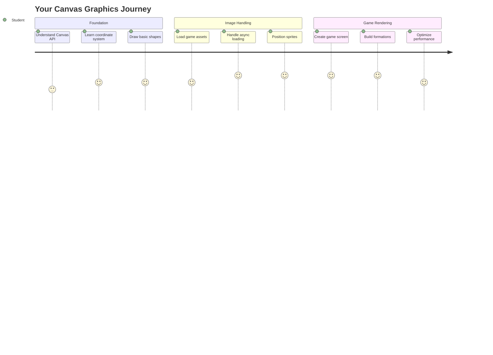
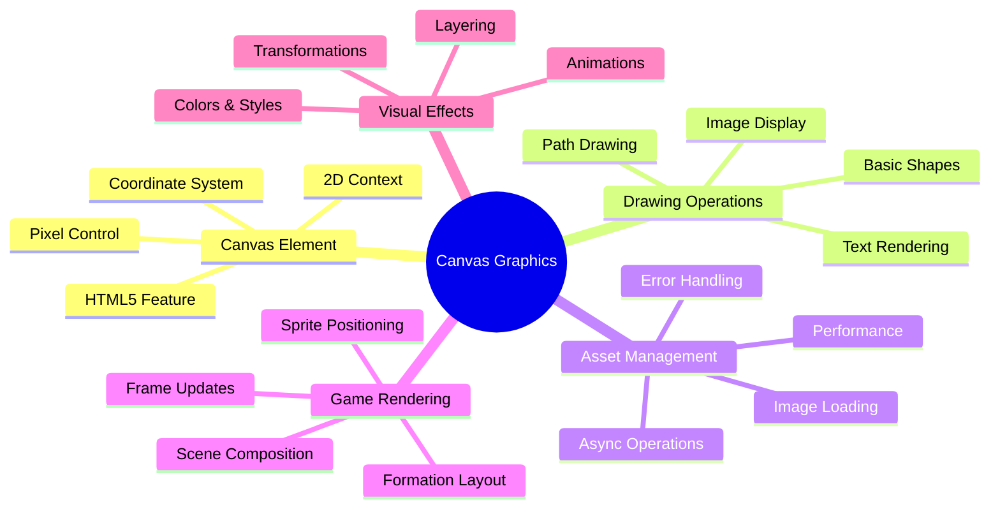
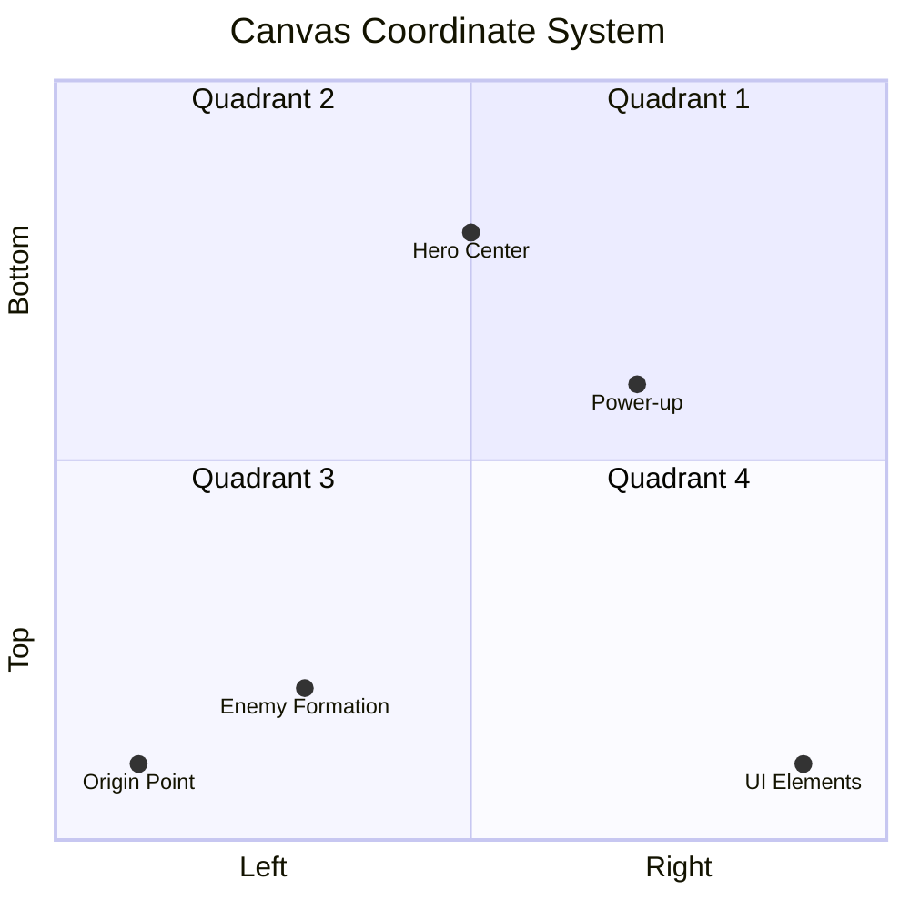
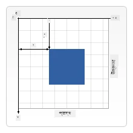
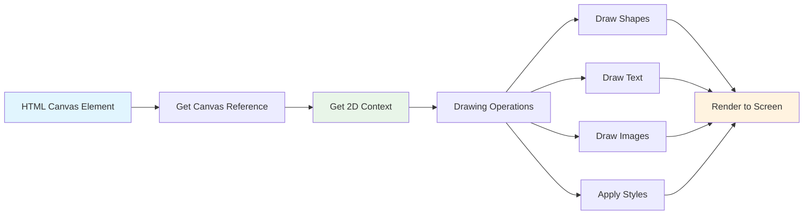
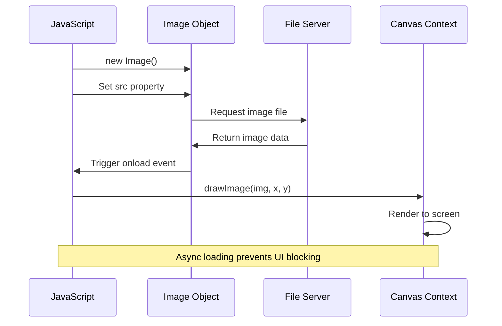
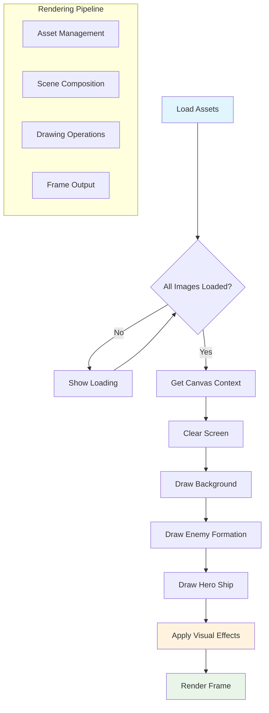
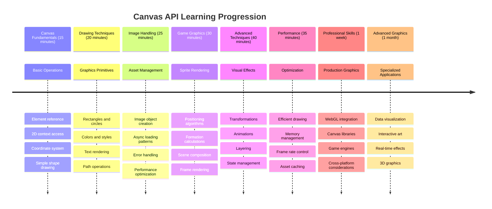

# স্পেস গেম তৈরি করুন পার্ট ২: হিরো এবং মনস্টারদের ক্যানভাসে আঁকুন



ক্যানভাস API ওয়েব ডেভেলপমেন্টের অন্যতম শক্তিশালী বৈশিষ্ট্য, যা আপনার ব্রাউজারে গতিশীল এবং ইন্টারঅ্যাকটিভ গ্রাফিক্স তৈরি করতে সাহায্য করে। এই পাঠে, আমরা সেই ফাঁকা HTML `<canvas>` উপাদানটিকে একটি গেম জগতে রূপান্তর করব, যেখানে হিরো এবং মনস্টাররা থাকবে। ক্যানভাসকে আপনার ডিজিটাল আর্ট বোর্ড হিসেবে ভাবুন, যেখানে কোড ভিজ্যুয়াল রূপ নেয়।

আমরা আগের পাঠে যা শিখেছেন তার উপর ভিত্তি করে কাজ করছি এবং এবার আমরা ভিজ্যুয়াল দিকগুলোতে গভীরভাবে প্রবেশ করব। আপনি শিখবেন কীভাবে গেম স্প্রাইট লোড এবং প্রদর্শন করতে হয়, উপাদানগুলো সঠিকভাবে অবস্থান করতে হয় এবং আপনার স্পেস গেমের জন্য ভিজ্যুয়াল ভিত্তি তৈরি করতে হয়। এটি স্থির ওয়েব পেজ এবং গতিশীল, ইন্টারঅ্যাকটিভ অভিজ্ঞতার মধ্যে সেতুবন্ধন তৈরি করে।

এই পাঠের শেষে, আপনার একটি সম্পূর্ণ গেম দৃশ্য থাকবে যেখানে আপনার হিরো শিপ সঠিকভাবে অবস্থান করবে এবং শত্রুদের গঠন যুদ্ধের জন্য প্রস্তুত থাকবে। আপনি বুঝতে পারবেন কীভাবে আধুনিক গেম ব্রাউজারে গ্রাফিক্স রেন্ডার করে এবং আপনার নিজস্ব ইন্টারঅ্যাকটিভ ভিজ্যুয়াল অভিজ্ঞতা তৈরি করার দক্ষতা অর্জন করবেন। চলুন ক্যানভাস গ্রাফিক্স অন্বেষণ করি এবং আপনার স্পেস গেমকে জীবন্ত করে তুলি!



## প্রি-লেকচার কুইজ

[প্রি-লেকচার কুইজ](https://ff-quizzes.netlify.app/web/quiz/31)

## ক্যানভাস

তাহলে এই `<canvas>` উপাদানটি আসলে কী? এটি HTML5-এর সমাধান, যা ওয়েব ব্রাউজারে গতিশীল গ্রাফিক্স এবং অ্যানিমেশন তৈরি করতে ব্যবহৃত হয়। সাধারণ ছবি বা ভিডিওর মতো স্থির নয়, ক্যানভাস আপনাকে স্ক্রিনে যা কিছু প্রদর্শিত হয় তার উপর পিক্সেল-লেভেল নিয়ন্ত্রণ দেয়। এটি গেম, ডেটা ভিজ্যুয়ালাইজেশন এবং ইন্টারঅ্যাকটিভ আর্টের জন্য আদর্শ। এটি একটি প্রোগ্রামেবল ড্রয়িং সারফেসের মতো, যেখানে জাভাস্ক্রিপ্ট আপনার পেইন্টব্রাশ হয়ে ওঠে।

ডিফল্টভাবে, একটি ক্যানভাস উপাদান আপনার পৃষ্ঠায় একটি ফাঁকা, স্বচ্ছ আয়তক্ষেত্রের মতো দেখায়। কিন্তু এখানেই এর সম্ভাবনা লুকিয়ে আছে! যখন আপনি জাভাস্ক্রিপ্ট ব্যবহার করে আকৃতি আঁকেন, ছবি লোড করেন, অ্যানিমেশন তৈরি করেন এবং ব্যবহারকারীর ইন্টারঅ্যাকশনের প্রতি সাড়া দেন, তখন এর আসল শক্তি প্রকাশ পায়। এটি অনেকটা ১৯৬০-এর দশকে বেল ল্যাবসের প্রথম ডিজিটাল অ্যানিমেশন তৈরি করার সময় কম্পিউটার গ্রাফিক্সের অগ্রদূতদের মতো।

✅ [ক্যানভাস API সম্পর্কে আরও পড়ুন](https://developer.mozilla.org/docs/Web/API/Canvas_API) MDN-এ।

এটি সাধারণত কীভাবে ঘোষণা করা হয়, তা পৃষ্ঠার বডির অংশ হিসেবে দেখুন:

```html
<canvas id="myCanvas" width="200" height="100"></canvas>
```

**এই কোডটি যা করে:**
- **`id` অ্যাট্রিবিউট সেট করে**, যাতে আপনি জাভাস্ক্রিপ্টে এই নির্দিষ্ট ক্যানভাস উপাদানটি রেফার করতে পারেন
- **পিক্সেলে `width` নির্ধারণ করে**, যা ক্যানভাসের অনুভূমিক আকার নিয়ন্ত্রণ করে
- **পিক্সেলে `height` নির্ধারণ করে**, যা ক্যানভাসের উল্লম্ব মাত্রা নির্ধারণ করে

## সহজ জ্যামিতিক আকৃতি আঁকা

এখন যেহেতু আপনি জানেন ক্যানভাস উপাদানটি কী, চলুন এটি ব্যবহার করে আঁকা শুরু করি! ক্যানভাস একটি কোঅর্ডিনেট সিস্টেম ব্যবহার করে, যা গণিত ক্লাস থেকে পরিচিত মনে হতে পারে, তবে কম্পিউটার গ্রাফিক্সের জন্য একটি গুরুত্বপূর্ণ পার্থক্য রয়েছে।

ক্যানভাস কার্টেসিয়ান কোঅর্ডিনেট ব্যবহার করে, যেখানে x-অক্ষ (অনুভূমিক) এবং y-অক্ষ (উল্লম্ব) রয়েছে, যা আপনি যা আঁকেন তা অবস্থান নির্ধারণ করে। তবে এখানে একটি গুরুত্বপূর্ণ পার্থক্য রয়েছে: গণিত ক্লাসের কোঅর্ডিনেট সিস্টেমের বিপরীতে, `(0,0)` এর উৎস বিন্দুটি উপরের-বাম কোণে শুরু হয়, যেখানে x-মান ডানদিকে যাওয়ার সাথে সাথে বৃদ্ধি পায় এবং y-মান নিচে যাওয়ার সাথে সাথে বৃদ্ধি পায়। এই পদ্ধতিটি প্রাথমিক কম্পিউটার ডিসপ্লেগুলোর ঐতিহ্য থেকে এসেছে, যেখানে ইলেকট্রন বিম উপরের থেকে নিচে স্ক্যান করত, ফলে উপরের-বাম প্রান্তটি প্রাকৃতিক সূচনাবিন্দু হয়ে ওঠে।




> ছবি [MDN](https://developer.mozilla.org/docs/Web/API/Canvas_API/Tutorial/Drawing_shapes) থেকে

ক্যানভাস উপাদানে আঁকার জন্য, আপনি একই তিন-ধাপের প্রক্রিয়া অনুসরণ করবেন, যা সমস্ত ক্যানভাস গ্রাফিক্সের ভিত্তি গঠন করে। এটি কয়েকবার করলে, এটি স্বাভাবিক হয়ে যাবে:



1. **আপনার ক্যানভাস উপাদানের একটি রেফারেন্স পান** DOM থেকে (যেমন অন্য HTML উপাদান)
2. **2D রেন্ডারিং কনটেক্সট পান** – এটি সমস্ত আঁকার পদ্ধতি প্রদান করে
3. **আঁকা শুরু করুন!** কনটেক্সটের বিল্ট-ইন পদ্ধতি ব্যবহার করে আপনার গ্রাফিক্স তৈরি করুন

কোডে এটি দেখতে এমন:

```javascript
// Step 1: Get the canvas element
const canvas = document.getElementById("myCanvas");

// Step 2: Get the 2D rendering context
const ctx = canvas.getContext("2d");

// Step 3: Set fill color and draw a rectangle
ctx.fillStyle = 'red';
ctx.fillRect(0, 0, 200, 200); // x, y, width, height
```

**এটি ধাপে ধাপে বিশ্লেষণ করা যাক:**
- আমরা **আমাদের ক্যানভাস উপাদানটি** এর ID ব্যবহার করে ধরেছি এবং একটি ভেরিয়েবলে সংরক্ষণ করেছি
- আমরা **2D রেন্ডারিং কনটেক্সটটি** পেয়েছি – এটি আমাদের আঁকার টুলকিট
- আমরা ক্যানভাসকে বলেছি যে আমরা লাল রঙ দিয়ে জিনিসগুলো পূরণ করতে চাই `fillStyle` প্রপার্টি ব্যবহার করে
- আমরা একটি আয়তক্ষেত্র আঁকছি যা উপরের-বাম কোণে (0,0) শুরু হয় এবং ২০০ পিক্সেল চওড়া এবং লম্বা

✅ ক্যানভাস API মূলত 2D আকৃতির উপর ফোকাস করে, তবে আপনি ওয়েবসাইটে 3D উপাদানও আঁকতে পারেন; এর জন্য আপনি [WebGL API](https://developer.mozilla.org/docs/Web/API/WebGL_API) ব্যবহার করতে পারেন।

ক্যানভাস API দিয়ে আপনি বিভিন্ন জিনিস আঁকতে পারেন যেমন:

- **জ্যামিতিক আকৃতি**, আমরা ইতিমধ্যে দেখিয়েছি কীভাবে একটি আয়তক্ষেত্র আঁকা যায়, তবে আরও অনেক কিছু আঁকা সম্ভব।
- **টেক্সট**, আপনি যেকোনো ফন্ট এবং রঙ দিয়ে টেক্সট আঁকতে পারেন।
- **ছবি**, আপনি একটি .jpg বা .png ইমেজ অ্যাসেট থেকে একটি ছবি আঁকতে পারেন।

✅ চেষ্টা করুন! আপনি জানেন কীভাবে একটি আয়তক্ষেত্র আঁকা যায়, আপনি কি একটি বৃত্ত আঁকতে পারেন? CodePen-এ কিছু আকর্ষণীয় ক্যানভাস আঁকা দেখুন। এখানে একটি [বিশেষভাবে চিত্তাকর্ষক উদাহরণ](https://codepen.io/dissimulate/pen/KrAwx) রয়েছে।

### 🔄 **শিক্ষাগত চেক-ইন**
**ক্যানভাস মৌলিক বিষয়ের বোঝাপড়া**: ইমেজ লোডিংয়ে যাওয়ার আগে নিশ্চিত করুন যে আপনি:
- ✅ ব্যাখ্যা করতে পারেন ক্যানভাস কোঅর্ডিনেট সিস্টেম কীভাবে গণিতের কোঅর্ডিনেট থেকে আলাদা
- ✅ ক্যানভাস আঁকার অপারেশনের তিন-ধাপের প্রক্রিয়া বুঝতে পারেন
- ✅ 2D রেন্ডারিং কনটেক্সট কী প্রদান করে তা চিহ্নিত করতে পারেন
- ✅ ব্যাখ্যা করতে পারেন কীভাবে fillStyle এবং fillRect একসাথে কাজ করে

**দ্রুত স্ব-পরীক্ষা**: আপনি কীভাবে (100, 50) অবস্থানে 25 রেডিয়াসের একটি নীল বৃত্ত আঁকবেন?
```javascript
ctx.fillStyle = 'blue';
ctx.beginPath();
ctx.arc(100, 50, 25, 0, 2 * Math.PI);
ctx.fill();
```

**আপনি এখন যে ক্যানভাস আঁকার পদ্ধতিগুলো জানেন**:
- **fillRect()**: পূর্ণ আয়তক্ষেত্র আঁকে
- **fillStyle**: রঙ এবং প্যাটার্ন সেট করে
- **beginPath()**: নতুন আঁকার পথ শুরু করে
- **arc()**: বৃত্ত এবং কার্ভ তৈরি করে

## একটি ইমেজ অ্যাসেট লোড এবং আঁকা

মৌলিক আকৃতি আঁকা শুরু করার জন্য উপযোগী, তবে বেশিরভাগ গেমে আসল ছবি প্রয়োজন! স্প্রাইট, ব্যাকগ্রাউন্ড এবং টেক্সচার গেমগুলোকে তাদের ভিজ্যুয়াল আকর্ষণ দেয়। ক্যানভাসে ছবি লোড এবং প্রদর্শন করা জ্যামিতিক আকৃতি আঁকার চেয়ে ভিন্নভাবে কাজ করে, তবে একবার প্রক্রিয়াটি বুঝে গেলে এটি সহজ হয়ে যায়।

আমাদের একটি `Image` অবজেক্ট তৈরি করতে হবে, আমাদের ইমেজ ফাইল লোড করতে হবে (এটি অ্যাসিঙ্ক্রোনাসভাবে ঘটে, অর্থাৎ "পটভূমিতে"), এবং তারপর এটি ক্যানভাসে আঁকতে হবে যখন এটি প্রস্তুত হবে। এই পদ্ধতিটি নিশ্চিত করে যে আপনার ছবি সঠিকভাবে প্রদর্শিত হয় এবং লোড হওয়ার সময় আপনার অ্যাপ্লিকেশন ব্লক হয় না।



### মৌলিক ইমেজ লোডিং

```javascript
const img = new Image();
img.src = 'path/to/my/image.png';
img.onload = () => {
  // Image loaded and ready to be used
  console.log('Image loaded successfully!');
};
```

**এই কোডে যা ঘটছে:**
- আমরা **একটি নতুন ইমেজ অবজেক্ট তৈরি করছি** আমাদের স্প্রাইট বা টেক্সচার ধারণ করার জন্য
- আমরা **এটি কোন ইমেজ ফাইল লোড করবে তা বলছি** সোর্স পাথ সেট করে
- আমরা **লোড ইভেন্টের জন্য শুনছি**, যাতে আমরা জানি কখন ইমেজটি ব্যবহারের জন্য প্রস্তুত

### ইমেজ লোড করার একটি উন্নত পদ্ধতি

এখানে একটি আরও শক্তিশালী পদ্ধতি রয়েছে যা পেশাদার ডেভেলপাররা সাধারণত ব্যবহার করেন। আমরা ইমেজ লোডিংকে একটি Promise-ভিত্তিক ফাংশনে মোড়াবো – এই পদ্ধতি, ES6-এ জাভাস্ক্রিপ্ট Promises স্ট্যান্ডার্ড হওয়ার সময় জনপ্রিয় হয়েছিল, এটি আপনার কোডকে আরও সংগঠিত করে এবং ত্রুটি সুন্দরভাবে পরিচালনা করে:

```javascript
function loadAsset(path) {
  return new Promise((resolve, reject) => {
    const img = new Image();
    img.src = path;
    img.onload = () => {
      resolve(img);
    };
    img.onerror = () => {
      reject(new Error(`Failed to load image: ${path}`));
    };
  });
}

// Modern usage with async/await
async function initializeGame() {
  try {
    const heroImg = await loadAsset('hero.png');
    const monsterImg = await loadAsset('monster.png');
    // Images are now ready to use
  } catch (error) {
    console.error('Failed to load game assets:', error);
  }
}
```

**আমরা এখানে যা করেছি:**
- **সমস্ত ইমেজ লোডিং লজিককে** একটি Promise-এ মোড়ানো হয়েছে যাতে এটি আরও ভালোভাবে পরিচালনা করা যায়
- **ত্রুটি পরিচালনা যোগ করা হয়েছে**, যা আমাদের বলে যখন কিছু ভুল হয়
- **আধুনিক async/await সিনট্যাক্স ব্যবহার করা হয়েছে**, কারণ এটি পড়তে অনেক পরিষ্কার
- **try/catch ব্লক অন্তর্ভুক্ত করা হয়েছে**, যাতে লোডিংয়ের কোনো সমস্যা সুন্দরভাবে পরিচালিত হয়

আপনার ইমেজগুলো লোড হয়ে গেলে, ক্যানভাসে সেগুলো আঁকা আসলে বেশ সহজ:

```javascript
async function renderGameScreen() {
  try {
    // Load game assets
    const heroImg = await loadAsset('hero.png');
    const monsterImg = await loadAsset('monster.png');

    // Get canvas and context
    const canvas = document.getElementById("myCanvas");
    const ctx = canvas.getContext("2d");

    // Draw images to specific positions
    ctx.drawImage(heroImg, canvas.width / 2, canvas.height / 2);
    ctx.drawImage(monsterImg, 0, 0);
  } catch (error) {
    console.error('Failed to render game screen:', error);
  }
}
```

**এটি ধাপে ধাপে বিশ্লেষণ করা যাক:**
- আমরা **আমাদের হিরো এবং মনস্টার ইমেজগুলো** পটভূমিতে await ব্যবহার করে লোড করছি
- আমরা **আমাদের ক্যানভাস উপাদানটি ধরছি** এবং প্রয়োজনীয় 2D রেন্ডারিং কনটেক্সট পাচ্ছি
- আমরা **হিরো ইমেজটি** কিছু দ্রুত কোঅর্ডিনেট গণিত ব্যবহার করে ঠিক কেন্দ্রে অবস্থান করছি
- আমরা **মনস্টার ইমেজটি** উপরের-বাম কোণে রাখছি, যাতে শত্রু গঠন শুরু হয়
- আমরা **যে কোনো ত্রুটি ধরছি**, যা লোডিং বা রেন্ডারিংয়ের সময় ঘটতে পারে



## এখন আপনার গেম তৈরি শুরু করার সময়

এখন আমরা সবকিছু একত্রিত করব, যাতে আপনার স্পেস গেমের ভিজ্যুয়াল ভিত্তি তৈরি করা যায়। আপনি ক্যানভাসের মৌলিক বিষয় এবং ইমেজ লোডিং কৌশল সম্পর্কে একটি শক্তিশালী ধারণা অর্জন করেছেন, তাই এই হাতে-কলমে অংশটি আপনাকে সঠিকভাবে অবস্থান করা স্প্রাইটসহ একটি সম্পূর্ণ গেম স্ক্রিন তৈরি করতে গাইড করবে।

### কী তৈরি করবেন

আপনি একটি ক্যানভাস উপাদান সহ একটি ওয়েব পেজ তৈরি করবেন। এটি একটি কালো স্ক্রিন `1024*768` রেন্ডার করবে। আমরা আপনাকে দুটি ইমেজ সরবরাহ করেছি:

- হিরো শিপ

   

- 5*5 মনস্টার

   

### ডেভেলপমেন্ট শুরু করার জন্য প্রস্তাবিত ধাপ

`your-work` সাব ফোল্ডারে আপনার জন্য তৈরি করা স্টার্টার ফাইলগুলো খুঁজুন। আপনার প্রকল্পের কাঠামোতে অন্তর্ভুক্ত থাকবে:

```bash
your-work/
├── assets/
│   ├── enemyShip.png
│   └── player.png
├── index.html
├── app.js
└── package.json
```

**আপনি যা নিয়ে কাজ করছেন:**
- **গেম স্প্রাইটগুলো** `assets/` ফোল্ডারে রয়েছে, যাতে সবকিছু সংগঠিত থাকে
- **আপনার প্রধান HTML ফাইলটি** ক্যানভাস উপাদান সেটআপ করে এবং সবকিছু প্রস্তুত করে
- **একটি জাভাস্ক্রিপ্ট ফাইল**, যেখানে আপনি আপনার গেম রেন্ডারিং ম্যাজিক লিখবেন
- **একটি package.json**, যা একটি ডেভেলপমেন্ট সার্ভার সেটআপ করে, যাতে আপনি স্থানীয়ভাবে পরীক্ষা করতে পারেন

Visual Studio Code-এ এই ফোল্ডারটি খুলুন এবং ডেভেলপমেন্ট শুরু করুন। Visual Studio Code, NPM এবং Node.js সহ একটি স্থানীয় ডেভেলপমেন্ট পরিবেশের প্রয়োজন হবে। যদি আপনার কম্পিউটারে `npm` সেটআপ না থাকে, [এখানে এটি কীভাবে ইনস্টল করবেন](https://www.npmjs.com/get-npm)।

`your-work` ফোল্ডারে নেভিগেট করে আপনার ডেভেলপমেন্ট সার্ভার শুরু করুন:

```bash
cd your-work
npm start
```

**এই কমান্ডটি কিছু চমৎকার কাজ করে:**
- **একটি স্থানীয় সার্ভার শুরু করে** `http://localhost:5000` এ, যাতে আপনি আপনার গেম পরীক্ষা করতে পারেন
- **আপনার সমস্ত ফাইল সঠিকভাবে পরিবেশন করে**, যাতে আপনার ব্রাউজার সেগুলো সঠিকভাবে লোড করতে পারে
- **আপনার ফাইলগুলো পরিবর্তনের জন্য নজর রাখে**, যাতে আপনি সহজে ডেভেলপ করতে পারেন
- **আপনাকে একটি পেশাদার ডেভেলপমেন্ট পরিবেশ দেয়**, যাতে সবকিছু পরীক্ষা করা যায়

> 💡 **নোট**: আপনার ব্রাউজার প্রথমে একটি ফাঁকা পৃষ্ঠা দেখাবে – এটি প্রত্যাশিত! আপনি কোড যোগ করার সাথে সাথে, আপনার পরিবর্তন দেখতে ব্রাউজারটি রিফ্রেশ করুন। এই পুনরাবৃত্তিমূলক ডেভেলপমেন্ট পদ্ধতি NASA-এর অ্যাপোলো গাইডেন্স কম্পিউটার তৈরির মতো – বড় সিস্টেমে একত্রিত করার আগে প্রতিটি উপাদান পরীক্ষা করা।

### কোড যোগ করুন

`your-work/app.js`-এ প্রয়োজনীয় কোড যোগ করুন, যাতে নিম্নলিখিত কাজগুলো সম্পন্ন হয়:

1. **কালো ব্যাকগ্রাউন্ড সহ একটি ক্যানভাস আঁকুন**
   > 💡 **কীভাবে করবেন**: `/app.js`-এ TODO খুঁজুন এবং মাত্র দুটি লাইন যোগ করুন। `ctx.fillStyle`-কে কালো সেট করুন, তারপর আপনার ক্যানভাসের মাত্রা দিয়ে (0,0) থেকে শুরু করে `ctx.fillRect()` ব্যবহার করুন। সহজ!

2. **গেম টেক্সচার লোড করুন**
   > 💡 **কীভাবে করবেন**: আপনার প্লেয়ার এবং শত্রু ইমেজগুলো লোড করতে `await loadAsset()` ব্যবহার করুন। এগুলো ভেরিয়েবলে সংরক্ষণ করুন, যাতে আপনি পরে ব্যবহার করতে পারেন। মনে রাখবেন – সেগুলো তখনই প্রদর্শিত হবে যখন আপনি আসলে সেগুলো আঁকবেন!

3. **হিরো শিপটি কেন্দ্রে-নিচের অবস্থানে আঁকুন**
   > 💡 **কীভাবে করবেন**: আপনার হিরোকে অবস্থান করতে `ctx.drawImage()` ব্যবহার করুন। x-কোঅর্ডিনেটের জন্য, `canvas.width / 2 - 45` ব্যবহার করুন, যাতে এটি কেন্দ্রে থাকে, এবং y-কোঅর্ডিনেটের জন্য `canvas.height - canvas.height / 4` ব্যবহার করুন, যাতে এটি নিচের এলাকায় থাকে।

4. **শত্রু শিপের একটি 5×5 গঠন আঁকুন**
   > 💡 **কীভাবে করবেন**: `createEnemies` ফাংশনটি খুঁজুন এবং একটি নেস্টেড লুপ সেটআপ করুন। স্পেসিং এবং অবস্থানের জন্য কিছু গণিত করতে হবে, তবে চিন্তা করবেন না – আমি আপনাকে ঠিক কীভাবে করতে হবে তা দেখাব!

প্রথমে, সঠিক শত্রু গঠন লেআউটের জন্য কনস্ট্যান্ট স্থাপন করুন:

```javascript
const ENEMY_TOTAL = 5;
const ENEMY_SPACING = 98;
const FORMATION_WIDTH = ENEMY_TOTAL * ENEMY_SPACING;
const START_X = (canvas.width - FORMATION_WIDTH) / 2;
const STOP_X = START_X + FORMATION_WIDTH;
```

**এই কনস্ট্যান্টগুলো কী করে
- **সমন্বয় ব্যবস্থা**: গণিতকে স্ক্রিন অবস্থানে রূপান্তর করা
- **স্প্রাইট ব্যবস্থাপনা**: গেম গ্রাফিক্স লোড এবং প্রদর্শন করা
- **গঠন অ্যালগরিদম**: সংগঠিত বিন্যাসের জন্য গাণিতিক প্যাটার্ন
- **অ্যাসিঙ্ক অপারেশন**: মসৃণ ব্যবহারকারীর অভিজ্ঞতার জন্য আধুনিক জাভাস্ক্রিপ্ট

## ফলাফল

শেষ ফলাফলটি এরকম দেখতে হবে:


## সমাধান

প্রথমে নিজে চেষ্টা করুন সমাধান করতে, তবে যদি আটকে যান, তাহলে একটি [সমাধান](../../../../6-space-game/2-drawing-to-canvas/solution/app.js) দেখুন।

---

## GitHub Copilot Agent Challenge 🚀

Agent মোড ব্যবহার করে নিম্নলিখিত চ্যালেঞ্জ সম্পন্ন করুন:

**বর্ণনা:** Canvas API এর শেখা কৌশল ব্যবহার করে আপনার স্পেস গেম ক্যানভাসে ভিজ্যুয়াল ইফেক্ট এবং ইন্টারঅ্যাকটিভ উপাদান যোগ করুন।

**প্রম্পট:** `enhanced-canvas.html` নামে একটি নতুন ফাইল তৈরি করুন যেখানে একটি ক্যানভাস থাকবে যা ব্যাকগ্রাউন্ডে অ্যানিমেটেড তারা প্রদর্শন করবে, হিরো শিপের জন্য একটি পালসিং হেলথ বার থাকবে এবং শত্রু শিপগুলো ধীরে ধীরে নিচের দিকে সরবে। জাভাস্ক্রিপ্ট কোড অন্তর্ভুক্ত করুন যা র্যান্ডম অবস্থান এবং অপাসিটি ব্যবহার করে ঝলমলে তারা আঁকে, হেলথ লেভেলের উপর ভিত্তি করে রঙ পরিবর্তন করে এমন একটি হেলথ বার বাস্তবায়ন করে (সবুজ > হলুদ > লাল), এবং শত্রু শিপগুলোকে বিভিন্ন গতিতে স্ক্রিনের নিচে সরানোর জন্য অ্যানিমেট করে।

Agent মোড সম্পর্কে আরও জানুন [এখানে](https://code.visualstudio.com/blogs/2025/02/24/introducing-copilot-agent-mode)।

## 🚀 চ্যালেঞ্জ

আপনি 2D-কেন্দ্রিক Canvas API সম্পর্কে শিখেছেন; [WebGL API](https://developer.mozilla.org/docs/Web/API/WebGL_API) দেখুন এবং একটি 3D অবজেক্ট আঁকার চেষ্টা করুন।

## পোস্ট-লেকচার কুইজ

[পোস্ট-লেকচার কুইজ](https://ff-quizzes.netlify.app/web/quiz/32)

## পর্যালোচনা এবং স্ব-অধ্যয়ন

Canvas API সম্পর্কে আরও জানুন [এখানে পড়ুন](https://developer.mozilla.org/docs/Web/API/Canvas_API)।

### ⚡ **পরবর্তী ৫ মিনিটে আপনি যা করতে পারেন**
- [ ] ব্রাউজার কনসোলে যান এবং `document.createElement('canvas')` ব্যবহার করে একটি ক্যানভাস এলিমেন্ট তৈরি করুন
- [ ] ক্যানভাস কনটেক্সটে `fillRect()` ব্যবহার করে একটি আয়তক্ষেত্র আঁকার চেষ্টা করুন
- [ ] `fillStyle` প্রপার্টি ব্যবহার করে বিভিন্ন রঙের সাথে পরীক্ষা করুন
- [ ] `arc()` মেথড ব্যবহার করে একটি সাধারণ বৃত্ত আঁকুন

### 🎯 **এই ঘণ্টায় আপনি যা অর্জন করতে পারেন**
- [ ] পোস্ট-লেসন কুইজ সম্পন্ন করুন এবং ক্যানভাসের মৌলিক বিষয়গুলি বুঝুন
- [ ] একাধিক আকৃতি এবং রঙের সাথে একটি ক্যানভাস ড্রয়িং অ্যাপ্লিকেশন তৈরি করুন
- [ ] আপনার গেমের জন্য ইমেজ লোডিং এবং স্প্রাইট রেন্ডারিং বাস্তবায়ন করুন
- [ ] একটি সাধারণ অ্যানিমেশন তৈরি করুন যা ক্যানভাসে বস্তু সরায়
- [ ] স্কেলিং, রোটেশন এবং ট্রান্সলেশন এর মতো ক্যানভাস রূপান্তর অনুশীলন করুন

### 📅 **আপনার সপ্তাহব্যাপী ক্যানভাস যাত্রা**
- [ ] স্পেস গেমটি সম্পন্ন করুন উন্নত গ্রাফিক্স এবং স্প্রাইট অ্যানিমেশন সহ
- [ ] গ্রেডিয়েন্ট, প্যাটার্ন এবং কম্পোজিটিং এর মতো উন্নত ক্যানভাস কৌশল আয়ত্ত করুন
- [ ] ক্যানভাস ব্যবহার করে ইন্টারঅ্যাকটিভ ভিজ্যুয়ালাইজেশন তৈরি করুন
- [ ] মসৃণ পারফরম্যান্সের জন্য ক্যানভাস অপ্টিমাইজেশন কৌশল শিখুন
- [ ] বিভিন্ন টুল সহ একটি ড্রয়িং বা পেইন্টিং অ্যাপ্লিকেশন তৈরি করুন
- [ ] ক্যানভাস ব্যবহার করে সৃজনশীল কোডিং প্যাটার্ন এবং জেনারেটিভ আর্ট অন্বেষণ করুন

### 🌟 **আপনার মাসব্যাপী গ্রাফিক্স দক্ষতা অর্জন**
- [ ] Canvas 2D এবং WebGL ব্যবহার করে জটিল ভিজ্যুয়াল অ্যাপ্লিকেশন তৈরি করুন
- [ ] গ্রাফিক্স প্রোগ্রামিং ধারণা এবং শেডার বেসিক শিখুন
- [ ] ওপেন সোর্স গ্রাফিক্স লাইব্রেরি এবং ভিজ্যুয়ালাইজেশন টুলে অবদান রাখুন
- [ ] গ্রাফিক্স-ইন্টেনসিভ অ্যাপ্লিকেশনের জন্য পারফরম্যান্স অপ্টিমাইজেশন আয়ত্ত করুন
- [ ] ক্যানভাস প্রোগ্রামিং এবং কম্পিউটার গ্রাফিক্স সম্পর্কে শিক্ষামূলক বিষয়বস্তু তৈরি করুন
- [ ] গ্রাফিক্স প্রোগ্রামিং বিশেষজ্ঞ হয়ে উঠুন যিনি অন্যদের ভিজ্যুয়াল অভিজ্ঞতা তৈরি করতে সাহায্য করেন

## 🎯 আপনার ক্যানভাস গ্রাফিক্স দক্ষতা অর্জনের সময়রেখা



### 🛠️ আপনার ক্যানভাস গ্রাফিক্স টুলকিট সারসংক্ষেপ

এই পাঠটি সম্পন্ন করার পরে, আপনার কাছে এখন রয়েছে:
- **Canvas API দক্ষতা**: 2D গ্রাফিক্স প্রোগ্রামিংয়ের সম্পূর্ণ বোঝাপড়া
- **সমন্বয় গণিত**: সুনির্দিষ্ট অবস্থান এবং বিন্যাস অ্যালগরিদম
- **অ্যাসেট ব্যবস্থাপনা**: পেশাদার ইমেজ লোডিং এবং ত্রুটি পরিচালনা
- **রেন্ডারিং পাইপলাইন**: দৃশ্য রচনা করার জন্য গঠিত পদ্ধতি
- **গেম গ্রাফিক্স**: স্প্রাইট অবস্থান এবং গঠন গণনা
- **অ্যাসিঙ্ক প্রোগ্রামিং**: মসৃণ পারফরম্যান্সের জন্য আধুনিক জাভাস্ক্রিপ্ট প্যাটার্ন
- **ভিজ্যুয়াল প্রোগ্রামিং**: গাণিতিক ধারণাগুলোকে স্ক্রিন গ্রাফিক্সে রূপান্তর করা

**বাস্তব জীবনের প্রয়োগ**: আপনার ক্যানভাস দক্ষতা সরাসরি প্রয়োগ করা যায়:
- **ডেটা ভিজ্যুয়ালাইজেশন**: চার্ট, গ্রাফ এবং ইন্টারঅ্যাকটিভ ড্যাশবোর্ড
- **গেম ডেভেলপমেন্ট**: 2D গেম, সিমুলেশন এবং ইন্টারঅ্যাকটিভ অভিজ্ঞতা
- **ডিজিটাল আর্ট**: সৃজনশীল কোডিং এবং জেনারেটিভ আর্ট প্রকল্প
- **UI/UX ডিজাইন**: কাস্টম গ্রাফিক্স এবং ইন্টারঅ্যাকটিভ উপাদান
- **শিক্ষামূলক সফটওয়্যার**: ভিজ্যুয়াল লার্নিং টুল এবং সিমুলেশন
- **ওয়েব অ্যাপ্লিকেশন**: ডায়নামিক গ্রাফিক্স এবং রিয়েল-টাইম ভিজ্যুয়ালাইজেশন

**পেশাদার দক্ষতা অর্জন**: এখন আপনি পারেন:
- **তৈরি করুন** বাহ্যিক লাইব্রেরি ছাড়াই কাস্টম গ্রাফিক্স সমাধান
- **অপ্টিমাইজ করুন** মসৃণ ব্যবহারকারীর অভিজ্ঞতার জন্য রেন্ডারিং পারফরম্যান্স
- **ডিবাগ করুন** জটিল ভিজ্যুয়াল সমস্যাগুলো ব্রাউজার ডেভেলপার টুল ব্যবহার করে
- **ডিজাইন করুন** গাণিতিক নীতিগুলোর ব্যবহার করে স্কেলযোগ্য গ্রাফিক্স সিস্টেম
- **ইন্টিগ্রেট করুন** ক্যানভাস গ্রাফিক্স আধুনিক ওয়েব অ্যাপ্লিকেশন ফ্রেমওয়ার্কের সাথে

**Canvas API মেথড যা আপনি আয়ত্ত করেছেন**:
- **এলিমেন্ট ব্যবস্থাপনা**: getElementById, getContext
- **ড্রয়িং অপারেশন**: fillRect, drawImage, fillStyle
- **অ্যাসেট লোডিং**: ইমেজ অবজেক্ট, Promise প্যাটার্ন
- **গাণিতিক অবস্থান**: সমন্বয় গণনা, গঠন অ্যালগরিদম

**পরবর্তী স্তর**: আপনি এখন অ্যানিমেশন, ব্যবহারকারী ইন্টারঅ্যাকশন, সংঘর্ষ সনাক্তকরণ যোগ করতে বা 3D গ্রাফিক্সের জন্য WebGL অন্বেষণ করতে প্রস্তুত!

🌟 **অর্জন আনলক হয়েছে**: আপনি মৌলিক Canvas API কৌশল ব্যবহার করে একটি সম্পূর্ণ গেম রেন্ডারিং সিস্টেম তৈরি করেছেন!

## অ্যাসাইনমেন্ট

[Canvas API নিয়ে কাজ করুন](assignment.md)

---

**অস্বীকৃতি**:  
এই নথিটি AI অনুবাদ পরিষেবা [Co-op Translator](https://github.com/Azure/co-op-translator) ব্যবহার করে অনুবাদ করা হয়েছে। আমরা যথাসাধ্য সঠিকতার জন্য চেষ্টা করি, তবে অনুগ্রহ করে মনে রাখবেন যে স্বয়ংক্রিয় অনুবাদে ত্রুটি বা অসঙ্গতি থাকতে পারে। মূল ভাষায় থাকা নথিটিকে প্রামাণিক উৎস হিসেবে বিবেচনা করা উচিত। গুরুত্বপূর্ণ তথ্যের জন্য, পেশাদার মানব অনুবাদ সুপারিশ করা হয়। এই অনুবাদ ব্যবহারের ফলে কোনো ভুল বোঝাবুঝি বা ভুল ব্যাখ্যা হলে আমরা দায়ী থাকব না।