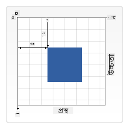

<!--
CO_OP_TRANSLATOR_METADATA:
{
  "original_hash": "41be8d35e7f30aa9dad10773c35e89c4",
  "translation_date": "2025-08-25T22:17:02+00:00",
  "source_file": "6-space-game/2-drawing-to-canvas/README.md",
  "language_code": "bn"
}
-->
# মহাকাশ গেম তৈরি করুন পার্ট ২: হিরো এবং মনস্টার ক্যানভাসে আঁকা

## প্রাক-লেকচার কুইজ

[প্রাক-লেকচার কুইজ](https://ff-quizzes.netlify.app/web/quiz/31)

## ক্যানভাস

ক্যানভাস একটি HTML উপাদান যা ডিফল্টভাবে কোনো কন্টেন্ট রাখে না; এটি একটি ফাঁকা পৃষ্ঠা। এটি ব্যবহার করে আঁকতে হবে।

✅ [ক্যানভাস API](https://developer.mozilla.org/docs/Web/API/Canvas_API) সম্পর্কে আরও জানুন MDN-এ।

এটি সাধারণত পৃষ্ঠার বডির অংশ হিসেবে এভাবে ঘোষণা করা হয়:

```html
<canvas id="myCanvas" width="200" height="100"></canvas>
```

উপরের কোডে আমরা `id`, `width` এবং `height` সেট করছি।

- `id`: এটি সেট করুন যাতে আপনি এটি রেফারেন্স করতে পারেন যখন এটি নিয়ে কাজ করতে হবে।
- `width`: এটি উপাদানের প্রস্থ।
- `height`: এটি উপাদানের উচ্চতা।

## সহজ জ্যামিতিক চিত্র আঁকা

ক্যানভাস জিনিস আঁকার জন্য একটি কার্টেসিয়ান কোঅর্ডিনেট সিস্টেম ব্যবহার করে। এটি x-অক্ষ এবং y-অক্ষ ব্যবহার করে কোনো কিছুর অবস্থান প্রকাশ করে। অবস্থান `0,0` হল উপরের বাম কোণ এবং নিচের ডান কোণ হল ক্যানভাসের প্রস্থ এবং উচ্চতা।

  
> ছবি [MDN](https://developer.mozilla.org/docs/Web/API/Canvas_API/Tutorial/Drawing_shapes) থেকে

ক্যানভাস উপাদানে আঁকার জন্য আপনাকে নিম্নলিখিত ধাপগুলো অনুসরণ করতে হবে:

1. **রেফারেন্স নিন** ক্যানভাস উপাদানের।
2. **রেফারেন্স নিন** ক্যানভাস উপাদানের উপর থাকা কনটেক্সট উপাদানের।
3. **ড্রয়িং অপারেশন করুন** কনটেক্সট উপাদান ব্যবহার করে।

উপরের ধাপগুলোর জন্য কোড সাধারণত এভাবে দেখায়:

```javascript
// draws a red rectangle
//1. get the canvas reference
canvas = document.getElementById("myCanvas");

//2. set the context to 2D to draw basic shapes
ctx = canvas.getContext("2d");

//3. fill it with the color red
ctx.fillStyle = 'red';

//4. and draw a rectangle with these parameters, setting location and size
ctx.fillRect(0,0, 200, 200) // x,y,width, height
```

✅ ক্যানভাস API মূলত 2D চিত্রের উপর ফোকাস করে, তবে আপনি ওয়েবসাইটে 3D উপাদানও আঁকতে পারেন; এর জন্য আপনি [WebGL API](https://developer.mozilla.org/docs/Web/API/WebGL_API) ব্যবহার করতে পারেন।

ক্যানভাস API দিয়ে আপনি বিভিন্ন জিনিস আঁকতে পারেন, যেমন:

- **জ্যামিতিক চিত্র**, আমরা ইতিমধ্যে দেখিয়েছি কীভাবে একটি আয়তক্ষেত্র আঁকা যায়, তবে আরও অনেক কিছু আঁকা সম্ভব।
- **টেক্সট**, আপনি যেকোনো ফন্ট এবং রঙে টেক্সট আঁকতে পারেন।
- **ছবি**, আপনি একটি .jpg বা .png এর মতো ইমেজ অ্যাসেট থেকে ছবি আঁকতে পারেন।

✅ চেষ্টা করুন! আপনি জানেন কীভাবে একটি আয়তক্ষেত্র আঁকতে হয়, এবার একটি বৃত্ত আঁকার চেষ্টা করুন। CodePen-এ কিছু আকর্ষণীয় ক্যানভাস ড্রয়িং দেখুন। এখানে একটি [বিশেষভাবে চমকপ্রদ উদাহরণ](https://codepen.io/dissimulate/pen/KrAwx) রয়েছে।

## একটি ইমেজ অ্যাসেট লোড এবং আঁকা

আপনি একটি ইমেজ অ্যাসেট লোড করেন একটি `Image` অবজেক্ট তৈরি করে এবং এর `src` প্রপার্টি সেট করে। এরপর আপনি `load` ইভেন্টটি শোনেন এটি ব্যবহারের জন্য প্রস্তুত কিনা তা জানার জন্য। কোডটি এভাবে দেখায়:

### অ্যাসেট লোড

```javascript
const img = new Image();
img.src = 'path/to/my/image.png';
img.onload = () => {
  // image loaded and ready to be used
}
```

### অ্যাসেট লোড প্যাটার্ন

উপরের কোডটি একটি কাঠামোর মধ্যে মোড়ানো সুপারিশ করা হয়, যাতে এটি ব্যবহার করা সহজ হয় এবং আপনি এটি সম্পূর্ণ লোড হওয়ার পরেই এটি ম্যানিপুলেট করার চেষ্টা করেন:

```javascript
function loadAsset(path) {
  return new Promise((resolve) => {
    const img = new Image();
    img.src = path;
    img.onload = () => {
      // image loaded and ready to be used
      resolve(img);
    }
  })
}

// use like so

async function run() {
  const heroImg = await loadAsset('hero.png')
  const monsterImg = await loadAsset('monster.png')
}

```

গেম অ্যাসেট স্ক্রিনে আঁকার জন্য আপনার কোডটি এভাবে দেখাবে:

```javascript
async function run() {
  const heroImg = await loadAsset('hero.png')
  const monsterImg = await loadAsset('monster.png')

  canvas = document.getElementById("myCanvas");
  ctx = canvas.getContext("2d");
  ctx.drawImage(heroImg, canvas.width/2,canvas.height/2);
  ctx.drawImage(monsterImg, 0,0);
}
```

## এখন আপনার গেম তৈরি শুরু করার সময়

### কী তৈরি করবেন

আপনি একটি ওয়েব পৃষ্ঠা তৈরি করবেন যেখানে একটি ক্যানভাস উপাদান থাকবে। এটি একটি কালো স্ক্রিন `1024*768` রেন্ডার করবে। আমরা আপনাকে দুটি ছবি দিয়েছি:

- হিরো শিপ

   

- 5*5 মনস্টার

   

### ডেভেলপমেন্ট শুরু করার জন্য প্রস্তাবিত ধাপ

`your-work` সাব ফোল্ডারে তৈরি করা ফাইলগুলো খুঁজুন। এতে নিম্নলিখিত ফাইলগুলো থাকা উচিত:

```bash
-| assets
  -| enemyShip.png
  -| player.png
-| index.html
-| app.js
-| package.json
```

Visual Studio Code-এ এই ফোল্ডারের একটি কপি খুলুন। আপনার একটি স্থানীয় ডেভেলপমেন্ট পরিবেশ সেটআপ করা প্রয়োজন, বিশেষত Visual Studio Code সহ NPM এবং Node ইনস্টল করা। যদি আপনার কম্পিউটারে `npm` সেটআপ না থাকে, [এখানে কীভাবে সেটআপ করবেন](https://www.npmjs.com/get-npm)।

আপনার প্রকল্প শুরু করুন `your_work` ফোল্ডারে নেভিগেট করে:

```bash
cd your-work
npm start
```

উপরের কমান্ডটি `http://localhost:5000` ঠিকানায় একটি HTTP সার্ভার শুরু করবে। একটি ব্রাউজার খুলুন এবং এই ঠিকানাটি ইনপুট করুন। এটি এখন একটি ফাঁকা পৃষ্ঠা, তবে এটি পরিবর্তিত হবে।

> নোট: আপনার স্ক্রিনে পরিবর্তন দেখতে ব্রাউজারটি রিফ্রেশ করুন।

### কোড যোগ করুন

`your-work/app.js`-এ প্রয়োজনীয় কোড যোগ করুন নিচের সমস্যাগুলো সমাধান করতে:

1. **ক্যানভাস আঁকুন** কালো ব্যাকগ্রাউন্ড সহ  
   > টিপ: `/app.js`-এ সঠিক TODO-র নিচে দুটি লাইন যোগ করুন, যেখানে `ctx` উপাদানটি কালো সেট করুন এবং উপরের/বাম কোঅর্ডিনেট 0,0 এবং উচ্চতা ও প্রস্থ ক্যানভাসের সমান করুন।
2. **টেক্সচার লোড করুন**  
   > টিপ: `await loadTexture` ব্যবহার করে প্লেয়ার এবং শত্রু ইমেজ যোগ করুন এবং ইমেজ পাথ পাস করুন। আপনি এখনো স্ক্রিনে এগুলো দেখতে পাবেন না!
3. **হিরো আঁকুন** স্ক্রিনের কেন্দ্রে নিচের অর্ধে  
   > টিপ: `drawImage` API ব্যবহার করে `heroImg` স্ক্রিনে আঁকুন, যেখানে `canvas.width / 2 - 45` এবং `canvas.height - canvas.height / 4` সেট করুন।
4. **5*5 মনস্টার আঁকুন**  
   > টিপ: এখন স্ক্রিনে শত্রুদের আঁকার কোড আনকমেন্ট করুন। এরপর `createEnemies` ফাংশনে যান এবং এটি তৈরি করুন।

   প্রথমে কিছু কনস্ট্যান্ট সেট করুন:

    ```javascript
    const MONSTER_TOTAL = 5;
    const MONSTER_WIDTH = MONSTER_TOTAL * 98;
    const START_X = (canvas.width - MONSTER_WIDTH) / 2;
    const STOP_X = START_X + MONSTER_WIDTH;
    ```

    এরপর, একটি লুপ তৈরি করুন মনস্টারদের অ্যারে স্ক্রিনে আঁকার জন্য:

    ```javascript
    for (let x = START_X; x < STOP_X; x += 98) {
        for (let y = 0; y < 50 * 5; y += 50) {
          ctx.drawImage(enemyImg, x, y);
        }
      }
    ```

## ফলাফল

শেষ ফলাফলটি এমন দেখাবে:


## সমাধান

প্রথমে নিজে সমাধান করার চেষ্টা করুন, তবে যদি আটকে যান, একটি [সমাধান](../../../../6-space-game/2-drawing-to-canvas/solution/app.js) দেখুন।

---

## 🚀 চ্যালেঞ্জ

আপনি 2D-কেন্দ্রিক ক্যানভাস API সম্পর্কে শিখেছেন; [WebGL API](https://developer.mozilla.org/docs/Web/API/WebGL_API) সম্পর্কে জানুন এবং একটি 3D অবজেক্ট আঁকার চেষ্টা করুন।

## পোস্ট-লেকচার কুইজ

[পোস্ট-লেকচার কুইজ](https://ff-quizzes.netlify.app/web/quiz/32)

## পুনরালোচনা ও স্ব-অধ্যয়ন

ক্যানভাস API সম্পর্কে আরও জানুন [এটি পড়ে](https://developer.mozilla.org/docs/Web/API/Canvas_API)।

## অ্যাসাইনমেন্ট

[ক্যানভাস API নিয়ে কাজ করুন](assignment.md)

**অস্বীকৃতি**:  
এই নথিটি AI অনুবাদ পরিষেবা [Co-op Translator](https://github.com/Azure/co-op-translator) ব্যবহার করে অনুবাদ করা হয়েছে। আমরা যথাসম্ভব সঠিকতার জন্য চেষ্টা করি, তবে অনুগ্রহ করে মনে রাখবেন যে স্বয়ংক্রিয় অনুবাদে ত্রুটি বা অসঙ্গতি থাকতে পারে। এর মূল ভাষায় থাকা নথিটিকে প্রামাণিক উৎস হিসেবে বিবেচনা করা উচিত। গুরুত্বপূর্ণ তথ্যের জন্য, পেশাদার মানব অনুবাদ সুপারিশ করা হয়। এই অনুবাদ ব্যবহারের ফলে কোনো ভুল বোঝাবুঝি বা ভুল ব্যাখ্যা হলে আমরা দায়বদ্ধ থাকব না।