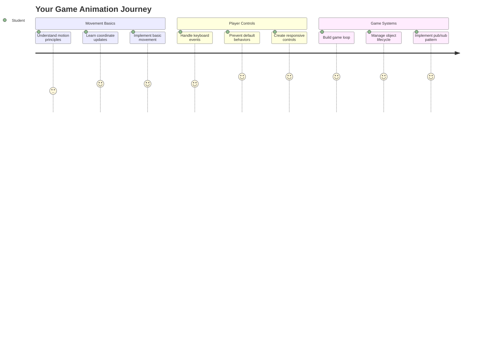
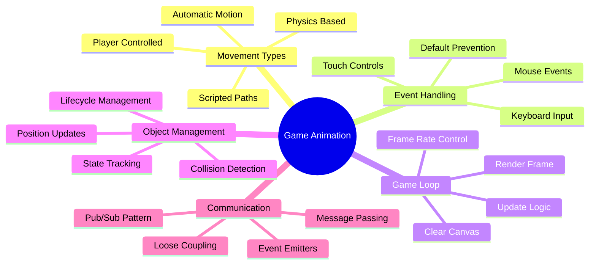
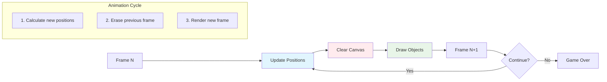
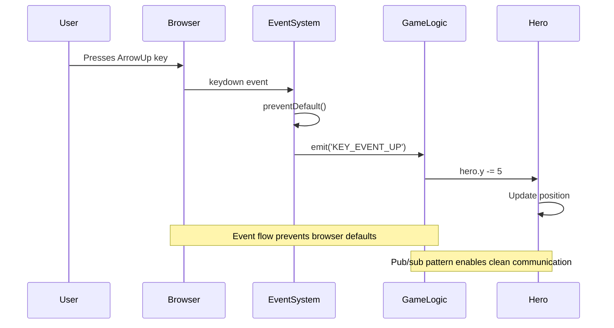
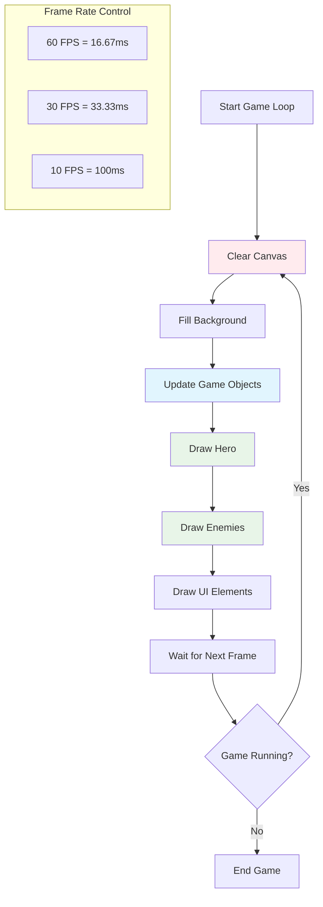
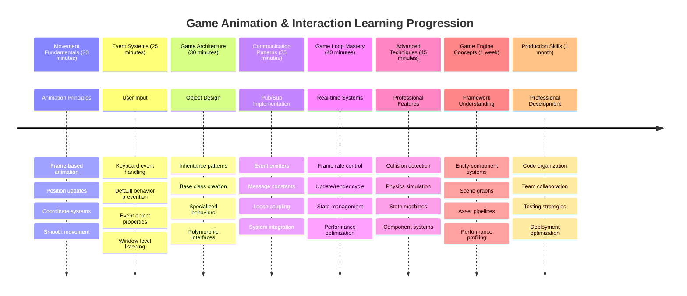

<!--
CO_OP_TRANSLATOR_METADATA:
{
  "original_hash": "8c55a2bd4bc0ebe4c88198fd563a9e09",
  "translation_date": "2025-11-03T22:58:49+00:00",
  "source_file": "6-space-game/3-moving-elements-around/README.md",
  "language_code": "bn"
}
-->
# মহাকাশ গেম তৈরি করুন পর্ব ৩: গতি যোগ করা



আপনার প্রিয় গেমগুলোর কথা ভাবুন – যা তাদের আকর্ষণীয় করে তোলে তা শুধুমাত্র সুন্দর গ্রাফিক্স নয়, বরং সবকিছু কীভাবে আপনার ক্রিয়ার প্রতি সাড়া দেয় এবং নড়াচড়া করে। এখন আপনার মহাকাশ গেমটি একটি সুন্দর চিত্রকর্মের মতো, কিন্তু আমরা এতে গতি যোগ করতে যাচ্ছি যা এটিকে জীবন্ত করে তুলবে।

যখন নাসার প্রকৌশলীরা অ্যাপোলো মিশনের জন্য গাইডেন্স কম্পিউটার প্রোগ্রাম করেছিলেন, তারা একই ধরনের চ্যালেঞ্জের মুখোমুখি হয়েছিলেন: কীভাবে একটি মহাকাশযানকে পাইলটের ইনপুটের প্রতি সাড়া দিতে এবং স্বয়ংক্রিয়ভাবে কোর্স সংশোধন বজায় রাখতে হয়? আজ আমরা যে নীতিগুলি শিখব তা সেই একই ধারণাগুলোর প্রতিধ্বনি করে – খেলোয়াড়-নিয়ন্ত্রিত গতি পরিচালনা এবং স্বয়ংক্রিয় সিস্টেমের আচরণ একসাথে।

এই পাঠে, আপনি শিখবেন কীভাবে মহাকাশযানগুলোকে স্ক্রিনে গ্লাইড করতে, খেলোয়াড়ের কমান্ডে সাড়া দিতে এবং মসৃণ গতি প্যাটার্ন তৈরি করতে হয়। আমরা সবকিছু সহজ ধারণায় ভাগ করব যা স্বাভাবিকভাবে একে অপরের উপর ভিত্তি করে তৈরি হয়।

শেষে, আপনার খেলোয়াড়রা তাদের হিরো শিপকে স্ক্রিনে উড়িয়ে নিয়ে যাবে, যখন শত্রু জাহাজগুলো উপরে টহল দেবে। আরও গুরুত্বপূর্ণ, আপনি গেম মুভমেন্ট সিস্টেমের মূল নীতিগুলো বুঝতে পারবেন।



## প্রাক-লেকচার কুইজ

[প্রাক-লেকচার কুইজ](https://ff-quizzes.netlify.app/web/quiz/33)

## গেম মুভমেন্ট বোঝা

গেমগুলো জীবন্ত হয়ে ওঠে যখন জিনিসপত্র চারপাশে নড়াচড়া শুরু করে, এবং এটি মূলত দুটি উপায়ে ঘটে:

- **খেলোয়াড়-নিয়ন্ত্রিত গতি**: যখন আপনি একটি কী চাপেন বা মাউস ক্লিক করেন, কিছু নড়ে। এটি আপনার এবং আপনার গেম জগতের মধ্যে সরাসরি সংযোগ।
- **স্বয়ংক্রিয় গতি**: যখন গেম নিজেই জিনিসগুলো নড়াচড়া করার সিদ্ধান্ত নেয় – যেমন শত্রু জাহাজগুলো স্ক্রিনে টহল দিতে হবে, আপনি কিছু করছেন কিনা তা নির্বিশেষে।

কম্পিউটার স্ক্রিনে বস্তু সরানো আপনার চিন্তার চেয়ে সহজ। গণিত ক্লাসের সেই x এবং y কোঅর্ডিনেটগুলো মনে আছে? আমরা ঠিক সেগুলো নিয়েই কাজ করছি। যখন গ্যালিলিও ১৬১০ সালে বৃহস্পতির চাঁদগুলো ট্র্যাক করেছিলেন, তিনি মূলত একই কাজ করছিলেন – সময়ের সাথে অবস্থান প্লট করে গতি প্যাটার্নগুলো বুঝতে।

স্ক্রিনে জিনিস সরানো একটি ফ্লিপবুক অ্যানিমেশন তৈরি করার মতো – আপনাকে এই তিনটি সহজ ধাপ অনুসরণ করতে হবে:



1. **অবস্থান আপডেট করুন** – আপনার বস্তুটি কোথায় থাকা উচিত তা পরিবর্তন করুন (সম্ভবত এটি ৫ পিক্সেল ডানে সরান)
2. **পুরানো ফ্রেম মুছুন** – স্ক্রিন পরিষ্কার করুন যাতে সর্বত্র ভূতুড়ে ট্রেইল দেখতে না পান
3. **নতুন ফ্রেম আঁকুন** – আপনার বস্তুটি তার নতুন স্থানে রাখুন

এটি যথেষ্ট দ্রুত করুন, এবং দেখুন! আপনি মসৃণ গতি পেয়েছেন যা খেলোয়াড়দের কাছে স্বাভাবিক মনে হয়।

কোডে এটি দেখতে এমন হতে পারে:

```javascript
// Set the hero's location
hero.x += 5;
// Clear the rectangle that hosts the hero
ctx.clearRect(0, 0, canvas.width, canvas.height);
// Redraw the game background and hero
ctx.fillRect(0, 0, canvas.width, canvas.height);
ctx.fillStyle = "black";
ctx.drawImage(heroImg, hero.x, hero.y);
```

**এই কোডটি যা করে:**
- **আপডেট করে** হিরোর x-কোঅর্ডিনেট ৫ পিক্সেল দ্বারা, এটি অনুভূমিকভাবে সরানোর জন্য
- **পরিষ্কার করে** পুরো ক্যানভাস এলাকা, পূর্ববর্তী ফ্রেমটি সরানোর জন্য
- **ভরাট করে** ক্যানভাস একটি কালো ব্যাকগ্রাউন্ড রঙ দিয়ে
- **পুনরায় আঁকে** হিরো ইমেজটি তার নতুন অবস্থানে

✅ আপনি কি ভাবতে পারেন কেন আপনার হিরোকে প্রতি সেকেন্ডে অনেক ফ্রেমে পুনরায় আঁকলে পারফরম্যান্স খরচ হতে পারে? [এই প্যাটার্নের বিকল্প সম্পর্কে পড়ুন](https://developer.mozilla.org/en-US/docs/Web/API/Canvas_API/Tutorial/Optimizing_canvas)।

## কীবোর্ড ইভেন্ট পরিচালনা করুন

এটি সেই জায়গা যেখানে আমরা খেলোয়াড়ের ইনপুটকে গেম অ্যাকশনের সাথে সংযুক্ত করি। যখন কেউ লেজার ফায়ার করতে স্পেসবার চাপ দেয় বা একটি অ্যাস্টেরয়েড এড়াতে একটি অ্যারো কী ট্যাপ করে, তখন আপনার গেমটি সেই ইনপুটটি সনাক্ত করতে এবং তার প্রতিক্রিয়া জানাতে হবে।

কীবোর্ড ইভেন্টগুলো উইন্ডো স্তরে ঘটে, অর্থাৎ আপনার পুরো ব্রাউজার উইন্ডো সেই কীপ্রেসগুলো শোনে। অন্যদিকে, মাউস ক্লিকগুলো নির্দিষ্ট উপাদানগুলোর সাথে সংযুক্ত হতে পারে (যেমন একটি বোতাম ক্লিক করা)। আমাদের মহাকাশ গেমের জন্য, আমরা কীবোর্ড নিয়ন্ত্রণের উপর ফোকাস করব কারণ এটি খেলোয়াড়দের সেই ক্লাসিক আর্কেড অনুভূতি দেয়।

এটি আমাকে মনে করিয়ে দেয় যে কীভাবে ১৮০০-এর দশকে টেলিগ্রাফ অপারেটরদের মর্স কোড ইনপুটকে অর্থপূর্ণ বার্তায় অনুবাদ করতে হয়েছিল – আমরা একই কাজ করছি, কীপ্রেসগুলোকে গেম কমান্ডে অনুবাদ করছি।

একটি ইভেন্ট পরিচালনা করতে আপনাকে উইন্ডোর `addEventListener()` পদ্ধতি ব্যবহার করতে হবে এবং এতে দুটি ইনপুট প্যারামিটার প্রদান করতে হবে। প্রথম প্যারামিটারটি ইভেন্টের নাম, উদাহরণস্বরূপ `keyup`। দ্বিতীয় প্যারামিটারটি সেই ফাংশন যা ইভেন্টটি ঘটলে কার্যকর করা উচিত।

এখানে একটি উদাহরণ:

```javascript
window.addEventListener('keyup', (evt) => {
  // evt.key = string representation of the key
  if (evt.key === 'ArrowUp') {
    // do something
  }
});
```

**এখানে যা ঘটে তা ভেঙে দেখা:**
- **শোনে** পুরো উইন্ডোতে কীবোর্ড ইভেন্টগুলো
- **ধরে** ইভেন্ট অবজেক্ট যা কোন কী চাপা হয়েছে তার তথ্য ধারণ করে
- **পরীক্ষা করে** চাপা কীটি একটি নির্দিষ্ট কী (এই ক্ষেত্রে, আপ অ্যারো) এর সাথে মেলে কিনা
- **কোড কার্যকর করে** যখন শর্তটি পূরণ হয়

কী ইভেন্টের জন্য ইভেন্টে দুটি প্রপার্টি থাকে যা আপনি কোন কী চাপা হয়েছে তা দেখতে ব্যবহার করতে পারেন:

- `key` - এটি চাপা কীটির একটি স্ট্রিং উপস্থাপনা, উদাহরণস্বরূপ `'ArrowUp'`
- `keyCode` - এটি একটি সংখ্যার উপস্থাপনা, উদাহরণস্বরূপ `37`, যা `ArrowLeft` এর সাথে মিলে

✅ গেম ডেভেলপমেন্টের বাইরে কী ইভেন্ট ম্যানিপুলেশনটি উপকারী। এই কৌশলটির জন্য আপনি আর কী কী ব্যবহার করতে পারেন তা ভাবুন।



### বিশেষ কী: একটি সতর্কবার্তা!

কিছু কীতে বিল্ট-ইন ব্রাউজার আচরণ থাকে যা আপনার গেমে সমস্যা সৃষ্টি করতে পারে। অ্যারো কীগুলো পৃষ্ঠাটি স্ক্রোল করে এবং স্পেসবার নিচে চলে যায় – আচরণগুলো আপনি চান না যখন কেউ তাদের মহাকাশযান চালানোর চেষ্টা করছে।

আমরা এই ডিফল্ট আচরণগুলো প্রতিরোধ করতে পারি এবং আমাদের গেমকে ইনপুট পরিচালনা করতে দিতে পারি। এটি অনেকটা প্রাথমিক কম্পিউটার প্রোগ্রামারদের সিস্টেম ইন্টারাপ্টগুলোকে ওভাররাইড করে কাস্টম আচরণ তৈরি করার মতো – আমরা এটি ব্রাউজার স্তরে করছি। এটি কীভাবে করবেন:

```javascript
const onKeyDown = function (e) {
  console.log(e.keyCode);
  switch (e.keyCode) {
    case 37:
    case 39:
    case 38:
    case 40: // Arrow keys
    case 32:
      e.preventDefault();
      break; // Space
    default:
      break; // do not block other keys
  }
};

window.addEventListener('keydown', onKeyDown);
```

**এই প্রতিরোধ কোডটি বোঝা:**
- **পরীক্ষা করে** নির্দিষ্ট কী কোডগুলো যা অবাঞ্ছিত ব্রাউজার আচরণ সৃষ্টি করতে পারে
- **প্রতিরোধ করে** অ্যারো কী এবং স্পেসবারের জন্য ডিফল্ট ব্রাউজার অ্যাকশন
- **অনুমতি দেয়** অন্যান্য কীগুলোকে স্বাভাবিকভাবে কাজ করতে
- **ব্যবহার করে** `e.preventDefault()` ব্রাউজারের বিল্ট-ইন আচরণ বন্ধ করতে

### 🔄 **শিক্ষাগত চেক-ইন**
**ইভেন্ট হ্যান্ডলিং বোঝা**: স্বয়ংক্রিয় গতি শুরু করার আগে নিশ্চিত করুন যে আপনি পারেন:
- ✅ `keydown` এবং `keyup` ইভেন্টগুলোর পার্থক্য ব্যাখ্যা করতে
- ✅ কেন আমরা ডিফল্ট ব্রাউজার আচরণ প্রতিরোধ করি তা বুঝতে
- ✅ কীভাবে ইভেন্ট লিসেনারগুলো ব্যবহারকারীর ইনপুটকে গেম লজিকের সাথে সংযুক্ত করে তা বর্ণনা করতে
- ✅ কোন কীগুলো গেম কন্ট্রোলের সাথে সমস্যা সৃষ্টি করতে পারে তা সনাক্ত করতে

**দ্রুত স্ব-পরীক্ষা**: যদি আপনি অ্যারো কীগুলোর জন্য ডিফল্ট আচরণ প্রতিরোধ না করেন তবে কী হবে?
*উত্তর: ব্রাউজার পৃষ্ঠাটি স্ক্রোল করবে, যা গেমের গতি ব্যাহত করবে*

**ইভেন্ট সিস্টেম আর্কিটেকচার**: আপনি এখন বুঝতে পেরেছেন:
- **উইন্ডো-স্তরের শোনা**: ব্রাউজার স্তরে ইভেন্টগুলো ক্যাপচার করা
- **ইভেন্ট অবজেক্ট প্রপার্টি**: `key` স্ট্রিং বনাম `keyCode` সংখ্যা
- **ডিফল্ট প্রতিরোধ**: অবাঞ্ছিত ব্রাউজার আচরণ বন্ধ করা
- **শর্তযুক্ত লজিক**: নির্দিষ্ট কী সংমিশ্রণের প্রতিক্রিয়া জানানো

## গেম দ্বারা প্ররোচিত গতি

এখন আসুন এমন বস্তুগুলোর কথা বলি যা খেলোয়াড়ের ইনপুট ছাড়াই নড়াচড়া করে। শত্রু জাহাজগুলো স্ক্রিনে ক্রুজ করছে, গুলি সোজা লাইনে উড়ছে, বা পটভূমিতে মেঘ ভেসে বেড়াচ্ছে। এই স্বয়ংক্রিয় গতি আপনার গেম জগতকে জীবন্ত করে তোলে এমনকি কেউ নিয়ন্ত্রণ স্পর্শ না করলেও।

আমরা জাভাস্ক্রিপ্টের বিল্ট-ইন টাইমার ব্যবহার করি নিয়মিত বিরতিতে অবস্থান আপডেট করতে। এই ধারণাটি অনেকটা পেন্ডুলাম ঘড়ির মতো – একটি নিয়মিত প্রক্রিয়া যা ধারাবাহিক, সময়মতো ক্রিয়াগুলো ট্রিগার করে। এটি কতটা সহজ হতে পারে তা এখানে:

```javascript
const id = setInterval(() => {
  // Move the enemy on the y axis
  enemy.y += 10;
}, 100);
```

**এই গতি কোডটি যা করে:**
- **একটি টাইমার তৈরি করে** যা প্রতি ১০০ মিলিসেকেন্ডে চলে
- **আপডেট করে** শত্রুর y-কোঅর্ডিনেট প্রতি বার ১০ পিক্সেল দ্বারা
- **ইন্টারভাল আইডি সংরক্ষণ করে** যাতে আমরা পরে এটি বন্ধ করতে পারি
- **স্বয়ংক্রিয়ভাবে শত্রুকে স্ক্রিনে নিচের দিকে সরায়**

## গেম লুপ

এখানে সেই ধারণা যা সবকিছু একত্রিত করে – গেম লুপ। যদি আপনার গেমটি একটি সিনেমা হয়, তাহলে গেম লুপটি হবে ফিল্ম প্রজেক্টর, ফ্রেমের পর ফ্রেম দেখানো এত দ্রুত যে সবকিছু মসৃণভাবে নড়াচড়া করে।

প্রতিটি গেমের পিছনে একটি লুপ চলমান থাকে। এটি একটি ফাংশন যা সমস্ত গেম অবজেক্ট আপডেট করে, স্ক্রিন পুনরায় আঁকে এবং এই প্রক্রিয়াটি ক্রমাগত পুনরাবৃত্তি করে। এটি আপনার হিরো, সমস্ত শত্রু, যে কোনো লেজার উড়ছে – পুরো গেম স্টেট ট্র্যাক করে।

এই ধারণাটি আমাকে মনে করিয়ে দেয় কীভাবে প্রাথমিক চলচ্চিত্র অ্যানিমেটররা যেমন ওয়াল্ট ডিজনি চরিত্রগুলোকে ফ্রেম বাই ফ্রেম পুনরায় আঁকতে হয়েছিল যাতে গতি বিভ্রম তৈরি হয়। আমরা একই কাজ করছি, শুধু কোড দিয়ে পেন্সিলের পরিবর্তে।

কোডে একটি গেম লুপ সাধারণত দেখতে এমন হতে পারে:



```javascript
const gameLoopId = setInterval(() => {
  function gameLoop() {
    ctx.clearRect(0, 0, canvas.width, canvas.height);
    ctx.fillStyle = "black";
    ctx.fillRect(0, 0, canvas.width, canvas.height);
    drawHero();
    drawEnemies();
    drawStaticObjects();
  }
  gameLoop();
}, 200);
```

**গেম লুপের কাঠামো বোঝা:**
- **পরিষ্কার করে** পুরো ক্যানভাস পূর্ববর্তী ফ্রেমটি সরানোর জন্য
- **ব্যাকগ্রাউন্ড ভরাট করে** একটি কঠিন রঙ দিয়ে
- **সব গেম অবজেক্ট আঁকে** তাদের বর্তমান অবস্থানে
- **প্রক্রিয়াটি পুনরাবৃত্তি করে** প্রতি ২০০ মিলিসেকেন্ডে মসৃণ অ্যানিমেশন তৈরি করতে
- **ফ্রেম রেট পরিচালনা করে** ইন্টারভাল টাইমিং নিয়ন্ত্রণ করে

## মহাকাশ গেম চালিয়ে যাওয়া

এখন আমরা পূর্বে তৈরি করা স্থির দৃশ্যে গতি যোগ করব। আমরা এটিকে একটি স্ক্রিনশট থেকে একটি ইন্টারঅ্যাকটিভ অভিজ্ঞতায় রূপান্তরিত করতে যাচ্ছি। আমরা ধাপে ধাপে কাজ করব যাতে প্রতিটি অংশ আগেরটির উপর ভিত্তি করে তৈরি হয়।

পূর্ববর্তী পাঠে যেখানে আমরা থেমেছিলাম সেখান থেকে কোডটি ধরুন (অথবা যদি নতুন করে শুরু করতে চান তবে [Part II- starter](../../../../6-space-game/3-moving-elements-around/your-work) ফোল্ডারের কোড দিয়ে শুরু করুন)।

**আজ আমরা যা তৈরি করছি:**
- **হিরো নিয়ন্ত্রণ**: অ্যারো কীগুলো আপনার মহাকাশযানকে স্ক্রিনে চালাবে
- **শত্রু গতি**: সেই এলিয়েন জাহাজগুলো তাদের অগ্রগতি শুরু করবে

চলুন এই বৈশিষ্ট্যগুলো বাস্তবায়ন শুরু করি।

## সুপারিশকৃত ধাপগুলো

`your-work` সাব ফোল্ডারে তৈরি করা ফাইলগুলো খুঁজে বের করুন। এটি নিম্নলিখিতগুলো ধারণ করা উচিত:

```bash
-| assets
  -| enemyShip.png
  -| player.png
-| index.html
-| app.js
-| package.json
```

আপনার প্রকল্পটি `your-work` ফোল্ডারে শুরু করুন এই কমান্ড টাইপ করে:

```bash
cd your-work
npm start
```

**এই কমmandটি যা করে:**
- **আপনার প্রকল্প ডিরেক্টরিতে যায়**
- **একটি HTTP সার্ভার শুরু করে** ঠিকানা `http://localhost:5000` এ
- **আপনার গেম ফাইলগুলো পরিবেশন করে** যাতে আপনি সেগুলো ব্রাউজারে পরীক্ষা করতে পারেন

উপরেরটি ঠিকানা `http://localhost:5000` এ একটি HTTP সার্ভার শুরু করবে। একটি ব্রাউজার খুলুন এবং সেই ঠিকানা ইনপুট করুন, এখন এটি হিরো এবং সমস্ত শত্রুদের রেন্ডার করা উচিত; কিছুই নড়ছে না - এখনো!

### কোড যোগ করুন

1. **নির্দিষ্ট অবজেক্ট যোগ করুন** `hero`, `enemy` এবং `game object` এর জন্য, তাদের `x` এবং `y` প্রপার্টি থাকা উচিত। (ইনহেরিটেন্স বা কম্পোজিশনের অংশটি মনে রাখুন [Inheritance or composition](../README.md))।

   *ইঙ্গিত* `game object` হওয়া উচিত যার `x` এবং `y` এবং নিজেকে একটি ক্যানভাসে আঁকার ক্ষমতা রয়েছে।

   > **টিপ**: একটি নতুন `GameObject` ক্লাস যোগ করে শুরু করুন যার কনস্ট্রাক্টর নিচের মতো নির্ধারিত, এবং তারপর এটি ক্যানভাসে আঁকুন:

    ```javascript
    class GameObject {
      constructor(x, y) {
        this.x = x;
        this.y = y;
        this.dead = false;
        this.type = "";
        this.width = 0;
        this.height = 0;
        this.img = undefined;
      }
    
      draw(ctx) {
        ctx.drawImage(this.img, this.x, this.y, this.width, this.height);
      }
    }
    ```

    **এই বেস ক্লাসটি বোঝা:**
    - **সাধারণ প্রপার্টি সংজ্ঞায়িত করে** যা সমস্ত গেম অবজেক্ট শেয়ার করে (অবস্থান, আকার, ইমেজ)
    - **একটি `dead` ফ্ল্যাগ অন্তর্ভুক্ত করে** যা ট্র্যাক করে বস্তুটি সরানো উচিত কিনা
    - **একটি `draw()` পদ্ধতি প্রদান করে** যা ক্যানভাসে বস্তুটি রেন্ডার করে
    - **সমস্ত প্রপার্টির জন্য ডিফল্ট মান সেট করে** যা চাইল্ড ক্লাসগুলো ওভাররাইড করতে পারে

    ```mermaid
    classDiagram
        class GameObject {
            +x: number
            +y: number
            +dead: boolean
            +type: string
            +width: number
            +height: number
            +img: Image
            +draw(ctx)
        }
        
        class Hero {
            +speed: number
            +type: "Hero"
            +width: 98
            +height: 75
        }
        
        class Enemy {
            +type: "Enemy"
            +width: 98
            +height: 50
            +setInterval()
        }
        
        GameObject <|-- Hero
        GameObject <|-- Enemy
        
        class EventEmitter {
            +listeners: object
            +on(message, listener)
            +emit(message, payload)
        }
    ```

    এখন, এই `GameObject` প্রসারিত করুন `Hero` এবং `Enemy` তৈরি করতে:
    
    ```javascript
    class Hero extends GameObject {
      constructor(x, y) {
        super(x, y);
        this.width = 98;
        this.height = 75;
        this.type = "Hero";
        this.speed = 5;
      }
    }
    ```

    ```javascript
    class Enemy extends GameObject {
      constructor(x, y) {
        super(x, y);
        this.width = 98;
        this.height = 50;
        this.type = "Enemy";
        const id = setInterval(() => {
          if (this.y < canvas.height - this.height) {
            this.y += 5;
          } else {
            console.log('Stopped at', this.y);
            clearInterval(id);
          }
        }, 300);
      }
    }
    ```

    **এই ক্লাসগুলোতে মূল ধারণা:**
    - **`GameObject` থেকে উত্তরাধিকারী হয়** `extends` কীওয়ার্ড ব্যবহার করে
    - **প্যারেন্ট কনস্ট্রাক্টর কল করে** `super(x, y)` দিয়ে
    - **প্রতিটি অবজেক্ট টাইপের জন্য নির্দিষ্ট মাত্রা এবং প্রপার্টি সেট করে**
    - **শত্রুদের জন্য স্বয়ংক্রিয় গতি বাস্তবায়ন করে** `setInterval()` ব্যবহার করে

2. **কী-ইভেন্ট হ্যান্ডলার যোগ করুন** হিরোকে উপরে/নিচে, বামে/ডানে সরানোর জন্য

   *মনে রাখুন* এটি একটি কার্টেসিয়ান সিস্টেম, উপরের-বাম কোণটি `0,0`। এছাড়াও ডিফল্ট আচরণ বন্ধ করার কোড যোগ করতে ভুলবেন না।

   > **টিপ**: আপনার `onKeyDown` ফাংশন তৈরি করুন এবং এটি উইন্ডোতে সংযুক্ত করুন:

   ```javascript
   const onKeyDown = function (e) {
     console.log(e.keyCode);
     // Add the code from the lesson above to stop default behavior
     switch (e.keyCode) {
       case 37:
       case 39:
       case 38:
       case 40: // Arrow keys
       case 32:
         e.preventDefault();
         break; // Space
       default:
         break; // do not block other keys
     }
   };

   window.addEventListener("keydown", onKeyDown);
   ```
    
   **এই ইভেন্ট হ্যান্ডলার যা করে:**
   - **কীডাউন ইভেন্টগুলো শোনে** পুরো উইন্ডোতে
   - **কী কোড লগ করে** কোন কী চাপা হচ্ছে তা ডিবাগ করতে সাহায
   - **একটি অ্যারে তৈরি করে** যা সমস্ত গেম অবজেক্ট ধারণ করবে

   4. **গেমটি শুরু করুন**

       ```javascript
       function initGame() {
         gameObjects = [];
         createEnemies();
         createHero();
       
         eventEmitter.on(Messages.KEY_EVENT_UP, () => {
           hero.y -= 5;
         });
       
         eventEmitter.on(Messages.KEY_EVENT_DOWN, () => {
           hero.y += 5;
         });
       
         eventEmitter.on(Messages.KEY_EVENT_LEFT, () => {
           hero.x -= 5;
         });
       
4. **গেম লুপ সেটআপ করুন**

   `window.onload` ফাংশনটি পুনর্গঠন করুন যাতে গেমটি শুরু হয় এবং একটি ভালো ইন্টারভালে গেম লুপ সেটআপ করা যায়। এছাড়াও একটি লেজার বিম যোগ করুন:

    ```javascript
    window.onload = async () => {
      canvas = document.getElementById("canvas");
      ctx = canvas.getContext("2d");
      heroImg = await loadTexture("assets/player.png");
      enemyImg = await loadTexture("assets/enemyShip.png");
      laserImg = await loadTexture("assets/laserRed.png");
    
      initGame();
      const gameLoopId = setInterval(() => {
        ctx.clearRect(0, 0, canvas.width, canvas.height);
        ctx.fillStyle = "black";
        ctx.fillRect(0, 0, canvas.width, canvas.height);
        drawGameObjects(ctx);
      }, 100);
    };
    ```

   **গেম সেটআপ বোঝা:**
   - **পৃষ্ঠার সম্পূর্ণ লোড হওয়ার জন্য অপেক্ষা করে** গেম শুরু করার আগে
   - **ক্যানভাস এলিমেন্ট এবং এর 2D রেন্ডারিং কনটেক্সট পায়**
   - **সমস্ত ইমেজ অ্যাসেট অ্যাসিঙ্ক্রোনাসভাবে লোড করে** `await` ব্যবহার করে
   - **গেম লুপ শুরু করে** 100ms ইন্টারভালে (10 FPS)
   - **প্রতিটি ফ্রেমে পুরো স্ক্রিন পরিষ্কার করে এবং পুনরায় আঁকে**

5. **কোড যোগ করুন** যাতে শত্রুরা নির্দিষ্ট ইন্টারভালে সরতে পারে

    `createEnemies()` ফাংশনটি পুনর্গঠন করুন যাতে শত্রু তৈরি হয় এবং নতুন gameObjects ক্লাসে যোগ করা যায়:

    ```javascript
    function createEnemies() {
      const MONSTER_TOTAL = 5;
      const MONSTER_WIDTH = MONSTER_TOTAL * 98;
      const START_X = (canvas.width - MONSTER_WIDTH) / 2;
      const STOP_X = START_X + MONSTER_WIDTH;
    
      for (let x = START_X; x < STOP_X; x += 98) {
        for (let y = 0; y < 50 * 5; y += 50) {
          const enemy = new Enemy(x, y);
          enemy.img = enemyImg;
          gameObjects.push(enemy);
        }
      }
    }
    ```

    **শত্রু তৈরির কাজ:**
    - **পজিশন গণনা করে** যাতে শত্রুরা স্ক্রিনের কেন্দ্রে থাকে
    - **নেস্টেড লুপ ব্যবহার করে শত্রুদের একটি গ্রিড তৈরি করে**
    - **প্রতিটি শত্রু অবজেক্টে শত্রুর ইমেজ অ্যাসাইন করে**
    - **প্রতিটি শত্রুকে গ্লোবাল গেম অবজেক্টস অ্যারেতে যোগ করে**
    
    এবং একটি `createHero()` ফাংশন যোগ করুন যা নায়কের জন্য একই প্রক্রিয়া সম্পন্ন করবে।
    
    ```javascript
    function createHero() {
      hero = new Hero(
        canvas.width / 2 - 45,
        canvas.height - canvas.height / 4
      );
      hero.img = heroImg;
      gameObjects.push(hero);
    }
    ```

    **নায়ক তৈরির কাজ:**
    - **নায়ককে স্ক্রিনের নিচের কেন্দ্রে পজিশন করে**
    - **নায়কের ইমেজ নায়ক অবজেক্টে অ্যাসাইন করে**
    - **নায়ককে গেম অবজেক্টস অ্যারেতে যোগ করে রেন্ডারিংয়ের জন্য**

    এবং শেষ পর্যন্ত একটি `drawGameObjects()` ফাংশন যোগ করুন যা আঁকা শুরু করবে:

    ```javascript
    function drawGameObjects(ctx) {
      gameObjects.forEach(go => go.draw(ctx));
    }
    ```

    **ড্রয়িং ফাংশন বোঝা:**
    - **অ্যারের সমস্ত গেম অবজেক্টের মধ্য দিয়ে ইটারেট করে**
    - **প্রতিটি অবজেক্টের `draw()` মেথড কল করে**
    - **ক্যানভাস কনটেক্সট পাস করে যাতে অবজেক্টগুলো নিজেদের রেন্ডার করতে পারে**

    ### 🔄 **শিক্ষামূলক চেক-ইন**
    **সম্পূর্ণ গেম সিস্টেম বোঝা**: পুরো আর্কিটেকচারের উপর আপনার দক্ষতা যাচাই করুন:
    - ✅ কীভাবে ইনহেরিটেন্স নায়ক এবং শত্রুকে সাধারণ GameObject প্রপার্টি শেয়ার করতে দেয়?
    - ✅ কেন pub/sub প্যাটার্ন আপনার কোডকে আরও রক্ষণযোগ্য করে তোলে?
    - ✅ গেম লুপ কীভাবে মসৃণ অ্যানিমেশন তৈরি করতে সাহায্য করে?
    - ✅ কীভাবে ইভেন্ট লিসেনার ব্যবহারকারীর ইনপুটকে গেম অবজেক্টের আচরণের সাথে সংযুক্ত করে?

    **সিস্টেম ইন্টিগ্রেশন**: আপনার গেম এখন প্রদর্শন করে:
    - **অবজেক্ট-ওরিয়েন্টেড ডিজাইন**: বেস ক্লাস এবং বিশেষায়িত ইনহেরিটেন্স
    - **ইভেন্ট-ড্রিভেন আর্কিটেকচার**: Pub/sub প্যাটার্নের মাধ্যমে লুজ কাপলিং
    - **অ্যানিমেশন ফ্রেমওয়ার্ক**: গেম লুপের মাধ্যমে ধারাবাহিক ফ্রেম আপডেট
    - **ইনপুট হ্যান্ডলিং**: কীবোর্ড ইভেন্ট এবং ডিফল্ট প্রিভেনশন
    - **অ্যাসেট ম্যানেজমেন্ট**: ইমেজ লোডিং এবং স্প্রাইট রেন্ডারিং

    **প্রফেশনাল প্যাটার্ন**: আপনি বাস্তবায়ন করেছেন:
    - **কনসার্নের পৃথকীকরণ**: ইনপুট, লজিক এবং রেন্ডারিং পৃথক
    - **পলিমরফিজম**: সমস্ত গেম অবজেক্ট সাধারণ ড্রয়িং ইন্টারফেস শেয়ার করে
    - **মেসেজ পাসিং**: কম্পোনেন্টগুলোর মধ্যে পরিষ্কার যোগাযোগ
    - **রিসোর্স ম্যানেজমেন্ট**: দক্ষ স্প্রাইট এবং অ্যানিমেশন হ্যান্ডলিং

    আপনার শত্রুরা আপনার নায়ক স্পেসশিপের দিকে অগ্রসর হতে শুরু করবে!
      }
    }
    ```
    
    and add a `createHero()` function to do a similar process for the hero.
    
    ```javascript
    function createHero() {
      hero = new Hero(
        canvas.width / 2 - 45,
        canvas.height - canvas.height / 4
      );
      hero.img = heroImg;
      gameObjects.push(hero);
    }
    ```

    এবং শেষ পর্যন্ত একটি `drawGameObjects()` ফাংশন যোগ করুন যা আঁকা শুরু করবে:

    ```javascript
    function drawGameObjects(ctx) {
      gameObjects.forEach(go => go.draw(ctx));
    }
    ```

    আপনার শত্রুরা আপনার নায়ক স্পেসশিপের দিকে অগ্রসর হতে শুরু করবে!

---

## GitHub Copilot Agent Challenge 🚀

এখানে একটি চ্যালেঞ্জ রয়েছে যা আপনার গেমের মান উন্নত করবে: বাউন্ডারি এবং মসৃণ নিয়ন্ত্রণ যোগ করা। বর্তমানে, আপনার নায়ক স্ক্রিনের বাইরে উড়ে যেতে পারে এবং মুভমেন্টটি কিছুটা খাপছাড়া মনে হতে পারে।

**আপনার মিশন:** একটি সিস্টেম তৈরি করুন যা আপনার নায়ক স্পেসশিপকে স্ক্রিনে রাখে এবং নিয়ন্ত্রণগুলোকে আরও মসৃণ করে তোলে। যখন খেলোয়াড়রা একটি অ্যারো কী ধরে রাখে, তখন জাহাজটি ধারাবাহিকভাবে গ্লাইড করবে, বিচ্ছিন্ন ধাপে সরবে না। স্ক্রিনের বাউন্ডারিতে পৌঁছানোর সময় ভিজ্যুয়াল ফিডব্যাক যোগ করার কথা বিবেচনা করুন – সম্ভবত প্লে এরিয়ার প্রান্ত নির্দেশ করার জন্য একটি সূক্ষ্ম প্রভাব।

আরও জানুন [এজেন্ট মোড](https://code.visualstudio.com/blogs/2025/02/24/introducing-copilot-agent-mode) সম্পর্কে এখানে।

## 🚀 চ্যালেঞ্জ

যখন প্রকল্প বড় হয় তখন কোড সংগঠন ক্রমশ গুরুত্বপূর্ণ হয়ে ওঠে। আপনি হয়তো লক্ষ্য করেছেন যে আপনার ফাইলটি ফাংশন, ভেরিয়েবল এবং ক্লাসের সাথে মিশ্রিত হয়ে ভিড় করছে। এটি আমাকে অ্যাপোলো মিশন কোড সংগঠনের ইঞ্জিনিয়ারদের কথা মনে করিয়ে দেয়, যারা স্পষ্ট, রক্ষণযোগ্য সিস্টেম তৈরি করতে হয়েছিল যাতে একাধিক দল একসাথে কাজ করতে পারে।

**আপনার মিশন:**
একজন সফটওয়্যার আর্কিটেক্টের মতো চিন্তা করুন। আপনি কীভাবে আপনার কোড সংগঠিত করবেন যাতে ছয় মাস পরেও আপনি (বা আপনার টিমমেট) বুঝতে পারেন কী ঘটছে? এখন সবকিছু এক ফাইলে থাকলেও, আপনি আরও ভালো সংগঠন তৈরি করতে পারেন:

- **সম্পর্কিত ফাংশনগুলোকে গ্রুপ করা** স্পষ্ট মন্তব্য হেডারের সাথে
- **কনসার্ন পৃথকীকরণ** - গেম লজিক এবং রেন্ডারিং আলাদা রাখা
- **সঙ্গতিপূর্ণ নামকরণ** ভেরিয়েবল এবং ফাংশনের জন্য
- **মডিউল বা নেমস্পেস তৈরি করা** গেমের বিভিন্ন দিক সংগঠিত করতে
- **ডকুমেন্টেশন যোগ করা** যা প্রতিটি প্রধান অংশের উদ্দেশ্য ব্যাখ্যা করে

**প্রতিফলনের প্রশ্ন:**
- আপনার কোডের কোন অংশগুলো সবচেয়ে কঠিন মনে হয় যখন আপনি পরে ফিরে আসেন?
- আপনি কীভাবে আপনার কোড সংগঠিত করতে পারেন যাতে অন্য কেউ সহজে অবদান রাখতে পারে?
- যদি আপনি পাওয়ার-আপ বা বিভিন্ন শত্রু টাইপের মতো নতুন বৈশিষ্ট্য যোগ করতে চান তবে কী হবে?

## পোস্ট-লেকচার কুইজ

[পোস্ট-লেকচার কুইজ](https://ff-quizzes.netlify.app/web/quiz/34)

## পর্যালোচনা এবং স্ব-অধ্যয়ন

আমরা সবকিছু শূন্য থেকে তৈরি করছি, যা শেখার জন্য চমৎকার, তবে এখানে একটি ছোট গোপন কথা – কিছু অসাধারণ জাভাস্ক্রিপ্ট ফ্রেমওয়ার্ক রয়েছে যা আপনার জন্য অনেক কাজ সহজ করে দিতে পারে। আমরা যে মৌলিক বিষয়গুলো কভার করেছি তা নিয়ে আপনি যখন আরামদায়ক বোধ করবেন, তখন [উপলব্ধ জিনিসগুলো অন্বেষণ করা](https://github.com/collections/javascript-game-engines) মূল্যবান।

ফ্রেমওয়ার্কগুলোকে ভাবুন যেন আপনার কাছে একটি ভালোভাবে সজ্জিত টুলবক্স রয়েছে, যেখানে প্রতিটি টুল নিজে তৈরি করার পরিবর্তে প্রস্তুত। তারা অনেক কোড সংগঠনের চ্যালেঞ্জ সমাধান করতে পারে, পাশাপাশি এমন বৈশিষ্ট্য প্রদান করতে পারে যা নিজে তৈরি করতে সপ্তাহ লেগে যাবে।

**অন্বেষণ করার মতো বিষয়:**
- গেম ইঞ্জিন কীভাবে কোড সংগঠিত করে – তাদের ব্যবহার করা চতুর প্যাটার্নগুলো দেখে আপনি অবাক হবেন
- ক্যানভাস গেমগুলোকে মসৃণভাবে চালানোর জন্য পারফরম্যান্স ট্রিকস  
- আধুনিক জাভাস্ক্রিপ্ট বৈশিষ্ট্য যা আপনার কোডকে আরও পরিষ্কার এবং রক্ষণযোগ্য করতে পারে
- গেম অবজেক্ট এবং তাদের সম্পর্ক পরিচালনার বিভিন্ন পদ্ধতি

## 🎯 আপনার গেম অ্যানিমেশন দক্ষতার টাইমলাইন



### 🛠️ আপনার গেম ডেভেলপমেন্ট টুলকিট সারাংশ

এই পাঠটি সম্পন্ন করার পরে, আপনি এখন দক্ষতা অর্জন করেছেন:
- **অ্যানিমেশন নীতিমালা**: ফ্রেম-ভিত্তিক মুভমেন্ট এবং মসৃণ ট্রানজিশন
- **ইভেন্ট-ড্রিভেন প্রোগ্রামিং**: কীবোর্ড ইনপুট হ্যান্ডলিং এবং সঠিক ইভেন্ট ম্যানেজমেন্ট
- **অবজেক্ট-ওরিয়েন্টেড ডিজাইন**: ইনহেরিটেন্স হায়ারার্কি এবং পলিমরফিক ইন্টারফেস
- **যোগাযোগের প্যাটার্ন**: রক্ষণযোগ্য কোডের জন্য Pub/sub আর্কিটেকচার
- **গেম লুপ আর্কিটেকচার**: রিয়েল-টাইম আপডেট এবং রেন্ডারিং সাইকেল
- **ইনপুট সিস্টেম**: ব্যবহারকারীর নিয়ন্ত্রণ ম্যাপিং এবং ডিফল্ট আচরণ প্রতিরোধ
- **অ্যাসেট ম্যানেজমেন্ট**: স্প্রাইট লোডিং এবং দক্ষ রেন্ডারিং কৌশল

### ⚡ **পরবর্তী ৫ মিনিটে আপনি কী করতে পারেন**
- [ ] ব্রাউজার কনসোলে `addEventListener('keydown', console.log)` চেষ্টা করুন এবং কীবোর্ড ইভেন্ট দেখুন
- [ ] একটি সাধারণ div এলিমেন্ট তৈরি করুন এবং এটিকে অ্যারো কী ব্যবহার করে সরান
- [ ] ধারাবাহিক মুভমেন্ট তৈরি করতে `setInterval` নিয়ে পরীক্ষা করুন
- [ ] `event.preventDefault()` ব্যবহার করে ডিফল্ট আচরণ প্রতিরোধ করার চেষ্টা করুন

### 🎯 **এই ঘণ্টায় আপনি কী অর্জন করতে পারেন**
- [ ] পোস্ট-লেসন কুইজ সম্পন্ন করুন এবং ইভেন্ট-ড্রিভেন প্রোগ্রামিং বুঝুন
- [ ] সম্পূর্ণ কীবোর্ড নিয়ন্ত্রণ সহ নায়ক স্পেসশিপ তৈরি করুন
- [ ] মসৃণ শত্রু মুভমেন্ট প্যাটার্ন বাস্তবায়ন করুন
- [ ] গেম অবজেক্টগুলোকে স্ক্রিনের বাইরে যাওয়া থেকে রোধ করার জন্য বাউন্ডারি যোগ করুন
- [ ] গেম অবজেক্টগুলোর মধ্যে মৌলিক সংঘর্ষ সনাক্তকরণ তৈরি করুন

### 📅 **আপনার সপ্তাহব্যাপী অ্যানিমেশন যাত্রা**
- [ ] মসৃণ মুভমেন্ট এবং ইন্টারঅ্যাকশন সহ সম্পূর্ণ স্পেস গেম তৈরি করুন
- [ ] কার্ভ, অ্যাক্সিলারেশন এবং ফিজিক্সের মতো উন্নত মুভমেন্ট প্যাটার্ন যোগ করুন
- [ ] মসৃণ ট্রানজিশন এবং ইজিং ফাংশন বাস্তবায়ন করুন
- [ ] পার্টিকল ইফেক্ট এবং ভিজ্যুয়াল ফিডব্যাক সিস্টেম তৈরি করুন
- [ ] মসৃণ 60fps গেমপ্লের জন্য গেম পারফরম্যান্স অপ্টিমাইজ করুন
- [ ] মোবাইল টাচ কন্ট্রোল এবং রেসপন্সিভ ডিজাইন যোগ করুন

### 🌟 **আপনার মাসব্যাপী ইন্টারঅ্যাকটিভ ডেভেলপমেন্ট**
- [ ] উন্নত অ্যানিমেশন সিস্টেম সহ জটিল ইন্টারঅ্যাকটিভ অ্যাপ্লিকেশন তৈরি করুন
- [ ] GSAP-এর মতো অ্যানিমেশন লাইব্রেরি শিখুন বা আপনার নিজস্ব অ্যানিমেশন ইঞ্জিন তৈরি করুন
- [ ] ওপেন সোর্স গেম ডেভেলপমেন্ট এবং অ্যানিমেশন প্রকল্পে অবদান রাখুন
- [ ] গ্রাফিক্স-ইনটেনসিভ অ্যাপ্লিকেশনের জন্য পারফরম্যান্স অপ্টিমাইজেশন আয়ত্ত করুন
- [ ] গেম ডেভেলপমেন্ট এবং অ্যানিমেশন সম্পর্কে শিক্ষামূলক কন্টেন্ট তৈরি করুন
- [ ] উন্নত ইন্টারঅ্যাকটিভ প্রোগ্রামিং দক্ষতা প্রদর্শন করে একটি পোর্টফোলিও তৈরি করুন

**বাস্তব-জীবনের প্রয়োগ**: আপনার গেম অ্যানিমেশন দক্ষতা সরাসরি প্রয়োগ করা যায়:
- **ইন্টারঅ্যাকটিভ ওয়েব অ্যাপ্লিকেশন**: ডায়নামিক ড্যাশবোর্ড এবং রিয়েল-টাইম ইন্টারফেস
- **ডেটা ভিজ্যুয়ালাইজেশন**: অ্যানিমেটেড চার্ট এবং ইন্টারঅ্যাকটিভ গ্রাফিক্স
- **শিক্ষামূলক সফটওয়্যার**: ইন্টারঅ্যাকটিভ সিমুলেশন এবং শেখার টুল
- **মোবাইল ডেভেলপমেন্ট**: টাচ-ভিত্তিক গেম এবং জেসচার হ্যান্ডলিং
- **ডেস্কটপ অ্যাপ্লিকেশন**: ইলেকট্রন অ্যাপস মসৃণ অ্যানিমেশন সহ
- **ওয়েব অ্যানিমেশন**: CSS এবং জাভাস্ক্রিপ্ট অ্যানিমেশন লাইব্রেরি

**প্রফেশনাল দক্ষতা অর্জন**: আপনি এখন পারেন:
- **আর্কিটেক্ট** ইভেন্ট-ড্রিভেন সিস্টেম যা জটিলতার সাথে স্কেল করে
- **বাস্তবায়ন** মসৃণ অ্যানিমেশন গাণিতিক নীতিমালা ব্যবহার করে
- **ডিবাগ** জটিল ইন্টারঅ্যাকশন সিস্টেম ব্রাউজার ডেভেলপার টুল ব্যবহার করে
- **অপ্টিমাইজ** বিভিন্ন ডিভাইস এবং ব্রাউজারের জন্য গেম পারফরম্যান্স
- **ডিজাইন** রক্ষণযোগ্য কোড স্ট্রাকচার প্রমাণিত প্যাটার্ন ব্যবহার করে

**গেম ডেভেলপমেন্ট ধারণা আয়ত্ত**:
- **ফ্রেম রেট ম্যানেজমেন্ট**: FPS এবং টাইমিং কন্ট্রোল বোঝা
- **ইনপুট হ্যান্ডলিং**: ক্রস-প্ল্যাটফর্ম কীবোর্ড এবং ইভেন্ট সিস্টেম
- **অবজেক্ট লাইফসাইকেল**: ক্রিয়েশন, আপডেট এবং ডেস্ট্রাকশন প্যাটার্ন
- **স্টেট সিঙ্ক্রোনাইজেশন**: ফ্রেমের মধ্যে গেম স্টেট সামঞ্জস্য রাখা
- **ইভেন্ট আর্কিটেকচার**: গেম সিস্টেমগুলোর মধ্যে বিচ্ছিন্ন যোগাযোগ

**পরবর্তী স্তর**: আপনি এখন সংঘর্ষ সনাক্তকরণ, স্কোরিং সিস্টেম, সাউন্ড ইফেক্ট যোগ করতে বা Phaser বা Three.js-এর মতো আধুনিক গেম ফ্রেমওয়ার্ক অন্বেষণ করতে প্রস্তুত!

🌟 **অর্জন আনলক**: আপনি একটি সম্পূর্ণ ইন্টারঅ্যাকটিভ গেম সিস্টেম তৈরি করেছেন যা প্রফেশনাল আর্কিটেকচার প্যাটার্নের সাথে! 

## অ্যাসাইনমেন্ট

[আপনার কোডে মন্তব্য যোগ করুন](assignment.md)

---

**অস্বীকৃতি**:  
এই নথিটি AI অনুবাদ পরিষেবা [Co-op Translator](https://github.com/Azure/co-op-translator) ব্যবহার করে অনুবাদ করা হয়েছে। আমরা যথাসাধ্য সঠিকতার জন্য চেষ্টা করি, তবে অনুগ্রহ করে মনে রাখবেন যে স্বয়ংক্রিয় অনুবাদে ত্রুটি বা অসঙ্গতি থাকতে পারে। মূল ভাষায় থাকা নথিটিকে প্রামাণিক উৎস হিসেবে বিবেচনা করা উচিত। গুরুত্বপূর্ণ তথ্যের জন্য, পেশাদার মানব অনুবাদ সুপারিশ করা হয়। এই অনুবাদ ব্যবহারের ফলে কোনো ভুল বোঝাবুঝি বা ভুল ব্যাখ্যা হলে আমরা দায়ী থাকব না।