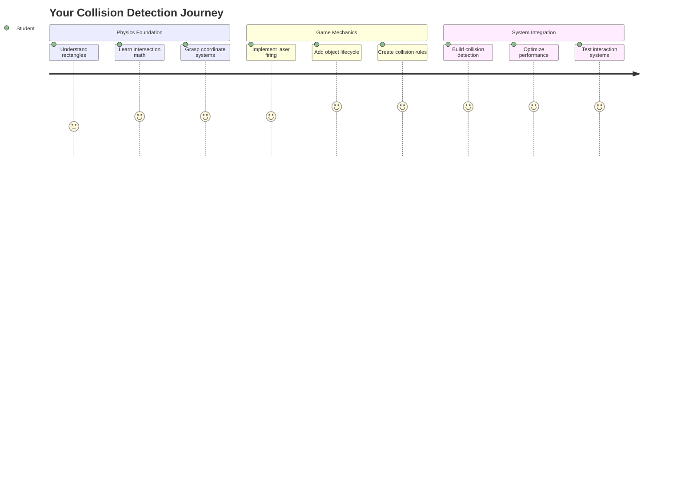
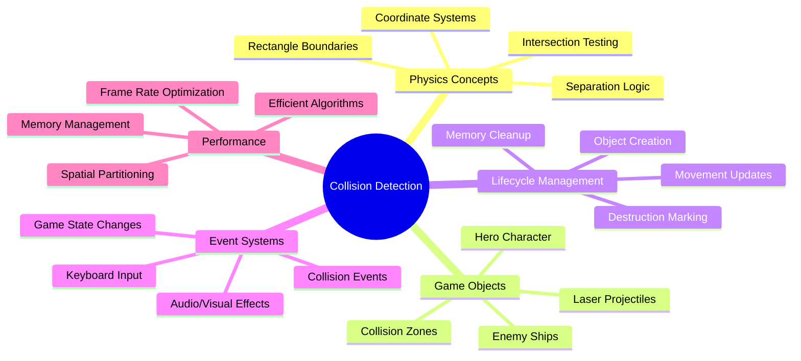
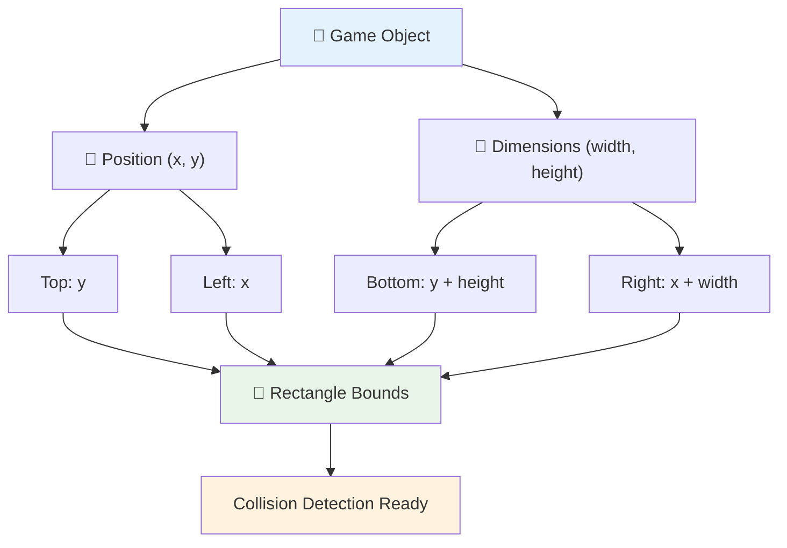
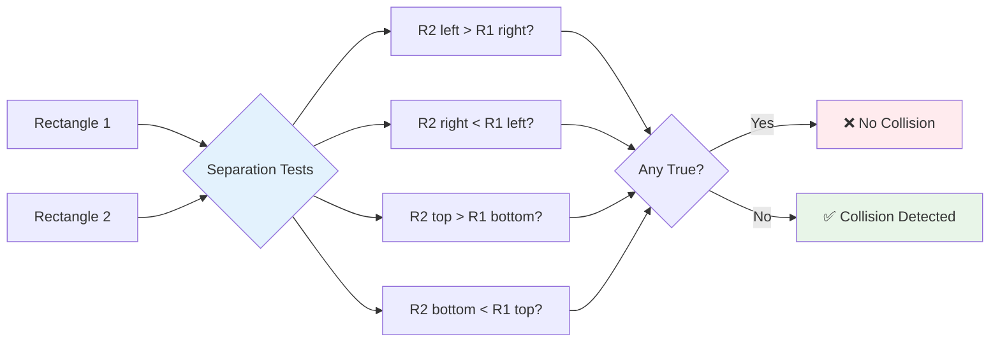
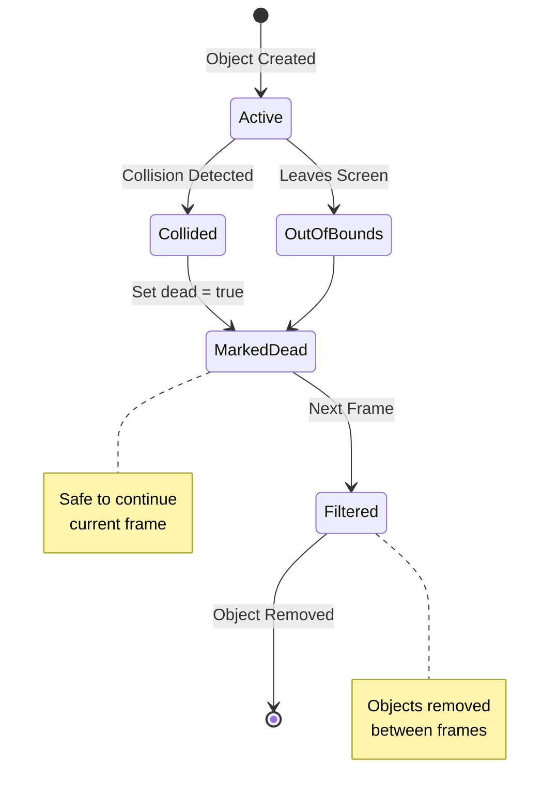
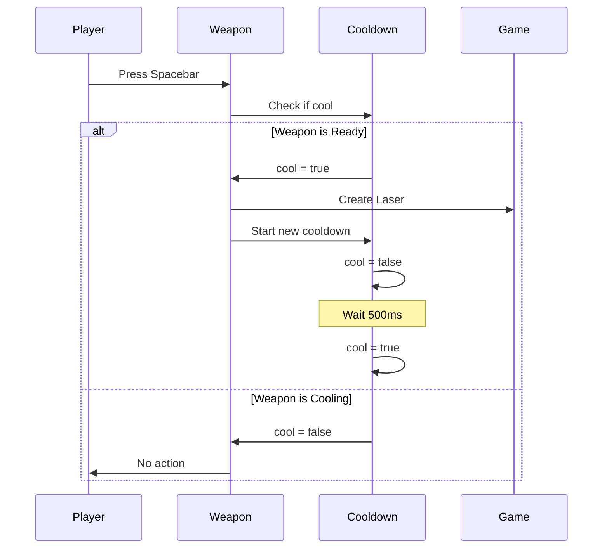
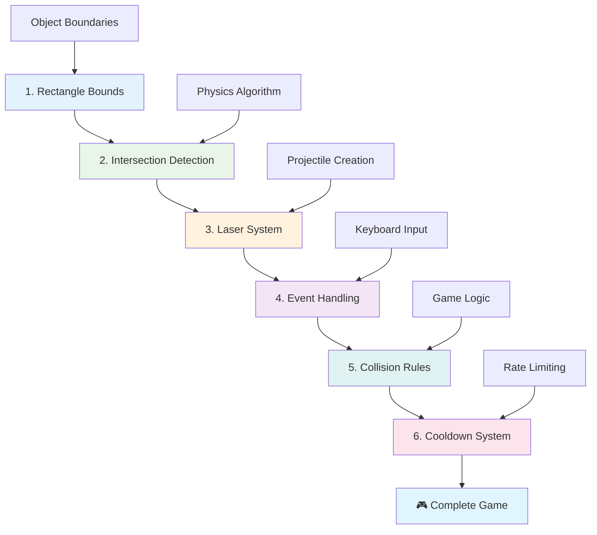
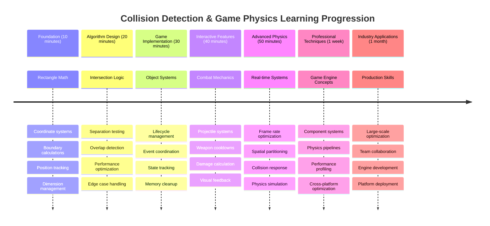

<!--
CO_OP_TRANSLATOR_METADATA:
{
  "original_hash": "039b4d8ce65f5edd82cf48d9c3e6728c",
  "translation_date": "2025-11-03T23:03:07+00:00",
  "source_file": "6-space-game/4-collision-detection/README.md",
  "language_code": "bn"
}
-->
# স্পেস গেম তৈরি করুন পার্ট ৪: লেজার যোগ করা এবং সংঘর্ষ সনাক্ত করা



## প্রি-লেকচার কুইজ

[প্রি-লেকচার কুইজ](https://ff-quizzes.netlify.app/web/quiz/35)

স্টার ওয়ার্সের সেই মুহূর্তটি মনে করুন যখন লুকের প্রোটন টর্পেডো ডেথ স্টারের এক্সহস্ট পোর্টে আঘাত করে। সেই সুনির্দিষ্ট সংঘর্ষ সনাক্তকরণ গ্যালাক্সির ভাগ্য পরিবর্তন করেছিল! গেমে, সংঘর্ষ সনাক্তকরণ একইভাবে কাজ করে - এটি নির্ধারণ করে কখন বস্তুগুলি একে অপরের সাথে যোগাযোগ করে এবং তারপরে কী ঘটে।

এই পাঠে, আপনি আপনার স্পেস গেমে লেজার অস্ত্র যোগ করবেন এবং সংঘর্ষ সনাক্তকরণ বাস্তবায়ন করবেন। ঠিক যেমন নাসার মিশন পরিকল্পনাকারীরা মহাকাশযানের গতিপথ গণনা করে ধ্বংসাবশেষ এড়াতে, তেমনি আপনি শিখবেন কিভাবে গেমের বস্তুগুলি একে অপরের সাথে মিলে যায় তা সনাক্ত করতে। আমরা এটি এমন ধাপে বিভক্ত করব যা একে অপরের উপর ভিত্তি করে তৈরি।

শেষে, আপনার একটি কার্যকরী যুদ্ধ ব্যবস্থা থাকবে যেখানে লেজার শত্রুদের ধ্বংস করবে এবং সংঘর্ষ গেম ইভেন্টগুলি ট্রিগার করবে। এই একই সংঘর্ষ নীতিগুলি পদার্থবিজ্ঞানের সিমুলেশন থেকে ইন্টারেক্টিভ ওয়েব ইন্টারফেস পর্যন্ত সবকিছুতে ব্যবহৃত হয়।



✅ প্রথম কম্পিউটার গেমটি সম্পর্কে একটু গবেষণা করুন। এর কার্যকারিতা কী ছিল?

## সংঘর্ষ সনাক্তকরণ

সংঘর্ষ সনাক্তকরণ অ্যাপোলো লুনার মডিউলের নিকটবর্তী সেন্সরগুলির মতো কাজ করে - এটি ক্রমাগত দূরত্ব পরীক্ষা করে এবং বস্তুগুলি খুব কাছাকাছি এলে সতর্কতা ট্রিগার করে। গেমে, এই সিস্টেমটি নির্ধারণ করে কখন বস্তুগুলি যোগাযোগ করে এবং তারপরে কী ঘটবে।

আমরা যে পদ্ধতি ব্যবহার করব তা প্রতিটি গেমের বস্তুকে একটি আয়তক্ষেত্র হিসাবে বিবেচনা করে, ঠিক যেমন এয়ার ট্রাফিক কন্ট্রোল সিস্টেমগুলি বিমানের ট্র্যাকিংয়ের জন্য সরল জ্যামিতিক আকার ব্যবহার করে। এই আয়তক্ষেত্র পদ্ধতি বেসিক মনে হতে পারে, তবে এটি গণনামূলকভাবে দক্ষ এবং বেশিরভাগ গেমের পরিস্থিতিতে ভাল কাজ করে।

### আয়তক্ষেত্রের উপস্থাপনা

প্রতিটি গেমের বস্তুর জন্য স্থানাঙ্ক সীমানা প্রয়োজন, ঠিক যেমন মার্স পাথফাইন্ডার রোভার তার অবস্থান ম্যাপ করেছিল মঙ্গল পৃষ্ঠে। এখানে আমরা এই সীমানা স্থানাঙ্কগুলি কীভাবে সংজ্ঞায়িত করি:



```javascript
rectFromGameObject() {
  return {
    top: this.y,
    left: this.x,
    bottom: this.y + this.height,
    right: this.x + this.width
  }
}
```

**এটি ভেঙে দেখি:**
- **উপরের প্রান্ত**: এটি হল যেখানে আপনার বস্তুটি উল্লম্বভাবে শুরু হয় (এর y অবস্থান)
- **বাম প্রান্ত**: যেখানে এটি অনুভূমিকভাবে শুরু হয় (এর x অবস্থান)
- **নিচের প্রান্ত**: y অবস্থানে উচ্চতা যোগ করুন - এখন আপনি জানেন এটি কোথায় শেষ হয়!
- **ডান প্রান্ত**: x অবস্থানে প্রস্থ যোগ করুন - এবং আপনার সম্পূর্ণ সীমানা তৈরি হয়েছে

### ইন্টারসেকশন অ্যালগরিদম

আয়তক্ষেত্রের ইন্টারসেকশন সনাক্তকরণ সেই যুক্তি ব্যবহার করে যা হাবল স্পেস টেলিস্কোপ নির্ধারণ করে তার দৃশ্যের মধ্যে আকাশীয় বস্তুগুলি একে অপরের সাথে মিলে যাচ্ছে কিনা। অ্যালগরিদমটি বিচ্ছিন্নতার জন্য পরীক্ষা করে:



```javascript
function intersectRect(r1, r2) {
  return !(r2.left > r1.right ||
    r2.right < r1.left ||
    r2.top > r1.bottom ||
    r2.bottom < r1.top);
}
```

**বিচ্ছিন্নতা পরীক্ষা রাডার সিস্টেমের মতো কাজ করে:**
- আয়তক্ষেত্র ২ সম্পূর্ণভাবে আয়তক্ষেত্র ১-এর ডানদিকে আছে কি?
- আয়তক্ষেত্র ২ সম্পূর্ণভাবে আয়তক্ষেত্র ১-এর বামদিকে আছে কি?
- আয়তক্ষেত্র ২ সম্পূর্ণভাবে আয়তক্ষেত্র ১-এর নিচে আছে কি?
- আয়তক্ষেত্র ২ সম্পূর্ণভাবে আয়তক্ষেত্র ১-এর উপরে আছে কি?

যদি এই শর্তগুলির কোনোটিই সত্য না হয়, তাহলে আয়তক্ষেত্রগুলি অবশ্যই একে অপরের সাথে মিলে যাচ্ছে। এই পদ্ধতি রাডার অপারেটররা নির্ধারণ করে দুটি বিমান নিরাপদ দূরত্বে আছে কিনা।

## বস্তুগুলির জীবনচক্র পরিচালনা

যখন একটি লেজার শত্রুকে আঘাত করে, তখন উভয় বস্তু গেম থেকে সরিয়ে ফেলতে হবে। তবে, লুপের মাঝখানে বস্তু মুছে ফেলা ক্র্যাশ ঘটাতে পারে - এটি অ্যাপোলো গাইডেন্স কম্পিউটারের মতো প্রাথমিক কম্পিউটার সিস্টেমে কঠিনভাবে শেখা একটি পাঠ। পরিবর্তে, আমরা একটি "মুছে ফেলার জন্য চিহ্নিত করুন" পদ্ধতি ব্যবহার করি যা ফ্রেমগুলির মধ্যে বস্তুগুলি নিরাপদে সরিয়ে দেয়।



এখানে আমরা কিছু মুছে ফেলার জন্য কীভাবে চিহ্নিত করি:

```javascript
// Mark object for removal
enemy.dead = true;
```

**কেন এই পদ্ধতি কাজ করে:**
- আমরা বস্তুটিকে "মৃত" হিসাবে চিহ্নিত করি কিন্তু এটি তৎক্ষণাৎ মুছি না
- এটি বর্তমান গেম ফ্রেমটিকে নিরাপদে শেষ করতে দেয়
- এমন কিছু ব্যবহার করার চেষ্টা থেকে ক্র্যাশ হয় না যা ইতিমধ্যে চলে গেছে!

তারপর পরবর্তী রেন্ডার চক্রের আগে চিহ্নিত বস্তুগুলি ফিল্টার করুন:

```javascript
gameObjects = gameObjects.filter(go => !go.dead);
```

**এই ফিল্টারিং কী করে:**
- শুধুমাত্র "জীবিত" বস্তুগুলির একটি নতুন তালিকা তৈরি করে
- "মৃত" হিসাবে চিহ্নিত কিছু বাদ দেয়
- আপনার গেমটি মসৃণভাবে চালিয়ে রাখে
- ধ্বংস হওয়া বস্তুগুলি জমা হওয়া থেকে মেমরি বর্ধন প্রতিরোধ করে

## লেজার মেকানিক্স বাস্তবায়ন

গেমে লেজার প্রজেক্টাইলগুলি স্টার ট্রেকের ফোটন টর্পেডোর মতো একই নীতিতে কাজ করে - এগুলি পৃথক বস্তু যা সোজা লাইনে চলে যতক্ষণ না তারা কিছু আঘাত করে। প্রতিটি স্পেসবার প্রেস একটি নতুন লেজার বস্তু তৈরি করে যা স্ক্রিন জুড়ে চলে।

এটি কাজ করার জন্য, আমাদের কয়েকটি ভিন্ন অংশ সমন্বয় করতে হবে:

**বাস্তবায়নের মূল উপাদান:**
- **লেজার তৈরি করুন** যা হিরোর অবস্থান থেকে স্পন করে
- **কীবোর্ড ইনপুট পরিচালনা করুন** লেজার তৈরি ট্রিগার করতে
- **লেজারের গতি এবং জীবনচক্র পরিচালনা করুন**
- **লেজার প্রজেক্টাইলের জন্য ভিজ্যুয়াল উপস্থাপনা বাস্তবায়ন করুন**

## ফায়ারিং রেট নিয়ন্ত্রণ বাস্তবায়ন

অসীম ফায়ারিং রেট গেম ইঞ্জিনকে অভিভূত করবে এবং গেমপ্লে খুব সহজ করে দেবে। বাস্তব অস্ত্র ব্যবস্থাগুলি একই সীমাবদ্ধতার মুখোমুখি হয় - এমনকি ইউএসএস এন্টারপ্রাইজের ফেজারগুলিকেও শটের মধ্যে রিচার্জ করার সময় প্রয়োজন।

আমরা একটি কুলডাউন সিস্টেম বাস্তবায়ন করব যা দ্রুত ফায়ার স্প্যামিং প্রতিরোধ করে এবং প্রতিক্রিয়াশীল নিয়ন্ত্রণ বজায় রাখে:



```javascript
class Cooldown {
  constructor(time) {
    this.cool = false;
    setTimeout(() => {
      this.cool = true;
    }, time);
  }
}

class Weapon {
  constructor() {
    this.cooldown = null;
  }
  
  fire() {
    if (!this.cooldown || this.cooldown.cool) {
      // Create laser projectile
      this.cooldown = new Cooldown(500);
    } else {
      // Weapon is still cooling down
    }
  }
}
```

**কুলডাউন কীভাবে কাজ করে:**
- তৈরি হলে, অস্ত্রটি "গরম" শুরু হয় (এখনও ফায়ার করতে পারে না)
- টাইমআউট পিরিয়ডের পরে, এটি "ঠান্ডা" হয়ে যায় (ফায়ার করতে প্রস্তুত)
- ফায়ার করার আগে, আমরা পরীক্ষা করি: "অস্ত্রটি ঠান্ডা আছে কি?"
- এটি স্প্যাম-ক্লিকিং প্রতিরোধ করে এবং নিয়ন্ত্রণ প্রতিক্রিয়াশীল রাখে

✅ স্পেস গেম সিরিজের পাঠ ১-এ ফিরে যান কুলডাউন সম্পর্কে মনে করানোর জন্য।

## সংঘর্ষ সিস্টেম তৈরি করা

আপনার বিদ্যমান স্পেস গেম কোডটি প্রসারিত করে একটি সংঘর্ষ সনাক্তকরণ সিস্টেম তৈরি করবেন। আন্তর্জাতিক স্পেস স্টেশনের স্বয়ংক্রিয় সংঘর্ষ এড়ানোর সিস্টেমের মতো, আপনার গেমটি ক্রমাগত বস্তুগুলির অবস্থান পর্যবেক্ষণ করবে এবং ইন্টারসেকশনগুলিতে প্রতিক্রিয়া জানাবে।

আপনার আগের পাঠের কোড থেকে শুরু করে, আপনি সংঘর্ষ সনাক্তকরণ যোগ করবেন নির্দিষ্ট নিয়ম সহ যা বস্তুগুলির ইন্টারঅ্যাকশন পরিচালনা করে।

> 💡 **প্রো টিপ**: লেজার স্প্রাইটটি ইতিমধ্যে আপনার অ্যাসেট ফোল্ডারে অন্তর্ভুক্ত এবং আপনার কোডে উল্লেখ করা হয়েছে, বাস্তবায়নের জন্য প্রস্তুত।

### সংঘর্ষের নিয়ম বাস্তবায়ন

**গেম মেকানিক্স যোগ করুন:**
1. **লেজার শত্রুকে আঘাত করে**: লেজার প্রজেক্টাইল দ্বারা আঘাত করা হলে শত্রু বস্তুটি ধ্বংস হয়
2. **লেজার স্ক্রিনের সীমানায় আঘাত করে**: স্ক্রিনের উপরের প্রান্তে পৌঁছালে লেজারটি সরিয়ে ফেলা হয়
3. **শত্রু এবং হিরোর সংঘর্ষ**: উভয় বস্তু ধ্বংস হয় যখন তারা একে অপরের সাথে মিলে যায়
4. **শত্রু নিচে পৌঁছায়**: শত্রু স্ক্রিনের নিচে পৌঁছালে গেম ওভার শর্ত

### 🔄 **শিক্ষাগত চেক-ইন**
**সংঘর্ষ সনাক্তকরণ ভিত্তি**: বাস্তবায়নের আগে নিশ্চিত করুন আপনি বুঝেছেন:
- ✅ কিভাবে আয়তক্ষেত্রের সীমানা সংঘর্ষ অঞ্চল সংজ্ঞায়িত করে
- ✅ কেন বিচ্ছিন্নতা পরীক্ষা ইন্টারসেকশন গণনার চেয়ে বেশি দক্ষ
- ✅ গেম লুপে বস্তু জীবনচক্র পরিচালনার গুরুত্ব
- ✅ কিভাবে ইভেন্ট-চালিত সিস্টেমগুলি সংঘর্ষ প্রতিক্রিয়া সমন্বয় করে

**দ্রুত স্ব-পরীক্ষা**: যদি আপনি বস্তুগুলি তৎক্ষণাৎ মুছে ফেলেন, তাহলে কী হবে?
*উত্তর: লুপের মাঝখানে মুছে ফেলা ক্র্যাশ বা পুনরাবৃত্তিতে বস্তুগুলি বাদ দিতে পারে*

**পদার্থবিজ্ঞানের বোঝাপড়া**: আপনি এখন বুঝেছেন:
- **স্থানাঙ্ক সিস্টেম**: কিভাবে অবস্থান এবং মাত্রা সীমানা তৈরি করে
- **ইন্টারসেকশন লজিক**: সংঘর্ষ সনাক্তকরণের পিছনে গাণিতিক নীতিগুলি
- **পারফরম্যান্স অপ্টিমাইজেশন**: কেন রিয়েল-টাইম সিস্টেমে দক্ষ অ্যালগরিদম গুরুত্বপূর্ণ
- **মেমরি ম্যানেজমেন্ট**: স্থিতিশীলতার জন্য নিরাপদ বস্তু জীবনচক্র প্যাটার্ন

## আপনার ডেভেলপমেন্ট এনভায়রনমেন্ট সেট আপ করা

ভালো খবর - আমরা ইতিমধ্যে আপনার জন্য বেশিরভাগ ভিত্তি স্থাপন করেছি! আপনার সমস্ত গেম অ্যাসেট এবং বেসিক স্ট্রাকচার `your-work` সাবফোল্ডারে অপেক্ষা করছে, কুল সংঘর্ষ বৈশিষ্ট্যগুলি যোগ করার জন্য প্রস্তুত।

### প্রজেক্ট স্ট্রাকচার

```bash
-| assets
  -| enemyShip.png
  -| player.png
  -| laserRed.png
-| index.html
-| app.js
-| package.json
```

**ফাইল স্ট্রাকচার বোঝা:**
- **সম্বলিত** গেমের বস্তুগুলির জন্য সমস্ত স্প্রাইট ইমেজ
- **অন্তর্ভুক্ত** প্রধান HTML ডকুমেন্ট এবং জাভাস্ক্রিপ্ট অ্যাপ্লিকেশন ফাইল
- **প্রদান করে** স্থানীয় ডেভেলপমেন্ট সার্ভারের জন্য প্যাকেজ কনফিগারেশন

### ডেভেলপমেন্ট সার্ভার শুরু করা

আপনার প্রজেক্ট ফোল্ডারে যান এবং স্থানীয় সার্ভার শুরু করুন:

```bash
cd your-work
npm start
```

**এই কমান্ড সিকোয়েন্স:**
- **পরিবর্তন করে** আপনার কাজের প্রজেক্ট ফোল্ডারে ডিরেক্টরি
- **শুরু করে** একটি স্থানীয় HTTP সার্ভার `http://localhost:5000`-এ
- **পরিবেশন করে** আপনার গেম ফাইলগুলি পরীক্ষার এবং ডেভেলপমেন্টের জন্য
- **সক্ষম করে** লাইভ ডেভেলপমেন্ট স্বয়ংক্রিয় রিলোডিং সহ

আপনার ব্রাউজার খুলুন এবং `http://localhost:5000`-এ যান আপনার বর্তমান গেম স্টেট দেখতে যেখানে হিরো এবং শত্রু স্ক্রিনে রেন্ডার করা হয়েছে।

### ধাপে ধাপে বাস্তবায়ন

নাসা যেমন ভয়েজার মহাকাশযান প্রোগ্রাম করার জন্য পদ্ধতিগত পদ্ধতি ব্যবহার করেছিল, তেমনি আমরা সংঘর্ষ সনাক্তকরণ পদ্ধতিগতভাবে বাস্তবায়ন করব, প্রতিটি উপাদান ধাপে ধাপে তৈরি করব।



#### ১. আয়তক্ষেত্র সংঘর্ষ সীমানা যোগ করুন

প্রথমে, আমাদের গেমের বস্তুগুলিকে তাদের সীমানা বর্ণনা করতে শেখাই। আপনার `GameObject` ক্লাসে এই পদ্ধতি যোগ করুন:

```javascript
rectFromGameObject() {
    return {
      top: this.y,
      left: this.x,
      bottom: this.y + this.height,
      right: this.x + this.width,
    };
  }
```

**এই পদ্ধতি অর্জন করে:**
- **একটি আয়তক্ষেত্র বস্তু তৈরি করে** সুনির্দিষ্ট সীমানা স্থানাঙ্ক সহ
- **নিচের এবং ডান প্রান্ত গণনা করে** অবস্থান এবং মাত্রা যোগ করে
- **একটি বস্তু ফেরত দেয়** সংঘর্ষ সনাক্তকরণ অ্যালগরিদমের জন্য প্রস্তুত
- **সমস্ত গেমের বস্তুগুলির জন্য একটি মানক ইন্টারফেস প্রদান করে**

#### ২. ইন্টারসেকশন সনাক্তকরণ বাস্তবায়ন

এখন আমাদের সংঘর্ষ গোয়েন্দা তৈরি করি - একটি ফাংশন যা বলতে পারে কখন দুটি আয়তক্ষেত্র একে অপরের সাথে মিলে যাচ্ছে:

```javascript
function intersectRect(r1, r2) {
  return !(
    r2.left > r1.right ||
    r2.right < r1.left ||
    r2.top > r1.bottom ||
    r2.bottom < r1.top
  );
}
```

**এই অ্যালগরিদম কাজ করে:**
- **পরীক্ষা করে** আয়তক্ষেত্রগুলির মধ্যে চারটি বিচ্ছিন্নতা শর্ত
- **`false` ফেরত দেয়** যদি কোনো বিচ্ছিন্নতা শর্ত সত্য হয়
- **সংঘর্ষ নির্দেশ করে** যখন কোনো বিচ্ছিন্নতা থাকে না
- **দক্ষ ইন্টারসেকশন পরীক্ষার জন্য** নেগেশন লজিক ব্যবহার করে

#### ৩. লেজার ফায়ারিং সিস্টেম বাস্তবায়ন

এখানে জিনিসগুলি উত্তেজনাপূর্ণ হয়ে ওঠে! আসুন লেজার ফায়ারিং সিস্টেম সেট আপ করি।

##### মেসেজ কনস্ট্যান্ট

প্রথমে, কিছু মেসেজ টাইপ সংজ্ঞায়িত করি যাতে আমাদের গেমের বিভিন্ন অংশ একে অপরের সাথে কথা বলতে পারে:

```javascript
KEY_EVENT_SPACE: "KEY_EVENT_SPACE",
COLLISION_ENEMY_LASER: "COLLISION_ENEMY_LASER",
COLLISION_ENEMY_HERO: "COLLISION_ENEMY_HERO",
```

**এই কনস্ট্যান্টগুলি প্রদান করে:**
- **অ্যাপ্লিকেশনের জুড়ে ইভেন্ট নাম স্ট্যান্ডার্ডাইজ করে**
- **গেম সিস্টেমগুলির মধ্যে ধারাবাহিক যোগাযোগ সক্ষম করে**
- **ইভেন্ট হ্যান্ডলার রেজিস্ট্রেশনে টাইপোগুলি প্রতিরোধ করে**

##### কীবোর্ড ইনপুট পরিচালনা

আপনার কী ইভেন্ট লিসেনারে স্পেস কী সনাক্তকরণ যোগ করুন:

```javascript
} else if(evt.keyCode === 32) {
  eventEmitter.emit(Messages.KEY_EVENT_SPACE);
}
```

**এই ইনপুট হ্যান্ডলার:**
- **স্পেস কী প্রেস সনাক্ত করে** keyCode 32 ব্যবহার করে
- **একটি স্ট্যান্ডার্ডাইজড ইভেন্ট মেসেজ প্রকাশ করে**
- **ডিকাপলড ফায়ারিং লজিক সক্ষম করে**

##### ইভেন্ট লিসেনার সেটআপ

আপনার `initGame()` ফাংশনে ফায়ারিং আচরণ নিবন্ধন করুন:

```javascript
eventEmitter.on(Messages.KEY_EVENT_SPACE, () => {
 if (hero.canFire()) {
   hero.fire();
 }
});
```

**এই ইভেন্ট লিসেনার:**
- **স্পেস কী ইভেন্টে প্রতিক্রিয়া জানায়**
- **ফায়ারিং কুলডাউন স্ট্যাটাস পরীক্ষা করে**
- **অনুমোদিত হলে লেজার তৈরি ট্রিগার করে**

লেজার-শত্রু ইন্টারঅ্যাকশনের জন্য সংঘর্ষ পরিচালনা যোগ করুন:

```javascript
eventEmitter.on(Messages.COLLISION_ENEMY_LASER, (_, { first, second }) => {
  first.dead = true;
  second.dead = true;
});
```

**এই সংঘর্ষ হ্যান্ডলার:**
- **সংঘর্ষ ইভেন্ট ডেটা গ্রহণ করে** উভয় বস্তু সহ
- **উভয় বস্তু মুছে ফেলার জন্য চিহ্নিত করে**
- **সংঘর্ষের পরে সঠিক ক্লিনআপ নিশ্চিত করে**

#### ৪. লেজার ক্লাস তৈরি করুন

একটি লেজার প্রজেক্টাইল বাস্তবায়ন করুন যা উপরের দিকে চলে এবং তার নিজস্ব জীবনচক্র পরিচালনা করে:

```javascript
class Laser extends GameObject {
  constructor(x, y) {
    super(x, y);
    this.width = 9;
    this.height = 33;
    this.type = 'Laser';
    this.img = laserImg;
    
    let id = setInterval(() => {
      if (this.y > 0) {
        this.y -= 15;
      } else {
        this.dead = true;
        clearInterval(id);
      }
    }, 100);
  }
}
```

**এই ক্লাস বাস্তবায়ন:**
- **GameObject প্রসারিত করে** বেসিক কার্যকারিতা উত্তরাধিকারী করতে
- **লেজার স্প্রাইটের জন্য উপযুক্ত মাত্রা সেট করে**
- **`setInterval()` ব্যবহার করে স্বয়ংক্রিয় উপরের দিকে গতি তৈরি করে**
- **স্ক্রিনের উপরের দিকে পৌঁছালে নিজেকে ধ্বংস করে**
- **তার নিজস্ব অ্যানিমেশন টাইমিং এবং ক্লিনআপ পরিচালনা করে**

#### ৫. সংঘর্ষ সনাক্তকরণ সিস্টেম বাস্তবায়ন

একটি ব্যাপক সংঘর্ষ সনাক্তকরণ ফাংশন তৈরি করুন
- [ ] রিয়েল-টাইমে সংঘর্ষের ঘটনাগুলি ট্র্যাক করার জন্য `console.log` স্টেটমেন্ট যোগ করুন

### 🎯 **এই ঘণ্টায় আপনি যা অর্জন করতে পারেন**
- [ ] পোস্ট-লেসন কুইজ সম্পন্ন করুন এবং সংঘর্ষ সনাক্তকরণ অ্যালগরিদমগুলি বুঝুন
- [ ] সংঘর্ষের সময় বিস্ফোরণের মতো ভিজ্যুয়াল ইফেক্ট যোগ করুন
- [ ] বিভিন্ন বৈশিষ্ট্যের সাথে বিভিন্ন ধরনের প্রজেক্টাইল বাস্তবায়ন করুন
- [ ] প্লেয়ারের ক্ষমতা সাময়িকভাবে বাড়ানোর জন্য পাওয়ার-আপ তৈরি করুন
- [ ] সংঘর্ষকে আরও সন্তোষজনক করার জন্য সাউন্ড ইফেক্ট যোগ করুন

### 📅 **আপনার সপ্তাহব্যাপী ফিজিক্স প্রোগ্রামিং**
- [ ] উন্নত সংঘর্ষ সিস্টেম সহ সম্পূর্ণ স্পেস গেম সম্পন্ন করুন
- [ ] আয়তক্ষেত্রের বাইরের উন্নত সংঘর্ষের আকার (বৃত্ত, বহুভুজ) বাস্তবায়ন করুন
- [ ] বাস্তবসম্মত বিস্ফোরণ প্রভাবের জন্য পার্টিকেল সিস্টেম যোগ করুন
- [ ] সংঘর্ষ এড়ানোর জন্য জটিল শত্রু আচরণ তৈরি করুন
- [ ] অনেক বস্তু সহ আরও ভালো পারফরম্যান্সের জন্য সংঘর্ষ সনাক্তকরণ অপ্টিমাইজ করুন
- [ ] গতি এবং বাস্তবসম্মত চলাচলের মতো ফিজিক্স সিমুলেশন যোগ করুন

### 🌟 **আপনার মাসব্যাপী গেম ফিজিক্স দক্ষতা**
- [ ] উন্নত ফিজিক্স ইঞ্জিন এবং বাস্তবসম্মত সিমুলেশন সহ গেম তৈরি করুন
- [ ] ৩ডি সংঘর্ষ সনাক্তকরণ এবং স্পেশিয়াল পার্টিশনিং অ্যালগরিদম শিখুন
- [ ] ওপেন সোর্স ফিজিক্স লাইব্রেরি এবং গেম ইঞ্জিনে অবদান রাখুন
- [ ] গ্রাফিক্স-ইন্টেনসিভ অ্যাপ্লিকেশনের জন্য পারফরম্যান্স অপ্টিমাইজেশন আয়ত্ত করুন
- [ ] গেম ফিজিক্স এবং সংঘর্ষ সনাক্তকরণ সম্পর্কে শিক্ষামূলক কন্টেন্ট তৈরি করুন
- [ ] উন্নত ফিজিক্স প্রোগ্রামিং দক্ষতা প্রদর্শন করে একটি পোর্টফোলিও তৈরি করুন

## 🎯 আপনার সংঘর্ষ সনাক্তকরণ দক্ষতার সময়রেখা



### 🛠️ আপনার গেম ফিজিক্স টুলকিট সারাংশ

এই পাঠ সম্পন্ন করার পরে, আপনি এখন আয়ত্ত করেছেন:
- **সংঘর্ষ গণিত**: আয়তক্ষেত্রের ইন্টারসেকশন অ্যালগরিদম এবং কোঅর্ডিনেট সিস্টেম
- **পারফরম্যান্স অপ্টিমাইজেশন**: রিয়েল-টাইম অ্যাপ্লিকেশনের জন্য দক্ষ সংঘর্ষ সনাক্তকরণ
- **অবজেক্ট লাইফসাইকেল ম্যানেজমেন্ট**: নিরাপদ সৃষ্টি, আপডেট এবং ধ্বংসের প্যাটার্ন
- **ইভেন্ট-ড্রিভেন আর্কিটেকচার**: সংঘর্ষ প্রতিক্রিয়ার জন্য বিচ্ছিন্ন সিস্টেম
- **গেম লুপ ইন্টিগ্রেশন**: ফ্রেম-ভিত্তিক ফিজিক্স আপডেট এবং রেন্ডারিং সমন্বয়
- **ইনপুট সিস্টেম**: রেসপন্সিভ কন্ট্রোলস সহ রেট লিমিটিং এবং ফিডব্যাক
- **মেমরি ম্যানেজমেন্ট**: দক্ষ অবজেক্ট পুলিং এবং ক্লিনআপ কৌশল

**বাস্তব জীবনের প্রয়োগ**: আপনার সংঘর্ষ সনাক্তকরণ দক্ষতা সরাসরি প্রয়োগ করা যায়:
- **ইন্টারঅ্যাকটিভ সিমুলেশন**: বৈজ্ঞানিক মডেলিং এবং শিক্ষামূলক সরঞ্জাম
- **ইউজার ইন্টারফেস ডিজাইন**: ড্র্যাগ-এন্ড-ড্রপ ইন্টারঅ্যাকশন এবং টাচ সনাক্তকরণ
- **ডেটা ভিজ্যুয়ালাইজেশন**: ইন্টারঅ্যাকটিভ চার্ট এবং ক্লিকযোগ্য উপাদান
- **মোবাইল ডেভেলপমেন্ট**: টাচ জেসচার সনাক্তকরণ এবং সংঘর্ষ পরিচালনা
- **রোবোটিক্স প্রোগ্রামিং**: পথ পরিকল্পনা এবং বাধা এড়ানো
- **কম্পিউটার গ্রাফিক্স**: রে ট্রেসিং এবং স্পেশিয়াল অ্যালগরিদম

**পেশাদার দক্ষতা অর্জন**: আপনি এখন করতে পারেন:
- **ডিজাইন** রিয়েল-টাইম সংঘর্ষ সনাক্তকরণের জন্য দক্ষ অ্যালগরিদম
- **বাস্তবায়ন** ফিজিক্স সিস্টেম যা অবজেক্ট জটিলতার সাথে স্কেল করে
- **ডিবাগ** জটিল ইন্টারঅ্যাকশন সিস্টেম গণিতের নীতিগুলি ব্যবহার করে
- **অপ্টিমাইজ** বিভিন্ন হার্ডওয়্যার এবং ব্রাউজার সক্ষমতার জন্য পারফরম্যান্স
- **আর্কিটেক্ট** প্রমাণিত ডিজাইন প্যাটার্ন ব্যবহার করে রক্ষণযোগ্য গেম সিস্টেম

**গেম ডেভেলপমেন্ট ধারণা আয়ত্ত**:
- **ফিজিক্স সিমুলেশন**: রিয়েল-টাইম সংঘর্ষ সনাক্তকরণ এবং প্রতিক্রিয়া
- **পারফরম্যান্স ইঞ্জিনিয়ারিং**: ইন্টারঅ্যাকটিভ অ্যাপ্লিকেশনের জন্য অপ্টিমাইজড অ্যালগরিদম
- **ইভেন্ট সিস্টেম**: গেম উপাদানগুলির মধ্যে বিচ্ছিন্ন যোগাযোগ
- **অবজেক্ট ম্যানেজমেন্ট**: গতিশীল বিষয়বস্তুর জন্য দক্ষ লাইফসাইকেল প্যাটার্ন
- **ইনপুট হ্যান্ডলিং**: উপযুক্ত ফিডব্যাক সহ রেসপন্সিভ কন্ট্রোলস

**পরবর্তী স্তর**: আপনি এখন Matter.js-এর মতো উন্নত ফিজিক্স ইঞ্জিন অন্বেষণ করতে, ৩ডি সংঘর্ষ সনাক্তকরণ বাস্তবায়ন করতে বা জটিল পার্টিকেল সিস্টেম তৈরি করতে প্রস্তুত!

🌟 **অর্জন আনলক**: আপনি পেশাদার-গ্রেড সংঘর্ষ সনাক্তকরণ সহ একটি সম্পূর্ণ ফিজিক্স-ভিত্তিক ইন্টারঅ্যাকশন সিস্টেম তৈরি করেছেন!

## GitHub Copilot Agent Challenge 🚀

Agent মোড ব্যবহার করে নিম্নলিখিত চ্যালেঞ্জ সম্পন্ন করুন:

**বর্ণনা:** সংঘর্ষ সনাক্তকরণ সিস্টেম উন্নত করুন, যেখানে পাওয়ার-আপগুলি এলোমেলোভাবে স্পন হয় এবং হিরো শিপ দ্বারা সংগ্রহ করা হলে সাময়িক ক্ষমতা প্রদান করে।

**প্রম্পট:** একটি PowerUp ক্লাস তৈরি করুন যা GameObject প্রসারিত করে এবং হিরো এবং পাওয়ার-আপগুলির মধ্যে সংঘর্ষ সনাক্তকরণ বাস্তবায়ন করুন। অন্তত দুটি ধরনের পাওয়ার-আপ যোগ করুন: একটি যা ফায়ার রেট বাড়ায় (কুলডাউন কমায়) এবং অন্যটি যা একটি সাময়িক শিল্ড তৈরি করে। এলোমেলো ব্যবধান এবং অবস্থানে পাওয়ার-আপ স্পন করার লজিক অন্তর্ভুক্ত করুন।

---

## 🚀 চ্যালেঞ্জ

একটি বিস্ফোরণ যোগ করুন! [Space Art repo](../../../../6-space-game/solution/spaceArt/readme.txt)-এর গেম অ্যাসেটগুলি দেখুন এবং চেষ্টা করুন যখন লেজার একটি এলিয়েনকে আঘাত করে তখন একটি বিস্ফোরণ যোগ করুন।

## পোস্ট-লেকচার কুইজ

[পোস্ট-লেকচার কুইজ](https://ff-quizzes.netlify.app/web/quiz/36)

## পর্যালোচনা এবং স্ব-অধ্যয়ন

আপনার গেমে এখন পর্যন্ত ব্যবধানগুলির সাথে পরীক্ষা করুন। আপনি যখন এগুলি পরিবর্তন করেন তখন কী ঘটে? [JavaScript timing events](https://www.freecodecamp.org/news/javascript-timing-events-settimeout-and-setinterval/) সম্পর্কে আরও পড়ুন।

## অ্যাসাইনমেন্ট

[সংঘর্ষ অন্বেষণ করুন](assignment.md)

---

**অস্বীকৃতি**:  
এই নথিটি AI অনুবাদ পরিষেবা [Co-op Translator](https://github.com/Azure/co-op-translator) ব্যবহার করে অনুবাদ করা হয়েছে। আমরা যথাসাধ্য সঠিকতা নিশ্চিত করার চেষ্টা করি, তবে অনুগ্রহ করে মনে রাখবেন যে স্বয়ংক্রিয় অনুবাদে ত্রুটি বা অসঙ্গতি থাকতে পারে। মূল ভাষায় থাকা নথিটিকে প্রামাণিক উৎস হিসেবে বিবেচনা করা উচিত। গুরুত্বপূর্ণ তথ্যের জন্য, পেশাদার মানব অনুবাদ সুপারিশ করা হয়। এই অনুবাদ ব্যবহারের ফলে কোনো ভুল বোঝাবুঝি বা ভুল ব্যাখ্যার জন্য আমরা দায়বদ্ধ নই।