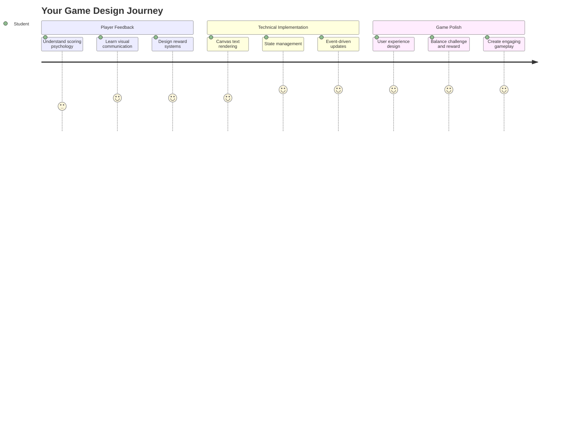
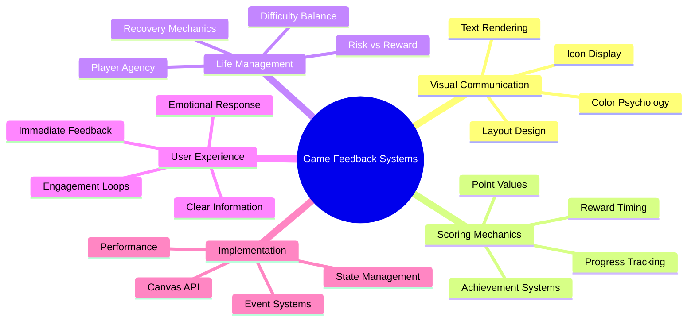
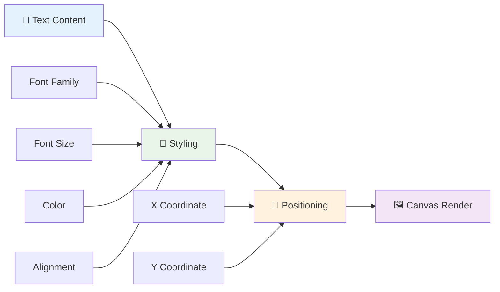
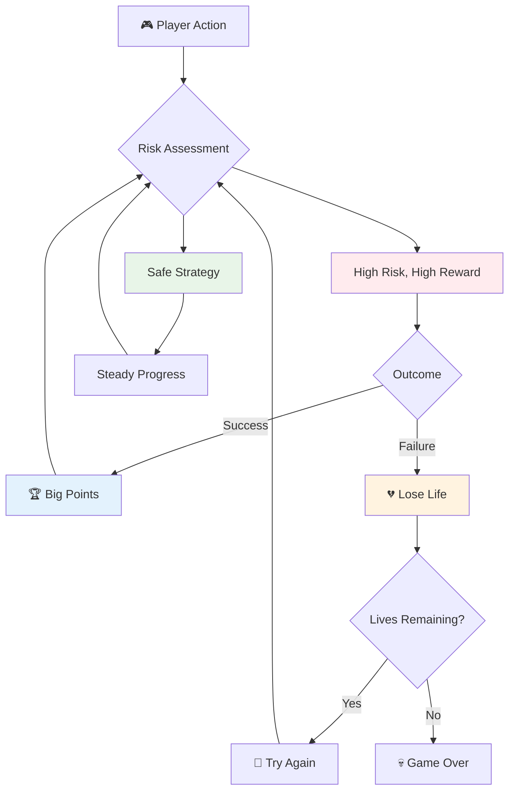
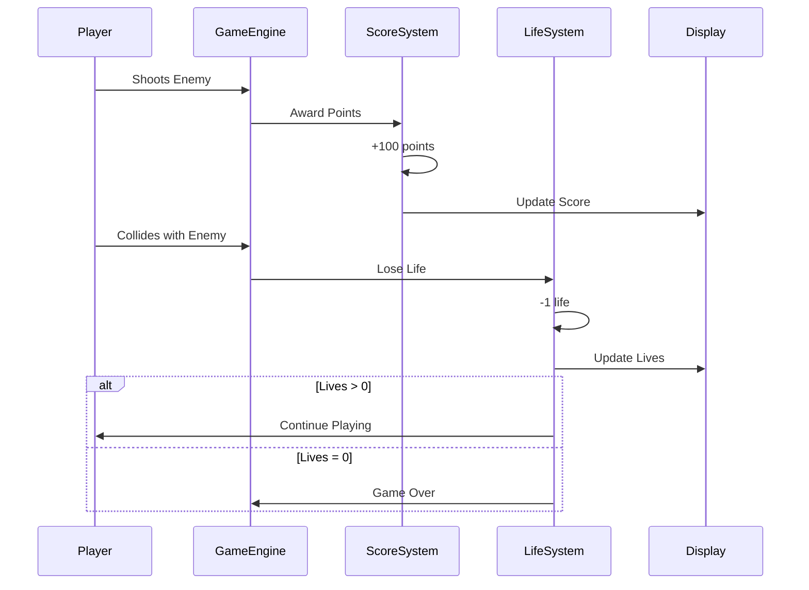
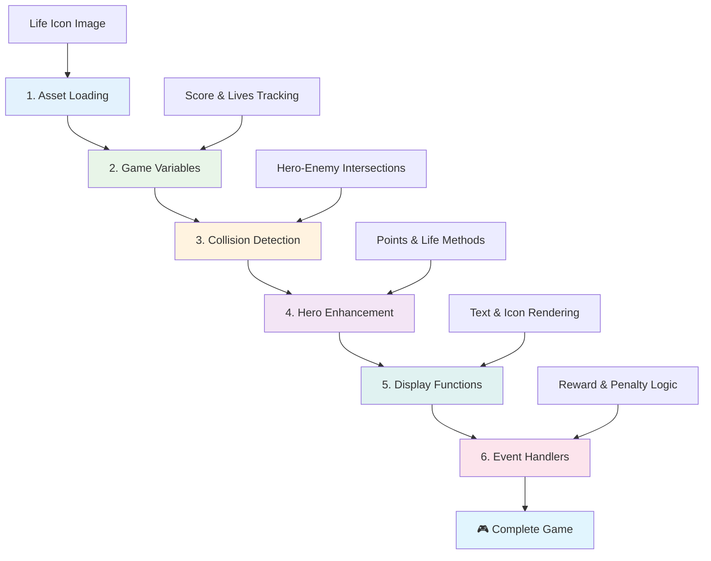
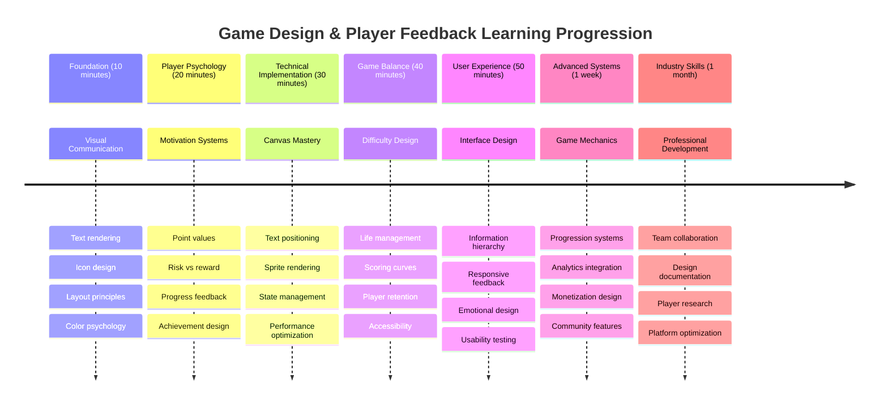

<!--
CO_OP_TRANSLATOR_METADATA:
{
  "original_hash": "2ed9145a16cf576faa2a973dff84d099",
  "translation_date": "2025-11-03T23:05:32+00:00",
  "source_file": "6-space-game/5-keeping-score/README.md",
  "language_code": "bn"
}
-->
# মহাকাশ গেম তৈরি করুন পর্ব ৫: স্কোরিং এবং জীবন



## প্রাক-লেকচার কুইজ

[প্রাক-লেকচার কুইজ](https://ff-quizzes.netlify.app/web/quiz/37)

আপনার মহাকাশ গেমকে সত্যিকারের গেমের মতো অনুভব করাতে প্রস্তুত? আসুন স্কোরিং পয়েন্ট এবং জীবন ব্যবস্থাপনা যোগ করি - মূল মেকানিজম যা স্পেস ইনভেডার্সের মতো প্রাথমিক আর্কেড গেমগুলোকে সাধারণ প্রদর্শনী থেকে আসক্তিমূলক বিনোদনে রূপান্তরিত করেছে। এখানেই আপনার গেমটি সত্যিকারের খেলার যোগ্য হয়ে ওঠে।



## স্ক্রিনে টেক্সট আঁকা - আপনার গেমের কণ্ঠস্বর

আপনার স্কোর প্রদর্শন করতে, আমাদের ক্যানভাসে টেক্সট রেন্ডার করার পদ্ধতি শিখতে হবে। `fillText()` মেথডটি আপনার প্রধান হাতিয়ার - এটি ক্লাসিক আর্কেড গেমগুলিতে স্কোর এবং স্ট্যাটাস তথ্য দেখানোর জন্য ব্যবহৃত একই কৌশল।



আপনার টেক্সটের চেহারা সম্পূর্ণরূপে নিয়ন্ত্রণ করতে পারেন:

```javascript
ctx.font = "30px Arial";
ctx.fillStyle = "red";
ctx.textAlign = "right";
ctx.fillText("show this on the screen", 0, 0);
```

✅ [ক্যানভাসে টেক্সট যোগ করার](https://developer.mozilla.org/docs/Web/API/Canvas_API/Tutorial/Drawing_text) বিষয়ে আরও গভীরভাবে জানুন - আপনি ফন্ট এবং স্টাইলিং নিয়ে কতটা সৃজনশীল হতে পারেন তা দেখে অবাক হতে পারেন!

## জীবন - শুধুমাত্র একটি সংখ্যা নয়

গেম ডিজাইনে, "জীবন" খেলোয়াড়ের ভুল করার সীমাকে উপস্থাপন করে। এই ধারণাটি পিনবল মেশিন থেকে এসেছে, যেখানে আপনি একাধিক বল খেলার সুযোগ পেতেন। অ্যাস্টেরয়েডসের মতো প্রাথমিক ভিডিও গেমগুলিতে, জীবন খেলোয়াড়দের ঝুঁকি নেওয়ার এবং ভুল থেকে শেখার অনুমতি দিয়েছে।



ভিজ্যুয়াল উপস্থাপন গুরুত্বপূর্ণ - শুধুমাত্র "জীবন: ৩" দেখানোর পরিবর্তে জাহাজের আইকন প্রদর্শন করা তাৎক্ষণিক ভিজ্যুয়াল স্বীকৃতি তৈরি করে, যেমনটি প্রাথমিক আর্কেড ক্যাবিনেটগুলি ভাষাগত বাধাগুলির মধ্য দিয়ে যোগাযোগ করতে আইকনোগ্রাফি ব্যবহার করত।

## আপনার গেমের পুরস্কার ব্যবস্থা তৈরি করা

এখন আমরা মূল ফিডব্যাক সিস্টেমগুলি বাস্তবায়ন করব যা খেলোয়াড়দের আকৃষ্ট রাখে:



- **স্কোরিং সিস্টেম**: প্রতিটি ধ্বংস করা শত্রু জাহাজ ১০০ পয়েন্ট প্রদান করে (গণনা করা সহজ করার জন্য রাউন্ড সংখ্যা ব্যবহার করা হয়)। স্কোরটি নিচের বাম কোণে প্রদর্শিত হবে।
- **জীবন কাউন্টার**: আপনার হিরো তিনটি জীবন দিয়ে শুরু করে - প্রাথমিক আর্কেড গেমগুলির দ্বারা চ্যালেঞ্জ এবং খেলার যোগ্যতার মধ্যে ভারসাম্য বজায় রাখতে এটি একটি মানদণ্ড। শত্রুর সাথে প্রতিটি সংঘর্ষে একটি জীবন হারায়। আমরা বাকি জীবনগুলোকে নিচের ডান কোণে জাহাজের আইকন ব্যবহার করে প্রদর্শন করব ।

## চলুন শুরু করি!

প্রথমে আপনার ওয়ার্কস্পেস সেট আপ করুন। আপনার `your-work` সাব ফোল্ডারে ফাইলগুলোতে যান। আপনি এই ফাইলগুলো দেখতে পাবেন:

```bash
-| assets
  -| enemyShip.png
  -| player.png
  -| laserRed.png
-| index.html
-| app.js
-| package.json
```

আপনার গেমটি পরীক্ষা করতে, `your_work` ফোল্ডার থেকে ডেভেলপমেন্ট সার্ভার চালু করুন:

```bash
cd your-work
npm start
```

এটি একটি লোকাল সার্ভার চালাবে `http://localhost:5000` এ। আপনার ব্রাউজারে এই ঠিকানাটি খুলুন এবং আপনার গেমটি দেখুন। কন্ট্রোলগুলো তীর চিহ্ন দিয়ে পরীক্ষা করুন এবং শত্রুদের গুলি করার চেষ্টা করুন যাতে সবকিছু ঠিকঠাক কাজ করছে কিনা তা নিশ্চিত করা যায়।



### কোড লেখার সময়!

1. **আপনার প্রয়োজনীয় ভিজ্যুয়াল অ্যাসেটগুলো সংগ্রহ করুন**। `solution/assets/` ফোল্ডার থেকে `life.png` অ্যাসেটটি কপি করে আপনার `your-work` ফোল্ডারে রাখুন। তারপর `lifeImg` কে আপনার window.onload ফাংশনে যোগ করুন:

    ```javascript
    lifeImg = await loadTexture("assets/life.png");
    ```

1. `lifeImg` কে আপনার অ্যাসেট তালিকায় যোগ করতে ভুলবেন না:

    ```javascript
    let heroImg,
    ...
    lifeImg,
    ...
    eventEmitter = new EventEmitter();
    ```
  
2. **আপনার গেমের ভ্যারিয়েবল সেট আপ করুন**। আপনার মোট স্কোর (০ দিয়ে শুরু) এবং বাকি জীবন (৩ দিয়ে শুরু) ট্র্যাক করার জন্য কিছু কোড যোগ করুন। আমরা এগুলো স্ক্রিনে প্রদর্শন করব যাতে খেলোয়াড়রা সবসময় তাদের অবস্থান জানতে পারে।

3. **সংঘর্ষ সনাক্তকরণ বাস্তবায়ন করুন**। আপনার `updateGameObjects()` ফাংশনটি প্রসারিত করুন যাতে শত্রুরা আপনার হিরোর সাথে সংঘর্ষ করলে তা সনাক্ত করা যায়:

    ```javascript
    enemies.forEach(enemy => {
        const heroRect = hero.rectFromGameObject();
        if (intersectRect(heroRect, enemy.rectFromGameObject())) {
          eventEmitter.emit(Messages.COLLISION_ENEMY_HERO, { enemy });
        }
      })
    ```

4. **আপনার হিরোতে জীবন এবং পয়েন্ট ট্র্যাকিং যোগ করুন**। 
   1. **কাউন্টারগুলো ইনিশিয়ালাইজ করুন**। আপনার `Hero` ক্লাসে `this.cooldown = 0` এর নিচে জীবন এবং পয়েন্ট সেট আপ করুন:

        ```javascript
        this.life = 3;
        this.points = 0;
        ```

   1. **এই মানগুলো খেলোয়াড়কে দেখান**। স্ক্রিনে এই মানগুলো আঁকার জন্য ফাংশন তৈরি করুন:

        ```javascript
        function drawLife() {
          // TODO, 35, 27
          const START_POS = canvas.width - 180;
          for(let i=0; i < hero.life; i++ ) {
            ctx.drawImage(
              lifeImg, 
              START_POS + (45 * (i+1) ), 
              canvas.height - 37);
          }
        }
        
        function drawPoints() {
          ctx.font = "30px Arial";
          ctx.fillStyle = "red";
          ctx.textAlign = "left";
          drawText("Points: " + hero.points, 10, canvas.height-20);
        }
        
        function drawText(message, x, y) {
          ctx.fillText(message, x, y);
        }

        ```

   1. **সবকিছু আপনার গেম লুপে সংযুক্ত করুন**। এই ফাংশনগুলোকে আপনার window.onload ফাংশনে `updateGameObjects()` এর ঠিক পরে যোগ করুন:

        ```javascript
        drawPoints();
        drawLife();
        ```

### 🔄 **শিক্ষাগত চেক-ইন**
**গেম ডিজাইন বোঝা**: পরিণতি বাস্তবায়নের আগে নিশ্চিত করুন:
- ✅ কীভাবে ভিজ্যুয়াল ফিডব্যাক খেলোয়াড়দের গেম স্টেট যোগাযোগ করে
- ✅ কেন UI উপাদানগুলোর সামঞ্জস্যপূর্ণ অবস্থান ব্যবহারযোগ্যতা উন্নত করে
- ✅ পয়েন্ট মান এবং জীবন ব্যবস্থাপনার পিছনে মনস্তত্ত্ব
- ✅ কীভাবে ক্যানভাস টেক্সট রেন্ডারিং HTML টেক্সট থেকে আলাদা

**দ্রুত স্ব-পরীক্ষা**: কেন আর্কেড গেমগুলো সাধারণত পয়েন্ট মানের জন্য রাউন্ড সংখ্যা ব্যবহার করে?
*উত্তর: রাউন্ড সংখ্যা খেলোয়াড়দের মানসিকভাবে গণনা করা সহজ করে এবং সন্তোষজনক মনস্তাত্ত্বিক পুরস্কার তৈরি করে*

**ব্যবহারকারীর অভিজ্ঞতার নীতিমালা**: আপনি এখন প্রয়োগ করছেন:
- **ভিজ্যুয়াল হায়ারার্কি**: গুরুত্বপূর্ণ তথ্যকে প্রধান স্থানে রাখা
- **তাৎক্ষণিক ফিডব্যাক**: খেলোয়াড়ের ক্রিয়াগুলোর রিয়েল-টাইম আপডেট
- **কগনিটিভ লোড**: সহজ, পরিষ্কার তথ্য উপস্থাপন
- **ইমোশনাল ডিজাইন**: আইকন এবং রঙ যা খেলোয়াড়ের সংযোগ তৈরি করে

1. **গেমের পরিণতি এবং পুরস্কার বাস্তবায়ন করুন**। এখন আমরা ফিডব্যাক সিস্টেমগুলো যোগ করব যা খেলোয়াড়ের ক্রিয়াগুলোকে অর্থবহ করে তোলে:

   1. **সংঘর্ষে জীবন হারানো**। আপনার হিরো যখন শত্রুর সাথে ধাক্কা খায়, তখন একটি জীবন হারানো উচিত।
   
      আপনার `Hero` ক্লাসে এই মেথডটি যোগ করুন:

        ```javascript
        decrementLife() {
          this.life--;
          if (this.life === 0) {
            this.dead = true;
          }
        }
        ```

   2. **শত্রুদের গুলি করলে পয়েন্ট অর্জন**। প্রতিটি সফল আঘাত ১০০ পয়েন্ট প্রদান করে, যা সঠিক গুলি করার জন্য তাৎক্ষণিক ইতিবাচক ফিডব্যাক প্রদান করে।

      আপনার Hero ক্লাসে এই ইনক্রিমেন্ট মেথডটি প্রসারিত করুন:
    
        ```javascript
          incrementPoints() {
            this.points += 100;
          }
        ```

        এখন এই ফাংশনগুলোকে আপনার সংঘর্ষ ইভেন্টের সাথে সংযুক্ত করুন:

        ```javascript
        eventEmitter.on(Messages.COLLISION_ENEMY_LASER, (_, { first, second }) => {
           first.dead = true;
           second.dead = true;
           hero.incrementPoints();
        })

        eventEmitter.on(Messages.COLLISION_ENEMY_HERO, (_, { enemy }) => {
           enemy.dead = true;
           hero.decrementLife();
        });
        ```

✅ জাভাস্ক্রিপ্ট এবং ক্যানভাস দিয়ে তৈরি অন্যান্য গেম সম্পর্কে কৌতূহলী? কিছু অনুসন্ধান করুন - আপনি যা সম্ভব তা দেখে অবাক হতে পারেন!

এই বৈশিষ্ট্যগুলো বাস্তবায়নের পরে, আপনার গেমটি পরীক্ষা করুন যাতে সম্পূর্ণ ফিডব্যাক সিস্টেমটি কার্যকর হয়। আপনি নিচের ডান কোণে জীবন আইকন, নিচের বাম কোণে আপনার স্কোর দেখতে পাবেন এবং দেখবেন কিভাবে সংঘর্ষে জীবন কমে যায় এবং সফল শট স্কোর বাড়ায়।

আপনার গেম এখন সেই মূল মেকানিজমগুলো ধারণ করে যা প্রাথমিক আর্কেড গেমগুলোকে এত আকর্ষণীয় করে তুলেছিল - পরিষ্কার লক্ষ্য, তাৎক্ষণিক ফিডব্যাক, এবং খেলোয়াড়ের ক্রিয়াগুলোর জন্য অর্থবহ পরিণতি।

### 🔄 **শিক্ষাগত চেক-ইন**
**সম্পূর্ণ গেম ডিজাইন সিস্টেম**: খেলোয়াড়ের ফিডব্যাক সিস্টেমের দক্ষতা যাচাই করুন:
- ✅ কীভাবে স্কোরিং মেকানিজম খেলোয়াড়ের প্রেরণা এবং আকর্ষণ তৈরি করে?
- ✅ কেন ভিজ্যুয়াল সামঞ্জস্য UI ডিজাইনের জন্য গুরুত্বপূর্ণ?
- ✅ কীভাবে জীবন ব্যবস্থা চ্যালেঞ্জ এবং খেলোয়াড় ধরে রাখার মধ্যে ভারসাম্য তৈরি করে?
- ✅ তাৎক্ষণিক ফিডব্যাক সন্তোষজনক গেমপ্লে তৈরিতে কী ভূমিকা পালন করে?

**সিস্টেম ইন্টিগ্রেশন**: আপনার ফিডব্যাক সিস্টেম প্রদর্শন করে:
- **ব্যবহারকারীর অভিজ্ঞতা ডিজাইন**: পরিষ্কার ভিজ্যুয়াল যোগাযোগ এবং তথ্য হায়ারার্কি
- **ইভেন্ট-ড্রিভেন আর্কিটেকচার**: খেলোয়াড়ের ক্রিয়াগুলোর প্রতিক্রিয়াশীল আপডেট
- **স্টেট ম্যানেজমেন্ট**: গতিশীল গেম ডেটা ট্র্যাকিং এবং প্রদর্শন
- **ক্যানভাস দক্ষতা**: টেক্সট রেন্ডারিং এবং স্প্রাইট পজিশনিং
- **গেম মনস্তত্ত্ব**: খেলোয়াড়ের প্রেরণা এবং আকর্ষণ বোঝা

**পেশাদার প্যাটার্ন**: আপনি বাস্তবায়ন করেছেন:
- **MVC আর্কিটেকচার**: গেম লজিক, ডেটা, এবং উপস্থাপনার পৃথকীকরণ
- **অবজারভার প্যাটার্ন**: গেম স্টেট পরিবর্তনের জন্য ইভেন্ট-ড্রিভেন আপডেট
- **কম্পোনেন্ট ডিজাইন**: রেন্ডারিং এবং লজিকের জন্য পুনঃব্যবহারযোগ্য ফাংশন
- **পারফরম্যান্স অপ্টিমাইজেশন**: গেম লুপে দক্ষ রেন্ডারিং

### ⚡ **পরবর্তী ৫ মিনিটে আপনি যা করতে পারেন**
- [ ] স্কোর প্রদর্শনের জন্য বিভিন্ন ফন্ট সাইজ এবং রঙের সাথে পরীক্ষা করুন
- [ ] পয়েন্ট মান পরিবর্তন করে দেখুন এটি গেমপ্লে অনুভূতিতে কীভাবে প্রভাব ফেলে
- [ ] পয়েন্ট এবং জীবন পরিবর্তনের সময় কনসোল লগ স্টেটমেন্ট যোগ করুন
- [ ] জীবন শেষ হয়ে যাওয়া বা উচ্চ স্কোর অর্জনের মতো এজ কেসগুলো পরীক্ষা করুন

### 🎯 **এই ঘণ্টায় আপনি যা অর্জন করতে পারেন**
- [ ] পোস্ট-লেসন কুইজ সম্পন্ন করুন এবং গেম ডিজাইন মনস্তত্ত্ব বুঝুন
- [ ] স্কোরিং এবং জীবন হারানোর জন্য সাউন্ড ইফেক্ট যোগ করুন
- [ ] localStorage ব্যবহার করে একটি উচ্চ স্কোর সিস্টেম বাস্তবায়ন করুন
- [ ] বিভিন্ন শত্রু প্রকারের জন্য বিভিন্ন পয়েন্ট মান তৈরি করুন
- [ ] জীবন হারানোর সময় স্ক্রিন শেকের মতো ভিজ্যুয়াল ইফেক্ট যোগ করুন

### 📅 **আপনার সপ্তাহব্যাপী গেম ডিজাইন যাত্রা**
- [ ] সম্পূর্ণ মহাকাশ গেমটি সম্পন্ন করুন এবং উন্নত ফিডব্যাক সিস্টেম যোগ করুন
- [ ] কম্বো মাল্টিপ্লায়ারগুলোর মতো উন্নত স্কোরিং মেকানিজম বাস্তবায়ন করুন
- [ ] অর্জন এবং আনলকযোগ্য বিষয়বস্তু যোগ করুন
- [ ] চ্যালেঞ্জের অগ্রগতি এবং ভারসাম্য ব্যবস্থা তৈরি করুন
- [ ] মেনু এবং গেম ওভার স্ক্রিনের জন্য ব্যবহারকারী ইন্টারফেস ডিজাইন করুন
- [ ] অন্যান্য গেম অধ্যয়ন করুন যাতে আকর্ষণ মেকানিজমগুলো বোঝা যায়

### 🌟 **আপনার মাসব্যাপী গেম ডেভেলপমেন্ট দক্ষতা অর্জন**
- [ ] উন্নত অগ্রগতি সিস্টেম সহ সম্পূর্ণ গেম তৈরি করুন
- [ ] গেম অ্যানালিটিক্স এবং খেলোয়াড়ের আচরণ পরিমাপ শিখুন
- [ ] ওপেন সোর্স গেম ডেভেলপমেন্ট প্রকল্পে অবদান রাখুন
- [ ] উন্নত গেম ডিজাইন প্যাটার্ন এবং মোনেটাইজেশন শিখুন
- [ ] গেম ডিজাইন এবং ডেভেলপমেন্ট দক্ষতা প্রদর্শন করে একটি পোর্টফোলিও তৈরি করুন

## 🎯 আপনার গেম ডিজাইন দক্ষতা অর্জনের সময়সূচি



### 🛠️ আপনার গেম ডিজাইন টুলকিট সারসংক্ষেপ

এই পাঠটি সম্পন্ন করার পরে, আপনি এখন দক্ষ হয়েছেন:
- **খেলোয়াড়ের মনস্তত্ত্ব**: প্রেরণা, ঝুঁকি/পুরস্কার, এবং আকর্ষণ লুপ বোঝা
- **ভিজ্যুয়াল যোগাযোগ**: টেক্সট, আইকন, এবং লেআউট ব্যবহার করে কার্যকর UI ডিজাইন
- **ফিডব্যাক সিস্টেম**: খেলোয়াড়ের ক্রিয়াগুলো এবং গেম ইভেন্টের তাৎক্ষণিক প্রতিক্রিয়া
- **স্টেট ম্যানেজমেন্ট**: গতিশীল গেম ডেটা দক্ষতার সাথে ট্র্যাকিং এবং প্রদর্শন
- **ক্যানভাস টেক্সট রেন্ডারিং**: স্টাইলিং এবং পজিশনিং সহ পেশাদার টেক্সট প্রদর্শন
- **ইভেন্ট ইন্টিগ্রেশন**: ব্যবহারকারীর ক্রিয়াগুলোকে অর্থবহ গেম পরিণতির সাথে সংযুক্ত করা
- **গেম ব্যালেন্স**: চ্যালেঞ্জ কার্ভ এবং খেলোয়াড়ের অগ্রগতি সিস্টেম ডিজাইন করা

**বাস্তব জীবনের প্রয়োগ**: আপনার গেম ডিজাইন দক্ষতা সরাসরি প্রয়োগ করা যায়:
- **ব্যবহারকারী ইন্টারফেস ডিজাইন**: আকর্ষণীয় এবং স্বজ্ঞাত ইন্টারফেস তৈরি করা
- **প্রোডাক্ট ডেভেলপমেন্ট**: ব্যবহারকারীর প্রেরণা এবং ফিডব্যাক লুপ বোঝা
- **শিক্ষামূলক প্রযুক্তি**: গেমিফিকেশন এবং শেখার আকর্ষণ সিস্টেম
- **ডেটা ভিজ্যুয়ালাইজেশন**: জটিল তথ্যকে সহজলভ্য এবং আকর্ষণীয় করে তোলা
- **মোবাইল অ্যাপ ডেভেলপমেন্ট**: রিটেনশন মেকানিজম এবং ব্যবহারকারীর অভিজ্ঞতা ডিজাইন
- **মার্কেটিং প্রযুক্তি**: ব্যবহারকারীর আচরণ এবং কনভার্শন অপ্টিমাইজেশন বোঝা

**অর্জিত পেশাদার দক্ষতা**: আপনি এখন করতে পারেন:
- **ডিজাইন** ব্যবহারকারীর অভিজ্ঞতা যা ব্যবহারকারীদের প্রেরণা এবং আকর্ষণ করে
- **বাস্তবায়ন** ফিডব্যাক সিস্টেম যা ব্যবহারকারীর আচরণকে কার্যকরভাবে নির্দেশ করে
- **ব্যালেন্স** চ্যালেঞ্জ এবং ইন্টারঅ্যাক্টিভ সিস্টেমে অ্যাক্সেসিবিলিটি
- **তৈরি করুন** ভিজ্যুয়াল যোগাযোগ যা বিভিন্ন ব্যবহারকারী গোষ্ঠীর জন্য কার্যকর
- **বিশ্লেষণ করুন** ব্যবহারকারীর আচরণ এবং ডিজাইন উন্নতির উপর পুনর্বিবেচনা করুন

**গেম ডেভেলপমেন্ট ধারণা অর্জিত**:
- **খেলোয়াড়ের প্রেরণা**: আকর্ষণ এবং রিটেনশন কীভাবে কাজ করে তা বোঝা
- **ভিজ্যুয়াল ডিজাইন**: পরিষ্কার, আকর্ষণীয় এবং কার্যকর ইন্টারফেস তৈরি করা
- **সিস্টেম ইন্টিগ্রেশন**: একটি সামগ্রিক অভিজ্ঞতার জন্য একাধিক গেম সিস্টেম সংযুক্ত করা
- **পারফরম্যান্স অপ্টিমাইজেশন**: গেম লুপে দক্ষ রেন্ডারিং এবং স্টেট ম্যানেজমেন্ট
- **অ্যাক্সেসিবিলিটি**: বিভিন্ন দক্ষতার স্তর এবং খেলোয়াড়ের প্রয়োজনের জন্য ডিজাইন করা

**পরবর্তী স্তর**: আপনি এখন উন্নত গেম ডিজাইন প্যাটার্ন, অ্যানালিটিক্স সিস্টেম বাস্তবায়ন, অথবা গেম মোনেটাইজেশন এবং খেলোয়াড়ের রিটেনশন কৌশল অধ্যয়ন করতে প্রস্তুত!

🌟 **অর্জন আনলক**: আপনি পেশাদার গেম ডিজাইন নীতিমালার সাথে একটি সম্পূর্ণ খেলোয়াড় ফিডব্যাক সিস্টেম তৈরি করেছেন!

---

## GitHub Copilot Agent Challenge 🚀

Agent মোড ব্যবহার করে নিম্নলিখিত চ্যালেঞ্জটি সম্পন্ন করুন:

**বর্ণনা:** মহাকাশ গেমের স্কোরিং সিস্টেম উন্নত করুন, যাতে একটি উচ্চ স্কোর বৈশিষ্ট্য এবং বোনাস স্কোরিং মেকানিজম অন্তর্ভুক্ত থাকে।

**প্রম্পট

---

**অস্বীকৃতি**:  
এই নথিটি AI অনুবাদ পরিষেবা [Co-op Translator](https://github.com/Azure/co-op-translator) ব্যবহার করে অনুবাদ করা হয়েছে। আমরা যথাসাধ্য সঠিকতা নিশ্চিত করার চেষ্টা করি, তবে অনুগ্রহ করে মনে রাখবেন যে স্বয়ংক্রিয় অনুবাদে ত্রুটি বা অসঙ্গতি থাকতে পারে। নথিটির মূল ভাষায় থাকা আসল সংস্করণকে প্রামাণিক উৎস হিসেবে বিবেচনা করা উচিত। গুরুত্বপূর্ণ তথ্যের জন্য, পেশাদার মানব অনুবাদ সুপারিশ করা হয়। এই অনুবাদ ব্যবহারের ফলে কোনো ভুল বোঝাবুঝি বা ভুল ব্যাখ্যার জন্য আমরা দায়ী থাকব না।