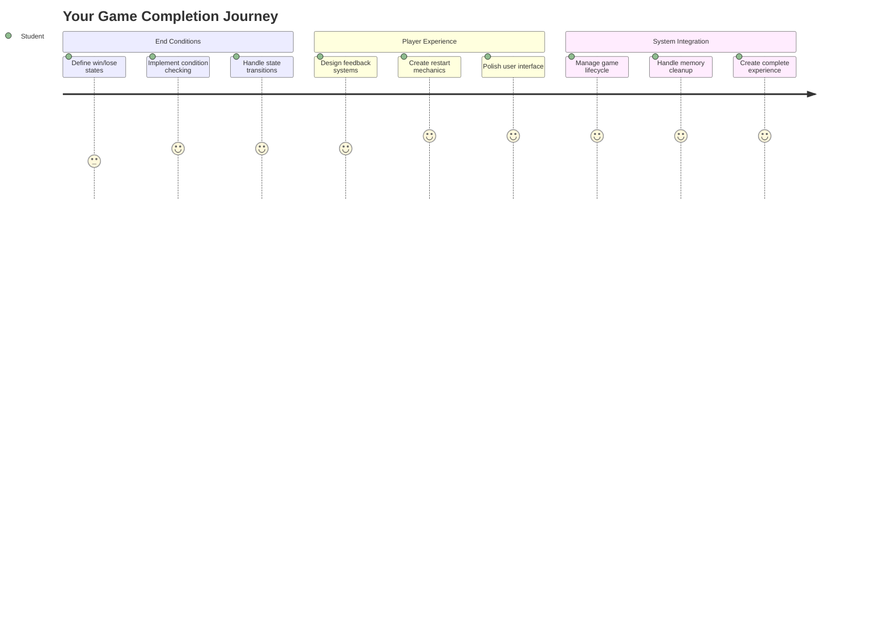
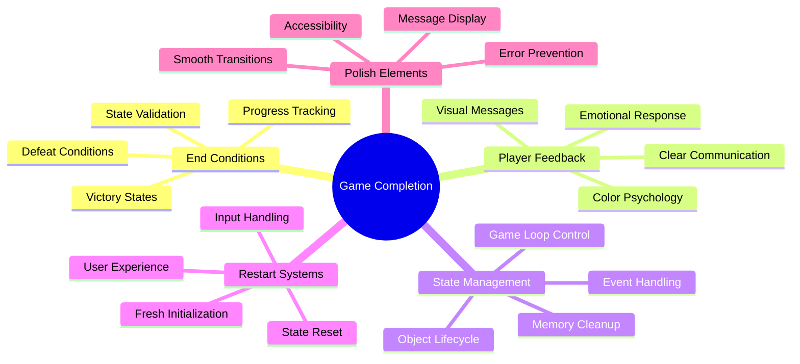
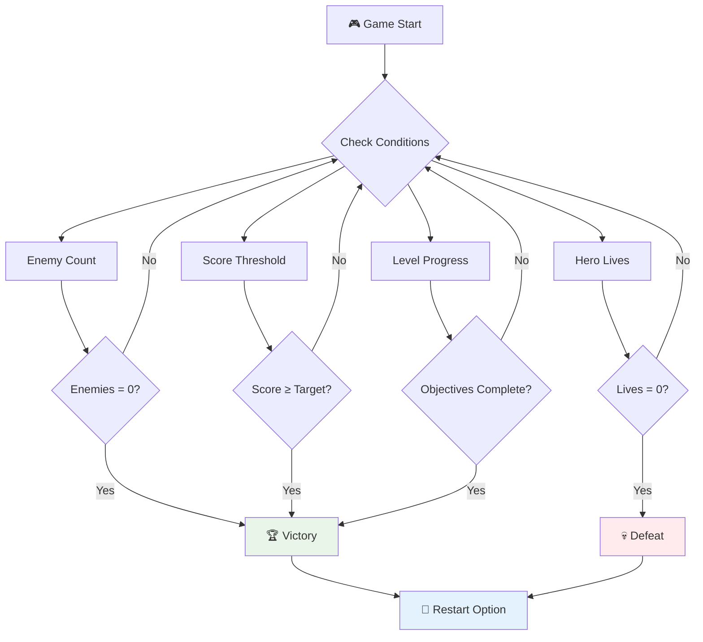
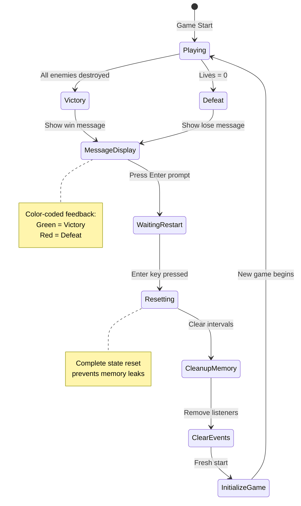
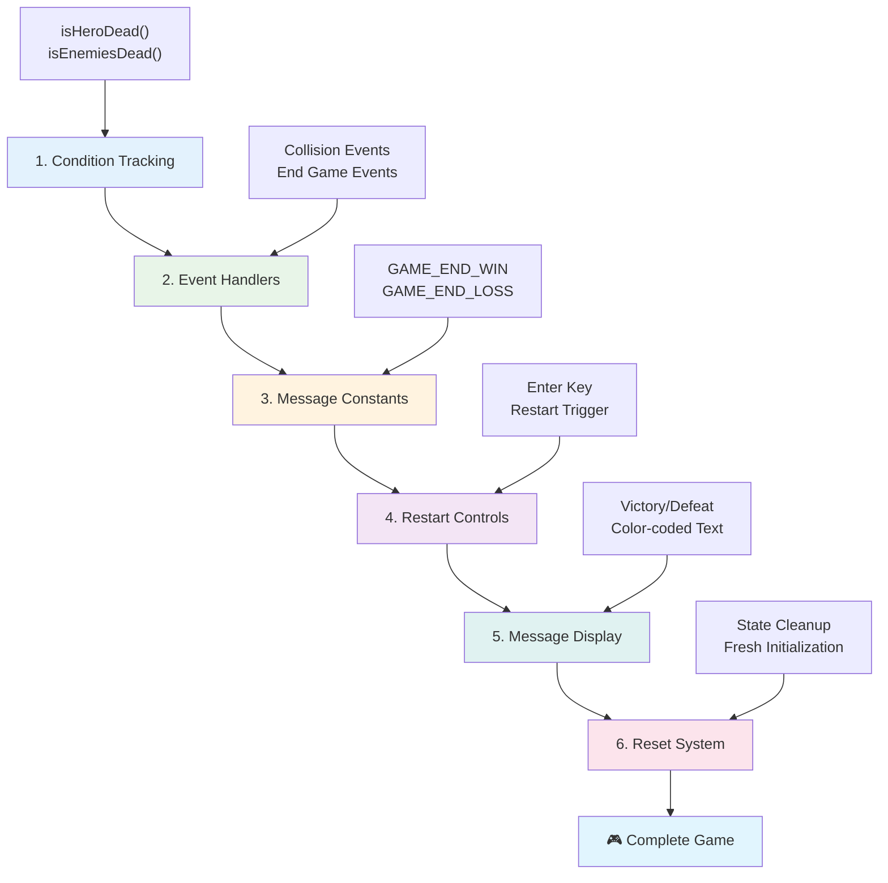
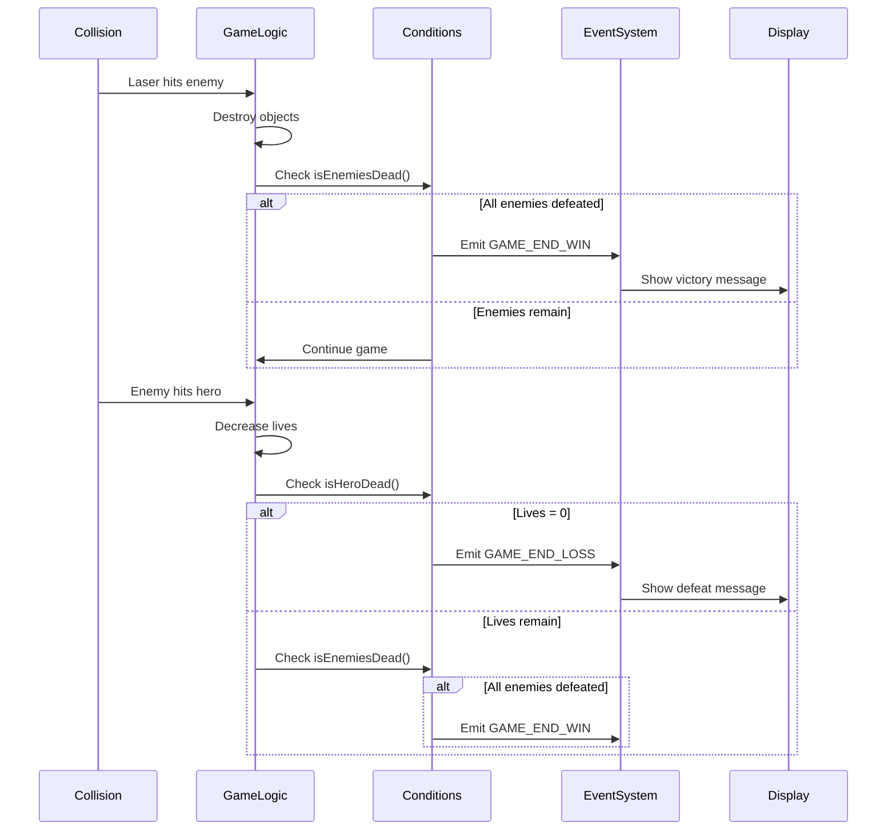
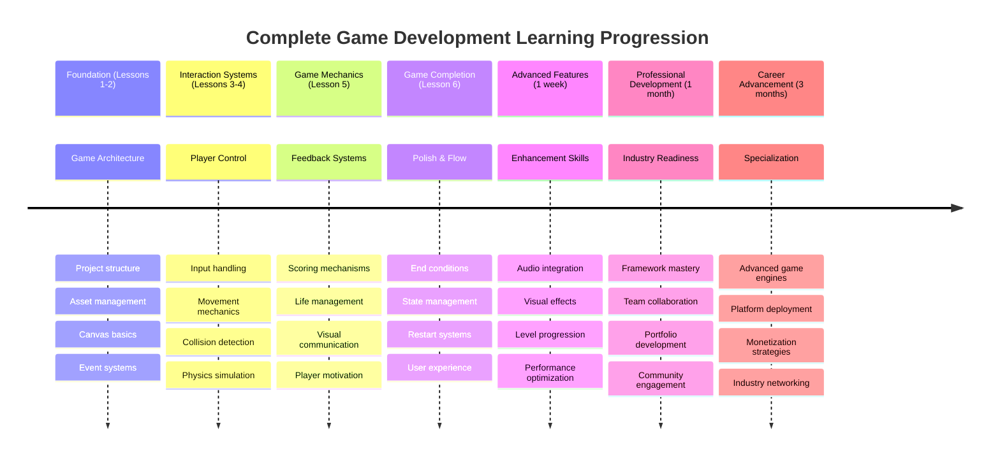

# স্পেস গেম তৈরি করুন পার্ট ৬: শেষ এবং পুনরায় শুরু



প্রত্যেক ভালো গেমের জন্য স্পষ্ট শেষের শর্ত এবং মসৃণ পুনরায় শুরু করার ব্যবস্থা প্রয়োজন। আপনি ইতিমধ্যে একটি চমৎকার স্পেস গেম তৈরি করেছেন যেখানে মুভমেন্ট, যুদ্ধ এবং স্কোরিং রয়েছে - এখন সময় এসেছে সেই চূড়ান্ত অংশগুলো যোগ করার যা গেমটিকে সম্পূর্ণ মনে করায়।

আপনার গেম বর্তমানে অনির্দিষ্টকালের জন্য চলতে থাকে, ঠিক যেমন ১৯৭৭ সালে নাসা দ্বারা উৎক্ষেপিত ভয়েজার প্রোবস - যা এখনও কয়েক দশক ধরে মহাকাশে ভ্রমণ করছে। যদিও মহাকাশ অনুসন্ধানের জন্য এটি ঠিক আছে, গেমের জন্য নির্ধারিত শেষের পয়েন্ট প্রয়োজন যা সন্তোষজনক অভিজ্ঞতা তৈরি করে।

আজ আমরা সঠিক জয়/পরাজয়ের শর্ত এবং একটি পুনরায় শুরু করার ব্যবস্থা বাস্তবায়ন করব। এই পাঠের শেষে, আপনার একটি পরিপূর্ণ গেম থাকবে যা খেলোয়াড়রা সম্পন্ন করতে এবং পুনরায় খেলতে পারবে, ঠিক যেমন ক্লাসিক আর্কেড গেমগুলো যা মাধ্যমটিকে সংজ্ঞায়িত করেছে।



## প্রি-লেকচার কুইজ

[প্রি-লেকচার কুইজ](https://ff-quizzes.netlify.app/web/quiz/39)

## গেমের শেষের শর্ত বুঝুন

আপনার গেম কখন শেষ হওয়া উচিত? এই মৌলিক প্রশ্নটি প্রাচীন আর্কেড যুগ থেকে গেম ডিজাইনকে আকৃতির দিয়েছে। প্যাক-ম্যান শেষ হয় যখন আপনি ভূত দ্বারা ধরা পড়েন বা সমস্ত বিন্দু পরিষ্কার করেন, আর স্পেস ইনভেডার্স শেষ হয় যখন এলিয়েনরা নিচে পৌঁছায় বা আপনি তাদের সবাইকে ধ্বংস করেন।

গেম নির্মাতা হিসেবে, আপনি বিজয় এবং পরাজয়ের শর্ত নির্ধারণ করেন। আমাদের স্পেস গেমের জন্য, এখানে কিছু প্রমাণিত পদ্ধতি রয়েছে যা আকর্ষণীয় গেমপ্লে তৈরি করে:



- **`N` শত্রু জাহাজ ধ্বংস করা হয়েছে**: এটি বেশ সাধারণ যদি আপনি গেমটিকে বিভিন্ন স্তরে ভাগ করেন যেখানে একটি স্তর সম্পন্ন করতে `N` শত্রু জাহাজ ধ্বংস করতে হবে।
- **আপনার জাহাজ ধ্বংস হয়েছে**: এমন অনেক গেম রয়েছে যেখানে আপনার জাহাজ ধ্বংস হলে আপনি গেমটি হারেন। আরেকটি সাধারণ পদ্ধতি হলো জীবন ধারণার ব্যবহার। প্রতিবার আপনার জাহাজ ধ্বংস হলে একটি জীবন কমে যায়। যখন সমস্ত জীবন শেষ হয়ে যায় তখন আপনি গেমটি হারেন।
- **আপনি `N` পয়েন্ট সংগ্রহ করেছেন**: আরেকটি সাধারণ শেষের শর্ত হলো পয়েন্ট সংগ্রহ করা। আপনি কীভাবে পয়েন্ট পাবেন তা আপনার উপর নির্ভর করে, তবে শত্রু জাহাজ ধ্বংস করা বা ধ্বংস হওয়া আইটেম সংগ্রহ করার মতো বিভিন্ন কার্যকলাপে পয়েন্ট দেওয়া সাধারণ।
- **একটি স্তর সম্পন্ন করুন**: এটি বিভিন্ন শর্ত অন্তর্ভুক্ত করতে পারে যেমন `X` শত্রু জাহাজ ধ্বংস, `Y` পয়েন্ট সংগ্রহ বা হয়তো একটি নির্দিষ্ট আইটেম সংগ্রহ করা।

## গেম পুনরায় শুরু করার কার্যকারিতা বাস্তবায়ন

ভালো গেমগুলো মসৃণ পুনরায় শুরু করার ব্যবস্থার মাধ্যমে পুনরায় খেলার উৎসাহ দেয়। যখন খেলোয়াড়রা একটি গেম সম্পন্ন করে (বা পরাজিত হয়), তারা প্রায়ই অবিলম্বে আবার চেষ্টা করতে চায় - হয় তাদের স্কোর বাড়ানোর জন্য বা তাদের পারফরম্যান্স উন্নত করার জন্য।



টেট্রিস এটি নিখুঁতভাবে উদাহরণ দেয়: যখন আপনার ব্লকগুলো শীর্ষে পৌঁছায়, আপনি জটিল মেনুতে না গিয়ে অবিলম্বে একটি নতুন গেম শুরু করতে পারেন। আমরা একটি অনুরূপ পুনরায় শুরু করার ব্যবস্থা তৈরি করব যা গেমের অবস্থা পরিষ্কারভাবে রিসেট করে এবং খেলোয়াড়দের দ্রুত অ্যাকশনে ফিরিয়ে আনে।

✅ **প্রতিফলন**: আপনি যে গেমগুলো খেলেছেন তা নিয়ে ভাবুন। কোন শর্তে সেগুলো শেষ হয় এবং কীভাবে আপনাকে পুনরায় শুরু করতে বলা হয়? কী একটি পুনরায় শুরু করার অভিজ্ঞতাকে মসৃণ এবং হতাশাজনক করে তোলে?

## আপনি কী তৈরি করবেন

আপনি চূড়ান্ত বৈশিষ্ট্যগুলো বাস্তবায়ন করবেন যা আপনার প্রকল্পকে একটি সম্পূর্ণ গেম অভিজ্ঞতায় রূপান্তরিত করে। এই উপাদানগুলো পোলিশড গেমগুলোকে সাধারণ প্রোটোটাইপ থেকে আলাদা করে।

**আজ আমরা যা যোগ করছি:**

1. **বিজয়ের শর্ত**: সমস্ত শত্রুকে ধ্বংস করুন এবং একটি সঠিক উদযাপন পান (আপনি এটি অর্জন করেছেন!)
2. **পরাজয়ের শর্ত**: জীবন শেষ হয়ে গেলে একটি পরাজয়ের স্ক্রিনের মুখোমুখি হন
3. **পুনরায় শুরু করার ব্যবস্থা**: Enter চাপুন এবং আবার শুরু করুন - কারণ একটি গেম কখনোই যথেষ্ট নয়
4. **অবস্থা ব্যবস্থাপনা**: প্রতিবার পরিষ্কার শুরু - আগের গেমের কোনো অবশিষ্ট শত্রু বা অদ্ভুত ত্রুটি থাকবে না

## শুরু করা

আপনার ডেভেলপমেন্ট পরিবেশ প্রস্তুত করুন। আপনার পূর্ববর্তী পাঠ থেকে সমস্ত স্পেস গেম ফাইল প্রস্তুত থাকা উচিত।

**আপনার প্রকল্পটি এরকম দেখতে হবে:**

```bash
-| assets
  -| enemyShip.png
  -| player.png
  -| laserRed.png
  -| life.png
-| index.html
-| app.js
-| package.json
```

**আপনার ডেভেলপমেন্ট সার্ভার শুরু করুন:**

```bash
cd your-work
npm start
```

**এই কমান্ড:**
- একটি স্থানীয় সার্ভার চালায় `http://localhost:5000` এ
- আপনার ফাইলগুলো সঠিকভাবে পরিবেশন করে
- আপনি পরিবর্তন করলে স্বয়ংক্রিয়ভাবে রিফ্রেশ হয়

`http://localhost:5000` আপনার ব্রাউজারে খুলুন এবং নিশ্চিত করুন যে আপনার গেম চলছে। আপনি মুভ করতে, শুট করতে এবং শত্রুদের সাথে ইন্টারঅ্যাক্ট করতে সক্ষম হওয়া উচিত। একবার নিশ্চিত হলে, আমরা বাস্তবায়নে এগিয়ে যেতে পারি।

> 💡 **প্রো টিপ**: ভিজ্যুয়াল স্টুডিও কোডে সতর্কতা এড়াতে, `gameLoopId` কে আপনার ফাইলের শীর্ষে `let gameLoopId;` হিসেবে ঘোষণা করুন, `window.onload` ফাংশনের ভিতরে ঘোষণা করার পরিবর্তে। এটি আধুনিক জাভাস্ক্রিপ্ট ভেরিয়েবল ঘোষণা করার সেরা অনুশীলন অনুসরণ করে।



## বাস্তবায়নের ধাপ

### ধাপ ১: শেষের শর্ত ট্র্যাকিং ফাংশন তৈরি করুন

আমাদের এমন ফাংশন দরকার যা গেম কখন শেষ হওয়া উচিত তা পর্যবেক্ষণ করবে। ঠিক যেমন আন্তর্জাতিক স্পেস স্টেশনের সেন্সরগুলো গুরুত্বপূর্ণ সিস্টেমগুলো ক্রমাগত পর্যবেক্ষণ করে, এই ফাংশনগুলো গেমের অবস্থা ক্রমাগত পরীক্ষা করবে।

```javascript
function isHeroDead() {
  return hero.life <= 0;
}

function isEnemiesDead() {
  const enemies = gameObjects.filter((go) => go.type === "Enemy" && !go.dead);
  return enemies.length === 0;
}
```

**ভেতরে কী ঘটছে:**
- **পরীক্ষা করে** আমাদের হিরোর জীবন শেষ হয়েছে কিনা (আহা!)
- **গণনা করে** কত শত্রু এখনও জীবিত এবং সক্রিয়
- **`true` ফেরত দেয়** যখন যুদ্ধক্ষেত্র শত্রুমুক্ত হয়
- **সরল true/false লজিক ব্যবহার করে** বিষয়গুলো সহজ রাখে
- **সব গেম অবজেক্ট ফিল্টার করে** জীবিতদের খুঁজে বের করে

### ধাপ ২: শেষের শর্তের জন্য ইভেন্ট হ্যান্ডলার আপডেট করুন

এখন আমরা এই শর্ত পরীক্ষাগুলো গেমের ইভেন্ট সিস্টেমের সাথে সংযুক্ত করব। প্রতিবার একটি সংঘর্ষ ঘটলে, গেমটি মূল্যায়ন করবে এটি একটি শেষের শর্তকে ট্রিগার করে কিনা। এটি গুরুত্বপূর্ণ গেম ইভেন্টগুলোর জন্য তাৎক্ষণিক প্রতিক্রিয়া তৈরি করে।



```javascript
eventEmitter.on(Messages.COLLISION_ENEMY_LASER, (_, { first, second }) => {
    first.dead = true;
    second.dead = true;
    hero.incrementPoints();

    if (isEnemiesDead()) {
      eventEmitter.emit(Messages.GAME_END_WIN);
    }
});

eventEmitter.on(Messages.COLLISION_ENEMY_HERO, (_, { enemy }) => {
    enemy.dead = true;
    hero.decrementLife();
    if (isHeroDead())  {
      eventEmitter.emit(Messages.GAME_END_LOSS);
      return; // loss before victory
    }
    if (isEnemiesDead()) {
      eventEmitter.emit(Messages.GAME_END_WIN);
    }
});

eventEmitter.on(Messages.GAME_END_WIN, () => {
    endGame(true);
});
  
eventEmitter.on(Messages.GAME_END_LOSS, () => {
  endGame(false);
});
```

**এখানে কী ঘটছে:**
- **লেজার শত্রুকে আঘাত করে**: উভয়ই অদৃশ্য হয়, আপনি পয়েন্ট পান, এবং আমরা পরীক্ষা করি আপনি জিতেছেন কিনা
- **শত্রু আপনাকে আঘাত করে**: আপনি একটি জীবন হারান, এবং আমরা পরীক্ষা করি আপনি এখনও জীবিত কিনা
- **স্মার্ট অর্ডারিং**: আমরা প্রথমে পরাজয় পরীক্ষা করি (কেউই একসাথে জিততে এবং হারতে চায় না!)
- **তাৎক্ষণিক প্রতিক্রিয়া**: কিছু গুরুত্বপূর্ণ ঘটার সাথে সাথে গেমটি তা জানে

### ধাপ ৩: নতুন মেসেজ কনস্ট্যান্ট যোগ করুন

আপনার `Messages` কনস্ট্যান্ট অবজেক্টে নতুন মেসেজ টাইপ যোগ করতে হবে। এই কনস্ট্যান্টগুলো ধারাবাহিকতা বজায় রাখতে এবং আপনার ইভেন্ট সিস্টেমে টাইপোগুলো প্রতিরোধ করতে সাহায্য করে।

```javascript
GAME_END_LOSS: "GAME_END_LOSS",
GAME_END_WIN: "GAME_END_WIN",
```

**উপরেরটিতে আমরা:**
- **যোগ করেছি** গেম শেষের ইভেন্টের জন্য কনস্ট্যান্ট ধারাবাহিকতা বজায় রাখতে
- **ব্যবহার করেছি** বর্ণনামূলক নাম যা ইভেন্টের উদ্দেশ্য স্পষ্টভাবে নির্দেশ করে
- **অনুসরণ করেছি** মেসেজ টাইপের বিদ্যমান নামকরণের নিয়ম

### ধাপ ৪: পুনরায় শুরু করার নিয়ন্ত্রণ বাস্তবায়ন

এখন আপনি কীবোর্ড নিয়ন্ত্রণ যোগ করবেন যা খেলোয়াড়দের গেম পুনরায় শুরু করতে দেয়। Enter কী একটি স্বাভাবিক পছন্দ কারণ এটি সাধারণত অ্যাকশন নিশ্চিত করা এবং নতুন গেম শুরু করার সাথে যুক্ত।

**আপনার বিদ্যমান keydown ইভেন্ট লিসনারে Enter কী সনাক্তকরণ যোগ করুন:**

```javascript
else if(evt.key === "Enter") {
   eventEmitter.emit(Messages.KEY_EVENT_ENTER);
}
```

**নতুন মেসেজ কনস্ট্যান্ট যোগ করুন:**

```javascript
KEY_EVENT_ENTER: "KEY_EVENT_ENTER",
```

**আপনার জানা দরকার:**
- **আপনার বিদ্যমান কীবোর্ড ইভেন্ট হ্যান্ডলিং সিস্টেম প্রসারিত করে**
- **Enter কী ব্যবহার করে পুনরায় শুরু করার ট্রিগার হিসেবে স্বজ্ঞাত ব্যবহারকারীর অভিজ্ঞতার জন্য**
- **একটি কাস্টম ইভেন্ট নির্গত করে যা আপনার গেমের অন্যান্য অংশ শুনতে পারে**
- **আপনার অন্যান্য কীবোর্ড নিয়ন্ত্রণের মতো একই প্যাটার্ন বজায় রাখে**

### ধাপ ৫: মেসেজ প্রদর্শন ব্যবস্থা তৈরি করুন

আপনার গেমকে খেলোয়াড়দের কাছে ফলাফল স্পষ্টভাবে যোগাযোগ করতে হবে। আমরা একটি মেসেজ সিস্টেম তৈরি করব যা বিজয় এবং পরাজয়ের অবস্থা রঙ-কোডেড টেক্সট ব্যবহার করে প্রদর্শন করবে, প্রাথমিক কম্পিউটার সিস্টেমের টার্মিনাল ইন্টারফেসের মতো যেখানে সবুজ সফলতা নির্দেশ করে এবং লাল ত্রুটি নির্দেশ করে।

**`displayMessage()` ফাংশন তৈরি করুন:**

```javascript
function displayMessage(message, color = "red") {
  ctx.font = "30px Arial";
  ctx.fillStyle = color;
  ctx.textAlign = "center";
  ctx.fillText(message, canvas.width / 2, canvas.height / 2);
}
```

**ধাপে ধাপে, এখানে কী ঘটছে:**
- **ফন্টের আকার এবং পরিবার সেট করে** পরিষ্কার, পড়ার যোগ্য টেক্সটের জন্য
- **একটি রঙ প্যারামিটার প্রয়োগ করে** যেখানে সতর্কতার জন্য "লাল" ডিফল্ট
- **ক্যানভাসে টেক্সট অনুভূমিক এবং উল্লম্বভাবে কেন্দ্রীভূত করে**
- **আধুনিক জাভাস্ক্রিপ্ট ডিফল্ট প্যারামিটার ব্যবহার করে** নমনীয় রঙের বিকল্পের জন্য
- **ক্যানভাস 2D কন্টেক্সট ব্যবহার করে** সরাসরি টেক্সট রেন্ডারিংয়ের জন্য

**`endGame()` ফাংশন তৈরি করুন:**

```javascript
function endGame(win) {
  clearInterval(gameLoopId);

  // Set a delay to ensure any pending renders complete
  setTimeout(() => {
    ctx.clearRect(0, 0, canvas.width, canvas.height);
    ctx.fillStyle = "black";
    ctx.fillRect(0, 0, canvas.width, canvas.height);
    if (win) {
      displayMessage(
        "Victory!!! Pew Pew... - Press [Enter] to start a new game Captain Pew Pew",
        "green"
      );
    } else {
      displayMessage(
        "You died !!! Press [Enter] to start a new game Captain Pew Pew"
      );
    }
  }, 200)  
}
```

**এই ফাংশন যা করে:**
- **সবকিছু স্থির করে** - আর কোনো চলমান জাহাজ বা লেজার নেই
- **একটি ছোট বিরতি নেয়** (২০০ms) শেষ ফ্রেমটি আঁকা শেষ করতে দেয়
- **স্ক্রিন পরিষ্কার করে এবং কালো রঙে আঁকে** নাটকীয় প্রভাবের জন্য
- **বিজয়ী এবং পরাজিতদের জন্য ভিন্ন বার্তা দেখায়**
- **সংবাদ রঙ-কোড করে** - ভালো খবরের জন্য সবুজ, আর... ভালো নয় এমন খবরের জন্য লাল
- **খেলোয়াড়দের বলে** কীভাবে আবার শুরু করতে হবে

### 🔄 **শিক্ষাগত চেক-ইন**
**গেম অবস্থা ব্যবস্থাপনা**: রিসেট কার্যকারিতা বাস্তবায়নের আগে নিশ্চিত করুন:
- ✅ শেষের শর্তগুলো কীভাবে স্পষ্ট গেমপ্লে লক্ষ্য তৈরি করে
- ✅ কেন ভিজ্যুয়াল প্রতিক্রিয়া খেলোয়াড়দের বোঝার জন্য অপরিহ
### 🌟 **আপনার মাসব্যাপী গেম ডেভেলপমেন্ট ক্যারিয়ার**
- [ ] বিভিন্ন ধরণের জেনার এবং মেকানিক্স নিয়ে একাধিক সম্পূর্ণ গেম তৈরি করুন
- [ ] Phaser বা Three.js এর মতো উন্নত গেম ডেভেলপমেন্ট ফ্রেমওয়ার্ক শিখুন
- [ ] ওপেন সোর্স গেম ডেভেলপমেন্ট প্রজেক্টে অবদান রাখুন
- [ ] গেম ডিজাইন নীতিমালা এবং প্লেয়ার সাইকোলজি অধ্যয়ন করুন
- [ ] আপনার গেম ডেভেলপমেন্ট দক্ষতা প্রদর্শন করার জন্য একটি পোর্টফোলিও তৈরি করুন
- [ ] গেম ডেভেলপমেন্ট কমিউনিটির সাথে সংযুক্ত থাকুন এবং শেখা চালিয়ে যান

## 🎯 আপনার সম্পূর্ণ গেম ডেভেলপমেন্ট মাস্টারি টাইমলাইন



### 🛠️ আপনার সম্পূর্ণ গেম ডেভেলপমেন্ট টুলকিট সারাংশ

এই সম্পূর্ণ স্পেস গেম সিরিজ সম্পন্ন করার পর, আপনি এখন দক্ষ হয়েছেন:
- **গেম আর্কিটেকচার**: ইভেন্ট-চালিত সিস্টেম, গেম লুপ এবং স্টেট ম্যানেজমেন্ট
- **গ্রাফিক্স প্রোগ্রামিং**: Canvas API, স্প্রাইট রেন্ডারিং এবং ভিজ্যুয়াল ইফেক্টস
- **ইনপুট সিস্টেম**: কীবোর্ড হ্যান্ডলিং, সংঘর্ষ সনাক্তকরণ এবং রেসপন্সিভ কন্ট্রোল
- **গেম ডিজাইন**: প্লেয়ার ফিডব্যাক, প্রগ্রেশন সিস্টেম এবং এনগেজমেন্ট মেকানিক্স
- **পারফরম্যান্স অপটিমাইজেশন**: দক্ষ রেন্ডারিং, মেমোরি ম্যানেজমেন্ট এবং ফ্রেম রেট কন্ট্রোল
- **ইউজার এক্সপেরিয়েন্স**: স্পষ্ট যোগাযোগ, ইন্টুইটিভ কন্ট্রোল এবং পলিশ ডিটেইলস
- **প্রফেশনাল প্যাটার্নস**: ক্লিন কোড, ডিবাগিং টেকনিক এবং প্রজেক্ট অর্গানাইজেশন

**বাস্তব জীবনের প্রয়োগ**: আপনার গেম ডেভেলপমেন্ট দক্ষতা সরাসরি প্রযোজ্য:
- **ইন্টারঅ্যাকটিভ ওয়েব অ্যাপ্লিকেশন**: ডায়নামিক ইন্টারফেস এবং রিয়েল-টাইম সিস্টেম
- **ডেটা ভিজ্যুয়ালাইজেশন**: অ্যানিমেটেড চার্ট এবং ইন্টারঅ্যাকটিভ গ্রাফিক্স
- **শিক্ষামূলক প্রযুক্তি**: গ্যামিফিকেশন এবং আকর্ষণীয় শেখার অভিজ্ঞতা
- **মোবাইল ডেভেলপমেন্ট**: টাচ-ভিত্তিক ইন্টারঅ্যাকশন এবং পারফরম্যান্স অপটিমাইজেশন
- **সিমুলেশন সফটওয়্যার**: ফিজিক্স ইঞ্জিন এবং রিয়েল-টাইম মডেলিং
- **ক্রিয়েটিভ ইন্ডাস্ট্রিজ**: ইন্টারঅ্যাকটিভ আর্ট, বিনোদন এবং ডিজিটাল অভিজ্ঞতা

**প্রফেশনাল দক্ষতা অর্জন**: এখন আপনি:
- **আর্কিটেক্ট** করতে পারেন জটিল ইন্টারঅ্যাকটিভ সিস্টেম শূন্য থেকে
- **ডিবাগ** করতে পারেন রিয়েল-টাইম অ্যাপ্লিকেশন সিস্টেম্যাটিক পদ্ধতি ব্যবহার করে
- **অপটিমাইজ** করতে পারেন পারফরম্যান্স স্মুথ ইউজার এক্সপেরিয়েন্সের জন্য
- **ডিজাইন** করতে পারেন আকর্ষণীয় ইউজার ইন্টারফেস এবং ইন্টারঅ্যাকশন প্যাটার্ন
- **কোলাবোরেট** করতে পারেন দক্ষতার সাথে টেকনিক্যাল প্রজেক্টে সঠিক কোড অর্গানাইজেশন সহ

**গেম ডেভেলপমেন্ট ধারণা আয়ত্ত**:
- **রিয়েল-টাইম সিস্টেম**: গেম লুপ, ফ্রেম রেট ম্যানেজমেন্ট এবং পারফরম্যান্স
- **ইভেন্ট-চালিত আর্কিটেকচার**: ডিসকাপলড সিস্টেম এবং মেসেজ পাসিং
- **স্টেট ম্যানেজমেন্ট**: জটিল ডেটা হ্যান্ডলিং এবং লাইফসাইকেল ম্যানেজমেন্ট
- **ইউজার ইন্টারফেস প্রোগ্রামিং**: Canvas গ্রাফিক্স এবং রেসপন্সিভ ডিজাইন
- **গেম ডিজাইন থিওরি**: প্লেয়ার সাইকোলজি এবং এনগেজমেন্ট মেকানিক্স

**পরবর্তী স্তর**: আপনি এখন উন্নত গেম ফ্রেমওয়ার্ক, 3D গ্রাফিক্স, মাল্টিপ্লেয়ার সিস্টেম বা প্রফেশনাল গেম ডেভেলপমেন্ট রোলে প্রবেশ করার জন্য প্রস্তুত!

🌟 **অর্জন আনলক**: আপনি একটি সম্পূর্ণ গেম ডেভেলপমেন্ট যাত্রা সম্পন্ন করেছেন এবং শূন্য থেকে একটি প্রফেশনাল-কোয়ালিটি ইন্টারঅ্যাকটিভ অভিজ্ঞতা তৈরি করেছেন!

**গেম ডেভেলপমেন্ট কমিউনিটিতে আপনাকে স্বাগতম!** 🎮✨

## GitHub Copilot Agent Challenge 🚀

Agent মোড ব্যবহার করে নিম্নলিখিত চ্যালেঞ্জ সম্পন্ন করুন:

**বর্ণনা:** স্পেস গেমে একটি লেভেল প্রগ্রেশন সিস্টেম যোগ করুন যেখানে ক্রমবর্ধমান কঠিনতা এবং বোনাস ফিচার থাকবে।

**প্রম্পট:** একটি মাল্টি-লেভেল স্পেস গেম সিস্টেম তৈরি করুন যেখানে প্রতিটি লেভেলে আরও বেশি শত্রু জাহাজ থাকবে, তাদের গতি এবং স্বাস্থ্য বৃদ্ধি পাবে। একটি স্কোরিং মাল্টিপ্লায়ার যোগ করুন যা প্রতিটি লেভেলের সাথে বৃদ্ধি পাবে এবং পাওয়ার-আপ (যেমন র‍্যাপিড ফায়ার বা শিল্ড) যোগ করুন যা শত্রু ধ্বংস হলে র‍্যান্ডমভাবে উপস্থিত হবে। একটি লেভেল সম্পন্ন করার বোনাস যোগ করুন এবং বিদ্যমান স্কোর এবং লাইভসের পাশাপাশি স্ক্রিনে বর্তমান লেভেল প্রদর্শন করুন।

Agent মোড সম্পর্কে আরও জানুন [এখানে](https://code.visualstudio.com/blogs/2025/02/24/introducing-copilot-agent-mode)।

## 🚀 ঐচ্ছিক উন্নয়ন চ্যালেঞ্জ

**আপনার গেমে অডিও যোগ করুন**: আপনার গেমপ্লে অভিজ্ঞতা উন্নত করতে সাউন্ড ইফেক্ট যোগ করুন! বিবেচনা করুন নিম্নলিখিত অডিও যোগ করার জন্য:

- **লেজার শট** যখন প্লেয়ার ফায়ার করে
- **শত্রু ধ্বংস** যখন জাহাজ আঘাতপ্রাপ্ত হয়
- **হিরো ড্যামেজ** যখন প্লেয়ার আঘাত পায়
- **বিজয় সঙ্গীত** যখন গেম জেতা হয়
- **পরাজয়ের শব্দ** যখন গেম হারানো হয়

**অডিও ইমপ্লিমেন্টেশনের উদাহরণ:**

```javascript
// Create audio objects
const laserSound = new Audio('assets/laser.wav');
const explosionSound = new Audio('assets/explosion.wav');

// Play sounds during game events
function playLaserSound() {
  laserSound.currentTime = 0; // Reset to beginning
  laserSound.play();
}
```

**আপনার যা জানা প্রয়োজন:**
- **ক্রিয়েটস** বিভিন্ন সাউন্ড ইফেক্টের জন্য অডিও অবজেক্ট
- **রিসেটস** `currentTime` দ্রুত সাউন্ড ইফেক্ট চালানোর জন্য
- **হ্যান্ডলস** ব্রাউজার অটোপ্লে পলিসি ব্যবহারকারীর ইন্টারঅ্যাকশন থেকে সাউন্ড চালানোর জন্য
- **ম্যানেজেস** অডিও ভলিউম এবং টাইমিং ভালো গেম অভিজ্ঞতার জন্য

> 💡 **শেখার রিসোর্স**: এই [অডিও স্যান্ডবক্স](https://www.w3schools.com/jsref/tryit.asp?filename=tryjsref_audio_play) অন্বেষণ করুন জাভাস্ক্রিপ্ট গেমে অডিও ইমপ্লিমেন্ট করার জন্য।

## পোস্ট-লেকচার কুইজ

[পোস্ট-লেকচার কুইজ](https://ff-quizzes.netlify.app/web/quiz/40)

## রিভিউ এবং সেলফ স্টাডি

আপনার অ্যাসাইনমেন্ট হলো একটি নতুন নমুনা গেম তৈরি করা, তাই কিছু আকর্ষণীয় গেম অন্বেষণ করুন এবং দেখুন আপনি কোন ধরণের গেম তৈরি করতে পারেন।

## অ্যাসাইনমেন্ট

[নমুনা গেম তৈরি করুন](assignment.md)

---

**অস্বীকৃতি**:  
এই নথিটি AI অনুবাদ পরিষেবা [Co-op Translator](https://github.com/Azure/co-op-translator) ব্যবহার করে অনুবাদ করা হয়েছে। আমরা যথাসাধ্য সঠিকতার জন্য চেষ্টা করি, তবে অনুগ্রহ করে মনে রাখবেন যে স্বয়ংক্রিয় অনুবাদে ত্রুটি বা অসঙ্গতি থাকতে পারে। মূল ভাষায় থাকা নথিটিকে প্রামাণিক উৎস হিসেবে বিবেচনা করা উচিত। গুরুত্বপূর্ণ তথ্যের জন্য, পেশাদার মানব অনুবাদ সুপারিশ করা হয়। এই অনুবাদ ব্যবহারের ফলে কোনো ভুল বোঝাবুঝি বা ভুল ব্যাখ্যার জন্য আমরা দায়ী নই।