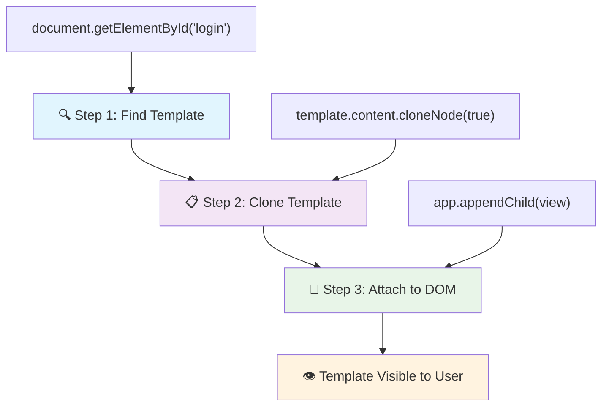
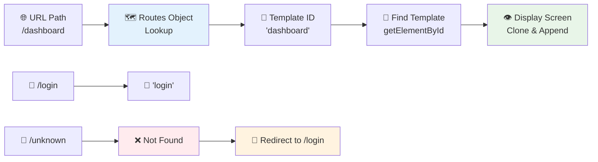
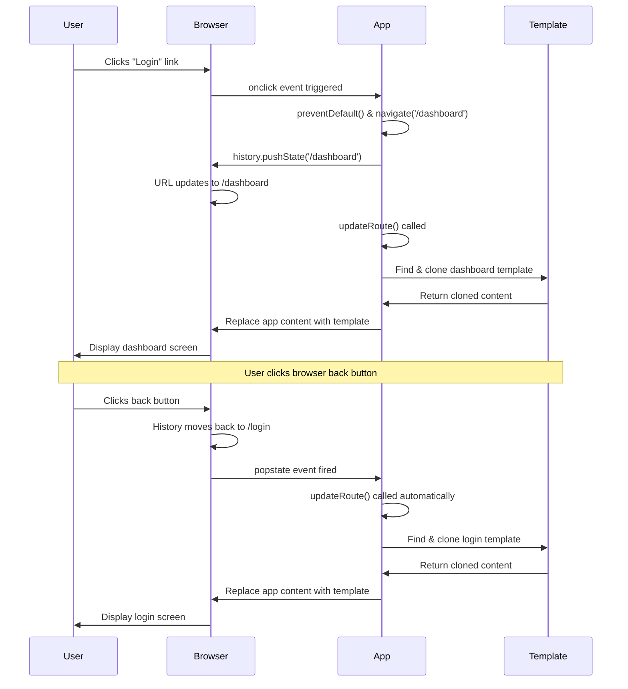

<!--
CO_OP_TRANSLATOR_METADATA:
{
  "original_hash": "5d259f6962464ad91e671083aa0398f4",
  "translation_date": "2025-10-22T21:53:50+00:00",
  "source_file": "7-bank-project/1-template-route/README.md",
  "language_code": "bn"
}
-->
# একটি ব্যাংকিং অ্যাপ তৈরি করুন পার্ট ১: ওয়েব অ্যাপে HTML টেমপ্লেট এবং রুট

১৯৬৯ সালে অ্যাপোলো ১১ এর গাইডেন্স কম্পিউটার যখন চাঁদের দিকে নেভিগেট করছিল, তখন এটি পুরো সিস্টেমটি পুনরায় চালু না করে বিভিন্ন প্রোগ্রামের মধ্যে স্যুইচ করতে হয়েছিল। আধুনিক ওয়েব অ্যাপ্লিকেশন একইভাবে কাজ করে – তারা যা দেখায় তা পরিবর্তন করে, সবকিছু নতুন করে লোড না করেই। এটি ব্যবহারকারীদের জন্য একটি মসৃণ, প্রতিক্রিয়াশীল অভিজ্ঞতা তৈরি করে যা আজকের দিনে প্রত্যাশিত।

প্রথাগত ওয়েবসাইটের তুলনায়, যা প্রতিটি ইন্টারঅ্যাকশনের জন্য পুরো পৃষ্ঠাটি পুনরায় লোড করে, আধুনিক ওয়েব অ্যাপ্লিকেশন শুধুমাত্র প্রয়োজনীয় অংশগুলি আপডেট করে। এই পদ্ধতি, ঠিক যেমন মিশন কন্ট্রোল বিভিন্ন ডিসপ্লের মধ্যে স্যুইচ করে ক্রমাগত যোগাযোগ বজায় রাখে, সেই মসৃণ অভিজ্ঞতা তৈরি করে যা আমরা আশা করি।

এখানে কীভাবে পার্থক্য এত নাটকীয় হয়:

| প্রথাগত মাল্টি-পেজ অ্যাপ | আধুনিক সিঙ্গেল-পেজ অ্যাপ |
|----------------------------|-------------------------|
| **নেভিগেশন** | প্রতিটি স্ক্রিনের জন্য পুরো পৃষ্ঠা পুনরায় লোড | তাত্ক্ষণিক কন্টেন্ট স্যুইচিং |
| **পারফরম্যান্স** | সম্পূর্ণ HTML ডাউনলোডের কারণে ধীর | আংশিক আপডেটের মাধ্যমে দ্রুত |
| **ব্যবহারকারীর অভিজ্ঞতা** | পৃষ্ঠার ঝলকানি | মসৃণ, অ্যাপ-সদৃশ ট্রানজিশন |
| **ডেটা শেয়ারিং** | পৃষ্ঠাগুলির মধ্যে শেয়ার করা কঠিন | সহজ স্টেট ম্যানেজমেন্ট |
| **উন্নয়ন** | একাধিক HTML ফাইল বজায় রাখা | ডায়নামিক টেমপ্লেট সহ একটি HTML |

**উন্নয়নের বিবর্তন বুঝুন:**
- **প্রথাগত অ্যাপ** প্রতিটি নেভিগেশন অ্যাকশনের জন্য সার্ভার অনুরোধ প্রয়োজন
- **আধুনিক SPA** একবার লোড হয় এবং জাভাস্ক্রিপ্ট ব্যবহার করে কন্টেন্ট ডায়নামিকভাবে আপডেট করে
- **ব্যবহারকারীর প্রত্যাশা** এখন তাত্ক্ষণিক, মসৃণ ইন্টারঅ্যাকশন পছন্দ করে
- **পারফরম্যান্স সুবিধা** অন্তর্ভুক্ত ব্যান্ডউইথ হ্রাস এবং দ্রুত প্রতিক্রিয়া

এই পাঠে, আমরা একটি ব্যাংকিং অ্যাপ তৈরি করব যার একাধিক স্ক্রিন থাকবে যা মসৃণভাবে একসাথে প্রবাহিত হবে। ঠিক যেমন বিজ্ঞানীরা বিভিন্ন পরীক্ষার জন্য পুনর্গঠনযোগ্য মডুলার যন্ত্র ব্যবহার করেন, আমরা HTML টেমপ্লেট ব্যবহার করব পুনরায় ব্যবহারযোগ্য উপাদান হিসাবে যা প্রয়োজন অনুযায়ী প্রদর্শিত হতে পারে।

আপনি HTML টেমপ্লেট (বিভিন্ন স্ক্রিনের জন্য পুনরায় ব্যবহারযোগ্য ব্লুপ্রিন্ট), জাভাস্ক্রিপ্ট রাউটিং (স্ক্রিনগুলির মধ্যে স্যুইচ করার সিস্টেম) এবং ব্রাউজারের ইতিহাস API (যা ব্যাক বোতামটি প্রত্যাশিতভাবে কাজ করে তা নিশ্চিত করে) নিয়ে কাজ করবেন। এগুলি React, Vue এবং Angular এর মতো ফ্রেমওয়ার্কে ব্যবহৃত মৌলিক কৌশল।

শেষে, আপনার কাছে একটি কার্যকরী ব্যাংকিং অ্যাপ থাকবে যা পেশাদার সিঙ্গেল-পেজ অ্যাপ্লিকেশন নীতিগুলি প্রদর্শন করবে।

## প্রি-লেকচার কুইজ

[প্রি-লেকচার কুইজ](https://ff-quizzes.netlify.app/web/quiz/41)

### যা যা লাগবে

আমাদের ব্যাংকিং অ্যাপ পরীক্ষা করার জন্য একটি লোকাল ওয়েব সার্ভার দরকার – চিন্তা করবেন না, এটি শুনতে যতটা কঠিন মনে হয় ততটা নয়! যদি আপনার ইতিমধ্যে সেট আপ না থাকে, তাহলে [Node.js](https://nodejs.org) ইনস্টল করুন এবং আপনার প্রজেক্ট ফোল্ডার থেকে `npx lite-server` চালান। এই সুবিধাজনক কমান্ডটি একটি লোকাল সার্ভার চালু করে এবং স্বয়ংক্রিয়ভাবে আপনার অ্যাপটি ব্রাউজারে খুলে দেয়।

### প্রস্তুতি

আপনার কম্পিউটারে `bank` নামে একটি ফোল্ডার তৈরি করুন এবং এর ভিতরে `index.html` নামে একটি ফাইল তৈরি করুন। আমরা এই HTML [বয়লারপ্লেট](https://en.wikipedia.org/wiki/Boilerplate_code) থেকে শুরু করব:

```html
<!DOCTYPE html>
<html lang="en">
  <head>
    <meta charset="UTF-8">
    <meta name="viewport" content="width=device-width, initial-scale=1.0">
    <title>Bank App</title>
  </head>
  <body>
    <!-- This is where you'll work -->
  </body>
</html>
```

**এই বয়লারপ্লেট যা প্রদান করে:**
- **প্রতিষ্ঠা করে** HTML5 ডকুমেন্ট স্ট্রাকচার সঠিক DOCTYPE ঘোষণা সহ
- **কনফিগার করে** UTF-8 চরিত্র এনকোডিং আন্তর্জাতিক টেক্সট সমর্থনের জন্য
- **সক্ষম করে** মোবাইল সামঞ্জস্যের জন্য ভিউপোর্ট মেটা ট্যাগ সহ রেসপন্সিভ ডিজাইন
- **সেট করে** একটি বর্ণনামূলক শিরোনাম যা ব্রাউজার ট্যাবে প্রদর্শিত হয়
- **তৈরি করে** একটি পরিষ্কার বডি সেকশন যেখানে আমরা আমাদের অ্যাপ্লিকেশন তৈরি করব

> 📁 **প্রজেক্ট স্ট্রাকচার প্রিভিউ**
> 
> **এই পাঠের শেষে, আপনার প্রজেক্টে থাকবে:**
> ```
> bank/
> ├── index.html      <!-- Main HTML with templates -->
> ├── app.js          <!-- Routing and navigation logic -->
> └── style.css       <!-- (Optional for future lessons) -->
> ```
> 
> **ফাইলের দায়িত্ব:**
> - **index.html**: সমস্ত টেমপ্লেট ধারণ করে এবং অ্যাপের কাঠামো প্রদান করে
> - **app.js**: রাউটিং, নেভিগেশন এবং টেমপ্লেট ম্যানেজমেন্ট পরিচালনা করে
> - **টেমপ্লেট**: লগইন, ড্যাশবোর্ড এবং অন্যান্য স্ক্রিনের জন্য UI সংজ্ঞায়িত করে

---

## HTML টেমপ্লেট

টেমপ্লেট ওয়েব ডেভেলপমেন্টে একটি মৌলিক সমস্যার সমাধান করে। যখন গুটেনবার্গ ১৪৪০-এর দশকে মুভেবল টাইপ প্রিন্টিং আবিষ্কার করেছিলেন, তখন তিনি বুঝতে পেরেছিলেন যে পুরো পৃষ্ঠা খোদাই করার পরিবর্তে, তিনি পুনরায় ব্যবহারযোগ্য অক্ষরের ব্লক তৈরি করতে পারেন এবং প্রয়োজন অনুযায়ী সেগুলি সাজাতে পারেন। HTML টেমপ্লেট একই নীতিতে কাজ করে – প্রতিটি স্ক্রিনের জন্য আলাদা HTML ফাইল তৈরি করার পরিবর্তে, আপনি পুনরায় ব্যবহারযোগ্য কাঠামো সংজ্ঞায়িত করেন যা প্রয়োজন হলে প্রদর্শিত হতে পারে।

টেমপ্লেটকে আপনার অ্যাপের বিভিন্ন অংশের জন্য ব্লুপ্রিন্ট হিসাবে ভাবুন। ঠিক যেমন একজন স্থপতি একটি ব্লুপ্রিন্ট তৈরি করেন এবং এটি একাধিকবার ব্যবহার করেন একই রুম পুনরায় আঁকার পরিবর্তে, আমরা একবার টেমপ্লেট তৈরি করি এবং প্রয়োজন হলে এটি ব্যবহার করি। ব্রাউজার এই টেমপ্লেটগুলি লুকানো রাখে যতক্ষণ না জাভাস্ক্রিপ্ট সেগুলি সক্রিয় করে।

যদি আপনি একটি ওয়েব পৃষ্ঠার জন্য একাধিক স্ক্রিন তৈরি করতে চান, একটি সমাধান হতে পারে আপনি যে প্রতিটি স্ক্রিন প্রদর্শন করতে চান তার জন্য একটি HTML ফাইল তৈরি করা। তবে, এই সমাধান কিছু অসুবিধা নিয়ে আসে:

- স্ক্রিন পরিবর্তন করার সময় আপনাকে পুরো HTML পুনরায় লোড করতে হবে, যা ধীর হতে পারে।
- বিভিন্ন স্ক্রিনের মধ্যে ডেটা শেয়ার করা কঠিন।

আরেকটি পদ্ধতি হল শুধুমাত্র একটি HTML ফাইল থাকা এবং `<template>` এলিমেন্ট ব্যবহার করে একাধিক [HTML টেমপ্লেট](https://developer.mozilla.org/docs/Web/HTML/Element/template) সংজ্ঞায়িত করা। একটি টেমপ্লেট একটি পুনরায় ব্যবহারযোগ্য HTML ব্লক যা ব্রাউজার দ্বারা প্রদর্শিত হয় না এবং এটি জাভাস্ক্রিপ্ট ব্যবহার করে রানটাইমে ইনস্ট্যানশিয়েট করতে হয়।

### এটি তৈরি করা যাক

আমরা দুটি প্রধান স্ক্রিন সহ একটি ব্যাংক অ্যাপ তৈরি করতে যাচ্ছি: একটি লগইন পৃষ্ঠা এবং একটি ড্যাশবোর্ড। প্রথমে, আমাদের HTML বডিতে একটি প্লেসহোল্ডার এলিমেন্ট যোগ করি – এটি সেই জায়গা যেখানে আমাদের বিভিন্ন স্ক্রিন প্রদর্শিত হবে:

```html
<div id="app">Loading...</div>
```

**এই প্লেসহোল্ডারটি বুঝুন:**
- **একটি কন্টেইনার তৈরি করে** যার ID "app" যেখানে সমস্ত স্ক্রিন প্রদর্শিত হবে
- **একটি লোডিং বার্তা দেখায়** যতক্ষণ না জাভাস্ক্রিপ্ট প্রথম স্ক্রিনটি ইনিশিয়ালাইজ করে
- **একটি একক মাউন্টিং পয়েন্ট প্রদান করে** আমাদের ডায়নামিক কন্টেন্টের জন্য
- **জাভাস্ক্রিপ্ট থেকে সহজ টার্গেটিং সক্ষম করে** `document.getElementById()` ব্যবহার করে

> 💡 **প্রো টিপ**: যেহেতু এই এলিমেন্টের কন্টেন্ট প্রতিস্থাপিত হবে, আমরা একটি লোডিং বার্তা বা সূচক রাখতে পারি যা অ্যাপটি লোড হওয়ার সময় দেখানো হবে।

এরপর, আমরা লগইন পৃষ্ঠার জন্য HTML টেমপ্লেটটি নিচে যোগ করব। আপাতত আমরা সেখানে একটি শিরোনাম এবং একটি সেকশন রাখব যাতে একটি লিঙ্ক থাকবে যা আমরা নেভিগেশনের জন্য ব্যবহার করব।

```html
<template id="login">
  <h1>Bank App</h1>
  <section>
    <a href="/dashboard">Login</a>
  </section>
</template>
```

**এই লগইন টেমপ্লেটটি বিশ্লেষণ:**
- **একটি টেমপ্লেট সংজ্ঞায়িত করে** যার অনন্য শনাক্তকারী "login" জাভাস্ক্রিপ্ট টার্গেটিংয়ের জন্য
- **একটি প্রধান শিরোনাম অন্তর্ভুক্ত করে** যা অ্যাপের ব্র্যান্ডিং প্রতিষ্ঠা করে
- **একটি সেমান্টিক `<section>` এলিমেন্ট ধারণ করে** সম্পর্কিত কন্টেন্ট গ্রুপ করতে
- **একটি নেভিগেশন লিঙ্ক প্রদান করে** যা ব্যবহারকারীদের ড্যাশবোর্ডে রুট করবে

এরপর আমরা ড্যাশবোর্ড পৃষ্ঠার জন্য আরেকটি HTML টেমপ্লেট যোগ করব। এই পৃষ্ঠাটি বিভিন্ন সেকশন ধারণ করবে:

- একটি শিরোনাম যার মধ্যে একটি শিরোনাম এবং একটি লগআউট লিঙ্ক থাকবে
- ব্যাংক অ্যাকাউন্টের বর্তমান ব্যালেন্স
- একটি টেবিলে প্রদর্শিত লেনদেনের তালিকা

```html
<template id="dashboard">
  <header>
    <h1>Bank App</h1>
    <a href="/login">Logout</a>
  </header>
  <section>
    Balance: 100$
  </section>
  <section>
    <h2>Transactions</h2>
    <table>
      <thead>
        <tr>
          <th>Date</th>
          <th>Object</th>
          <th>Amount</th>
        </tr>
      </thead>
      <tbody></tbody>
    </table>
  </section>
</template>
```

**এই ড্যাশবোর্ডের প্রতিটি অংশ বুঝুন:**
- **পৃষ্ঠাটি গঠন করে** একটি সেমান্টিক `<header>` এলিমেন্ট ব্যবহার করে নেভিগেশন ধারণ করে
- **অ্যাপের শিরোনাম প্রদর্শন করে** স্ক্রিন জুড়ে ব্র্যান্ডিংয়ের জন্য
- **একটি লগআউট লিঙ্ক প্রদান করে** যা লগইন স্ক্রিনে ফিরে যায়
- **বর্তমান অ্যাকাউন্ট ব্যালেন্স দেখায়** একটি নির্দিষ্ট সেকশনে
- **লেনদেনের ডেটা সংগঠিত করে** একটি সঠিকভাবে গঠিত HTML টেবিল ব্যবহার করে
- **টেবিল হেডার সংজ্ঞায়িত করে** তারিখ, অবজেক্ট এবং পরিমাণ কলামের জন্য
- **টেবিল বডি খালি রাখে** ডায়নামিক কন্টেন্ট ইনজেকশনের জন্য

> 💡 **প্রো টিপ**: HTML টেমপ্লেট তৈরি করার সময়, আপনি যদি দেখতে চান এটি কেমন দেখাবে, তাহলে `<template>` এবং `</template>` লাইনগুলো `<!-- -->` দিয়ে কমেন্ট আকারে রাখতে পারেন।

✅ আপনি কেন মনে করেন আমরা টেমপ্লেটগুলিতে `id` অ্যাট্রিবিউট ব্যবহার করি? আমরা কি এর পরিবর্তে ক্লাস ব্যবহার করতে পারি?

## জাভাস্ক্রিপ্ট দিয়ে টেমপ্লেট জীবন্ত করা

এখন আমাদের টেমপ্লেটগুলো কার্যকর করতে হবে। ঠিক যেমন একটি ৩D প্রিন্টার একটি ডিজিটাল ব্লুপ্রিন্ট নিয়ে একটি বাস্তব বস্তু তৈরি করে, জাভাস্ক্রিপ্ট আমাদের লুকানো টেমপ্লেটগুলো নিয়ে দৃশ্যমান, ইন্টারঅ্যাকটিভ এলিমেন্ট তৈরি করে যা ব্যবহারকারীরা দেখতে এবং ব্যবহার করতে পারে।

প্রক্রিয়াটি তিনটি ধারাবাহিক ধাপ অনুসরণ করে যা আধুনিক ওয়েব ডেভেলপমেন্টের ভিত্তি গঠন করে। একবার আপনি এই প্যাটার্নটি বুঝতে পারলে, আপনি এটি অনেক ফ্রেমওয়ার্ক এবং লাইব্রেরিতে চিনতে পারবেন।

যদি আপনি আপনার বর্তমান HTML ফাইলটি ব্রাউজারে চেষ্টা করেন, আপনি দেখবেন এটি `Loading...` প্রদর্শন করে আটকে আছে। এর কারণ হল আমাদের কিছু জাভাস্ক্রিপ্ট কোড যোগ করতে হবে যাতে HTML টেমপ্লেটগুলো ইনস্ট্যানশিয়েট এবং প্রদর্শিত হয়।

টেমপ্লেট ইনস্ট্যানশিয়েট সাধারণত ৩টি ধাপে করা হয়:

1. DOM-এ টেমপ্লেট এলিমেন্টটি পুনরুদ্ধার করুন, উদাহরণস্বরূপ [`document.getElementById`](https://developer.mozilla.org/docs/Web/API/Document/getElementById) ব্যবহার করে।
2. টেমপ্লেট এলিমেন্টটি ক্লোন করুন, [`cloneNode`](https://developer.mozilla.org/docs/Web/API/Node/cloneNode) ব্যবহার করে।
3. দৃশ্যমান এলিমেন্টের অধীনে এটি DOM-এ সংযুক্ত করুন, উদাহরণস্বরূপ [`appendChild`](https://developer.mozilla.org/docs/Web/API/Node/appendChild) ব্যবহার করে।



**প্রক্রিয়ার ভিজ্যুয়াল বিশ্লেষণ:**
- **ধাপ ১** লুকানো টেমপ্লেটটি DOM স্ট্রাকচার থেকে খুঁজে বের করে
- **ধাপ ২** একটি কার্যকরী কপি তৈরি করে যা নিরাপদে পরিবর্তন করা যায়
- **ধাপ ৩** কপিটি দৃশ্যমান পৃষ্ঠার এলাকায় সংযুক্ত করে
- **ফলাফল** একটি কার্যকরী স্ক্রিন যা ব্যবহারকারীরা ইন্টারঅ্যাক্ট করতে পারে

✅ আমরা কেন টেমপ্লেটটি DOM-এ সংযুক্ত করার আগে এটি ক্লোন করতে হবে? আপনি কী মনে করেন যদি আমরা এই ধাপটি বাদ দিই তাহলে কী হবে?

### কাজ

আপনার প্রজেক্ট ফোল্ডারে `app.js` নামে একটি নতুন ফাইল তৈরি করুন এবং আপনার HTML এর `<head>` সেকশনে সেই ফাইলটি ইমপোর্ট করুন:

```html
<script src="app.js" defer></script>
```

**এই স্ক্রিপ্ট ইমপোর্টটি বুঝুন:**
- **জাভাস্ক্রিপ্ট ফাইলটি আমাদের HTML ডকুমেন্টের সাথে সংযুক্ত করে**
- **`defer` অ্যাট্রিবিউট ব্যবহার করে নিশ্চিত করে** যে স্ক্রিপ্টটি HTML পার্সিং সম্পন্ন হওয়ার পরে চালানো হবে
- **সমস্ত DOM এলিমেন্টে অ্যাক্সেস সক্ষম করে** কারণ সেগুলো স্ক্রিপ্ট এক্সিকিউশন আগে পুরোপুরি লোড হয়
- **আধুনিক সেরা অনুশীলন অনুসরণ করে** স্ক্রিপ্ট লোডিং এবং পারফরম্যান্সের জন্য

এখন `app.js`-এ, আমরা একটি নতুন ফাংশন `updateRoute` তৈরি করব:

```js
function updateRoute(templateId) {
  const template = document.getElementById(templateId);
  const view = template.content.cloneNode(true);
  const app = document.getElementById('app');
  app.innerHTML = '';
  app.appendChild(view);
}
```

**ধাপে ধাপে এখানে যা ঘটছে:**
- **টেমপ্লেট এলিমেন্টটি খুঁজে বের করে** এর অনন্য ID ব্যবহার করে
- **টেমপ্লেটের কন্টেন্টের একটি গভীর কপি তৈরি করে** `cloneNode(true)` ব্যবহার করে
- **অ্যাপ কন্টেইনার খুঁজে বের করে** যেখানে কন্টেন্ট প্রদর্শিত হবে
- **অ্যাপ কন্টেইনার থেকে বিদ্যমান কন্টেন্ট মুছে দেয়**
- **ক্লোন করা টেমপ্লেট কন্টেন্ট দৃশ্যমান DOM-এ ইনসার্ট করে**

এখন এই ফাংশনটি একটি টেমপ্লেট দিয়ে কল করুন এবং ফলাফল দেখুন।

```js
updateRoute('login');
```

**এই ফাংশন কল যা অর্জন করে:**
- **লগইন টেমপ্লেটটি সক্রিয় করে** এর ID প্যারামিটার হিসাবে পাস করে
- **প্রমাণ করে** কীভাবে প্রোগ্রাম্যাটিকভাবে বিভিন্ন অ্যাপ স্ক্রিনের মধ্যে স্যুইচ করা যায়
- **"Loading..." বার্তার পরিবর্তে লগইন স্ক্রিন দেখায়**

✅ এই কোডের উদ্দেশ্য কী `app.innerHTML = '';`? এটি ছাড়া কী হবে?

## রুট তৈরি করা

রাউটিং মূলত URL-কে সঠিক কন্টেন্টের সাথে সংযুক্ত করার বিষয়ে। কল্পনা করুন কীভাবে প্রাথমিক টেলিফোন অপারেটররা সুইচবোর্ড ব্যবহার করে কল সংযোগ করতেন – তারা একটি ইনকামিং অনুরোধ নিতেন এবং সঠিক গন্তব্যে রুট করতেন। ওয়েব রাউটিং একইভাবে কাজ করে, একটি URL অনুরোধ গ্রহণ করে এবং কোন কন্টেন্ট প্রদর্শিত হবে তা নির্ধারণ করে।

প্রথাগতভাবে, ওয়েব সার্ভারগুলি বিভিন্ন URL-এর জন্য বিভিন্ন HTML ফাইল সরবরাহ করে এটি পরিচালনা করত। যেহেতু আমরা একটি সিঙ্গেল-পেজ অ্যাপ তৈরি করছি, আমাদের এই রাউটিংটি জাভাস্ক্রিপ্ট দিয়ে নিজেরাই পরিচালনা করতে হবে। এই পদ্ধতি আমাদের ব্যবহারকারীর অভিজ্ঞতা এবং পারফরম্যান্সের উপর আরও নিয়ন্ত্রণ দেয়।



**রাউটিং প্রবাহ বুঝুন:**
- **URL পরিবর্তন** আমাদের রুট কনফিগারেশনে একটি লুকআপ ট্রিগার করে
- **বৈধ রুট** নির্দিষ্ট টেমপ্লেট ID-তে রেন্ডারিংয়ের জন্য ম্যাপ করে
- **অবৈধ রুট** ভ
✅ আপনি যদি URL-এ একটি অজানা পথ প্রবেশ করেন তাহলে কী হবে? আমরা কীভাবে এটি সমাধান করতে পারি?

## নেভিগেশন যোগ করা

রাউটিং স্থাপন করার পর, ব্যবহারকারীদের অ্যাপে নেভিগেট করার একটি উপায় দরকার। প্রচলিত ওয়েবসাইটে লিঙ্কে ক্লিক করলে পুরো পেজটি পুনরায় লোড হয়, কিন্তু আমরা চাই URL এবং কন্টেন্ট আপডেট হোক পেজ রিফ্রেশ ছাড়াই। এটি একটি মসৃণ অভিজ্ঞতা তৈরি করে, যা ডেস্কটপ অ্যাপ্লিকেশনগুলির মতো ভিউ পরিবর্তনের সময় অনুভূত হয়।

আমাদের দুটি জিনিস সমন্বয় করতে হবে: ব্রাউজারের URL আপডেট করা যাতে ব্যবহারকারীরা পেজ বুকমার্ক করতে এবং লিঙ্ক শেয়ার করতে পারে, এবং উপযুক্ত কন্টেন্ট প্রদর্শন করা। সঠিকভাবে বাস্তবায়িত হলে, এটি আধুনিক অ্যাপ্লিকেশন থেকে ব্যবহারকারীরা যে মসৃণ নেভিগেশন আশা করে তা তৈরি করে।

> 🏗️ **আর্কিটেকচার ইনসাইট**: নেভিগেশন সিস্টেমের উপাদান
>
> **আপনি যা তৈরি করছেন:**
> - **🔄 URL ব্যবস্থাপনা**: পেজ রিফ্রেশ ছাড়াই ব্রাউজারের অ্যাড্রেস বার আপডেট করে
> - **📋 টেমপ্লেট সিস্টেম**: বর্তমান রুট অনুযায়ী কন্টেন্ট ডাইনামিকভাবে পরিবর্তন করে  
> - **📚 ইতিহাস ইন্টিগ্রেশন**: ব্রাউজারের ব্যাক/ফরওয়ার্ড বাটন কার্যকারিতা বজায় রাখে
> - **🛡️ ত্রুটি পরিচালনা**: অবৈধ বা অনুপস্থিত রুটের জন্য গ্রেসফুল ফলব্যাক প্রদান করে
>
> **উপাদানগুলো কীভাবে একসাথে কাজ করে:**
> - নেভিগেশন ইভেন্ট (ক্লিক, ইতিহাস পরিবর্তন) শোনে
> - History API ব্যবহার করে URL আপডেট করে
> - নতুন রুটের জন্য উপযুক্ত টেমপ্লেট রেন্ডার করে
> - পুরো অভিজ্ঞতাকে মসৃণ রাখে

আমাদের অ্যাপের পরবর্তী ধাপ হলো পেজ পরিবর্তন করার জন্য URL ম্যানুয়ালি পরিবর্তন না করেই নেভিগেট করার সুযোগ যোগ করা। এর অর্থ দুটি বিষয়:

  1. বর্তমান URL আপডেট করা
  2. নতুন URL অনুযায়ী প্রদর্শিত টেমপ্লেট আপডেট করা

আমরা ইতিমধ্যে `updateRoute` ফাংশনের মাধ্যমে দ্বিতীয় অংশটি সম্পন্ন করেছি, তাই আমাদের এখন বর্তমান URL আপডেট করার উপায় বের করতে হবে।

আমাদের JavaScript ব্যবহার করতে হবে এবং বিশেষভাবে [`history.pushState`](https://developer.mozilla.org/docs/Web/API/History/pushState) ব্যবহার করতে হবে যা HTML পুনরায় লোড না করেই URL আপডেট করতে এবং ব্রাউজিং ইতিহাসে একটি নতুন এন্ট্রি তৈরি করতে সাহায্য করে।

> ⚠️ **গুরুত্বপূর্ণ নোট**: HTML অ্যাঙ্কর এলিমেন্ট [`<a href>`](https://developer.mozilla.org/docs/Web/HTML/Element/a) নিজে থেকেই বিভিন্ন URL-এ হাইপারলিঙ্ক তৈরি করতে ব্যবহার করা যেতে পারে, কিন্তু এটি ডিফল্টভাবে ব্রাউজারকে HTML পুনরায় লোড করতে বাধ্য করবে। কাস্টম জাভাস্ক্রিপ্ট দিয়ে রাউটিং পরিচালনা করার সময় এই আচরণটি প্রতিরোধ করা প্রয়োজন, যা ক্লিক ইভেন্টে preventDefault() ফাংশন ব্যবহার করে করা যায়।

### কাজ

চলুন একটি নতুন ফাংশন তৈরি করি যা আমরা আমাদের অ্যাপে নেভিগেট করার জন্য ব্যবহার করতে পারি:

```js
function navigate(path) {
  window.history.pushState({}, path, path);
  updateRoute();
}
```

**এই নেভিগেশন ফাংশনটি বোঝা:**
- `history.pushState` ব্যবহার করে ব্রাউজারের URL নতুন পথে আপডেট করে
- ব্রাউজারের ইতিহাস স্ট্যাকে একটি নতুন এন্ট্রি যোগ করে যাতে ব্যাক/ফরওয়ার্ড বাটন সঠিকভাবে কাজ করে
- `updateRoute()` ফাংশন ট্রিগার করে যাতে সংশ্লিষ্ট টেমপ্লেট প্রদর্শিত হয়
- পেজ রিফ্রেশ ছাড়াই সিঙ্গেল-পেজ অ্যাপ অভিজ্ঞতা বজায় রাখে

এই পদ্ধতিটি প্রথমে প্রদত্ত পথ অনুযায়ী বর্তমান URL আপডেট করে, তারপর টেমপ্লেট আপডেট করে। `window.location.origin` প্রপার্টি URL রুট প্রদান করে, যা একটি সম্পূর্ণ URL পুনর্গঠন করতে সাহায্য করে।

এখন যেহেতু আমাদের এই ফাংশনটি আছে, আমরা সেই সমস্যাটি সমাধান করতে পারি যেখানে কোনো পথ সংজ্ঞায়িত রুটের সাথে মেলে না। আমরা `updateRoute` ফাংশনটি সংশোধন করব এবং একটি বিদ্যমান রুটে ফলব্যাক যোগ করব যদি কোনো মিল পাওয়া না যায়।

```js
function updateRoute() {
  const path = window.location.pathname;
  const route = routes[path];

  if (!route) {
    return navigate('/login');
  }

  const template = document.getElementById(route.templateId);
  const view = template.content.cloneNode(true);
  const app = document.getElementById('app');
  app.innerHTML = '';
  app.appendChild(view);
}
```

**মনে রাখার গুরুত্বপূর্ণ পয়েন্ট:**
- বর্তমান পথের জন্য কোনো রুট আছে কিনা তা পরীক্ষা করে
- একটি অবৈধ রুট অ্যাক্সেস করলে লগইন পেজে রিডাইরেক্ট করে
- একটি ফলব্যাক মেকানিজম প্রদান করে যা ভাঙা নেভিগেশন প্রতিরোধ করে
- নিশ্চিত করে যে ব্যবহারকারীরা সর্বদা একটি বৈধ স্ক্রিন দেখতে পায়, এমনকি ভুল URL থাকলেও

যদি কোনো রুট পাওয়া না যায়, আমরা এখন `login` পেজে রিডাইরেক্ট করব।

এখন চলুন একটি ফাংশন তৈরি করি যা একটি লিঙ্কে ক্লিক করার সময় URL পায় এবং ব্রাউজারের ডিফল্ট লিঙ্ক আচরণ প্রতিরোধ করে:

```js
function onLinkClick(event) {
  event.preventDefault();
  navigate(event.target.href);
}
```

**এই ক্লিক হ্যান্ডলারটি বিশ্লেষণ:**
- `preventDefault()` ব্যবহার করে ব্রাউজারের ডিফল্ট লিঙ্ক আচরণ প্রতিরোধ করে
- ক্লিক করা লিঙ্ক এলিমেন্ট থেকে গন্তব্য URL বের করে
- পেজ রিফ্রেশের পরিবর্তে আমাদের কাস্টম নেভিগেট ফাংশন কল করে
- মসৃণ সিঙ্গেল-পেজ অ্যাপ্লিকেশন অভিজ্ঞতা বজায় রাখে

```html
<a href="/dashboard" onclick="onLinkClick(event)">Login</a>
...
<a href="/login" onclick="onLinkClick(event)">Logout</a>
```

**এই onclick বাইন্ডিং কী অর্জন করে:**
- প্রতিটি লিঙ্ককে আমাদের কাস্টম নেভিগেশন সিস্টেমের সাথে সংযুক্ত করে
- ক্লিক ইভেন্টটি প্রক্রিয়াকরণের জন্য আমাদের `onLinkClick` ফাংশনে পাঠায়
- পেজ রিফ্রেশ ছাড়াই মসৃণ নেভিগেশন সক্ষম করে
- সঠিক URL স্ট্রাকচার বজায় রাখে যা ব্যবহারকারীরা বুকমার্ক বা শেয়ার করতে পারে

[`onclick`](https://developer.mozilla.org/docs/Web/API/GlobalEventHandlers/onclick) অ্যাট্রিবিউটটি `click` ইভেন্টকে জাভাস্ক্রিপ্ট কোডের সাথে বাইন্ড করে, এখানে `navigate()` ফাংশন কল করার জন্য।

এই লিঙ্কগুলিতে ক্লিক করার চেষ্টা করুন, এখন আপনি আপনার অ্যাপের বিভিন্ন স্ক্রিনের মধ্যে নেভিগেট করতে সক্ষম হওয়া উচিত।

✅ `history.pushState` পদ্ধতিটি HTML5 স্ট্যান্ডার্ডের অংশ এবং [সব আধুনিক ব্রাউজারে](https://caniuse.com/?search=pushState) বাস্তবায়িত হয়েছে। আপনি যদি পুরানো ব্রাউজারের জন্য একটি ওয়েব অ্যাপ তৈরি করেন, তাহলে এই API-এর পরিবর্তে একটি কৌশল ব্যবহার করতে পারেন: পথের আগে একটি [হ্যাশ (`#`)](https://en.wikipedia.org/wiki/URI_fragment) ব্যবহার করে আপনি এমন রাউটিং বাস্তবায়ন করতে পারেন যা নিয়মিত অ্যাঙ্কর নেভিগেশনের সাথে কাজ করে এবং পেজ রিফ্রেশ করে না, কারণ এর উদ্দেশ্য ছিল একটি পেজের মধ্যে অভ্যন্তরীণ লিঙ্ক তৈরি করা।

## ব্যাক এবং ফরওয়ার্ড বাটন কাজ করানো

ব্যাক এবং ফরওয়ার্ড বাটন ওয়েব ব্রাউজিংয়ের জন্য মৌলিক, যেমন নাসার মিশন কন্ট্রোলাররা স্পেস মিশনের সময় পূর্ববর্তী সিস্টেম স্টেট পর্যালোচনা করতে পারে। ব্যবহারকারীরা এই বাটনগুলোর কাজ করার আশা করে, এবং যখন তারা কাজ করে না, তখন এটি প্রত্যাশিত ব্রাউজিং অভিজ্ঞতাকে ভেঙে দেয়।

আমাদের সিঙ্গেল-পেজ অ্যাপের জন্য এটি সমর্থন করার অতিরিক্ত কনফিগারেশন প্রয়োজন। ব্রাউজার একটি ইতিহাস স্ট্যাক বজায় রাখে (যা আমরা `history.pushState` দিয়ে যোগ করছি), কিন্তু যখন ব্যবহারকারীরা এই ইতিহাসের মাধ্যমে নেভিগেট করে, তখন আমাদের অ্যাপকে উপযুক্তভাবে প্রদর্শিত কন্টেন্ট আপডেট করতে হবে।



**মূল ইন্টারঅ্যাকশন পয়েন্ট:**
- **ব্যবহারকারীর কার্যক্রম** ক্লিক বা ব্রাউজার বাটনের মাধ্যমে নেভিগেশন ট্রিগার করে
- **অ্যাপ লিঙ্ক ক্লিক** আটকায় যাতে পেজ রিফ্রেশ না হয়
- **History API** URL পরিবর্তন এবং ব্রাউজার ইতিহাস স্ট্যাক পরিচালনা করে
- **টেমপ্লেট** প্রতিটি স্ক্রিনের জন্য কন্টেন্ট স্ট্রাকচার প্রদান করে
- **ইভেন্ট লিসেনার** নিশ্চিত করে যে অ্যাপটি সব ধরনের নেভিগেশনে সাড়া দেয়

`history.pushState` ব্যবহার করে ব্রাউজারের নেভিগেশন ইতিহাসে নতুন এন্ট্রি তৈরি করা হয়। আপনি যদি ব্রাউজারের *ব্যাক বাটন* ধরে রাখেন, তাহলে এটি কিছু এরকম দেখাবে:


আপনি যদি কয়েকবার ব্যাক বাটনে ক্লিক করেন, তাহলে দেখবেন যে বর্তমান URL পরিবর্তিত হচ্ছে এবং ইতিহাস আপডেট হচ্ছে, কিন্তু একই টেমপ্লেট প্রদর্শিত হচ্ছে।

এর কারণ হলো অ্যাপটি জানে না যে আমাদের প্রতিবার ইতিহাস পরিবর্তন হলে `updateRoute()` কল করতে হবে। আপনি যদি [`history.pushState`](https://developer.mozilla.org/docs/Web/API/History/pushState) ডকুমেন্টেশনটি দেখেন, তাহলে দেখতে পাবেন যে যদি স্টেট পরিবর্তন হয় - অর্থাৎ আমরা একটি ভিন্ন URL-এ চলে যাই - তাহলে [`popstate`](https://developer.mozilla.org/docs/Web/API/Window/popstate_event) ইভেন্ট ট্রিগার হয়। আমরা এটি ব্যবহার করে সমস্যাটি সমাধান করব।

### কাজ

যাতে ব্রাউজারের ইতিহাস পরিবর্তন হলে প্রদর্শিত টেমপ্লেট আপডেট হয়, আমরা একটি নতুন ফাংশন সংযুক্ত করব যা `updateRoute()` কল করবে। আমরা এটি আমাদের `app.js` ফাইলের নিচে যোগ করব:

```js
window.onpopstate = () => updateRoute();
updateRoute();
```

**এই ইতিহাস ইন্টিগ্রেশন বোঝা:**
- **`popstate` ইভেন্টের জন্য শোনে** যা ব্যবহারকারীরা ব্রাউজার বাটন দিয়ে নেভিগেট করলে ঘটে
- **সংক্ষিপ্ত ইভেন্ট হ্যান্ডলার সিনট্যাক্সের জন্য** একটি অ্যারো ফাংশন ব্যবহার করে
- **স্বয়ংক্রিয়ভাবে `updateRoute()` কল করে** যখনই ইতিহাস স্টেট পরিবর্তিত হয়
- **অ্যাপটি ইনিশিয়ালাইজ করে** পেজ প্রথম লোড হলে `updateRoute()` কল করে
- **নিশ্চিত করে** যে ব্যবহারকারীরা যেভাবে নেভিগেট করুক না কেন সঠিক টেমপ্লেট প্রদর্শিত হয়

> 💡 **প্রো টিপ**: আমরা এখানে আমাদের `popstate` ইভেন্ট হ্যান্ডলার ঘোষণা করার জন্য একটি [অ্যারো ফাংশন](https://developer.mozilla.org/docs/Web/JavaScript/Reference/Functions/Arrow_functions) ব্যবহার করেছি সংক্ষিপ্ততার জন্য, কিন্তু একটি সাধারণ ফাংশনও একইভাবে কাজ করবে।

অ্যারো ফাংশন সম্পর্কে একটি রিফ্রেশার ভিডিও এখানে:

[](https://youtube.com/watch?v=OP6eEbOj2sc "অ্যারো ফাংশন")

> 🎥 উপরের ছবিতে ক্লিক করুন অ্যারো ফাংশন সম্পর্কে একটি ভিডিও দেখতে।

এখন আপনার ব্রাউজারের ব্যাক এবং ফরওয়ার্ড বাটন ব্যবহার করার চেষ্টা করুন এবং দেখুন যে প্রদর্শিত রুটটি এবার সঠিকভাবে আপডেট হচ্ছে।

---

## GitHub Copilot Agent চ্যালেঞ্জ 🚀

Agent মোড ব্যবহার করে নিম্নলিখিত চ্যালেঞ্জ সম্পন্ন করুন:

**বর্ণনা:** ব্যাংকিং অ্যাপটি উন্নত করুন অবৈধ রুটের জন্য ত্রুটি পরিচালনা এবং একটি 404 পেজ টেমপ্লেট বাস্তবায়ন করে, যাতে ব্যবহারকারীর অভিজ্ঞতা উন্নত হয় যখন তারা অস্থিত URL-এ নেভিগেট করে।

**প্রম্পট:** একটি নতুন HTML টেমপ্লেট তৈরি করুন যার id "not-found" এবং এটি একটি ব্যবহারকারী-বান্ধব 404 ত্রুটি পেজ প্রদর্শন করবে স্টাইলিং সহ। তারপর জাভাস্ক্রিপ্ট রাউটিং লজিক সংশোধন করুন যাতে ব্যবহারকারীরা অবৈধ URL-এ নেভিগেট করলে এই টেমপ্লেটটি প্রদর্শিত হয় এবং একটি "Go Home" বাটন যোগ করুন যা লগইন পেজে ফিরে যায়।

Agent মোড সম্পর্কে আরও জানুন [এখানে](https://code.visualstudio.com/blogs/2025/02/24/introducing-copilot-agent-mode)।

## 🚀 চ্যালেঞ্জ

এই অ্যাপের ক্রেডিট দেখানোর জন্য একটি তৃতীয় পেজের জন্য একটি নতুন টেমপ্লেট এবং রুট যোগ করুন।

**চ্যালেঞ্জ লক্ষ্য:**
- **একটি নতুন HTML টেমপ্লেট তৈরি করুন** উপযুক্ত কন্টেন্ট স্ট্রাকচার সহ
- **নতুন রুট যোগ করুন** আপনার রাউটস কনফিগারেশন অবজেক্টে
- **ক্রেডিট পেজে এবং পেজ থেকে নেভিগেশন লিঙ্ক অন্তর্ভুক্ত করুন**
- **পরীক্ষা করুন** যে সমস্ত নেভিগেশন সঠিকভাবে কাজ করছে ব্রাউজার ইতিহাস সহ

## পোস্ট-লেকচার কুইজ

[পোস্ট-লেকচার কুইজ](https://ff-quizzes.netlify.app/web/quiz/42)

## পর্যালোচনা এবং স্ব-অধ্যয়ন

রাউটিং ওয়েব ডেভেলপমেন্টের একটি আশ্চর্যজনকভাবে জটিল অংশ, বিশেষ করে যখন ওয়েব পেজ রিফ্রেশ আচরণ থেকে সিঙ্গেল পেজ অ্যাপ্লিকেশন পেজ রিফ্রেশে চলে যায়। [Azure Static Web App সার্ভিস](https://docs.microsoft.com/azure/static-web-apps/routes/?WT.mc_id=academic-77807-sagibbon) কীভাবে রাউটিং পরিচালনা করে তা সম্পর্কে একটু পড়ুন। আপনি কি ব্যাখ্যা করতে পারেন কেন এই ডকুমেন্টে বর্ণিত কিছু সিদ্ধান্ত প্রয়োজনীয়?

**অতিরিক্ত শিক্ষার সম্পদ:**
- **অন্বেষণ করুন** কীভাবে জনপ্রিয় ফ্রেমওয়ার্ক যেমন React Router এবং Vue Router ক্লায়েন্ট-সাইড রাউটিং বাস্তবায়ন করে
- **গবেষণা করুন** হ্যাশ-ভিত্তিক রাউটিং এবং History API রাউটিংয়ের মধ্যে পার্থক্য
- **শিখুন** সার্ভার-সাইড রেন্ডারিং (SSR) এবং এটি কীভাবে রাউটিং কৌশলকে প্রভাবিত করে
- **তদন্ত করুন** কীভাবে প্রগ্রেসিভ ওয়েব অ্যাপস (PWAs) রাউটিং এবং নেভিগেশন পরিচালনা করে

## অ্যাসাইনমেন্ট

[রাউটিং উন্নত করুন](assignment.md)

---

**অস্বীকৃতি**:  
এই নথিটি AI অনুবাদ পরিষেবা [Co-op Translator](https://github.com/Azure/co-op-translator) ব্যবহার করে অনুবাদ করা হয়েছে। আমরা যথাসাধ্য সঠিকতার জন্য চেষ্টা করি, তবে অনুগ্রহ করে মনে রাখবেন যে স্বয়ংক্রিয় অনুবাদে ত্রুটি বা অসঙ্গতি থাকতে পারে। মূল ভাষায় থাকা নথিটিকে প্রামাণিক উৎস হিসেবে বিবেচনা করা উচিত। গুরুত্বপূর্ণ তথ্যের জন্য, পেশাদার মানব অনুবাদ সুপারিশ করা হয়। এই অনুবাদ ব্যবহারের ফলে কোনো ভুল বোঝাবুঝি বা ভুল ব্যাখ্যা হলে আমরা দায়ী থাকব না।