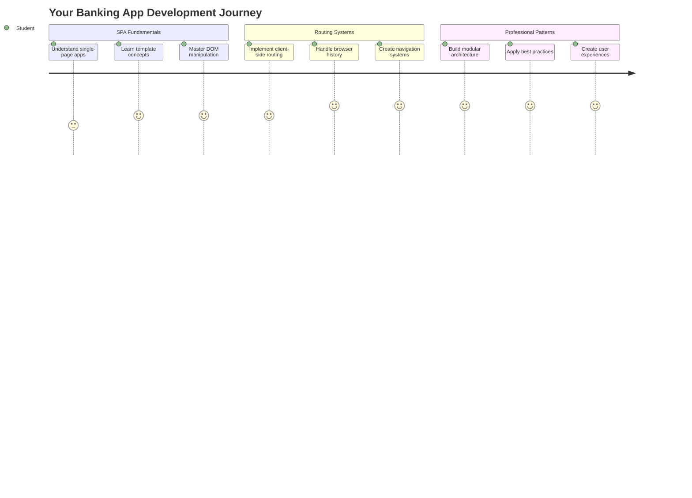
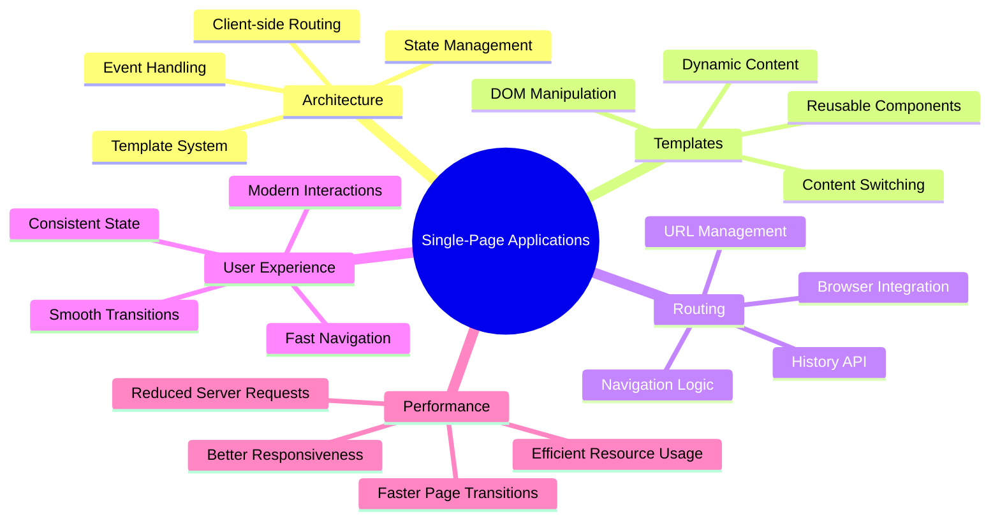
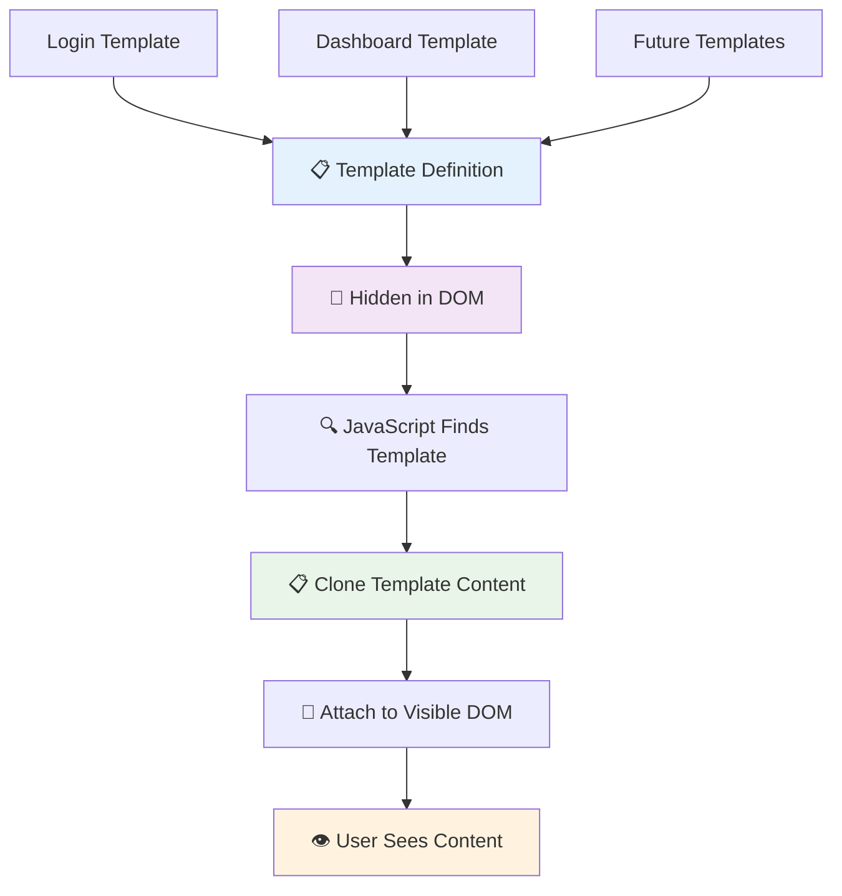
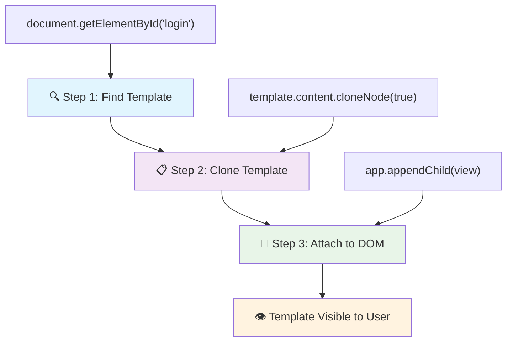
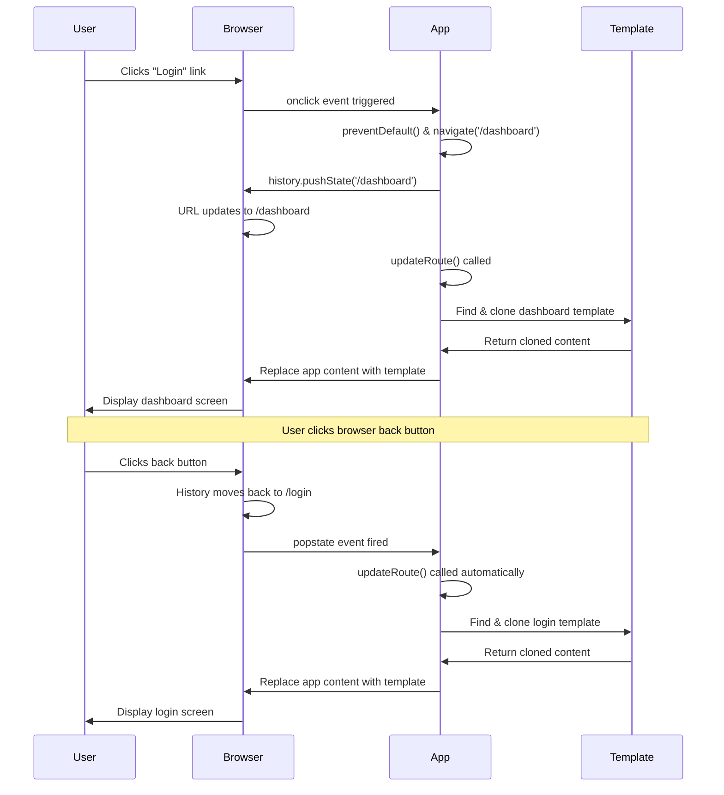
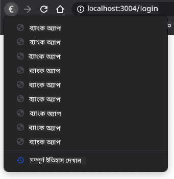

<!--
CO_OP_TRANSLATOR_METADATA:
{
  "original_hash": "351678bece18f07d9daa987a881fb062",
  "translation_date": "2025-11-03T22:52:35+00:00",
  "source_file": "7-bank-project/1-template-route/README.md",
  "language_code": "bn"
}
-->
# ব্যাংকিং অ্যাপ তৈরি পর্ব ১: ওয়েব অ্যাপে HTML টেমপ্লেট এবং রুট



১৯৬৯ সালে অ্যাপোলো ১১ এর গাইডেন্স কম্পিউটার যখন চাঁদে পৌঁছানোর জন্য নেভিগেট করছিল, তখন এটি পুরো সিস্টেমটি পুনরায় চালু না করে বিভিন্ন প্রোগ্রামের মধ্যে স্যুইচ করেছিল। আধুনিক ওয়েব অ্যাপ্লিকেশনও একইভাবে কাজ করে – এটি যা দেখানো হচ্ছে তা পরিবর্তন করে, কিন্তু সবকিছু নতুন করে লোড করে না। এটি ব্যবহারকারীদের জন্য মসৃণ এবং দ্রুত অভিজ্ঞতা তৈরি করে।

প্রথাগত ওয়েবসাইট যেখানে প্রতিটি ইন্টারঅ্যাকশনের জন্য পুরো পেজটি পুনরায় লোড করে, আধুনিক ওয়েব অ্যাপ্লিকেশন শুধুমাত্র প্রয়োজনীয় অংশগুলো আপডেট করে। এই পদ্ধতি, ঠিক যেমন মিশন কন্ট্রোল বিভিন্ন ডিসপ্লের মধ্যে স্যুইচ করে যোগাযোগ বজায় রাখে, সেই মসৃণ অভিজ্ঞতা তৈরি করে যা আমরা এখন প্রত্যাশা করি।

এটি এত নাটকীয় পার্থক্য তৈরি করে কারণ:

| প্রথাগত মাল্টি-পেজ অ্যাপ | আধুনিক সিঙ্গেল-পেজ অ্যাপ |
|----------------------------|-------------------------|
| **নেভিগেশন** | প্রতিটি স্ক্রিনের জন্য পুরো পেজ পুনরায় লোড | তাৎক্ষণিক কন্টেন্ট পরিবর্তন |
| **পারফরম্যান্স** | সম্পূর্ণ HTML ডাউনলোডের কারণে ধীর | আংশিক আপডেটের মাধ্যমে দ্রুত |
| **ব্যবহারকারীর অভিজ্ঞতা** | পেজ ফ্ল্যাশিং | মসৃণ, অ্যাপ-সদৃশ ট্রানজিশন |
| **ডেটা শেয়ারিং** | পেজগুলোর মধ্যে শেয়ার করা কঠিন | সহজ স্টেট ম্যানেজমেন্ট |
| **ডেভেলপমেন্ট** | একাধিক HTML ফাইল বজায় রাখা | ডায়নামিক টেমপ্লেট সহ একটি HTML |

**উন্নতির বিবর্তন বুঝুন:**
- **প্রথাগত অ্যাপ** প্রতিটি নেভিগেশন অ্যাকশনের জন্য সার্ভার রিকোয়েস্ট প্রয়োজন
- **আধুনিক SPA** একবার লোড হয় এবং জাভাস্ক্রিপ্ট ব্যবহার করে কন্টেন্ট ডায়নামিকভাবে আপডেট করে
- **ব্যবহারকারীর প্রত্যাশা** এখন তাৎক্ষণিক, মসৃণ ইন্টারঅ্যাকশন পছন্দ করে
- **পারফরম্যান্স সুবিধা** ব্যান্ডউইথ কমানো এবং দ্রুত প্রতিক্রিয়া প্রদান

এই পাঠে, আমরা একটি ব্যাংকিং অ্যাপ তৈরি করব যেখানে একাধিক স্ক্রিন মসৃণভাবে একসাথে কাজ করবে। যেমন বিজ্ঞানীরা বিভিন্ন পরীক্ষার জন্য পুনর্গঠিত করার জন্য মডুলার যন্ত্র ব্যবহার করেন, আমরা HTML টেমপ্লেট ব্যবহার করব যা প্রয়োজন অনুযায়ী পুনরায় ব্যবহার করা যাবে।

আপনি HTML টেমপ্লেট (পুনরায় ব্যবহারযোগ্য ব্লুপ্রিন্ট বিভিন্ন স্ক্রিনের জন্য), জাভাস্ক্রিপ্ট রাউটিং (স্ক্রিনগুলোর মধ্যে স্যুইচ করার সিস্টেম), এবং ব্রাউজারের হিস্টোরি API (যা ব্যাক বাটনকে প্রত্যাশিতভাবে কাজ করতে সাহায্য করে) নিয়ে কাজ করবেন। এগুলোই React, Vue, এবং Angular এর মতো ফ্রেমওয়ার্কে ব্যবহৃত মৌলিক কৌশল।

শেষে, আপনার কাছে একটি কার্যকরী ব্যাংকিং অ্যাপ থাকবে যা পেশাদার সিঙ্গেল-পেজ অ্যাপ্লিকেশন নীতিগুলো প্রদর্শন করবে।



## প্রি-লেকচার কুইজ

[প্রি-লেকচার কুইজ](https://ff-quizzes.netlify.app/web/quiz/41)

### যা প্রয়োজন হবে

আমাদের ব্যাংকিং অ্যাপ পরীক্ষা করার জন্য একটি লোকাল ওয়েব সার্ভার প্রয়োজন হবে – চিন্তা করবেন না, এটি খুব সহজ! যদি আপনার কাছে ইতিমধ্যে সেট আপ না থাকে, তাহলে [Node.js](https://nodejs.org) ইনস্টল করুন এবং আপনার প্রজেক্ট ফোল্ডার থেকে `npx lite-server` চালান। এই সুবিধাজনক কমান্ডটি একটি লোকাল সার্ভার চালু করে এবং আপনার অ্যাপটি ব্রাউজারে স্বয়ংক্রিয়ভাবে খুলে দেয়।

### প্রস্তুতি

আপনার কম্পিউটারে `bank` নামে একটি ফোল্ডার তৈরি করুন এবং এর ভিতরে `index.html` নামে একটি ফাইল রাখুন। আমরা এই HTML [বয়লারপ্লেট](https://en.wikipedia.org/wiki/Boilerplate_code) থেকে শুরু করব:

```html
<!DOCTYPE html>
<html lang="en">
  <head>
    <meta charset="UTF-8">
    <meta name="viewport" content="width=device-width, initial-scale=1.0">
    <title>Bank App</title>
  </head>
  <body>
    <!-- This is where you'll work -->
  </body>
</html>
```

**এই বয়লারপ্লেট যা প্রদান করে:**
- **HTML5 ডকুমেন্ট স্ট্রাকচার** সঠিক DOCTYPE ঘোষণা সহ প্রতিষ্ঠা করে
- **ক্যারেক্টার এনকোডিং** UTF-8 কনফিগার করে আন্তর্জাতিক টেক্সট সাপোর্টের জন্য
- **রেসপন্সিভ ডিজাইন সক্ষম করে** মোবাইল কম্প্যাটিবিলিটির জন্য ভিউপোর্ট মেটা ট্যাগ দিয়ে
- **বর্ণনামূলক শিরোনাম সেট করে** যা ব্রাউজার ট্যাবে প্রদর্শিত হয়
- **পরিষ্কার বডি সেকশন তৈরি করে** যেখানে আমরা আমাদের অ্যাপ্লিকেশন তৈরি করব

> 📁 **প্রজেক্ট স্ট্রাকচার প্রিভিউ**
> 
> **এই পাঠের শেষে, আপনার প্রজেক্টে থাকবে:**
> ```
> bank/
> ├── index.html      <!-- Main HTML with templates -->
> ├── app.js          <!-- Routing and navigation logic -->
> └── style.css       <!-- (Optional for future lessons) -->
> ```
> 
> **ফাইলের দায়িত্ব:**
> - **index.html**: সমস্ত টেমপ্লেট ধারণ করে এবং অ্যাপের স্ট্রাকচার প্রদান করে
> - **app.js**: রাউটিং, নেভিগেশন এবং টেমপ্লেট ম্যানেজমেন্ট পরিচালনা করে
> - **টেমপ্লেট**: লগইন, ড্যাশবোর্ড এবং অন্যান্য স্ক্রিনের UI সংজ্ঞায়িত করে

---

## HTML টেমপ্লেট

টেমপ্লেট ওয়েব ডেভেলপমেন্টে একটি মৌলিক সমস্যার সমাধান করে। যখন গুটেনবার্গ ১৪৪০-এর দশকে মুভেবল টাইপ প্রিন্টিং আবিষ্কার করেছিলেন, তিনি বুঝতে পেরেছিলেন যে পুরো পেজ খোদাই করার পরিবর্তে, তিনি পুনরায় ব্যবহারযোগ্য অক্ষর ব্লক তৈরি করতে পারেন এবং প্রয়োজন অনুযায়ী সাজাতে পারেন। HTML টেমপ্লেট একই নীতিতে কাজ করে – প্রতিটি স্ক্রিনের জন্য আলাদা HTML ফাইল তৈরি করার পরিবর্তে, আপনি পুনরায় ব্যবহারযোগ্য স্ট্রাকচার সংজ্ঞায়িত করেন যা প্রয়োজন হলে প্রদর্শিত হতে পারে।



টেমপ্লেটকে আপনার অ্যাপের বিভিন্ন অংশের ব্লুপ্রিন্ট হিসেবে ভাবুন। ঠিক যেমন একজন স্থপতি একটি ব্লুপ্রিন্ট তৈরি করেন এবং এটি একাধিকবার ব্যবহার করেন, একই রুম পুনরায় আঁকার পরিবর্তে, আমরা একবার টেমপ্লেট তৈরি করি এবং প্রয়োজন অনুযায়ী এটি ব্যবহার করি। ব্রাউজার এই টেমপ্লেটগুলো লুকিয়ে রাখে যতক্ষণ না জাভাস্ক্রিপ্ট এগুলো সক্রিয় করে।

যদি আপনি একটি ওয়েব পেজের জন্য একাধিক স্ক্রিন তৈরি করতে চান, একটি সমাধান হতে পারে প্রতিটি স্ক্রিনের জন্য একটি HTML ফাইল তৈরি করা। তবে, এই সমাধান কিছু অসুবিধা নিয়ে আসে:

- স্ক্রিন পরিবর্তন করার সময় পুরো HTML পুনরায় লোড করতে হয়, যা ধীর হতে পারে।
- বিভিন্ন স্ক্রিনের মধ্যে ডেটা শেয়ার করা কঠিন।

আরেকটি পদ্ধতি হলো শুধুমাত্র একটি HTML ফাইল রাখা এবং `<template>` এলিমেন্ট ব্যবহার করে একাধিক [HTML টেমপ্লেট](https://developer.mozilla.org/docs/Web/HTML/Element/template) সংজ্ঞায়িত করা। একটি টেমপ্লেট একটি পুনরায় ব্যবহারযোগ্য HTML ব্লক যা ব্রাউজার দ্বারা প্রদর্শিত হয় না এবং এটি রানটাইমে জাভাস্ক্রিপ্ট ব্যবহার করে ইনস্ট্যানশিয়েট করতে হয়।

### এটি তৈরি করি

আমরা একটি ব্যাংক অ্যাপ তৈরি করতে যাচ্ছি যেখানে দুটি প্রধান স্ক্রিন থাকবে: একটি লগইন পেজ এবং একটি ড্যাশবোর্ড। প্রথমে, আমাদের HTML বডিতে একটি প্লেসহোল্ডার এলিমেন্ট যোগ করি – এটি যেখানে আমাদের বিভিন্ন স্ক্রিন প্রদর্শিত হবে:

```html
<div id="app">Loading...</div>
```

**এই প্লেসহোল্ডারটি বুঝুন:**
- **একটি কন্টেইনার তৈরি করে** যার ID "app" যেখানে সমস্ত স্ক্রিন প্রদর্শিত হবে
- **একটি লোডিং বার্তা দেখায়** যতক্ষণ না জাভাস্ক্রিপ্ট প্রথম স্ক্রিনটি ইনিশিয়ালাইজ করে
- **ডায়নামিক কন্টেন্টের জন্য একটি মাউন্টিং পয়েন্ট প্রদান করে**
- **জাভাস্ক্রিপ্ট থেকে সহজ টার্গেটিং সক্ষম করে** `document.getElementById()` ব্যবহার করে

> 💡 **প্রো টিপ**: যেহেতু এই এলিমেন্টের কন্টেন্ট প্রতিস্থাপিত হবে, আমরা একটি লোডিং বার্তা বা ইন্ডিকেটর রাখতে পারি যা অ্যাপ লোড হওয়ার সময় দেখানো হবে।

এরপর, আমাদের HTML টেমপ্লেটের নিচে লগইন পেজের জন্য একটি টেমপ্লেট যোগ করি। আপাতত আমরা সেখানে একটি শিরোনাম এবং একটি সেকশন রাখব যাতে একটি লিঙ্ক থাকবে যা আমরা নেভিগেশনের জন্য ব্যবহার করব।

```html
<template id="login">
  <h1>Bank App</h1>
  <section>
    <a href="/dashboard">Login</a>
  </section>
</template>
```

**এই লগইন টেমপ্লেটটি বিশ্লেষণ:**
- **একটি টেমপ্লেট সংজ্ঞায়িত করে** যা জাভাস্ক্রিপ্ট টার্গেটিংয়ের জন্য "login" নামে একটি ইউনিক আইডি রয়েছে
- **একটি প্রধান শিরোনাম অন্তর্ভুক্ত করে** যা অ্যাপের ব্র্যান্ডিং প্রতিষ্ঠা করে
- **একটি সেমান্টিক `<section>` এলিমেন্ট ধারণ করে** যা সম্পর্কিত কন্টেন্ট গ্রুপ করে
- **একটি নেভিগেশন লিঙ্ক প্রদান করে** যা ব্যবহারকারীদের ড্যাশবোর্ডে রাউট করবে

এরপর আমরা ড্যাশবোর্ড পেজের জন্য আরেকটি HTML টেমপ্লেট যোগ করব। এই পেজে বিভিন্ন সেকশন থাকবে:

- একটি শিরোনাম যেখানে একটি টাইটেল এবং একটি লগআউট লিঙ্ক থাকবে
- ব্যাংক অ্যাকাউন্টের বর্তমান ব্যালেন্স
- একটি টেবিলে প্রদর্শিত ট্রানজ্যাকশনগুলোর তালিকা

```html
<template id="dashboard">
  <header>
    <h1>Bank App</h1>
    <a href="/login">Logout</a>
  </header>
  <section>
    Balance: 100$
  </section>
  <section>
    <h2>Transactions</h2>
    <table>
      <thead>
        <tr>
          <th>Date</th>
          <th>Object</th>
          <th>Amount</th>
        </tr>
      </thead>
      <tbody></tbody>
    </table>
  </section>
</template>
```

**এই ড্যাশবোর্ডের প্রতিটি অংশ বুঝুন:**
- **পেজটি স্ট্রাকচার করে** একটি সেমান্টিক `<header>` এলিমেন্ট ব্যবহার করে যাতে নেভিগেশন থাকে
- **অ্যাপের টাইটেল প্রদর্শন করে** স্ক্রিনগুলোর মধ্যে ব্র্যান্ডিং বজায় রাখতে
- **একটি লগআউট লিঙ্ক প্রদান করে** যা লগইন স্ক্রিনে ফিরে যায়
- **বর্তমান অ্যাকাউন্ট ব্যালেন্স দেখায়** একটি নির্দিষ্ট সেকশনে
- **ট্রানজ্যাকশন ডেটা সংগঠিত করে** একটি সঠিকভাবে স্ট্রাকচার করা HTML টেবিল ব্যবহার করে
- **টেবিল হেডার সংজ্ঞায়িত করে** তারিখ, অবজেক্ট এবং অ্যামাউন্ট কলামের জন্য
- **টেবিল বডি খালি রাখে** যাতে পরে ডায়নামিক কন্টেন্ট ইনজেক্ট করা যায়

> 💡 **প্রো টিপ**: যখন HTML টেমপ্লেট তৈরি করছেন, যদি আপনি দেখতে চান এটি কেমন দেখাবে, তাহলে `<template>` এবং `</template>` লাইনগুলোকে `<!-- -->` দিয়ে কমেন্ট আউট করতে পারেন।

### 🔄 **পেডাগজিকাল চেক-ইন**
**টেমপ্লেট সিস্টেম বোঝা**: জাভাস্ক্রিপ্ট প্রয়োগ করার আগে নিশ্চিত করুন:
- ✅ টেমপ্লেট কীভাবে সাধারণ HTML এলিমেন্ট থেকে আলাদা
- ✅ কেন টেমপ্লেটগুলো জাভাস্ক্রিপ্ট দ্বারা সক্রিয় না হওয়া পর্যন্ত লুকানো থাকে
- ✅ টেমপ্লেটে সেমান্টিক HTML স্ট্রাকচারের গুরুত্ব
- ✅ টেমপ্লেট কীভাবে পুনরায় ব্যবহারযোগ্য UI কম্পোনেন্ট সক্ষম করে

**দ্রুত স্ব-পরীক্ষা**: যদি আপনি আপনার HTML থেকে `<template>` ট্যাগগুলো সরিয়ে ফেলেন তাহলে কী হবে?
*উত্তর: কন্টেন্টটি তাৎক্ষণিকভাবে দৃশ্যমান হয়ে যাবে এবং এর টেমপ্লেট কার্যকারিতা হারাবে*

**আর্কিটেকচার সুবিধা**: টেমপ্লেট প্রদান করে:
- **পুনরায় ব্যবহারযোগ্যতা**: এক সংজ্ঞা, একাধিক ইনস্ট্যান্স
- **পারফরম্যান্স**: অপ্রয়োজনীয় HTML পার্সিং নেই
- **রক্ষণাবেক্ষণযোগ্যতা**: কেন্দ্রীভূত UI স্ট্রাকচার
- **ফ্লেক্সিবিলিটি**: ডায়নামিক কন্টেন্ট স্যুইচিং

✅ কেন আমরা টেমপ্লেটে `id` অ্যাট্রিবিউট ব্যবহার করি? আমরা কি ক্লাসের মতো অন্য কিছু ব্যবহার করতে পারতাম?

## জাভাস্ক্রিপ্ট দিয়ে টেমপ্লেটগুলো জীবন্ত করা

এখন আমাদের টেমপ্লেটগুলো কার্যকর করতে হবে। যেমন একটি 3D প্রিন্টার একটি ডিজিটাল ব্লুপ্রিন্ট নিয়ে একটি বাস্তব বস্তু তৈরি করে, জাভাস্ক্রিপ্ট আমাদের লুকানো টেমপ্লেটগুলো নিয়ে দৃশ্যমান, ইন্টারঅ্যাকটিভ এলিমেন্ট তৈরি করে যা ব্যবহারকারীরা দেখতে এবং ব্যবহার করতে পারেন।

এই প্রক্রিয়া তিনটি ধারাবাহিক ধাপ অনুসরণ করে যা আধুনিক ওয়েব ডেভেলপমেন্টের ভিত্তি তৈরি করে। একবার আপনি এই প্যাটার্নটি বুঝতে পারলে, আপনি এটি অনেক ফ্রেমওয়ার্ক এবং লাইব্রেরিতে চিনতে পারবেন।

যদি আপনি আপনার বর্তমান HTML ফাইলটি ব্রাউজারে চেষ্টা করেন, আপনি দেখবেন এটি `Loading...` দেখিয়ে আটকে আছে। এর কারণ হলো আমাদের কিছু জাভাস্ক্রিপ্ট কোড যোগ করতে হবে যা HTML টেমপ্লেটগুলো ইনস্ট্যানশিয়েট এবং প্রদর্শন করবে।

টেমপ্লেট ইনস্ট্যানশিয়েট সাধারণত ৩টি ধাপে করা হয়:

1. DOM-এ টেমপ্লেট এলিমেন্টটি রিট্রিভ করুন, উদাহরণস্বরূপ [`document.getElementById`](https://developer.mozilla.org/docs/Web/API/Document/getElementById) ব্যবহার করে।
2. টেমপ্লেট এলিমেন্টটি ক্লোন করুন, [`cloneNode`](https://developer.mozilla.org/docs/Web/API/Node/cloneNode) ব্যবহার করে।
3. দৃশ্যমান এলিমেন্টের অধীনে এটি DOM-এ সংযুক্ত করুন, উদাহরণস্বরূপ [`appendChild`](https://developer.mozilla.org/docs/Web/API/Node/appendChild) ব্যবহার করে।



**প্রক্রিয়ার ভিজ্যুয়াল বিশ্লেষণ:**
- **ধাপ ১** লুকানো টেমপ্লেটটি DOM স্ট্রাকচারে খুঁজে বের করে
- **ধাপ ২** একটি কার্যকরী কপি তৈরি করে যা নিরাপদে পরিবর্তন করা যায়
- **ধাপ ৩** কপিটি দৃশ্যমান পেজ এলাকায় সংযুক্ত করে
- **ফলাফল** হলো একটি কার্যকরী স্ক্রিন যা ব্যবহারকারীরা ইন্টারঅ্যাক্ট করতে পারে

✅ কেন আমরা টেমপ্লেটটি DOM-এ সংযুক্ত করার আগে ক্লোন করতে হয়? যদি আমরা এই ধাপটি বাদ দিই তাহলে কী হতে পারে?

### কাজ

আপনার প্রজেক্ট ফোল্ডারে `app.js` নামে একটি নতুন ফাইল তৈরি করুন এবং আপনার HTML এর `<head>` সেকশনে সেই ফাইলটি ইমপোর্ট করুন:

```html
<script src="app.js" defer></script>
```

**এই স্ক্রিপ্ট ইমপোর্টটি বুঝুন:**
- **জাভাস্ক্রিপ্ট ফাইলটি** আমাদের HTML ডকুমেন্টের সাথে সংযুক্ত করে
- **`defer` অ্যাট্রিবিউট ব্যবহার করে** নিশ্চিত করে যে স্ক্রিপ্টটি HTML পার্সিং সম্পন্ন হওয়ার পরে চালানো হবে
- **সমস্ত DOM এলিমেন্টে অ্যাক্সেস সক্ষম করে** যেহেতু স্ক্রিপ্ট এক্সিকিউশনের আগে এগুলো সম্পূর্ণ লোড হয়
- **আধুনিক সেরা অনুশীলন অনুসরণ করে** স্ক্রিপ্ট লোডিং এবং পারফরম্যান্সের জন্য

এখন `app.js`-এ, আমরা একটি নতুন ফাংশন `updateRoute` তৈরি করব:

```js
function updateRoute(templateId) {
  const template = document.getElementById(templateId);
  const view = template.content.cloneNode(true);
  const app = document.getElementById('app');
  app.innerHTML = '';
  app.appendChild(view);
}
```

**ধাপে ধাপে যা ঘটছে:**
- **টেমপ্লেট এলিমেন্টটি খুঁজে বের করে** এর ইউনিক ID ব্যবহার করে
- **টেমপ্লেটের কন্টেন্টের একটি ডিপ কপি তৈরি করে** `cloneNode(true)` ব্যবহার করে
- **অ্যাপ কন্টেইনারটি খুঁজে বের করে** যেখানে কন্টেন্টটি প্রদর্শিত হবে
- **অ্যাপ কন্টেইনার থেকে বিদ্যমান কন্টেন্ট মুছে ফেলে**
- **ক্লোন করা টেমপ্লেট কন্টেন্টটি দৃশ্যমান DOM-এ সংযুক্ত করে**

এখন এই ফাংশনটি একটি টেমপ্লেটের সাথে কল করুন এবং ফলাফল দেখুন।

```js
updateRoute('login');
```

**এই ফাংশন কলটি যা অর্জন করে:**
- **লগইন টেমপ্লেটটি সক্রিয় করে** এর ID প্যারামিটার হিসেবে পাস করে
- **প্রমাণ করে** কীভাবে প্রোগ্রাম্যাটিকভাবে বিভিন্ন অ্যাপ স্ক্রিনের মধ্যে স্যুইচ করা যায়
- **লগইন স্ক্রিনটি দেখায়** "Loading..." বার্তার পরিবর্তে

✅ এই কোডের উদ্দেশ্য কী `app.innerHTML = '';`? এটি ছাড়া কী ঘটবে?

## রুট তৈরি করা

রাউটিং মূলত URL-কে সঠিক কন্টেন্টের সাথে সংযুক্ত করার বিষয়। কল্পনা করুন প্রাথমিক টেলিফোন অপারেটররা কী
এখন চলুন `updateRoute` ফাংশনটি একটু পরিবর্তন করি। সরাসরি `templateId` আর্গুমেন্ট হিসেবে পাস করার পরিবর্তে, আমরা প্রথমে বর্তমান URL থেকে এটি বের করব এবং তারপর আমাদের ম্যাপ ব্যবহার করে সংশ্লিষ্ট টেমপ্লেট আইডি মানটি পাব। আমরা [`window.location.pathname`](https://developer.mozilla.org/docs/Web/API/Location/pathname) ব্যবহার করতে পারি URL থেকে শুধুমাত্র পাথ অংশটি পেতে।

```js
function updateRoute() {
  const path = window.location.pathname;
  const route = routes[path];

  const template = document.getElementById(route.templateId);
  const view = template.content.cloneNode(true);
  const app = document.getElementById('app');
  app.innerHTML = '';
  app.appendChild(view);
}
```

**এখানে যা ঘটছে তা বিশ্লেষণ করা যাক:**
- **বর্তমান পাথ বের করে** ব্রাউজারের URL থেকে `window.location.pathname` ব্যবহার করে
- **রুট কনফিগারেশন খুঁজে বের করে** আমাদের routes অবজেক্টে
- **টেমপ্লেট আইডি বের করে** রুট কনফিগারেশন থেকে
- **আগের মতোই টেমপ্লেট রেন্ডারিং প্রক্রিয়া অনুসরণ করে**
- **একটি ডাইনামিক সিস্টেম তৈরি করে** যা URL পরিবর্তনের সাথে সাড়া দেয়

এখানে আমরা আমাদের ঘোষিত routes-কে সংশ্লিষ্ট টেমপ্লেটের সাথে ম্যাপ করেছি। আপনি ব্রাউজারে URL ম্যানুয়ালি পরিবর্তন করে এটি সঠিকভাবে কাজ করছে কিনা পরীক্ষা করতে পারেন।

✅ যদি আপনি URL-এ একটি অজানা পাথ প্রবেশ করেন তাহলে কী হবে? আমরা কীভাবে এটি সমাধান করতে পারি?

## নেভিগেশন যোগ করা

রাউটিং স্থাপন করার পরে, ব্যবহারকারীদের অ্যাপে নেভিগেট করার একটি উপায় প্রয়োজন। প্রচলিত ওয়েবসাইটে লিঙ্কে ক্লিক করলে পুরো পেজ রিলোড হয়, কিন্তু আমরা চাই URL এবং কন্টেন্ট আপডেট হোক পেজ রিফ্রেশ ছাড়াই। এটি একটি মসৃণ অভিজ্ঞতা তৈরি করে, যেমন ডেস্কটপ অ্যাপ্লিকেশন বিভিন্ন ভিউয়ের মধ্যে পরিবর্তন করে।

আমাদের দুটি বিষয় সমন্বয় করতে হবে: ব্রাউজারের URL আপডেট করা যাতে ব্যবহারকারীরা পেজ বুকমার্ক করতে এবং লিঙ্ক শেয়ার করতে পারে, এবং উপযুক্ত কন্টেন্ট প্রদর্শন করা। সঠিকভাবে বাস্তবায়িত হলে এটি আধুনিক অ্যাপ্লিকেশন থেকে ব্যবহারকারীরা যে মসৃণ নেভিগেশন আশা করেন তা তৈরি করে।



### 🔄 **শিক্ষামূলক চেক-ইন**
**সিঙ্গেল-পেজ অ্যাপ্লিকেশন আর্কিটেকচার**: পুরো সিস্টেমের আপনার বোঝাপড়া যাচাই করুন:
- ✅ ক্লায়েন্ট-সাইড রাউটিং কীভাবে প্রচলিত সার্ভার-সাইড রাউটিং থেকে আলাদা?
- ✅ SPA নেভিগেশনের জন্য History API কেন গুরুত্বপূর্ণ?
- ✅ টেমপ্লেট কীভাবে পেজ রিলোড ছাড়াই ডাইনামিক কন্টেন্ট সক্ষম করে?
- ✅ নেভিগেশন ইন্টারসেপ্ট করতে ইভেন্ট হ্যান্ডলিং কী ভূমিকা পালন করে?

**সিস্টেম ইন্টিগ্রেশন**: আপনার SPA প্রদর্শন করে:
- **টেমপ্লেট ম্যানেজমেন্ট**: ডাইনামিক কন্টেন্ট সহ পুনঃব্যবহারযোগ্য UI কম্পোনেন্ট
- **ক্লায়েন্ট-সাইড রাউটিং**: সার্ভার অনুরোধ ছাড়াই URL ম্যানেজমেন্ট
- **ইভেন্ট-ড্রিভেন আর্কিটেকচার**: নেভিগেশন এবং ব্যবহারকারীর ইন্টারঅ্যাকশন
- **ব্রাউজার ইন্টিগ্রেশন**: সঠিক ইতিহাস এবং ব্যাক/ফরওয়ার্ড বাটন সাপোর্ট
- **পারফরম্যান্স অপ্টিমাইজেশন**: দ্রুত ট্রানজিশন এবং কম সার্ভার লোড

**প্রফেশনাল প্যাটার্নস**: আপনি বাস্তবায়ন করেছেন:
- **মডেল-ভিউ সেপারেশন**: টেমপ্লেট অ্যাপ্লিকেশন লজিক থেকে আলাদা
- **স্টেট ম্যানেজমেন্ট**: URL স্টেট প্রদর্শিত কন্টেন্টের সাথে সিঙ্ক্রোনাইজড
- **প্রগ্রেসিভ এনহান্সমেন্ট**: জাভাস্ক্রিপ্ট বেসিক HTML কার্যকারিতা উন্নত করে
- **ব্যবহারকারীর অভিজ্ঞতা**: পেজ রিফ্রেশ ছাড়াই মসৃণ, অ্যাপ-সদৃশ নেভিগেশন

> � **আর্কিটেকচার ইনসাইট**: নেভিগেশন সিস্টেম কম্পোনেন্টস
>
> **আপনি যা তৈরি করছেন:**
> - **🔄 URL ম্যানেজমেন্ট**: পেজ রিলোড ছাড়াই ব্রাউজার অ্যাড্রেস বার আপডেট করে
> - **📋 টেমপ্লেট সিস্টেম**: বর্তমান রুট অনুযায়ী ডাইনামিকভাবে কন্টেন্ট পরিবর্তন করে  
> - **📚 ইতিহাস ইন্টিগ্রেশন**: ব্রাউজার ব্যাক/ফরওয়ার্ড বাটন কার্যকারিতা বজায় রাখে
> - **🛡️ ত্রুটি হ্যান্ডলিং**: অকার্যকর বা অনুপস্থিত রুটের জন্য গ্রেসফুল ফলব্যাক

> **কম্পোনেন্টগুলো কীভাবে একসাথে কাজ করে:**
> - **শুনে** নেভিগেশন ইভেন্ট (ক্লিক, ইতিহাস পরিবর্তন)
> - **আপডেট করে** URL History API ব্যবহার করে
> - **রেন্ডার করে** নতুন রুটের জন্য উপযুক্ত টেমপ্লেট
> - **বজায় রাখে** পুরো নেভিগেশনের সময় মসৃণ ব্যবহারকারীর অভিজ্ঞতা

আমাদের অ্যাপের পরবর্তী ধাপ হলো পেজ পরিবর্তন করার জন্য URL ম্যানুয়ালি পরিবর্তন না করেই নেভিগেট করার সুযোগ যোগ করা। এটি দুটি বিষয় বোঝায়:

  1. বর্তমান URL আপডেট করা
  2. নতুন URL অনুযায়ী প্রদর্শিত টেমপ্লেট আপডেট করা

আমরা ইতিমধ্যে `updateRoute` ফাংশনের মাধ্যমে দ্বিতীয় অংশটি সম্পন্ন করেছি, তাই আমাদের বর্তমান URL আপডেট করার উপায় বের করতে হবে।

আমাদের জাভাস্ক্রিপ্ট এবং বিশেষভাবে [`history.pushState`](https://developer.mozilla.org/docs/Web/API/History/pushState) ব্যবহার করতে হবে যা HTML রিলোড না করেই URL আপডেট করতে এবং ব্রাউজিং ইতিহাসে একটি নতুন এন্ট্রি তৈরি করতে সাহায্য করে।

> ⚠️ **গুরুত্বপূর্ণ নোট**: HTML অ্যাঙ্কর এলিমেন্ট [`<a href>`](https://developer.mozilla.org/docs/Web/HTML/Element/a) নিজে থেকে বিভিন্ন URL-এ হাইপারলিঙ্ক তৈরি করতে ব্যবহার করা যেতে পারে, তবে এটি ডিফল্টভাবে ব্রাউজারকে HTML রিলোড করতে বাধ্য করবে। কাস্টম জাভাস্ক্রিপ্ট দিয়ে রাউটিং পরিচালনা করার সময় এই আচরণটি প্রতিরোধ করা প্রয়োজন, ক্লিক ইভেন্টে preventDefault() ফাংশন ব্যবহার করে।

### টাস্ক

চলুন একটি নতুন ফাংশন তৈরি করি যা আমরা আমাদের অ্যাপে নেভিগেট করতে ব্যবহার করতে পারি:

```js
function navigate(path) {
  window.history.pushState({}, path, path);
  updateRoute();
}
```

**এই নেভিগেশন ফাংশনটি বোঝা:**
- **আপডেট করে** ব্রাউজারের URL নতুন পাথ দিয়ে `history.pushState` ব্যবহার করে
- **যোগ করে** ব্রাউজারের ইতিহাস স্ট্যাকে একটি নতুন এন্ট্রি সঠিক ব্যাক/ফরওয়ার্ড বাটন সাপোর্টের জন্য
- **ট্রিগার করে** `updateRoute()` ফাংশনটি সংশ্লিষ্ট টেমপ্লেট প্রদর্শনের জন্য
- **বজায় রাখে** পেজ রিলোড ছাড়াই সিঙ্গেল-পেজ অ্যাপ অভিজ্ঞতা

এই পদ্ধতি প্রথমে প্রদত্ত পাথের উপর ভিত্তি করে বর্তমান URL আপডেট করে, তারপর টেমপ্লেট আপডেট করে। `window.location.origin` প্রপার্টি URL রুট প্রদান করে, যা একটি প্রদত্ত পাথ থেকে একটি সম্পূর্ণ URL পুনর্গঠন করতে সাহায্য করে।

এখন যেহেতু আমাদের এই ফাংশনটি আছে, আমরা যদি কোনো পাথ কোনো সংজ্ঞায়িত রুটের সাথে মেলে না তাহলে যে সমস্যাটি হয় তা সমাধান করতে পারি। আমরা `updateRoute` ফাংশনটি সংশোধন করব এবং একটি বিদ্যমান রুটে ফ্যালব্যাক যোগ করব যদি আমরা কোনো মিল খুঁজে না পাই।

```js
function updateRoute() {
  const path = window.location.pathname;
  const route = routes[path];

  if (!route) {
    return navigate('/login');
  }

  const template = document.getElementById(route.templateId);
  const view = template.content.cloneNode(true);
  const app = document.getElementById('app');
  app.innerHTML = '';
  app.appendChild(view);
}
```

**মনে রাখার গুরুত্বপূর্ণ পয়েন্ট:**
- **পরীক্ষা করে** বর্তমান পাথের জন্য কোনো রুট আছে কিনা
- **রিডাইরেক্ট করে** লগইন পেজে যখন একটি অকার্যকর রুট অ্যাক্সেস করা হয়
- **ফ্যালব্যাক মেকানিজম প্রদান করে** যা ভাঙা নেভিগেশন প্রতিরোধ করে
- **নিশ্চিত করে** ব্যবহারকারীরা সর্বদা একটি বৈধ স্ক্রিন দেখতে পান, এমনকি ভুল URL থাকলেও

যদি কোনো রুট পাওয়া না যায়, আমরা এখন `login` পেজে রিডাইরেক্ট করব।

এখন চলুন একটি ফাংশন তৈরি করি যা একটি লিঙ্কে ক্লিক করার সময় URL পায় এবং ব্রাউজারের ডিফল্ট লিঙ্ক আচরণ প্রতিরোধ করে:

```js
function onLinkClick(event) {
  event.preventDefault();
  navigate(event.target.href);
}
```

**এই ক্লিক হ্যান্ডলারটি বিশ্লেষণ করা:**
- **প্রতিরোধ করে** ব্রাউজারের ডিফল্ট লিঙ্ক আচরণ `preventDefault()` ব্যবহার করে
- **গন্তব্য URL বের করে** ক্লিক করা লিঙ্ক এলিমেন্ট থেকে
- **আমাদের কাস্টম navigate ফাংশন কল করে** পেজ রিলোড না করে
- **সিঙ্গেল-পেজ অ্যাপ অভিজ্ঞতা বজায় রাখে**

```html
<a href="/dashboard" onclick="onLinkClick(event)">Login</a>
...
<a href="/login" onclick="onLinkClick(event)">Logout</a>
```

**এই onclick বাইন্ডিং যা অর্জন করে:**
- **প্রতিটি লিঙ্ককে সংযুক্ত করে** আমাদের কাস্টম নেভিগেশন সিস্টেমের সাথে
- **ক্লিক ইভেন্ট পাস করে** আমাদের `onLinkClick` ফাংশনে প্রক্রিয়াকরণের জন্য
- **মসৃণ নেভিগেশন সক্ষম করে** পেজ রিলোড ছাড়াই
- **সঠিক URL স্ট্রাকচার বজায় রাখে** যা ব্যবহারকারীরা বুকমার্ক বা শেয়ার করতে পারে

[`onclick`](https://developer.mozilla.org/docs/Web/API/GlobalEventHandlers/onclick) অ্যাট্রিবিউট ক্লিক ইভেন্টকে জাভাস্ক্রিপ্ট কোডের সাথে বাইন্ড করে, এখানে `navigate()` ফাংশন কল।

এই লিঙ্কগুলিতে ক্লিক করার চেষ্টা করুন, এখন আপনি আপনার অ্যাপের বিভিন্ন স্ক্রিনের মধ্যে নেভিগেট করতে সক্ষম হওয়া উচিত।

✅ `history.pushState` পদ্ধতি HTML5 স্ট্যান্ডার্ডের অংশ এবং [সব আধুনিক ব্রাউজারে](https://caniuse.com/?search=pushState) বাস্তবায়িত। আপনি যদি পুরানো ব্রাউজারের জন্য একটি ওয়েব অ্যাপ তৈরি করেন, এই API-এর পরিবর্তে একটি কৌশল ব্যবহার করতে পারেন: একটি [হ্যাশ (`#`)](https://en.wikipedia.org/wiki/URI_fragment) ব্যবহার করে পাথের আগে আপনি এমন রাউটিং বাস্তবায়ন করতে পারেন যা নিয়মিত অ্যাঙ্কর নেভিগেশনের সাথে কাজ করে এবং পেজ রিলোড করে না।

## ব্যাক এবং ফরওয়ার্ড বাটন কাজ করানো

ব্যাক এবং ফরওয়ার্ড বাটন ওয়েব ব্রাউজিংয়ের জন্য মৌলিক, যেমন নাসার মিশন কন্ট্রোলাররা পূর্ববর্তী সিস্টেম স্টেট পর্যালোচনা করতে পারেন। ব্যবহারকারীরা এই বাটনগুলোর কাজ করার আশা করেন, এবং যখন সেগুলো কাজ করে না, এটি প্রত্যাশিত ব্রাউজিং অভিজ্ঞতাকে ভেঙে দেয়।

আমাদের সিঙ্গেল-পেজ অ্যাপের জন্য এটি সমর্থন করার অতিরিক্ত কনফিগারেশন প্রয়োজন। ব্রাউজার একটি ইতিহাস স্ট্যাক বজায় রাখে (যা আমরা `history.pushState` দিয়ে যোগ করছি), কিন্তু যখন ব্যবহারকারীরা এই ইতিহাসের মাধ্যমে নেভিগেট করেন, আমাদের অ্যাপকে সাড়া দিতে হবে এবং প্রদর্শিত কন্টেন্ট অনুযায়ী আপডেট করতে হবে।


**মূল ইন্টারঅ্যাকশন পয়েন্ট:**
- **ব্যবহারকারীর কার্যক্রম** ক্লিক বা ব্রাউজার বাটনের মাধ্যমে নেভিগেশন ট্রিগার করে
- **অ্যাপ ইন্টারসেপ্ট করে** লিঙ্ক ক্লিক করে পেজ রিলোড প্রতিরোধ করে
- **History API** URL পরিবর্তন এবং ব্রাউজার ইতিহাস স্ট্যাক পরিচালনা করে
- **টেমপ্লেট** প্রতিটি স্ক্রিনের জন্য কন্টেন্ট স্ট্রাকচার প্রদান করে
- **ইভেন্ট লিসেনার** নিশ্চিত করে যে অ্যাপটি সব ধরনের নেভিগেশনের জন্য সাড়া দেয়

`history.pushState` ব্যবহার করে ব্রাউজারের নেভিগেশন ইতিহাসে নতুন এন্ট্রি তৈরি করা হয়। আপনি যদি ব্রাউজারের *ব্যাক বাটন* ধরে রাখেন, এটি কিছুটা এরকম দেখাবে:



আপনি যদি কয়েকবার ব্যাক বাটনে ক্লিক করেন, আপনি দেখবেন যে বর্তমান URL পরিবর্তন হচ্ছে এবং ইতিহাস আপডেট হচ্ছে, কিন্তু একই টেমপ্লেট প্রদর্শিত হচ্ছে।

এর কারণ হলো অ্যাপটি জানে না যে আমাদের প্রতিবার ইতিহাস পরিবর্তন হলে `updateRoute()` কল করতে হবে। আপনি যদি [`history.pushState` ডকুমেন্টেশন](https://developer.mozilla.org/docs/Web/API/History/pushState) দেখেন, আপনি দেখতে পাবেন যে যদি স্টেট পরিবর্তন হয় - অর্থাৎ আমরা একটি ভিন্ন URL-এ চলে যাই - তাহলে [`popstate`](https://developer.mozilla.org/docs/Web/API/Window/popstate_event) ইভেন্ট ট্রিগার হয়। আমরা এটি ব্যবহার করে এই সমস্যাটি সমাধান করব।

### টাস্ক

যখন ব্রাউজার ইতিহাস পরিবর্তন হয় তখন প্রদর্শিত টেমপ্লেটটি আপডেট নিশ্চিত করতে, আমরা একটি নতুন ফাংশন সংযুক্ত করব যা `updateRoute()` কল করে। আমরা এটি আমাদের `app.js` ফাইলের নিচে করব:

```js
window.onpopstate = () => updateRoute();
updateRoute();
```

**এই ইতিহাস ইন্টিগ্রেশনটি বোঝা:**
- **শুনে** `popstate` ইভেন্ট যা ব্যবহারকারীরা ব্রাউজার বাটন দিয়ে নেভিগেট করলে ঘটে
- **ব্যবহার করে** সংক্ষিপ্ত ইভেন্ট হ্যান্ডলার সিনট্যাক্সের জন্য একটি অ্যারো ফাংশন
- **স্বয়ংক্রিয়ভাবে কল করে** `updateRoute()` যখনই ইতিহাস স্টেট পরিবর্তন হয়
- **অ্যাপটি আরম্ভ করে** পেজ প্রথম লোড হলে `updateRoute()` কল করে
- **নিশ্চিত করে** সঠিক টেমপ্লেট প্রদর্শিত হয়, ব্যবহারকারীরা যেভাবেই নেভিগেট করুক না কেন

> 💡 **প্রো টিপ**: আমরা এখানে একটি [অ্যারো ফাংশন](https://developer.mozilla.org/docs/Web/JavaScript/Reference/Functions/Arrow_functions) ব্যবহার করেছি আমাদের `popstate` ইভেন্ট হ্যান্ডলার ঘোষণা করতে সংক্ষিপ্ততার জন্য, তবে একটি সাধারণ ফাংশনও একইভাবে কাজ করবে।

এখানে অ্যারো ফাংশন সম্পর্কে একটি রিফ্রেশার ভিডিও:

[](https://youtube.com/watch?v=OP6eEbOj2sc "অ্যারো ফাংশন")

> 🎥 উপরের ছবিতে ক্লিক করুন অ্যারো ফাংশন সম্পর্কে একটি ভিডিওর জন্য।

এখন আপনার ব্রাউজারের ব্যাক এবং ফরওয়ার্ড বাটন ব্যবহার করার চেষ্টা করুন এবং দেখুন যে প্রদর্শিত রুটটি এবার সঠিকভাবে আপডেট হচ্ছে কিনা।

### ⚡ **পরবর্তী ৫ মিনিটে আপনি যা করতে পারেন**
- [ ] আপনার ব্যাংকিং অ্যাপের নেভিগেশন ব্রাউজারের ব্যাক/ফরওয়ার্ড বাটন ব্যবহার করে পরীক্ষা করুন
- [ ] রাউটিং পরীক্ষা করতে ঠিকানা বারে বিভিন্ন URL ম্যানুয়ালি টাইপ করার চেষ্টা করুন
- [ ] ব্রাউজার DevTools খুলুন এবং দেখুন কীভাবে টেমপ্লেটগুলো DOM-এ ক্লোন করা হচ্ছে
- [ ] রাউটিং ফ্লো ট্র্যাক করতে console.log স্টেটমেন্ট যোগ করে পরীক্ষা করুন

### 🎯 **এই ঘণ্টায় আপনি যা অর্জন করতে পারেন**
- [ ] পোস্ট-লেসন কুইজ সম্পূর্ণ করুন এবং SPA আর্কিটেকচার ধারণাগুলি বুঝুন
- [ ] আপনার ব্যাংকিং অ্যাপ টেমপ্লেটগুলোকে পেশাদার দেখানোর জন্য CSS স্টাইলিং যোগ করুন
- [ ] সঠিক ত্রুটি হ্যান্ডলিং সহ 404 এরর পেজ চ্যালেঞ্জ সম্পূর্ণ করুন
- [ ] অতিরিক্ত রাউটিং কার্যকারিতার সাথে ক্রেডিট পেজ চ্যালেঞ্জ তৈরি করুন
- [ ] টেমপ্লেট পরিবর্তনের মধ্যে লোডিং স্টেট এবং ট্রানজিশন যোগ করুন

### 📅 **আপনার সপ্তাহব্যাপী SPA ডেভেলপমেন্ট যাত্রা**
- [ ] ফর্ম, ডেটা ম্যানেজমেন্ট এবং পার্সিস্টেন্স সহ সম্পূর্ণ ব্যাংকিং অ্যাপ সম্পূর্ণ করুন
- [ ] রুট প্যারামিটার এবং নেস্টেড রাউটের মতো উন্নত রাউটিং বৈশিষ্ট্য যোগ করুন
- [ ] নেভিগেশন গার্ড এবং অথেন্টিকেশন-ভিত্তিক রাউটিং বাস্তবায়ন করুন
- [ ] পুনঃব্যবহারযোগ্য টেমপ্লেট কম্পোনেন্ট এবং একটি কম্পোনেন্ট লাইব্রেরি তৈরি করুন
- [ ] মসৃণ ব্যবহারকারীর অভিজ্ঞতার জন্য অ্যানিমেশন এবং ট্রানজিশন যোগ করুন
- [ ] আপনার SPA একটি হোস্টিং প্ল্যাটফর্মে ডিপ্লয় করুন এবং রাউটিং সঠিকভাবে কনফিগার করুন

### 🌟 **আপনার মাসব্যাপী ফ্রন্টএন্ড আর্কিট
- **একক পৃষ্ঠার অ্যাপ্লিকেশন** সঠিকভাবে আলাদা করার মাধ্যমে ডিজাইন করুন  
- **প্রয়োগ করুন** ক্লায়েন্ট-পক্ষের রাউটিং সিস্টেম যা অ্যাপ্লিকেশনের জটিলতার সাথে স্কেল করতে পারে  
- **ডিবাগ করুন** জটিল নেভিগেশন প্রবাহ ব্রাউজার ডেভেলপার টুল ব্যবহার করে  
- **অপ্টিমাইজ করুন** অ্যাপ্লিকেশনের পারফরম্যান্স দক্ষ টেমপ্লেট ব্যবস্থাপনার মাধ্যমে  
- **ডিজাইন করুন** ব্যবহারকারীর অভিজ্ঞতা যা স্বাভাবিক এবং প্রতিক্রিয়াশীল মনে হয়  

**ফ্রন্টএন্ড ডেভেলপমেন্ট ধারণা আয়ত্ত করা হয়েছে**:  
- **কম্পোনেন্ট আর্কিটেকচার**: পুনরায় ব্যবহারযোগ্য UI প্যাটার্ন এবং টেমপ্লেট সিস্টেম  
- **স্টেট সিঙ্ক্রোনাইজেশন**: URL স্টেট ব্যবস্থাপনা এবং ব্রাউজার ইতিহাস  
- **ইভেন্ট-চালিত প্রোগ্রামিং**: ব্যবহারকারীর ইন্টারঅ্যাকশন পরিচালনা এবং নেভিগেশন  
- **পারফরম্যান্স অপ্টিমাইজেশন**: দক্ষ DOM ম্যানিপুলেশন এবং কন্টেন্ট লোডিং  
- **ব্যবহারকারীর অভিজ্ঞতা ডিজাইন**: মসৃণ ট্রানজিশন এবং সহজ নেভিগেশন  

**পরবর্তী স্তর**: আপনি এখন আধুনিক ফ্রন্টএন্ড ফ্রেমওয়ার্ক, উন্নত স্টেট ব্যবস্থাপনা, অথবা জটিল এন্টারপ্রাইজ অ্যাপ্লিকেশন তৈরি করার জন্য প্রস্তুত!  

🌟 **অর্জন সম্পন্ন**: আপনি আধুনিক ওয়েব আর্কিটেকচার প্যাটার্ন সহ একটি পেশাদার একক পৃষ্ঠার অ্যাপ্লিকেশনের ভিত্তি তৈরি করেছেন!  

---

## GitHub Copilot Agent চ্যালেঞ্জ 🚀  

Agent মোড ব্যবহার করে নিম্নলিখিত চ্যালেঞ্জ সম্পন্ন করুন:  

**বর্ণনা:** ব্যাংকিং অ্যাপটি উন্নত করুন ত্রুটি পরিচালনা এবং অবৈধ রুটের জন্য একটি 404 পৃষ্ঠার টেমপ্লেট প্রয়োগ করে, যাতে ব্যবহারকারীর অভিজ্ঞতা উন্নত হয় যখন তারা অস্তিত্বহীন পৃষ্ঠায় নেভিগেট করে।  

**প্রম্পট:** "not-found" আইডি সহ একটি নতুন HTML টেমপ্লেট তৈরি করুন যা একটি ব্যবহারকারী-বান্ধব 404 ত্রুটি পৃষ্ঠা প্রদর্শন করে স্টাইলিং সহ। তারপর জাভাস্ক্রিপ্ট রাউটিং লজিক পরিবর্তন করুন যাতে ব্যবহারকারীরা অবৈধ URL-এ নেভিগেট করলে এই টেমপ্লেটটি প্রদর্শিত হয় এবং একটি "Go Home" বোতাম যোগ করুন যা লগইন পৃষ্ঠায় ফিরে নেভিগেট করে।  

Agent মোড সম্পর্কে আরও জানুন [এখানে](https://code.visualstudio.com/blogs/2025/02/24/introducing-copilot-agent-mode)।  

## 🚀 চ্যালেঞ্জ  

এই অ্যাপের ক্রেডিট দেখানোর জন্য একটি তৃতীয় পৃষ্ঠার জন্য একটি নতুন টেমপ্লেট এবং রুট যোগ করুন।  

**চ্যালেঞ্জ লক্ষ্যসমূহ:**  
- **তৈরি করুন** একটি নতুন HTML টেমপ্লেট উপযুক্ত কন্টেন্ট স্ট্রাকচার সহ  
- **যোগ করুন** নতুন রুট আপনার রাউটস কনফিগারেশন অবজেক্টে  
- **অন্তর্ভুক্ত করুন** নেভিগেশন লিঙ্ক ক্রেডিট পৃষ্ঠা থেকে এবং ক্রেডিট পৃষ্ঠায়  
- **পরীক্ষা করুন** যে সমস্ত নেভিগেশন ব্রাউজার ইতিহাস সহ সঠিকভাবে কাজ করছে  

## পোস্ট-লেকচার কুইজ  

[পোস্ট-লেকচার কুইজ](https://ff-quizzes.netlify.app/web/quiz/42)  

## পর্যালোচনা এবং স্ব-অধ্যয়ন  

রাউটিং ওয়েব ডেভেলপমেন্টের একটি আশ্চর্যজনকভাবে জটিল অংশ, বিশেষত যখন ওয়েব পৃষ্ঠার রিফ্রেশ আচরণ থেকে একক পৃষ্ঠার অ্যাপ্লিকেশন পৃষ্ঠার রিফ্রেশে চলে যায়। [Azure Static Web App সার্ভিস](https://docs.microsoft.com/azure/static-web-apps/routes/?WT.mc_id=academic-77807-sagibbon) কীভাবে রাউটিং পরিচালনা করে সে সম্পর্কে একটু পড়ুন। আপনি কি ব্যাখ্যা করতে পারেন কেন এই ডকুমেন্টে বর্ণিত কিছু সিদ্ধান্ত প্রয়োজনীয়?  

**অতিরিক্ত শিক্ষার সম্পদ:**  
- **অন্বেষণ করুন** কীভাবে জনপ্রিয় ফ্রেমওয়ার্ক যেমন React Router এবং Vue Router ক্লায়েন্ট-পক্ষের রাউটিং প্রয়োগ করে  
- **গবেষণা করুন** হ্যাশ-ভিত্তিক রাউটিং এবং ইতিহাস API রাউটিংয়ের মধ্যে পার্থক্য  
- **শিখুন** সার্ভার-পক্ষের রেন্ডারিং (SSR) এবং এটি কীভাবে রাউটিং কৌশলকে প্রভাবিত করে  
- **তদন্ত করুন** কীভাবে প্রগ্রেসিভ ওয়েব অ্যাপস (PWAs) রাউটিং এবং নেভিগেশন পরিচালনা করে  

## অ্যাসাইনমেন্ট  

[রাউটিং উন্নত করুন](assignment.md)  

---

**অস্বীকৃতি**:  
এই নথিটি AI অনুবাদ পরিষেবা [Co-op Translator](https://github.com/Azure/co-op-translator) ব্যবহার করে অনুবাদ করা হয়েছে। আমরা যথাসাধ্য সঠিকতার জন্য চেষ্টা করি, তবে অনুগ্রহ করে মনে রাখবেন যে স্বয়ংক্রিয় অনুবাদে ত্রুটি বা অসঙ্গতি থাকতে পারে। মূল ভাষায় থাকা নথিটিকে প্রামাণিক উৎস হিসেবে বিবেচনা করা উচিত। গুরুত্বপূর্ণ তথ্যের জন্য, পেশাদার মানব অনুবাদ সুপারিশ করা হয়। এই অনুবাদ ব্যবহারের ফলে কোনো ভুল বোঝাবুঝি বা ভুল ব্যাখ্যা হলে আমরা দায়বদ্ধ থাকব না।