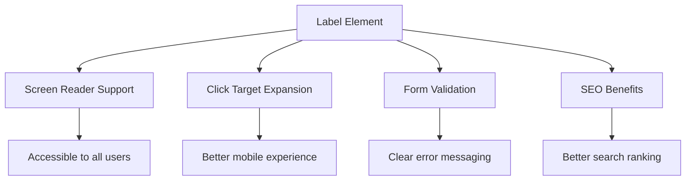
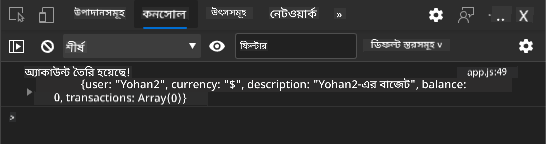
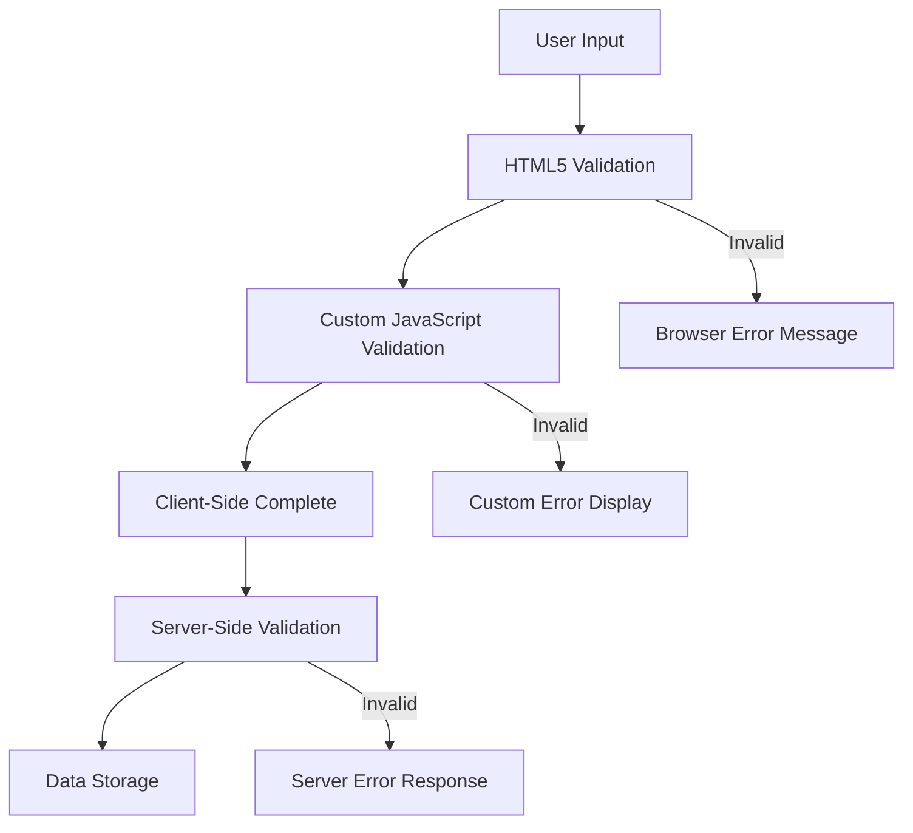
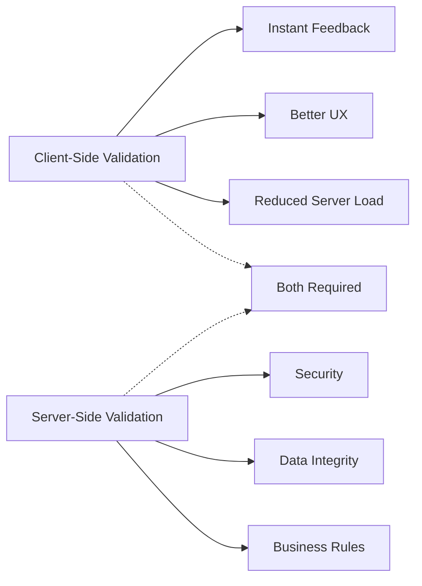
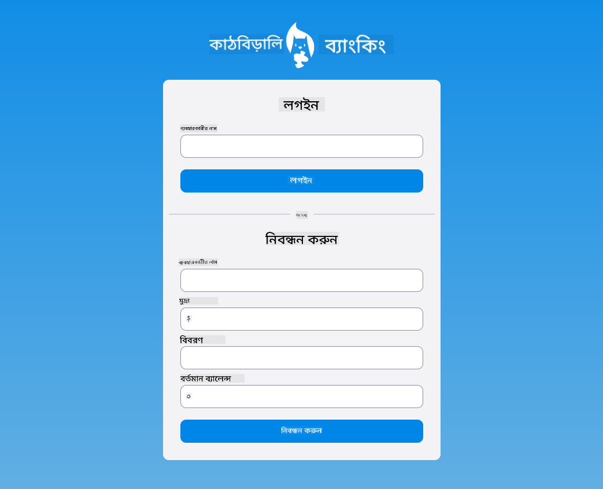

<!--
CO_OP_TRANSLATOR_METADATA:
{
  "original_hash": "b24f28fc46dd473aa9080f174182adde",
  "translation_date": "2025-10-22T21:55:39+00:00",
  "source_file": "7-bank-project/2-forms/README.md",
  "language_code": "bn"
}
-->
# ব্যাংকিং অ্যাপ তৈরি করুন পার্ট ২: লগইন এবং রেজিস্ট্রেশন ফর্ম তৈরি করুন

## প্রাক-লেকচার কুইজ

[প্রাক-লেকচার কুইজ](https://ff-quizzes.netlify.app/web/quiz/43)

আপনি কি কখনও অনলাইনে একটি ফর্ম পূরণ করেছেন এবং এটি আপনার ইমেইল ফরম্যাটটি গ্রহণ করেনি? অথবা সাবমিট করার সময় সমস্ত তথ্য হারিয়েছেন? আমরা সবাই এই ধরনের হতাশাজনক অভিজ্ঞতার সম্মুখীন হয়েছি।

ফর্মগুলি আপনার ব্যবহারকারী এবং আপনার অ্যাপ্লিকেশনের কার্যকারিতার মধ্যে সেতু। ঠিক যেমন বিমান চলাচল নিয়ন্ত্রকরা বিমানকে তাদের গন্তব্যে নিরাপদে পৌঁছানোর জন্য সতর্ক প্রোটোকল ব্যবহার করেন, তেমনি ভালোভাবে ডিজাইন করা ফর্মগুলি স্পষ্ট প্রতিক্রিয়া প্রদান করে এবং ব্যয়বহুল ভুলগুলি প্রতিরোধ করে। অন্যদিকে, খারাপ ফর্মগুলি ব্যবহারকারীদের দূরে সরিয়ে দিতে পারে।

এই পাঠে, আমরা আপনার স্থির ব্যাংকিং অ্যাপকে একটি ইন্টারেক্টিভ অ্যাপ্লিকেশনে রূপান্তর করব। আপনি শিখবেন কিভাবে ব্যবহারকারীর ইনপুট যাচাই করতে, সার্ভারের সাথে যোগাযোগ করতে এবং সহায়ক প্রতিক্রিয়া প্রদান করতে ফর্ম তৈরি করতে হয়। এটি আপনার অ্যাপ্লিকেশনের বৈশিষ্ট্যগুলি নেভিগেট করার জন্য ব্যবহারকারীদের নিয়ন্ত্রণ ইন্টারফেস তৈরি করার মতো।

শেষ পর্যন্ত, আপনার কাছে একটি সম্পূর্ণ লগইন এবং রেজিস্ট্রেশন সিস্টেম থাকবে যা ব্যবহারকারীদের হতাশার পরিবর্তে সফলতার দিকে পরিচালিত করবে।

## প্রয়োজনীয়তা

ফর্ম তৈরি শুরু করার আগে, আসুন নিশ্চিত হয়ে নিই যে আপনার সবকিছু সঠিকভাবে সেট আপ করা আছে। এই পাঠটি আগের পাঠ থেকে যেখানে শেষ হয়েছিল সেখান থেকে শুরু হয়, তাই যদি আপনি এগিয়ে গিয়ে থাকেন, তাহলে প্রথমে ফিরে গিয়ে মৌলিক বিষয়গুলি কাজ করে নিন।

### প্রয়োজনীয় সেটআপ

| উপাদান | স্ট্যাটাস | বিবরণ |
|-----------|--------|-------------|
| [HTML টেমপ্লেট](../1-template-route/README.md) | ✅ প্রয়োজনীয় | আপনার মৌলিক ব্যাংকিং অ্যাপের কাঠামো |
| [Node.js](https://nodejs.org) | ✅ প্রয়োজনীয় | সার্ভারের জন্য জাভাস্ক্রিপ্ট রানটাইম |
| [Bank API Server](../api/README.md) | ✅ প্রয়োজনীয় | ডেটা সংরক্ষণের জন্য ব্যাকএন্ড সার্ভিস |

> 💡 **উন্নয়ন টিপ**: আপনি একসাথে দুটি পৃথক সার্ভার চালাবেন – একটি আপনার ফ্রন্ট-এন্ড ব্যাংকিং অ্যাপের জন্য এবং অন্যটি ব্যাকএন্ড API-এর জন্য। এই সেটআপটি বাস্তব-বিশ্বের উন্নয়নকে প্রতিফলিত করে যেখানে ফ্রন্টএন্ড এবং ব্যাকএন্ড পরিষেবাগুলি স্বাধীনভাবে কাজ করে।

### সার্ভার কনফিগারেশন

**আপনার উন্নয়ন পরিবেশ অন্তর্ভুক্ত করবে:**
- **ফ্রন্টএন্ড সার্ভার**: আপনার ব্যাংকিং অ্যাপ সরবরাহ করে (সাধারণত পোর্ট `3000`)
- **ব্যাকএন্ড API সার্ভার**: ডেটা সংরক্ষণ এবং পুনরুদ্ধার পরিচালনা করে (পোর্ট `5000`)
- **উভয় সার্ভার** কোনো সংঘর্ষ ছাড়াই একসাথে চালানো যেতে পারে

**আপনার API সংযোগ পরীক্ষা করা:**
```bash
curl http://localhost:5000/api
# Expected response: "Bank API v1.0.0"
```

**যদি আপনি API সংস্করণের প্রতিক্রিয়া দেখতে পান, তাহলে আপনি এগিয়ে যেতে প্রস্তুত!**

---

## HTML ফর্ম এবং কন্ট্রোলগুলি বোঝা

HTML ফর্মগুলি আপনার ওয়েব অ্যাপ্লিকেশনের সাথে ব্যবহারকারীদের যোগাযোগের মাধ্যম। এগুলি ১৯ শতকে দূরবর্তী স্থানগুলিকে সংযুক্ত করার জন্য ব্যবহৃত টেলিগ্রাফ সিস্টেমের মতো – এগুলি ব্যবহারকারীর উদ্দেশ্য এবং অ্যাপ্লিকেশনের প্রতিক্রিয়ার মধ্যে যোগাযোগের প্রোটোকল। চিন্তাশীলভাবে ডিজাইন করা হলে, এগুলি ত্রুটি ধরতে পারে, ইনপুট ফরম্যাটিং গাইড করতে পারে এবং সহায়ক পরামর্শ প্রদান করতে পারে।

আধুনিক ফর্মগুলি মৌলিক টেক্সট ইনপুটের চেয়ে উল্লেখযোগ্যভাবে উন্নত। HTML5 বিশেষায়িত ইনপুট টাইপগুলি প্রবর্তন করেছে যা স্বয়ংক্রিয়ভাবে ইমেইল যাচাই, সংখ্যা ফরম্যাটিং এবং তারিখ নির্বাচন পরিচালনা করে। এই উন্নতিগুলি অ্যাক্সেসযোগ্যতা এবং মোবাইল ব্যবহারকারীর অভিজ্ঞতার জন্য উপকারী।

### প্রয়োজনীয় ফর্ম উপাদান

**প্রতিটি ফর্মের জন্য প্রয়োজনীয় নির্মাণ ব্লক:**

```html
<!-- Basic form structure -->
<form id="userForm" method="POST">
  <label for="username">Username</label>
  <input id="username" name="username" type="text" required>
  
  <button type="submit">Submit</button>
</form>
```

**এই কোডটি যা করে:**
- **একটি ফর্ম কন্টেইনার তৈরি করে** একটি অনন্য আইডেন্টিফায়ার সহ
- **ডেটা জমা দেওয়ার জন্য HTTP পদ্ধতি নির্ধারণ করে**
- **অ্যাক্সেসযোগ্যতার জন্য লেবেলগুলিকে ইনপুটের সাথে যুক্ত করে**
- **ফর্ম প্রক্রিয়াকরণের জন্য একটি সাবমিট বোতাম সংজ্ঞায়িত করে**

### আধুনিক ইনপুট টাইপ এবং অ্যাট্রিবিউট

| ইনপুট টাইপ | উদ্দেশ্য | উদাহরণ ব্যবহার |
|------------|---------|---------------|
| `text` | সাধারণ টেক্সট ইনপুট | `<input type="text" name="username">` |
| `email` | ইমেইল যাচাই | `<input type="email" name="email">` |
| `password` | লুকানো টেক্সট এন্ট্রি | `<input type="password" name="password">` |
| `number` | সংখ্যাসূচক ইনপুট | `<input type="number" name="balance" min="0">` |
| `tel` | ফোন নম্বর | `<input type="tel" name="phone">` |

> 💡 **আধুনিক HTML5 সুবিধা**: নির্দিষ্ট ইনপুট টাইপ ব্যবহার করলে স্বয়ংক্রিয় যাচাই, উপযুক্ত মোবাইল কীবোর্ড এবং অতিরিক্ত জাভাস্ক্রিপ্ট ছাড়াই ভালো অ্যাক্সেসযোগ্যতা সমর্থন পাওয়া যায়!

### বোতামের ধরন এবং আচরণ

```html
<!-- Different button behaviors -->
<button type="submit">Save Data</button>     <!-- Submits the form -->
<button type="reset">Clear Form</button>    <!-- Resets all fields -->
<button type="button">Custom Action</button> <!-- No default behavior -->
```

**প্রতিটি বোতামের ধরন যা করে:**
- **সাবমিট বোতাম**: ফর্ম জমা দেওয়া ট্রিগার করে এবং ডেটা নির্দিষ্ট এন্ডপয়েন্টে পাঠায়
- **রিসেট বোতাম**: সমস্ত ফর্ম ক্ষেত্রকে তাদের প্রাথমিক অবস্থায় পুনরুদ্ধার করে
- **সাধারণ বোতাম**: কোনো ডিফল্ট আচরণ প্রদান করে না, কার্যকারিতার জন্য কাস্টম জাভাস্ক্রিপ্ট প্রয়োজন

> ⚠️ **গুরুত্বপূর্ণ নোট**: `<input>` উপাদানটি স্ব-বন্ধ এবং বন্ধ করার ট্যাগের প্রয়োজন হয় না। আধুনিক সেরা অনুশীলন হল `<input>` লিখা ছাড়া স্ল্যাশ।

### আপনার লগইন ফর্ম তৈরি করা

এখন আসুন একটি ব্যবহারিক লগইন ফর্ম তৈরি করি যা আধুনিক HTML ফর্ম অনুশীলন প্রদর্শন করে। আমরা একটি মৌলিক কাঠামো দিয়ে শুরু করব এবং ধীরে ধীরে এটিকে অ্যাক্সেসযোগ্যতা বৈশিষ্ট্য এবং যাচাই সহ উন্নত করব।

```html
<template id="login">
  <h1>Bank App</h1>
  <section>
    <h2>Login</h2>
    <form id="loginForm" novalidate>
      <div class="form-group">
        <label for="username">Username</label>
        <input id="username" name="user" type="text" required 
               autocomplete="username" placeholder="Enter your username">
      </div>
      <button type="submit">Login</button>
    </form>
  </section>
</template>
```

**এখানে যা ঘটছে তা বিশ্লেষণ:**
- **সেমান্টিক HTML5 উপাদান দিয়ে ফর্মটি গঠন করে**
- **অর্থপূর্ণ ক্লাস সহ `div` কন্টেইনার ব্যবহার করে সম্পর্কিত উপাদানগুলি গ্রুপ করে**
- **`for` এবং `id` অ্যাট্রিবিউট ব্যবহার করে লেবেলগুলিকে ইনপুটের সাথে যুক্ত করে**
- **ভালো UX-এর জন্য `autocomplete` এবং `placeholder` এর মতো আধুনিক অ্যাট্রিবিউট অন্তর্ভুক্ত করে**
- **ব্রাউজারের ডিফল্ট যাচাইয়ের পরিবর্তে জাভাস্ক্রিপ্ট দিয়ে যাচাই পরিচালনা করতে `novalidate` যোগ করে**

### সঠিক লেবেলের শক্তি

**আধুনিক ওয়েব ডেভেলপমেন্টের জন্য লেবেল কেন গুরুত্বপূর্ণ:**



**সঠিক লেবেল যা অর্জন করে:**
- **স্ক্রিন রিডারগুলিকে স্পষ্টভাবে ফর্ম ক্ষেত্রগুলি ঘোষণা করতে সক্ষম করে**
- **ক্লিকযোগ্য এলাকা প্রসারিত করে (লেবেলে ক্লিক করলে ইনপুট ফোকাস হয়)**
- **বড় টাচ টার্গেট সহ মোবাইল ব্যবহারযোগ্যতা উন্নত করে**
- **অর্থপূর্ণ ত্রুটি বার্তাগুলির সাথে ফর্ম যাচাই সমর্থন করে**
- **সেমান্টিক অর্থ প্রদান করে SEO উন্নত করে**

> 🎯 **অ্যাক্সেসযোগ্যতার লক্ষ্য**: প্রতিটি ফর্ম ইনপুটের একটি সংশ্লিষ্ট লেবেল থাকা উচিত। এই সহজ অনুশীলন আপনার ফর্মগুলি সকলের জন্য ব্যবহারযোগ্য করে তোলে, যার মধ্যে প্রতিবন্ধী ব্যবহারকারীরাও অন্তর্ভুক্ত, এবং সমস্ত ব্যবহারকারীর জন্য অভিজ্ঞতা উন্নত করে।

### রেজিস্ট্রেশন ফর্ম তৈরি করা

রেজিস্ট্রেশন ফর্ম সম্পূর্ণ ব্যবহারকারী অ্যাকাউন্ট তৈরি করতে আরও বিস্তারিত তথ্য প্রয়োজন। আসুন এটি আধুনিক HTML5 বৈশিষ্ট্য এবং উন্নত অ্যাক্সেসযোগ্যতার সাথে তৈরি করি।

```html
<hr/>
<h2>Register</h2>
<form id="registerForm" novalidate>
  <div class="form-group">
    <label for="user">Username</label>
    <input id="user" name="user" type="text" required 
           autocomplete="username" placeholder="Choose a username">
  </div>
  
  <div class="form-group">
    <label for="currency">Currency</label>
    <input id="currency" name="currency" type="text" value="$" 
           required maxlength="3" placeholder="USD, EUR, etc.">
  </div>
  
  <div class="form-group">
    <label for="description">Account Description</label>
    <input id="description" name="description" type="text" 
           maxlength="100" placeholder="Personal savings, checking, etc.">
  </div>
  
  <div class="form-group">
    <label for="balance">Starting Balance</label>
    <input id="balance" name="balance" type="number" value="0" 
           min="0" step="0.01" placeholder="0.00">
  </div>
  
  <button type="submit">Create Account</button>
</form>
```

**উপরের ক্ষেত্রে আমরা:**
- **প্রতিটি ক্ষেত্রকে কন্টেইনার ডিভে সংগঠিত করেছি যাতে স্টাইলিং এবং লেআউট উন্নত হয়**
- **ব্রাউজার অটোফিল সমর্থনের জন্য উপযুক্ত `autocomplete` অ্যাট্রিবিউট যোগ করেছি**
- **ব্যবহারকারীর ইনপুট গাইড করার জন্য সহায়ক প্লেসহোল্ডার টেক্সট অন্তর্ভুক্ত করেছি**
- **`value` অ্যাট্রিবিউট ব্যবহার করে যুক্তিসঙ্গত ডিফল্ট সেট করেছি**
- **`required`, `maxlength`, এবং `min` এর মতো যাচাই অ্যাট্রিবিউট প্রয়োগ করেছি**
- **ডেসিমাল সমর্থন সহ ব্যালেন্স ফিল্ডের জন্য `type="number"` ব্যবহার করেছি**

### ইনপুট টাইপ এবং আচরণ অন্বেষণ

**আধুনিক ইনপুট টাইপ উন্নত কার্যকারিতা প্রদান করে:**

| বৈশিষ্ট্য | সুবিধা | উদাহরণ |
|---------|---------|----------|
| `type="number"` | মোবাইলে সংখ্যাসূচক কিপ্যাড | ব্যালেন্স এন্ট্রি সহজ |
| `step="0.01"` | দশমিক নির্ভুলতা নিয়ন্ত্রণ | মুদ্রায় সেন্ট অনুমতি দেয় |
| `autocomplete` | ব্রাউজার অটোফিল | দ্রুত ফর্ম পূরণ |
| `placeholder` | প্রসঙ্গগত ইঙ্গিত | ব্যবহারকারীর প্রত্যাশা গাইড করে |

> 🎯 **অ্যাক্সেসযোগ্যতার চ্যালেঞ্জ**: শুধুমাত্র আপনার কীবোর্ড ব্যবহার করে ফর্মগুলি নেভিগেট করার চেষ্টা করুন! `Tab` ব্যবহার করে ক্ষেত্রগুলির মধ্যে সরান, `Space` ব্যবহার করে চেকবক্স চেক করুন এবং `Enter` ব্যবহার করে সাবমিট করুন। এই অভিজ্ঞতা আপনাকে বুঝতে সাহায্য করবে কিভাবে স্ক্রিন রিডার ব্যবহারকারীরা আপনার ফর্মগুলির সাথে যোগাযোগ করে।

## ফর্ম জমা দেওয়ার পদ্ধতি বোঝা

যখন কেউ আপনার ফর্ম পূরণ করে এবং সাবমিট করে, সেই ডেটা কোথাও যেতে হবে – সাধারণত একটি সার্ভারে যা এটি সংরক্ষণ করতে পারে। এটি কয়েকটি ভিন্ন উপায়ে ঘটতে পারে, এবং কোনটি ব্যবহার করবেন তা জানা পরে কিছু ঝামেলা থেকে আপনাকে বাঁচাতে পারে।

আসুন দেখি কেউ সেই সাবমিট বোতামে ক্লিক করলে আসলে কী ঘটে।

### ডিফল্ট ফর্ম আচরণ

প্রথমে, আসুন মৌল
- **বিস্তারিত ত্রুটি বার্তা প্রদান করে** ডিবাগিংয়ের জন্য
- **সফলতা এবং ত্রুটি ক্ষেত্রে** ধারাবাহিক ডেটা কাঠামো ফেরত দেয়

### আধুনিক Fetch API এর শক্তি

**পুরনো পদ্ধতির তুলনায় Fetch API এর সুবিধাসমূহ:**

| বৈশিষ্ট্য | সুবিধা | বাস্তবায়ন |
|-----------|--------|------------|
| Promise-ভিত্তিক | পরিষ্কার অ্যাসিঙ্ক কোড | `await fetch()` |
| অনুরোধ কাস্টমাইজেশন | সম্পূর্ণ HTTP নিয়ন্ত্রণ | Headers, methods, body |
| প্রতিক্রিয়া পরিচালনা | নমনীয় ডেটা পার্সিং | `.json()`, `.text()`, `.blob()` |
| ত্রুটি পরিচালনা | বিস্তৃত ত্রুটি ধরার ক্ষমতা | Try/catch blocks |

> 🎥 **আরও জানুন**: [Async/Await টিউটোরিয়াল](https://youtube.com/watch?v=YwmlRkrxvkk) - আধুনিক ওয়েব ডেভেলপমেন্টের জন্য অ্যাসিঙ্ক্রোনাস জাভাস্ক্রিপ্ট প্যাটার্ন বোঝা।

**সার্ভারের সাথে যোগাযোগের মূল ধারণাগুলি:**
- **Async functions** সার্ভার প্রতিক্রিয়ার জন্য কার্যক্রম থামানোর অনুমতি দেয়
- **Await keyword** অ্যাসিঙ্ক্রোনাস কোডকে সিঙ্ক্রোনাস কোডের মতো পড়তে সাহায্য করে
- **Fetch API** আধুনিক, Promise-ভিত্তিক HTTP অনুরোধ প্রদান করে
- **Error handling** নিশ্চিত করে যে আপনার অ্যাপ নেটওয়ার্ক সমস্যার জন্য সুন্দরভাবে প্রতিক্রিয়া জানায়

### রেজিস্ট্রেশন ফাংশন সম্পন্ন করা

চলুন একটি সম্পূর্ণ, প্রোডাকশন-রেডি রেজিস্ট্রেশন ফাংশন তৈরি করি:

```javascript
async function register() {
  const registerForm = document.getElementById('registerForm');
  const submitButton = registerForm.querySelector('button[type="submit"]');
  
  try {
    // Show loading state
    submitButton.disabled = true;
    submitButton.textContent = 'Creating Account...';
    
    // Process form data
    const formData = new FormData(registerForm);
    const jsonData = JSON.stringify(Object.fromEntries(formData));
    
    // Send to server
    const result = await createAccount(jsonData);
    
    if (result.error) {
      console.error('Registration failed:', result.error);
      alert(`Registration failed: ${result.error}`);
      return;
    }
    
    console.log('Account created successfully!', result);
    alert(`Welcome, ${result.user}! Your account has been created.`);
    
    // Reset form after successful registration
    registerForm.reset();
    
  } catch (error) {
    console.error('Unexpected error:', error);
    alert('An unexpected error occurred. Please try again.');
  } finally {
    // Restore button state
    submitButton.disabled = false;
    submitButton.textContent = 'Create Account';
  }
}
```

**এই উন্নত বাস্তবায়ন অন্তর্ভুক্ত করে:**
- **ভিজ্যুয়াল ফিডব্যাক প্রদান করে** ফর্ম জমা দেওয়ার সময়
- **সাবমিট বোতাম নিষ্ক্রিয় করে** ডুপ্লিকেট জমা এড়াতে
- **উভয় প্রত্যাশিত এবং অপ্রত্যাশিত ত্রুটি পরিচালনা করে** দক্ষতার সাথে
- **ব্যবহারকারী-বান্ধব সফলতা এবং ত্রুটি বার্তা দেখায়**
- **সফল রেজিস্ট্রেশনের পরে ফর্ম রিসেট করে**
- **ফলাফল নির্বিশেষে UI অবস্থা পুনরুদ্ধার করে**

### আপনার বাস্তবায়ন পরীক্ষা করা

**আপনার ব্রাউজারের ডেভেলপার টুল খুলুন এবং রেজিস্ট্রেশন পরীক্ষা করুন:**

1. **ব্রাউজার কনসোল খুলুন** (F12 → Console ট্যাব)
2. **রেজিস্ট্রেশন ফর্ম পূরণ করুন**
3. **"Create Account" ক্লিক করুন**
4. **কনসোল বার্তা এবং ব্যবহারকারীর প্রতিক্রিয়া পর্যবেক্ষণ করুন**



**আপনি যা দেখতে পাবেন:**
- **লোডিং স্টেট** সাবমিট বোতামে প্রদর্শিত হবে
- **কনসোল লগ** প্রক্রিয়া সম্পর্কে বিস্তারিত তথ্য দেখাবে
- **সফলতার বার্তা** অ্যাকাউন্ট তৈরি সফল হলে প্রদর্শিত হবে
- **ফর্ম স্বয়ংক্রিয়ভাবে রিসেট হবে** সফল জমা দেওয়ার পরে

> 🔒 **নিরাপত্তা বিবেচনা**: বর্তমানে, ডেটা HTTP এর মাধ্যমে প্রেরিত হয়, যা প্রোডাকশনের জন্য নিরাপদ নয়। বাস্তব অ্যাপ্লিকেশনে, সর্বদা HTTPS ব্যবহার করুন ডেটা ট্রান্সমিশন এনক্রিপ্ট করতে। আরও জানুন [HTTPS নিরাপত্তা](https://en.wikipedia.org/wiki/HTTPS) এবং কেন এটি ব্যবহারকারীর ডেটা সুরক্ষার জন্য অপরিহার্য।

## ব্যাপক ফর্ম যাচাইকরণ

ফর্ম যাচাইকরণ ব্যবহারকারীর জন্য বিরক্তিকর অভিজ্ঞতা প্রতিরোধ করে, যা শুধুমাত্র জমা দেওয়ার পরে ত্রুটি আবিষ্কার করে। আন্তর্জাতিক স্পেস স্টেশনের একাধিক রেডান্ড্যান্ট সিস্টেমের মতো, কার্যকর যাচাইকরণ একাধিক স্তরের নিরাপত্তা চেক ব্যবহার করে।

সেরা পদ্ধতি হল ব্রাউজার-স্তরের যাচাইকরণ, যা তাৎক্ষণিক প্রতিক্রিয়া প্রদান করে, জাভাস্ক্রিপ্ট যাচাইকরণ, যা উন্নত ব্যবহারকারীর অভিজ্ঞতা প্রদান করে, এবং সার্ভার-সাইড যাচাইকরণ, যা নিরাপত্তা এবং ডেটার অখণ্ডতা নিশ্চিত করে। এই রেডান্ড্যান্সি ব্যবহারকারীর সন্তুষ্টি এবং সিস্টেম সুরক্ষা নিশ্চিত করে।

### যাচাইকরণ স্তরগুলি বোঝা



**মাল্টি-লেয়ার যাচাইকরণ কৌশল:**
- **HTML5 যাচাইকরণ**: তাৎক্ষণিক ব্রাউজার-ভিত্তিক চেক
- **JavaScript যাচাইকরণ**: কাস্টম লজিক এবং ব্যবহারকারীর অভিজ্ঞতা
- **Server যাচাইকরণ**: চূড়ান্ত নিরাপত্তা এবং ডেটার অখণ্ডতা চেক
- **Progressive enhancement**: এমনকি যদি জাভাস্ক্রিপ্ট নিষ্ক্রিয় থাকে তবুও কাজ করে

### HTML5 যাচাইকরণ অ্যাট্রিবিউট

**আপনার কাছে থাকা আধুনিক যাচাইকরণ সরঞ্জাম:**

| অ্যাট্রিবিউট | উদ্দেশ্য | উদাহরণ ব্যবহার | ব্রাউজার আচরণ |
|--------------|----------|----------------|---------------|
| `required` | বাধ্যতামূলক ক্ষেত্র | `<input required>` | খালি জমা প্রতিরোধ করে |
| `minlength`/`maxlength` | টেক্সট দৈর্ঘ্যের সীমা | `<input maxlength="20">` | অক্ষর সীমা প্রয়োগ করে |
| `min`/`max` | সংখ্যার সীমা | `<input min="0" max="1000">` | সংখ্যা সীমা যাচাই করে |
| `pattern` | কাস্টম regex নিয়ম | `<input pattern="[A-Za-z]+">` | নির্দিষ্ট ফরম্যাট মেলে |
| `type` | ডেটা টাইপ যাচাইকরণ | `<input type="email">` | ফরম্যাট-নির্দিষ্ট যাচাইকরণ |

### CSS যাচাইকরণ স্টাইলিং

**যাচাইকরণ অবস্থার জন্য ভিজ্যুয়াল ফিডব্যাক তৈরি করুন:**

```css
/* Valid input styling */
input:valid {
  border-color: #28a745;
  background-color: #f8fff9;
}

/* Invalid input styling */
input:invalid {
  border-color: #dc3545;
  background-color: #fff5f5;
}

/* Focus states for better accessibility */
input:focus:valid {
  box-shadow: 0 0 0 0.2rem rgba(40, 167, 69, 0.25);
}

input:focus:invalid {
  box-shadow: 0 0 0 0.2rem rgba(220, 53, 69, 0.25);
}
```

**এই ভিজ্যুয়াল সংকেতগুলি যা অর্জন করে:**
- **সবুজ বর্ডার**: সফল যাচাইকরণ নির্দেশ করে, মিশন কন্ট্রোলে সবুজ আলোয়ের মতো
- **লাল বর্ডার**: যাচাইকরণ ত্রুটি নির্দেশ করে যা মনোযোগ প্রয়োজন
- **ফোকাস হাইলাইট**: বর্তমান ইনপুট অবস্থানের জন্য পরিষ্কার ভিজ্যুয়াল প্রসঙ্গ প্রদান করে
- **সামঞ্জস্যপূর্ণ স্টাইলিং**: পূর্বাভাসযোগ্য ইন্টারফেস প্যাটার্ন স্থাপন করে যা ব্যবহারকারীরা শিখতে পারে

> 💡 **প্রো টিপ**: `:valid` এবং `:invalid` CSS পসুডো-ক্লাস ব্যবহার করুন তাৎক্ষণিক ভিজ্যুয়াল ফিডব্যাক প্রদান করতে, যা ব্যবহারকারীদের টাইপ করার সময় একটি প্রতিক্রিয়াশীল এবং সহায়ক ইন্টারফেস তৈরি করে।

### ব্যাপক যাচাইকরণ বাস্তবায়ন

চলুন আপনার রেজিস্ট্রেশন ফর্মকে উন্নত যাচাইকরণ দিয়ে উন্নত করি যা চমৎকার ব্যবহারকারীর অভিজ্ঞতা এবং ডেটার গুণমান প্রদান করে:

```html
<form id="registerForm" method="POST" novalidate>
  <div class="form-group">
    <label for="user">Username <span class="required">*</span></label>
    <input id="user" name="user" type="text" required 
           minlength="3" maxlength="20" 
           pattern="[a-zA-Z0-9_]+" 
           autocomplete="username"
           title="Username must be 3-20 characters, letters, numbers, and underscores only">
    <small class="form-text">Choose a unique username (3-20 characters)</small>
  </div>
  
  <div class="form-group">
    <label for="currency">Currency <span class="required">*</span></label>
    <input id="currency" name="currency" type="text" required 
           value="$" maxlength="3" 
           pattern="[A-Z$€£¥₹]+" 
           title="Enter a valid currency symbol or code">
    <small class="form-text">Currency symbol (e.g., $, €, £)</small>
  </div>
  
  <div class="form-group">
    <label for="description">Account Description</label>
    <input id="description" name="description" type="text" 
           maxlength="100" 
           placeholder="Personal savings, checking, etc.">
    <small class="form-text">Optional description (up to 100 characters)</small>
  </div>
  
  <div class="form-group">
    <label for="balance">Starting Balance</label>
    <input id="balance" name="balance" type="number" 
           value="0" min="0" step="0.01" 
           title="Enter a positive number for your starting balance">
    <small class="form-text">Initial account balance (minimum $0.00)</small>
  </div>
  
  <button type="submit">Create Account</button>
</form>
```

**উন্নত যাচাইকরণ বোঝা:**
- **বাধ্যতামূলক ক্ষেত্রের সূচকগুলির সাথে সহায়ক বিবরণ সংযুক্ত করে**
- **ফরম্যাট যাচাইয়ের জন্য `pattern` অ্যাট্রিবিউট অন্তর্ভুক্ত করে**
- **অ্যাক্সেসিবিলিটি এবং টুলটিপের জন্য `title` অ্যাট্রিবিউট প্রদান করে**
- **ব্যবহারকারীর ইনপুট গাইড করার জন্য সহায়ক টেক্সট যোগ করে**
- **উন্নত অ্যাক্সেসিবিলিটির জন্য সেমান্টিক HTML গঠন ব্যবহার করে**

### উন্নত যাচাইকরণ নিয়ম

**প্রত্যেক যাচাইকরণ নিয়ম যা অর্জন করে:**

| ক্ষেত্র | যাচাইকরণ নিয়ম | ব্যবহারকারীর সুবিধা |
|--------|----------------|---------------------|
| Username | `required`, `minlength="3"`, `maxlength="20"`, `pattern="[a-zA-Z0-9_]+"` | বৈধ, অনন্য শনাক্তকারী নিশ্চিত করে |
| Currency | `required`, `maxlength="3"`, `pattern="[A-Z$€£¥₹]+"` | সাধারণ মুদ্রার প্রতীক গ্রহণ করে |
| Balance | `min="0"`, `step="0.01"`, `type="number"` | নেতিবাচক ব্যালেন্স প্রতিরোধ করে |
| Description | `maxlength="100"` | যুক্তিসঙ্গত দৈর্ঘ্যের সীমা |

### যাচাইকরণ আচরণ পরীক্ষা করা

**এই যাচাইকরণ পরিস্থিতিগুলি চেষ্টা করুন:**
1. **ফর্ম জমা দিন** খালি বাধ্যতামূলক ক্ষেত্র সহ
2. **একটি ব্যবহারকারীর নাম লিখুন** যা ৩ অক্ষরের চেয়ে ছোট
3. **বিশেষ অক্ষর চেষ্টা করুন** ব্যবহারকারীর নাম ক্ষেত্রে
4. **একটি নেতিবাচক ব্যালেন্স পরিমাণ লিখুন**


**আপনি যা লক্ষ্য করবেন:**
- **ব্রাউজার প্রদর্শন করে** নেটিভ যাচাইকরণ বার্তা
- **স্টাইলিং পরিবর্তন হয়** `:valid` এবং `:invalid` অবস্থার উপর ভিত্তি করে
- **ফর্ম জমা দেওয়া হয় না** যতক্ষণ না সব যাচাইকরণ পাস করে
- **ফোকাস স্বয়ংক্রিয়ভাবে** প্রথম অকার্যকর ক্ষেত্রে চলে যায়

### ক্লায়েন্ট-সাইড বনাম সার্ভার-সাইড যাচাইকরণ



**কেন উভয় স্তর প্রয়োজন:**
- **ক্লায়েন্ট-সাইড যাচাইকরণ**: তাৎক্ষণিক প্রতিক্রিয়া প্রদান করে এবং ব্যবহারকারীর অভিজ্ঞতা উন্নত করে
- **সার্ভার-সাইড যাচাইকরণ**: নিরাপত্তা নিশ্চিত করে এবং জটিল ব্যবসায়িক নিয়ম পরিচালনা করে
- **সমন্বিত পদ্ধতি**: শক্তিশালী, ব্যবহারকারী-বান্ধব এবং নিরাপদ অ্যাপ্লিকেশন তৈরি করে
- **Progressive enhancement**: এমনকি যদি জাভাস্ক্রিপ্ট নিষ্ক্রিয় থাকে তবুও কাজ করে

> 🛡️ **নিরাপত্তা স্মরণ**: শুধুমাত্র ক্লায়েন্ট-সাইড যাচাইকরণের উপর নির্ভর করবেন না! ক্ষতিকারক ব্যবহারকারীরা ক্লায়েন্ট-সাইড চেকগুলি বাইপাস করতে পারে, তাই নিরাপত্তা এবং ডেটার অখণ্ডতার জন্য সার্ভার-সাইড যাচাইকরণ অপরিহার্য।

---

---

## GitHub Copilot Agent Challenge 🚀

Agent মোড ব্যবহার করে নিম্নলিখিত চ্যালেঞ্জটি সম্পূর্ণ করুন:

**বর্ণনা:** রেজিস্ট্রেশন ফর্মটি ব্যাপক ক্লায়েন্ট-সাইড যাচাইকরণ এবং ব্যবহারকারীর ফিডব্যাক দিয়ে উন্নত করুন। এই চ্যালেঞ্জটি আপনাকে ফর্ম যাচাইকরণ, ত্রুটি পরিচালনা এবং ইন্টারঅ্যাকটিভ ফিডব্যাকের মাধ্যমে ব্যবহারকারীর অভিজ্ঞতা উন্নত করার অনুশীলন করতে সাহায্য করবে।

**প্রম্পট:** রেজিস্ট্রেশন ফর্মের জন্য একটি সম্পূর্ণ ফর্ম যাচাইকরণ সিস্টেম তৈরি করুন যা অন্তর্ভুক্ত করে: ১) ব্যবহারকারী টাইপ করার সময় প্রতিটি ক্ষেত্রের জন্য রিয়েল-টাইম যাচাইকরণ ফিডব্যাক, ২) প্রতিটি ইনপুট ক্ষেত্রের নিচে কাস্টম যাচাইকরণ বার্তা প্রদর্শন, ৩) একটি পাসওয়ার্ড নিশ্চিতকরণ ক্ষেত্র যা মিলের যাচাইকরণ করে, ৪) ভিজ্যুয়াল সূচক (যেমন বৈধ ক্ষেত্রগুলির জন্য সবুজ চেকমার্ক এবং অকার্যকরগুলির জন্য লাল সতর্কতা), ৫) একটি সাবমিট বোতাম যা শুধুমাত্র তখন সক্রিয় হয় যখন সব যাচাইকরণ পাস করে। HTML5 যাচাইকরণ অ্যাট্রিবিউট, CSS স্টাইলিং এবং জাভাস্ক্রিপ্ট ব্যবহার করে ইন্টারঅ্যাকটিভ আচরণ তৈরি করুন।

আরও জানুন [agent mode](https://code.visualstudio.com/blogs/2025/02/24/introducing-copilot-agent-mode) সম্পর্কে এখানে।

## 🚀 চ্যালেঞ্জ

যদি ব্যবহারকারী ইতিমধ্যে বিদ্যমান থাকে তবে HTML-এ একটি ত্রুটি বার্তা দেখান।

এখানে একটি উদাহরণ রয়েছে যে চূড়ান্ত লগইন পৃষ্ঠাটি কিছু স্টাইলিং যোগ করার পরে কেমন দেখতে পারে:



## পোস্ট-লেকচার কুইজ

[পোস্ট-লেকচার কুইজ](https://ff-quizzes.netlify.app/web/quiz/44)

## পর্যালোচনা এবং স্ব-অধ্যয়ন

ডেভেলপাররা তাদের ফর্ম তৈরির প্রচেষ্টায় খুবই সৃজনশীল হয়েছে, বিশেষ করে যাচাইকরণ কৌশলগুলির ক্ষেত্রে। [CodePen](https://codepen.com) এর মাধ্যমে বিভিন্ন ফর্ম ফ্লো সম্পর্কে জানুন; আপনি কি কিছু আকর্ষণীয় এবং অনুপ্রেরণামূলক ফর্ম খুঁজে পেতে পারেন?

## অ্যাসাইনমেন্ট

[আপনার ব্যাংক অ্যাপটি স্টাইল করুন](assignment.md)

---

**অস্বীকৃতি**:  
এই নথিটি AI অনুবাদ পরিষেবা [Co-op Translator](https://github.com/Azure/co-op-translator) ব্যবহার করে অনুবাদ করা হয়েছে। আমরা যথাসাধ্য সঠিকতার জন্য চেষ্টা করি, তবে অনুগ্রহ করে মনে রাখবেন যে স্বয়ংক্রিয় অনুবাদে ত্রুটি বা অসঙ্গতি থাকতে পারে। মূল ভাষায় থাকা নথিটিকে প্রামাণিক উৎস হিসেবে বিবেচনা করা উচিত। গুরুত্বপূর্ণ তথ্যের জন্য, পেশাদার মানব অনুবাদ সুপারিশ করা হয়। এই অনুবাদ ব্যবহারের ফলে কোনো ভুল বোঝাবুঝি বা ভুল ব্যাখ্যা হলে আমরা দায়বদ্ধ থাকব না।