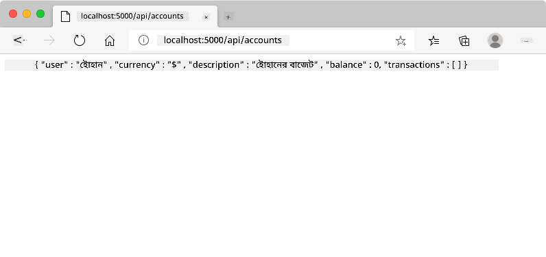

<!--
CO_OP_TRANSLATOR_METADATA:
{
  "original_hash": "8baca047d77a5f43fa4099c0578afa42",
  "translation_date": "2025-08-28T22:52:39+00:00",
  "source_file": "7-bank-project/2-forms/README.md",
  "language_code": "bn"
}
-->
# ব্যাংকিং অ্যাপ তৈরি করুন পার্ট ২: লগইন এবং রেজিস্ট্রেশন ফর্ম তৈরি করুন

## প্রি-লেকচার কুইজ

[প্রি-লেকচার কুইজ](https://ff-quizzes.netlify.app/web/quiz/43)

### ভূমিকা

প্রায় সব আধুনিক ওয়েব অ্যাপে, আপনি একটি অ্যাকাউন্ট তৈরি করতে পারেন যা আপনার ব্যক্তিগত জায়গা হিসেবে কাজ করে। যেহেতু একাধিক ব্যবহারকারী একই সময়ে একটি ওয়েব অ্যাপ অ্যাক্সেস করতে পারে, তাই প্রতিটি ব্যবহারকারীর ব্যক্তিগত ডেটা আলাদাভাবে সংরক্ষণ করার এবং কোন তথ্য প্রদর্শন করতে হবে তা নির্বাচন করার একটি পদ্ধতি প্রয়োজন। আমরা [ব্যবহারকারীর পরিচয় নিরাপদে পরিচালনা](https://en.wikipedia.org/wiki/Authentication) করার বিষয়ে আলোচনা করব না কারণ এটি নিজেই একটি বিস্তৃত বিষয়, তবে আমরা নিশ্চিত করব যে প্রতিটি ব্যবহারকারী আমাদের অ্যাপে একটি (বা একাধিক) ব্যাংক অ্যাকাউন্ট তৈরি করতে সক্ষম।

এই অংশে আমরা HTML ফর্ম ব্যবহার করে আমাদের ওয়েব অ্যাপে লগইন এবং রেজিস্ট্রেশন যোগ করব। আমরা দেখব কীভাবে সার্ভার API-তে প্রোগ্রাম্যাটিকভাবে ডেটা পাঠানো যায় এবং শেষ পর্যন্ত কীভাবে ব্যবহারকারীর ইনপুটের জন্য মৌলিক যাচাইকরণ নিয়ম সংজ্ঞায়িত করা যায়।

### পূর্বশর্ত

এই পাঠের জন্য আপনাকে [HTML টেমপ্লেট এবং রাউটিং](../1-template-route/README.md) সম্পন্ন করতে হবে। এছাড়াও আপনাকে [Node.js](https://nodejs.org) ইনস্টল করতে হবে এবং [সার্ভার API চালাতে হবে](../api/README.md) যাতে আপনি অ্যাকাউন্ট তৈরি করার জন্য ডেটা পাঠাতে পারেন।

**মনে রাখুন**
আপনার দুটি টার্মিনাল একসাথে চালু থাকবে, যা নিচে তালিকাভুক্ত:
1. মূল ব্যাংক অ্যাপের জন্য যা আমরা [HTML টেমপ্লেট এবং রাউটিং](../1-template-route/README.md) পাঠে তৈরি করেছি।
2. [ব্যাংক অ্যাপ সার্ভার API](../api/README.md) যা আমরা উপরে সেটআপ করেছি।

পাঠের বাকি অংশ অনুসরণ করতে আপনার দুটি সার্ভার চালু এবং চলমান থাকতে হবে। এগুলি বিভিন্ন পোর্টে (পোর্ট `3000` এবং পোর্ট `5000`) শুনছে, তাই সবকিছু ঠিকঠাক কাজ করবে।

আপনি টার্মিনালে এই কমান্ডটি চালিয়ে পরীক্ষা করতে পারেন যে সার্ভার সঠিকভাবে চলছে কিনা:

```sh
curl http://localhost:5000/api
# -> should return "Bank API v1.0.0" as a result
```

---

## ফর্ম এবং কন্ট্রোল

`<form>` এলিমেন্টটি একটি HTML ডকুমেন্টের একটি অংশকে ঘিরে রাখে যেখানে ব্যবহারকারী ইন্টারঅ্যাক্টিভ কন্ট্রোল ব্যবহার করে ডেটা ইনপুট এবং জমা দিতে পারে। ফর্মের মধ্যে ব্যবহার করার জন্য বিভিন্ন ধরনের ইউজার ইন্টারফেস (UI) কন্ট্রোল রয়েছে, যার মধ্যে সবচেয়ে সাধারণ `<input>` এবং `<button>` এলিমেন্ট।

`<input>`-এর বিভিন্ন [ধরন](https://developer.mozilla.org/docs/Web/HTML/Element/input) রয়েছে। উদাহরণস্বরূপ, ব্যবহারকারীর ইউজারনেম ইনপুট করার জন্য আপনি ব্যবহার করতে পারেন:

```html
<input id="username" name="username" type="text">
```

`name` অ্যাট্রিবিউটটি ফর্ম ডেটা পাঠানোর সময় প্রপার্টি নাম হিসেবে ব্যবহৃত হবে। `id` অ্যাট্রিবিউটটি `<label>`-কে ফর্ম কন্ট্রোলের সাথে যুক্ত করতে ব্যবহৃত হয়।

> [`<input>`-এর ধরনগুলির সম্পূর্ণ তালিকা](https://developer.mozilla.org/docs/Web/HTML/Element/input) এবং [অন্যান্য ফর্ম কন্ট্রোল](https://developer.mozilla.org/docs/Learn/Forms/Other_form_controls) দেখুন যাতে আপনি আপনার UI তৈরি করার সময় সমস্ত নেটিভ UI এলিমেন্ট সম্পর্কে ধারণা পেতে পারেন।

✅ লক্ষ্য করুন যে `<input>` একটি [ফাঁকা এলিমেন্ট](https://developer.mozilla.org/docs/Glossary/Empty_element) যার জন্য আপনাকে *মিলানো বন্ধ ট্যাগ* যোগ করা উচিত নয়। তবে আপনি স্ব-বন্ধ `<input/>` নোটেশন ব্যবহার করতে পারেন, তবে এটি বাধ্যতামূলক নয়।

ফর্মের মধ্যে `<button>` এলিমেন্টটি একটু বিশেষ। যদি আপনি এর `type` অ্যাট্রিবিউট নির্দিষ্ট না করেন, এটি চাপলে স্বয়ংক্রিয়ভাবে ফর্ম ডেটা সার্ভারে জমা দেবে। এখানে সম্ভাব্য `type` মানগুলি রয়েছে:

- `submit`: ফর্মের মধ্যে ডিফল্ট, এটি ফর্ম জমা দেওয়ার ক্রিয়াটি ট্রিগার করে।
- `reset`: বোতামটি সমস্ত ফর্ম কন্ট্রোলকে তাদের প্রাথমিক মানে রিসেট করে।
- `button`: বোতামটি চাপলে কোনো ডিফল্ট আচরণ বরাদ্দ করে না। আপনি পরে JavaScript ব্যবহার করে কাস্টম ক্রিয়া বরাদ্দ করতে পারেন।

### কাজ

চলুন `login` টেমপ্লেটে একটি ফর্ম যোগ করি। আমাদের একটি *username* ফিল্ড এবং একটি *Login* বোতাম দরকার।

```html
<template id="login">
  <h1>Bank App</h1>
  <section>
    <h2>Login</h2>
    <form id="loginForm">
      <label for="username">Username</label>
      <input id="username" name="user" type="text">
      <button>Login</button>
    </form>
  </section>
</template>
```

যদি আপনি ভালোভাবে লক্ষ্য করেন, আপনি দেখতে পাবেন যে আমরা এখানে একটি `<label>` এলিমেন্টও যোগ করেছি। `<label>` এলিমেন্টগুলি UI কন্ট্রোলগুলিতে নাম যোগ করতে ব্যবহৃত হয়, যেমন আমাদের ইউজারনেম ফিল্ড। লেবেলগুলি আপনার ফর্মের পাঠযোগ্যতার জন্য গুরুত্বপূর্ণ, তবে এটি অতিরিক্ত সুবিধাও নিয়ে আসে:

- একটি লেবেলকে ফর্ম কন্ট্রোলের সাথে যুক্ত করে, এটি সহায়ক প্রযুক্তি ব্যবহারকারী (যেমন স্ক্রিন রিডার) ব্যবহারকারীদের বুঝতে সাহায্য করে যে তারা কী ডেটা প্রদান করতে আশা করা হচ্ছে।
- আপনি লেবেলে ক্লিক করে সরাসরি সংশ্লিষ্ট ইনপুটে ফোকাস দিতে পারেন, যা টাচ-স্ক্রিন ভিত্তিক ডিভাইসে সহজে পৌঁছানো যায়।

> [ওয়েব অ্যাক্সেসিবিলিটি](https://developer.mozilla.org/docs/Learn/Accessibility/What_is_accessibility) একটি খুব গুরুত্বপূর্ণ বিষয় যা প্রায়শই উপেক্ষা করা হয়। [সেমান্টিক HTML এলিমেন্ট](https://developer.mozilla.org/docs/Learn/Accessibility/HTML) ব্যবহার করে সঠিকভাবে ব্যবহার করলে অ্যাক্সেসযোগ্য কন্টেন্ট তৈরি করা কঠিন নয়। আপনি [অ্যাক্সেসিবিলিটি সম্পর্কে আরও পড়তে পারেন](https://developer.mozilla.org/docs/Web/Accessibility) সাধারণ ভুল এড়াতে এবং একজন দায়িত্বশীল ডেভেলপার হতে।

এখন আমরা রেজিস্ট্রেশনের জন্য একটি দ্বিতীয় ফর্ম যোগ করব, আগেরটির ঠিক নিচে:

```html
<hr/>
<h2>Register</h2>
<form id="registerForm">
  <label for="user">Username</label>
  <input id="user" name="user" type="text">
  <label for="currency">Currency</label>
  <input id="currency" name="currency" type="text" value="$">
  <label for="description">Description</label>
  <input id="description" name="description" type="text">
  <label for="balance">Current balance</label>
  <input id="balance" name="balance" type="number" value="0">
  <button>Register</button>
</form>
```

`value` অ্যাট্রিবিউট ব্যবহার করে আমরা একটি ইনপুটের জন্য একটি ডিফল্ট মান সংজ্ঞায়িত করতে পারি। লক্ষ্য করুন যে `balance` ইনপুটটির `number` টাইপ রয়েছে। এটি কি অন্য ইনপুটগুলির চেয়ে আলাদা দেখাচ্ছে? এটি ইন্টারঅ্যাক্ট করে দেখুন।

✅ আপনি কি শুধুমাত্র কীবোর্ড ব্যবহার করে ফর্মগুলি নেভিগেট এবং ইন্টারঅ্যাক্ট করতে পারেন? আপনি কীভাবে এটি করবেন?

## সার্ভারে ডেটা জমা দেওয়া

এখন আমাদের একটি কার্যকরী UI রয়েছে, পরবর্তী ধাপ হল ডেটা সার্ভারে পাঠানো। চলুন আমাদের বর্তমান কোড ব্যবহার করে একটি দ্রুত পরীক্ষা করি: যদি আপনি *Login* বা *Register* বোতামে ক্লিক করেন তাহলে কী ঘটে?

আপনার ব্রাউজারের URL সেকশনে পরিবর্তন লক্ষ্য করেছেন?


একটি `<form>`-এর জন্য ডিফল্ট ক্রিয়া হল বর্তমান সার্ভার URL-এ ফর্ম জমা দেওয়া [GET পদ্ধতি](https://www.w3.org/Protocols/rfc2616/rfc2616-sec9.html#sec9.3) ব্যবহার করে, ফর্ম ডেটা সরাসরি URL-এ যোগ করে। তবে এই পদ্ধতির কিছু সীমাবদ্ধতা রয়েছে:

- পাঠানো ডেটার আকার খুব সীমিত (প্রায় ২০০০ অক্ষর)
- ডেটা URL-এ সরাসরি দৃশ্যমান (পাসওয়ার্ডের জন্য ভালো নয়)
- এটি ফাইল আপলোডের সাথে কাজ করে না

তাই আপনি এটি পরিবর্তন করে [POST পদ্ধতি](https://www.w3.org/Protocols/rfc2616/rfc2616-sec9.html#sec9.5) ব্যবহার করতে পারেন যা ফর্ম ডেটা HTTP অনুরোধের বডিতে সার্ভারে পাঠায়, পূর্বের সীমাবদ্ধতাগুলি ছাড়াই।

> যদিও POST ডেটা পাঠানোর জন্য সবচেয়ে সাধারণভাবে ব্যবহৃত পদ্ধতি, [কিছু নির্দিষ্ট পরিস্থিতিতে](https://www.w3.org/2001/tag/doc/whenToUseGet.html) GET পদ্ধতি ব্যবহার করা ভালো, যেমন একটি সার্চ ফিল্ড বাস্তবায়নের সময়।

### কাজ

রেজিস্ট্রেশন ফর্মে `action` এবং `method` প্রপার্টি যোগ করুন:

```html
<form id="registerForm" action="//localhost:5000/api/accounts" method="POST">
```

এখন আপনার নাম দিয়ে একটি নতুন অ্যাকাউন্ট রেজিস্টার করার চেষ্টা করুন। *Register* বোতামে ক্লিক করার পর আপনি এরকম কিছু দেখতে পাবেন:



যদি সবকিছু ঠিকঠাক হয়, সার্ভার আপনার অনুরোধের উত্তর JSON রেসপন্স দিয়ে দেবে যা তৈরি করা অ্যাকাউন্ট ডেটা ধারণ করে।

✅ একই নাম দিয়ে আবার রেজিস্টার করার চেষ্টা করুন। কী ঘটে?

## পেজ রিলোড ছাড়াই ডেটা জমা দেওয়া

যেমনটি আপনি লক্ষ্য করেছেন, আমরা যে পদ্ধতি ব্যবহার করেছি তার একটি ছোট সমস্যা রয়েছে: ফর্ম জমা দেওয়ার সময়, আমরা আমাদের অ্যাপ থেকে বেরিয়ে যাই এবং ব্রাউজারটি সার্ভার URL-এ রিডাইরেক্ট করে। আমরা আমাদের ওয়েব অ্যাপের সাথে সমস্ত পেজ রিলোড এড়াতে চাই, কারণ আমরা একটি [সিঙ্গেল-পেজ অ্যাপ্লিকেশন (SPA)](https://en.wikipedia.org/wiki/Single-page_application) তৈরি করছি।

ফর্ম ডেটা সার্ভারে পাঠানোর জন্য পেজ রিলোড এড়াতে, আমাদের JavaScript কোড ব্যবহার করতে হবে। `<form>` এলিমেন্টের `action` প্রপার্টিতে একটি URL দেওয়ার পরিবর্তে, আপনি `javascript:` স্ট্রিং দিয়ে শুরু করে যেকোনো JavaScript কোড ব্যবহার করতে পারেন কাস্টম ক্রিয়া সম্পাদন করতে। এটি ব্যবহার করার অর্থ হল আপনাকে ব্রাউজার দ্বারা স্বয়ংক্রিয়ভাবে সম্পন্ন কিছু কাজ বাস্তবায়ন করতে হবে:

- ফর্ম ডেটা পুনরুদ্ধার করা
- ফর্ম ডেটা একটি উপযুক্ত ফরম্যাটে রূপান্তর এবং এনকোড করা
- HTTP অনুরোধ তৈরি করা এবং সার্ভারে পাঠানো

### কাজ

রেজিস্ট্রেশন ফর্মের `action` পরিবর্তন করুন:

```html
<form id="registerForm" action="javascript:register()">
```

`app.js` খুলুন এবং একটি নতুন ফাংশন `register` নামে যোগ করুন:

```js
function register() {
  const registerForm = document.getElementById('registerForm');
  const formData = new FormData(registerForm);
  const data = Object.fromEntries(formData);
  const jsonData = JSON.stringify(data);
}
```

এখানে আমরা `getElementById()` ব্যবহার করে ফর্ম এলিমেন্টটি পুনরুদ্ধার করি এবং [`FormData`](https://developer.mozilla.org/docs/Web/API/FormData) হেল্পার ব্যবহার করে ফর্ম কন্ট্রোল থেকে মানগুলি কী/মান জোড়া হিসেবে বের করি। তারপর আমরা ডেটাকে একটি নিয়মিত অবজেক্টে রূপান্তর করি [`Object.fromEntries()`](https://developer.mozilla.org/docs/Web/JavaScript/Reference/Global_Objects/Object/fromEntries) ব্যবহার করে এবং শেষ পর্যন্ত ডেটাকে [JSON](https://www.json.org/json-en.html) এ সিরিয়ালাইজ করি, যা ওয়েবে ডেটা বিনিময়ের জন্য সাধারণত ব্যবহৃত একটি ফরম্যাট।

ডেটা এখন সার্ভারে পাঠানোর জন্য প্রস্তুত। `createAccount` নামে একটি নতুন ফাংশন তৈরি করুন:

```js
async function createAccount(account) {
  try {
    const response = await fetch('//localhost:5000/api/accounts', {
      method: 'POST',
      headers: { 'Content-Type': 'application/json' },
      body: account
    });
    return await response.json();
  } catch (error) {
    return { error: error.message || 'Unknown error' };
  }
}
```

এই ফাংশনটি কী করছে? প্রথমে, এখানে `async` কীওয়ার্ডটি লক্ষ্য করুন। এর অর্থ হল ফাংশনটি এমন কোড ধারণ করে যা [**অ্যাসিঙ্ক্রোনাসলি**](https://developer.mozilla.org/docs/Web/JavaScript/Reference/Statements/async_function) কার্যকর হবে। `await` কীওয়ার্ডের সাথে ব্যবহার করলে এটি অ্যাসিঙ্ক্রোনাস কোড কার্যকর হওয়ার জন্য অপেক্ষা করতে দেয় - যেমন এখানে সার্ভারের উত্তর পাওয়ার জন্য অপেক্ষা করা - তারপর চালিয়ে যায়।

`fetch()` API ব্যবহার করে আমরা JSON ডেটা সার্ভারে পাঠাই। এই পদ্ধতিটি দুটি প্যারামিটার নেয়:

- সার্ভারের URL, তাই আমরা এখানে `//localhost:5000/api/accounts` ব্যবহার করি।
- অনুরোধের সেটিংস। এখানে আমরা পদ্ধতিটি `POST` সেট করি এবং অনুরোধের জন্য `body` প্রদান করি। যেহেতু আমরা JSON ডেটা সার্ভারে পাঠাচ্ছি, তাই আমাদের `Content-Type` হেডারটি `application/json` সেট করতে হবে যাতে সার্ভার বিষয়বস্তুটি কীভাবে ব্যাখ্যা করবে তা জানে।

যেহেতু সার্ভার অনুরোধের উত্তর JSON দিয়ে দেবে, আমরা `await response.json()` ব্যবহার করে JSON বিষয়বস্তু পার্স করতে পারি এবং ফলাফল অবজেক্টটি ফেরত দিতে পারি। লক্ষ্য করুন যে এই পদ্ধতিটি অ্যাসিঙ্ক্রোনাস, তাই আমরা এখানে `await` কীওয়ার্ড ব্যবহার করি যাতে পার্সিংয়ের সময় কোনো ত্রুটি ধরা পড়ে।

এখন `register` ফাংশনে কিছু কোড যোগ করুন `createAccount()` কল করতে:

```js
const result = await createAccount(jsonData);
```

যেহেতু আমরা এখানে `await` কীওয়ার্ড ব্যবহার করছি, আমাদের `register` ফাংশনের আগে `async` কীওয়ার্ড যোগ করতে হবে:

```js
async function register() {
```

শেষে, ফলাফল পরীক্ষা করার জন্য কিছু লগ যোগ করুন। চূড়ান্ত ফাংশনটি এরকম হওয়া উচিত:

```js
async function register() {
  const registerForm = document.getElementById('registerForm');
  const formData = new FormData(registerForm);
  const jsonData = JSON.stringify(Object.fromEntries(formData));
  const result = await createAccount(jsonData);

  if (result.error) {
    return console.log('An error occurred:', result.error);
  }

  console.log('Account created!', result);
}
```

এটি একটু দীর্ঘ ছিল কিন্তু আমরা শেষ পর্যন্ত পৌঁছেছি! যদি আপনি আপনার [ব্রাউজার ডেভেলপার টুল](https://developer.mozilla.org/docs/Learn/Common_questions/What_are_browser_developer_tools) খুলেন এবং একটি নতুন অ্যাকাউন্ট রেজিস্টার করার চেষ্টা করেন, আপনি ওয়েব পেজে কোনো পরিবর্তন দেখতে পাবেন না তবে কনসোলে একটি বার্তা প্রদর্শিত হবে যা নিশ্চিত করবে যে সবকিছু কাজ করছে।


✅ আপনি কি মনে করেন ডেটা সার্ভারে নিরাপদে পাঠানো হচ্ছে? যদি কেউ অনুরোধটি আটকাতে সক্ষম হয় তাহলে কী হবে? [HTTPS](https://en.wikipedia.org/wiki/HTTPS) সম্পর্কে পড়ুন যাতে নিরাপদ ডেটা যোগাযোগ সম্পর্কে আরও জানতে পারেন।

## ডেটা যাচাইকরণ

যদি আপনি প্রথমে একটি ইউজারনেম সেট না করে একটি নতুন অ্যাকাউন্ট রেজিস্টার করার চেষ্টা করেন, আপনি দেখতে পাবেন যে সার্ভার একটি ত্রুটি ফেরত দেয় যার স্ট্যাটাস কোড [400 (Bad Request)](https://developer.mozilla.org/docs/Web/HTTP/Status/400#:~:text=The%20HyperText%20Transfer%20Protocol%20(HTTP,%2C%20or%20deceptive%20request%20routing).)।

সার্ভারে ডেটা পাঠানোর আগে এটি যাচাই করা একটি ভালো অভ্যাস, যখন সম্ভব, যাতে আপনি একটি বৈধ অনুরোধ পাঠান। HTML5 ফর্ম কন্ট্রোল বিভিন্ন অ্যাট্রিবিউট ব্যবহার করে বিল্ট-ইন যাচাইকরণ প্রদান করে:

- `required`: ফিল্ডটি পূরণ করতে হবে, অন্যথায় ফর্ম জমা দেওয়া যাবে না।
- `minlength` এবং `maxlength`: টেক্সট ফিল্ডে অক্ষরের সর্বনিম্ন এবং সর্বাধিক সংখ্যা সংজ্ঞায়িত করে।
- `min` এবং `max`: সংখ্যাসূচক ফিল্ডের সর্বনিম্ন এবং সর্বাধিক মান সংজ্ঞায়িত করে।
- `type`: প্রত্যাশিত ডেটার ধরণ সংজ্ঞায়িত করে, যেমন `number`, `email`, `file` বা [অন্যান্য বিল্ট-ইন টাইপ](https://developer.mozilla.org/docs/Web/HTML/Element/input)। এই অ্যাট্রিবিউটটি ফর্ম কন্ট্রোলের ভিজ্যুয়াল রেন্ডারিংও পরিবর্তন করতে পারে।
- `pattern`: একটি [রেগুলার এক্সপ্রেশন](https://developer.mozilla.org/docs/Web/JavaScript/Guide/Regular_Expressions) প্যাটার্ন সংজ্ঞায়িত করতে দেয় যাতে প্রবেশ করা ডেটা বৈধ কিনা তা পরীক্ষা করা যায়।
টিপ: আপনি আপনার ফর্ম কন্ট্রোলগুলোর চেহারা কাস্টমাইজ করতে পারেন, সেগুলো বৈধ বা অবৈধ কিনা তার উপর ভিত্তি করে, `:valid` এবং `:invalid` CSS পসুডো-ক্লাস ব্যবহার করে।
### কাজ

একটি বৈধ নতুন অ্যাকাউন্ট তৈরি করতে দুটি প্রয়োজনীয় ক্ষেত্র রয়েছে: ব্যবহারকারীর নাম এবং মুদ্রা। অন্যান্য ক্ষেত্রগুলো ঐচ্ছিক। ফর্মের HTML আপডেট করুন, `required` অ্যাট্রিবিউট এবং ক্ষেত্রের লেবেলে টেক্সট ব্যবহার করে যাতে:

```html
<label for="user">Username (required)</label>
<input id="user" name="user" type="text" required>
...
<label for="currency">Currency (required)</label>
<input id="currency" name="currency" type="text" value="$" required>
```

যদিও এই নির্দিষ্ট সার্ভার ইমপ্লিমেন্টেশন ক্ষেত্রগুলোর সর্বোচ্চ দৈর্ঘ্যের উপর নির্দিষ্ট সীমা আরোপ করে না, তবুও ব্যবহারকারীর টেক্সট এন্ট্রির জন্য যুক্তিসঙ্গত সীমা নির্ধারণ করা সর্বদা একটি ভালো অভ্যাস।

টেক্সট ক্ষেত্রগুলোতে একটি `maxlength` অ্যাট্রিবিউট যোগ করুন:

```html
<input id="user" name="user" type="text" maxlength="20" required>
...
<input id="currency" name="currency" type="text" value="$" maxlength="5" required>
...
<input id="description" name="description" type="text" maxlength="100">
```

এখন যদি আপনি *Register* বোতামটি চাপেন এবং কোনো ক্ষেত্র আমাদের সংজ্ঞায়িত করা যাচাইয়ের নিয়ম মেনে না চলে, তবে আপনি এরকম কিছু দেখতে পাবেন:


এই ধরনের যাচাই, যা কোনো ডেটা সার্ভারে পাঠানোর *আগে* সম্পন্ন হয়, তাকে **ক্লায়েন্ট-সাইড** যাচাই বলা হয়। তবে মনে রাখবেন, কিছু যাচাই ডেটা না পাঠিয়ে সম্পন্ন করা সবসময় সম্ভব নয়। উদাহরণস্বরূপ, আমরা এখানে যাচাই করতে পারি না যে একই ব্যবহারকারীর নাম সহ একটি অ্যাকাউন্ট ইতিমধ্যেই বিদ্যমান কিনা, সার্ভারে একটি অনুরোধ না পাঠিয়ে। সার্ভারে সম্পন্ন হওয়া অতিরিক্ত যাচাইকে **সার্ভার-সাইড** যাচাই বলা হয়।

সাধারণত উভয়ই বাস্তবায়ন করা প্রয়োজন, এবং ক্লায়েন্ট-সাইড যাচাই ব্যবহারকারীর অভিজ্ঞতা উন্নত করে তাৎক্ষণিক প্রতিক্রিয়া প্রদান করে, তবে সার্ভার-সাইড যাচাই নিশ্চিত করে যে আপনি যে ব্যবহারকারীর ডেটা পরিচালনা করছেন তা সঠিক এবং নিরাপদ।

---

## 🚀 চ্যালেঞ্জ

যদি ব্যবহারকারী ইতিমধ্যেই বিদ্যমান থাকে, তবে HTML-এ একটি ত্রুটি বার্তা দেখান।

স্টাইলিং যোগ করার পর চূড়ান্ত লগইন পৃষ্ঠাটি দেখতে এরকম হতে পারে:


## পোস্ট-লেকচার কুইজ

[পোস্ট-লেকচার কুইজ](https://ff-quizzes.netlify.app/web/quiz/44)

## পর্যালোচনা ও স্ব-অধ্যয়ন

ডেভেলপাররা তাদের ফর্ম তৈরির প্রচেষ্টায়, বিশেষ করে যাচাই কৌশলগুলোর ক্ষেত্রে, খুবই সৃজনশীল হয়ে উঠেছে। [CodePen](https://codepen.com) ঘেঁটে বিভিন্ন ফর্ম ফ্লো সম্পর্কে জানুন; আপনি কি কিছু আকর্ষণীয় এবং অনুপ্রেরণামূলক ফর্ম খুঁজে পেতে পারেন?

## অ্যাসাইনমেন্ট

[আপনার ব্যাংক অ্যাপ স্টাইল করুন](assignment.md)

---

**অস্বীকৃতি**:  
এই নথিটি AI অনুবাদ পরিষেবা [Co-op Translator](https://github.com/Azure/co-op-translator) ব্যবহার করে অনুবাদ করা হয়েছে। আমরা যথাসম্ভব সঠিক অনুবাদ প্রদানের চেষ্টা করি, তবে অনুগ্রহ করে মনে রাখবেন যে স্বয়ংক্রিয় অনুবাদে ত্রুটি বা অসঙ্গতি থাকতে পারে। মূল ভাষায় থাকা নথিটিকে প্রামাণিক উৎস হিসেবে বিবেচনা করা উচিত। গুরুত্বপূর্ণ তথ্যের জন্য, পেশাদার মানব অনুবাদ সুপারিশ করা হয়। এই অনুবাদ ব্যবহারের ফলে কোনো ভুল বোঝাবুঝি বা ভুল ব্যাখ্যা হলে আমরা দায়বদ্ধ থাকব না।