# ব্যাংকিং অ্যাপ তৈরি করুন পার্ট ২: লগইন এবং রেজিস্ট্রেশন ফর্ম তৈরি করুন

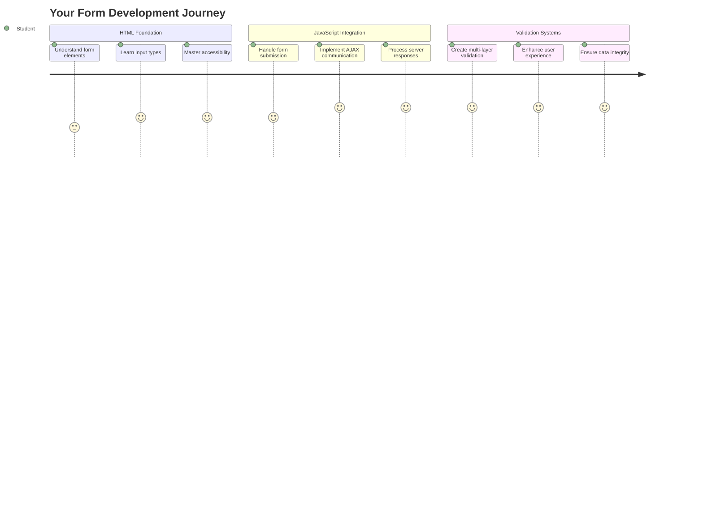
```mermaid
journey
    title Your Form Development Journey
    section HTML Foundation
      Understand form elements: 3: Student
      Learn input types: 4: Student
      Master accessibility: 4: Student
    section JavaScript Integration
      Handle form submission: 4: Student
      Implement AJAX communication: 5: Student
      Process server responses: 5: Student
    section Validation Systems
      Create multi-layer validation: 5: Student
      Enhance user experience: 5: Student
      Ensure data integrity: 5: Student
```

## প্রি-লেকচার কুইজ

[প্রি-লেকচার কুইজ](https://ff-quizzes.netlify.app/web/quiz/43)

আপনি কি কখনও অনলাইনে একটি ফর্ম পূরণ করেছেন এবং এটি আপনার ইমেইল ফরম্যাট প্রত্যাখ্যান করেছে? অথবা সাবমিট ক্লিক করার পর সমস্ত তথ্য হারিয়েছেন? আমরা সবাই এই ধরনের হতাশাজনক অভিজ্ঞতার সম্মুখীন হয়েছি।

ফর্মগুলি আপনার ব্যবহারকারীদের এবং আপনার অ্যাপ্লিকেশনের কার্যকারিতার মধ্যে সেতু। যেমন বিমান ট্রাফিক কন্ট্রোলাররা সাবধানে প্রোটোকল ব্যবহার করে বিমানকে তাদের গন্তব্যে নিরাপদে পৌঁছাতে সাহায্য করে, তেমনি ভালোভাবে ডিজাইন করা ফর্মগুলি স্পষ্ট প্রতিক্রিয়া প্রদান করে এবং ব্যয়বহুল ভুল প্রতিরোধ করে। অন্যদিকে, খারাপ ফর্মগুলি ব্যবহারকারীদের দ্রুত দূরে সরিয়ে দিতে পারে।

এই পাঠে, আমরা আপনার স্থির ব্যাংকিং অ্যাপকে একটি ইন্টারেক্টিভ অ্যাপ্লিকেশনে রূপান্তর করব। আপনি শিখবেন কীভাবে ফর্ম তৈরি করতে হয় যা ব্যবহারকারীর ইনপুট যাচাই করে, সার্ভারের সাথে যোগাযোগ করে এবং সহায়ক প্রতিক্রিয়া প্রদান করে। এটি এমন একটি নিয়ন্ত্রণ ইন্টারফেস তৈরি করার মতো যা ব্যবহারকারীদের আপনার অ্যাপ্লিকেশনের বৈশিষ্ট্যগুলি নেভিগেট করতে দেয়।

শেষে, আপনার কাছে একটি সম্পূর্ণ লগইন এবং রেজিস্ট্রেশন সিস্টেম থাকবে যা ব্যবহারকারীদের হতাশার পরিবর্তে সফলতার দিকে পরিচালিত করবে।

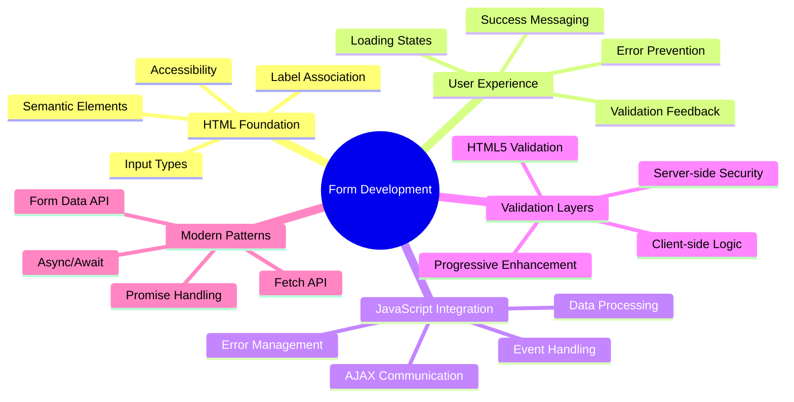
```mermaid
mindmap
  root((Form Development))
    HTML Foundation
      Semantic Elements
      Input Types
      Accessibility
      Label Association
    User Experience
      Validation Feedback
      Error Prevention
      Loading States
      Success Messaging
    JavaScript Integration
      Event Handling
      AJAX Communication
      Data Processing
      Error Management
    Validation Layers
      HTML5 Validation
      Client-side Logic
      Server-side Security
      Progressive Enhancement
    Modern Patterns
      Fetch API
      Async/Await
      Form Data API
      Promise Handling
```

## প্রয়োজনীয়তা

ফর্ম তৈরি শুরু করার আগে, আসুন নিশ্চিত হই যে আপনার সবকিছু সঠিকভাবে সেট আপ করা আছে। এই পাঠটি আগের পাঠের ঠিক যেখানে শেষ হয়েছিল সেখান থেকে শুরু হয়, তাই যদি আপনি এগিয়ে গিয়ে থাকেন, তাহলে প্রথমে ফিরে গিয়ে মৌলিক বিষয়গুলি কাজ করে নিন।

### প্রয়োজনীয় সেটআপ

| উপাদান | অবস্থা | বিবরণ |
|--------|--------|--------|
| [HTML টেমপ্লেট](../1-template-route/README.md) | ✅ প্রয়োজনীয় | আপনার মৌলিক ব্যাংকিং অ্যাপের কাঠামো |
| [Node.js](https://nodejs.org) | ✅ প্রয়োজনীয় | সার্ভারের জন্য জাভাস্ক্রিপ্ট রানটাইম |
| [Bank API Server](../api/README.md) | ✅ প্রয়োজনীয় | ডেটা সংরক্ষণের জন্য ব্যাকএন্ড সার্ভিস |

> 💡 **ডেভেলপমেন্ট টিপ**: আপনি একসাথে দুটি পৃথক সার্ভার চালাবেন – একটি আপনার ফ্রন্ট-এন্ড ব্যাংকিং অ্যাপের জন্য এবং অন্যটি ব্যাকএন্ড API এর জন্য। এই সেটআপটি বাস্তব-বিশ্বের ডেভেলপমেন্টের প্রতিফলন যেখানে ফ্রন্টএন্ড এবং ব্যাকএন্ড সার্ভিসগুলি স্বাধীনভাবে কাজ করে।

### সার্ভার কনফিগারেশন

**আপনার ডেভেলপমেন্ট পরিবেশ অন্তর্ভুক্ত করবে:**
- **ফ্রন্টএন্ড সার্ভার**: আপনার ব্যাংকিং অ্যাপ সরবরাহ করে (সাধারণত পোর্ট `3000`)
- **ব্যাকএন্ড API সার্ভার**: ডেটা সংরক্ষণ এবং পুনরুদ্ধার পরিচালনা করে (পোর্ট `5000`)
- **উভয় সার্ভার** কোনো সংঘর্ষ ছাড়াই একসাথে চলতে পারে

**আপনার API সংযোগ পরীক্ষা করা:**
```bash
curl http://localhost:5000/api
# Expected response: "Bank API v1.0.0"
```

**যদি আপনি API সংস্করণের প্রতিক্রিয়া দেখতে পান, তাহলে আপনি এগিয়ে যেতে প্রস্তুত!**

---

## HTML ফর্ম এবং কন্ট্রোলগুলি বোঝা

HTML ফর্মগুলি আপনার ওয়েব অ্যাপ্লিকেশনের সাথে ব্যবহারকারীদের যোগাযোগের মাধ্যম। এগুলি ১৯ শতকে দূরবর্তী স্থানগুলিকে সংযুক্ত করার জন্য ব্যবহৃত টেলিগ্রাফ সিস্টেমের মতো – এটি ব্যবহারকারীর উদ্দেশ্য এবং অ্যাপ্লিকেশনের প্রতিক্রিয়ার মধ্যে যোগাযোগের প্রোটোকল। চিন্তাশীলভাবে ডিজাইন করা হলে, এগুলি ভুল ধরতে পারে, ইনপুট ফরম্যাটিং গাইড করতে পারে এবং সহায়ক পরামর্শ দিতে পারে।

আধুনিক ফর্মগুলি সাধারণ টেক্সট ইনপুটের চেয়ে উল্লেখযোগ্যভাবে উন্নত। HTML5 বিশেষ ইনপুট টাইপগুলি প্রবর্তন করেছে যা স্বয়ংক্রিয়ভাবে ইমেইল যাচাই, সংখ্যা ফরম্যাটিং এবং তারিখ নির্বাচন পরিচালনা করে। এই উন্নতিগুলি অ্যাক্সেসিবিলিটি এবং মোবাইল ব্যবহারকারীর অভিজ্ঞতার জন্য উপকারী।

### প্রয়োজনীয় ফর্ম উপাদান

**প্রতিটি ফর্মের জন্য প্রয়োজনীয় বিল্ডিং ব্লক:**

```html
<!-- Basic form structure -->
<form id="userForm" method="POST">
  <label for="username">Username</label>
  <input id="username" name="username" type="text" required>
  
  <button type="submit">Submit</button>
</form>
```

**এই কোডটি যা করে:**
- **একটি ফর্ম কন্টেইনার তৈরি করে** একটি অনন্য আইডেন্টিফায়ার সহ
- **ডেটা জমা দেওয়ার জন্য HTTP পদ্ধতি নির্ধারণ করে**
- **অ্যাক্সেসিবিলিটির জন্য লেবেলগুলিকে ইনপুটের সাথে যুক্ত করে**
- **ফর্ম প্রক্রিয়ার জন্য একটি সাবমিট বোতাম সংজ্ঞায়িত করে**

### আধুনিক ইনপুট টাইপ এবং অ্যাট্রিবিউট

| ইনপুট টাইপ | উদ্দেশ্য | উদাহরণ ব্যবহার |
|------------|---------|---------------|
| `text` | সাধারণ টেক্সট ইনপুট | `<input type="text" name="username">` |
| `email` | ইমেইল যাচাই | `<input type="email" name="email">` |
| `password` | লুকানো টেক্সট এন্ট্রি | `<input type="password" name="password">` |
| `number` | সংখ্যাসূচক ইনপুট | `<input type="number" name="balance" min="0">` |
| `tel` | ফোন নম্বর | `<input type="tel" name="phone">` |

> 💡 **আধুনিক HTML5 সুবিধা**: নির্দিষ্ট ইনপুট টাইপ ব্যবহার করলে স্বয়ংক্রিয় যাচাই, উপযুক্ত মোবাইল কীবোর্ড এবং অতিরিক্ত জাভাস্ক্রিপ্ট ছাড়াই উন্নত অ্যাক্সেসিবিলিটি সমর্থন প্রদান করে!

### বোতামের টাইপ এবং আচরণ

```html
<!-- Different button behaviors -->
<button type="submit">Save Data</button>     <!-- Submits the form -->
<button type="reset">Clear Form</button>    <!-- Resets all fields -->
<button type="button">Custom Action</button> <!-- No default behavior -->
```

**প্রতিটি বোতামের টাইপ যা করে:**
- **সাবমিট বোতাম**: ফর্ম জমা দেওয়া শুরু করে এবং ডেটা নির্দিষ্ট এন্ডপয়েন্টে পাঠায়
- **রিসেট বোতাম**: সমস্ত ফর্ম ক্ষেত্রকে তাদের প্রাথমিক অবস্থায় ফিরিয়ে দেয়
- **সাধারণ বোতাম**: কোনো ডিফল্ট আচরণ প্রদান করে না, কার্যকারিতার জন্য কাস্টম জাভাস্ক্রিপ্ট প্রয়োজন

> ⚠️ **গুরুত্বপূর্ণ নোট**: `<input>` উপাদানটি স্ব-বন্ধ এবং বন্ধ করার ট্যাগের প্রয়োজন হয় না। আধুনিক সেরা অনুশীলন হল `<input>` লিখা ছাড়া স্ল্যাশ।

### আপনার লগইন ফর্ম তৈরি করা

এখন আসুন একটি ব্যবহারিক লগইন ফর্ম তৈরি করি যা আধুনিক HTML ফর্ম অনুশীলন প্রদর্শন করে। আমরা একটি মৌলিক কাঠামো দিয়ে শুরু করব এবং ধীরে ধীরে এটিকে অ্যাক্সেসিবিলিটি বৈশিষ্ট্য এবং যাচাই সহ উন্নত করব।

```html
<template id="login">
  <h1>Bank App</h1>
  <section>
    <h2>Login</h2>
    <form id="loginForm" novalidate>
      <div class="form-group">
        <label for="username">Username</label>
        <input id="username" name="user" type="text" required 
               autocomplete="username" placeholder="Enter your username">
      </div>
      <button type="submit">Login</button>
    </form>
  </section>
</template>
```

**এখানে যা ঘটছে তার বিশ্লেষণ:**
- **সেমান্টিক HTML5 উপাদান দিয়ে ফর্মের কাঠামো তৈরি করে**
- **অর্থবহ ক্লাস সহ `div` কন্টেইনার ব্যবহার করে সম্পর্কিত উপাদানগুলি গ্রুপ করে**
- **লেবেলগুলিকে `for` এবং `id` অ্যাট্রিবিউট ব্যবহার করে ইনপুটের সাথে যুক্ত করে**
- **ভালো UX এর জন্য `autocomplete` এবং `placeholder` এর মতো আধুনিক অ্যাট্রিবিউট অন্তর্ভুক্ত করে**
- **ব্রাউজারের ডিফল্ট যাচাইয়ের পরিবর্তে জাভাস্ক্রিপ্ট দিয়ে যাচাই পরিচালনা করতে `novalidate` যোগ করে**

### সঠিক লেবেলের শক্তি

**আধুনিক ওয়েব ডেভেলপমেন্টে লেবেল কেন গুরুত্বপূর্ণ:**

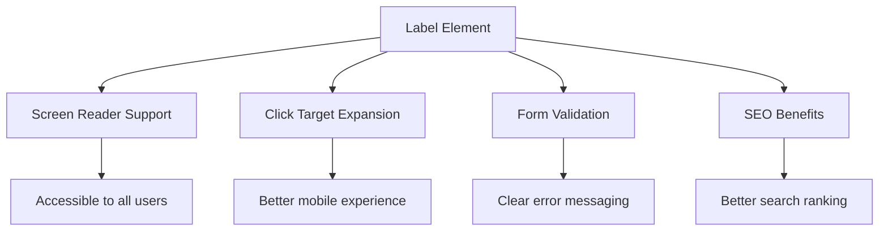
```mermaid
graph TD
    A[Label Element] --> B[Screen Reader Support]
    A --> C[Click Target Expansion]
    A --> D[Form Validation]
    A --> E[SEO Benefits]
    
    B --> F[Accessible to all users]
    C --> G[Better mobile experience]
    D --> H[Clear error messaging]
    E --> I[Better search ranking]
```

**সঠিক লেবেল যা অর্জন করে:**
- **স্ক্রিন রিডারকে ফর্ম ক্ষেত্রগুলি স্পষ্টভাবে ঘোষণা করতে সক্ষম করে**
- **ক্লিকযোগ্য এলাকা প্রসারিত করে (লেবেলে ক্লিক করলে ইনপুট ফোকাস হয়)**
- **বড় টাচ টার্গেট দিয়ে মোবাইল ব্যবহারযোগ্যতা উন্নত করে**
- **অর্থবহ ত্রুটি বার্তা সহ ফর্ম যাচাই সমর্থন করে**
- **সেমান্টিক অর্থ প্রদান করে SEO উন্নত করে**

> 🎯 **অ্যাক্সেসিবিলিটি লক্ষ্য**: প্রতিটি ফর্ম ইনপুটের একটি সংশ্লিষ্ট লেবেল থাকা উচিত। এই সহজ অনুশীলন আপনার ফর্মগুলি সকলের জন্য ব্যবহারযোগ্য করে তোলে, যার মধ্যে প্রতিবন্ধী ব্যবহারকারীরাও অন্তর্ভুক্ত, এবং সমস্ত ব্যবহারকারীর জন্য অভিজ্ঞতা উন্নত করে।

### রেজিস্ট্রেশন ফর্ম তৈরি করা

রেজিস্ট্রেশন ফর্ম সম্পূর্ণ ব্যবহারকারী অ্যাকাউন্ট তৈরি করতে আরও বিস্তারিত তথ্য প্রয়োজন। আসুন এটি আধুনিক HTML5 বৈশিষ্ট্য এবং উন্নত অ্যাক্সেসিবিলিটি সহ তৈরি করি।

```html
<hr/>
<h2>Register</h2>
<form id="registerForm" novalidate>
  <div class="form-group">
    <label for="user">Username</label>
    <input id="user" name="user" type="text" required 
           autocomplete="username" placeholder="Choose a username">
  </div>
  
  <div class="form-group">
    <label for="currency">Currency</label>
    <input id="currency" name="currency" type="text" value="$" 
           required maxlength="3" placeholder="USD, EUR, etc.">
  </div>
  
  <div class="form-group">
    <label for="description">Account Description</label>
    <input id="description" name="description" type="text" 
           maxlength="100" placeholder="Personal savings, checking, etc.">
  </div>
  
  <div class="form-group">
    <label for="balance">Starting Balance</label>
    <input id="balance" name="balance" type="number" value="0" 
           min="0" step="0.01" placeholder="0.00">
  </div>
  
  <button type="submit">Create Account</button>
</form>
```

**উপরের কোডে আমরা:**
- **প্রতিটি ক্ষেত্রকে কন্টেইনার `div` এ সংগঠিত করেছি যাতে স্টাইলিং এবং লেআউট উন্নত হয়**
- **ব্রাউজার অটোফিল সমর্থনের জন্য উপযুক্ত `autocomplete` অ্যাট্রিবিউট যোগ করেছি**
- **ব্যবহারকারীর ইনপুট গাইড করার জন্য সহায়ক প্লেসহোল্ডার টেক্সট অন্তর্ভুক্ত করেছি**
- **`value` অ্যাট্রিবিউট ব্যবহার করে যুক্তিসঙ্গত ডিফল্ট সেট করেছি**
- **`required`, `maxlength`, এবং `min` এর মতো যাচাই অ্যাট্রিবিউট প্রয়োগ করেছি**
- **ডেসিমাল সমর্থন সহ ব্যালেন্স ক্ষেত্রের জন্য `type="number"` ব্যবহার করেছি**

### ইনপুট টাইপ এবং আচরণ অন্বেষণ

**আধুনিক ইনপুট টাইপ উন্নত কার্যকারিতা প্রদান করে:**

| বৈশিষ্ট্য | সুবিধা | উদাহরণ |
|----------|--------|--------|
| `type="number"` | মোবাইলে সংখ্যাসূচক কীবোর্ড | ব্যালেন্স এন্ট্রি সহজ |
| `step="0.01"` | দশমিক নির্ভুলতা নিয়ন্ত্রণ | মুদ্রায় সেন্ট অনুমতি দেয় |
| `autocomplete` | ব্রাউজার অটোফিল | দ্রুত ফর্ম পূরণ |
| `placeholder` | প্রসঙ্গগত ইঙ্গিত | ব্যবহারকারীর প্রত্যাশা গাইড করে |

> 🎯 **অ্যাক্সেসিবিলিটি চ্যালেঞ্জ**: শুধুমাত্র আপনার কীবোর্ড ব্যবহার করে ফর্মগুলি নেভিগেট করার চেষ্টা করুন! ক্ষেত্রগুলির মধ্যে সরানোর জন্য `Tab` ব্যবহার করুন, চেকবক্স চেক করতে `Space` এবং সাবমিট করতে `Enter`। এই অভিজ্ঞতা আপনাকে বুঝতে সাহায্য করবে স্ক্রিন রিডার ব্যবহারকারীরা কীভাবে আপনার ফর্মগুলির সাথে যোগাযোগ করে।

### 🔄 **শিক্ষাগত চেক-ইন**
**ফর্মের ভিত্তি বোঝা**: জাভাস্ক্রিপ্ট বাস্তবায়নের আগে নিশ্চিত করুন:
- ✅ কীভাবে সেমান্টিক HTML অ্যাক্সেসযোগ্য ফর্ম কাঠামো তৈরি করে
- ✅ মোবাইল কীবোর্ড এবং যাচাইয়ের জন্য ইনপুট টাইপ কেন গুরুত্বপূর্ণ
- ✅ লেবেল এবং ফর্ম কন্ট্রোলের মধ্যে সম্পর্ক
- ✅ ফর্ম অ্যাট্রিবিউট কীভাবে ব্রাউজারের ডিফল্ট আচরণকে প্রভাবিত করে

**দ্রুত স্ব-পরীক্ষা**: যদি আপনি জাভাস্ক্রিপ্ট হ্যান্ডলিং ছাড়াই একটি ফর্ম জমা দেন তাহলে কী ঘটে?
*উত্তর: ব্রাউজার ডিফল্ট জমা দেয়, সাধারণত অ্যাকশন URL এ পুনঃনির্দেশ করে*

**HTML5 ফর্মের সুবিধা**: আধুনিক ফর্মগুলি প্রদান করে:
- **বিল্ট-ইন যাচাই**: স্বয়ংক্রিয় ইমেইল এবং সংখ্যা ফরম্যাট যাচাই
- **মোবাইল অপ্টিমাইজেশন**: বিভিন্ন ইনপুট টাইপের জন্য উপযুক্ত কীবোর্ড
- **অ্যাক্সেসিবিলিটি**: স্ক্রিন রিডার সমর্থন এবং কীবোর্ড নেভিগেশন
- **প্রগ্রেসিভ এনহান্সমেন্ট**: জাভাস্ক্রিপ্ট নিষ্ক্রিয় থাকলেও কাজ করে

## ফর্ম জমা দেওয়ার পদ্ধতি বোঝা

যখন কেউ আপনার ফর্ম পূরণ করে এবং সাবমিট ক্লিক করে, তখন সেই ডেটা কোথাও যেতে হবে – সাধারণত একটি সার্ভারে যা এটি সংরক্ষণ করতে পারে। এটি কয়েকটি ভিন্ন উপায়ে ঘটতে পারে, এবং কোনটি ব্যবহার করবেন তা জানা ভবিষ্যতে কিছু ঝামেলা থেকে আপনাকে বাঁচাতে পারে।

আসুন দেখি কেউ যখন সেই সাবমিট বোতামে ক্লিক করে তখন আসলে কী ঘটে।

### ডিফল্ট ফর্ম আচরণ

প্রথমে, আসুন মৌলিক ফর্ম জমা দেওয়ার সাথে কী ঘটে তা পর্যবেক্ষণ করি:

**আপনার বর্তমান ফর্মগুলি পরীক্ষা করুন:**
1. আপনার ফর্মে *রেজিস্টার* বোতামে ক্লিক করুন
2. আপনার ব্রাউজারের অ্যাড্রেস বারে পরিবর্তনগুলি লক্ষ্য করুন
3. লক্ষ্য করুন কীভাবে পৃষ্ঠা পুনরায় লোড হয় এবং ডেটা URL-এ প্রদর্শিত হয়


### HTTP পদ্ধতির তুলনা

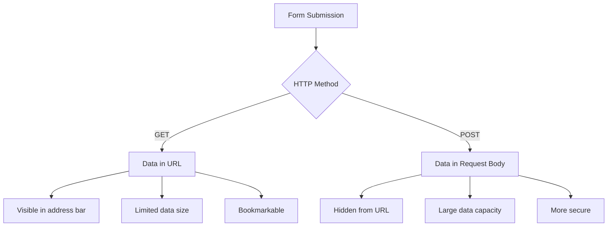
```mermaid
graph TD
    A[Form Submission] --> B{HTTP Method}
    B -->|GET| C[Data in URL]
    B -->|POST| D[Data in Request Body]
    
    C --> E[Visible in address bar]
    C --> F[Limited data size]
    C --> G[Bookmarkable]
    
    D --> H[Hidden from URL]
    D --> I[Large data capacity]
    D --> J[More secure]
```

**পার্থক্য বোঝা:**

| পদ্ধতি | ব্যবহার কেস | ডেটার অবস্থান | নিরাপত্তার স্তর | আকার সীমা |
|--------|------------|---------------|----------------|-----------|
| `GET` | অনুসন্ধান প্রশ্ন, ফিল্টার | URL প্যারামিটার | কম (দৃশ্যমান) | ~২০০০ অক্ষর |
| `POST` | ব্যবহারকারী অ্যাকাউন্ট, সংবেদনশীল ডেটা | রিকোয়েস্ট বডি | উচ্চ (গোপন) | কোনো বাস্তব সীমা নেই |

**মৌলিক পার্থক্য বোঝা:**
- **GET**: ফর্ম ডেটাকে URL এর সাথে যোগ করে (অনুসন্ধান অপারেশনের জন্য উপযুক্ত)
- **POST**: ডেটাকে রিকোয়েস্ট বডিতে অন্তর্ভুক্ত করে (সংবেদনশীল তথ্যের জন্য অপরিহ
```javascript
// Example of what FormData captures
const formData = new FormData(registerForm);

// FormData automatically captures:
// {
//   "user": "john_doe",
//   "currency": "$", 
//   "description": "Personal account",
//   "balance": "100"
// }
```

**FormData API এর সুবিধাসমূহ:**
- **সম্পূর্ণ সংগ্রহ**: সমস্ত ফর্ম উপাদান যেমন টেক্সট, ফাইল এবং জটিল ইনপুট সংগ্রহ করে
- **টাইপ সচেতনতা**: বিভিন্ন ইনপুট টাইপ স্বয়ংক্রিয়ভাবে পরিচালনা করে, অতিরিক্ত কোডিং ছাড়াই
- **দক্ষতা**: একটি API কলের মাধ্যমে ম্যানুয়াল ফিল্ড সংগ্রহের প্রয়োজনীয়তা দূর করে
- **অভিযোজনযোগ্যতা**: ফর্মের গঠন পরিবর্তিত হলেও কার্যকারিতা বজায় রাখে

### সার্ভারের সাথে যোগাযোগের ফাংশন তৈরি করা

এখন আমরা আধুনিক জাভাস্ক্রিপ্ট প্যাটার্ন ব্যবহার করে API সার্ভারের সাথে যোগাযোগ করার জন্য একটি শক্তিশালী ফাংশন তৈরি করব:

```javascript
async function createAccount(account) {
  try {
    const response = await fetch('//localhost:5000/api/accounts', {
      method: 'POST',
      headers: { 
        'Content-Type': 'application/json',
        'Accept': 'application/json'
      },
      body: account
    });
    
    // Check if the response was successful
    if (!response.ok) {
      throw new Error(`HTTP error! status: ${response.status}`);
    }
    
    return await response.json();
  } catch (error) {
    console.error('Account creation failed:', error);
    return { error: error.message || 'Network error occurred' };
  }
}
```

**অ্যাসিঙ্ক্রোনাস জাভাস্ক্রিপ্ট বোঝা:**

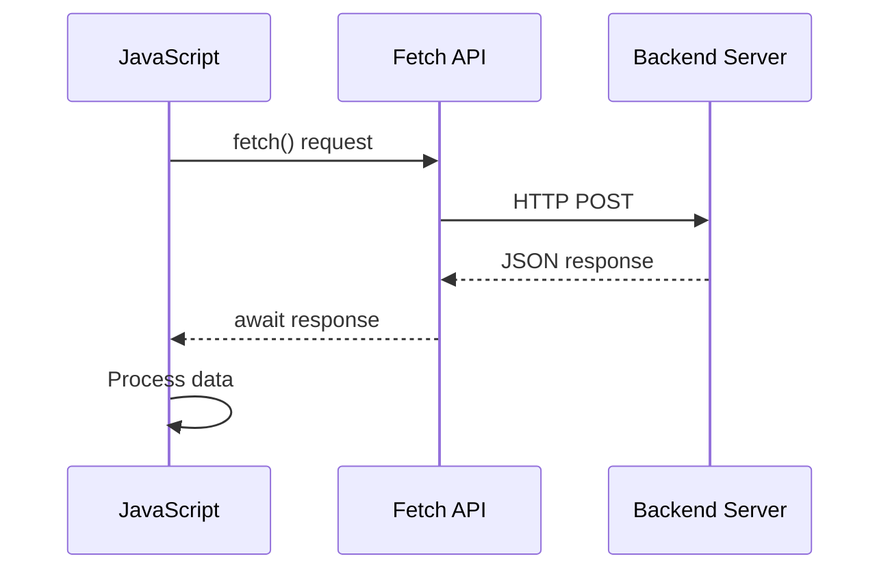
```mermaid
sequenceDiagram
    participant JS as JavaScript
    participant Fetch as Fetch API
    participant Server as Backend Server
    
    JS->>Fetch: fetch() request
    Fetch->>Server: HTTP POST
    Server-->>Fetch: JSON response
    Fetch-->>JS: await response
    JS->>JS: Process data
```

**এই আধুনিক বাস্তবায়ন যা অর্জন করে:**
- **ব্যবহার করে** `async/await` আরও পাঠযোগ্য অ্যাসিঙ্ক্রোনাস কোডের জন্য
- **সঠিক ত্রুটি পরিচালনা অন্তর্ভুক্ত করে** try/catch ব্লক ব্যবহার করে
- **প্রতিক্রিয়ার অবস্থা পরীক্ষা করে** ডেটা প্রক্রিয়াকরণের আগে
- **উপযুক্ত হেডার সেট করে** JSON যোগাযোগের জন্য
- **বিস্তারিত ত্রুটি বার্তা প্রদান করে** ডিবাগিংয়ের জন্য
- **সাফল্য এবং ত্রুটির ক্ষেত্রে** ধারাবাহিক ডেটা কাঠামো প্রদান করে

### আধুনিক Fetch API এর শক্তি

**Fetch API এর পুরনো পদ্ধতির উপর সুবিধাসমূহ:**

| বৈশিষ্ট্য | সুবিধা | বাস্তবায়ন |
|---------|---------|----------------|
| প্রমিস-ভিত্তিক | পরিষ্কার অ্যাসিঙ্ক কোড | `await fetch()` |
| অনুরোধ কাস্টমাইজেশন | সম্পূর্ণ HTTP নিয়ন্ত্রণ | হেডার, মেথড, বডি |
| প্রতিক্রিয়া পরিচালনা | নমনীয় ডেটা পার্সিং | `.json()`, `.text()`, `.blob()` |
| ত্রুটি পরিচালনা | বিস্তৃত ত্রুটি ধরার ক্ষমতা | Try/catch ব্লক |

> 🎥 **আরও জানুন**: [Async/Await Tutorial](https://youtube.com/watch?v=YwmlRkrxvkk) - আধুনিক ওয়েব ডেভেলপমেন্টের জন্য অ্যাসিঙ্ক্রোনাস জাভাস্ক্রিপ্ট প্যাটার্ন বোঝা।

**সার্ভার যোগাযোগের মূল ধারণা:**
- **অ্যাসিঙ্ক ফাংশন** সার্ভার প্রতিক্রিয়ার জন্য কার্যক্রম থামাতে দেয়
- **Await কীওয়ার্ড** অ্যাসিঙ্ক্রোনাস কোডকে সিঙ্ক্রোনাস কোডের মতো পড়তে সাহায্য করে
- **Fetch API** আধুনিক, প্রমিস-ভিত্তিক HTTP অনুরোধ প্রদান করে
- **ত্রুটি পরিচালনা** নিশ্চিত করে যে আপনার অ্যাপ নেটওয়ার্ক সমস্যার জন্য সুন্দরভাবে প্রতিক্রিয়া জানায়

### রেজিস্ট্রেশন ফাংশন সম্পন্ন করা

চলুন সবকিছু একত্রিত করে একটি সম্পূর্ণ, প্রোডাকশন-রেডি রেজিস্ট্রেশন ফাংশন তৈরি করি:

```javascript
async function register() {
  const registerForm = document.getElementById('registerForm');
  const submitButton = registerForm.querySelector('button[type="submit"]');
  
  try {
    // Show loading state
    submitButton.disabled = true;
    submitButton.textContent = 'Creating Account...';
    
    // Process form data
    const formData = new FormData(registerForm);
    const jsonData = JSON.stringify(Object.fromEntries(formData));
    
    // Send to server
    const result = await createAccount(jsonData);
    
    if (result.error) {
      console.error('Registration failed:', result.error);
      alert(`Registration failed: ${result.error}`);
      return;
    }
    
    console.log('Account created successfully!', result);
    alert(`Welcome, ${result.user}! Your account has been created.`);
    
    // Reset form after successful registration
    registerForm.reset();
    
  } catch (error) {
    console.error('Unexpected error:', error);
    alert('An unexpected error occurred. Please try again.');
  } finally {
    // Restore button state
    submitButton.disabled = false;
    submitButton.textContent = 'Create Account';
  }
}
```

**এই উন্নত বাস্তবায়ন অন্তর্ভুক্ত করে:**
- **ভিজ্যুয়াল ফিডব্যাক প্রদান করে** ফর্ম জমা দেওয়ার সময়
- **সাবমিট বোতাম নিষ্ক্রিয় করে** ডুপ্লিকেট জমা প্রতিরোধ করতে
- **উভয় প্রত্যাশিত এবং অপ্রত্যাশিত ত্রুটি সুন্দরভাবে পরিচালনা করে**
- **ব্যবহারকারী-বান্ধব সাফল্য এবং ত্রুটি বার্তা প্রদর্শন করে**
- **ফর্ম রিসেট করে** সফল রেজিস্ট্রেশনের পরে
- **ফলাফল নির্বিশেষে UI অবস্থা পুনরুদ্ধার করে**

### আপনার বাস্তবায়ন পরীক্ষা করা

**আপনার ব্রাউজার ডেভেলপার টুল খুলুন এবং রেজিস্ট্রেশন পরীক্ষা করুন:**

1. **ব্রাউজার কনসোল খুলুন** (F12 → Console ট্যাব)
2. **রেজিস্ট্রেশন ফর্ম পূরণ করুন**
3. **"Create Account" ক্লিক করুন**
4. **কনসোল বার্তা এবং ব্যবহারকারীর প্রতিক্রিয়া পর্যবেক্ষণ করুন**

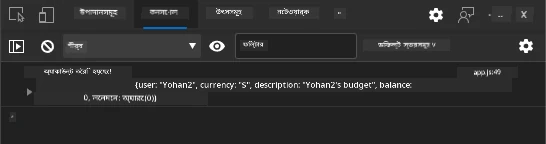

**আপনি যা দেখতে পাবেন:**
- **লোডিং স্টেট** সাবমিট বোতামে প্রদর্শিত হবে
- **কনসোল লগ** প্রক্রিয়া সম্পর্কে বিস্তারিত তথ্য দেখাবে
- **সাফল্যের বার্তা** অ্যাকাউন্ট তৈরি সফল হলে প্রদর্শিত হবে
- **ফর্ম স্বয়ংক্রিয়ভাবে রিসেট হবে** সফল জমার পরে

> 🔒 **নিরাপত্তা বিবেচনা**: বর্তমানে, ডেটা HTTP এর মাধ্যমে প্রেরণ করা হচ্ছে, যা প্রোডাকশনের জন্য নিরাপদ নয়। বাস্তব অ্যাপ্লিকেশনে, সর্বদা HTTPS ব্যবহার করুন ডেটা ট্রান্সমিশন এনক্রিপ্ট করতে। আরও জানুন [HTTPS নিরাপত্তা](https://en.wikipedia.org/wiki/HTTPS) এবং কেন এটি ব্যবহারকারীর ডেটা সুরক্ষার জন্য গুরুত্বপূর্ণ।

### 🔄 **শিক্ষামূলক চেক-ইন**
**আধুনিক জাভাস্ক্রিপ্ট ইন্টিগ্রেশন**: অ্যাসিঙ্ক্রোনাস ফর্ম পরিচালনার আপনার বোঝাপড়া যাচাই করুন:
- ✅ কীভাবে `event.preventDefault()` ডিফল্ট ফর্ম আচরণ পরিবর্তন করে?
- ✅ কেন FormData API ম্যানুয়াল ফিল্ড সংগ্রহের চেয়ে বেশি কার্যকর?
- ✅ কীভাবে async/await প্যাটার্ন কোডের পাঠযোগ্যতা উন্নত করে?
- ✅ ত্রুটি পরিচালনা ব্যবহারকারীর অভিজ্ঞতায় কী ভূমিকা পালন করে?

**সিস্টেম আর্কিটেকচার**: আপনার ফর্ম পরিচালনা প্রদর্শন করে:
- **ইভেন্ট-চালিত প্রোগ্রামিং**: পৃষ্ঠা রিলোড ছাড়াই ব্যবহারকারীর ক্রিয়াগুলিতে প্রতিক্রিয়া জানায়
- **অ্যাসিঙ্ক্রোনাস যোগাযোগ**: সার্ভার অনুরোধ UI ব্লক করে না
- **ত্রুটি পরিচালনা**: নেটওয়ার্ক অনুরোধ ব্যর্থ হলে সুন্দরভাবে ডিগ্রেড করে
- **স্টেট ম্যানেজমেন্ট**: UI আপডেটগুলি সার্ভার প্রতিক্রিয়াগুলিকে সঠিকভাবে প্রতিফলিত করে
- **প্রগ্রেসিভ এনহান্সমেন্ট**: বেস কার্যকারিতা কাজ করে, জাভাস্ক্রিপ্ট এটিকে উন্নত করে

**পেশাদার প্যাটার্ন**: আপনি বাস্তবায়ন করেছেন:
- **একক দায়িত্ব**: ফাংশনগুলির স্পষ্ট, কেন্দ্রীভূত উদ্দেশ্য রয়েছে
- **ত্রুটি সীমানা**: Try/catch ব্লক অ্যাপ্লিকেশন ক্র্যাশ প্রতিরোধ করে
- **ব্যবহারকারী প্রতিক্রিয়া**: লোডিং স্টেট এবং সাফল্য/ত্রুটি বার্তা প্রদান করে
- **ডেটা রূপান্তর**: FormData থেকে JSON সার্ভার যোগাযোগের জন্য

## ব্যাপক ফর্ম যাচাইকরণ

ফর্ম যাচাইকরণ জমা দেওয়ার পরে ত্রুটি আবিষ্কারের হতাশাজনক অভিজ্ঞতা প্রতিরোধ করে। আন্তর্জাতিক স্পেস স্টেশনের একাধিক রিডানড্যান্ট সিস্টেমের মতো, কার্যকর যাচাইকরণ একাধিক স্তরের নিরাপত্তা চেক ব্যবহার করে।

সেরা পদ্ধতি হল ব্রাউজার-স্তরের যাচাইকরণ, যা তাৎক্ষণিক প্রতিক্রিয়া প্রদান করে, জাভাস্ক্রিপ্ট যাচাইকরণ, যা উন্নত ব্যবহারকারীর অভিজ্ঞতা প্রদান করে, এবং সার্ভার-সাইড যাচাইকরণ, যা নিরাপত্তা এবং ডেটার অখণ্ডতা নিশ্চিত করে। এই রিডানডেন্সি ব্যবহারকারীর সন্তুষ্টি এবং সিস্টেম সুরক্ষা নিশ্চিত করে।

### যাচাইকরণ স্তরগুলি বোঝা

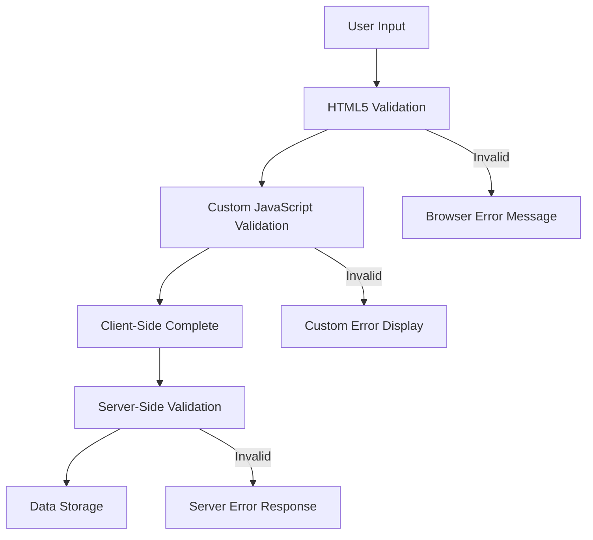
```mermaid
graph TD
    A[User Input] --> B[HTML5 Validation]
    B --> C[Custom JavaScript Validation]
    C --> D[Client-Side Complete]
    D --> E[Server-Side Validation]
    E --> F[Data Storage]
    
    B -->|Invalid| G[Browser Error Message]
    C -->|Invalid| H[Custom Error Display]
    E -->|Invalid| I[Server Error Response]
```

**মাল্টি-লেয়ার যাচাইকরণ কৌশল:**
- **HTML5 যাচাইকরণ**: তাৎক্ষণিক ব্রাউজার-ভিত্তিক চেক
- **জাভাস্ক্রিপ্ট যাচাইকরণ**: কাস্টম লজিক এবং ব্যবহারকারীর অভিজ্ঞতা
- **সার্ভার যাচাইকরণ**: চূড়ান্ত নিরাপত্তা এবং ডেটার অখণ্ডতা চেক
- **প্রগ্রেসিভ এনহান্সমেন্ট**: জাভাস্ক্রিপ্ট নিষ্ক্রিয় থাকলেও কাজ করে

### HTML5 যাচাইকরণ অ্যাট্রিবিউট

**আপনার কাছে আধুনিক যাচাইকরণ সরঞ্জাম:**

| অ্যাট্রিবিউট | উদ্দেশ্য | উদাহরণ ব্যবহার | ব্রাউজার আচরণ |
|-----------|---------|---------------|------------------|
| `required` | বাধ্যতামূলক ক্ষেত্র | `<input required>` | খালি জমা প্রতিরোধ করে |
| `minlength`/`maxlength` | টেক্সট দৈর্ঘ্যের সীমা | `<input maxlength="20">` | অক্ষর সীমা প্রয়োগ করে |
| `min`/`max` | সংখ্যার সীমা | `<input min="0" max="1000">` | সংখ্যা সীমা যাচাই করে |
| `pattern` | কাস্টম রেগুলার এক্সপ্রেশন নিয়ম | `<input pattern="[A-Za-z]+">` | নির্দিষ্ট ফরম্যাট মেলে |
| `type` | ডেটা টাইপ যাচাইকরণ | `<input type="email">` | ফরম্যাট-নির্দিষ্ট যাচাইকরণ |

### CSS যাচাইকরণ স্টাইলিং

**যাচাইকরণ অবস্থার জন্য ভিজ্যুয়াল প্রতিক্রিয়া তৈরি করুন:**

```css
/* Valid input styling */
input:valid {
  border-color: #28a745;
  background-color: #f8fff9;
}

/* Invalid input styling */
input:invalid {
  border-color: #dc3545;
  background-color: #fff5f5;
}

/* Focus states for better accessibility */
input:focus:valid {
  box-shadow: 0 0 0 0.2rem rgba(40, 167, 69, 0.25);
}

input:focus:invalid {
  box-shadow: 0 0 0 0.2rem rgba(220, 53, 69, 0.25);
}
```

**এই ভিজ্যুয়াল সংকেত যা অর্জন করে:**
- **সবুজ বর্ডার**: সফল যাচাইকরণ নির্দেশ করে, মিশন কন্ট্রোলে সবুজ আলোয়ের মতো
- **লাল বর্ডার**: যাচাইকরণ ত্রুটি নির্দেশ করে যা মনোযোগ প্রয়োজন
- **ফোকাস হাইলাইট**: বর্তমান ইনপুট অবস্থানের জন্য পরিষ্কার ভিজ্যুয়াল প্রসঙ্গ প্রদান করে
- **সামঞ্জস্যপূর্ণ স্টাইলিং**: পূর্বাভাসযোগ্য ইন্টারফেস প্যাটার্ন তৈরি করে যা ব্যবহারকারীরা শিখতে পারে

> 💡 **প্রো টিপ**: ব্যবহার করুন `:valid` এবং `:invalid` CSS পসুডো-ক্লাস তাৎক্ষণিক ভিজ্যুয়াল প্রতিক্রিয়া প্রদান করতে, ব্যবহারকারীরা টাইপ করার সময় একটি প্রতিক্রিয়াশীল এবং সহায়ক ইন্টারফেস তৈরি করতে।

### ব্যাপক যাচাইকরণ বাস্তবায়ন

চলুন আপনার রেজিস্ট্রেশন ফর্মকে উন্নত যাচাইকরণ দিয়ে উন্নত করি যা চমৎকার ব্যবহারকারীর অভিজ্ঞতা এবং ডেটার গুণমান প্রদান করে:

```html
<form id="registerForm" method="POST" novalidate>
  <div class="form-group">
    <label for="user">Username <span class="required">*</span></label>
    <input id="user" name="user" type="text" required 
           minlength="3" maxlength="20" 
           pattern="[a-zA-Z0-9_]+" 
           autocomplete="username"
           title="Username must be 3-20 characters, letters, numbers, and underscores only">
    <small class="form-text">Choose a unique username (3-20 characters)</small>
  </div>
  
  <div class="form-group">
    <label for="currency">Currency <span class="required">*</span></label>
    <input id="currency" name="currency" type="text" required 
           value="$" maxlength="3" 
           pattern="[A-Z$€£¥₹]+" 
           title="Enter a valid currency symbol or code">
    <small class="form-text">Currency symbol (e.g., $, €, £)</small>
  </div>
  
  <div class="form-group">
    <label for="description">Account Description</label>
    <input id="description" name="description" type="text" 
           maxlength="100" 
           placeholder="Personal savings, checking, etc.">
    <small class="form-text">Optional description (up to 100 characters)</small>
  </div>
  
  <div class="form-group">
    <label for="balance">Starting Balance</label>
    <input id="balance" name="balance" type="number" 
           value="0" min="0" step="0.01" 
           title="Enter a positive number for your starting balance">
    <small class="form-text">Initial account balance (minimum $0.00)</small>
  </div>
  
  <button type="submit">Create Account</button>
</form>
```

**উন্নত যাচাইকরণ বোঝা:**
- **বাধ্যতামূলক ক্ষেত্র সূচকগুলিকে সহায়ক বিবরণ সহ একত্রিত করে**
- **ফরম্যাট যাচাইকরণের জন্য `pattern` অ্যাট্রিবিউট অন্তর্ভুক্ত করে**
- **অ্যাক্সেসিবিলিটি এবং টুলটিপের জন্য `title` অ্যাট্রিবিউট প্রদান করে**
- **ব্যবহারকারী ইনপুট গাইড করার জন্য সহায়ক টেক্সট যোগ করে**
- **উন্নত অ্যাক্সেসিবিলিটির জন্য সেমান্টিক HTML গঠন ব্যবহার করে**

### উন্নত যাচাইকরণ নিয়ম

**প্রত্যেক যাচাইকরণ নিয়ম যা অর্জন করে:**

| ক্ষেত্র | যাচাইকরণ নিয়ম | ব্যবহারকারীর সুবিধা |
|-------|------------------|--------------|
| ব্যবহারকারীর নাম | `required`, `minlength="3"`, `maxlength="20"`, `pattern="[a-zA-Z0-9_]+"` | বৈধ, অনন্য শনাক্তকারী নিশ্চিত করে |
| মুদ্রা | `required`, `maxlength="3"`, `pattern="[A-Z$€£¥₹]+"` | সাধারণ মুদ্রার প্রতীক গ্রহণ করে |
| ব্যালেন্স | `min="0"`, `step="0.01"`, `type="number"` | নেতিবাচক ব্যালেন্স প্রতিরোধ করে |
| বিবরণ | `maxlength="100"` | যুক্তিসঙ্গত দৈর্ঘ্যের সীমা |

### যাচাইকরণ আচরণ পরীক্ষা করা

**এই যাচাইকরণ পরিস্থিতি চেষ্টা করুন:**
1. **ফর্ম জমা দিন** খালি বাধ্যতামূলক ক্ষেত্র সহ
2. **একটি ব্যবহারকারীর নাম লিখুন** যা ৩ অক্ষরের চেয়ে ছোট
3. **বিশেষ অক্ষর চেষ্টা করুন** ব্যবহারকারীর নাম ক্ষেত্রে
4. **একটি নেতিবাচক ব্যালেন্স পরিমাণ লিখুন**

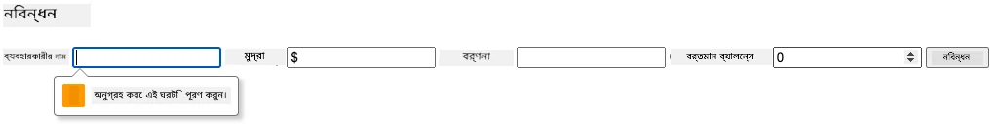

**আপনি যা পর্যবেক্ষণ করবেন:**
- **ব্রাউজার প্রদর্শন করে** নেটিভ যাচাইকরণ বার্তা
- **স্টাইলিং পরিবর্তন হয়** `:valid` এবং `:invalid` অবস্থার উপর ভিত্তি করে
- **ফর্ম জমা দেওয়া হয় না** যতক্ষণ না সমস্ত যাচাইকরণ পাস করে
- **ফোকাস স্বয়ংক্রিয়ভাবে** প্রথম অকার্যকর ক্ষেত্রে চলে যায়

### ক্লায়েন্ট-সাইড বনাম সার্ভার-সাইড যাচাইকরণ

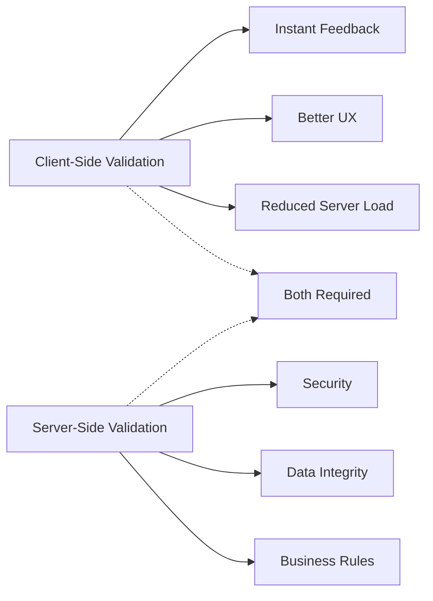
```mermaid
graph LR
    A[Client-Side Validation] --> B[Instant Feedback]
    A --> C[Better UX]
    A --> D[Reduced Server Load]
    
    E[Server-Side Validation] --> F[Security]
    E --> G[Data Integrity]
    E --> H[Business Rules]
    
    A -.-> I[Both Required]
    E -.-> I
```

**কেন উভয় স্তর প্রয়োজন:**
- **ক্লায়েন্ট-সাইড যাচাইকরণ**: তাৎক্ষণিক প্রতিক্রিয়া প্রদান করে এবং ব্যবহারকারীর অভিজ্ঞতা উন্নত করে
- **সার্ভার-সাইড যাচাইকরণ**: নিরাপত্তা নিশ্চিত করে এবং জটিল ব্যবসায়িক নিয়ম পরিচালনা করে
- **সমন্বিত পদ্ধতি**: শক্তিশালী, ব্যবহারকারী-বান্ধব এবং নিরাপদ অ্যাপ্লিকেশন তৈরি করে
- **প্রগ্রেসিভ এনহান্সমেন্ট**: জাভাস্ক্রিপ্ট নিষ্ক্রিয় থাকলেও কাজ করে

> 🛡️ **নিরাপত্তা অনুস্মারক**: শুধুমাত্র ক্লায়েন্ট-সাইড যাচাইকরণ বিশ্বাস করবেন না! ক্ষতিকারক ব্যবহারকারীরা ক্লায়েন্ট-সাইড চেক বাইপাস করতে পারে, তাই সার্ভার-সাইড যাচাইকরণ নিরাপত্তা এবং ডেটার অখণ্ডতার জন্য অপরিহার্য।

### ⚡ **পরবর্তী ৫ মিনিটে আপনি যা করতে পারেন**
- [ ] ভুল ডেটা দিয়ে আপনার ফর্ম পরীক্ষা করুন যাচাইকরণ বার্তা দেখতে
- [ ] HTML5 যাচাইকরণ দেখতে জাভাস্ক্রিপ্ট নিষ্ক্রিয় করে ফর্ম জমা দিন
- [ ] ব্রাউজার DevTools খুলুন এবং সার্ভারে প্রেরিত ফর্ম ডেটা পরিদর্শন করুন
- [ ] বিভিন্ন ইনপুট টাইপ নিয়ে পরীক্ষা করুন মোবাইল কীবোর্ড পরিবর্তন দেখতে

### 🎯 **এই ঘণ্টায় আপনি যা অর্জন করতে পারেন**
- [ ] পোস্ট-লেসন কুইজ সম্পন্ন করুন এবং ফর্ম পরিচালনার ধারণা বুঝুন
- [ ] বাস্তব-সময় প্রতিক্রিয়ার সাথে ব্যাপক যাচাইকরণ চ্যালেঞ্জ বাস্তবায়ন করুন
- [ ] CSS স্টাইলিং যোগ করুন পেশাদার-দেখতে ফর্ম তৈরি করতে
- [ ] ডুপ্লিকেট ব্যবহারকারীর নাম এবং সার্ভার ত্রুটির জন্য ত্রুটি পরিচালনা যোগ করুন
- [ ] পাসওয়ার্ড নিশ্চিতকরণ ক্ষেত্র যোগ করুন মিলন যাচাইকরণ সহ

### 📅 **আপনার সপ্তাহব্যাপী ফর্ম দক্ষতা যাত্রা**
- [ ] উন্নত ফর্ম বৈশিষ্ট্য সহ সম্পূর্ণ ব্যাংকিং অ্যাপ সম্পন্ন করুন
- [ ] প্রোফাইল ছবি বা ডকুমেন্টের জন্য ফাইল আপলোড সক্ষমতা বাস্তবায়ন করুন
- [ ] প্রগ্রেস ইন্ডিকেটর এবং স্টেট ম্যানেজমেন্ট সহ মাল্টি-স্টেপ ফর্ম যোগ করুন
- [ ] ব্যবহারকারীর নির্বাচনের উপর ভিত্তি করে অভিযোজিত ফর্ম তৈরি করুন
- [ ] উন্নত ব্যবহারকারীর অভিজ্ঞতার জন্য ফর্ম অটোসেভ এবং পুনরুদ্ধার যোগ করুন
- [ ] ইমেইল যাচাইকরণ এবং ফোন নম্বর ফরম্যাটিংয়ের মতো উন্নত যাচাইকরণ যোগ করুন

### 🌟 **আপনার মাসব্যাপী ফ্রন্টএন্ড ডেভেলপমেন্ট দক্ষতা**
- [ ] শর্তযুক্ত লজিক এবং ওয়ার্কফ্লো সহ জটিল ফর্ম অ্যাপ্লিকেশন তৈরি করুন
- [ ] দ্রুত উন্নয়নের জন্য ফর্ম লাইব্রেরি এবং ফ্রেমওয়ার্ক শিখুন
- [ ] অ্যাক্সেসিবিলিটি নির্দেশিকা এবং অন্তর্ভুক্ত ডিজাইন নীতিগুলি আয়ত্ত করুন
- [ ] গ্লোবাল ফর্মের জন্য আন্তর্জাতিকীকরণ এবং লোকালাইজেশন বাস্তবায়ন করুন
- [ ] পুনর্ব্যবহারযোগ্য ফর্ম কম্পোনেন্ট লাইব্রেরি এবং ডিজাইন সিস্টেম তৈরি করুন
- [ ] ওপেন সোর্স ফর্ম প্রকল্পে অবদান রাখুন এবং সেরা অনুশীলনগুলি শেয়ার করুন

## 🎯 আপনার ফর্ম ডেভেলপমেন্ট দক্ষতা টাইমলাইন

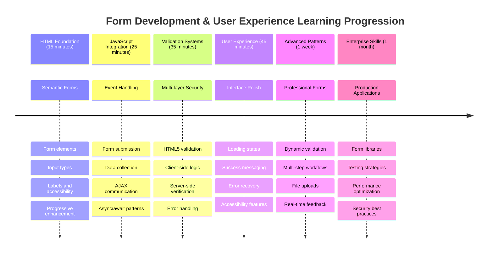
```mermaid
timeline
    title Form Development & User Experience Learning Progression
    
    section HTML Foundation (15 minutes)
        Semantic Forms: Form elements
                      : Input types
                      : Labels and accessibility
                      : Progressive enhancement
        
    section JavaScript Integration (25 minutes)
        Event Handling: Form submission
                      : Data collection
                      : AJAX communication
                      : Async/await patterns
        
    section Validation Systems (35 minutes)
        Multi-layer Security: HTML5 validation
                            : Client-side logic
                            : Server-side verification
                            : Error handling
        
    section User Experience (45 minutes)
        Interface Polish: Loading states
                        : Success messaging
                        : Error recovery
                        : Accessibility features
        
    section Advanced Patterns (1 week)
        Professional Forms: Dynamic validation
                          : Multi-step workflows
                          : File uploads
                          : Real-time feedback
        
    section Enterprise Skills (1 month)
        Production Applications: Form libraries
                               : Testing strategies
                               : Performance optimization
                               : Security best practices
```

### 🛠️ আপনার ফর্ম ডেভেলপমেন্ট টুলকিট সারাংশ

এই পাঠ সম্পন্ন করার পরে, আপনি আয়ত্ত করেছেন:
- **HTML5 ফর্ম**: সেমান্টিক গঠন, ইনপুট টাইপ এবং অ্যাক্সেসিবিলিটি বৈশিষ্ট্য
- **জাভাস্ক্রিপ্ট ফর্ম পরিচালনা**: ই
**প্রম্পট:** একটি সম্পূর্ণ ফর্ম যাচাইকরণ সিস্টেম তৈরি করুন যা নিবন্ধন ফর্মের জন্য অন্তর্ভুক্ত করে: ১) ব্যবহারকারী টাইপ করার সময় প্রতিটি ক্ষেত্রের জন্য রিয়েল-টাইম যাচাইকরণ প্রতিক্রিয়া, ২) প্রতিটি ইনপুট ক্ষেত্রের নিচে কাস্টম যাচাইকরণ বার্তা প্রদর্শন, ৩) পাসওয়ার্ড নিশ্চিতকরণ ক্ষেত্র সহ মিলানোর যাচাইকরণ, ৪) ভিজ্যুয়াল সূচক (যেমন বৈধ ক্ষেত্রের জন্য সবুজ চেকমার্ক এবং অবৈধ ক্ষেত্রের জন্য লাল সতর্কতা), ৫) একটি সাবমিট বোতাম যা শুধুমাত্র তখন সক্রিয় হয় যখন সমস্ত যাচাইকরণ পাস হয়। HTML5 যাচাইকরণ অ্যাট্রিবিউট, CSS স্টাইলিং এবং JavaScript ইন্টারেক্টিভ আচরণের জন্য ব্যবহার করুন।

[agent mode](https://code.visualstudio.com/blogs/2025/02/24/introducing-copilot-agent-mode) সম্পর্কে আরও জানুন।

## 🚀 চ্যালেঞ্জ

যদি ব্যবহারকারী ইতিমধ্যেই বিদ্যমান থাকে তবে HTML-এ একটি ত্রুটি বার্তা দেখান।

এখানে কিছু স্টাইলিং যোগ করার পরে চূড়ান্ত লগইন পৃষ্ঠার একটি উদাহরণ:

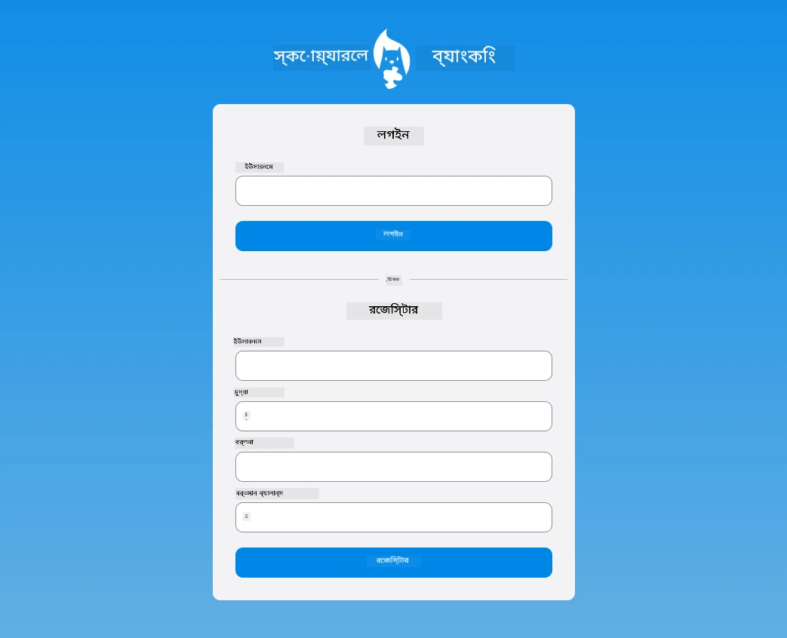

## পোস্ট-লেকচার কুইজ

[পোস্ট-লেকচার কুইজ](https://ff-quizzes.netlify.app/web/quiz/44)

## পর্যালোচনা এবং স্ব-অধ্যয়ন

ডেভেলপাররা তাদের ফর্ম তৈরির প্রচেষ্টায় খুবই সৃজনশীল হয়েছে, বিশেষ করে যাচাইকরণ কৌশলগুলির ক্ষেত্রে। [CodePen](https://codepen.io/) ঘেঁটে বিভিন্ন ফর্ম প্রবাহ সম্পর্কে জানুন; আপনি কি কিছু আকর্ষণীয় এবং অনুপ্রেরণামূলক ফর্ম খুঁজে পেতে পারেন?

## অ্যাসাইনমেন্ট

[আপনার ব্যাংক অ্যাপটি স্টাইল করুন](assignment.md)

---

**অস্বীকৃতি**:  
এই নথিটি AI অনুবাদ পরিষেবা [Co-op Translator](https://github.com/Azure/co-op-translator) ব্যবহার করে অনুবাদ করা হয়েছে। আমরা যথাসাধ্য সঠিকতার জন্য চেষ্টা করি, তবে অনুগ্রহ করে মনে রাখবেন যে স্বয়ংক্রিয় অনুবাদে ত্রুটি বা অসঙ্গতি থাকতে পারে। এর মূল ভাষায় থাকা নথিটিকে প্রামাণিক উৎস হিসেবে বিবেচনা করা উচিত। গুরুত্বপূর্ণ তথ্যের জন্য, পেশাদার মানব অনুবাদ সুপারিশ করা হয়। এই অনুবাদ ব্যবহারের ফলে কোনো ভুল বোঝাবুঝি বা ভুল ব্যাখ্যা হলে আমরা দায়বদ্ধ নই।