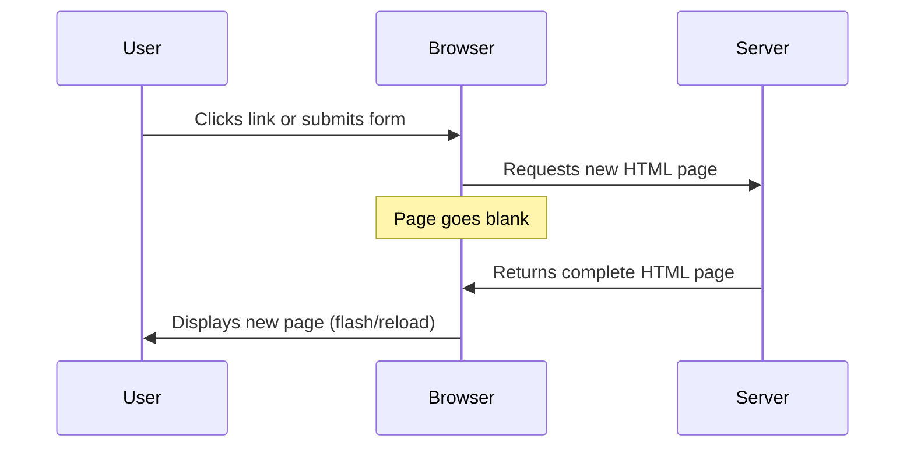
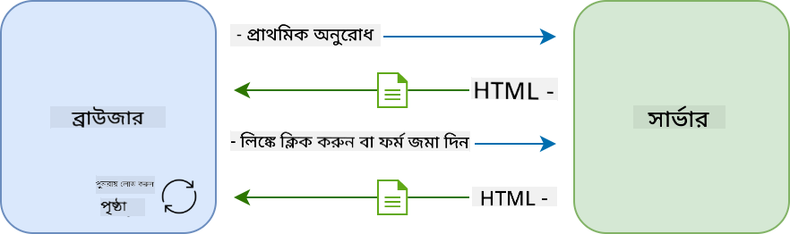
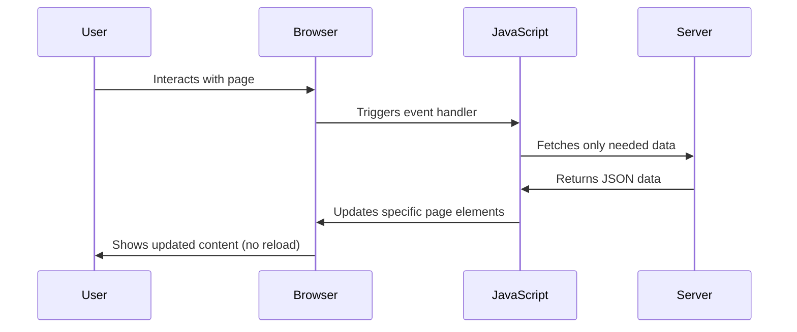
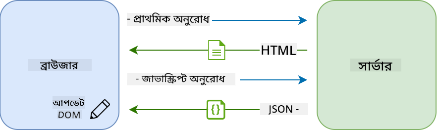
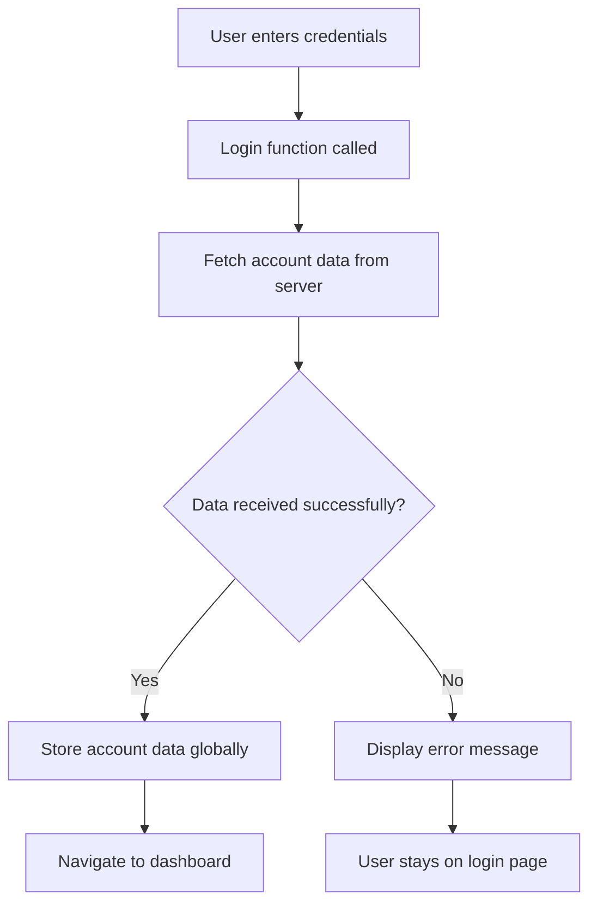
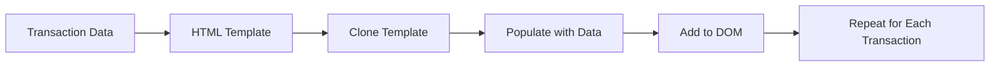
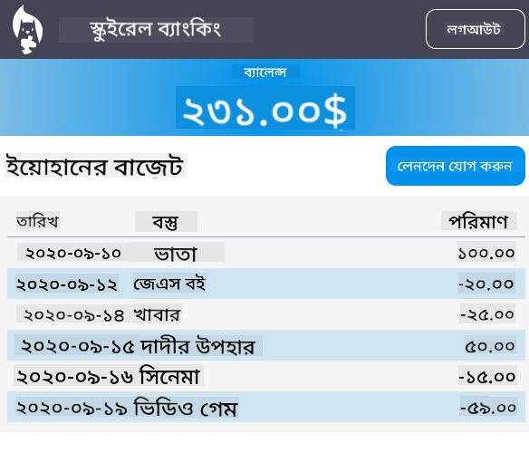

<!--
CO_OP_TRANSLATOR_METADATA:
{
  "original_hash": "2c1164912414820c8efd699b43f64954",
  "translation_date": "2025-10-22T21:51:43+00:00",
  "source_file": "7-bank-project/3-data/README.md",
  "language_code": "bn"
}
-->
# ব্যাংকিং অ্যাপ তৈরি করুন পার্ট ৩: ডেটা সংগ্রহ এবং ব্যবহারের পদ্ধতি

স্টার ট্রেকের এন্টারপ্রাইজ কম্পিউটারের কথা ভাবুন - যখন ক্যাপ্টেন পিকার্ড জাহাজের অবস্থা জানতে চান, তখন তথ্য সঙ্গে সঙ্গে প্রদর্শিত হয়, পুরো ইন্টারফেস বন্ধ হয়ে পুনরায় তৈরি না হয়ে। এই নিরবচ্ছিন্ন তথ্য প্রবাহই আমরা এখানে তৈরি করছি, ডায়নামিক ডেটা সংগ্রহের মাধ্যমে।

এই মুহূর্তে, আপনার ব্যাংকিং অ্যাপটি একটি মুদ্রিত সংবাদপত্রের মতো - তথ্যপূর্ণ কিন্তু স্থির। আমরা এটিকে নাসার মিশন কন্ট্রোলের মতো কিছুতে রূপান্তরিত করতে যাচ্ছি, যেখানে ডেটা ক্রমাগত প্রবাহিত হয় এবং রিয়েল-টাইমে আপডেট হয়, ব্যবহারকারীর কাজের প্রবাহে বাধা না দিয়ে।

আপনি শিখবেন কীভাবে সার্ভারের সাথে অ্যাসিঙ্ক্রোনাসভাবে যোগাযোগ করতে হয়, বিভিন্ন সময়ে আসা ডেটা পরিচালনা করতে হয় এবং কাঁচা তথ্যকে ব্যবহারকারীদের জন্য অর্থবহ কিছুতে রূপান্তর করতে হয়। এটি একটি ডেমো এবং প্রোডাকশন-রেডি সফটওয়্যারের মধ্যে পার্থক্য।

## প্রি-লেকচার কুইজ

[প্রি-লেকচার কুইজ](https://ff-quizzes.netlify.app/web/quiz/45)

### পূর্বশর্ত

ডেটা সংগ্রহে ডুব দেওয়ার আগে, নিশ্চিত করুন যে আপনার কাছে এই উপাদানগুলি প্রস্তুত রয়েছে:

- **পূর্ববর্তী পাঠ**: [লগইন এবং রেজিস্ট্রেশন ফর্ম](../2-forms/README.md) সম্পূর্ণ করুন - আমরা এই ভিত্তির উপর তৈরি করব
- **লোকাল সার্ভার**: [Node.js](https://nodejs.org) ইনস্টল করুন এবং [সার্ভার API চালান](../api/README.md) অ্যাকাউন্ট ডেটা সরবরাহ করতে
- **API সংযোগ**: এই কমান্ড দিয়ে আপনার সার্ভার সংযোগ পরীক্ষা করুন:

```bash
curl http://localhost:5000/api
# Expected response: "Bank API v1.0.0"
```

এই দ্রুত পরীক্ষা নিশ্চিত করে যে সমস্ত উপাদান সঠিকভাবে যোগাযোগ করছে:
- যাচাই করে যে Node.js আপনার সিস্টেমে সঠিকভাবে চলছে
- নিশ্চিত করে যে আপনার API সার্ভার সক্রিয় এবং প্রতিক্রিয়াশীল
- নিশ্চিত করে যে আপনার অ্যাপ সার্ভারে পৌঁছাতে পারে (মিশনের আগে রেডিও যোগাযোগ পরীক্ষা করার মতো)

---

## আধুনিক ওয়েব অ্যাপে ডেটা সংগ্রহের ধারণা

গত দুই দশকে ওয়েব অ্যাপ্লিকেশনগুলি ডেটা পরিচালনার পদ্ধতি নাটকীয়ভাবে বিকশিত হয়েছে। এই বিবর্তনটি বোঝা আপনাকে সাহায্য করবে কেন আধুনিক কৌশলগুলি যেমন AJAX এবং Fetch API এত শক্তিশালী এবং কেন তারা ওয়েব ডেভেলপারদের জন্য অপরিহার্য সরঞ্জাম হয়ে উঠেছে।

চলুন দেখি কীভাবে ঐতিহ্যবাহী ওয়েবসাইটগুলি কাজ করত এবং আমরা আজ যে ডায়নামিক, প্রতিক্রিয়াশীল অ্যাপ্লিকেশন তৈরি করি তার তুলনায়।

### ঐতিহ্যবাহী মাল্টি-পেজ অ্যাপ্লিকেশন (MPA)

ওয়েবের প্রথম দিকে, প্রতিটি ক্লিক ছিল একটি পুরানো টেলিভিশনে চ্যানেল পরিবর্তনের মতো - স্ক্রিনটি ফাঁকা হয়ে যেত, তারপর ধীরে ধীরে নতুন বিষয়বস্তুতে টিউন করত। এটি ছিল প্রাথমিক ওয়েব অ্যাপ্লিকেশনের বাস্তবতা, যেখানে প্রতিটি ইন্টারঅ্যাকশন মানে পুরো পৃষ্ঠাটি স্ক্র্যাচ থেকে পুনর্নির্মাণ করা।





**কেন এই পদ্ধতি ক্লান্তিকর মনে হয়েছিল:**
- প্রতিটি ক্লিক মানে পুরো পৃষ্ঠাটি স্ক্র্যাচ থেকে পুনর্নির্মাণ করা
- ব্যবহারকারীরা তাদের চিন্তার মাঝখানে বিরক্ত হয়েছিল এই বিরক্তিকর পৃষ্ঠার ঝলকানির কারণে
- আপনার ইন্টারনেট সংযোগ বারবার একই হেডার এবং ফুটার ডাউনলোড করতে অতিরিক্ত কাজ করত
- অ্যাপগুলি সফটওয়্যার ব্যবহারের চেয়ে ফাইলিং ক্যাবিনেটের মধ্য দিয়ে ক্লিক করার মতো অনুভূত হত

### আধুনিক সিঙ্গেল-পেজ অ্যাপ্লিকেশন (SPA)

AJAX (Asynchronous JavaScript and XML) পুরোপুরি এই প্যারাডাইমটি পরিবর্তন করেছে। ইন্টারন্যাশনাল স্পেস স্টেশনের মডুলার ডিজাইনের মতো, যেখানে মহাকাশচারীরা পুরো কাঠামো পুনর্নির্মাণ না করে পৃথক উপাদান প্রতিস্থাপন করতে পারে, AJAX আমাদের একটি ওয়েবপৃষ্ঠার নির্দিষ্ট অংশ আপডেট করতে দেয় পুরোটা পুনরায় লোড না করেই। যদিও নামটি XML উল্লেখ করে, আমরা আজ বেশিরভাগই JSON ব্যবহার করি, তবে মূল নীতিটি একই থাকে: শুধুমাত্র যা পরিবর্তন করতে হবে তা আপডেট করুন।





**কেন SPA ভালো লাগে:**
- শুধুমাত্র পরিবর্তিত অংশগুলি আপডেট হয় (বুদ্ধিমানের কাজ, তাই না?)
- আর বিরক্তিকর বাধা নেই - আপনার ব্যবহারকারীরা তাদের প্রবাহে থাকতে পারে
- তারের উপর কম ডেটা ভ্রমণ মানে দ্রুত লোডিং
- সবকিছু স্মার্টফোনের অ্যাপের মতো দ্রুত এবং প্রতিক্রিয়াশীল মনে হয়

### আধুনিক Fetch API-তে বিবর্তন

আধুনিক ব্রাউজারগুলি [`Fetch` API](https://developer.mozilla.org/docs/Web/API/Fetch_API) প্রদান করে, যা পুরানো [`XMLHttpRequest`](https://developer.mozilla.org/docs/Web/API/XMLHttpRequest/Using_XMLHttpRequest) প্রতিস্থাপন করে। টেলিগ্রাফ পরিচালনা এবং ইমেল ব্যবহারের মধ্যে পার্থক্যের মতো, Fetch API প্রতিশ্রুতি ব্যবহার করে পরিষ্কার অ্যাসিঙ্ক্রোনাস কোডের জন্য এবং প্রাকৃতিকভাবে JSON পরিচালনা করে।

| বৈশিষ্ট্য | XMLHttpRequest | Fetch API |
|---------|----------------|----------|
| **সিনট্যাক্স** | জটিল কলব্যাক-ভিত্তিক | পরিষ্কার প্রতিশ্রুতি-ভিত্তিক |
| **JSON পরিচালনা** | ম্যানুয়াল পার্সিং প্রয়োজন | বিল্ট-ইন `.json()` পদ্ধতি |
| **ত্রুটি পরিচালনা** | সীমিত ত্রুটি তথ্য | ব্যাপক ত্রুটি বিবরণ |
| **আধুনিক সমর্থন** | লিগ্যাসি সামঞ্জস্যতা | ES6+ প্রতিশ্রুতি এবং async/await |

> 💡 **ব্রাউজার সামঞ্জস্যতা**: ভালো খবর - Fetch API সব আধুনিক ব্রাউজারে কাজ করে! আপনি যদি নির্দিষ্ট সংস্করণ সম্পর্কে জানতে আগ্রহী হন, [caniuse.com](https://caniuse.com/fetch) সম্পূর্ণ সামঞ্জস্যতার গল্পটি রয়েছে।
> 
**মূল কথা:**
- ক্রোম, ফায়ারফক্স, সাফারি এবং এজে দুর্দান্ত কাজ করে (মূলত যেখানে আপনার ব্যবহারকারীরা থাকে)
- শুধুমাত্র ইন্টারনেট এক্সপ্লোরার অতিরিক্ত সাহায্যের প্রয়োজন (এবং সত্যি বলতে, ইআইকে বিদায় জানানোর সময় এসেছে)
- আমরা পরে ব্যবহার করব এমন মার্জিত async/await প্যাটার্নের জন্য আপনাকে পুরোপুরি প্রস্তুত করে

### ব্যবহারকারী লগইন এবং ডেটা পুনরুদ্ধার বাস্তবায়ন

এখন আসুন লগইন সিস্টেমটি বাস্তবায়ন করি যা আপনার ব্যাংকিং অ্যাপটিকে একটি স্থির প্রদর্শন থেকে একটি কার্যকরী অ্যাপ্লিকেশনে রূপান্তরিত করে। নিরাপদ সামরিক সুবিধায় ব্যবহৃত প্রমাণীকরণ প্রোটোকলের মতো, আমরা ব্যবহারকারীর শংসাপত্র যাচাই করব এবং তারপর তাদের নির্দিষ্ট ডেটাতে অ্যাক্সেস প্রদান করব।

আমরা এটি ধাপে ধাপে তৈরি করব, মৌলিক প্রমাণীকরণ দিয়ে শুরু করে এবং তারপর ডেটা সংগ্রহের ক্ষমতা যোগ করব।

#### ধাপ ১: লগইন ফাংশন ভিত্তি তৈরি করুন

আপনার `app.js` ফাইল খুলুন এবং একটি নতুন `login` ফাংশন যোগ করুন। এটি ব্যবহারকারীর প্রমাণীকরণ প্রক্রিয়া পরিচালনা করবে:

```javascript
async function login() {
  const loginForm = document.getElementById('loginForm');
  const user = loginForm.user.value;
}
```

**এটি কীভাবে কাজ করে তা ভেঙে দেখা যাক:**
- সেই `async` কীওয়ার্ড? এটি জাভাস্ক্রিপ্টকে বলছে "এই ফাংশনটি কিছু সময় অপেক্ষা করতে পারে"
- আমরা পৃষ্ঠার ফর্মটি ধরছি (কোনো ফ্যান্সি কিছু নয়, শুধু এর ID দিয়ে খুঁজছি)
- তারপর আমরা ব্যবহারকারী যা টাইপ করেছেন তা টেনে আনছি তাদের ব্যবহারকারীর নাম হিসেবে
- একটি চমৎকার কৌশল: আপনি HTML-এ `name` অ্যাট্রিবিউট ব্যবহার করে যেকোনো ফর্ম ইনপুট অ্যাক্সেস করতে পারেন - অতিরিক্ত getElementById কলের প্রয়োজন নেই!

> 💡 **ফর্ম অ্যাক্সেস প্যাটার্ন**: প্রতিটি ফর্ম কন্ট্রোলকে তার নাম (HTML-এ `name` অ্যাট্রিবিউট ব্যবহার করে সেট করা) দ্বারা ফর্ম এলিমেন্টের একটি প্রপার্টি হিসেবে অ্যাক্সেস করা যায়। এটি ফর্ম ডেটা পাওয়ার একটি পরিষ্কার, পাঠযোগ্য উপায় প্রদান করে।

#### ধাপ ২: অ্যাকাউন্ট ডেটা সংগ্রহের ফাংশন তৈরি করুন

এরপর, আমরা সার্ভার থেকে অ্যাকাউন্ট ডেটা সংগ্রহের জন্য একটি ডেডিকেটেড ফাংশন তৈরি করব। এটি আপনার রেজিস্ট্রেশন ফাংশনের মতো একই প্যাটার্ন অনুসরণ করে, তবে ডেটা সংগ্রহের উপর কেন্দ্রীভূত:

```javascript
async function getAccount(user) {
  try {
    const response = await fetch('//localhost:5000/api/accounts/' + encodeURIComponent(user));
    return await response.json();
  } catch (error) {
    return { error: error.message || 'Unknown error' };
  }
}
```

**এই কোডটি যা অর্জন করে:**
- **ব্যবহার করে** আধুনিক `fetch` API ডেটা অ্যাসিঙ্ক্রোনাসভাবে অনুরোধ করতে
- **নির্মাণ করে** একটি GET অনুরোধ URL ব্যবহারকারীর নাম প্যারামিটার সহ
- **প্রয়োগ করে** `encodeURIComponent()` URL-এ বিশেষ অক্ষর নিরাপদে পরিচালনা করতে
- **রূপান্তর করে** প্রতিক্রিয়াকে JSON ফর্ম্যাটে সহজ ডেটা ম্যানিপুলেশনের জন্য
- **ত্রুটি পরিচালনা করে** গ্রেসফুলি একটি ত্রুটি অবজেক্ট ফেরত দিয়ে ক্র্যাশ না করে

> ⚠️ **নিরাপত্তা নোট**: `encodeURIComponent()` ফাংশন URL-এ বিশেষ অক্ষর পরিচালনা করে। নৌবাহিনীর যোগাযোগ ব্যবস্থায় ব্যবহৃত এনকোডিং সিস্টেমের মতো, এটি নিশ্চিত করে যে আপনার বার্তা ঠিক যেমনটি উদ্দেশ্য ছিল তেমনই পৌঁছায়, "#" বা "&" এর মতো অক্ষরগুলি ভুলভাবে ব্যাখ্যা হওয়া থেকে রক্ষা করে।
> 
**কেন এটি গুরুত্বপূর্ণ:**
- বিশেষ অক্ষর URL ভাঙা থেকে রক্ষা করে
- URL ম্যানিপুলেশন আক্রমণ থেকে রক্ষা করে
- নিশ্চিত করে যে আপনার সার্ভার উদ্দেশ্যযুক্ত ডেটা পায়
- নিরাপদ কোডিং অনুশীলন অনুসরণ করে

#### HTTP GET অনুরোধ বোঝা

```javascript
async function login() {
  const loginForm = document.getElementById('loginForm');
  const user = loginForm.user.value;
  const data = await getAccount(user);

  if (data.error) {
    return console.log('loginError', data.error);
  }

  account = data;
  navigate('/dashboard');
}
```


#### ধাপ ৩: সবকিছু একত্রিত করা

```javascript
// This holds the current user's account data
let account = null;
```


#### ধাপ ৪: আপনার ডেটার জন্য একটি স্থান তৈরি করা

```html
<form id="loginForm" action="javascript:login()">
  <!-- Your existing form inputs -->
</form>
```


#### ধাপ ৫: আপনার ফর্মটি সংযুক্ত করুন

```javascript
// Add these lines at the end of your register function
account = result;
navigate('/dashboard');
```


#### ধাপ ৬: আপনার রেজিস্ট্রেশন ফাংশন উন্নত করুন




#### আপনার বাস্তবায়ন পরীক্ষা করা

```javascript
// The safe, reliable way to update text
const balanceElement = document.getElementById('balance');
balanceElement.textContent = account.balance;
```


#### ক্রস-অরিজিন ম্যাজিক সম্পর্কে একটি দ্রুত কথা

```javascript
// Safe way to create new elements
const transactionItem = document.createElement('div');
transactionItem.className = 'transaction-item';
transactionItem.textContent = `${transaction.date}: ${transaction.description}`;
container.append(transactionItem);
```


## HTML-এ আপনার ডেটা জীবন্ত করে তোলা

```html
<!-- This is where error messages will appear -->
<div id="loginError" role="alert"></div>
<button>Login</button>
```


### সঠিক টুল নির্বাচন

```javascript
function updateElement(id, text) {
  const element = document.getElementById(id);
  element.textContent = text;
}
```


#### টেক্সট দেখানোর নিরাপদ উপায়: textContent

```javascript
// Instead of just logging to console, show the user what's wrong
if (data.error) {
  return updateElement('loginError', data.error);
}
```


#### ডায়নামিক HTML এলিমেন্ট তৈরি করা


আরও জটিল বিষয়বস্তুতে, [`document.createElement()`](https://developer.mozilla.org/docs/Web/API/Document/createElement) এবং [`append()`](https://developer.mozilla.org/docs/Web/API/ParentNode/append) পদ্ধতি একসাথে ব্যবহার করুন:

```javascript
// Safe way to create new elements
const transactionItem = document.createElement('div');
transactionItem.className = 'transaction-item';
transactionItem.textContent = `${transaction.date}: ${transaction.description}`;
container.append(transactionItem);
```

**এই পদ্ধতিটি বোঝা:**
- **নতুন DOM উপাদান তৈরি করে** প্রোগ্রাম্যাটিকভাবে
- **সম্পূর্ণ নিয়ন্ত্রণ বজায় রাখে** উপাদানের বৈশিষ্ট্য এবং বিষয়বস্তুর উপর
- **জটিল, নেস্টেড উপাদান কাঠামো তৈরি করতে সক্ষম করে**
- **নিরাপত্তা বজায় রাখে** কাঠামো এবং বিষয়বস্তুকে আলাদা করে

> ⚠️ **নিরাপত্তা বিবেচনা**: যদিও অনেক টিউটোরিয়ালে [`innerHTML`](https://developer.mozilla.org/docs/Web/API/Element/innerHTML) ব্যবহৃত হয়, এটি এম্বেড করা স্ক্রিপ্ট কার্যকর করতে পারে। CERN-এর নিরাপত্তা প্রোটোকলের মতো যা অননুমোদিত কোড কার্যকর হওয়া থেকে রক্ষা করে, `textContent` এবং `createElement` ব্যবহার করা নিরাপদ বিকল্প প্রদান করে।
> 
**innerHTML-এর ঝুঁকি:**
- ব্যবহারকারীর ডেটায় থাকা যেকোনো `<script>` ট্যাগ কার্যকর করে
- কোড ইনজেকশন আক্রমণের জন্য ঝুঁকিপূর্ণ
- সম্ভাব্য নিরাপত্তা দুর্বলতা তৈরি করে
- আমরা যে নিরাপদ বিকল্পগুলি ব্যবহার করছি তা সমতুল্য কার্যকারিতা প্রদান করে

### ব্যবহারকারীর জন্য ত্রুটি বার্তা সহজ করা

বর্তমানে, লগইন ত্রুটিগুলি শুধুমাত্র ব্রাউজার কনসোলে প্রদর্শিত হয়, যা ব্যবহারকারীদের জন্য অদৃশ্য। এটি একটি পাইলটের অভ্যন্তরীণ ডায়াগনস্টিক এবং যাত্রী তথ্য সিস্টেমের মধ্যে পার্থক্যের মতো, আমাদের প্রাসঙ্গিক চ্যানেলের মাধ্যমে গুরুত্বপূর্ণ তথ্য যোগাযোগ করতে হবে।

দৃশ্যমান ত্রুটি বার্তা বাস্তবায়ন ব্যবহারকারীদের তাৎক্ষণিক প্রতিক্রিয়া প্রদান করে যে কী ভুল হয়েছে এবং কীভাবে এগিয়ে যেতে হবে।

#### ধাপ ১: ত্রুটি বার্তার জন্য একটি স্থান যোগ করুন

প্রথমে, আপনার HTML-এ ত্রুটি বার্তাগুলির জন্য একটি স্থান তৈরি করুন। এটি আপনার লগইন বোতামের ঠিক আগে যোগ করুন যাতে ব্যবহারকারীরা এটি স্বাভাবিকভাবে দেখতে পারেন:

```html
<!-- This is where error messages will appear -->
<div id="loginError" role="alert"></div>
<button>Login</button>
```

**এখানে কী ঘটছে:**
- আমরা একটি খালি কন্টেইনার তৈরি করছি যা প্রয়োজন না হওয়া পর্যন্ত অদৃশ্য থাকে
- এটি এমন জায়গায় স্থাপন করা হয়েছে যেখানে ব্যবহারকারীরা "লগইন" ক্লিক করার পরে স্বাভাবিকভাবে দেখেন
- স্ক্রিন রিডারের জন্য `role="alert"` একটি চমৎকার সংযোজন - এটি সহায়ক প্রযুক্তিকে বলে "এই বার্তাটি গুরুত্বপূর্ণ!"
- অনন্য `id` আমাদের জাভাস্ক্রিপ্টকে সহজ লক্ষ্য প্রদান করে

#### ধাপ ২: একটি সহায়ক হেল্পার ফাংশন তৈরি করুন

চলুন একটি ছোট ইউটিলিটি ফাংশন তৈরি করি যা যেকোনো উপাদানের টেক্সট আপডেট করতে পারে। এটি একটি "একবার লিখুন, সর্বত্র ব্যবহার করুন" ফাংশন যা আপনার সময় বাঁচাবে:

```javascript
function updateElement(id, text) {
  const element = document.getElementById(id);
  element.textContent = text;
}
```

**ফাংশনের সুবিধা:**
- শুধুমাত্র একটি উপাদান ID এবং টেক্সট বিষয়বস্তু প্রয়োজন
- নিরাপদে DOM উপাদানগুলি খুঁজে এবং আপডেট করে
- পুনরায় ব্যবহারযোগ্য প্যাটার্ন যা কোডের পুনরাবৃত্তি কমায়
- অ্যাপ্লিকেশন জুড়ে সামঞ্জস্যপূর্ণ আপডেটিং আচরণ বজায় রাখে

#### ধাপ ৩: ত্রুটি বার্তা ব্যবহারকারীদের সামনে দেখান

এখন সেই লুকানো কনসোল বার্তাটি এমন কিছু দিয়ে প্রতিস্থাপন করুন যা ব্যবহারকারীরা আসলে দেখতে পারেন। আপনার লগইন ফাংশন আপডেট করুন:

```javascript
// Instead of just logging to console, show the user what's wrong
if (data.error) {
  return updateElement('loginError', data.error);
}
```

**এই ছোট পরিবর্তনটি বড় পার্থক্য তৈরি করে:**
- ত্রুটি বার্তাগুলি ঠিক যেখানে ব্যবহারকারীরা দেখছেন সেখানে প্রদর্শিত হয়
- আর কোনো রহস্যময় নীরব ব্যর্থতা নেই
- ব্যবহারকারীরা তাৎক্ষণিক, কার্যকর প্রতিক্রিয়া পান
- আপনার অ্যাপটি আরও পেশাদার এবং চিন্তাশীল মনে হয়

এখন আপনি যখন একটি অবৈধ অ্যাকাউন্ট দিয়ে পরীক্ষা করবেন, তখন আপনি পৃষ্ঠায় একটি সহায়ক ত্রুটি বার্তা দেখতে পাবেন!


#### ধাপ ৪: অ্যাক্সেসিবিলিটির সাথে অন্তর্ভুক্তিমূলক হওয়া

আমরা আগে যে `role="alert"` যোগ করেছি তার একটি চমৎকার দিক হল এটি শুধুমাত্র সাজসজ্জা নয়! এই ছোট অ্যাট্রিবিউটটি একটি [লাইভ রিজিয়ন](https://developer.mozilla.org/docs/Web/Accessibility/ARIA/ARIA_Live_Regions) তৈরি করে যা স্ক্রিন রিডারগুলিতে পরিবর্তনগুলি তাত্ক্ষণিকভাবে ঘোষণা করে:

```html
<div id="loginError" role="alert"></div>
```

**কেন এটি গুরুত্বপূর্ণ:**
- স্ক্রিন রিডার ব্যবহারকারীরা ত্রুটি বার্তাটি প্রদর্শিত হওয়ার সাথে সাথে শুনতে পান
- সবাই গুরুত্বপূর্ণ তথ্য পায়, তারা যেভাবে নেভিগেট করুক না কেন
- এটি আপনার অ্যাপটি আরও মানুষের জন্য কাজ করার একটি সহজ উপায়
- অন্তর্ভুক্তিমূলক অভিজ্ঞতা তৈরি করার জন্য আপনার যত্ন দেখায়

এ ধরনের ছোট ছোট স্পর্শ ভালো ডেভেলপারদের মহান থেকে আলাদা করে!

#### ধাপ ৫: রেজিস্ট্রেশনে একই প্যাটার্ন প্রয়োগ করুন

সঙ্গতি বজায় রাখতে, আপনার রেজিস্ট্রেশন ফর্মে একই ত্রুটি পরিচালনা বাস্তবায়ন করুন:

1. **যোগ করুন** একটি ত্রুটি প্রদর্শন উপাদান আপনার রেজিস্ট্রেশন HTML-এ:
```html
<div id="registerError" role="alert"></div>
```

2. **আপডেট করুন** আপনার রেজিস্টার ফাংশন একই ত্রুটি প্রদর্শন প্যাটার্ন ব্যবহার করতে:
```javascript
if (data.error) {
  return updateElement('registerError', data.error);
}
```

**সঙ্গতিপূর্ণ ত্রুটি পরিচালনার সুবিধা:**
- **একটি অভিন্ন ব্যবহারকারীর অভিজ্ঞতা প্রদান করে** সমস্ত ফর্ম জুড়ে
- **পরিচিত প্যাটার্ন ব্যবহার করে** জ্ঞানীয় চাপ কমায়
- **পুনরায় ব্যবহারযোগ্য কোড দিয়ে রক্ষণাবেক্ষণ সহজ করে**
- **অ্যাপ জুড়ে অ্যাক্সেসিবিলিটি মান বজায় রাখে**

## আপনার ডায়নামিক ড্যাশবোর্ড তৈরি করা

এখন আমরা আপনার স্ট্যাটিক ড্যাশবোর্ডকে একটি ডায়নামিক ইন্টারফেসে রূপান্তর করব যা প্রকৃত অ্যাকাউন্ট ডেটা প্রদর্শন করে। এটি একটি মুদ্রিত ফ্লাইট সময়সূচী এবং বিমানবন্দরের লাইভ ডিপারচার বোর্ডের মধ্যে পার্থক্যের মতো, আমরা স্ট্যাটিক তথ্য থেকে রিয়েল-টাইম, প্রতিক্রিয়াশীল প্রদর্শনে যাচ্ছি।

আপনি যে DOM ম্যানিপুলেশন কৌশলগুলি শিখেছেন তা ব্যবহার করে, আমরা একটি ড্যাশবোর্ড তৈরি করব যা বর্তমান অ্যাকাউন্ট তথ্যের সাথে স্বয়ংক্রিয়ভাবে আপডেট হয়।

### আপনার ডেটা সম্পর্কে জানা

আমরা তৈরি শুরু করার আগে, আপনার সার্ভার কী ধরনের ডেটা ফেরত পাঠায় তা দেখে নেওয়া যাক। যখন কেউ সফলভাবে লগইন করে, তখন আপনি যে তথ্যের ভাণ্ডারটি নিয়ে কাজ করতে পারেন তা এখানে:

```json
{
  "user": "test",
  "currency": "$",
  "description": "Test account",
  "balance": 75,
  "transactions": [
    { "id": "1", "date": "2020-10-01", "object": "Pocket money", "amount": 50 },
    { "id": "2", "date": "2020-10-03", "object": "Book", "amount": -10 },
    { "id": "3", "date": "2020-10-04", "object": "Sandwich", "amount": -5 }
  ]
}
```

**এই ডেটা কাঠামো প্রদান করে:**
- **`user`**: অভিজ্ঞতাকে ব্যক্তিগতকরণ করার জন্য উপযুক্ত ("আবার স্বাগতম, Sarah!")
- **`currency`**: নিশ্চিত করে যে আমরা সঠিকভাবে অর্থের পরিমাণ প্রদর্শন করছি
- **`description`**: অ্যাকাউন্টের জন্য একটি বন্ধুত্বপূর্ণ নাম
- **`balance`**: অত্যন্ত গুরুত্বপূর্ণ বর্তমান ব্যালেন্স
- **`transactions`**: সম্পূর্ণ লেনদেনের ইতিহাস সমস্ত বিবরণ সহ

আপনার একটি পেশাদার-দেখা ব্যাংকিং ড্যাশবোর্ড তৈরি করার জন্য প্রয়োজনীয় সবকিছু!

> 💡 **প্রো টিপ**: আপনার ড্যাশবোর্ডটি তাত্ক্ষণিকভাবে কাজ করতে দেখতে চান? লগইন করার সময় `test` ব্যবহারকারীর নাম ব্যবহার করুন - এটি নমুনা ডেটা সহ প্রি-লোড করা থাকে যাতে আপনি প্রথমে লেনদেন তৈরি না করেই সবকিছু কাজ করতে দেখতে পারেন।
> 
**কেন টেস্ট অ্যাকাউন্টটি সুবিধাজনক:**
- ইতিমধ্যেই লোড করা বাস্তবসম্মত নমুনা ডেটা সহ আসে
- লেনদেনগুলি কীভাবে প্রদর্শিত হয় তা দেখার জন্য উপযুক্ত
- আপনার ড্যাশবোর্ড বৈশিষ্ট্যগুলি পরীক্ষা করার জন্য দুর্দান্ত
- আপনাকে ম্যানুয়ালি ডামি ডেটা তৈরি করা থেকে বাঁচায়

### ড্যাশবোর্ড প্রদর্শন উপাদান তৈরি করা

চলুন ধাপে ধাপে আপনার ড্যাশবোর্ড ইন্টারফেস তৈরি করি, অ্যাকাউন্ট সারাংশ তথ্য দিয়ে শুরু করে এবং তারপরে লেনদেনের তালিকার মতো আরও জটিল বৈশিষ্ট্যগুলিতে এগিয়ে যাই।

#### ধাপ ১: আপনার HTML কাঠামো আপডেট করুন

প্রথমে, স্ট্যাটিক "Balance" বিভাগটি ডায়নামিক প্লেসহোল্ডার উপাদানগুলির সাথে প্রতিস্থাপন করুন যা আপনার জাভাস্ক্রিপ্ট পূরণ করতে পারে:

```html
<section>
  Balance: <span id="balance"></span><span id="currency"></span>
</section>
```

এরপর, অ্যাকাউন্ট বিবরণের জন্য একটি বিভাগ যোগ করুন। যেহেতু এটি ড্যাশবোর্ড বিষয়বস্তুর জন্য একটি শিরোনাম হিসাবে কাজ করে, সেমান্টিক HTML ব্যবহার করুন:

```html
<h2 id="description"></h2>
```

**HTML কাঠামো বোঝা:**
- **ব্যবহার করে** পৃথক `<span>` উপাদান ব্যালেন্স এবং কারেন্সির জন্য পৃথক নিয়ন্ত্রণের জন্য
- **প্রয়োগ করে** প্রতিটি উপাদানের জন্য অনন্য ID জাভাস্ক্রিপ্ট টার্গেটিংয়ের জন্য
- **সেমান্টিক HTML অনুসরণ করে** অ্যাকাউন্ট বিবরণের জন্য `<h2>` ব্যবহার করে
- **স্ক্রিন রিডার এবং SEO-এর জন্য** একটি যৌক্তিক শ্রেণিবিন্যাস তৈরি করে

> ✅ **অ্যাক্সেসিবিলিটি অন্তর্দৃষ্টি**: অ্যাকাউন্ট বিবরণটি ড্যাশবোর্ড বিষয়বস্তুর জন্য একটি শিরোনাম হিসাবে কাজ করে, তাই এটি সেমান্টিকভাবে একটি শিরোনাম হিসাবে চিহ্নিত করা হয়েছে। [শিরোনাম কাঠামো](https://www.nomensa.com/blog/2017/how-structure-headings-web-accessibility) কীভাবে অ্যাক্সেসিবিলিটিকে প্রভাবিত করে সে সম্পর্কে আরও জানুন। আপনার পৃষ্ঠায় অন্যান্য উপাদানগুলি চিহ্নিত করতে পারেন যা শিরোনাম ট্যাগ থেকে উপকৃত হতে পারে?

#### ধাপ ২: ড্যাশবোর্ড আপডেট ফাংশন তৈরি করুন

এখন একটি ফাংশন তৈরি করুন যা আপনার ড্যাশবোর্ডকে প্রকৃত অ্যাকাউন্ট ডেটা দিয়ে পূরণ করে:

```javascript
function updateDashboard() {
  if (!account) {
    return navigate('/login');
  }

  updateElement('description', account.description);
  updateElement('balance', account.balance.toFixed(2));
  updateElement('currency', account.currency);
}
```

**ধাপে ধাপে, এই ফাংশনটি যা করে:**
- **যাচাই করে** যে অ্যাকাউন্ট ডেটা বিদ্যমান আছে কিনা
- **পুনঃনির্দেশ করে** অননুমোদিত ব্যবহারকারীদের লগইন পৃষ্ঠায়
- **আপডেট করে** পুনরায় ব্যবহারযোগ্য `updateElement` ফাংশন ব্যবহার করে অ্যাকাউন্ট বিবরণ
- **ফরম্যাট করে** ব্যালেন্স সর্বদা দুই দশমিক স্থান দেখানোর জন্য
- **প্রদর্শন করে** উপযুক্ত কারেন্সি সিম্বল

> 💰 **অর্থ ফরম্যাটিং**: [`toFixed(2)`](https://developer.mozilla.org/docs/Web/JavaScript/Reference/Global_Objects/Number/toFixed) পদ্ধতিটি একটি জীবনরক্ষাকারী! এটি নিশ্চিত করে যে আপনার ব্যালেন্স সর্বদা বাস্তব অর্থের মতো দেখায় - "75.00" শুধুমাত্র "75" নয়। আপনার ব্যবহারকারীরা পরিচিত কারেন্সি ফরম্যাটিং দেখতে পছন্দ করবেন।

#### ধাপ ৩: নিশ্চিত করুন যে আপনার ড্যাশবোর্ড আপডেট হচ্ছে

যাতে কেউ আপনার ড্যাশবোর্ডে প্রবেশ করার সময় এটি সর্বদা বর্তমান ডেটা সহ রিফ্রেশ হয়, আমাদের আপনার নেভিগেশন সিস্টেমে হুক করতে হবে। আপনি যদি [পাঠ ১ অ্যাসাইনমেন্ট](../1-template-route/assignment.md) সম্পূর্ণ করে থাকেন, এটি পরিচিত মনে হবে। যদি না করেন, চিন্তা করবেন না - এখানে যা দরকার তা রয়েছে:

আপনার `updateRoute()` ফাংশনের শেষে এটি যোগ করুন:

```javascript
if (typeof route.init === 'function') {
  route.init();
}
```

তারপর আপনার রুটগুলি আপডেট করুন যাতে ড্যাশবোর্ড ইনিশিয়ালাইজেশন অন্তর্ভুক্ত থাকে:

```javascript
const routes = {
  '/login': { templateId: 'login' },
  '/dashboard': { templateId: 'dashboard', init: updateDashboard }
};
```

**এই চতুর সেটআপটি যা করে:**
- যাচাই করে যে কোনো রুটে বিশেষ ইনিশিয়ালাইজেশন কোড আছে কিনা
- সেই কোডটি স্বয়ংক্রিয়ভাবে চালায় যখন রুট লোড হয়
- নিশ্চিত করে যে আপনার ড্যাশবোর্ড সর্বদা নতুন, বর্তমান ডেটা দেখায়
- আপনার রাউটিং লজিক পরিষ্কার এবং সংগঠিত রাখে

#### আপনার ড্যাশবোর্ড পরীক্ষা করা

এই পরিবর্তনগুলি বাস্তবায়নের পরে, আপনার ড্যাশবোর্ড পরীক্ষা করুন:

1. **লগইন করুন** একটি টেস্ট অ্যাকাউন্ট দিয়ে
2. **যাচাই করুন** যে আপনি ড্যাশবোর্ডে পুনঃনির্দেশিত হচ্ছেন
3. **পরীক্ষা করুন** যে অ্যাকাউন্ট বিবরণ, ব্যালেন্স এবং কারেন্সি সঠিকভাবে প্রদর্শিত হচ্ছে
4. **লগআউট এবং পুনরায় লগইন করার চেষ্টা করুন** নিশ্চিত করতে যে ডেটা সঠিকভাবে রিফ্রেশ হচ্ছে

আপনার ড্যাশবোর্ড এখন লগইন করা ব্যবহারকারীর ডেটার উপর ভিত্তি করে ডায়নামিক অ্যাকাউন্ট তথ্য প্রদর্শন করবে!

## টেমপ্লেট দিয়ে স্মার্ট লেনদেনের তালিকা তৈরি করা

প্রতিটি লেনদেনের জন্য ম্যানুয়ালি HTML তৈরি করার পরিবর্তে, আমরা টেমপ্লেট ব্যবহার করব যা স্বয়ংক্রিয়ভাবে সামঞ্জস্যপূর্ণ ফরম্যাটিং তৈরি করে। মহাকাশযান তৈরিতে ব্যবহৃত স্ট্যান্ডার্ডাইজড উপাদানের মতো, টেমপ্লেট নিশ্চিত করে যে প্রতিটি লেনদেনের সারি একই কাঠামো এবং চেহারা অনুসরণ করে।

এই কৌশলটি কয়েকটি লেনদেন থেকে হাজার হাজার পর্যন্ত দক্ষতার সাথে স্কেল করে, সামঞ্জস্যপূর্ণ কর্মক্ষমতা এবং উপস্থাপনা বজায় রাখে।



### ধাপ ১: লেনদেনের টেমপ্লেট তৈরি করুন

প্রথমে, আপনার HTML `<body>`-এ লেনদেনের সারির জন্য একটি পুনরায় ব্যবহারযোগ্য টেমপ্লেট যোগ করুন:

```html
<template id="transaction">
  <tr>
    <td></td>
    <td></td>
    <td></td>
  </tr>
</template>
```

**HTML টেমপ্লেট বোঝা:**
- **একটি টেবিল সারির জন্য কাঠামো সংজ্ঞায়িত করে**
- **অদৃশ্য থাকে** যতক্ষণ না এটি ক্লোন এবং জাভাস্ক্রিপ্ট দিয়ে পূরণ করা হয়
- **তিনটি সেল অন্তর্ভুক্ত করে** তারিখ, বিবরণ এবং পরিমাণের জন্য
- **সামঞ্জস্যপূর্ণ ফরম্যাটিংয়ের জন্য** একটি পুনরায় ব্যবহারযোগ্য প্যাটার্ন প্রদান করে

### ধাপ ২: ডায়নামিক বিষয়বস্তুর জন্য আপনার টেবিল প্রস্তুত করুন

পরবর্তী, আপনার টেবিল বডিতে একটি `id` যোগ করুন যাতে জাভাস্ক্রিপ্ট সহজে লক্ষ্য করতে পারে:

```html
<tbody id="transactions"></tbody>
```

**এটি যা অর্জন করে:**
- **একটি স্পষ্ট লক্ষ্য তৈরি করে** লেনদেনের সারি সন্নিবেশ করার জন্য
- **টেবিল কাঠামোকে আলাদা করে** ডায়নামিক বিষয়বস্তুর থেকে
- **লেনদেনের ডেটা সহজে পরিষ্কার এবং পুনরায় পূরণ করতে সক্ষম করে**

### ধাপ ৩: লেনদেনের সারি তৈরির ফ্যাক্টরি ফাংশন তৈরি করুন

এখন একটি ফাংশন তৈরি করুন যা লেনদেনের ডেটাকে HTML উপাদানে রূপান্তর করে:

```javascript
function createTransactionRow(transaction) {
  const template = document.getElementById('transaction');
  const transactionRow = template.content.cloneNode(true);
  const tr = transactionRow.querySelector('tr');
  tr.children[0].textContent = transaction.date;
  tr.children[1].textContent = transaction.object;
  tr.children[2].textContent = transaction.amount.toFixed(2);
  return transactionRow;
}
```

**এই ফ্যাক্টরি ফাংশনটি বিশ্লেষণ:**
- **টেমপ্লেট উপাদানটি পুনরুদ্ধার করে** তার ID দ্বারা
- **টেমপ্লেট বিষয়বস্তু ক্লোন করে** নিরাপদে ম্যানিপুলেশনের জন্য
- **ক্লোন করা বিষয়বস্তুর মধ্যে টেবিল সারি নির্বাচন করে**
- **প্রতিটি সেল লেনদেনের ডেটা দিয়ে পূরণ করে**
- **পরিমাণ ফরম্যাট করে** সঠিক দশমিক স্থান দেখানোর জন্য
- **সম্পূর্ণ সারি ফেরত দেয়** সন্নিবেশের জন্য প্রস্তুত

### ধাপ ৪: দক্ষতার সাথে একাধিক লেনদেনের সারি তৈরি করুন

আপনার `updateDashboard()` ফাংশনে এই কোডটি যোগ করুন সমস্ত লেনদেন প্রদর্শন করতে:

```javascript
const transactionsRows = document.createDocumentFragment();
for (const transaction of account.transactions) {
  const transactionRow = createTransactionRow(transaction);
  transactionsRows.appendChild(transactionRow);
}
updateElement('transactions', transactionsRows);
```

**এই দক্ষ পদ্ধতিটি বোঝা:**
- **একটি ডকুমেন্ট ফ্র্যাগমেন্ট তৈরি করে** ব্যাচ DOM অপারেশনের জন্য
- **অ্যাকাউন্ট ডেটার সমস্ত লেনদেনের মাধ্যমে পুনরাবৃত্তি করে**
- **ফ্যাক্টরি ফাংশন ব্যবহার করে** প্রতিটি লেনদেনের জন্য একটি সারি তৈরি করে
- **ফ্র
**প্রম্পট:** ব্যাংকিং অ্যাপের জন্য একটি সার্চ ফাংশনালিটি তৈরি করুন, যা অন্তর্ভুক্ত করবে: ১) একটি সার্চ ফর্ম যেখানে তারিখের পরিসীমা (থেকে/পর্যন্ত), ন্যূনতম/সর্বোচ্চ পরিমাণ এবং লেনদেনের বিবরণের কীওয়ার্ডের জন্য ইনপুট ফিল্ড থাকবে, ২) একটি `filterTransactions()` ফাংশন যা অ্যাকাউন্টের `transactions` অ্যারে সার্চ ক্রাইটেরিয়া অনুযায়ী ফিল্টার করবে, ৩) `updateDashboard()` ফাংশন আপডেট করুন যাতে ফিল্টার করা ফলাফল দেখানো যায়, এবং ৪) একটি "Clear Filters" বোতাম যোগ করুন যা ভিউ রিসেট করবে। আধুনিক জাভাস্ক্রিপ্ট অ্যারে মেথড যেমন `filter()` ব্যবহার করুন এবং খালি সার্চ ক্রাইটেরিয়ার জন্য এজ কেসগুলো হ্যান্ডেল করুন।

[এজেন্ট মোড](https://code.visualstudio.com/blogs/2025/02/24/introducing-copilot-agent-mode) সম্পর্কে আরও জানুন এখানে।

## 🚀 চ্যালেঞ্জ

আপনার ব্যাংকিং অ্যাপকে পরবর্তী স্তরে নিয়ে যেতে প্রস্তুত? এটি এমন কিছুতে রূপান্তরিত করুন যা আপনি সত্যিই ব্যবহার করতে চান। এখানে কিছু আইডিয়া দেওয়া হলো যা আপনার সৃজনশীলতাকে উজ্জীবিত করতে পারে:

**এটি সুন্দর করুন**: CSS স্টাইলিং যোগ করুন যাতে আপনার কার্যকরী ড্যাশবোর্ডটি ভিজ্যুয়ালি আকর্ষণীয় হয়ে ওঠে। পরিষ্কার লাইন, ভালো স্পেসিং, এবং সম্ভব হলে কিছু সূক্ষ্ম অ্যানিমেশন যোগ করুন।

**এটি রেসপন্সিভ করুন**: [মিডিয়া কোয়েরি](https://developer.mozilla.org/docs/Web/CSS/Media_Queries) ব্যবহার করে একটি [রেসপন্সিভ ডিজাইন](https://developer.mozilla.org/docs/Web/Progressive_web_apps/Responsive/responsive_design_building_blocks) তৈরি করার চেষ্টা করুন যা ফোন, ট্যাবলেট এবং ডেস্কটপে চমৎকারভাবে কাজ করবে। আপনার ব্যবহারকারীরা আপনাকে ধন্যবাদ জানাবে!

**কিছু আকর্ষণ যোগ করুন**: লেনদেনগুলোকে রঙ দিয়ে কোডিং করুন (আয় এর জন্য সবুজ, ব্যয়ের জন্য লাল), আইকন যোগ করুন, অথবা হোভার ইফেক্ট তৈরি করুন যা ইন্টারফেসকে ইন্টারঅ্যাকটিভ মনে করাবে।

একটি পরিপাটি ড্যাশবোর্ড দেখতে এমন হতে পারে:



এটি ঠিক একই রকম করার প্রয়োজন নেই - এটি অনুপ্রেরণা হিসেবে ব্যবহার করুন এবং নিজের মতো করে তৈরি করুন!

## পোস্ট-লেকচার কুইজ

[পোস্ট-লেকচার কুইজ](https://ff-quizzes.netlify.app/web/quiz/46)

## অ্যাসাইনমেন্ট

[আপনার কোড রিফ্যাক্টর করুন এবং মন্তব্য যোগ করুন](assignment.md)

---

**অস্বীকৃতি**:  
এই নথিটি AI অনুবাদ পরিষেবা [Co-op Translator](https://github.com/Azure/co-op-translator) ব্যবহার করে অনুবাদ করা হয়েছে। আমরা যথাসাধ্য সঠিকতার জন্য চেষ্টা করি, তবে অনুগ্রহ করে মনে রাখবেন যে স্বয়ংক্রিয় অনুবাদে ত্রুটি বা অসঙ্গতি থাকতে পারে। মূল ভাষায় থাকা নথিটিকে প্রামাণিক উৎস হিসেবে বিবেচনা করা উচিত। গুরুত্বপূর্ণ তথ্যের জন্য, পেশাদার মানব অনুবাদ সুপারিশ করা হয়। এই অনুবাদ ব্যবহারের ফলে কোনো ভুল বোঝাবুঝি বা ভুল ব্যাখ্যার জন্য আমরা দায়ী থাকব না।