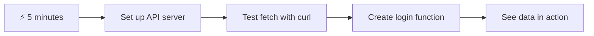
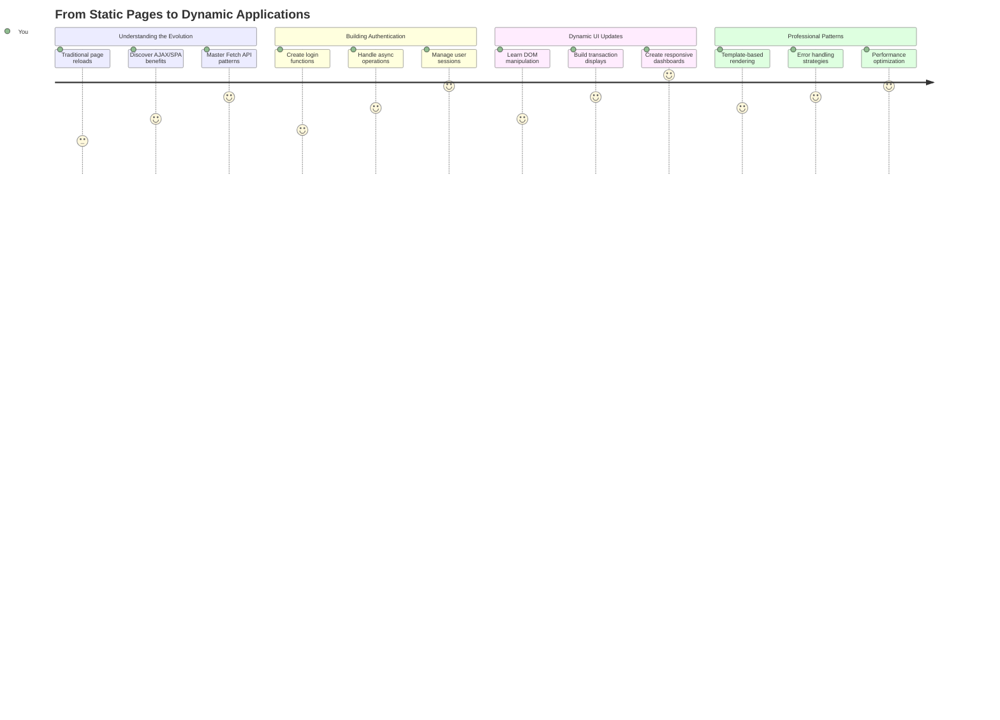
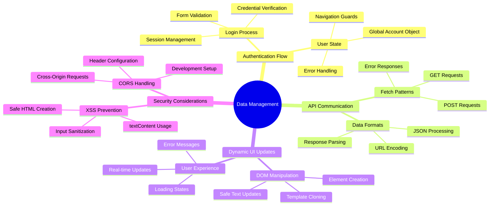
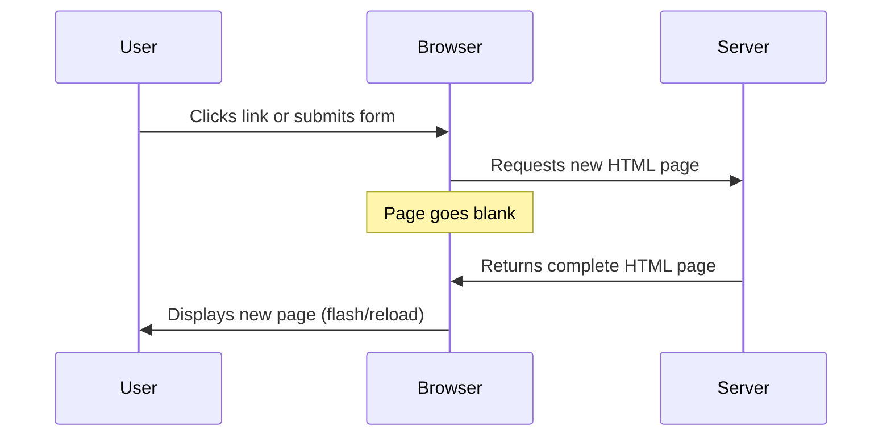
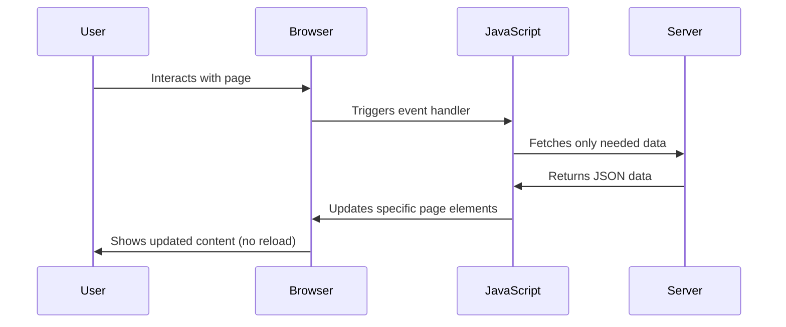
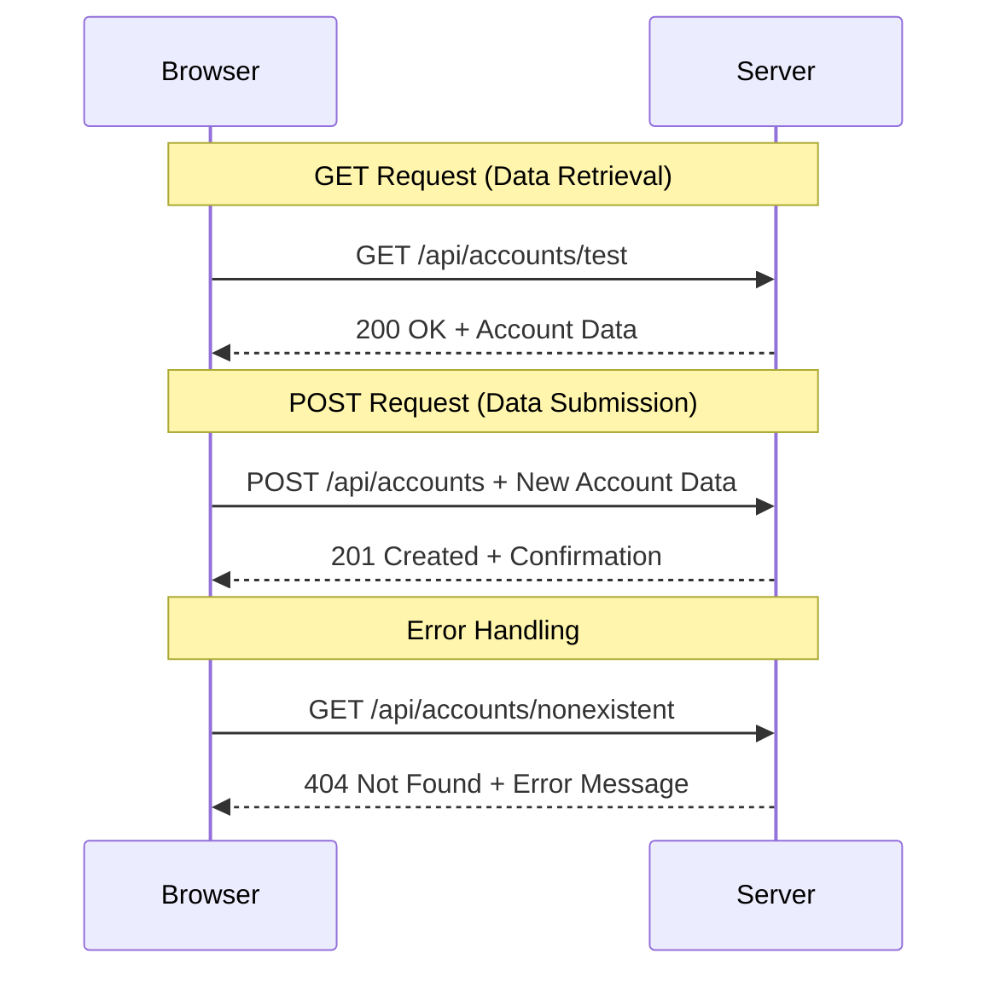
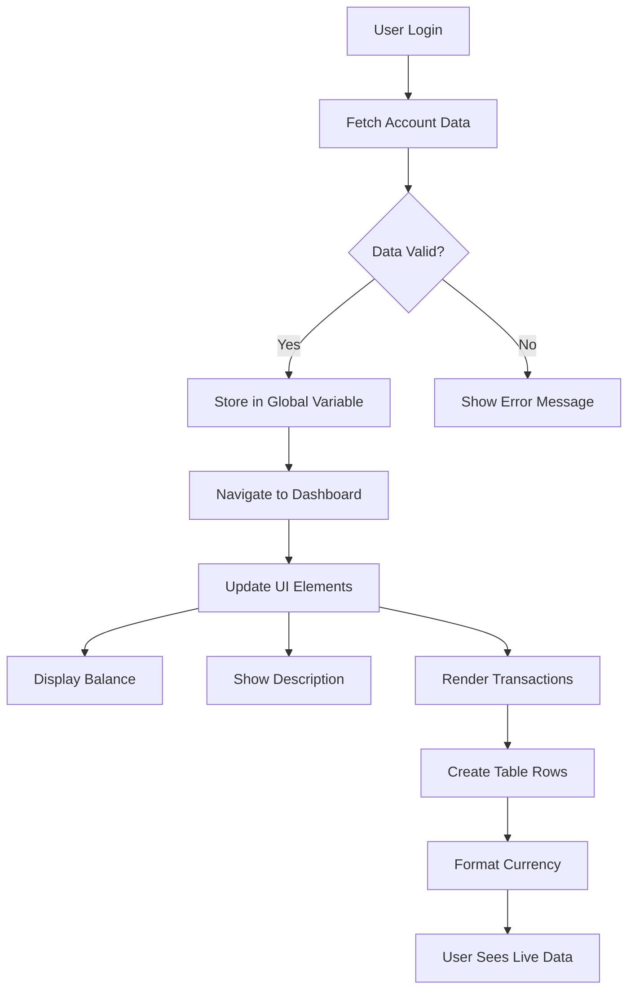
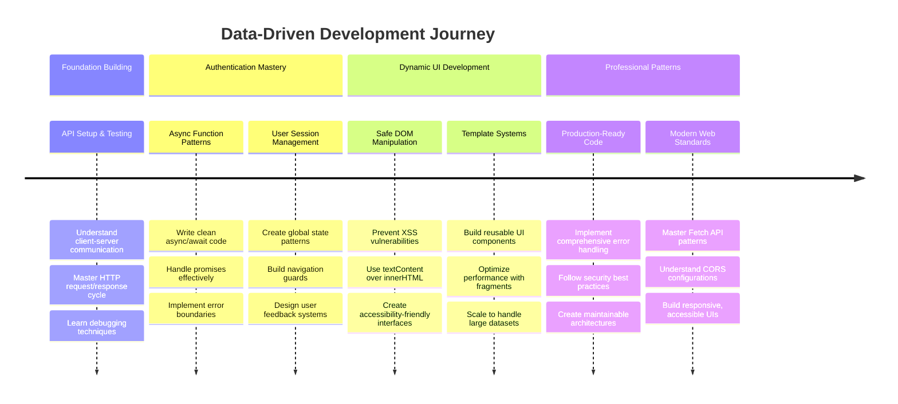

<!--
CO_OP_TRANSLATOR_METADATA:
{
  "original_hash": "86ee5069f27ea3151389d8687c95fac9",
  "translation_date": "2025-11-03T22:50:01+00:00",
  "source_file": "7-bank-project/3-data/README.md",
  "language_code": "bn"
}
-->
# ব্যাংকিং অ্যাপ তৈরি করুন পার্ট ৩: ডেটা সংগ্রহ এবং ব্যবহার করার পদ্ধতি

স্টার ট্রেকের এন্টারপ্রাইজ কম্পিউটারের কথা ভাবুন - যখন ক্যাপ্টেন পিকার্ড জাহাজের অবস্থা জানতে চান, তথ্য সঙ্গে সঙ্গে প্রদর্শিত হয়, পুরো ইন্টারফেস বন্ধ হয়ে পুনরায় তৈরি না হয়ে। এই নিরবচ্ছিন্ন তথ্য প্রবাহই আমরা এখানে তৈরি করছি, ডায়নামিক ডেটা ফেচিংয়ের মাধ্যমে।

এই মুহূর্তে, আপনার ব্যাংকিং অ্যাপটি একটি মুদ্রিত সংবাদপত্রের মতো - তথ্যপূর্ণ কিন্তু স্থির। আমরা এটিকে NASA-এর মিশন কন্ট্রোলের মতো কিছুতে রূপান্তরিত করতে যাচ্ছি, যেখানে ডেটা ক্রমাগত প্রবাহিত হয় এবং রিয়েল-টাইমে আপডেট হয়, ব্যবহারকারীর কাজের প্রবাহে বাধা না দিয়ে।

আপনি শিখবেন কীভাবে সার্ভারের সাথে অ্যাসিঙ্ক্রোনাসভাবে যোগাযোগ করতে হয়, বিভিন্ন সময়ে আগত ডেটা পরিচালনা করতে হয় এবং কাঁচা তথ্যকে ব্যবহারকারীদের জন্য অর্থবহ কিছুতে রূপান্তর করতে হয়। এটি একটি ডেমো এবং প্রোডাকশন-রেডি সফটওয়্যারের মধ্যে পার্থক্য।

## ⚡ পরবর্তী ৫ মিনিটে আপনি যা করতে পারেন

**ব্যস্ত ডেভেলপারদের জন্য দ্রুত শুরু করার পথ**



- **মিনিট ১-২**: আপনার API সার্ভার চালু করুন (`cd api && npm start`) এবং সংযোগ পরীক্ষা করুন
- **মিনিট ৩**: `getAccount()` ফাংশন তৈরি করুন `fetch` ব্যবহার করে
- **মিনিট ৪**: লগইন ফর্মটি `action="javascript:login()"` দিয়ে সংযুক্ত করুন
- **মিনিট ৫**: লগইন পরীক্ষা করুন এবং কনসোলে অ্যাকাউন্ট ডেটা প্রদর্শিত হতে দেখুন

**দ্রুত পরীক্ষা কমান্ড**:
```bash
# Verify API is running
curl http://localhost:5000/api

# Test account data fetch
curl http://localhost:5000/api/accounts/test
```

**কেন এটি গুরুত্বপূর্ণ**: ৫ মিনিটে, আপনি অ্যাসিঙ্ক্রোনাস ডেটা ফেচিংয়ের জাদু দেখতে পাবেন যা প্রতিটি আধুনিক ওয়েব অ্যাপ্লিকেশনকে চালিত করে। এটি সেই ভিত্তি যা অ্যাপগুলোকে প্রতিক্রিয়াশীল এবং জীবন্ত মনে করায়।

## 🗺️ ডেটা-চালিত ওয়েব অ্যাপ্লিকেশনগুলির মাধ্যমে আপনার শেখার যাত্রা



**আপনার যাত্রার গন্তব্য**: এই পাঠের শেষে, আপনি বুঝতে পারবেন কীভাবে আধুনিক ওয়েব অ্যাপ্লিকেশনগুলি ডেটা সংগ্রহ, প্রক্রিয়াকরণ এবং গতিশীলভাবে প্রদর্শন করে, পেশাদার অ্যাপ্লিকেশন থেকে আমরা যে নিরবচ্ছিন্ন ব্যবহারকারীর অভিজ্ঞতা আশা করি তা তৈরি করে।

## প্রাক-লেকচার কুইজ

[প্রাক-লেকচার কুইজ](https://ff-quizzes.netlify.app/web/quiz/45)

### পূর্বশর্ত

ডেটা ফেচিংয়ে প্রবেশ করার আগে, নিশ্চিত করুন যে আপনার কাছে এই উপাদানগুলি প্রস্তুত রয়েছে:

- **পূর্ববর্তী পাঠ**: [লগইন এবং রেজিস্ট্রেশন ফর্ম](../2-forms/README.md) সম্পূর্ণ করুন - আমরা এই ভিত্তির উপর তৈরি করব
- **লোকাল সার্ভার**: [Node.js](https://nodejs.org) ইনস্টল করুন এবং [সার্ভার API চালান](../api/README.md) অ্যাকাউন্ট ডেটা সরবরাহ করতে
- **API সংযোগ**: এই কমান্ড দিয়ে আপনার সার্ভার সংযোগ পরীক্ষা করুন:

```bash
curl http://localhost:5000/api
# Expected response: "Bank API v1.0.0"
```

এই দ্রুত পরীক্ষা নিশ্চিত করে যে সমস্ত উপাদান সঠিকভাবে যোগাযোগ করছে:
- যাচাই করে যে Node.js আপনার সিস্টেমে সঠিকভাবে চলছে
- নিশ্চিত করে যে আপনার API সার্ভার সক্রিয় এবং প্রতিক্রিয়াশীল
- নিশ্চিত করে যে আপনার অ্যাপটি সার্ভারে পৌঁছাতে পারে (মিশনের আগে রেডিও যোগাযোগ পরীক্ষা করার মতো)

## 🧠 ডেটা ম্যানেজমেন্ট ইকোসিস্টেমের ওভারভিউ



**মূল নীতি**: আধুনিক ওয়েব অ্যাপ্লিকেশনগুলি ডেটা সমন্বয় ব্যবস্থা - তারা ব্যবহারকারীর ইন্টারফেস, সার্ভার API এবং ব্রাউজার সিকিউরিটি মডেলের মধ্যে সমন্বয় করে নিরবচ্ছিন্ন, প্রতিক্রিয়াশীল অভিজ্ঞতা তৈরি করে।

---

## আধুনিক ওয়েব অ্যাপে ডেটা ফেচিং বোঝা

ওয়েব অ্যাপ্লিকেশনগুলি ডেটা পরিচালনা করার পদ্ধতি গত দুই দশকে নাটকীয়ভাবে বিকশিত হয়েছে। এই বিবর্তন বোঝা আপনাকে সাহায্য করবে কেন আধুনিক কৌশল যেমন AJAX এবং Fetch API এত শক্তিশালী এবং কেন তারা ওয়েব ডেভেলপারদের জন্য অপরিহার্য টুল হয়ে উঠেছে।

চলুন দেখি কীভাবে ঐতিহ্যবাহী ওয়েবসাইট কাজ করত এবং আজ আমরা যে গতিশীল, প্রতিক্রিয়াশীল অ্যাপ্লিকেশন তৈরি করি তার তুলনা করি।

### ঐতিহ্যবাহী মাল্টি-পেজ অ্যাপ্লিকেশন (MPA)

ওয়েবের শুরুর দিনগুলোতে, প্রতিটি ক্লিক ছিল পুরনো টেলিভিশনে চ্যানেল পরিবর্তনের মতো - স্ক্রিনটি ফাঁকা হয়ে যেত, তারপর ধীরে ধীরে নতুন কন্টেন্টে টিউন করত। এটি ছিল প্রাথমিক ওয়েব অ্যাপ্লিকেশনের বাস্তবতা, যেখানে প্রতিটি ইন্টারঅ্যাকশন মানে পুরো পৃষ্ঠাটি স্ক্র্যাচ থেকে পুনর্নির্মাণ করা।




**কেন এই পদ্ধতি ক্লান্তিকর মনে হয়েছিল:**
- প্রতিটি ক্লিক মানে পুরো পৃষ্ঠাটি স্ক্র্যাচ থেকে পুনর্নির্মাণ করা
- ব্যবহারকারীরা তাদের চিন্তার মাঝখানে বিরক্ত হতেন সেই বিরক্তিকর পৃষ্ঠার ফ্ল্যাশ দ্বারা
- আপনার ইন্টারনেট সংযোগ বারবার একই হেডার এবং ফুটার ডাউনলোড করতে কাজ করত
- অ্যাপগুলো সফটওয়্যার ব্যবহারের চেয়ে ফাইলিং ক্যাবিনেটের মধ্য দিয়ে ক্লিক করার মতো মনে হত

### আধুনিক সিঙ্গেল-পেজ অ্যাপ্লিকেশন (SPA)

AJAX (Asynchronous JavaScript and XML) পুরোপুরি এই প্যারাডাইমটি পরিবর্তন করেছে। যেমন আন্তর্জাতিক স্পেস স্টেশনের মডুলার ডিজাইন, যেখানে মহাকাশচারীরা পুরো কাঠামো পুনর্নির্মাণ না করে পৃথক উপাদান প্রতিস্থাপন করতে পারেন, AJAX আমাদের একটি ওয়েবপৃষ্ঠার নির্দিষ্ট অংশ আপডেট করতে দেয় পুরোটা রিলোড না করেই। যদিও নামটি XML উল্লেখ করে, আমরা আজ বেশিরভাগই JSON ব্যবহার করি, তবে মূল নীতিটি একই থাকে: শুধুমাত্র যা পরিবর্তন করতে হবে তা আপডেট করুন।




**কেন SPA-গুলো এত ভালো লাগে:**
- শুধুমাত্র যা পরিবর্তন হয়েছে তা আপডেট হয় (বুদ্ধিমানের কাজ, তাই না?)
- আর বিরক্তিকর বাধা নেই - আপনার ব্যবহারকারীরা তাদের প্রবাহে থাকে
- তারের উপর কম ডেটা ভ্রমণ মানে দ্রুত লোডিং
- সবকিছু স্মার্ট এবং প্রতিক্রিয়াশীল মনে হয়, আপনার ফোনের অ্যাপগুলোর মতো

### আধুনিক Fetch API-তে বিবর্তন

আধুনিক ব্রাউজারগুলি [`Fetch` API](https://developer.mozilla.org/docs/Web/API/Fetch_API) প্রদান করে, যা পুরনো [`XMLHttpRequest`](https://developer.mozilla.org/docs/Web/API/XMLHttpRequest/Using_XMLHttpRequest) প্রতিস্থাপন করে। টেলিগ্রাফ পরিচালনা করার এবং ইমেল ব্যবহার করার মধ্যে পার্থক্যের মতো, Fetch API প্রতিশ্রুতি ব্যবহার করে পরিষ্কার অ্যাসিঙ্ক্রোনাস কোডের জন্য এবং প্রাকৃতিকভাবে JSON পরিচালনা করে।

| বৈশিষ্ট্য | XMLHttpRequest | Fetch API |
|---------|----------------|----------|
| **সিনট্যাক্স** | জটিল কলব্যাক-ভিত্তিক | পরিষ্কার প্রতিশ্রুতি-ভিত্তিক |
| **JSON পরিচালনা** | ম্যানুয়াল পার্সিং প্রয়োজন | বিল্ট-ইন `.json()` পদ্ধতি |
| **ত্রুটি পরিচালনা** | সীমিত ত্রুটি তথ্য | ব্যাপক ত্রুটি বিবরণ |
| **আধুনিক সমর্থন** | লিগ্যাসি সামঞ্জস্যতা | ES6+ প্রতিশ্রুতি এবং async/await |

> 💡 **ব্রাউজার সামঞ্জস্যতা**: ভালো খবর - Fetch API সমস্ত আধুনিক ব্রাউজারে কাজ করে! আপনি যদি নির্দিষ্ট সংস্করণ সম্পর্কে জানতে আগ্রহী হন, [caniuse.com](https://caniuse.com/fetch) সম্পূর্ণ সামঞ্জস্যতার গল্পটি রয়েছে।
> 
**মূল কথা:**
- Chrome, Firefox, Safari এবং Edge-এ দুর্দান্ত কাজ করে (মূলত যেখানে আপনার ব্যবহারকারীরা থাকে)
- শুধুমাত্র Internet Explorer অতিরিক্ত সাহায্যের প্রয়োজন (এবং সত্যি বলতে, IE-কে বিদায় জানানোর সময় এসেছে)
- আপনাকে পরবর্তী সময়ে আমরা ব্যবহার করব এমন মার্জিত async/await প্যাটার্নের জন্য পুরোপুরি প্রস্তুত করে

### ব্যবহারকারী লগইন এবং ডেটা পুনরুদ্ধার বাস্তবায়ন

এখন আসুন লগইন সিস্টেমটি বাস্তবায়ন করি যা আপনার ব্যাংকিং অ্যাপটিকে একটি স্থির প্রদর্শন থেকে একটি কার্যকরী অ্যাপ্লিকেশনে রূপান্তরিত করে। যেমন নিরাপদ সামরিক সুবিধায় ব্যবহৃত প্রমাণীকরণ প্রোটোকল, আমরা ব্যবহারকারীর পরিচয় যাচাই করব এবং তারপর তাদের নির্দিষ্ট ডেটা অ্যাক্সেস প্রদান করব।

আমরা এটি ধাপে ধাপে তৈরি করব, মৌলিক প্রমাণীকরণ দিয়ে শুরু করে তারপর ডেটা-ফেচিং ক্ষমতা যোগ করব।

#### ধাপ ১: লগইন ফাংশনের ভিত্তি তৈরি করুন

আপনার `app.js` ফাইল খুলুন এবং একটি নতুন `login` ফাংশন যোগ করুন। এটি ব্যবহারকারীর প্রমাণীকরণ প্রক্রিয়া পরিচালনা করবে:

```javascript
async function login() {
  const loginForm = document.getElementById('loginForm');
  const user = loginForm.user.value;
}
```

**এটি কীভাবে কাজ করে তা ভেঙে দেখা যাক:**
- `async` কীওয়ার্ডটি জাভাস্ক্রিপ্টকে বলে "এই ফাংশনটি কিছু সময় অপেক্ষা করতে পারে"
- আমরা পৃষ্ঠার ফর্মটি খুঁজছি (কিছু ফ্যান্সি নয়, শুধু এর ID দ্বারা এটি খুঁজছি)
- তারপর আমরা ব্যবহারকারী যা টাইপ করেছেন তা বের করছি তাদের ইউজারনেম হিসেবে
- একটি চমৎকার কৌশল: আপনি HTML-এ `name` অ্যাট্রিবিউট ব্যবহার করে যেকোনো ফর্ম ইনপুট অ্যাক্সেস করতে পারেন - অতিরিক্ত getElementById কলের প্রয়োজন নেই!

> 💡 **ফর্ম অ্যাক্সেস প্যাটার্ন**: প্রতিটি ফর্ম কন্ট্রোলকে তার নাম (HTML-এ `name` অ্যাট্রিবিউট ব্যবহার করে সেট করা) দ্বারা ফর্ম এলিমেন্টের একটি প্রপার্টি হিসেবে অ্যাক্সেস করা যায়। এটি ফর্ম ডেটা পাওয়ার একটি পরিষ্কার, পাঠযোগ্য উপায় প্রদান করে।

#### ধাপ ২: অ্যাকাউন্ট ডেটা ফেচিং ফাংশন তৈরি করুন

পরবর্তী, আমরা সার্ভার থেকে অ্যাকাউন্ট ডেটা পুনরুদ্ধার করতে একটি ডেডিকেটেড ফাংশন তৈরি করব। এটি আপনার রেজিস্ট্রেশন ফাংশনের মতো একই প্যাটার্ন অনুসরণ করে কিন্তু ডেটা পুনরুদ্ধারে ফোকাস করে:

```javascript
async function getAccount(user) {
  try {
    const response = await fetch('//localhost:5000/api/accounts/' + encodeURIComponent(user));
    return await response.json();
  } catch (error) {
    return { error: error.message || 'Unknown error' };
  }
}
```

**এই কোডটি যা অর্জন করে:**
- **ব্যবহার করে** আধুনিক `fetch` API ডেটা অ্যাসিঙ্ক্রোনাসভাবে অনুরোধ করতে
- **গঠন করে** ইউজারনেম প্যারামিটার সহ একটি GET অনুরোধ URL
- **প্রয়োগ করে** `encodeURIComponent()` বিশেষ অক্ষরগুলি URL-এ নিরাপদে পরিচালনা করতে
- **রূপান্তর করে** প্রতিক্রিয়াটি JSON ফরম্যাটে সহজ ডেটা ম্যানিপুলেশনের জন্য
- **গ্রেসফুলি পরিচালনা করে** ত্রুটি, ক্র্যাশ না করে একটি ত্রুটি অবজেক্ট ফেরত দিয়ে

> ⚠️ **নিরাপত্তা নোট**: `encodeURIComponent()` ফাংশন URL-এ বিশেষ অক্ষর পরিচালনা করে। নৌবাহিনীর যোগাযোগ ব্যবস্থার মতো, এটি নিশ্চিত করে যে আপনার বার্তা ঠিক যেমনটি উদ্দেশ্য ছিল তেমনই পৌঁছায়, "#" বা "&" এর মতো অক্ষরগুলি ভুলভাবে ব্যাখ্যা হওয়া থেকে রক্ষা করে।
> 
**কেন এটি গুরুত্বপূর্ণ:**
- বিশেষ অক্ষরগুলি URL ভাঙা থেকে রক্ষা করে
- URL ম্যানিপুলেশন আক্রমণ থেকে রক্ষা করে
- নিশ্চিত করে যে আপনার সার্ভার উদ্দেশ্যযুক্ত ডেটা পায়
- নিরাপদ কোডিং অনুশীলন অনুসরণ করে

#### HTTP GET অনুরোধ বোঝা

আপনাকে অবাক করতে পারে: যখন আপনি `fetch` অতিরিক্ত অপশন ছাড়াই ব্যবহার করেন, এটি স্বয়ংক্রিয়ভাবে একটি [`GET`](https://developer.mozilla.org/docs/Web/HTTP/Methods/GET) অনুরোধ তৈরি করে। এটি আমাদের জন্য নিখুঁত - সার্ভারকে জিজ্ঞাসা করা "এই ব্যবহারকারীর অ্যাকাউন্ট ডেটা দেখতে পারি?"

GET অনুরোধগুলি লাইব্রেরি থেকে একটি বই ধার করার মতো - আপনি এমন কিছু দেখতে অনুরোধ করছেন যা ইতিমধ্যে বিদ্যমান। POST অনুরোধগুলি (যা আমরা রেজিস্ট্রেশনের জন্য ব্যবহার করেছি) নতুন বই জমা দেওয়ার মতো।

| GET অনুরোধ | POST অনুরোধ |
|-------------|-------------|
| **উদ্দেশ্য** | বিদ্যমান ডেটা পুনরুদ্ধার | সার্ভারে নতুন ডেটা পাঠানো |
| **প্যারামিটার** | URL পাথ/কোয়েরি স্ট্রিং-এ | অনুরোধ বডিতে |
| **ক্যাশিং** | ব্রাউজার দ্বারা ক্যাশ করা যেতে পারে | সাধারণত ক্যাশ করা হয় না |
| **নিরাপত্তা** | URL/লগে দৃশ্যমান | অনুরোধ বডিতে লুকানো |



#### ধাপ ৩: সবকিছু একসাথে নিয়ে আসা

এখন সন্তোষজনক অংশ - আসুন আপনার অ্যাকাউন্ট ফেচিং ফাংশনটি লগইন প্রক্রিয়ার সাথে সংযুক্ত করি। এখানেই সবকিছু একত্রিত হয়:

```javascript
async function login() {
  const loginForm = document.getElementById('loginForm');
  const user = loginForm.user.value;
  const data = await getAccount(user);

  if (data.error) {
    return console.log('loginError', data.error);
  }

  account = data;
  navigate('/dashboard');
}
```

এই ফাংশনটি একটি পরিষ্কার ক্রম অনুসরণ করে:
- ফর্ম ইনপুট থেকে ইউজারনেম বের করে
- সার্ভার থেকে ব্যবহারকারীর অ্যাকাউন্ট ডেটা অনুরোধ করে
- প্রক্রিয়ার সময় ঘটে যাওয়া যেকোনো ত্রুটি পরিচালনা করে
- অ্যাকাউন্ট ডেটা সংরক্ষণ করে এবং সফলতার পরে ড্যাশবোর্ডে নেভিগেট করে

> 🎯 **Async/Await প্যাটার্ন**: যেহেতু `getAccount` একটি অ্যাসিঙ্ক্রোনাস ফাংশন, আমরা `await` কীওয়ার্ড ব্যবহার করি সার্ভারের প্রতিক্রিয়া না আসা পর্যন্ত কার্যক্রম থামানোর জন্য। এটি কোডটিকে অনির্ধারিত ডেটা দিয়ে চালিয়ে যাওয়া থেকে রক্ষা করে।

#### ধাপ ৪: আপনার ডেটার জন্য একটি স্থান তৈরি করা

আপনার অ্যাপটি অ্যাকাউন্ট তথ্য লোড হওয়ার পরে এটি মনে রাখার জন্য কোথাও প্রয়োজন। এটি আপনার অ্যাপের স্বল্পমেয়াদী স্মৃতির মতো - বর্তমান ব্যবহারকারীর ডেটা সহজে রাখার একটি স্থান। আপনার `app.js` ফাইলের শীর্ষে এই লাইনটি যোগ করুন:

```javascript
// This holds the current user's account data
let account = null;
```

**কেন এটি প্রয়োজন:**
- অ্যাপের যেকোনো জায়গা থেকে অ্যাকাউন্ট ডেটা অ্যাক্সেসযোগ্য রাখে
- `null` দিয়ে শুরু করা মানে "এখনও কেউ লগইন করেনি"
- সফল লগইন বা রেজিস্ট্রেশনের সময় আপডেট হয়
- একটি একক সত্যের উৎস হিসেবে কাজ করে - কে লগইন করেছে তা নিয়ে কোনো বিভ্রান্তি নেই

#### ধাপ ৫: আপনার ফর্মটি সংযুক্ত করুন

এখন আসুন আপনার নতুন লগইন ফাংশনটি আপনার HTML ফর্মের সাথে সংযুক্ত করি। আপনার ফর্ম ট্যাগটি এইভাবে আপডেট করুন:

```html
<form id="loginForm" action="javascript:login()">
  <!-- Your existing form inputs -->
</form>
```

**এই ছোট পরিবর্তনটি যা করে:**
- ফর্মটিকে তার ডিফল্ট "পুরো পৃষ্ঠাটি পুনরায় লোড করুন" আচরণ বন্ধ করে দেয়
- পরিবর্তে আপনার কাস্টম জাভাস্ক্রিপ্ট ফাংশন কল করে
- সবকিছু মসৃণ এবং সিঙ্গেল-পেজ-অ্যাপের মতো রাখে
- ব্যবহারকারীরা "লগইন" চাপলে কী ঘটে তা নিয়ে আপনাকে সম্পূর্ণ নিয়ন্ত্রণ দেয়

#### ধাপ ৬: আপনার রেজিস্ট্রেশন ফাংশন উন্নত করুন

সঙ্গতি বজায় রাখতে, আপনার `register` ফাংশনটি আপডেট করুন যাতে এটি অ্যাকাউন্ট ডেটা সংরক্ষণ করে এবং ড্যাশবোর্ডে নেভিগেট করে:

```javascript
// Add these lines at the end of your register function
account = result;
navigate('/dashboard');
```

**এই উন্নতি প্রদান করে:**
- **নিরবচ্ছিন্ন** রেজিস্ট্রেশন থেকে ড্যাশবোর্ডে ট্রানজিশন
- **সঙ্গতিপূর্ণ** লগইন এবং রেজিস্ট্রেশন প্রবাহের মধ্যে ব্যবহারকারীর অভিজ্ঞতা
- **তাৎক্ষণিক** সফল রেজিস্ট্রেশনের পরে অ্যাকাউন্ট ডেটা অ্যাক্সেস

#### আপনার বাস্তবায়ন পরীক্ষা করা

@@
DOM ম্যানিপুলেশন হল একটি কৌশল যা স্থির ওয়েব পৃষ্ঠাগুলিকে গতিশীল অ্যাপ্লিকেশনে রূপান্তরিত করে, যা ব্যবহারকারীর ইন্টারঅ্যাকশন এবং সার্ভার প্রতিক্রিয়ার ভিত্তিতে তাদের বিষয়বস্তু আপডেট করে।

### কাজের জন্য সঠিক টুল নির্বাচন করা

আপনার HTML-কে জাভাস্ক্রিপ্ট দিয়ে আপডেট করার সময়, আপনার কাছে বেশ কয়েকটি বিকল্প রয়েছে। এগুলোকে টুলবক্সের বিভিন্ন সরঞ্জামের মতো ভাবুন - প্রতিটি নির্দিষ্ট কাজের জন্য উপযুক্ত:

| পদ্ধতি | এটি কীসের জন্য ভালো | কখন ব্যবহার করবেন | নিরাপত্তার স্তর |
|--------|---------------------|----------------|--------------|
| `textContent` | ব্যবহারকারীর ডেটা নিরাপদে প্রদর্শন করা | যখনই আপনি টেক্সট দেখাচ্ছেন | ✅ অত্যন্ত নিরাপদ |
| `createElement()` + `append()` | জটিল লেআউট তৈরি করা | নতুন সেকশন/লিস্ট তৈরি করা | ✅ সম্পূর্ণ নিরাপদ |
| `innerHTML` | HTML বিষয়বস্তু সেট করা | ⚠️ এটি এড়িয়ে চলুন | ❌ ঝুঁকিপূর্ণ |

#### টেক্সট দেখানোর নিরাপদ উপায়: textContent

[`textContent`](https://developer.mozilla.org/docs/Web/API/Node/textContent) প্রপার্টি ব্যবহারকারীর ডেটা প্রদর্শনের জন্য আপনার সেরা বন্ধু। এটি আপনার ওয়েবপেজের জন্য একজন নিরাপত্তা রক্ষীর মতো - ক্ষতিকারক কিছুই প্রবেশ করতে পারে না:

```javascript
// The safe, reliable way to update text
const balanceElement = document.getElementById('balance');
balanceElement.textContent = account.balance;
```

**textContent-এর সুবিধা:**
- সবকিছুকে সাধারণ টেক্সট হিসেবে বিবেচনা করে (স্ক্রিপ্ট কার্যকর হওয়া থেকে রক্ষা করে)
- বিদ্যমান বিষয়বস্তু স্বয়ংক্রিয়ভাবে পরিষ্কার করে
- সাধারণ টেক্সট আপডেটের জন্য দক্ষ
- ক্ষতিকারক বিষয়বস্তু থেকে স্বয়ংক্রিয়ভাবে সুরক্ষা প্রদান করে

#### গতিশীল HTML উপাদান তৈরি করা

আরও জটিল বিষয়বস্তু জন্য, [`document.createElement()`](https://developer.mozilla.org/docs/Web/API/Document/createElement) এবং [`append()`](https://developer.mozilla.org/docs/Web/API/ParentNode/append) পদ্ধতি একত্রিত করুন:

```javascript
// Safe way to create new elements
const transactionItem = document.createElement('div');
transactionItem.className = 'transaction-item';
transactionItem.textContent = `${transaction.date}: ${transaction.description}`;
container.append(transactionItem);
```

**এই পদ্ধতির বোঝাপড়া:**
- প্রোগ্রাম্যাটিকভাবে নতুন DOM উপাদান তৈরি করে
- উপাদানের বৈশিষ্ট্য এবং বিষয়বস্তু সম্পূর্ণ নিয়ন্ত্রণে রাখে
- জটিল, নেস্টেড উপাদান কাঠামো তৈরি করতে সক্ষম
- বিষয়বস্তু থেকে কাঠামো আলাদা করে নিরাপত্তা বজায় রাখে

> ⚠️ **নিরাপত্তা বিবেচনা**: যদিও [`innerHTML`](https://developer.mozilla.org/docs/Web/API/Element/innerHTML) অনেক টিউটোরিয়ালে দেখা যায়, এটি এম্বেড করা স্ক্রিপ্ট কার্যকর করতে পারে। CERN-এর নিরাপত্তা প্রোটোকলের মতো যা অননুমোদিত কোড কার্যকর হওয়া থেকে রক্ষা করে, `textContent` এবং `createElement` ব্যবহার করা নিরাপদ বিকল্প প্রদান করে।
> 
**innerHTML-এর ঝুঁকি:**
- ব্যবহারকারীর ডেটায় থাকা `<script>` ট্যাগ কার্যকর করে
- কোড ইনজেকশন আক্রমণের জন্য ঝুঁকিপূর্ণ
- সম্ভাব্য নিরাপত্তা দুর্বলতা তৈরি করে
- আমরা যে নিরাপদ বিকল্পগুলি ব্যবহার করছি তা সমতুল্য কার্যকারিতা প্রদান করে

### ব্যবহারকারীর জন্য ত্রুটি বার্তা সহজ করা

বর্তমানে, লগইন ত্রুটি শুধুমাত্র ব্রাউজারের কনসোলে প্রদর্শিত হয়, যা ব্যবহারকারীদের কাছে অদৃশ্য। পাইলটের অভ্যন্তরীণ ডায়াগনস্টিক এবং যাত্রী তথ্য সিস্টেমের মধ্যে পার্থক্যের মতো, আমাদের প্রাসঙ্গিক চ্যানেলের মাধ্যমে গুরুত্বপূর্ণ তথ্য যোগাযোগ করতে হবে।

দৃশ্যমান ত্রুটি বার্তা বাস্তবায়ন ব্যবহারকারীদের তাৎক্ষণিক প্রতিক্রিয়া প্রদান করে যে কী ভুল হয়েছে এবং কীভাবে এগিয়ে যেতে হবে।

#### ধাপ ১: ত্রুটি বার্তার জন্য একটি স্থান যোগ করুন

প্রথমে, আপনার HTML-এ ত্রুটি বার্তার জন্য একটি স্থান তৈরি করুন। এটি আপনার লগইন বোতামের ঠিক আগে যোগ করুন যাতে ব্যবহারকারীরা এটি স্বাভাবিকভাবে দেখতে পারে:

```html
<!-- This is where error messages will appear -->
<div id="loginError" role="alert"></div>
<button>Login</button>
```

**এখানে কী ঘটছে:**
- আমরা একটি খালি কন্টেইনার তৈরি করছি যা প্রয়োজন না হওয়া পর্যন্ত অদৃশ্য থাকে
- এটি এমন জায়গায় স্থাপন করা হয়েছে যেখানে ব্যবহারকারীরা "লগইন" ক্লিক করার পরে স্বাভাবিকভাবে দেখবে
- স্ক্রিন রিডারের জন্য `role="alert"` একটি চমৎকার সংযোজন - এটি সহায়ক প্রযুক্তিকে বলে "এইটা গুরুত্বপূর্ণ!"
- অনন্য `id` আমাদের জাভাস্ক্রিপ্টকে সহজ লক্ষ্য প্রদান করে

#### ধাপ ২: একটি সহায়ক হেল্পার ফাংশন তৈরি করুন

চলুন একটি ছোট ইউটিলিটি ফাংশন তৈরি করি যা যেকোনো উপাদানের টেক্সট আপডেট করতে পারে। এটি একটি "একবার লিখুন, সর্বত্র ব্যবহার করুন" ফাংশন যা আপনার সময় বাঁচাবে:

```javascript
function updateElement(id, text) {
  const element = document.getElementById(id);
  element.textContent = text;
}
```

**ফাংশনের সুবিধা:**
- শুধুমাত্র একটি উপাদানের ID এবং টেক্সট বিষয়বস্তু প্রয়োজন
- নিরাপদে DOM উপাদানগুলি খুঁজে এবং আপডেট করে
- পুনরায় ব্যবহারযোগ্য প্যাটার্ন যা কোডের পুনরাবৃত্তি কমায়
- অ্যাপ্লিকেশনের জুড়ে সামঞ্জস্যপূর্ণ আপডেটিং আচরণ বজায় রাখে

#### ধাপ ৩: ব্যবহারকারীরা যেখানে দেখতে পাবে সেখানে ত্রুটি দেখান

এখন সেই লুকানো কনসোল বার্তাটি এমন কিছু দিয়ে প্রতিস্থাপন করুন যা ব্যবহারকারীরা আসলে দেখতে পারে। আপনার লগইন ফাংশন আপডেট করুন:

```javascript
// Instead of just logging to console, show the user what's wrong
if (data.error) {
  return updateElement('loginError', data.error);
}
```

**এই ছোট পরিবর্তনটি বড় পার্থক্য তৈরি করে:**
- ত্রুটি বার্তা ব্যবহারকারীরা যেখানে দেখছে ঠিক সেখানেই প্রদর্শিত হয়
- আর কোনো রহস্যময় নীরব ব্যর্থতা নেই
- ব্যবহারকারীরা তাৎক্ষণিক, কার্যকর প্রতিক্রিয়া পায়
- আপনার অ্যাপটি আরও পেশাদার এবং চিন্তাশীল মনে হয়

এখন আপনি যখন একটি অবৈধ অ্যাকাউন্ট দিয়ে পরীক্ষা করবেন, আপনি পৃষ্ঠায় একটি সহায়ক ত্রুটি বার্তা দেখতে পাবেন!


#### ধাপ ৪: অ্যাক্সেসিবিলিটির সাথে অন্তর্ভুক্তিমূলক হওয়া

আমরা আগে যে `role="alert"` যোগ করেছি তার একটি চমৎকার দিক হল এটি শুধুমাত্র সাজসজ্জা নয়! এই ছোট অ্যাট্রিবিউটটি একটি [লাইভ রিজিয়ন](https://developer.mozilla.org/docs/Web/Accessibility/ARIA/ARIA_Live_Regions) তৈরি করে যা স্ক্রিন রিডারগুলিতে পরিবর্তনগুলি তৎক্ষণাৎ ঘোষণা করে:

```html
<div id="loginError" role="alert"></div>
```

**কেন এটি গুরুত্বপূর্ণ:**
- স্ক্রিন রিডার ব্যবহারকারীরা ত্রুটি বার্তা প্রদর্শিত হওয়ার সাথে সাথে শুনতে পায়
- সবাই গুরুত্বপূর্ণ তথ্য পায়, তারা যেভাবেই নেভিগেট করুক না কেন
- এটি আপনার অ্যাপটি আরও মানুষের জন্য কাজ করার একটি সহজ উপায়
- অন্তর্ভুক্তিমূলক অভিজ্ঞতা তৈরি করার জন্য আপনার যত্ন দেখায়

এ ধরনের ছোট ছোট স্পর্শ ভালো ডেভেলপারদের মহান থেকে আলাদা করে!

### 🎯 শিক্ষামূলক চেক-ইন: প্রমাণীকরণ প্যাটার্ন

**থামুন এবং চিন্তা করুন**: আপনি মাত্র একটি সম্পূর্ণ প্রমাণীকরণ প্রবাহ বাস্তবায়ন করেছেন। এটি ওয়েব ডেভেলপমেন্টে একটি মৌলিক প্যাটার্ন।

**দ্রুত আত্মমূল্যায়ন**:
- আপনি API কলের জন্য async/await কেন ব্যবহার করি তা ব্যাখ্যা করতে পারেন?
- যদি আমরা `encodeURIComponent()` ফাংশনটি ভুলে যাই তবে কী হবে?
- আমাদের ত্রুটি পরিচালনা কীভাবে ব্যবহারকারীর অভিজ্ঞতা উন্নত করে?

**বাস্তব জীবনের সংযোগ**: আপনি এখানে যে প্যাটার্নগুলি শিখেছেন (async ডেটা ফেচিং, ত্রুটি পরিচালনা, ব্যবহারকারীর প্রতিক্রিয়া) প্রতিটি প্রধান ওয়েব অ্যাপ্লিকেশনে ব্যবহৃত হয়, যেমন সোশ্যাল মিডিয়া প্ল্যাটফর্ম থেকে ই-কমার্স সাইট। আপনি প্রোডাকশন-লেভেলের দক্ষতা তৈরি করছেন!

**চ্যালেঞ্জ প্রশ্ন**: আপনি কীভাবে এই প্রমাণীকরণ সিস্টেমটি একাধিক ব্যবহারকারীর ভূমিকা (গ্রাহক, অ্যাডমিন, টেলার) পরিচালনা করতে সংশোধন করবেন? প্রয়োজনীয় ডেটা কাঠামো এবং UI পরিবর্তনগুলি সম্পর্কে চিন্তা করুন।

#### ধাপ ৫: রেজিস্ট্রেশনে একই প্যাটার্ন প্রয়োগ করুন

সঙ্গতি বজায় রাখতে, আপনার রেজিস্ট্রেশন ফর্মে একই ত্রুটি পরিচালনা বাস্তবায়ন করুন:

1. **যোগ করুন** একটি ত্রুটি প্রদর্শন উপাদান আপনার রেজিস্ট্রেশন HTML-এ:
```html
<div id="registerError" role="alert"></div>
```

2. **আপডেট করুন** আপনার রেজিস্টার ফাংশন একই ত্রুটি প্রদর্শন প্যাটার্ন ব্যবহার করতে:
```javascript
if (data.error) {
  return updateElement('registerError', data.error);
}
```

**সঙ্গতিপূর্ণ ত্রুটি পরিচালনার সুবিধা:**
- **একটি** অভিন্ন ব্যবহারকারীর অভিজ্ঞতা প্রদান করে সমস্ত ফর্ম জুড়ে
- **কমায়** পরিচিত প্যাটার্ন ব্যবহার করে জ্ঞানীয় চাপ
- **সহজ করে** পুনরায় ব্যবহারযোগ্য কোডের সাথে রক্ষণাবেক্ষণ
- **নিশ্চিত করে** অ্যাপ্লিকেশনের জুড়ে অ্যাক্সেসিবিলিটি মান পূরণ

## আপনার গতিশীল ড্যাশবোর্ড তৈরি করা

এখন আমরা আপনার স্থির ড্যাশবোর্ডকে একটি গতিশীল ইন্টারফেসে রূপান্তর করব যা প্রকৃত অ্যাকাউন্ট ডেটা প্রদর্শন করে। যেমন একটি মুদ্রিত ফ্লাইট সময়সূচী এবং বিমানবন্দরের লাইভ ডিপারচার বোর্ডের মধ্যে পার্থক্য, আমরা স্থির তথ্য থেকে রিয়েল-টাইম, প্রতিক্রিয়াশীল প্রদর্শনে যাচ্ছি।

আপনি যে DOM ম্যানিপুলেশন কৌশলগুলি শিখেছেন তা ব্যবহার করে, আমরা একটি ড্যাশবোর্ড তৈরি করব যা বর্তমান অ্যাকাউন্ট তথ্যের সাথে স্বয়ংক্রিয়ভাবে আপডেট হয়।

### আপনার ডেটা সম্পর্কে জানা

আমরা তৈরি শুরু করার আগে, চলুন দেখে নিই আপনার সার্ভার কী ধরনের ডেটা পাঠায়। যখন কেউ সফলভাবে লগইন করে, তখন আপনি যে তথ্যের ভাণ্ডারটি নিয়ে কাজ করতে পারেন তা এখানে:

```json
{
  "user": "test",
  "currency": "$",
  "description": "Test account",
  "balance": 75,
  "transactions": [
    { "id": "1", "date": "2020-10-01", "object": "Pocket money", "amount": 50 },
    { "id": "2", "date": "2020-10-03", "object": "Book", "amount": -10 },
    { "id": "3", "date": "2020-10-04", "object": "Sandwich", "amount": -5 }
  ]
}
```

**এই ডেটা কাঠামো প্রদান করে:**
- **`user`**: অভিজ্ঞতাকে ব্যক্তিগতকরণ করার জন্য উপযুক্ত ("আবার স্বাগতম, Sarah!")
- **`currency`**: অর্থের পরিমাণ সঠিকভাবে প্রদর্শন করতে সাহায্য করে
- **`description`**: অ্যাকাউন্টের জন্য একটি বন্ধুত্বপূর্ণ নাম
- **`balance`**: অত্যন্ত গুরুত্বপূর্ণ বর্তমান ব্যালেন্স
- **`transactions`**: সমস্ত বিবরণের সাথে সম্পূর্ণ লেনদেনের ইতিহাস

একটি পেশাদার-দেখা ব্যাংকিং ড্যাশবোর্ড তৈরি করার জন্য আপনার যা প্রয়োজন তা সবই এখানে রয়েছে!



> 💡 **প্রো টিপ**: আপনার ড্যাশবোর্ডটি তৎক্ষণাৎ কাজ করতে দেখতে চান? লগইন করার সময় `test` ব্যবহারকারীর নাম ব্যবহার করুন - এটি নমুনা ডেটা সহ প্রি-লোড করা থাকে যাতে আপনি প্রথমে লেনদেন তৈরি না করেই সবকিছু কাজ করতে দেখতে পারেন।
> 
**টেস্ট অ্যাকাউন্ট কেন সুবিধাজনক:**
- ইতিমধ্যে লোড করা বাস্তবসম্মত নমুনা ডেটা সহ আসে
- লেনদেনগুলি কীভাবে প্রদর্শিত হয় তা দেখার জন্য উপযুক্ত
- আপনার ড্যাশবোর্ড বৈশিষ্ট্যগুলি পরীক্ষা করার জন্য দুর্দান্ত
- আপনাকে ম্যানুয়ালি ডামি ডেটা তৈরি করা থেকে বাঁচায়

### ড্যাশবোর্ড প্রদর্শন উপাদান তৈরি করা

চলুন ধাপে ধাপে আপনার ড্যাশবোর্ড ইন্টারফেস তৈরি করি, অ্যাকাউন্ট সারাংশ তথ্য দিয়ে শুরু করে এবং তারপরে লেনদেনের তালিকার মতো আরও জটিল বৈশিষ্ট্যগুলিতে এগিয়ে যাই।

#### ধাপ ১: আপনার HTML কাঠামো আপডেট করুন

প্রথমে, স্থির "Balance" বিভাগটি গতিশীল প্লেসহোল্ডার উপাদানগুলির সাথে প্রতিস্থাপন করুন যা আপনার জাভাস্ক্রিপ্ট পূরণ করতে পারে:

```html
<section>
  Balance: <span id="balance"></span><span id="currency"></span>
</section>
```

এরপর, অ্যাকাউন্টের বিবরণের জন্য একটি বিভাগ যোগ করুন। যেহেতু এটি ড্যাশবোর্ড বিষয়বস্তু জন্য একটি শিরোনাম হিসাবে কাজ করে, তাই সেমান্টিক HTML ব্যবহার করুন:

```html
<h2 id="description"></h2>
```

**HTML কাঠামোর বোঝাপড়া:**
- **আলাদা করে** `<span>` উপাদান ব্যবহার করে ব্যালেন্স এবং কারেন্সি পৃথকভাবে নিয়ন্ত্রণের জন্য
- **প্রয়োগ করে** প্রতিটি উপাদানে অনন্য ID যাতে জাভাস্ক্রিপ্ট সহজে লক্ষ্য করতে পারে
- **সেমান্টিক HTML অনুসরণ করে** `<h2>` ব্যবহার করে অ্যাকাউন্টের বিবরণের জন্য
- **স্ক্রিন রিডার এবং SEO-এর জন্য** একটি যৌক্তিক শ্রেণিবিন্যাস তৈরি করে

> ✅ **অ্যাক্সেসিবিলিটি অন্তর্দৃষ্টি**: অ্যাকাউন্টের বিবরণটি ড্যাশবোর্ড বিষয়বস্তু জন্য একটি শিরোনাম হিসাবে কাজ করে, তাই এটি সেমান্টিকভাবে একটি শিরোনাম হিসাবে চিহ্নিত করা হয়েছে। [শিরোনাম কাঠামো](https://www.nomensa.com/blog/2017/how-structure-headings-web-accessibility) কীভাবে অ্যাক্সেসিবিলিটিকে প্রভাবিত করে সে সম্পর্কে আরও জানুন। আপনি কি আপনার পৃষ্ঠার অন্যান্য উপাদান চিহ্নিত করতে পারেন যা শিরোনাম ট্যাগ থেকে উপকৃত হতে পারে?

#### ধাপ ২: ড্যাশবোর্ড আপডেট ফাংশন তৈরি করুন

এখন একটি ফাংশন তৈরি করুন যা প্রকৃত অ্যাকাউন্ট ডেটা দিয়ে আপনার ড্যাশবোর্ড পূরণ করে:

```javascript
function updateDashboard() {
  if (!account) {
    return navigate('/login');
  }

  updateElement('description', account.description);
  updateElement('balance', account.balance.toFixed(2));
  updateElement('currency', account.currency);
}
```

**ধাপে ধাপে, এই ফাংশনটি যা করে:**
- **যাচাই করে** যে অ্যাকাউন্ট ডেটা বিদ্যমান কিনা
- **অননুমোদিত ব্যবহারকারীদের** লগইন পৃষ্ঠায় পুনঃনির্দেশ করে
- **পুনরায় ব্যবহারযোগ্য `updateElement` ফাংশন ব্যবহার করে** অ্যাকাউন্টের বিবরণ আপডেট করে
- **ব্যালেন্স ফরম্যাট করে** সবসময় দুই দশমিক স্থান দেখানোর জন্য
- **উপযুক্ত কারেন্সি সিম্বল প্রদর্শন করে**

> 💰 **অর্থ ফরম্যাটিং**: [`toFixed(2)`](https://developer.mozilla.org/docs/Web/JavaScript/Reference/Global_Objects/Number/toFixed) পদ্ধতিটি একটি জীবনরক্ষাকারী! এটি নিশ্চিত করে যে আপনার ব্যালেন্স সবসময় বাস্তব অর্থের মতো দেখায় - "75.00" এর পরিবর্তে শুধুমাত্র "75"। আপনার ব্যবহারকারীরা পরিচিত কারেন্সি ফরম্যাটিং দেখতে পছন্দ করবে।

#### ধাপ ৩: নিশ্চিত করুন যে আপনার ড্যাশবোর্ড আপডেট হচ্ছে

যাতে আপনার ড্যাশবোর্ড প্রতিবার কেউ এটি পরিদর্শন করার সময় বর্তমান ডেটা দিয়ে রিফ্রেশ হয়, আমাদের আপনার নেভিগেশন সিস্টেমে সংযোগ করতে হবে। যদি আপনি [পাঠ ১ অ্যাসাইনমেন্ট](../1-template-route/assignment.md) সম্পন্ন করে থাকেন, এটি পরিচিত মনে হবে। যদি না হয়, চিন্তা করবেন না - এখানে যা দরকার:

আপনার `updateRoute()` ফাংশনের শেষে এটি যোগ করুন:

```javascript
if (typeof route.init === 'function') {
  route.init();
}
```

তারপর আপনার রুটগুলি আপডেট করুন যাতে ড্যাশবোর্ড আরম্ভ অন্তর্ভুক্ত থাকে:

```javascript
const routes = {
  '/login': { templateId: 'login' },
  '/dashboard': { templateId: 'dashboard', init: updateDashboard }
};
```

**এই চতুর সেটআপ যা করে:**
- **যাচাই করে** যে একটি রুটে বিশেষ আরম্ভ কোড আছে কিনা
- **স্বয়ংক্রিয়ভাবে চালায়** যখন রুট লোড হয়
- **নিশ্চিত করে** যে আপনার ড্যাশবোর্ড সবসময় নতুন, বর্তমান ডেটা দেখায়
- **পরিষ্কার এবং সংগঠিত রাখে** আপনার রাউটিং লজিক

#### আপনার ড্যাশবোর্ড পরীক্ষা করা

এই পরিবর্তনগুলি বাস্তবায়নের পরে, আপনার ড্যাশবোর্ড পরীক্ষা করুন:

1. **লগইন করুন** একটি টেস্ট অ্যাকাউন্ট দিয়ে
2. **যাচাই করুন** যে আপনি ড্যাশবোর্ডে পুনঃনির্দেশিত হচ্ছেন
3. **পরীক্ষা করুন** যে অ্যাকাউন্টের বিবরণ, ব্যালেন্স এবং কারেন্সি সঠিকভাবে প্রদর্শিত হচ্ছে
4. **লগআউট এবং পুনরায় লগইন করার চেষ্টা করুন** নিশ্চিত করতে যে ডেটা সঠিকভাবে রিফ্রেশ হচ্ছে

আপনার ড্যাশবোর্ড এখন গতিশীল অ্যাকাউন্ট তথ্য প্রদর্শন করবে যা লগইন করা ব্যবহারকারীর ডেটার উপর ভিত্তি করে আপডেট হয়!

## টেমপ্লেট দিয়ে স্মার্ট লেনদেন তালিকা তৈরি করা

প্রতিটি লেনদেনের জন্য ম্যানুয়ালি HTML তৈরি করার পরিবর্তে, আমরা টেমপ্লেট ব্যবহার করব যা স্বয়ংক্রিয়ভাবে সামঞ্জস্যপূর্ণ ফরম্যাটিং তৈরি করে। মহাকাশযান তৈরিতে ব্যবহৃত মানক উপাদানগুলির মতো,
> ⚡ **পারফরম্যান্স অপ্টিমাইজেশন**: [`document.createDocumentFragment()`](https://developer.mozilla.org/docs/Web/API/Document/createDocumentFragment) বোয়িং-এর অ্যাসেম্বলি প্রক্রিয়ার মতো কাজ করে - উপাদানগুলো প্রধান লাইনের বাইরে প্রস্তুত করা হয়, তারপর সম্পূর্ণ ইউনিট হিসেবে ইনস্টল করা হয়। এই ব্যাচিং পদ্ধতি একাধিক পৃথক অপারেশনের পরিবর্তে একটি একক ইনসারশন সম্পাদন করে DOM রিফ্লো কমিয়ে আনে।

### ধাপ ৫: মিশ্র কন্টেন্টের জন্য আপডেট ফাংশন উন্নত করুন

আপনার `updateElement()` ফাংশন বর্তমানে শুধুমাত্র টেক্সট কন্টেন্ট পরিচালনা করে। এটিকে টেক্সট এবং DOM নোড উভয়ের সাথে কাজ করার জন্য আপডেট করুন:

```javascript
function updateElement(id, textOrNode) {
  const element = document.getElementById(id);
  element.textContent = ''; // Removes all children
  element.append(textOrNode);
}
```

**এই আপডেটের মূল উন্নতি:**
- **মুছে ফেলে** বিদ্যমান কন্টেন্ট নতুন কন্টেন্ট যোগ করার আগে
- **গ্রহণ করে** টেক্সট স্ট্রিং বা DOM নোড উভয়ই প্যারামিটার হিসেবে
- **ব্যবহার করে** [`append()`](https://developer.mozilla.org/docs/Web/API/ParentNode/append) পদ্ধতি নমনীয়তার জন্য
- **পূর্ববর্তী সামঞ্জস্যতা বজায় রাখে** বিদ্যমান টেক্সট-ভিত্তিক ব্যবহারের সাথে

### আপনার ড্যাশবোর্ড পরীক্ষা করার সময়

সত্যিকারের মুহূর্তের জন্য প্রস্তুত হন! চলুন আপনার ডায়নামিক ড্যাশবোর্ডটি অ্যাকশনে দেখি:

1. `test` অ্যাকাউন্ট ব্যবহার করে লগইন করুন (এতে নমুনা ডেটা প্রস্তুত আছে)
2. আপনার ড্যাশবোর্ডে যান
3. নিশ্চিত করুন যে লেনদেনের সারিগুলো সঠিক ফরম্যাটিং সহ প্রদর্শিত হচ্ছে
4. নিশ্চিত করুন যে তারিখ, বিবরণ এবং পরিমাণ সবকিছু ঠিকঠাক দেখাচ্ছে

যদি সবকিছু কাজ করে, তাহলে আপনার ড্যাশবোর্ডে একটি সম্পূর্ণ কার্যকরী লেনদেন তালিকা দেখতে পাবেন! 🎉

**আপনি যা অর্জন করেছেন:**
- একটি ড্যাশবোর্ড তৈরি করেছেন যা যেকোনো পরিমাণ ডেটার সাথে স্কেল করে
- ধারাবাহিক ফরম্যাটিংয়ের জন্য পুনঃব্যবহারযোগ্য টেমপ্লেট তৈরি করেছেন
- দক্ষ DOM ম্যানিপুলেশন কৌশল বাস্তবায়ন করেছেন
- প্রোডাকশন ব্যাংকিং অ্যাপ্লিকেশনের সাথে তুলনীয় কার্যকারিতা তৈরি করেছেন

আপনি একটি স্ট্যাটিক ওয়েবপেজকে একটি ডায়নামিক ওয়েব অ্যাপ্লিকেশনে রূপান্তরিত করেছেন।

### 🎯 শিক্ষামূলক চেক-ইন: ডায়নামিক কন্টেন্ট জেনারেশন

**আর্কিটেকচার বোঝা**: আপনি একটি উন্নত ডেটা-টু-ইউআই পাইপলাইন বাস্তবায়ন করেছেন যা React, Vue এবং Angular-এর মতো ফ্রেমওয়ার্কে ব্যবহৃত প্যাটার্নগুলোর সাথে মিলে যায়।

**মাস্টার করা মূল ধারণাগুলো**:
- **টেমপ্লেট-ভিত্তিক রেন্ডারিং**: পুনঃব্যবহারযোগ্য UI কম্পোনেন্ট তৈরি করা
- **ডকুমেন্ট ফ্র্যাগমেন্ট**: DOM পারফরম্যান্স অপ্টিমাইজ করা
- **নিরাপদ DOM ম্যানিপুলেশন**: নিরাপত্তা দুর্বলতা প্রতিরোধ করা
- **ডেটা রূপান্তর**: সার্ভার ডেটাকে ইউজার ইন্টারফেসে রূপান্তর করা

**শিল্প সংযোগ**: এই কৌশলগুলো আধুনিক ফ্রন্টএন্ড ফ্রেমওয়ার্কের ভিত্তি গঠন করে। React-এর ভার্চুয়াল DOM, Vue-এর টেমপ্লেট সিস্টেম এবং Angular-এর কম্পোনেন্ট আর্কিটেকচার এই মূল ধারণাগুলোর উপর ভিত্তি করে তৈরি।

**প্রতিফলন প্রশ্ন**: আপনি কীভাবে এই সিস্টেমটি রিয়েল-টাইম আপডেট পরিচালনা করতে প্রসারিত করবেন (যেমন নতুন লেনদেন স্বয়ংক্রিয়ভাবে প্রদর্শিত হওয়া)? WebSockets বা Server-Sent Events বিবেচনা করুন।

---

## 📈 আপনার ডেটা ম্যানেজমেন্ট দক্ষতার টাইমলাইন



**🎓 গ্র্যাজুয়েশন মাইলস্টোন**: আপনি আধুনিক জাভাস্ক্রিপ্ট প্যাটার্ন ব্যবহার করে একটি সম্পূর্ণ ডেটা-চালিত ওয়েব অ্যাপ্লিকেশন সফলভাবে তৈরি করেছেন। এই দক্ষতাগুলো React, Vue বা Angular-এর মতো ফ্রেমওয়ার্কের সাথে সরাসরি কাজ করার জন্য প্রযোজ্য।

**🔄 পরবর্তী স্তরের সক্ষমতা**:
- এই ধারণাগুলোর উপর ভিত্তি করে ফ্রন্টএন্ড ফ্রেমওয়ার্ক অন্বেষণ করতে প্রস্তুত
- WebSockets দিয়ে রিয়েল-টাইম বৈশিষ্ট্য বাস্তবায়ন করতে প্রস্তুত
- অফলাইন সক্ষমতা সহ প্রগ্রেসিভ ওয়েব অ্যাপ তৈরি করতে প্রস্তুত
- উন্নত স্টেট ম্যানেজমেন্ট প্যাটার্ন শেখার জন্য ভিত্তি স্থাপন করেছেন

## GitHub Copilot Agent Challenge 🚀

Agent মোড ব্যবহার করে নিম্নলিখিত চ্যালেঞ্জটি সম্পন্ন করুন:

**বর্ণনা:** ব্যাংকিং অ্যাপে একটি লেনদেন অনুসন্ধান এবং ফিল্টার বৈশিষ্ট্য বাস্তবায়ন করুন যা ব্যবহারকারীদের তারিখের পরিসর, পরিমাণ বা বিবরণের মাধ্যমে নির্দিষ্ট লেনদেন খুঁজে পেতে দেয়।

**প্রম্পট:** ব্যাংকিং অ্যাপের জন্য একটি অনুসন্ধান ফাংশন তৈরি করুন যা অন্তর্ভুক্ত করে: ১) তারিখের পরিসর (from/to), ন্যূনতম/সর্বোচ্চ পরিমাণ এবং লেনদেনের বিবরণের কীওয়ার্ডের জন্য ইনপুট ফিল্ড সহ একটি অনুসন্ধান ফর্ম, ২) একটি `filterTransactions()` ফাংশন যা account.transactions অ্যারের ফিল্টার করে অনুসন্ধানের মানদণ্ডের উপর ভিত্তি করে, ৩) `updateDashboard()` ফাংশন আপডেট করুন যাতে ফিল্টার করা ফলাফল দেখানো যায়, এবং ৪) একটি "Clear Filters" বোতাম যোগ করুন যা ভিউ রিসেট করে। আধুনিক জাভাস্ক্রিপ্ট অ্যারে পদ্ধতি যেমন `filter()` ব্যবহার করুন এবং খালি অনুসন্ধান মানদণ্ডের জন্য প্রান্তিক কেস পরিচালনা করুন।

Agent মোড সম্পর্কে আরও জানুন [এখানে](https://code.visualstudio.com/blogs/2025/02/24/introducing-copilot-agent-mode)।

## 🚀 চ্যালেঞ্জ

আপনার ব্যাংকিং অ্যাপকে পরবর্তী স্তরে নিয়ে যেতে প্রস্তুত? চলুন এটিকে এমন কিছুতে রূপান্তরিত করি যা আপনি সত্যিই ব্যবহার করতে চাইবেন। আপনার সৃজনশীলতাকে উজ্জীবিত করার জন্য এখানে কিছু ধারণা দেওয়া হলো:

**এটিকে সুন্দর করুন**: CSS স্টাইলিং যোগ করুন যা আপনার কার্যকরী ড্যাশবোর্ডকে ভিজ্যুয়ালি আকর্ষণীয় কিছুতে রূপান্তরিত করে। পরিষ্কার লাইন, ভালো স্পেসিং এবং সম্ভবত কিছু সূক্ষ্ম অ্যানিমেশন ভাবুন।

**এটিকে রেসপন্সিভ করুন**: [মিডিয়া কোয়ারি](https://developer.mozilla.org/docs/Web/CSS/Media_Queries) ব্যবহার করে একটি [রেসপন্সিভ ডিজাইন](https://developer.mozilla.org/docs/Web/Progressive_web_apps/Responsive/responsive_design_building_blocks) তৈরি করার চেষ্টা করুন যা ফোন, ট্যাবলেট এবং ডেস্কটপে দুর্দান্ত কাজ করে। আপনার ব্যবহারকারীরা আপনাকে ধন্যবাদ জানাবে!

**কিছু শৈলী যোগ করুন**: লেনদেনগুলোকে রঙ-কোডিং করার কথা বিবেচনা করুন (আয়-এর জন্য সবুজ, ব্যয়ের জন্য লাল), আইকন যোগ করুন, বা হোভার ইফেক্ট তৈরি করুন যা ইন্টারফেসকে ইন্টারঅ্যাকটিভ মনে করে।

একটি পরিপূর্ণ ড্যাশবোর্ড দেখতে কেমন হতে পারে তার উদাহরণ এখানে:


আপনাকে এটি ঠিক একইভাবে মেলানোর প্রয়োজন নেই - এটি অনুপ্রেরণা হিসেবে ব্যবহার করুন এবং এটিকে আপনার মতো করে তৈরি করুন!

## পোস্ট-লেকচার কুইজ

[পোস্ট-লেকচার কুইজ](https://ff-quizzes.netlify.app/web/quiz/46)

## অ্যাসাইনমেন্ট

[আপনার কোড পুনর্লিখন এবং মন্তব্য করুন](assignment.md)

---

**অস্বীকৃতি**:  
এই নথিটি AI অনুবাদ পরিষেবা [Co-op Translator](https://github.com/Azure/co-op-translator) ব্যবহার করে অনুবাদ করা হয়েছে। আমরা যথাসাধ্য সঠিকতার জন্য চেষ্টা করি, তবে অনুগ্রহ করে মনে রাখবেন যে স্বয়ংক্রিয় অনুবাদে ত্রুটি বা অসঙ্গতি থাকতে পারে। মূল ভাষায় থাকা নথিটিকে প্রামাণিক উৎস হিসেবে বিবেচনা করা উচিত। গুরুত্বপূর্ণ তথ্যের জন্য, পেশাদার মানব অনুবাদ সুপারিশ করা হয়। এই অনুবাদ ব্যবহারের ফলে কোনো ভুল বোঝাবুঝি বা ভুল ব্যাখ্যা হলে আমরা দায়বদ্ধ থাকব না।