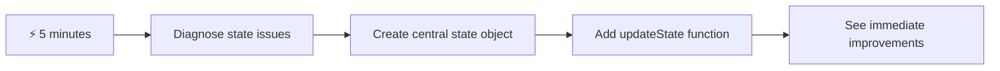
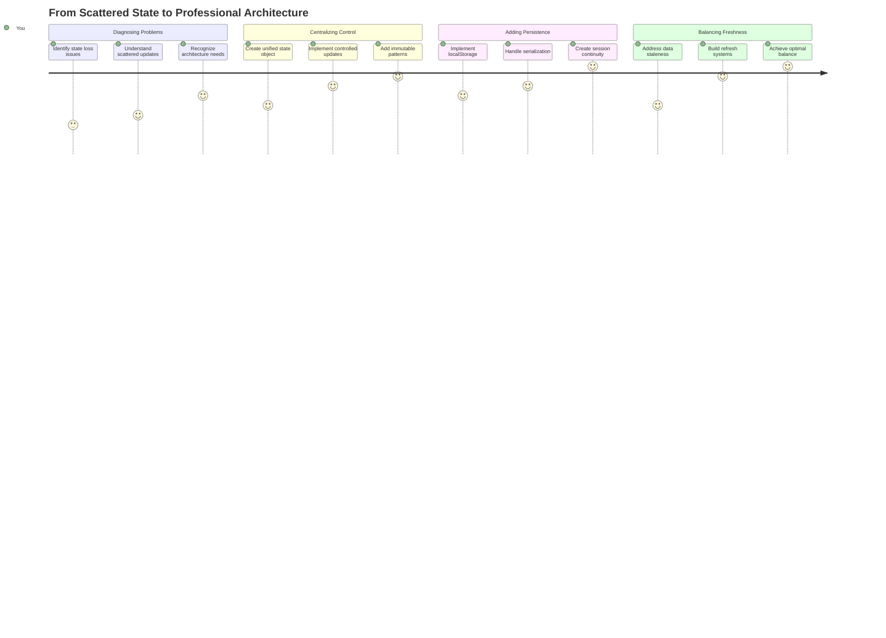
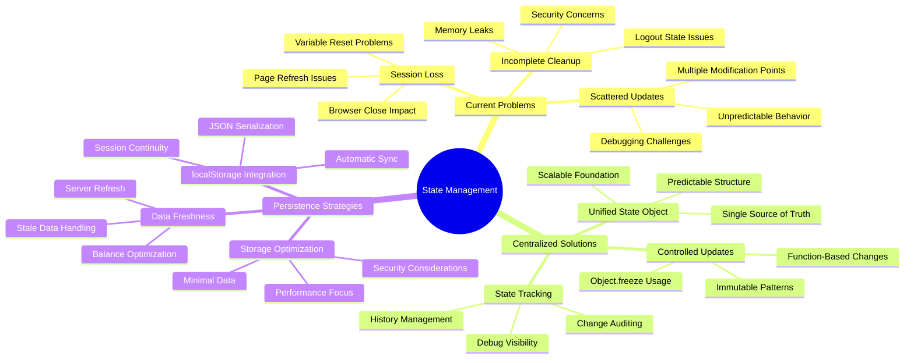
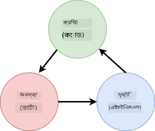
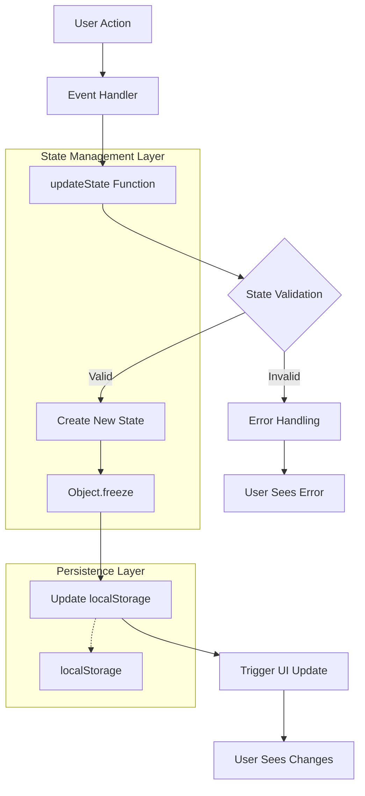
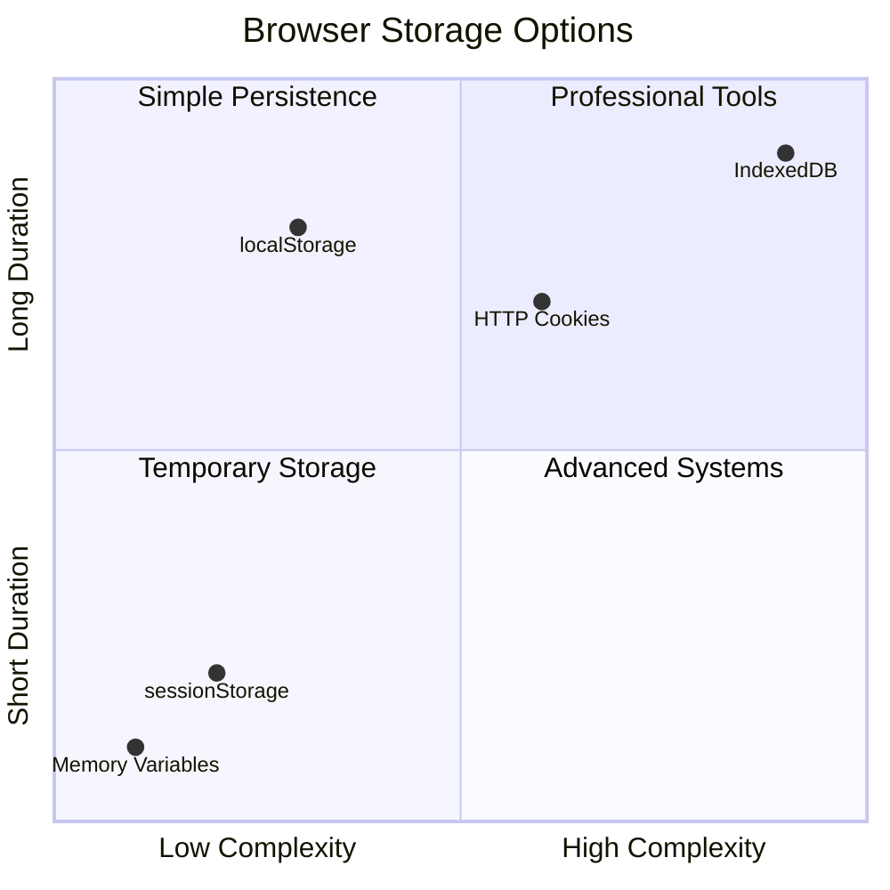
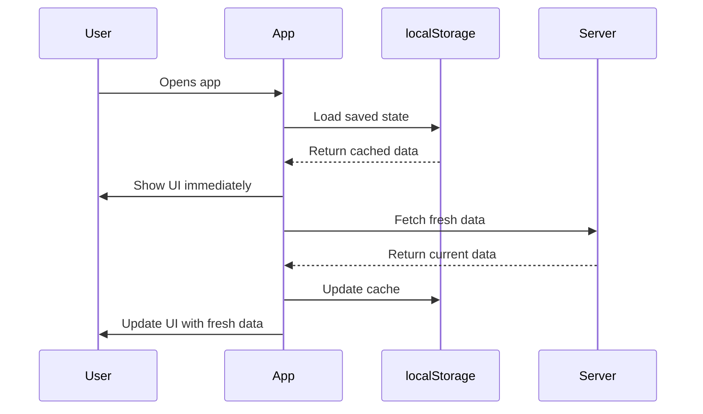
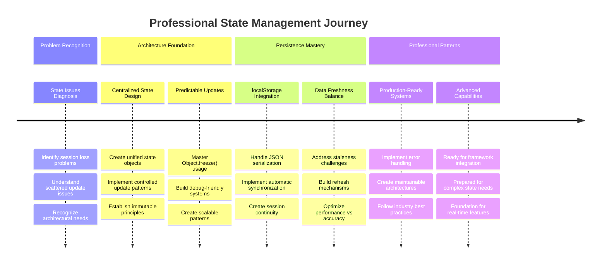

<!--
CO_OP_TRANSLATOR_METADATA:
{
  "original_hash": "b807b09df716dc48a2b750835bf8e933",
  "translation_date": "2025-11-03T22:48:02+00:00",
  "source_file": "7-bank-project/4-state-management/README.md",
  "language_code": "bn"
}
-->
# একটি ব্যাংকিং অ্যাপ তৈরি করুন অংশ ৪: স্টেট ম্যানেজমেন্টের ধারণা

## ⚡ পরবর্তী ৫ মিনিটে আপনি কী করতে পারবেন

**ব্যস্ত ডেভেলপারদের জন্য দ্রুত শুরু করার পথ**



- **মিনিট ১**: বর্তমান স্টেট সমস্যাটি পরীক্ষা করুন - লগইন করুন, পেজ রিফ্রেশ করুন, লগআউট পর্যবেক্ষণ করুন
- **মিনিট ২**: `let account = null` এর পরিবর্তে `let state = { account: null }` ব্যবহার করুন
- **মিনিট ৩**: নিয়ন্ত্রিত আপডেটের জন্য একটি সহজ `updateState()` ফাংশন তৈরি করুন
- **মিনিট ৪**: নতুন প্যাটার্ন ব্যবহার করে একটি ফাংশন আপডেট করুন
- **মিনিট ৫**: উন্নত পূর্বাভাসযোগ্যতা এবং ডিবাগিং সক্ষমতা পরীক্ষা করুন

**দ্রুত ডায়াগনস্টিক টেস্ট**:
```javascript
// Before: Scattered state
let account = null; // Lost on refresh!

// After: Centralized state
let state = Object.freeze({ account: null }); // Controlled and trackable!
```

**কেন এটি গুরুত্বপূর্ণ**: ৫ মিনিটে, আপনি বিশৃঙ্খল স্টেট ম্যানেজমেন্ট থেকে পূর্বাভাসযোগ্য এবং ডিবাগযোগ্য প্যাটার্নে রূপান্তরের অভিজ্ঞতা পাবেন। এটি সেই ভিত্তি যা জটিল অ্যাপ্লিকেশনগুলোকে রক্ষণাবেক্ষণযোগ্য করে তোলে।

## 🗺️ স্টেট ম্যানেজমেন্ট দক্ষতার মাধ্যমে আপনার শেখার যাত্রা



**আপনার যাত্রার গন্তব্য**: এই পাঠের শেষে, আপনি একটি পেশাদার-গ্রেড স্টেট ম্যানেজমেন্ট সিস্টেম তৈরি করবেন যা স্থায়িত্ব, ডেটার সতেজতা এবং পূর্বাভাসযোগ্য আপডেট পরিচালনা করে - প্রোডাকশন অ্যাপ্লিকেশনে ব্যবহৃত একই প্যাটার্ন।

## প্রি-লেকচার কুইজ

[প্রি-লেকচার কুইজ](https://ff-quizzes.netlify.app/web/quiz/47)

## ভূমিকা

স্টেট ম্যানেজমেন্ট Voyager মহাকাশযানের নেভিগেশন সিস্টেমের মতো – যখন সবকিছু মসৃণভাবে কাজ করে, তখন আপনি এটি খুব একটা লক্ষ্য করেন না। কিন্তু যখন কিছু ভুল হয়, এটি আন্তঃনাক্ষত্রিক স্থানে পৌঁছানোর এবং মহাজাগতিক শূন্যতায় হারিয়ে যাওয়ার মধ্যে পার্থক্য হয়ে ওঠে। ওয়েব ডেভেলপমেন্টে, স্টেট হলো আপনার অ্যাপ্লিকেশনের স্মরণে রাখার প্রয়োজনীয় সবকিছু: ব্যবহারকারীর লগইন স্ট্যাটাস, ফর্ম ডেটা, নেভিগেশন ইতিহাস এবং অস্থায়ী ইন্টারফেস স্টেট।

আপনার ব্যাংকিং অ্যাপটি একটি সাধারণ লগইন ফর্ম থেকে একটি আরও উন্নত অ্যাপ্লিকেশনে পরিণত হওয়ার সাথে সাথে, আপনি সম্ভবত কিছু সাধারণ চ্যালেঞ্জের সম্মুখীন হয়েছেন। পেজ রিফ্রেশ করুন এবং ব্যবহারকারীরা অপ্রত্যাশিতভাবে লগআউট হয়ে যায়। ব্রাউজার বন্ধ করুন এবং সমস্ত অগ্রগতি হারিয়ে যায়। একটি সমস্যা ডিবাগ করুন এবং আপনি একাধিক ফাংশনের মধ্যে শিকার করছেন যা একই ডেটা বিভিন্নভাবে পরিবর্তন করে।

এগুলি খারাপ কোডিংয়ের লক্ষণ নয় – এগুলি সেই প্রাকৃতিক বৃদ্ধি যন্ত্রণা যা অ্যাপ্লিকেশনগুলি একটি নির্দিষ্ট জটিলতার সীমা অতিক্রম করার সময় ঘটে। প্রতিটি ডেভেলপার এই চ্যালেঞ্জগুলোর মুখোমুখি হন যখন তাদের অ্যাপ "প্রুফ অফ কনসেপ্ট" থেকে "প্রোডাকশন রেডি" তে রূপান্তরিত হয়।

এই পাঠে, আমরা একটি কেন্দ্রীয় স্টেট ম্যানেজমেন্ট সিস্টেম বাস্তবায়ন করব যা আপনার ব্যাংকিং অ্যাপকে একটি নির্ভরযোগ্য, পেশাদার অ্যাপ্লিকেশনে রূপান্তরিত করবে। আপনি ডেটা প্রবাহ পূর্বাভাসযোগ্যভাবে পরিচালনা করতে, ব্যবহারকারীর সেশন যথাযথভাবে স্থায়ী করতে এবং আধুনিক ওয়েব অ্যাপ্লিকেশনগুলোর প্রয়োজনীয় মসৃণ ব্যবহারকারীর অভিজ্ঞতা তৈরি করতে শিখবেন।

## প্রয়োজনীয়তা

স্টেট ম্যানেজমেন্ট ধারণাগুলোতে ডুব দেওয়ার আগে, আপনার ডেভেলপমেন্ট পরিবেশ সঠিকভাবে সেট আপ করা এবং আপনার ব্যাংকিং অ্যাপের ভিত্তি প্রস্তুত থাকা দরকার। এই পাঠটি এই সিরিজের পূর্ববর্তী অংশগুলোর ধারণা এবং কোডের উপর সরাসরি ভিত্তি করে তৈরি।

প্রক্রিয়ার আগে নিশ্চিত করুন যে আপনার কাছে নিম্নলিখিত উপাদানগুলো প্রস্তুত রয়েছে:

**প্রয়োজনীয় সেটআপ:**
- [ডেটা ফেচিং পাঠ](../3-data/README.md) সম্পূর্ণ করুন - আপনার অ্যাপ সফলভাবে অ্যাকাউন্ট ডেটা লোড এবং প্রদর্শন করতে সক্ষম হওয়া উচিত
- আপনার সিস্টেমে [Node.js](https://nodejs.org) ইনস্টল করুন ব্যাকএন্ড API চালানোর জন্য
- অ্যাকাউন্ট ডেটা অপারেশন পরিচালনা করার জন্য [সার্ভার API](../api/README.md) লোকালভাবে চালু করুন

**আপনার পরিবেশ পরীক্ষা করা:**

আপনার API সার্ভার সঠিকভাবে চলছে কিনা তা যাচাই করতে টার্মিনালে এই কমান্ডটি চালান:

```sh
curl http://localhost:5000/api
# -> should return "Bank API v1.0.0" as a result
```

**এই কমান্ডটি কী করে:**
- **পাঠায়** আপনার লোকাল API সার্ভারে একটি GET অনুরোধ
- **পরীক্ষা করে** সংযোগ এবং সার্ভার সাড়া দিচ্ছে কিনা
- **ফিরিয়ে দেয়** API সংস্করণ তথ্য যদি সবকিছু সঠিকভাবে কাজ করে

## 🧠 স্টেট ম্যানেজমেন্ট আর্কিটেকচার ওভারভিউ



**মূল নীতি**: পেশাদার স্টেট ম্যানেজমেন্ট পূর্বাভাসযোগ্যতা, স্থায়িত্ব এবং কর্মক্ষমতার মধ্যে ভারসাম্য বজায় রাখে যাতে নির্ভরযোগ্য ব্যবহারকারীর অভিজ্ঞতা তৈরি হয় যা সাধারণ ইন্টারঅ্যাকশন থেকে জটিল অ্যাপ্লিকেশন ওয়ার্কফ্লো পর্যন্ত স্কেল করে।

---

## বর্তমান স্টেট সমস্যাগুলো নির্ণয় করা

শার্লক হোমসের মতো একটি অপরাধের দৃশ্য পরীক্ষা করার মতো, আমাদের বর্তমান বাস্তবায়নে ঠিক কী ঘটছে তা বুঝতে হবে যাতে আমরা ব্যবহারকারীর সেশন হারিয়ে যাওয়ার রহস্য সমাধান করতে পারি।

চলুন একটি সহজ পরীক্ষা করি যা অন্তর্নিহিত স্টেট ম্যানেজমেন্ট চ্যালেঞ্জগুলো প্রকাশ করে:

**🧪 এই ডায়াগনস্টিক টেস্টটি চেষ্টা করুন:**
1. আপনার ব্যাংকিং অ্যাপে লগইন করুন এবং ড্যাশবোর্ডে যান
2. ব্রাউজার পেজ রিফ্রেশ করুন
3. আপনার লগইন স্ট্যাটাসে কী ঘটে তা পর্যবেক্ষণ করুন

যদি আপনি লগইন স্ক্রিনে পুনঃনির্দেশিত হন, তাহলে আপনি ক্লাসিক স্টেট স্থায়িত্ব সমস্যাটি আবিষ্কার করেছেন। এই আচরণটি ঘটে কারণ আমাদের বর্তমান বাস্তবায়ন ব্যবহারকারীর ডেটা জাভাস্ক্রিপ্ট ভেরিয়েবলে সংরক্ষণ করে যা প্রতিটি পেজ লোডের সাথে রিসেট হয়।

**বর্তমান বাস্তবায়নের সমস্যা:**

আমাদের [পূর্ববর্তী পাঠের](../3-data/README.md) সাধারণ `account` ভেরিয়েবলটি ব্যবহারকারীর অভিজ্ঞতা এবং কোড রক্ষণাবেক্ষণে তিনটি উল্লেখযোগ্য সমস্যা তৈরি করে:

| সমস্যা | প্রযুক্তিগত কারণ | ব্যবহারকারীর প্রভাব |
|---------|--------|----------------|
| **সেশন হারানো** | পেজ রিফ্রেশ জাভাস্ক্রিপ্ট ভেরিয়েবলগুলো পরিষ্কার করে | ব্যবহারকারীদের বারবার প্রমাণীকরণ করতে হয় |
| **বিক্ষিপ্ত আপডেট** | একাধিক ফাংশন সরাসরি স্টেট পরিবর্তন করে | ডিবাগিং ক্রমবর্ধমান কঠিন হয়ে ওঠে |
| **অসম্পূর্ণ ক্লিনআপ** | লগআউট সমস্ত স্টেট রেফারেন্স পরিষ্কার করে না | সম্ভাব্য নিরাপত্তা এবং গোপনীয়তা উদ্বেগ |

**আর্কিটেকচারাল চ্যালেঞ্জ:**

টাইটানিকের বিভাজিত নকশার মতো যা একাধিক কম্পার্টমেন্ট একসাথে প্লাবিত হওয়ার সময় দৃঢ় বলে মনে হয়েছিল, এই সমস্যাগুলো পৃথকভাবে ঠিক করা অন্তর্নিহিত আর্কিটেকচারাল সমস্যাটি সমাধান করবে না। আমাদের একটি ব্যাপক স্টেট ম্যানেজমেন্ট সমাধান দরকার।

> 💡 **আমরা এখানে আসলে কী অর্জন করতে চাই?**

[স্টেট ম্যানেজমেন্ট](https://en.wikipedia.org/wiki/State_management) আসলে দুটি মৌলিক ধাঁধা সমাধান করার বিষয়ে:

1. **আমার ডেটা কোথায়?**: আমরা কী তথ্য আছে এবং এটি কোথা থেকে আসছে তা ট্র্যাক রাখা
2. **সবাই কি একই পৃষ্ঠায় আছে?**: নিশ্চিত করা যে ব্যবহারকারীরা যা দেখছেন তা আসলে যা ঘটছে তার সাথে মিলে যাচ্ছে

**আমাদের পরিকল্পনা:**

আমরা আমাদের **কেন্দ্রীয় স্টেট ম্যানেজমেন্ট** সিস্টেম তৈরি করতে যাচ্ছি। এটি এমন একজন অত্যন্ত সংগঠিত ব্যক্তির মতো যিনি সমস্ত গুরুত্বপূর্ণ বিষয়ের দায়িত্বে আছেন:





**এই ডেটা প্রবাহ বোঝা:**
- **কেন্দ্রীভূত করে** সমস্ত অ্যাপ্লিকেশন স্টেট এক স্থানে
- **রাউট করে** সমস্ত স্টেট পরিবর্তন নিয়ন্ত্রিত ফাংশনের মাধ্যমে
- **নিশ্চিত করে** UI বর্তমান স্টেটের সাথে সিঙ্ক্রোনাইজ থাকে
- **প্রদান করে** ডেটা ম্যানেজমেন্টের জন্য একটি পরিষ্কার, পূর্বাভাসযোগ্য প্যাটার্ন

> 💡 **পেশাদার অন্তর্দৃষ্টি**: এই পাঠটি মৌলিক ধারণাগুলোর উপর ফোকাস করে। জটিল অ্যাপ্লিকেশনের জন্য, [Redux](https://redux.js.org) এর মতো লাইব্রেরি আরও উন্নত স্টেট ম্যানেজমেন্ট বৈশিষ্ট্য প্রদান করে। এই মূল নীতিগুলো বোঝা আপনাকে যেকোনো স্টেট ম্যানেজমেন্ট লাইব্রেরি আয়ত্ত করতে সাহায্য করবে।

> ⚠️ **উন্নত বিষয়**: আমরা স্টেট পরিবর্তন দ্বারা স্বয়ংক্রিয় UI আপডেট কভার করব না, কারণ এটি [Reactive Programming](https://en.wikipedia.org/wiki/Reactive_programming) ধারণার সাথে জড়িত। এটি আপনার শেখার যাত্রার জন্য একটি চমৎ
| **এটি কতক্ষণ স্থায়ী হওয়া উচিত?** | লগইন স্টেট বনাম অস্থায়ী UI পছন্দ | উপযুক্ত সংরক্ষণ সময় নির্বাচন করুন |
| **সার্ভার কি এটি প্রয়োজন?** | অথেন্টিকেশন টোকেন বনাম UI সেটিংস | শেয়ারিং প্রয়োজনীয়তা নির্ধারণ করুন |

**ব্রাউজার স্টোরেজ অপশন:**

আধুনিক ব্রাউজারগুলো বিভিন্ন স্টোরেজ মেকানিজম প্রদান করে, যা বিভিন্ন ব্যবহারের জন্য ডিজাইন করা হয়েছে:

**প্রাথমিক স্টোরেজ API:**

1. **[`localStorage`](https://developer.mozilla.org/docs/Web/API/Window/localStorage)**: স্থায়ী [Key/Value স্টোরেজ](https://en.wikipedia.org/wiki/Key%E2%80%93value_database)
   - **ডেটা** ব্রাউজার সেশনের মধ্যে অনির্দিষ্টকালের জন্য সংরক্ষণ করে  
   - **ব্রাউজার রিস্টার্ট এবং কম্পিউটার রিবুটের পরেও** টিকে থাকে
   - **নির্দিষ্ট** ওয়েবসাইট ডোমেইনের জন্য সীমাবদ্ধ
   - **পারফেক্ট** ব্যবহারকারীর পছন্দ এবং লগইন স্টেটের জন্য

2. **[`sessionStorage`](https://developer.mozilla.org/docs/Web/API/Window/sessionStorage)**: অস্থায়ী সেশন স্টোরেজ
   - **localStorage-এর মতোই কাজ করে** সক্রিয় সেশনের সময়
   - **স্বয়ংক্রিয়ভাবে মুছে যায়** যখন ব্রাউজার ট্যাব বন্ধ হয়
   - **আদর্শ** অস্থায়ী ডেটার জন্য যা স্থায়ী হওয়া উচিত নয়

3. **[HTTP Cookies](https://developer.mozilla.org/docs/Web/HTTP/Cookies)**: সার্ভার-শেয়ারড স্টোরেজ
   - **স্বয়ংক্রিয়ভাবে** প্রতিটি সার্ভার রিকোয়েস্টের সাথে পাঠানো হয়
   - **পারফেক্ট** [অথেন্টিকেশন](https://en.wikipedia.org/wiki/Authentication) টোকেনের জন্য
   - **সীমিত** সাইজ এবং পারফরম্যান্সে প্রভাব ফেলতে পারে

**ডেটা সিরিয়ালাইজেশন প্রয়োজনীয়তা:**

`localStorage` এবং `sessionStorage` শুধুমাত্র [স্ট্রিং](https://developer.mozilla.org/docs/Web/JavaScript/Reference/Global_Objects/String) সংরক্ষণ করে:

```js
// Convert objects to JSON strings for storage
const accountData = { user: 'john', balance: 150 };
localStorage.setItem('account', JSON.stringify(accountData));

// Parse JSON strings back to objects when retrieving
const savedAccount = JSON.parse(localStorage.getItem('account'));
```

**সিরিয়ালাইজেশন বোঝা:**
- **জাভাস্ক্রিপ্ট অবজেক্টকে** JSON স্ট্রিংয়ে রূপান্তর করে [`JSON.stringify()`](https://developer.mozilla.org/docs/Web/JavaScript/Reference/Global_Objects/JSON/stringify) ব্যবহার করে
- **JSON থেকে অবজেক্ট পুনর্গঠন করে** [`JSON.parse()`](https://developer.mozilla.org/docs/Web/JavaScript/Reference/Global_Objects/JSON/parse) ব্যবহার করে
- **স্বয়ংক্রিয়ভাবে** জটিল নেস্টেড অবজেক্ট এবং অ্যারে পরিচালনা করে
- **ফাংশন, undefined মান এবং সার্কুলার রেফারেন্সে** ব্যর্থ হয়

> 💡 **উন্নত অপশন**: বড় ডেটাসেট সহ জটিল অফলাইন অ্যাপ্লিকেশনের জন্য, [`IndexedDB` API](https://developer.mozilla.org/docs/Web/API/IndexedDB_API) বিবেচনা করুন। এটি একটি পূর্ণ ক্লায়েন্ট-সাইড ডাটাবেস প্রদান করে তবে আরও জটিল বাস্তবায়ন প্রয়োজন।



### টাস্ক: localStorage স্থায়ীত্ব বাস্তবায়ন

চলুন স্থায়ী স্টোরেজ বাস্তবায়ন করি যাতে ব্যবহারকারীরা স্পষ্টভাবে লগআউট না করা পর্যন্ত লগইন অবস্থায় থাকে। আমরা `localStorage` ব্যবহার করব ব্রাউজার সেশনের মধ্যে অ্যাকাউন্ট ডেটা সংরক্ষণ করতে।

**ধাপ ১: স্টোরেজ কনফিগারেশন সংজ্ঞায়িত করুন**

```js
const storageKey = 'savedAccount';
```

**এই কনস্ট্যান্টটি কী প্রদান করে:**
- **আমাদের সংরক্ষিত ডেটার জন্য** একটি ধারাবাহিক আইডেন্টিফায়ার তৈরি করে
- **স্টোরেজ কী রেফারেন্সে টাইপো প্রতিরোধ করে**
- **স্টোরেজ কী পরিবর্তন করা সহজ করে**
- **রক্ষণশীল কোডের জন্য সেরা অনুশীলন অনুসরণ করে**

**ধাপ ২: স্বয়ংক্রিয় স্থায়ীত্ব যোগ করুন**

`updateState()` ফাংশনের শেষে এই লাইনটি যোগ করুন:

```js
localStorage.setItem(storageKey, JSON.stringify(state.account));
```

**এখানে কী ঘটে তা বিশ্লেষণ:**
- **অ্যাকাউন্ট অবজেক্টকে** JSON স্ট্রিংয়ে রূপান্তর করে সংরক্ষণের জন্য
- **আমাদের ধারাবাহিক স্টোরেজ কী ব্যবহার করে ডেটা সংরক্ষণ করে**
- **স্বয়ংক্রিয়ভাবে কার্যকর হয়** যখন স্টেট পরিবর্তন ঘটে
- **নিশ্চিত করে** সংরক্ষিত ডেটা বর্তমান স্টেটের সাথে সর্বদা সিঙ্ক্রোনাইজড থাকে

> 💡 **আর্কিটেকচারাল সুবিধা**: যেহেতু আমরা সমস্ত স্টেট আপডেট `updateState()` এর মাধ্যমে কেন্দ্রীভূত করেছি, স্থায়ীত্ব যোগ করতে মাত্র একটি লাইন কোড প্রয়োজন হয়েছে। এটি ভাল আর্কিটেকচারাল সিদ্ধান্তের শক্তি প্রদর্শন করে!

**ধাপ ৩: অ্যাপ লোডে স্টেট পুনরুদ্ধার করুন**

সংরক্ষিত ডেটা পুনরুদ্ধার করতে একটি ইনিশিয়ালাইজেশন ফাংশন তৈরি করুন:

```js
function init() {
  const savedAccount = localStorage.getItem(storageKey);
  if (savedAccount) {
    updateState('account', JSON.parse(savedAccount));
  }

  // Our previous initialization code
  window.onpopstate = () => updateRoute();
  updateRoute();
}

init();
```

**ইনিশিয়ালাইজেশন প্রক্রিয়া বোঝা:**
- **localStorage থেকে** পূর্বে সংরক্ষিত অ্যাকাউন্ট ডেটা পুনরুদ্ধার করে
- **JSON স্ট্রিংকে** পুনরায় জাভাস্ক্রিপ্ট অবজেক্টে রূপান্তর করে
- **আমাদের নিয়ন্ত্রিত আপডেট ফাংশন ব্যবহার করে স্টেট আপডেট করে**
- **পৃষ্ঠার লোডে স্বয়ংক্রিয়ভাবে ব্যবহারকারীর সেশন পুনরুদ্ধার করে**
- **রুট আপডেটের আগে কার্যকর হয়** যাতে স্টেট উপলব্ধ থাকে

**ধাপ ৪: ডিফল্ট রুট অপ্টিমাইজ করুন**

স্থায়ীত্বের সুবিধা নিতে ডিফল্ট রুট আপডেট করুন:

`updateRoute()`-এ, প্রতিস্থাপন করুন:
```js
// Replace: return navigate('/login');
return navigate('/dashboard');
```

**কেন এই পরিবর্তনটি অর্থবহ:**
- **আমাদের নতুন স্থায়ীত্ব সিস্টেমকে কার্যকরভাবে ব্যবহার করে**
- **ড্যাশবোর্ডকে অথেন্টিকেশন চেক পরিচালনা করতে দেয়**
- **স্বয়ংক্রিয়ভাবে লগইনে রিডাইরেক্ট করে যদি কোনো সংরক্ষিত সেশন না থাকে**
- **আরও মসৃণ ব্যবহারকারীর অভিজ্ঞতা তৈরি করে**

**আপনার বাস্তবায়ন পরীক্ষা করুন:**

1. আপনার ব্যাংকিং অ্যাপে লগইন করুন
2. ব্রাউজার পৃষ্ঠাটি রিফ্রেশ করুন
3. নিশ্চিত করুন যে আপনি লগইন অবস্থায় এবং ড্যাশবোর্ডে রয়েছেন
4. ব্রাউজার বন্ধ করুন এবং পুনরায় খুলুন
5. আপনার অ্যাপে ফিরে যান এবং নিশ্চিত করুন যে আপনি এখনও লগইন অবস্থায় রয়েছেন

🎉 **অর্জন সম্পন্ন**: আপনি সফলভাবে স্থায়ী স্টেট ম্যানেজমেন্ট বাস্তবায়ন করেছেন! এখন আপনার অ্যাপ একটি পেশাদার ওয়েব অ্যাপ্লিকেশনের মতো আচরণ করে।

### 🎯 শিক্ষামূলক চেক-ইন: স্থায়ীত্ব আর্কিটেকচার

**আর্কিটেকচার বোঝা**: আপনি একটি পরিশীলিত স্থায়ীত্ব স্তর বাস্তবায়ন করেছেন যা ব্যবহারকারীর অভিজ্ঞতা এবং ডেটা ম্যানেজমেন্ট জটিলতার মধ্যে ভারসাম্য বজায় রাখে।

**মূল ধারণা আয়ত্ত করেছেন**:
- **JSON সিরিয়ালাইজেশন**: জটিল অবজেক্টকে সংরক্ষণযোগ্য স্ট্রিংয়ে রূপান্তর করা
- **স্বয়ংক্রিয় সিঙ্ক্রোনাইজেশন**: স্টেট পরিবর্তন স্থায়ী স্টোরেজকে ট্রিগার করে
- **সেশন পুনরুদ্ধার**: অ্যাপ্লিকেশন বাধার পরে ব্যবহারকারীর প্রসঙ্গ পুনরুদ্ধার করতে পারে
- **কেন্দ্রীভূত স্থায়ীত্ব**: একটি আপডেট ফাংশন সমস্ত স্টোরেজ পরিচালনা করে

**শিল্প সংযোগ**: এই স্থায়ীত্ব প্যাটার্ন প্রগ্রেসিভ ওয়েব অ্যাপস (PWAs), অফলাইন-প্রথম অ্যাপ্লিকেশন এবং আধুনিক মোবাইল ওয়েব অভিজ্ঞতার জন্য মৌলিক। আপনি প্রোডাকশন-লেভেল সক্ষমতা তৈরি করছেন।

**প্রতিফলন প্রশ্ন**: আপনি কীভাবে এই সিস্টেমটি একই ডিভাইসে একাধিক ব্যবহারকারীর অ্যাকাউন্ট পরিচালনা করতে সংশোধন করবেন? গোপনীয়তা এবং নিরাপত্তার প্রভাব বিবেচনা করুন।

## স্থায়ীত্ব এবং ডেটা সতেজতার মধ্যে ভারসাম্য

আমাদের স্থায়ীত্ব সিস্টেম সফলভাবে ব্যবহারকারীর সেশন বজায় রাখে, কিন্তু একটি নতুন চ্যালেঞ্জ নিয়ে আসে: ডেটা পুরনো হয়ে যাওয়া। যখন একাধিক ব্যবহারকারী বা অ্যাপ্লিকেশন একই সার্ভার ডেটা পরিবর্তন করে, স্থানীয় ক্যাশড তথ্য পুরনো হয়ে যায়।

এই পরিস্থিতি সেই ভাইকিং নেভিগেটরদের মতো যারা সংরক্ষিত তারকা চার্ট এবং বর্তমান আকাশ পর্যবেক্ষণের উপর নির্ভর করতেন। চার্ট ধারাবাহিকতা প্রদান করত, কিন্তু নেভিগেটরদের পরিবর্তিত অবস্থার জন্য তাজা পর্যবেক্ষণ প্রয়োজন ছিল। অনুরূপভাবে, আমাদের অ্যাপ্লিকেশনকে স্থায়ী ব্যবহারকারীর স্টেট এবং বর্তমান সার্ভার ডেটা উভয়ের প্রয়োজন।

**🧪 ডেটা সতেজতার সমস্যা আবিষ্কার:**

1. `test` অ্যাকাউন্ট ব্যবহার করে ড্যাশবোর্ডে লগইন করুন
2. টার্মিনালে এই কমান্ডটি চালান অন্য একটি উৎস থেকে একটি লেনদেন সিমুলেট করতে:

```sh
curl --request POST \
     --header "Content-Type: application/json" \
     --data "{ \"date\": \"2020-07-24\", \"object\": \"Bought book\", \"amount\": -20 }" \
     http://localhost:5000/api/accounts/test/transactions
```

3. ব্রাউজার পৃষ্ঠাটি রিফ্রেশ করুন
4. দেখুন আপনি নতুন লেনদেনটি দেখতে পাচ্ছেন কিনা

**এই পরীক্ষাটি কী প্রদর্শন করে:**
- **দেখায়** কীভাবে স্থানীয় স্টোরেজ "পুরনো" (অপ্রাসঙ্গিক) হতে পারে
- **বাস্তব জীবনের পরিস্থিতি সিমুলেট করে** যেখানে ডেটা আপনার অ্যাপের বাইরে পরিবর্তিত হয়
- **স্থায়ীত্ব এবং ডেটা সতেজতার মধ্যে টান প্রকাশ করে**

**ডেটা পুরনো হওয়ার চ্যালেঞ্জ:**

| সমস্যা | কারণ | ব্যবহারকারীর প্রভাব |
|---------|-------|---------------------|
| **পুরনো ডেটা** | localStorage স্বয়ংক্রিয়ভাবে মেয়াদোত্তীর্ণ হয় না | ব্যবহারকারীরা অপ্রাসঙ্গিক তথ্য দেখতে পায় |
| **সার্ভার পরিবর্তন** | অন্যান্য অ্যাপ/ব্যবহারকারী একই ডেটা পরিবর্তন করে | প্ল্যাটফর্ম জুড়ে অসঙ্গত দৃশ্য |
| **ক্যাশ বনাম বাস্তবতা** | স্থানীয় ক্যাশ সার্ভার স্টেটের সাথে মিলে না | খারাপ ব্যবহারকারীর অভিজ্ঞতা এবং বিভ্রান্তি |

**সমাধান কৌশল:**

আমরা একটি "লোডে রিফ্রেশ" প্যাটার্ন বাস্তবায়ন করব যা স্থায়ীত্বের সুবিধাগুলিকে ডেটার সঠিকতার প্রয়োজনের সাথে ভারসাম্য বজায় রাখে। এই পদ্ধতি মসৃণ ব্যবহারকারীর অভিজ্ঞতা বজায় রাখার সময় ডেটার সঠিকতা নিশ্চিত করে।



### টাস্ক: ডেটা রিফ্রেশ সিস্টেম বাস্তবায়ন

আমরা একটি সিস্টেম তৈরি করব যা স্বয়ংক্রিয়ভাবে সার্ভার থেকে তাজা ডেটা নিয়ে আসে, আমাদের স্থায়ী স্টেট ম্যানেজমেন্টের সুবিধাগুলি বজায় রেখে।

**ধাপ ১: অ্যাকাউন্ট ডেটা আপডেটার তৈরি করুন**

```js
async function updateAccountData() {
  const account = state.account;
  if (!account) {
    return logout();
  }

  const data = await getAccount(account.user);
  if (data.error) {
    return logout();
  }

  updateState('account', data);
}
```

**এই ফাংশনের লজিক বোঝা:**
- **পরীক্ষা করে** ব্যবহারকারী বর্তমানে লগইন অবস্থায় আছে কিনা (state.account বিদ্যমান)
- **লগআউটের দিকে রিডাইরেক্ট করে** যদি কোনো বৈধ সেশন না পাওয়া যায়
- **সার্ভার থেকে তাজা অ্যাকাউন্ট ডেটা নিয়ে আসে** বিদ্যমান `getAccount()` ফাংশন ব্যবহার করে
- **সার্ভার ত্রুটি সুন্দরভাবে পরিচালনা করে** এবং অবৈধ সেশনগুলিকে লগআউট করে
- **আমাদের নিয়ন্ত্রিত আপডেট সিস্টেম ব্যবহার করে স্টেট আপডেট করে**
- **localStorage স্থায়ীত্ব স্বয়ংক্রিয়ভাবে ট্রিগার করে** `updateState()` ফাংশনের মাধ্যমে

**ধাপ ২: ড্যাশবোর্ড রিফ্রেশ হ্যান্ডলার তৈরি করুন**

```js
async function refresh() {
  await updateAccountData();
  updateDashboard();
}
```

**এই রিফ্রেশ ফাংশনটি কী অর্জন করে:**
- **ডেটা রিফ্রেশ এবং UI আপডেট প্রক্রিয়াকে সমন্বয় করে**
- **তাজা ডেটা লোড হওয়ার জন্য অপেক্ষা করে** ডিসপ্লে আপডেট করার আগে
- **নিশ্চিত করে** ড্যাশবোর্ডে সর্বাধিক বর্তমান তথ্য প্রদর্শিত হয়
- **ডেটা ম্যানেজমেন্ট এবং UI আপডেটের মধ্যে একটি পরিষ্কার বিভাজন বজায় রাখে**

**ধাপ ৩: রুট সিস্টেমের সাথে ইন্টিগ্রেট করুন**

আপনার রুট কনফিগারেশন আপডেট করুন যাতে রিফ্রেশ স্বয়ংক্রিয়ভাবে ট্রিগার হয়:

```js
const routes = {
  '/login': { templateId: 'login' },
  '/dashboard': { templateId: 'dashboard', init: refresh }
};
```

**এই ইন্টিগ্রেশন কীভাবে কাজ করে:**
- **প্রতিবার ড্যাশবোর্ড রুট লোড হলে** রিফ্রেশ ফাংশন কার্যকর করে
- **নিশ্চিত করে** যে ব্যবহারকারীরা ড্যাশবোর্ডে নেভিগেট করলে সর্বদা তাজা ডেটা প্রদর্শিত হয়
- **বিদ্যমান রুট স্ট্রাকচার বজায় রাখে** যখন ডেটা সতেজতা যোগ করে
- **রুট-নির্দিষ্ট ইনিশিয়ালাইজেশনের জন্য একটি ধারাবাহিক প্যাটার্ন প্রদান করে**

**আপনার ডেটা রিফ্রেশ সিস্টেম পরীক্ষা করুন:**

1. আপনার ব্যাংকিং অ্যাপে লগইন করুন
2. পূর্বের curl কমান্ডটি চালান একটি নতুন লেনদেন তৈরি করতে
3. আপনার ড্যাশবোর্ড পৃষ্ঠাটি রিফ্রেশ করুন বা দূরে যান এবং ফিরে আসুন
4. নিশ্চিত করুন যে নতুন লেনদেনটি সাথে সাথে প্রদর্শিত হচ্ছে

🎉 **পারফেক্ট ভারসাম্য অর্জিত**: আপনার অ্যাপ এখন স্থায়ী স্টেটের মসৃণ অভিজ্ঞতা এবং তাজা সার্ভার ডেটার সঠিকতা একত্রিত করে!

## 📈 আপনার স্টেট ম্যানেজমেন্ট দক্ষতার টাইমলাইন



**🎓 গ্র্যাজুয়েশন মাইলস্টোন**: আপনি সফলভাবে একটি সম্পূর্ণ স্টেট ম্যানেজমেন্ট সিস্টেম তৈরি করেছেন যা Redux, Vuex এবং অন্যান্য পেশাদার স্টেট লাইব্রেরিগুলির শক্তি ব্যবহার করে। এই প্যাটার্নগুলি সাধারণ অ্যাপ থেকে এন্টারপ্রাইজ অ্যাপ্লিকেশনে স্কেল করে।

**🔄 পরবর্তী স্তরের সক্ষমতা**:
- স্টেট ম্যানেজমেন্ট ফ্রেমওয়ার্ক (Redux, Zustand, Pinia) আয়ত্ত করতে প্রস্তুত
- WebSockets দিয়ে রিয়েল-টাইম ফিচার বাস্তবায়ন করতে প্রস্তুত
- অফলাইন-প্রথম প্রগ্রেসিভ ওয়েব অ্যাপ তৈরি করতে প্রস্তুত
- স্টেট মেশিন এবং অবজারভারদের মতো উন্নত প্যাটার্নের জন্য ভিত্তি স্থাপন

## GitHub Copilot Agent চ্যালেঞ্জ 🚀

Agent মোড ব্যবহার করে নিম্নলিখিত চ্যালেঞ্জ সম্পন্ন করুন:

**বর্ণনা:** ব্যাংকিং অ্যাপের জন্য undo/redo ফাংশনালিটি সহ একটি ব্যাপক স্টেট ম্যানেজমেন্ট সিস্টেম বাস্তবায়ন করুন। এই চ্যালেঞ্জটি আপনাকে উন্নত স্টেট ম্যানেজমেন্ট ধারণাগুলি অনুশীলন করতে সাহায্য করবে, যার মধ্যে রয়েছে স্টেট হিস্ট্রি ট্র্যাকিং, ইমিউটেবল আপডেট এবং ব্যবহারকারী ইন্টারফেস সিঙ্ক্রোনাইজেশন।

**প্রম্পট:** একটি উন্নত স্টেট ম্যানেজমেন্ট সিস্টেম তৈরি করুন যা অন্তর্ভুক্ত করে: ১) একটি স্টেট হিস্ট্রি অ্যারে যা সমস্ত পূর্ববর্তী স্টেট ট্র্যাক করে, ২) undo এবং redo ফাংশন যা পূর্ববর্তী স্টেটে ফিরে যেতে পারে, ৩) ড্যাশবোর্ডে undo/redo অপারেশনের জন্য UI বোতাম, ৪) মেমরি সমস্যাগুলি প্রতিরোধ করতে ১০টি স্টেটের একটি সর্বাধিক হিস্ট্রি সীমা, এবং ৫) ব্যবহারকারী লগআউট করলে হিস্ট্রির সঠিক ক্লিনআপ। নিশ্চিত করুন যে undo/redo ফাংশনালিটি অ্যাকাউন্ট ব্যালেন্স পরিবর্তনের সাথে কাজ করে এবং ব্রাউজার রিফ্রেশের মধ্যেও স্থায়ী থাকে।

Agent মোড সম্পর্কে আরও জানুন [এখানে](https://code.visualstudio.com/blogs/2025/02/24/introducing-copilot-agent-mode)।

## 🚀 চ্যালেঞ্জ: স্টোরেজ অপ্টিমাইজেশন

আপনার বাস্তবায়ন এখন ব্যবহারকারীর সেশন, ডেটা রিফ্রেশ এবং স্টেট ম্যানেজমেন্ট কার্যকরভাবে পরিচালনা করে। তবে, আমাদের বর্তমান পদ্ধতি স্টোরেজ দক্ষতার সাথে কার্যকারিতা ভারসাম্য বজায় রাখে কিন

---

**অস্বীকৃতি**:  
এই নথিটি AI অনুবাদ পরিষেবা [Co-op Translator](https://github.com/Azure/co-op-translator) ব্যবহার করে অনুবাদ করা হয়েছে। আমরা যথাসাধ্য সঠিকতার জন্য চেষ্টা করি, তবে অনুগ্রহ করে মনে রাখবেন যে স্বয়ংক্রিয় অনুবাদে ত্রুটি বা অসঙ্গতি থাকতে পারে। মূল ভাষায় থাকা নথিটিকে প্রামাণিক উৎস হিসেবে বিবেচনা করা উচিত। গুরুত্বপূর্ণ তথ্যের জন্য, পেশাদার মানব অনুবাদ সুপারিশ করা হয়। এই অনুবাদ ব্যবহারের ফলে কোনো ভুল বোঝাবুঝি বা ভুল ব্যাখ্যা হলে আমরা দায়ী থাকব না।