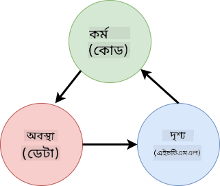

<!--
CO_OP_TRANSLATOR_METADATA:
{
  "original_hash": "32bd800759c3e943c38ad9ae6e1f51e0",
  "translation_date": "2025-10-22T21:49:29+00:00",
  "source_file": "7-bank-project/4-state-management/README.md",
  "language_code": "bn"
}
-->
# ব্যাংকিং অ্যাপ তৈরি করুন পার্ট ৪: স্টেট ম্যানেজমেন্টের ধারণা

## প্রি-লেকচার কুইজ

[প্রি-লেকচার কুইজ](https://ff-quizzes.netlify.app/web/quiz/47)

## ভূমিকা

স্টেট ম্যানেজমেন্ট অনেকটা ভয়েজার মহাকাশযানের নেভিগেশন সিস্টেমের মতো – যখন সবকিছু ঠিকঠাক কাজ করে, তখন এর উপস্থিতি খুব একটা বোঝা যায় না। কিন্তু যখন কিছু ভুল হয়, তখন এটি আন্তঃনাক্ষত্রিক মহাকাশে পৌঁছানোর এবং মহাজাগতিক শূন্যতায় হারিয়ে যাওয়ার মধ্যে পার্থক্য তৈরি করে। ওয়েব ডেভেলপমেন্টে, স্টেট হলো আপনার অ্যাপ্লিকেশনের সমস্ত কিছু যা মনে রাখা প্রয়োজন: ব্যবহারকারীর লগইন স্ট্যাটাস, ফর্ম ডেটা, নেভিগেশন ইতিহাস এবং অস্থায়ী ইন্টারফেস স্টেট।

আপনার ব্যাংকিং অ্যাপটি একটি সাধারণ লগইন ফর্ম থেকে একটি আরও উন্নত অ্যাপ্লিকেশনে পরিণত হওয়ার সাথে সাথে, আপনি সম্ভবত কিছু সাধারণ চ্যালেঞ্জের সম্মুখীন হয়েছেন। পেজ রিফ্রেশ করুন এবং ব্যবহারকারীরা অপ্রত্যাশিতভাবে লগ আউট হয়ে যায়। ব্রাউজার বন্ধ করুন এবং সমস্ত অগ্রগতি হারিয়ে যায়। কোনো সমস্যার ডিবাগ করুন এবং আপনি একাধিক ফাংশনের মধ্যে ঘুরছেন যা বিভিন্নভাবে একই ডেটা পরিবর্তন করে।

এগুলো খারাপ কোডিংয়ের লক্ষণ নয় – এগুলো প্রাকৃতিক বৃদ্ধি-জনিত সমস্যাগুলি যা তখন ঘটে যখন অ্যাপ্লিকেশন একটি নির্দিষ্ট জটিলতার সীমা অতিক্রম করে। প্রতিটি ডেভেলপার এই চ্যালেঞ্জগুলির মুখোমুখি হন যখন তাদের অ্যাপগুলি "প্রুফ অফ কনসেপ্ট" থেকে "প্রোডাকশন রেডি"-তে রূপান্তরিত হয়।

এই পাঠে, আমরা একটি কেন্দ্রীভূত স্টেট ম্যানেজমেন্ট সিস্টেম বাস্তবায়ন করব যা আপনার ব্যাংকিং অ্যাপটিকে একটি নির্ভরযোগ্য, পেশাদার অ্যাপ্লিকেশনে রূপান্তরিত করবে। আপনি ডেটা প্রবাহ পূর্বাভাসযোগ্যভাবে পরিচালনা করতে, ব্যবহারকারীর সেশন যথাযথভাবে সংরক্ষণ করতে এবং আধুনিক ওয়েব অ্যাপ্লিকেশনগুলির প্রয়োজনীয় মসৃণ ব্যবহারকারীর অভিজ্ঞতা তৈরি করতে শিখবেন।

## প্রয়োজনীয়তা

স্টেট ম্যানেজমেন্টের ধারণাগুলিতে ডুব দেওয়ার আগে, আপনার ডেভেলপমেন্ট পরিবেশ সঠিকভাবে সেট আপ করা এবং আপনার ব্যাংকিং অ্যাপের ভিত্তি স্থাপন করা প্রয়োজন। এই পাঠটি এই সিরিজের পূর্ববর্তী অংশগুলির ধারণা এবং কোডের উপর সরাসরি ভিত্তি করে তৈরি।

প্রক্রিয়া শুরু করার আগে নিশ্চিত করুন যে আপনার কাছে নিম্নলিখিত উপাদানগুলি প্রস্তুত রয়েছে:

**প্রয়োজনীয় সেটআপ:**
- [ডেটা ফেচিং পাঠ](../3-data/README.md) সম্পূর্ণ করুন - আপনার অ্যাপটি সফলভাবে অ্যাকাউন্ট ডেটা লোড এবং প্রদর্শন করতে সক্ষম হওয়া উচিত
- আপনার সিস্টেমে [Node.js](https://nodejs.org) ইনস্টল করুন ব্যাকএন্ড API চালানোর জন্য
- অ্যাকাউন্ট ডেটা অপারেশন পরিচালনা করার জন্য [server API](../api/README.md) স্থানীয়ভাবে শুরু করুন

**আপনার পরিবেশ পরীক্ষা করুন:**

আপনার API সার্ভার সঠিকভাবে চলছে কিনা যাচাই করতে টার্মিনালে এই কমান্ডটি চালান:

```sh
curl http://localhost:5000/api
# -> should return "Bank API v1.0.0" as a result
```

**এই কমান্ডটি কী করে:**
- **পাঠায়** একটি GET অনুরোধ আপনার স্থানীয় API সার্ভারে
- **পরীক্ষা করে** সংযোগ এবং সার্ভার সাড়া দিচ্ছে কিনা যাচাই করে
- **ফিরিয়ে দেয়** API সংস্করণ তথ্য যদি সবকিছু সঠিকভাবে কাজ করে

---

## বর্তমান স্টেট সমস্যাগুলি নির্ণয় করা

শার্লক হোমসের মতো একটি অপরাধের দৃশ্য পরীক্ষা করার মতো, আমাদের বর্তমান বাস্তবায়নে ঠিক কী ঘটছে তা বুঝতে হবে যাতে আমরা ব্যবহারকারীর সেশন হারিয়ে যাওয়ার রহস্য সমাধান করতে পারি।

চলুন একটি সহজ পরীক্ষা করি যা অন্তর্নিহিত স্টেট ম্যানেজমেন্ট চ্যালেঞ্জগুলি প্রকাশ করে:

**🧪 এই ডায়াগনস্টিক পরীক্ষা চেষ্টা করুন:**
1. আপনার ব্যাংকিং অ্যাপে লগইন করুন এবং ড্যাশবোর্ডে যান
2. ব্রাউজার পেজটি রিফ্রেশ করুন
3. আপনার লগইন স্ট্যাটাসে কী ঘটে তা পর্যবেক্ষণ করুন

যদি আপনি লগইন স্ক্রিনে পুনঃনির্দেশিত হন, তাহলে আপনি ক্লাসিক স্টেট পার্সিস্টেন্স সমস্যাটি আবিষ্কার করেছেন। এই আচরণটি ঘটে কারণ আমাদের বর্তমান বাস্তবায়ন ব্যবহারকারীর ডেটা জাভাস্ক্রিপ্ট ভেরিয়েবলে সংরক্ষণ করে যা প্রতিটি পেজ লোডের সাথে রিসেট হয়।

**বর্তমান বাস্তবায়নের সমস্যা:**

আমাদের [পূর্ববর্তী পাঠের](../3-data/README.md) সাধারণ `account` ভেরিয়েবলটি তিনটি গুরুত্বপূর্ণ সমস্যার সৃষ্টি করে যা ব্যবহারকারীর অভিজ্ঞতা এবং কোড রক্ষণাবেক্ষণকে প্রভাবিত করে:

| সমস্যা | প্রযুক্তিগত কারণ | ব্যবহারকারীর প্রভাব |
|---------|--------|----------------|
| **সেশন হারানো** | পেজ রিফ্রেশ জাভাস্ক্রিপ্ট ভেরিয়েবল মুছে দেয় | ব্যবহারকারীদের বারবার প্রমাণীকরণ করতে হয় |
| **বিক্ষিপ্ত আপডেট** | একাধিক ফাংশন সরাসরি স্টেট পরিবর্তন করে | ডিবাগিং ক্রমশ কঠিন হয়ে ওঠে |
| **অসম্পূর্ণ ক্লিনআপ** | লগআউট সমস্ত স্টেট রেফারেন্স মুছে দেয় না | সম্ভাব্য নিরাপত্তা এবং গোপনীয়তার উদ্বেগ |

**স্থাপত্যগত চ্যালেঞ্জ:**

টাইটানিকের কম্পার্টমেন্টালাইজড ডিজাইনের মতো যা একাধিক কম্পার্টমেন্ট একসাথে প্লাবিত হওয়া পর্যন্ত শক্তিশালী মনে হয়েছিল, এই সমস্যাগুলি পৃথকভাবে ঠিক করা অন্তর্নিহিত স্থাপত্যগত সমস্যাটি সমাধান করবে না। আমাদের একটি ব্যাপক স্টেট ম্যানেজমেন্ট সমাধান প্রয়োজন।

> 💡 **আমরা এখানে আসলে কী অর্জন করতে চাই?**

[স্টেট ম্যানেজমেন্ট](https://en.wikipedia.org/wiki/State_management) আসলে দুটি মৌলিক ধাঁধা সমাধান করার বিষয়ে:

1. **আমার ডেটা কোথায়?**: আমাদের কাছে কী তথ্য আছে এবং এটি কোথা থেকে আসছে তা ট্র্যাক রাখা
2. **সবাই কি একই পৃষ্ঠায় আছে?**: নিশ্চিত করা যে ব্যবহারকারীরা যা দেখছেন তা আসলে যা ঘটছে তার সাথে মিলে যাচ্ছে

**আমাদের পরিকল্পনা:**

আমরা আমাদের সময় নষ্ট না করে একটি **কেন্দ্রীভূত স্টেট ম্যানেজমেন্ট** সিস্টেম তৈরি করতে যাচ্ছি। এটি অনেকটা এমন একজন সুসংগঠিত ব্যক্তির মতো যে সমস্ত গুরুত্বপূর্ণ বিষয়ের দায়িত্বে থাকে:



**এই ডেটা প্রবাহ বোঝা:**
- **কেন্দ্রীভূত করে** সমস্ত অ্যাপ্লিকেশন স্টেট এক স্থানে
- **নিয়ন্ত্রণ করে** সমস্ত স্টেট পরিবর্তন নির্ধারিত ফাংশনের মাধ্যমে
- **নিশ্চিত করে** UI বর্তমান স্টেটের সাথে সিঙ্ক্রোনাইজ থাকে
- **সরবরাহ করে** ডেটা ম্যানেজমেন্টের জন্য একটি পরিষ্কার, পূর্বাভাসযোগ্য প্যাটার্ন

> 💡 **পেশাদার অন্তর্দৃষ্টি**: এই পাঠটি মৌলিক ধারণাগুলির উপর ফোকাস করে। জটিল অ্যাপ্লিকেশনের জন্য, [Redux](https://redux.js.org) এর মতো লাইব্রেরি আরও উন্নত স্টেট ম্যানেজমেন্ট বৈশিষ্ট্য সরবরাহ করে। এই মূল নীতিগুলি বোঝা আপনাকে যেকোনো স্টেট ম্যানেজমেন্ট লাইব্রেরি আয়ত্ত করতে সাহায্য করবে।

> ⚠️ **উন্নত বিষয়**: আমরা স্বয়ংক্রিয় UI আপডেটগুলি কভার করব না যা স্টেট পরিবর্তনের দ্বারা ট্রিগার হয়, কারণ এটি [Reactive Programming](https://en.wikipedia.org/wiki/Reactive_programming) ধারণার সাথে জড়িত। এটি আপনার শেখার যাত্রার জন্য একটি চমৎ
> 💡 **উন্নত বিকল্প**: বড় ডেটাসেট সহ জটিল অফলাইন অ্যাপ্লিকেশনের জন্য, [`IndexedDB` API](https://developer.mozilla.org/docs/Web/API/IndexedDB_API) বিবেচনা করুন। এটি একটি পূর্ণাঙ্গ ক্লায়েন্ট-সাইড ডাটাবেস প্রদান করে, তবে এর বাস্তবায়ন আরও জটিল।

### কাজ: localStorage Persistence বাস্তবায়ন করুন

চলুন একটি স্থায়ী স্টোরেজ সিস্টেম তৈরি করি যাতে ব্যবহারকারীরা স্পষ্টভাবে লগ আউট না করা পর্যন্ত লগ ইন অবস্থায় থাকে। আমরা `localStorage` ব্যবহার করব ব্রাউজার সেশনের মধ্যে অ্যাকাউন্ট ডেটা সংরক্ষণ করতে।

**ধাপ ১: স্টোরেজ কনফিগারেশন সংজ্ঞায়িত করুন**

```js
const storageKey = 'savedAccount';
```

**এই কনস্ট্যান্টটি যা প্রদান করে:**
- **একটি** ধারাবাহিক শনাক্তকারী তৈরি করে আমাদের সংরক্ষিত ডেটার জন্য
- **টাইপো** প্রতিরোধ করে স্টোরেজ কী রেফারেন্সে
- **সহজ করে** স্টোরেজ কী পরিবর্তন করা প্রয়োজন হলে
- **সেরা অনুশীলন অনুসরণ করে** রক্ষণযোগ্য কোডের জন্য

**ধাপ ২: স্বয়ংক্রিয় Persistence যোগ করুন**

`updateState()` ফাংশনের শেষে এই লাইনটি যোগ করুন:

```js
localStorage.setItem(storageKey, JSON.stringify(state.account));
```

**এখানে যা ঘটে তার বিশ্লেষণ:**
- **অ্যাকাউন্ট অবজেক্টকে** JSON স্ট্রিংয়ে রূপান্তর করে স্টোরেজের জন্য
- **ডেটা সংরক্ষণ করে** আমাদের ধারাবাহিক স্টোরেজ কী ব্যবহার করে
- **স্বয়ংক্রিয়ভাবে কার্যকর করে** যখনই স্টেট পরিবর্তন ঘটে
- **নিশ্চিত করে** সংরক্ষিত ডেটা সর্বদা বর্তমান স্টেটের সাথে সিঙ্ক্রোনাইজ থাকে

> 💡 **আর্কিটেকচার সুবিধা**: যেহেতু আমরা সমস্ত স্টেট আপডেট `updateState()` এর মাধ্যমে কেন্দ্রীভূত করেছি, তাই Persistence যোগ করতে মাত্র একটি লাইন কোড প্রয়োজন হয়েছে। এটি ভালো আর্কিটেকচারাল সিদ্ধান্তের শক্তি প্রদর্শন করে!

**ধাপ ৩: অ্যাপ লোডে স্টেট পুনরুদ্ধার করুন**

সংরক্ষিত ডেটা পুনরুদ্ধার করতে একটি initialization ফাংশন তৈরি করুন:

```js
function init() {
  const savedAccount = localStorage.getItem(storageKey);
  if (savedAccount) {
    updateState('account', JSON.parse(savedAccount));
  }

  // Our previous initialization code
  window.onpopstate = () => updateRoute();
  updateRoute();
}

init();
```

**Initialization প্রক্রিয়া বোঝা:**
- **localStorage থেকে** পূর্বে সংরক্ষিত অ্যাকাউন্ট ডেটা পুনরুদ্ধার করে
- **JSON স্ট্রিংকে** পুনরায় JavaScript অবজেক্টে রূপান্তর করে
- **আমাদের নিয়ন্ত্রিত আপডেট ফাংশন ব্যবহার করে** স্টেট আপডেট করে
- **স্বয়ংক্রিয়ভাবে** ব্যবহারকারীর সেশন পুনরুদ্ধার করে পেজ লোডে
- **রুট আপডেটের আগে কার্যকর করে** যাতে স্টেট উপলব্ধ থাকে

**ধাপ ৪: ডিফল্ট রুট অপ্টিমাইজ করুন**

Persistence সুবিধা নিতে ডিফল্ট রুট আপডেট করুন:

`updateRoute()` এ পরিবর্তন করুন:
```js
// Replace: return navigate('/login');
return navigate('/dashboard');
```

**কেন এই পরিবর্তনটি যৌক্তিক:**
- **আমাদের নতুন Persistence সিস্টেমকে** কার্যকরভাবে ব্যবহার করে
- **ড্যাশবোর্ডকে** authentication চেক পরিচালনা করতে দেয়
- **লগইনে স্বয়ংক্রিয়ভাবে রিডাইরেক্ট করে** যদি কোনো সংরক্ষিত সেশন না থাকে
- **আরও মসৃণ ব্যবহারকারীর অভিজ্ঞতা তৈরি করে**

**আপনার বাস্তবায়ন পরীক্ষা করুন:**

1. আপনার ব্যাংকিং অ্যাপে লগ ইন করুন
2. ব্রাউজার পেজ রিফ্রেশ করুন
3. নিশ্চিত করুন যে আপনি লগ ইন অবস্থায় এবং ড্যাশবোর্ডে রয়েছেন
4. আপনার ব্রাউজার বন্ধ করুন এবং পুনরায় খুলুন
5. আপনার অ্যাপে ফিরে যান এবং নিশ্চিত করুন যে আপনি এখনও লগ ইন অবস্থায় রয়েছেন

🎉 **সাফল্য অর্জিত**: আপনি সফলভাবে স্থায়ী স্টেট ম্যানেজমেন্ট বাস্তবায়ন করেছেন! এখন আপনার অ্যাপ একটি পেশাদার ওয়েব অ্যাপ্লিকেশনের মতো আচরণ করে।

## Persistence এবং ডেটা সতেজতার মধ্যে ভারসাম্য বজায় রাখা

আমাদের Persistence সিস্টেম সফলভাবে ব্যবহারকারীর সেশন বজায় রাখে, তবে এটি একটি নতুন চ্যালেঞ্জ নিয়ে আসে: ডেটা পুরনো হয়ে যাওয়া। যখন একাধিক ব্যবহারকারী বা অ্যাপ্লিকেশন একই সার্ভার ডেটা পরিবর্তন করে, তখন স্থানীয় ক্যাশ করা তথ্য পুরনো হয়ে যায়।

এই পরিস্থিতি সেই ভাইকিং নাবিকদের মতো যারা সংরক্ষিত তারকা চার্ট এবং বর্তমান আকাশ পর্যবেক্ষণের উপর নির্ভর করতেন। চার্টগুলি ধারাবাহিকতা প্রদান করত, তবে নাবিকদের পরিবর্তিত অবস্থার জন্য তাজা পর্যবেক্ষণ প্রয়োজন ছিল। অনুরূপভাবে, আমাদের অ্যাপ্লিকেশনকে স্থায়ী ব্যবহারকারী স্টেট এবং বর্তমান সার্ভার ডেটা উভয়ের প্রয়োজন।

**🧪 ডেটা সতেজতার সমস্যা আবিষ্কার করা:**

1. `test` অ্যাকাউন্ট ব্যবহার করে ড্যাশবোর্ডে লগ ইন করুন
2. অন্য একটি উৎস থেকে লেনদেন সিমুলেট করতে একটি টার্মিনালে এই কমান্ডটি চালান:

```sh
curl --request POST \
     --header "Content-Type: application/json" \
     --data "{ \"date\": \"2020-07-24\", \"object\": \"Bought book\", \"amount\": -20 }" \
     http://localhost:5000/api/accounts/test/transactions
```

3. আপনার ব্রাউজার পেজ রিফ্রেশ করুন
4. দেখুন আপনি নতুন লেনদেনটি দেখতে পাচ্ছেন কিনা

**এই পরীক্ষাটি যা প্রদর্শন করে:**
- **দেখায়** কিভাবে local storage "পুরনো" (আউটডেটেড) হয়ে যেতে পারে
- **বাস্তব জীবনের পরিস্থিতি সিমুলেট করে** যেখানে ডেটা পরিবর্তন আপনার অ্যাপের বাইরে ঘটে
- **Persistence এবং ডেটা সতেজতার মধ্যে টানাপোড়েন প্রকাশ করে**

**ডেটা পুরনো হয়ে যাওয়ার চ্যালেঞ্জ:**

| সমস্যা | কারণ | ব্যবহারকারীর প্রভাব |
|--------|-------|-----------------------|
| **পুরনো ডেটা** | localStorage স্বয়ংক্রিয়ভাবে মেয়াদোত্তীর্ণ হয় না | ব্যবহারকারীরা পুরনো তথ্য দেখতে পায় |
| **সার্ভার পরিবর্তন** | অন্যান্য অ্যাপ/ব্যবহারকারীরা একই ডেটা পরিবর্তন করে | প্ল্যাটফর্মগুলির মধ্যে অসঙ্গত দৃশ্য |
| **ক্যাশ বনাম বাস্তবতা** | স্থানীয় ক্যাশ সার্ভার স্টেটের সাথে মেলে না | খারাপ ব্যবহারকারীর অভিজ্ঞতা এবং বিভ্রান্তি |

**সমাধান কৌশল:**

আমরা একটি "লোডে রিফ্রেশ" প্যাটার্ন বাস্তবায়ন করব যা Persistence এর সুবিধাগুলিকে সতেজ ডেটার প্রয়োজনের সাথে ভারসাম্য বজায় রাখে। এই পদ্ধতি মসৃণ ব্যবহারকারীর অভিজ্ঞতা বজায় রাখার পাশাপাশি ডেটার সঠিকতা নিশ্চিত করে।

### কাজ: ডেটা রিফ্রেশ সিস্টেম বাস্তবায়ন করুন

আমরা একটি সিস্টেম তৈরি করব যা স্বয়ংক্রিয়ভাবে সার্ভার থেকে সতেজ ডেটা নিয়ে আসে এবং আমাদের স্থায়ী স্টেট ম্যানেজমেন্টের সুবিধাগুলি বজায় রাখে।

**ধাপ ১: অ্যাকাউন্ট ডেটা আপডেটার তৈরি করুন**

```js
async function updateAccountData() {
  const account = state.account;
  if (!account) {
    return logout();
  }

  const data = await getAccount(account.user);
  if (data.error) {
    return logout();
  }

  updateState('account', data);
}
```

**এই ফাংশনের যুক্তি বোঝা:**
- **পরীক্ষা করে** ব্যবহারকারী বর্তমানে লগ ইন অবস্থায় আছে কিনা (state.account বিদ্যমান)
- **লগআউটে রিডাইরেক্ট করে** যদি কোনো বৈধ সেশন না পাওয়া যায়
- **সার্ভার থেকে সতেজ অ্যাকাউন্ট ডেটা নিয়ে আসে** বিদ্যমান `getAccount()` ফাংশন ব্যবহার করে
- **সার্ভার ত্রুটি দক্ষতার সাথে পরিচালনা করে** অবৈধ সেশন লগ আউট করে
- **আমাদের নিয়ন্ত্রিত আপডেট সিস্টেম ব্যবহার করে** স্টেট সতেজ ডেটা দিয়ে আপডেট করে
- **স্বয়ংক্রিয় localStorage Persistence ট্রিগার করে** `updateState()` ফাংশনের মাধ্যমে

**ধাপ ২: ড্যাশবোর্ড রিফ্রেশ হ্যান্ডলার তৈরি করুন**

```js
async function refresh() {
  await updateAccountData();
  updateDashboard();
}
```

**এই রিফ্রেশ ফাংশন যা অর্জন করে:**
- **ডেটা রিফ্রেশ এবং UI আপডেট প্রক্রিয়া সমন্বয় করে**
- **সতেজ ডেটা লোড হওয়ার জন্য অপেক্ষা করে** ডিসপ্লে আপডেট করার আগে
- **নিশ্চিত করে** ড্যাশবোর্ড সর্বাধিক বর্তমান তথ্য প্রদর্শন করে
- **ডেটা ম্যানেজমেন্ট এবং UI আপডেটের মধ্যে পরিষ্কার বিভাজন বজায় রাখে**

**ধাপ ৩: রুট সিস্টেমের সাথে ইন্টিগ্রেট করুন**

আপনার রুট কনফিগারেশন আপডেট করুন যাতে রিফ্রেশ স্বয়ংক্রিয়ভাবে ট্রিগার হয়:

```js
const routes = {
  '/login': { templateId: 'login' },
  '/dashboard': { templateId: 'dashboard', init: refresh }
};
```

**এই ইন্টিগ্রেশন কিভাবে কাজ করে:**
- **প্রতিবার ড্যাশবোর্ড রুট লোড হলে** রিফ্রেশ ফাংশন কার্যকর করে
- **নিশ্চিত করে** ব্যবহারকারীরা ড্যাশবোর্ডে নেভিগেট করলে সর্বদা সতেজ ডেটা প্রদর্শিত হয়
- **বিদ্যমান রুট স্ট্রাকচার বজায় রাখে** যখন ডেটা সতেজতা যোগ করে
- **রুট-নির্দিষ্ট initialization এর জন্য একটি ধারাবাহিক প্যাটার্ন প্রদান করে**

**আপনার ডেটা রিফ্রেশ সিস্টেম পরীক্ষা করুন:**

1. আপনার ব্যাংকিং অ্যাপে লগ ইন করুন
2. পূর্বের curl কমান্ড চালিয়ে একটি নতুন লেনদেন তৈরি করুন
3. আপনার ড্যাশবোর্ড পেজ রিফ্রেশ করুন বা অন্যত্র নেভিগেট করুন এবং ফিরে আসুন
4. নিশ্চিত করুন যে নতুন লেনদেনটি সাথে সাথে প্রদর্শিত হচ্ছে

🎉 **পারফেক্ট ব্যালেন্স অর্জিত**: আপনার অ্যাপ এখন স্থায়ী স্টেটের মসৃণ অভিজ্ঞতা এবং সতেজ সার্ভার ডেটার সঠিকতা একত্রিত করে!

## GitHub Copilot Agent চ্যালেঞ্জ 🚀

Agent মোড ব্যবহার করে নিম্নলিখিত চ্যালেঞ্জ সম্পন্ন করুন:

**বর্ণনা:** ব্যাংকিং অ্যাপের জন্য একটি সম্পূর্ণ স্টেট ম্যানেজমেন্ট সিস্টেম বাস্তবায়ন করুন যা undo/redo কার্যকারিতা অন্তর্ভুক্ত করে। এই চ্যালেঞ্জ আপনাকে উন্নত স্টেট ম্যানেজমেন্ট ধারণাগুলি অনুশীলন করতে সাহায্য করবে, যার মধ্যে রয়েছে স্টেট ইতিহাস ট্র্যাকিং, অপরিবর্তনীয় আপডেট এবং ব্যবহারকারী ইন্টারফেস সিঙ্ক্রোনাইজেশন।

**প্রম্পট:** একটি উন্নত স্টেট ম্যানেজমেন্ট সিস্টেম তৈরি করুন যা অন্তর্ভুক্ত করে: ১) একটি স্টেট ইতিহাস অ্যারে যা সমস্ত পূর্ববর্তী স্টেট ট্র্যাক করে, ২) undo এবং redo ফাংশন যা পূর্ববর্তী স্টেটে ফিরে যেতে পারে, ৩) ড্যাশবোর্ডে undo/redo অপারেশনের জন্য UI বোতাম, ৪) মেমরি সমস্যাগুলি প্রতিরোধ করতে ১০টি স্টেটের একটি সর্বাধিক ইতিহাস সীমা, এবং ৫) ব্যবহারকারী লগ আউট করলে ইতিহাসের সঠিক পরিষ্কার। নিশ্চিত করুন যে undo/redo কার্যকারিতা অ্যাকাউন্ট ব্যালেন্স পরিবর্তনের সাথে কাজ করে এবং ব্রাউজার রিফ্রেশের মধ্যেও স্থায়ী থাকে।

Agent মোড সম্পর্কে আরও জানুন [এখানে](https://code.visualstudio.com/blogs/2025/02/24/introducing-copilot-agent-mode)।

## 🚀 চ্যালেঞ্জ: স্টোরেজ অপ্টিমাইজেশন

আপনার বাস্তবায়ন এখন ব্যবহারকারী সেশন, ডেটা রিফ্রেশ এবং স্টেট ম্যানেজমেন্ট কার্যকরভাবে পরিচালনা করে। তবে, বিবেচনা করুন যে আমাদের বর্তমান পদ্ধতি স্টোরেজ দক্ষতার সাথে কার্যকারিতার ভারসাম্য কতটা ভালোভাবে বজায় রাখে।

যেমন দাবার মাস্টাররা প্রয়োজনীয় টুকরো এবং ত্যাগযোগ্য প্যাদানের মধ্যে পার্থক্য করেন, কার্যকর স্টেট ম্যানেজমেন্টের জন্য প্রয়োজনীয় ডেটা চিহ্নিত করা এবং যা সর্বদা সার্ভার থেকে সতেজ হওয়া উচিত তা নির্ধারণ করা গুরুত্বপূর্ণ।

**অপ্টিমাইজেশন বিশ্লেষণ:**

আপনার বর্তমান localStorage বাস্তবায়ন মূল্যায়ন করুন এবং এই কৌশলগত প্রশ্নগুলি বিবেচনা করুন:
- ব্যবহারকারী authentication বজায় রাখতে ন্যূনতম তথ্য কী?
- কোন ডেটা এত ঘন ঘন পরিবর্তিত হয় যে স্থানীয় ক্যাশিং সামান্য সুবিধা প্রদান করে?
- স্টোরেজ অপ্টিমাইজেশন কিভাবে পারফরম্যান্স উন্নত করতে পারে ব্যবহারকারীর অভিজ্ঞতা ক্ষতিগ্রস্ত না করে?

**বাস্তবায়ন কৌশল:**
- **প্রয়োজনীয় ডেটা চিহ্নিত করুন** যা স্থায়ী হতে হবে (সম্ভবত শুধুমাত্র ব্যবহারকারীর শনাক্তকরণ)
- **আপনার localStorage বাস্তবায়ন পরিবর্তন করুন** শুধুমাত্র গুরুত্বপূর্ণ সেশন ডেটা সংরক্ষণ করতে
- **নিশ্চিত করুন** যে সতেজ ডেটা সর্বদা সার্ভার থেকে লোড হয় ড্যাশবোর্ড ভিজিটে
- **পরীক্ষা করুন** যে আপনার অপ্টিমাইজড পদ্ধতি একই ব্যবহারকারীর অভিজ্ঞতা বজায় রাখে

**উন্নত বিবেচনা:**
- **তুলনা করুন** সম্পূর্ণ অ্যাকাউন্ট ডেটা সংরক্ষণ এবং শুধুমাত্র authentication টোকেন সংরক্ষণের মধ্যে
- **আপনার সিদ্ধান্ত এবং যুক্তি নথিভুক্ত করুন** ভবিষ্যতের টিম সদস্যদের জন্য

এই চ্যালেঞ্জটি আপনাকে একজন পেশাদার ডেভেলপার হিসেবে ভাবতে সাহায্য করবে, যারা তাদের সমাধানে কার্যকারিতা এবং অ্যাপ্লিকেশন দক্ষতা উভয়ই বিবেচনা করে। বিভিন্ন পদ্ধতি নিয়ে পরীক্ষা করার জন্য সময় নিন!

## পোস্ট-লেকচার কুইজ

[পোস্ট-লেকচার কুইজ](https://ff-quizzes.netlify.app/web/quiz/48)

## অ্যাসাইনমেন্ট

[“লেনদেন যোগ করুন” ডায়ালগ বাস্তবায়ন করুন](assignment.md)

অ্যাসাইনমেন্ট সম্পন্ন করার পরে একটি উদাহরণ ফলাফল:


---

**অস্বীকৃতি**:  
এই নথিটি AI অনুবাদ পরিষেবা [Co-op Translator](https://github.com/Azure/co-op-translator) ব্যবহার করে অনুবাদ করা হয়েছে। আমরা যথাসাধ্য সঠিকতার জন্য চেষ্টা করি, তবে অনুগ্রহ করে মনে রাখবেন যে স্বয়ংক্রিয় অনুবাদে ত্রুটি বা অসঙ্গতি থাকতে পারে। মূল ভাষায় থাকা নথিটিকে প্রামাণিক উৎস হিসেবে বিবেচনা করা উচিত। গুরুত্বপূর্ণ তথ্যের জন্য, পেশাদার মানব অনুবাদ সুপারিশ করা হয়। এই অনুবাদ ব্যবহারের ফলে কোনো ভুল বোঝাবুঝি বা ভুল ব্যাখ্যার জন্য আমরা দায়ী থাকব না।