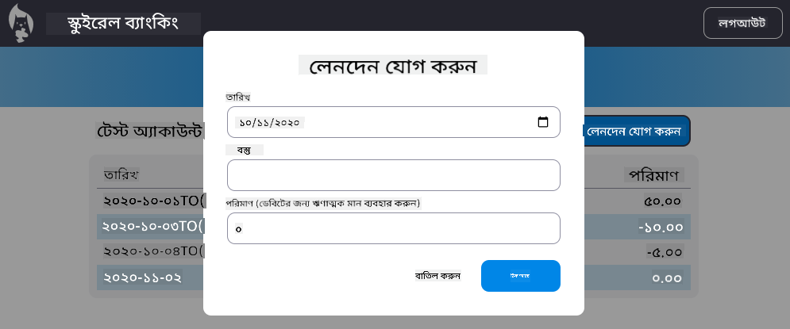

<!--
CO_OP_TRANSLATOR_METADATA:
{
  "original_hash": "f23a868536c07da991b1d4e773161e25",
  "translation_date": "2025-08-26T00:49:18+00:00",
  "source_file": "7-bank-project/4-state-management/assignment.md",
  "language_code": "bn"
}
-->
# "লেনদেন যোগ করুন" ডায়ালগ বাস্তবায়ন করুন

## নির্দেশনা

আমাদের ব্যাংক অ্যাপ এখনও একটি গুরুত্বপূর্ণ ফিচার থেকে বঞ্চিত: নতুন লেনদেন যোগ করার সুযোগ।
পূর্ববর্তী চারটি পাঠে যা শিখেছেন তা ব্যবহার করে একটি "লেনদেন যোগ করুন" ডায়ালগ বাস্তবায়ন করুন:

- ড্যাশবোর্ড পেজে একটি "লেনদেন যোগ করুন" বোতাম যোগ করুন
- একটি নতুন পেজ তৈরি করুন যেখানে একটি HTML টেমপ্লেট থাকবে, অথবা JavaScript ব্যবহার করে ডায়ালগ HTML দেখান/লুকান যাতে ড্যাশবোর্ড পেজ থেকে বের হতে না হয় (এর জন্য আপনি [`hidden`](https://developer.mozilla.org/docs/Web/HTML/Global_attributes/hidden) প্রপার্টি বা CSS ক্লাস ব্যবহার করতে পারেন)
- ডায়ালগের জন্য [কিবোর্ড এবং স্ক্রিন রিডার অ্যাক্সেসিবিলিটি](https://developer.paciellogroup.com/blog/2018/06/the-current-state-of-modal-dialog-accessibility/) নিশ্চিত করুন
- ইনপুট ডেটা গ্রহণের জন্য একটি HTML ফর্ম তৈরি করুন
- ফর্ম ডেটা থেকে JSON ডেটা তৈরি করুন এবং API-তে পাঠান
- নতুন ডেটা দিয়ে ড্যাশবোর্ড পেজ আপডেট করুন

[সার্ভার API স্পেসিফিকেশন](../api/README.md) দেখুন, সেখানে কোন API কল করতে হবে এবং JSON ফরম্যাট কেমন হবে তা উল্লেখ করা আছে।

এখানে অ্যাসাইনমেন্ট সম্পন্ন করার পর একটি উদাহরণ ফলাফল দেওয়া হলো:

## মূল্যায়ন

| মানদণ্ড | চমৎকার                                                                                          | পর্যাপ্ত                                                                                                                | উন্নতির প্রয়োজন                              |
| -------- | ------------------------------------------------------------------------------------------------ | ----------------------------------------------------------------------------------------------------------------------- | --------------------------------------------|
|          | লেনদেন যোগ করার কাজটি সম্পূর্ণভাবে পাঠে শেখানো সেরা পদ্ধতি অনুসরণ করে বাস্তবায়ন করা হয়েছে।         | লেনদেন যোগ করার কাজটি বাস্তবায়ন করা হয়েছে, তবে পাঠে শেখানো সেরা পদ্ধতি অনুসরণ করা হয়নি বা আংশিকভাবে কাজ করছে।           | লেনদেন যোগ করার কাজটি একেবারেই কাজ করছে না। |

**অস্বীকৃতি**:  
এই নথিটি AI অনুবাদ পরিষেবা [Co-op Translator](https://github.com/Azure/co-op-translator) ব্যবহার করে অনুবাদ করা হয়েছে। আমরা যথাসাধ্য সঠিকতা নিশ্চিত করার চেষ্টা করি, তবে অনুগ্রহ করে মনে রাখবেন যে স্বয়ংক্রিয় অনুবাদে ত্রুটি বা অসঙ্গতি থাকতে পারে। মূল ভাষায় থাকা নথিটিকে প্রামাণিক উৎস হিসেবে বিবেচনা করা উচিত। গুরুত্বপূর্ণ তথ্যের জন্য, পেশাদার মানব অনুবাদ সুপারিশ করা হয়। এই অনুবাদ ব্যবহারের ফলে কোনো ভুল বোঝাবুঝি বা ভুল ব্যাখ্যা হলে আমরা দায়বদ্ধ থাকব না।