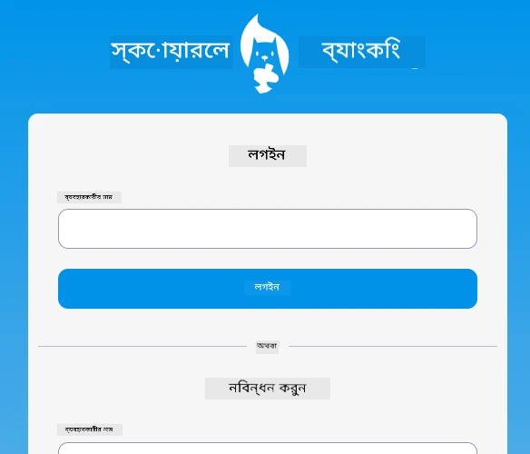
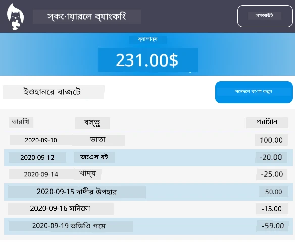

# :dollar: একটি ব্যাংক তৈরি করুন

এই প্রকল্পে, আপনি একটি কাল্পনিক ব্যাংক তৈরি করার পদ্ধতি শিখবেন। এই পাঠগুলোতে একটি ওয়েব অ্যাপের লেআউট এবং রুট তৈরি, ফর্ম তৈরি, স্টেট পরিচালনা এবং API থেকে ব্যাংকের ডেটা সংগ্রহ করার পদ্ধতি শেখানো হয়েছে।

|  |  |
|--------------------------------|--------------------------------|

## পাঠসমূহ

1. [ওয়েব অ্যাপে HTML টেমপ্লেট এবং রুট](1-template-route/README.md)
2. [লগইন এবং রেজিস্ট্রেশন ফর্ম তৈরি করুন](2-forms/README.md)
3. [ডেটা সংগ্রহ এবং ব্যবহারের পদ্ধতি](3-data/README.md)
4. [স্টেট ম্যানেজমেন্টের ধারণা](4-state-management/README.md)

### কৃতজ্ঞতা

এই পাঠগুলো :hearts: দিয়ে লিখেছেন [Yohan Lasorsa](https://twitter.com/sinedied)।

যদি আপনি এই পাঠগুলোতে ব্যবহৃত [সার্ভার API](/7-bank-project/api/README.md) তৈরি করার পদ্ধতি শিখতে আগ্রহী হন, তাহলে [এই ভিডিও সিরিজ](https://aka.ms/NodeBeginner) অনুসরণ করতে পারেন (বিশেষত ভিডিও ১৭ থেকে ২১ পর্যন্ত)।

আপনি [এই ইন্টারঅ্যাকটিভ লার্ন টিউটোরিয়াল](https://aka.ms/learn/express-api) দেখার সুযোগও নিতে পারেন।

**অস্বীকৃতি**:  
এই নথিটি AI অনুবাদ পরিষেবা [Co-op Translator](https://github.com/Azure/co-op-translator) ব্যবহার করে অনুবাদ করা হয়েছে। আমরা যথাসম্ভব সঠিকতার জন্য চেষ্টা করি, তবে অনুগ্রহ করে মনে রাখবেন যে স্বয়ংক্রিয় অনুবাদে ত্রুটি বা অসঙ্গতি থাকতে পারে। এর মূল ভাষায় থাকা নথিটিকে প্রামাণিক উৎস হিসেবে বিবেচনা করা উচিত। গুরুত্বপূর্ণ তথ্যের জন্য, পেশাদার মানব অনুবাদ সুপারিশ করা হয়। এই অনুবাদ ব্যবহারের ফলে কোনো ভুল বোঝাবুঝি বা ভুল ব্যাখ্যা হলে আমরা দায়বদ্ধ থাকব না।