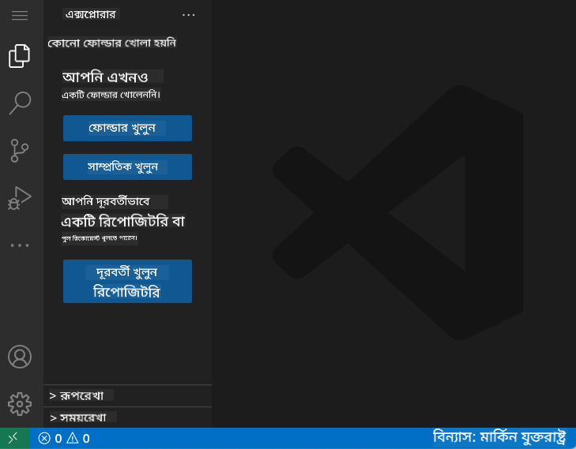
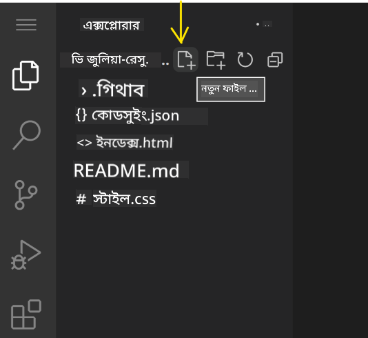
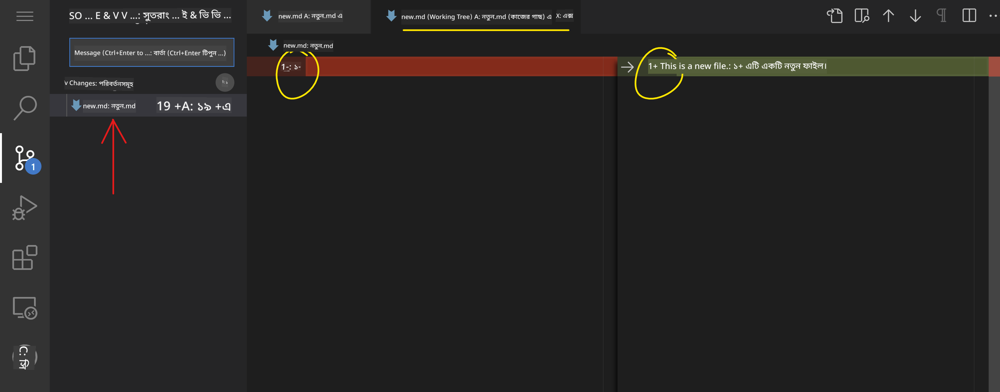
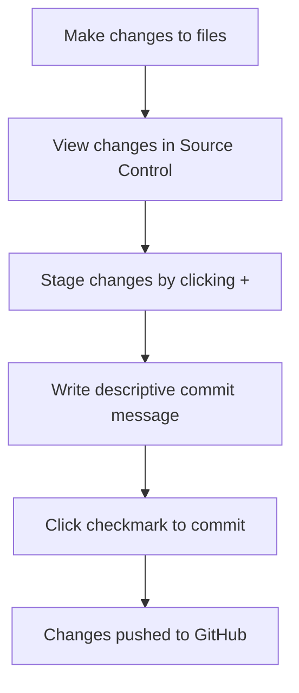
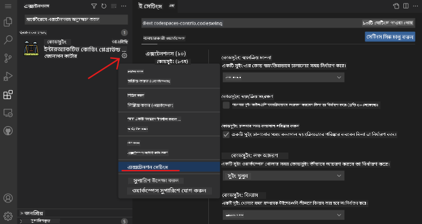

<!--
CO_OP_TRANSLATOR_METADATA:
{
  "original_hash": "cfd4a15974168ca426d50c67682ab9d4",
  "translation_date": "2025-10-22T21:28:10+00:00",
  "source_file": "8-code-editor/1-using-a-code-editor/README.md",
  "language_code": "bn"
}
-->
# কোড এডিটর ব্যবহার: VSCode.dev-এ দক্ষতা অর্জন

*দ্য ম্যাট্রিক্স* সিনেমায় যেমন নিওকে বিশাল কম্পিউটার টার্মিনালে প্লাগ ইন করতে হয়েছিল ডিজিটাল জগতে প্রবেশের জন্য, আজকের ওয়েব ডেভেলপমেন্ট টুলস সম্পূর্ণ বিপরীত – অসাধারণ ক্ষমতা যেকোনো জায়গা থেকে অ্যাক্সেস করা যায়। VSCode.dev একটি ব্রাউজার-ভিত্তিক কোড এডিটর যা পেশাদার ডেভেলপমেন্ট টুলসকে ইন্টারনেট সংযোগযুক্ত যেকোনো ডিভাইসে নিয়ে আসে।

যেভাবে ছাপাখানা বইকে সবার জন্য সহজলভ্য করেছিল, শুধুমাত্র মঠের লেখকদের জন্য নয়, VSCode.dev কোডিংকে গণতান্ত্রিক করে তুলেছে। আপনি লাইব্রেরির কম্পিউটার, স্কুলের ল্যাব, বা যেকোনো জায়গা থেকে যেখানে ব্রাউজার অ্যাক্সেস আছে, সেখান থেকে কাজ করতে পারেন। কোনো ইনস্টলেশন প্রয়োজন নেই, কোনো "আমার নির্দিষ্ট সেটআপ দরকার" সীমাবদ্ধতা নেই।

এই পাঠ শেষে, আপনি বুঝতে পারবেন কীভাবে VSCode.dev-এ নেভিগেট করতে হয়, সরাসরি ব্রাউজারে GitHub রিপোজিটরি খুলতে হয় এবং ভার্সন কন্ট্রোলের জন্য Git ব্যবহার করতে হয় – যা পেশাদার ডেভেলপাররা প্রতিদিন নির্ভর করে।

## আপনি কী শিখবেন

আমরা একসাথে এই বিষয়গুলো নিয়ে আলোচনা করার পর, আপনি পারবেন:

- VSCode.dev-এ নেভিগেট করতে, যেন এটি আপনার দ্বিতীয় বাড়ি – যা প্রয়োজন তা খুঁজে পেতে এবং হারিয়ে না যেতে
- যেকোনো GitHub রিপোজিটরি ব্রাউজারে খুলে সঙ্গে সঙ্গে এডিট করতে (এটি সত্যিই জাদুকরী!)
- Git ব্যবহার করে আপনার পরিবর্তন ট্র্যাক করতে এবং পেশাদারদের মতো আপনার অগ্রগতি সংরক্ষণ করতে
- কোডিংকে দ্রুত এবং আরও মজাদার করার জন্য এক্সটেনশন দিয়ে আপনার এডিটরকে সুপারচার্জ করতে
- আত্মবিশ্বাসের সাথে প্রজেক্ট ফাইল তৈরি এবং সংগঠিত করতে

## আপনার যা প্রয়োজন

প্রয়োজনীয় জিনিসগুলো খুবই সহজ:

- একটি ফ্রি [GitHub অ্যাকাউন্ট](https://github.com) (প্রয়োজনে আমরা আপনাকে তৈরি করতে সাহায্য করব)
- ওয়েব ব্রাউজার সম্পর্কে প্রাথমিক ধারণা
- GitHub Basics পাঠটি সহায়ক হতে পারে, যদিও এটি অপরিহার্য নয়

> 💡 **GitHub-এ নতুন?** একটি অ্যাকাউন্ট তৈরি করা ফ্রি এবং কয়েক মিনিটের মধ্যে করা যায়। যেমন একটি লাইব্রেরি কার্ড আপনাকে বিশ্বব্যাপী বইয়ের অ্যাক্সেস দেয়, একটি GitHub অ্যাকাউন্ট আপনাকে ইন্টারনেট জুড়ে কোড রিপোজিটরির দরজা খুলে দেয়।

## কেন ওয়েব-ভিত্তিক কোড এডিটর গুরুত্বপূর্ণ

ইন্টারনেটের আগে, বিভিন্ন বিশ্ববিদ্যালয়ের বিজ্ঞানীরা সহজে গবেষণা শেয়ার করতে পারতেন না। তারপর ১৯৬০-এর দশকে ARPANET এলো, যা দূরত্বে থাকা কম্পিউটারগুলোকে সংযুক্ত করল। ওয়েব-ভিত্তিক কোড এডিটর একই নীতির অনুসরণ করে – শক্তিশালী টুলসকে আপনার শারীরিক অবস্থান বা ডিভাইস নির্বিশেষে অ্যাক্সেসযোগ্য করে তোলে।

একটি কোড এডিটর আপনার ডেভেলপমেন্ট ওয়ার্কস্পেস হিসেবে কাজ করে, যেখানে আপনি কোড ফাইল লিখেন, এডিট করেন এবং সংগঠিত করেন। সাধারণ টেক্সট এডিটরের তুলনায়, পেশাদার কোড এডিটর সিনট্যাক্স হাইলাইটিং, ত্রুটি সনাক্তকরণ এবং প্রজেক্ট ম্যানেজমেন্ট ফিচার প্রদান করে।

VSCode.dev এই ক্ষমতাগুলো আপনার ব্রাউজারে নিয়ে আসে:

**ওয়েব-ভিত্তিক এডিটিংয়ের সুবিধা:**

| ফিচার | বিবরণ | ব্যবহারিক সুবিধা |
|---------|-------------|----------|
| **প্ল্যাটফর্ম স্বাধীনতা** | যেকোনো ব্রাউজারযুক্ত ডিভাইসে চলে | বিভিন্ন কম্পিউটার থেকে নির্বিঘ্নে কাজ করুন |
| **ইনস্টলেশন প্রয়োজন নেই** | একটি ওয়েব URL-এর মাধ্যমে অ্যাক্সেস | সফটওয়্যার ইনস্টলেশনের সীমাবদ্ধতা এড়িয়ে যান |
| **স্বয়ংক্রিয় আপডেট** | সর্বদা সর্বশেষ ভার্সন চালায় | ম্যানুয়াল আপডেট ছাড়াই নতুন ফিচার অ্যাক্সেস |
| **রিপোজিটরি ইন্টিগ্রেশন** | GitHub-এর সাথে সরাসরি সংযোগ | লোকাল ফাইল ম্যানেজমেন্ট ছাড়াই কোড এডিট করুন |

**ব্যবহারিক প্রভাব:**
- বিভিন্ন পরিবেশে কাজের ধারাবাহিকতা
- অপারেটিং সিস্টেম নির্বিশেষে একরূপ ইন্টারফেস
- তাৎক্ষণিক সহযোগিতার ক্ষমতা
- লোকাল স্টোরেজের প্রয়োজনীয়তা কমানো

## VSCode.dev অন্বেষণ করা

যেভাবে মেরি কিউরির ল্যাব একটি সাধারণ জায়গায় জটিল সরঞ্জাম ধারণ করত, VSCode.dev একটি ব্রাউজার ইন্টারফেসে পেশাদার ডেভেলপমেন্ট টুলস প্যাক করে। এই ওয়েব অ্যাপ্লিকেশনটি ডেস্কটপ কোড এডিটরের মতোই মূল কার্যকারিতা প্রদান করে।

[VSCode.dev](https://vscode.dev)-এ আপনার ব্রাউজারে নেভিগেট করে শুরু করুন। ইন্টারফেসটি কোনো ডাউনলোড বা সিস্টেম ইনস্টলেশন ছাড়াই লোড হয় – ক্লাউড কম্পিউটিং নীতির সরাসরি প্রয়োগ।

### আপনার GitHub অ্যাকাউন্ট সংযুক্ত করা

যেভাবে আলেকজান্ডার গ্রাহাম বেলের টেলিফোন দূরবর্তী স্থানগুলোকে সংযুক্ত করেছিল, আপনার GitHub অ্যাকাউন্ট সংযুক্ত করা VSCode.dev-কে আপনার কোড রিপোজিটরির সাথে সংযুক্ত করে। GitHub দিয়ে সাইন ইন করতে বলা হলে, এই সংযোগ গ্রহণ করা সুপারিশ করা হয়।

**GitHub ইন্টিগ্রেশন প্রদান করে:**
- এডিটরের মধ্যে আপনার রিপোজিটরিগুলোর সরাসরি অ্যাক্সেস
- ডিভাইস জুড়ে সেটিংস এবং এক্সটেনশন সিঙ্ক্রোনাইজ করা
- GitHub-এ সংরক্ষণের জন্য সহজতর ওয়ার্কফ্লো
- ব্যক্তিগতকৃত ডেভেলপমেন্ট পরিবেশ

### আপনার নতুন ওয়ার্কস্পেস সম্পর্কে জানা

সবকিছু লোড হওয়ার পর, আপনি একটি সুন্দর পরিষ্কার ওয়ার্কস্পেস দেখতে পাবেন যা আপনাকে আপনার কোডে মনোযোগ দিতে সাহায্য করার জন্য ডিজাইন করা হয়েছে!

**এখানে আপনার আশেপাশের ট্যুর:**
- **অ্যাক্টিভিটি বার** (বাম পাশে স্ট্রিপটি): আপনার প্রধান নেভিগেশন Explorer 📁, Search 🔍, Source Control 🌿, Extensions 🧩, এবং Settings ⚙️
- **সাইডবার** (এর পাশের প্যানেল): আপনি যা নির্বাচন করেছেন তার উপর ভিত্তি করে প্রাসঙ্গিক তথ্য দেখায়
- **এডিটর এরিয়া** (মাঝখানের বড় জায়গা): এখানেই ম্যাজিক ঘটে – আপনার প্রধান কোডিং এরিয়া

**একটু ঘুরে দেখুন:**
- অ্যাক্টিভিটি বার আইকনগুলোতে ক্লিক করুন এবং দেখুন প্রতিটি কী করে
- লক্ষ্য করুন কীভাবে সাইডবার বিভিন্ন তথ্য দেখানোর জন্য আপডেট হয় – বেশ চমৎকার, তাই না?
- Explorer ভিউ (📁) সম্ভবত যেখানে আপনি বেশিরভাগ সময় কাটাবেন, তাই এটি নিয়ে আরামদায়ক হন

## GitHub রিপোজিটরি খোলা

ইন্টারনেটের আগে, গবেষকদের ডকুমেন্ট অ্যাক্সেস করতে লাইব্রেরিতে শারীরিকভাবে যেতে হতো। GitHub রিপোজিটরি একইভাবে কাজ করে – এগুলো দূরবর্তীভাবে সংরক্ষিত কোডের সংগ্রহ। VSCode.dev ঐতিহ্যবাহী রিপোজিটরি লোকাল মেশিনে ডাউনলোড করার ধাপটি বাদ দিয়ে সরাসরি এডিটিং সক্ষম করে।

এই ক্ষমতা যেকোনো পাবলিক রিপোজিটরিতে তাৎক্ষণিক অ্যাক্সেস প্রদান করে দেখার, এডিট করার বা অবদান রাখার জন্য। রিপোজিটরি খোলার দুটি পদ্ধতি এখানে দেওয়া হলো:

### পদ্ধতি ১: পয়েন্ট-এন্ড-ক্লিক পদ্ধতি

যখন আপনি VSCode.dev-এ নতুন শুরু করছেন এবং একটি নির্দিষ্ট রিপোজিটরি খুলতে চান, এটি সরল এবং শিক্ষানবিশ-বান্ধব:

**কীভাবে করবেন:**

1. [VSCode.dev](https://vscode.dev)-এ যান যদি আপনি ইতিমধ্যে সেখানে না থাকেন
2. ওয়েলকাম স্ক্রিনে "Open Remote Repository" বোতামটি খুঁজুন এবং ক্লিক করুন

   

3. যেকোনো GitHub রিপোজিটরি URL পেস্ট করুন (এটি চেষ্টা করুন: `https://github.com/microsoft/Web-Dev-For-Beginners`)
4. Enter চাপুন এবং ম্যাজিক দেখুন!

**প্রো টিপ - কমান্ড প্যালেট শর্টকাট:**

কোডিং উইজার্ডের মতো অনুভব করতে চান? এই কীবোর্ড শর্টকাটটি চেষ্টা করুন: Ctrl+Shift+P (বা Mac-এ Cmd+Shift+P) কমান্ড প্যালেট খুলতে:

**কমান্ড প্যালেট হলো সবকিছু করার জন্য একটি সার্চ ইঞ্জিনের মতো:**
- "open remote" টাইপ করুন এবং এটি আপনার জন্য রিপোজিটরি ওপেনার খুঁজে দেবে
- এটি আপনার সম্প্রতি খোলা রিপোজিটরিগুলো মনে রাখে (খুবই সুবিধাজনক!)
- একবার আপনি এটি ব্যবহার করতে অভ্যস্ত হয়ে গেলে, আপনি বিদ্যুতের গতিতে কোডিং করছেন বলে মনে হবে
- এটি মূলত VSCode.dev-এর "হে সিরি, কিন্তু কোডিংয়ের জন্য" সংস্করণ

### পদ্ধতি ২: URL পরিবর্তন কৌশল

যেভাবে HTTP এবং HTTPS বিভিন্ন প্রোটোকল ব্যবহার করে একই ডোমেইন স্ট্রাকচার বজায় রাখে, VSCode.dev একটি URL প্যাটার্ন ব্যবহার করে যা GitHub-এর ঠিকানার সিস্টেমকে প্রতিফলিত করে। যেকোনো GitHub রিপোজিটরি URL পরিবর্তন করে সরাসরি VSCode.dev-এ খোলা যেতে পারে।

**URL রূপান্তর প্যাটার্ন:**

| রিপোজিটরি টাইপ | GitHub URL | VSCode.dev URL |
|----------------|---------------------|----------------|
| **পাবলিক রিপোজিটরি** | `github.com/microsoft/Web-Dev-For-Beginners` | `vscode.dev/github/microsoft/Web-Dev-For-Beginners` |
| **ব্যক্তিগত প্রজেক্ট** | `github.com/your-username/my-project` | `vscode.dev/github/your-username/my-project` |
| **যেকোনো অ্যাক্সেসযোগ্য রিপো** | `github.com/their-username/awesome-repo` | `vscode.dev/github/their-username/awesome-repo` |

**বাস্তবায়ন:**
- `github.com` পরিবর্তন করে `vscode.dev/github` করুন
- অন্যান্য URL উপাদান অপরিবর্তিত রাখুন
- যেকোনো পাবলিকলি অ্যাক্সেসযোগ্য রিপোজিটরির সাথে কাজ করে
- তাৎক্ষণিক এডিটিং অ্যাক্সেস প্রদান করে

> 💡 **জীবন পরিবর্তনকারী টিপ**: আপনার প্রিয় রিপোজিটরিগুলোর VSCode.dev সংস্করণ বুকমার্ক করুন। আমার কাছে "Edit My Portfolio" এবং "Fix Documentation" এর মতো বুকমার্ক আছে যা আমাকে সরাসরি এডিটিং মোডে নিয়ে যায়!

**কোন পদ্ধতি ব্যবহার করবেন?**
- **ইন্টারফেস পদ্ধতি**: যখন আপনি অনুসন্ধান করছেন বা সঠিক রিপোজিটরি নাম মনে করতে পারছেন না
- **URL ট্রিক**: যখন আপনি ঠিক কোথায় যাচ্ছেন তা জানেন তখন দ্রুত অ্যাক্সেসের জন্য আদর্শ

## ফাইল এবং প্রজেক্ট নিয়ে কাজ করা

এখন যেহেতু আপনি একটি রিপোজিটরি খুলেছেন, চলুন শুরু করি! VSCode.dev আপনাকে যা প্রয়োজন তা সবকিছু দেয় কোড ফাইল তৈরি, এডিট এবং সংগঠিত করার জন্য। এটি আপনার ডিজিটাল ওয়ার্কশপের মতো – প্রতিটি টুল ঠিক যেখানে আপনার প্রয়োজন।

চলুন আপনার দৈনন্দিন কোডিং ওয়ার্কফ্লো তৈরি করার কাজগুলোতে ডুব দেই।

### নতুন ফাইল তৈরি করা

যেভাবে একজন স্থপতির অফিসে নকশাগুলো সংগঠিত করা হয়, VSCode.dev-এ ফাইল তৈরি একটি গঠিত পদ্ধতি অনুসরণ করে। সিস্টেমটি সমস্ত স্ট্যান্ডার্ড ওয়েব ডেভেলপমেন্ট ফাইল টাইপ সমর্থন করে।

**ফাইল তৈরির প্রক্রিয়া:**

1. Explorer সাইডবারে টার্গেট ফোল্ডারে নেভিগেট করুন
2. ফোল্ডার নামের উপর মাউস হোভার করুন "New File" আইকন (📄+) দেখতে
3. সঠিক এক্সটেনশনসহ ফাইলের নাম লিখুন (`style.css`, `script.js`, `index.html`)
4. ফাইল তৈরি করতে Enter চাপুন

**নামকরণের নিয়ম:**
- ফাইলের উদ্দেশ্য নির্দেশ করে এমন বর্ণনামূলক নাম ব্যবহার করুন
- সঠিক সিনট্যাক্স হাইলাইটিংয়ের জন্য ফাইল এক্সটেনশন অন্তর্ভুক্ত করুন
- প্রজেক্ট জুড়ে ধারাবাহিক নামকরণের প্যাটার্ন অনুসরণ করুন
- ছোট হাতের অক্ষর এবং স্পেসের পরিবর্তে হাইফেন ব্যবহার করুন

### ফাইল এডিট এবং সংরক্ষণ করা

এখানেই আসল মজা শুরু হয়! VSCode.dev-এর এডিটর এমন অনেক সুবিধা দিয়ে ভরা যা কোডিংকে মসৃণ এবং স্বজ্ঞাত করে তোলে। এটি একটি খুবই স্মার্ট লেখার সহকারী থাকার মতো, কিন্তু কোডের জন্য।

**আপনার এডিটিং ওয়ার্কফ্লো:**

1. Explorer-এ যেকোনো ফাইল ক্লিক করুন এটি মূল জায়গায় খুলতে
2. টাইপ করা শুরু করুন এবং দেখুন কীভাবে VSCode.dev আপনাকে রঙ, সাজেশন এবং ত্রুটি শনাক্তকরণে সাহায্য করে
3. Ctrl+S (Windows/Linux) বা Cmd+S (Mac) দিয়ে আপনার কাজ সংরক্ষণ করুন – যদিও এটি স্বয়ংক্রিয়ভাবে সংরক্ষণও করে!

**কোডিং করার সময় যা চমৎকার হয়:**
- আপনার কোড সুন্দরভাবে রঙিন হয়, যা পড়তে সহজ করে তোলে
- VSCode.dev টাইপ করার সময় সাজেশন দেয় (অটোকারেক্টের মতো, কিন্তু আরও স্মার্ট)
- এটি টাইপো এবং ত্রুটি ধরার আগেই সনাক্ত করে
- আপনি একাধিক ফাইল ট্যাবে খুলে রাখতে পারেন, ঠিক ব্রাউজারের মতো
- সবকিছু ব্যাকগ্রাউন্ডে স্বয়ংক্রিয়ভাবে সংরক্ষণ হয়

> ⚠️ **দ্রুত টিপ**: যদিও অটো-সেভ আপনার পাশে আছে, Ctrl+S বা Cmd+S চাপা এখনও একটি ভালো অভ্যাস। এটি সঙ্গে সঙ্গে সবকিছু সংরক্ষণ করে এবং কিছু অতিরিক্ত সহায়ক ফিচার যেমন ত্রুটি চেকিং ট্রিগার করে।

### Git দিয়ে ভার্সন কন্ট্রোল

যেভাবে প্রত্নতাত্ত্বিকরা খননের স্তরের বিস্তারিত রেকর্ড তৈরি করেন, Git সময়ের সাথে আপনার কোডে পরিবর্তন ট্র্যাক করে। এই সিস্টেমটি প্রজেক্টের ইতিহাস সংরক্ষণ করে এবং প্রয়োজন হলে পূর্ববর্তী সংস্করণে ফিরে যেতে সক্ষম করে। VSCode.dev-এ ইন্টিগ্রেটেড Git ফাংশনালিটি অন্তর্ভুক্ত রয়েছে।

**সোর্স কন্ট্রোল ইন্টারফেস:**

1. অ্যাক্টিভিটি বারে 🌿 আইকনের মাধ্যমে সোর্স কন্ট্রোল প্যানেলে অ্যাক্সেস করুন
2. পরিবর্তিত ফাইলগুলো "Changes" সেকশনে প্রদর্শিত হবে
3. রঙ কোডিং পরিবর্তনের ধরন নির্দেশ করে: সংযোজনের জন্য সবুজ, অপসারণের জন্য লাল

**আপনার কাজ সংরক্ষণ (কমিট ওয়ার্কফ্লো):**

**আপনার ধাপে ধাপে প্রক্রিয়া:**
- আপনি যে ফাইলগুলো সংরক্ষণ করতে চান তার পাশে "+" আইকনে ক্লিক করুন (এটি "স্টেজ" করে)
- আপনার সমস্ত স্টেজ করা পরিবর্তনগুলো নিয়ে সন্তুষ্ট কিনা তা ডাবল-চেক করুন
- আপনি যা করেছেন তার একটি ছোট নোট লিখুন (এটি আপনার "কমিট মেসেজ")
- সবকিছু GitHub-এ সংরক্ষণ করতে চেকমার্ক বোতামে ক্লিক করুন
- যদি আপনি কোনো কিছু নিয়ে মত পরিবর্তন করেন, আনডু আইকনটি আপনাকে পরিবর্তন বাতিল করতে দেয়

**ভালো কমিট মেসেজ লেখা (এটি আপনার ধারণার চেয়ে সহজ!):**
- শুধু যা করেছেন তা বর্ণনা করুন, যেমন "Add contact form" বা "Fix broken navigation"
- এটি সংক্ষিপ্ত এবং মিষ্টি রাখুন – টুইটের দৈর্ঘ্য, প্রবন্ধ নয়
- "Add", "Fix", "Update", বা "Remove" এর মতো অ্যাকশন শব্দ দিয়ে শুরু করুন
- **ভালো উদাহরণ**:
- প্রতিটি এক্সটেনশন রেটিং, ডাউনলোড সংখ্যা এবং বাস্তব ব্যবহারকারীর রিভিউ দেখায়
- আপনি স্ক্রিনশট এবং প্রতিটি এক্সটেনশন কী করে তার স্পষ্ট বিবরণ পাবেন
- সবকিছু স্পষ্টভাবে সামঞ্জস্যতার তথ্য দিয়ে চিহ্নিত করা থাকে
- অনুরূপ এক্সটেনশন প্রস্তাব করা হয় যাতে আপনি বিকল্পগুলি তুলনা করতে পারেন

### এক্সটেনশন ইনস্টল করা (এটা খুবই সহজ!)

আপনার এডিটরে নতুন ক্ষমতা যোগ করা একটি বোতাম ক্লিক করার মতোই সহজ। এক্সটেনশন কয়েক সেকেন্ডে ইনস্টল হয় এবং সাথে সাথে কাজ শুরু করে – কোনো রিস্টার্ট বা অপেক্ষার দরকার নেই।

**আপনাকে যা করতে হবে তা হলো:**

1. আপনি যা চান তা অনুসন্ধান করুন (যেমন "live server" বা "prettier" অনুসন্ধান করুন)
2. যেটি ভালো দেখায় সেটিতে ক্লিক করুন এবং আরও বিস্তারিত দেখুন
3. এটি কী করে এবং রেটিংগুলি পড়ুন
4. সেই নীল "Install" বোতামে ক্লিক করুন এবং কাজ শেষ!

**পর্দার পিছনে যা ঘটে:**
- এক্সটেনশনটি ডাউনলোড হয় এবং স্বয়ংক্রিয়ভাবে সেটআপ হয়
- নতুন ফিচারগুলি সাথে সাথে আপনার ইন্টারফেসে প্রদর্শিত হয়
- সবকিছু সাথে সাথে কাজ শুরু করে (সত্যিই, এটা এত দ্রুত!)
- আপনি যদি সাইন ইন করেন, এক্সটেনশনটি আপনার সব ডিভাইসে সিঙ্ক হয়

**কিছু এক্সটেনশন যা দিয়ে শুরু করতে পারেন:**
- **Live Server**: কোড করার সময় আপনার ওয়েবসাইট রিয়েল-টাইমে আপডেট দেখুন (এটা জাদুর মতো!)
- **Prettier**: আপনার কোডকে স্বয়ংক্রিয়ভাবে পরিষ্কার এবং পেশাদার দেখায়
- **Auto Rename Tag**: একটি HTML ট্যাগ পরিবর্তন করুন এবং তার সঙ্গীও আপডেট হয়
- **Bracket Pair Colorizer**: আপনার ব্র্যাকেটগুলো রঙিন করে যাতে আপনি কখনো হারিয়ে না যান
- **GitLens**: আপনার Git ফিচারগুলোকে উন্নত করে প্রচুর সহায়ক তথ্য দিয়ে

### আপনার এক্সটেনশন কাস্টমাইজ করা

বেশিরভাগ এক্সটেনশন সেটিংস নিয়ে আসে যা আপনি আপনার পছন্দমতো কাজ করার জন্য সামঞ্জস্য করতে পারেন। এটি গাড়ির সিট এবং মিরর সামঞ্জস্য করার মতো – প্রত্যেকেরই তাদের নিজস্ব পছন্দ থাকে!

**এক্সটেনশন সেটিংস সামঞ্জস্য করা:**

1. Extensions প্যানেলে আপনার ইনস্টল করা এক্সটেনশনটি খুঁজুন
2. তার নামের পাশে ছোট গিয়ার আইকন (⚙️) খুঁজুন এবং ক্লিক করুন
3. ড্রপডাউন থেকে "Extension Settings" নির্বাচন করুন
4. আপনার কাজের ধারা অনুযায়ী জিনিসগুলো সামঞ্জস্য করুন

**আপনি যা সামঞ্জস্য করতে পারেন:**
- আপনার কোড কীভাবে ফরম্যাট হবে (ট্যাব বনাম স্পেস, লাইন দৈর্ঘ্য ইত্যাদি)
- কোন কীবোর্ড শর্টকাট বিভিন্ন কাজ ট্রিগার করবে
- কোন ফাইল টাইপের সাথে এক্সটেনশন কাজ করবে
- নির্দিষ্ট ফিচার চালু বা বন্ধ করে জিনিসগুলো পরিষ্কার রাখা

### আপনার এক্সটেনশনগুলো সংগঠিত রাখা

যখন আপনি আরও চমৎকার এক্সটেনশন আবিষ্কার করবেন, তখন আপনি আপনার সংগ্রহটি পরিষ্কার এবং মসৃণভাবে চালানোর জন্য সংগঠিত রাখতে চাইবেন। VSCode.dev এটি পরিচালনা করা খুব সহজ করে তোলে।

**আপনার এক্সটেনশন ব্যবস্থাপনার বিকল্প:**

| আপনি যা করতে পারেন | কখন এটি সহায়ক | প্রো টিপ |
|--------|---------|----------|
| **Disable** | যদি কোনো এক্সটেনশন সমস্যা সৃষ্টি করছে কিনা পরীক্ষা করতে চান | এটি আনইনস্টল করার চেয়ে ভালো যদি আপনি এটি আবার ব্যবহার করতে চান |
| **Uninstall** | আপনি যা প্রয়োজন নেই এমন এক্সটেনশন সম্পূর্ণভাবে সরিয়ে ফেলুন | আপনার পরিবেশ পরিষ্কার এবং দ্রুত রাখে |
| **Update** | সর্বশেষ ফিচার এবং বাগ ফিক্স পেতে | সাধারণত স্বয়ংক্রিয়ভাবে ঘটে, তবে চেক করা ভালো |

**আমি কীভাবে এক্সটেনশন পরিচালনা করতে পছন্দ করি:**
- কয়েক মাস পরপর আমি যা ইনস্টল করেছি তা পর্যালোচনা করি এবং যা ব্যবহার করছি না তা সরিয়ে ফেলি
- আমি এক্সটেনশন আপডেট রাখি যাতে সর্বশেষ উন্নতি এবং নিরাপত্তা ফিক্স পাই
- যদি কিছু ধীর মনে হয়, আমি অস্থায়ীভাবে এক্সটেনশনগুলো ডিসেবল করি এবং দেখি কোনটি সমস্যা সৃষ্টি করছে
- যখন এক্সটেনশন বড় আপডেট পায়, আমি আপডেট নোট পড়ি – কখনো কখনো চমৎকার নতুন ফিচার থাকে!

> ⚠️ **পারফরম্যান্স টিপ**: এক্সটেনশনগুলো চমৎকার, তবে অনেক বেশি থাকলে জিনিসগুলো ধীর হতে পারে। শুধুমাত্র সেগুলোতে ফোকাস করুন যা সত্যিই আপনার জীবন সহজ করে এবং যা কখনো ব্যবহার করেন না তা আনইনস্টল করতে দ্বিধা করবেন না।

## GitHub Copilot Agent Challenge 🚀

নাসা যেভাবে স্পেস মিশনের জন্য গঠনমূলক পদ্ধতি ব্যবহার করে, এই চ্যালেঞ্জটি VSCode.dev দক্ষতার একটি সম্পূর্ণ কর্মপ্রবাহ দৃশ্যকল্পে পদ্ধতিগত প্রয়োগ জড়িত।

**উদ্দেশ্য:** একটি সম্পূর্ণ ওয়েব ডেভেলপমেন্ট কর্মপ্রবাহ প্রতিষ্ঠা করে VSCode.dev-এ দক্ষতা প্রদর্শন করুন।

**প্রকল্পের প্রয়োজনীয়তা:** Agent mode সহায়তা ব্যবহার করে এই কাজগুলো সম্পন্ন করুন:
1. একটি বিদ্যমান রিপোজিটরি ফর্ক করুন বা একটি নতুন তৈরি করুন
2. HTML, CSS এবং JavaScript ফাইল সহ একটি কার্যকরী প্রকল্প কাঠামো প্রতিষ্ঠা করুন
3. তিনটি ডেভেলপমেন্ট-উন্নতকারী এক্সটেনশন ইনস্টল এবং কনফিগার করুন
4. বর্ণনামূলক কমিট মেসেজ সহ ভার্সন কন্ট্রোল অনুশীলন করুন
5. ফিচার ব্রাঞ্চ তৈরি এবং পরিবর্তন করার অনুশীলন করুন
6. README.md ফাইলে প্রক্রিয়া এবং শেখাগুলো ডকুমেন্ট করুন

এই অনুশীলনটি সমস্ত VSCode.dev ধারণাগুলোকে একটি ব্যবহারিক কর্মপ্রবাহে একত্রিত করে যা ভবিষ্যতের ডেভেলপমেন্ট প্রকল্পে প্রয়োগ করা যেতে পারে।

Agent mode সম্পর্কে আরও জানুন [এখানে](https://code.visualstudio.com/blogs/2025/02/24/introducing-copilot-agent-mode)।

## অ্যাসাইনমেন্ট

এখন এই দক্ষতাগুলো বাস্তবভাবে পরীক্ষা করার সময়! আমি একটি হাতে-কলমে প্রকল্প পেয়েছি যা আপনাকে আমরা যা শিখেছি তা অনুশীলন করতে দেবে: [VSCode.dev ব্যবহার করে একটি রিজিউম ওয়েবসাইট তৈরি করুন](./assignment.md)

এই অ্যাসাইনমেন্টটি আপনাকে সম্পূর্ণভাবে আপনার ব্রাউজারে একটি পেশাদার রিজিউম ওয়েবসাইট তৈরি করার মাধ্যমে গাইড করবে। আপনি আমরা যে সমস্ত VSCode.dev ফিচারগুলো অন্বেষণ করেছি তা ব্যবহার করবেন, এবং শেষে আপনার কাছে একটি চমৎকার দেখতে ওয়েবসাইট এবং আপনার নতুন কর্মপ্রবাহে দৃঢ় আত্মবিশ্বাস থাকবে।

## আরও অন্বেষণ করুন এবং আপনার দক্ষতা বৃদ্ধি করুন

আপনার এখন একটি শক্ত ভিত্তি রয়েছে, তবে আরও অনেক চমৎকার জিনিস আবিষ্কার করার আছে! এখানে কিছু রিসোর্স এবং আইডিয়া রয়েছে যা আপনার VSCode.dev দক্ষতাকে পরবর্তী স্তরে নিয়ে যেতে সাহায্য করবে:

**বুকমার্ক করার মতো অফিসিয়াল ডকস:**
- [VSCode Web Documentation](https://code.visualstudio.com/docs/editor/vscode-web?WT.mc_id=academic-0000-alfredodeza) – ব্রাউজার-ভিত্তিক এডিটিংয়ের সম্পূর্ণ গাইড
- [GitHub Codespaces](https://docs.github.com/en/codespaces) – যখন আপনি ক্লাউডে আরও শক্তিশালী কিছু চান

**পরবর্তী পরীক্ষা করার মতো চমৎকার ফিচার:**
- **Keyboard Shortcuts**: কীভাবে দ্রুত কাজ করবেন তা শিখুন
- **Workspace Settings**: বিভিন্ন প্রকল্পের জন্য বিভিন্ন পরিবেশ সেট আপ করুন
- **Multi-root Workspaces**: একসাথে একাধিক রিপোজিটরিতে কাজ করুন (খুবই সুবিধাজনক!)
- **Terminal Integration**: আপনার ব্রাউজারেই কমান্ড-লাইন টুলগুলো অ্যাক্সেস করুন

**অনুশীলনের জন্য আইডিয়া:**
- কিছু ওপেন-সোর্স প্রকল্পে ঝাঁপিয়ে পড়ুন এবং VSCode.dev ব্যবহার করে অবদান রাখুন – এটি ফিরিয়ে দেওয়ার একটি চমৎকার উপায়!
- বিভিন্ন এক্সটেনশন চেষ্টা করুন এবং আপনার জন্য সেরা সেটআপটি খুঁজে বের করুন
- আপনি সবচেয়ে বেশি যে ধরনের সাইট তৈরি করেন তার জন্য প্রকল্প টেমপ্লেট তৈরি করুন
- Git কর্মপ্রবাহ যেমন ব্রাঞ্চিং এবং মার্জিং অনুশীলন করুন – দলীয় প্রকল্পে এই দক্ষতাগুলো খুবই গুরুত্বপূর্ণ

---

**আপনি ব্রাউজার-ভিত্তিক ডেভেলপমেন্টে দক্ষ হয়ে উঠেছেন!** 🎉 যেমন পোর্টেবল যন্ত্রের আবিষ্কার বিজ্ঞানীদের দূরবর্তী স্থানে গবেষণা করতে সক্ষম করেছে, VSCode.dev আপনাকে যেকোনো ইন্টারনেট-সংযুক্ত ডিভাইস থেকে পেশাদার কোডিং করতে সক্ষম করে।

এই দক্ষতাগুলো বর্তমান শিল্প অনুশীলনকে প্রতিফলিত করে – অনেক পেশাদার ডেভেলপার তাদের নমনীয়তা এবং অ্যাক্সেসযোগ্যতার জন্য ক্লাউড-ভিত্তিক ডেভেলপমেন্ট পরিবেশ ব্যবহার করেন। আপনি একটি কর্মপ্রবাহ শিখেছেন যা ব্যক্তিগত প্রকল্প থেকে বড় দলীয় সহযোগিতায় স্কেল করতে পারে।

আপনার পরবর্তী ডেভেলপমেন্ট প্রকল্পে এই কৌশলগুলো প্রয়োগ করুন! 🚀

---

**অস্বীকৃতি**:  
এই নথিটি AI অনুবাদ পরিষেবা [Co-op Translator](https://github.com/Azure/co-op-translator) ব্যবহার করে অনুবাদ করা হয়েছে। আমরা যথাসাধ্য সঠিকতার জন্য চেষ্টা করি, তবে অনুগ্রহ করে মনে রাখবেন যে স্বয়ংক্রিয় অনুবাদে ত্রুটি বা অসঙ্গতি থাকতে পারে। মূল ভাষায় থাকা নথিটিকে প্রামাণিক উৎস হিসেবে বিবেচনা করা উচিত। গুরুত্বপূর্ণ তথ্যের জন্য, পেশাদার মানব অনুবাদ সুপারিশ করা হয়। এই অনুবাদ ব্যবহারের ফলে কোনো ভুল বোঝাবুঝি বা ভুল ব্যাখ্যা হলে আমরা দায়ী থাকব না।