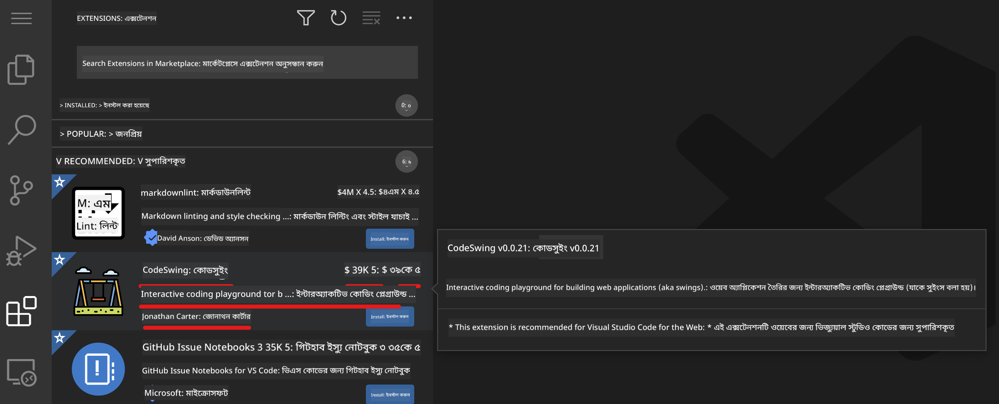
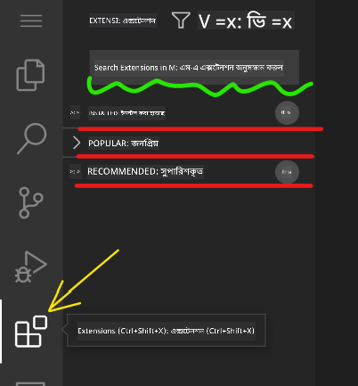

<!--
CO_OP_TRANSLATOR_METADATA:
{
  "original_hash": "1ba61d96a11309a2a6ea507496dcf7e5",
  "translation_date": "2025-08-28T23:04:54+00:00",
  "source_file": "8-code-editor/1-using-a-code-editor/README.md",
  "language_code": "bn"
}
-->
# কোড এডিটর ব্যবহার করা

এই পাঠে [VSCode.dev](https://vscode.dev) নামক একটি ওয়েব-ভিত্তিক কোড এডিটর ব্যবহারের মৌলিক বিষয়গুলো আলোচনা করা হয়েছে, যাতে আপনি আপনার কোডে পরিবর্তন আনতে এবং কোনো প্রজেক্টে অবদান রাখতে পারেন, আপনার কম্পিউটারে কিছু ইনস্টল না করেই।

## শেখার লক্ষ্যসমূহ

এই পাঠে আপনি শিখবেন:

- কোড প্রজেক্টে কোড এডিটর ব্যবহার করা
- ভার্সন কন্ট্রোলের মাধ্যমে পরিবর্তনগুলো ট্র্যাক করা
- ডেভেলপমেন্টের জন্য এডিটর কাস্টমাইজ করা

### পূর্বশর্ত

শুরু করার আগে, আপনাকে [GitHub](https://github.com) এ একটি অ্যাকাউন্ট তৈরি করতে হবে। [GitHub](https://github.com/) এ যান এবং যদি আপনার অ্যাকাউন্ট না থাকে তবে একটি অ্যাকাউন্ট তৈরি করুন।

### ভূমিকা

কোড এডিটর হলো প্রোগ্রাম লেখার এবং বিদ্যমান কোডিং প্রজেক্টে সহযোগিতা করার জন্য একটি অপরিহার্য টুল। একবার আপনি এডিটরের মৌলিক বিষয়গুলো এবং এর বৈশিষ্ট্যগুলো কীভাবে ব্যবহার করবেন তা বুঝে গেলে, আপনি এগুলো কোড লেখার সময় প্রয়োগ করতে পারবেন।

## VSCode.dev দিয়ে শুরু করা

[VSCode.dev](https://vscode.dev) হলো একটি ওয়েব-ভিত্তিক কোড এডিটর। এটি ব্যবহার করতে আপনাকে কিছু ইনস্টল করার প্রয়োজন নেই, এটি ঠিক অন্য কোনো ওয়েবসাইট খোলার মতো। এডিটরটি শুরু করতে, এই লিঙ্কটি খুলুন: [https://vscode.dev](https://vscode.dev)। যদি আপনি [GitHub](https://github.com/) এ সাইন ইন না করে থাকেন, তাহলে সাইন ইন করার বা নতুন অ্যাকাউন্ট তৈরি করার জন্য প্রম্পট অনুসরণ করুন এবং তারপর সাইন ইন করুন।

লোড হওয়ার পর, এটি নিচের ছবির মতো দেখতে হবে:


এখানে তিনটি প্রধান অংশ রয়েছে, বাম থেকে ডানে:

1. _অ্যাক্টিভিটি বার_, যেখানে কিছু আইকন রয়েছে, যেমন ম্যাগনিফাইং গ্লাস 🔎, গিয়ার ⚙️, এবং আরও কিছু।
2. _সাইড বার_, যা ডিফল্টভাবে _এক্সপ্লোরার_ এ সেট করা থাকে।
3. এবং শেষের দিকে কোডের জন্য জায়গা।

প্রতিটি আইকনে ক্লিক করে বিভিন্ন মেনু প্রদর্শন করুন। কাজ শেষ হলে, _এক্সপ্লোরার_ এ ক্লিক করুন যাতে আপনি আবার শুরুতে ফিরে আসেন।

যখন আপনি কোড তৈরি করা বা বিদ্যমান কোড পরিবর্তন করা শুরু করবেন, এটি ডানপাশের সবচেয়ে বড় জায়গায় হবে। এই জায়গাটি ব্যবহার করে আপনি বিদ্যমান কোডও দেখতে পারবেন, যা আপনি পরবর্তী ধাপে করবেন।

## একটি GitHub রিপোজিটরি খুলুন

প্রথমে আপনাকে একটি GitHub রিপোজিটরি খুলতে হবে। রিপোজিটরি খোলার বিভিন্ন উপায় রয়েছে। এই অংশে আপনি দুটি ভিন্ন উপায় দেখতে পাবেন যার মাধ্যমে আপনি রিপোজিটরি খুলে পরিবর্তন করতে পারবেন।

### ১. এডিটরের মাধ্যমে

এডিটর ব্যবহার করে একটি রিমোট রিপোজিটরি খুলুন। যদি আপনি [VSCode.dev](https://vscode.dev) এ যান, আপনি একটি _"Open Remote Repository"_ বোতাম দেখতে পাবেন:


আপনি কমান্ড প্যালেটও ব্যবহার করতে পারেন। কমান্ড প্যালেট হলো একটি ইনপুট বক্স যেখানে আপনি কোনো কমান্ড বা অ্যাকশনের অংশ হিসেবে কোনো শব্দ টাইপ করতে পারেন সঠিক কমান্ডটি খুঁজে বের করার জন্য। উপরের বাম মেনুতে যান, তারপর _View_ নির্বাচন করুন, এবং তারপর _Command Palette_ নির্বাচন করুন, অথবা এই কিবোর্ড শর্টকাট ব্যবহার করুন: Ctrl-Shift-P (MacOS এ এটি Command-Shift-P হবে)।


মেনু খুললে, _open remote repository_ টাইপ করুন এবং তারপর প্রথম অপশনটি নির্বাচন করুন। আপনি যে রিপোজিটরিগুলোর অংশ বা সম্প্রতি খুলেছেন সেগুলো দেখাবে। আপনি একটি সম্পূর্ণ GitHub URL ব্যবহার করেও একটি নির্বাচন করতে পারেন। নিচের URL ব্যবহার করুন এবং বক্সে পেস্ট করুন:

```
https://github.com/microsoft/Web-Dev-For-Beginners
```

✅ সফল হলে, আপনি এই রিপোজিটরির সব ফাইল টেক্সট এডিটরে লোড হতে দেখবেন।

### ২. URL ব্যবহার করে

আপনি সরাসরি একটি URL ব্যবহার করেও রিপোজিটরি লোড করতে পারেন। উদাহরণস্বরূপ, বর্তমান রিপোজিটরির সম্পূর্ণ URL হলো [https://github.com/microsoft/Web-Dev-For-Beginners](https://github.com/microsoft/Web-Dev-For-Beginners), তবে আপনি GitHub ডোমেইনটি `VSCode.dev/github` দিয়ে পরিবর্তন করে রিপোজিটরি সরাসরি লোড করতে পারেন। ফলাফল URL হবে [https://vscode.dev/github/microsoft/Web-Dev-For-Beginners](https://vscode.dev/github/microsoft/Web-Dev-For-Beginners)।

## ফাইল সম্পাদনা করুন

একবার আপনি ব্রাউজারে বা vscode.dev এ রিপোজিটরি খুলে ফেললে, পরবর্তী ধাপ হবে প্রজেক্টে আপডেট বা পরিবর্তন করা।

### ১. একটি নতুন ফাইল তৈরি করুন

আপনি বিদ্যমান ফোল্ডারের ভিতরে একটি ফাইল তৈরি করতে পারেন, অথবা রুট ডিরেক্টরি/ফোল্ডারে এটি তৈরি করতে পারেন। একটি নতুন ফাইল তৈরি করতে, সেই লোকেশন/ডিরেক্টরি খুলুন যেখানে আপনি ফাইলটি সংরক্ষণ করতে চান এবং _'New file ...'_ আইকনটি নির্বাচন করুন, একটি নাম দিন এবং এন্টার চাপুন।


### ২. রিপোজিটরিতে একটি ফাইল সম্পাদনা এবং সংরক্ষণ করুন

vscode.dev ব্যবহার করা সুবিধাজনক যখন আপনি আপনার প্রজেক্টে দ্রুত আপডেট করতে চান এবং কোনো সফটওয়্যার লোকালি লোড করতে চান না।  
আপনার কোড আপডেট করতে, 'Explorer' আইকনে ক্লিক করুন, যা অ্যাক্টিভিটি বারে অবস্থিত, রিপোজিটরির ফাইল ও ফোল্ডার দেখতে।  
একটি ফাইল নির্বাচন করুন যাতে এটি কোড এলাকায় খুলে যায়, পরিবর্তন করুন এবং সংরক্ষণ করুন।


আপনার প্রজেক্ট আপডেট করা শেষ হলে, _`source control`_ আইকনটি নির্বাচন করুন যেখানে আপনি আপনার রিপোজিটরিতে করা নতুন পরিবর্তনগুলো দেখতে পাবেন।

আপনার প্রজেক্টে করা পরিবর্তনগুলো দেখতে, _Changes_ ফোল্ডারে থাকা ফাইলগুলো নির্বাচন করুন যা এক্সপ্যান্ডেড অ্যাক্টিভিটি বারে রয়েছে। এটি একটি 'Working Tree' খুলবে যেখানে আপনি ভিজ্যুয়ালি দেখতে পারবেন ফাইলের পরিবর্তনগুলো। লাল রঙ প্রজেক্ট থেকে কিছু বাদ পড়া নির্দেশ করে, আর সবুজ রঙ যোগ করা নির্দেশ করে।


যদি আপনি আপনার করা পরিবর্তনগুলো নিয়ে সন্তুষ্ট হন, তাহলে _Changes_ ফোল্ডারে হোভার করুন এবং পরিবর্তনগুলো স্টেজ করতে _`+`_ বোতামে ক্লিক করুন। স্টেজিং মানে হলো আপনার পরিবর্তনগুলো GitHub এ কমিট করার জন্য প্রস্তুত করা।

যদি আপনি কিছু পরিবর্তন নিয়ে সন্তুষ্ট না হন এবং সেগুলো বাতিল করতে চান, তাহলে _Changes_ ফোল্ডারে হোভার করুন এবং _`undo`_ আইকনটি নির্বাচন করুন।

তারপর একটি _commit message_ টাইপ করুন _(আপনার প্রজেক্টে করা পরিবর্তনের বর্ণনা)_, এবং পরিবর্তনগুলো কমিট ও পুশ করতে _check icon_ এ ক্লিক করুন।

আপনার প্রজেক্টে কাজ শেষ হলে, উপরের বাম দিকে থাকা _hamburger menu icon_ নির্বাচন করুন যাতে আপনি github.com এ রিপোজিটরিতে ফিরে যেতে পারেন।


## এক্সটেনশন ব্যবহার করা

VSCode এ এক্সটেনশন ইনস্টল করলে আপনি আপনার এডিটরে নতুন বৈশিষ্ট্য যোগ করতে এবং ডেভেলপমেন্ট পরিবেশ কাস্টমাইজ করতে পারেন যা আপনার ডেভেলপমেন্ট ওয়ার্কফ্লো উন্নত করে। এই এক্সটেনশনগুলো আপনাকে একাধিক প্রোগ্রামিং ভাষার জন্য সাপোর্ট যোগ করতে সাহায্য করে এবং সাধারণত জেনেরিক এক্সটেনশন বা ভাষা-ভিত্তিক এক্সটেনশন হয়ে থাকে।

সব উপলব্ধ এক্সটেনশনের তালিকা দেখতে, অ্যাক্টিভিটি বারে _`Extensions icon`_ এ ক্লিক করুন এবং _'Search Extensions in Marketplace'_ লেবেলযুক্ত টেক্সট ফিল্ডে এক্সটেনশনের নাম টাইপ করুন।  
আপনি এক্সটেনশনের একটি তালিকা দেখতে পাবেন, যেখানে থাকবে **এক্সটেনশনের নাম, প্রকাশকের নাম, এক বাক্যের বিবরণ, ডাউনলোড সংখ্যা** এবং **স্টার রেটিং**।



আপনি পূর্বে ইনস্টল করা সব এক্সটেনশন _Installed folder_ এ, বেশিরভাগ ডেভেলপারদের ব্যবহৃত জনপ্রিয় এক্সটেনশন _Popular folder_ এ এবং আপনার জন্য সুপারিশকৃত এক্সটেনশন _recommended folder_ এ দেখতে পারবেন।



### ১. এক্সটেনশন ইনস্টল করুন

একটি এক্সটেনশন ইনস্টল করতে, সার্চ ফিল্ডে এক্সটেনশনের নাম টাইপ করুন এবং এক্সটেনশনটি এক্সপ্যান্ডেড অ্যাক্টিভিটি বারে প্রদর্শিত হলে এটি নির্বাচন করুন।  
এক্সটেনশন সম্পর্কে অতিরিক্ত তথ্য দেখতে কোড এলাকায় এটি লোড করুন।  
আপনি এক্সপ্যান্ডেড অ্যাক্টিভিটি বারে থাকা _নীল ইনস্টল বোতাম_ ব্যবহার করে অথবা কোড এলাকায় থাকা ইনস্টল বোতাম ব্যবহার করে এক্সটেনশনটি ইনস্টল করতে পারেন।


### ২. এক্সটেনশন কাস্টমাইজ করুন

এক্সটেনশন ইনস্টল করার পর, আপনি এর আচরণ পরিবর্তন করতে এবং আপনার পছন্দ অনুযায়ী কাস্টমাইজ করতে পারেন।  
এটি করতে, _Extensions icon_ নির্বাচন করুন, এবং এবার আপনার এক্সটেনশন _Installed folder_ এ প্রদর্শিত হবে।  
_**Gear icon**_ এ ক্লিক করুন এবং _Extensions Setting_ এ যান।


### ৩. এক্সটেনশন ম্যানেজ করুন

এক্সটেনশন ইনস্টল এবং ব্যবহার করার পর, vscode.dev বিভিন্ন প্রয়োজন অনুযায়ী এক্সটেনশন ম্যানেজ করার অপশন প্রদান করে। উদাহরণস্বরূপ, আপনি হয়তো:

- **ডিসেবল:** _(আপনি যখন কোনো এক্সটেনশন সাময়িকভাবে ব্যবহার করতে চান না কিন্তু সম্পূর্ণ আনইনস্টল করতে চান না)_

    এক্সপ্যান্ডেড অ্যাক্টিভিটি বারে ইনস্টল করা এক্সটেনশন নির্বাচন করুন > Gear icon এ ক্লিক করুন > 'Disable' বা 'Disable (Workspace)' নির্বাচন করুন **অথবা** কোড এলাকায় এক্সটেনশন খুলুন এবং নীল Disable বোতামে ক্লিক করুন।

- **আনইনস্টল:** এক্সপ্যান্ডেড অ্যাক্টিভিটি বারে ইনস্টল করা এক্সটেনশন নির্বাচন করুন > Gear icon এ ক্লিক করুন > 'Uninstall' নির্বাচন করুন **অথবা** কোড এলাকায় এক্সটেনশন খুলুন এবং নীল Uninstall বোতামে ক্লিক করুন।

---

## অ্যাসাইনমেন্ট

[VSCode.dev ব্যবহার করে একটি রিজিউম ওয়েবসাইট তৈরি করুন](https://github.com/microsoft/Web-Dev-For-Beginners/blob/main/8-code-editor/1-using-a-code-editor/assignment.md)

## রিভিউ এবং স্ব-অধ্যয়ন

[VSCode.dev](https://code.visualstudio.com/docs/editor/vscode-web?WT.mc_id=academic-0000-alfredodeza) এবং এর অন্যান্য বৈশিষ্ট্য সম্পর্কে আরও পড়ুন।

---

**অস্বীকৃতি**:  
এই নথিটি AI অনুবাদ পরিষেবা [Co-op Translator](https://github.com/Azure/co-op-translator) ব্যবহার করে অনুবাদ করা হয়েছে। আমরা যথাসম্ভব সঠিকতার জন্য চেষ্টা করি, তবে অনুগ্রহ করে মনে রাখবেন যে স্বয়ংক্রিয় অনুবাদে ত্রুটি বা অসঙ্গতি থাকতে পারে। মূল ভাষায় থাকা নথিটিকে প্রামাণিক উৎস হিসেবে বিবেচনা করা উচিত। গুরুত্বপূর্ণ তথ্যের জন্য, পেশাদার মানব অনুবাদ সুপারিশ করা হয়। এই অনুবাদ ব্যবহারের ফলে কোনো ভুল বোঝাবুঝি বা ভুল ব্যাখ্যা হলে আমরা দায়বদ্ধ থাকব না।