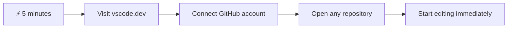
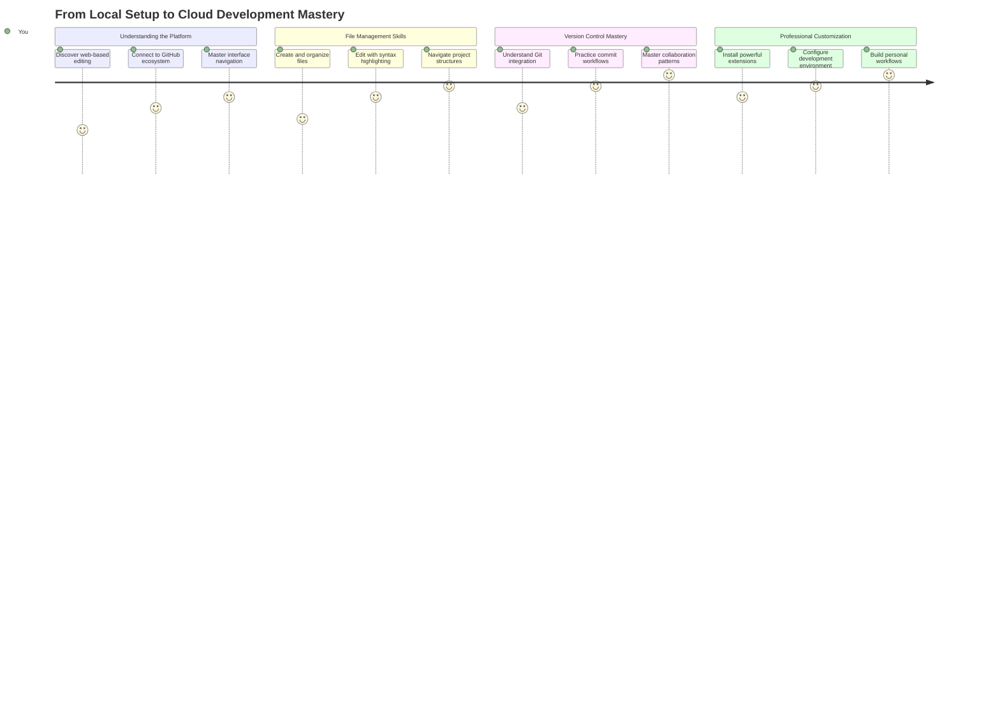
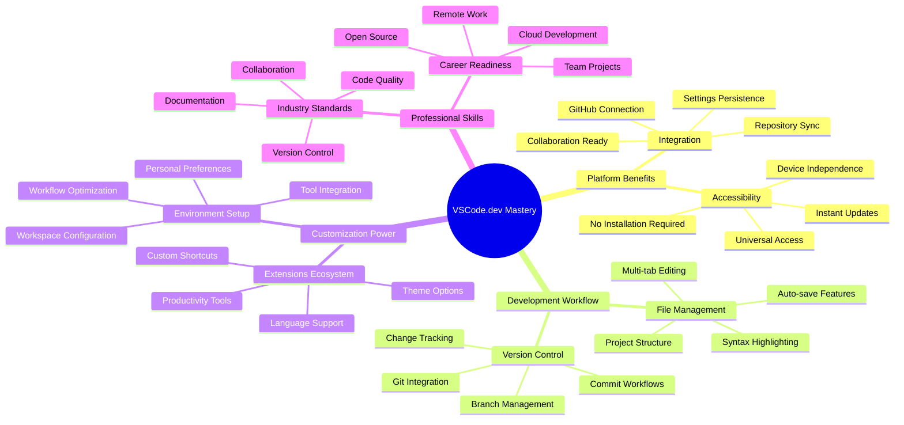
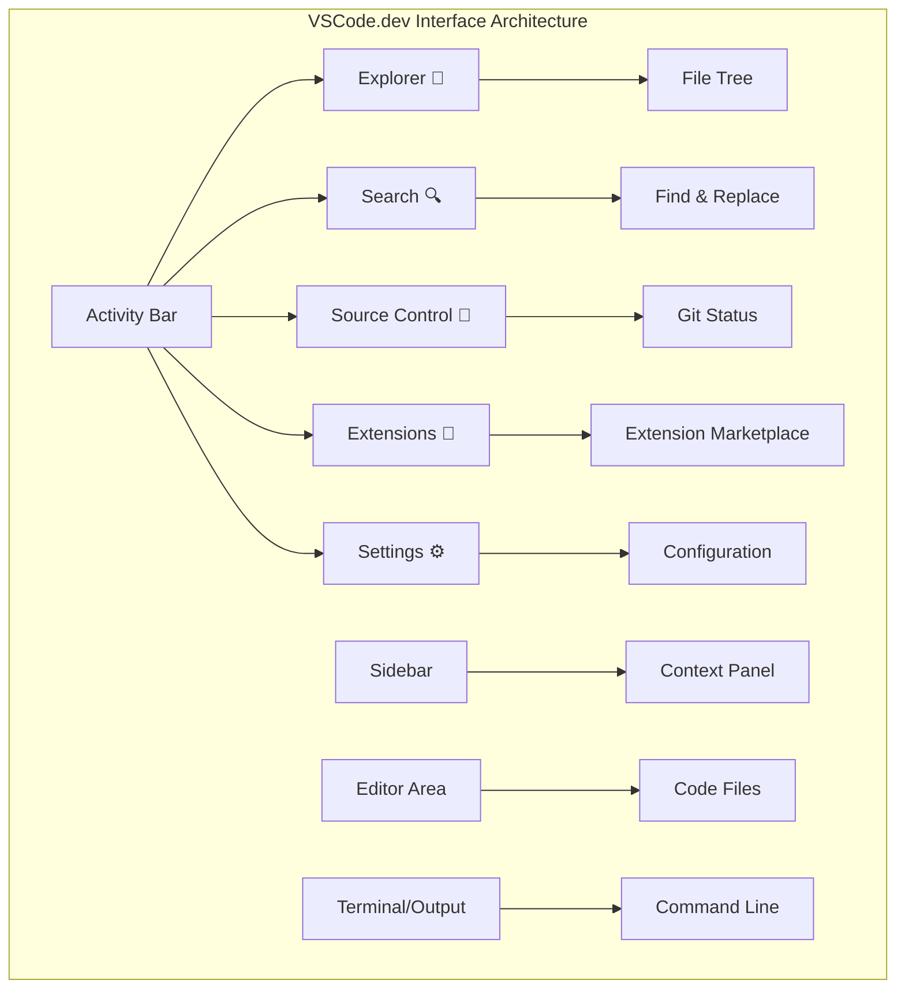
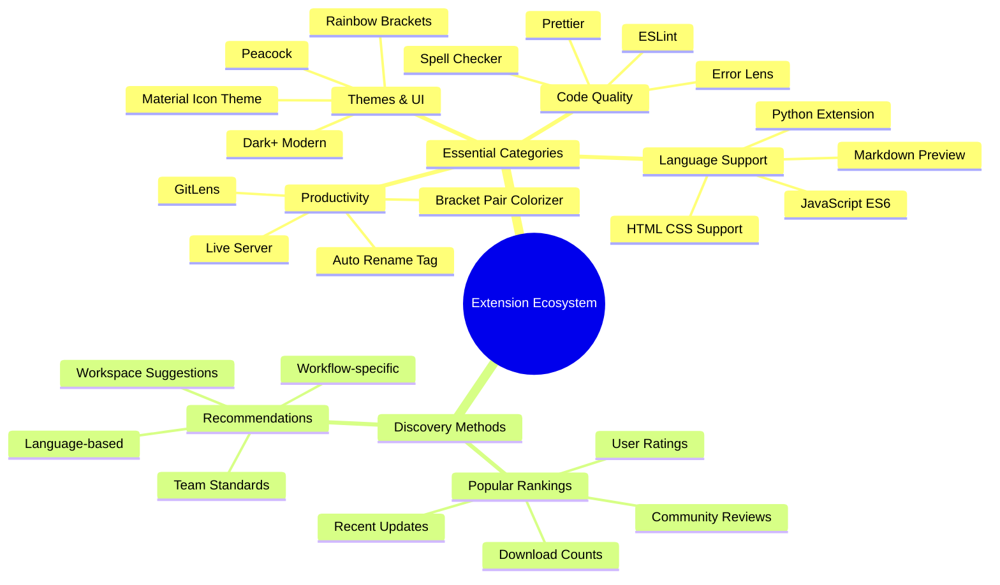
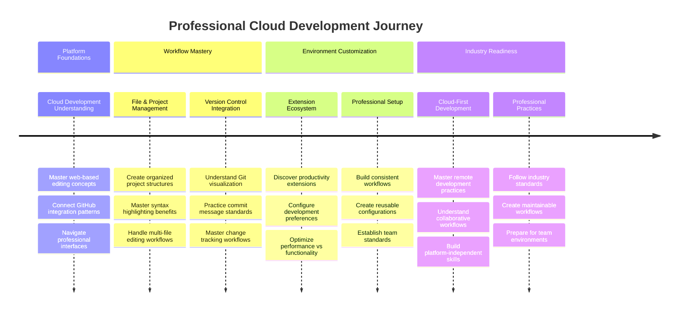

<!--
CO_OP_TRANSLATOR_METADATA:
{
  "original_hash": "a9a3bcc037a447e2d8994d99e871cd9f",
  "translation_date": "2025-11-03T22:25:40+00:00",
  "source_file": "8-code-editor/1-using-a-code-editor/README.md",
  "language_code": "bn"
}
-->
# কোড এডিটর ব্যবহার: VSCode.dev-এ দক্ষতা অর্জন

*দ্য ম্যাট্রিক্স* সিনেমায় নিওকে বিশাল কম্পিউটার টার্মিনালে প্লাগ ইন করতে হয়েছিল ডিজিটাল জগতে প্রবেশের জন্য। আজকের ওয়েব ডেভেলপমেন্ট টুলস সম্পূর্ণ বিপরীত – যেকোনো জায়গা থেকে সহজেই শক্তিশালী ক্ষমতা পাওয়া যায়। VSCode.dev একটি ব্রাউজার-ভিত্তিক কোড এডিটর যা পেশাদার ডেভেলপমেন্ট টুলসকে ইন্টারনেট সংযোগযুক্ত যেকোনো ডিভাইসে নিয়ে আসে।

যেভাবে প্রিন্টিং প্রেস বইকে সবার জন্য সহজলভ্য করেছিল, শুধুমাত্র মঠের লেখকদের জন্য নয়, VSCode.dev কোডিংকে গণতান্ত্রিক করে তুলেছে। আপনি লাইব্রেরির কম্পিউটার, স্কুলের ল্যাব, বা যেকোনো জায়গা থেকে যেখানে ব্রাউজার অ্যাক্সেস আছে, প্রকল্পে কাজ করতে পারেন। কোনো ইনস্টলেশন প্রয়োজন নেই, কোনো "আমার নির্দিষ্ট সেটআপ দরকার" সীমাবদ্ধতা নেই।

এই পাঠ শেষে, আপনি VSCode.dev-এ কীভাবে নেভিগেট করবেন, সরাসরি ব্রাউজারে GitHub রিপোজিটরি খুলবেন এবং ভার্সন কন্ট্রোলের জন্য Git ব্যবহার করবেন তা বুঝতে পারবেন – যা পেশাদার ডেভেলপাররা প্রতিদিন নির্ভর করে।

## ⚡ পরবর্তী ৫ মিনিটে আপনি যা করতে পারেন

**ব্যস্ত ডেভেলপারদের জন্য দ্রুত শুরু পথ**



- **মিনিট ১**: [vscode.dev](https://vscode.dev)-এ যান - কোনো ইনস্টলেশন প্রয়োজন নেই
- **মিনিট ২**: আপনার রিপোজিটরিগুলোর সাথে সংযোগ করতে GitHub দিয়ে সাইন ইন করুন
- **মিনিট ৩**: URL ট্রিক চেষ্টা করুন: যেকোনো রিপো URL-এ `github.com` পরিবর্তন করে `vscode.dev/github` করুন
- **মিনিট ৪**: একটি নতুন ফাইল তৈরি করুন এবং দেখুন সিনট্যাক্স হাইলাইটিং স্বয়ংক্রিয়ভাবে কাজ করছে
- **মিনিট ৫**: একটি পরিবর্তন করুন এবং Source Control প্যানেলের মাধ্যমে এটি কমিট করুন

**দ্রুত পরীক্ষার URL**:
```
# Transform this:
github.com/microsoft/Web-Dev-For-Beginners

# Into this:
vscode.dev/github/microsoft/Web-Dev-For-Beginners
```

**কেন এটি গুরুত্বপূর্ণ**: ৫ মিনিটে, আপনি পেশাদার টুলস দিয়ে যেকোনো জায়গায় কোডিংয়ের স্বাধীনতা অনুভব করবেন। এটি ডেভেলপমেন্টের ভবিষ্যৎকে উপস্থাপন করে - সহজলভ্য, শক্তিশালী এবং তাৎক্ষণিক।

## 🗺️ ক্লাউড-ভিত্তিক ডেভেলপমেন্টের মাধ্যমে আপনার শেখার যাত্রা



**আপনার যাত্রার গন্তব্য**: এই পাঠ শেষে, আপনি একটি পেশাদার ক্লাউড ডেভেলপমেন্ট পরিবেশে দক্ষতা অর্জন করবেন যা যেকোনো ডিভাইস থেকে কাজ করে, আপনাকে প্রধান প্রযুক্তি কোম্পানির ডেভেলপারদের ব্যবহৃত টুলস দিয়ে কোড করতে সক্ষম করবে।

## আপনি যা শিখবেন

আমরা একসাথে এটি সম্পন্ন করার পরে, আপনি সক্ষম হবেন:

- VSCode.dev-এ নেভিগেট করতে যেন এটি আপনার দ্বিতীয় বাড়ি – যা প্রয়োজন তা খুঁজে পেতে এবং হারিয়ে না যেতে
- যেকোনো GitHub রিপোজিটরি ব্রাউজারে খুলে সঙ্গে সঙ্গে সম্পাদনা শুরু করতে (এটি সত্যিই জাদুকরী!)
- Git ব্যবহার করে আপনার পরিবর্তনগুলো ট্র্যাক করতে এবং পেশাদারদের মতো আপনার অগ্রগতি সংরক্ষণ করতে
- এক্সটেনশন দিয়ে আপনার এডিটরকে সুপারচার্জ করতে যা কোডিংকে দ্রুত এবং আরও মজাদার করে তোলে
- আত্মবিশ্বাসের সাথে প্রকল্প ফাইল তৈরি এবং সংগঠিত করতে

## আপনার যা প্রয়োজন

প্রয়োজনীয়তাগুলো সহজ:

- একটি বিনামূল্যের [GitHub অ্যাকাউন্ট](https://github.com) (প্রয়োজন হলে আমরা আপনাকে তৈরি করতে সাহায্য করব)
- ওয়েব ব্রাউজার সম্পর্কে মৌলিক পরিচিতি
- GitHub Basics পাঠটি সহায়ক পটভূমি প্রদান করে, যদিও এটি অপরিহার্য নয়

> 💡 **GitHub-এ নতুন?** একটি অ্যাকাউন্ট তৈরি করা বিনামূল্যে এবং কয়েক মিনিট সময় লাগে। যেভাবে একটি লাইব্রেরি কার্ড আপনাকে বিশ্বব্যাপী বইয়ের অ্যাক্সেস দেয়, একটি GitHub অ্যাকাউন্ট আপনাকে ইন্টারনেট জুড়ে কোড রিপোজিটরিগুলোর দরজা খুলে দেয়।

## 🧠 ক্লাউড ডেভেলপমেন্ট ইকোসিস্টেমের ওভারভিউ



**মূল নীতি**: ক্লাউড-ভিত্তিক ডেভেলপমেন্ট পরিবেশ কোডিংয়ের ভবিষ্যৎকে উপস্থাপন করে - যা পেশাদার-গ্রেড টুলস সরবরাহ করে যা সহজলভ্য, সহযোগিতামূলক এবং প্ল্যাটফর্ম-স্বাধীন।

## কেন ওয়েব-ভিত্তিক কোড এডিটর গুরুত্বপূর্ণ

ইন্টারনেটের আগে, বিভিন্ন বিশ্ববিদ্যালয়ের বিজ্ঞানীরা সহজে গবেষণা শেয়ার করতে পারতেন না। তারপর ১৯৬০-এর দশকে ARPANET এলো, যা দূরত্বে কম্পিউটারগুলোকে সংযুক্ত করল। ওয়েব-ভিত্তিক কোড এডিটর একই নীতির অনুসরণ করে – শক্তিশালী টুলসকে সহজলভ্য করে তোলে, আপনার শারীরিক অবস্থান বা ডিভাইস নির্বিশেষে।

একটি কোড এডিটর আপনার ডেভেলপমেন্ট ওয়ার্কস্পেস হিসেবে কাজ করে, যেখানে আপনি কোড ফাইল লিখেন, সম্পাদনা করেন এবং সংগঠিত করেন। সাধারণ টেক্সট এডিটরের তুলনায়, পেশাদার কোড এডিটর সিনট্যাক্স হাইলাইটিং, ত্রুটি সনাক্তকরণ এবং প্রকল্প ব্যবস্থাপনার বৈশিষ্ট্য প্রদান করে।

VSCode.dev এই ক্ষমতাগুলো আপনার ব্রাউজারে নিয়ে আসে:

**ওয়েব-ভিত্তিক সম্পাদনার সুবিধা:**

| বৈশিষ্ট্য | বিবরণ | ব্যবহারিক সুবিধা |
|---------|-------------|----------|
| **প্ল্যাটফর্ম স্বাধীনতা** | যেকোনো ব্রাউজার সহ ডিভাইসে চলে | বিভিন্ন কম্পিউটার থেকে নির্বিঘ্নে কাজ করুন |
| **ইনস্টলেশন প্রয়োজন নেই** | একটি ওয়েব URL-এর মাধ্যমে অ্যাক্সেস | সফটওয়্যার ইনস্টলেশন সীমাবদ্ধতা এড়িয়ে যান |
| **স্বয়ংক্রিয় আপডেট** | সর্বদা সর্বশেষ সংস্করণে চলে | ম্যানুয়াল আপডেট ছাড়াই নতুন বৈশিষ্ট্য অ্যাক্সেস |
| **রিপোজিটরি ইন্টিগ্রেশন** | GitHub-এর সাথে সরাসরি সংযোগ | লোকাল ফাইল ম্যানেজমেন্ট ছাড়াই কোড সম্পাদনা করুন |

**ব্যবহারিক প্রভাব:**
- বিভিন্ন পরিবেশে কাজের ধারাবাহিকতা
- অপারেটিং সিস্টেম নির্বিশেষে সামঞ্জস্যপূর্ণ ইন্টারফেস
- তাৎক্ষণিক সহযোগিতার ক্ষমতা
- লোকাল স্টোরেজের প্রয়োজনীয়তা হ্রাস

## VSCode.dev অন্বেষণ করা

যেভাবে মেরি কিউরির ল্যাব একটি সাধারণ জায়গায় উন্নত সরঞ্জাম অন্তর্ভুক্ত করেছিল, VSCode.dev একটি ব্রাউজার ইন্টারফেসে পেশাদার ডেভেলপমেন্ট টুলস প্যাক করে। এই ওয়েব অ্যাপ্লিকেশনটি ডেস্কটপ কোড এডিটরের মতো একই মূল কার্যকারিতা প্রদান করে।

আপনার ব্রাউজারে [vscode.dev](https://vscode.dev)-এ যান। ইন্টারফেসটি কোনো ডাউনলোড বা সিস্টেম ইনস্টলেশন ছাড়াই লোড হয় – ক্লাউড কম্পিউটিং নীতির সরাসরি প্রয়োগ।

### আপনার GitHub অ্যাকাউন্ট সংযুক্ত করা

যেভাবে আলেকজান্ডার গ্রাহাম বেলের টেলিফোন দূরবর্তী স্থানগুলোকে সংযুক্ত করেছিল, আপনার GitHub অ্যাকাউন্ট সংযুক্ত করা VSCode.dev-কে আপনার কোড রিপোজিটরিগুলোর সাথে সংযুক্ত করে। GitHub দিয়ে সাইন ইন করতে বলা হলে, এই সংযোগটি গ্রহণ করার পরামর্শ দেওয়া হয়।

**GitHub ইন্টিগ্রেশন প্রদান করে:**
- এডিটরের মধ্যে আপনার রিপোজিটরিগুলোর সরাসরি অ্যাক্সেস
- ডিভাইস জুড়ে সিঙ্ক্রোনাইজড সেটিংস এবং এক্সটেনশন
- GitHub-এ সংরক্ষণের সহজতর কর্মপ্রবাহ
- ব্যক্তিগতকৃত ডেভেলপমেন্ট পরিবেশ

### আপনার নতুন ওয়ার্কস্পেসটি চিনে নিন

সবকিছু লোড হয়ে গেলে, আপনি একটি সুন্দর পরিষ্কার ওয়ার্কস্পেস দেখতে পাবেন যা আপনাকে গুরুত্বপূর্ণ বিষয়ের উপর মনোযোগ দিতে সাহায্য করে – আপনার কোড!


**এটি আপনার আশেপাশের ট্যুর:**
- **অ্যাক্টিভিটি বার** (বাম দিকে স্ট্রিপটি): আপনার প্রধান নেভিগেশন যেখানে আছে Explorer 📁, Search 🔍, Source Control 🌿, Extensions 🧩, এবং Settings ⚙️
- **সাইডবার** (এর পাশের প্যানেল): আপনি যা নির্বাচন করেছেন তার উপর ভিত্তি করে প্রাসঙ্গিক তথ্য দেখায়
- **এডিটর এরিয়া** (মাঝের বড় জায়গা): এখানেই জাদু ঘটে – আপনার প্রধান কোডিং এলাকা

**একটু ঘুরে দেখুন:**
- অ্যাক্টিভিটি বার আইকনগুলোতে ক্লিক করুন এবং দেখুন প্রতিটি কী করে
- লক্ষ্য করুন সাইডবার কীভাবে বিভিন্ন তথ্য দেখানোর জন্য আপডেট হয় – বেশ চমৎকার, তাই না?
- Explorer ভিউ (📁) সম্ভবত আপনি বেশিরভাগ সময় ব্যয় করবেন, তাই এটি নিয়ে আরামদায়ক হন



## GitHub রিপোজিটরি খোলা

ইন্টারনেটের আগে, গবেষকদের ডকুমেন্ট অ্যাক্সেস করতে লাইব্রেরিতে শারীরিকভাবে যেতে হতো। GitHub রিপোজিটরি একইভাবে কাজ করে – এগুলো দূরবর্তীভাবে সংরক্ষিত কোডের সংগ্রহ। VSCode.dev ঐতিহ্যগতভাবে রিপোজিটরি লোকাল মেশিনে ডাউনলোড করার ধাপটি বাদ দিয়ে সরাসরি সম্পাদনার সুযোগ দেয়।

এই ক্ষমতা যেকোনো পাবলিক রিপোজিটরিতে তাৎক্ষণিক অ্যাক্সেস প্রদান করে দেখার, সম্পাদনার বা অবদান রাখার জন্য। রিপোজিটরি খোলার দুটি পদ্ধতি এখানে দেওয়া হলো:

### পদ্ধতি ১: পয়েন্ট-এন্ড-ক্লিক পদ্ধতি

যখন আপনি VSCode.dev-এ নতুন শুরু করছেন এবং একটি নির্দিষ্ট রিপোজিটরি খুলতে চান, এটি সরাসরি এবং সহজ।

**কীভাবে করবেন:**

1. [vscode.dev](https://vscode.dev)-এ যান যদি আপনি ইতিমধ্যে সেখানে না থাকেন
2. ওয়েলকাম স্ক্রিনে "Open Remote Repository" বোতামটি খুঁজুন এবং ক্লিক করুন

   

3. যেকোনো GitHub রিপোজিটরি URL পেস্ট করুন (এটি চেষ্টা করুন: `https://github.com/microsoft/Web-Dev-For-Beginners`)
4. Enter চাপুন এবং জাদু দেখুন!

**প্রো টিপ - কমান্ড প্যালেট শর্টকাট:**

কোডিং উইজার্ডের মতো অনুভব করতে চান? এই কীবোর্ড শর্টকাট চেষ্টা করুন: Ctrl+Shift+P (বা Mac-এ Cmd+Shift+P) কমান্ড প্যালেট খুলতে:


**কমান্ড প্যালেট হলো সবকিছু করার জন্য একটি সার্চ ইঞ্জিনের মতো:**
- "open remote" টাইপ করুন এবং এটি রিপোজিটরি ওপেনার খুঁজে দেবে
- এটি সম্প্রতি খোলা রিপোজিটরিগুলো মনে রাখে (খুবই সুবিধাজনক!)
- একবার আপনি এটি ব্যবহার করতে অভ্যস্ত হয়ে গেলে, আপনি বিদ্যুৎ গতিতে কোডিং করছেন বলে মনে হবে
- এটি মূলত VSCode.dev-এর "Hey Siri, কিন্তু কোডিংয়ের জন্য" সংস্করণ

### পদ্ধতি ২: URL পরিবর্তন কৌশল

যেভাবে HTTP এবং HTTPS বিভিন্ন প্রোটোকল ব্যবহার করে একই ডোমেইন স্ট্রাকচার বজায় রাখে, VSCode.dev একটি URL প্যাটার্ন ব্যবহার করে যা GitHub-এর ঠিকানার সিস্টেমকে প্রতিফলিত করে। যেকোনো GitHub রিপোজিটরি URL পরিবর্তন করে সরাসরি VSCode.dev-এ খোলা যেতে পারে।

**URL রূপান্তর প্যাটার্ন:**

| রিপোজিটরি টাইপ | GitHub URL | VSCode.dev URL |
|----------------|---------------------|----------------|
| **পাবলিক রিপোজিটরি** | `github.com/microsoft/Web-Dev-For-Beginners` | `vscode.dev/github/microsoft/Web-Dev-For-Beginners` |
| **ব্যক্তিগত প্রকল্প** | `github.com/your-username/my-project` | `vscode.dev/github/your-username/my-project` |
| **যেকোনো অ্যাক্সেসযোগ্য রিপো** | `github.com/their-username/awesome-repo` | `vscode.dev/github/their-username/awesome-repo` |

**বাস্তবায়ন:**
- `github.com` পরিবর্তন করে `vscode.dev/github` করুন
- অন্যান্য URL উপাদান অপরিবর্তিত রাখুন
- যেকোনো পাবলিক অ্যাক্সেসযোগ্য রিপোজিটরির সাথে কাজ করে
- তাৎক্ষণিক সম্পাদনার অ্যাক্সেস প্রদান করে

> 💡 **জীবন পরিবর্তনকারী টিপ**: আপনার প্রিয় রিপোজিটরিগুলোর VSCode.dev সংস্করণ বুকমার্ক করুন। আমার কাছে "Edit My Portfolio" এবং "Fix Documentation" এর মতো বুকমার্ক আছে যা আমাকে সরাসরি এডিটিং মোডে নিয়ে যায়!

**কোন পদ্ধতি ব্যবহার করবেন?**
- **ইন্টারফেস পদ্ধতি**: যখন আপনি অনুসন্ধান করছেন বা সঠিক রিপোজিটরি নাম মনে করতে পারছেন না
- **URL ট্রিক**: যখন আপনি ঠিক কোথায় যাচ্ছেন তা জানেন তখন দ্রুত অ্যাক্সেসের জন্য উপযুক্ত

### 🎯 শিক্ষামূলক চেক-ইন: ক্লাউড ডেভেলপমেন্ট অ্যাক্সেস

**থামুন এবং চিন্তা করুন**: আপনি এখনই শিখেছেন কীভাবে একটি ওয়েব ব্রাউজারের মাধ্যমে কোড রিপোজিটরিগুলোতে অ্যাক্সেস করবেন। এটি ডেভেলপমেন্টের কাজের পদ্ধতিতে একটি মৌলিক পরিবর্তন উপস্থাপন করে।

**দ্রুত স্ব-মূল্যায়ন**:
- আপনি কি ব্যাখ্যা করতে পারেন কেন ওয়েব-ভিত্তিক সম্পাদনা ঐতিহ্যগত "ডেভেলপমেন্ট পরিবেশ সেটআপ" দূর করে?
- URL পরিবর্তন কৌশলটি লোকাল গিট ক্লোনিংয়ের তুলনায় কী সুবিধা প্রদান করে?
- এই পদ্ধতি কীভাবে ওপেন সোর্স প্রকল্পে অবদান রাখার পদ্ধতি পরিবর্তন করতে পারে?

**বাস্তব জীবনের সংযোগ**: GitHub, GitLab, এবং Replit-এর মতো প্রধান কোম্পানিগুলো তাদের ডেভেলপমেন্ট প্ল্যাটফর্মগুলো এই ক্লাউড-প্রথম নীতিগুলোর চারপাশে তৈরি করেছে। আপনি পেশাদার ডেভেলপমেন্ট টিমগুলো বিশ্বব্যাপী ব্যবহৃত একই কর্মপ্রবাহ শিখছেন।

**চ্যালেঞ্জ প্রশ্ন**: ক্লাউড-ভিত্তিক ডেভেলপমেন্ট কীভাবে স্কুলে কোডিং শেখানোর পদ্ধতি পরিবর্তন করতে পারে? ডিভাইসের প্রয়োজনীয়তা, সফটওয়্যার ব্যবস্থাপনা এবং সহযোগিতার সম্ভাবনা বিবেচনা করুন।

## ফাইল এবং প্রকল্প নিয়ে কাজ করা

এখন যেহেতু আপনি একটি রিপোজিটরি খুলেছেন, চলুন শুরু করি! VSCode.dev আপনাকে যা প্রয়োজন তা সবকিছু দেয় কোড ফাইল তৈরি, সম্পাদনা এবং সংগঠিত করার জন্য। এটি আপনার ডিজিটাল ওয়ার্কশপের মতো – প্রতিটি টুল ঠিক যেখানে আপনি এটি চান।

চলুন প্রতিদিনের কাজগুলোতে ডুব দিই যা আপনার কোডিং কর্মপ্রবাহের বেশিরভাগ অংশ তৈরি করবে।

### নতুন ফাইল তৈরি করা

যেভাবে একজন স্থপতির অফিসে নকশাগুলো সংগঠিত করা হয়, VSCode.dev-এ ফাইল তৈরি একটি গঠিত পদ্ধতি অনুসরণ করে। সিস্টেমটি সমস্ত মানক ওয়েব ডেভেলপমেন্ট ফাইল টাইপ সমর্থন করে।

**ফাইল তৈরির প্রক্রিয়া:**

1. Explorer সাইডবারে লক্ষ্য ফোল্ডারে যান
2. ফোল্ডার নামের উপর হোভার করুন "New File" আইকন (📄+) প্রকাশ করতে
3. উপযুক্ত এক্সটেনশনসহ ফাইলের নাম লিখুন (`style.css`, `script.js`, `index.html`)
4. Enter চাপুন ফাইল তৈরি করতে


**নামকরণের নিয়মাবলী:**
- ফাইলের উদ্দেশ্য নির্দেশ করে বর্ণনামূলক নাম ব্যবহার করুন
- সঠিক সিনট্যাক্স হাইলাইটিংয়ের জন্য ফাইল এক্সটেনশন অন্তর্ভুক্ত করুন
- প্রকল্প জুড়ে ধারাবাহিক নামকরণের প্যাটার্ন অনুসরণ করুন
- স্পেসের পরিবর্তে ছোট হাতের অক্ষর এবং হাইফেন ব্যবহার করুন

### ফাইল সম্পাদনা এবং সংরক্ষণ

এখানেই আসল মজা শুরু হয়! VSCode.dev-এর এডিটরটি সহায়ক বৈশিষ্ট্যগুলোর সাথে পূর্ণ যা কো
- নিশ্চিত করুন যে আপনি আপনার সমস্ত স্টেজ করা পরিবর্তনে সন্তুষ্ট
- একটি সংক্ষিপ্ত নোট লিখুন যা ব্যাখ্যা করে আপনি কী করেছেন (এটি আপনার "কমিট মেসেজ")
- সবকিছু GitHub-এ সংরক্ষণ করতে চেকমার্ক বোতামে ক্লিক করুন
- যদি কোনো কিছু নিয়ে আপনার মত পরিবর্তন হয়, তাহলে আনডু আইকন ব্যবহার করে পরিবর্তন বাতিল করতে পারেন

**ভালো কমিট মেসেজ লেখার টিপস (এটি আসলে সহজ!):**
- শুধু যা করেছেন তা বর্ণনা করুন, যেমন "যোগ করুন কন্টাক্ট ফর্ম" বা "ভাঙা নেভিগেশন ঠিক করুন"
- সংক্ষিপ্ত এবং সহজ রাখুন – টুইটের মতো ছোট, প্রবন্ধের মতো নয়
- "যোগ করুন", "ঠিক করুন", "আপডেট করুন", বা "অপসারণ করুন" এর মতো ক্রিয়াপদ দিয়ে শুরু করুন
- **ভালো উদাহরণ**: "যোগ করুন রেসপন্সিভ নেভিগেশন মেনু", "মোবাইল লেআউট সমস্যাগুলি ঠিক করুন", "অ্যাক্সেসিবিলিটির জন্য রঙ আপডেট করুন"

> 💡 **দ্রুত নেভিগেশন টিপ**: উপরের বাম কোণে থাকা হ্যামবার্গার মেনু (☰) ব্যবহার করে আপনার GitHub রিপোজিটরিতে ফিরে যান এবং অনলাইনে আপনার কমিট করা পরিবর্তনগুলি দেখুন। এটি আপনার এডিটিং পরিবেশ এবং আপনার প্রকল্পের হোমের মধ্যে একটি পোর্টালের মতো!

## এক্সটেনশন দিয়ে কার্যকারিতা বৃদ্ধি

যেমন একজন কারিগরের কর্মশালায় বিভিন্ন কাজের জন্য বিশেষায়িত সরঞ্জাম থাকে, তেমনি VSCode.dev-কে এক্সটেনশন দিয়ে কাস্টমাইজ করা যায় যা নির্দিষ্ট ক্ষমতা যোগ করে। এই কমিউনিটি-উন্নত প্লাগইনগুলি কোড ফরম্যাটিং, লাইভ প্রিভিউ এবং উন্নত Git ইন্টিগ্রেশনের মতো সাধারণ ডেভেলপমেন্ট প্রয়োজনীয়তাগুলি পূরণ করে।

এক্সটেনশন মার্কেটপ্লেসে বিশ্বজুড়ে ডেভেলপারদের তৈরি হাজার হাজার ফ্রি টুল রয়েছে। প্রতিটি এক্সটেনশন নির্দিষ্ট ওয়ার্কফ্লো চ্যালেঞ্জ সমাধান করে, যা আপনাকে আপনার নির্দিষ্ট প্রয়োজন এবং পছন্দ অনুযায়ী একটি ব্যক্তিগত ডেভেলপমেন্ট পরিবেশ তৈরি করতে সাহায্য করে।



### আপনার উপযুক্ত এক্সটেনশন খুঁজে বের করা

এক্সটেনশন মার্কেটপ্লেসটি খুবই সুসংগঠিত, তাই আপনি যা খুঁজছেন তা খুঁজে পেতে হারিয়ে যাবেন না। এটি আপনাকে নির্দিষ্ট টুল এবং এমন কিছু মজার জিনিস আবিষ্কার করতে সাহায্য করে যা আপনি হয়তো জানতেন না!

**মার্কেটপ্লেসে যাওয়ার উপায়:**

1. অ্যাক্টিভিটি বারে এক্সটেনশন আইকনে (🧩) ক্লিক করুন
2. ঘুরে দেখুন বা নির্দিষ্ট কিছু খুঁজুন
3. যা আকর্ষণীয় মনে হয় তাতে ক্লিক করুন এবং আরও জানুন


**আপনি সেখানে যা দেখতে পাবেন:**

| বিভাগ | ভিতরে কী আছে | কেন এটি সহায়ক |
|----------|---------|----------|
| **ইনস্টল করা** | আপনি ইতিমধ্যে যোগ করেছেন এমন এক্সটেনশন | আপনার ব্যক্তিগত কোডিং টুলকিট |
| **জনপ্রিয়** | সবার পছন্দের | যা বেশিরভাগ ডেভেলপার পছন্দ করেন |
| **প্রস্তাবিত** | আপনার প্রকল্পের জন্য স্মার্ট সুপারিশ | VSCode.dev-এর সহায়ক সুপারিশ |

**ব্রাউজিং সহজ করে তোলে যা:**
- প্রতিটি এক্সটেনশনে রেটিং, ডাউনলোড সংখ্যা এবং ব্যবহারকারীদের রিভিউ থাকে
- প্রতিটি এক্সটেনশন কী করে তার স্ক্রিনশট এবং স্পষ্ট বিবরণ থাকে
- সবকিছু সামঞ্জস্যতার তথ্য দিয়ে স্পষ্টভাবে চিহ্নিত
- অনুরূপ এক্সটেনশন প্রস্তাব করা হয় যাতে আপনি বিকল্পগুলি তুলনা করতে পারেন

### এক্সটেনশন ইনস্টল করা (এটি খুবই সহজ!)

আপনার এডিটরে নতুন ক্ষমতা যোগ করা একটি বোতামে ক্লিক করার মতোই সহজ। এক্সটেনশন সেকেন্ডের মধ্যে ইনস্টল হয় এবং সঙ্গে সঙ্গে কাজ শুরু করে – কোনো রিস্টার্টের প্রয়োজন নেই, অপেক্ষারও দরকার নেই।

**আপনাকে যা করতে হবে তা হলো:**

1. যা চান তা খুঁজুন (যেমন "লাইভ সার্ভার" বা "প্রেটিয়ার" খুঁজে দেখুন)
2. যেটি ভালো মনে হয় তাতে ক্লিক করুন এবং আরও বিস্তারিত দেখুন
3. এটি কী করে তা পড়ুন এবং রেটিং চেক করুন
4. সেই নীল "ইনস্টল" বোতামে ক্লিক করুন এবং কাজ শেষ!


**পর্দার পেছনে যা ঘটে:**
- এক্সটেনশনটি ডাউনলোড হয় এবং স্বয়ংক্রিয়ভাবে সেটআপ হয়
- নতুন ফিচারগুলো সঙ্গে সঙ্গে আপনার ইন্টারফেসে দেখা যায়
- সবকিছু সঙ্গে সঙ্গে কাজ শুরু করে (সত্যিই, এটি এত দ্রুত!)
- আপনি যদি সাইন ইন করেন, তবে এক্সটেনশনটি আপনার সমস্ত ডিভাইসে সিঙ্ক হয়

**কিছু এক্সটেনশন যা আমি শুরুতে সুপারিশ করব:**
- **লাইভ সার্ভার**: কোড করার সময় আপনার ওয়েবসাইট রিয়েল-টাইমে আপডেট হতে দেখুন (এটি জাদুর মতো!)
- **প্রেটিয়ার**: আপনার কোডকে স্বয়ংক্রিয়ভাবে পরিষ্কার এবং পেশাদার দেখায়
- **অটো রিনেম ট্যাগ**: একটি HTML ট্যাগ পরিবর্তন করুন এবং তার সঙ্গী ট্যাগও আপডেট হবে
- **ব্র্যাকেট পেয়ার কালারাইজার**: আপনার ব্র্যাকেটগুলো রঙিন করে যাতে আপনি কখনো হারিয়ে না যান
- **গিটলেন্স**: আপনার Git ফিচারগুলোকে উন্নত করে অনেক সহায়ক তথ্য দিয়ে

### আপনার এক্সটেনশন কাস্টমাইজ করা

বেশিরভাগ এক্সটেনশনের সেটিংস থাকে যা আপনি আপনার পছন্দ অনুযায়ী সামঞ্জস্য করতে পারেন। এটি অনেকটা গাড়ির সিট এবং আয়না সামঞ্জস্য করার মতো – প্রত্যেকেরই নিজস্ব পছন্দ থাকে!

**এক্সটেনশন সেটিংস সামঞ্জস্য করা:**

1. এক্সটেনশন প্যানেলে আপনার ইনস্টল করা এক্সটেনশনটি খুঁজুন
2. এর নামের পাশে ছোট গিয়ার আইকন (⚙️) খুঁজুন এবং তাতে ক্লিক করুন
3. ড্রপডাউন থেকে "এক্সটেনশন সেটিংস" নির্বাচন করুন
4. আপনার ওয়ার্কফ্লো অনুযায়ী জিনিসগুলো সামঞ্জস্য করুন


**যা আপনি সাধারণত সামঞ্জস্য করতে চাইবেন:**
- আপনার কোড কীভাবে ফরম্যাট হবে (ট্যাব বনাম স্পেস, লাইন দৈর্ঘ্য ইত্যাদি)
- কোন কীবোর্ড শর্টকাট কোন কাজ ট্রিগার করবে
- কোন ফাইল টাইপে এক্সটেনশন কাজ করবে
- নির্দিষ্ট ফিচার চালু বা বন্ধ রাখা যাতে সবকিছু পরিষ্কার থাকে

### আপনার এক্সটেনশনগুলো সংগঠিত রাখা

যখন আপনি আরও মজার এক্সটেনশন আবিষ্কার করবেন, তখন আপনার সংগ্রহটি পরিষ্কার এবং মসৃণভাবে চালানোর জন্য এটি সংগঠিত রাখতে চাইবেন। VSCode.dev এটি পরিচালনা করা খুব সহজ করে তোলে।

**আপনার এক্সটেনশন ব্যবস্থাপনার বিকল্প:**

| যা আপনি করতে পারেন | কখন এটি সহায়ক | প্রো টিপ |
|--------|---------|----------|
| **ডিসেবল** | পরীক্ষা করা যে কোনো এক্সটেনশন সমস্যা সৃষ্টি করছে কিনা | এটি আনইনস্টল করার চেয়ে ভালো যদি আপনি এটি আবার ব্যবহার করতে চান |
| **আনইনস্টল** | যেসব এক্সটেনশন প্রয়োজন নেই সেগুলো সম্পূর্ণভাবে সরানো | আপনার পরিবেশ পরিষ্কার এবং দ্রুত রাখে |
| **আপডেট** | সর্বশেষ ফিচার এবং বাগ ফিক্স পেতে | সাধারণত স্বয়ংক্রিয়ভাবে হয়, তবে চেক করা ভালো |

**আমি কীভাবে এক্সটেনশন পরিচালনা করি:**
- প্রতি কয়েক মাসে আমি যা ইনস্টল করেছি তা পর্যালোচনা করি এবং যা ব্যবহার করছি না তা সরিয়ে ফেলি
- আমি এক্সটেনশন আপডেট রাখি যাতে সর্বশেষ উন্নতি এবং নিরাপত্তা ফিক্স পাই
- যদি কিছু ধীর মনে হয়, আমি অস্থায়ীভাবে এক্সটেনশনগুলো ডিসেবল করি দেখতে যে কোনো একটি কারণ কিনা
- যখন এক্সটেনশনগুলো বড় আপডেট পায়, আমি আপডেট নোট পড়ি – কখনো কখনো সেখানে মজার নতুন ফিচার থাকে!

> ⚠️ **পারফরম্যান্স টিপ**: এক্সটেনশনগুলো দারুণ, কিন্তু অনেক বেশি থাকলে এটি ধীর করতে পারে। যেগুলো সত্যিই আপনার জীবন সহজ করে তোলে সেগুলোর উপর ফোকাস করুন এবং যেগুলো কখনো ব্যবহার করেন না সেগুলো সরাতে ভয় পাবেন না।

### 🎯 শিক্ষামূলক চেক-ইন: ডেভেলপমেন্ট পরিবেশ কাস্টমাইজেশন

**আর্কিটেকচার বোঝা**: আপনি কমিউনিটি-তৈরি এক্সটেনশন ব্যবহার করে একটি পেশাদার ডেভেলপমেন্ট পরিবেশ কাস্টমাইজ করতে শিখেছেন। এটি প্রতিফলিত করে কীভাবে এন্টারপ্রাইজ ডেভেলপমেন্ট টিম স্ট্যান্ডার্ডাইজড টুলচেইন তৈরি করে।

**মূল ধারণাগুলি আয়ত্ত করেছেন**:
- **এক্সটেনশন আবিষ্কার**: নির্দিষ্ট ডেভেলপমেন্ট চ্যালেঞ্জ সমাধানের জন্য টুল খুঁজে বের করা
- **পরিবেশ কনফিগারেশন**: ব্যক্তিগত বা টিমের পছন্দ অনুযায়ী টুল কাস্টমাইজ করা
- **পারফরম্যান্স অপ্টিমাইজেশন**: কার্যকারিতা এবং সিস্টেম পারফরম্যান্সের মধ্যে ভারসাম্য বজায় রাখা
- **কমিউনিটি সহযোগিতা**: বিশ্বব্যাপী ডেভেলপার কমিউনিটির তৈরি টুল ব্যবহার করা

**শিল্প সংযোগ**: এক্সটেনশন ইকোসিস্টেমগুলো VS Code, Chrome DevTools এবং আধুনিক IDE-এর মতো প্রধান ডেভেলপমেন্ট প্ল্যাটফর্মগুলোকে শক্তিশালী করে। এক্সটেনশন মূল্যায়ন, ইনস্টল এবং কনফিগার করার পদ্ধতি বোঝা পেশাদার ডেভেলপমেন্ট ওয়ার্কফ্লোর জন্য অপরিহার্য।

**প্রতিফলন প্রশ্ন**: আপনি যদি ১০ জন ডেভেলপারের একটি টিমের জন্য একটি স্ট্যান্ডার্ডাইজড ডেভেলপমেন্ট পরিবেশ সেটআপ করতে চান, তাহলে আপনি কীভাবে এটি করবেন? সামঞ্জস্যতা, পারফরম্যান্স এবং ব্যক্তিগত পছন্দ বিবেচনা করুন।

## 📈 আপনার ক্লাউড ডেভেলপমেন্ট দক্ষতার টাইমলাইন



**🎓 স্নাতক মাইলফলক**: আপনি সফলভাবে ক্লাউড-ভিত্তিক ডেভেলপমেন্টে দক্ষতা অর্জন করেছেন, যা প্রধান প্রযুক্তি কোম্পানির পেশাদার ডেভেলপাররা ব্যবহার করে। এই দক্ষতাগুলি সফটওয়্যার ডেভেলপমেন্টের ভবিষ্যতকে প্রতিনিধিত্ব করে।

**🔄 পরবর্তী স্তরের ক্ষমতাসমূহ**:
- উন্নত ক্লাউড ডেভেলপমেন্ট প্ল্যাটফর্ম (Codespaces, GitPod) অন্বেষণ করতে প্রস্তুত
- বিতরণকৃত ডেভেলপমেন্ট টিমে কাজ করতে প্রস্তুত
- বিশ্বব্যাপী ওপেন সোর্স প্রকল্পে অবদান রাখতে সক্ষম
- আধুনিক DevOps এবং ক্রমাগত ইন্টিগ্রেশন অনুশীলনের জন্য ভিত্তি স্থাপন

## GitHub Copilot Agent চ্যালেঞ্জ 🚀

যেমন NASA তাদের মহাকাশ মিশনের জন্য একটি কাঠামোগত পদ্ধতি ব্যবহার করে, এই চ্যালেঞ্জটি একটি সম্পূর্ণ ওয়ার্কফ্লো দৃশ্যপটে VSCode.dev দক্ষতার পদ্ধতিগত প্রয়োগ জড়িত।

**উদ্দেশ্য:** VSCode.dev-এ দক্ষতা প্রদর্শন করে একটি সম্পূর্ণ ওয়েব ডেভেলপমেন্ট ওয়ার্কফ্লো প্রতিষ্ঠা করা।

**প্রকল্পের প্রয়োজনীয়তা:** Agent mode সহায়তা ব্যবহার করে এই কাজগুলো সম্পন্ন করুন:
1. একটি বিদ্যমান রিপোজিটরি ফর্ক করুন বা একটি নতুন তৈরি করুন
2. HTML, CSS, এবং JavaScript ফাইল সহ একটি কার্যকর প্রকল্প কাঠামো স্থাপন করুন
3. তিনটি ডেভেলপমেন্ট-বর্ধিত এক্সটেনশন ইনস্টল এবং কনফিগার করুন
4. বর্ণনামূলক কমিট মেসেজ সহ ভার্সন কন্ট্রোল অনুশীলন করুন
5. ফিচার ব্রাঞ্চ তৈরি এবং পরিবর্তন করার অনুশীলন করুন
6. README.md ফাইলে প্রক্রিয়া এবং শেখার বিষয়গুলি ডকুমেন্ট করুন

এই অনুশীলনটি সমস্ত VSCode.dev ধারণাগুলিকে একটি ব্যবহারিক ওয়ার্কফ্লোতে একত্রিত করে যা ভবিষ্যতের ডেভেলপমেন্ট প্রকল্পগুলিতে প্রযোজ্য।

[Agent mode](https://code.visualstudio.com/blogs/2025/02/24/introducing-copilot-agent-mode) সম্পর্কে আরও জানুন এখানে।

## অ্যাসাইনমেন্ট

এখন এই দক্ষতাগুলো বাস্তবে প্রয়োগ করার সময়! আমি একটি হাতে-কলমে প্রকল্প এনেছি যা আপনাকে আমরা যা শিখেছি তা অনুশীলন করতে দেবে: [VSCode.dev ব্যবহার করে একটি রিজিউম ওয়েবসাইট তৈরি করুন](./assignment.md)

এই অ্যাসাইনমেন্টটি আপনাকে সম্পূর্ণ ব্রাউজারেই একটি পেশাদার রিজিউম ওয়েবসাইট তৈরি করার মাধ্যমে গাইড করবে। আপনি এখানে VSCode.dev-এর সমস্ত ফিচার ব্যবহার করবেন, এবং শেষে আপনার কাছে একটি সুন্দর ওয়েবসাইট এবং আপনার নতুন ওয়ার্কফ্লোতে দৃঢ় আত্মবিশ্বাস থাকবে।

## আপনার দক্ষতা অন্বেষণ এবং বৃদ্ধি চালিয়ে যান

এখন আপনার একটি শক্তিশালী ভিত্তি রয়েছে, তবে আবিষ্কার করার মতো আরও অনেক মজার বিষয় রয়েছে! আপনার VSCode.dev দক্ষতাগুলোকে পরবর্তী স্তরে নিয়ে যাওয়ার জন্য কিছু রিসোর্স এবং ধারণা এখানে দেওয়া হলো:

**বুকমার্ক করার মতো অফিসিয়াল ডকস:**
- [VSCode Web Documentation](https://code.visualstudio.com/docs/editor/vscode-web?WT.mc_id=academic-0000-alfredodeza) – ব্রাউজার-ভিত্তিক এডিটিংয়ের সম্পূর্ণ গাইড
- [GitHub Codespaces](https://docs.github.com/en/codespaces) – যখন আপনি ক্লাউডে আরও শক্তিশালী কিছু চান

**পরবর্তী পরীক্ষা করার মতো মজার ফিচার:**
- **কীবোর্ড শর্টকাট**: সেই কী কম্বো শিখুন যা আপনাকে কোডিং নিনজা মনে করাবে
- **ওয়ার্কস্পেস সেটিংস**: বিভিন্ন প্রকল্পের জন্য বিভিন্ন পরিবেশ সেটআপ করুন
- **মাল্টি-রুট ওয়ার্কস্পেস**: একই সময়ে একাধিক রিপোজিটরিতে কাজ করুন (খুবই সুবিধাজনক!)
- **টার্মিনাল ইন্টিগ্রেশন**: আপনার ব্রাউজারেই কমান্ড-লাইন টুল অ্যাক্সেস করুন

**অনুশীলনের জন্য ধারণা:**
- কিছু ওপেন-সোর্স প্রকল্পে ঝাঁপ দিন এবং VSCode.dev ব্যবহার করে অবদান রাখুন – এটি ফিরিয়ে দেওয়ার একটি চমৎকার উপায়!
- আপনার উপযুক্ত সেটআপ খুঁজে পেতে বিভিন্ন এক্সটেনশন চেষ্টা করুন
- আপনি যে ধরণের সাইট সবচেয়ে বেশি তৈরি করেন তার জন্য প্রকল্প টেমপ্লেট তৈরি করুন
- ব্রাঞ্চিং এবং মার্জিং-এর মতো Git ওয়ার্কফ্লো অনুশীলন করুন – টিম প্রকল্পে এই দক্ষতাগুলো সোনার মতো মূল্যবান

---

**আপনি ব্রাউজার-ভিত্তিক ডেভেলপমেন্টে দক্ষ হয়েছেন!** 🎉 যেমন পোর্টেবল যন্ত্রপাতির আবিষ্কার বিজ্ঞানীদের দূরবর্তী স্থানে গবেষণা করতে সক্ষম করেছে, তেমনি VSCode.dev আপনাকে যেকোনো ইন্টারনেট সংযুক্ত ডিভাইস থেকে পেশাদার কোডিং করতে সক্ষম করে।

এই দক্ষতাগুলো বর্তমান শিল্পের অনুশীলনকে প্রতিফলিত করে – অনেক পেশাদার ডেভেলপার তাদের নমনীয়তা এবং অ্যাক্সেসযোগ্যতার জন্য ক্লাউড-ভিত্তিক ডেভেলপমেন্ট পরিবেশ ব্যবহার করেন। আপনি এমন একটি ওয়ার্কফ্ল

---

**অস্বীকৃতি**:  
এই নথিটি AI অনুবাদ পরিষেবা [Co-op Translator](https://github.com/Azure/co-op-translator) ব্যবহার করে অনুবাদ করা হয়েছে। আমরা যথাসাধ্য সঠিকতার জন্য চেষ্টা করি, তবে অনুগ্রহ করে মনে রাখবেন যে স্বয়ংক্রিয় অনুবাদে ত্রুটি বা অসঙ্গতি থাকতে পারে। মূল ভাষায় থাকা নথিটিকে প্রামাণিক উৎস হিসেবে বিবেচনা করা উচিত। গুরুত্বপূর্ণ তথ্যের জন্য, পেশাদার মানব অনুবাদ সুপারিশ করা হয়। এই অনুবাদ ব্যবহারের ফলে কোনো ভুল বোঝাবুঝি বা ভুল ব্যাখ্যার জন্য আমরা দায়ী থাকব না।