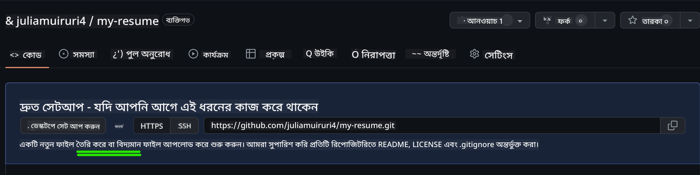
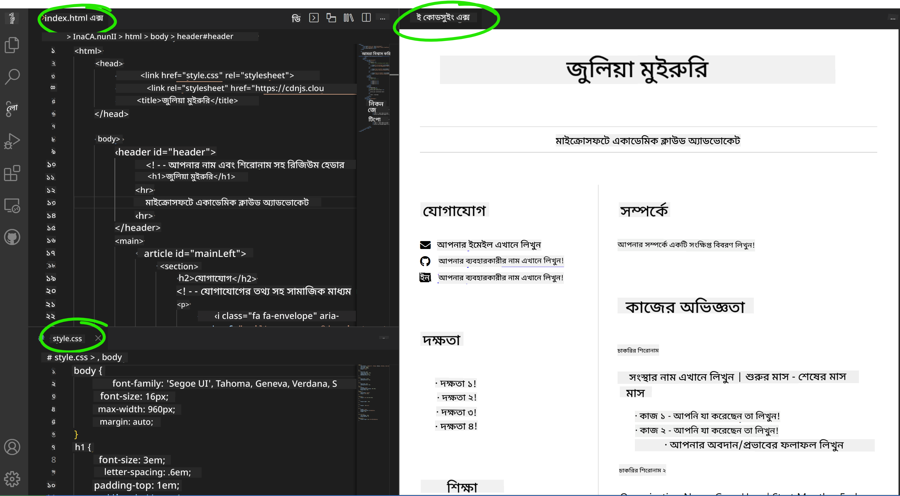

<!--
CO_OP_TRANSLATOR_METADATA:
{
  "original_hash": "effe56ba51c38d7bdfad1ea38288666b",
  "translation_date": "2025-10-22T21:29:32+00:00",
  "source_file": "8-code-editor/1-using-a-code-editor/assignment.md",
  "language_code": "bn"
}
-->
# VSCode.dev ব্যবহার করে একটি রিজিউম ওয়েবসাইট তৈরি করুন

আপনার ক্যারিয়ার সম্ভাবনাকে উন্নত করুন একটি পেশাদার রিজিউম ওয়েবসাইট তৈরি করে যা আপনার দক্ষতা এবং অভিজ্ঞতাকে ইন্টারঅ্যাকটিভ, আধুনিক ফরম্যাটে প্রদর্শন করে। ঐতিহ্যবাহী পিডিএফ পাঠানোর পরিবর্তে, কল্পনা করুন যে আপনি নিয়োগকারীদের একটি আকর্ষণীয়, রেসপন্সিভ ওয়েবসাইট প্রদান করছেন যা আপনার যোগ্যতা এবং ওয়েব ডেভেলপমেন্ট দক্ষতা উভয়ই প্রদর্শন করে।

এই হাতে-কলমে অ্যাসাইনমেন্টটি আপনার সমস্ত VSCode.dev দক্ষতাকে কাজে লাগানোর সুযোগ দেবে এবং একই সাথে আপনার ক্যারিয়ারের জন্য সত্যিই কার্যকর কিছু তৈরি করতে সাহায্য করবে। আপনি সম্পূর্ণ ওয়েব ডেভেলপমেন্ট ওয়ার্কফ্লো অভিজ্ঞতা অর্জন করবেন – রিপোজিটরি তৈরি থেকে শুরু করে ডিপ্লয়মেন্ট পর্যন্ত – সবকিছুই আপনার ব্রাউজারের মধ্যে।

এই প্রকল্পটি সম্পন্ন করার মাধ্যমে, আপনি একটি পেশাদার অনলাইন উপস্থিতি তৈরি করবেন যা সম্ভাব্য নিয়োগকারীদের সাথে সহজেই শেয়ার করা যাবে, আপনার দক্ষতা বৃদ্ধির সাথে সাথে আপডেট করা যাবে এবং আপনার ব্যক্তিগত ব্র্যান্ডের সাথে মানানসই করে কাস্টমাইজ করা যাবে। এটি এমন একটি বাস্তব প্রকল্প যা বাস্তব-জীবনের ওয়েব ডেভেলপমেন্ট দক্ষতা প্রদর্শন করে।

## শেখার লক্ষ্য

এই অ্যাসাইনমেন্টটি সম্পন্ন করার পরে, আপনি সক্ষম হবেন:

- **তৈরি করা** এবং VSCode.dev ব্যবহার করে একটি সম্পূর্ণ ওয়েব ডেভেলপমেন্ট প্রকল্প পরিচালনা করা
- **গঠন করা** একটি পেশাদার ওয়েবসাইট সেমান্টিক HTML এলিমেন্ট ব্যবহার করে
- **স্টাইল করা** রেসপন্সিভ লেআউট আধুনিক CSS টেকনিক ব্যবহার করে
- **ইমপ্লিমেন্ট করা** ইন্টারঅ্যাকটিভ ফিচার বেসিক ওয়েব টেকনোলজি ব্যবহার করে
- **ডিপ্লয় করা** একটি লাইভ ওয়েবসাইট যা শেয়ারযোগ্য URL এর মাধ্যমে অ্যাক্সেসযোগ্য
- **প্রদর্শন করা** ডেভেলপমেন্ট প্রক্রিয়ার সময় ভার্সন কন্ট্রোলের সেরা অনুশীলন

## প্রয়োজনীয়তা

এই অ্যাসাইনমেন্ট শুরু করার আগে নিশ্চিত করুন যে আপনার কাছে রয়েছে:

- একটি GitHub অ্যাকাউন্ট ([github.com](https://github.com/) এ তৈরি করুন যদি প্রয়োজন হয়)
- VSCode.dev লেসন সম্পন্ন করা যা ইন্টারফেস নেভিগেশন এবং বেসিক অপারেশন কভার করে
- HTML গঠন এবং CSS স্টাইলিং ধারণার মৌলিক জ্ঞান

## প্রকল্প সেটআপ এবং রিপোজিটরি তৈরি

আপনার প্রকল্পের ভিত্তি স্থাপন করে শুরু করা যাক। এই প্রক্রিয়াটি বাস্তব-জীবনের ডেভেলপমেন্ট ওয়ার্কফ্লোকে প্রতিফলিত করে যেখানে প্রকল্পগুলি সঠিক রিপোজিটরি ইনিশিয়ালাইজেশন এবং গঠন পরিকল্পনা দিয়ে শুরু হয়।

### ধাপ ১: আপনার GitHub রিপোজিটরি তৈরি করুন

একটি ডেডিকেটেড রিপোজিটরি সেটআপ করা নিশ্চিত করে যে আপনার প্রকল্প শুরু থেকেই সঠিকভাবে সংগঠিত এবং ভার্সন-কন্ট্রোলড।

1. **নেভিগেট করুন** [GitHub.com](https://github.com) এ এবং আপনার অ্যাকাউন্টে সাইন ইন করুন
2. **ক্লিক করুন** সবুজ "New" বোতাম বা উপরের ডান কোণের "+" আইকনে
3. **নাম দিন** আপনার রিপোজিটরিকে `my-resume` (অথবা একটি ব্যক্তিগত নাম যেমন `john-smith-resume` নির্বাচন করুন)
4. **একটি সংক্ষিপ্ত বিবরণ যোগ করুন**: "HTML এবং CSS দিয়ে তৈরি পেশাদার রিজিউম ওয়েবসাইট"
5. **"Public" নির্বাচন করুন** যাতে আপনার রিজিউম সম্ভাব্য নিয়োগকারীদের জন্য অ্যাক্সেসযোগ্য হয়
6. **"Add a README file" চেক করুন** একটি প্রাথমিক প্রকল্প বিবরণ তৈরি করতে
7. **"Create repository" ক্লিক করুন** সেটআপ সম্পন্ন করতে

> 💡 **রিপোজিটরি নামকরণের টিপস**: বর্ণনামূলক, পেশাদার নাম ব্যবহার করুন যা প্রকল্পের উদ্দেশ্য স্পষ্টভাবে নির্দেশ করে। এটি নিয়োগকারীদের সাথে শেয়ার করার সময় বা পোর্টফোলিও পর্যালোচনার সময় সহায়ক।

### ধাপ ২: প্রকল্প গঠন ইনিশিয়ালাইজ করুন

যেহেতু VSCode.dev একটি রিপোজিটরি খুলতে অন্তত একটি ফাইল প্রয়োজন, আমরা GitHub-এ সরাসরি আমাদের প্রধান HTML ফাইল তৈরি করব এবং তারপর ওয়েব এডিটরে স্যুইচ করব।

1. **ক্লিক করুন** আপনার নতুন রিপোজিটরিতে "creating a new file" লিঙ্ক
2. **টাইপ করুন** `index.html` ফাইলের নাম হিসেবে
3. **এই প্রাথমিক HTML গঠন যোগ করুন**:

```html
<!DOCTYPE html>
<html lang="en">
<head>
    <meta charset="UTF-8">
    <meta name="viewport" content="width=device-width, initial-scale=1.0">
    <title>Your Name - Professional Resume</title>
</head>
<body>
    <h1>Your Name</h1>
    <p>Professional Resume Website</p>
</body>
</html>
```

4. **একটি কমিট বার্তা লিখুন**: "Add initial HTML structure"
5. **"Commit new file" ক্লিক করুন** আপনার পরিবর্তনগুলি সংরক্ষণ করতে



**এই প্রাথমিক সেটআপ যা অর্জন করে:**
- **HTML5 ডকুমেন্ট গঠন প্রতিষ্ঠা করে** সেমান্টিক এলিমেন্ট সহ
- **ভিউপোর্ট মেটা ট্যাগ অন্তর্ভুক্ত করে** রেসপন্সিভ ডিজাইন সামঞ্জস্যের জন্য
- **বর্ণনামূলক পেজ টাইটেল সেট করে** যা ব্রাউজার ট্যাবে প্রদর্শিত হয়
- **পেশাদার কন্টেন্ট সংগঠনের জন্য ভিত্তি তৈরি করে**

## VSCode.dev-এ কাজ করা

এখন যেহেতু আপনার রিপোজিটরি ভিত্তি স্থাপন করা হয়েছে, আসুন প্রধান ডেভেলপমেন্ট কাজের জন্য VSCode.dev-এ স্থানান্তরিত হই। এই ওয়েব-ভিত্তিক এডিটরটি পেশাদার ওয়েব ডেভেলপমেন্টের জন্য প্রয়োজনীয় সমস্ত সরঞ্জাম সরবরাহ করে।

### ধাপ ৩: আপনার প্রকল্পটি VSCode.dev-এ খুলুন

1. **নেভিগেট করুন** [vscode.dev](https://vscode.dev) এ একটি নতুন ব্রাউজার ট্যাবে
2. **ওয়েলকাম স্ক্রিনে ক্লিক করুন** "Open Remote Repository"
3. **আপনার রিপোজিটরি URL কপি করুন** GitHub থেকে এবং ইনপুট ফিল্ডে পেস্ট করুন

   ফরম্যাট: `https://github.com/your-username/my-resume`
   
   *`your-username` আপনার প্রকৃত GitHub ব্যবহারকারীর নাম দিয়ে প্রতিস্থাপন করুন*

4. **এন্টার চাপুন** আপনার প্রকল্প লোড করতে

✅ **সফলতার সূচক**: আপনি আপনার প্রকল্প ফাইলগুলি Explorer সাইডবারে এবং `index.html` প্রধান এডিটর এলাকায় দেখতে পাবেন।


**ইন্টারফেসে যা আপনি দেখতে পাবেন:**
- **Explorer সাইডবার**: **প্রদর্শন করে** আপনার রিপোজিটরি ফাইল এবং ফোল্ডার গঠন
- **এডিটর এলাকা**: **দেখায়** নির্বাচিত ফাইলগুলির বিষয়বস্তু সম্পাদনার জন্য
- **Activity বার**: **প্রদান করে** Source Control এবং Extensions এর মতো ফিচারগুলিতে অ্যাক্সেস
- **Status বার**: **ইঙ্গিত দেয়** সংযোগের অবস্থা এবং বর্তমান ব্রাঞ্চ তথ্য

### ধাপ ৪: আপনার রিজিউম কন্টেন্ট তৈরি করুন

`index.html`-এ প্লেসহোল্ডার কন্টেন্টের পরিবর্তে একটি বিস্তৃত রিজিউম গঠন যোগ করুন। এই HTML আপনার যোগ্যতার পেশাদার উপস্থাপনার জন্য ভিত্তি প্রদান করে।

<details>
<summary><b>সম্পূর্ণ HTML রিজিউম গঠন</b></summary>

```html
<!DOCTYPE html>
<html lang="en">
<head>
    <meta charset="UTF-8">
    <meta name="viewport" content="width=device-width, initial-scale=1.0">
    <link href="style.css" rel="stylesheet">
    <link rel="stylesheet" href="https://cdnjs.cloudflare.com/ajax/libs/font-awesome/5.15.4/css/all.min.css">
    <title>Your Name - Professional Resume</title>
</head>
<body>
    <header id="header">
        <h1>Your Full Name</h1>
        <hr>
        <p class="role">Your Professional Title</p>
        <hr>
    </header>
    
    <main>
        <article id="mainLeft">
            <section>
                <h2>CONTACT</h2>
                <p>
                    <i class="fa fa-envelope" aria-hidden="true"></i>
                    <a href="mailto:your.email@domain.com">your.email@domain.com</a>
                </p>
                <p>
                    <i class="fab fa-github" aria-hidden="true"></i>
                    <a href="https://github.com/your-username">github.com/your-username</a>
                </p>
                <p>
                    <i class="fab fa-linkedin" aria-hidden="true"></i>
                    <a href="https://linkedin.com/in/your-profile">linkedin.com/in/your-profile</a>
                </p>
            </section>
            
            <section>
                <h2>SKILLS</h2>
                <ul>
                    <li>HTML5 & CSS3</li>
                    <li>JavaScript (ES6+)</li>
                    <li>Responsive Web Design</li>
                    <li>Version Control (Git)</li>
                    <li>Problem Solving</li>
                </ul>
            </section>
            
            <section>
                <h2>EDUCATION</h2>
                <h3>Your Degree or Certification</h3>
                <p>Institution Name</p>
                <p>Start Date - End Date</p>
            </section>
        </article>
        
        <article id="mainRight">
            <section>
                <h2>ABOUT</h2>
                <p>Write a compelling summary that highlights your passion for web development, key achievements, and career goals. This section should give employers insight into your personality and professional approach.</p>
            </section>
            
            <section>
                <h2>WORK EXPERIENCE</h2>
                <div class="job">
                    <h3>Job Title</h3>
                    <p class="company">Company Name | Start Date – End Date</p>
                    <ul>
                        <li>Describe a key accomplishment or responsibility</li>
                        <li>Highlight specific skills or technologies used</li>
                        <li>Quantify impact where possible (e.g., "Improved efficiency by 25%")</li>
                    </ul>
                </div>
                
                <div class="job">
                    <h3>Previous Job Title</h3>
                    <p class="company">Previous Company | Start Date – End Date</p>
                    <ul>
                        <li>Focus on transferable skills and achievements</li>
                        <li>Demonstrate growth and learning progression</li>
                        <li>Include any leadership or collaboration experiences</li>
                    </ul>
                </div>
            </section>
            
            <section>
                <h2>PROJECTS</h2>
                <div class="project">
                    <h3>Project Name</h3>
                    <p>Brief description of what the project accomplishes and technologies used.</p>
                    <a href="#" target="_blank">View Project</a>
                </div>
            </section>
        </article>
    </main>
</body>
</html>
```
</details>

**কাস্টমাইজেশন নির্দেশিকা:**
- **সমস্ত প্লেসহোল্ডার টেক্সট প্রতিস্থাপন করুন** আপনার প্রকৃত তথ্য দিয়ে
- **আপনার অভিজ্ঞতা এবং ক্যারিয়ার ফোকাস অনুযায়ী** সেকশনগুলো সামঞ্জস্য করুন
- **প্রয়োজন অনুযায়ী সেকশন যোগ বা সরান** (যেমন, সার্টিফিকেশন, স্বেচ্ছাসেবক কাজ, ভাষা)
- **আপনার প্রকৃত প্রোফাইল এবং প্রকল্পের লিঙ্ক অন্তর্ভুক্ত করুন**

### ধাপ ৫: সাপোর্টিং ফাইল তৈরি করুন

পেশাদার ওয়েবসাইটের জন্য সংগঠিত ফাইল গঠন প্রয়োজন। একটি CSS স্টাইলশিট এবং কনফিগারেশন ফাইল তৈরি করুন যা একটি সম্পূর্ণ প্রকল্পের জন্য প্রয়োজন।

1. **Explorer সাইডবারে আপনার প্রকল্প ফোল্ডারের নামের উপর হোভার করুন**
2. **"New File" আইকনে ক্লিক করুন** (📄+) যা প্রদর্শিত হয়
3. **এই ফাইলগুলো একে একে তৈরি করুন**:
   - `style.css` (স্টাইলিং এবং লেআউটের জন্য)
   - `codeswing.json` (প্রিভিউ এক্সটেনশন কনফিগারেশনের জন্য)

**CSS ফাইল তৈরি করা (`style.css`):**

<details>
<summary><b>পেশাদার CSS স্টাইলিং</b></summary>

```css
/* Modern Resume Styling */
body {
    font-family: 'Segoe UI', Tahoma, Geneva, Verdana, sans-serif;
    font-size: 16px;
    line-height: 1.6;
    max-width: 960px;
    margin: 0 auto;
    padding: 20px;
    color: #333;
    background-color: #f9f9f9;
}

/* Header Styling */
header {
    text-align: center;
    margin-bottom: 3em;
    padding: 2em;
    background: linear-gradient(135deg, #667eea 0%, #764ba2 100%);
    color: white;
    border-radius: 10px;
    box-shadow: 0 4px 6px rgba(0, 0, 0, 0.1);
}

h1 {
    font-size: 3em;
    letter-spacing: 0.1em;
    margin-bottom: 0.2em;
    font-weight: 300;
}

.role {
    font-size: 1.3em;
    font-weight: 300;
    margin: 1em 0;
}

/* Main Content Layout */
main {
    display: grid;
    grid-template-columns: 35% 65%;
    gap: 3em;
    margin-top: 3em;
    background: white;
    padding: 2em;
    border-radius: 10px;
    box-shadow: 0 2px 10px rgba(0, 0, 0, 0.1);
}

/* Typography */
h2 {
    font-size: 1.4em;
    font-weight: 600;
    margin-bottom: 1em;
    color: #667eea;
    border-bottom: 2px solid #667eea;
    padding-bottom: 0.3em;
}

h3 {
    font-size: 1.1em;
    font-weight: 600;
    margin-bottom: 0.5em;
    color: #444;
}

/* Section Styling */
section {
    margin-bottom: 2.5em;
}

#mainLeft {
    border-right: 1px solid #e0e0e0;
    padding-right: 2em;
}

/* Contact Links */
section a {
    color: #667eea;
    text-decoration: none;
    transition: color 0.3s ease;
}

section a:hover {
    color: #764ba2;
    text-decoration: underline;
}

/* Icons */
i {
    margin-right: 0.8em;
    width: 20px;
    text-align: center;
    color: #667eea;
}

/* Lists */
ul {
    list-style: none;
    padding-left: 0;
}

li {
    margin: 0.5em 0;
    padding: 0.3em 0;
    position: relative;
}

li:before {
    content: "▸";
    color: #667eea;
    margin-right: 0.5em;
}

/* Work Experience */
.job, .project {
    margin-bottom: 2em;
    padding-bottom: 1.5em;
    border-bottom: 1px solid #f0f0f0;
}

.company {
    font-style: italic;
    color: #666;
    margin-bottom: 0.5em;
}

/* Responsive Design */
@media (max-width: 768px) {
    main {
        grid-template-columns: 1fr;
        gap: 2em;
    }
    
    #mainLeft {
        border-right: none;
        border-bottom: 1px solid #e0e0e0;
        padding-right: 0;
        padding-bottom: 2em;
    }
    
    h1 {
        font-size: 2.2em;
    }
    
    body {
        padding: 10px;
    }
}

/* Print Styles */
@media print {
    body {
        background: white;
        color: black;
        font-size: 12pt;
    }
    
    header {
        background: none;
        color: black;
        box-shadow: none;
    }
    
    main {
        box-shadow: none;
    }
}
```
</details>

**কনফিগারেশন ফাইল তৈরি করা (`codeswing.json`):**

```json
{
    "scripts": [],
    "styles": []
}
```

**CSS ফিচারগুলো বোঝা:**
- **CSS Grid ব্যবহার করে** রেসপন্সিভ, পেশাদার লেআউট গঠন
- **আধুনিক কালার স্কিম ইমপ্লিমেন্ট করে** গ্রেডিয়েন্ট হেডার সহ
- **হোভার ইফেক্ট এবং স্মুথ ট্রানজিশন অন্তর্ভুক্ত করে** ইন্টারঅ্যাকটিভিটির জন্য
- **রেসপন্সিভ ডিজাইন প্রদান করে** যা সব ডিভাইস সাইজে কাজ করে
- **প্রিন্ট-ফ্রেন্ডলি স্টাইল যোগ করে** পিডিএফ জেনারেশনের জন্য

### ধাপ ৬: এক্সটেনশন ইনস্টল এবং কনফিগার করুন

এক্সটেনশনগুলো আপনার ডেভেলপমেন্ট অভিজ্ঞতাকে উন্নত করে লাইভ প্রিভিউ সক্ষম করে এবং উন্নত ওয়ার্কফ্লো সরঞ্জাম সরবরাহ করে। CodeSwing এক্সটেনশন বিশেষভাবে ওয়েব ডেভেলপমেন্ট প্রকল্পের জন্য উপযোগী।

**CodeSwing এক্সটেনশন ইনস্টল করা:**

1. **Activity বার-এ Extensions আইকনে ক্লিক করুন** (🧩)
2. **মার্কেটপ্লেস সার্চ বক্সে "CodeSwing" অনুসন্ধান করুন**
3. **সার্চ রেজাল্ট থেকে CodeSwing এক্সটেনশন নির্বাচন করুন**
4. **নীল "Install" বোতামে ক্লিক করুন**


**CodeSwing কী প্রদান করে:**
- **আপনার ওয়েবসাইটের লাইভ প্রিভিউ সক্ষম করে** সম্পাদনার সময়
- **পরিবর্তনগুলো রিয়েল-টাইমে প্রদর্শন করে** ম্যানুয়াল রিফ্রেশ ছাড়াই
- **HTML, CSS, এবং JavaScript সহ** একাধিক ফাইল টাইপ সমর্থন করে
- **একটি ইন্টিগ্রেটেড ডেভেলপমেন্ট এনভায়রনমেন্ট অভিজ্ঞতা প্রদান করে**

**ইনস্টলেশনের পরপরই ফলাফল:**
CodeSwing ইনস্টল করার পরে, আপনি আপনার রিজিউম ওয়েবসাইটের একটি লাইভ প্রিভিউ এডিটরে দেখতে পাবেন। এটি আপনাকে আপনার সাইটটি কেমন দেখাচ্ছে তা পরিবর্তন করার সাথে সাথে দেখতে দেয়।



**উন্নত ইন্টারফেস বোঝা:**
- **স্প্লিট ভিউ**: **আপনার কোড এক পাশে এবং লাইভ প্রিভিউ অন্য পাশে দেখায়**
- **রিয়েল-টাইম আপডেট**: **আপনার টাইপ করার সাথে সাথে পরিবর্তনগুলো প্রতিফলিত হয়**
- **ইন্টারঅ্যাকটিভ প্রিভিউ**: **লিঙ্ক এবং ইন্টারঅ্যাকশন পরীক্ষা করতে দেয়**
- **মোবাইল সিমুলেশন**: **রেসপন্সিভ ডিজাইন টেস্টিং সক্ষম করে**

### ধাপ ৭: ভার্সন কন্ট্রোল এবং প্রকাশনা

এখন যেহেতু আপনার রিজিউম ওয়েবসাইট সম্পূর্ণ হয়েছে, Git ব্যবহার করে আপনার কাজ সংরক্ষণ করুন এবং এটি অনলাইনে উপলব্ধ করুন।

**আপনার পরিবর্তনগুলো কমিট করা:**

1. **Activity বার-এ Source Control আইকনে ক্লিক করুন** (🌿)
2. **"Changes" সেকশনে আপনি যে ফাইলগুলো তৈরি এবং পরিবর্তন করেছেন তা পর্যালোচনা করুন**
3. **প্রতিটি ফাইলের পাশে "+" আইকনে ক্লিক করে আপনার পরিবর্তনগুলো স্টেজ করুন**
4. **একটি বর্ণনামূলক কমিট বার্তা লিখুন**, যেমন:
   - "Add complete resume website with responsive design"
   - "Implement professional styling and content structure"
5. **চেকমার্ক (✓) ক্লিক করুন** কমিট এবং আপনার পরিবর্তনগুলো পুশ করতে

**কার্যকর কমিট বার্তার উদাহরণ:**
- "Add professional resume content and styling"
- "Implement responsive design for mobile compatibility"
- "Update contact information and project links"

> 💡 **পেশাদার টিপস**: ভালো কমিট বার্তা আপনার প্রকল্পের বিবর্তন ট্র্যাক করতে সাহায্য করে এবং বিস্তারিত মনোযোগ প্রদর্শন করে – যা নিয়োগকারীরা মূল্যায়ন করে।

**আপনার প্রকাশিত সাইট অ্যাক্সেস করা:**
একবার কমিট হয়ে গেলে, আপনি আপনার GitHub রিপোজিটরিতে ফিরে যেতে পারেন উপরের বাম কোণের হ্যামবার্গার মেনু (☰) ব্যবহার করে। আপনার রিজিউম ওয়েবসাইট এখন ভার্সন-কন্ট্রোলড এবং ডিপ্লয়মেন্ট বা শেয়ারিংয়ের জন্য প্রস্তুত।

## ফলাফল এবং পরবর্তী পদক্ষেপ

**অভিনন্দন! 🎉** আপনি সফলভাবে VSCode.dev ব্যবহার করে একটি পেশাদার রিজিউম ওয়েবসাইট তৈরি করেছেন। আপনার প্রকল্পটি প্রদর্শন করে:
**প্রদর্শিত প্রযুক্তিগত দক্ষতা:**
- **রিপোজিটরি ম্যানেজমেন্ট**: একটি সম্পূর্ণ প্রকল্প গঠন তৈরি এবং সংগঠিত করা
- **ওয়েব ডেভেলপমেন্ট**: আধুনিক HTML5 এবং CSS3 ব্যবহার করে একটি রেসপন্সিভ ওয়েবসাইট তৈরি করা
- **ভার্সন কন্ট্রোল**: অর্থপূর্ণ কমিট সহ সঠিক Git ওয়ার্কফ্লো ইমপ্লিমেন্ট করা
- **টুল দক্ষতা**: VSCode.dev এর ইন্টারফেস এবং এক্সটেনশন সিস্টেম কার্যকরভাবে ব্যবহার করা

**অর্জিত পেশাদার ফলাফল:**
- **অনলাইন উপস্থিতি**: একটি শেয়ারযোগ্য URL যা আপনার যোগ্যতাগুলো প্রদর্শন করে
- **আধুনিক ফরম্যাট**: ঐতিহ্যবাহী PDF রিজিউমের একটি ইন্টারঅ্যাকটিভ বিকল্প
- **দক্ষতার প্রমাণ**: আপনার ওয়েব ডেভেলপমেন্ট দক্ষতার কংক্রিট প্রমাণ
- **সহজ আপডেট**: একটি ভিত্তি যা আপনি ক্রমাগত উন্নত এবং কাস্টমাইজ করতে পারেন

### ডিপ্লয়মেন্ট অপশন

আপনার রিজিউম নিয়োগকারীদের জন্য অ্যাক্সেসযোগ্য করতে, এই হোস্টিং অপশনগুলো বিবেচনা করুন:

**GitHub Pages (প্রস্তাবিত):**
1. GitHub-এ আপনার রিপোজিটরি সেটিংসে যান
2. "Pages" সেকশনে স্ক্রোল করুন
3. "Deploy from a branch" নির্বাচন করুন এবং "main" নির্বাচন করুন
4. আপনার সাইটটি উপলব্ধ হবে `https://your-username.github.io/my-resume`

**বিকল্প প্ল্যাটফর্ম:**
- **Netlify**: স্বয়ংক্রিয় ডিপ্লয়মেন্ট কাস্টম ডোমেইন সহ
- **Vercel**: আধুনিক হোস্টিং ফিচার সহ দ্রুত ডিপ্লয়মেন্ট
- **GitHub Codespaces**: বিল্ট-ইন প্রিভিউ সহ ডেভেলপমেন্ট এনভায়রনমেন্ট

### উন্নয়নের পরামর্শ

এই ফিচারগুলো যোগ করে আপনার দক্ষতা উন্নত করুন:

**প্রযুক্তিগত উন্নতি:**
- **JavaScript ইন্টারঅ্যাকটিভিটি**: স্মুথ স্ক্রলিং বা ইন্টারঅ্যাকটিভ এলিমেন্ট যোগ করুন
- **ডার্ক মোড টগল**: ব্যবহারকারীর পছন্দের জন্য থিম পরিবর্তন সক্ষম করুন
- **কন্টাক্ট ফর্ম**: সম্ভাব্য নিয়োগকারীদের সাথে সরাসরি যোগাযোগ সক্ষম করুন
- **SEO অপ্টিমাইজেশন**: মেটা ট্যাগ এবং স্ট্রাকচারড ডেটা যোগ করুন সার্চ ভিজিবিলিটির জন্য

**কন্টেন্ট উন্নতি:**
- **প্রকল্প পোর্টফোলিও**: GitHub রিপোজিটরি এবং লাইভ ডেমো লিঙ্ক করুন
- **দক্ষতার ভিজ্যুয়ালাইজেশন**: প্রগ্রেস বার বা স্কিল রেটিং সিস্টেম তৈরি করুন
- **টেস্টিমোনিয়াল সেকশন**: সহকর্মী বা প্রশিক্ষকদের সুপারিশ অন্তর্ভুক্ত করুন
- **ব্লগ ইন্টিগ্রেশন**: আপনার শেখার
- **অ্যাক্সেসিবিলিটি**: অন্তর্ভুক্তিমূলক ওয়েব ডিজাইনের জন্য WCAG নির্দেশিকা শিখুন  
- **পারফরম্যান্স**: অপ্টিমাইজেশনের জন্য Lighthouse এর মতো টুলগুলি অন্বেষণ করুন  
- **এসইও**: সার্চ ইঞ্জিন অপ্টিমাইজেশনের মৌলিক বিষয়গুলি বুঝুন  

**পেশাগত উন্নয়ন:**  
- **পোর্টফোলিও তৈরি**: বিভিন্ন দক্ষতা প্রদর্শনের জন্য অতিরিক্ত প্রকল্প তৈরি করুন  
- **ওপেন সোর্স**: সহযোগিতার অভিজ্ঞতা অর্জনের জন্য বিদ্যমান প্রকল্পে অবদান রাখুন  
- **নেটওয়ার্কিং**: ডেভেলপার কমিউনিটিতে আপনার রিজিউম ওয়েবসাইট শেয়ার করুন এবং মতামত সংগ্রহ করুন  
- **নিরবিচ্ছিন্ন শেখা**: ওয়েব ডেভেলপমেন্টের প্রবণতা এবং প্রযুক্তির সাথে আপডেট থাকুন  

---

**আপনার পরবর্তী পদক্ষেপ:** আপনার রিজিউম ওয়েবসাইট বন্ধু, পরিবার বা পরামর্শদাতাদের সাথে শেয়ার করুন এবং তাদের মতামত সংগ্রহ করুন। তাদের পরামর্শ ব্যবহার করে আপনার ডিজাইন উন্নত করুন। মনে রাখবেন, এই প্রকল্প শুধুমাত্র একটি রিজিউম নয় – এটি একজন ওয়েব ডেভেলপার হিসেবে আপনার উন্নয়নের প্রদর্শন!

---

**অস্বীকৃতি**:  
এই নথিটি AI অনুবাদ পরিষেবা [Co-op Translator](https://github.com/Azure/co-op-translator) ব্যবহার করে অনুবাদ করা হয়েছে। আমরা যথাসাধ্য সঠিকতা নিশ্চিত করার চেষ্টা করি, তবে অনুগ্রহ করে মনে রাখবেন যে স্বয়ংক্রিয় অনুবাদে ত্রুটি বা অসঙ্গতি থাকতে পারে। নথিটির মূল ভাষায় থাকা আসল সংস্করণকে প্রামাণিক উৎস হিসেবে বিবেচনা করা উচিত। গুরুত্বপূর্ণ তথ্যের জন্য, পেশাদার মানব অনুবাদ সুপারিশ করা হয়। এই অনুবাদ ব্যবহারের ফলে কোনো ভুল বোঝাবুঝি বা ভুল ব্যাখ্যা হলে আমরা দায়বদ্ধ থাকব না।