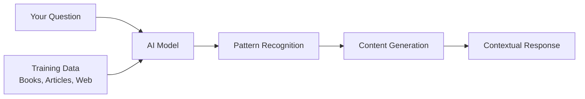
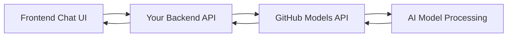
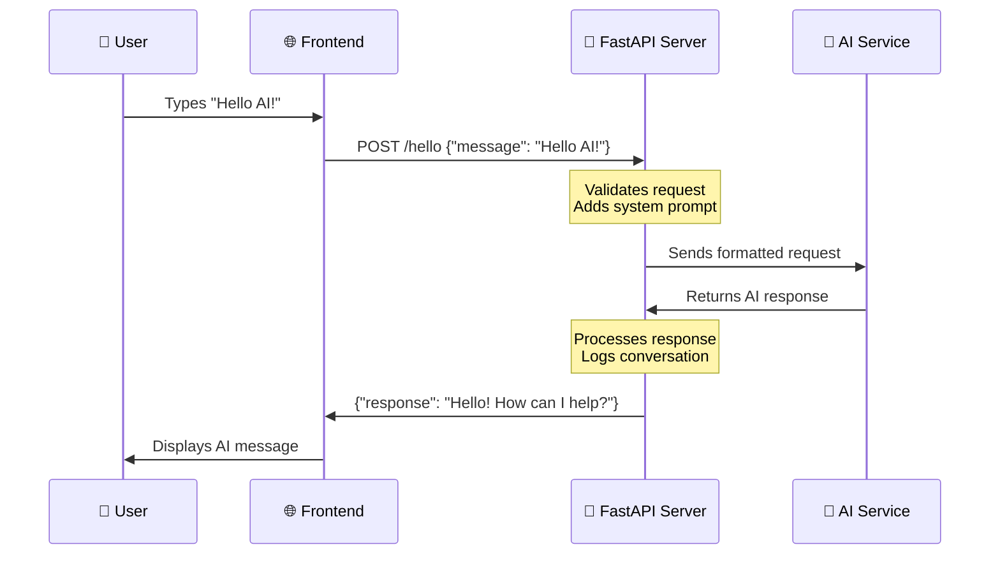
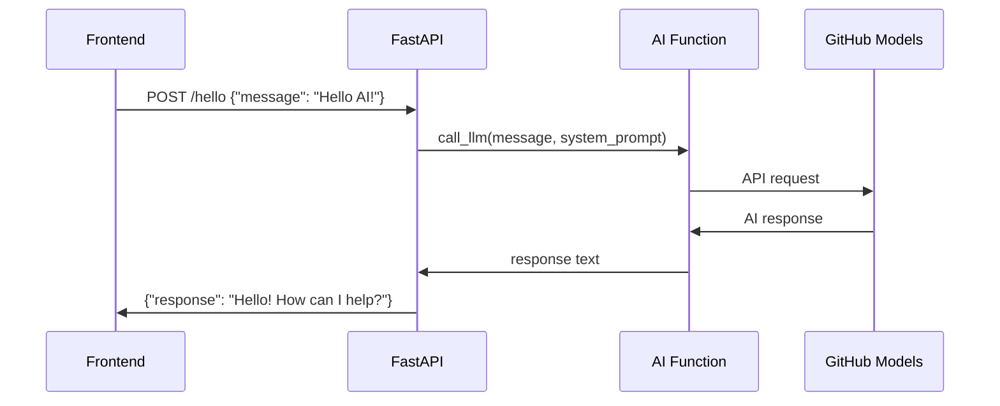
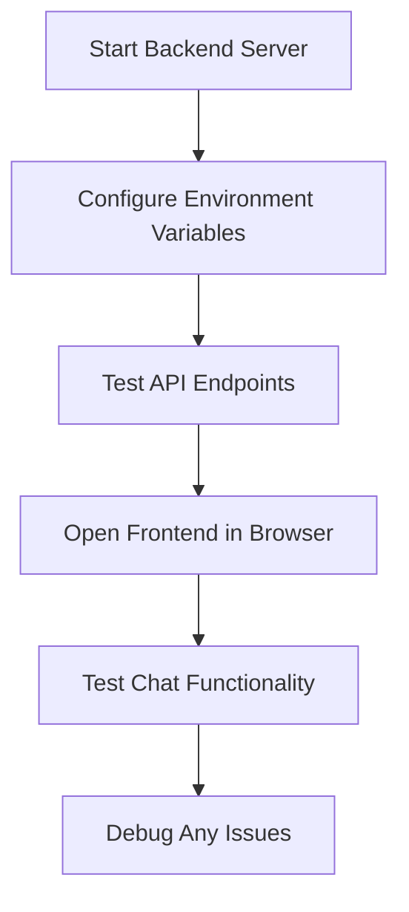

<!--
CO_OP_TRANSLATOR_METADATA:
{
  "original_hash": "46d665af66e51524598af34a42b9b663",
  "translation_date": "2025-10-22T21:42:37+00:00",
  "source_file": "9-chat-project/README.md",
  "language_code": "bn"
}
-->
# AI চ্যাট সহকারী তৈরি করুন

স্টার ট্রেকের কথা মনে আছে, যখন ক্রু সদস্যরা জাহাজের কম্পিউটারের সাথে সহজভাবে কথা বলত, জটিল প্রশ্ন করত এবং চিন্তাশীল উত্তর পেত? ১৯৬০-এর দশকে যা সম্পূর্ণ বিজ্ঞান কল্পকাহিনী মনে হত, তা এখন আপনি আপনার পরিচিত ওয়েব প্রযুক্তি ব্যবহার করে তৈরি করতে পারেন।

এই পাঠে, আমরা HTML, CSS, JavaScript এবং কিছু ব্যাকএন্ড ইন্টিগ্রেশন ব্যবহার করে একটি AI চ্যাট সহকারী তৈরি করব। আপনি শিখবেন কীভাবে আপনার শেখা দক্ষতাগুলি শক্তিশালী AI পরিষেবার সাথে সংযোগ স্থাপন করতে পারে, যা প্রসঙ্গ বুঝতে পারে এবং অর্থপূর্ণ উত্তর তৈরি করতে পারে।

AI-কে একটি বিশাল লাইব্রেরির মতো ভাবুন, যা শুধুমাত্র তথ্য খুঁজে বের করতে পারে না, বরং এটি আপনার নির্দিষ্ট প্রশ্নের জন্য উপযুক্ত উত্তর তৈরি করতে পারে। হাজার হাজার পৃষ্ঠার মধ্যে অনুসন্ধান করার পরিবর্তে, আপনি সরাসরি প্রসঙ্গভিত্তিক উত্তর পান।

এই ইন্টিগ্রেশনটি পরিচিত ওয়েব প্রযুক্তির মাধ্যমে ঘটে। HTML চ্যাট ইন্টারফেস তৈরি করে, CSS ভিজ্যুয়াল ডিজাইন পরিচালনা করে, JavaScript ব্যবহারকারীর ইন্টারঅ্যাকশন পরিচালনা করে এবং একটি ব্যাকএন্ড API AI পরিষেবার সাথে সবকিছু সংযুক্ত করে। এটি অনেকটা একটি অর্কেস্ট্রার বিভিন্ন অংশ একসাথে একটি সিম্ফনি তৈরি করার মতো।

আমরা মূলত প্রাকৃতিক মানব যোগাযোগ এবং মেশিন প্রসেসিংয়ের মধ্যে একটি সেতু তৈরি করছি। আপনি শিখবেন AI পরিষেবা ইন্টিগ্রেশনের প্রযুক্তিগত বাস্তবায়ন এবং ডিজাইন প্যাটার্নগুলি যা ইন্টারঅ্যাকশনকে স্বজ্ঞাত করে তোলে।

এই পাঠের শেষে, AI ইন্টিগ্রেশন একটি রহস্যময় প্রক্রিয়া নয় বরং আরেকটি API-এর মতো মনে হবে যা আপনি কাজ করতে পারেন। আপনি সেই মৌলিক প্যাটার্নগুলি বুঝতে পারবেন যা ChatGPT এবং Claude-এর মতো অ্যাপ্লিকেশনগুলিকে শক্তিশালী করে, একই ওয়েব ডেভেলপমেন্ট নীতিগুলি ব্যবহার করে যা আপনি শিখছেন।

এখানে আপনার সমাপ্ত প্রকল্পটি দেখতে কেমন হবে:


## AI বোঝা: রহস্য থেকে দক্ষতা

কোডে যাওয়ার আগে, আসুন আমরা যা নিয়ে কাজ করছি তা বুঝি। যদি আপনি আগে API ব্যবহার করে থাকেন, তাহলে আপনি মৌলিক প্যাটার্নটি জানেন: একটি অনুরোধ পাঠান, একটি উত্তর পান।

AI API-গুলি অনুরূপ কাঠামো অনুসরণ করে, তবে একটি ডাটাবেস থেকে পূর্বে সংরক্ষিত ডেটা পুনরুদ্ধার করার পরিবর্তে, তারা বিশাল পরিমাণ টেক্সট থেকে শেখা প্যাটার্নের উপর ভিত্তি করে নতুন উত্তর তৈরি করে। এটি অনেকটা একটি লাইব্রেরি ক্যাটালগ সিস্টেম এবং একটি জ্ঞানী লাইব্রেরিয়ানের মধ্যে পার্থক্যের মতো, যিনি একাধিক উৎস থেকে তথ্য সংশ্লেষ করতে পারেন।

### "জেনারেটিভ AI" আসলে কী?

রোসেটা স্টোন কিভাবে পণ্ডিতদের পরিচিত এবং অজানা ভাষার মধ্যে প্যাটার্ন খুঁজে পেতে সাহায্য করেছিল তা বিবেচনা করুন। AI মডেলগুলি একইভাবে কাজ করে – তারা বিশাল পরিমাণ টেক্সটে প্যাটার্ন খুঁজে বের করে ভাষা কীভাবে কাজ করে তা বুঝতে এবং তারপরে নতুন প্রশ্নের জন্য উপযুক্ত উত্তর তৈরি করতে সেই প্যাটার্নগুলি ব্যবহার করে।

**এটি একটি সহজ তুলনা দিয়ে ব্যাখ্যা করি:**
- **প্রথাগত ডাটাবেস**: আপনার জন্ম সনদ চাওয়ার মতো – আপনি প্রতিবার একই নথি পান
- **সার্চ ইঞ্জিন**: লাইব্রেরিয়ানকে বিড়াল সম্পর্কে বই খুঁজতে বলার মতো – তারা আপনাকে উপলব্ধ জিনিসগুলি দেখায়
- **জেনারেটিভ AI**: জ্ঞানী বন্ধুকে বিড়াল সম্পর্কে জিজ্ঞাসা করার মতো – তারা আপনাকে আকর্ষণীয় জিনিসগুলি তাদের নিজস্ব ভাষায় বলে, যা আপনি জানতে চান তার সাথে মানানসই



### AI মডেলগুলি কীভাবে শেখে (সহজ সংস্করণ)

AI মডেলগুলি বই, নিবন্ধ এবং কথোপকথন থেকে টেক্সট ধারণকারী বিশাল ডেটাসেটে এক্সপোজারের মাধ্যমে শেখে। এই প্রক্রিয়ার মাধ্যমে, তারা প্যাটার্নগুলি চিহ্নিত করে:
- কীভাবে চিন্তাগুলি লিখিত যোগাযোগে গঠিত হয়
- কোন শব্দগুলি সাধারণত একসাথে উপস্থিত হয়
- কথোপকথন সাধারণত কীভাবে প্রবাহিত হয়
- আনুষ্ঠানিক এবং অনানুষ্ঠানিক যোগাযোগের মধ্যে প্রসঙ্গগত পার্থক্য

**এটি অনেকটা প্রত্নতাত্ত্বিকরা প্রাচীন ভাষা ডিকোড করার মতো**: তারা ব্যাকরণ, শব্দভাণ্ডার এবং সাংস্কৃতিক প্রসঙ্গ বুঝতে হাজার হাজার উদাহরণ বিশ্লেষণ করে, অবশেষে শেখা প্যাটার্নগুলি ব্যবহার করে নতুন টেক্সট ব্যাখ্যা করতে সক্ষম হয়।

### কেন GitHub মডেল?

আমরা GitHub মডেল ব্যবহার করছি একটি বাস্তবিক কারণে – এটি আমাদের নিজস্ব AI অবকাঠামো সেট আপ না করেই এন্টারপ্রাইজ-লেভেল AI অ্যাক্সেস দেয় (যা, বিশ্বাস করুন, আপনি এখন করতে চান না!)। এটি অনেকটা আবহাওয়া API ব্যবহার করার মতো, নিজে আবহাওয়ার পূর্বাভাস দেওয়ার জন্য সর্বত্র আবহাওয়া স্টেশন স্থাপন করার চেষ্টা করার পরিবর্তে।

এটি মূলত "AI-as-a-Service," এবং সেরা অংশ? এটি শুরু করার জন্য বিনামূল্যে, তাই আপনি বিশাল বিল নিয়ে চিন্তা না করেই পরীক্ষা করতে পারেন।



আমরা GitHub মডেলগুলি আমাদের ব্যাকএন্ড ইন্টিগ্রেশনের জন্য ব্যবহার করব, যা একটি ডেভেলপার-বন্ধুত্বপূর্ণ ইন্টারফেসের মাধ্যমে পেশাদার-গ্রেড AI ক্ষমতা অ্যাক্সেস প্রদান করে। [GitHub Models Playground](https://github.com/marketplace/models/azure-openai/gpt-4o-mini/playground) একটি পরীক্ষার পরিবেশ হিসাবে কাজ করে যেখানে আপনি বিভিন্ন AI মডেল পরীক্ষা করতে পারেন এবং সেগুলির ক্ষমতা বুঝতে পারেন কোডে বাস্তবায়নের আগে।


**Playground কেন এত কার্যকর:**
- **বিভিন্ন AI মডেল চেষ্টা করুন** যেমন GPT-4o-mini, Claude এবং অন্যান্য (সবই বিনামূল্যে!)
- **আপনার ধারণা এবং প্রম্পট পরীক্ষা করুন** কোড লেখার আগে
- **আপনার পছন্দের প্রোগ্রামিং ভাষায়** প্রস্তুত-ব্যবহারযোগ্য কোড স্নিপেট পান
- **সৃজনশীলতার স্তর এবং প্রতিক্রিয়ার দৈর্ঘ্যের মতো সেটিংস সামঞ্জস্য করুন** এবং দেখুন সেগুলি আউটপুটকে কীভাবে প্রভাবিত করে

একটু পরীক্ষা-নিরীক্ষা করার পরে, শুধু "Code" ট্যাবে ক্লিক করুন এবং আপনার প্রোগ্রামিং ভাষা নির্বাচন করুন, যাতে আপনি প্রয়োজনীয় বাস্তবায়ন কোড পেতে পারেন।


## Python ব্যাকএন্ড ইন্টিগ্রেশন সেট আপ করা

এখন আসুন Python ব্যবহার করে AI ইন্টিগ্রেশন বাস্তবায়ন করি। AI অ্যাপ্লিকেশনের জন্য Python চমৎকার কারণ এর সহজ সিনট্যাক্স এবং শক্তিশালী লাইব্রেরি। আমরা GitHub Models Playground থেকে কোড দিয়ে শুরু করব এবং তারপর এটিকে একটি পুনর্ব্যবহারযোগ্য, প্রোডাকশন-রেডি ফাংশনে রিফ্যাক্টর করব।

### বেস ইমপ্লিমেন্টেশন বোঝা

যখন আপনি Playground থেকে Python কোডটি নেন, তখন এটি এরকম দেখাবে। প্রথমে এটি অনেক বেশি মনে হতে পারে, চিন্তা করবেন না – আসুন এটি টুকরো টুকরো করে ব্যাখ্যা করি:

```python
"""Run this model in Python

> pip install openai
"""
import os
from openai import OpenAI

# To authenticate with the model you will need to generate a personal access token (PAT) in your GitHub settings. 
# Create your PAT token by following instructions here: https://docs.github.com/en/authentication/keeping-your-account-and-data-secure/managing-your-personal-access-tokens
client = OpenAI(
    base_url="https://models.github.ai/inference",
    api_key=os.environ["GITHUB_TOKEN"],
)

```python
response = client.chat.completions.create(
    messages=[
        {
            "role": "system",
            "content": "",
        },
        {
            "role": "user",
            "content": "What is the capital of France?",
        }
    ],
    model="openai/gpt-4o-mini",
    temperature=1,
    max_tokens=4096,
    top_p=1
)

print(response.choices[0].message.content)
```

**এই কোডে যা ঘটছে:**
- **আমরা প্রয়োজনীয় টুলগুলি ইমপোর্ট করি**: `os` পরিবেশ ভেরিয়েবল পড়ার জন্য এবং `OpenAI` AI-এর সাথে কথা বলার জন্য
- **আমরা OpenAI ক্লায়েন্ট সেট আপ করি** যাতে এটি OpenAI-এর পরিবর্তে GitHub-এর AI সার্ভারগুলিতে নির্দেশিত হয়
- **আমরা একটি বিশেষ GitHub টোকেন ব্যবহার করে প্রমাণীকরণ করি** (এটি পরে আলোচনা করব!)
- **আমরা আমাদের কথোপকথন গঠন করি** বিভিন্ন "ভূমিকা" দিয়ে – এটি অনেকটা একটি নাটকের দৃশ্য সেট করার মতো
- **আমরা AI-তে আমাদের অনুরোধ পাঠাই** কিছু ফাইন-টিউনিং প্যারামিটার সহ
- **আমরা ফিরে আসা সমস্ত ডেটা থেকে প্রকৃত প্রতিক্রিয়া পাঠ্যটি বের করি**

### মেসেজ রোলস বোঝা: AI কথোপকথনের কাঠামো

AI কথোপকথন একটি নির্দিষ্ট কাঠামো ব্যবহার করে যেখানে বিভিন্ন "ভূমিকা" থাকে যা আলাদা উদ্দেশ্য পরিবেশন করে:

```python
messages=[
    {
        "role": "system",
        "content": "You are a helpful assistant who explains things simply."
    },
    {
        "role": "user", 
        "content": "What is machine learning?"
    }
]
```

**এটি অনেকটা একটি নাটক পরিচালনার মতো:**
- **সিস্টেম ভূমিকা**: অভিনেতার জন্য মঞ্চ নির্দেশনার মতো – এটি AI-কে বলে যে কীভাবে আচরণ করতে হবে, কী ব্যক্তিত্ব থাকতে হবে এবং কীভাবে প্রতিক্রিয়া জানাতে হবে
- **ব্যবহারকারী ভূমিকা**: আপনার অ্যাপ্লিকেশন ব্যবহারকারী দ্বারা পাঠানো প্রকৃত প্রশ্ন বা বার্তা
- **সহকারী ভূমিকা**: AI-এর প্রতিক্রিয়া (আপনি এটি পাঠান না, তবে এটি কথোপকথনের ইতিহাসে উপস্থিত হয়)

**বাস্তব জীবনের উদাহরণ**: কল্পনা করুন আপনি একটি পার্টিতে একজন বন্ধুকে কারো সাথে পরিচয় করিয়ে দিচ্ছেন:
- **সিস্টেম বার্তা**: "এটি আমার বন্ধু সারা, তিনি একজন ডাক্তার যিনি সহজ ভাষায় চিকিৎসা ধারণা ব্যাখ্যা করতে পারদর্শী"
- **ব্যবহারকারী বার্তা**: "আপনি কি ব্যাখ্যা করতে পারেন ভ্যাকসিন কীভাবে কাজ করে?"
- **সহকারী প্রতিক্রিয়া**: সারা একজন বন্ধুত্বপূর্ণ ডাক্তার হিসাবে প্রতিক্রিয়া জানায়, একজন আইনজীবী বা শেফ হিসাবে নয়

### AI প্যারামিটার বোঝা: প্রতিক্রিয়া আচরণ ফাইন-টিউন করা

AI API কলগুলিতে সংখ্যাসূচক প্যারামিটারগুলি মডেলটি কীভাবে প্রতিক্রিয়া তৈরি করবে তা নিয়ন্ত্রণ করে। এই সেটিংস আপনাকে বিভিন্ন ব্যবহারের ক্ষেত্রে AI-এর আচরণ সামঞ্জস্য করতে দেয়:

#### টেম্পারেচার (0.0 থেকে 2.0): সৃজনশীলতার ডায়াল

**এটি কী করে**: AI-এর প্রতিক্রিয়া কতটা সৃজনশীল বা পূর্বানুমানযোগ্য হবে তা নিয়ন্ত্রণ করে।

**এটি অনেকটা একজন জ্যাজ সঙ্গীতশিল্পীর ইম্প্রোভাইজেশনের স্তরের মতো:**
- **টেম্পারেচার = 0.1**: প্রতিবার একই সুর বাজানো (অত্যন্ত পূর্বানুমানযোগ্য)
- **টেম্পারেচার = 0.7**: কিছু স্বাদযুক্ত বৈচিত্র্য যোগ করা (সুষম সৃজনশীলতা)
- **টেম্পারেচার = 1.5**: সম্পূর্ণ পরীক্ষামূলক জ্যাজ অপ্রত্যাশিত মোড় সহ (অত্যন্ত অপ্রত্যাশিত)

```python
# Very predictable responses (good for factual questions)
response = client.chat.completions.create(
    messages=[{"role": "user", "content": "What is 2+2?"}],
    temperature=0.1  # Will almost always say "4"
)

# Creative responses (good for brainstorming)
response = client.chat.completions.create(
    messages=[{"role": "user", "content": "Write a creative story opening"}],
    temperature=1.2  # Will generate unique, unexpected stories
)
```

#### ম্যাক্স টোকেন (1 থেকে 4096+): প্রতিক্রিয়া দৈর্ঘ্য নিয়ন্ত্রণকারী

**এটি কী করে**: AI-এর প্রতিক্রিয়া কতটা দীর্ঘ হতে পারে তার উপর একটি সীমা সেট করে।

**টোকেনগুলি প্রায় শব্দের সমতুল্য** (ইংরেজিতে প্রায় ১ টোকেন = ০.৭৫ শব্দ):
- **max_tokens=50**: সংক্ষিপ্ত এবং মিষ্টি (একটি টেক্সট বার্তার মতো)
- **max_tokens=500**: একটি সুন্দর অনুচ্ছেদ বা দুটি
- **max_tokens=2000**: উদাহরণ সহ একটি বিস্তারিত ব্যাখ্যা

```python
# Short, concise answers
response = client.chat.completions.create(
    messages=[{"role": "user", "content": "Explain JavaScript"}],
    max_tokens=100  # Forces a brief explanation
)

# Detailed, comprehensive answers  
response = client.chat.completions.create(
    messages=[{"role": "user", "content": "Explain JavaScript"}],
    max_tokens=1500  # Allows for detailed explanations with examples
)
```

#### Top_p (0.0 থেকে 1.0): ফোকাস প্যারামিটার

**এটি কী করে**: AI সবচ
**এখানে কেন FastAPI আমাদের প্রকল্পের জন্য উপযুক্ত:**
- **ডিফল্টভাবে অ্যাসিঙ্ক্রোনাস**: একাধিক AI অনুরোধ একসাথে পরিচালনা করতে পারে, আটকে যায় না
- **স্বয়ংক্রিয় ডকুমেন্টেশন**: `/docs` এ যান এবং বিনামূল্যে একটি সুন্দর, ইন্টারঅ্যাকটিভ API ডকুমেন্টেশন পৃষ্ঠা পান
- **বিল্ট-ইন যাচাইকরণ**: সমস্যার সৃষ্টি করার আগেই ত্রুটি ধরতে পারে
- **অত্যন্ত দ্রুত**: Python ফ্রেমওয়ার্কগুলোর মধ্যে অন্যতম দ্রুত
- **আধুনিক Python**: Python-এর সর্বশেষ এবং সেরা বৈশিষ্ট্যগুলো ব্যবহার করে

**এবং কেন আমাদের একটি ব্যাকএন্ড প্রয়োজন:**

**নিরাপত্তা**: আপনার AI API কী একটি পাসওয়ার্ডের মতো – যদি আপনি এটি ফ্রন্টএন্ড জাভাস্ক্রিপ্টে রাখেন, তাহলে যে কেউ আপনার ওয়েবসাইটের সোর্স কোড দেখতে পারে এবং এটি চুরি করে আপনার AI ক্রেডিট ব্যবহার করতে পারে। ব্যাকএন্ড সংবেদনশীল তথ্য সুরক্ষিত রাখে।

**রেট লিমিটিং এবং নিয়ন্ত্রণ**: ব্যাকএন্ড আপনাকে ব্যবহারকারীরা কতবার অনুরোধ করতে পারে তা নিয়ন্ত্রণ করতে, ব্যবহারকারী প্রমাণীকরণ বাস্তবায়ন করতে এবং ব্যবহার ট্র্যাক করার জন্য লগিং যোগ করতে দেয়।

**ডেটা প্রসেসিং**: আপনি কথোপকথন সংরক্ষণ করতে, অনুপযুক্ত বিষয়বস্তু ফিল্টার করতে বা একাধিক AI পরিষেবা একত্রিত করতে চাইতে পারেন। এই লজিক ব্যাকএন্ডে থাকে।

**আর্কিটেকচারটি ক্লায়েন্ট-সার্ভার মডেলের মতো:**
- **ফ্রন্টএন্ড**: ব্যবহারকারীর ইন্টারফেস স্তর
- **ব্যাকএন্ড API**: অনুরোধ প্রক্রিয়াকরণ এবং রাউটিং স্তর
- **AI পরিষেবা**: বাহ্যিক গণনা এবং প্রতিক্রিয়া তৈরি
- **পরিবেশ ভেরিয়েবল**: সুরক্ষিত কনফিগারেশন এবং তথ্য সংরক্ষণ

### অনুরোধ-প্রতিক্রিয়া প্রবাহ বোঝা

চলুন দেখি একজন ব্যবহারকারী যখন বার্তা পাঠায় তখন কী ঘটে:



**প্রতিটি ধাপ বোঝা:**
1. **ব্যবহারকারীর ইন্টারঅ্যাকশন**: ব্যবহারকারী চ্যাট ইন্টারফেসে টাইপ করে
2. **ফ্রন্টএন্ড প্রসেসিং**: জাভাস্ক্রিপ্ট ইনপুট ক্যাপচার করে এবং JSON হিসাবে ফরম্যাট করে
3. **API যাচাইকরণ**: FastAPI স্বয়ংক্রিয়ভাবে Pydantic মডেলের মাধ্যমে অনুরোধ যাচাই করে
4. **AI ইন্টিগ্রেশন**: ব্যাকএন্ড প্রসঙ্গ (সিস্টেম প্রম্পট) যোগ করে এবং AI পরিষেবাকে কল করে
5. **প্রতিক্রিয়া পরিচালনা**: API AI প্রতিক্রিয়া গ্রহণ করে এবং প্রয়োজন হলে এটি সংশোধন করতে পারে
6. **ফ্রন্টএন্ড প্রদর্শন**: জাভাস্ক্রিপ্ট চ্যাট ইন্টারফেসে প্রতিক্রিয়া দেখায়

### API আর্কিটেকচার বোঝা



### FastAPI অ্যাপ্লিকেশন তৈরি করা

চলুন ধাপে ধাপে আমাদের API তৈরি করি। `api.py` নামে একটি ফাইল তৈরি করুন এবং নিচের FastAPI কোডটি লিখুন:

```python
# api.py
from fastapi import FastAPI, HTTPException
from fastapi.middleware.cors import CORSMiddleware
from pydantic import BaseModel
from llm import call_llm
import logging

# Configure logging
logging.basicConfig(level=logging.INFO)
logger = logging.getLogger(__name__)

# Create FastAPI application
app = FastAPI(
    title="AI Chat API",
    description="A high-performance API for AI-powered chat applications",
    version="1.0.0"
)

# Configure CORS
app.add_middleware(
    CORSMiddleware,
    allow_origins=["*"],  # Configure appropriately for production
    allow_credentials=True,
    allow_methods=["*"],
    allow_headers=["*"],
)

# Pydantic models for request/response validation
class ChatMessage(BaseModel):
    message: str

class ChatResponse(BaseModel):
    response: str

@app.get("/")
async def root():
    """Root endpoint providing API information."""
    return {
        "message": "Welcome to the AI Chat API",
        "docs": "/docs",
        "health": "/health"
    }

@app.get("/health")
async def health_check():
    """Health check endpoint."""
    return {"status": "healthy", "service": "ai-chat-api"}

@app.post("/hello", response_model=ChatResponse)
async def chat_endpoint(chat_message: ChatMessage):
    """Main chat endpoint that processes messages and returns AI responses."""
    try:
        # Extract and validate message
        message = chat_message.message.strip()
        if not message:
            raise HTTPException(status_code=400, detail="Message cannot be empty")
        
        logger.info(f"Processing message: {message[:50]}...")
        
        # Call AI service (note: call_llm should be made async for better performance)
        ai_response = await call_llm_async(message, "You are a helpful and friendly assistant.")
        
        logger.info("AI response generated successfully")
        return ChatResponse(response=ai_response)
        
    except HTTPException:
        raise
    except Exception as e:
        logger.error(f"Error processing chat message: {str(e)}")
        raise HTTPException(status_code=500, detail="Internal server error")

if __name__ == "__main__":
    import uvicorn
    uvicorn.run(app, host="0.0.0.0", port=5000, reload=True)
```

**FastAPI বাস্তবায়ন বোঝা:**
- **ইমপোর্ট করে** FastAPI আধুনিক ওয়েব ফ্রেমওয়ার্ক কার্যকারিতা এবং Pydantic ডেটা যাচাইয়ের জন্য
- **স্বয়ংক্রিয় API ডকুমেন্টেশন তৈরি করে** (সার্ভার চালু হলে `/docs` এ উপলব্ধ)
- **CORS মিডলওয়্যার সক্রিয় করে** বিভিন্ন উৎস থেকে ফ্রন্টএন্ড অনুরোধ অনুমোদনের জন্য
- **Pydantic মডেল সংজ্ঞায়িত করে** স্বয়ংক্রিয় অনুরোধ/প্রতিক্রিয়া যাচাই এবং ডকুমেন্টেশনের জন্য
- **অ্যাসিঙ্ক এন্ডপয়েন্ট ব্যবহার করে** একাধিক অনুরোধের সাথে আরও ভালো পারফরম্যান্সের জন্য
- **সঠিক HTTP স্ট্যাটাস কোড এবং ত্রুটি পরিচালনা বাস্তবায়ন করে** HTTPException এর মাধ্যমে
- **গঠনমূলক লগিং অন্তর্ভুক্ত করে** পর্যবেক্ষণ এবং ডিবাগিংয়ের জন্য
- **স্বাস্থ্য পরীক্ষা এন্ডপয়েন্ট প্রদান করে** পরিষেবার স্থিতি পর্যবেক্ষণের জন্য

**FastAPI-এর ঐতিহ্যবাহী ফ্রেমওয়ার্কগুলোর উপর মূল সুবিধা:**
- **স্বয়ংক্রিয় যাচাইকরণ**: Pydantic মডেল প্রক্রিয়াকরণের আগে ডেটার অখণ্ডতা নিশ্চিত করে
- **ইন্টারঅ্যাকটিভ ডকুমেন্টেশন**: `/docs` এ যান এবং স্বয়ংক্রিয়ভাবে তৈরি, পরীক্ষাযোগ্য API ডকুমেন্টেশন পান
- **টাইপ সেফটি**: Python টাইপ হিন্টস রানটাইম ত্রুটি প্রতিরোধ করে এবং কোডের গুণমান উন্নত করে
- **অ্যাসিঙ্ক সাপোর্ট**: একাধিক AI অনুরোধ একসাথে পরিচালনা করে, ব্লকিং ছাড়াই
- **পারফরম্যান্স**: রিয়েল-টাইম অ্যাপ্লিকেশনের জন্য উল্লেখযোগ্যভাবে দ্রুত অনুরোধ প্রক্রিয়াকরণ

### CORS: ওয়েবের নিরাপত্তা রক্ষক

CORS (Cross-Origin Resource Sharing) একটি নিরাপত্তা রক্ষকের মতো, যে চেক করে দর্শনার্থীরা প্রবেশের অনুমতি পেয়েছে কিনা। চলুন বুঝি কেন এটি গুরুত্বপূর্ণ এবং এটি আপনার অ্যাপ্লিকেশনে কীভাবে প্রভাব ফেলে।

#### CORS কী এবং এটি কেন বিদ্যমান?

**সমস্যা**: কল্পনা করুন, যদি কোনো ওয়েবসাইট আপনার অনুমতি ছাড়াই আপনার ব্যাংকের ওয়েবসাইটে অনুরোধ করতে পারে। এটি একটি নিরাপত্তার দুঃস্বপ্ন হবে! ব্রাউজার এটি "Same-Origin Policy" এর মাধ্যমে ডিফল্টভাবে প্রতিরোধ করে।

**Same-Origin Policy**: ব্রাউজার শুধুমাত্র সেই ওয়েব পৃষ্ঠাগুলোকে অনুরোধ করতে দেয় যা একই ডোমেইন, পোর্ট এবং প্রোটোকল থেকে লোড করা হয়েছে।

**বাস্তব জীবনের উদাহরণ**: এটি অ্যাপার্টমেন্ট বিল্ডিং সিকিউরিটির মতো – শুধুমাত্র বাসিন্দারা (একই উৎস) ডিফল্টভাবে বিল্ডিংয়ে প্রবেশ করতে পারে। আপনি যদি কোনো বন্ধুকে (ভিন্ন উৎস) আমন্ত্রণ জানাতে চান, তাহলে আপনাকে স্পষ্টভাবে নিরাপত্তাকে জানাতে হবে যে এটি ঠিক আছে।

#### আপনার ডেভেলপমেন্ট পরিবেশে CORS

ডেভেলপমেন্টের সময়, আপনার ফ্রন্টএন্ড এবং ব্যাকএন্ড বিভিন্ন পোর্টে চলে:
- ফ্রন্টএন্ড: `http://localhost:3000` (অথবা file:// যদি HTML সরাসরি খুলে)
- ব্যাকএন্ড: `http://localhost:5000`

এগুলো "ভিন্ন উৎস" হিসাবে বিবেচিত হয়, যদিও এগুলো একই কম্পিউটারে!

```python
from fastapi.middleware.cors import CORSMiddleware

app = FastAPI(__name__)
CORS(app)   # This tells browsers: "It's okay for other origins to make requests to this API"
```

**CORS কনফিগারেশন বাস্তবে যা করে:**
- **বিশেষ HTTP হেডার যোগ করে** API প্রতিক্রিয়াগুলোতে যা ব্রাউজারকে বলে "এই ক্রস-অরিজিন অনুরোধ অনুমোদিত"
- **"প্রিফ্লাইট" অনুরোধ পরিচালনা করে** (ব্রাউজার কখনও কখনও আসল অনুরোধ পাঠানোর আগে অনুমতি চেক করে)
- **বাধা দেয়** ব্রাউজার কনসোলে "CORS পলিসি দ্বারা ব্লক করা হয়েছে" ত্রুটি

#### CORS নিরাপত্তা: ডেভেলপমেন্ট বনাম প্রোডাকশন

```python
# 🚨 Development: Allows ALL origins (convenient but insecure)
CORS(app)

# ✅ Production: Only allow your specific frontend domain
CORS(app, origins=["https://yourdomain.com", "https://www.yourdomain.com"])

# 🔒 Advanced: Different origins for different environments
if app.debug:  # Development mode
    CORS(app, origins=["http://localhost:3000", "http://127.0.0.1:3000"])
else:  # Production mode
    CORS(app, origins=["https://yourdomain.com"])
```

**কেন এটি গুরুত্বপূর্ণ**: ডেভেলপমেন্টে, `CORS(app)` আপনার সামনের দরজা খোলা রাখার মতো – সুবিধাজনক কিন্তু নিরাপদ নয়। প্রোডাকশনে, আপনি সুনির্দিষ্টভাবে বলতে চান কোন ওয়েবসাইটগুলো আপনার API-র সাথে কথা বলতে পারে।

#### সাধারণ CORS পরিস্থিতি এবং সমাধান

| পরিস্থিতি | সমস্যা | সমাধান |
|----------|---------|----------|
| **লোকাল ডেভেলপমেন্ট** | ফ্রন্টএন্ড ব্যাকএন্ডে পৌঁছাতে পারে না | FastAPI-তে CORSMiddleware যোগ করুন |
| **GitHub Pages + Heroku** | ডিপ্লয় করা ফ্রন্টএন্ড API-তে পৌঁছাতে পারে না | আপনার GitHub Pages URL CORS উৎসে যোগ করুন |
| **কাস্টম ডোমেইন** | প্রোডাকশনে CORS ত্রুটি | CORS উৎস আপডেট করুন যাতে আপনার ডোমেইনের সাথে মিলে যায় |
| **মোবাইল অ্যাপ** | অ্যাপ ওয়েব API-তে পৌঁছাতে পারে না | আপনার অ্যাপের ডোমেইন যোগ করুন অথবা সাবধানে `*` ব্যবহার করুন |

**প্রো টিপ**: আপনি আপনার ব্রাউজারের ডেভেলপার টুলসের নেটওয়ার্ক ট্যাবে CORS হেডার চেক করতে পারেন। প্রতিক্রিয়ায় `Access-Control-Allow-Origin` এর মতো হেডার খুঁজুন।

### ত্রুটি পরিচালনা এবং যাচাইকরণ

লক্ষ্য করুন আমাদের API কীভাবে সঠিক ত্রুটি পরিচালনা অন্তর্ভুক্ত করে:

```python
# Validate that we received a message
if not message:
    return jsonify({"error": "Message field is required"}), 400
```

**মূল যাচাইকরণ নীতিমালা:**
- **প্রয়োজনীয় ক্ষেত্রগুলো চেক করে** অনুরোধ প্রক্রিয়াকরণের আগে
- **অর্থপূর্ণ ত্রুটি বার্তা প্রদান করে** JSON ফরম্যাটে
- **উপযুক্ত HTTP স্ট্যাটাস কোড ব্যবহার করে** (খারাপ অনুরোধের জন্য 400)
- **স্পষ্ট প্রতিক্রিয়া প্রদান করে** ফ্রন্টএন্ড ডেভেলপারদের ডিবাগ করতে সাহায্য করার জন্য

## আপনার ব্যাকএন্ড সেটআপ এবং চালানো

এখন আমাদের AI ইন্টিগ্রেশন এবং FastAPI সার্ভার প্রস্তুত, চলুন সবকিছু চালু করি। সেটআপ প্রক্রিয়ায় Python ডিপেন্ডেন্সি ইনস্টল করা, পরিবেশ ভেরিয়েবল কনফিগার করা এবং আপনার ডেভেলপমেন্ট সার্ভার চালানো অন্তর্ভুক্ত।

### Python পরিবেশ সেটআপ

চলুন আপনার Python ডেভেলপমেন্ট পরিবেশ সেটআপ করি। ভার্চুয়াল পরিবেশগুলো compartmentalized পদ্ধতির মতো – প্রতিটি প্রকল্প তার নিজস্ব নির্দিষ্ট টুল এবং ডিপেন্ডেন্সি সহ একটি পৃথক স্থান পায়, যা বিভিন্ন প্রকল্পের মধ্যে দ্বন্দ্ব প্রতিরোধ করে।

```bash
# Navigate to your backend directory
cd backend

# Create a virtual environment (like creating a clean room for your project)
python -m venv venv

# Activate it (Linux/Mac)
source ./venv/bin/activate

# On Windows, use:
# venv\Scripts\activate

# Install the good stuff
pip install openai fastapi uvicorn python-dotenv
```

**আমরা যা করলাম:**
- **আমাদের নিজস্ব ছোট Python বুদবুদ তৈরি করলাম** যেখানে আমরা প্যাকেজ ইনস্টল করতে পারি যা অন্য কিছুকে প্রভাবিত করবে না
- **এটি সক্রিয় করলাম** যাতে আমাদের টার্মিনাল জানে এই নির্দিষ্ট পরিবেশটি ব্যবহার করতে
- **প্রয়োজনীয় জিনিসগুলো ইনস্টল করলাম**: OpenAI AI ম্যাজিকের জন্য, FastAPI আমাদের ওয়েব API-এর জন্য, Uvicorn এটি চালানোর জন্য এবং python-dotenv সুরক্ষিত তথ্য ব্যবস্থাপনার জন্য

**মূল ডিপেন্ডেন্সি ব্যাখ্যা:**
- **FastAPI**: আধুনিক, দ্রুত ওয়েব ফ্রেমওয়ার্ক যা স্বয়ংক্রিয় API ডকুমেন্টেশন প্রদান করে
- **Uvicorn**: অত্যন্ত দ্রুত ASGI সার্ভার যা FastAPI অ্যাপ্লিকেশন চালায়
- **OpenAI**: GitHub মডেল এবং OpenAI API ইন্টিগ্রেশনের জন্য অফিসিয়াল লাইব্রেরি
- **python-dotenv**: .env ফাইল থেকে সুরক্ষিত পরিবেশ ভেরিয়েবল লোড করার জন্য

### পরিবেশ কনফিগারেশন: গোপনীয়তা রক্ষা করা

আমাদের API শুরু করার আগে, ওয়েব ডেভেলপমেন্টের সবচেয়ে গুরুত্বপূর্ণ পাঠ সম্পর্কে কথা বলা দরকার: কীভাবে আপনার গোপনীয়তাকে সত্যিই গোপন রাখা যায়। পরিবেশ ভেরিয়েবলগুলো একটি সুরক্ষিত ভল্টের মতো যা শুধুমাত্র আপনার অ্যাপ্লিকেশন অ্যাক্সেস করতে পারে।

#### পরিবেশ ভেরিয়েবল কী?

**পরিবেশ ভেরিয়েবলগুলোকে একটি নিরাপদ ডিপোজিট বাক্সের মতো ভাবুন** – আপনি সেখানে আপনার মূল্যবান জিনিস রাখেন, এবং শুধুমাত্র আপনি (এবং আপনার অ্যাপ) এটি বের করার চাবি পান। আপনার কোডে সরাসরি সংবেদনশীল তথ্য লেখার পরিবর্তে (যেখানে প্রায় যে কেউ এটি দেখতে পারে), আপনি এটি নিরাপদে পরিবেশে সংরক্ষণ করেন।

**এখানে পার্থক্য:**
- **ভুল উপায়**: আপনার পাসওয়ার্ড একটি স্টিকি নোটে লিখে আপনার মনিটরে লাগানো
- **সঠিক উপায়**: আপনার পাস
#### সাধারণ স্টার্টআপ সমস্যার সমাধান

| ত্রুটির বার্তা | এর অর্থ কী | কীভাবে ঠিক করবেন |
|---------------|------------|------------------|
| `ModuleNotFoundError: No module named 'fastapi'` | FastAPI ইনস্টল করা হয়নি | আপনার ভার্চুয়াল এনভায়রনমেন্টে `pip install fastapi uvicorn` চালান |
| `ModuleNotFoundError: No module named 'uvicorn'` | ASGI সার্ভার ইনস্টল করা হয়নি | আপনার ভার্চুয়াল এনভায়রনমেন্টে `pip install uvicorn` চালান |
| `KeyError: 'GITHUB_TOKEN'` | পরিবেশ ভেরিয়েবল পাওয়া যায়নি | আপনার `.env` ফাইল এবং `load_dotenv()` কল চেক করুন |
| `Address already in use` | পোর্ট 5000 ব্যস্ত | পোর্ট 5000 ব্যবহারকারী অন্যান্য প্রসেস বন্ধ করুন বা পোর্ট পরিবর্তন করুন |
| `ValidationError` | অনুরোধের ডেটা Pydantic মডেলের সাথে মেলে না | আপনার অনুরোধের ফরম্যাটটি প্রত্যাশিত স্কিমার সাথে মেলে কিনা তা পরীক্ষা করুন |
| `HTTPException 422` | প্রক্রিয়াজাত করা যায় না এমন সত্তা | অনুরোধ যাচাইকরণ ব্যর্থ হয়েছে, সঠিক ফরম্যাটের জন্য `/docs` চেক করুন |
| `OpenAI API error` | AI পরিষেবার প্রমাণীকরণ ব্যর্থ হয়েছে | আপনার GitHub টোকেন সঠিক এবং যথাযথ অনুমতি আছে কিনা তা যাচাই করুন |

#### উন্নয়নের সেরা অনুশীলন

**হট রিলোডিং**: FastAPI এবং Uvicorn ব্যবহার করে স্বয়ংক্রিয় রিলোডিং প্রদান করে যখন আপনি আপনার Python ফাইলগুলিতে পরিবর্তন সংরক্ষণ করেন। এর মানে আপনি আপনার কোড পরিবর্তন করতে পারেন এবং ম্যানুয়ালি পুনরায় চালু না করেই তাৎক্ষণিকভাবে পরীক্ষা করতে পারেন।

**উন্নয়নের জন্য লগিং**: লগিং যোগ করুন যাতে বোঝা যায় কী ঘটছে:

**লগিং কেন সাহায্য করে**: উন্নয়নের সময়, আপনি ঠিক দেখতে পারেন কী অনুরোধ আসছে, AI কীভাবে প্রতিক্রিয়া দিচ্ছে এবং কোথায় ত্রুটি ঘটছে। এটি ডিবাগিংকে অনেক দ্রুত করে তোলে।

### GitHub Codespaces কনফিগার করা: ক্লাউড ডেভেলপমেন্ট সহজ করা

GitHub Codespaces হলো ক্লাউডে একটি শক্তিশালী ডেভেলপমেন্ট কম্পিউটার যা আপনি যেকোনো ব্রাউজার থেকে অ্যাক্সেস করতে পারেন। যদি আপনি Codespaces-এ কাজ করেন, তাহলে আপনার ব্যাকএন্ডকে আপনার ফ্রন্টএন্ডে অ্যাক্সেসযোগ্য করতে কিছু অতিরিক্ত পদক্ষেপ নিতে হবে।

#### Codespaces নেটওয়ার্কিং বোঝা

একটি স্থানীয় ডেভেলপমেন্ট পরিবেশে, সবকিছু একই কম্পিউটারে চলে:
- ব্যাকএন্ড: `http://localhost:5000`
- ফ্রন্টএন্ড: `http://localhost:3000` (বা file://)

Codespaces-এ, আপনার ডেভেলপমেন্ট পরিবেশ GitHub-এর সার্ভারে চলে, তাই "localhost"-এর অর্থ ভিন্ন। GitHub স্বয়ংক্রিয়ভাবে আপনার পরিষেবাগুলির জন্য পাবলিক URL তৈরি করে, তবে আপনাকে সেগুলি সঠিকভাবে কনফিগার করতে হবে।

#### Codespaces কনফিগারেশন ধাপে ধাপে

**1. আপনার ব্যাকএন্ড সার্ভার শুরু করুন**:
আপনি পরিচিত FastAPI/Uvicorn স্টার্টআপ বার্তা দেখতে পাবেন, তবে লক্ষ্য করুন এটি Codespace পরিবেশের ভিতরে চলছে।

**2. পোর্ট দৃশ্যমানতা কনফিগার করুন**:
- VS Code-এর নিচের প্যানেলে "Ports" ট্যাবটি দেখুন
- তালিকায় পোর্ট 5000 খুঁজুন
- পোর্ট 5000-এ রাইট-ক্লিক করুন
- "Port Visibility" → "Public" নির্বাচন করুন

**কেন এটি পাবলিক করবেন?** ডিফল্টভাবে, Codespace পোর্টগুলি ব্যক্তিগত (শুধুমাত্র আপনার জন্য অ্যাক্সেসযোগ্য)। এটি পাবলিক করলে আপনার ফ্রন্টএন্ড (যা ব্রাউজারে চলে) আপনার ব্যাকএন্ডের সাথে যোগাযোগ করতে পারে।

**3. আপনার পাবলিক URL পান**:
পোর্ট পাবলিক করার পরে, আপনি একটি URL দেখতে পাবেন:

**4. আপনার ফ্রন্টএন্ড কনফিগারেশন আপডেট করুন**:

#### Codespace URL বোঝা

Codespace URL একটি পূর্বানুমানযোগ্য প্যাটার্ন অনুসরণ করে:

**এটি ভেঙে দেখা যাক:**
- `codespace-name`: আপনার Codespace-এর জন্য একটি অনন্য শনাক্তকারী (সাধারণত আপনার ব্যবহারকারীর নাম অন্তর্ভুক্ত করে)
- `port`: পোর্ট নম্বর যেখানে আপনার পরিষেবা চলছে (আমাদের FastAPI অ্যাপের জন্য 5000)
- `app.github.dev`: Codespace অ্যাপ্লিকেশনের জন্য GitHub-এর ডোমেইন

#### আপনার Codespace সেটআপ পরীক্ষা করা

**1. সরাসরি ব্যাকএন্ড পরীক্ষা করুন**:
আপনার পাবলিক URL একটি নতুন ব্রাউজার ট্যাবে খুলুন। আপনি দেখতে পাবেন:

**2. ব্রাউজার ডেভেলপার টুল দিয়ে পরীক্ষা করুন**:

#### Codespaces বনাম স্থানীয় ডেভেলপমেন্ট

| দিক | স্থানীয় ডেভেলপমেন্ট | GitHub Codespaces |
|-----|-----------------------|-------------------|
| **সেটআপ সময়** | দীর্ঘ (Python, ডিপেন্ডেন্সি ইনস্টল করুন) | তাৎক্ষণিক (প্রি-কনফিগারড পরিবেশ) |
| **URL অ্যাক্সেস** | `http://localhost:5000` | `https://xyz-5000.app.github.dev` |
| **পোর্ট কনফিগারেশন** | স্বয়ংক্রিয় | ম্যানুয়াল (পোর্ট পাবলিক করুন) |
| **ফাইল স্থায়িত্ব** | স্থানীয় মেশিন | GitHub রিপোজিটরি |
| **সহযোগিতা** | পরিবেশ শেয়ার করা কঠিন | Codespace লিঙ্ক শেয়ার করা সহজ |
| **ইন্টারনেট নির্ভরতা** | শুধুমাত্র AI API কলের জন্য | সবকিছুর জন্য প্রয়োজনীয় |

#### Codespace ডেভেলপমেন্ট টিপস

**Codespaces-এ পরিবেশ ভেরিয়েবল**:
আপনার `.env` ফাইল Codespaces-এ একইভাবে কাজ করে, তবে আপনি সরাসরি Codespace-এ পরিবেশ ভেরিয়েবল সেট করতে পারেন।

**পোর্ট ব্যবস্থাপনা**:
- Codespaces স্বয়ংক্রিয়ভাবে সনাক্ত করে যখন আপনার অ্যাপ্লিকেশন একটি পোর্টে শুনতে শুরু করে
- আপনি একাধিক পোর্ট একসাথে ফরওয়ার্ড করতে পারেন (যদি আপনি পরে একটি ডাটাবেস যোগ করেন)
- যতক্ষণ আপনার Codespace চলছে ততক্ষণ পোর্টগুলি অ্যাক্সেসযোগ্য থাকে

**ডেভেলপমেন্ট ওয়ার্কফ্লো**:
1. VS Code-এ কোড পরিবর্তন করুন
2. FastAPI স্বয়ংক্রিয়ভাবে রিলোড হয় (Uvicorn-এর রিলোড মোডের জন্য ধন্যবাদ)
3. পাবলিক URL-এর মাধ্যমে পরিবর্তনগুলি তাৎক্ষণিকভাবে পরীক্ষা করুন
4. প্রস্তুত হলে কমিট এবং পুশ করুন

> 💡 **প্রো টিপ**: ডেভেলপমেন্টের সময় আপনার Codespace ব্যাকএন্ড URL বুকমার্ক করুন। যেহেতু Codespace নামগুলি স্থিতিশীল, আপনি একই Codespace ব্যবহার করছেন ততক্ষণ URL পরিবর্তন হবে না।

## ফ্রন্টএন্ড চ্যাট ইন্টারফেস তৈরি করা: যেখানে মানুষ AI-এর সাথে মিলিত হয়

এখন আমরা ব্যবহারকারীর ইন্টারফেস তৈরি করব – সেই অংশ যা নির্ধারণ করে মানুষ কীভাবে আপনার AI অ্যাসিস্ট্যান্টের সাথে যোগাযোগ করবে। যেমন মূল iPhone-এর ইন্টারফেসের ডিজাইন, আমরা জটিল প্রযুক্তিকে স্বজ্ঞাত এবং ব্যবহার করা সহজ করার দিকে মনোনিবেশ করছি।

### আধুনিক ফ্রন্টএন্ড আর্কিটেকচার বোঝা

আমাদের চ্যাট ইন্টারফেসটি হবে একটি "সিঙ্গেল পেজ অ্যাপ্লিকেশন" বা SPA। পুরানো পদ্ধতির পরিবর্তে যেখানে প্রতিটি ক্লিক একটি নতুন পৃষ্ঠা লোড করে, আমাদের অ্যাপটি মসৃণ এবং তাৎক্ষণিকভাবে আপডেট হবে:

**পুরানো ওয়েবসাইট**: একটি বই পড়ার মতো – আপনি সম্পূর্ণ নতুন পৃষ্ঠাগুলিতে ফ্লিপ করেন
**আমাদের চ্যাট অ্যাপ**: আপনার ফোন ব্যবহার করার মতো – সবকিছু মসৃণভাবে প্রবাহিত হয় এবং তাৎক্ষণিকভাবে আপডেট হয়

### ফ্রন্টএন্ড ডেভেলপমেন্টের তিনটি স্তম্ভ

প্রতিটি ফ্রন্টএন্ড অ্যাপ্লিকেশন – সাধারণ ওয়েবসাইট থেকে শুরু করে Discord বা Slack-এর মতো জটিল অ্যাপ – তিনটি মূল প্রযুক্তির উপর ভিত্তি করে তৈরি হয়। এগুলো হলো ওয়েবের সবকিছু যা আপনি দেখেন এবং এর সাথে ইন্টারঅ্যাক্ট করেন তার ভিত্তি:

**HTML (গঠন)**: এটি আপনার ভিত্তি
- কোন উপাদানগুলি থাকবে তা নির্ধারণ করে (বাটন, টেক্সট এরিয়া, কন্টেইনার)
- বিষয়বস্তুকে অর্থ দেয় (এটি একটি হেডার, এটি একটি ফর্ম, ইত্যাদি)
- মৌলিক গঠন তৈরি করে যা অন্য সবকিছু তৈরি হয়

**CSS (উপস্থাপনা)**: এটি আপনার অভ্যন্তরীণ ডিজাইনার
- সবকিছু সুন্দর করে তোলে (রঙ, ফন্ট, লেআউট)
- বিভিন্ন স্ক্রিন সাইজ পরিচালনা করে (ফোন বনাম ল্যাপটপ বনাম ট্যাবলেট)
- মসৃণ অ্যানিমেশন এবং ভিজ্যুয়াল প্রতিক্রিয়া তৈরি করে

**JavaScript (আচরণ)**: এটি আপনার মস্তিষ্ক
- ব্যবহারকারীরা কী করে তার প্রতিক্রিয়া জানায় (ক্লিক, টাইপিং, স্ক্রোলিং)
- আপনার ব্যাকএন্ডের সাথে কথা বলে এবং পৃষ্ঠা আপডেট করে
- সবকিছু ইন্টারঅ্যাক্টিভ এবং গতিশীল করে তোলে

**এটি স্থাপত্য ডিজাইনের মতো ভাবুন:**
- **HTML**: কাঠামোগত নকশা (স্পেস এবং সম্পর্ক সংজ্ঞায়িত করে)
- **CSS**: নান্দনিক এবং পরিবেশগত নকশা (ভিজ্যুয়াল স্টাইল এবং ব্যবহারকারীর অভিজ্ঞতা)
- **JavaScript**: যান্ত্রিক সিস্টেম (কার্যকারিতা এবং ইন্টারঅ্যাক্টিভিটি)

### কেন আধুনিক JavaScript আর্কিটেকচার গুরুত্বপূর্ণ

আমাদের চ্যাট অ্যাপ্লিকেশনটি আধুনিক JavaScript প্যাটার্ন ব্যবহার করবে যা আপনি পেশাদার অ্যাপ্লিকেশনে দেখতে পাবেন। এই ধারণাগুলি বোঝা আপনাকে একজন ডেভেলপার হিসাবে বেড়ে উঠতে সাহায্য করবে:

**ক্লাস-ভিত্তিক আর্কিটেকচার**: আমরা আমাদের কোডকে ক্লাসে সংগঠিত করব, যা অবজেক্টের জন্য ব্লুপ্রিন্ট তৈরি করার মতো
**Async/Await**: সময় লাগে এমন অপারেশন পরিচালনার আধুনিক উপায় (যেমন API কল)
**ইভেন্ট-চালিত প্রোগ্রামিং**: আমাদের অ্যাপ ব্যবহারকারীর ক্রিয়াগুলির প্রতিক্রিয়া জানায় (ক্লিক, কী প্রেস) লুপে চলার পরিবর্তে
**DOM ম্যানিপুলেশন**: ব্যবহারকারীর ইন্টারঅ্যাকশন এবং API প্রতিক্রিয়ার উপর ভিত্তি করে ওয়েবপেজের বিষয়বস্তু গতিশীলভাবে আপডেট করা

### প্রকল্পের কাঠামো সেটআপ

একটি ফ্রন্টএন্ড ডিরেক্টরি তৈরি করুন এই সংগঠিত কাঠামো সহ:

**কাঠামো বোঝা:**
- গঠন (HTML), আচরণ (JavaScript), এবং উপস্থাপনা (CSS) এর মধ্যে উদ্বেগ আলাদা করে
- সহজে নেভিগেট এবং পরিবর্তন করার জন্য একটি সহজ ফাইল কাঠামো বজায় রাখে
- সংগঠন এবং রক্ষণাবেক্ষণের জন্য ওয়েব ডেভেলপমেন্টের সেরা অনুশীলন অনুসরণ করে

### HTML ভিত্তি তৈরি করা: অ্যাক্সেসিবিলিটির জন্য সেমান্টিক গঠন

চলুন HTML গঠন দিয়ে শুরু করি। আধুনিক ওয়েব ডেভেলপমেন্ট "সেমান্টিক HTML" জোর দেয় – HTML উপাদান ব্যবহার করে যা তাদের উদ্দেশ্য স্পষ্টভাবে বর্ণনা করে, শুধুমাত্র তাদের চেহারা নয়। এটি আপনার অ্যাপ্লিকেশনকে স্ক্রিন রিডার, সার্চ ইঞ্জিন এবং অন্যান্য টুলগুলির জন্য অ্যাক্সেসযোগ্য করে তোলে।

**কেন সেমান্টিক HTML গুরুত্বপূর্ণ**: কল্পনা করুন আপনি ফোনে আপনার চ্যাট অ্যাপটি কারও কাছে বর্ণনা করছেন। আপনি বলবেন "এখানে একটি শিরোনাম সহ একটি হেডার রয়েছে, একটি প্রধান এলাকা যেখানে কথোপকথনগুলি প্রদর্শিত হয় এবং একটি ফর্ম নীচে বার্তা টাইপ করার জন্য।" সেমান্টিক HTML এমন উপাদান ব্যবহার করে যা এই প্রাকৃতিক বর্ণনার সাথে মেলে।

**প্রতিটি HTML উপাদান এবং এর উদ্দেশ্য বোঝা**:

#### ডকুমেন্ট গঠন
- **`<!DOCTYPE html>`**: ব্রাউজারকে জানায় এটি আধুনিক HTML5
- **`<html lang="en">`**: স্ক্রিন রিডার এবং অনুবাদ টুলের জন্য পৃষ্ঠার ভাষা নির্দিষ্ট করে
- **`<meta charset="UTF-8">`**: আন্তর্জাতিক টেক্সটের জন্য সঠিক ক্যারেক্টার এনকোডিং নিশ্চিত করে
- **`<meta name="viewport"...>`**: জুম এবং স্কেল নিয়ন্ত্রণ করে পৃষ্ঠাকে মোবাইল-রেসপন্সিভ করে

#### সেমান্টিক উপাদান
- **`<header>`**: শিরোনাম এবং বিবরণ সহ শীর্ষ বিভাগটি স্পষ্টভাবে চিহ্নিত করে
- **`<main>`**: প্রাথমিক বিষয়বস্তু এলাকা (যেখানে কথোপকথন ঘটে) নির্দেশ করে
- **`<form>`**: ব্যবহারকারীর ইনপুটের জন্য সেমান্টিকভাবে সঠিক, সঠিক কীবোর্ড নেভিগেশন সক্ষম করে

#### অ্যাক্সেসিবিলিটি বৈশিষ্ট্য
- **`role="log"`**: স্ক্রিন রিডারকে জানায় এই এলাকা বার্তার ক্রমানুসার লগ ধারণ করে
- **`aria-live="polite"`**: স্ক্রিন রিডারকে নতুন বার্তা ঘোষণা করে বাধা না দিয়ে
- **`aria-label`**: ফর্ম কন্ট্রোলের জন্য বর্ণনামূলক লেবেল প্রদান করে
- **`required`**: ব্যবহারকারীরা বার্তা পাঠানোর আগে একটি বার্তা প্রবেশ করেছে কিনা তা ব্রাউজার যাচাই করে

#### CSS এবং JavaScript ইন্টিগ্রেশন
- **`class` অ্যাট্রিবিউট**: CSS-এর জন্য স্টাইলিং হুক প্রদান করে (যেমন, `chat-container`, `input-group`)
- **`id` অ্যাট্রিবিউট**: JavaScript নির্দিষ্ট উপাদানগুলি খুঁজে এবং পরিচালনা করতে সক্ষম করে
- **স্ক্রিপ্ট প্লেসমেন্ট**: JavaScript ফাইলটি শেষে লোড করা হয় যাতে HTML প্রথমে লোড হয়

**কেন এই গঠন কাজ করে:**
- **যৌক্তিক প্রবাহ**: হেডার → প্রধান বিষয়বস্তু → ইনপুট ফর্ম প্রাকৃতিক পড়ার ক্রমের সাথে মেলে
- **কীবোর্ড অ্যাক্সেসযোগ্য**: ব্যবহারকারীরা সমস্ত ইন্টারঅ্যাক্টিভ উপাদানগুলির মাধ্যমে ট্যাব করতে পারে
- **স্ক্রিন রিডার বন্ধুত্বপূর্ণ**: দৃষ্টিহীন ব্যবহারকারীদের জন্য স্পষ্ট ল্যান্ডমার্ক এবং বর্ণনা
- **মোবাইল রেসপন্সিভ**: ভিউপোর্ট মেটা ট্যাগ রেসপন্সিভ ডিজাইন সক্ষম করে
- **প্রগ্রেসিভ এনহান্সমেন্ট**: CSS বা JavaScript লোড করতে ব্যর্থ হলেও কাজ করে

### ইন্টারঅ্যাক্টিভ JavaScript যোগ করা: আধুনিক ওয়েব অ্যাপ্লিকেশন লজিক

এখন চলুন JavaScript তৈরি করি যা আমাদের চ্যাট ইন্টারফেসকে জীবন্ত করে তুলবে। আমরা আধুনিক JavaScript প্যাটার্ন ব্যবহার করব যা আপনি পেশাদার ওয়েব ডেভেলপমেন্টে পাবেন, যার মধ্যে ES6 ক্লাস, async/await, এবং ইভেন্ট-চালিত প্রোগ্রামিং অন্তর্ভুক্ত রয়েছে।

#### আধুনিক JavaScript আর্কিটেকচার বোঝা

প্রক্রিয়াগত কোড লেখার পরিবর্তে (একটি নির্দিষ্ট ক্রমে চলমান ফাংশনগুলির একটি সিরিজ), আমরা একটি **ক্লাস-ভিত্তিক আর্কিটেকচার** তৈরি করব। একটি ক্লাসকে অবজেক্ট তৈরি করার জন্য একটি ব্লুপ্রিন্ট হিসাবে ভাবুন – যেমন একজন স্থপতির ব্লুপ্রিন্ট একাধিক বাড়ি তৈরি করতে ব্যবহার করা যেতে পারে।

**কেন ওয়েব অ্যাপ্লিকেশনের জন্য ক্লাস ব্যবহার করবেন?**
- **সংগঠন**: সমস্ত সম্পর্কিত কার্যকারিতা একসাথে গোষ্ঠীভুক্ত করা হয়
- **পুনরায় ব্যবহারযোগ্যতা**: আপনি একই পৃষ্ঠায় একাধিক চ্যাট ইনস্ট্যান্স তৈরি করতে পারেন
- **রক্ষণাবেক্ষণযোগ্যতা**: নির্দিষ্ট বৈশিষ্ট্যগুলি ডিবাগ এবং পরিবর্তন করা সহজ
- **পেশাদার মান**: এই প্যাটার্নটি React, Vue, এবং Angular-এর মতো ফ্রেমওয়ার্কে ব্যবহৃত হয়

#### প্রতিটি JavaScript ধারণা বোঝা

**ES6 ক্লাস গঠন**:
**Async/Await প্যাটার্ন**:
**ইভেন্ট-চালিত প্রোগ্রামিং**:
ব্যবহারকারীর ইন্টারঅ্যাকশন শোনার পরিবর্তে
এই স্থাপত্যটি স্কেলযোগ্য – আপনি সহজেই বার্তা সম্পাদনা, ফাইল আপলোড বা একাধিক কথোপকথন থ্রেডের মতো বৈশিষ্ট্য যোগ করতে পারেন, মূল কাঠামোটি পুনরায় লেখার প্রয়োজন ছাড়াই।

### আপনার চ্যাট ইন্টারফেস স্টাইলিং

এখন আমরা CSS ব্যবহার করে একটি আধুনিক, দৃষ্টিনন্দন চ্যাট ইন্টারফেস তৈরি করব। ভালো স্টাইলিং আপনার অ্যাপ্লিকেশনকে পেশাদার মনে করায় এবং সামগ্রিক ব্যবহারকারীর অভিজ্ঞতা উন্নত করে। আমরা Flexbox, CSS Grid এবং কাস্টম প্রোপার্টিজের মতো আধুনিক CSS বৈশিষ্ট্য ব্যবহার করব একটি রেসপন্সিভ, অ্যাক্সেসযোগ্য ডিজাইনের জন্য।

`styles.css` তৈরি করুন এই বিস্তৃত স্টাইলগুলির সাথে:

```css
/* styles.css - Modern chat interface styling */

:root {
    --primary-color: #2563eb;
    --secondary-color: #f1f5f9;
    --user-color: #3b82f6;
    --assistant-color: #6b7280;
    --error-color: #ef4444;
    --text-primary: #1e293b;
    --text-secondary: #64748b;
    --border-radius: 12px;
    --shadow: 0 4px 6px -1px rgba(0, 0, 0, 0.1);
}

* {
    margin: 0;
    padding: 0;
    box-sizing: border-box;
}

body {
    font-family: -apple-system, BlinkMacSystemFont, 'Segoe UI', Roboto, sans-serif;
    background: linear-gradient(135deg, #667eea 0%, #764ba2 100%);
    min-height: 100vh;
    display: flex;
    align-items: center;
    justify-content: center;
    padding: 20px;
}

.chat-container {
    width: 100%;
    max-width: 800px;
    height: 600px;
    background: white;
    border-radius: var(--border-radius);
    box-shadow: var(--shadow);
    display: flex;
    flex-direction: column;
    overflow: hidden;
}

.chat-header {
    background: var(--primary-color);
    color: white;
    padding: 20px;
    text-align: center;
}

.chat-header h1 {
    font-size: 1.5rem;
    margin-bottom: 5px;
}

.chat-header p {
    opacity: 0.9;
    font-size: 0.9rem;
}

.chat-messages {
    flex: 1;
    padding: 20px;
    overflow-y: auto;
    display: flex;
    flex-direction: column;
    gap: 15px;
    background: var(--secondary-color);
}

.message {
    display: flex;
    max-width: 80%;
    animation: slideIn 0.3s ease-out;
}

.message.user {
    align-self: flex-end;
}

.message.user .message-content {
    background: var(--user-color);
    color: white;
    border-radius: var(--border-radius) var(--border-radius) 4px var(--border-radius);
}

.message.assistant {
    align-self: flex-start;
}

.message.assistant .message-content {
    background: white;
    color: var(--text-primary);
    border-radius: var(--border-radius) var(--border-radius) var(--border-radius) 4px;
    border: 1px solid #e2e8f0;
}

.message.error .message-content {
    background: var(--error-color);
    color: white;
    border-radius: var(--border-radius);
}

.message-content {
    padding: 12px 16px;
    box-shadow: var(--shadow);
    position: relative;
}

.message-text {
    display: block;
    line-height: 1.5;
    word-wrap: break-word;
}

.message-time {
    display: block;
    font-size: 0.75rem;
    opacity: 0.7;
    margin-top: 5px;
}

.chat-form {
    padding: 20px;
    border-top: 1px solid #e2e8f0;
    background: white;
}

.input-group {
    display: flex;
    gap: 10px;
    align-items: center;
}

#messageInput {
    flex: 1;
    padding: 12px 16px;
    border: 2px solid #e2e8f0;
    border-radius: var(--border-radius);
    font-size: 1rem;
    outline: none;
    transition: border-color 0.2s ease;
}

#messageInput:focus {
    border-color: var(--primary-color);
}

#messageInput:disabled {
    background: #f8fafc;
    opacity: 0.6;
    cursor: not-allowed;
}

#sendBtn {
    padding: 12px 24px;
    background: var(--primary-color);
    color: white;
    border: none;
    border-radius: var(--border-radius);
    font-size: 1rem;
    font-weight: 600;
    cursor: pointer;
    transition: background-color 0.2s ease;
    min-width: 80px;
}

#sendBtn:hover:not(:disabled) {
    background: #1d4ed8;
}

#sendBtn:disabled {
    background: #94a3b8;
    cursor: not-allowed;
}

@keyframes slideIn {
    from {
        opacity: 0;
        transform: translateY(10px);
    }
    to {
        opacity: 1;
        transform: translateY(0);
    }
}

/* Responsive design for mobile devices */
@media (max-width: 768px) {
    body {
        padding: 10px;
    }
    
    .chat-container {
        height: calc(100vh - 20px);
        border-radius: 8px;
    }
    
    .message {
        max-width: 90%;
    }
    
    .input-group {
        flex-direction: column;
        gap: 10px;
    }
    
    #messageInput {
        width: 100%;
    }
    
    #sendBtn {
        width: 100%;
    }
}

/* Accessibility improvements */
@media (prefers-reduced-motion: reduce) {
    .message {
        animation: none;
    }
    
    * {
        transition: none !important;
    }
}

/* Dark mode support */
@media (prefers-color-scheme: dark) {
    .chat-container {
        background: #1e293b;
        color: #f1f5f9;
    }
    
    .chat-messages {
        background: #0f172a;
    }
    
    .message.assistant .message-content {
        background: #334155;
        color: #f1f5f9;
        border-color: #475569;
    }
    
    .chat-form {
        background: #1e293b;
        border-color: #475569;
    }
    
    #messageInput {
        background: #334155;
        color: #f1f5f9;
        border-color: #475569;
    }
}
```

**CSS স্থাপত্য বোঝা:**
- **ব্যবহার করে** CSS কাস্টম প্রোপার্টিজ (ভ্যারিয়েবল) থিমিং এবং সহজ রক্ষণাবেক্ষণের জন্য
- **প্রয়োগ করে** Flexbox লেআউট রেসপন্সিভ ডিজাইন এবং সঠিক অ্যালাইনমেন্টের জন্য
- **অন্তর্ভুক্ত করে** মসৃণ অ্যানিমেশন বার্তা প্রদর্শনের জন্য, যা বিভ্রান্তিকর নয়
- **প্রদান করে** ব্যবহারকারীর বার্তা, AI প্রতিক্রিয়া এবং ত্রুটি অবস্থার মধ্যে ভিজ্যুয়াল পার্থক্য
- **সমর্থন করে** রেসপন্সিভ ডিজাইন যা ডেস্কটপ এবং মোবাইল ডিভাইসে কাজ করে
- **বিবেচনা করে** অ্যাক্সেসিবিলিটি, কম গতির পছন্দ এবং সঠিক কনট্রাস্ট রেশিও সহ
- **অফার করে** ব্যবহারকারীর সিস্টেম পছন্দ অনুযায়ী ডার্ক মোড সাপোর্ট

### আপনার ব্যাকএন্ড URL কনফিগার করা

শেষ ধাপটি হল আপনার জাভাস্ক্রিপ্টে `BASE_URL` আপডেট করা যাতে এটি আপনার ব্যাকএন্ড সার্ভারের সাথে মিলে যায়:

```javascript
// For local development
this.BASE_URL = "http://localhost:5000";

// For GitHub Codespaces (replace with your actual URL)
this.BASE_URL = "https://your-codespace-name-5000.app.github.dev";
```

**আপনার ব্যাকএন্ড URL নির্ধারণ করা:**
- **লোকাল ডেভেলপমেন্ট**: যদি ফ্রন্টএন্ড এবং ব্যাকএন্ড উভয়ই লোকালভাবে চালানো হয়, তবে `http://localhost:5000` ব্যবহার করুন
- **কোডস্পেস**: পোর্ট 5000 পাবলিক করার পরে পোর্ট ট্যাবে আপনার ব্যাকএন্ড URL খুঁজুন
- **প্রোডাকশন**: হোস্টিং সার্ভিসে ডিপ্লয় করার সময় আপনার প্রকৃত ডোমেইন দিয়ে প্রতিস্থাপন করুন

> 💡 **পরীক্ষার টিপস**: আপনি আপনার ব্রাউজারে রুট URL-এ গিয়ে সরাসরি আপনার ব্যাকএন্ড পরীক্ষা করতে পারেন। আপনি আপনার FastAPI সার্ভার থেকে স্বাগত বার্তা দেখতে পাবেন। 

## পরীক্ষা এবং ডিপ্লয়মেন্ট

এখন যেহেতু আপনার ফ্রন্টএন্ড এবং ব্যাকএন্ড কম্পোনেন্ট তৈরি হয়েছে, আসুন পরীক্ষা করি সবকিছু একসাথে কাজ করছে কিনা এবং আপনার চ্যাট অ্যাসিস্ট্যান্ট অন্যদের সাথে শেয়ার করার জন্য ডিপ্লয়মেন্ট অপশনগুলি অন্বেষণ করি।

### লোকাল টেস্টিং ওয়ার্কফ্লো

আপনার সম্পূর্ণ অ্যাপ্লিকেশন পরীক্ষা করার জন্য এই ধাপগুলি অনুসরণ করুন:



**ধাপে ধাপে পরীক্ষার প্রক্রিয়া:**

1. **আপনার ব্যাকএন্ড সার্ভার শুরু করুন**:
   ```bash
   cd backend
   source venv/bin/activate  # or venv\Scripts\activate on Windows
   python api.py
   ```

2. **API কাজ করছে কিনা যাচাই করুন**:
   - আপনার ব্রাউজারে `http://localhost:5000` খুলুন
   - আপনি আপনার FastAPI সার্ভার থেকে স্বাগত বার্তা দেখতে পাবেন

3. **আপনার ফ্রন্টএন্ড খুলুন**:
   - আপনার ফ্রন্টএন্ড ডিরেক্টরিতে যান
   - আপনার ব্রাউজারে `index.html` খুলুন
   - অথবা উন্নত ডেভেলপমেন্ট অভিজ্ঞতার জন্য VS Code-এর Live Server এক্সটেনশন ব্যবহার করুন

4. **চ্যাট কার্যকারিতা পরীক্ষা করুন**:
   - ইনপুট ফিল্ডে একটি বার্তা টাইপ করুন
   - "Send" ক্লিক করুন বা Enter চাপুন
   - যাচাই করুন AI যথাযথভাবে প্রতিক্রিয়া জানাচ্ছে কিনা
   - কোনো জাভাস্ক্রিপ্ট ত্রুটি আছে কিনা তা পরীক্ষা করতে ব্রাউজার কনসোল চেক করুন

### সাধারণ সমস্যার সমাধান

| সমস্যা | লক্ষণ | সমাধান |
|---------|----------|----------|
| **CORS ত্রুটি** | ফ্রন্টএন্ড ব্যাকএন্ডে পৌঁছাতে পারছে না | নিশ্চিত করুন FastAPI CORSMiddleware সঠিকভাবে কনফিগার করা হয়েছে |
| **API কী ত্রুটি** | 401 Unauthorized প্রতিক্রিয়া | আপনার `GITHUB_TOKEN` পরিবেশ ভ্যারিয়েবল চেক করুন |
| **সংযোগ প্রত্যাখ্যান** | ফ্রন্টএন্ডে নেটওয়ার্ক ত্রুটি | ব্যাকএন্ড URL যাচাই করুন এবং Flask সার্ভার চালু আছে কিনা নিশ্চিত করুন |
| **কোনো AI প্রতিক্রিয়া নেই** | খালি বা ত্রুটিপূর্ণ প্রতিক্রিয়া | API কোটা বা প্রমাণীকরণ সমস্যার জন্য ব্যাকএন্ড লগ চেক করুন |

**সাধারণ ডিবাগিং ধাপ:**
- **চেক করুন** ব্রাউজার ডেভেলপার টুলস কনসোলে জাভাস্ক্রিপ্ট ত্রুটি
- **যাচাই করুন** নেটওয়ার্ক ট্যাব সফল API অনুরোধ এবং প্রতিক্রিয়া দেখাচ্ছে কিনা
- **পর্যালোচনা করুন** ব্যাকএন্ড টার্মিনাল আউটপুটে পাইথন ত্রুটি বা API সমস্যাগুলি
- **নিশ্চিত করুন** পরিবেশ ভ্যারিয়েবলগুলি সঠিকভাবে লোড এবং অ্যাক্সেসযোগ্য

## GitHub Copilot Agent Challenge 🚀

Agent মোড ব্যবহার করে নিম্নলিখিত চ্যালেঞ্জটি সম্পূর্ণ করুন:

**বর্ণনা:** কথোপকথনের ইতিহাস এবং বার্তা সংরক্ষণ যোগ করে চ্যাট অ্যাসিস্ট্যান্ট উন্নত করুন। এই চ্যালেঞ্জটি আপনাকে চ্যাট অ্যাপ্লিকেশনগুলিতে স্টেট পরিচালনা এবং ডেটা সংরক্ষণ বাস্তবায়ন সম্পর্কে বুঝতে সাহায্য করবে।

**প্রম্পট:** চ্যাট অ্যাপ্লিকেশনটি সংশোধন করুন যাতে কথোপকথনের ইতিহাস অন্তর্ভুক্ত থাকে যা সেশনগুলির মধ্যে সংরক্ষিত থাকে। চ্যাট বার্তাগুলি লোকাল স্টোরেজে সংরক্ষণ করার কার্যকারিতা যোগ করুন, পৃষ্ঠাটি লোড হলে কথোপকথনের ইতিহাস প্রদর্শন করুন এবং একটি "Clear History" বোতাম অন্তর্ভুক্ত করুন। এছাড়াও টাইপিং ইন্ডিকেটর এবং বার্তা টাইমস্ট্যাম্প বাস্তবায়ন করুন যাতে চ্যাট অভিজ্ঞতা আরও বাস্তবসম্মত হয়।

[agent mode](https://code.visualstudio.com/blogs/2025/02/24/introducing-copilot-agent-mode) সম্পর্কে আরও জানুন।

## অ্যাসাইনমেন্ট: আপনার ব্যক্তিগত AI অ্যাসিস্ট্যান্ট তৈরি করুন

এখন আপনি আপনার নিজস্ব AI অ্যাসিস্ট্যান্ট বাস্তবায়ন তৈরি করবেন। শুধুমাত্র টিউটোরিয়াল কোড পুনরায় তৈরি করার পরিবর্তে, এটি একটি সুযোগ আপনার নিজের আগ্রহ এবং ব্যবহার ক্ষেত্রে প্রতিফলিত করে কিছু তৈরি করার জন্য।

### প্রকল্পের প্রয়োজনীয়তা

আপনার প্রকল্পটি একটি পরিষ্কার, সংগঠিত কাঠামো দিয়ে সেট আপ করুন:

```text
my-ai-assistant/
├── backend/
│   ├── api.py          # Your FastAPI server
│   ├── llm.py          # AI integration functions
│   ├── .env            # Your secrets (keep this safe!)
│   └── requirements.txt # Python dependencies
├── frontend/
│   ├── index.html      # Your chat interface
│   ├── app.js          # The JavaScript magic
│   └── styles.css      # Make it look amazing
└── README.md           # Tell the world about your creation
```

### মূল বাস্তবায়ন কাজ

**ব্যাকএন্ড ডেভেলপমেন্ট:**
- **আমাদের** FastAPI কোড নিন এবং এটিকে আপনার নিজের করে তুলুন
- **একটি** অনন্য AI ব্যক্তিত্ব তৈরি করুন – হয়তো একটি সহায়ক রান্নার অ্যাসিস্ট্যান্ট, একটি সৃজনশীল লেখার সঙ্গী, বা একটি স্টাডি বাডি?
- **দৃঢ়** ত্রুটি পরিচালনা যোগ করুন যাতে আপনার অ্যাপটি সমস্যার সময় ভেঙে না যায়
- **স্পষ্ট** ডকুমেন্টেশন লিখুন যে কেউ আপনার API কীভাবে কাজ করে তা বুঝতে পারে

**ফ্রন্টএন্ড ডেভেলপমেন্ট:**
- **একটি** চ্যাট ইন্টারফেস তৈরি করুন যা স্বজ্ঞাত এবং স্বাগত বোধ করে
- **পরিষ্কার, আধুনিক** জাভাস্ক্রিপ্ট লিখুন যা আপনি অন্য ডেভেলপারদের দেখাতে গর্বিত হবেন
- **কাস্টম** স্টাইলিং ডিজাইন করুন যা আপনার AI-এর ব্যক্তিত্বকে প্রতিফলিত করে – মজাদার এবং রঙিন? পরিষ্কার এবং ন্যূনতম? সম্পূর্ণ আপনার উপর নির্ভর করে!
- **নিশ্চিত করুন** এটি ফোন এবং কম্পিউটারে দুর্দান্ত কাজ করে

**ব্যক্তিগতকরণ প্রয়োজনীয়তা:**
- **একটি** অনন্য নাম এবং ব্যক্তিত্ব চয়ন করুন আপনার AI অ্যাসিস্ট্যান্টের জন্য – হয়তো এমন কিছু যা আপনার আগ্রহ বা আপনি সমাধান করতে চান এমন সমস্যাগুলিকে প্রতিফলিত করে
- **ভিজ্যুয়াল** ডিজাইন কাস্টমাইজ করুন আপনার অ্যাসিস্ট্যান্টের ভাইবের সাথে মিলে
- **একটি** আকর্ষণীয় স্বাগত বার্তা লিখুন যা মানুষকে চ্যাট শুরু করতে উৎসাহিত করে
- **আপনার** অ্যাসিস্ট্যান্ট বিভিন্ন ধরণের প্রশ্নের সাথে পরীক্ষা করুন এটি কীভাবে প্রতিক্রিয়া জানায় তা দেখতে

### উন্নয়ন ধারণা (ঐচ্ছিক)

আপনার প্রকল্পটি পরবর্তী স্তরে নিয়ে যেতে চান? এখানে কিছু মজার ধারণা অন্বেষণ করার জন্য:

| বৈশিষ্ট্য | বর্ণনা | আপনি যে দক্ষতা অনুশীলন করবেন |
|---------|-------------|------------------------|
| **বার্তা ইতিহাস** | পৃষ্ঠা রিফ্রেশের পরেও কথোপকথন মনে রাখুন | localStorage ব্যবহার, JSON পরিচালনা |
| **টাইপিং ইন্ডিকেটর** | "AI টাইপ করছে..." দেখান প্রতিক্রিয়ার জন্য অপেক্ষা করার সময় | CSS অ্যানিমেশন, অ্যাসিঙ্ক প্রোগ্রামিং |
| **বার্তা টাইমস্ট্যাম্প** | দেখান কখন প্রতিটি বার্তা পাঠানো হয়েছে | তারিখ/সময় ফরম্যাটিং, UX ডিজাইন |
| **চ্যাট এক্সপোর্ট** | ব্যবহারকারীদের তাদের কথোপকথন ডাউনলোড করতে দিন | ফাইল পরিচালনা, ডেটা এক্সপোর্ট |
| **থিম সুইচিং** | লাইট/ডার্ক মোড টগল | CSS ভ্যারিয়েবল, ব্যবহারকারীর পছন্দ |
| **ভয়েস ইনপুট** | স্পিচ-টু-টেক্সট কার্যকারিতা যোগ করুন | ওয়েব API, অ্যাক্সেসিবিলিটি |

### পরীক্ষা এবং ডকুমেন্টেশন

**গুণমান নিশ্চিতকরণ:**
- **বিভিন্ন** ইনপুট টাইপ এবং এজ কেস দিয়ে আপনার অ্যাপ্লিকেশন পরীক্ষা করুন
- **যাচাই করুন** রেসপন্সিভ ডিজাইন বিভিন্ন স্ক্রিন সাইজে কাজ করে
- **অ্যাক্সেসিবিলিটি** কীবোর্ড নেভিগেশন এবং স্ক্রিন রিডার দিয়ে চেক করুন
- **HTML এবং CSS** স্ট্যান্ডার্ডের সাথে সামঞ্জস্যপূর্ণ কিনা তা যাচাই করুন

**ডকুমেন্টেশন প্রয়োজনীয়তা:**
- **README.md লিখুন** আপনার প্রকল্প এবং এটি কীভাবে চালানো যায় তা ব্যাখ্যা করে
- **স্ক্রিনশট অন্তর্ভুক্ত করুন** আপনার চ্যাট ইন্টারফেস অ্যাকশনে দেখাচ্ছে
- **আপনার যোগ করা কোনো অনন্য বৈশিষ্ট্য বা কাস্টমাইজেশন ডকুমেন্ট করুন**
- **স্পষ্ট সেটআপ নির্দেশিকা প্রদান করুন** অন্যান্য ডেভেলপারদের জন্য

### জমা দেওয়ার নির্দেশিকা

**প্রকল্প ডেলিভারেবল:**
1. সমস্ত সোর্স কোড সহ সম্পূর্ণ প্রকল্প ফোল্ডার
2. README.md প্রকল্পের বিবরণ এবং সেটআপ নির্দেশিকা সহ
3. স্ক্রিনশট আপনার চ্যাট অ্যাসিস্ট্যান্ট অ্যাকশনে দেখাচ্ছে
4. আপনি কী শিখেছেন এবং কী চ্যালেঞ্জের মুখোমুখি হয়েছেন তার সংক্ষিপ্ত প্রতিফলন

**মূল্যায়ন মানদণ্ড:**
- **কার্যকারিতা**: চ্যাট অ্যাসিস্ট্যান্ট কি প্রত্যাশিতভাবে কাজ করে?
- **কোডের গুণমান**: কোডটি কি সুসংগঠিত, মন্তব্যযুক্ত এবং রক্ষণাবেক্ষণযোগ্য?
- **ডিজাইন**: ইন্টারফেসটি কি দৃষ্টিনন্দন এবং ব্যবহারকারী-বান্ধব?
- **সৃজনশীলতা**: আপনার বাস্তবায়ন কতটা অনন্য এবং ব্যক্তিগতকৃত?
- **ডকুমেন্টেশন**: সেটআপ নির্দেশিকা কি স্পষ্ট এবং সম্পূর্ণ?

> 💡 **সাফল্যের টিপস**: প্রথমে মৌলিক প্রয়োজনীয়তাগুলি দিয়ে শুরু করুন, তারপর উন্নতি যোগ করুন যখন সবকিছু কাজ করছে। উন্নত বৈশিষ্ট্য যোগ করার আগে একটি পালিশ করা মূল অভিজ্ঞতা তৈরি করার উপর ফোকাস করুন।

## সমাধান

[সমাধান](./solution/README.md)

## বোনাস চ্যালেঞ্জ

আপনার AI অ্যাসিস্ট্যান্টকে পরবর্তী স্তরে নিয়ে যেতে প্রস্তুত? এই উন্নত চ্যালেঞ্জগুলি চেষ্টা করুন যা AI ইন্টিগ্রেশন এবং ওয়েব ডেভেলপমেন্ট সম্পর্কে আপনার বোঝাপড়াকে গভীর করবে।

### ব্যক্তিত্ব কাস্টমাইজেশন

আসল জাদু ঘটে যখন আপনি আপনার AI অ্যাসিস্ট্যান্টকে একটি অনন্য ব্যক্তিত্ব দেন। বিশেষায়িত অ্যাসিস্ট্যান্ট তৈরি করতে বিভিন্ন সিস্টেম প্রম্পট নিয়ে পরীক্ষা করুন:

**পেশাদার অ্যাসিস্ট্যান্ট উদাহরণ:**
```python
call_llm(message, "You are a professional business consultant with 20 years of experience. Provide structured, actionable advice with specific steps and considerations.")
```

**সৃজনশীল লেখার সহকারী উদাহরণ:**
```python
call_llm(message, "You are an enthusiastic creative writing coach. Help users develop their storytelling skills with imaginative prompts and constructive feedback.")
```

**প্রযুক্তিগত পরামর্শদাতা উদাহরণ:**
```python
call_llm(message, "You are a patient senior developer who explains complex programming concepts using simple analogies and practical examples.")
```

### ফ্রন্টএন্ড উন্নতি

আপনার চ্যাট ইন্টারফেসকে এই ভিজ্যুয়াল এবং কার্যকরী উন্নতির মাধ্যমে রূপান্তর করুন:

**উন্নত CSS বৈশিষ্ট্য:**
- **মসৃণ বার্তা অ্যানিমেশন এবং ট্রানজিশন বাস্তবায়ন করুন**
- **CSS আকৃতি এবং গ্রেডিয়েন্ট সহ কাস্টম চ্যাট বুদবুদ ডিজাইন যোগ করুন**
- **AI "ভাবছে" যখন টাইপিং ইন্ডিকেটর অ্যানিমেশন তৈরি করুন**
- **ইমোজি প্রতিক্রিয়া বা বার্তা রেটিং সিস্টেম ডিজাইন করুন**

**জাভাস্ক্রিপ্ট উন্নতি:**
- **কীবোর্ড শর্টকাট যোগ করুন** (Ctrl+Enter পাঠানোর জন্য, ইনপুট পরিষ্কার করতে Escape)
- **বার্তা অনুসন্ধান এবং ফিল্টারিং কার্যকারিতা বাস্তবায়ন করুন**
- **কথোপকথন এক্সপোর্ট বৈশিষ্ট্য তৈরি করুন** (টেক্সট বা JSON হিসাবে ডাউনলোড করুন)
- **লোকাল স্টোরেজে অটো-সেভ যোগ করুন** বার্তা ক্ষতি প্রতিরোধ করতে

### উন্নত AI ইন্টিগ্রেশন

**একাধিক AI ব্যক্তিত্ব:**
- **একটি ড্রপডাউন তৈরি করুন** বিভিন্ন AI ব্যক্তিত্বের মধ্যে স্যুইচ করতে
- **ব্যবহারকারীর পছন্দের ব্যক্তিত্ব লোকাল স্টোরেজে সংরক্ষণ করুন**
- **কনটেক্সট সুইচিং বাস্তবায়ন করুন** যা কথোপকথনের প্রবাহ বজায় রাখে

**স্মার্ট প্রতিক্রিয়া বৈশিষ্ট্য:**
- **কথোপকথনের প্রসঙ্গ সচেতনতা যোগ করুন** (AI পূর্ববর্তী বার্তাগুলি মনে রাখে)
- **কথোপকথনের বিষয়ের উপর ভিত্তি করে স্মার্ট পরামর্শ বাস্তবায়ন করুন**
- **সাধারণ প্রশ্নের জন্য দ্রুত প্রতিক্রিয়া বোতাম তৈরি করুন**

> 🎯 **শিক্ষার লক্ষ্য**: এই বোনাস চ্যালেঞ্জগুলি আপনাকে উন্নত ওয়েব ডেভেলপমেন্ট প্যাটার্ন এবং AI ইন্টিগ্রেশন কৌশলগুলি বুঝতে সাহায্য করে যা প্রোডাকশন অ্যাপ্লিকেশনগুলিতে ব্যবহৃত হয়।

## সারসংক্ষেপ এবং পরবর্তী পদক্ষেপ

অভিনন্দন! আপনি সফলভাবে স্ক্র্যাচ থেকে একটি সম্পূর্ণ AI-চালিত চ্যাট অ্যাসিস্ট্যান্ট তৈরি করেছেন। এই প্রকল্পটি আপনাকে আধুনিক ওয়েব ডেভেলপমেন্ট প্রযুক্তি এবং AI ইন্টিগ্রেশনের সাথে হাতে-কলমে অভিজ্ঞতা দিয়েছে – দক্ষতা যা আজকের প্রযুক্তি ল্যান্ডস্কেপে ক্রমবর্ধমানভাবে মূল্যবান।

### আপনি যা অর্জন করেছেন

এই পাঠের সময়, আপনি বেশ কয়েকটি মূল প্রযুক্তি এবং ধারণা আয়ত্ত করেছেন:

**ব্যাকএন্ড ডেভেলপমেন্ট:**
- **GitHub Models API-এর সাথে** AI কার্যকারিতা ইন্টিগ্রেট করেছেন
- **Flask ব্যবহার করে** একটি RESTful API তৈরি করেছেন সঠিক ত্রুটি পরিচালনার সাথে
- **নিরাপদ প্রমাণীকরণ বাস্তবায়ন করেছেন** পরিবেশ ভ্যারিয়েবল ব্যবহার করে
- **CORS কনফিগার করেছেন** ফ্রন্টএন্ড এবং ব্যাকএন্ডের মধ্যে ক্রস-অরিজিন অনুরোধের জন্য

**ফ্রন্টএন্ড ডেভেলপমেন্ট:**
- **সেমান্টিক HTML ব্যবহার করে** একটি রেসপন্সিভ চ্যাট ইন্টারফেস তৈরি করেছেন
- **আধুনিক জাভাস্ক্রিপ্ট বাস্তবায়ন করেছেন** async/await এবং class-based স্থাপত্যের সাথে
- **CSS Grid, Flexbox এবং অ্যানিমেশন ব্যবহার করে** একটি আকর্ষণীয় ব্যবহারকারী ইন্টারফেস ডিজাইন করেছেন
- **অ্যাক্সেসিবিলিটি
- **অ্যাপ্লিকেশন পরীক্ষা করার জন্য** পোর্ট ফরওয়ার্ডিং

**Codespaces কী প্রদান করে:**
- **স্থানীয় পরিবেশ সেটআপ এবং কনফিগারেশন সমস্যাগুলি দূর করে**
- **বিভিন্ন ডিভাইসের মধ্যে** একটানা উন্নয়ন পরিবেশ প্রদান করে
- **ওয়েব ডেভেলপমেন্টের জন্য** পূর্বনির্ধারিত টুল এবং এক্সটেনশন অন্তর্ভুক্ত করে
- **ভার্সন কন্ট্রোল এবং সহযোগিতার জন্য** GitHub-এর সাথে সহজ ইন্টিগ্রেশন প্রদান করে

> 🚀 **প্রো টিপ**: Codespaces AI অ্যাপ্লিকেশন শেখা এবং প্রোটোটাইপিংয়ের জন্য আদর্শ কারণ এটি সমস্ত জটিল পরিবেশ সেটআপ স্বয়ংক্রিয়ভাবে পরিচালনা করে, আপনাকে কনফিগারেশন সমস্যার পরিবর্তে নির্মাণ এবং শেখার দিকে মনোযোগ দিতে দেয়।

---

**অস্বীকৃতি**:  
এই নথিটি AI অনুবাদ পরিষেবা [Co-op Translator](https://github.com/Azure/co-op-translator) ব্যবহার করে অনুবাদ করা হয়েছে। আমরা যথাসাধ্য সঠিকতার জন্য চেষ্টা করি, তবে অনুগ্রহ করে মনে রাখবেন যে স্বয়ংক্রিয় অনুবাদে ত্রুটি বা অসঙ্গতি থাকতে পারে। মূল ভাষায় থাকা নথিটিকে প্রামাণিক উৎস হিসেবে বিবেচনা করা উচিত। গুরুত্বপূর্ণ তথ্যের জন্য, পেশাদার মানব অনুবাদ সুপারিশ করা হয়। এই অনুবাদ ব্যবহারের ফলে কোনো ভুল বোঝাবুঝি বা ভুল ব্যাখ্যা হলে আমরা দায়বদ্ধ থাকব না।