# এআই ব্যবহার করে একটি চ্যাট সহকারী তৈরি করুন

স্টার ট্রেকের কথা মনে আছে, যখন ক্রু সদস্যরা সহজভাবে জাহাজের কম্পিউটারের সাথে কথা বলত, জটিল প্রশ্ন করত এবং চিন্তাশীল উত্তর পেত? ১৯৬০-এর দশকে যা সম্পূর্ণ বিজ্ঞান কল্পকাহিনী মনে হত, এখন তা আপনি আপনার পরিচিত ওয়েব প্রযুক্তি ব্যবহার করে তৈরি করতে পারেন।

এই পাঠে, আমরা HTML, CSS, JavaScript এবং কিছু ব্যাকএন্ড ইন্টিগ্রেশন ব্যবহার করে একটি এআই চ্যাট সহকারী তৈরি করব। আপনি শিখবেন কীভাবে আপনার শেখা দক্ষতাগুলি শক্তিশালী এআই পরিষেবার সাথে সংযুক্ত হতে পারে যা প্রসঙ্গ বুঝতে পারে এবং অর্থপূর্ণ উত্তর তৈরি করতে পারে।

এআইকে একটি বিশাল লাইব্রেরির মতো ভাবুন যা শুধু তথ্য খুঁজে বের করে না, বরং তা সংক্ষেপে আপনার নির্দিষ্ট প্রশ্নের জন্য উপযুক্ত উত্তর তৈরি করে। হাজার হাজার পৃষ্ঠার মধ্যে অনুসন্ধান করার পরিবর্তে, আপনি সরাসরি, প্রসঙ্গগত উত্তর পান।

এই ইন্টিগ্রেশন পরিচিত ওয়েব প্রযুক্তির মাধ্যমে ঘটে। HTML চ্যাট ইন্টারফেস তৈরি করে, CSS ভিজ্যুয়াল ডিজাইন পরিচালনা করে, JavaScript ব্যবহারকারীর ইন্টারঅ্যাকশন পরিচালনা করে এবং একটি ব্যাকএন্ড API সবকিছুকে এআই পরিষেবার সাথে সংযুক্ত করে। এটি অনেকটা একটি অর্কেস্ট্রার বিভিন্ন অংশ একসাথে কাজ করে একটি সিম্ফনি তৈরি করার মতো।

আমরা মূলত প্রাকৃতিক মানব যোগাযোগ এবং মেশিন প্রসেসিংয়ের মধ্যে একটি সেতু তৈরি করছি। আপনি শিখবেন এআই পরিষেবা ইন্টিগ্রেশনের প্রযুক্তিগত বাস্তবায়ন এবং ডিজাইন প্যাটার্ন যা ইন্টারঅ্যাকশনকে স্বাভাবিক মনে করায়।

এই পাঠের শেষে, এআই ইন্টিগ্রেশন একটি রহস্যময় প্রক্রিয়া মনে হবে না, বরং এটি আরেকটি API-এর মতো মনে হবে যা আপনি কাজ করতে পারেন। আপনি সেই মৌলিক প্যাটার্নগুলি বুঝতে পারবেন যা ChatGPT এবং Claude-এর মতো অ্যাপ্লিকেশনকে চালিত করে, একই ওয়েব ডেভেলপমেন্ট নীতিগুলি ব্যবহার করে যা আপনি শিখছেন।

## ⚡ পরবর্তী ৫ মিনিটে আপনি যা করতে পারেন

**ব্যস্ত ডেভেলপারদের জন্য দ্রুত শুরু করার পথ**

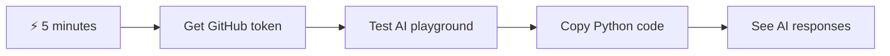

- **মিনিট ১**: [GitHub Models Playground](https://github.com/marketplace/models/azure-openai/gpt-4o-mini/playground) পরিদর্শন করুন এবং একটি ব্যক্তিগত অ্যাক্সেস টোকেন তৈরি করুন
- **মিনিট ২**: প্লেগ্রাউন্ড ইন্টারফেসে সরাসরি এআই ইন্টারঅ্যাকশন পরীক্ষা করুন
- **মিনিট ৩**: "Code" ট্যাবে ক্লিক করুন এবং Python স্নিপেটটি কপি করুন
- **মিনিট ৪**: আপনার টোকেন দিয়ে লোকালিতে কোড চালান: `GITHUB_TOKEN=your_token python test.py`
- **মিনিট ৫**: আপনার নিজের কোড থেকে প্রথম এআই উত্তর তৈরি হতে দেখুন

**দ্রুত পরীক্ষা কোড**:
```python
import os
from openai import OpenAI

client = OpenAI(
    base_url="https://models.github.ai/inference",
    api_key="your_token_here"
)

response = client.chat.completions.create(
    messages=[{"role": "user", "content": "Hello AI!"}],
    model="openai/gpt-4o-mini"
)

print(response.choices[0].message.content)
```

**কেন এটি গুরুত্বপূর্ণ**: ৫ মিনিটে, আপনি প্রোগ্রাম্যাটিক এআই ইন্টারঅ্যাকশনের জাদু অনুভব করবেন। এটি প্রতিটি এআই অ্যাপ্লিকেশনের মৌলিক ভিত্তি যা আপনি ব্যবহার করেন।

আপনার সমাপ্ত প্রকল্পটি দেখতে এমন হবে:

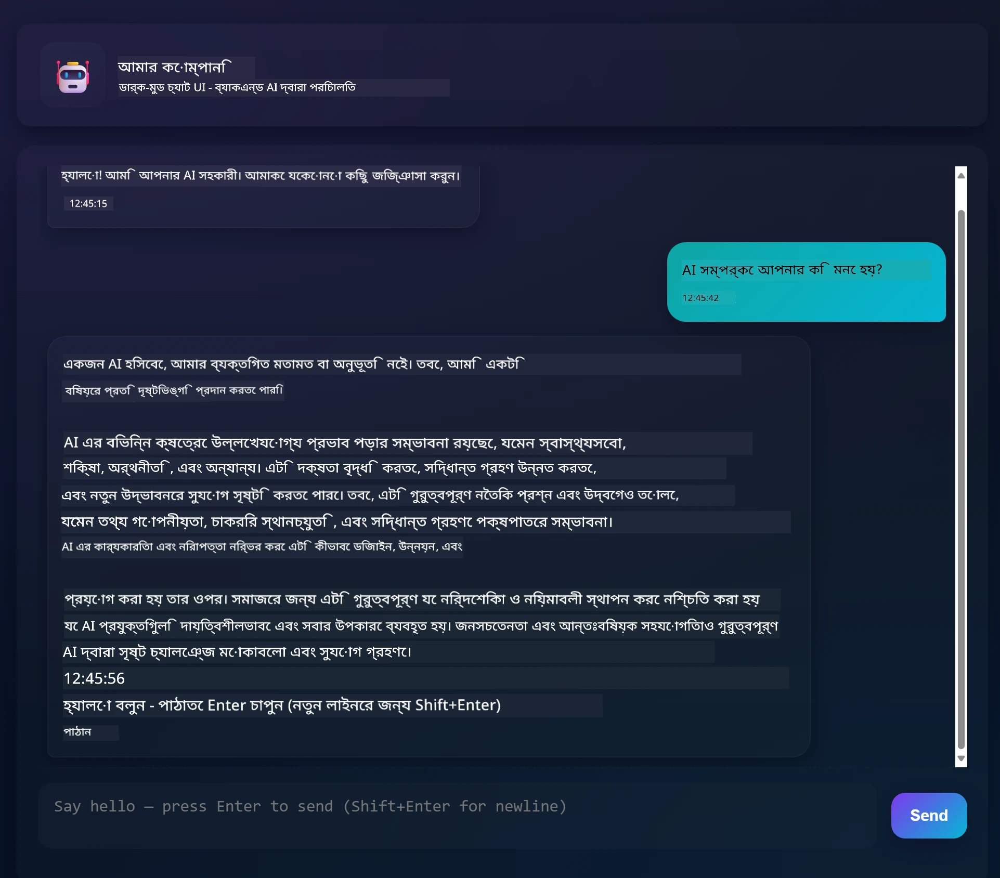

## 🗺️ এআই অ্যাপ্লিকেশন ডেভেলপমেন্টের মাধ্যমে আপনার শেখার যাত্রা

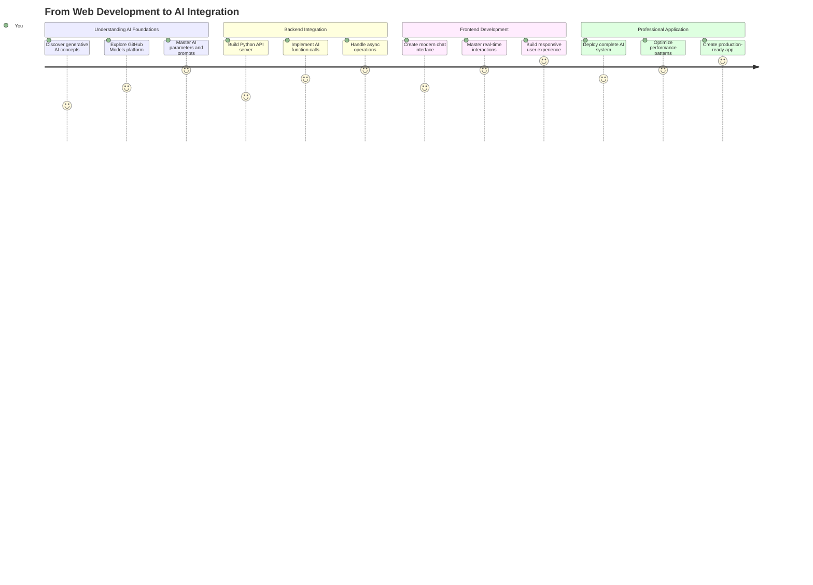

**আপনার যাত্রার গন্তব্য**: এই পাঠের শেষে, আপনি একটি সম্পূর্ণ এআই-চালিত অ্যাপ্লিকেশন তৈরি করবেন যা ChatGPT, Claude এবং Google Bard-এর মতো আধুনিক এআই সহকারীদের চালিত প্রযুক্তি এবং প্যাটার্ন ব্যবহার করে।

## এআই বোঝা: রহস্য থেকে দক্ষতায়

কোডে ডুব দেওয়ার আগে, আসুন আমরা যা নিয়ে কাজ করছি তা বুঝি। যদি আপনি আগে API ব্যবহার করে থাকেন, তবে আপনি মৌলিক প্যাটার্নটি জানেন: একটি অনুরোধ পাঠান, একটি উত্তর পান।

এআই API-গুলি একই কাঠামো অনুসরণ করে, তবে একটি ডাটাবেস থেকে পূর্ব-সংরক্ষিত ডেটা পুনরুদ্ধার করার পরিবর্তে, তারা নতুন উত্তর তৈরি করে যা বিশাল পরিমাণ টেক্সট থেকে শেখা প্যাটার্নের উপর ভিত্তি করে। এটি অনেকটা একটি লাইব্রেরি ক্যাটালগ সিস্টেম এবং একটি জ্ঞানী লাইব্রেরিয়ান যিনি একাধিক উৎস থেকে তথ্য সংক্ষেপ করতে পারেন, তাদের মধ্যে পার্থক্যের মতো।

### "জেনারেটিভ এআই" আসলে কী?

রোসেটা স্টোন কিভাবে পণ্ডিতদের পরিচিত এবং অজানা ভাষার মধ্যে প্যাটার্ন খুঁজে পেতে সাহায্য করেছিল তা বিবেচনা করুন। এআই মডেলগুলি একইভাবে কাজ করে – তারা বিশাল পরিমাণ টেক্সটে প্যাটার্ন খুঁজে বের করে ভাষা কীভাবে কাজ করে তা বুঝতে এবং নতুন প্রশ্নের জন্য উপযুক্ত উত্তর তৈরি করতে।

**আমি এটি একটি সহজ তুলনা দিয়ে ব্যাখ্যা করি:**
- **প্রথাগত ডাটাবেস**: আপনার জন্ম সনদ চাওয়ার মতো – আপনি প্রতিবার একই নথি পান
- **সার্চ ইঞ্জিন**: লাইব্রেরিয়ানকে বি
**2. আউটপুট ফরম্যাটিং**: AI-কে কীভাবে উত্তর গঠন করতে হবে তা জানানো  
```python
system_prompt = """
You are a technical mentor. Always structure your responses as:
1. Quick Answer (1-2 sentences)
2. Detailed Explanation 
3. Code Example
4. Common Pitfalls to Avoid
5. Next Steps for Learning
"""
```
  
**3. সীমাবদ্ধতা নির্ধারণ**: AI কী করবে না তা সংজ্ঞায়িত করা  
```python
system_prompt = """
You are a coding tutor focused on teaching best practices. Never write complete 
solutions for the user - instead, guide them with hints and questions so they 
learn by doing. Always explain the 'why' behind coding decisions.
"""
```
  
#### কেন এটি আপনার চ্যাট অ্যাসিস্ট্যান্টের জন্য গুরুত্বপূর্ণ  

সিস্টেম প্রম্পট বোঝা আপনাকে বিশেষায়িত AI অ্যাসিস্ট্যান্ট তৈরি করার অসাধারণ ক্ষমতা দেয়:  
- **কাস্টমার সার্ভিস বট**: সহায়ক, ধৈর্যশীল, নীতিমালা সম্পর্কে সচেতন  
- **শিক্ষার টিউটর**: উৎসাহজনক, ধাপে ধাপে, বোঝার পরীক্ষা করে  
- **সৃজনশীল সহযোগী**: কল্পনাপ্রবণ, ধারণাগুলির উপর ভিত্তি করে কাজ করে, "যদি এমন হয়?" প্রশ্ন করে  
- **প্রযুক্তিগত বিশেষজ্ঞ**: সুনির্দিষ্ট, বিস্তারিত, নিরাপত্তা সচেতন  

**মূল অন্তর্দৃষ্টি**: আপনি শুধু AI API কল করছেন না – আপনি একটি কাস্টম AI ব্যক্তিত্ব তৈরি করছেন যা আপনার নির্দিষ্ট ব্যবহারের ক্ষেত্রে সেবা দেয়। এটি আধুনিক AI অ্যাপ্লিকেশনগুলিকে সাধারণের পরিবর্তে ব্যক্তিগত এবং কার্যকরী মনে করায়।  

### 🎯 শিক্ষামূলক চেক-ইন: AI ব্যক্তিত্ব প্রোগ্রামিং  

**থামুন এবং চিন্তা করুন**: আপনি সিস্টেম প্রম্পটের মাধ্যমে AI ব্যক্তিত্ব প্রোগ্রাম করতে শিখেছেন। এটি আধুনিক AI অ্যাপ্লিকেশন ডেভেলপমেন্টের একটি মৌলিক দক্ষতা।  

**দ্রুত স্ব-মূল্যায়ন**:  
- আপনি কি ব্যাখ্যা করতে পারেন কীভাবে সিস্টেম প্রম্পট সাধারণ ব্যবহারকারীর বার্তার থেকে আলাদা?  
- temperature এবং top_p প্যারামিটারগুলির মধ্যে পার্থক্য কী?  
- আপনি কীভাবে একটি নির্দিষ্ট ব্যবহারের ক্ষেত্রে (যেমন কোডিং টিউটর) জন্য একটি সিস্টেম প্রম্পট তৈরি করবেন?  

**বাস্তব জীবনের সংযোগ**: আপনি যে সিস্টেম প্রম্পট কৌশল শিখেছেন তা প্রতিটি প্রধান AI অ্যাপ্লিকেশনে ব্যবহৃত হয় - GitHub Copilot-এর কোডিং সহায়তা থেকে ChatGPT-এর কথোপকথন ইন্টারফেস পর্যন্ত। আপনি একই প্যাটার্ন আয়ত্ত করছেন যা বড় প্রযুক্তি কোম্পানির AI প্রোডাক্ট টিম ব্যবহার করে।  

**চ্যালেঞ্জ প্রশ্ন**: আপনি কীভাবে বিভিন্ন ব্যবহারকারীর ধরন (শিক্ষানবিশ বনাম বিশেষজ্ঞ) এর জন্য বিভিন্ন AI ব্যক্তিত্ব ডিজাইন করবেন? প্রম্পট ইঞ্জিনিয়ারিংয়ের মাধ্যমে একই AI মডেল কীভাবে বিভিন্ন শ্রোতাদের সেবা দিতে পারে তা বিবেচনা করুন।  

## FastAPI দিয়ে ওয়েব API তৈরি করা: আপনার উচ্চ-প্রদর্শন AI যোগাযোগ কেন্দ্র  

এখন আসুন ব্যাকএন্ড তৈরি করি যা আপনার ফ্রন্টএন্ডকে AI পরিষেবাগুলির সাথে সংযুক্ত করে। আমরা FastAPI ব্যবহার করব, একটি আধুনিক পাইথন ফ্রেমওয়ার্ক যা AI অ্যাপ্লিকেশনের জন্য API তৈরি করতে দক্ষ।  

FastAPI এই ধরনের প্রকল্পের জন্য বেশ কয়েকটি সুবিধা প্রদান করে: একাধিক অনুরোধ পরিচালনার জন্য বিল্ট-ইন অ্যাসিঙ্ক সাপোর্ট, স্বয়ংক্রিয় API ডকুমেন্টেশন জেনারেশন এবং চমৎকার পারফরম্যান্স। আপনার FastAPI সার্ভার একটি মধ্যস্থতাকারী হিসাবে কাজ করে যা ফ্রন্টএন্ড থেকে অনুরোধ গ্রহণ করে, AI পরিষেবাগুলির সাথে যোগাযোগ করে এবং ফরম্যাট করা উত্তর প্রদান করে।  

### কেন AI অ্যাপ্লিকেশনের জন্য FastAPI?  

আপনার মনে হতে পারে: "আমি কি সরাসরি আমার ফ্রন্টএন্ড জাভাস্ক্রিপ্ট থেকে AI কল করতে পারি না?" বা "Flask বা Django-এর পরিবর্তে কেন FastAPI?" চমৎকার প্রশ্ন!  

**এখানে কেন FastAPI আমাদের জন্য উপযুক্ত:**  
- **ডিফল্টভাবে অ্যাসিঙ্ক**: একাধিক AI অনুরোধ একসাথে পরিচালনা করতে পারে  
- **স্বয়ংক্রিয় ডকস**: `/docs`-এ যান এবং বিনামূল্যে একটি সুন্দর, ইন্টারেক্টিভ API ডকুমেন্টেশন পৃষ্ঠা পান  
- **বিল্ট-ইন যাচাইকরণ**: সমস্যাগুলি ঘটার আগে ত্রুটি শনাক্ত করে  
- **অত্যন্ত দ্রুত**: সবচেয়ে দ্রুততম পাইথন ফ্রেমওয়ার্কগুলির মধ্যে একটি  
- **আধুনিক পাইথন**: সর্বশেষ এবং সর্বশ্রেষ্ঠ পাইথন বৈশিষ্ট্য ব্যবহার করে  

**এবং এখানে কেন আমাদের একটি ব্যাকএন্ড প্রয়োজন:**  

**নিরাপত্তা**: আপনার AI API কী একটি পাসওয়ার্ডের মতো – যদি আপনি এটি ফ্রন্টএন্ড জাভাস্ক্রিপ্টে রাখেন, তাহলে যে কেউ আপনার ওয়েবসাইটের সোর্স কোড দেখতে পারে এবং এটি চুরি করতে পারে। ব্যাকএন্ড সংবেদনশীল শংসাপত্রগুলি সুরক্ষিত রাখে।  

**রেট সীমাবদ্ধতা এবং নিয়ন্ত্রণ**: ব্যাকএন্ড আপনাকে ব্যবহারকারীরা কতবার অনুরোধ করতে পারে তা নিয়ন্ত্রণ করতে, ব্যবহারকারী প্রমাণীকরণ বাস্তবায়ন করতে এবং ব্যবহার ট্র্যাক করতে লগিং যোগ করতে দেয়।  

**ডেটা প্রক্রিয়াকরণ**: আপনি কথোপকথন সংরক্ষণ করতে, অনুপযুক্ত বিষয়বস্তু ফিল্টার করতে বা একাধিক AI পরিষেবা একত্রিত করতে চাইতে পারেন। ব্যাকএন্ড হল যেখানে এই লজিক থাকে।  

**আর্কিটেকচারটি ক্লায়েন্ট-সার্ভার মডেলের মতো:**  
- **ফ্রন্টএন্ড**: ইন্টারঅ্যাকশনের জন্য ব্যবহারকারীর ইন্টারফেস স্তর  
- **ব্যাকএন্ড API**: অনুরোধ প্রক্রিয়াকরণ এবং রাউটিং স্তর  
- **AI পরিষেবা**: বাহ্যিক গণনা এবং উত্তর তৈরি  
- **পরিবেশ ভেরিয়েবল**: নিরাপদ কনফিগারেশন এবং শংসাপত্র সংরক্ষণ  

### অনুরোধ-উত্তর প্রবাহ বোঝা  

আসুন ট্রেস করি যখন একজন ব্যবহারকারী একটি বার্তা পাঠায় তখন কী ঘটে:  

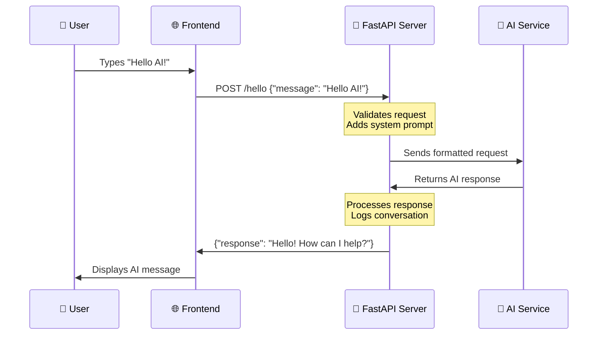
  
**প্রতিটি ধাপ বোঝা:**  
1. **ব্যবহারকারীর ইন্টারঅ্যাকশন**: ব্যক্তি চ্যাট ইন্টারফেসে টাইপ করে  
2. **ফ্রন্টএন্ড প্রক্রিয়াকরণ**: জাভাস্ক্রিপ্ট ইনপুট ক্যাপচার করে এবং JSON হিসাবে ফরম্যাট করে  
3. **API যাচাইকরণ**: FastAPI স্বয়ংক্রিয়ভাবে Pydantic মডেল ব্যবহার করে অনুরোধ যাচাই করে  
4. **AI ইন্টিগ্রেশন**: ব্যাকএন্ড প্রসঙ্গ (সিস্টেম প্রম্পট) যোগ করে এবং AI পরিষেবাকে কল করে  
5. **উত্তর পরিচালনা**: API AI উত্তর গ্রহণ করে এবং প্রয়োজন হলে এটি সংশোধন করতে পারে  
6. **ফ্রন্টএন্ড প্রদর্শন**: জাভাস্ক্রিপ্ট চ্যাট ইন্টারফেসে উত্তর দেখায়  

### API আর্কিটেকচার বোঝা  

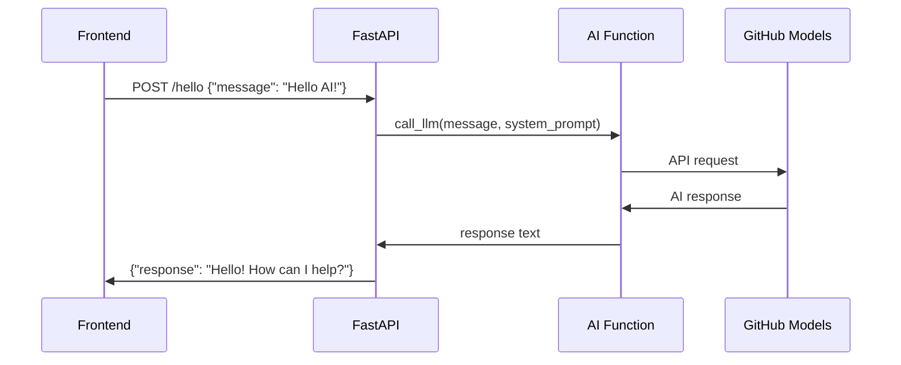
  
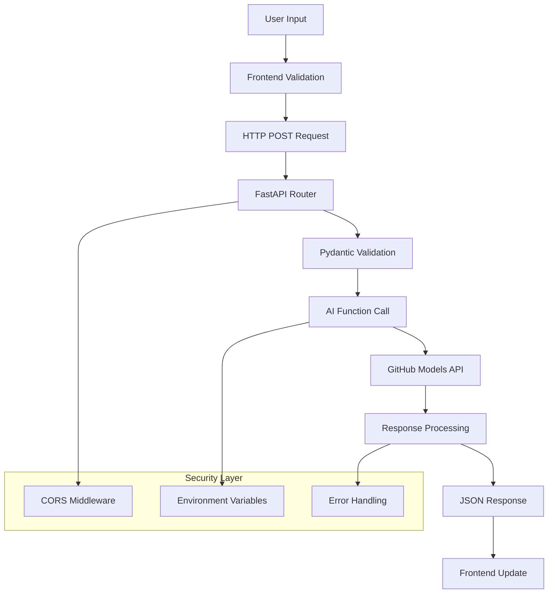
  
### FastAPI অ্যাপ্লিকেশন তৈরি করা  

আসুন আমাদের API ধাপে ধাপে তৈরি করি। `api.py` নামে একটি ফাইল তৈরি করুন নিম্নলিখিত FastAPI কোড সহ:  

```python
# api.py
from fastapi import FastAPI, HTTPException
from fastapi.middleware.cors import CORSMiddleware
from pydantic import BaseModel
from llm import call_llm
import logging

# Configure logging
logging.basicConfig(level=logging.INFO)
logger = logging.getLogger(__name__)

# Create FastAPI application
app = FastAPI(
    title="AI Chat API",
    description="A high-performance API for AI-powered chat applications",
    version="1.0.0"
)

# Configure CORS
app.add_middleware(
    CORSMiddleware,
    allow_origins=["*"],  # Configure appropriately for production
    allow_credentials=True,
    allow_methods=["*"],
    allow_headers=["*"],
)

# Pydantic models for request/response validation
class ChatMessage(BaseModel):
    message: str

class ChatResponse(BaseModel):
    response: str

@app.get("/")
async def root():
    """Root endpoint providing API information."""
    return {
        "message": "Welcome to the AI Chat API",
        "docs": "/docs",
        "health": "/health"
    }

@app.get("/health")
async def health_check():
    """Health check endpoint."""
    return {"status": "healthy", "service": "ai-chat-api"}

@app.post("/hello", response_model=ChatResponse)
async def chat_endpoint(chat_message: ChatMessage):
    """Main chat endpoint that processes messages and returns AI responses."""
    try:
        # Extract and validate message
        message = chat_message.message.strip()
        if not message:
            raise HTTPException(status_code=400, detail="Message cannot be empty")
        
        logger.info(f"Processing message: {message[:50]}...")
        
        # Call AI service (note: call_llm should be made async for better performance)
        ai_response = await call_llm_async(message, "You are a helpful and friendly assistant.")
        
        logger.info("AI response generated successfully")
        return ChatResponse(response=ai_response)
        
    except HTTPException:
        raise
    except Exception as e:
        logger.error(f"Error processing chat message: {str(e)}")
        raise HTTPException(status_code=500, detail="Internal server error")

if __name__ == "__main__":
    import uvicorn
    uvicorn.run(app, host="0.0.0.0", port=5000, reload=True)
```
  
**FastAPI বাস্তবায়ন বোঝা:**  
- **ইমপোর্ট করে** FastAPI আধুনিক ওয়েব ফ্রেমওয়ার্ক কার্যকারিতা এবং Pydantic ডেটা যাচাইকরণের জন্য  
- **স্বয়ংক্রিয় API ডকুমেন্টেশন তৈরি করে** (সার্ভার চালানোর সময় `/docs`-এ উপলব্ধ)  
- **CORS middleware সক্ষম করে** বিভিন্ন উৎস থেকে ফ্রন্টএন্ড অনুরোধ অনুমোদন করতে  
- **Pydantic মডেল সংজ্ঞায়িত করে** স্বয়ংক্রিয় অনুরোধ/উত্তর যাচাইকরণ এবং ডকুমেন্টেশনের জন্য  
- **অ্যাসিঙ্ক এন্ডপয়েন্ট ব্যবহার করে** একাধিক অনুরোধের সাথে আরও ভাল পারফরম্যান্সের জন্য  
- **উপযুক্ত HTTP স্ট্যাটাস কোড এবং ত্রুটি পরিচালনা বাস্তবায়ন করে** HTTPException সহ  
- **গঠনমূলক লগিং অন্তর্ভুক্ত করে** পর্যবেক্ষণ এবং ডিবাগিংয়ের জন্য  
- **পরিষেবা স্থিতি পর্যবেক্ষণের জন্য স্বাস্থ্য পরীক্ষা এন্ডপয়েন্ট প্রদান করে**  

**FastAPI-এর ঐতিহ্যবাহী ফ্রেমওয়ার্কগুলির উপর মূল সুবিধা:**  
- **স্বয়ংক্রিয় যাচাইকরণ**: Pydantic মডেলগুলি প্রক্রিয়াকরণের আগে ডেটার অখণ্ডতা নিশ্চিত করে  
- **ইন্টারেক্টিভ ডকস**: `/docs`-এ যান এবং স্বয়ংক্রিয়ভাবে তৈরি, পরীক্ষাযোগ্য API ডকুমেন্টেশন পান  
- **টাইপ সেফটি**: পাইথন টাইপ হিন্টগুলি রানটাইম ত্রুটি প্রতিরোধ করে এবং কোডের গুণমান উন্নত করে  
- **অ্যাসিঙ্ক সাপোর্ট**: একাধিক AI অনুরোধ একযোগে পরিচালনা করে ব্লকিং ছাড়াই  
- **পারফরম্যান্স**: রিয়েল-টাইম অ্যাপ্লিকেশনের জন্য উল্লেখযোগ্যভাবে দ্রুত অনুরোধ প্রক্রিয়াকরণ  

### CORS বোঝা: ওয়েবের নিরাপত্তা রক্ষী  

CORS (Cross-Origin Resource Sharing) একটি বিল্ডিংয়ের নিরাপত্তা রক্ষীর মতো যে দর্শনার্থীদের প্রবেশের অনুমতি আছে কিনা তা পরীক্ষা করে। আসুন বুঝি কেন এটি গুরুত্বপূর্ণ এবং এটি আপনার অ্যাপ্লিকেশনকে কীভাবে প্রভাবিত করে।  

#### CORS কী এবং এটি কেন বিদ্যমান?  

**সমস্যা**: কল্পনা করুন যদি কোনো ওয়েবসাইট আপনার অনুমতি ছাড়াই আপনার ব্যাংকের ওয়েবসাইটে অনুরোধ করতে পারে। এটি একটি নিরাপত্তার দুঃস্বপ্ন হবে! ব্রাউজারগুলি ডিফল্টভাবে "Same-Origin Policy" এর মাধ্যমে এটি প্রতিরোধ করে।  

**Same-Origin Policy**: ব্রাউজারগুলি শুধুমাত্র সেই ডোমেইন, পোর্ট এবং প্রোটোকল থেকে অনুরোধ করতে দেয় যেখান থেকে তারা লোড হয়েছে।  

**বাস্তব জীবনের উপমা**: এটি একটি অ্যাপার্টমেন্ট বিল্ডিংয়ের নিরাপত্তার মতো – শুধুমাত্র বাসিন্দারা (একই উৎস) ডিফল্টভাবে বিল্ডিং অ্যাক্সেস করতে পারে। আপনি যদি একজন বন্ধুকে (ভিন্ন উৎস) আমন্ত্রণ জানাতে চান, তাহলে আপনাকে স্পষ্টভাবে নিরাপত্তাকে জানাতে হবে যে এটি ঠিক আছে।  

#### আপনার ডেভেলপমেন্ট পরিবেশে CORS  

ডেভেলপমেন্ট চলাকালীন, আপনার ফ্রন্টএন্ড এবং ব্যাকএন্ড বিভিন্ন পোর্টে চলে:  
- ফ্রন্টএন্ড: `http://localhost:3000` (অথবা file:// যদি HTML সরাসরি খোলা হয়)  
- ব্যাকএন্ড: `http://localhost:5000`  

এগুলি "ভিন্ন উৎস" হিসাবে বিবেচিত হয় যদিও তারা একই কম্পিউটারে!  

```python
from fastapi.middleware.cors import CORSMiddleware

app = FastAPI(__name__)
CORS(app)   # This tells browsers: "It's okay for other origins to make requests to this API"
```
  
**CORS কনফিগারেশন বাস্তবে যা করে:**  
- **বিশেষ HTTP হেডার যোগ করে** API প্রতিক্রিয়াগুলিতে যা ব্রাউজারকে বলে "এই ক্রস-অরিজিন অনুরোধ অনুমোদিত"  
- **"প্রিফ্লাইট" অনুরোধ পরিচালনা করে** (ব্রাউজারগুলি কখনও কখনও প্রকৃত অনুরোধ পাঠানোর আগে অনুমতি পরীক্ষা করে)  
- **বাধা দেয়** ব্রাউজার কনসোলে "CORS নীতির দ্বারা অবরুদ্ধ" ত্রুটি  

#### CORS নিরাপত্তা: ডেভেলপমেন্ট বনাম প্রোডাকশন  

```python
# 🚨 Development: Allows ALL origins (convenient but insecure)
CORS(app)

# ✅ Production: Only allow your specific frontend domain
CORS(app, origins=["https://yourdomain.com", "https://www.yourdomain.com"])

# 🔒 Advanced: Different origins for different environments
if app.debug:  # Development mode
    CORS(app, origins=["http://localhost:3000", "http://127.0.0.1:3000"])
else:  # Production mode
    CORS(app, origins=["https://yourdomain.com"])
```
  
**কেন এটি গুরুত্বপূর্ণ**: ডেভেলপমেন্টে, `CORS(app)` আপনার সামনের দরজা আনলক করার মতো – সুবিধাজনক কিন্তু নিরাপদ নয়। প্রোডাকশনে, আপনি ঠিক কোন ওয়েবসাইটগুলি আপনার API-এর সাথে কথা বলতে পারে তা নির্দিষ্ট করতে চান।  

#### সাধারণ CORS পরিস্থিতি এবং সমাধান  

| পরিস্থিতি | সমস্যা | সমাধান |  
|----------|---------|----------|  
| **লোকাল ডেভেলপমেন্ট** | ফ্রন্টএন্ড ব্যাকএন্ডে পৌঁছাতে পারে না | FastAPI-তে CORSMiddleware যোগ করুন |  
| **GitHub Pages + Heroku** | ডিপ্লয় করা ফ্রন্টএন্ড API-তে পৌঁছাতে পারে না | আপনার GitHub Pages URL CORS উৎসে যোগ করুন |  
| **কাস্টম ডোমেইন** | প্রোডাকশনে CORS ত্রুটি | আপনার ডোমেইনের সাথে CORS উৎস আপডেট করুন |  
| **মোবাইল অ্যাপ** | অ্যাপ ওয়েব API-তে পৌঁছাতে পারে না | আপনার অ্যাপের ডোমেইন যোগ করুন বা সাবধানে `*` ব্যবহার করুন |  

**প্রো টিপ**: আপনি আপনার ব্রাউজারের ডেভেলপার টুলের নেটওয়ার্ক ট্যাবে CORS হেডারগুলি পরীক্ষা করতে পারেন। প্রতিক্রিয়ায় `Access-Control-Allow-Origin` এর মতো হেডারগুলি দেখুন।  

### ত্রুটি পরিচালনা এবং যাচাইকরণ  

লক্ষ্য করুন কীভাবে আমাদের API সঠিক ত্রুটি পরিচালনা অন্তর্ভুক্ত করে:  

```python
# Validate that we received a message
if not message:
    return jsonify({"error": "Message field is required"}), 400
```
  
**মূল যাচাইকরণ নীতিমালা:**  
- **প্রয়োজনীয় ক্ষেত্রগুলির জন্য পরীক্ষা করে** অনুরোধ প্রক্রিয়াকরণের আগে  
- **অর্থপূর্ণ ত্রুটি বার্তা প্রদান করে** JSON ফরম্যাটে  
- **উপযুক্ত HTTP স্ট্যাটাস কোড ব্যবহার করে** (খারাপ অনুরোধের জন্য 400)  
- **সুস্পষ্ট প্রতিক্রিয়া প্রদান করে** যা ফ্রন্টএন্ড ডেভেলপারদের সমস্যা সমাধানে সাহায্য করে  

## আপনার ব্যাকএন্ড সেট আপ এবং চালানো  

এখন যেহেতু আমাদের AI ইন্টিগ্রেশন এবং FastAPI সার্ভার প্রস্তুত, আসুন সবকিছু চালু করি। সেটআপ প্রক্রিয়ায় পাইথন ডিপেন্ডেন্সি ইনস্টল করা, পরিবেশ ভেরিয়েবল কনফিগার করা এবং আপনার ডেভেলপমেন্ট সার্ভার শুরু করা অন্তর্ভুক্ত।  

### পাইথন পরিবেশ সেটআপ  

আসুন আপনার পাইথন ডেভেলপমেন্ট পরিবেশ সেট আপ করি। ভার্চুয়াল পরিবেশগুলি ম্যানহাটন প্রজেক্টের compartmentalized পদ্ধতির মতো – প্রতিটি প্রকল্প তার নিজস্ব নির্দিষ্ট সরঞ্জাম এবং ডিপেন্ডেন্সি সহ একটি পৃথক স্থান পায়, বিভিন্ন প্রকল্পের মধ্যে দ্বন্দ্ব প্রতিরোধ করে।  

```bash
# Navigate to your backend directory
cd backend

# Create a virtual environment (like creating a clean room for your project)
python -m venv venv

# Activate it (Linux/Mac)
source ./venv/bin/activate

# On Windows, use:
# venv\Scripts\activate

# Install the good stuff
pip install openai fastapi uvicorn python-dotenv
```
  
**আমরা যা করলাম:**  
- **আমাদের নিজস্ব ছোট পাইথন বুদ্বুদ তৈরি করলাম** যেখানে আমরা প্যাকেজ ইনস্টল করতে পারি যা অন্য কিছু প্রভাবিত করবে না  
- **এটি সক্রিয় করলাম** যাতে আমাদের টার্মিনাল জানে এই নির্দিষ্ট পরিবেশ ব্যবহার করতে  
- **প্রয়োজনীয় জিনিসগুলি ইনস্টল করলাম**: OpenAI AI ম্যাজিকের জন্য, FastAPI আমাদের ওয়েব API-এর জন্য, Uvicorn এটি চালানোর জন্য এবং python-dotenv নিরাপদ গোপনীয়তা ব্যবস্থাপনার জন্য  

**মূল ডিপেন্ডেন্সি ব্যাখ্যা:**  
- **FastAPI**: আধুনিক, দ্রুত ওয়েব ফ্রেমওয়ার্ক যা স্বয়ংক্রিয় API ডকুমেন্টেশন সহ  
- **Uvicorn**: FastAPI অ্যাপ্লিকেশন চালানোর জন্য দ্রুততম ASGI সার্ভার  
- **OpenAI**: GitHub মডেল এবং OpenAI API ইন্টিগ্রেশনের জন্য অফিসিয়াল লাইব্রেরি  
- **python-dotenv**: .env ফাইল থেকে নিরাপদ পরিবেশ ভেরিয়েবল লোডিং  

### পরিবেশ কনফিগারেশন: গোপনীয়তা সুরক্ষিত রাখা  

API শুরু করার আগে, আসুন ওয়েব ডেভেলপমেন্টের সবচেয়ে গুরুত্বপূর্ণ পাঠগুলির মধ্যে একটি নিয়ে আলোচনা করি: কীভাবে আপনার গোপনীয়তাগুলি সত্যিই গোপন রাখা যায়। পরিবেশ ভেরিয়েবলগুলি একটি নিরাপদ ভল্টের মতো যা শুধুমাত্র আপনার অ্যাপ্লিকেশন অ্যাক্সেস করতে পারে।  

#### পরিবেশ ভেরিয়েবল কী?  

**পরিবেশ ভেরিয়েবলগুলি একটি নিরাপদ ডিপোজিট বাক্সের মতো** – আপনি সেখানে আপনার মূল্যবান জিনিস রাখেন, এবং শুধুমাত্র আপনি (এবং আপনার অ্যাপ) এটি বের করার চাবি রাখেন। আপনার কোডে সরাসরি সংবেদনশীল তথ্য লেখার পরিবর্তে (যেখানে যে কেউ এটি দেখতে পারে), আপনি এটি নিরাপদে পরিবেশে সংরক্ষণ করেন।  

**এখানে পার্থক্য:**  
- **ভুল উপায়**: আপনার পাসওয়ার্ড একটি স্টিকি নোটে লিখে আপনার মনিটরে লাগানো  
- **সঠিক উপায়**: আপনার পাসওয়ার্ড একটি নিরাপদ পাসওয়ার্ড ম্যানেজারে রাখা যা শুধুমাত্র আপনি অ্যাক্সেস করতে পারেন  

#### পরিবেশ ভেরিয়েবল কেন গুরুত্বপূর্ণ  

```python
# 🚨 NEVER DO THIS - API key visible to everyone
client = OpenAI(
    api_key="ghp_1234567890abcdef...",  # Anyone can steal this!
    base_url="https://models.github.ai/inference"
)

# ✅ DO THIS - API key stored securely
client = OpenAI(
    api_key=os.environ["GITHUB_TOKEN"],  # Only your app can access this
    base_url="https://models.github.ai/inference"
)
```
  
**যখন আপনি গোপনীয়তা হার্ডকোড করেন তখন কী ঘটে:**  
1. **ভার্সন কন্ট্রোল এক্সপোজার**: আপনার Git রিপোজিটরিতে অ্যাক্সেস থাকা যে কেউ আপনার API কী দেখতে পারে  
2. **পাবলিক রিপোজিটরি**: যদি আপনি GitHub-এ পুশ করেন, আপনার কী পুরো ইন্টারনেটের জন্য দৃশ্যমান  
3. **টিম শেয়ারিং**: আপনার প্রকল্পে কাজ করা অন্যান্য ডেভেলপাররা
এখন আসে উত্তেজনাপূর্ণ মুহূর্ত – আপনার FastAPI ডেভেলপমেন্ট সার্ভার চালু করা এবং আপনার AI ইন্টিগ্রেশনকে জীবন্ত দেখতে পাওয়া! FastAPI ব্যবহার করে Uvicorn, একটি অত্যন্ত দ্রুত ASGI সার্ভার যা বিশেষভাবে অ্যাসিঙ্ক্রোনাস Python অ্যাপ্লিকেশনের জন্য ডিজাইন করা হয়েছে।

#### FastAPI সার্ভার স্টার্টআপ প্রক্রিয়া বোঝা

```bash
# Method 1: Direct Python execution (includes auto-reload)
python api.py

# Method 2: Using Uvicorn directly (more control)
uvicorn api:app --host 0.0.0.0 --port 5000 --reload
```

যখন আপনি এই কমান্ড চালান, তখন পেছনে যা ঘটে তা হলো:

**1. Python আপনার FastAPI অ্যাপ্লিকেশন লোড করে**:
- প্রয়োজনীয় সব লাইব্রেরি (FastAPI, Pydantic, OpenAI, ইত্যাদি) ইমপোর্ট করে
- `.env` ফাইল থেকে পরিবেশ ভেরিয়েবল লোড করে
- FastAPI অ্যাপ্লিকেশন ইনস্ট্যান্স তৈরি করে স্বয়ংক্রিয় ডকুমেন্টেশনের সাথে

**2. Uvicorn ASGI সার্ভার কনফিগার করে**:
- অ্যাসিঙ্ক্রোনাস রিকোয়েস্ট হ্যান্ডলিং ক্ষমতা সহ পোর্ট ৫০০০-এ সংযুক্ত হয়
- স্বয়ংক্রিয় ভ্যালিডেশন সহ রিকোয়েস্ট রাউটিং সেটআপ করে
- ডেভেলপমেন্টের জন্য হট রিলোড সক্ষম করে (ফাইল পরিবর্তনে পুনরায় চালু হয়)
- ইন্টারঅ্যাকটিভ API ডকুমেন্টেশন তৈরি করে

**3. সার্ভার শোনা শুরু করে**:
- আপনার টার্মিনালে দেখাবে: `INFO: Uvicorn running on http://0.0.0.0:5000`
- সার্ভার একাধিক সমান্তরাল AI রিকোয়েস্ট হ্যান্ডল করতে পারে
- আপনার API স্বয়ংক্রিয় ডকস সহ প্রস্তুত `http://localhost:5000/docs` এ

#### সবকিছু ঠিকঠাক কাজ করলে আপনি যা দেখতে পাবেন

```bash
$ python api.py
INFO:     Will watch for changes in these directories: ['/your/project/path']
INFO:     Uvicorn running on http://0.0.0.0:5000 (Press CTRL+C to quit)
INFO:     Started reloader process [12345] using WatchFiles
INFO:     Started server process [12346]
INFO:     Waiting for application startup.
INFO:     Application startup complete.
```

**FastAPI আউটপুট বোঝা**:
- **পরিবর্তনের জন্য নজর রাখবে**: ডেভেলপমেন্টের জন্য অটো-রিলোড সক্রিয়
- **Uvicorn চালু**: উচ্চ-ক্ষমতাসম্পন্ন ASGI সার্ভার সক্রিয়
- **রিলোডার প্রক্রিয়া শুরু হয়েছে**: ফাইল পরিবর্তনের জন্য অটো-রিস্টার্ট
- **অ্যাপ্লিকেশন স্টার্টআপ সম্পন্ন**: FastAPI অ্যাপ সফলভাবে ইনিশিয়ালাইজড
- **ইন্টারঅ্যাকটিভ ডকস উপলব্ধ**: `/docs` এ যান স্বয়ংক্রিয় API ডকুমেন্টেশনের জন্য

#### আপনার FastAPI পরীক্ষা করা: একাধিক শক্তিশালী পদ্ধতি

FastAPI আপনার API পরীক্ষা করার জন্য বেশ কিছু সুবিধাজনক উপায় প্রদান করে, যার মধ্যে স্বয়ংক্রিয় ইন্টারঅ্যাকটিভ ডকুমেন্টেশন অন্তর্ভুক্ত:

**পদ্ধতি ১: ইন্টারঅ্যাকটিভ API ডকুমেন্টেশন (প্রস্তাবিত)**
1. আপনার ব্রাউজার খুলুন এবং যান `http://localhost:5000/docs`
2. আপনি Swagger UI দেখতে পাবেন যেখানে আপনার সব এন্ডপয়েন্ট ডকুমেন্টেড থাকবে
3. `/hello` এ ক্লিক করুন → "Try it out" → একটি টেস্ট মেসেজ লিখুন → "Execute"
4. ব্রাউজারে সঠিক ফরম্যাটে রেসপন্স সরাসরি দেখুন

**পদ্ধতি ২: বেসিক ব্রাউজার টেস্ট**
1. রুট এন্ডপয়েন্টের জন্য যান `http://localhost:5000`
2. সার্ভার হেলথ চেক করার জন্য যান `http://localhost:5000/health`
3. এটি নিশ্চিত করে যে আপনার FastAPI সার্ভার সঠিকভাবে চলছে

**পদ্ধতি ৩: কমান্ড লাইন টেস্ট (উন্নত)**
```bash
# Test with curl (if available)
curl -X POST http://localhost:5000/hello \
  -H "Content-Type: application/json" \
  -d '{"message": "Hello AI!"}'

# Expected response:
# {"response": "Hello! I'm your AI assistant. How can I help you today?"}
```

**পদ্ধতি ৪: Python টেস্ট স্ক্রিপ্ট**
```python
# test_api.py - Create this file to test your API
import requests
import json

# Test the API endpoint
url = "http://localhost:5000/hello"
data = {"message": "Tell me a joke about programming"}

response = requests.post(url, json=data)
if response.status_code == 200:
    result = response.json()
    print("AI Response:", result['response'])
else:
    print("Error:", response.status_code, response.text)
```

#### সাধারণ স্টার্টআপ সমস্যার সমাধান

| ত্রুটি বার্তা | এর অর্থ | সমাধান |
|---------------|---------------|------------|
| `ModuleNotFoundError: No module named 'fastapi'` | FastAPI ইনস্টল করা হয়নি | আপনার ভার্চুয়াল এনভায়রনমেন্টে `pip install fastapi uvicorn` চালান |
| `ModuleNotFoundError: No module named 'uvicorn'` | ASGI সার্ভার ইনস্টল করা হয়নি | আপনার ভার্চুয়াল এনভায়রনমেন্টে `pip install uvicorn` চালান |
| `KeyError: 'GITHUB_TOKEN'` | পরিবেশ ভেরিয়েবল পাওয়া যায়নি | আপনার `.env` ফাইল এবং `load_dotenv()` কল চেক করুন |
| `Address already in use` | পোর্ট ৫০০০ ব্যস্ত | পোর্ট ৫০০০ ব্যবহার করা অন্য প্রসেস বন্ধ করুন অথবা পোর্ট পরিবর্তন করুন |
| `ValidationError` | রিকোয়েস্ট ডেটা Pydantic মডেলের সাথে মেলে না | আপনার রিকোয়েস্ট ফরম্যাট চেক করুন যা প্রত্যাশিত স্কিমার সাথে মেলে |
| `HTTPException 422` | অপ্রক্রিয়াযোগ্য সত্তা | রিকোয়েস্ট ভ্যালিডেশন ব্যর্থ হয়েছে, `/docs` এ সঠিক ফরম্যাট চেক করুন |
| `OpenAI API error` | AI সার্ভিস অথেনটিকেশন ব্যর্থ | আপনার GitHub টোকেন সঠিক কিনা এবং যথাযথ অনুমতি আছে কিনা যাচাই করুন |

#### ডেভেলপমেন্টের সেরা অভ্যাস

**হট রিলোডিং**: FastAPI Uvicorn-এর সাথে স্বয়ংক্রিয় রিলোডিং প্রদান করে যখন আপনি আপনার Python ফাইলগুলিতে পরিবর্তন সংরক্ষণ করেন। এর মানে আপনি আপনার কোড পরিবর্তন করতে পারেন এবং ম্যানুয়ালি রিস্টার্ট না করেই তাৎক্ষণিকভাবে পরীক্ষা করতে পারেন।

```python
# Enable hot reloading explicitly
if __name__ == "__main__":
    app.run(host="0.0.0.0", port=5000, debug=True)  # debug=True enables hot reload
```

**ডেভেলপমেন্টের জন্য লগিং**: লগিং যোগ করুন যা ঘটছে তা বুঝতে:

```python
import logging

# Set up logging
logging.basicConfig(level=logging.INFO)
logger = logging.getLogger(__name__)

@app.route("/hello", methods=["POST"])
def hello():
    data = request.get_json()
    message = data.get("message", "")
    
    logger.info(f"Received message: {message}")
    
    if not message:
        logger.warning("Empty message received")
        return jsonify({"error": "Message field is required"}), 400
    
    try:
        response = call_llm(message, "You are a helpful and friendly assistant.")
        logger.info(f"AI response generated successfully")
        return jsonify({"response": response})
    except Exception as e:
        logger.error(f"AI API error: {str(e)}")
        return jsonify({"error": "AI service temporarily unavailable"}), 500
```

**লগিং কেন সাহায্য করে**: ডেভেলপমেন্টের সময়, আপনি দেখতে পারেন ঠিক কী রিকোয়েস্ট আসছে, AI কী রেসপন্স দিচ্ছে, এবং কোথায় ত্রুটি ঘটছে। এটি ডিবাগিংকে অনেক দ্রুত করে তোলে।

### GitHub Codespaces-এর জন্য কনফিগার করা: ক্লাউড ডেভেলপমেন্ট সহজ করা

GitHub Codespaces হলো ক্লাউডে একটি শক্তিশালী ডেভেলপমেন্ট কম্পিউটার যা আপনি যেকোনো ব্রাউজার থেকে অ্যাক্সেস করতে পারেন। যদি আপনি Codespaces-এ কাজ করেন, তাহলে আপনার ব্যাকএন্ডকে আপনার ফ্রন্টএন্ডের সাথে সংযুক্ত করতে কিছু অতিরিক্ত ধাপ প্রয়োজন।

#### Codespaces নেটওয়ার্কিং বোঝা

একটি লোকাল ডেভেলপমেন্ট এনভায়রনমেন্টে, সবকিছু একই কম্পিউটারে চলে:
- ব্যাকএন্ড: `http://localhost:5000`
- ফ্রন্টএন্ড: `http://localhost:3000` (অথবা file://)

Codespaces-এ, আপনার ডেভেলপমেন্ট এনভায়রনমেন্ট GitHub-এর সার্ভারে চলে, তাই "localhost"-এর অর্থ ভিন্ন। GitHub স্বয়ংক্রিয়ভাবে আপনার সার্ভিসের জন্য পাবলিক URL তৈরি করে, কিন্তু আপনাকে সেগুলো সঠিকভাবে কনফিগার করতে হবে।

#### Codespaces কনফিগারেশন ধাপে ধাপে

**1. আপনার ব্যাকএন্ড সার্ভার চালু করুন**:
```bash
cd backend
python api.py
```

আপনি পরিচিত FastAPI/Uvicorn স্টার্টআপ বার্তা দেখতে পাবেন, কিন্তু লক্ষ্য করুন এটি Codespace এনভায়রনমেন্টের ভিতরে চলছে।

**2. পোর্ট দৃশ্যমানতা কনফিগার করুন**:
- VS Code-এর নিচের প্যানেলে "Ports" ট্যাব খুঁজুন
- তালিকায় পোর্ট ৫০০০ খুঁজুন
- পোর্ট ৫০০০-এ রাইট-ক্লিক করুন
- "Port Visibility" → "Public" নির্বাচন করুন

**কেন এটি পাবলিক করবেন?** ডিফল্টভাবে, Codespace পোর্টগুলো প্রাইভেট থাকে (শুধুমাত্র আপনার জন্য অ্যাক্সেসযোগ্য)। পাবলিক করলে আপনার ফ্রন্টএন্ড (যা ব্রাউজারে চলে) আপনার ব্যাকএন্ডের সাথে যোগাযোগ করতে পারে।

**3. আপনার পাবলিক URL পান**:
পোর্ট পাবলিক করার পরে, আপনি একটি URL দেখতে পাবেন:
```
https://your-codespace-name-5000.app.github.dev
```

**4. আপনার ফ্রন্টএন্ড কনফিগারেশন আপডেট করুন**:
```javascript
// In your frontend app.js, update the BASE_URL:
this.BASE_URL = "https://your-codespace-name-5000.app.github.dev";
```

#### Codespace URL বোঝা

Codespace URL একটি পূর্বানুমানযোগ্য প্যাটার্ন অনুসরণ করে:
```
https://[codespace-name]-[port].app.github.dev
```

**এটি ভেঙে দেখা**:
- `codespace-name`: আপনার Codespace-এর জন্য একটি ইউনিক আইডেন্টিফায়ার (সাধারণত আপনার ইউজারনেম অন্তর্ভুক্ত করে)
- `port`: পোর্ট নম্বর যেখানে আপনার সার্ভিস চলছে (আমাদের FastAPI অ্যাপের জন্য ৫০০০)
- `app.github.dev`: Codespace অ্যাপ্লিকেশনের জন্য GitHub-এর ডোমেইন

#### আপনার Codespace সেটআপ পরীক্ষা করা

**1. সরাসরি ব্যাকএন্ড পরীক্ষা করুন**:
আপনার পাবলিক URL একটি নতুন ব্রাউজার ট্যাবে খুলুন। আপনি দেখতে পাবেন:
```
Welcome to the AI Chat API. Send POST requests to /hello with JSON payload containing 'message' field.
```

**2. ব্রাউজার ডেভেলপার টুল দিয়ে পরীক্ষা করুন**:
```javascript
// Open browser console and test your API
fetch('https://your-codespace-name-5000.app.github.dev/hello', {
  method: 'POST',
  headers: {'Content-Type': 'application/json'},
  body: JSON.stringify({message: 'Hello from Codespaces!'})
})
.then(response => response.json())
.then(data => console.log(data));
```

#### Codespaces বনাম লোকাল ডেভেলপমেন্ট

| দিক | লোকাল ডেভেলপমেন্ট | GitHub Codespaces |
|--------|-------------------|-------------------|
| **সেটআপ সময়** | দীর্ঘ (Python, ডিপেনডেন্সি ইনস্টল করুন) | তাৎক্ষণিক (প্রি-কনফিগারড এনভায়রনমেন্ট) |
| **URL অ্যাক্সেস** | `http://localhost:5000` | `https://xyz-5000.app.github.dev` |
| **পোর্ট কনফিগারেশন** | স্বয়ংক্রিয় | ম্যানুয়াল (পোর্ট পাবলিক করুন) |
| **ফাইল স্থায়িত্ব** | লোকাল মেশিন | GitHub রিপোজিটরি |
| **সহযোগিতা** | এনভায়রনমেন্ট শেয়ার করা কঠিন | Codespace লিঙ্ক শেয়ার করা সহজ |
| **ইন্টারনেট নির্ভরতা** | শুধুমাত্র AI API কলের জন্য | সবকিছুর জন্য প্রয়োজন |

#### Codespace ডেভেলপমেন্ট টিপস

**Codespaces-এ পরিবেশ ভেরিয়েবল**:
আপনার `.env` ফাইল Codespaces-এ একইভাবে কাজ করে, তবে আপনি সরাসরি Codespace-এ পরিবেশ ভেরিয়েবল সেট করতে পারেন:

```bash
# Set environment variable for the current session
export GITHUB_TOKEN="your_token_here"

# Or add to your .bashrc for persistence
echo 'export GITHUB_TOKEN="your_token_here"' >> ~/.bashrc
```

**পোর্ট ম্যানেজমেন্ট**:
- Codespaces স্বয়ংক্রিয়ভাবে সনাক্ত করে যখন আপনার অ্যাপ্লিকেশন একটি পোর্টে শোনা শুরু করে
- আপনি একাধিক পোর্ট একসাথে ফরওয়ার্ড করতে পারেন (যদি আপনি পরে একটি ডাটাবেস যোগ করেন)
- পোর্টগুলো যতক্ষণ আপনার Codespace চলছে ততক্ষণ অ্যাক্সেসযোগ্য থাকে

**ডেভেলপমেন্ট ওয়ার্কফ্লো**:
1. VS Code-এ কোড পরিবর্তন করুন
2. FastAPI অটো-রিলোড করে (Uvicorn-এর রিলোড মোডের জন্য ধন্যবাদ)
3. পাবলিক URL-এর মাধ্যমে পরিবর্তনগুলো তাৎক্ষণিকভাবে পরীক্ষা করুন
4. প্রস্তুত হলে কমিট এবং পুশ করুন

> 💡 **প্রো টিপ**: ডেভেলপমেন্টের সময় আপনার Codespace ব্যাকএন্ড URL বুকমার্ক করুন। যেহেতু Codespace নামগুলো স্থিতিশীল, URL পরিবর্তন হবে না যতক্ষণ আপনি একই Codespace ব্যবহার করছেন।

## ফ্রন্টএন্ড চ্যাট ইন্টারফেস তৈরি করা: যেখানে মানুষ AI-এর সাথে মিলিত হয়

এখন আমরা ইউজার ইন্টারফেস তৈরি করব – সেই অংশ যা নির্ধারণ করে মানুষ কীভাবে আপনার AI অ্যাসিস্ট্যান্টের সাথে যোগাযোগ করবে। মূল iPhone-এর ইন্টারফেস ডিজাইনের মতো, আমরা জটিল প্রযুক্তিকে সহজ এবং ব্যবহারযোগ্য করার দিকে মনোযোগ দিচ্ছি।

### আধুনিক ফ্রন্টএন্ড আর্কিটেকচার বোঝা

আমাদের চ্যাট ইন্টারফেস হবে একটি "Single Page Application" বা SPA। পুরনো পদ্ধতির পরিবর্তে যেখানে প্রতিটি ক্লিকে একটি নতুন পৃষ্ঠা লোড হয়, আমাদের অ্যাপ মসৃণ এবং তাৎক্ষণিকভাবে আপডেট হবে:

**পুরনো ওয়েবসাইট**: একটি বই পড়ার মতো – আপনি সম্পূর্ণ নতুন পৃষ্ঠায় যান
**আমাদের চ্যাট অ্যাপ**: আপনার ফোন ব্যবহার করার মতো – সবকিছু প্রবাহিত হয় এবং মসৃণভাবে আপডেট হয়

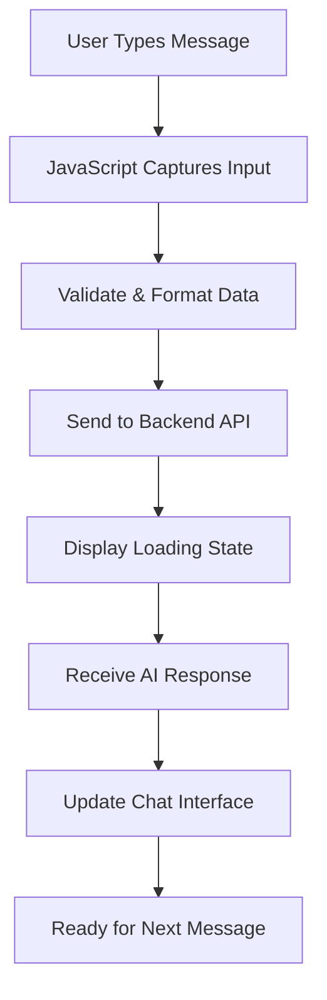

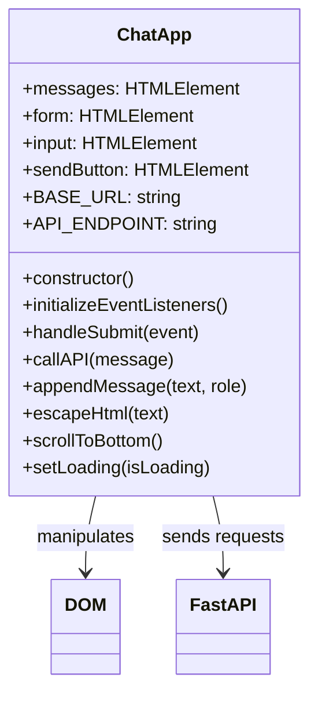

### ফ্রন্টএন্ড ডেভেলপমেন্টের তিনটি স্তম্ভ

প্রত্যেকটি ফ্রন্টএন্ড অ্যাপ্লিকেশন – সাধারণ ওয়েবসাইট থেকে Discord বা Slack-এর মতো জটিল অ্যাপ পর্যন্ত – তিনটি মূল প্রযুক্তির উপর ভিত্তি করে তৈরি। এগুলো হলো আপনি ওয়েবে যা দেখেন এবং যা নিয়ে ইন্টারঅ্যাক্ট করেন তার ভিত্তি:

**HTML (স্ট্রাকচার)**: এটি আপনার ভিত্তি
- নির্ধারণ করে কোন উপাদানগুলো থাকবে (বাটন, টেক্সট এরিয়া, কন্টেইনার)
- কন্টেন্টের অর্থ দেয় (এটি একটি হেডার, এটি একটি ফর্ম, ইত্যাদি)
- মৌলিক স্ট্রাকচার তৈরি করে যার উপর সবকিছু তৈরি হয়

**CSS (প্রেজেন্টেশন)**: এটি আপনার ইন্টেরিয়র ডিজাইনার
- সবকিছু সুন্দর করে তোলে (রঙ, ফন্ট, লেআউট)
- বিভিন্ন স্ক্রিন সাইজ হ্যান্ডেল করে (ফোন বনাম ল্যাপটপ বনাম ট্যাবলেট)
- মসৃণ অ্যানিমেশন এবং ভিজ্যুয়াল ফিডব্যাক তৈরি করে

**JavaScript (বিহেভিয়ার)**: এটি আপনার মস্তিষ্ক
- ইউজারের কাজের প্রতিক্রিয়া জানায় (ক্লিক, টাইপিং, স্ক্রলিং)
- ব্যাকএন্ডের সাথে কথা বলে এবং পৃষ্ঠা আপডেট করে
- সবকিছু ইন্টারঅ্যাকটিভ এবং ডায়নামিক করে তোলে

**এটি স্থাপত্য ডিজাইনের মতো চিন্তা করুন**:
- **HTML**: কাঠামোগত ব্লুপ্রিন্ট (স্পেস এবং সম্পর্ক নির্ধারণ করে)
- **CSS**: নান্দনিক এবং পরিবেশগত ডিজাইন (ভিজ্যুয়াল স্টাইল এবং ইউজার অভিজ্ঞতা)
- **JavaScript**: যান্ত্রিক সিস্টেম (কার্যকারিতা এবং ইন্টারঅ্যাকটিভিটি)

### কেন আধুনিক JavaScript আর্কিটেকচার গুরুত্বপূর্ণ

আমাদের চ্যাট অ্যাপ্লিকেশন আধুনিক JavaScript প্যাটার্ন ব্যবহার করবে যা আপনি পেশাদার অ্যাপ্লিকেশনে দেখতে পাবেন। এই ধারণাগুলো বোঝা আপনাকে একজন ডেভেলপার হিসেবে বেড়ে উঠতে সাহায্য করবে:

**ক্লাস-ভিত্তিক আর্কিটেকচার**: আমরা আমাদের কোড ক্লাসে সংগঠিত করব, যা অবজেক্টের জন্য ব্লুপ্রিন্ট তৈরি করার মতো
**Async/Await**: সময়সাপেক্ষ অপারেশন (যেমন API কল) হ্যান্ডেল করার আধুনিক উপায়
**ইভেন্ট-চালিত প্রোগ্রামিং**: আমাদের অ্যাপ ইউজারের কাজের প্রতিক্রিয়া জানায় (ক্লিক, কী প্রেস) লুপে না চলার পরিবর্তে
**DOM ম্যানিপুলেশন**: ইউজারের ইন্টারঅ্যাকশন এবং API রেসপন্সের উপর ভিত্তি করে ওয়েবপেজ কন্টেন্ট ডায়নামিকভাবে আপডেট করা

### প্রজেক্ট স্ট্রাকচার সেটআপ

একটি ফ্রন্টএন্ড ডিরেক্টরি তৈরি করুন এই সংগঠিত স্ট্রাকচারের সাথে:

```text
frontend/
├── index.html      # Main HTML structure
├── app.js          # JavaScript functionality
└── styles.css      # Visual styling
```

**আর্কিটেকচার বোঝা**:
- **আলাদা করে** স্ট্রাকচার (HTML), বিহেভিয়ার (JavaScript), এবং প্রেজেন্টেশন (CSS)
- **সহজ রাখে** একটি ফাইল স্ট্রাকচার যা নেভিগেট এবং পরিবর্তন করা সহজ
- **অনুসরণ করে** ওয়েব ডেভেলপমেন্টের সেরা অভ্যাস সংগঠন এবং রক্ষণাবেক্ষণের জন্য

### HTML ভিত্তি তৈরি করা: অ্যাক্সেসিবিলিটির জন্য সেমান্টিক স্ট্রাকচার

চলুন HTML স্ট্রাকচার দিয়ে শুরু করি। আধুনিক ওয়েব ডেভেলপমেন্ট "সেমান্টিক HTML"-এর উপর জোর দেয় – HTML এলিমেন্ট ব্যবহার করা যা তাদের উদ্দেশ্য স্পষ্টভাবে বর্ণনা করে, শুধুমাত্র তাদের চেহারা নয়। এটি আপনার অ্যাপ্লিকেশনকে স্ক্রিন রিডার, সার্চ ইঞ্জিন এবং অন্যান্য টুলের জন্য অ্যাক্সেসযোগ্য করে তোলে।

**কেন সেমান্টিক HTML গুরুত্বপূর্ণ**: কল্পনা করুন আপনি ফোনে আপনার চ্যাট অ্যাপ কারো কাছে বর্ণনা করছেন। আপনি বলবেন "একটি হেডার আছে শিরোনাম সহ, একটি প্রধান এলাকা যেখানে কথোপকথন দেখা যায়, এবং নিচে একটি ফর্ম যেখানে মেসেজ টাইপ করা যায়।" সেমান্টিক HTML এমন এলিমেন্ট ব্যবহার করে যা এই প্রাকৃতিক বর্ণনার সাথে মেলে।

`index.html` তৈরি করুন এই চিন্তাশীলভাবে গঠিত মার্কআপ দিয়ে:

```html
<!DOCTYPE html>
<html lang="en">
<head>
    <meta charset="UTF-8">
    <meta name="viewport" content="width=device-width, initial-scale=1.0">
    <title>AI Chat Assistant</title>
    <link rel="stylesheet" href="styles.css">
</head>
<body>
    <div class="chat-container">
        <header class="chat-header">
            <h1>AI Chat Assistant</h1>
            <p>Ask me anything!</p>
        </header>
        
        <main class="chat-messages" id="messages" role="log" aria-live="polite">
            <!-- Messages will be dynamically added here -->
        </main>
        
        <form class="chat-form" id="chatForm">
            <div class="input-group">
                <input 
                    type="text" 
                    id="messageInput" 
                    placeholder="Type your message here..." 
                    required
                    aria-label="Chat message input"
                >
                <button type="submit" id="sendBtn" aria-label="Send message">
                    Send
                </button>
            </div>
        </form>
    </div>
    <script src="app.js"></script>
</body>
</html>
```

**প্রত্যেক HTML এলিমেন্ট এবং এর উদ্দেশ্য বোঝা**:

#### ডকুমেন্ট স্ট্রাকচার
- **`<!DOCTYPE html>`**: ব্রাউজারকে জানায় এটি আধুনিক HTML5
- **`<html lang="en">`**: স্ক্রিন রিডার এবং ট্রান্সল
এখন আমরা জাভাস্ক্রিপ্ট তৈরি করব যা আমাদের চ্যাট ইন্টারফেসকে জীবন্ত করে তুলবে। আমরা আধুনিক জাভাস্ক্রিপ্ট প্যাটার্ন ব্যবহার করব যা আপনি পেশাদার ওয়েব ডেভেলপমেন্টে দেখতে পাবেন, যার মধ্যে ES6 ক্লাস, async/await এবং ইভেন্ট-চালিত প্রোগ্রামিং অন্তর্ভুক্ত।

#### আধুনিক জাভাস্ক্রিপ্ট আর্কিটেকচার বোঝা

প্রক্রিয়াগত কোড (একটি ক্রমবদ্ধ ফাংশন যা ক্রমানুসারে চলে) লেখার পরিবর্তে, আমরা একটি **ক্লাস-ভিত্তিক আর্কিটেকচার** তৈরি করব। একটি ক্লাসকে একটি ব্লুপ্রিন্ট হিসেবে ভাবুন যা অবজেক্ট তৈরি করতে ব্যবহৃত হয় – যেমন একজন স্থপতির ব্লুপ্রিন্ট ব্যবহার করে একাধিক বাড়ি তৈরি করা যায়।

**ওয়েব অ্যাপ্লিকেশনের জন্য ক্লাস কেন ব্যবহার করবেন?**
- **সংগঠন**: সমস্ত সম্পর্কিত কার্যকারিতা একসাথে গোষ্ঠীভুক্ত করা হয়
- **পুনরায় ব্যবহারযোগ্যতা**: আপনি একই পৃষ্ঠায় একাধিক চ্যাট ইনস্ট্যান্স তৈরি করতে পারেন
- **রক্ষণাবেক্ষণযোগ্যতা**: নির্দিষ্ট বৈশিষ্ট্যগুলি ডিবাগ এবং সংশোধন করা সহজ
- **পেশাদার মান**: এই প্যাটার্নটি React, Vue এবং Angular-এর মতো ফ্রেমওয়ার্কে ব্যবহৃত হয়

এই আধুনিক, সুগঠিত জাভাস্ক্রিপ্ট দিয়ে `app.js` তৈরি করুন:

```javascript
// app.js - Modern chat application logic

class ChatApp {
    constructor() {
        // Get references to DOM elements we'll need to manipulate
        this.messages = document.getElementById("messages");
        this.form = document.getElementById("chatForm");
        this.input = document.getElementById("messageInput");
        this.sendButton = document.getElementById("sendBtn");
        
        // Configure your backend URL here
        this.BASE_URL = "http://localhost:5000"; // Update this for your environment
        this.API_ENDPOINT = `${this.BASE_URL}/hello`;
        
        // Set up event listeners when the chat app is created
        this.initializeEventListeners();
    }
    
    initializeEventListeners() {
        // Listen for form submission (when user clicks Send or presses Enter)
        this.form.addEventListener("submit", (e) => this.handleSubmit(e));
        
        // Also listen for Enter key in the input field (better UX)
        this.input.addEventListener("keypress", (e) => {
            if (e.key === "Enter" && !e.shiftKey) {
                e.preventDefault();
                this.handleSubmit(e);
            }
        });
    }
    
    async handleSubmit(event) {
        event.preventDefault(); // Prevent form from refreshing the page
        
        const messageText = this.input.value.trim();
        if (!messageText) return; // Don't send empty messages
        
        // Provide user feedback that something is happening
        this.setLoading(true);
        
        // Add user message to chat immediately (optimistic UI)
        this.appendMessage(messageText, "user");
        
        // Clear input field so user can type next message
        this.input.value = '';
        
        try {
            // Call the AI API and wait for response
            const reply = await this.callAPI(messageText);
            
            // Add AI response to chat
            this.appendMessage(reply, "assistant");
        } catch (error) {
            console.error('API Error:', error);
            this.appendMessage("Sorry, I'm having trouble connecting right now. Please try again.", "error");
        } finally {
            // Re-enable the interface regardless of success or failure
            this.setLoading(false);
        }
    }
    
    async callAPI(message) {
        const response = await fetch(this.API_ENDPOINT, {
            method: "POST",
            headers: { 
                "Content-Type": "application/json" 
            },
            body: JSON.stringify({ message })
        });
        
        if (!response.ok) {
            throw new Error(`HTTP error! status: ${response.status}`);
        }
        
        const data = await response.json();
        return data.response;
    }
    
    appendMessage(text, role) {
        const messageElement = document.createElement("div");
        messageElement.className = `message ${role}`;
        messageElement.innerHTML = `
            <div class="message-content">
                <span class="message-text">${this.escapeHtml(text)}</span>
                <span class="message-time">${new Date().toLocaleTimeString()}</span>
            </div>
        `;
        
        this.messages.appendChild(messageElement);
        this.scrollToBottom();
    }
    
    escapeHtml(text) {
        const div = document.createElement('div');
        div.textContent = text;
        return div.innerHTML;
    }
    
    scrollToBottom() {
        this.messages.scrollTop = this.messages.scrollHeight;
    }
    
    setLoading(isLoading) {
        this.sendButton.disabled = isLoading;
        this.input.disabled = isLoading;
        this.sendButton.textContent = isLoading ? "Sending..." : "Send";
    }
}

// Initialize the chat application when the page loads
document.addEventListener("DOMContentLoaded", () => {
    new ChatApp();
});
```

#### প্রতিটি জাভাস্ক্রিপ্ট ধারণা বোঝা

**ES6 ক্লাস স্ট্রাকচার**:
```javascript
class ChatApp {
    constructor() {
        // This runs when you create a new ChatApp instance
        // It's like the "setup" function for your chat
    }
    
    methodName() {
        // Methods are functions that belong to the class
        // They can access class properties using "this"
    }
}
```

**Async/Await প্যাটার্ন**:
```javascript
// Old way (callback hell):
fetch(url)
  .then(response => response.json())
  .then(data => console.log(data))
  .catch(error => console.error(error));

// Modern way (async/await):
try {
    const response = await fetch(url);
    const data = await response.json();
    console.log(data);
} catch (error) {
    console.error(error);
}
```

**ইভেন্ট-চালিত প্রোগ্রামিং**:
কিছু ঘটেছে কিনা তা ক্রমাগত পরীক্ষা করার পরিবর্তে, আমরা ইভেন্টগুলির জন্য "শুনি":
```javascript
// When form is submitted, run handleSubmit
this.form.addEventListener("submit", (e) => this.handleSubmit(e));

// When Enter key is pressed, also run handleSubmit
this.input.addEventListener("keypress", (e) => { /* ... */ });
```

**DOM ম্যানিপুলেশন**:
```javascript
// Create new elements
const messageElement = document.createElement("div");

// Modify their properties
messageElement.className = "message user";
messageElement.innerHTML = "Hello world!";

// Add to the page
this.messages.appendChild(messageElement);
```

#### নিরাপত্তা এবং সেরা অনুশীলন

**XSS প্রতিরোধ**:
```javascript
escapeHtml(text) {
    const div = document.createElement('div');
    div.textContent = text;  // This automatically escapes HTML
    return div.innerHTML;
}
```

**কেন এটি গুরুত্বপূর্ণ**: যদি একজন ব্যবহারকারী `<script>alert('hack')</script>` টাইপ করেন, এই ফাংশনটি নিশ্চিত করে যে এটি কোড হিসেবে কার্যকর না হয়ে টেক্সট হিসেবে প্রদর্শিত হয়।

**ত্রুটি পরিচালনা**:
```javascript
try {
    const reply = await this.callAPI(messageText);
    this.appendMessage(reply, "assistant");
} catch (error) {
    // Show user-friendly error instead of breaking the app
    this.appendMessage("Sorry, I'm having trouble...", "error");
}
```

**ব্যবহারকারীর অভিজ্ঞতা বিবেচনা**:
- **আশাবাদী UI**: ব্যবহারকারীর বার্তা অবিলম্বে যোগ করুন, সার্ভারের প্রতিক্রিয়ার জন্য অপেক্ষা করবেন না
- **লোডিং স্টেট**: বোতামগুলি নিষ্ক্রিয় করুন এবং অপেক্ষার সময় "পাঠানো হচ্ছে..." দেখান
- **অটো-স্ক্রোল**: সর্বশেষ বার্তাগুলি দৃশ্যমান রাখুন
- **ইনপুট যাচাইকরণ**: খালি বার্তা পাঠাবেন না
- **কীবোর্ড শর্টকাট**: এন্টার কী বার্তা পাঠায় (যেমন আসল চ্যাট অ্যাপ)

#### অ্যাপ্লিকেশন প্রবাহ বোঝা

1. **পৃষ্ঠাটি লোড হয়** → `DOMContentLoaded` ইভেন্ট ফায়ার হয় → `new ChatApp()` তৈরি হয়
2. **কনস্ট্রাক্টর চালায়** → DOM এলিমেন্ট রেফারেন্স পায় → ইভেন্ট লিসেনার সেট আপ করে
3. **ব্যবহারকারী বার্তা টাইপ করে** → এন্টার চাপ দেয় বা পাঠানোর জন্য ক্লিক করে → `handleSubmit` চালায়
4. **handleSubmit** → ইনপুট যাচাই করে → লোডিং স্টেট দেখায় → API কল করে
5. **API প্রতিক্রিয়া দেয়** → চ্যাটে AI বার্তা যোগ করে → ইন্টারফেস পুনরায় সক্রিয় করে
6. **পরবর্তী বার্তার জন্য প্রস্তুত** → ব্যবহারকারী চ্যাটিং চালিয়ে যেতে পারে

এই আর্কিটেকচারটি স্কেলযোগ্য – আপনি সহজেই বার্তা সম্পাদনা, ফাইল আপলোড বা একাধিক কথোপকথন থ্রেডের মতো বৈশিষ্ট্য যোগ করতে পারেন মূল কাঠামোটি পুনরায় লেখার প্রয়োজন ছাড়াই।

### 🎯 শিক্ষামূলক চেক-ইন: আধুনিক ফ্রন্টএন্ড আর্কিটেকচার

**আর্কিটেকচার বোঝা**: আপনি আধুনিক জাভাস্ক্রিপ্ট প্যাটার্ন ব্যবহার করে একটি সম্পূর্ণ একক-পৃষ্ঠার অ্যাপ্লিকেশন বাস্তবায়ন করেছেন। এটি পেশাদার-স্তরের ফ্রন্টএন্ড ডেভেলপমেন্টকে উপস্থাপন করে।

**মূল ধারণাগুলি আয়ত্ত করেছেন**:
- **ES6 ক্লাস আর্কিটেকচার**: সংগঠিত, রক্ষণাবেক্ষণযোগ্য কোড স্ট্রাকচার
- **Async/Await প্যাটার্ন**: আধুনিক অ্যাসিঙ্ক্রোনাস প্রোগ্রামিং
- **ইভেন্ট-চালিত প্রোগ্রামিং**: প্রতিক্রিয়াশীল ব্যবহারকারী ইন্টারফেস ডিজাইন
- **নিরাপত্তা সেরা অনুশীলন**: XSS প্রতিরোধ এবং ইনপুট যাচাই

**শিল্প সংযোগ**: আপনি যে প্যাটার্নগুলি শিখেছেন (ক্লাস-ভিত্তিক আর্কিটেকচার, অ্যাসিঙ্ক অপারেশন, DOM ম্যানিপুলেশন) আধুনিক ফ্রেমওয়ার্ক যেমন React, Vue এবং Angular-এর ভিত্তি। আপনি প্রোডাকশন অ্যাপ্লিকেশনে ব্যবহৃত একই আর্কিটেকচারাল চিন্তাভাবনা দিয়ে তৈরি করছেন।

**প্রতিফলন প্রশ্ন**: আপনি কীভাবে এই চ্যাট অ্যাপ্লিকেশনটি একাধিক কথোপকথন বা ব্যবহারকারীর প্রমাণীকরণ পরিচালনা করতে প্রসারিত করবেন? প্রয়োজনীয় আর্কিটেকচারাল পরিবর্তনগুলি এবং ক্লাস স্ট্রাকচার কীভাবে বিকশিত হবে তা বিবেচনা করুন।

### আপনার চ্যাট ইন্টারফেস স্টাইলিং

এখন আমরা CSS দিয়ে একটি আধুনিক, চাক্ষুষভাবে আকর্ষণীয় চ্যাট ইন্টারফেস তৈরি করব। ভালো স্টাইলিং আপনার অ্যাপ্লিকেশনকে পেশাদার মনে করায় এবং সামগ্রিক ব্যবহারকারীর অভিজ্ঞতা উন্নত করে। আমরা Flexbox, CSS Grid এবং কাস্টম প্রপার্টিজের মতো আধুনিক CSS বৈশিষ্ট্য ব্যবহার করব একটি প্রতিক্রিয়াশীল, অ্যাক্সেসযোগ্য ডিজাইনের জন্য।

এই বিস্তৃত স্টাইল দিয়ে `styles.css` তৈরি করুন:

```css
/* styles.css - Modern chat interface styling */

:root {
    --primary-color: #2563eb;
    --secondary-color: #f1f5f9;
    --user-color: #3b82f6;
    --assistant-color: #6b7280;
    --error-color: #ef4444;
    --text-primary: #1e293b;
    --text-secondary: #64748b;
    --border-radius: 12px;
    --shadow: 0 4px 6px -1px rgba(0, 0, 0, 0.1);
}

* {
    margin: 0;
    padding: 0;
    box-sizing: border-box;
}

body {
    font-family: -apple-system, BlinkMacSystemFont, 'Segoe UI', Roboto, sans-serif;
    background: linear-gradient(135deg, #667eea 0%, #764ba2 100%);
    min-height: 100vh;
    display: flex;
    align-items: center;
    justify-content: center;
    padding: 20px;
}

.chat-container {
    width: 100%;
    max-width: 800px;
    height: 600px;
    background: white;
    border-radius: var(--border-radius);
    box-shadow: var(--shadow);
    display: flex;
    flex-direction: column;
    overflow: hidden;
}

.chat-header {
    background: var(--primary-color);
    color: white;
    padding: 20px;
    text-align: center;
}

.chat-header h1 {
    font-size: 1.5rem;
    margin-bottom: 5px;
}

.chat-header p {
    opacity: 0.9;
    font-size: 0.9rem;
}

.chat-messages {
    flex: 1;
    padding: 20px;
    overflow-y: auto;
    display: flex;
    flex-direction: column;
    gap: 15px;
    background: var(--secondary-color);
}

.message {
    display: flex;
    max-width: 80%;
    animation: slideIn 0.3s ease-out;
}

.message.user {
    align-self: flex-end;
}

.message.user .message-content {
    background: var(--user-color);
    color: white;
    border-radius: var(--border-radius) var(--border-radius) 4px var(--border-radius);
}

.message.assistant {
    align-self: flex-start;
}

.message.assistant .message-content {
    background: white;
    color: var(--text-primary);
    border-radius: var(--border-radius) var(--border-radius) var(--border-radius) 4px;
    border: 1px solid #e2e8f0;
}

.message.error .message-content {
    background: var(--error-color);
    color: white;
    border-radius: var(--border-radius);
}

.message-content {
    padding: 12px 16px;
    box-shadow: var(--shadow);
    position: relative;
}

.message-text {
    display: block;
    line-height: 1.5;
    word-wrap: break-word;
}

.message-time {
    display: block;
    font-size: 0.75rem;
    opacity: 0.7;
    margin-top: 5px;
}

.chat-form {
    padding: 20px;
    border-top: 1px solid #e2e8f0;
    background: white;
}

.input-group {
    display: flex;
    gap: 10px;
    align-items: center;
}

#messageInput {
    flex: 1;
    padding: 12px 16px;
    border: 2px solid #e2e8f0;
    border-radius: var(--border-radius);
    font-size: 1rem;
    outline: none;
    transition: border-color 0.2s ease;
}

#messageInput:focus {
    border-color: var(--primary-color);
}

#messageInput:disabled {
    background: #f8fafc;
    opacity: 0.6;
    cursor: not-allowed;
}

#sendBtn {
    padding: 12px 24px;
    background: var(--primary-color);
    color: white;
    border: none;
    border-radius: var(--border-radius);
    font-size: 1rem;
    font-weight: 600;
    cursor: pointer;
    transition: background-color 0.2s ease;
    min-width: 80px;
}

#sendBtn:hover:not(:disabled) {
    background: #1d4ed8;
}

#sendBtn:disabled {
    background: #94a3b8;
    cursor: not-allowed;
}

@keyframes slideIn {
    from {
        opacity: 0;
        transform: translateY(10px);
    }
    to {
        opacity: 1;
        transform: translateY(0);
    }
}

/* Responsive design for mobile devices */
@media (max-width: 768px) {
    body {
        padding: 10px;
    }
    
    .chat-container {
        height: calc(100vh - 20px);
        border-radius: 8px;
    }
    
    .message {
        max-width: 90%;
    }
    
    .input-group {
        flex-direction: column;
        gap: 10px;
    }
    
    #messageInput {
        width: 100%;
    }
    
    #sendBtn {
        width: 100%;
    }
}

/* Accessibility improvements */
@media (prefers-reduced-motion: reduce) {
    .message {
        animation: none;
    }
    
    * {
        transition: none !important;
    }
}

/* Dark mode support */
@media (prefers-color-scheme: dark) {
    .chat-container {
        background: #1e293b;
        color: #f1f5f9;
    }
    
    .chat-messages {
        background: #0f172a;
    }
    
    .message.assistant .message-content {
        background: #334155;
        color: #f1f5f9;
        border-color: #475569;
    }
    
    .chat-form {
        background: #1e293b;
        border-color: #475569;
    }
    
    #messageInput {
        background: #334155;
        color: #f1f5f9;
        border-color: #475569;
    }
}
```

**CSS আর্কিটেকচার বোঝা:**
- **ব্যবহার করে** CSS কাস্টম প্রপার্টিজ (ভেরিয়েবল) সামঞ্জস্যপূর্ণ থিমিং এবং সহজ রক্ষণাবেক্ষণের জন্য
- **বাস্তবায়ন করে** Flexbox লেআউট প্রতিক্রিয়াশীল ডিজাইন এবং সঠিক অ্যালাইনমেন্টের জন্য
- **অন্তর্ভুক্ত করে** মসৃণ অ্যানিমেশন বার্তা প্রদর্শনের জন্য যা বিভ্রান্তিকর নয়
- **প্রদান করে** ব্যবহারকারীর বার্তা, AI প্রতিক্রিয়া এবং ত্রুটি অবস্থার মধ্যে চাক্ষুষ পার্থক্য
- **সমর্থন করে** প্রতিক্রিয়াশীল ডিজাইন যা ডেস্কটপ এবং মোবাইল ডিভাইসে কাজ করে
- **বিবেচনা করে** অ্যাক্সেসযোগ্যতা কম গতির পছন্দ এবং সঠিক কনট্রাস্ট অনুপাত সহ
- **অফার করে** ব্যবহারকারীর সিস্টেম পছন্দ অনুসারে ডার্ক মোড সাপোর্ট

### আপনার ব্যাকএন্ড URL কনফিগার করা

শেষ ধাপটি হল আপনার জাভাস্ক্রিপ্টে `BASE_URL` আপডেট করা যাতে এটি আপনার ব্যাকএন্ড সার্ভারের সাথে মিলে যায়:

```javascript
// For local development
this.BASE_URL = "http://localhost:5000";

// For GitHub Codespaces (replace with your actual URL)
this.BASE_URL = "https://your-codespace-name-5000.app.github.dev";
```

**আপনার ব্যাকএন্ড URL নির্ধারণ করা:**
- **লোকাল ডেভেলপমেন্ট**: যদি ফ্রন্টএন্ড এবং ব্যাকএন্ড উভয়ই লোকালিতে চালানো হয় তবে `http://localhost:5000` ব্যবহার করুন
- **Codespaces**: পোর্ট 5000 পাবলিক করার পরে পোর্ট ট্যাবে আপনার ব্যাকএন্ড URL খুঁজুন
- **প্রোডাকশন**: হোস্টিং পরিষেবাতে ডিপ্লয় করার সময় আপনার প্রকৃত ডোমেইন দিয়ে প্রতিস্থাপন করুন

> 💡 **পরীক্ষার টিপস**: আপনি আপনার ব্রাউজারে রুট URL-এ গিয়ে সরাসরি আপনার ব্যাকএন্ড পরীক্ষা করতে পারেন। আপনি আপনার FastAPI সার্ভার থেকে স্বাগত বার্তা দেখতে পাবেন। 

## পরীক্ষা এবং ডিপ্লয়মেন্ট

এখন যেহেতু আপনার ফ্রন্টএন্ড এবং ব্যাকএন্ড উভয় কম্পোনেন্ট তৈরি হয়েছে, আসুন সবকিছু একসাথে কাজ করে কিনা তা পরীক্ষা করি এবং অন্যদের সাথে আপনার চ্যাট অ্যাসিস্ট্যান্ট শেয়ার করার জন্য ডিপ্লয়মেন্ট অপশনগুলি অন্বেষণ করি।

### লোকাল টেস্টিং ওয়ার্কফ্লো

আপনার সম্পূর্ণ অ্যাপ্লিকেশন পরীক্ষা করার জন্য এই ধাপগুলি অনুসরণ করুন:

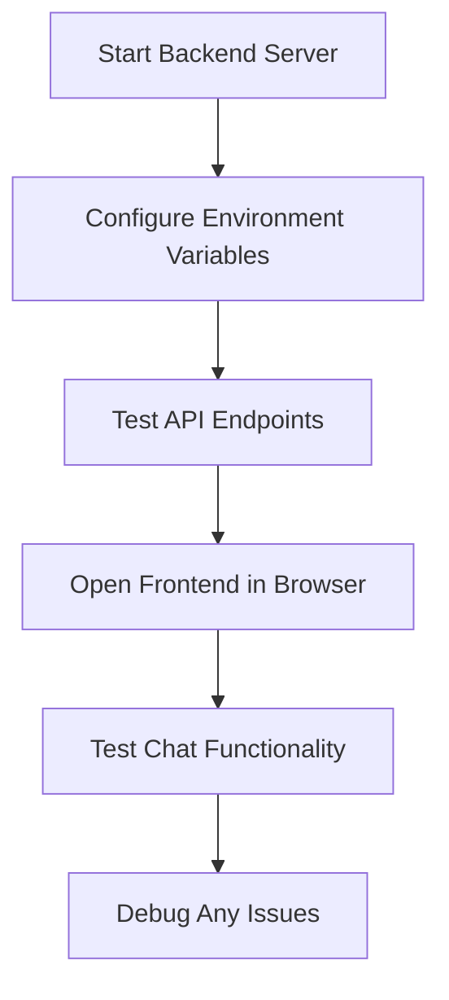

**ধাপে ধাপে পরীক্ষার প্রক্রিয়া:**

1. **আপনার ব্যাকএন্ড সার্ভার শুরু করুন**:
   ```bash
   cd backend
   source venv/bin/activate  # or venv\Scripts\activate on Windows
   python api.py
   ```

2. **API কাজ করছে কিনা যাচাই করুন**:
   - আপনার ব্রাউজারে `http://localhost:5000` খুলুন
   - আপনি আপনার FastAPI সার্ভার থেকে স্বাগত বার্তা দেখতে পাবেন

3. **আপনার ফ্রন্টএন্ড খুলুন**:
   - আপনার ফ্রন্টএন্ড ডিরেক্টরিতে যান
   - আপনার ব্রাউজারে `index.html` খুলুন
   - অথবা উন্নত ডেভেলপমেন্ট অভিজ্ঞতার জন্য VS Code-এর Live Server এক্সটেনশন ব্যবহার করুন

4. **চ্যাট কার্যকারিতা পরীক্ষা করুন**:
   - ইনপুট ফিল্ডে একটি বার্তা টাইপ করুন
   - "পাঠান" ক্লিক করুন বা এন্টার চাপুন
   - নিশ্চিত করুন যে AI যথাযথভাবে প্রতিক্রিয়া জানায়
   - যেকোনো জাভাস্ক্রিপ্ট ত্রুটির জন্য ব্রাউজার কনসোলে পরীক্ষা করুন

### সাধারণ সমস্যার সমাধান

| সমস্যা | লক্ষণ | সমাধান |
|---------|----------|----------|
| **CORS ত্রুটি** | ফ্রন্টএন্ড ব্যাকএন্ডে পৌঁছাতে পারে না | নিশ্চিত করুন FastAPI CORSMiddleware সঠিকভাবে কনফিগার করা হয়েছে |
| **API কী ত্রুটি** | 401 অননুমোদিত প্রতিক্রিয়া | আপনার `GITHUB_TOKEN` পরিবেশ ভেরিয়েবল পরীক্ষা করুন |
| **সংযোগ প্রত্যাখ্যান** | ফ্রন্টএন্ডে নেটওয়ার্ক ত্রুটি | ব্যাকএন্ড URL এবং Flask সার্ভার চালু আছে কিনা যাচাই করুন |
| **কোনো AI প্রতিক্রিয়া নেই** | খালি বা ত্রুটি প্রতিক্রিয়া | API কোটা বা প্রমাণীকরণ সমস্যার জন্য ব্যাকএন্ড লগ পরীক্ষা করুন |

**সাধারণ ডিবাগিং ধাপ:**
- **পরীক্ষা করুন** ব্রাউজার ডেভেলপার টুলস কনসোলে জাভাস্ক্রিপ্ট ত্রুটি
- **যাচাই করুন** নেটওয়ার্ক ট্যাব সফল API অনুরোধ এবং প্রতিক্রিয়া দেখায়
- **পর্যালোচনা করুন** ব্যাকএন্ড টার্মিনাল আউটপুট Python ত্রুটি বা API সমস্যার জন্য
- **নিশ্চিত করুন** পরিবেশ ভেরিয়েবলগুলি সঠিকভাবে লোড এবং অ্যাক্সেসযোগ্য

## 📈 আপনার AI অ্যাপ্লিকেশন ডেভেলপমেন্ট দক্ষতার টাইমলাইন

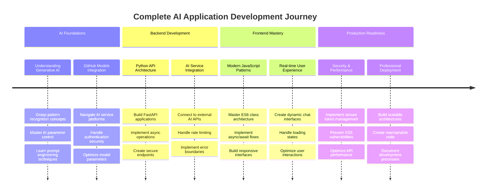

**🎓 স্নাতক মাইলফলক**: আপনি আধুনিক AI অ্যাসিস্ট্যান্ট চালিত অ্যাপ্লিকেশন তৈরি করতে ব্যবহৃত একই প্রযুক্তি এবং আর্কিটেকচারাল প্যাটার্ন ব্যবহার করে একটি সম্পূর্ণ AI-চালিত অ্যাপ্লিকেশন সফলভাবে তৈরি করেছেন। এই দক্ষতাগুলি ঐতিহ্যগত ওয়েব ডেভেলপমেন্ট এবং কাটিং-এজ AI ইন্টিগ্রেশনের সংযোগস্থলকে উপস্থাপন করে।

**🔄 পরবর্তী স্তরের ক্ষমতা**:
- উন্নত AI ফ্রেমওয়ার্ক (LangChain, LangGraph) অন্বেষণ করতে প্রস্তুত
- মাল্টি-মোডাল AI অ্যাপ্লিকেশন (টেক্সট, ইমেজ, ভয়েস) তৈরি করতে প্রস্তুত
- ভেক্টর ডাটাবেস এবং রিট্রিভাল সিস্টেম বাস্তবায়ন করতে সজ্জিত
- মেশিন লার্নিং এবং AI মডেল ফাইন-টিউনিংয়ের জন্য ভিত্তি স্থাপন

## GitHub Copilot Agent চ্যালেঞ্জ 🚀

Agent মোড ব্যবহার করে নিম্নলিখিত চ্যালেঞ্জ সম্পন্ন করুন:

**বর্ণনা:** কথোপকথনের ইতিহাস এবং বার্তা সংরক্ষণ যোগ করে চ্যাট অ্যাসিস্ট্যান্ট উন্নত করুন। এই চ্যালেঞ্জটি আপনাকে চ্যাট অ্যাপ্লিকেশনে স্টেট পরিচালনা এবং ডেটা সংরক্ষণ বাস্তবায়ন সম্পর্কে বুঝতে সাহায্য করবে।

**প্রম্পট:** কথোপকথনের ইতিহাস অন্তর্ভুক্ত করতে চ্যাট অ্যাপ্লিকেশনটি সংশোধন করুন যা সেশনের মধ্যে স্থায়ী হয়। চ্যাট বার্তাগুলি লোকাল স্টোরেজে সংরক্ষণ করার, পৃষ্ঠাটি লোড হলে কথোপকথনের ইতিহাস প্রদর্শন করার এবং একটি "Clear History" বোতাম অন্তর্ভুক্ত করার কার্যকারিতা যোগ করুন। এছাড়াও টাইপিং সূচক এবং বার্তা টাইমস্ট্যাম্প বাস্তবায়ন করুন যাতে চ্যাট অভিজ্ঞতা আরও বাস্তবসম্মত হয়।

আরও জানুন [agent mode](https://code.visualstudio.com/blogs/2025/02/24/introducing-copilot-agent-mode) এখানে।

## অ্যাসাইনমেন্ট: আপনার ব্যক্তিগত AI অ্যাসিস্ট্যান্ট তৈরি করুন

এখন আপনি আপনার নিজস্ব AI অ্যাসিস্ট্যান্ট বাস্তবায়ন তৈরি করবেন। টিউটোরিয়াল কোডটি কেবলমাত্র পুনরায় তৈরি করার পরিবর্তে, এটি এমন একটি সুযোগ যা আপনার নিজস্ব আগ্রহ এবং ব্যবহার ক্ষেত্রে প্রতিফলিত করে এমন কিছু তৈরি করার জন্য ধারণাগুলি প্রয়োগ করার।

### প্রকল্পের প্রয়োজনীয়তা

আপনার প্রকল্পটি একটি পরিষ্কার, সংগঠিত কাঠামো দিয়ে সেট আপ করুন:

```text
my-ai-assistant/
├── backend/
│   ├── api.py          # Your FastAPI server
│   ├── llm.py          # AI integration functions
│   ├── .env            # Your secrets (keep this safe!)
│   └── requirements.txt # Python dependencies
├── frontend/
│   ├── index.html      # Your chat interface
│   ├── app.js          # The JavaScript magic
│   └── styles.css      # Make it look amazing
└── README.md           # Tell the world about your creation
```

### মূল বাস্তবায়ন কাজ

**ব্যাকএন্ড ডেভেলপমেন্ট:**
- **আমাদের** FastAPI কোড নিন এবং এটিকে আপনার নিজের মতো করে তৈরি করুন
- **একটি** অনন্য AI ব্যক্তিত্ব তৈরি করুন – হতে পারে একটি সহায়ক রান্নার সহকারী, একটি সৃজনশীল লেখার অংশীদার, বা একটি অধ্যয়ন সঙ্গী?
- **দৃঢ়** ত্রুটি পরিচালনা যোগ করুন যাতে আপনার অ্যাপটি সমস্যার সময় ভেঙে না যায়
- **স্পষ্ট** ডকুমেন্টেশন লিখুন যে কেউ আপনার API কীভাবে কাজ করে তা বুঝতে চায়

**ফ্রন্টএন্ড ডেভেলপমেন্ট:**
- **একটি** চ্যাট ইন্টারফেস তৈরি করুন যা স্বজ্ঞাত এবং স্বাগত বোধ করে
- **পরিষ্কার**, আধুনিক জাভাস্ক্রিপ্ট লিখুন যা আপনি অন্য ডেভেলপারদের দেখাতে গর্বিত হবেন
- **কাস্টম** স্টাইলিং ডিজাইন করুন যা আপনার AI-এর ব্যক্তিত্বকে প্রতিফলিত করে – মজাদার এবং রঙিন? পরিষ্কার এবং ন্যূনতম? সম্পূর্ণ আপনার উপর নির্ভর করে!
- **নিশ্চিত করুন** এটি ফোন এবং কম্পিউটারে দুর্দান্ত কাজ করে

**ব্যক্তিগতকরণ প্রয়োজনীয়তা:**
- **একটি** অনন্য নাম এবং ব্যক্তিত্ব চয়ন করুন আপনার AI অ্যাসিস্ট্যান্টের জন্য – হতে পারে এমন কিছু যা আপনার আগ্রহ বা আপনি যে সমস্যাগুলি সমাধান করতে চান তা প্রতিফলিত করে
- **ভিজ্যুয়াল ডিজাইন** কাস্টমাইজ করুন যাতে এটি আপনার অ্যাসিস্ট্যান্টের পরিবেশের সাথে মিলে যায়
- **একটি** আকর্ষণীয় স্বাগত বার্তা লিখুন যা মানুষকে চ্যাটিং শুরু করতে উৎসাহিত করে
- **পরীক্ষা করুন** আপনার অ্যাসিস্ট্যান্ট বিভিন্ন ধরণের প্রশ্নের সাথে এটি কীভাবে প্রতিক্রিয়া জানায় তা দেখতে

### উন্নয়ন আইডিয়া (ঐচ্ছিক)

আপনার প্রকল্পটি পরবর্তী স্তরে নিয়ে যেতে চান? এখানে কিছু মজার আইডিয়া অন্বেষণ করার জন্য:

| বৈশিষ্ট্য | বর্ণনা | আপনি যে দক্ষতা অনুশীলন করবেন |
|---------|-------------|------------------------|
| **বার্তা ইতিহাস** | পৃষ্ঠা রিফ্রেশের পরেও কথোপকথন মনে রাখুন | localStorage নিয়ে কাজ করা, JSON হ্যান্ডলিং |
| **টাইপিং সূচক** | "AI টাইপ করছে..." দেখান প্রতিক্রিয়ার জন্য অপেক্ষার সময় | CSS অ্যানিমেশন, async প্রোগ্রামিং |
| **বার্তা টাইমস্ট্যাম্প** | দেখান কখন প্রতিটি বার্তা পাঠানো হয়েছে | তারিখ/সময় ফরম্যাটিং, UX ডিজাইন |
| **চ্যাট এক্সপোর্ট** | ব্যবহারকারীদের তাদের কথোপকথন ডাউনলোড করতে দিন | ফাইল হ্যান্ডলিং, ডেটা এক্সপোর্ট |
| **থিম সুইচিং** | লাইট/ডার্ক মোড টগল | CSS ভেরিয়েবল, ব্যবহারকারীর পছন্দ |
| **ভয়েস ইনপুট** | স্পিচ-টু-টেক্সট কার্যকারিতা যোগ করুন | ওয়েব API, অ্যাক্সেসিবিলিটি |

### পরীক্ষা এবং ডকুমেন্টেশন

**গুণমান নিশ্চিতক
- **কথোপকথনের বিষয়বস্তুর উপর ভিত্তি করে** স্মার্ট পরামর্শ প্রদান করুন  
- **সাধারণ প্রশ্নের জন্য** দ্রুত উত্তর বোতাম তৈরি করুন  

> 🎯 **শিক্ষার লক্ষ্য**: এই অতিরিক্ত চ্যালেঞ্জগুলো আপনাকে উন্নত ওয়েব ডেভেলপমেন্ট প্যাটার্ন এবং প্রোডাকশন অ্যাপ্লিকেশনে ব্যবহৃত AI ইন্টিগ্রেশন কৌশলগুলি বুঝতে সাহায্য করবে।  

## সারসংক্ষেপ এবং পরবর্তী পদক্ষেপ  

অভিনন্দন! আপনি সফলভাবে একটি সম্পূর্ণ AI-চালিত চ্যাট সহকারী তৈরি করেছেন। এই প্রকল্পটি আপনাকে আধুনিক ওয়েব ডেভেলপমেন্ট প্রযুক্তি এবং AI ইন্টিগ্রেশনের সাথে হাতে-কলমে অভিজ্ঞতা দিয়েছে – যা আজকের প্রযুক্তি জগতে অত্যন্ত মূল্যবান দক্ষতা।  

### আপনি যা অর্জন করেছেন  

এই পাঠের মাধ্যমে, আপনি বেশ কিছু গুরুত্বপূর্ণ প্রযুক্তি এবং ধারণা আয়ত্ত করেছেন:  

**ব্যাকএন্ড ডেভেলপমেন্ট:**  
- **GitHub Models API এর সাথে** AI কার্যকারিতা সংযুক্ত করেছেন  
- **Flask ব্যবহার করে** একটি RESTful API তৈরি করেছেন সঠিক ত্রুটি পরিচালনার সাথে  
- **পরিবেশ ভেরিয়েবল ব্যবহার করে** নিরাপদ প্রমাণীকরণ বাস্তবায়ন করেছেন  
- **CORS কনফিগার করেছেন** ফ্রন্টএন্ড এবং ব্যাকএন্ডের মধ্যে ক্রস-অরিজিন অনুরোধের জন্য  

**ফ্রন্টএন্ড ডেভেলপমেন্ট:**  
- **সেমান্টিক HTML ব্যবহার করে** একটি রেসপন্সিভ চ্যাট ইন্টারফেস তৈরি করেছেন  
- **আধুনিক জাভাস্ক্রিপ্ট** async/await এবং ক্লাস-ভিত্তিক আর্কিটেকচার সহ বাস্তবায়ন করেছেন  
- **CSS Grid, Flexbox এবং অ্যানিমেশন ব্যবহার করে** আকর্ষণীয় ইউজার ইন্টারফেস ডিজাইন করেছেন  
- **অ্যাক্সেসিবিলিটি ফিচার এবং রেসপন্সিভ ডিজাইন নীতিমালা** যোগ করেছেন  

**ফুল-স্ট্যাক ইন্টিগ্রেশন:**  
- **HTTP API কলের মাধ্যমে** ফ্রন্টএন্ড এবং ব্যাকএন্ড সংযুক্ত করেছেন  
- **রিয়েল-টাইম ইউজার ইন্টারঅ্যাকশন এবং অ্যাসিঙ্ক্রোনাস ডেটা ফ্লো** পরিচালনা করেছেন  
- **ত্রুটি পরিচালনা এবং ইউজার ফিডব্যাক** পুরো অ্যাপ্লিকেশনে বাস্তবায়ন করেছেন  
- **ইউজার ইনপুট থেকে AI রেসপন্স পর্যন্ত** সম্পূর্ণ অ্যাপ্লিকেশন ওয়ার্কফ্লো পরীক্ষা করেছেন  

### প্রধান শিক্ষণীয় বিষয়  

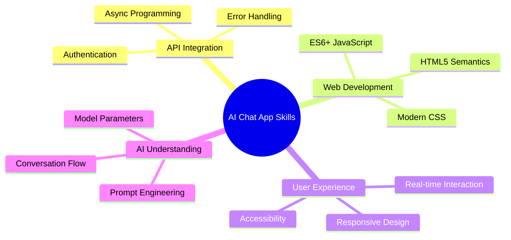
  
এই প্রকল্পটি আপনাকে AI-চালিত অ্যাপ্লিকেশন তৈরির মৌলিক বিষয়গুলো শিখিয়েছে, যা ওয়েব ডেভেলপমেন্টের ভবিষ্যৎকে প্রতিনিধিত্ব করে। আপনি এখন বুঝতে পেরেছেন কীভাবে AI ক্ষমতাগুলোকে ঐতিহ্যবাহী ওয়েব অ্যাপ্লিকেশনে সংযুক্ত করে বুদ্ধিমান এবং রেসপন্সিভ ইউজার অভিজ্ঞতা তৈরি করা যায়।  

### পেশাদার প্রয়োগ  

এই পাঠে আপনি যে দক্ষতাগুলো অর্জন করেছেন তা আধুনিক সফটওয়্যার ডেভেলপমেন্ট ক্যারিয়ারে সরাসরি প্রযোজ্য:  

- **ফুল-স্ট্যাক ওয়েব ডেভেলপমেন্ট** আধুনিক ফ্রেমওয়ার্ক এবং API ব্যবহার করে  
- **ওয়েব এবং মোবাইল অ্যাপ্লিকেশনে AI ইন্টিগ্রেশন**  
- **API ডিজাইন এবং ডেভেলপমেন্ট** মাইক্রোসার্ভিস আর্কিটেকচারের জন্য  
- **ইউজার ইন্টারফেস ডেভেলপমেন্ট** অ্যাক্সেসিবিলিটি এবং রেসপন্সিভ ডিজাইনের উপর গুরুত্ব দিয়ে  
- **DevOps প্র্যাকটিস** পরিবেশ কনফিগারেশন এবং ডিপ্লয়মেন্ট সহ  

### আপনার AI ডেভেলপমেন্ট যাত্রা চালিয়ে যান  

**পরবর্তী শিক্ষার পদক্ষেপ:**  
- **আরও উন্নত AI মডেল এবং API** (GPT-4, Claude, Gemini) সম্পর্কে জানুন  
- **প্রম্পট ইঞ্জিনিয়ারিং কৌশল** শিখুন আরও ভালো AI রেসপন্সের জন্য  
- **কথোপকথন ডিজাইন এবং চ্যাটবট ইউজার অভিজ্ঞতার নীতিমালা** অধ্যয়ন করুন  
- **AI নিরাপত্তা, নৈতিকতা এবং দায়িত্বশীল AI ডেভেলপমেন্ট** অন্বেষণ করুন  
- **কথোপকথনের স্মৃতি এবং প্রসঙ্গ সচেতনতার সাথে** আরও জটিল অ্যাপ্লিকেশন তৈরি করুন  

**উন্নত প্রকল্পের ধারণা:**  
- AI মডারেশনের সাথে মাল্টি-ইউজার চ্যাট রুম  
- AI-চালিত কাস্টমার সার্ভিস চ্যাটবট  
- ব্যক্তিগতকৃত শিক্ষার সাথে শিক্ষামূলক টিউটরিং সহকারী  
- বিভিন্ন AI ব্যক্তিত্বের সাথে সৃজনশীল লেখার সহযোগী  
- ডেভেলপারদের জন্য টেকনিক্যাল ডকুমেন্টেশন সহকারী  

## GitHub Codespaces দিয়ে শুরু করুন  

এই প্রকল্পটি ক্লাউড ডেভেলপমেন্ট পরিবেশে চেষ্টা করতে চান? GitHub Codespaces আপনার ব্রাউজারে একটি সম্পূর্ণ ডেভেলপমেন্ট সেটআপ প্রদান করে, যা AI অ্যাপ্লিকেশন নিয়ে পরীক্ষা-নিরীক্ষা করার জন্য আদর্শ, স্থানীয় সেটআপের প্রয়োজন ছাড়াই।  

### আপনার ডেভেলপমেন্ট পরিবেশ সেটআপ করুন  

**ধাপ ১: টেমপ্লেট থেকে তৈরি করুন**  
- **[Web Dev For Beginners repository](https://github.com/microsoft/Web-Dev-For-Beginners) এ যান**  
- **উপরের ডানদিকে "Use this template" ক্লিক করুন** (নিশ্চিত করুন আপনি GitHub-এ লগইন করেছেন)  

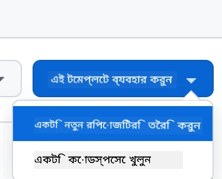  

**ধাপ ২: Codespaces চালু করুন**  
- **আপনার নতুন তৈরি করা রিপোজিটরি খুলুন**  
- **সবুজ "Code" বোতাম ক্লিক করুন এবং "Codespaces" নির্বাচন করুন**  
- **"Create codespace on main" নির্বাচন করুন** আপনার ডেভেলপমেন্ট পরিবেশ শুরু করতে  

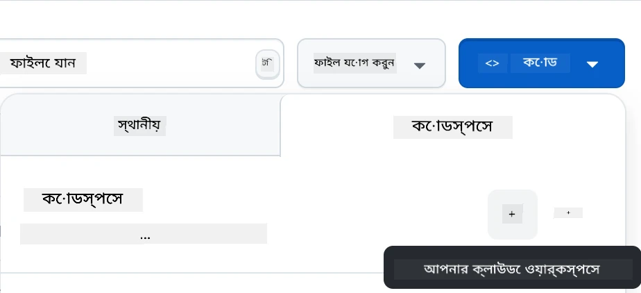  

**ধাপ ৩: পরিবেশ কনফিগারেশন**  
আপনার Codespace লোড হওয়ার পর, আপনি পাবেন:  
- **পূর্ব-ইনস্টল করা** Python, Node.js এবং প্রয়োজনীয় ডেভেলপমেন্ট টুল  
- **VS Code ইন্টারফেস** ওয়েব ডেভেলপমেন্টের জন্য এক্সটেনশন সহ  
- **টার্মিনাল অ্যাক্সেস** ব্যাকএন্ড এবং ফ্রন্টএন্ড সার্ভার চালানোর জন্য  
- **পোর্ট ফরওয়ার্ডিং** আপনার অ্যাপ্লিকেশন পরীক্ষা করার জন্য  

**Codespaces যা প্রদান করে:**  
- **স্থানীয় পরিবেশ সেটআপ এবং কনফিগারেশন সমস্যাগুলো দূর করে**  
- **বিভিন্ন ডিভাইসের মধ্যে একটি সঙ্গতিপূর্ণ ডেভেলপমেন্ট পরিবেশ প্রদান করে**  
- **ওয়েব ডেভেলপমেন্টের জন্য পূর্ব-কনফিগার করা টুল এবং এক্সটেনশন অন্তর্ভুক্ত করে**  
- **GitHub-এর সাথে ভার্সন কন্ট্রোল এবং সহযোগিতার জন্য সহজ ইন্টিগ্রেশন প্রদান করে**  

> 🚀 **প্রো টিপ**: Codespaces AI অ্যাপ্লিকেশন শেখা এবং প্রোটোটাইপিংয়ের জন্য আদর্শ কারণ এটি সমস্ত জটিল পরিবেশ সেটআপ স্বয়ংক্রিয়ভাবে পরিচালনা করে, আপনাকে কনফিগারেশন সমস্যার পরিবর্তে শেখা এবং তৈরি করার উপর মনোযোগ দিতে দেয়।  

---

**অস্বীকৃতি**:  
এই নথিটি AI অনুবাদ পরিষেবা [Co-op Translator](https://github.com/Azure/co-op-translator) ব্যবহার করে অনুবাদ করা হয়েছে। আমরা যথাসাধ্য সঠিকতার জন্য চেষ্টা করি, তবে অনুগ্রহ করে মনে রাখবেন যে স্বয়ংক্রিয় অনুবাদে ত্রুটি বা অসঙ্গতি থাকতে পারে। মূল ভাষায় থাকা নথিটিকে প্রামাণিক উৎস হিসেবে বিবেচনা করা উচিত। গুরুত্বপূর্ণ তথ্যের জন্য, পেশাদার মানব অনুবাদ সুপারিশ করা হয়। এই অনুবাদ ব্যবহারের ফলে কোনো ভুল বোঝাবুঝি বা ভুল ব্যাখ্যার জন্য আমরা দায়ী থাকব না।