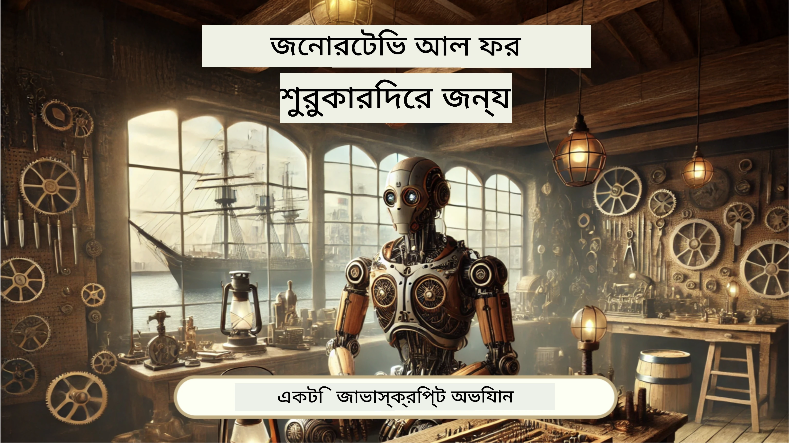
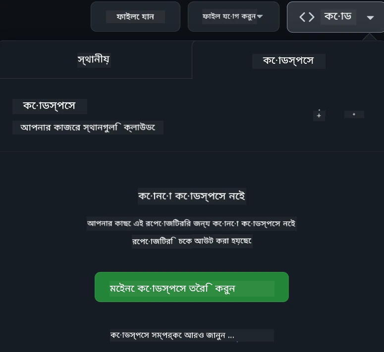

[](https://github.com/microsoft/Web-Dev-For-Beginners/blob/master/LICENSE)
[](https://GitHub.com/microsoft/Web-Dev-For-Beginners/graphs/contributors/)
[](https://GitHub.com/microsoft/Web-Dev-For-Beginners/issues/)
[](https://GitHub.com/microsoft/Web-Dev-For-Beginners/pulls/)
[](http://makeapullrequest.com) 

[](https://GitHub.com/microsoft/Web-Dev-For-Beginners/watchers/)
[](https://GitHub.com/microsoft/Web-Dev-For-Beginners/network/)
[](https://GitHub.com/microsoft/Web-Dev-For-Beginners/stargazers/)

[](https://discord.gg/nTYy5BXMWG)

# নবীনদের জন্য ওয়েব ডেভেলপমেন্ট - একটি পাঠ্যক্রম

মাইক্রোসফট ক্লাউড অ্যাডভোকেটদের দ্বারা প্রণীত ১২-সপ্তাহের সমগ্র কোর্সের মাধ্যমে ওয়েব ডেভেলপমেন্টের মৌলিক বিষয়গুলি শিখুন। ২৪টি পাঠে জাভাস্ক্রিপ্ট, CSS, এবং HTML হাতেকলমে প্রকল্প যেমন টেরারিয়াম, ব্রাউজার এক্সটেনশান এবং স্পেস গেমের মাধ্যমে বিস্তারিত আলোচনা করা হয়েছে। কুইজ, আলোচনা এবং ব্যবহারিক নিয়োগ সংযুক্ত রয়েছে। আমাদের কার্যকর প্রকল্পভিত্তিক শেখার পদ্ধতির মাধ্যমে আপনার দক্ষতা বৃদ্ধি করুন এবং জ্ঞান ধারণ ক্ষমতা উন্নত করুন। আজই আপনার কোডিং যাত্রা শুরু করুন!

Azure AI Foundry Discord কমিউনিটিতে যোগ দিন

[](https://discord.gg/nTYy5BXMWG)

এই সম্পদগুলি ব্যবহার শুরু করতে এই ধাপগুলি অনুসরণ করুন:
1. **রিপোজিটরি ফর্ক করুন**: ক্লিক করুন [](https://GitHub.com/microsoft/Web-Dev-For-Beginners/fork)
2. **রিপোজিটরি ক্লোন করুন**:   `git clone https://github.com/microsoft/Web-Dev-For-Beginners.git`
3. [**Azure AI Foundry Discord এ যোগ দিন এবং বিশেষজ্ঞ ও সহকর্মী ডেভেলপারদের সাথে পরিচিত হন**](https://discord.com/invite/ByRwuEEgH4)

### 🌐 মাল্টি-ল্যাঙ্গুয়েজ সাপোর্ট

#### GitHub Action দ্বারা সমর্থিত (স্বয়ংক্রিয় এবং সর্বদা আপডেট থাকে)

<!-- CO-OP TRANSLATOR LANGUAGES TABLE START -->
[Arabic](../ar/README.md) | [Bengali](./README.md) | [Bulgarian](../bg/README.md) | [Burmese (Myanmar)](../my/README.md) | [Chinese (Simplified)](../zh-CN/README.md) | [Chinese (Traditional, Hong Kong)](../zh-HK/README.md) | [Chinese (Traditional, Macau)](../zh-MO/README.md) | [Chinese (Traditional, Taiwan)](../zh-TW/README.md) | [Croatian](../hr/README.md) | [Czech](../cs/README.md) | [Danish](../da/README.md) | [Dutch](../nl/README.md) | [Estonian](../et/README.md) | [Finnish](../fi/README.md) | [French](../fr/README.md) | [German](../de/README.md) | [Greek](../el/README.md) | [Hebrew](../he/README.md) | [Hindi](../hi/README.md) | [Hungarian](../hu/README.md) | [Indonesian](../id/README.md) | [Italian](../it/README.md) | [Japanese](../ja/README.md) | [Kannada](../kn/README.md) | [Korean](../ko/README.md) | [Lithuanian](../lt/README.md) | [Malay](../ms/README.md) | [Malayalam](../ml/README.md) | [Marathi](../mr/README.md) | [Nepali](../ne/README.md) | [Nigerian Pidgin](../pcm/README.md) | [Norwegian](../no/README.md) | [Persian (Farsi)](../fa/README.md) | [Polish](../pl/README.md) | [Portuguese (Brazil)](../pt-BR/README.md) | [Portuguese (Portugal)](../pt-PT/README.md) | [Punjabi (Gurmukhi)](../pa/README.md) | [Romanian](../ro/README.md) | [Russian](../ru/README.md) | [Serbian (Cyrillic)](../sr/README.md) | [Slovak](../sk/README.md) | [Slovenian](../sl/README.md) | [Spanish](../es/README.md) | [Swahili](../sw/README.md) | [Swedish](../sv/README.md) | [Tagalog (Filipino)](../tl/README.md) | [Tamil](../ta/README.md) | [Telugu](../te/README.md) | [Thai](../th/README.md) | [Turkish](../tr/README.md) | [Ukrainian](../uk/README.md) | [Urdu](../ur/README.md) | [Vietnamese](../vi/README.md)

> **লোকালি ক্লোন করতে চান?**

> এই রিপোজিটরিতে ৫০+ ভাষার অনুবাদ অন্তর্ভুক্ত যা ডাউনলোডের আকার অনেক বৃদ্ধি করে। অনুবাদ ছাড়া ক্লোন করতে sparse checkout ব্যবহার করুন:
> ```bash
> git clone --filter=blob:none --sparse https://github.com/microsoft/Web-Dev-For-Beginners.git
> cd Web-Dev-For-Beginners
> git sparse-checkout set --no-cone '/*' '!translations' '!translated_images'
> ```
> এটি আপনাকে কোর্স সম্পন্ন করার জন্য যা প্রয়োজন তা দ্রুত ডাউনলোড সহ দেবে।
<!-- CO-OP TRANSLATOR LANGUAGES TABLE END -->

**আপনি যদি অতিরিক্ত ভাষার সমর্থন চান তবে সেগুলি [এখানে](https://github.com/Azure/co-op-translator/blob/main/getting_started/supported-languages.md) তালিকাভুক্ত।**

[](https://open.vscode.dev/microsoft/Web-Dev-For-Beginners)

#### 🧑‍🎓 _আপনি কি একজন ছাত্র?_

[**Student Hub পেইজে যান**](https://docs.microsoft.com/learn/student-hub/?WT.mc_id=academic-77807-sagibbon) যেখানে আপনি নবীনদের জন্য সম্পদ, শিক্ষার্থী প্যাক এবং এমনকি একটি ফ্রি সার্টিফিকেট ভাউচারের উপায় পাবেন। এটি এমন একটি পৃষ্ঠা যা আপনি বুকমার্ক করে মাঝে মাঝে দেখতে পারেন কারণ আমরা প্রতি মাসে সামগ্রী পরিবর্তন করি।

### 📣 ঘোষণা - নতুন GitHub Copilot Agent মোড চ্যালেঞ্জগুলি সম্পন্ন করার জন্য!

নতুন চ্যালেঞ্জ যুক্ত হয়েছে, বেশিরভাগ অধ্যায়ে "GitHub Copilot Agent Challenge 🚀" দেখুন। এটি GitHub Copilot এবং Agent মোড ব্যবহার করে সম্পন্ন করার জন্য একটি নতুন চ্যালেঞ্জ। আপনি যদি আগে Agent মোড ব্যবহার না করে থাকেন, এটি শুধুমাত্র টেক্সট তৈরি করে না, ফাইল তৈরি ও সম্পাদনা, কমান্ড চালাতে এবং আরও অনেক কাজ করতে সক্ষম।

### 📣 ঘোষণা - _Generative AI ব্যবহার করে নতুন প্রকল্প তৈরি_ 

নতুন AI Assistant প্রকল্প যুক্ত হয়েছে, এটি দেখুন [প্রকল্প](./9-chat-project/README.md)

### 📣 ঘোষণা - _Generative AI এর জন্য নতুন কোর্স_ সম্প্রতি প্রকাশিত হয়েছে

আমাদের নতুন Generative AI কোর্স মিস করবেন না!

শুরু করতে ভিজিট করুন [https://aka.ms/genai-js-course](https://aka.ms/genai-js-course) !



- মৌলিক থেকে RAG পর্যন্ত সবকিছুর পাঠ।
- GenAI এবং আমাদের সহচর অ্যাপ ব্যবহার করে ঐতিহাসিক চরিত্রদের সাথে ইন্টারঅ্যাক্ট করুন।
- মজার এবং আকর্ষণীয় বর্ণনা, আপনি সময় ভ্রমণ করবেন!


প্রতিটি পাঠে একটি অ্যাসাইনমেন্ট, একটি জ্ঞান যাচাই এবং একটি চ্যালেঞ্জ অন্তর্ভুক্ত রয়েছে যা আপনাকে শেখার বিষয়গুলিতে গাইড করবে যেমন:
- প্রম্পটিং এবং প্রম্পট ইঞ্জিনিয়ারিং
- টেক্সট এবং ইমেজ অ্যাপ জেনারেশন
- সার্চ অ্যাপস

শুরু করতে  [https://aka.ms/genai-js-course](https://aka.ms/genai-js-course) এ যান!


## 🌱 শুরু করা

> **শিক্ষকবৃন্দ**, আমরা [কিছু পরামর্শ যোগ করেছি](for-teachers.md) কীভাবে এই পাঠ্যক্রম ব্যবহার করবেন তা নিয়ে। আপনার মতামত আমরা অবশ্যই চাই [আমাদের আলোচনা ফোরামে](https://github.com/microsoft/Web-Dev-For-Beginners/discussions/categories/teacher-corner)।

**[শিক্ষার্থী](https://aka.ms/student-page/?WT.mc_id=academic-77807-sagibbon)**, প্রতিটি পাঠের জন্য, একটি প্রি-লেকচার কুইজ দিয়ে শুরু করুন এবং লেকচার ম্যাটিরিয়াল পড়ুন, বিভিন্ন কার্যকলাপ সম্পন্ন করুন এবং পোস্ট-লেকচার কুইজ দিয়ে আপনার বোঝাপড়া পরীক্ষা করুন।

আপনার শেখার অভিজ্ঞতা বাড়াতে, আপনার সহপাঠীদের সাথে একসাথে প্রকল্পগুলো নিয়ে কাজ করতে সংযুক্ত হোন! আলোচনা করার জন্য আমাদের [আলোচনা ফোরাম](https://github.com/microsoft/Web-Dev-For-Beginners/discussions) এ উৎসাহিত করা হয় যেখানে আমাদের মডারেটর টিম আপনার প্রশ্নের উত্তর দিতে থাকবে।

আপনার শিক্ষাকে আরো বাড়ানোর জন্য, আমরা অত্যন্ত সুপারিশ করি [Microsoft Learn](https://learn.microsoft.com/users/wirelesslife/collections/p1ddcy5jwy0jkm?WT.mc_id=academic-77807-sagibbon) এ অতিরিক্ত অধ্যয়ন সামগ্রী অন্বেষণ করতে।

### 📋 আপনার পরিবেশ সেটআপ করা

এই পাঠ্যক্রমের একটি ডেভেলপমেন্ট পরিবেশ প্রস্তুত রয়েছে! আপনি শুরু করার সময় আপনি এই পাঠ্যক্রম [Codespace](https://github.com/features/codespaces/) (_একটি ব্রাউজার-ভিত্তিক, কোনও ইনস্টলেশন ছাড়াই পরিবেশ_) বা আপনার কম্পিউটারে [Visual Studio Code](https://code.visualstudio.com/?WT.mc_id=academic-77807-sagibbon) এর মত একটি টেক্সট এডিটর ব্যবহার করে চালাতে পারেন।

#### আপনার রিপোজিটরি তৈরি করুন
আপনার কাজ সহজে সংরক্ষণ করার জন্য, আপনার নিজস্ব একটি কপি এই রিপোজিটরির তৈরি করা সুপারিশ করা হয়। এটি করতে আপনি পৃষ্ঠার উপরের দিকের **Use this template** বোতামে ক্লিক করতে পারেন। এতে আপনার GitHub অ্যাকাউন্টে পাঠ্যক্রমের একটি অনুলিপি সহ নতুন রিপোজিটরি তৈরি হবে।

এই ধাপগুলি অনুসরণ করুন:
1. **রিপোজিটরি ফর্ক করুন**: এই পৃষ্ঠার উপরের ডানদিকে কোণে "Fork" বোতামে ক্লিক করুন।
2. **রিপোজিটরি ক্লোন করুন**:   `git clone https://github.com/microsoft/Web-Dev-For-Beginners.git`

#### Codespace এ পাঠ্যক্রম চালানো

আপনি যে রিপোজিটরির কপি তৈরি করেছেন সেখানে **Code** বোতামে ক্লিক করুন এবং **Open with Codespaces** নির্বাচন করুন। এটি আপনার কাজের জন্য একটি নতুন Codespace তৈরি করবে।



#### আপনার কম্পিউটারে লোকালি পাঠ্যক্রম চালানো

আপনার কম্পিউটারে লোকালি পাঠ্যক্রম চালাতে, আপনার একটি টেক্সট এডিটর, একটি ব্রাউজার এবং একটি কমান্ড লাইন টুল প্রয়োজন। আমাদের প্রথম পাঠ, [Introduction to Programming Languages and Tools of the Trade](../../1-getting-started-lessons/1-intro-to-programming-languages), আপনাকে প্রতিটি সরঞ্জামের বিভিন্ন অপশন সম্পর্কে পথ দেখাবে যেন আপনি নিজের জন্য সেরা নির্বাচন করতে পারেন।

আমাদের সুপারিশ হল [Visual Studio Code](https://code.visualstudio.com/?WT.mc_id=academic-77807-sagibbon) ব্যবহার করা, যেটিতে একটি অন্তর্নির্মিত [Terminal](https://code.visualstudio.com/docs/terminal/basics/?WT.mc_id=academic-77807-sagibbon) রয়েছে। আপনি Visual Studio Code [এখানে](https://code.visualstudio.com/?WT.mc_id=academic-77807-sagibbon) থেকে ডাউনলোড করতে পারেন।


1. আপনার রিপোজিটরিটি আপনার কম্পিউটারে ক্লোন করুন। এটি করতে আপনি **Code** বোতামে ক্লিক করে URL কপি করতে পারেন:

    [CodeSpace](./images/createcodespace.png)
তাহলে, [Visual Studio Code](https://code.visualstudio.com/?WT.mc_id=academic-77807-sagibbon) এর ভিতরে [Terminal](https://code.visualstudio.com/docs/terminal/basics/?WT.mc_id=academic-77807-sagibbon) খুলুন এবং নিম্নলিখিত কমান্ডটি চালান, যেখানে `<your-repository-url>` আপনি যেই URLটি কপি করেছেন সেটির সাথে প্রতিস্থাপন করবেন:

    ```bash 
    git clone <your-repository-url>
    ```

2. Visual Studio Code এ ফোল্ডারটি খুলুন। আপনি এটি করতে পারেন **File** > **Open Folder** ক্লিক করে এবং আপনি যেই ফোল্ডারটি ক্লোন করেছেন সেটি নির্বাচন করে।


>  সুপারিশকৃত Visual Studio Code এক্সটেনশনসমূহ:
>
> * [Live Server](https://marketplace.visualstudio.com/items?itemName=ritwickdey.LiveServer&WT.mc_id=academic-77807-sagibbon) - Visual Studio Code এর ভিতরে HTML পেজের পূর্বরূপ দেখতে
> * [Copilot](https://marketplace.visualstudio.com/items?itemName=GitHub.copilot&WT.mc_id=academic-77807-sagibbon) - দ্রুত কোড লেখার জন্য সাহায্য করতে

## 📂 প্রতিটি পাঠ অন্তর্ভুক্ত করে:

- ঐচ্ছিক স্কেচনোট
- ঐচ্ছিক সহায়ক ভিডিও
- পাঠের আগে ওয়ার্মআপ কুইজ
- লিখিত পাঠ
- প্রকল্প-ভিত্তিক পাঠগুলোর জন্য, প্রকল্প নির্মাণের ধাপে ধাপে নির্দেশিকা
- জ্ঞান পরীক্ষা
- একটি চ্যালেঞ্জ
- সহায়ক পাঠ্য
- নিয়োগ
- [পাঠোত্তপর কুইজ](https://ff-quizzes.netlify.app/web/)

> **কুইজ সম্পর্কিত একটি নোট**: সমস্ত কুইজ Quiz-app ফোল্ডারে রয়েছে, মোট ৪৮টি কুইজ প্রতিটিতে তিনটি প্রশ্ন। সেগুলি পাওয়া যাবে [এখানে](https://ff-quizzes.netlify.app/web/), কুইজ অ্যাপটি স্থানীয়ভাবে চালানো যায় অথবা Azure এ ডিপ্লয় করা যায়; এর জন্য `quiz-app` ফোল্ডারে নির্দেশিকা অনুসরণ করুন।

## 🗃️ পাঠসমূহ

|     |                       প্রকল্পের নাম                       |                            শেখানো বিষয়সমূহ                             | শেখার উদ্দেশ্য                                                                                                                |                                                         সংশ্লিষ্ট পাঠ                                                          |         লেখক          |
| :-: | :------------------------------------------------------: | :--------------------------------------------------------------------: | ------------------------------------------------------------------------------------------------------------------------------ | :----------------------------------------------------------------------------------------------------------------------------: | :---------------------: |
| 01  |                     শুরু করা হচ্ছে                      |           প্রোগ্রামিং পরিচিতি এবং সরঞ্জামের আলোচনা           | অধিকাংশ প্রোগ্রামিং ভাষার মৌলিক ভিত্তি এবং পেশাদার ডেভেলপারদের কাজ সহজ করতে ব্যবহৃত সফটওয়্যার সম্পর্কে শেখা | [Intro to Programming Languages and Tools of the Trade](./1-getting-started-lessons/1-intro-to-programming-languages/README.md) |         Jasmine         |
| 02  |                     শুরু করা হচ্ছে                      |             গিটহাবের বুনিয়াদি, টিমের সাথে কাজ করা অন্তর্ভুক্ত             | আপনার প্রকল্পে গিটহাব ব্যবহার করা, কীভাবে কোডবেইজে অন্যদের সাথে সহযোগিতা করবেন শেখা                                        |                            [Intro to GitHub](./1-getting-started-lessons/2-github-basics/README.md)                             |          Floor          |
| 03  |                     শুরু করা হচ্ছে                      |                             প্রবেশযোগ্যতা                              | ওয়েব প্রবেশযোগ্যতার মৌলিক বিষয়গুলি শেখা                                                                                       |                       [Accessibility Fundamentals](./1-getting-started-lessons/3-accessibility/README.md)                       |       Christopher       |
| 04  |                        JS বেসিকস                         |                         JavaScript ডেটা টাইপসমূহ                          | JavaScript ডেটা টাইপের মৌলিক বিষয়গুলি                                                                                         |                                       [Data Types](./2-js-basics/1-data-types/README.md)                                        |         Jasmine         |
| 05  |                        JS বেসিকস                         |                         ফাংশন এবং মেথডসমূহ                          | একটি অ্যাপ্লিকেশনের লজিক ফ্লো পরিচালনার জন্য ফাংশন এবং মেথড সম্পর্কে শেখা                                                     |                              [Functions and Methods](./2-js-basics/2-functions-methods/README.md)                               | Jasmine এবং Christopher |
| 06  |                        JS বেসিকস                         |                        JS দিয়ে সিদ্ধান্ত নেওয়া                        | কিভাবে আপনার কোডে শর্ত তৈরি করবেন সিদ্ধান্ত গ্রহণ পদ্ধতি ব্যবহার করে শেখা                                                       |                                 [Making Decisions](./2-js-basics/3-making-decisions/README.md)                                  |         Jasmine         |
| 07  |                        JS বেসিকস                         |                            অ্যারে এবং লুপ                            | JavaScript এ অ্যারে এবং লুপ ব্যবহার করে ডেটার সাথে কাজ করা                                                                       |                                   [Arrays and Loops](./2-js-basics/4-arrays-loops/README.md)                                    |         Jasmine         |
| 08  |       [টেরারিয়াম](./3-terrarium/solution/README.md)       |                            HTML অনুশীলনে                            | অনলাইন টেরারিয়াম তৈরির জন্য HTML নির্মাণ, বিন্যাস নির্মাণে গুরুত্ব দেওয়া                                                       |                                 [Introduction to HTML](./3-terrarium/1-intro-to-html/README.md)                                 |           Jen           |
| 09  |       [টেরারিয়াম](./3-terrarium/solution/README.md)       |                            CSS অনুশীলনে                             | অনলাইন টেরারিয়ামের স্টাইল করার জন্য CSS তৈরি, CSS এর মৌলিক বিষয় এবং পেজ রেসপনসিভ করা শেখা                                   |                                  [Introduction to CSS](./3-terrarium/2-intro-to-css/README.md)                                  |           Jen           |
| 10  |            [টেরারিয়াম](./3-terrarium/solution/README.md)            |                JavaScript ক্লোজার, DOM ম্যানিপুলেশন                  | টেরারিয়ামকে ড্র্যাগ/ড্রপ ইন্টারফেস হিসেবে কাজ করানোর জন্য JavaScript নির্মাণ, ক্লোজার এবং DOM ম্যানিপুলেশনে গুরুত্ব দেওয়া       |                  [JavaScript Closures, DOM manipulation](./3-terrarium/3-intro-to-DOM-and-closures/README.md)                   |           Jen           |
| 11  |          [টাইপিং গেম](./4-typing-game/solution/README.md)          |                          একটি টাইপিং গেম তৈরি                           | কিবোর্ড ইভেন্ট ব্যবহার করে কিভাবে আপনার JavaScript অ্যাপের লজিক চালানো হয় শিখুন                                             |                                [Event-Driven Programming](./4-typing-game/typing-game/README.md)                                |       Christopher       |
| 12  | [গ্রিন ব্রাউজার এক্সটেনশন](./5-browser-extension/solution/README.md) |                         ব্রাউজারের সাথে কাজ                          | ব্রাউজার কিভাবে কাজ করে, তার ইতিহাস এবং ব্রাউজার এক্সটেনশনের প্রথম উপাদান তৈরি করা শেখা                                      |                               [About Browsers](./5-browser-extension/1-about-browsers/README.md)                                |           Jen           |
| 13  | [গ্রিন ব্রাউজার এক্সটেনশন](./5-browser-extension/solution/README.md) | ফর্ম তৈরি, API কল এবং স্থানীয় স্টোরেজে ভেরিয়েবল সংরক্ষণ | API কল করার জন্য আপনার ব্রাউজার এক্সটেনশনের JavaScript উপাদান তৈরি করুন, স্থানীয় স্টোরেজে সংরক্ষিত ভেরিয়েবল ব্যবহার করে     |                [APIs, Forms, and Local Storage](./5-browser-extension/2-forms-browsers-local-storage/README.md)                 |           Jen           |
| 14  | [গ্রিন ব্রাউজার এক্সটেনশন](./5-browser-extension/solution/README.md) |          ব্রাউজারের ব্যাকগ্রাউন্ড প্রসেস, ওয়েব পারফরমেন্স          | এক্সটেনশনের আইকন পরিচালনার জন্য ব্রাউজারের ব্যাকগ্রাউন্ড প্রসেস ব্যবহার করুন; ওয়েব পারফরমেন্স এবং কিছু অপ্টিমাইজেশন সম্পর্কে শেখা   |             [Background Tasks and Performance](./5-browser-extension/3-background-tasks-and-performance/README.md)              |           Jen           |
| 15  |           [স্পেস গেম](./6-space-game/solution/README.md)           |             JavaScript দিয়ে আরও উন্নত গেম ডেভেলপমেন্ট             | ক্লাস এবং কম্পোজিশন উভয় ব্যবহার করে ইনহেরিটেন্স এবং পাব/সাব প্যাটার্ন শেখা, একটি গেম নির্মাণের জন্য প্রস্তুতি                        |                      [Introduction to Advanced Game Development](./6-space-game/1-introduction/README.md)                       |          Chris          |
| 16  |           [স্পেস গেম](./6-space-game/solution/README.md)           |                           ক্যানভাসে ড্রয়িং                            | স্ক্রীনে এলিমেন্ট আঁকার জন্য ব্যবহৃত Canvas API সম্পর্কে শেখা                                                                    |                                [Drawing to Canvas](./6-space-game/2-drawing-to-canvas/README.md)                                |          Chris          |
| 17  |           [স্পেস গেম](./6-space-game/solution/README.md)           |                   স্ক্রীনের চারপাশে এলিমেন্ট সরানো                   | কিভাবে কার্তেসিয়ান কোঅর্ডিনেট এবং Canvas API ব্যবহার করে এলিমেন্টগুলোকে মুভ করানো যায় শেখা                                    |                           [Moving Elements Around](./6-space-game/3-moving-elements-around/README.md)                           |          Chris          |
| 18  |           [স্পেস গেম](./6-space-game/solution/README.md)           |                          সংঘর্ষ শনাক্তকরণ                           | কীপ্রেস ব্যবহার করে এলিমেন্টগুলোকে সংঘর্ষ করানো এবং একে অপরের প্রতি প্রতিক্রিয়া দেখানো; গেমের পারফরমেন্স নিশ্চিত করতে কুলডাউন ফাংশন ব্যবহার করা |                              [Collision Detection](./6-space-game/4-collision-detection/README.md)                              |          Chris          |
| 19  |           [স্পেস গেম](./6-space-game/solution/README.md)           |                             স্কোর রাখা                               | গেমের পরিস্থিতি ও পারফরমেন্সের ওপর ভিত্তি করে গণিতের হিসাব-নিকাশ করা                                                              |                                    [Keeping Score](./6-space-game/5-keeping-score/README.md)                                    |          Chris          |
| 20  |           [স্পেস গেম](./6-space-game/solution/README.md)           |                     গেম শেষ করা এবং পুনরায় শুরু করা                     | গেম শেষ করা এবং পুনরায় শুরু করার বিষয়ে শেখা, সম্পদ পরিষ্কার করা এবং ভেরিয়েবলের মান রিসেট করা                                |                                [The Ending Condition](./6-space-game/6-end-condition/README.md)                                 |          Chris          |
| 21  |         [ব্যাংকিং অ্যাপ](./7-bank-project/solution/README.md)          |                 ওয়েব অ্যাপে HTML টেমপ্লেট এবং রাউটসমূহ                 | মাল্টিপেজ ওয়েবসাইট আর্কিটেকচারের স্ক্যাফোল্ড তৈরি করা শিখুন রাউটিং এবং HTML টেমপ্লেট ব্যবহার করে                             |                            [HTML Templates and Routes](./7-bank-project/1-template-route/README.md)                             |          Yohan          |
| 22  |         [ব্যাংকিং অ্যাপ](./7-bank-project/solution/README.md)          |                  লগইন এবং রেজিস্ট্রেশন ফর্ম তৈরি                   | ফর্ম তৈরি এবং যাচাইকরণ পদ্ধতি সম্পর্কে শেখা                                                                          |                                           [Forms](./7-bank-project/2-forms/README.md)                                           |          Yohan          |
| 23  |         [ব্যাংকিং অ্যাপ](./7-bank-project/solution/README.md)          |                   ডেটা সংগ্রহ এবং ব্যবহারের পদ্ধতি                   | আপনার অ্যাপের ভিতরে ও বাইরে ডেটার প্রবাহ, কিভাবে তা সংগ্রহ, সংরক্ষণ এবং মুছে ফেলা যায় শিখুন                                                 |                                            [Data](./7-bank-project/3-data/README.md)                                            |          Yohan          |
| 24  |         [ব্যাংকিং অ্যাপ](./7-bank-project/solution/README.md)          |                      স্টেট ম্যানেজমেন্ট ধারণা                      | আপনার অ্যাপ কিভাবে অবস্থা ধরে রাখে এবং প্রোগ্রাম্যাটিকভাবে তা কিভাবে পরিচালনা করবেন শেখা                                                              |                                [State Management](./7-bank-project/4-state-management/README.md)                                |          Yohan          |
| 25 | [ব্রাউজার/VScode কোড](../../8-code-editor) | VScode এর সাথে কাজ করা | কোড এডিটর ব্যবহার শিখুন | [Use VScode Code Editor](./8-code-editor/1-using-a-code-editor/README.md) | Chris |
| 26 | [AI সহকারী](./9-chat-project/README.md) | AI এর সাথে কাজ করা | নিজের AI সহকারী তৈরি শেখা | [AI Assistant project](./9-chat-project/README.md) | Chris |

## 🏫 শিক্ষণশাস্ত্র

আমাদের পাঠ্যক্রম দুইটি মূল শিক্ষণ নীতির ভিত্তিতে ডিজাইন করা হয়েছে:
* প্রকল্প-ভিত্তিক শিক্ষা
* ঘন ঘন কুইজ পরীক্ষা

এই প্রোগ্রামটি JavaScript, HTML এবং CSS এর মৌলিক বিষয় শেখায়, পাশাপাশি বর্তমান ওয়েব ডেভেলপাররা যেসব সরঞ্জাম ও প্রযুক্তি ব্যবহার করে তা শেখায়। ছাত্ররা টাইপিং গেম, ভার্চুয়াল টেরারিয়াম, পরিবেশবান্ধব ব্রাউজার এক্সটেনশন, স্পেস ইনভেডার ধরণের গেম এবং ব্যবসার জন্য একটি ব্যাংকিং অ্যাপ তৈরি করে হাতে কলমে অভিজ্ঞতা অর্জনের সুযোগ পাবে। সিরিজের শেষে, শিক্ষার্থীরা ওয়েব ডেভেলপমেন্ট সম্পর্কে একটি শক্তিশালী ধারণা লাভ করবে।

> 🎓 আপনি এই পাঠ্যক্রমের প্রথম কয়েকটি পাঠ Microsoft Learn এ একটি [Learn Path](https://docs.microsoft.com/learn/paths/web-development-101/?WT.mc_id=academic-77807-sagibbon) হিসেবে নিতে পারেন!

বিষয়বস্তু প্রকল্পের সাথে সামঞ্জস্যপূর্ণ করার মাধ্যমে, শিক্ষার্থীদের জন্য প্রক্রিয়াটি আরও আকর্ষণীয় হয় এবং ধারণাগুলোর স্মরণীয়তা বৃদ্ধি পায়। আমরা JavaScript বেসিকসের কয়েকটি প্রাথমিক পাঠও লিখেছি ধারণাগুলো পরিচয় করানোর জন্য, "[Beginners Series to: JavaScript](https://channel9.msdn.com/Series/Beginners-Series-to-JavaScript/?WT.mc_id=academic-77807-sagibbon)" ভিডিও টিউটোরিয়াল সংগ্রহ থেকে একটি ভিডিওসহ, যাদের মধ্যে কিছু লেখক এই পাঠ্যক্রমে অবদান রেখেছেন।

তদুপরি, একটি ক্লাসের আগে হালকা স্তরের কুইজ শিক্ষার্থীর শেখার প্রতিশ্রুতি স্থাপন করে, এবং ক্লাসের পর একটি দ্বিতীয় কুইজ আরও স্মরণীয়তা নিশ্চিত করে। এই পাঠ্যক্রমটি নমনীয় এবং মজাদার করার জন্য ডিজাইন করা হয়েছে এবং সম্পূর্ণ অথবা আংশিক অংশগ্রহণ করা যায়। প্রকল্পগুলো ছোট থেকে শুরু করে ১২ সপ্তাহের চক্র শেষে ক্রমশ জটিল হয়ে ওঠে।

যেহেতু আমরা সচেতনভাবে JavaScript ফ্রেমওয়ার্ক পরিচিতি এড়িয়েছি যাতে ওয়েব ডেভেলপার হিসেবে মৌলিক দক্ষতা অর্জনে মনোযোগ দিতে পারি ফ্রেমওয়ার্ক গৃহীত করার আগে, তাই এই পাঠ্যক্রম শেষ করার পর পরবর্তী ভালো পদক্ষেপ হতে পারে Node.js সম্পর্কে শেখা, অন্য একটি ভিডিও সংগ্রহের মাধ্যমে: "[Beginner Series to: Node.js](https://channel9.msdn.com/Series/Beginners-Series-to-Nodejs/?WT.mc_id=academic-77807-sagibbon)".

> আমাদের [আচরণবিধি](CODE_OF_CONDUCT.md) এবং [অবদান](CONTRIBUTING.md) নির্দেশিকা দেখুন। আমরা আপনার গঠনমূলক প্রতিক্রিয়াকে স্বাগত জানাই!


## 🧭 অফলাইন অ্যাক্সেস

[Docsify](https://docsify.js.org/#/) ব্যবহার করে আপনি এই ডকুমেন্টেশনটি অফলাইনে চালাতে পারবেন। এই রিপোজিটরিটি ফর্ক করুন, [Docsify ইনস্টল করুন](https://docsify.js.org/#/quickstart) আপনার লোকাল মেশিনে, তারপর এই রিপোজিটরির মূল ফোল্ডারে যান এবং টাইপ করুন `docsify serve`। ওয়েবসাইটটি আপনার লোকালহোস্টে ৩০০০ পোর্টে সার্ভ হবে: `localhost:3000`।

## 📘 পিডিএফ

সমস্ত পাঠের একটি পিডিএফ [এখানে](https://microsoft.github.io/Web-Dev-For-Beginners/pdf/readme.pdf) পাওয়া যাবে।


## 🎒 অন্যান্য কোর্সসমূহ
আমাদের দল অন্যান্য কোর্স তৈরি করে! দেখুন:

<!-- CO-OP TRANSLATOR OTHER COURSES START -->
### LangChain
[](https://aka.ms/langchain4j-for-beginners)
[](https://aka.ms/langchainjs-for-beginners?WT.mc_id=m365-94501-dwahlin)
[](https://github.com/microsoft/langchain-for-beginners?WT.mc_id=m365-94501-dwahlin)
---

### Azure / Edge / MCP / Agents
[](https://github.com/microsoft/AZD-for-beginners?WT.mc_id=academic-105485-koreyst)
[](https://github.com/microsoft/edgeai-for-beginners?WT.mc_id=academic-105485-koreyst)
[](https://github.com/microsoft/mcp-for-beginners?WT.mc_id=academic-105485-koreyst)
[](https://github.com/microsoft/ai-agents-for-beginners?WT.mc_id=academic-105485-koreyst)

---
 
### Generative AI Series
[](https://github.com/microsoft/generative-ai-for-beginners?WT.mc_id=academic-105485-koreyst)
[-9333EA?style=for-the-badge&labelColor=E5E7EB&color=9333EA)](https://github.com/microsoft/Generative-AI-for-beginners-dotnet?WT.mc_id=academic-105485-koreyst)
[-C084FC?style=for-the-badge&labelColor=E5E7EB&color=C084FC)](https://github.com/microsoft/generative-ai-for-beginners-java?WT.mc_id=academic-105485-koreyst)
[-E879F9?style=for-the-badge&labelColor=E5E7EB&color=E879F9)](https://github.com/microsoft/generative-ai-with-javascript?WT.mc_id=academic-105485-koreyst)

---
 
### Core Learning
[](https://aka.ms/ml-beginners?WT.mc_id=academic-105485-koreyst)
[](https://aka.ms/datascience-beginners?WT.mc_id=academic-105485-koreyst)
[](https://aka.ms/ai-beginners?WT.mc_id=academic-105485-koreyst)
[](https://github.com/microsoft/Security-101?WT.mc_id=academic-96948-sayoung)
[](https://aka.ms/webdev-beginners?WT.mc_id=academic-105485-koreyst)
[](https://aka.ms/iot-beginners?WT.mc_id=academic-105485-koreyst)
[](https://github.com/microsoft/xr-development-for-beginners?WT.mc_id=academic-105485-koreyst)

---
 
### Copilot Series
[](https://aka.ms/GitHubCopilotAI?WT.mc_id=academic-105485-koreyst)
[](https://github.com/microsoft/mastering-github-copilot-for-dotnet-csharp-developers?WT.mc_id=academic-105485-koreyst)
[](https://github.com/microsoft/CopilotAdventures?WT.mc_id=academic-105485-koreyst)
<!-- CO-OP TRANSLATOR OTHER COURSES END -->

## সাহায্য নেওয়া

যদি আপনি আটকে যান বা AI অ্যাপ নির্মাণ সম্পর্কে কোনো প্রশ্ন থাকে। MCP নিয়ে আলোচনা করতে সহশিক্ষার্থী এবং অভিজ্ঞ ডেভেলপারদের সাথে যোগ দিন। এটি একটি সহায়ক সম্প্রদায় যেখানে প্রশ্ন歓迎 এবং জ্ঞান বিনামূল্যে ভাগ করা হয়।

[](https://discord.gg/nTYy5BXMWG)

যদি আপনার পণ্যের প্রতিক্রিয়া বা ত্রুটি থাকে নির্মাণের সময় নিম্নলিখিত লিঙ্কে যান:

[](https://aka.ms/foundry/forum)

## লাইসেন্স

এই রিপজিটরি MIT লাইসেন্সের অধীনে লাইসেন্সকৃত। আরও তথ্যের জন্য দেখুন [LICENSE](../../LICENSE) ফাইল।

---

<!-- CO-OP TRANSLATOR DISCLAIMER START -->
**দায়িত্ব সীমা**:
এই নথিটি AI অনুবাদ সেবা [Co-op Translator](https://github.com/Azure/co-op-translator) ব্যবহার করে অনূদিত হয়েছে। আমরা যথাসাধ্য সঠিকতার জন্য চেষ্টা করি, তবে कृপয়া মনে রাখবেন যে স্বয়ংক্রিয় অনুবাদে ত্রুটি বা ভুল থাকতে পারে। মূল নথিটি তার নিজ ভাষায় সর্বাধিক গ্রহণযোগ্য উৎস হিসেবে বিবেচিত হওয়া উচিত। গুরুত্বপূর্ণ তথ্যের জন্য পেশাদার মানব অনুবাদ পরামর্শ দেওয়া হয়। এই অনুবাদের ব্যবহার থেকে উদ্ভূত কোনও ভুল বোঝাবুঝি বা ভ্রান্তির জন্য আমরা দায়ী নই।
<!-- CO-OP TRANSLATOR DISCLAIMER END -->