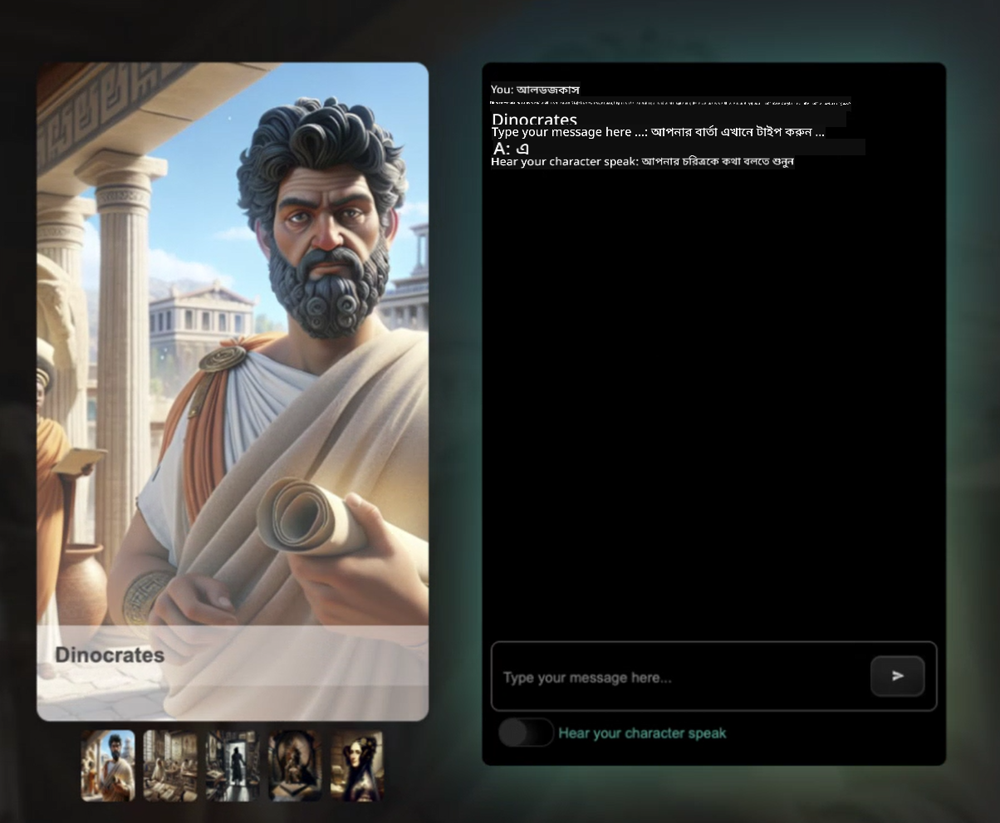

<!--
CO_OP_TRANSLATOR_METADATA:
{
  "original_hash": "efa251c5fc089367f0a81c572874afca",
  "translation_date": "2025-08-28T02:42:55+00:00",
  "source_file": "README.md",
  "language_code": "bn"
}
-->
[](https://github.com/microsoft/Web-Dev-For-Beginners/blob/master/LICENSE)  
[](https://GitHub.com/microsoft/Web-Dev-For-Beginners/graphs/contributors/)  
[](https://GitHub.com/microsoft/Web-Dev-For-Beginners/issues/)  
[](https://GitHub.com/microsoft/Web-Dev-For-Beginners/pulls/)  
[](http://makeapullrequest.com)  

[](https://GitHub.com/microsoft/Web-Dev-For-Beginners/watchers/)  
[](https://GitHub.com/microsoft/Web-Dev-For-Beginners/network/)  
[](https://GitHub.com/microsoft/Web-Dev-For-Beginners/stargazers/)  

[](https://discord.gg/zxKYvhSnVp?WT.mc_id=academic-000002-leestott)  

[](https://open.vscode.dev/microsoft/Web-Dev-For-Beginners)  

[](https://discord.com/invite/ByRwuEEgH4)  

এই রিসোর্সগুলো ব্যবহার শুরু করতে নিচের ধাপগুলো অনুসরণ করুন:  
1. **রিপোজিটরি ফর্ক করুন**: ক্লিক করুন [](https://GitHub.com/microsoft/Web-Dev-For-Beginners/fork)  
2. **রিপোজিটরি ক্লোন করুন**: `git clone https://github.com/microsoft/Web-Dev-For-Beginners.git`  
3. [**Azure AI Foundry Discord-এ যোগ দিন এবং বিশেষজ্ঞ ও অন্যান্য ডেভেলপারদের সাথে পরিচিত হন**](https://discord.com/invite/ByRwuEEgH4)  

# ওয়েব ডেভেলপমেন্ট শেখার জন্য একটি কোর্স - শিক্ষার্থীদের জন্য  

মাইক্রোসফট ক্লাউড অ্যাডভোকেটদের ১২ সপ্তাহের এই কোর্সের মাধ্যমে ওয়েব ডেভেলপমেন্টের মৌলিক বিষয়গুলো শিখুন। ২৪টি লেসনে JavaScript, CSS এবং HTML নিয়ে কাজ করুন হাতে-কলমে প্রজেক্টের মাধ্যমে, যেমন টেরারিয়াম, ব্রাউজার এক্সটেনশন এবং স্পেস গেম। কুইজ, আলোচনা এবং প্র্যাকটিক্যাল অ্যাসাইনমেন্টের মাধ্যমে দক্ষতা বৃদ্ধি করুন। প্রজেক্ট-ভিত্তিক শিক্ষার মাধ্যমে আপনার জ্ঞানকে আরও কার্যকরভাবে ধরে রাখুন। আজই কোডিং শেখা শুরু করুন!  

#### 🧑‍🎓 _আপনি কি একজন শিক্ষার্থী?_  

[**স্টুডেন্ট হাব পেজ**](https://docs.microsoft.com/learn/student-hub/?WT.mc_id=academic-77807-sagibbon) ভিজিট করুন যেখানে আপনি পাবেন শিক্ষার্থীদের জন্য রিসোর্স, স্টুডেন্ট প্যাক এবং এমনকি বিনামূল্যে সার্টিফিকেট ভাউচার পাওয়ার উপায়। এই পেজটি বুকমার্ক করুন এবং মাসিকভাবে নতুন কন্টেন্টের জন্য চেক করুন।  

### 📣 ঘোষণা - _নতুন কোর্স_ জেনারেটিভ AI এবং JavaScript নিয়ে প্রকাশিত হয়েছে  

আমাদের নতুন জেনারেটিভ AI কোর্স মিস করবেন না!  

শুরু করতে ভিজিট করুন [https://aka.ms/genai-js-course](https://aka.ms/genai-js-course)!  

  

- বেসিক থেকে RAG পর্যন্ত লেসন।  
- জেনারেটিভ AI এবং আমাদের সঙ্গী অ্যাপ ব্যবহার করে ঐতিহাসিক চরিত্রের সাথে ইন্টারঅ্যাক্ট করুন।  
- মজার এবং আকর্ষণীয় গল্প, আপনি সময় ভ্রমণ করবেন!  

  

প্রতিটি লেসনে রয়েছে:  
- প্রম্পটিং এবং প্রম্পট ইঞ্জিনিয়ারিং  
- টেক্সট এবং ইমেজ অ্যাপ তৈরি  
- সার্চ অ্যাপ  

শুরু করতে ভিজিট করুন [https://aka.ms/genai-js-course](https://aka.ms/genai-js-course)!  

## 🌱 শুরু করা  

> **শিক্ষকগণ**, আমরা [কিছু পরামর্শ](for-teachers.md) অন্তর্ভুক্ত করেছি এই কোর্সটি কীভাবে ব্যবহার করবেন। আমাদের [আলোচনা ফোরামে](https://github.com/microsoft/Web-Dev-For-Beginners/discussions/categories/teacher-corner) আপনার মতামত জানাতে পারেন!  

**[শিক্ষার্থীরা](https://aka.ms/student-page/?WT.mc_id=academic-77807-sagibbon)**, প্রতিটি লেসনের জন্য, প্রি-লেকচার কুইজ দিয়ে শুরু করুন এবং লেকচার মেটেরিয়াল পড়ুন, বিভিন্ন কার্যক্রম সম্পন্ন করুন এবং পোস্ট-লেকচার কুইজ দিয়ে আপনার জ্ঞান যাচাই করুন।  

আপনার শেখার অভিজ্ঞতা উন্নত করতে, আপনার সহপাঠীদের সাথে প্রজেক্টে কাজ করুন! আলোচনা উৎসাহিত করা হয় আমাদের [আলোচনা ফোরামে](https://github.com/microsoft/Web-Dev-For-Beginners/discussions) যেখানে আমাদের মডারেটর টিম আপনার প্রশ্নের উত্তর দিতে প্রস্তুত থাকবে।  

আপনার শিক্ষা আরও এগিয়ে নিতে, আমরা [Microsoft Learn](https://learn.microsoft.com/users/wirelesslife/collections/p1ddcy5jwy0jkm?WT.mc_id=academic-77807-sagibbon) এক্সপ্লোর করার পরামর্শ দিচ্ছি অতিরিক্ত স্টাডি মেটেরিয়ালের জন্য।  

### 📋 আপনার পরিবেশ সেটআপ করুন  

এই কোর্সের জন্য একটি ডেভেলপমেন্ট পরিবেশ প্রস্তুত রয়েছে! শুরু করার সময় আপনি [Codespace](https://github.com/features/codespaces/) (_ব্রাউজার-ভিত্তিক, কোনো ইনস্টল প্রয়োজন নেই_) অথবা আপনার কম্পিউটারে লোকালি একটি টেক্সট এডিটর ব্যবহার করতে পারেন যেমন [Visual Studio Code](https://code.visualstudio.com/?WT.mc_id=academic-77807-sagibbon)।  

#### আপনার রিপোজিটরি তৈরি করুন  
আপনার কাজ সহজে সংরক্ষণ করতে, আপনার নিজস্ব কপি তৈরি করার পরামর্শ দেওয়া হয়। এটি করতে পেজের উপরে **Use this template** বাটনে ক্লিক করুন। এটি আপনার GitHub অ্যাকাউন্টে একটি নতুন রিপোজিটরি তৈরি করবে।  

ধাপগুলো অনুসরণ করুন:  
1. **রিপোজিটরি ফর্ক করুন**: এই পেজের উপরের ডানদিকে থাকা "Fork" বাটনে ক্লিক করুন।  
2. **রিপোজিটরি ক্লোন করুন**: `git clone https://github.com/microsoft/Web-Dev-For-Beginners.git`  

#### Codespace-এ কোর্স চালানো  

আপনার তৈরি করা রিপোজিটরিতে **Code** বাটনে ক্লিক করুন এবং **Open with Codespaces** নির্বাচন করুন। এটি আপনার কাজের জন্য একটি নতুন Codespace তৈরি করবে।  

[!Codespace](./images/createcodespace.png)  

#### আপনার কম্পিউটারে লোকালি কোর্স চালানো  

আপনার কম্পিউটারে কোর্স চালানোর জন্য, একটি টেক্সট এডিটর, একটি ব্রাউজার এবং একটি কমান্ড লাইন টুল প্রয়োজন। আমাদের প্রথম লেসন, [প্রোগ্রামিং ভাষা এবং টুলসের পরিচিতি](../../1-getting-started-lessons/1-intro-to-programming-languages), আপনাকে বিভিন্ন টুলের অপশন দেখাবে যা আপনার জন্য সবচেয়ে ভালো কাজ করবে।  

আমাদের সুপারিশ হলো [Visual Studio Code](https://code.visualstudio.com/?WT.mc_id=academic-77807-sagibbon) ব্যবহার করা, যা একটি বিল্ট-ইন [Terminal](https://code.visualstudio.com/docs/terminal/basics/?WT.mc_id=academic-77807-sagibbon) সহ আসে। Visual Studio Code [এখানে](https://code.visualstudio.com/?WT.mc_id=academic-77807-sagibbon) ডাউনলোড করুন।  

1. আপনার রিপোজিটরি কম্পিউটারে ক্লোন করুন। এটি করতে **Code** বাটনে ক্লিক করুন এবং URL কপি করুন:  

    [!CodeSpace](./images/createcodespace.png)  

    তারপর, [Visual Studio Code](https://code.visualstudio.com/?WT.mc_id=academic-77807-sagibbon)-এর [Terminal](https://code.visualstudio.com/docs/terminal/basics/?WT.mc_id=academic-77807-sagibbon) খুলুন এবং নিচের কমান্ডটি চালান, `<your-repository-url>` এর জায়গায় আপনার কপি করা URL বসান:  

    ```bash 
    git clone <your-repository-url>
    ```  

2. Visual Studio Code-এ ফোল্ডারটি খুলুন। এটি করতে **File** > **Open Folder**-এ ক্লিক করুন এবং ক্লোন করা ফোল্ডারটি নির্বাচন করুন।  

>  Visual Studio Code-এর জন্য সুপারিশকৃত এক্সটেনশন:  
>  
> * [Live Server](https://marketplace.visualstudio.com/items?itemName=ritwickdey.LiveServer&WT.mc_id=academic-77807-sagibbon) - HTML পেজগুলো Visual Studio Code-এর মধ্যে প্রিভিউ করার জন্য  
> * [Copilot](https://marketplace.visualstudio.com/items?itemName=GitHub.copilot&WT.mc_id=academic-77807-sagibbon) - কোড দ্রুত লেখার জন্য সাহায্য করতে  

## 📂 প্রতিটি লেসনে রয়েছে:  

- ঐচ্ছিক স্কেচনোট  
- ঐচ্ছিক সম্পূরক ভিডিও  
- প্রি-লেসন ওয়ার্মআপ কুইজ  
- লিখিত লেসন  
- প্রজেক্ট-ভিত্তিক লেসনের জন্য, প্রজেক্ট তৈরি করার ধাপে ধাপে গাইড  
- জ্ঞান যাচাই  
- একটি চ্যালেঞ্জ  
- সম্পূরক পড়াশোনা  
- অ্যাসাইনমেন্ট  
- [পোস্ট-লেসন কুইজ](https://ff-quizzes.netlify.app/)  

> **কুইজ সম্পর্কে একটি নোট**: সব কুইজ `Quiz-app` ফোল্ডারে রয়েছে, মোট ৪৮টি কুইজ, প্রতিটিতে তিনটি প্রশ্ন। এগুলো [এখানে](https://ff-quizzes.netlify.app/) পাওয়া যাবে। কুইজ অ্যাপ লোকালি চালানো বা Azure-এ ডিপ্লয় করা যাবে; `quiz-app` ফোল্ডারে নির্দেশনা অনুসরণ করুন।  

## 🗃️ লেসনসমূহ  

|     |                       প্রজেক্টের নাম                       |                            শেখানো ধারণা                             | শেখার লক্ষ্য                                                                                                                 |                                                         লিঙ্কযুক্ত লেসন                                                          |         লেখক          |  
| :-: | :------------------------------------------------------: | :--------------------------------------------------------------------: | ----------------------------------------------------------------------------------------------------------------------------------- | :----------------------------------------------------------------------------------------------------------------------------: | :---------------------: |  
| 01  |                     শুরু করা                      |           প্রোগ্রামিং এবং টুলসের পরিচিতি           | বেশিরভাগ প্রোগ্রামিং ভাষার মৌলিক বিষয় এবং পেশাদার ডেভেলপারদের কাজে সাহায্যকারী সফটওয়্যার সম্পর্কে জানুন | [প্রোগ্রামিং ভাষা এবং টুলসের পরিচিতি](./1-getting-started-lessons/1-intro-to-programming-languages/README.md) |         Jasmine         |  
| 02  |                     শুরু করা                      |             GitHub-এর বেসিক, টিমের সাথে কাজ করা             | আপনার প্রজেক্টে GitHub ব্যবহার করা, কোড বেসে অন্যদের সাথে সহযোগিতা করা                                                    |                            [GitHub-এর পরিচিতি](./1-getting-started-lessons/2-github-basics/README.md)                             |          Floor          |  
| 03  |                     শুরু করা                      |                             অ্যাক্সেসিবিলিটি                              | ওয়েব অ্যাক্সেসিবিলিটির মৌলিক বিষয়গুলো শিখুন                                                                                               |                       [অ্যাক্সেসিবিলিটির মৌলিক বিষয়](./1-getting-started-lessons/3-accessibility/README.md)                       |       Christopher       |  
| 04  |                        JS বেসিক                         |                         JavaScript ডেটা টাইপ                          | JavaScript ডেটা টাইপের মৌলিক বিষয়গুলো শিখুন                                                                                                 |                                       [ডেটা টাইপ](./2-js-basics/1-data-types/README.md)                                        |         Jasmine         |  
| 05  |                        JS বেসিক                         |                         ফাংশন এবং মেথড                          | একটি অ্যাপ্লিকেশনের লজিক প্রবাহ পরিচালনা করতে ফাংশন এবং মেথড সম্পর্কে জানুন                                                             |                              [ফাংশন এবং মেথড](./2-js-basics/2-functions-methods/README.md)                               | Jasmine এবং Christopher |  
| 06  |                        JS বেসিক                         |                        JS দিয়ে সিদ্ধান্ত নেওয়া                        | সিদ্ধান্ত নেওয়ার পদ্ধতি ব্যবহার করে আপনার কোডে শর্ত তৈরি করা শিখুন                                                           |                                 [সিদ্ধান্ত নেওয়া](./2-js-basics/3-making-decisions/README.md)                                  |         Jasmine         |  
| 07  |                        JS বেসিক                         |                            অ্যারে এবং লুপ                            | JavaScript-এ ডেটা নিয়ে কাজ করুন অ্যারে এবং লুপ ব্যবহার করে                                                                                 |                                   [অ্যারে এবং লুপ](./2-js-basics/4-arrays-loops/README.md)                                    |         Jasmine         |  
| 08  |       [টেরারিয়াম](./3-terrarium/solution/README.md)       |                            HTML ব্যবহারিকভাবে                            | একটি অনলাইন টেরারিয়াম তৈরি করতে HTML ব্যবহার করুন, লেআউট তৈরি করার উপর ফোকাস                                                         |                                 [HTML-এর পরিচিতি](./3-terrarium/1-intro-to-html/README.md)                                 |           Jen           |  
| 09  |       [টেরারিয়াম](./3-terrarium/solution/README.md)       |                            CSS ব্যবহারিকভাবে                             | অনলাইন টেরারিয়াম স্টাইল করতে CSS ব্যবহার করুন, CSS-এর মৌলিক বিষয়গুলো নিয়ে কাজ করুন, যেমন পেজকে রেসপন্সিভ করা                     |                                  [CSS-এর পরিচিতি](./3-terrarium/2-intro-to-css/README.md)                                  |           Jen           |  
| 10  |            [Terrarium](./3-terrarium/solution/README.md)            |                 জাভাস্ক্রিপ্ট ক্লোজারস, DOM ম্যানিপুলেশন                  | টেরারিয়ামকে ড্র্যাগ/ড্রপ ইন্টারফেস হিসেবে কাজ করার জন্য জাভাস্ক্রিপ্ট তৈরি করুন, ক্লোজারস এবং DOM ম্যানিপুলেশনের উপর ফোকাস করে             |                  [জাভাস্ক্রিপ্ট ক্লোজারস, DOM ম্যানিপুলেশন](./3-terrarium/3-intro-to-DOM-and-closures/README.md)                   |           Jen           |
| 11  |          [Typing Game](./4-typing-game/solution/README.md)          |                          একটি টাইপিং গেম তৈরি করুন                           | কী-বোর্ড ইভেন্ট ব্যবহার করে কীভাবে আপনার জাভাস্ক্রিপ্ট অ্যাপের লজিক চালানো যায় তা শিখুন                                                          |                                [ইভেন্ট-ড্রিভেন প্রোগ্রামিং](./4-typing-game/typing-game/README.md)                                |       Christopher       |
| 12  | [Green Browser Extension](./5-browser-extension/solution/README.md) |                         ব্রাউজার নিয়ে কাজ করা                          | ব্রাউজার কীভাবে কাজ করে, তাদের ইতিহাস এবং একটি ব্রাউজার এক্সটেনশনের প্রথম উপাদানগুলি কীভাবে তৈরি করতে হয় তা শিখুন                               |                               [ব্রাউজার সম্পর্কে](./5-browser-extension/1-about-browsers/README.md)                                |           Jen           |
| 13  | [Green Browser Extension](./5-browser-extension/solution/README.md) | একটি ফর্ম তৈরি করা, API কল করা এবং ভেরিয়েবল লোকাল স্টোরেজে সংরক্ষণ করা | আপনার ব্রাউজার এক্সটেনশনের জাভাস্ক্রিপ্ট উপাদান তৈরি করুন যা লোকাল স্টোরেজে সংরক্ষিত ভেরিয়েবল ব্যবহার করে API কল করে                      |                [API, ফর্ম এবং লোকাল স্টোরেজ](./5-browser-extension/2-forms-browsers-local-storage/README.md)                 |           Jen           |
| 14  | [Green Browser Extension](./5-browser-extension/solution/README.md) |          ব্রাউজারের ব্যাকগ্রাউন্ড প্রসেস, ওয়েব পারফরম্যান্স          | এক্সটেনশনের আইকন পরিচালনার জন্য ব্রাউজারের ব্যাকগ্রাউন্ড প্রসেস ব্যবহার করুন; ওয়েব পারফরম্যান্স এবং কিছু অপ্টিমাইজেশন সম্পর্কে জানুন   |             [ব্যাকগ্রাউন্ড টাস্ক এবং পারফরম্যান্স](./5-browser-extension/3-background-tasks-and-performance/README.md)              |           Jen           |
| 15  |           [Space Game](./6-space-game/solution/README.md)           |             জাভাস্ক্রিপ্ট দিয়ে আরও উন্নত গেম ডেভেলপমেন্ট             | ক্লাস এবং কম্পোজিশন উভয় ব্যবহার করে ইনহেরিটেন্স এবং পাব/সাব প্যাটার্ন সম্পর্কে জানুন, একটি গেম তৈরি করার প্রস্তুতি হিসেবে              |                      [উন্নত গেম ডেভেলপমেন্টের পরিচিতি](./6-space-game/1-introduction/README.md)                       |          Chris          |
| 16  |           [Space Game](./6-space-game/solution/README.md)           |                           ক্যানভাসে আঁকা                            | ক্যানভাস API সম্পর্কে জানুন, যা স্ক্রিনে উপাদান আঁকতে ব্যবহৃত হয়                                                                       |                                [ক্যানভাসে আঁকা](./6-space-game/2-drawing-to-canvas/README.md)                                |          Chris          |
| 17  |           [Space Game](./6-space-game/solution/README.md)           |                   স্ক্রিনে উপাদান সরানো                    | কার্টেসিয়ান কোঅর্ডিনেট এবং ক্যানভাস API ব্যবহার করে কীভাবে উপাদানগুলোকে গতি দেওয়া যায় তা আবিষ্কার করুন                                            |                           [উপাদান সরানো](./6-space-game/3-moving-elements-around/README.md)                           |          Chris          |
| 18  |           [Space Game](./6-space-game/solution/README.md)           |                          সংঘর্ষ সনাক্তকরণ                           | কীপ্রেস ব্যবহার করে উপাদানগুলোকে একে অপরের সাথে সংঘর্ষ করান এবং প্রতিক্রিয়া জানান এবং গেমের পারফরম্যান্স নিশ্চিত করতে একটি কুলডাউন ফাংশন প্রদান করুন    |                              [সংঘর্ষ সনাক্তকরণ](./6-space-game/4-collision-detection/README.md)                              |          Chris          |
| 19  |           [Space Game](./6-space-game/solution/README.md)           |                             স্কোর রাখা                              | গেমের অবস্থা এবং পারফরম্যান্সের উপর ভিত্তি করে গাণিতিক হিসাব সম্পাদন করুন                                                                |                                    [স্কোর রাখা](./6-space-game/5-keeping-score/README.md)                                    |          Chris          |
| 20  |           [Space Game](./6-space-game/solution/README.md)           |                     গেম শেষ করা এবং পুনরায় শুরু করা                     | গেম শেষ এবং পুনরায় শুরু করার পদ্ধতি শিখুন, যার মধ্যে অ্যাসেট পরিষ্কার করা এবং ভেরিয়েবল মান রিসেট করা অন্তর্ভুক্ত                              |                                [শেষ করার শর্ত](./6-space-game/6-end-condition/README.md)                                 |          Chris          |
| 21  |         [Banking App](./7-bank-project/solution/README.md)          |                 একটি ওয়েব অ্যাপে HTML টেমপ্লেট এবং রুট                 | রাউটিং এবং HTML টেমপ্লেট ব্যবহার করে একটি মাল্টিপেজ ওয়েবসাইটের কাঠামো তৈরি করা শিখুন                             |                            [HTML টেমপ্লেট এবং রুট](./7-bank-project/1-template-route/README.md)                             |          Yohan          |
| 22  |         [Banking App](./7-bank-project/solution/README.md)          |                  একটি লগইন এবং রেজিস্ট্রেশন ফর্ম তৈরি করুন                   | ফর্ম তৈরি এবং ভ্যালিডেশন রুটিন পরিচালনা সম্পর্কে জানুন                                                                          |                                           [ফর্ম](./7-bank-project/2-forms/README.md)                                           |          Yohan          |
| 23  |         [Banking App](./7-bank-project/solution/README.md)          |                   ডেটা আনার এবং ব্যবহারের পদ্ধতি                   | আপনার অ্যাপে ডেটা কীভাবে প্রবাহিত হয়, কীভাবে এটি আনা, সংরক্ষণ এবং নিষ্পত্তি করা যায় তা শিখুন                                                 |                                            [ডেটা](./7-bank-project/3-data/README.md)                                            |          Yohan          |
| 24  |         [Banking App](./7-bank-project/solution/README.md)          |                      স্টেট ম্যানেজমেন্টের ধারণা                      | আপনার অ্যাপ কীভাবে স্টেট ধরে রাখে এবং কীভাবে এটি প্রোগ্রাম্যাটিকভাবে পরিচালনা করা যায় তা শিখুন                                                              |                                [স্টেট ম্যানেজমেন্ট](./7-bank-project/4-state-management/README.md)                                |          Yohan          |


## 🏫 শিক্ষাদান পদ্ধতি

আমাদের কারিকুলাম দুটি মূল শিক্ষাদান নীতির উপর ভিত্তি করে ডিজাইন করা হয়েছে:
* প্রকল্প-ভিত্তিক শিক্ষা
* ঘন ঘন কুইজ

এই প্রোগ্রামটি জাভাস্ক্রিপ্ট, HTML এবং CSS এর মৌলিক বিষয়গুলি শেখায়, পাশাপাশি আজকের ওয়েব ডেভেলপারদের ব্যবহৃত সর্বশেষ টুল এবং কৌশলগুলি। শিক্ষার্থীরা টাইপিং গেম, ভার্চুয়াল টেরারিয়াম, পরিবেশ-বান্ধব ব্রাউজার এক্সটেনশন, স্পেস-ইনভেডার-স্টাইল গেম এবং ব্যবসার জন্য একটি ব্যাংকিং অ্যাপ তৈরি করে হাতে-কলমে অভিজ্ঞতা অর্জনের সুযোগ পাবে। সিরিজের শেষে, শিক্ষার্থীরা ওয়েব ডেভেলপমেন্ট সম্পর্কে একটি শক্ত ভিত্তি অর্জন করবে। 

> 🎓 আপনি এই কারিকুলামের প্রথম কয়েকটি পাঠ [Microsoft Learn](https://docs.microsoft.com/learn/paths/web-development-101/?WT.mc_id=academic-77807-sagibbon) এ একটি [Learn Path] হিসেবে নিতে পারেন!

প্রকল্পগুলির সাথে সামঞ্জস্য রেখে বিষয়বস্তু তৈরি করার মাধ্যমে শিক্ষার্থীদের জন্য প্রক্রিয়াটি আরও আকর্ষণীয় হয়ে ওঠে এবং ধারণাগুলির ধারণক্ষমতা বৃদ্ধি পায়। আমরা জাভাস্ক্রিপ্ট বেসিকের উপর বেশ কয়েকটি স্টার্টার লেসনও লিখেছি যা ধারণাগুলি পরিচয় করিয়ে দেয়, "[Beginners Series to: JavaScript](https://channel9.msdn.com/Series/Beginners-Series-to-JavaScript/?WT.mc_id=academic-77807-sagibbon)" ভিডিও টিউটোরিয়াল সংগ্রহের একটি ভিডিওর সাথে যুক্ত, যার কিছু লেখক এই কারিকুলামে অবদান রেখেছেন।

এছাড়াও, একটি ক্লাসের আগে একটি কম ঝুঁকিপূর্ণ কুইজ শিক্ষার্থীর মনোযোগ একটি বিষয় শেখার দিকে স্থাপন করে, যখন ক্লাসের পরে একটি দ্বিতীয় কুইজ আরও ধারণক্ষমতা নিশ্চিত করে। এই কারিকুলামটি নমনীয় এবং মজাদার হতে ডিজাইন করা হয়েছে এবং এটি সম্পূর্ণ বা আংশিকভাবে নেওয়া যেতে পারে। প্রকল্পগুলি ছোট থেকে শুরু হয় এবং ১২-সপ্তাহের চক্রের শেষে ক্রমশ জটিল হয়ে ওঠে।

আমরা ইচ্ছাকৃতভাবে জাভাস্ক্রিপ্ট ফ্রেমওয়ার্কগুলি পরিচয় করানো এড়িয়ে গেছি যাতে একটি ফ্রেমওয়ার্ক গ্রহণ করার আগে একজন ওয়েব ডেভেলপার হিসাবে প্রয়োজনীয় মৌলিক দক্ষতাগুলির উপর মনোযোগ কেন্দ্রীভূত করা যায়। এই কারিকুলামটি সম্পন্ন করার একটি ভাল পরবর্তী পদক্ষেপ হবে আরেকটি ভিডিও সংগ্রহের মাধ্যমে Node.js সম্পর্কে শেখা: "[Beginner Series to: Node.js](https://channel9.msdn.com/Series/Beginners-Series-to-Nodejs/?WT.mc_id=academic-77807-sagibbon)"।

> আমাদের [Code of Conduct](CODE_OF_CONDUCT.md) এবং [Contributing](CONTRIBUTING.md) নির্দেশিকা দেখুন। আমরা আপনার গঠনমূলক প্রতিক্রিয়া স্বাগত জানাই!


## 🧭 অফলাইন অ্যাক্সেস

আপনি [Docsify](https://docsify.js.org/#/) ব্যবহার করে এই ডকুমেন্টেশনটি অফলাইনে চালাতে পারেন। এই রিপোটি ফর্ক করুন, আপনার লোকাল মেশিনে [Docsify ইনস্টল করুন](https://docsify.js.org/#/quickstart), এবং তারপর এই রিপোর রুট ফোল্ডারে `docsify serve` টাইপ করুন। ওয়েবসাইটটি আপনার লোকালহোস্টে ৩০০০ পোর্টে পরিবেশন করা হবে: `localhost:3000`।

## 📘 পিডিএফ

সমস্ত পাঠের একটি পিডিএফ [এখানে](https://microsoft.github.io/Web-Dev-For-Beginners/pdf/readme.pdf) পাওয়া যাবে।


## 🎒 অন্যান্য কোর্স

আমাদের টিম অন্যান্য কোর্সও তৈরি করে! দেখুন:

- [Generative AI for Beginners](https://aka.ms/genai-beginners)
- [Generative AI for Beginners .NET](https://github.com/microsoft/Generative-AI-for-beginners-dotnet)
- [Generative AI with JavaScript](https://github.com/microsoft/generative-ai-with-javascript)
- [Generative AI with Java](https://github.com/microsoft/Generative-AI-for-beginners-java)
- [AI for Beginners](https://aka.ms/ai-beginners)
- [Data Science for Beginners](https://aka.ms/datascience-beginners)
- [ML for Beginners](https://aka.ms/ml-beginners)
- [Cybersecurity for Beginners](https://github.com/microsoft/Security-101)
- [Web Dev for Beginners](https://aka.ms/webdev-beginners)
- [IoT for Beginners](https://aka.ms/iot-beginners)
- [XR Development for Beginners](https://github.com/microsoft/xr-development-for-beginners)
- [Mastering GitHub Copilot for Agentic use](https://github.com/microsoft/Mastering-GitHub-Copilot-for-Paired-Programming)
- [Mastering GitHub Copilot for C#/.NET Developers](https://github.com/microsoft/mastering-github-copilot-for-dotnet-csharp-developers)
- [Choose Your Own Copilot Adventure](https://github.com/microsoft/CopilotAdventures)

## লাইসেন্স

এই রিপোজিটরি MIT লাইসেন্সের অধীনে লাইসেন্সকৃত। আরও তথ্যের জন্য [LICENSE](../../LICENSE) ফাইলটি দেখুন।

---

**অস্বীকৃতি**:  
এই নথিটি AI অনুবাদ পরিষেবা [Co-op Translator](https://github.com/Azure/co-op-translator) ব্যবহার করে অনুবাদ করা হয়েছে। আমরা যথাসাধ্য সঠিকতা নিশ্চিত করার চেষ্টা করি, তবে অনুগ্রহ করে মনে রাখবেন যে স্বয়ংক্রিয় অনুবাদে ত্রুটি বা অসঙ্গতি থাকতে পারে। মূল ভাষায় থাকা নথিটিকে প্রামাণিক উৎস হিসেবে বিবেচনা করা উচিত। গুরুত্বপূর্ণ তথ্যের জন্য, পেশাদার মানব অনুবাদ সুপারিশ করা হয়। এই অনুবাদ ব্যবহারের ফলে কোনো ভুল বোঝাবুঝি বা ভুল ব্যাখ্যা হলে আমরা দায়বদ্ধ থাকব না।