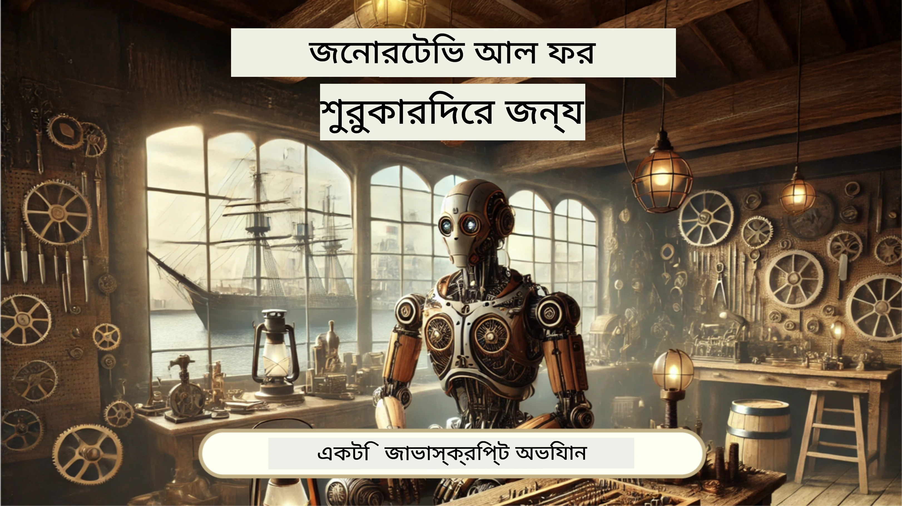
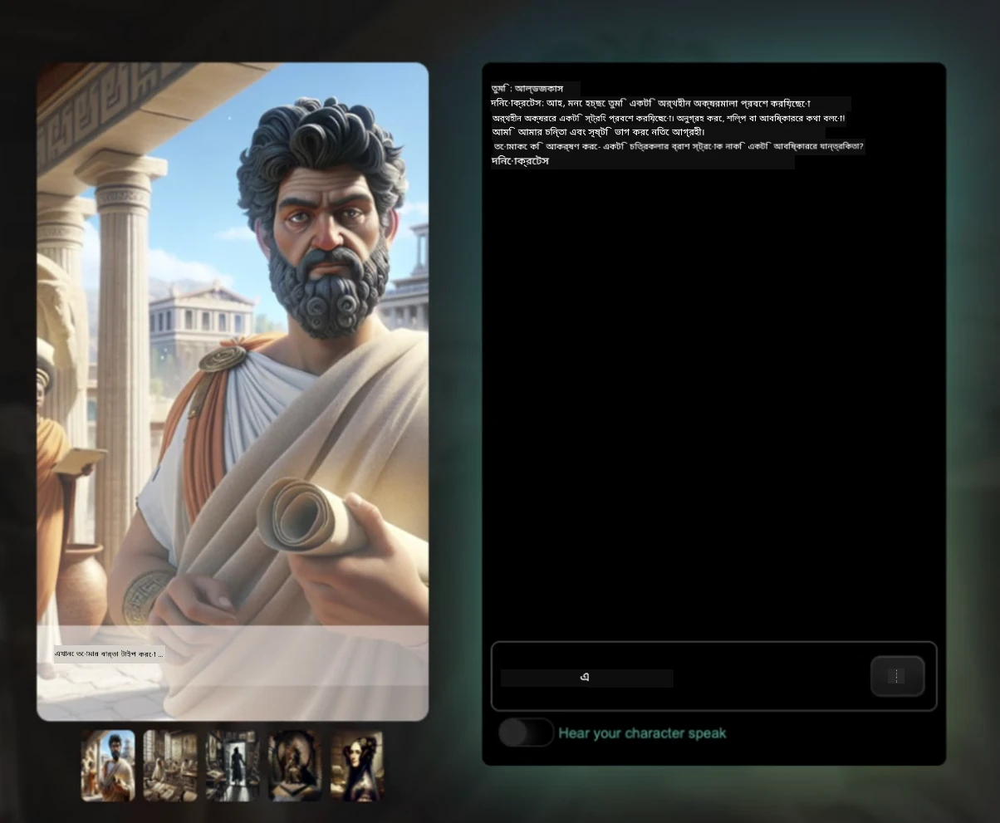
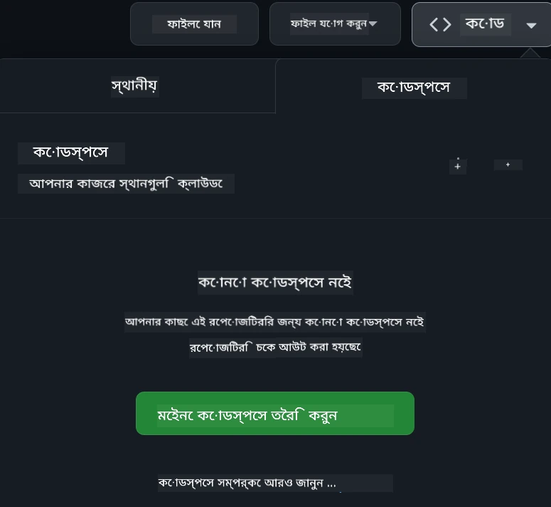

[](https://github.com/microsoft/Web-Dev-For-Beginners/blob/master/LICENSE)
[](https://GitHub.com/microsoft/Web-Dev-For-Beginners/graphs/contributors/)
[](https://GitHub.com/microsoft/Web-Dev-For-Beginners/issues/)
[](https://GitHub.com/microsoft/Web-Dev-For-Beginners/pulls/)
[](http://makeapullrequest.com) 

[](https://GitHub.com/microsoft/Web-Dev-For-Beginners/watchers/)
[](https://GitHub.com/microsoft/Web-Dev-For-Beginners/network/)
[](https://GitHub.com/microsoft/Web-Dev-For-Beginners/stargazers/)

[](https://discord.gg/nTYy5BXMWG)

# ওয়েব ডেভেলপমেন্ট ফর বিগিনার্স - একটি পাঠ্যক্রম

মাইক্রোসফট ক্লাউড অ্যাডভোকেটদের ১২-সাপ্তাহিক বিস্তৃত কোর্সের মাধ্যমে ওয়েব ডেভেলপমেন্টের মৌলিক বিষয়গুলি শিখুন। ২৪টি পাঠের প্রতিটি অংশে JavaScript, CSS, এবং HTML শেখানো হয় হাতেকলমে প্রকল্পগুলির মাধ্যমে যেমন টেরারিয়াম, ব্রাউজার এক্সটেনশন এবং স্পেস গেমস। কুইজ, আলোচনা এবং ব্যবহারিক নিয়োগগুলির মাধ্যমে অংশ নিন। আমাদের কার্যকর প্রকল্প-ভিত্তিক শিক্ষাদানের মাধ্যম দিয়ে আপনার দক্ষতা উন্নত করুন এবং জ্ঞান ধরে রাখার ক্ষমতা বৃদ্ধি করুন। আজই আপনার কোডিং যাত্রা শুরু করুন!

Azure AI Foundry Discord কমিউনিটিতে যোগ দিন

[](https://discord.gg/nTYy5BXMWG)

এই রিসোর্সগুলি ব্যবহার শুরু করার জন্য এই ধাপগুলি অনুসরণ করুন:
1. **রিপোজিটরি ফরক করুন**: ক্লিক করুন [](https://GitHub.com/microsoft/Web-Dev-For-Beginners/fork)
2. **রিপোজিটরি ক্লোন করুন**:   `git clone https://github.com/microsoft/Web-Dev-For-Beginners.git`
3. [**Azure AI Foundry Discord এ যোগ দিন এবং বিশেষজ্ঞ ও অন্যান্য ডেভেলপারদের সঙ্গে দেখা করুন**](https://discord.com/invite/ByRwuEEgH4)

### 🌐 বহুভাষা সমর্থন

#### GitHub Action দ্বারা সমর্থিত (স্বয়ংক্রিয় এবং সর্বদা আপ টু ডেট)

<!-- CO-OP TRANSLATOR LANGUAGES TABLE START -->
[Arabic](../ar/README.md) | [Bengali](./README.md) | [Bulgarian](../bg/README.md) | [Burmese (Myanmar)](../my/README.md) | [Chinese (Simplified)](../zh-CN/README.md) | [Chinese (Traditional, Hong Kong)](../zh-HK/README.md) | [Chinese (Traditional, Macau)](../zh-MO/README.md) | [Chinese (Traditional, Taiwan)](../zh-TW/README.md) | [Croatian](../hr/README.md) | [Czech](../cs/README.md) | [Danish](../da/README.md) | [Dutch](../nl/README.md) | [Estonian](../et/README.md) | [Finnish](../fi/README.md) | [French](../fr/README.md) | [German](../de/README.md) | [Greek](../el/README.md) | [Hebrew](../he/README.md) | [Hindi](../hi/README.md) | [Hungarian](../hu/README.md) | [Indonesian](../id/README.md) | [Italian](../it/README.md) | [Japanese](../ja/README.md) | [Kannada](../kn/README.md) | [Khmer](../km/README.md) | [Korean](../ko/README.md) | [Lithuanian](../lt/README.md) | [Malay](../ms/README.md) | [Malayalam](../ml/README.md) | [Marathi](../mr/README.md) | [Nepali](../ne/README.md) | [Nigerian Pidgin](../pcm/README.md) | [Norwegian](../no/README.md) | [Persian (Farsi)](../fa/README.md) | [Polish](../pl/README.md) | [Portuguese (Brazil)](../pt-BR/README.md) | [Portuguese (Portugal)](../pt-PT/README.md) | [Punjabi (Gurmukhi)](../pa/README.md) | [Romanian](../ro/README.md) | [Russian](../ru/README.md) | [Serbian (Cyrillic)](../sr/README.md) | [Slovak](../sk/README.md) | [Slovenian](../sl/README.md) | [Spanish](../es/README.md) | [Swahili](../sw/README.md) | [Swedish](../sv/README.md) | [Tagalog (Filipino)](../tl/README.md) | [Tamil](../ta/README.md) | [Telugu](../te/README.md) | [Thai](../th/README.md) | [Turkish](../tr/README.md) | [Ukrainian](../uk/README.md) | [Urdu](../ur/README.md) | [Vietnamese](../vi/README.md)

> **স্থানীয়ভাবে ক্লোন করতে চান?**
>
> এই রিপোজিটরিতে ৫০+ ভাষায় অনুবাদ রয়েছে যা ডাউনলোড সাইজ অনেক বাড়িয়ে দেয়। অনুবাদ ছাড়া ক্লোন করতে স্পারস চেকআউট ব্যবহার করুন:
>
> **Bash / macOS / Linux:**
> ```bash
> git clone --filter=blob:none --sparse https://github.com/microsoft/Web-Dev-For-Beginners.git
> cd Web-Dev-For-Beginners
> git sparse-checkout set --no-cone '/*' '!translations' '!translated_images'
> ```
>
> **CMD (Windows):**
> ```cmd
> git clone --filter=blob:none --sparse https://github.com/microsoft/Web-Dev-For-Beginners.git
> cd Web-Dev-For-Beginners
> git sparse-checkout set --no-cone "/*" "!translations" "!translated_images"
> ```
>
> এটি আপনাকে দ্রুত ডাউনলোডের মাধ্যমে কোর্সটি সম্পন্ন করার জন্য প্রয়োজনীয় সবকিছু দেবে।
<!-- CO-OP TRANSLATOR LANGUAGES TABLE END -->

**অতিরিক্ত অনুবাদের ভাষা সমর্থন করতে চাইলে এখানে তালিকাভুক্ত রয়েছে [এখানে](https://github.com/Azure/co-op-translator/blob/main/getting_started/supported-languages.md)**

[](https://open.vscode.dev/microsoft/Web-Dev-For-Beginners)

#### 🧑‍🎓 _আপনি কি একজন ছাত্র?_

[**স্টুডেন্ট হাব পেজ**](https://docs.microsoft.com/learn/student-hub/?WT.mc_id=academic-77807-sagibbon) পরিদর্শন করুন যেখানে আপনি প্রারম্ভিক রিসোর্স, ছাত্র প্যাক এবং এমনকি একটি ফ্রি সার্টিফিকেট ভাউচারের উপায় পাবেন। এটি সেই পেজ যা আপনি বুকমার্ক করে মাঝে মধ্যে চেক করবেন কারণ আমরা প্রায় মাসিকভিত্তিতে বিষয়বস্তু পরিবর্তন করি।

### 📣 ঘোষণা - নতুন GitHub Copilot Agent মোড চ্যালেঞ্জসমূহ সম্পন্ন করার জন্য!

নতুন চ্যালেঞ্জ যুক্ত হয়েছে, অধিকাংশ অধ্যায়ে "GitHub Copilot Agent Challenge 🚀" খুঁজুন। এটি একটি নতুন চ্যালেঞ্জ যা GitHub Copilot এবং Agent মোড ব্যবহার করে সম্পন্ন করতে হবে। আপনি যদি আগে Agent মোড ব্যবহার না করে থাকেন, এটি শুধু টেক্সট তৈরি নয়, ফাইল তৈরি ও সম্পাদনা, কমান্ড চালানো এবং আরও অনেক কাজ করতে সক্ষম।

### 📣 ঘোষণা - _Generative AI ব্যবহার করে নতুন প্রকল্প তৈরি_

নতুন AI সহকারী প্রকল্প সাম্প্রতিক যোগ হয়েছে, এটি পরীক্ষা করুন [প্রকল্প](./9-chat-project/README.md)

### 📣 ঘোষণা - _Generative AI বিষয়ক নতুন পাঠ্যক্রম_ JavaScript এর জন্য এখন প্রকাশিত হয়েছে

আমাদের নতুন Generative AI পাঠ্যক্রম মিস করবেন না!

শুরু করতে যান [https://aka.ms/genai-js-course](https://aka.ms/genai-js-course) এ!



- মৌলিক থেকে RAG পর্যন্ত সমস্ত বিষয় শেখানো হয়েছে।
- ইতিহাসের চরিত্রদের সঙ্গে GenAI ও আমাদের সঙ্গী অ্যাপ ব্যবহার করে মিথস্ক্রিয়া করুন।
- মজাদার এবং আকর্ষণীয় বর্ণনা, আপনি সময় ভ্রমণে যাচ্ছেন!



প্রতিটি পাঠে রয়েছে সম্পন্ন করার জন্য নিয়োগ, একটি জ্ঞানের পরীক্ষা এবং একটি চ্যালেঞ্জ, যা আপনাকে শিখতে সাহায্য করবে যেমন:
- প্রম্পটিং এবং প্রম্পট ইঞ্জিনিয়ারিং
- টেক্সট ও ইমেজ অ্যাপ তৈরি
- সার্চ অ্যাপস

শুরু করতে যান [https://aka.ms/genai-js-course](https://aka.ms/genai-js-course) এ!


## 🌱 শুরু করা

> **শিক্ষকগণ**, আমরা [কিছু প্রস্তাবনা অন্তর্ভুক্ত করেছি](for-teachers.md) এই পাঠ্যক্রমটি ব্যবহার করার জন্য। আপনার মতামত আমাদের [আলোচনা ফোরামে](https://github.com/microsoft/Web-Dev-For-Beginners/discussions/categories/teacher-corner) শেয়ার করতে চাইব!

**[শিক্ষার্থীগণ](https://aka.ms/student-page/?WT.mc_id=academic-77807-sagibbon)**, প্রতিটি পাঠের জন্য, একটি প্রাক-লেকচার কুইজ দিয়ে শুরু করুন এবং লেকচার উপকরণ পড়ে, বিভিন্ন কার্যকলাপ সম্পন্ন করুন এবং পরবর্তী-লেকচার কুইজের মাধ্যমে আপনার বোঝাপড়া যাচাই করুন।

আপনার শেখার অভিজ্ঞতা উন্নত করার জন্য, সহপাঠীদের সঙ্গে প্রকল্পে একসঙ্গে কাজ করার জন্য সংযুক্ত হোন! আমাদের [আলোচনা ফোরামে](https://github.com/microsoft/Web-Dev-For-Beginners/discussions) আলোচনা উৎসাহিত এবং সেখানে আমাদের মনিটারিং টিম আপনার প্রশ্নের উত্তর দেবে।

আপনার শিক্ষাকে আরও বাড়াতে, আমরা অতিরিক্ত অধ্যয়নের জন্য [Microsoft Learn](https://learn.microsoft.com/users/wirelesslife/collections/p1ddcy5jwy0jkm?WT.mc_id=academic-77807-sagibbon) অন্বেষণ করার পরামর্শ দিই।

### 📋 আপনার পরিবেশ সেটআপ করা

এই পাঠ্যক্রমের জন্য একটি ডেভেলপমেন্ট পরিবেশ প্রস্তুত আছে! শুরু করার সময় আপনি এই পাঠ্যক্রমটি চালাতে পারবেন একটি [Codespace](https://github.com/features/codespaces/) (_একটি ব্রাউজার-ভিত্তিক, ইনস্টলেশনের প্রয়োজনহীন পরিবেশ_), অথবা স্থানীয়ভাবে আপনার কম্পিউটারে [Visual Studio Code](https://code.visualstudio.com/?WT.mc_id=academic-77807-sagibbon) এর মতো একটি টেক্সট এডিটর ব্যবহার করে।

#### আপনার রিপোজিটরি তৈরি করুন
আপনার কাজ সহজে সংরক্ষণ করার জন্য, আপনার নিজস্ব একটি কপি তৈরি করার সুপারিশ করা হয়। এটি করতে, এই পৃষ্ঠার উপরের দিকে "Use this template" বোতামে ক্লিক করুন। এটি আপনার GitHub অ্যাকাউন্টে একটি নতুন রিপোজিটরি তৈরি করবে যার মধ্যে পাঠ্যক্রমের একটি কপি থাকবে।

এই ধাপগুলি অনুসরণ করুন:
1. **রিপোজিটরি ফরক করুন**: এই পৃষ্ঠার উপরের ডানদিকে কোণে "Fork" বোতামে ক্লিক করুন।
2. **রিপোজিটরি ক্লোন করুন**:   `git clone https://github.com/microsoft/Web-Dev-For-Beginners.git`

#### Codespace এ পাঠ্যক্রম চালানো

আপনি যে কপি তৈরি করেছেন, সেখানে **Code** বোতাম ক্লিক করুন এবং **Open with Codespaces** নির্বাচন করুন। এটি একটি নতুন Codespace তৈরি করবে যেখানে আপনি কাজ করতে পারবেন।



#### স্থানীয়ভাবে আপনার কম্পিউটারে পাঠ্যক্রম চালানো

এই পাঠ্যক্রম স্থানীয়ভাবে চালাতে আপনার একটি টেক্সট এডিটর, একটি ব্রাউজার এবং একটি কমান্ড লাইন টুলের প্রয়োজন হবে। আমাদের প্রথম পাঠ, [Introduction to Programming Languages and Tools of the Trade](../../1-getting-started-lessons/1-intro-to-programming-languages), আপনাকে বিভিন্ন টুলের বিকল্পগুলি দেখিয়ে দেবে যাতে আপনি আপনার পছন্দের নির্বাচন করতে পারেন।

আমাদের সুপারিশ হল [Visual Studio Code](https://code.visualstudio.com/?WT.mc_id=academic-77807-sagibbon) ব্যবহার করা, যেটির একটি বিল্ট-ইন [Terminal](https://code.visualstudio.com/docs/terminal/basics/?WT.mc_id=academic-77807-sagibbon) রয়েছে। Visual Studio Code ডাউনলোড করতে পারেন [এখানে](https://code.visualstudio.com/?WT.mc_id=academic-77807-sagibbon)।
1. আপনার কম্পিউটারে আপনার রিপোজিটরি ক্লোন করুন। আপনি এটি করতে পারেন **Code** বোতামে ক্লিক করে এবং URL কপি করে:

    [CodeSpace](./images/createcodespace.png)

    তারপর, [Visual Studio Code](https://code.visualstudio.com/?WT.mc_id=academic-77807-sagibbon) এর মধ্যে [Terminal](https://code.visualstudio.com/docs/terminal/basics/?WT.mc_id=academic-77807-sagibbon) খুলুন এবং নীচের কমান্ডটি চালান, `<your-repository-url>` এর পরিবর্তে আপনি যে URL কপি করেছেন তা বসান:

    ```bash 
    git clone <your-repository-url>
    ```

2. ভিজুয়াল স্টুডিও কোডে ফোল্ডারটি খুলুন। আপনি এটি করতে পারেন **File** > **Open Folder** এ ক্লিক করে এবং আপনি যা ক্লোন করেছেন সেই ফোল্ডারটি নির্বাচন করে।

>  সুপারিশকৃত ভিজুয়াল স্টুডিও কোড এক্সটেনশনসমূহ:
>
> * [Live Server](https://marketplace.visualstudio.com/items?itemName=ritwickdey.LiveServer&WT.mc_id=academic-77807-sagibbon) - ভিজুয়াল স্টুডিও কোডের মধ্যে HTML পৃষ্ঠাগুলো প্রিভিউ করার জন্য
> * [Copilot](https://marketplace.visualstudio.com/items?itemName=GitHub.copilot&WT.mc_id=academic-77807-sagibbon) - কোড দ্রুত লেখায় সাহায্য করার জন্য

## 📂 প্রতিটি পাঠে আছে:

- ঐচ্ছিক স্কেচ নোট
- ঐচ্ছিক সম্পূরক ভিডিও
- পাঠের আগে ওয়ার্মআপ কুইজ
- লিখিত পাঠ
- প্রকল্প-ভিত্তিক পাঠগুলোর জন্য, প্রকল্প তৈরির ধাপে ধাপে গাইড
- জ্ঞানের যাচাই
- একটি চ্যালেঞ্জ
- পরিপূরক পড়াশোনা
- অ্যাসাইনমেন্ট
- [পাঠ পরবর্তী কুইজ](https://ff-quizzes.netlify.app/web/)

> **কুইজ সম্পর্কে একটি নোট**: সমস্ত কুইজ Quiz-app ফোল্ডারে রয়েছে, মোট ৪৮ টি কুইজ, প্রতিটি তিনটি প্রশ্নের। সেগুলো এখানে উপলভ্য [এখানে](https://ff-quizzes.netlify.app/web/)। কুইজ অ্যাপ স্থানীয়ভাবে চালানো বা Azure এ ডিপ্লয় করা যেতে পারে; নির্দেশনা `quiz-app` ফোল্ডারে অনুসরণ করুন।

## 🗃️ পাঠসমূহ

|     |                       প্রকল্পের নাম                       |                            শেখানো ধারণাসমূহ                             | শেখার উদ্দেশ্য                                                                                                                 |                                                         লিঙ্ক করা পাঠ                                                          |         লেখক          |
| :-: | :------------------------------------------------------: | :--------------------------------------------------------------------: | ----------------------------------------------------------------------------------------------------------------------------------- | :----------------------------------------------------------------------------------------------------------------------------: | :---------------------: |
| 01  |                     Getting Started                      |           প্রোগ্রামিংয়ের পরিচিতি এবং টুলস অব দ্য ট্রেড           | অধিকাংশ প্রোগ্রামিং ভাষার মৌলিক ধারণা ও সফটওয়্যার সম্পর্কে শিখুন যা পেশাদার ডেভেলপারদের কাজকে সাহায্য করে | [Intro to Programming Languages and Tools of the Trade](./1-getting-started-lessons/1-intro-to-programming-languages/README.md) |         Jasmine         |
| 02  |                     Getting Started                      |             গিটহাবের বেসিকস, দলের সাথে কাজসহ             | আপনার প্রকল্পে গিটহাব কীভাবে ব্যবহার করবেন, কীভাবে অন্যদের সঙ্গে কোড বেসে সহযোগিতা করবেন |                            [Intro to GitHub](./1-getting-started-lessons/2-github-basics/README.md)                             |          Floor          |
| 03  |                     Getting Started                      |                             প্রবেশযোগ্যতা                              | ওয়েব প্রবেশযোগ্যতার মৌলিক ধারণা শিখুন                                                                                               |                       [Accessibility Fundamentals](./1-getting-started-lessons/3-accessibility/README.md)                       |       Christopher       |
| 04  |                        JS Basics                         |                         জাভাস্ক্রিপ্ট ডেটা টাইপস                          | জাভাস্ক্রিপ্ট ডেটা টাইপের বেসিকস                                                                                                 |                                       [Data Types](./2-js-basics/1-data-types/README.md)                                        |         Jasmine         |
| 05  |                        JS Basics                         |                         ফাংশন এবং মেথডস                          | অ্যাপ্লিকেশনের লজিক ফ্লো পরিচালনার জন্য ফাংশন এবং মেথড সম্পর্কে শিখুন                                                             |                              [Functions and Methods](./2-js-basics/2-functions-methods/README.md)                               | Jasmine and Christopher |
| 06  |                        JS Basics                         |                        জাভাস্ক্রিপ্ট দিয়ে সিদ্ধান্ত নেওয়া                        | কোডে শর্ত তৈরি করা শিখুন, সিদ্ধান্ত গ্রহণ পদ্ধতি ব্যবহার করে                                                           |                                 [Making Decisions](./2-js-basics/3-making-decisions/README.md)                                  |         Jasmine         |
| 07  |                        JS Basics                         |                            অ্যারে ও লুপ                            | জাভাস্ক্রিপ্টে অ্যারে এবং লুপ ব্যবহার করে ডেটার সাথে কাজ করুন                                                                                 |                                   [Arrays and Loops](./2-js-basics/4-arrays-loops/README.md)                                    |         Jasmine         |
| 08  |       [Terrarium](./3-terrarium/solution/README.md)       |                            HTML অনুশীলন                            | একটি অনলাইন টেরারিয়াম তৈরি করার জন্য HTML নির্মাণ করুন, লেআউট তৈরিতে ফোকাস করুন                                                         |                                 [Introduction to HTML](./3-terrarium/1-intro-to-html/README.md)                                 |           Jen           |
| 09  |       [Terrarium](./3-terrarium/solution/README.md)       |                            CSS অনুশীলন                             | অনলাইন টেরারিয়াম স্টাইল করতে CSS তৈরি করুন, পৃষ্ঠাটিকে প্রতিক্রিয়াশীল করতে CSS এর বেসিকস সহ ফোকাস দিন                     |                                  [Introduction to CSS](./3-terrarium/2-intro-to-css/README.md)                                  |           Jen           |
| 10  |            [Terrarium](./3-terrarium/solution/README.md)            |                 জাভাস্ক্রিপ্ট ক্লোজার, DOM ম্যানিপুলেশন                  | টেরারিয়ামকে ড্র্যাগ/ড্রপ ইন্টারফেসে কাজ করানোর জন্য জাভাস্ক্রিপ্ট তৈরি করুন, ক্লোজার এবং DOM ম্যানিপুলেশনে মনোযোগ দিন             |                  [JavaScript Closures, DOM manipulation](./3-terrarium/3-intro-to-DOM-and-closures/README.md)                   |           Jen           |
| 11  |          [Typing Game](./4-typing-game/solution/README.md)          |                          টাইপিং গেম তৈরি                           | কী-বোর্ড ইভেন্ট ব্যবহার করে আপনার জাভাস্ক্রিপ্ট অ্যাপের লজিক চালানো শিখুন                                                          |                                [Event-Driven Programming](./4-typing-game/typing-game/README.md)                                |       Christopher       |
| 12  | [Green Browser Extension](./5-browser-extension/solution/README.md) |                         ব্রাউজার নিয়ে কাজ                          | ব্রাউজার কীভাবে কাজ করে, এর ইতিহাস, এবং ব্রাউজার এক্সটেনশনের প্রথম উপাদানগুলি তৈরি করার পদ্ধতি শিখুন                               |                               [About Browsers](./5-browser-extension/1-about-browsers/README.md)                                |           Jen           |
| 13  | [Green Browser Extension](./5-browser-extension/solution/README.md) | ফর্ম তৈরি, API কল এবং লোকাল স্টোরেজে ভেরিয়েবল সংরক্ষণ | আপনার ব্রাউজার এক্সটেনশনের জাভাস্ক্রিপ্ট উপাদান তৈরি করুন API কল করার জন্য, লোকাল স্টোরেজে সংরক্ষিত ভেরিয়েবল ব্যবহার করুন                      |                [APIs, Forms, and Local Storage](./5-browser-extension/2-forms-browsers-local-storage/README.md)                 |           Jen           |
| 14  | [Green Browser Extension](./5-browser-extension/solution/README.md) |          ব্রাউজারের ব্যাকগ্রাউন্ড প্রসেস, ওয়েব পারফরমেন্স          | এক্সটেনশনের আইকন পরিচালনার জন্য ব্রাউজারের ব্যাকগ্রাউন্ড প্রসেস ব্যবহার করুন; ওয়েব পারফরমেন্স এবং কিছু অপ্টিমাইজেশন শিখুন   |             [Background Tasks and Performance](./5-browser-extension/3-background-tasks-and-performance/README.md)              |           Jen           |
| 15  |           [Space Game](./6-space-game/solution/README.md)           |             জাভাস্ক্রিপ্ট দিয়ে আরও উন্নত গেম ডেভেলপমেন্ট             | ক্লাস এবং কম্পোজিশন ব্যবহার করে ইনহেরিট্যান্স ও পাব/সাব প্যাটার্ন শিখুন, একটি গেম তৈরির প্রস্তুতিতে              |                      [Introduction to Advanced Game Development](./6-space-game/1-introduction/README.md)                       |          Chris          |
| 16  |           [Space Game](./6-space-game/solution/README.md)           |                           ক্যানভাসে আঁকা                            | একটি স্ক্রিনে উপাদান আঁকার জন্য ব্যবহৃত Canvas API শিখুন                                                                       |                                [Drawing to Canvas](./6-space-game/2-drawing-to-canvas/README.md)                                |          Chris          |
| 17  |           [Space Game](./6-space-game/solution/README.md)           |                   স্ক্রিনে উপাদান স্থানান্তর                    | কাকে Cartesian কোঅর্ডিনেট এবং Canvas API ব্যবহার করে উপাদানগুলো কীভাবে মুভ করে তা আবিষ্কার করুন                                            |                           [Moving Elements Around](./6-space-game/3-moving-elements-around/README.md)                           |          Chris          |
| 18  |           [Space Game](./6-space-game/solution/README.md)           |                          সংঘর্ষ সনাক্তকরণ                           | কীপ্রেস ব্যবহার করে উপাদানগুলোকে সংঘর্ষ করান এবং প্রতিক্রিয়া দেখান, গেমের পারফরমেন্সের জন্য কুলডাউন ফাংশন প্রদান করুন    |                              [Collision Detection](./6-space-game/4-collision-detection/README.md)                              |          Chris          |
| 19  |           [Space Game](./6-space-game/solution/README.md)           |                             স্কোর রাখা                              | গেমের অবস্থা এবং পারফরমেন্সের ভিত্তিতে গাণিতিক হিসাব করুন                                                                |                                    [Keeping Score](./6-space-game/5-keeping-score/README.md)                                    |          Chris          |
| 20  |           [Space Game](./6-space-game/solution/README.md)           |                     গেম শেষ করা এবং পুনরায় শুরু করা                     | গেম শেষ এবং পুনরায় শুরু করার বিষয়ে শিখুন, যার মধ্যে অ্যাসেট পরিষ্কার করা এবং ভেরিয়েবল মান রিসেট করা রয়েছে                              |                                [The Ending Condition](./6-space-game/6-end-condition/README.md)                                 |          Chris          |
| 21  |         [Banking App](./7-bank-project/solution/README.md)          |                 ওয়েব অ্যাপে HTML টেমপ্লেট এবং রুটস                 | রাউটিং এবং HTML টেমপ্লেট ব্যবহার করে মাল্টিপেজ ওয়েবসাইট আর্কিটেকচারের শারীরিক কাঠামো তৈরি করা শিখুন                             |                            [HTML Templates and Routes](./7-bank-project/1-template-route/README.md)                             |          Yohan          |
| 22  |         [Banking App](./7-bank-project/solution/README.md)          |                  লগইন এবং রেজিস্ট্রেশন ফর্ম তৈরি                   | ফর্ম তৈরি এবং ভ্যালিডেশন রুটিন পরিচালনা সম্পর্কে শিখুন                                                                          |                                           [Forms](./7-bank-project/2-forms/README.md)                                           |          Yohan          |
| 23  |         [Banking App](./7-bank-project/solution/README.md)          |                   ডেটা আহরণ এবং ব্যবহার পদ্ধতি                   | আপনার অ্যাপে ডেটা প্রবাহের গতি, কীভাবে ডেটা আহরণ করবেন, সংরক্ষণ করবেন এবং কিভাবে এটি অপসারণ করবেন তা শিখুন                                                 |                                            [Data](./7-bank-project/3-data/README.md)                                            |          Yohan          |
| 24  |         [Banking App](./7-bank-project/solution/README.md)          |                      স্টেট ম্যানেজমেন্টের ধারণা                      | আপনার অ্যাপ কীভাবে স্টেট ধরে রাখে এবং প্রোগ্রাম্যাটিকভাবে কীভাবে এটি পরিচালনা করবেন তা শিখুন                                                              |                                [State Management](./7-bank-project/4-state-management/README.md)                                |          Yohan          |
| 25 | [Browser/VScode Code](../../8-code-editor) | VSCode সাথে কাজ করা | কীভাবে কোড এডিটর ব্যবহার করবেন তা শিখুন | [Use VScode Code Editor](./8-code-editor/1-using-a-code-editor/README.md) | Chris |
| 26 | [AI Assistants](./9-chat-project/README.md) | AI নিয়ে কাজ করা | নিজের AI সহকারী তৈরি শিখুন | [AI Assistant project](./9-chat-project/README.md) | Chris |

## 🏫 শিক্ষা প্রক্রিয়া

আমাদের পাঠ্যক্রম দুটি মূল শিক্ষাবিধির নীতির উপর ভিত্তি করে ডিজাইন করা হয়েছে:
* প্রকল্প-ভিত্তিক শিক্ষা
* ঘন ঘন কুইজ

প্রোগ্রামটি জাভাস্ক্রিপ্ট, HTML, এবং CSS এর মৌলিক বিষয়াদি শেখায়, পাশাপাশি আজকের ওয়েব ডেভেলপারদের দ্বারা ব্যবহৃত সর্বশেষ টুল এবং কৌশল। শিক্ষার্থীরা টাইপিং গেম, ভার্চুয়াল টেরারিয়াম, পরিবেশ বান্ধব ব্রাউজার এক্সটেনশন, স্পেস-ইনভেডার-স্টাইল গেম এবং ব্যবসায়িক ব্যাংকিং অ্যাপ তৈরি করে হাতে কলমে অভিজ্ঞতা অর্জন করবে। সিরিজের শেষে শিক্ষার্থীরা ওয়েব ডেভেলপমেন্টে শক্তিশালী ধারণা অর্জন করবে।

> 🎓 এই পাঠ্যক্রমের প্রথম কয়েকটি পাঠ আপনি [Microsoft Learn](https://docs.microsoft.com/learn/paths/web-development-101/?WT.mc_id=academic-77807-sagibbon) এ একটি [Learn Path](https://docs.microsoft.com/learn/paths/web-development-101/?WT.mc_id=academic-77807-sagibbon) হিসেবে নিতে পারেন!

বিষয়বস্তু প্রকল্পগুলির সাথে সঙ্গতিপূর্ণ রাখার মাধ্যমে, শিক্ষার্থীদের জন্য প্রক্রিয়াটি আকর্ষণীয় হয় এবং ধারণাগুলোর ধারণক্ষমতা বৃদ্ধি পায়। আমরা কয়েকটি শুরুত্বর পাঠ লিখেছি জাভাস্ক্রিপ্ট বেসিকস-এ ধারণাগুলি পরিচয় করানোর জন্য, যার সাথে রয়েছে "[Beginners Series to: JavaScript](https://channel9.msdn.com/Series/Beginners-Series-to-JavaScript/?WT.mc_id=academic-77807-sagibbon)" ভিডিও টিউটোরিয়ালের একটি ভিডিও, যাদের কিছু লেখক এই পাঠ্যক্রমে অবদান রেখেছেন।

অতিরিক্তভাবে, ক্লাসের আগে একটি কম চাপের কুইজ শিক্ষার্থীর শেখার উদ্দেশ্য নির্ধারণ করে, আর ক্লাসের পরে দ্বিতীয় কুইজ ধারণক্ষমতা বাড়ায়। এই পাঠ্যক্রমটি নমনীয় এবং মজাদার করার জন্য ডিজাইন করা হয়েছে এবং পুরো বা আংশিক অংশ হিসেবে নেওয়া যেতে পারে। প্রকল্পগুলি ছোট থেকে শুরু করে ১২ সপ্তাহের শেষে ক্রমাগত জটিলতর হয়।

যদিও আমরা সচেতনভাবেই জাভাস্ক্রিপ্ট ফ্রেমওয়ার্ক পরিচয় করানো থেকে বিরত রয়েছি যেন মৌলিক দক্ষতাগুলোর প্রতি মনোযোগ দেয়া যায়, একটি ভালো পরবর্তী ধাপ হিসেবে এই পাঠ্যক্রম সম্পন্ন করার পর Node.js সম্পর্কে শেখা হতে পারে যা আরেক ভিডিও সংগ্রহ "[Beginner Series to: Node.js](https://channel9.msdn.com/Series/Beginners-Series-to-Nodejs/?WT.mc_id=academic-77807-sagibbon)" এ পাওয়া যাবে।

> আমাদের [Code of Conduct](CODE_OF_CONDUCT.md) এবং [Contributing](CONTRIBUTING.md) নির্দেশিকা দেখুন। আমরা আপনার গঠনমূলক মতামতকে স্বাগত জানাই!

## 🧭 অফলাইন অ্যাক্সেস

আপনি [Docsify](https://docsify.js.org/#/) ব্যবহার করে এই ডকুমেন্টেশন অফলাইনে চালাতে পারেন। এই রিপোটি ফর্ক করুন, আপনার লোকাল মেশিনে [Docsify ইনস্টল করুন](https://docsify.js.org/#/quickstart), এবং তারপর এই রিপোর মূল ফোল্ডারে `docsify serve` টাইপ করুন। ওয়েবসাইটটি আপনার লোকালহোস্টে পোর্ট ৩০০০ এ চালু হবে: `localhost:3000`।

## 📘 PDF
সব পাঠের একটি পিডিএফ এখানে পাওয়া যাবে [here](https://microsoft.github.io/Web-Dev-For-Beginners/pdf/readme.pdf)।

## 🎒 অন্যান্য কোর্স

আমাদের দল আরও কোর্স তৈরি করে! দেখুন:

<!-- CO-OP TRANSLATOR OTHER COURSES START -->
### LangChain
[](https://aka.ms/langchain4j-for-beginners)
[](https://aka.ms/langchainjs-for-beginners?WT.mc_id=m365-94501-dwahlin)
[](https://github.com/microsoft/langchain-for-beginners?WT.mc_id=m365-94501-dwahlin)
---

### Azure / Edge / MCP / Agents
[](https://github.com/microsoft/AZD-for-beginners?WT.mc_id=academic-105485-koreyst)
[](https://github.com/microsoft/edgeai-for-beginners?WT.mc_id=academic-105485-koreyst)
[](https://github.com/microsoft/mcp-for-beginners?WT.mc_id=academic-105485-koreyst)
[](https://github.com/microsoft/ai-agents-for-beginners?WT.mc_id=academic-105485-koreyst)

---
 
### জেনেরেটিভ AI সিরিজ
[](https://github.com/microsoft/generative-ai-for-beginners?WT.mc_id=academic-105485-koreyst)
[-9333EA?style=for-the-badge&labelColor=E5E7EB&color=9333EA)](https://github.com/microsoft/Generative-AI-for-beginners-dotnet?WT.mc_id=academic-105485-koreyst)
[-C084FC?style=for-the-badge&labelColor=E5E7EB&color=C084FC)](https://github.com/microsoft/generative-ai-for-beginners-java?WT.mc_id=academic-105485-koreyst)
[-E879F9?style=for-the-badge&labelColor=E5E7EB&color=E879F9)](https://github.com/microsoft/generative-ai-with-javascript?WT.mc_id=academic-105485-koreyst)

---
 
### কোর লার্নিং
[](https://aka.ms/ml-beginners?WT.mc_id=academic-105485-koreyst)
[](https://aka.ms/datascience-beginners?WT.mc_id=academic-105485-koreyst)
[](https://aka.ms/ai-beginners?WT.mc_id=academic-105485-koreyst)
[](https://github.com/microsoft/Security-101?WT.mc_id=academic-96948-sayoung)
[](https://aka.ms/webdev-beginners?WT.mc_id=academic-105485-koreyst)
[](https://aka.ms/iot-beginners?WT.mc_id=academic-105485-koreyst)
[](https://github.com/microsoft/xr-development-for-beginners?WT.mc_id=academic-105485-koreyst)

---
 
### কপিলট সিরিজ
[](https://aka.ms/GitHubCopilotAI?WT.mc_id=academic-105485-koreyst)
[](https://github.com/microsoft/mastering-github-copilot-for-dotnet-csharp-developers?WT.mc_id=academic-105485-koreyst)
[](https://github.com/microsoft/CopilotAdventures?WT.mc_id=academic-105485-koreyst)
<!-- CO-OP TRANSLATOR OTHER COURSES END -->

## সাহায্য পাওয়া

যদি আপনি আটকে যান বা AI অ্যাপ নির্মাণ সম্পর্কে কোনো প্রশ্ন থাকে। MCP সম্পর্কে fellow learners এবং অভিজ্ঞ ডেভেলপারদের আলোচনায় যোগ দিন। এটি একটি সহায়ক কমিউনিটি যেখানে প্রশ্ন স্বাগত এবং জ্ঞান মুক্তভাবে শেয়ার করা হয়।

[](https://discord.gg/nTYy5BXMWG)

আপনার যদি পণ্য সংক্রান্ত প্রতিক্রিয়া বা নির্মাণের সময় ত্রুটি থাকে, তাহলে দেখুন:

[](https://aka.ms/foundry/forum)

## লাইসেন্স

এই রিপোজিটরি MIT লাইসেন্সের আওতায় লাইসেন্সপ্রাপ্ত। আরও তথ্যের জন্য [LICENSE](../../LICENSE) ফাইল দেখুন।

---

<!-- CO-OP TRANSLATOR DISCLAIMER START -->
**স্পষ্টীকরণ**:  
এই নথিটি AI অনুবাদ সেবা [Co-op Translator](https://github.com/Azure/co-op-translator) ব্যবহার করে অনূদিত হয়েছে। যদিও আমরা সঠিকতার জন্য চেষ্টা করি, অনুগ্রহ করে মনে রাখবেন যে স্বয়ংক্রিয় অনুবাদে ত্রুটি বা অসঙ্গতি থাকতে পারে। মূল নথিটি তার নিজস্ব ভাষায়ই প্রামাণিক উৎস হিসাবে বিবেচিত হওয়া উচিত। গুরুত্বপূর্ণ তথ্যের জন্য, পেশাদার মানব অনুবাদ সুপারিশ করা হয়। এই অনুবাদের ব্যবহারের ফলে যে কোনও ভুল বোঝাবুঝি বা ভুল ব্যাখ্যার জন্য আমরা দায়ী নই।
<!-- CO-OP TRANSLATOR DISCLAIMER END -->