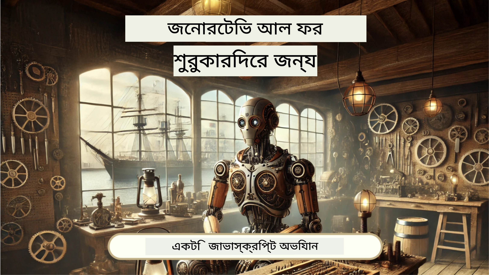
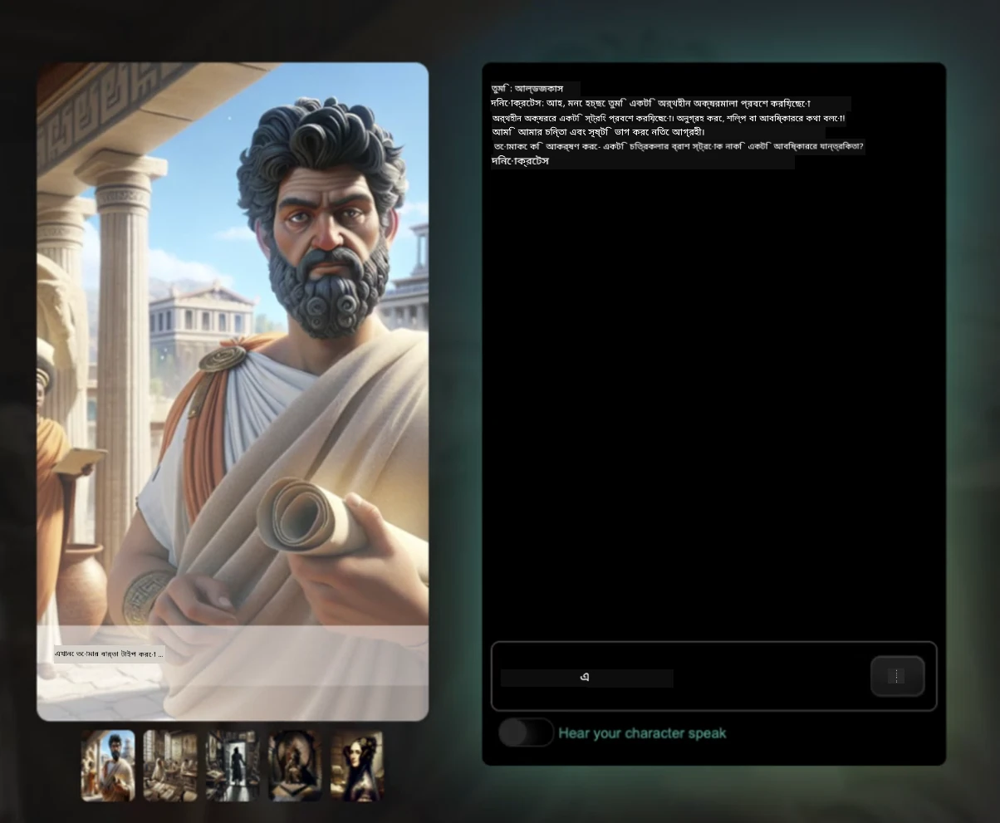
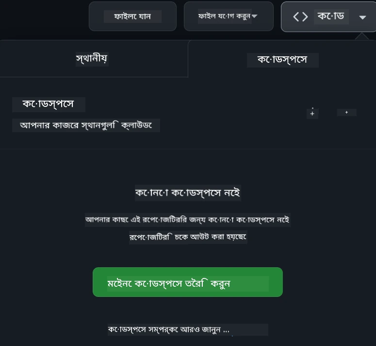

[](https://github.com/microsoft/Web-Dev-For-Beginners/blob/master/LICENSE)
[](https://GitHub.com/microsoft/Web-Dev-For-Beginners/graphs/contributors/)
[](https://GitHub.com/microsoft/Web-Dev-For-Beginners/issues/)
[](https://GitHub.com/microsoft/Web-Dev-For-Beginners/pulls/)
[](http://makeapullrequest.com) 

[](https://GitHub.com/microsoft/Web-Dev-For-Beginners/watchers/)
[](https://GitHub.com/microsoft/Web-Dev-For-Beginners/network/)
[](https://GitHub.com/microsoft/Web-Dev-For-Beginners/stargazers/)

[](https://discord.gg/nTYy5BXMWG)

# নবশিখিদের জন্য ওয়েব ডেভেলপমেন্ট - একটি পাঠ্যক্রম

Microsoft Cloud Advocates দ্বারা পরিচালিত আমাদের ১২ সপ্তাহের বিস্তৃত কোর্সের মাধ্যমে ওয়েব ডেভেলপমেন্টের মূলতত্ব শিখুন। ২৪টি পাঠের প্রত্যেকটি জাভাস্ক্রিপ্ট, CSS এবং HTML-এর উপর গভীরভাবে মনোযোগ দেয়, যেখানে হাতেকলমে প্রকল্পগুলি যেমন টেরারিয়াম, ব্রাউজার এক্সটেনশন, এবং স্পেস গেমস অন্তর্ভুক্ত। কুইজ, আলোচনা, এবং ব্যবহারিক অ্যাসাইনমেন্টগুলোর মাধ্যমে সম্পৃক্ত থাকুন। আমাদের কার্যকর প্রকল্প-ভিত্তিক পদ্ধতির মাধ্যমে দক্ষতা বাড়ান এবং আপনার জ্ঞান সংরক্ষণ উন্নত করুন। আজই আপনার কোডিং যাত্রা শুরু করুন!

Azure AI Foundry Discord-এ যোগ দিন এবং বিশেষজ্ঞ ও অন্যান্য ডেভেলপারদের সাথে পরিচিত হন।

[](https://discord.gg/nTYy5BXMWG)

এই সম্পদগুলি ব্যবহার শুরু করতে নিচের ধাপগুলি অনুসরণ করুন:
1. **রিপোজিটরিটি ফর্ক করুন**: ক্লিক করুন [](https://GitHub.com/microsoft/Web-Dev-For-Beginners/fork)
2. **রিপোজিটরিটি ক্লোন করুন**:   `git clone https://github.com/microsoft/Web-Dev-For-Beginners.git`
3. [**Azure AI Foundry Discord-এ যোগ দিন এবং বিশেষজ্ঞ ও অন্যান্য ডেভেলপারদের সাথে পরিচিত হন**](https://discord.com/invite/ByRwuEEgH4)

### 🌐 বহু-ভাষা সমর্থন

#### GitHub Action-এর মাধ্যমে সমর্থিত (স্বয়ংক্রিয় এবং সর্বদা হালনাগাদ)

<!-- CO-OP TRANSLATOR LANGUAGES TABLE START -->
[Arabic](../ar/README.md) | [Bengali](./README.md) | [Bulgarian](../bg/README.md) | [Burmese (Myanmar)](../my/README.md) | [Chinese (Simplified)](../zh-CN/README.md) | [Chinese (Traditional, Hong Kong)](../zh-HK/README.md) | [Chinese (Traditional, Macau)](../zh-MO/README.md) | [Chinese (Traditional, Taiwan)](../zh-TW/README.md) | [Croatian](../hr/README.md) | [Czech](../cs/README.md) | [Danish](../da/README.md) | [Dutch](../nl/README.md) | [Estonian](../et/README.md) | [Finnish](../fi/README.md) | [French](../fr/README.md) | [German](../de/README.md) | [Greek](../el/README.md) | [Hebrew](../he/README.md) | [Hindi](../hi/README.md) | [Hungarian](../hu/README.md) | [Indonesian](../id/README.md) | [Italian](../it/README.md) | [Japanese](../ja/README.md) | [Kannada](../kn/README.md) | [Khmer](../km/README.md) | [Korean](../ko/README.md) | [Lithuanian](../lt/README.md) | [Malay](../ms/README.md) | [Malayalam](../ml/README.md) | [Marathi](../mr/README.md) | [Nepali](../ne/README.md) | [Nigerian Pidgin](../pcm/README.md) | [Norwegian](../no/README.md) | [Persian (Farsi)](../fa/README.md) | [Polish](../pl/README.md) | [Portuguese (Brazil)](../pt-BR/README.md) | [Portuguese (Portugal)](../pt-PT/README.md) | [Punjabi (Gurmukhi)](../pa/README.md) | [Romanian](../ro/README.md) | [Russian](../ru/README.md) | [Serbian (Cyrillic)](../sr/README.md) | [Slovak](../sk/README.md) | [Slovenian](../sl/README.md) | [Spanish](../es/README.md) | [Swahili](../sw/README.md) | [Swedish](../sv/README.md) | [Tagalog (Filipino)](../tl/README.md) | [Tamil](../ta/README.md) | [Telugu](../te/README.md) | [Thai](../th/README.md) | [Turkish](../tr/README.md) | [Ukrainian](../uk/README.md) | [Urdu](../ur/README.md) | [Vietnamese](../vi/README.md)

> **স্থানীয়ভাবে ক্লোন করতে পছন্দ করেন?**
>
> এই রিপোজিটরিতে ৫০+ ভাষার অনুবাদ রয়েছে যা ডাউনলোড সাইজ উল্লেখযোগ্যভাবে বৃদ্ধি করে। অনুবাদ ছাড়া ক্লোন করতে, স্পার্স চেকআউট ব্যবহার করুন:
>
> **বাশ / macOS / লিনাক্স:**
> ```bash
> git clone --filter=blob:none --sparse https://github.com/microsoft/Web-Dev-For-Beginners.git
> cd Web-Dev-For-Beginners
> git sparse-checkout set --no-cone '/*' '!translations' '!translated_images'
> ```
>
> **CMD (উইন্ডোজ):**
> ```cmd
> git clone --filter=blob:none --sparse https://github.com/microsoft/Web-Dev-For-Beginners.git
> cd Web-Dev-For-Beginners
> git sparse-checkout set --no-cone "/*" "!translations" "!translated_images"
> ```
>
> এর ফলে আপনি কোর্সটি সম্পূর্ণ করতে প্রয়োজনীয় সবকিছু অনেক দ্রুত ডাউনলোড করতে পারবেন।
<!-- CO-OP TRANSLATOR LANGUAGES TABLE END -->

**আপনি যদি অতিরিক্ত অনুবাদের ইচ্ছা করেন, সমর্থিত ভাষাগুলো এখানে তালিকাভুক্ত করা হয়েছে। [এখানে](https://github.com/Azure/co-op-translator/blob/main/getting_started/supported-languages.md)**

[](https://open.vscode.dev/microsoft/Web-Dev-For-Beginners)

#### 🧑‍🎓 _আপনি কি একজন ছাত্র?_

[**স্টুডেন্ট হাব পেজ**](https://docs.microsoft.com/learn/student-hub/?WT.mc_id=academic-77807-sagibbon) পরিদর্শন করুন যেখানে আপনি নবশিখিদের জন্য সম্পদ, স্টুডেন্ট প্যাক এবং এমনকি একটি ফ্রি সার্টিফিকেট ভাউচার পাওয়ার উপায় পাবেন। এটি একটি পৃষ্ঠা যা আপনাকে বুকমার্ক করে রাখতে হবে এবং সময়ে সময়ে চেক করতে হবে কারণ আমরা মাসিকভাবে বিষয়বস্তু পরিবর্তন করি।

### 📣 ঘোষণা - নতুন GitHub Copilot Agent মোড চ্যালেঞ্জ সম্পন্ন করার জন্য!

নতুন চ্যালেঞ্জ যোগ করা হয়েছে, অধিকাংশ অধ্যায়ে “GitHub Copilot Agent Challenge 🚀” খুঁজে পাবেন। এটি GitHub Copilot এবং Agent মোড ব্যবহার করে সম্পন্ন করার জন্য একটি নতুন চ্যালেঞ্জ। যদি আপনি আগে Agent মোড ব্যবহার না করে থাকেন, এটি কেবল টেক্সট তৈরি নয়, ফাইল তৈরি ও সম্পাদনা, কমান্ড চালানো ইত্যাদিও করতে পারে।

### 📣 ঘোষণা - _জেনারেটিভ AI ব্যবহার করে নতুন প্রকল্প_ 

নতুন AI সহকারী প্রকল্প যোগ করা হয়েছে, এটি দেখুন [প্রকল্প](./9-chat-project/README.md)

### 📣 ঘোষণা - _জেনারেটিভ AI-এর জন্য নতুন পাঠ্যক্রম_ জাভাস্ক্রিপ্টের জন্য সদ্য মুক্তি পেয়েছে

আমাদের নতুন জেনারেটিভ AI পাঠ্যক্রম মিস করবেন না!

শুরু করতে ভিজিট করুন [https://aka.ms/genai-js-course](https://aka.ms/genai-js-course)!



- মৌলিক থেকে RAG পর্যন্ত সবকিছুকে নিয়ে পাঠ
- GenAI এবং আমাদের কমপ্যানিয়ন অ্যাপ ব্যবহার করে ঐতিহাসিক চরিত্রদের সাথে আলাপ
- মজাদার এবং আকর্ষণীয় গল্প, আপনি সময় ভ্রমণ করবেন!




প্রতি পাঠে একটি অ্যাসাইনমেন্ট, একটি জ্ঞান যাচাই এবং একটি চ্যালেঞ্জ থাকে যা আপনাকে নিম্নলিখিত বিষয় শেখাতে সাহায্য করে:
- প্রম্পটিং এবং প্রম্পট ইঞ্জিনিয়ারিং
- টেক্সট এবং ছবি অ্যাপ উত্পাদন
- সার্চ অ্যাপস

শুরু করতে ভিজিট করুন [https://aka.ms/genai-js-course](https://aka.ms/genai-js-course)


## 🌱 শুরু করা

> **শিক্ষকদের জন্য**, আমরা [কিছু পরামর্শ](for-teachers.md) অন্তর্ভুক্ত করেছি এই পাঠ্যক্রম কীভাবে ব্যবহার করবেন তা নিয়ে। আমরা আপনার মতামত পেতে আগ্রহী [আমাদের আলোচনা ফোরামে](https://github.com/microsoft/Web-Dev-For-Beginners/discussions/categories/teacher-corner)!

**[শিক্ষার্থীগণ](https://aka.ms/student-page/?WT.mc_id=academic-77807-sagibbon)**, প্রতি পাঠের জন্য, প্রি-লেকচার কুইজ দিয়ে শুরু করুন এবং লেকচার সামগ্রী পড়ুন, বিভিন্ন কার্যকলাপ সম্পন্ন করুন এবং পোস্ট-লেকচার কুইজ দিয়ে আপনার বোঝাপড়া যাচাই করুন।

আপনার শিক্ষার অভিজ্ঞতা উন্নত করতে, একসঙ্গে প্রকল্পে কাজ করার জন্য অন্যান্য শিক্ষার্থীদের সাথে সংযোগ করুন! আমাদের [আলোচনা ফোরামে](https://github.com/microsoft/Web-Dev-For-Beginners/discussions) আলোচনায় অংশগ্রহণ উত্সাহিত যেখানে আমাদের মডারেটরের দল আপনার প্রশ্নের উত্তর দেবে।

আপনার শিক্ষা আরও উন্নত করতে, আমরা অত্যন্ত সুপারিশ করি [Microsoft Learn](https://learn.microsoft.com/users/wirelesslife/collections/p1ddcy5jwy0jkm?WT.mc_id=academic-77807-sagibbon) এ অতিরিক্ত অধ্যয়ন উপকরণ অন্বেষণ করার।

### 📋 আপনার পরিবেশ সেটআপ করা

এই পাঠ্যক্রমের জন্য একটি উন্নয়ন পরিবেশ প্রস্তুত আছে! শুরু করার সময় আপনি [Codespace](https://github.com/features/codespaces/) (_একটি ব্রাউজার-ভিত্তিক, কোন ইনস্টলেশন ছাড়া পরিবেশ_), অথবা আপনার কম্পিউটারে লোকালি একটি টেক্সট এডিটর যেমন [Visual Studio Code](https://code.visualstudio.com/?WT.mc_id=academic-77807-sagibbon) ব্যবহার করে চালাতে পারেন।

#### আপনার রিপোজিটরি তৈরি করুন
আপনার কাজ সহজে সংরক্ষণ করার জন্য, আপনার নিজস্ব কপি তৈরির পরামর্শ দেওয়া হয়। এটি করতে, পৃষ্ঠার উপরের দিকের **Use this template** বোতামে ক্লিক করুন। এটি আপনার GitHub অ্যাকাউন্টে পাঠ্যক্রমের একটি কপি সহ একটি নতুন রিপোজিটরি তৈরি করবে।

এই ধাপগুলি অনুসরণ করুন:
1. **রিপোজিটরিটি ফর্ক করুন**: এই পৃষ্ঠার উপরের-ডান কোণায় "Fork" বোতাম ক্লিক করুন।
2. **রিপোজিটরিটি ক্লোন করুন**:   `git clone https://github.com/microsoft/Web-Dev-For-Beginners.git`

#### Codespace-এ পাঠ্যক্রম চালানো

আপনি যে রিপোজিটরির কপি তৈরি করেছেন সেখানে, **Code** বোতামে ক্লিক করে **Open with Codespaces** নির্বাচন করুন। এটি আপনার জন্য একটি নতুন Codespace তৈরি করবে।



#### আপনার কম্পিউটারে লোকালি পাঠ্যক্রম চালানো

আপনার কম্পিউটারে লোকালি এই পাঠ্যক্রম চালানোর জন্য, আপনার একটি টেক্সট এডিটর, একটি ব্রাউজার এবং একটি কমান্ড লাইন টুল প্রয়োজন। আমাদের প্রথম পাঠ, [প্রোগ্রামিং ভাষা ও ট্রেডের টুলসের পরিচয়](../../1-getting-started-lessons/1-intro-to-programming-languages), আপনাকে প্রত্যেকটির বিভিন্ন বিকল্প দেখাবে যাতে আপনি যা আপনার জন্য সেরা তা নির্বাচন করতে পারেন।

আমাদের সুপারিশ হল [Visual Studio Code](https://code.visualstudio.com/?WT.mc_id=academic-77807-sagibbon) ব্যবহার করা, যার মধ্যে অন্তর্নির্মিত [টার্মিনাল](https://code.visualstudio.com/docs/terminal/basics/?WT.mc_id=academic-77807-sagibbon) রয়েছে। আপনি Visual Studio Code [এখান থেকে ডাউনলোড করতে পারেন](https://code.visualstudio.com/?WT.mc_id=academic-77807-sagibbon)।
1. আপনার রিপোজিটরি আপনার কম্পিউটারে ক্লোন করুন। আপনি এটি করতে পারেন **Code** বোতামে ক্লিক করে এবং URL কপি করে:

    [CodeSpace](./images/createcodespace.png)

    তারপর, [Visual Studio Code](https://code.visualstudio.com/?WT.mc_id=academic-77807-sagibbon) এর মধ্যে [Terminal](https://code.visualstudio.com/docs/terminal/basics/?WT.mc_id=academic-77807-sagibbon) খুলুন এবং নিম্নলিখিত কমান্ড চালান, যেখানে `<your-repository-url>` এর স্থলে আপনি যেটি কপি করেছেন সেই URL বসান:

    ```bash 
    git clone <your-repository-url>
    ```

2. Visual Studio Code এ ফোল্ডারটি খুলুন। আপনি এটি করতে পারেন **File** > **Open Folder** ক্লিক করে এবং আপনি যেটি ক্লোন করেছেন সেই ফোল্ডারটি নির্বাচন করে।


>  সুপারিশকৃত Visual Studio Code এক্সটেনশনসমূহ:
>
> * [Live Server](https://marketplace.visualstudio.com/items?itemName=ritwickdey.LiveServer&WT.mc_id=academic-77807-sagibbon) - Visual Studio Code এর মধ্যে HTML পেজ প্রিভিউ করার জন্য
> * [Copilot](https://marketplace.visualstudio.com/items?itemName=GitHub.copilot&WT.mc_id=academic-77807-sagibbon) - দ্রুত কোড লেখায় সহায়তার জন্য

## 📂 প্রতিটি পাঠে অন্তর্ভুক্ত:

- ঐচ্ছিক স্কেচনোট
- ঐচ্ছিক সম্পূরক ভিডিও
- প্রাক-পাঠের ওয়ার্মআপ কুইজ
- লিখিত পাঠ
- প্রকল্পভিত্তিক পাঠের জন্য, ধাপে ধাপে গাইড কিভাবে প্রকল্প তৈরি করবেন
- জ্ঞান যাচাই
- একটি চ্যালেঞ্জ
- সম্পূরক পাঠ
- অ্যাসাইনমেন্ট
- [পোস্ট-পাঠের কুইজ](https://ff-quizzes.netlify.app/web/)

> **কুইজ সম্পর্কে একটি নোট**: সমস্ত কুইজ Quiz-app ফোল্ডারে রয়েছে, মোট ৪৮টি কুইজ প্রত্যেকটিতে তিনটি প্রশ্ন থাকে। এগুলি [এখানে](https://ff-quizzes.netlify.app/web/) পাওয়া যায়। কুইজ অ্যাপটি লোকালি চালানো যেতে পারে বা Azure এ ডিপ্লয় করা যেতে পারে; `quiz-app` ফোল্ডারের নির্দেশনা অনুসরণ করুন।

## 🗃️ শিক্ষাবিষয়ক পাঠসমূহ

|     |                       প্রকল্পের নাম                           |                            শেখানো ধারণাসমূহ                             | শেখার উদ্দেশ্য                                                                                                                  |                                                         লিঙ্কযুক্ত পাঠ                                                         |         লেখক          |
| :-: | :-----------------------------------------------------------: | :--------------------------------------------------------------------: | -------------------------------------------------------------------------------------------------------------------------------- | :----------------------------------------------------------------------------------------------------------------------------: | :--------------------: |
| 01  |                     Getting Started                           |           প্রোগ্রামিং এবং ট্রেডের টুলসের পরিচিতি                        | সবচেয়ে জনপ্রিয় প্রোগ্রামিং ভাষাগুলির মৌলিক ধারণা এবং সফটওয়্যার যা পেশাদার ডেভেলপারদের কাজ সহজ করে তার ব্যাখ্যা             | [Intro to Programming Languages and Tools of the Trade](./1-getting-started-lessons/1-intro-to-programming-languages/README.md) |         Jasmine        |
| 02  |                     Getting Started                           |             GitHub এর বেসিক, দলের সাথে কাজ করাসহ                       | কীভাবে GitHub আপনার প্রকল্পে ব্যবহার করবেন, কিভাবে অন্যদের সাথে কোড বেসে সহযোগিতা করবেন                                      |                            [Intro to GitHub](./1-getting-started-lessons/2-github-basics/README.md)                             |          Floor         |
| 03  |                     Getting Started                           |                             অ্যাক্সেসিবিলিটি                              | ওয়েব অ্যাক্সেসিবিলিটির মৌলিক বিষয়গুলো শিখুন                                                                                     |                       [Accessibility Fundamentals](./1-getting-started-lessons/3-accessibility/README.md)                       |       Christopher      |
| 04  |                        JS Basics                              |                         জাভাস্ক্রিপ্ট ডেটা টাইপ                        | জাভাস্ক্রিপ্ট ডেটা টাইপগুলোর মৌলিক ধারণা শিখুন                                                                                    |                                       [Data Types](./2-js-basics/1-data-types/README.md)                                        |         Jasmine        |
| 05  |                        JS Basics                              |                         ফাংশন এবং মেথডস                               | অ্যাপ্লিকেশনের লজিক পরিচালনার জন্য ফাংশন এবং মেথড সম্বন্ধে জানতে                                                                |                              [Functions and Methods](./2-js-basics/2-functions-methods/README.md)                               | Jasmine and Christopher |
| 06  |                        JS Basics                              |                        জাভাস্ক্রিপ্টের সাথে সিদ্ধান্ত গ্রহণ                 | সিদ্ধান্ত গ্রহণ পদ্ধতি ব্যবহার করে কীভাবে আপনার কোডে শর্ত তৈরি করবেন তা শিখুন                                                       |                                 [Making Decisions](./2-js-basics/3-making-decisions/README.md)                                  |         Jasmine        |
| 07  |                        JS Basics                              |                            অ্যারে এবং লুপ                                | জাভাস্ক্রিপ্টে অ্যারে এবং লুপ ব্যবহার করে ডেটার সাথে কাজ করা                                                                    |                                   [Arrays and Loops](./2-js-basics/4-arrays-loops/README.md)                                    |         Jasmine        |
| 08  |       [Terrarium](./3-terrarium/solution/README.md)           |                            HTML অনুশীলনে                               | একটি অনলাইন টেরারিয়াম তৈরি করার জন্য HTML নির্মাণ, লেআউট তৈরিতে ফোকাস                                                           |                                 [Introduction to HTML](./3-terrarium/1-intro-to-html/README.md)                                 |           Jen          |
| 09  |       [Terrarium](./3-terrarium/solution/README.md)           |                            CSS অনুশীলনে                                | অনলাইন টেরারিয়াম স্টাইলিংয়ের জন্য CSS তৈরিতে ফোকাস, পেজ রেসপন্সিভ করা সহ CSS বেসিক শিখুন                                        |                                  [Introduction to CSS](./3-terrarium/2-intro-to-css/README.md)                                  |           Jen          |
| 10  |            [Terrarium](./3-terrarium/solution/README.md)          |                 জাভাস্ক্রিপ্ট ক্লোজার, DOM ম্যানিপুলেশন                 | টেরারিয়ামকে ড্র্যাগ/ড্রপ ইন্টারফেস হিসেবে কাজ করানোর জন্য জাভাস্ক্রিপ্ট নির্মাণে ক্লোজার এবং DOM ম্যানিপুলেশনে ফোকাস করা          |                  [JavaScript Closures, DOM manipulation](./3-terrarium/3-intro-to-DOM-and-closures/README.md)                   |           Jen          |
| 11  |          [Typing Game](./4-typing-game/solution/README.md)         |                          টাইপিং গেম তৈরি করা                           | কীবোর্ড ইভেন্ট ব্যবহার করে জাভাস্ক্রিপ্ট অ্যাপের লজিক পরিচালনা শিখুন                                                              |                                [Event-Driven Programming](./4-typing-game/typing-game/README.md)                                |       Christopher      |
| 12  | [Green Browser Extension](./5-browser-extension/solution/README.md) |                          ব্রাউজার নিয়ে কাজ                               | ব্রাউজার কিভাবে কাজ করে, এর ইতিহাস এবং ব্রাউজার এক্সটেনশনের প্রথম উপাদান গঠন শিখুন                                              |                               [About Browsers](./5-browser-extension/1-about-browsers/README.md)                                |           Jen          |
| 13  | [Green Browser Extension](./5-browser-extension/solution/README.md) | ফর্ম তৈরি, API কল করা এবং লোকাল স্টোরেজে ভেরিয়েবল সংরক্ষণ              | ব্রাউজার এক্সটেনশনের জাভাস্ক্রিপ্ট উপাদান তৈরি করে API কল করতে শিখুন, এবং লোকাল স্টোরেজে ভেরিয়েবল ব্যবহার করুন                   |                [APIs, Forms, and Local Storage](./5-browser-extension/2-forms-browsers-local-storage/README.md)                 |           Jen          |
| 14  | [Green Browser Extension](./5-browser-extension/solution/README.md) |           ব্রাউজারের ব্যাকগ্রাউন্ড প্রসেস, ওয়েব পারফরম্যান্স             | এক্সটেনশনের আইকন পরিচালনা করার জন্য ব্রাউজারের ব্যাকগ্রাউন্ড প্রসেস ব্যবহার, ওয়েব পারফরম্যান্স ও কিছু অপ্টিমাইজেশন শিখুন               |             [Background Tasks and Performance](./5-browser-extension/3-background-tasks-and-performance/README.md)              |           Jen          |
| 15  |           [Space Game](./6-space-game/solution/README.md)            |           জাভাস্ক্রিপ্ট দিয়ে উন্নত গেম উন্নয়ন                          | ক্লাস এবং কম্পোজিশন ব্যবহার করে ইনহেরিটেন্স এবং Pub/Sub প্যাটার্ন শিখুন, গেম তৈরির প্রস্তুতিতে                                 |                      [Introduction to Advanced Game Development](./6-space-game/1-introduction/README.md)                       |          Chris         |
| 16  |           [Space Game](./6-space-game/solution/README.md)            |                          ক্যানভাসে ছবি আঁকা                             | ক্যানভাস API সম্পর্কে শিখুন, যা স্ক্রিনে এলিমেন্ট আঁকতে ব্যবহৃত হয়                                                                 |                                [Drawing to Canvas](./6-space-game/2-drawing-to-canvas/README.md)                                |          Chris         |
| 17  |           [Space Game](./6-space-game/solution/README.md)            |                      স্ক্রিনে এলিমেন্ট গতি দেওয়া                       | কার্টেসিয়ান কোঅর্ডিনেট এবং ক্যানভাস API ব্যবহার করে এলিমেন্টকে কিভাবে গতি দেওয়া যায় সেটা বুঝুন                                   |                           [Moving Elements Around](./6-space-game/3-moving-elements-around/README.md)                           |          Chris         |
| 18  |           [Space Game](./6-space-game/solution/README.md)            |                         সংঘর্ষ শনাক্তকরণ                              | কী-প্রেস ব্যবহার করে এলিমেন্ট একে অপরের সাথে ধাক্কা খাওয়া এবং প্রতিক্রিয়া দেখানো এবং গেমের পারফরম্যান্স নিশ্চিত করতে কুলডাউন ফাংশন তৈরি |                              [Collision Detection](./6-space-game/4-collision-detection/README.md)                              |          Chris         |
| 19  |           [Space Game](./6-space-game/solution/README.md)            |                              স্কোর রাখা                                | গেমের অবস্থা এবং পারফরম্যান্স ভিত্তিক গণিত কার্য সম্পাদন                                                                          |                                    [Keeping Score](./6-space-game/5-keeping-score/README.md)                                    |          Chris         |
| 20  |           [Space Game](./6-space-game/solution/README.md)            |                     গেম শেষ করা এবং পুনরায় চালু করা                   | গেম শেষ এবং পুনরায় চালু করার পদ্ধতি শিখুন, যার মধ্যে সম্পদ পরিষ্কার করা এবং ভেরিয়েবল মান পুনরায় সেট করা অন্তর্ভুক্ত                |                                [The Ending Condition](./6-space-game/6-end-condition/README.md)                                 |          Chris         |
| 21  |         [Banking App](./7-bank-project/solution/README.md)          |              ওয়েব অ্যাপে HTML টেমপ্লেট ও রুট                             | কীভাবে একটি মাল্টিপেজ ওয়েবসাইটের আর্কিটেকচার রুটিং এবং HTML টেমপ্লেট ব্যবহার করে তৈরি করবেন তা শিখুন                             |                            [HTML Templates and Routes](./7-bank-project/1-template-route/README.md)                             |          Yohan         |
| 22  |         [Banking App](./7-bank-project/solution/README.md)          |               লগইন ও রেজিস্ট্রেশন ফর্ম তৈরি                           | ফর্ম তৈরি এবং ভ্যালিডেশন রুটিন পরিচালনা সম্পর্কে শিখুন                                                                                |                                           [Forms](./7-bank-project/2-forms/README.md)                                           |          Yohan         |
| 23  |         [Banking App](./7-bank-project/solution/README.md)          |                    ডেটা ফেচিং এবং ব্যবহারের পদ্ধতি                      | কীভাবে আপনার অ্যাপে ডেটা প্রবাহিত হয়, তা কীভাবে ফেচ, সংরক্ষণ এবং নিষ্কাশন করবেন শিখুন                                           |                                            [Data](./7-bank-project/3-data/README.md)                                            |          Yohan         |
| 24  |         [Banking App](./7-bank-project/solution/README.md)          |                     স্টেট ম্যানেজমেন্ট ধারণা                           | কীভাবে আপনার অ্যাপ স্টেট ধরে রাখে এবং কীভাবে প্রোগ্রাম্যাটিক্যালি এটি পরিচালনা করবেন তা শিখুন                                    |                                [State Management](./7-bank-project/4-state-management/README.md)                                |          Yohan         |
| 25 | [Browser/VScode Code](../../8-code-editor) | VScode নিয়ে কাজ করা | কীভাবে একটি কোড এডিটর ব্যবহার করবেন শিখুন | [Use VScode Code Editor](./8-code-editor/1-using-a-code-editor/README.md) | Chris |
| 26 | [AI Assistants](./9-chat-project/README.md) | AI নিয়ে কাজ করা | কিভাবে নিজের AI সহকারী তৈরি করবেন শিখুন | [AI Assistant project](./9-chat-project/README.md) | Chris |

## 🏫 শিক্ষাদীক্ষণ পদ্ধতি

আমাদের পাঠ্যক্রম দুটো মূল শিক্ষণ নীতির উপর ভিত্তি করে তৈরি:
* প্রকল্পভিত্তিক শিক্ষা
* ঘন ঘন কুইজ

প্রোগ্রামটি জাভাস্ক্রিপ্ট, HTML, এবং CSS এর মৌলিক বিষয় এবং আজকের ওয়েব ডেভেলপারদের ব্যবহৃত সাম্প্রতিক সরঞ্জাম ও কৌশল শেখায়। শিক্ষার্থীরা টাইপিং গেম, ভার্চুয়াল টেরারিয়াম, পরিবেশ-সক্ষম ব্রাউজার এক্সটেনশন, স্পেস-ইনভেডার-স্টাইল গেম, এবং একটি ব্যাঙ্কিং অ্যাপ তৈরি করে হাতে কলমে অভিজ্ঞতা অর্জন করবে। সিরিজের শেষে শিক্ষার্থীরা ওয়েব ডেভেলপমেন্টের একটি দৃঢ় বোধ অর্জন করবে।

> 🎓 Microsoft Learn এ [Learn Path](https://docs.microsoft.com/learn/paths/web-development-101/?WT.mc_id=academic-77807-sagibbon) হিসেবে এই পাঠ্যক্রমের প্রথম কয়েকটি পাঠ নিতে পারেন!

যখন বিষয়বস্তু প্রকল্পের সাথে সামঞ্জস্যপূর্ণ হয়, তখন শিক্ষার্থীদের জন্য প্রক্রিয়াটি আরও আকর্ষণীয় হয় এবং ধারণাগুলোর ধারণ ক্ষমতা বৃদ্ধিপায়। আমরা জাভাস্ক্রিপ্ট বেসিক্সের কয়েকটি প্রাথমিক পাঠ ও "[Beginners Series to: JavaScript](https://channel9.msdn.com/Series/Beginners-Series-to-JavaScript/?WT.mc_id=academic-77807-sagibbon)" ভিডিও টিউটোরিয়াল সিরিজের একটি ভিডিও যার কিছু লেখক এই পাঠ্যকর্মে অবদান রেখেছেন, যুক্ত করেছি।

অতিরিক্তভাবে, ক্লাসের পূর্বে একটি কম-ঝুঁকিপূর্ণ কুইজ শিক্ষার্থীর শেখার লক্ষ্য নির্ধারণ করে, এবং ক্লাসের পর একটি দ্বিতীয় কুইজ ধারণশক্তি আরও বৃদ্ধিতে সহায়ক হয়। এই পাঠ্যক্রমটি নমনীয় ও মজাদার হওয়ার জন্য ডিজাইন করা হয়েছে এবং সম্পূর্ণ বা আংশিক গ্রহণ করা যেতে পারে। প্রকল্পগুলি ছোট থেকে শুরু করে ১২ সপ্তাহের সাইকদের শেষে ক্রমবর্ধমান জটিল হয়।

আমরা সচেতনভাবে জাভাস্ক্রিপ্ট ফ্রেমওয়ার্কগুলি প্রবর্তন থেকে বিরত থাকেছি, কারণ ওয়েব ডেভেলপার হিসেবে মৌলিক দক্ষতা অর্জন করা গুরুত্বপূর্ণ, তারপরে ফ্রেমওয়ার্ক গ্রহণ করা উচিত। এই পাঠ্যক্রম শেষ করার জন্য পরবর্তী ভালো ধাপ হবে Node.js সম্পর্কে শেখা, যা "[Beginner Series to: Node.js](https://channel9.msdn.com/Series/Beginners-Series-to-Nodejs/?WT.mc_id=academic-77807-sagibbon)" ভিডিও সিরিজের মাধ্যমে করা যেতে পারে।

> আমাদের [Conduct কোড](CODE_OF_CONDUCT.md) এবং [অবদান নিয়মাবলী](CONTRIBUTING.md) দেখুন। আমরা আপনার গঠনমূলক মতামত স্বাগত জানাই!


## 🧭 অফলাইন অ্যাক্সেস

আপনি [Docsify](https://docsify.js.org/#/) ব্যবহার করে এই ডকুমেন্টেশন অফলাইনে চালাতে পারেন। এই রিপো ফর্ক করুন, আপনার লোকাল মেশিনে [Docsify ইনস্টল করুন](https://docsify.js.org/#/quickstart), এবং তারপর এই রিপোর মূল ফোল্ডারে `docsify serve` টাইপ করুন। ওয়েবসাইটটি আপনার লোকালহোস্টে পোর্ট ৩০০০ তে চলবে: `localhost:3000`।

## 📘 PDF
সমস্ত পাঠের একটি PDF এখানে পাওয়া যাবে [here](https://microsoft.github.io/Web-Dev-For-Beginners/pdf/readme.pdf)।

## 🎒 অন্যান্য কোর্সসমূহ

আমাদের টিম অন্যান্য কোর্সও তৈরি করে! দেখুন:

<!-- CO-OP TRANSLATOR OTHER COURSES START -->
### LangChain
[](https://aka.ms/langchain4j-for-beginners)
[](https://aka.ms/langchainjs-for-beginners?WT.mc_id=m365-94501-dwahlin)
[](https://github.com/microsoft/langchain-for-beginners?WT.mc_id=m365-94501-dwahlin)
---

### Azure / Edge / MCP / Agents
[](https://github.com/microsoft/AZD-for-beginners?WT.mc_id=academic-105485-koreyst)
[](https://github.com/microsoft/edgeai-for-beginners?WT.mc_id=academic-105485-koreyst)
[](https://github.com/microsoft/mcp-for-beginners?WT.mc_id=academic-105485-koreyst)
[](https://github.com/microsoft/ai-agents-for-beginners?WT.mc_id=academic-105485-koreyst)

---
 
### Generative AI সিরিজ
[](https://github.com/microsoft/generative-ai-for-beginners?WT.mc_id=academic-105485-koreyst)
[-9333EA?style=for-the-badge&labelColor=E5E7EB&color=9333EA)](https://github.com/microsoft/Generative-AI-for-beginners-dotnet?WT.mc_id=academic-105485-koreyst)
[-C084FC?style=for-the-badge&labelColor=E5E7EB&color=C084FC)](https://github.com/microsoft/generative-ai-for-beginners-java?WT.mc_id=academic-105485-koreyst)
[-E879F9?style=for-the-badge&labelColor=E5E7EB&color=E879F9)](https://github.com/microsoft/generative-ai-with-javascript?WT.mc_id=academic-105485-koreyst)

---
 
### মূল শিক্ষা
[](https://aka.ms/ml-beginners?WT.mc_id=academic-105485-koreyst)
[](https://aka.ms/datascience-beginners?WT.mc_id=academic-105485-koreyst)
[](https://aka.ms/ai-beginners?WT.mc_id=academic-105485-koreyst)
[](https://github.com/microsoft/Security-101?WT.mc_id=academic-96948-sayoung)
[](https://aka.ms/webdev-beginners?WT.mc_id=academic-105485-koreyst)
[](https://aka.ms/iot-beginners?WT.mc_id=academic-105485-koreyst)
[](https://github.com/microsoft/xr-development-for-beginners?WT.mc_id=academic-105485-koreyst)

---
 
### কপাইলট সিরিজ
[](https://aka.ms/GitHubCopilotAI?WT.mc_id=academic-105485-koreyst)
[](https://github.com/microsoft/mastering-github-copilot-for-dotnet-csharp-developers?WT.mc_id=academic-105485-koreyst)
[](https://github.com/microsoft/CopilotAdventures?WT.mc_id=academic-105485-koreyst)
<!-- CO-OP TRANSLATOR OTHER COURSES END -->

## সাহায্য পাওয়া

যদি আপনি আটকে যান বা AI অ্যাপ তৈরি করার বিষয়ে কোনো প্রশ্ন থাকে। MCP সম্পর্কে আলোচনা করতে সহপাঠী এবং অভিজ্ঞ ডেভেলপারদের সাথে যোগ দিন। এটা একটি সহায়ক কমিউনিটি যেখানে প্রশ্ন করার জন্য স্বাগত এবং জ্ঞান মুক্তভাবে শেয়ার করা হয়।

[](https://discord.gg/nTYy5BXMWG)

আপনার যদি পণ্য সম্পর্কে মতামত বা কোনো ত্রুটি থাকে, তাহলে দেখতে পারেন:

[](https://aka.ms/foundry/forum)

## লাইসেন্স

এই রিপোজিটরিটি MIT লাইসেন্সের অধীনে লাইসেন্সকৃত। আরও তথ্যের জন্য দেখুন [LICENSE](../../LICENSE) ফাইল।

---

<!-- CO-OP TRANSLATOR DISCLAIMER START -->
**অস্বীকৃতি**:  
এই দলিলটি AI অনুবাদ সেবা [Co-op Translator](https://github.com/Azure/co-op-translator) ব্যবহার করে অনূদিত হয়েছে। আমরা যথাসম্ভব সঠিকতার চেষ্টা করি, তবে অনুগ্রহ করে লক্ষ্য রাখবেন যে স্বয়ংক্রিয় অনুবাদে ত্রুটি বা অসঙ্গতি থাকতে পারে। প্রকৃত দলিলটি তার মূল ভাষায়ই কর্তৃপক্ষপূর্ণ উৎস হিসেবে গণ্য করা উচিত। গুরুত্বপুর্ণ তথ্যের জন্য পেশাদার মানবঅনুবাদের পরামর্শ দেওয়া হয়। এই অনুবাদের ব্যবহারের ফলে কোনো ভুল বোঝাবুঝি বা ব্যাখ্যার জন্য আমরা দায়ী নয়।
<!-- CO-OP TRANSLATOR DISCLAIMER END -->