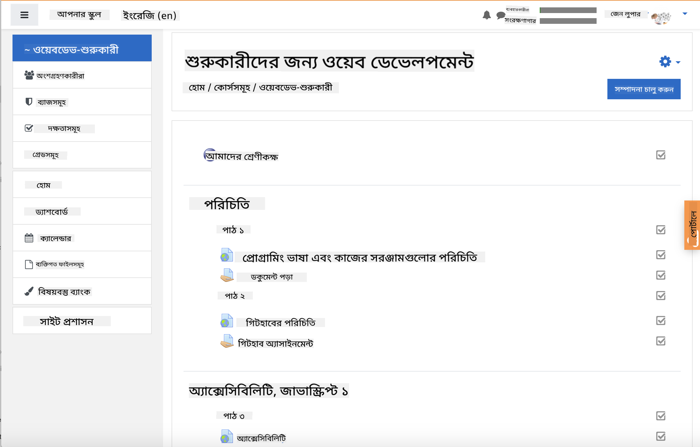
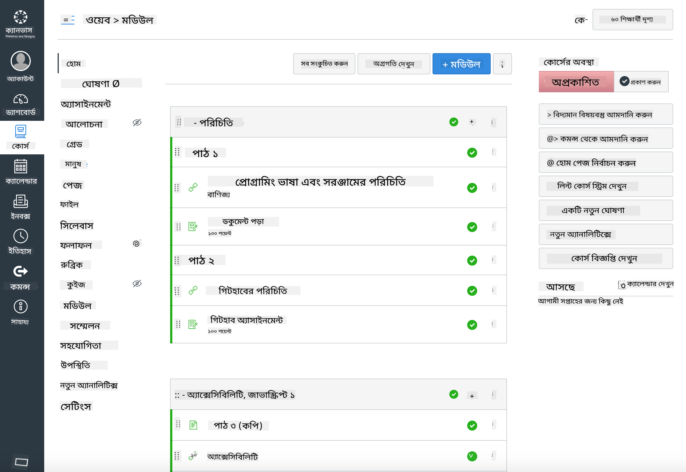

<!--
CO_OP_TRANSLATOR_METADATA:
{
  "original_hash": "75cb51f7ca9ea0b097ef4a1287e9290c",
  "translation_date": "2025-08-25T20:56:03+00:00",
  "source_file": "for-teachers.md",
  "language_code": "bn"
}
-->
## শিক্ষকদের জন্য

আপনি কি আপনার ক্লাসরুমে এই পাঠ্যক্রম ব্যবহার করতে চান? অনুগ্রহ করে নির্দ্বিধায় ব্যবহার করুন!

আসলে, আপনি এটি GitHub এর মাধ্যমেই ব্যবহার করতে পারেন GitHub Classroom ব্যবহার করে।

এটি করতে, এই রিপোজিটরি ফর্ক করুন। প্রতিটি পাঠের জন্য একটি রিপোজিটরি তৈরি করতে হবে, তাই আপনাকে প্রতিটি ফোল্ডার আলাদা রিপোজিটরিতে বের করতে হবে। এভাবে, [GitHub Classroom](https://classroom.github.com/classrooms) প্রতিটি পাঠ আলাদাভাবে নিতে পারবে।

এই [সম্পূর্ণ নির্দেশনা](https://github.blog/2020-03-18-set-up-your-digital-classroom-with-github-classroom/) আপনাকে ক্লাসরুম সেটআপ করার ধারণা দেবে।

## Moodle, Canvas বা Blackboard-এ ব্যবহার করা

এই পাঠ্যক্রম এই Learning Management Systems-এ ভালোভাবে কাজ করে! সম্পূর্ণ কন্টেন্টের জন্য [Moodle আপলোড ফাইল](../../../../../../../teaching-files/webdev-moodle.mbz) ব্যবহার করুন, অথবা কিছু কন্টেন্ট সহ [Common Cartridge ফাইল](../../../../../../../teaching-files/webdev-common-cartridge.imscc) চেষ্টা করুন। Moodle Cloud সম্পূর্ণ Common Cartridge এক্সপোর্ট সমর্থন করে না, তাই Moodle ডাউনলোড ফাইল ব্যবহার করা উত্তম যা Canvas-এ আপলোড করা যেতে পারে। এই অভিজ্ঞতা আরও উন্নত করতে আমরা কীভাবে সাহায্য করতে পারি তা আমাদের জানান।

> Moodle ক্লাসরুমে পাঠ্যক্রম

> Canvas-এ পাঠ্যক্রম

## রিপোজিটরি বর্তমান অবস্থায় ব্যবহার করা

আপনি যদি GitHub Classroom ব্যবহার না করে এই রিপোজিটরি বর্তমান অবস্থায় ব্যবহার করতে চান, সেটিও সম্ভব। আপনাকে আপনার শিক্ষার্থীদের সাথে যোগাযোগ করতে হবে কোন পাঠ একসাথে কাজ করতে হবে।

অনলাইন ফরম্যাটে (Zoom, Teams বা অন্য) আপনি কুইজের জন্য ব্রেকআউট রুম তৈরি করতে পারেন এবং শিক্ষার্থীদের শেখার জন্য প্রস্তুত করতে সাহায্য করতে পারেন। তারপর শিক্ষার্থীদের কুইজে আমন্ত্রণ জানান এবং নির্দিষ্ট সময়ে তাদের উত্তর 'issues' হিসেবে জমা দিতে বলুন। আপনি একই কাজ অ্যাসাইনমেন্টের জন্য করতে পারেন যদি শিক্ষার্থীরা একসাথে কাজ করতে চান।

যদি আপনি আরও ব্যক্তিগত ফরম্যাট পছন্দ করেন, তাহলে শিক্ষার্থীদের পাঠ্যক্রমটি পাঠ অনুযায়ী তাদের নিজস্ব GitHub রিপোজিটরিতে ফর্ক করতে বলুন, যা প্রাইভেট রিপোজিটরি হবে, এবং আপনাকে অ্যাক্সেস দিন। এরপর তারা কুইজ এবং অ্যাসাইনমেন্ট ব্যক্তিগতভাবে সম্পন্ন করতে পারে এবং আপনার ক্লাসরুম রিপোজিটরিতে issues-এর মাধ্যমে জমা দিতে পারে।

অনলাইন ক্লাসরুম ফরম্যাটে এটি কাজ করার অনেক উপায় আছে। আপনার জন্য কোনটি সবচেয়ে ভালো কাজ করে তা আমাদের জানান!

## আমাদের আপনার মতামত দিন!

আমরা চাই এই পাঠ্যক্রম আপনার এবং আপনার শিক্ষার্থীদের জন্য কার্যকর হোক। আমাদের সাথে [Teacher corner](https://github.com/microsoft/Web-Dev-For-Beginners/discussions/categories/teacher-corner)-এ সংযুক্ত হন এবং কোনো অনুরোধ, বাগ বা মতামতের জন্য একটি [**নতুন issue**](https://github.com/microsoft/Web-Dev-For-Beginners/issues/new/choose) খুলুন।

**অস্বীকৃতি**:  
এই নথিটি AI অনুবাদ পরিষেবা [Co-op Translator](https://github.com/Azure/co-op-translator) ব্যবহার করে অনুবাদ করা হয়েছে। আমরা যথাসাধ্য সঠিকতা নিশ্চিত করার চেষ্টা করি, তবে অনুগ্রহ করে মনে রাখবেন যে স্বয়ংক্রিয় অনুবাদে ত্রুটি বা অসঙ্গতি থাকতে পারে। মূল ভাষায় থাকা নথিটিকে প্রামাণিক উৎস হিসেবে বিবেচনা করা উচিত। গুরুত্বপূর্ণ তথ্যের জন্য, পেশাদার মানব অনুবাদ সুপারিশ করা হয়। এই অনুবাদ ব্যবহারের ফলে কোনো ভুল বোঝাবুঝি বা ভুল ব্যাখ্যা হলে আমরা দায়বদ্ধ থাকব না।