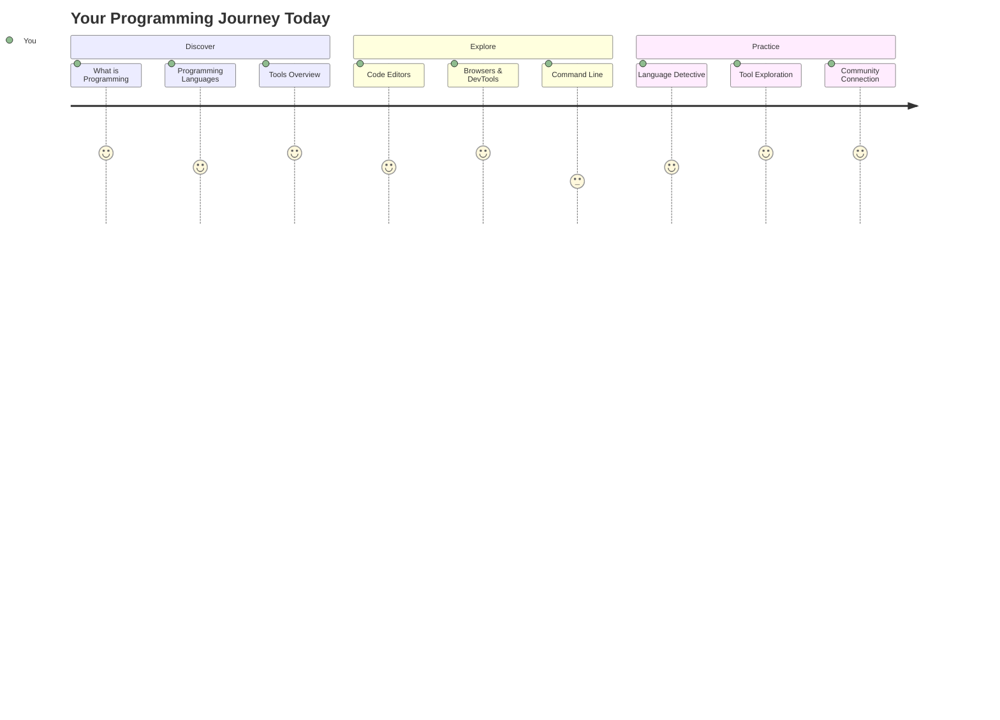
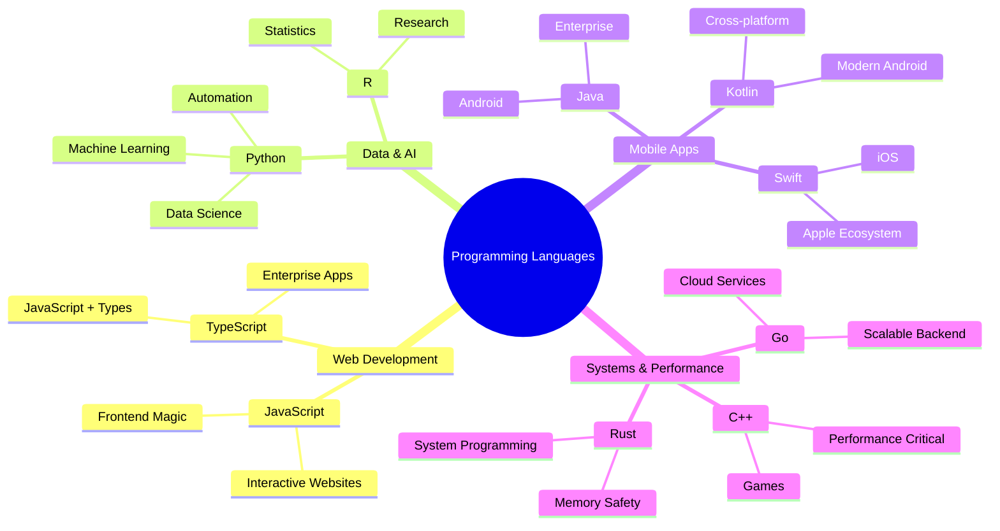
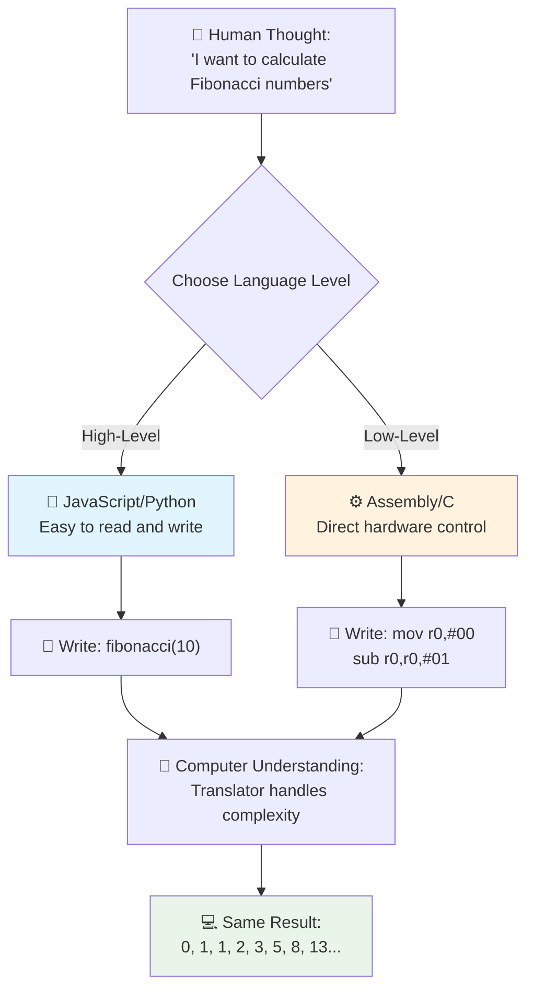
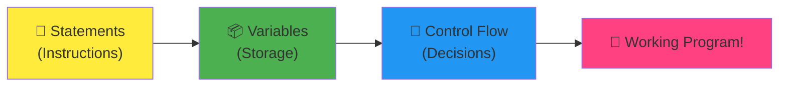
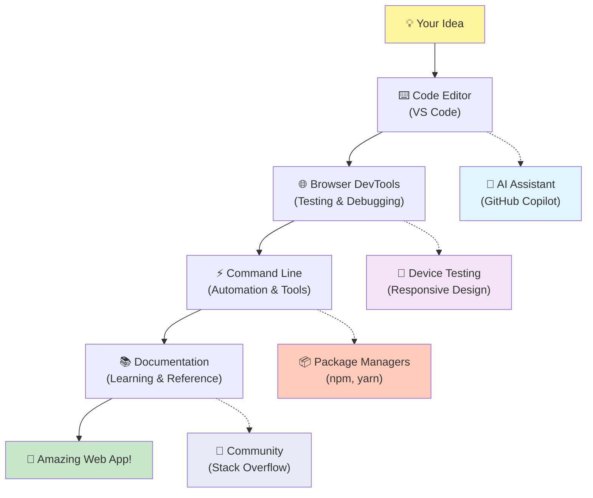
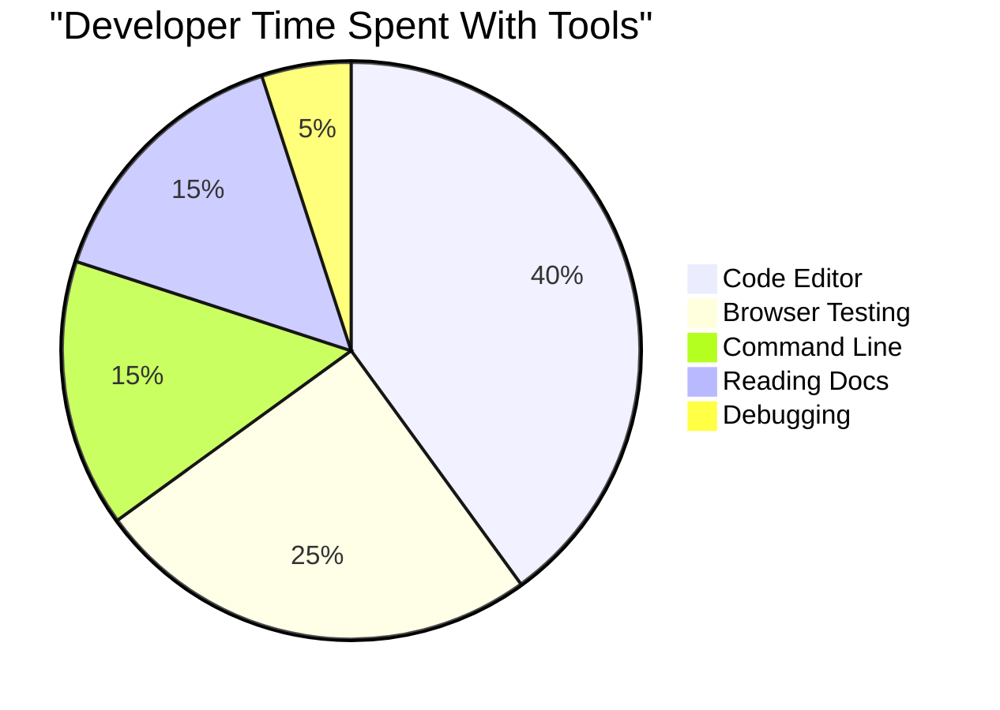
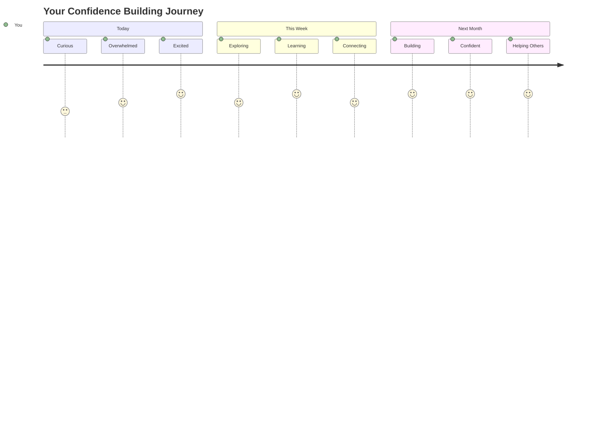

<!--
CO_OP_TRANSLATOR_METADATA:
{
  "original_hash": "d45ddcc54eb9232a76d08328b09d792e",
  "translation_date": "2025-11-04T00:01:01+00:00",
  "source_file": "1-getting-started-lessons/1-intro-to-programming-languages/README.md",
  "language_code": "br"
}
-->
# Introdução às Linguagens de Programação e Ferramentas Modernas para Desenvolvedores

Olá, futuro desenvolvedor! 👋 Posso te contar algo que ainda me dá arrepios todos os dias? Você está prestes a descobrir que programar não é apenas sobre computadores – é sobre ter superpoderes reais para dar vida às suas ideias mais malucas!

Sabe aquele momento em que você está usando seu aplicativo favorito e tudo simplesmente funciona perfeitamente? Quando você toca em um botão e algo absolutamente mágico acontece, fazendo você pensar "uau, como eles fizeram isso?" Bem, alguém como você – provavelmente sentado em sua cafeteria favorita às 2 da manhã com seu terceiro espresso – escreveu o código que criou essa mágica. E aqui está o que vai te surpreender: até o final desta lição, você não apenas entenderá como eles fizeram isso, mas estará ansioso para tentar você mesmo!

Olha, eu entendo totalmente se programar parece intimidante agora. Quando comecei, honestamente pensei que você precisava ser algum tipo de gênio da matemática ou ter programado desde os cinco anos de idade. Mas aqui está o que mudou completamente minha perspectiva: programar é exatamente como aprender a conversar em um novo idioma. Você começa com "olá" e "obrigado", depois aprende a pedir um café, e antes que perceba, está tendo discussões filosóficas profundas! Exceto que, neste caso, você está conversando com computadores, e honestamente? Eles são os parceiros de conversa mais pacientes que você já teve – nunca julgam seus erros e estão sempre prontos para tentar de novo!

Hoje, vamos explorar as ferramentas incríveis que tornam o desenvolvimento web moderno não apenas possível, mas seriamente viciante. Estou falando dos mesmos editores, navegadores e fluxos de trabalho que os desenvolvedores da Netflix, Spotify e do seu estúdio indie favorito usam todos os dias. E aqui está a parte que vai te fazer dançar de felicidade: a maioria dessas ferramentas profissionais e padrão da indústria são completamente gratuitas!


> Sketchnote por [Tomomi Imura](https://twitter.com/girlie_mac)



## Vamos ver o que você já sabe!

Antes de mergulharmos na parte divertida, estou curioso – o que você já sabe sobre esse mundo da programação? E olha, se você está olhando para essas perguntas pensando "Eu literalmente não faço ideia de nada disso", isso não é apenas ok, é perfeito! Isso significa que você está exatamente no lugar certo. Pense neste quiz como um aquecimento antes de começar – estamos apenas preparando os músculos do cérebro!

[Faça o quiz pré-aula](https://forms.office.com/r/dru4TE0U9n?origin=lprLink)

## A aventura que vamos embarcar juntos

Ok, estou genuinamente empolgado com o que vamos explorar hoje! Sério, eu gostaria de ver sua reação quando alguns desses conceitos fizerem sentido. Aqui está a jornada incrível que vamos fazer juntos:

- **O que é programação (e por que é a coisa mais incrível de todas!)** – Vamos descobrir como o código é literalmente a mágica invisível que alimenta tudo ao seu redor, desde aquele alarme que de alguma forma sabe que é segunda-feira até o algoritmo que escolhe as recomendações perfeitas para você no Netflix.
- **Linguagens de programação e suas personalidades incríveis** – Imagine entrar em uma festa onde cada pessoa tem superpoderes completamente diferentes e maneiras únicas de resolver problemas. É assim que o mundo das linguagens de programação é, e você vai adorar conhecê-las!
- **Os blocos fundamentais que fazem a mágica digital acontecer** – Pense nisso como o conjunto definitivo de LEGO criativo. Quando você entender como essas peças se encaixam, perceberá que pode literalmente construir qualquer coisa que sua imaginação sonhar.
- **Ferramentas profissionais que vão fazer você se sentir como se tivesse recebido uma varinha mágica** – Não estou sendo dramático aqui – essas ferramentas realmente vão fazer você se sentir como se tivesse superpoderes, e o melhor de tudo? São as mesmas que os profissionais usam!

> 💡 **Aqui está o ponto**: Nem pense em tentar memorizar tudo hoje! Por enquanto, eu só quero que você sinta aquela faísca de empolgação sobre o que é possível. Os detalhes vão grudar naturalmente enquanto praticamos juntos – é assim que o aprendizado real acontece!

> Você pode fazer esta lição no [Microsoft Learn](https://docs.microsoft.com/learn/modules/web-development-101/introduction-programming/?WT.mc_id=academic-77807-sagibbon)!

## Então, o que exatamente *é* programação?

Certo, vamos abordar a pergunta de um milhão de dólares: o que é programação, afinal?

Vou te contar uma história que mudou completamente minha forma de pensar sobre isso. Semana passada, eu estava tentando explicar para minha mãe como usar o controle remoto da nossa nova TV inteligente. Me peguei dizendo coisas como "Pressione o botão vermelho, mas não o botão vermelho grande, o botão vermelho pequeno à esquerda... não, sua outra esquerda... ok, agora segure por dois segundos, não um, não três..." Parece familiar? 😅

Isso é programação! É a arte de dar instruções incrivelmente detalhadas e passo a passo para algo que é muito poderoso, mas precisa que tudo seja explicado perfeitamente. Exceto que, em vez de explicar para sua mãe (que pode perguntar "qual botão vermelho?!"), você está explicando para um computador (que faz exatamente o que você diz, mesmo que o que você disse não seja exatamente o que você quis dizer).

Aqui está o que me surpreendeu quando aprendi isso: computadores são, na verdade, bem simples no fundo. Eles literalmente só entendem duas coisas – 1 e 0, que basicamente é "sim" e "não" ou "ligado" e "desligado". É isso! Mas aqui é onde fica mágico – não precisamos falar em 1s e 0s como se estivéssemos em Matrix. É aí que as **linguagens de programação** entram em cena. Elas são como ter o melhor tradutor do mundo que pega seus pensamentos perfeitamente normais de humano e os converte em linguagem de computador.

E aqui está o que ainda me dá arrepios todas as manhãs quando acordo: literalmente *tudo* digital na sua vida começou com alguém como você, provavelmente sentado de pijama com uma xícara de café, digitando código no laptop. Aquele filtro do Instagram que te deixa impecável? Alguém codificou isso. A recomendação que te levou à sua nova música favorita? Um desenvolvedor criou esse algoritmo. O aplicativo que ajuda você a dividir a conta do jantar com os amigos? Sim, alguém pensou "isso é chato, aposto que consigo resolver" e então... resolveu!

Quando você aprende a programar, não está apenas adquirindo uma nova habilidade – está se tornando parte dessa comunidade incrível de solucionadores de problemas que passam os dias pensando: "E se eu pudesse construir algo que tornasse o dia de alguém um pouco melhor?" Honestamente, existe algo mais legal do que isso?

✅ **Caça ao Fato Divertido**: Aqui está algo super legal para pesquisar quando tiver um momento livre – quem você acha que foi o primeiro programador de computadores do mundo? Vou te dar uma dica: pode não ser quem você está esperando! A história por trás dessa pessoa é absolutamente fascinante e mostra que programar sempre foi sobre resolver problemas criativos e pensar fora da caixa.

### 🧠 **Hora de Checar: Como Você Está Se Sentindo?**

**Tire um momento para refletir:**
- A ideia de "dar instruções para computadores" faz sentido para você agora?
- Consegue pensar em uma tarefa diária que gostaria de automatizar com programação?
- Quais perguntas estão surgindo na sua mente sobre esse mundo da programação?

> **Lembre-se**: É totalmente normal se alguns conceitos ainda parecerem confusos agora. Aprender a programar é como aprender um novo idioma – leva tempo para o cérebro construir essas conexões neurais. Você está indo muito bem!

## Linguagens de Programação São Como Diferentes Sabores de Magia

Ok, isso vai soar estranho, mas fique comigo – linguagens de programação são muito parecidas com diferentes tipos de música. Pense nisso: você tem jazz, que é suave e improvisado, rock que é poderoso e direto, clássico que é elegante e estruturado, e hip-hop que é criativo e expressivo. Cada estilo tem sua própria vibe, sua própria comunidade de fãs apaixonados, e cada um é perfeito para diferentes momentos e ocasiões.

As linguagens de programação funcionam exatamente da mesma forma! Você não usaria a mesma linguagem para criar um jogo divertido para celular que usaria para analisar grandes quantidades de dados climáticos, assim como você não tocaria death metal em uma aula de yoga (bem, na maioria das aulas de yoga! 😄).

Mas aqui está o que absolutamente me surpreende toda vez que penso nisso: essas linguagens são como ter o intérprete mais paciente e brilhante do mundo sentado ao seu lado. Você pode expressar suas ideias de uma forma que parece natural para o seu cérebro humano, e elas lidam com todo o trabalho incrivelmente complexo de traduzir isso para os 1s e 0s que os computadores realmente entendem. É como ter um amigo que é perfeitamente fluente em "criatividade humana" e "lógica de computador" – e eles nunca se cansam, nunca precisam de pausas para café e nunca te julgam por fazer a mesma pergunta duas vezes!

### Linguagens de Programação Populares e Seus Usos



| Linguagem | Melhor Para | Por Que É Popular |
|-----------|-------------|-------------------|
| **JavaScript** | Desenvolvimento web, interfaces de usuário | Roda em navegadores e alimenta sites interativos |
| **Python** | Ciência de dados, automação, IA | Fácil de ler e aprender, bibliotecas poderosas |
| **Java** | Aplicações empresariais, apps Android | Independente de plataforma, robusto para sistemas grandes |
| **C#** | Aplicações Windows, desenvolvimento de jogos | Forte suporte ao ecossistema Microsoft |
| **Go** | Serviços em nuvem, sistemas backend | Rápido, simples, projetado para computação moderna |

### Linguagens de Alto Nível vs. Baixo Nível

Ok, este foi honestamente o conceito que me deixou confuso quando comecei a aprender, então vou compartilhar a analogia que finalmente fez sentido para mim – e espero que ajude você também!

Imagine que você está visitando um país onde não fala o idioma, e precisa desesperadamente encontrar o banheiro mais próximo (todos já passamos por isso, certo? 😅):

- **Programação de baixo nível** é como aprender o dialeto local tão bem que você pode conversar com a avó vendendo frutas na esquina usando referências culturais, gírias locais e piadas internas que só alguém que cresceu lá entenderia. Super impressionante e incrivelmente eficiente... se você for fluente! Mas bastante esmagador quando você só está tentando encontrar um banheiro.

- **Programação de alto nível** é como ter aquele amigo local incrível que simplesmente entende você. Você pode dizer "Eu realmente preciso encontrar um banheiro" em português, e eles lidam com toda a tradução cultural e te dão direções de uma forma que faz sentido para sua mente não nativa.

Em termos de programação:
- **Linguagens de baixo nível** (como Assembly ou C) permitem que você tenha conversas incrivelmente detalhadas com o hardware real do computador, mas você precisa pensar como uma máquina, o que é... bem, digamos que é uma mudança mental bem grande!
- **Linguagens de alto nível** (como JavaScript, Python ou C#) permitem que você pense como um humano enquanto elas lidam com toda a linguagem da máquina nos bastidores. Além disso, elas têm comunidades incrivelmente acolhedoras cheias de pessoas que lembram como foi ser novo e realmente querem ajudar!

Adivinha quais eu vou sugerir que você comece? 😉 Linguagens de alto nível são como ter rodinhas de treinamento que você nunca realmente quer tirar porque tornam toda a experiência muito mais agradável!



### Deixe-me Mostrar Por Que Linguagens de Alto Nível São Muito Mais Amigáveis

Certo, estou prestes a mostrar algo que demonstra perfeitamente por que me apaixonei pelas linguagens de alto nível, mas primeiro – preciso que você me prometa uma coisa. Quando você vir o primeiro exemplo de código, não entre em pânico! É para parecer intimidante. Esse é exatamente o ponto que estou fazendo!

Vamos olhar para a mesma tarefa escrita em dois estilos completamente diferentes. Ambos criam o que é chamado de sequência de Fibonacci – é esse padrão matemático lindo onde cada número é a soma dos dois anteriores: 0, 1, 1, 2, 3, 5, 8, 13... (Curiosidade: você encontrará esse padrão literalmente em toda parte na natureza – espirais de sementes de girassol, padrões de pinhas, até na forma como as galáxias se formam!)

Pronto para ver a diferença? Vamos lá!

**Linguagem de alto nível (JavaScript) – Amigável para humanos:**

```javascript
// Step 1: Basic Fibonacci setup
const fibonacciCount = 10;
let current = 0;
let next = 1;

console.log('Fibonacci sequence:');
```

**O que este código faz:**
- **Declara** uma constante para especificar quantos números de Fibonacci queremos gerar
- **Inicializa** duas variáveis para acompanhar os números atuais e próximos na sequência
- **Define** os valores iniciais (0 e 1) que definem o padrão Fibonacci
- **Exibe** uma mensagem de cabeçalho para identificar nossa saída

```javascript
// Step 2: Generate the sequence with a loop
for (let i = 0; i < fibonacciCount; i++) {
  console.log(`Position ${i + 1}: ${current}`);
  
  // Calculate next number in sequence
  const sum = current + next;
  current = next;
  next = sum;
}
```

**Desmembrando o que acontece aqui:**
- **Percorre** cada posição na sequência usando um `for` loop
- **Exibe** cada número com sua posição usando formatação de template literal
- **Calcula** o próximo número de Fibonacci somando os valores atuais e próximos
- **Atualiza** nossas variáveis de acompanhamento para passar para a próxima iteração

```javascript
// Step 3: Modern functional approach
const generateFibonacci = (count) => {
  const sequence = [0, 1];
  
  for (let i = 2; i < count; i++) {
    sequence[i] = sequence[i - 1] + sequence[i - 2];
  }
  
  return sequence;
};

// Usage example
const fibSequence = generateFibonacci(10);
console.log(fibSequence);
```

**No código acima, nós:**
- **Criamos** uma função reutilizável usando sintaxe moderna de função de seta
- **Construímos** um array para armazenar a sequência completa em vez de exibir um por um
- **Usamos** indexação de array para calcular cada novo número a partir dos valores anteriores
- **Retornamos** a sequência completa para uso flexível em outras partes do programa

**Linguagem de baixo nível (ARM Assembly) – Amigável para computadores:**

```assembly
 area ascen,code,readonly
 entry
 code32
 adr r0,thumb+1
 bx r0
 code16
thumb
 mov r0,#00
 sub r0,r0,#01
 mov r1,#01
 mov r4,#10
 ldr r2,=0x40000000
back add r0,r1
 str r0,[r2]
 add r2,#04
 mov r3,r0
 mov r0,r1
 mov r1,r3
 sub r4,#01
 cmp r4,#00
 bne back
 end
```

Perceba como a versão em JavaScript se lê quase como instruções em inglês, enquanto a versão em Assembly usa comandos criptográficos que controlam diretamente o processador do computador. Ambos realizam exatamente a mesma tarefa, mas a linguagem de alto nível é muito mais fácil para humanos entenderem, escreverem e manterem.

**Diferenças principais que você notará:**
- **Legibilidade**: JavaScript usa nomes descritivos como `fibonacciCount`, enquanto Assembly usa rótulos criptográficos como `r0`, `r1`
- **Comentários**: Linguagens de alto nível incentivam comentários explicativos que tornam o código autoexplicativo.
- **Estrutura**: O fluxo lógico do JavaScript combina com a forma como os humanos pensam sobre problemas passo a passo.
- **Manutenção**: Atualizar a versão do JavaScript para diferentes requisitos é simples e direto.

✅ **Sobre a sequência de Fibonacci**: Esse padrão numérico absolutamente incrível (onde cada número é a soma dos dois anteriores: 0, 1, 1, 2, 3, 5, 8...) aparece literalmente *em todos os lugares* na natureza! Você o encontra nas espirais dos girassóis, nos padrões das pinhas, na curvatura das conchas de náutilo e até na forma como os galhos das árvores crescem. É impressionante como a matemática e o código podem nos ajudar a entender e recriar os padrões que a natureza usa para criar beleza!


## Os Blocos de Construção Que Fazem a Mágica Acontecer

Certo, agora que você viu como as linguagens de programação funcionam na prática, vamos analisar as peças fundamentais que compõem literalmente todos os programas já escritos. Pense nisso como os ingredientes essenciais da sua receita favorita – uma vez que você entender o que cada um faz, será capaz de ler e escrever código em praticamente qualquer linguagem!

Isso é como aprender a gramática da programação. Lembra quando você aprendeu na escola sobre substantivos, verbos e como formar frases? A programação tem sua própria versão de gramática e, honestamente, é muito mais lógica e indulgente do que a gramática do português! 😄

### Declarações: As Instruções Passo a Passo

Vamos começar com **declarações** – elas são como frases individuais em uma conversa com o seu computador. Cada declaração diz ao computador para fazer uma coisa específica, como dar instruções: "Vire à esquerda aqui", "Pare no semáforo vermelho", "Estacione naquele lugar."

O que eu adoro nas declarações é como elas geralmente são fáceis de ler. Veja só:

```javascript
// Basic statements that perform single actions
const userName = "Alex";                    
console.log("Hello, world!");              
const sum = 5 + 3;                         
```

**O que este código faz:**
- **Declara** uma variável constante para armazenar o nome de um usuário
- **Exibe** uma mensagem de saudação no console
- **Calcula** e armazena o resultado de uma operação matemática

```javascript
// Statements that interact with web pages
document.title = "My Awesome Website";      
document.body.style.backgroundColor = "lightblue";
```

**Passo a passo, o que está acontecendo:**
- **Modifica** o título da página que aparece na aba do navegador
- **Altera** a cor de fundo de todo o corpo da página

### Variáveis: O Sistema de Memória do Seu Programa

Ok, **variáveis** são, honestamente, um dos meus conceitos favoritos para ensinar porque elas são muito parecidas com coisas que você já usa todos os dias!

Pense na lista de contatos do seu celular por um momento. Você não memoriza o número de todo mundo – em vez disso, salva "Mãe", "Melhor Amigo" ou "Pizzaria Que Entrega Até 2h" e deixa o celular lembrar os números reais. Variáveis funcionam exatamente da mesma forma! Elas são como recipientes rotulados onde seu programa pode armazenar informações e recuperá-las mais tarde usando um nome que realmente faz sentido.

Aqui está o que é realmente legal: variáveis podem mudar enquanto seu programa está sendo executado (daí o nome "variável" – entendeu?). Assim como você pode atualizar o contato da pizzaria quando descobre um lugar ainda melhor, as variáveis podem ser atualizadas conforme seu programa aprende novas informações ou conforme as situações mudam!

Deixe-me mostrar como isso pode ser incrivelmente simples:

```javascript
// Step 1: Creating basic variables
const siteName = "Weather Dashboard";        
let currentWeather = "sunny";               
let temperature = 75;                       
let isRaining = false;                      
```

**Entendendo esses conceitos:**
- **Armazene** valores imutáveis em variáveis `const` (como o nome do site)
- **Use** `let` para valores que podem mudar ao longo do programa
- **Atribua** diferentes tipos de dados: strings (texto), números e booleanos (verdadeiro/falso)
- **Escolha** nomes descritivos que expliquem o que cada variável contém

```javascript
// Step 2: Working with objects to group related data
const weatherData = {                       
  location: "San Francisco",
  humidity: 65,
  windSpeed: 12
};
```

**No exemplo acima, nós:**
- **Criamos** um objeto para agrupar informações relacionadas ao clima
- **Organizamos** vários dados sob um único nome de variável
- **Usamos** pares chave-valor para rotular claramente cada informação

```javascript
// Step 3: Using and updating variables
console.log(`${siteName}: Today is ${currentWeather} and ${temperature}°F`);
console.log(`Wind speed: ${weatherData.windSpeed} mph`);

// Updating changeable variables
currentWeather = "cloudy";                  
temperature = 68;                          
```

**Vamos entender cada parte:**
- **Exibe** informações usando literais de template com a sintaxe `${}`
- **Acessa** propriedades de objetos usando notação de ponto (`weatherData.windSpeed`)
- **Atualiza** variáveis declaradas com `let` para refletir condições em mudança
- **Combina** várias variáveis para criar mensagens significativas

```javascript
// Step 4: Modern destructuring for cleaner code
const { location, humidity } = weatherData; 
console.log(`${location} humidity: ${humidity}%`);
```

**O que você precisa saber:**
- **Extrai** propriedades específicas de objetos usando atribuição por desestruturação
- **Cria** novas variáveis automaticamente com os mesmos nomes das chaves do objeto
- **Simplifica** o código evitando notação de ponto repetitiva

### Fluxo de Controle: Ensinando Seu Programa a Pensar

Ok, aqui é onde a programação fica absolutamente fascinante! **Fluxo de controle** é basicamente ensinar seu programa a tomar decisões inteligentes, exatamente como você faz todos os dias sem nem pensar nisso.

Imagine isso: hoje de manhã você provavelmente passou por algo como "Se estiver chovendo, vou pegar um guarda-chuva. Se estiver frio, vou vestir um casaco. Se eu estiver atrasado, vou pular o café da manhã e pegar um café no caminho." Seu cérebro naturalmente segue essa lógica de "se-então" dezenas de vezes por dia!

Isso é o que faz os programas parecerem inteligentes e vivos, em vez de apenas seguir um roteiro chato e previsível. Eles podem realmente olhar para uma situação, avaliar o que está acontecendo e responder de forma apropriada. É como dar ao seu programa um cérebro que pode se adaptar e fazer escolhas!

Quer ver como isso funciona lindamente? Deixe-me mostrar:

```javascript
// Step 1: Basic conditional logic
const userAge = 17;

if (userAge >= 18) {
  console.log("You can vote!");
} else {
  const yearsToWait = 18 - userAge;
  console.log(`You'll be able to vote in ${yearsToWait} year(s).`);
}
```

**O que este código faz:**
- **Verifica** se a idade do usuário atende ao requisito para votar
- **Executa** diferentes blocos de código com base no resultado da condição
- **Calcula** e exibe quanto tempo falta para a elegibilidade de voto, se menor de 18 anos
- **Fornece** feedback específico e útil para cada cenário

```javascript
// Step 2: Multiple conditions with logical operators
const userAge = 17;
const hasPermission = true;

if (userAge >= 18 && hasPermission) {
  console.log("Access granted: You can enter the venue.");
} else if (userAge >= 16) {
  console.log("You need parent permission to enter.");
} else {
  console.log("Sorry, you must be at least 16 years old.");
}
```

**Desmembrando o que acontece aqui:**
- **Combina** várias condições usando o operador `&&` (e)
- **Cria** uma hierarquia de condições usando `else if` para múltiplos cenários
- **Lida** com todos os casos possíveis com uma declaração final `else`
- **Fornece** feedback claro e acionável para cada situação diferente

```javascript
// Step 3: Concise conditional with ternary operator
const votingStatus = userAge >= 18 ? "Can vote" : "Cannot vote yet";
console.log(`Status: ${votingStatus}`);
```

**O que você precisa lembrar:**
- **Use** o operador ternário (`? :`) para condições simples de duas opções
- **Escreva** a condição primeiro, seguida por `?`, depois o resultado verdadeiro, depois `:`, e então o resultado falso
- **Aplique** esse padrão quando precisar atribuir valores com base em condições

```javascript
// Step 4: Handling multiple specific cases
const dayOfWeek = "Tuesday";

switch (dayOfWeek) {
  case "Monday":
  case "Tuesday":
  case "Wednesday":
  case "Thursday":
  case "Friday":
    console.log("It's a weekday - time to work!");
    break;
  case "Saturday":
  case "Sunday":
    console.log("It's the weekend - time to relax!");
    break;
  default:
    console.log("Invalid day of the week");
}
```

**Este código realiza o seguinte:**
- **Compara** o valor da variável com vários casos específicos
- **Agrupa** casos semelhantes (dias úteis vs. finais de semana)
- **Executa** o bloco de código apropriado quando um caso é encontrado
- **Inclui** um caso `default` para lidar com valores inesperados
- **Usa** declarações `break` para evitar que o código continue para o próximo caso

> 💡 **Analogia do mundo real**: Pense no fluxo de controle como ter o GPS mais paciente do mundo te dando direções. Ele pode dizer "Se houver trânsito na Rua Principal, pegue a rodovia. Se houver obras na rodovia, tente a rota panorâmica." Os programas usam exatamente o mesmo tipo de lógica condicional para responder inteligentemente a diferentes situações e sempre oferecer aos usuários a melhor experiência possível.

### 🎯 **Verificação de Conceitos: Domínio dos Blocos de Construção**

**Vamos ver como você está indo com os fundamentos:**
- Você consegue explicar a diferença entre uma variável e uma declaração com suas próprias palavras?
- Pense em um cenário do mundo real onde você usaria uma decisão "se-então" (como o exemplo de votação).
- Qual é uma coisa sobre lógica de programação que te surpreendeu?

**Rápido incentivo de confiança:**


✅ **O que vem a seguir**: Vamos nos divertir muito mergulhando mais fundo nesses conceitos enquanto continuamos essa jornada incrível juntos! Por enquanto, concentre-se em sentir a empolgação sobre todas as possibilidades incríveis que estão à sua frente. As habilidades e técnicas específicas vão se fixar naturalmente enquanto praticamos juntos – prometo que isso vai ser muito mais divertido do que você imagina!

## Ferramentas do Ofício

Certo, aqui é onde eu fico tão empolgado que mal consigo me conter! 🚀 Vamos falar sobre as ferramentas incríveis que vão fazer você se sentir como se tivesse acabado de receber as chaves de uma nave espacial digital.

Sabe como um chef tem aquelas facas perfeitamente equilibradas que parecem extensões de suas mãos? Ou como um músico tem aquele violão que parece cantar no momento em que o toca? Bem, os desenvolvedores têm nossa própria versão dessas ferramentas mágicas, e aqui está o que vai te deixar de queixo caído – a maioria delas é completamente gratuita!

Estou praticamente pulando na cadeira pensando em compartilhar isso com você porque elas revolucionaram completamente a forma como construímos software. Estamos falando de assistentes de codificação com inteligência artificial que podem ajudar a escrever seu código (não estou brincando!), ambientes na nuvem onde você pode construir aplicativos inteiros de literalmente qualquer lugar com Wi-Fi, e ferramentas de depuração tão sofisticadas que são como ter visão de raio-X para seus programas.

E aqui está a parte que ainda me dá arrepios: essas não são "ferramentas para iniciantes" que você vai superar. Estas são exatamente as mesmas ferramentas de nível profissional que desenvolvedores do Google, Netflix e daquele estúdio indie de aplicativos que você adora estão usando neste exato momento. Você vai se sentir como um verdadeiro profissional usando elas!



### Editores de Código e IDEs: Seus Novos Melhores Amigos Digitais

Vamos falar sobre editores de código – eles estão prestes a se tornar seus novos lugares favoritos para passar o tempo! Pense neles como seu santuário pessoal de codificação, onde você passará a maior parte do tempo criando e aperfeiçoando suas criações digitais.

Mas aqui está o que é absolutamente mágico sobre os editores modernos: eles não são apenas editores de texto sofisticados. Eles são como ter o mentor de codificação mais brilhante e solidário sentado ao seu lado 24 horas por dia, 7 dias por semana. Eles corrigem seus erros de digitação antes mesmo de você perceber, sugerem melhorias que fazem você parecer um gênio, ajudam você a entender o que cada pedaço de código faz, e alguns deles podem até prever o que você está prestes a digitar e oferecer para terminar seus pensamentos!

Eu me lembro quando descobri o auto-completar pela primeira vez – literalmente me senti vivendo no futuro. Você começa a digitar algo, e seu editor diz: "Ei, você estava pensando nesta função que faz exatamente o que você precisa?" É como ter um leitor de mentes como seu parceiro de codificação!

**O que torna esses editores tão incríveis?**

Os editores de código modernos oferecem uma impressionante variedade de recursos projetados para aumentar sua produtividade:

| Recurso | O que Faz | Por que Ajuda |
|---------|-----------|--------------|
| **Realce de Sintaxe** | Colore diferentes partes do código | Facilita a leitura e a identificação de erros |
| **Auto-completar** | Sugere código enquanto você digita | Acelera a codificação e reduz erros de digitação |
| **Ferramentas de Depuração** | Ajuda a encontrar e corrigir erros | Economiza horas de solução de problemas |
| **Extensões** | Adiciona recursos especializados | Personaliza o editor para qualquer tecnologia |
| **Assistentes de IA** | Sugere código e explicações | Acelera o aprendizado e a produtividade |

> 🎥 **Recurso em Vídeo**: Quer ver essas ferramentas em ação? Confira este [vídeo sobre Ferramentas do Ofício](https://youtube.com/watch?v=69WJeXGBdxg) para uma visão geral completa.

#### Editores Recomendados para Desenvolvimento Web

**[Visual Studio Code](https://code.visualstudio.com/?WT.mc_id=academic-77807-sagibbon)** (Gratuito)
- O mais popular entre os desenvolvedores web
- Excelente ecossistema de extensões
- Terminal integrado e integração com Git
- **Extensões indispensáveis**:
  - [GitHub Copilot](https://marketplace.visualstudio.com/items?itemName=GitHub.copilot) - Sugestões de código com IA
  - [Live Share](https://marketplace.visualstudio.com/items?itemName=MS-vsliveshare.vsliveshare) - Colaboração em tempo real
  - [Prettier](https://marketplace.visualstudio.com/items?itemName=esbenp.prettier-vscode) - Formatação automática de código
  - [Code Spell Checker](https://marketplace.visualstudio.com/items?itemName=streetsidesoftware.code-spell-checker) - Detecta erros de digitação no código

**[JetBrains WebStorm](https://www.jetbrains.com/webstorm/)** (Pago, gratuito para estudantes)
- Ferramentas avançadas de depuração e teste
- Auto-completar inteligente
- Controle de versão integrado

**IDEs Baseados na Nuvem** (Preços variados)
- [GitHub Codespaces](https://github.com/features/codespaces) - VS Code completo no navegador
- [Replit](https://replit.com/) - Ótimo para aprender e compartilhar código
- [StackBlitz](https://stackblitz.com/) - Desenvolvimento web full-stack instantâneo

> 💡 **Dica para Começar**: Comece com o Visual Studio Code – é gratuito, amplamente utilizado na indústria e tem uma enorme comunidade criando tutoriais e extensões úteis.


### Navegadores Web: Seu Laboratório Secreto de Desenvolvimento

Ok, prepare-se para ter sua mente completamente explodida! Sabe como você tem usado navegadores para rolar pelas redes sociais e assistir vídeos? Bem, acontece que eles têm escondido este incrível laboratório secreto de desenvolvimento o tempo todo, apenas esperando que você o descubra!

Toda vez que você clica com o botão direito em uma página da web e seleciona "Inspecionar Elemento", está abrindo um mundo oculto de ferramentas de desenvolvedor que são honestamente mais poderosas do que alguns softwares caros que eu costumava pagar centenas de reais. É como descobrir que sua cozinha comum estava escondendo um laboratório de chef profissional atrás de um painel secreto!
A primeira vez que alguém me mostrou as DevTools do navegador, eu passei umas três horas clicando em tudo e pensando "ESPERA, ELE FAZ ISSO TAMBÉM?!" Você literalmente pode editar qualquer site em tempo real, ver exatamente a velocidade de carregamento de tudo, testar como seu site fica em diferentes dispositivos e até depurar JavaScript como um verdadeiro profissional. É absolutamente incrível!

**Por que os navegadores são sua arma secreta:**

Quando você cria um site ou aplicativo web, precisa ver como ele se parece e se comporta no mundo real. Os navegadores não apenas exibem seu trabalho, mas também fornecem feedback detalhado sobre desempenho, acessibilidade e possíveis problemas.

#### Ferramentas de Desenvolvimento do Navegador (DevTools)

Os navegadores modernos incluem suítes de desenvolvimento completas:

| Categoria de Ferramenta | O que Faz | Exemplo de Uso |
|--------------------------|-----------|----------------|
| **Inspector de Elementos** | Visualizar e editar HTML/CSS em tempo real | Ajustar estilos e ver resultados imediatos |
| **Console** | Ver mensagens de erro e testar JavaScript | Depurar problemas e experimentar código |
| **Monitor de Rede** | Acompanhar o carregamento de recursos | Otimizar desempenho e tempos de carregamento |
| **Verificador de Acessibilidade** | Testar design inclusivo | Garantir que seu site funcione para todos os usuários |
| **Simulador de Dispositivos** | Visualizar em diferentes tamanhos de tela | Testar design responsivo sem vários dispositivos |

#### Navegadores Recomendados para Desenvolvimento

- **[Chrome](https://developers.google.com/web/tools/chrome-devtools/)** - DevTools padrão da indústria com documentação extensa
- **[Firefox](https://developer.mozilla.org/docs/Tools)** - Excelentes ferramentas para CSS Grid e acessibilidade
- **[Edge](https://docs.microsoft.com/microsoft-edge/devtools-guide-chromium/?WT.mc_id=academic-77807-sagibbon)** - Baseado no Chromium com recursos de desenvolvimento da Microsoft

> ⚠️ **Dica Importante de Teste**: Sempre teste seus sites em vários navegadores! O que funciona perfeitamente no Chrome pode parecer diferente no Safari ou Firefox. Desenvolvedores profissionais testam em todos os navegadores principais para garantir experiências consistentes para os usuários.

### Ferramentas de Linha de Comando: Seu Portal para Superpoderes de Desenvolvedor

Ok, vamos ter um momento completamente honesto sobre a linha de comando, porque quero que você ouça isso de alguém que realmente entende. Quando eu vi pela primeira vez – aquela tela preta assustadora com texto piscando – eu literalmente pensei: "Não, de jeito nenhum! Isso parece algo de um filme de hacker dos anos 80, e eu definitivamente não sou inteligente o suficiente para isso!" 😅

Mas aqui está o que eu gostaria que alguém tivesse me dito naquela época, e o que estou te dizendo agora: a linha de comando não é assustadora – na verdade, é como ter uma conversa direta com seu computador. Pense nisso como a diferença entre pedir comida por um aplicativo sofisticado com fotos e menus (que é legal e fácil) versus entrar no seu restaurante local favorito onde o chef sabe exatamente o que você gosta e pode preparar algo perfeito só com você dizendo "me surpreenda com algo incrível."

A linha de comando é onde os desenvolvedores vão para se sentir como verdadeiros magos. Você digita algumas palavras aparentemente mágicas (ok, são apenas comandos, mas parecem mágicos!), aperta enter, e BOOM – você criou estruturas inteiras de projetos, instalou ferramentas poderosas de todo o mundo ou implantou seu aplicativo na internet para milhões de pessoas verem. Depois que você experimenta esse poder pela primeira vez, é realmente viciante!

**Por que a linha de comando vai se tornar sua ferramenta favorita:**

Embora as interfaces gráficas sejam ótimas para muitas tarefas, a linha de comando se destaca em automação, precisão e velocidade. Muitas ferramentas de desenvolvimento funcionam principalmente por meio de interfaces de linha de comando, e aprender a usá-las de forma eficiente pode melhorar drasticamente sua produtividade.

```bash
# Step 1: Create and navigate to project directory
mkdir my-awesome-website
cd my-awesome-website
```

**O que este código faz:**
- **Cria** um novo diretório chamado "my-awesome-website" para seu projeto
- **Navega** para o diretório recém-criado para começar a trabalhar

```bash
# Step 2: Initialize project with package.json
npm init -y

# Install modern development tools
npm install --save-dev vite prettier eslint
npm install --save-dev @eslint/js
```

**Passo a passo, aqui está o que está acontecendo:**
- **Inicializa** um novo projeto Node.js com configurações padrão usando `npm init -y`
- **Instala** o Vite como uma ferramenta moderna de build para desenvolvimento rápido e builds de produção
- **Adiciona** o Prettier para formatação automática de código e o ESLint para verificação de qualidade de código
- **Usa** a flag `--save-dev` para marcar essas dependências como exclusivas de desenvolvimento

```bash
# Step 3: Create project structure and files
mkdir src assets
echo '<!DOCTYPE html><html><head><title>My Site</title></head><body><h1>Hello World</h1></body></html>' > index.html

# Start development server
npx vite
```

**No exemplo acima, nós:**
- **Organizamos** nosso projeto criando pastas separadas para código-fonte e recursos
- **Geramos** um arquivo HTML básico com estrutura de documento adequada
- **Iniciamos** o servidor de desenvolvimento do Vite para recarregamento ao vivo e substituição de módulos em tempo real

#### Ferramentas Essenciais de Linha de Comando para Desenvolvimento Web

| Ferramenta | Propósito | Por que Você Precisa |
|------------|-----------|----------------------|
| **[Git](https://git-scm.com/)** | Controle de versão | Acompanhar mudanças, colaborar com outros, fazer backup do seu trabalho |
| **[Node.js & npm](https://nodejs.org/)** | Runtime de JavaScript & gerenciamento de pacotes | Executar JavaScript fora dos navegadores, instalar ferramentas modernas de desenvolvimento |
| **[Vite](https://vitejs.dev/)** | Ferramenta de build & servidor de desenvolvimento | Desenvolvimento super rápido com substituição de módulos em tempo real |
| **[ESLint](https://eslint.org/)** | Qualidade de código | Encontrar e corrigir problemas automaticamente no seu JavaScript |
| **[Prettier](https://prettier.io/)** | Formatação de código | Manter seu código consistentemente formatado e legível |

#### Opções Específicas para Cada Plataforma

**Windows:**
- **[Windows Terminal](https://docs.microsoft.com/windows/terminal/?WT.mc_id=academic-77807-sagibbon)** - Terminal moderno e rico em recursos
- **[PowerShell](https://docs.microsoft.com/powershell/?WT.mc_id=academic-77807-sagibbon)** 💻 - Ambiente de script poderoso
- **[Command Prompt](https://docs.microsoft.com/windows-server/administration/windows-commands/?WT.mc_id=academic-77807-sagibbon)** 💻 - Linha de comando tradicional do Windows

**macOS:**
- **[Terminal](https://support.apple.com/guide/terminal/)** 💻 - Aplicativo de terminal embutido
- **[iTerm2](https://iterm2.com/)** - Terminal aprimorado com recursos avançados

**Linux:**
- **[Bash](https://www.gnu.org/software/bash/)** 💻 - Shell padrão do Linux
- **[KDE Konsole](https://docs.kde.org/trunk5/en/konsole/konsole/index.html)** - Emulador de terminal avançado

> 💻 = Pré-instalado no sistema operacional

> 🎯 **Caminho de Aprendizado**: Comece com comandos básicos como `cd` (mudar diretório), `ls` ou `dir` (listar arquivos) e `mkdir` (criar pasta). Pratique com comandos de fluxo de trabalho modernos como `npm install`, `git status` e `code .` (abre o diretório atual no VS Code). Conforme você se sentir mais confortável, naturalmente aprenderá comandos mais avançados e técnicas de automação.

### Documentação: Seu Mentor de Aprendizado Sempre Disponível

Ok, vou compartilhar um pequeno segredo que vai te fazer sentir muito melhor sobre ser iniciante: até os desenvolvedores mais experientes passam uma grande parte do tempo lendo documentação. E isso não é porque eles não sabem o que estão fazendo – na verdade, é um sinal de sabedoria!

Pense na documentação como ter acesso aos professores mais pacientes e experientes do mundo, disponíveis 24 horas por dia, 7 dias por semana. Está com um problema às 2 da manhã? A documentação está lá com um abraço virtual caloroso e exatamente a resposta que você precisa. Quer aprender sobre algum recurso novo e legal que todo mundo está comentando? A documentação está lá com exemplos passo a passo. Tentando entender por que algo funciona do jeito que funciona? Isso mesmo – a documentação está pronta para explicar de uma forma que finalmente faz sentido!

Aqui está algo que mudou completamente minha perspectiva: o mundo do desenvolvimento web avança incrivelmente rápido, e ninguém (eu quero dizer absolutamente ninguém!) mantém tudo memorizado. Já vi desenvolvedores seniores com mais de 15 anos de experiência pesquisarem sintaxes básicas, e sabe de uma coisa? Isso não é vergonhoso – é inteligente! Não se trata de ter uma memória perfeita; trata-se de saber onde encontrar respostas confiáveis rapidamente e entender como aplicá-las.

**Aqui está onde a verdadeira mágica acontece:**

Desenvolvedores profissionais passam uma parte significativa do tempo lendo documentação – não porque não sabem o que estão fazendo, mas porque o cenário do desenvolvimento web evolui tão rapidamente que se manter atualizado exige aprendizado contínuo. Uma boa documentação ajuda você a entender não apenas *como* usar algo, mas *por que* e *quando* usá-lo.

#### Recursos Essenciais de Documentação

**[Mozilla Developer Network (MDN)](https://developer.mozilla.org/docs/Web)**
- O padrão ouro para documentação de tecnologias web
- Guias abrangentes para HTML, CSS e JavaScript
- Inclui informações de compatibilidade entre navegadores
- Apresenta exemplos práticos e demos interativas

**[Web.dev](https://web.dev)** (por Google)
- Melhores práticas modernas de desenvolvimento web
- Guias de otimização de desempenho
- Princípios de acessibilidade e design inclusivo
- Estudos de caso de projetos reais

**[Documentação da Microsoft](https://docs.microsoft.com/microsoft-edge/#microsoft-edge-for-developers)**
- Recursos de desenvolvimento para o navegador Edge
- Guias de Progressive Web Apps
- Insights sobre desenvolvimento multiplataforma

**[Frontend Masters Learning Paths](https://frontendmasters.com/learn/)**
- Currículos de aprendizado estruturados
- Cursos em vídeo com especialistas da indústria
- Exercícios práticos de codificação

> 📚 **Estratégia de Estudo**: Não tente memorizar a documentação – em vez disso, aprenda a navegar por ela de forma eficiente. Salve nos favoritos as referências mais usadas e pratique usar as funções de busca para encontrar informações específicas rapidamente.

### 🔧 **Verificação de Domínio de Ferramentas: O que te interessa?**

**Tire um momento para refletir:**
- Qual ferramenta você está mais animado para experimentar primeiro? (Não há resposta errada!)
- A linha de comando ainda parece intimidante ou você está curioso sobre ela?
- Você consegue imaginar usar as DevTools do navegador para explorar os bastidores dos seus sites favoritos?



> **Insight divertido**: A maioria dos desenvolvedores passa cerca de 40% do tempo no editor de código, mas perceba quanto tempo é dedicado a testes, aprendizado e resolução de problemas. Programar não é apenas escrever código – é criar experiências!

✅ **Para pensar**: Aqui está algo interessante para refletir – como você acha que as ferramentas para construir sites (desenvolvimento) podem ser diferentes das ferramentas para projetar como eles se parecem (design)? É como a diferença entre ser um arquiteto que projeta uma casa bonita e o construtor que realmente a constrói. Ambos são cruciais, mas precisam de caixas de ferramentas diferentes! Esse tipo de pensamento realmente ajuda a ver o panorama geral de como os sites ganham vida.

## Desafio do Agente GitHub Copilot 🚀

Use o modo Agent para completar o seguinte desafio:

**Descrição:** Explore os recursos de um editor de código moderno ou IDE e demonstre como ele pode melhorar seu fluxo de trabalho como desenvolvedor web.

**Prompt:** Escolha um editor de código ou IDE (como Visual Studio Code, WebStorm ou um IDE baseado em nuvem). Liste três recursos ou extensões que ajudam você a escrever, depurar ou manter o código de forma mais eficiente. Para cada um, forneça uma breve explicação de como ele beneficia seu fluxo de trabalho.

---

## 🚀 Desafio

**Pronto para o seu primeiro caso, detetive?**

Agora que você tem essa base incrível, tenho uma aventura que vai te ajudar a ver como o mundo da programação é incrivelmente diverso e fascinante. E ouça – isso não é sobre escrever código ainda, então sem pressão! Pense em si mesmo como um detetive de linguagens de programação em seu primeiro caso emocionante!

**Sua missão, caso decida aceitá-la:**
1. **Torne-se um explorador de linguagens**: Escolha três linguagens de programação de universos completamente diferentes – talvez uma que construa sites, outra que crie aplicativos móveis e outra que analise dados para cientistas. Encontre exemplos da mesma tarefa simples escrita em cada linguagem. Prometo que você vai ficar absolutamente impressionado com o quão diferentes elas podem parecer enquanto fazem exatamente a mesma coisa!

2. **Descubra suas histórias de origem**: O que torna cada linguagem especial? Aqui está um fato interessante – cada linguagem de programação foi criada porque alguém pensou: "Sabe de uma coisa? Deve haver uma maneira melhor de resolver este problema específico." Você consegue descobrir quais eram esses problemas? Algumas dessas histórias são genuinamente fascinantes!

3. **Conheça as comunidades**: Veja como cada comunidade de linguagem é acolhedora e apaixonada. Algumas têm milhões de desenvolvedores compartilhando conhecimento e ajudando uns aos outros, outras são menores, mas incrivelmente unidas e solidárias. Você vai adorar ver as diferentes personalidades dessas comunidades!

4. **Siga sua intuição**: Qual linguagem parece mais acessível para você agora? Não se preocupe em fazer a escolha "perfeita" – apenas ouça seus instintos! Não há resposta errada aqui, e você sempre pode explorar outras mais tarde.

**Trabalho de detetive bônus**: Veja se consegue descobrir quais grandes sites ou aplicativos são construídos com cada linguagem. Garanto que você ficará surpreso ao saber o que alimenta o Instagram, Netflix ou aquele jogo móvel que você não consegue parar de jogar!

> 💡 **Lembre-se**: Você não está tentando se tornar um especialista em nenhuma dessas linguagens hoje. Você está apenas conhecendo o bairro antes de decidir onde quer se estabelecer. Vá com calma, divirta-se e deixe sua curiosidade te guiar!

## Vamos Celebrar o que Você Descobriu!

Uau, você absorveu tanta informação incrível hoje! Estou genuinamente animado para ver o quanto dessa jornada incrível ficou com você. E lembre-se – isso não é um teste onde você precisa acertar tudo. É mais como uma celebração de todas as coisas legais que você aprendeu sobre esse mundo fascinante no qual está prestes a mergulhar!

[Faça o quiz pós-aula](https://ff-quizzes.netlify.app/web/)
## Revisão e Autoestudo

**Tire um tempo para explorar e se divertir com isso!**

Você cobriu muita coisa hoje, e isso é algo para se orgulhar! Agora vem a parte divertida – explorar os tópicos que despertaram sua curiosidade. Lembre-se, isso não é tarefa de casa – é uma aventura!

**Aprofunde-se no que te empolga:**

**Coloque a mão na massa com linguagens de programação:**
- Visite os sites oficiais de 2-3 linguagens que chamaram sua atenção. Cada uma tem sua própria personalidade e história!
- Experimente alguns playgrounds de código online como [CodePen](https://codepen.io/), [JSFiddle](https://jsfiddle.net/) ou [Replit](https://replit.com/). Não tenha medo de experimentar – você não vai quebrar nada!
- Leia sobre como sua linguagem favorita surgiu. Sério, algumas dessas histórias de origem são fascinantes e vão te ajudar a entender por que as linguagens funcionam do jeito que funcionam.

**Fique confortável com suas novas ferramentas:**
- Baixe o Visual Studio Code, se ainda não fez isso – é gratuito e você vai adorar!
- Passe alguns minutos navegando no marketplace de Extensões. É como uma loja de aplicativos para seu editor de código!
- Abra as Ferramentas de Desenvolvedor do seu navegador e clique por aí. Não se preocupe em entender tudo – apenas familiarize-se com o que está lá.

**Participe da comunidade:**
- Siga algumas comunidades de desenvolvedores no [Dev.to](https://dev.to/), [Stack Overflow](https://stackoverflow.com/) ou [GitHub](https://github.com/). A comunidade de programação é incrivelmente acolhedora para iniciantes!
- Assista a alguns vídeos de programação para iniciantes no YouTube. Há muitos criadores incríveis que se lembram de como é estar começando.
- Considere participar de encontros locais ou comunidades online. Acredite, desenvolvedores adoram ajudar iniciantes!

> 🎯 **Ouça, aqui está o que eu quero que você lembre**: Não se espera que você se torne um mestre em programação da noite para o dia! Agora, você está apenas conhecendo este mundo incrível do qual está prestes a fazer parte. Vá com calma, aproveite a jornada e lembre-se – todo desenvolvedor que você admira já esteve exatamente onde você está agora, sentindo-se empolgado e talvez um pouco sobrecarregado. Isso é totalmente normal e significa que você está no caminho certo!


## Tarefa

[Reading the Docs](assignment.md)

> 💡 **Um pequeno empurrão para sua tarefa**: Eu adoraria ver você explorar algumas ferramentas que ainda não abordamos! Pule os editores, navegadores e ferramentas de linha de comando que já discutimos – existe todo um universo incrível de ferramentas de desenvolvimento esperando para ser descoberto. Procure por aquelas que são ativamente mantidas e têm comunidades vibrantes e úteis (essas tendem a ter os melhores tutoriais e as pessoas mais solidárias quando você inevitavelmente ficar preso e precisar de uma mão amiga).

---

## 🚀 Sua Linha do Tempo na Jornada de Programação

### ⚡ **O que você pode fazer nos próximos 5 minutos**
- [ ] Adicione aos favoritos os sites de 2-3 linguagens de programação que chamaram sua atenção
- [ ] Baixe o Visual Studio Code, se ainda não fez isso
- [ ] Abra as DevTools do seu navegador (F12) e clique por aí em qualquer site
- [ ] Participe de uma comunidade de programação (Dev.to, Reddit r/webdev ou Stack Overflow)

### ⏰ **O que você pode realizar nesta hora**
- [ ] Complete o quiz pós-aula e reflita sobre suas respostas
- [ ] Configure o VS Code com a extensão GitHub Copilot
- [ ] Experimente um exemplo de "Hello World" em 2 linguagens de programação diferentes online
- [ ] Assista a um vídeo "Um dia na vida de um desenvolvedor" no YouTube
- [ ] Comece sua investigação sobre linguagens de programação (do desafio)

### 📅 **Sua aventura de uma semana**
- [ ] Complete a tarefa e explore 3 novas ferramentas de desenvolvimento
- [ ] Siga 5 desenvolvedores ou contas de programação nas redes sociais
- [ ] Experimente criar algo pequeno no CodePen ou Replit (mesmo que seja só "Olá, [Seu Nome]!")
- [ ] Leia um post de blog de um desenvolvedor sobre a jornada dele na programação
- [ ] Participe de um encontro virtual ou assista a uma palestra sobre programação
- [ ] Comece a aprender a linguagem escolhida com tutoriais online

### 🗓️ **Sua transformação de um mês**
- [ ] Construa seu primeiro projeto pequeno (mesmo uma página simples conta!)
- [ ] Contribua para um projeto de código aberto (comece com correções de documentação)
- [ ] Mentore alguém que está começando sua jornada de programação
- [ ] Crie seu site de portfólio de desenvolvedor
- [ ] Conecte-se com comunidades locais de desenvolvedores ou grupos de estudo
- [ ] Comece a planejar seu próximo marco de aprendizado

### 🎯 **Reflexão Final**

**Antes de seguir em frente, tire um momento para celebrar:**
- Qual foi uma coisa sobre programação que te empolgou hoje?
- Qual ferramenta ou conceito você quer explorar primeiro?
- Como você se sente ao começar essa jornada de programação?
- Qual pergunta você gostaria de fazer a um desenvolvedor agora?



> 🌟 **Lembre-se**: Todo especialista já foi um iniciante. Todo desenvolvedor sênior já se sentiu exatamente como você agora – empolgado, talvez um pouco sobrecarregado, e definitivamente curioso sobre o que é possível. Você está em ótima companhia, e essa jornada vai ser incrível. Bem-vindo ao maravilhoso mundo da programação! 🎉

---

**Aviso Legal**:  
Este documento foi traduzido utilizando o serviço de tradução por IA [Co-op Translator](https://github.com/Azure/co-op-translator). Embora nos esforcemos para garantir a precisão, esteja ciente de que traduções automatizadas podem conter erros ou imprecisões. O documento original em seu idioma nativo deve ser considerado a fonte autoritativa. Para informações críticas, recomenda-se a tradução profissional humana. Não nos responsabilizamos por quaisquer mal-entendidos ou interpretações incorretas decorrentes do uso desta tradução.